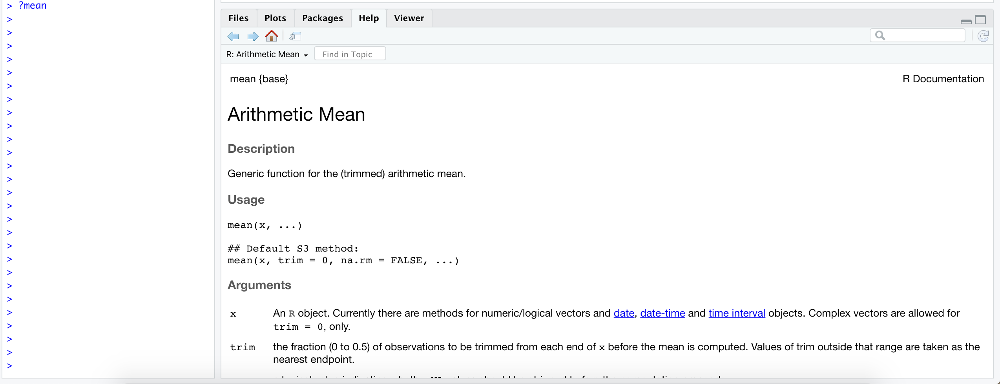
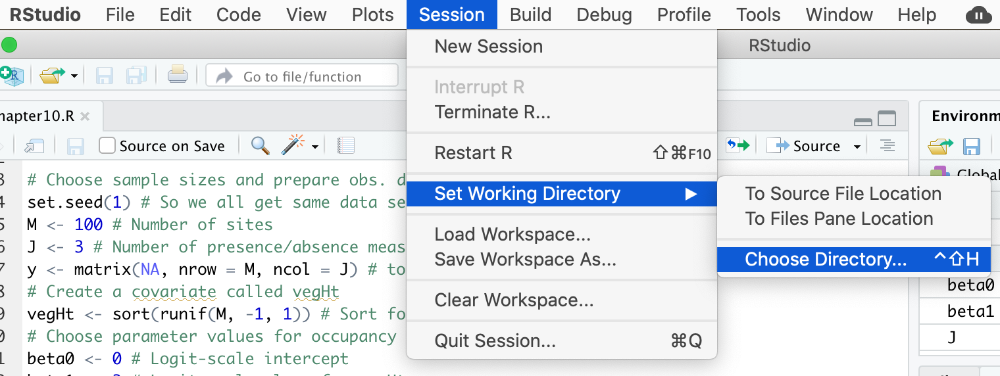
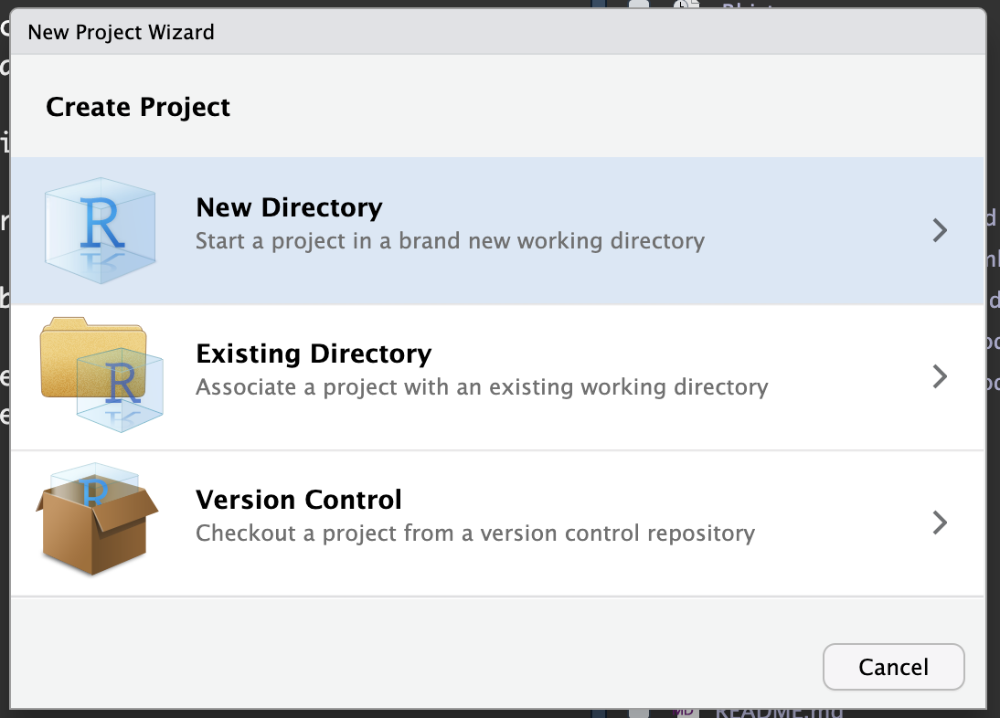

# An intro to the R programming language

## What is R and why use R?

**R** is a very powerful statistical programming language that is used broadly by researchers around the world.  **R** is an attractive programming language because it is free, open source, and platform independent.  With all the libraries that are available (and those that are in rapid development), it is quickly becoming a one-stop shop for all your analysis needs.  Most academic statisticians now use **R**, which has allowed for greater sharing of **R** code or packages to implement their recommended methods.  One of the very first things academics often ask when hiring someone is simply, "Can you describe your **R** or statistical programming experience?"  It is now critical to have this background to be competitive for scientific (and many other) positions. 

Among the reasons to use **R** you have:  

1. It's free – open source! If you are a teacher or a student, the benefits are obvious.
2. It runs on a variety of platforms including Windows, Unix and MacOS.
3. It provides an unparalleled platform for programming new statistical methods in an easy and straightforward manner.
4. It contains advanced statistical routines not yet available in other software.
5. New add-on “packages” are being created and updated constantly.
6. It has state-of-the-art graphics capabilities.


**R** does have a steep learning curve that can often be intimidating to new users, particularly those without prior coding experience.  While this can be very frustrating in the initial stages, learning **R** is like learning a language where proficiency requires practice and continual use of the program.

Our advice is to push yourself to use this tool in everything you do.  At first, **R** will not be the easiest or quickest option.  With persistence, however, you will see the benefit of **R** and continue to find new ways to use it in your work.

## R or RStudio? How to get them?

**R** is available for Linux, MacOS X, and Windows (95 or later) platforms. Software can be downloaded from one of the [Comprehensive R Archive Network](https://cran.r-project.org/) (CRAN) mirror sites. Once installed, **R** will open a console where you run code. You can also work on a script file, where you can write and save your work, and other windows that will show up on demand such as the plot tab (Fig. 1). 


**RStudio** is an enterprise-ready professional software tool that integrates with **R**.  It has some nice features beyond the normal **R** interface, which many users feel it is easier to use than **R** (Fig. 2). Once you have installed **R**, you should also download and install [RStudio](https://www.rstudio.com/products/rstudio/download/).  For this course, we will work exclusively in *RStudio*.


## Getting Help

One of the most useful commands in **R** is `?`.  At the command prompt (signified by `>` in your Console window), type `?` followed by any command and you will be prompted with a help tab for that command (e.g., `?mean` Fig. 3). You can also search through the help tab directly by searching functions on the search bar. 



The internet also contains a vast quantity of useful information.  There are blogs, mailing lists, and various websites (e.g., https://stackoverflow.com/) dedicated to providing information about **R**, its packages, and potential error messages that you may encounter (among other things).  The trick is usually determining the key terms to limit your search.  I generally start any web-based search with **"R-Cran"**, which limits and focuses the search.  Using "**R**" as part of your key terms does not, by itself, limit the search.

## Basic R concepts

There are a few concepts that are important to keep in mind before you start coding. The fact that **R** is a programming language may deter some users who think “I can't program". This should not be the case for two reasons. First, **R** is an interpreted language, not a compiled one, meaning that all commands typed on the keyboard are directly executed without requiring you to build a complete program like in most computer languages (C, Pascal, . . . ). Second, **R**'s syntax is very simple and intuitive. For instance, a linear regression can be done with the command `lm(y ~ x)` which means fitting a linear model with y as the response and x as a predictor.

In **R**, in order to be executed, a function always needs to be written with parentheses, even if there is nothing within them (e.g., `ls()`). If you type the name of a function without parentheses, **R** will display the content of the function.

When **R** is running, variables, data, functions, results, etc..., are stored in the active memory of the computer in the form of objects that you assign a name.The user can do actions on these objects with operators (arithmetic, logical, comparison, . . . ) and functions (which are themselves objects).

The name of an object must start with a letter (A-Z or a-z) and can be followed by letters, digits (0-9), dots (.), and underscores (_). 

When referring to the directory of a folder or a data file, **R** uses forward slash "/". You need to pay close attention to the direction of the slash if you copy a file path or directory from a Windows machine. 

It is also important to know that **R** discriminates between uppercase and lowercase letters in the names of objects, so that x and X can name two distinct objects (even under Windows).

***

## Starting with R

### Setting your working directory

Like in many other programs, you should start your session by defining your working directory - the folder where you will work. This will be the location on your computer where any files you save will be located.  To determine your current working directory, type: 

```{r, eval = F}
getwd()
```

Use `setwd()` to change or set a new working directory. For instance, you can set your working directory to be in your Documents folder on the C: drive, or in any folder you prefer.

```{r, eval = F}
setwd("C:/Documents/R_Practice")
```

In *RStudio*, you can do some basic operations, such as setting your working directory, using the point-and-click interface: Session > Set Working Directory > Choose Directory ... as shown in Fig. 4.



You can also work with **R projects**. R projects have the advantage that they enhance organization, collaboration, and reproducibility in R-based work by providing a structured and isolated workspace for your projects. They contribute to a more efficient and transparent workflow, particularly when working on multiple projects or collaborating with others.

The main advantage is that R Projects create a dedicated workspace for your R-related work, keeping all files, scripts, data, and outputs within a well-defined directory. This isolation helps avoid conflicts between projects and ensures a clean environment for each project. R projects use relative paths, allowing you to refer to files and directories within the project without specifying the full path. This enhances portability and makes it easier to share your project with others.

To start a new R Project click File > New Project or directly click on the R Project icon and follow the directions. You can set up your new project on a new folder or an existing folder.



## **R** Fundamentals 
### Data Types

There are four fundamental data types in **R** that you will work with: 

1. Character
2. Numeric
3. Integer
4. Logical

You can check the data type of an object using the function `class()`. To convert between data types you can use: `as.integer()`,  `as.numeric()`, `as.logical()`, `as. character()`.

For instance:
```{r}
city <- 'Nairobi'
class(city)
```
```{r}
number <- 3
class(number)
```
```{r}
Integer <- as.integer(number)
class(Integer)
```
```{r}
logical <- 3 > 5
logical
```

### Assigning data to objects
Since **R** is a programming language, we can store information as objects to avoid unnecessary repetition.  *Note again that values are case sensitive; 'x' is not the same as 'X'!*

```{r, eval=F}
city <- "front royal"
summary(city)

number <- 2
summary(number)

character <- as.character(2)
```

Data are very often stored in different folders to maintain an organizational pattern in your projects. In those cases, it is not necessary to re-set the working directory every time we want to import files to **R** that are stored in different folders, as long as these folders are within the root directory you have previously set. For instance, let's say you have a table stored in a folder called *data*, which is a subfolder within your root working directory *(C:/Documents/R_Practice)*. You can point to the *data* folder when reading the table as in the example below:

```{r, eval=F}
table <- read.csv(file="data/TheDataIWantToReadIn.csv", header=TRUE) # read a csv table stored in the data folder
```

Note that because *data* is a subfolder in your root directory, you do not need to provide the complete directory information when reading the table **"data/TheDataIWantToReadIn.csv"**. You can always provide the full directory of a data file stored on your local drive to avoid confusion. 

### Special characters

The # character is used to add comments to your code. # indicates the beginning of a comment and everything after # on a line will be ignored and not run as code.  Adding comments to your code is considered good practice because it allows you to describe in plain language (for yourself or others) what your code is doing.

```{r}
#This is a comment
```

The semicolon (;) defines a line continuation character so that you can write different commands on the same line of code.

```{r}
a <- 3; b <- 6; c <- a+b
a
b
c
```

## R Data Structure

### Vectors

Vectors are a basic data structure in **R**.  They contain a sequence of data and can contain characters, numbers, or be TRUE/FALSE values.  *Remember: If you are unsure or need help, use the help function (e.g., `help(seq)` or `?seq`)*.  Below are several ways to create vectors in **R**.

```{r vectors}
1:20
c(1,2,3,4,5)
seq(0,100,by=10)
rep(1:5,5)
rep("A rolling stone gathers no moss",4)
```

#### Extract subset of values from a vector using [] notation


```{r Values}
x <- 1:10
y <- c(1.5, 9, 3.46, 12.2)
```

To see only part (i.e., a subset) of the data stored in a vector, you need to "ask" **R** to extract the information you want using square brackets. Most commonly, you will indicate in square brackets the position of the data you want to extract (from beginning of the vector [1] to the Nth slot in the vector [n]).  If you only wanted to see the first 5 values of 'x', how would you do that?  Or only the 2nd and 4th element of y?  What if you wanted to see all the records in `y`, except for the 2nd and 3rd records? There are more ways to use notation to select subsets of data, which we will cover in more detail below. 

```{r print}
x
(x <- 1:10)
x[1:5]
y[c(2,4)]
y[-c(2,3)]
```


### Matrices and Dataframes

Matrices and dataframes are common ways to store tabular data.  Understanding how to manipulate them is important to be able to conduct more complex analyses.  Both matrices and dataframes are composed of rows and columns.  The main difference between matrices and dataframes is that dataframes can contain many different classes of data (numeric, character, etc.), while matrices can only contain a single class.

Create a matrix with 4 rows and 5 columns using the data from `x` above.  Consult the help (e.g., `help(matrix)` or `?matrix`) to determine the syntax required.

``` {r Matrix1}
test_matrix <- matrix(data = x, nrow = 4, ncol = 5)
test_matrix
# Note, I can assign any name to an object that I create.  Generally it is best to name things in a way that is meaningful, but we'll have some fun here!
superman <- matrix(data = x, nrow = 4, ncol = 5)
```


#### Subset of Matrices and Dataframes
Now, if we wanted to reference any value in the matrix, we could do so with matrix notation.  The first value in matrix notation references the row and the second value references the column.  COMMIT THIS TO MEMORY!  I remember this by thinking **R**oman **C**atholic.  So, if you wanted to view only the value in the 1st row, 5th column, you'd type:

``` {r Matrix notation}
#test_matrix(row,column)
test_matrix[1,5]
```

In addition to using positive integers to indicate the exact location of the subset of data we want to extract, you can also use other notation to indicate subsets of data that you want to include or exclude. You can use: negative integers (to exclude data at a specific location), zero (to create empty objects with consistent format), blank spaces (to select the entire row/column), logical values (to select the data associated with TRUE values), or names (to select specific columns or rows by their names). Try to understand how each type of notation works!


For example, what if you wanted to view all the values in the 5th column?  This literally says, extract all rows but only the 5th column from the object called test_matrix.

``` {r Matrix notation2}
test_matrix[,5]
```

What about the 4th row? 

``` {r Matrix notation2b}
test_matrix[4,]
```

What if we wanted to view the values in the 3rd row, but only the 2nd and 4th columns?

``` {r Matrix notation2c}
test_matrix[3,c(2,4)]
```

What happens to the matrix if we append a character field?  Use the `cbind()` (column bind) command to bind a new column, called 'countries'.  Note that I am not changing the contents of test_matrix.  Can you figure out how to do a row bind (hint: use `rbind()`) 

``` {r Matrix notation3}
countries <- c("United States", "Pakistan", "Ireland", "China")
cbind(test_matrix,countries)

#Note that I am not changing/overwriting the contents of test_matrix.  I could, but I'd have to change my code to
#test_matrix <- cbind(test_matrix,countries)
```

Why is everything inside the table now enclosed in quotes?  Recall what we said about matrices only containing one data type.  What happens if I coerce this to a dataframe?

``` {r Dataframe}
test_dataframe <- data.frame(test_matrix,countries)
test_dataframe
# Have I changed the file type?
class(test_dataframe)
```

Can I rename the column headings?

``` {r Dataframe rename}
names(test_dataframe) <- c("Val1", "Val2", "Val3", "Val4", "Val5", "Countries")
test_dataframe
# Also see the colnames() function
```

Can I use the same matrix notation to reference a particular row and column?  Are there other ways to reference a value?

``` {r Dataframe ref}
test_dataframe[3,5]
test_dataframe[,5]
test_dataframe$Val5[3]
test_dataframe$Val5
test_dataframe[,"Val5"]
```

You can also use some very simple commands to determine the size of dataframes or matrices.

``` {r Dataframe dims}
nrow(test_dataframe)
ncol(test_dataframe)
dim(test_dataframe)
```

You can delete individual objects to clear your working directory (`rm(dataset)`), or start every script with the following command to make sure you are starting fresh (this is good programming practice):

```{r}
#rm(list=ls())
```

## Functions

**R** functions can be defined as a collection of arguments structured together for carrying out a definite task. Functions have optional input and output arguments that return a value. Custom functions can be easily constructed in **R**. Most often, however, we will use built-in functions within base packages or other downloadable packages.

Most functions have optional arguments or are given default values (in the function's help document, under the 'Usage' section, the optional arguments are given a default value following the "=" symbol). When you don't specify the optional arguments, they will take the default values. Functions normally can be called using the following format:
function_name(input_data, argument1, argument2.)

```{r}
print(2+2)
x <- matrix(1:10, 5, 2)
x
y <- matrix(1:5)
y
df.example <- cbind(x, y)
df.example
```

*?function_name*  can load the function help file.  Also note that any functions in non-base packages will require installing and loading that package. 

Here, for example, we install and load package named "ggplot2" that we will use for data visualization.

```{r, eval=F}
install.packages("ggplot2")
library(ggplot2)
```

### Pre-existing Functions

**R** also contains many pre-existing functions in the base software.  Numeric functions include `sum()`, `mean()`, `sd()`, `min()`, `max()`, `median()`, `range()`, `quantile()`, or `summary()`.  Try a few of these on the numeric vectors you have created.

``` {r Vector functions}
sum(x)
summary(x)
range(y)
```

### Calculations & Arithmetic Operators

**R** can be used to perform basic calculations and report the results back to the user.

```{r calculations}
4+2
6*8
(842-62)/3
```

Exponentiation: ^
```{r}
2^3
```

Max and Min: max(), min()
```{r}
vector_numbers <- c(2, 3, 4, 10)
max(vector_numbers) 
min(vector_numbers)
```

> Can you calculate the square root and then subtract 5 for each element in vector_number?

### Relational Operators
<,>, =, !=, >=, <=, 
Evaluate a conditional expression and return TRUE or FALSE

```{r}
3 > max(c(2,3,4,5))
```

## Loops

The for loop is used to iterate over a sequence (numeric vector, list, or other iterable objects). Loops are very important to perform opperations and especial building blocks of many advanced models.

Here is a simple for loop that print numbers 1 to 5. As you can see, i is the element in which the loop is iterating. It can take a value of 1 to 5, and the loop ends when it reaches the last element of the sequence.

```{r}
for (i in 1:5) {
  print(i)
}

```

But the loop can iterate not just on numbers, but also lists.

```{r}
my_list <- c("apple", "orange", "banana")
for (fruit in my_list) {
  print(fruit)
}
```

We can create a vector from which we will add 5 to each element and save it in a new vector. For this, we first need to create an empty vector where we will save the new numbers. Note how we use **[]** to access the elements in the **i** positions.

```{r}
vector <- c(2,3,4,5,2) #Data vector
newdata <- NULL #Vector to store output
for (i in 1:length(vector)){
  newdata[i] <- vector[i] + 5
}
newdata
```

Finally, we can nest loops. A loop inside a loop. Make sure you understand dimensions before trying to understand the nested loop.

```{r}
vector <- c(1,2,3,4,5) #Data vector
newdata <- matrix(NA, 5,5) #Vector to store output
for (i in 1:5) {
  for (j in 1:5) {
    newdata[i,j] <- vector[i] * vector[j]
  }
}
newdata
```

## Installing SWIRL

A good way to learn more about R is to use SWIRL. This is a user-generated program (also called a **package** or **library**) for learning how to code in **R**.  To access this, you must first install the package so it is accessible.  In the Console window (bottom left), type the following and press ENTER:

```{r install, eval = F}
install.packages("swirl")

# Data can also be installed locally if you've downloaded the zip file to your hard drive
#install.packages("yourzip.tar.gz", repos=NULL)
```

This may take a little while, but when the stop sign in the upper right of the console window is gone, you can proceed. For any package you install in **R**, you will also need to turn them on before using them. You can do this with the `require()` or `library()` functions. Type this now: 

```{r install2, message=FALSE, warning = FALSE}
library(swirl)
```

*Note: You may be prompted to select a "mirror" from which to download the package. If this is the case, it is recommended that you choose the mirror that is geographically closest to you.*

To install the lesson, you will need to use:

```{r install3, eval = F}
install_from_swirl("R Programming")
```

*Find out more about other courses, and other download options here: https://github.com/swirldev/swirl_courses*

### SWIRL Lessons

There are many lessons within **R**.  Once SWIRL is loaded (below), you will be given the option of which lessons to complete.  Some of the core lessons can be found in the initial section labeled **R Programming** (estimated time to compete required lessons is about 2 hours).  We recommend to start with the following lessons:

  1. **Basic Building Blocks (10 min)**
  2. **Workspace and Files (15 min)**
  3. **Sequences of Numbers (5 min)**
  4. **Vectors (8 min)**
  5. **Missing Values (5 min)**
  6. **Subsetting Vectors (12 min)**
  7. **Matrices and Data Frames (13 min)**
  8. Logic (optional)
  9. **Functions (30 min)**
  10. lapply and sapply (optional)
  11. vapply and tapply (optional)
  12. **Looking at Data (5 min)**
  13. Simulation (optional)
  14. Dates and Times (10 min)  (optional)
  15. **Base Graphics (10 Min)**

### Run SWIRL

Type the following to begin using SWIRL. Also, when restarting your session later, you’ll need to "turn on" SWIRL each time with either `library(swirl)` or `require(swirl)`. 

```{r install4, eval=F}
swirl()
```

**Have fun!**