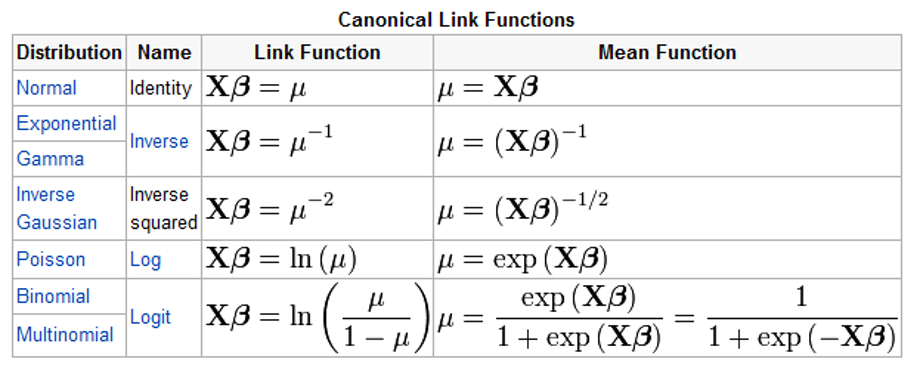

# Introduction to Data Analysis

Now that you've learned the basics of **R** programming, we'll take things a step further.This chapter will walk you through a new set of analyses.

We'll be working with the dataset "mtcars" which comes pre-loaded with **R**. The goal of this exercise is to test your basic skills in **R** programming, specifically in manipulating data and to reiterate some principles in statistical modelling.  This chapter will help as we move towards our ultimate goal of conducting more advanced analyses on animal point data.

You may not be familiar with all the operations you need to execute in this exercise. Part of the goal with this exercise, however, is for you to become more familiar with the *help* commands in **R** and with the internet solutions that exist.  Our ultimate goal is to make you aware of the tools that are available to you so that you can become an effective problem solver, working independently on data analyses.

***

For this tutorial section I followed the book: 
[Data Analysis with R Statistical Software - A Guidebook for Scientists](https://www.eco-explore.co.uk/data-analysis-consulting/data-analysis-guidebook/)
This is, in my opinion, one of the best resources out there for an introduction to data analysis with R.

***

Whenever you start working with a new script, you should first set a working directory. If you are working within a **R-Studio** project, the working directory will automatically be set by default.  This directory will contain all the data for your analysis and will be where you will save all the data outputs. 

Remember that you can check the current working directory by typing:

```{r}
getwd()
```

Now, let's change the working directory to a location of your choosing. Create a folder if you don't have one already, then make sure your working directory is in that folder. If you already have a folder, just set the working directory to the folder you want to use.

```{r, eval = F}
setwd("C:/....")
```

You can also work with **R projects**. R projects have the advantage that they enhance organization, collaboration, and reproducibility in R-based work by providing a structured and isolated workspace for your projects. They contribute to a more efficient and transparent workflow, particularly when working on multiple projects or collaborating with others.

The main advantage is that R Projects create a dedicated workspace for your R-related work, keeping all files, scripts, data, and outputs within a well-defined directory. This isolation helps avoid conflicts between projects and ensures a clean environment for each project. R projects use relative paths, allowing you to refer to files and directories within the project without specifying the full path. This enhances portability and makes it easier to share your project with others.

To start a new R Project click File > New Project or directly click on the R Project icon and follow the directions. You can set up your new project on a new folder or an existing folder.

## Data Management and Data Manipulation 

### Exploring the Data

Let's start investigating a data set to later fit a linear model.

Load the "mtcars"" data set. This dataset comes with R. We will use this dataset as it is intuitive to think about it and is a good example on how to tackle many other datasets.

```{r}
data(mtcars)
```

View the first 10 lines of the data set.

```{r}
head(mtcars, 10)
```

Assess the overall structure of the data set to get a sense of the number and type of variables included. When you work with your own data, you will be familiar with the data structure, but it is always good practice to examine your data before moving on to any model fitting. Assure that the data structure of each column of the data frame is correct and/or what you expect it to be. 

Note, all columns/variables included in this sample dataset are numeric-type. You can confirm the data type of each column by typing **is.numeric()** next to the variable name (e.g., `is.numeric(mtcars$mpg)`). 

```{r}
str(mtcars)
```

Now, summarize the data to provide a list of each variable with the mean, min, and max.

```{r}
summary(mtcars)
```

'Summary' is a great function to have a quick view at the data. But what if you want to save the mean, min, or max values of each variable? There is a family of functions in **R** that are great for applying functions to all columns or all rows in a matrix and that return the result as a vector or list of values. This is the `apply` function. 

The `apply` function has two main arguments. The MARGIN that is a 1 or a 2, indicating whether you want to operate on rows (1) or columns (2) and the FUN arguments that tell **R** what function is to be applied. For example, to obtain the mean of each variable in the mtcars dataset, we do:

```{r}
apply(mtcars, 2, mean)
```

Compare with the values reported by the `summary` function.

> QUESTION: Can you calculate the min and max values for each variable?

Let's have a quick look at all our variables together (since they are all numeric) by looking at scatter plots of each variable combination. Use the function "pairs" or "plot" on the data set.

```{r}
plot(mtcars)
```

You should be able to see cases where there seems to be a strong relationship between two variables. "mpg" vs. "wt" is a good example of this. This is miles per gallon vs. the weight of the car, and this makes sense, a heavier car should consume more petrol per distance. We should transform miles to kilometers, because, what kind of measurement is miles? But in appreciation of all my American friends, we will use miles, just for this exercise. Is the slope here positive or negative?

We can plot these two variables against each other to examine the relationship closer. 

```{r}
plot(mtcars$mpg ~ mtcars$wt)
```

You could plot any of the variables in the data frame. Plotting the data is one of the simplest ways to look and explore the data.

In **R** you can customize your plots. We will dedicate a section to ggplot2. But for now, can you change the 'x' and 'y' variable names and add a title to this plot?  Use the help file `help(plot)` or `?plot` to determine the proper syntax, or simply Google "add tile to plot in R".

```{r}
plot(mtcars$mpg ~ mtcars$wt, xlab="Weight", ylab="MPG", main="MPG vs Weight")
```

Calculate the correlation coefficient between the two variables, then perform a correlation test to see if they are significantly correlated.

```{r}
cor(mtcars$mpg, mtcars$wt)
cor.test(mtcars$mpg, mtcars$wt)
```

The *p-value* is very small and the correlation coefficient of `r cor(mtcars$mpg,mtcars$wt)` is very high. We also note that this value is negative, meaning that as the weight increases, the fuel efficiency decreases. This makes intuitive sense. We will talk about the difference between correlation and causation later.

Let's practice some data management before we look into these variables in more detail. 

Create a new data set called "my_mtcars", excluding the variables "vs" and "am" using vector notation. Then look at your new data set to make sure it worked. We don't necessarily need to remove these variables to continue the analysis. We are simply doing this so that you get more familiar with manipulating data frames.

```{r}
head(mtcars)
my_mtcars <- mtcars[, -c(8,9)] #Remove columns 8 and 9
head(my_mtcars, 10) 
```

Now, keeping the same name for your data set, exclude the "gear" and "carb" columns without using vector notation. Instead use the "subset" function. Check out the help (`?subset`) for this function to figure out how to exclude columns by name.  

```{r}
my_mtcars <- subset(my_mtcars, select = -c(gear, carb))
```

Note that the initial data of my_mycars with 9 variables no longer exists, because my syntax states to save the modified 7 variable data with the original name.

> QUESTION: How could you do this without overwriting the original data?

You should now have a data set called my_mtcars that has 32 observations of 7 variables. Check this.

```{r}
str(my_mtcars)
dim(my_mtcars)
```

> QUESTION: What does `## [1] 32 7` tells us?  Hint, recall vector notation.  

Another way of checking the number of rows and columns is using `nrow()` and `ncol()` functions.

The variable "cyl" represents the number of cylinders in the car engine. You'll see this is classified as a numeric variable. However, we aren't necessarily interested in this as an actual number. For us, the number of cylinders is more useful as a grouping mechanisms to serve as a factor, or categorical variable. Let's use the `as.factor` function to convert it, keeping the same variable name. Then check what the class of the variable is, to confirm the conversion worked. 

```{r}
my_mtcars$cyl <- as.factor(my_mtcars$cyl)
class(my_mtcars$cyl)
```

Creating a categorical factor variable will enable us to generate summary statistics and plot data by groups. 

We can now use this factor variable to group different operations. `tapply` is a great function to use for grouped operations. Check the help for `?tapply` and try to calculate the mean of "mpg" for each factor of the "cyl" variable.

```{r}
tapply(my_mtcars$mpg, my_mtcars$cyl, mean)
```

Now let's create box plots of our two variables of interest (mpg, wt) to visualize their distribution. First, change your graphic parameter to show two graphs side by side. 

> Question: How do you think you'd specify the title of each box plot?

```{r}
par(mfrow=c(1, 2))
boxplot(my_mtcars$mpg, main = "mpg")
boxplot(my_mtcars$wt, main = "weight")  
```

You can see that two points are potential outliers in the plot for`wt`. The plot gives you a tool to make a decision whether to remove the data points. Here we will keep them. 

Since `cyl` is a categorical variable, we can also visualize the distribution of `mpg` and `wt` across different cylinder classes.

```{r}
par(mfrow=c(1, 2))
boxplot(my_mtcars$mpg ~ my_mtcars$cyl, main = "mpg")
boxplot(my_mtcars$wt ~ my_mtcars$cyl, main = "weight") 
```

> QUESTION: How do you modify the label for x axis and y axis?

Before we move forward, let's exclude these two observations by using a logical expression that removes the points (rows in the dataframe) in the data set where weight is greater than 5.3 tons. There are a few different ways to do this, as is the case with most things in **R**. Let's use the `subset` function again.

```{r}
my_mtcars <- subset(my_mtcars, wt <= 5.3)
```

You should now have a data set with 30 observations of 7 variables. 

Note that removing data points from an analysis is not a good statistical practice and when done, it should be justified. But here, the goal is to use different functions on how we can work with data frames.

## Data Table Manipulation with Dplyr

The most basic R skills is to query and manipulate various data tables. Table manipulation is also something that is almost always required, regardless of what you decide to apply R for. For beginners, familiarizing and reinforcing table manipulation skills to meet different needs is a great way of improving R skills. If you wish to become really good at R, but don't know where to start, start with tables! 

The base R functions that come with the default R installation have the capacity for almost all the table manipulation you will need (e.g., `split(), subset(), apply(), sapply(), lapply(), tapply(), aggregate()`). However, sometimes their syntax are less user-friendly and intuitive than some of the special packages built for table manipulation purposes. So, here we are introducing a few of the most useful table manipulation functions within `dplyr` package. This is a package I use a lot.

Note that you will have to use `install.packages()` and `library()` function to download and activate the `dplyr` before using it. 

```{r, eval = T}
#install.packages("dplyr")
library(dplyr)
```

Now, we will see how different functions of this package work.

### `select()` 

We can use `select()` to select column(s) that meet an specific pattern:

```{r}
select(mtcars, mpg) # select column called mpg (miles per galon)
select(mtcars, -mpg) # select all columns in the data except mpg column
select(mtcars, hp:vs) # select a continuous block columns starting from hp column and end on vs column 
select(mtcars, starts_with("c")) # select all columns that start with "c" in their column names
```

*  `starts_with` argument is very convenient because it allow you to select multiple columns that start with the same text. A few similar arguments are available to define other naming patterns.   
*  `ends_with()`= Select columns that end with a character string.  
*  `contains()`= Select columns that contain a character string.  
*  `matches()`= Select columns that match a regular expression.  
*  `one_of()`= Select columns names that are from a group of names.  

> Question: How do you select or exclude two columns: mpg and cyl?   


###  `filter()`  

Filter/select row(s) of data based on specific requirement of column(s) values:

```{r}
filter(mtcars, cyl %in% c(4,6)) # select cars with 4 or 6 cylinders
filter (mtcars, mpg>20) # select rows that have mpg > 20
filter(mtcars, mpg>20 & cyl == 6) # select rows that have mpg>20 AND cyl == 6
filter(mtcars, mpg>20 | hp > 100) # select rows that have mpg>20 OR hp > 100
```

>Question 1: How do you select rows with 6 and 8 cylinders knowing that cyl is a factor?   

###  pipe operator    

The pipe operator allows you to pipe the output from one function to the input of the next function. Instead of nesting functions (reading from the inside to the outside), the idea of of piping is to read the functions from left to right. It can also help you avoid creating and saving a lot of intermediate variables that you don't need to keep. The old operator for pipes was `%>%`, but now a new version has been introduced, `|>` 

```{r}
# old operator
pipe_result<- mtcars %>%
  select(mpg, cyl) %>%
  head()
pipe_result

# new operator
pipe_result<- mtcars |>
  select(mpg, cyl) |>
  head()
pipe_result
```

### `arrange()` 

This function arranges or re-orders rows based on their value, the rows are arranged by default in ascending order  

```{r}
order_data1<- mtcars %>% 
	arrange(mpg) 
order_data1

order_data2<- mtcars %>%
	arrange(cyl, mpg)
order_data2
# Now we learn pipe operator, can you understand what order_data1 and order_data2 are producing? 
```

> Question: Can you arrange the table first by wt and then by hp in decending order?

###  `mutate()`   

The `mutate()` command creates new column(s) and define their values. For instance, we can create a new column with random numbers between 0 and 100 using a uniform distribution. 

```{r}
new_col<- mtcars %>%
	mutate(new_col = runif(n = nrow(mtcars), min = 0, max = 100)) # note the use of nrow to get the exact number of random numbers as there are rows in the dataframe.
new_col

new_col2 <- mtcars %>%
	mutate(new_col = runif(n = nrow(mtcars), min = 0, max = 100),  wt_kg = wt * 1000) # you can create multiple columns at once. Lets transform the weight from tones to kg
new_col2
```

> Can you create a new column call zero and give it a value of 0 ?

###  `summarise()`   

This function calculates a summary statistics among all rows or rows within certain grouping, often used in combination with `group_by()` 

```{r}
sum_table <- mtcars %>% 
summarise(mean(wt))
sum_table

sum_table2 <- mtcars%>% 
summarise(avg_wt= mean(wt), min_wt= min(wt))
sum_table2
```

### `group_by()`   

This is a great function. `group_by()` divides data rows into groups based on grouping column(s) provided, often used in combination with other functions which define what you do with them after placing them in groups. When `group_by()` and `summarise()` are used together, you are essentially telling R to separate rows into different groups, and for each groups you use `summarise()` to generate a series of summary statistics that characterize the column values.    

```{r}
group_summary <- mtcars |>
  group_by(cyl) |>
  summarise(avg_wt= mean(wt), min_wt= min(wt))
group_summary
```

You can also create groups by the combination of two or multiple columns

```{r}
group_summary2<- mtcars |>
  group_by(cyl, gear) |>
  summarise(avg_wt= mean(wt), min_wt= min(wt))
group_summary2
```

###  Join table  

Let's read two other tables that are available in the package ‘dplyr’

```{r}
data(band_members)
band_members
data(band_instruments)
band_instruments
```
                          
*  `left_join()`   

Returns all records from the left table, and the matched (matched by shared ID columns) records from the right table. The result is NULL from the right side, if there is no match.

```{r}
left_join(band_members, band_instruments, by = c("name"= "name"))

```

* `full_join()`

Return all records in both tables.

```{r}
full_join(band_members, band_instruments, by = c("name"= "name"))
```

Other than `left_join()` and `full_join()` there are a few other join functions that would join table differently. Sometimes you will find them useful for a specific table you want to make, but in general, you can reply on `left_join()` for most of the job.   

* `right_join()`: similar to left join, it keeps all records from the right table instead.  

* `inner_join()`: return only the matched records from both tables.  

### Conclusion on data management

This has been a glimpse to what can be done in R to work with tabular data. There are plenty other packages that in time you will learn by Googling and learning from other people, but for now, all the functions we covered are a very good set of tools to do most of what you will need.


## Statistical Modelling

Let's move on into data analysis.

### General Principles

When building an statistical model, you need to specify a **dependent variable** (what you are trying to explain) and one or more **independent variables** (the variables that you are using to explain the dependent variable).

Thus, to build a model you will first need to identify the dependent and independent variables which come from the research question. Once you have identified the variables, you need to decide what kind of model structure is appropriate for the data set at hand. For this reason, knowing models and model structures can help you design the data collection process as you have a good idea of what type of data you need for a specific model.

Running models can be easy, but before you can make interpretations from the model, you need to check that the assumptions of the model are valid **(model validation)**, decide what is the best model structure **(model selection)** and then, finally, **interpret the parameters of the model and/or make predictions.**

The general structure for defining any model in **R** is:

**model.type(dependent.variable ~ independent.variable1 + independent.variable2, data = dataframe)**

Note that in the model equation you do not have to specify the intercept. We have assumed in this example that there are 2 different independent variables in the example provided (independent.variable1 and independent.variable2), but the model could contain any number of independent variables.


### Regression vs Classification

The dependent variable can either be continuous or categorical data. We refer to these separate parameterizations as a regression model or a classification model, respectively. Most of the models we demonstrate here are regression models, but the structure to build classification models in **R** are almost identical. In most cases, the data type of the dependent variable determines whether the model is a regression (non-categorical numeric-type dependent variable) or classification (categorical factor-type dependent variable). You can use functions such as `as.factor()` and `as.numeric()` to convert different data types of data to a factor or numeric variable. Note, just because a data set contains numbers, does **NOT** necessarily mean the numbers are numeric-type. Numbers can be used as symbols to differentiate categories as well. It is always a good practice to confirm the data type of the dependent and independent variables that you are inputing into the model.   


## Linear Regression

We will start with a simple linear regression analysis.

> QUESTION: What is the difference between correlation and regression?


### Model design and model fit

Model design involves deciding **what we are trying to explain** (i.e., the dependent variable) and **what we are going to use to explain it** (i.e., the independent variables).  These are questions that are informed by the researcher.

Then, we need to decide **what kind of model structure** is appropriate to the data set. In our case, we will start with a simple linear regression model. Later in the course, however, we will investigate more complex model structures.

Run a basic linear regression model, attempting to predict/explain the fuel efficiency of a car (mpg) based on its weight.  Finally, assign the model output "lm1". Remember to specify the `my_mtcars` data set in the model so the **R** understands that the name of dependent and independent variables are columns in that specific dataframe.

```{r}
lm1 <- lm(mpg ~ wt, data = my_mtcars)
```


### Investigate your model

Once you have fit the model, you can use the summary function to investigate the beta coefficient, SE, and intercept values. 

```{r}
summary(lm1)
```


### Model validation - Checking the assumptions of your model

IMPORTANT: Before you can trust your model, you need to examine whether the assumptions on which the model is based are actually valid. **If the assumptions are not satisfied, then your model will be unreliable**, at least to some extent!

If you apply the function **plot** to the model, **R** will provide a series of plots that will help you to inspect model assumptions. Click enter to get all the plots.

```{r}
plot(lm1)
```


1. **Assumption 1**: The residuals are normally distributed

Check the Q-Q (quantile-quantile) plot. A perfect normal distribution is represented by a straight line. Your residuals should be close to a straight line.

2. **Assumption 2**: The variances of the residuals are homogeneous (homoscedasticity)

The variability of the residuals should be uniform across the range of fitted values of the dependent variable. In the plot of **residuals vs fitted values of y** and **standardized residuals vs. fitted values** there should be a "scatter" of dots across the graphs, with no discernible pattern. Points should be randomly distributed.  If you have a scatter of points on one side of the graph, your data may NOT be homogeneous.

3. **Assumption 3**: The independent variables are independent of each other (no collinearity)

There are different ways you can address this before you fit your model. For instance, you can estimate the correlation of each pair of covariates and discard variables or exclude them from analysis if they highly correlated (positively or negatively). We will examine this later in the course when dealing with more complex models. 

4. **Assumption 4**: The data set does not contain serial auto-correlation

Serial autocorrelation is when there is significant correlation between successive data points in the data set. Spatial data or time-series data tend to be autocorrelated. There are different ways to deal with autocorrelation, such as using mixed-effect models. 

5. **Assumption 5**: The model is not biased by unduly influential observations.

We can check this by looking at the plot of standardized residuals vs leverage and "Cook's Distance."

Leverage is a measure of the influence of individual data points on the model's parameters, measured on the scale of 0-1, where high values indicate a strong influence on the model's parameters.

Cook's distance is the sum of squared distances between the fitted values using the whole data set, and the fitted values with the *i*th observation removed. A large difference indicates that the *i*th observation exerts a strong influence on the model's parameters.

No values beyond 1.

***

> QUESTION: How does the QQ plot look?  Does it indicate a potential problem?

If your standardized residuals are not normally distributed you can **transform the dependent variable**.

Let's try a log transformation, which is commonly used:

```{r}
lm1 <- lm(log(mpg) ~ wt, data = my_mtcars)
plot(lm1)
```

> QUESTION: Does this improve the result?

The residuals are now randomly distributed and are homogeneous. We can now trust model results.

***

Continuing with interpreting results, the slope value should be `r lm1$coefficients[[2]]`. This means that for each unit of weight added to a car (1 ton), the log of miles per gallon it achieves is predicted to REDUCE by a value of `r abs(lm1$coefficients[[2]])`. There is a negative effect of weight on car efficiency.

The intercept of `r lm1$coefficients[[1]]` sets the start of the regression line at the weight of zero. In this case, this isn't very useful (a car will not weigh zero tons) but it is a necessary element of describing a linear relationship. Here, the equation for the line is `log(mpg) = 3.92593 -0.30555 (wt)`. Note that you can call the individual coefficients from a model directly using, in this example, "lm1$coefficients".

Now, plot again a scatterplot of weight vs. mpg and draw the regression line, in <span style="color:blue">blue</span>. First return your graphing parameter to it's default setting of (1,1)

```{r}
par(mfrow=c(1, 1))
plot(log(mpg) ~ wt, data = my_mtcars)
abline(lm1, col="blue")
```

Here are two other ways you can draw the predicted regression line:

```{r, eval = F}
abline(coef = lm1$coefficients, col="green")
abline(lm1$coefficients, col="red")
```


### Model Selection

In any mathematical modeling approach, there may be other variables, or some combination of variables, that are most effective and efficient at predicting your response variable of interest. In this case, our response variable is `mpg`. Looking at your plot of all the two-way relationships between variables, are there any other variables that may help predict `mpg`? Horsepower (`hp`) seems to be potentially informative. The question now is, which model might be **best** at predicting `mpg`. 

Let's say we have three options: 
1. mpg ~ wt
2. mpg ~ wt + hp 
3. mpg ~ hp 

We've already fitted the first model. Now, fit a linear regression model for the next two parameter combinations, giving them unique names (`lm2` and `lm3`), and look at the summary of their results.

```{r}
lm2 <- lm(log(mpg) ~ wt + hp, data = my_mtcars)
lm3 <- lm(log(mpg) ~ hp, data = my_mtcars)
summary(lm2)
summary(lm3)
```

As you'll see, all 3 of these models are reasonably good. Which is optimal? You might know that when you add more independent variables to a model, the model fit will often improve. But, it is certainly not ideal to have a model with a large number of independent variables (because we want to avoid overfitting). Akaike's Information Criteria (AIC) provides a good mechanism for model comparison. AIC ranks a model's performance by accounting for model fit while penalizing models with more variables. When adding a variable, the improved fit of the model must outweight the penalty, otherwise the improved fit will not be deemed worthwhile given the additional model complexity. 

Use the `AIC` function to compare the AIC values of our 3 models. The lowest AIC indicates that the model is a "better" representation of the data and has a better predictive power. Note, AIC is not a measure of fit. 

```{r}
AIC(lm1)
AIC(lm2)
AIC(lm3)
```

What can we conclude? The best model (from the three we have tried) for predicting miles per gallon of a car uses the horsepower and weight of the car in the prediction (`lm2`). 

To finish, let's see if we can now use this model (`lm2`) to predict the fuel efficiency of a car with a `hp = 225` and a `wt = 4.0` tons. Making prediction with a new set of independent variables when dependent variable is absent, is ultimately one of the main goals of a regression analyses. 

First, we need a dataframe with our new independent variables to be used in the prediction. Then, we can use the `predict()` function to apply our established linear model to the new information. Lastly, we need to transform miles per gallon back from the log scale to make it more easily interpretable. 

```{r}
nd <- data.frame(hp = 225, wt = 4.0)
exp(predict(lm2, newdata = nd, type = "response"))
```

We can get this same result without using the `predict` command, simply by writing out the linear equation. That is, our predicted response equals our intercept term, plus our coefficient for `wt` multiplied by the weight value, plus our coefficient for `hp` multiplied by our horsepower value (The function `predict()` just makes things a little easier for us). That is: 

$$y_i = \beta_0 + \beta_i x_i + \epsilon_i$$

We must also use the `exp()` function to back-transform from the log-scale.

```{r}
exp(lm2$coefficients[[1]] + (lm2$coefficients[[2]]*4.0) + (lm2$coefficients[[3]]*225))
```


## Analysis of Variance: ANOVA

The analysis of variance (ANOVA) is a lineal model, but the explanatory variable is categorical. As we saw before, the categorical variable must be a factor. Remember that if the category has been coded with numbers, **R** will assume the variable is continuous.

We will continue working with the `mtcars` data set. As we did before, we specified cylinders as a categorical variable:

```{r}
mtcars$cyl <- as.factor(mtcars$cyl)
class(mtcars$cyl)
```

### One-way ANOVA

Here we ask the question, do different cylinders imply more power? 

Our hypothesis ($H_1$) is that more cylinders will provide more power to the car, expressed in gross horsepower (HP). The null hypothesis ($H_0$) is that there is no difference in HP among number of cylinders.

To perform an ANOVA in **R**, we use the function `aov()` and `summary()` to see the results.

```{r}
model1 <- aov(hp ~ cyl, data=mtcars)
summary(model1)
```

In the results, the table shows us a *p-value*, representing the overall probability of significance for the categorical variable. If the term is significant, then we know at least one level is significantly different from the others.

We can reject the null hypothesis and conclude that gross horsepower differs among different number of cylinders.

However, before we know we can trust this result, we need to check the model assumptions. We will do this in the same way we did for the lineal model, using `plot()`

```{r}
plot(model1)
```

From the second plot we can conclude that the residuals are normally distributed (straight line). From the first and third plots, we can see that the variances of the residuals are homogeneous (homoscedasticity). From the final plot, we can conclude that the model is not biased by unduly influential observations.

### Pairwise port-hoc tests

To understand how levels compare to each other once we know that the ANOVA is significant, we can use a post-hoc test. We will use the **Tukey post-hoc test** with the function `TukeyHSD()`.

```{r}
TukeyHSD(model1)
```

**diff** is the difference in mean between two levels, **lwr** and **upr** are the lower and upper 95% confidence intervals for the difference and **padj** is the `p-value` for the difference.

In this example, we can see that there is not HP significant difference between 6 and 4 cylinders  (`p > 0.05`), and that 8 cylinders have more HP than 4 and 6 cylinders (`p < 0.05`).


## Non-parametric Random Forest Model

In the past few decades, there has been an increasing number of studies that use non-parametric machine learning models for classification or regression. In the most simplistic of terms, non-parametric/machine learning models do not require the predictive variables to take a predetermined distribution (e.g. normal distribution). They are also relatively less stringent in terms of model assumptions.

One of the most popular and also most powerful machine learning tools is Random Forest. Random Forests is an ensemble method for classification- or regression-typed analyses that operate by constructing a series of decision trees. We will not go into detail to discuss the Random Forest algorithm or how it works. But in general, Random Forest models perform really well when there are:

1. Large number of independent variables.
2. Significant correlation among independent variables.
3. Independent variables that are not normally distributed.

### Random Forest Regression

Although the Random Forest algorithm is complicated, running a Random Forest model in **R** is as easy as running a linear model. For the most part, we just need to specify the data set, and the regression model formula. Let's use the "mtcars" data set again for this example.

Load the "mtcars"" data set, and load the random forest package.

```{r, eval= F}
install.packages("randomForest")
```

```{r}
data(mtcars)
library( randomForest)
```

Now let's run a model that includes all metrics in the data set to predict the `mpg` of a car.

Note that in the following code, the formula was simplified `mpg ~ .`. The `.`. represents the rest of the columns in the dataframe that are not defined as predictive variable. Whenever you have a dataframe that contains only the independent and dependent variables you need in the model, you can simplify the formula in this way. This essentially tells **R** to use all the variables included in the dataframe. 

```{r}
rf.model<-  randomForest(mpg ~ ., data=mtcars)
rf.model
```

Notice that one of the most important results of Random Forest is the "% variance explained". It can be considered equivalet to a $R^2$ value in a linear models quantifying how "good" the model fits the data. The closer the "% var explained" is to 100, the better the model's performance. 

Here you can see the default number of trees used in the model is 500. In reality, the number of tree is one of very few parameters that need to be modified by the user. The number of trees determines the number of ensemble models that are created in the modeling process. As we increase the tree number, the model results will tend to vary and eventually stabilize. But we don't want to create too many ensemble tree models because it will take more computational time. The general rule is to increase the number of trees incrementally until the value of "% var explained" changes very little.

Let's change the default number of trees parameter to 1000 and 5000 and observe the difference in model results

```{r}
rf.model.1000<- randomForest( mpg ~ ., data=mtcars, ntree=1000)
rf.model.1000
rf.model.5000<- randomForest( mpg ~ ., data=mtcars, ntree=5000)
rf.model.5000
```

The bigger number of trees (`ntree`) does not change the "% var explained" significantly. So the default `ntree= 500` is as good as `ntree= 1000` or `ntree=5000`.

Lastly, a convenient feature of Random Forest model is that it internally summarizes how important each variable is to model performance. The model does this by replacing each predictive variable separately with randomly permuted values. After running the model with replacement, the more the model accuracy decreases, the more important the specific variable (that was replaced in the process) is.  You can retrieve and visualize the variable importance data using `importance()` and `varImPlot()` functions. 

```{r}
importance(rf.model)        
varImpPlot(rf.model)  
```

Note that "IncNodePurity" is just a measure of how much the model performance has decreased. The higher that value, the more important the variable is. 

> QUESTION: Which variable is contributing most to predicting mpg of a car? 

Lastly, just as with all the other models, the most powerful use of Random Forest model is to predict the dependent variable when you have a set of independent variables. You can, once again, use the `predict()` function to perform this action. Below, we will create a fictitious car, changing the Hornet-4 Drive from 6 cylinder to 8 cylinders. We want to know what the mpg of this new car is. 

```{r}
new.car<- mtcars[4,]
new.car$cyl<- 8
new.car
```
```{r, eval= F}
predict(rf.model, newdata = new.car, type = "response")
```

> QUESTIONS: 

> 1) Do you think the prediction make sense? Why?
> 2) Can you build a random forest classification model to predict the number of cylinders based on other metrics included in the dataset? 

## Generalized Linear Models

A primary goal of basic ecological and applied conservation research is to understand how species are distributed across space and through time. However, animal locations or abundance data typically cannot be modelled by a normal distribution.  As a result, other types of model structures are needed.

Generalized linear models (GLM) are used when the residuals are non-normal, when there are non-linear relationships between dependent and independent variables, and/or when the variance in the dependent variable is not uniform across its range. E.g., presence-absence data, count data.

GLMs consist of three elements:

1. A probability distribution from the exponential family.
2. A linear predictor $η = Xβ$.
3. A link function $g$

A GLM allows the specification of a variety of different error distributions:

1. Poisson errors (useful with count data)
2. Binomial errors (useful with data on proportions)
3. Gamma errors (useful with data showing a constant coefficient of variation)
4. Exponential errors (useful with data on time to event - e.g., survival analysis)

The linear predictor η (eta) is the quantity which incorporates the information about the independent variables into the model. It is related to the expected value of the dependent variable through the link function.

η is expressed as linear combinations of unknown parameters β. 

The linear predictor can be represented as a vector of coefficient values that is multiplied the matrix containing your independent variables  X. .
η can thus be expressed as $η = Xβ$.

The link function `g` provides the relationship between the linear predictor and the mean, or expected value, of the distribution function. 

There are many commonly used link functions, and their choice can seem somewhat arbitrary. It can be convenient to match the domain of the link function to the range of the distribution function's mean.




### Binomial GLM for binary data (logistic regression/logistic GLM)

A logistic regression model allows us to establish a relationship between a binary (0 vs. 1) outcome variable and a group of predictor variables. It models the logit-transformed probability of a certain outcome as a linear relationship with the predictor variables.

To demonstrate how linear regression model works, we will use the following study:

[Bolger et al. (1997)](https://esajournals.onlinelibrary.wiley.com/doi/abs/10.1890/1051-0761(1997)007[0552:RORTHF]2.0.CO;2) investigated the impacts of habitat fragmentation on the occurrence of native rodents. 
[Quinn and Keough (2002)](https://www2.ib.unicamp.br/profs/fsantos/apostilas/Quinn%20&%20Keough.pdf) subsequently modeled the presence/absence native rodents against some Bolger et al. (1997) biogeographic variables. 

Bolger et al. (1997) studied whether small fragments of the shrub habitats in canyons of San Diego, CA, isolated by urbanization, were capable of supporting viable populations of native rodent species.

The data set consists of rodent presence/absence and three predictor variables:
1. PERSHRUB = percentage of shrub cover
2. DISTX = the distance to the nearest large (>100 ha) "source canyon."
3. AGE = time elapsed since the fragment was isolated by development


***

For this demonstration we need to install and load a new package.

```{r Library,message=FALSE,warning=FALSE}
#install.packages("usdm") #Install package if it is not installed in your computer.
library(usdm)
```

### Import data set

Import the data set suing the 'read.table' function. The data for this example is in a .txt format. `Read.table` will read the .txt file and load it as a data frame into the **R** environment. 

Look at the first lines of data using the `head` function.

```{r}
bolger <- read.table("data/bolger.txt", header=T, sep= "")
head(bolger)
```

***
> Note: It is often best to rescale continuous covariates to improve numerical stability in the models. We will skip this step for this example, but we will look into scaling in other examples.

***

### Investigate potential (multi)collinearity

When we fit a model we assume that the estimated effects of predictor variables are independent of each other. Thus, before we fit a model we first need to check our independent variables for potential collinearity.

Collinearity occurs when 2 or more independent variables have a strong linear relationship, making it difficult to determine which of the two collinear variables are more strongly associated with the response variable. Collinearity affects parameter estimates and increases both standard errors and p-values of parameters, likely obscuring some important relationships.

```{r}
plot(bolger[,1:3])
```

To make sure we do not have a (multi)collinearity problem in our predictor variables, we can look at the Variance Inflation Factor (VIF) for each covariate. Variance inflation is a measure of the degree of collinearity between variables. Any variables with a VIF value > to 3 (or 5 or 10 depending who you ask) are the cause of concerning collinearity in the model. If a covariate has a VIF > 3, remove it (or other correlated variables) and recalculate VIF after deletion.

```{r}
vifstep(bolger[,1:3])
```

In our example there is no evidence of collinearity as all VIFs are < 3.  Good!


### Fit a Binomial GLM

```{r}
bolger.glm <- glm(RODENTSP ~ DISTX + AGE + PERSHRUB,
                family=binomial (link= "logit"),
                data=bolger)
summary(bolger.glm)
```

### Model assumptions validation

In the case of a linear model, we used 'plot(model1)' to check the standardized residuals for any "patterns". For binomial data, however, you will just see two bands in the residuals due to the binomial nature of the dependent variable.

What we need to check is evidence of model fit, thus, that the model fits the data well. To do this we extract the **deviance residuals** and examine their distribution. Observations with a deviance residual > 2 may indicate a lack of fit.

```{r}
devresid<-resid(bolger.glm, type = "deviance")
hist(devresid)
```

In this case, we can conclude there is no strong evidence of lack of fit.  We can now feel confident about our model to make interpretations.

### Model interpretation and predictions

Let's look again at the model summary:

```{r}
summary(bolger.glm)
```

The chance of native rodent occurrence increases significantly with increasing shrub cover ($B=0.096$, $p = 0.0182$). Neither fragment isolation age or distance had significant effects.


The default results are on the logit scale.  The coefficient of PERSHRUB is: 0.096, so that a one unit change in percentage of shrub cover produces approximately a 0.096 unit change in the log odds of presence (i.e. a 0.096 unit change on the logit scale).

> The odds of presence are defined as the ratio of the probability of presence over the probability of absence. For instance, if the probability of presence is 0.8 and the probability of absence is 0.2, the odd ratios is 0.8/0.2=4, or the odds of presence are 4 to 1. For more information on how to interpret odds visit: https://stats.idre.ucla.edu/other/mult-pkg/faq/general/faq-how-do-i-interpret-odds-ratios-in-logistic-regression/

It is hard to think in terms of logits. We can plot the association between the probability of native rodent presence and percentage shrub cover. 

See how the code for this plot has gotten much longer and more complex. Make sure you understand each line of code. Remember to use the `help` command when you do not understand a specific function and all its arguments.

```{r}
xs <- seq(0, 100, 1)
bolger.predict <- predict(bolger.glm, type="response", se=T, 
                          newdata=data.frame(DISTX=mean(bolger$DISTX), AGE=mean(bolger$AGE), PERSHRUB=xs))

# Plot results
plot(bolger$RODENTSP ~ bolger$PERSHRUB, xlab="Pecentage shrub cover", ylab="Rodent presence probability", axes=T, pch=16)
lines(bolger.predict$fit~xs, type="l", col="gray")
lines(bolger.predict$fit + bolger.predict$se.fit~xs, col="red", type= "l", lty=2)
lines(bolger.predict$fit - bolger.predict$se.fit~xs, col="red", type= "l", lty=2)
```
***

What is the probability of native rodent occurrence with a shrub cover of 80%, distanceX of 100, and fragment isolation age of 5.

```{r}
predict(bolger.glm, type="response", se=T, newdata=data.frame(DISTX=100, AGE=5, PERSHRUB=80))
```

Note that the predict function already converts values from the logit scale back to the probability scale. 


To do that manually, we can do the following:

```{r}
x <- -5.9099159 + 0.0003087*100 + 0.0250077 * 5 + 0.0958695 * 80
exp(x)/(exp(x)+1) # This is the inverse of the logit scale
plogis(x) # Use a built in function
```
