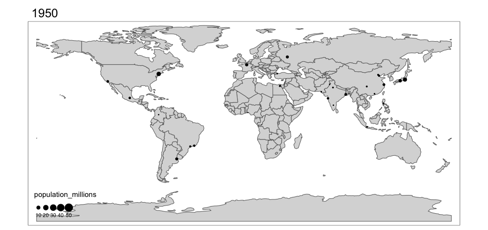

# An introduction to GIS in R

We will now start to work with spatial data (i.e. vector and raster) in R.

Before we start, and if you are not using an R project, do not forget to set your working directory

```{r, eval=F}
setwd("...")
# don't forget to set the directory to your own data folder!!
```

Next, load packages:

```{r, message=FALSE}
library(sf)
library(terra)
library(tidyverse)
```

There is a lot of information in the internet about geo-spatial data and R. Here, I summarize the basic tools to conduct spatial analyses in R with the goal that you will build your skills as we progress into some study cases. I have modified some of the code from Claudia Engel (https://cengel.github.io/R-spatial/). I recommend this site for a more in depth tutorial.

## Vector Data in R 

Vector data are composed of points, lines, and polygons.

* **Points** are the simplest spatial object. Each point consists of a coordinate pair (X, Y) that is structured as a two-column matrix, with one column for latitude and another for longitude. Each point can also have *n* associated variables as attribute information. For instance, species occurrence data often have information on elevation, date, and habitat of each point recorded in the field, in addition to their X and Y coordinates. In such cases, the data will be a dataframe containing several columns, each corresponding to a different variable (e.g. Point ID, X coordinate, Y coordinate, elevation, date recorded, habitat type), while each row corresponds to a single point.

```{r, echo=T}
plot(st_point(c(0,0)))
plot(st_point(c(0.5,0.5)), add = T)
```

* **Lines** (or polylines) are used to represent linear features such as rivers/streams, trails, streets, etc. A single line is composed of an ordered set of points (2D coordinates) that are connected by actual line segments, which allows us to calculate length/distance. 

```{r, echo=T}
plot(st_linestring(matrix(runif(6), ncol=2)) )
```

* **Polygons** are used to represent the extent of geographic features, such as city boundary, lakes, sampling plots, and habitat patches. Polygons are composed of several lines that close into a polygon, allowing us to calculate area and perimeter.

```{r, echo=T}
plot(st_polygon(list(rbind(c(0,0), c(1,0), c(1,1), c(0,1), c(0,0)))))
```

### R packages for Vector Data

There were two main packages in R to handle geospatial vector data: the **sp** package and the **sf** package.

The first package to provide classes and methods for spatial data types in R is called [`sp`](https://cran.r-project.org/package=sp). Development of the `sp` package began in the early 2000s in an attempt to standardize how spatial data would be treated in R and to allow for better interoperability between different analysis packages that use spatial data. The package (first release on CRAN in 2005) provides classes and methods to create _points_, _lines_, _polygons_, and _grids_ and to operate them. About 350 packages developed for spatial analysis use the data types implemented in `sp`, which means several spatial packages "depend" on the `sp` package in some way.

The `sp` package depends on `rgeos` and `rgdal`. However at the end of 2023, these packages were retired, primarily because their maintainer, Roger Bivand, has retired. You can read more about it [here](https://r-spatial.org/r/2022/04/12/evolution.html).

All geospatial work in R is being replaced by the more modern package: [`sf`](https://cran.r-project.org/package=sf)

It was first released on CRAN in late October 2016. It implements a formal standard called ["Simple Features"](https://en.wikipedia.org/wiki/Simple_Features) that specifies a storage and access model of spatial geometries (i.e. points, lines, polygons).

`sf` provides **fast** I/O, particularly relevant for large files.

### The `sf` Package

The sf class is an extension of data frames. Essentially, sf objects can be treated as data frames that also contain spatial data, as opposed to spatial data that may or may not also contain data frames. This enables sf objects to fit within the `tidyverse` workflow, making it possible to manipulate them with `dplyr` commands.

sf objects consist of rows of features, hence the name "simple features (sf)", which have both non-spatial and spatial data formats. 

The spatial data of an sf object is contained in a special geometry column that is of class 'sfc'. The geometry column contains the same basic types of spatial data as the slots in Spatial objects: the CRS, coordinates, and type of geometric object. 

The 'sfc' class has seven subclasses to denote the types of geometric objects within the geometry column, which are derived from the simple features standard. The possible geometric objects are point, linestring, polygon, multipoint, multilinestring, multipolygon, and geometrycollection, which is used for any combination of the other types.

Now lets do some operations using sf.

### Convert a data frame to a sf object

The `st_as_sf()` function uses a vector of the coordinate columns for the 'coords' argument, and take either an EPSG code or a PROJ definition for the crs.

```{r}
mt_df <- read.csv("data/ke_major-towns.csv", header = TRUE)

# Create sf object with geo_data data frame and CRS
points_sf <- st_as_sf(mt_df, coords = c("lon", "lat"), crs = 4326)
print(points_sf)
```

### Projections and reporjections 

If you need to asign a CRS to an `sf` object, you can use the function `st_set_crs()`.

To reproject an `sf` object, you can use the function `st_transform()`. You need to provide the object and the new CRS.

```{r}
points_sf_UTM <- st_transform(points_sf, crs="+proj=utm +zone=37 +north +ellps=WGS84 +datum=WGS84 +units=m")
points_sf_UTM
```

We can see that the projection is now UTM 37N.

### A brief, but important word about projection.

Any spatial data collected using GPS devices or downloaded online must have a projection system that links the coordinates to specific locations on the earth's surface. A given geospatial data (e.g. a set of points) with an incorrect projection or with unknown projection system might be OK for visualizing that specific dataset alone. However, it will not work if you wish to: overlay the data with other geospatial data (e.g. overlay the points with boundary lines or environmental raster), even for visualization purposes; or conduct any spatial analysis (calculate the distance of a given point to a road, or extract value of the underlining raster value at the point locations), since the incorrectly projected (or unprojected) spatial data is pointing to a completely different location on earth than intended. Spatial data without the correct projection is basically useless. When you acquire or download a geospatial data, make sure you know what projection the data were originally made (this information is usually found in the metadata of a given dataset).

There are EPSG Codes that can be used to avoid manually setting all the parameters needed in a projection. For instance, the code EPSG:32637 codes for the UTM37N projection with WGS84 datum and ellipsoid. You can find the EPSG reference list in the following link: http://spatialreference.org/ref/epsg/


### sf object manipulation

Unlike Spatial objects that use slots to distinguish the classes, all sf objects can generally be treated as data frames when wrangling the data. This makes it possible to use workflows from the tidyverse package.

For instance, returning the subset of mammals as we did before, can be done with dplyr’s `filter()` function.

First, lets load the shapefile using sf function `st_read`. Much simpler!

```{r}
mammals <- st_read("data/ke_mammals_WGS84.shp")
mammals
```

Now we can filter the sf object:

```{r}
mammals_60 <- mammals %>% filter(MAMMALS > 60)
mammals_60
```


## Working with Raster Data in R

Raster processing is an important aspect of building spatial datasets for further analysis. Doing so within [R](https://cran.r-project.org/) can greatly help streamline workflows, allowing for all analyses to be completed in a single program. Here, we will walk through a series of steps to provide the basic skills necessary for image analysis.

For this exercise we will use a Landsat 8 image. Before we start processing the image it is good to remember the different bands of Landsat 8:

Band |	Wavelength |	Useful for mapping
---- | ----------- | ------------------
Band 1 | Coastal Aerosol	0.435 - 0.451 |	Coastal and aerosol studies
Band 2 | Blue	0.452 - 0.512	| Bathymetric mapping, distinguishing soil from vegetation, and deciduous from coniferous vegetation
Band 3 | Green	0.533 - 0.590	| Emphasizes peak vegetation, which is useful for assessing plant vigor
Band 4 | Red	0.636 - 0.673	| Discriminates vegetation slopes
Band 5 | Near Infrared (NIR)	0.851 - 0.879 |	Emphasizes biomass content and shorelines
Band 6 | Short-wave Infrared (SWIR) 1	1.566 - 1.651	| Discriminates moisture content of soil and vegetation; penetrates thin clouds
Band 7 | Short-wave Infrared (SWIR) 2  	2.107 - 2.294	| Improved moisture content of soil and vegetation and thin cloud penetration
Band 8 | Panchromatic	0.503 - 0.676	| 15 meter resolution, sharper image definition
Band 9 | Cirrus	1.363 - 1.384	| Improved detection of cirrus cloud contamination
Band 10 | TIRS 1	10.60 - 11.19	| 100 meter resolution, thermal mapping and estimated soil moisture
Band 11 | TIRS 2	11.50 - 12.51	| 100 meter resolution, Improved thermal mapping and estimated soil moisture
BQA			|                       | Landsat Collection 1 QA Bitmask 


***

There are three types of image classes:

1) RasterLayer: single band image
2) RasterBrick: must be formed from a single multi-layer file
3) RasterStack: a collection (list) of raster layer objects

### Loading Images as a RasterLayer, RasterBrick, and RasterStack

View the results of the three different types of rasters
```{r Image}
# Raster Layer
ImageB4 <- raster("./data_IntroToGIS/Landsat8.tif",band=4) #loads only band 4 (red)
plot(ImageB4)
# Raster Brick
ImageBrick <- brick("./data_IntroToGIS/Landsat8.tif") #no band was specified, so all bands are loaded
ImageBrick
plot(ImageBrick)
# Raster Stack
ImageStack <- stack("./data_IntroToGIS/Landsat8.tif", bands=1:5) #bands=1:5 --> loads only bands 1 to 5
ImageStack
plot(ImageStack)
```

### Querying the Image to Obtain Basic Image Information

Similar to a data.frame, raster objects store all the relevant information to do data manipulation and/or visualization.

```{r ImageInfo, warning=FALSE}
print(ImageStack) # Alternatively, you could just type: ImageStack
# Raster Class
class(ImageStack)
# Raster Structure.  Print if you want to see the results.
#str(ImageStack)
# Names of the raster layers
names(ImageStack)
# Summary statistics (min, max, quartiles)
summary(ImageStack)
# Number of bands
nlayers(ImageStack)
# Raster extent
extent(ImageStack)
```

### Projections in rasters

To set a crs to a raster you only need to do the following:

```{r, eval=F}
crs(yourraster) <- "+proj=longlat +ellps=WGS84 +datum=WGS84" #Or another crs 
```

To reproject a raster, you need to use the `projectRaster()` function from the `raster` package. Note that as the pixel position will slightly shift, you need to provide an argument for the methods to recalculate the new pixel values. In general, you use 'bilinear' for continuous data and 'rgb' for classes.

```{r}
ImageB4latlong <- projectRaster(ImageB4, crs= "+proj=longlat +ellps=WGS84 +datum=WGS84", method = 'bilinear')
ImageB4latlong
```

### Image Plotting

Raster images can be plotted using a number of commands. Try a few commands to see how the results differ.

```{r PlotImage}
# A plot of the image with lots of options
plot(ImageBrick,4)
# Also try spplot:
#spplot(ImageBrick,4)
# Plot a 3-band RGB image
plotRGB(ImageBrick, r=4, g=3, b=2, stretch = "lin", axes=TRUE, xlab="Easting", ylab="Northing", main="Landsat 8, Bands 4,3,2 (RGB) - True Color Composite")
# Plot a 3-band RGB image in false color composite
plotRGB(ImageBrick, r=5, g=4, b=3, stretch = "lin", axes=TRUE, xlab="Easting", ylab="Northing", main="Landsat 8, Bands 5,4,3 (RGB) - False Color Composite")

# Query values in an image: click() [use after plot()]
#click(ImageBrick, n=3)  #n=5 for five clicks
# The 'rasterVis' package has more advanced plotting methods for Raster objects
```


### Image Math using Standard Operations and Functions 

The real strength of the raster package is the ability to perform complex mathematical operations.

**NDVI**

One of the most commonly used raster products in terrestrial ecology is the Normalized Difference Vegetation Index (NDVI). Calculated from a ratio of the red and near-infrared spectral bands, the index is a measure of greenness (i.e. density of live green vegetation). NDVI values are within the -1 to 1 range. Negative NDVI values (values approaching -1) will likely correspond to water. Values close to zero (-0.1 to 0.1) generally correspond to barren areas of rock, sand, or snow. Low, positive values represent shrub and grassland (approximately 0.2 to 0.4), while high values indicate dense vegetation, such the ones found in temperate and tropical forests (values approaching 1).

To calculate NDVI, we can do a simple math calculation to manipulate the raster data layers. NDVI is:

$$NDVI = \frac{(NIR - red)}{(NIR + red)}$$
where red and NIR stand for the spectral reflectance measurements acquired in the red (visible) and near-infrared regions of the electromagnetic spectrum.

```{r ImageMath}
# Using standard math operators, rename the red band (band 3) and the near-infrared band (band 4) in the image.
redBand <- ImageBrick$B4
nirBand <- ImageBrick$B5

# Create NDVI
ndvi <- (nirBand-redBand)/(nirBand+redBand)

plot(ndvi)
hist(ndvi)
```

### Pixel Extraction

One of the most important items in raster processing is the development of samples of spatial datasets for further analysis. Here we describe an example on how to extract a sample of values throughout the image, using two different methods: 

* Randomly sampling locations
* Regular sampling locations

Use `help(sampleRandom)` or `help(sampleRegular)` to find out additional information.

```{r PixelExtraction}
# Select random samples (pixels) from a raster
ranSamps <- sampleRandom(ndvi, size=10)
ranSamps

# What if I want to see the points?
# See help(sampleRandom)
ranSamps2 <- sampleRandom(ndvi, size=10, sp=TRUE)
plot(ndvi)
plot(ranSamps2, add=TRUE, cex=1, pch=2)

# Select random samples (pixels) from a raster in a systematic way 
sysSamps <- sampleRegular(ndvi, size=10)
sysSamps

# Select random samples (pixels) from a raster using stratification (predefined pixel values): 
#sampleStratified() [we can try this with a classified raster]
```

### Writing an Image/Processing by Block

Raster functions allow you to output/save any type of raster data to an external file so that it can be read into other programs (e.g., ArcGIS, QGIS). Use the `writeFormat()` function to determine the type of output datatypes that are available. Then, determine the datatype of each of the raster layers that you have created and write one of the raster layers to your working directory as a .tif.

```{r WriteImage, echo=F, evaluate=F}
# Output file types
writeFormats()

# Determine data type of an object
#dataType(ImageStack)
dataType(ndvi)

# Write a raster object to a file
writeRaster(ndvi, filename="ndvi.tif", datatype="FLT4S", overwrite=TRUE)
```

## Simple Spatial Analysis Functions in R

Now let's conduct some simple analyses. Note that, for each functionality we try to achieve here, there are multiple functions from different packages that can do the same job. Here we only introduce one way of doing it. When you are more familiar with R, you will develop your own preference in specific packages and functions. 


### Step 1. Read in all the spatial data and visualize them together
```{r}
birds <- readOGR(dsn = "data_IntroToGIS", layer = "Bird_pts")
fences<- readOGR(dsn = "data_IntroToGIS", layer = "fences")
habitat<- readOGR(dsn = "data_IntroToGIS", layer = "habitat")
roads<- readOGR(dsn = "data_IntroToGIS", layer = "roads")
landcover<- raster("data_IntroToGIS/landcover.img") # note that this is reading a raster file, so it is slightly different
ndvi<- raster("data_IntroToGIS/ndvi250m.tif")

```

### Step 2. Check layer projection system and extent 

```{r}
proj4string(birds) # we just check the projection of 2 files
proj4string(landcover)

extent(birds)
extent(landcover)


# copy and run the plotting code together to visulize them together 
plot (landcover)
plot(roads, ad=TRUE)
plot(habitat, add= TRUE)
plot(fences, add=T)
plot(birds, add=T)

```

### Step 3. Calculate distance to vector lines and extract the distance value at the point location

```{r distance function}
canvas<- raster(extent(roads), crs=crs(roads), resolution=30)
road.r<- rasterize(roads, canvas)  # the distance function only works with raster data type, so here rasterize roads first
distance<- distance(road.r)
plot(distance)
plot(roads, add=T)
```

>What do you need to do to calculate the distance between each bird occurence location and the nearest road?

### Step 4. Calculate buffer area along the vector line

Calculate 50m buffer and 500m buffer along the fence
```{r buffer along line}
fence_50m<- gBuffer(fences, width= 50)
plot(fence_50m)
fence_500m<- gBuffer(fences, width= 500)
plot(fence_500m)
```

Now we want to:
Convert the buffer polygon to raster and change the values of all pixels within the 500m buffer area to 1, and the pixels outside the buffer area to 0

```{r}
rasterize.buff<- rasterize(fence_500m, ndvi, field=1, background=0)
#Notice here we used an existing layer named ndvi as the template of the newly rasterized raster, the new rasterized layer will adapt the extent, the projection, and the pixel size of the template, which is convenient to us.  
plot(rasterize.buff)
```


### Step 5. Extract raster value at point location

Extract raster value at point locations, so we can quantify the environmental value captured by other raster data at the customized point locations. Notice that in order for the extract function to work, the points and the raster data need to cover the same extent and have the same projection. 

```{r}
landcover.extract<- raster::extract(landcover, birds)
birds@data   # this is the original data table
birds.extract<- cbind(birds@data, landcover.extract)
birds.extract # inspect the differences
```

### Step 6. Subset polygon based on attribute value

```{r}
subset.habitat<- habitat[habitat$HABITAT =="Oak", ]
par(mfrow= c(1,2))
plot(habitat)
plot(subset.habitat)
```

>How do you select only the polygon with area larger than 100,000 square meter? 


## Making pretty maps with R

R  offers the opportunity to create beautiful high quality maps for publication. This saves you from having to export all files to make the final maps in other software, such as ArcGIS or QGIS.

Making maps is like art. Good maps can help enormously with presenting your results to an audience. It takes skills and practice. 

When combining R powerful data processing with visualization packages, we can move beyond static maps. Here, we will learn the basics for making three type of maps:

1. Static maps
2. Animated maps
3. Interactive maps

We will use the 'tmap' package, which is a great new addition to R tools. Tmap is a powerful and flexible package with a concise syntax that is similar to ggplot2 users. It also has the unique capability to generate static and interactive maps using the same code via tmap_mode().

```{r}
library(tmap)
library(spData)
```
Before we start using tmap, remember that you always have the help. Some functions in tmap have lots of arguments that can be edited. We will cover some basics here, hoping that you will explore more options on your own.

### Static maps

We will use generic data to demonstrate the basics, and then use some of the data from this chapter to create a publishable map.

Static maps are the most common and traditional outputs from geospatial analysis.

Tmap syntax involves a separation between the input data and the aesthetics for data visualization. Each input dataset can be displayed in many different ways, largely depending on the nature of the data (raster, points, polygons, etc.) 

The dataset we are using here is the world object from the 'spData' package. It contains some variables from the World Bank.

In tmap the basic building block is `tm_shape()`, which creates a tmap-element that defines input data as vector or raster objects. We can then add one or more layer elements such as `tm_fill()`, `tm_borders()`, `tm_dots()`, `tm_raster()`, depending what you want to display.

Here a simple example:

```{r}
# Add fill layer to nz shape
tm_shape(world) +
  tm_fill() 
# Add border layer to nz shape
tm_shape(world) +
  tm_borders() 
# Add fill and border layers to nz shape
tm_shape(world) +
  tm_fill() +
  tm_borders() 
```

Objects in tmap can be store with names, similar to ggplot, and then called or used as starting point to add more objects.

```{r}
map1 <- tm_shape(world) +
  tm_fill() +
  tm_borders() 
map1
```

If we want to add more objects (e.g., another shapefile), we use `+ tm_shape(new_obj)`. When a new shape is added in this way, all subsequent aesthetic functions refer to it, until another new shape is added. This syntax allows the creation of maps with multiple shapes and layers.

```{r}
tm_shape(world) + 
    tm_borders() + 
tm_shape(urban_agglomerations) + 
    tm_dots(size = "population_millions")
```

In addition, you can change the aesthetics of the maps using either variable fields (data in your shapefile) or constant values. The most commonly used aesthetics for fill and border layers include color, transparency, line width and line type, set with col, alpha, lwd, and lty arguments, respectively. 

Here some examples on using constant numbers and colors. Note the use of `tmap_arrange` to plot multiple maps.

```{r}
ma1 = tm_shape(world) + tm_fill(col = "red")
ma2 = tm_shape(world) + tm_fill(col = "red", alpha = 0.3)
ma3 = tm_shape(world) + tm_borders(col = "blue")
ma4 = tm_shape(world) + tm_borders(lwd = 3)
ma5 = tm_shape(world) + tm_borders(lty = 2)
ma6 = tm_shape(world) + tm_fill(col = "red", alpha = 0.3) +
  tm_borders(col = "blue", lwd = 3, lty = 2)
tmap_arrange(ma1, ma2, ma3, ma4, ma5, ma6)
```

But we can also color the maps based on some variable of interest. You can use the default breaks for continuous variables or define your own. 'n' sets the number of bins into which numeric variables are categorized and 'palette' defines the color scheme, which in the following example is 'BuGn'. 

Lets plot population size by country:

```{r}
tm_shape(world) + tm_polygons(col = "pop") #default breaks
breaks = c(0, 2, 5, 10, 100, 500, 2000) * 1000000 # customized breaks
tm_shape(world) + tm_polygons(col = "pop", breaks = breaks)
tm_shape(world) + tm_polygons(col = "pop", n = 5)
tm_shape(world) + tm_polygons(col = "pop", palette = "BuGn", breaks = breaks)
```

So far we have been editing the objects, but a good map needs other elements in the layout. These include title, scale bar, north arrow, any text, etc. 

Additional elements such as north arrows and scale bars have their own functions: `tm_compass()` and `tm_scale_bar()`. Here is an example on how to add the north arrow.

```{r}
tm_shape(world) + 
  tm_polygons(col = "pop", palette = "BuGn", breaks = breaks, title = "Population") +
  tm_compass(position = c("left", "top"))
```

### Animated maps

While static maps sometimes is all you need for a publication or a poster, animated maps can be fantastic ways of showing change across time in presentations or websites where you can display gifs or movies.

There are a few things we need to learn first. In tmaps, the functions `tm_facets` generates faceted maps. There are some arguments that will allow you to display change in several small maps in one figure or animated change by changing the argument in tm_facets(). If you set **by** we get several static maps side by side, if we set **along** we get all maps displayed on top of each other, ready for producing an animation.

For instance, a faceted map can look like this:

```{r}
tm_shape(world) +
  tm_polygons() +
  tm_shape(urban_agglomerations) +
  tm_symbols(col = "black", border.col = "white", size = "population_millions") +
  tm_facets(by = "year", nrow = 4, free.coords = FALSE)
```
As you may notice, it can be difficult to visualize the difference between so many maps when they're displayed side by side. But if we set `along = year` it uses all years available to create an animation. We also want to set `free.coords = FALSE`, which maintains the map extent for each map iteration. We then save the map as an object.

```{r}
pop_anim <- tm_shape(world) + tm_polygons() + 
  tm_shape(urban_agglomerations) + tm_dots(size = "population_millions") +
  tm_facets(along = "year", free.coords = FALSE)
tmap_animation(pop_anim, filename = "urb_anim.gif", delay = 25)
```
Note that the .gif file will be saved to your directory. It will look like this:




### Interactive maps

It was cool to make animated maps, but we can now take maps to a new level with interactive maps. The release of the 'leaflet' package in 2015 revolutionized interactive web map creation from within R and a number of packages have built on it since then. 

Here we will learn how to create interactive maps using tmaps. Tmaps has a unique function that allows to display your maps as static or interactive. The only caution is that certain features such as scale bars and north arrows are not displayed or used in interactive mode. It also has some limitations on the legends that can be created. But depending on the purpose, it is worth how much you gain.

All you need to do is switching to view mode, using the command `tmap_mode("view")`.

Lets display one of our previous maps on the interactive mode:

```{r}
tmap_mode("view")
tm_shape(world) + tm_polygons(col = "pop", palette = "BuGn", breaks = breaks, title = "Population size in millions")
```

You can navigate the map and click on each country to query the population size. You can also change the base map displayed. This type of map is displayed in html, and be saved as an html file to share or even to insert in your own website.

### Creating our own high quality map.

We will use the previous bird data to create a high quality map. 

First, lets load some layers.

```{r}
birds <- st_read("./data/Bird_pts.shp")
fences <- st_read("./data/fences.shp")
habitat <- st_read("./data/habitat.shp")
roads <- st_read("./data/roads.shp")
```


```{r}
tmap_mode("plot")

tm_shape(habitat) +
  tm_polygons(col="HABITAT", palette = "Greens", title ="Habitat type") +
tm_shape(roads) +
  tm_lines(col = "ROAD_USE", palette = "Set1", title.col = "Road use") +
tm_shape(fences) +
  tm_lines(lty = 'solid', col = "black") + tm_add_legend("line", col = 'black', title = "Fences") +
tm_shape(birds) +
  tm_dots(col = 'red', size = 0.3) + tm_add_legend("symbol", shape = 16, size=0.4 ,col = 'red', title = "Bird occurrence") +
tm_compass(position = c("right", "top")) +
tm_scale_bar(position = c("right", "bottom")) +
tm_layout(legend.outside = T)
```

We can also create an interactive map. Note that some elements have changed. We removed the scale and north arrow, and the legends are simplified. There are not options for shapes in tmap view mode available at the moment.

```{r}
tmap_mode("view")

tm_shape(habitat) +
  tm_polygons(col="HABITAT", palette = "Greens", title ="Habitat type") +
tm_shape(roads) +
  tm_lines(col = "ROAD_USE", palette = "Set1", title.col = "Road use") +
tm_shape(fences) +
  tm_lines(lty = 'solid', col = "black") +
tm_shape(birds) +
  tm_markers() + tm_add_legend("fill", col = c('black','blue'), labels = c("Fences","Bird locations")) 
```

### Another example from my own work

In this [manuscript](https://drive.google.com/open?id=1JNMYB8qkE64rUN-f8ilDPHtAH9UJH0ya&usp=drive_fs) I used ArcGIS to make the static maps for publication:


But for presentations, I wanted to show the map in a dynamic way, as a Dynamic map. So this is the code:

Load data:
```{r}
library(heatmaply)

SR <- st_read("./data/EstiSpRichness.shp")
colnames(SR)[3:10]<-c(2001,2004,2006,2008,2010,2012,2015,2016)

prop<-st_read("./data/Property_boundary_2015.shp")
prop
```

Make a static map for one year
```{r}
tmap_mode(mode="plot")
tm_shape(prop) + tm_polygons("LU", palette = "Greys", border.col = "white", title="Land use") +
  tm_legend(legend.show=T) +
  tm_layout(legend.outside = T, scale = 1.3, title = 2016, title.size = 2, frame = F, legend.position = c("left","center")) +
  tm_scale_bar(position = c("left","bottom"), size = 0.5) +
  tm_compass (position = c("left","top")) +
  tm_shape(SR) + tm_bubbles(size = "2016", col= "2016", border.col="white", palette = RdYlGn (6), scale = 1.1, size.max = 13, title.size = "Sp richness", style = "fixed", breaks = c(0,0.990001,3.90001,5.90001,7.90001,9.90001,13), title.col = "Sp richness", legend.col.show = FALSE, legend.size.show = FALSE) +
  tm_add_legend("symbol", title = "Sp. richness",  col = RdYlGn (6), size = c(0.4,0.5,0.6,0.7,0.8,0.9), labels = c("0", "1-4","4-6","6-8","8-10","10-13"), border.col="white")
```

Re-arrange the dataframe to be able to the function `tm_facets`:

```{r}
colnames(SR)[3:10]<-c('SR')
Year <- c(2001,2004,2006,2008,2010,2012,2015,2016)

SR2 <- SR[,3]
SR2$Year <- Year[1]
for (i in 2:8){
  temp <- SR[,2+i]
  temp$Year <- Year[i]
  SR2 <- rbind(SR2,temp)
}
```

Create the dynamic map:
```{r}
map <- tm_shape(prop) + tm_polygons("LU", palette = "Greys", border.col = "white", title="Land use") +
  tm_legend(legend.show=T) +
  tm_layout(legend.outside = T, scale = 1.3, frame = F, legend.position = c("left","center")) +
  tm_scale_bar(position = c("left","bottom"), text.size = 0.5) +
  tm_compass (position = c("left","top")) +
  tm_shape(SR2) + tm_bubbles(size = "SR", col= "SR", border.col="white", palette = RdYlGn (6), scale = 1.1, size.max = 13, title.size = "Sp richness", style = "fixed", breaks = c(0,0.990001,3.90001,5.90001,7.90001,9.90001,13), title.col = "Sp richness", legend.col.show = FALSE, legend.size.show = FALSE) +
  tm_add_legend("symbol", title = "Sp. richness", col = RdYlGn (6), size = c(0.4,0.5,0.6,0.7,0.8,0.9), labels = c("0", "1-4","4-6","6-8","8-10","10-13"), border.col="white") +
  tm_facets(along = "Year", free.coords = FALSE)


tmap_animation(map, filename = "map_anim.gif", delay = 50)
```

