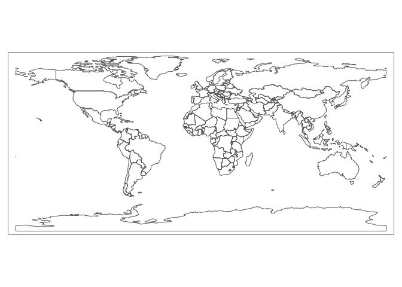
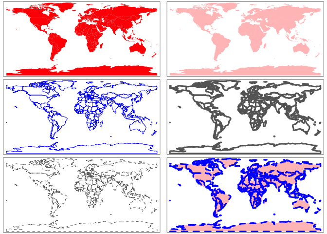
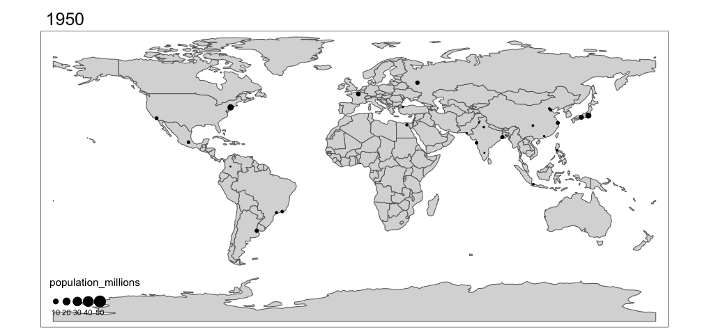

# An introduction to GIS in R

We will now start to work with spatial data (i.e. vector and raster) in
R.

Before we start, and if you are not using an R project, do not forget to
set your working directory

``` r
setwd("...")
# don't forget to set the directory to your own data folder!!
```

Next, load packages:

``` r
library(sf)
library(terra)
library(tidyverse)
```

There is a lot of information in the internet about geo-spatial data and
R. Here, I summarize the basic tools to conduct spatial analyses in R
with the goal that you will build your skills as we progress into some
study cases. I have modified some of the code from Claudia Engel
(<https://cengel.github.io/R-spatial/>). I recommend this site for a
more in depth tutorial.

## Vector Data in R

Vector data are composed of points, lines, and polygons.

-   **Points** are the simplest spatial object. Each point consists of a
    coordinate pair (X, Y) that is structured as a two-column matrix,
    with one column for latitude and another for longitude. Each point
    can also have *n* associated variables as attribute information. For
    instance, species occurrence data often have information on
    elevation, date, and habitat of each point recorded in the field, in
    addition to their X and Y coordinates. In such cases, the data will
    be a dataframe containing several columns, each corresponding to a
    different variable (e.g. Point ID, X coordinate, Y coordinate,
    elevation, date recorded, habitat type), while each row corresponds
    to a single point.

``` r
plot(st_point(c(0,0)))
plot(st_point(c(0.5,0.5)), add = T)
```


-   **Lines** (or polylines) are used to represent linear features such
    as rivers/streams, trails, streets, etc. A single line is composed
    of an ordered set of points (2D coordinates) that are connected by
    actual line segments, which allows us to calculate length/distance.

``` r
plot(st_linestring(matrix(runif(6), ncol=2)) )
```


-   **Polygons** are used to represent the extent of geographic
    features, such as city boundary, lakes, sampling plots, and habitat
    patches. Polygons are composed of several lines that close into a
    polygon, allowing us to calculate area and perimeter.

``` r
plot(st_polygon(list(rbind(c(0,0), c(1,0), c(1,1), c(0,1), c(0,0)))))
```


### A short, but important word about coordinates and projections

Any spatial data collected using GPS devices or downloaded online must
have a projection system that links the coordinates to specific
locations on the earth’s surface. Wiithout a coordinate reference
system, we cannot locate places on Earth.

Any given geospatial data (e.g. a set of points) with an incorrect
projection or with unknown projection system can be visualized on its
own. However, you will not be able to plot that spatial data with other
spatial data, as the coordinate reference system is missing.
Importantly, you will not be able to conduct any spatial analysis (e.g.,
calculate the distance of a given point to a road, or extract value of
the underlining raster value at the point locations), since the
incorrectly projected (or unprojected) spatial data is pointing to a
completely different location on earth than intended.

Spatial data without the correct projection system is basically useless.
When you acquire or download a geospatial data, make sure you know what
projection the data were originally made (this information is usually
found in the metadata of a given dataset).

There are EPSG Codes that can be used to avoid manually setting all the
parameters needed in a projection. For instance, the code EPSG:32637
codes for the UTM37N projection with WGS84 datum and ellipsoid. You can
find the EPSG reference list in the following link:
<http://spatialreference.org/ref/epsg/>

### R packages for Vector Data

There were two main packages in R to handle geospatial vector data: the
**sp** package and the **sf** package.

The first package to provide classes and methods for spatial data types
in R is called [`sp`](https://cran.r-project.org/package=sp).
Development of the `sp` package began in the early 2000s in an attempt
to standardize how spatial data would be treated in R and to allow for
better interoperability between different analysis packages that use
spatial data. The package (first release on CRAN in 2005) provides
classes and methods to create *points*, *lines*, *polygons*, and *grids*
and to operate them. About 350 packages developed for spatial analysis
use the data types implemented in `sp`, which means several spatial
packages “depend” on the `sp` package in some way.

The `sp` package depends on `rgeos` and `rgdal`. However at the end of
2023, these packages were retired, primarily because their maintainer,
Roger Bivand, has retired. You can read more about it
[here](https://r-spatial.org/r/2022/04/12/evolution.html).

All geospatial work in R is being replaced by the more modern package:
[`sf`](https://cran.r-project.org/package=sf)

It was first released on CRAN in late October 2016. It implements a
formal standard called [“Simple
Features”](https://en.wikipedia.org/wiki/Simple_Features) that specifies
a storage and access model of spatial geometries (i.e. points, lines,
polygons).

`sf` provides **fast** I/O, particularly relevant for large files.

### The `sf` Package

The sf class is an extension of data frames. Essentially, sf objects can
be treated as data frames that also contain spatial data, as opposed to
spatial data that may or may not also contain data frames. This enables
sf objects to fit within the `tidyverse` workflow, making it possible to
manipulate them with the `dplyr` commands we saw before.

sf objects consist of rows of features, hence the name “simple features
(sf)”, which have both non-spatial and spatial data formats.

The spatial data of an sf object is contained in a special geometry
column that is of class ‘sfc’. The geometry column contains the basic
types of spatial data: the Coordinate Reference System (CRS),
coordinates, and type of geometric object.

The ‘sfc’ class has seven subclasses to denote the types of geometric
objects within the geometry column, which are derived from the simple
features standard. The possible geometric objects are point, linestring,
polygon, multipoint, multilinestring, multipolygon, and
geometrycollection, which is used for any combination of the other
types.

Now lets do some operations using sf.

### Convert a data frame to a sf object

In your research you may create spreadsheets that contain data
associated with spatial coordinates. You already know how to read the
spreadsheet into a data frame with `read.table` or `read.csv`. We can
then very easily convert the table into a spatial object in R.

Lets start converting a data frame into a sf object. For this, our data
frame needs to have at least two columns indicating the coordinates of
points. This could be the location of animal observations recorded on
the field, for instance.

We will use the `st_as_sf()` function that uses a vector of the
coordinate columns for the ‘coords’ argument, and take either an EPSG
code or a PROJ definition for the crs.

``` r
mt_df <- read.csv("data/ke_major-towns.csv", header = TRUE)

# Create sf object with geo_data data frame and CRS
points_sf <- st_as_sf(mt_df, coords = c("lon", "lat"), crs = 4326)
print(points_sf)
```

    ## Simple feature collection with 55 features and 1 field
    ## Geometry type: POINT
    ## Dimension:     XY
    ## Bounding box:  xmin: 34.0701 ymin: -4.16856 xmax: 41.8401 ymax: 4.26594
    ## Geodetic CRS:  WGS 84
    ## First 10 features:
    ##     TOWN_NAME                 geometry
    ## 1      Moyale  POINT (39.0671 3.51502)
    ## 2     Mandera  POINT (41.8401 3.93175)
    ## 3       Wajir  POINT (40.0699 1.74579)
    ## 4    Marsabit  POINT (37.9998 2.32618)
    ## 5      Lodwar  POINT (35.6075 3.12534)
    ## 6   Lokitaung  POINT (35.7604 4.26594)
    ## 7      Kitale  POINT (35.0197 1.02763)
    ## 8     Eldoret  POINT (35.284 0.511704)
    ## 9  Kapenguria  POINT (35.1246 1.23239)
    ## 10    Bungoma POINT (34.5667 0.566278)

We now have a sf object containing the location of major towns in Kenya.

### Projections and reporjections

If you need to asign a CRS to an `sf` object, you can use the function
`st_set_crs()`.

To reproject an `sf` object, you can use the function `st_transform()`.
You need to provide the object and the new CRS.

Here, we are going to project the spatial object from WGS84 to UTM37N.

``` r
points_sf_UTM <- st_transform(points_sf, crs="+proj=utm +zone=37 +north +ellps=WGS84 +datum=WGS84 +units=m")
points_sf_UTM
```

    ## Simple feature collection with 55 features and 1 field
    ## Geometry type: POINT
    ## Dimension:     XY
    ## Bounding box:  xmin: -49256.84 ymin: -460773.8 xmax: 815422 ymax: 472280.3
    ## Projected CRS: +proj=utm +zone=37 +north +ellps=WGS84 +datum=WGS84 +units=m
    ## First 10 features:
    ##     TOWN_NAME                  geometry
    ## 1      Moyale POINT (507452.6 388520.5)
    ## 2     Mandera   POINT (815422 435119.7)
    ## 3       Wajir POINT (619005.1 192996.7)
    ## 4    Marsabit POINT (388788.2 257153.6)
    ## 5      Lodwar POINT (122836.8 346056.7)
    ## 6   Lokitaung POINT (140314.8 472280.3)
    ## 7      Kitale POINT (56804.23 113860.5)
    ## 8     Eldoret POINT (86226.52 56678.64)
    ## 9  Kapenguria POINT (68533.06 136530.5)
    ## 10    Bungoma POINT (6212.445 62779.85)

We can see that the projection is now UTM 37N.

### Reading Shapefiles into R

Reading shapefiles into R using the `sf` package is quite simple. We can
use the function `st_read()`

``` r
mammals <- st_read("data/ke_mammals_WGS84.shp")
```

    ## Reading layer `ke_mammals_WGS84' from data source 
    ##   `/Users/ramirocrego/Documents/GitHub/R-Tutorials/data/ke_mammals_WGS84.shp' 
    ##   using driver `ESRI Shapefile'
    ## Simple feature collection with 11128 features and 1 field
    ## Geometry type: POLYGON
    ## Dimension:     XY
    ## Bounding box:  xmin: 33.9207 ymin: -4.677568 xmax: 41.91134 ymax: 5.428362
    ## Geodetic CRS:  WGS 84

``` r
mammals
```

    ## Simple feature collection with 11128 features and 1 field
    ## Geometry type: POLYGON
    ## Dimension:     XY
    ## Bounding box:  xmin: 33.9207 ymin: -4.677568 xmax: 41.91134 ymax: 5.428362
    ## Geodetic CRS:  WGS 84
    ## First 10 features:
    ##    MAMMALS                       geometry
    ## 1       59 POLYGON ((35.72504 5.392665...
    ## 2       59 POLYGON ((35.6244 5.402578,...
    ## 3       60 POLYGON ((35.46943 5.427557...
    ## 4       59 POLYGON ((35.59788 5.412438...
    ## 5       60 POLYGON ((35.41483 5.426372...
    ## 6       59 POLYGON ((35.49558 5.428124...
    ## 7       58 POLYGON ((35.74144 5.381304...
    ## 8       59 POLYGON ((35.32218 5.424792...
    ## 9       60 POLYGON ((35.61533 5.405414...
    ## 10      59 POLYGON ((35.83205 5.343137...

> What kind of vector data is this?

### sf object manipulation

All sf objects can generally be treated as data frames when wrangling
the data. This makes it possible to use workflows from the tidyverse
package.

For instance, returning the subset of mammals as we did before, can be
done with dplyr’s `filter()` function.

Working with the `mammals` sf object, lets filter polygons that contain
more than 60 species of mammals

``` r
mammals_60 <- mammals %>% filter(MAMMALS > 60)
mammals_60
```

    ## Simple feature collection with 6884 features and 1 field
    ## Geometry type: POLYGON
    ## Dimension:     XY
    ## Bounding box:  xmin: 33.9207 ymin: -4.677568 xmax: 40.33287 ymax: 5.385777
    ## Geodetic CRS:  WGS 84
    ## First 10 features:
    ##    MAMMALS                       geometry
    ## 1       61 POLYGON ((35.49277 5.385777...
    ## 2       61 POLYGON ((35.73524 5.37106,...
    ## 3       61 POLYGON ((35.49269 5.362251...
    ## 4       61 POLYGON ((35.78922 5.358685...
    ## 5       61 POLYGON ((35.56057 5.294257...
    ## 6       61 POLYGON ((35.54746 5.28794,...
    ## 7       62 POLYGON ((35.49659 5.263432...
    ## 8       61 POLYGON ((35.7855 5.264725,...
    ## 9       61 POLYGON ((35.49269 5.261552...
    ## 10      61 POLYGON ((35.79181 5.251389...

We now have a new object with only polygons containing more than 60
species of mammals.

You can save this new object as a shapefile using the `st_write()`
function. You need to provide the sf object and the path and name where
you want to save the shapefile. By default, this function checks if the
file already exists, and if so it will not overwrite it. You can change
the parameter delete_layer = TRUE to overwrite a shapefile with the same
name.

``` r
st_write(mammals_60, "data/mammals_60", driver = "ESRI Shapefile", delete_layer = TRUE)
```

This is a very basic introduction to vector data. In future workflows,
we will learn to use more spatial tools to manipulate vector data.

Note that we have not plot any vector data yet. You can use the function
`plot()` to plot sf, but the plots are not great. We will learn to use
another package for making maps later.

## Raster Data in R

Raster processing is an important aspect of building spatial datasets
for further analysis. Doing so within [R](https://cran.r-project.org/)
can greatly help streamline workflows, allowing for all analyses to be
completed in a single program. Here, we will walk through a series of
steps to provide the basic skills necessary for image analysis.

A raster image is composed by pixels or cells. Each raster contains a
CRS, the coordinates of its origin, dimensions, and an array of cell
values.

The package `rater` was the main package to work with raster data in R.
In 2020, the package `terra` was released, and thanks to its greater
functionality and efficiency, has now replaced the `raster` package.

------------------------------------------------------------------------

For this exercise we will use a Landsat 8 image. Before we start
processing the image it is good to remember the different bands of
Landsat 8:

| Band    | Wavelength                                 | Useful for mapping                                                                                 |
|----------|------------------------|---------------------------------------|
| Band 1  | Coastal Aerosol 0.435 - 0.451              | Coastal and aerosol studies                                                                        |
| Band 2  | Blue 0.452 - 0.512                         | Bathymetric mapping, distinguishing soil from vegetation, and deciduous from coniferous vegetation |
| Band 3  | Green 0.533 - 0.590                        | Emphasizes peak vegetation, which is useful for assessing plant vigor                              |
| Band 4  | Red 0.636 - 0.673                          | Discriminates vegetation slopes                                                                    |
| Band 5  | Near Infrared (NIR) 0.851 - 0.879          | Emphasizes biomass content and shorelines                                                          |
| Band 6  | Short-wave Infrared (SWIR) 1 1.566 - 1.651 | Discriminates moisture content of soil and vegetation; penetrates thin clouds                      |
| Band 7  | Short-wave Infrared (SWIR) 2 2.107 - 2.294 | Improved moisture content of soil and vegetation and thin cloud penetration                        |
| Band 8  | Panchromatic 0.503 - 0.676                 | 15 meter resolution, sharper image definition                                                      |
| Band 9  | Cirrus 1.363 - 1.384                       | Improved detection of cirrus cloud contamination                                                   |
| Band 10 | TIRS 1 10.60 - 11.19                       | 100 meter resolution, thermal mapping and estimated soil moisture                                  |
| Band 11 | TIRS 2 11.50 - 12.51                       | 100 meter resolution, Improved thermal mapping and estimated soil moisture                         |
| BQA     |                                            | Landsat Collection 1 QA Bitmask                                                                    |

### Loading rasters

We use the function `rast()` to read a raster. In this case we are
reading the Landsat8 image.

``` r
Image <- rast("./data/Landsat8.tif") 
Image
```

    ## class       : SpatRaster 
    ## dimensions  : 795, 814, 12  (nrow, ncol, nlyr)
    ## resolution  : 30, 30  (x, y)
    ## extent      : 287430, 311850, -2490, 21360  (xmin, xmax, ymin, ymax)
    ## coord. ref. : WGS 84 / UTM zone 37N (EPSG:32637) 
    ## source      : Landsat8.tif 
    ## names       : B1, B2, B3, B4, B5, B6, ...

> Questions: What is the spatial resolution of this image? What is the
> CRS? How many bands are there?

If you only want to read the 11 bands, you can use the argument lyrs

``` r
Image2 <- rast("./data/Landsat8.tif", lyrs = c(1:11)) 
Image2
```

    ## class       : SpatRaster 
    ## dimensions  : 795, 814, 11  (nrow, ncol, nlyr)
    ## resolution  : 30, 30  (x, y)
    ## extent      : 287430, 311850, -2490, 21360  (xmin, xmax, ymin, ymax)
    ## coord. ref. : WGS 84 / UTM zone 37N (EPSG:32637) 
    ## source      : Landsat8.tif 
    ## names       : B1, B2, B3, B4, B5, B6, ...

### Querying the Image to Obtain Basic Image Information

Similar to a data.frame, raster objects store all the relevant
information to do data manipulation and/or visualization.

``` r
print(Image) # Alternatively, you could just type: ImageStack
```

    ## class       : SpatRaster 
    ## dimensions  : 795, 814, 12  (nrow, ncol, nlyr)
    ## resolution  : 30, 30  (x, y)
    ## extent      : 287430, 311850, -2490, 21360  (xmin, xmax, ymin, ymax)
    ## coord. ref. : WGS 84 / UTM zone 37N (EPSG:32637) 
    ## source      : Landsat8.tif 
    ## names       : B1, B2, B3, B4, B5, B6, ...

``` r
# Raster Class
class(Image)
```

    ## [1] "SpatRaster"
    ## attr(,"package")
    ## [1] "terra"

``` r
# Names of the raster layers
names(Image)
```

    ##  [1] "B1"         "B2"         "B3"         "B4"         "B5"         "B6"        
    ##  [7] "B7"         "B10"        "B11"        "sr_aerosol" "pixel_qa"   "radsat_qa"

``` r
# Summary statistics (min, max, quartiles)
summary(Image)
```

    ##        B1                B2                B3               B4               B5      
    ##  Min.   :-2000.0   Min.   :-2000.0   Min.   :  63.0   Min.   :  26.0   Min.   : 159  
    ##  1st Qu.:  263.0   1st Qu.:  333.0   1st Qu.: 571.0   1st Qu.: 660.0   1st Qu.:1964  
    ##  Median :  373.0   Median :  461.0   Median : 737.0   Median : 965.0   Median :2207  
    ##  Mean   :  372.6   Mean   :  459.4   Mean   : 733.6   Mean   : 935.2   Mean   :2236  
    ##  3rd Qu.:  481.0   3rd Qu.:  587.0   3rd Qu.: 890.0   3rd Qu.:1201.0   3rd Qu.:2467  
    ##  Max.   : 2189.0   Max.   : 2576.0   Max.   :3183.0   Max.   :3446.0   Max.   :6027  
    ##        B6             B7            B10            B11         sr_aerosol   
    ##  Min.   : 133   Min.   : 130   Min.   :2880   Min.   :2876   Min.   :  8.0  
    ##  1st Qu.:1882   1st Qu.:1253   1st Qu.:3010   1st Qu.:2992   1st Qu.: 96.0  
    ##  Median :2440   Median :1788   Median :3043   Median :3022   Median : 96.0  
    ##  Mean   :2421   Mean   :1754   Mean   :3030   Mean   :3011   Mean   :117.2  
    ##  3rd Qu.:2971   3rd Qu.:2251   3rd Qu.:3065   3rd Qu.:3043   3rd Qu.:160.0  
    ##  Max.   :5603   Max.   :5769   Max.   :3120   Max.   :3090   Max.   :228.0  
    ##     pixel_qa       radsat_qa
    ##  Min.   :322.0   Min.   :0  
    ##  1st Qu.:322.0   1st Qu.:0  
    ##  Median :322.0   Median :0  
    ##  Mean   :322.1   Mean   :0  
    ##  3rd Qu.:322.0   3rd Qu.:0  
    ##  Max.   :480.0   Max.   :0

``` r
# Spatial extent
ext(Image)
```

    ## SpatExtent : 287430, 311850, -2490, 21360 (xmin, xmax, ymin, ymax)

### Projections in rasters

You can check the projection of your raster using `crs`

``` r
crs(Image, proj = TRUE)
```

    ## [1] "+proj=utm +zone=37 +datum=WGS84 +units=m +no_defs"

To reproject a raster, you need to use the function `project()`. Note
that as the pixel position will slightly shift, you need to provide an
argument for the methods to recalculate the new pixel values. In
general, you use ‘bilinear’ for continuous data and ‘rgb’ for classes.

``` r
Imagelatlong <- project(Image, "+init=epsg:4326", method = 'bilinear')
crs(Imagelatlong, proj = TRUE)
```

    ## [1] "+proj=longlat +datum=WGS84 +no_defs"

### Image Plotting

Raster images can be plotted using a number of commands. Try a few
commands to see how the results differ.

``` r
# A plot of the image with lots of options
plot(Image,4)
```


``` r
# Plot a 3-band RGB image
plotRGB(Image, r=4, g=3, b=2, stretch = "lin", axes=TRUE, xlab="Easting", ylab="Northing", main="Landsat 8, Bands 4,3,2 (RGB) - True Color Composite")
```


``` r
# Plot a 3-band RGB image in false color composite
plotRGB(Image, r=5, g=4, b=3, stretch = "lin", axes=TRUE, xlab="Easting", ylab="Northing", main="Landsat 8, Bands 5,4,3 (RGB) - False Color Composite")
```


### Raster calculations

The real strength of the terra package is the ability to perform complex
mathematical operations.

**NDVI**

One of the most commonly used raster products in terrestrial ecology is
the Normalized Difference Vegetation Index (NDVI). Calculated from a
ratio of the red and near-infrared spectral bands, the index is a
measure of greenness (i.e. density of live green vegetation). NDVI
values are within the -1 to 1 range. Negative NDVI values (values
approaching -1) will likely correspond to water. Values close to zero
(-0.1 to 0.1) generally correspond to barren areas of rock, sand, or
snow. Low, positive values represent shrub and grassland (approximately
0.2 to 0.4), while high values indicate dense vegetation, such the ones
found in temperate and tropical forests (values approaching 1).

To calculate NDVI, we can do a simple math calculation to manipulate the
raster data layers. NDVI is:

$$NDVI = \frac{(NIR - red)}{(NIR + red)}$$
where red and NIR stand for the spectral reflectance measurements
acquired in the red (visible) and near-infrared regions of the
electromagnetic spectrum.

``` r
# Using standard math operators, rename the red band (band 3) and the near-infrared band (band 4) in the image.
redBand <- Image$B4
nirBand <- Image$B5

# Create NDVI
ndvi <- (nirBand-redBand)/(nirBand+redBand)

plot(ndvi)
```


``` r
hist(ndvi)
```


### Pixel Extraction

One of the most important items in raster processing is the development
of samples of spatial datasets for further analysis. We will see how to
extract pixel values from the NDVI raster. For this example, we will
create random points using the `st_sample()` function withing the
bounding box of the NDVI raster.

``` r
# Select random samples (pixels) from a raster
ranSamps <- st_sample(st_as_sfc(st_bbox(ndvi)), size=10, type = "random")
ranSamps <- st_as_sf(ranSamps) #Convert to simple feature collection
ranSamps
```

    ## Simple feature collection with 10 features and 0 fields
    ## Geometry type: POINT
    ## Dimension:     XY
    ## Bounding box:  xmin: 292068.2 ymin: 77.12263 xmax: 310030 ymax: 17777.86
    ## Projected CRS: WGS 84 / UTM zone 37N
    ##                            x
    ## 1  POINT (295831.9 17777.86)
    ## 2    POINT (310030 2293.435)
    ## 3  POINT (303601.2 13352.53)
    ## 4   POINT (302844.1 4027.15)
    ## 5  POINT (294212.5 8554.793)
    ## 6  POINT (297005.1 13707.58)
    ## 7   POINT (309315.6 7198.31)
    ## 8  POINT (292068.2 1823.133)
    ## 9  POINT (306276.2 77.12263)
    ## 10 POINT (294455.3 10740.94)

``` r
# Plot ndvi and the random points
plot(ndvi)
plot(ranSamps, add = T)
```


Now, we use the `extract()` function to get the NVDI pixel values.

``` r
ndvivalues <- terra::extract(ndvi, ranSamps) 
ndvivalues
```

    ##    ID        B5
    ## 1   1 0.3321814
    ## 2   2 0.7662683
    ## 3   3 0.2412420
    ## 4   4 0.4330097
    ## 5   5 0.3949742
    ## 6   6 0.2739954
    ## 7   7 0.4810256
    ## 8   8 0.6562108
    ## 9   9 0.8134258
    ## 10 10 0.4622988

This function is the base for many spatial analysis as it allows to
extract pixel values from locations that can then be used as predictor
variables in models. We will see that later on.

### Writing an Image

You can also save rasters to your hard drive so that it can be read into
other programs (e.g., ArcGIS, QGIS). Use the `writeRester()` function.

## Spatial operations

Now let’s conduct some simple analyses. Note that, for each
functionality we try to achieve here, there are multiple functions from
different packages that can do the same job. Here we only introduce one
way of doing it. When you are more familiar with R, you will develop
your own preference in specific packages and functions.

### Read in all the spatial data and visualize them together

``` r
birds <- st_read("data/Bird_pts.shp")
```

    ## Reading layer `Bird_pts' from data source 
    ##   `/Users/ramirocrego/Documents/GitHub/R-Tutorials/data/Bird_pts.shp' using driver `ESRI Shapefile'
    ## Simple feature collection with 20 features and 2 fields
    ## Geometry type: POINT
    ## Dimension:     XY
    ## Bounding box:  xmin: 746042.6 ymin: 4306606 xmax: 749343.3 ymax: 4309342
    ## Projected CRS: WGS 84 / UTM zone 17N

``` r
fences<- st_read("data/fences.shp")
```

    ## Reading layer `fences' from data source 
    ##   `/Users/ramirocrego/Documents/GitHub/R-Tutorials/data/fences.shp' using driver `ESRI Shapefile'
    ## Simple feature collection with 353 features and 13 fields
    ## Geometry type: LINESTRING
    ## Dimension:     XY
    ## Bounding box:  xmin: 744545.6 ymin: 4305558 xmax: 749943.7 ymax: 4310110
    ## Projected CRS: WGS 84 / UTM zone 17N

``` r
habitat<- st_read("data/habitat.shp")
```

    ## Reading layer `habitat' from data source 
    ##   `/Users/ramirocrego/Documents/GitHub/R-Tutorials/data/habitat.shp' using driver `ESRI Shapefile'
    ## Simple feature collection with 72 features and 7 fields
    ## Geometry type: POLYGON
    ## Dimension:     XY
    ## Bounding box:  xmin: 744545.6 ymin: 4305557 xmax: 749947.7 ymax: 4310110
    ## Projected CRS: WGS 84 / UTM zone 17N

``` r
roads<- st_read("data/roads.shp")
```

    ## Reading layer `roads' from data source 
    ##   `/Users/ramirocrego/Documents/GitHub/R-Tutorials/data/roads.shp' using driver `ESRI Shapefile'
    ## Simple feature collection with 108 features and 9 fields
    ## Geometry type: MULTILINESTRING
    ## Dimension:     XY
    ## Bounding box:  xmin: 744483.1 ymin: 4305488 xmax: 749995.6 ymax: 4310127
    ## Projected CRS: WGS 84 / UTM zone 17N

``` r
landcover<- rast("data/landcover.img") 
ndvi<- rast("data/ndvi250m.tif")
```

### Calculate distance to vector lines

``` r
canvas<- rast(ext(roads), crs=crs(roads), resolution=30)
road.r<- rasterize(roads, canvas)  # the distance function only works with raster data type, so here rasterize roads first
distance<- distance(road.r)
plot(distance)
plot(roads, add=T)
```

    ## Warning in plot.sf(roads, add = T): ignoring all but the first attribute


> What do you need to do to calculate the distance between each bird
> occurence location and the nearest road?

### Calculate buffer area along the vector line

Calculate 50m buffer and 500m buffer along the fence and plot the
results. Note that when plotting sf objects, a plot for each attribue is
created. To avoid multiple plots, we can extract the geometry and plot
that instead.

``` r
fence_50m<- st_buffer(fences, 50)
plot(st_geometry(fence_50m))
```


``` r
fence_100m<- st_buffer(fences, 100)
plot(st_geometry(fence_100m))
```


Now we want to: Convert the buffer polygon to raster and change the
values of all pixels within the 100m buffer area to 1, and the pixels
outside the buffer area to 0

``` r
rasterize.buff<- rasterize(fence_100m, ndvi, field=1, background=0)
#Notice here we used an existing layer named ndvi as the template of the newly rasterized raster, the new rasterized layer will adapt the extent, the projection, and the pixel size of the template, which is convenient to us.  
plot(rasterize.buff)
```


### Extract raster value at point location

Extract raster value at point locations, so we can quantify the
environmental value captured by other raster data at the customized
point locations. Notice that in order for the extract function to work,
the points and the raster data need to cover the same extent and have
the same projection.

``` r
landcover.extract<- terra::extract(landcover, birds)
birds   # this is the original data table
```

    ## Simple feature collection with 20 features and 2 fields
    ## Geometry type: POINT
    ## Dimension:     XY
    ## Bounding box:  xmin: 746042.6 ymin: 4306606 xmax: 749343.3 ymax: 4309342
    ## Projected CRS: WGS 84 / UTM zone 17N
    ## First 10 features:
    ##    id Presence                 geometry
    ## 1   1        1 POINT (748020.7 4308458)
    ## 2   2        1 POINT (747684.4 4308521)
    ## 3   3        1 POINT (747940.9 4308299)
    ## 4   4        1 POINT (749314.8 4308116)
    ## 5   5        1   POINT (748397 4308208)
    ## 6   6        1   POINT (749121 4307797)
    ## 7   7        1 POINT (748824.5 4307586)
    ## 8   8        1 POINT (749195.1 4307432)
    ## 9   9        1 POINT (749343.3 4307552)
    ## 10 10        1 POINT (748784.6 4307911)

``` r
birds.extract<- cbind(birds, landcover.extract)
birds.extract # inspect the differences
```

    ## Simple feature collection with 20 features and 4 fields
    ## Geometry type: POINT
    ## Dimension:     XY
    ## Bounding box:  xmin: 746042.6 ymin: 4306606 xmax: 749343.3 ymax: 4309342
    ## Projected CRS: WGS 84 / UTM zone 17N
    ## First 10 features:
    ##    id Presence ID landcover                 geometry
    ## 1   1        1  1        11 POINT (748020.7 4308458)
    ## 2   2        1  2        11 POINT (747684.4 4308521)
    ## 3   3        1  3        11 POINT (747940.9 4308299)
    ## 4   4        1  4        11 POINT (749314.8 4308116)
    ## 5   5        1  5        11   POINT (748397 4308208)
    ## 6   6        1  6        11   POINT (749121 4307797)
    ## 7   7        1  7        11 POINT (748824.5 4307586)
    ## 8   8        1  8        11 POINT (749195.1 4307432)
    ## 9   9        1  9        11 POINT (749343.3 4307552)
    ## 10 10        1 10        11 POINT (748784.6 4307911)

### Subset polygon based on attribute value

``` r
subset.habitat<- habitat %>% filter(HABITAT =="Oak")
par(mfrow= c(1,2))
plot(habitat)
```


``` r
plot(subset.habitat)
```


> How do you select only the polygon with area larger than 100,000
> square meters?

## Making pretty maps with R

R offers the opportunity to create beautiful high quality maps for
publication. This saves you from having to export all files to make the
final maps in other software, such as ArcGIS or QGIS.

Making maps is like art. Good maps can help enormously with presenting
your results to an audience. It takes skills and practice.

When combining R powerful data processing with visualization packages,
we can move beyond static maps. Here, we will learn the basics for
making three type of maps:

1.  Static maps
2.  Animated maps
3.  Interactive maps

We will use the ‘tmap’ package, which is a great new addition to R
tools. Tmap is a powerful and flexible package with a concise syntax
that is similar to ggplot2 users. It also has the unique capability to
generate static and interactive maps using the same code via
tmap_mode().

``` r
library(tmap)
library(spData)
```

Before we start using tmap, remember that you always have the help. Some
functions in tmap have lots of arguments that can be edited. We will
cover some basics here, hoping that you will explore more options on
your own.

### Static maps

We will use generic data to demonstrate the basics, and then use some of
the data from this chapter to create a publishable map.

Static maps are the most common and traditional outputs from geospatial
analysis.

Tmap syntax involves a separation between the input data and the
aesthetics for data visualization. Each input dataset can be displayed
in many different ways, largely depending on the nature of the data
(raster, points, polygons, etc.)

The dataset we are using here is the world object from the ‘spData’
package. It contains some variables from the World Bank.

In tmap the basic building block is `tm_shape()`, which creates a
tmap-element that defines input data as vector or raster objects. We can
then add one or more layer elements such as `tm_fill()`, `tm_borders()`,
`tm_dots()`, `tm_raster()`, depending what you want to display.

Here a simple example:

``` r
# Add fill layer to nz shape
data(world)
tm_shape(world) +
  tm_fill() 
```


``` r
# Add border layer to nz shape
tm_shape(world) +
  tm_borders() 
```



``` r
# Add fill and border layers to nz shape
tm_shape(world) +
  tm_fill() +
  tm_borders() 
```


Objects in tmap can be store with names, similar to ggplot, and then
called or used as starting point to add more objects.

``` r
map1 <- tm_shape(world) +
  tm_fill() +
  tm_borders() 
map1
```


If we want to add more objects (e.g., another shapefile), we use
`+ tm_shape(new_obj)`. When a new shape is added in this way, all
subsequent aesthetic functions refer to it, until another new shape is
added. This syntax allows the creation of maps with multiple shapes and
layers.

``` r
tm_shape(world) + 
    tm_borders() + 
tm_shape(urban_agglomerations) + 
    tm_dots(size = "population_millions")
```


In addition, you can change the aesthetics of the maps using either
variable fields (data in your shapefile) or constant values. The most
commonly used aesthetics for fill and border layers include color,
transparency, line width and line type, set with col, alpha, lwd, and
lty arguments, respectively.

Here some examples on using constant numbers and colors. Note the use of
`tmap_arrange` to plot multiple maps.

``` r
ma1 = tm_shape(world) + tm_fill(col = "red")
ma2 = tm_shape(world) + tm_fill(col = "red", alpha = 0.3)
ma3 = tm_shape(world) + tm_borders(col = "blue")
ma4 = tm_shape(world) + tm_borders(lwd = 3)
ma5 = tm_shape(world) + tm_borders(lty = 2)
ma6 = tm_shape(world) + tm_fill(col = "red", alpha = 0.3) +
  tm_borders(col = "blue", lwd = 3, lty = 2)
tmap_arrange(ma1, ma2, ma3, ma4, ma5, ma6)
```



But we can also color the maps based on some variable of interest. You
can use the default breaks for continuous variables or define your own.
‘n’ sets the number of bins into which numeric variables are categorized
and ‘palette’ defines the color scheme, which in the following example
is ‘BuGn’.

Lets plot population size by country:

``` r
tm_shape(world) + tm_polygons(col = "pop") #default breaks
```


``` r
breaks = c(0, 2, 5, 10, 100, 500, 2000) * 1000000 # customized breaks
tm_shape(world) + tm_polygons(col = "pop", breaks = breaks)
```


``` r
tm_shape(world) + tm_polygons(col = "pop", n = 5)
```


``` r
tm_shape(world) + tm_polygons(col = "pop", palette = "BuGn", breaks = breaks)
```


So far we have been editing the objects, but a good map needs other
elements in the layout. These include title, scale bar, north arrow, any
text, etc.

Additional elements such as north arrows and scale bars have their own
functions: `tm_compass()` and `tm_scale_bar()`. Here is an example on
how to add the north arrow.

``` r
tm_shape(world) + 
  tm_polygons(col = "pop", palette = "BuGn", breaks = breaks, title = "Population") +
  tm_compass(position = c("left", "top"))
```


### Animated maps

While static maps sometimes is all you need for a publication or a
poster, animated maps can be fantastic ways of showing change across
time in presentations or websites where you can display gifs or movies.

There are a few things we need to learn first. In tmaps, the functions
`tm_facets` generates faceted maps. There are some arguments that will
allow you to display change in several small maps in one figure or
animated change by changing the argument in tm_facets(). If you set
**by** we get several static maps side by side, if we set **along** we
get all maps displayed on top of each other, ready for producing an
animation.

For instance, a faceted map can look like this:

``` r
tm_shape(world) +
  tm_polygons() +
  tm_shape(urban_agglomerations) +
  tm_symbols(col = "black", border.col = "white", size = "population_millions") +
  tm_facets(by = "year", nrow = 4, free.coords = FALSE)
```

 As you
may notice, it can be difficult to visualize the difference between so
many maps when they’re displayed side by side. But if we set
`along = year` it uses all years available to create an animation. We
also want to set `free.coords = FALSE`, which maintains the map extent
for each map iteration. We then save the map as an object.

``` r
pop_anim <- tm_shape(world) + tm_polygons() + 
  tm_shape(urban_agglomerations) + tm_dots(size = "population_millions") +
  tm_facets(along = "year", free.coords = FALSE)
tmap_animation(pop_anim, filename = "urb_anim.gif", delay = 25)
```

    ## Creating frames

    ## ==========

    ## =====

    ## =====

    ## ======

    ## =====

    ## =====

    ## =====

    ## =====

    ## =====

    ## =====

    ## =====

    ## =====

    ## ======

    ## =====

    ## =====

    ## =====

    ## =====

    ## 
    ## Creating animation
    ## Animation saved to /Users/ramirocrego/Documents/GitHub/R-Tutorials/urb_anim.gif

Note that the .gif file will be saved to your directory. It will look
like this:

<figure>

<figcaption aria-hidden="true">World human population
change</figcaption>
</figure>

### Interactive maps

It was cool to make animated maps, but we can now take maps to a new
level with interactive maps. The release of the ‘leaflet’ package in
2015 revolutionized interactive web map creation from within R and a
number of packages have built on it since then.

Here we will learn how to create interactive maps using tmaps. Tmaps has
a unique function that allows to display your maps as static or
interactive. The only caution is that certain features such as scale
bars and north arrows are not displayed or used in interactive mode. It
also has some limitations on the legends that can be created. But
depending on the purpose, it is worth how much you gain.

All you need to do is switching to view mode, using the command
`tmap_mode("view")`.

Lets display one of our previous maps on the interactive mode:

``` r
tmap_mode("view")
```

    ## tmap mode set to interactive viewing

``` r
tm_shape(world) + tm_polygons(col = "pop", palette = "BuGn", breaks = breaks, title = "Population size in millions")
```

<div id="interactive-maps" class="section level3" number="4.4.3">
<div name="443_Interactive_maps" data-unique="443_Interactive_maps"></div><h3><span class="header-section-number">4.4.3</span> Interactive
maps</h3>
<p>It was cool to make animated maps, but we can now take maps to a new
level with interactive maps. The release of the ‘leaflet’ package in
2015 revolutionized interactive web map creation from within R and a
number of packages have built on it since then.</p>
<p>Here we will learn how to create interactive maps using tmaps. Tmaps
has a unique function that allows to display your maps as static or
interactive. The only caution is that certain features such as scale
bars and north arrows are not displayed or used in interactive mode. It
also has some limitations on the legends that can be created. But
depending on the purpose, it is worth how much you gain.</p>
<p>All you need to do is switching to view mode, using the command
<code>tmap_mode("view")</code>.</p>
<p>Lets display one of our previous maps on the interactive mode:</p>
<pre class="r"><code class="hljs">tmap_mode(<span class="hljs-string">"view"</span>)</code></pre>
<pre><code class="hljs">## tmap mode set to interactive viewing</code></pre>
<pre class="r"><code class="hljs">tm_shape(world) + tm_polygons(col = <span class="hljs-string">"pop"</span>, palette = <span class="hljs-string">"BuGn"</span>, breaks = breaks, title = <span class="hljs-string">"Population size in millions"</span>)</code></pre>
<div class="leaflet html-widget html-fill-item html-widget-static-bound leaflet-container leaflet-touch leaflet-retina leaflet-safari leaflet-fade-anim leaflet-grab leaflet-touch-drag leaflet-touch-zoom" id="htmlwidget-4e6e3f3a8ff9dc12b56f" style="width: 672px; height: 480px; position: relative; outline: currentcolor;" tabindex="0"><div class="leaflet-pane leaflet-map-pane" style="transform: translate3d(0px, 0px, 0px);"><div class="leaflet-pane leaflet-tile-pane"><div class="leaflet-layer " style="z-index: 1; opacity: 1;"><div class="leaflet-tile-container leaflet-zoom-animated" style="z-index: 17; transform: translate3d(-365px, -73px, 0px) scale(2);"></div><div class="leaflet-tile-container leaflet-zoom-animated" style="z-index: 18; transform: translate3d(-365px, -73px, 0px) scale(1);"></div></div></div><div class="leaflet-pane leaflet-shadow-pane"></div><div class="leaflet-pane leaflet-overlay-pane"></div><div class="leaflet-pane leaflet-marker-pane"></div><div class="leaflet-pane leaflet-tooltip-pane"></div><div class="leaflet-pane leaflet-popup-pane"></div><div class="leaflet-proxy leaflet-zoom-animated" style="transform: translate3d(285px, 313px, 0px) scale(1);"></div><div class="leaflet-pane leaflet-tmap401-pane" style="z-index: 401;"><svg pointer-events="none" class="leaflet-zoom-animated" width="806" height="576" viewBox="-67 -48 806 576" style="transform: translate3d(-67px, -48px, 0px);"><g><path class="leaflet-interactive" stroke="#666666" stroke-opacity="1" stroke-width="1" stroke-linecap="round" stroke-linejoin="round" stroke-dasharray="none" fill="#ECF8FA" fill-opacity="1" fill-rule="evenodd" d="M51 207L51 206zM560 208L559 209L561 208zM563 207L562 207z"></path><path class="leaflet-interactive" stroke="#666666" stroke-opacity="1" stroke-width="1" stroke-linecap="round" stroke-linejoin="round" stroke-dasharray="none" fill="#5ABB95" fill-opacity="1" fill-rule="evenodd" d="M355 184L350 185L351 188L349 191L351 195L359 200L363 199L363 190L355 185z"></path><path class="leaflet-interactive" stroke="#666666" stroke-opacity="1" stroke-width="1" stroke-linecap="round" stroke-linejoin="round" stroke-dasharray="none" fill="#BFBFBF" fill-opacity="1" fill-rule="evenodd" d="M295 142L292 143L287 148L287 150L283 152L289 152L288 150L290 145L295 145L295 142z"></path><path class="leaflet-interactive" stroke="#666666" stroke-opacity="1" stroke-width="1" stroke-linecap="round" stroke-linejoin="round" stroke-dasharray="none" fill="#5ABB95" fill-opacity="1" fill-rule="evenodd" d="M118 91L120 96L120 91zM131 104L128 100L124 99L125 101L131 104zM132 11L134 13L142 7L142 2L138 3L132 11zM132 103L172 103L177 105L181 104L188 110L190 110L189 118L195 115L194 114L198 114L201 111L207 110L209 106L211 107L212 111L215 111L213 112L213 114L220 111L222 109L221 107L220 109L215 109L214 105L216 103L214 102L209 104L207 107L213 100L222 100L223 98L228 96L228 93L219 86L220 84L215 75L211 81L210 79L208 79L208 73L205 72L202 68L196 69L197 76L195 79L198 85L196 89L193 90L195 95L193 98L191 96L190 89L178 83L176 84L174 79L172 79L172 75L176 67L178 67L179 63L183 61L185 55L186 56L191 53L191 45L185 42L183 53L181 50L182 47L180 45L178 48L178 44L176 43L177 41L172 33L170 36L170 41L173 45L170 52L170 49L168 47L167 50L163 51L156 46L152 48L154 50L152 52L151 50L146 51L143 50L145 48L143 46L140 46L134 42L130 44L130 41L128 44L126 40L118 44L116 43L113 46L106 43L106 75L108 75L112 79L114 76L122 87L121 91L125 95L126 99L132 103zM134 21L129 22L131 25L128 33L132 38L136 36L137 30L143 26L140 22L136 22zM149 -2L146 1L148 3L151 -1zM149 -6L148 -7L147 -4L149 -3L151 -5zM154 13L153 8L151 7L150 10L152 15L149 15L147 11L143 9L140 17L148 17L145 19L145 21L147 21L156 18L157 15L155 12zM155 25L157 29L157 25zM156 28L153 28L153 34L151 28L149 31L147 28L144 30L145 28L143 27L138 31L137 35L142 36L139 38L147 40L141 41L140 42L142 45L146 47L152 47L155 45L161 47L163 41L158 37L157 30zM157 -10L157 -7L159 -5L157 -3L161 -3L165 0L164 -6L160 -9zM164 30L161 29L166 36L169 34L169 24L164 24L163 26zM167 8L161 10L161 15L164 14L164 17L167 18L168 11zM169 -6L167 -7L167 -1L169 0L171 -1L171 -3zM170 44L167 41L165 44L170 47L171 45zM170 -21L170 -13L172 -11L175 -11L173 -9L173 -6L175 -3L178 -2L185 -10L182 -18L177 -22L176 -27L172 -26L173 -24L171 -23zM173 22L170 26L171 33L173 33L174 29L176 28L178 24L176 23zM174 3L173 1L170 1L173 3zM174 18L172 14L169 18L173 20zM177 -33L177 -29L182 -20L191 -19L188 -16L183 -18L186 -8L183 -6L182 -3L184 -2L186 3L182 0L182 5L180 6L180 9L189 9L192 11L196 7L194 6L196 0L200 -4L200 -9L198 -10L206 -14L208 -21L211 -23L214 -29L211 -29L216 -33L219 -40L216 -44L206 -47L199 -45L199 -47L192 -45L190 -43L189 -37L185 -41L183 -37L179 -35zM182 21L193 20L192 14L189 13L182 15L178 12L177 7L169 5L169 8L173 10L175 13L176 19L179 20zM188 68L191 68L189 67zM188 60L186 60L186 58L184 61L183 65L185 65L185 67L189 63L190 65L193 64L191 64L191 62L189 61zM193 70L194 71L193 69zM194 29L199 29L196 25L193 24L192 26zM195 31L192 33L190 24L186 26L185 30L185 24L181 25L179 36L181 36L181 40L186 42L191 43L195 41L199 45L198 46L203 49L204 52L201 57L202 59L196 59L195 62L201 62L206 67L213 70L209 64L215 68L215 65L210 56L212 55L216 60L219 54L217 54L215 50L209 47L212 45L209 39L206 38L204 35L202 36L196 29zM200 52L199 48L197 51L199 53zM215 101L218 103L219 102L216 101zM216 107L215 108L219 108L216 108zM228 98L225 99L222 105L228 107L230 106L231 108L231 102L227 100L226 101L227 99z"></path><path class="leaflet-interactive" stroke="#666666" stroke-opacity="1" stroke-width="1" stroke-linecap="round" stroke-linejoin="round" stroke-dasharray="none" fill="#319B5C" fill-opacity="1" fill-rule="evenodd" d="M63 64L63 66L67 66L64 65zM70 75L71 75zM80 151L80 151zM82 151L83 152L82 151zM84 152L84 152zM85 153L84 152L85 153zM86 154L86 156L86 154zM89 81L87 83L88 85L91 82L90 81zM106 43L103 41L101 42L94 39L90 39L91 38L87 39L84 36L75 42L73 46L71 46L70 48L77 56L74 57L74 55L68 58L72 62L77 61L78 63L75 67L74 66L72 68L72 73L74 76L77 77L77 79L84 79L81 84L72 90L75 90L79 87L80 88L88 81L88 78L93 72L91 78L96 76L96 74L98 73L102 76L107 76L111 80L115 81L119 85L119 88L122 87L114 76L112 79L108 75L106 75L106 43zM132 103L133 107L130 104L130 119L135 130L149 136L156 135L158 139L163 139L167 145L169 145L169 142L172 139L180 140L180 138L187 138L192 146L193 143L191 136L199 129L198 123L199 126L200 122L202 121L201 120L208 117L206 116L212 112L210 106L207 108L206 111L201 111L194 114L195 115L190 118L190 110L188 110L181 104L177 105L172 103L136 103z"></path><path class="leaflet-interactive" stroke="#666666" stroke-opacity="1" stroke-width="1" stroke-linecap="round" stroke-linejoin="round" stroke-dasharray="none" fill="#5ABB95" fill-opacity="1" fill-rule="evenodd" d="M431 102L426 99L421 99L416 91L411 93L412 91L408 91L408 89L405 88L394 91L395 94L393 94L394 95L392 96L395 98L394 99L386 99L379 97L376 99L376 101L375 100L373 102L374 106L377 108L382 107L382 111L381 110L379 112L380 115L386 118L387 111L390 110L395 114L401 115L402 119L405 120L405 118L409 115L421 116L421 111L424 111L425 106L428 107L430 104z"></path><path class="leaflet-interactive" stroke="#666666" stroke-opacity="1" stroke-width="1" stroke-linecap="round" stroke-linejoin="round" stroke-dasharray="none" fill="#5ABB95" fill-opacity="1" fill-rule="evenodd" d="M387 118L390 116L393 119L395 118L396 121L403 126L403 122L406 119L408 119L407 120L409 121L411 119L408 119L408 117L405 118L405 120L402 119L401 115L395 114L390 110L387 111z"></path><path class="leaflet-interactive" stroke="#666666" stroke-opacity="1" stroke-width="1" stroke-linecap="round" stroke-linejoin="round" stroke-dasharray="none" fill="#92D5C4" fill-opacity="1" fill-rule="evenodd" d="M508 187L508 196L512 194L515 195L516 197L521 198L518 194L516 194L517 192L513 188L510 188zM522 191L524 190L523 189L519 191L521 192zM524 188L521 187L525 189zM527 191L529 193L528 191z"></path><path class="leaflet-interactive" stroke="#666666" stroke-opacity="1" stroke-width="1" stroke-linecap="round" stroke-linejoin="round" stroke-dasharray="none" fill="#319B5C" fill-opacity="1" fill-rule="evenodd" d="M455 185L455 183L452 180L443 175L452 188L456 191L458 189L458 187L456 186zM461 192L458 191L457 193L464 195L472 195L465 192L461 193zM475 177L471 178L470 181L463 181L462 184L464 187L468 187L470 189L472 188L475 182L474 178zM475 195L473 196L476 195zM478 198L478 196L476 197zM480 195L478 195L481 195zM482 182L479 181L477 183L477 191L478 187L482 189L481 191L482 190L480 186L482 184L478 184L479 182L483 183L485 181L483 182zM485 196L483 196L483 198L485 196zM487 188L488 187L486 188zM489 180L488 182L490 184L489 181zM491 187L489 187L493 187zM498 193L498 192zM508 187L502 185L500 188L498 187L498 185L493 184L497 186L496 189L497 188L503 191L503 194L508 196L508 191z"></path><path class="leaflet-interactive" stroke="#666666" stroke-opacity="1" stroke-width="1" stroke-linecap="round" stroke-linejoin="round" stroke-dasharray="none" fill="#5ABB95" fill-opacity="1" fill-rule="evenodd" d="M209 271L209 277L214 278L214 276L212 276L210 272zM225 228L231 223L230 221L228 224L225 224L225 221L222 218L220 218L218 215L213 215L207 227L208 235L205 245L206 254L203 264L205 270L209 271L209 267L214 259L212 259L211 257L217 250L214 247L218 247L218 243L223 243L226 240L226 237L224 235L225 229z"></path><path class="leaflet-interactive" stroke="#666666" stroke-opacity="1" stroke-width="1" stroke-linecap="round" stroke-linejoin="round" stroke-dasharray="none" fill="#5ABB95" fill-opacity="1" fill-rule="evenodd" d="M208 208L205 234L202 242L203 244L201 251L202 252L203 249L204 250L203 254L201 253L201 256L199 258L202 259L199 262L200 270L205 274L208 271L205 270L203 266L206 254L204 249L208 235L207 227L212 217L209 213L209 209zM209 271L207 272L206 275L202 272L203 275L209 279L212 277L209 277z"></path><path class="leaflet-interactive" stroke="#666666" stroke-opacity="1" stroke-width="1" stroke-linecap="round" stroke-linejoin="round" stroke-dasharray="none" fill="#5ABB95" fill-opacity="1" fill-rule="evenodd" d="M349 189L349 182L351 180L349 176L334 176L330 187L328 190L327 189L325 191L330 191L332 195L338 193L339 199L343 199L348 202L349 200L347 200L347 196L350 195L349 191z"></path><path class="leaflet-interactive" stroke="#666666" stroke-opacity="1" stroke-width="1" stroke-linecap="round" stroke-linejoin="round" stroke-dasharray="none" fill="#5ABB95" fill-opacity="1" fill-rule="evenodd" d="M366 185L375 177L379 170L379 166L371 176L365 179L365 184z"></path><path class="leaflet-interactive" stroke="#666666" stroke-opacity="1" stroke-width="1" stroke-linecap="round" stroke-linejoin="round" stroke-dasharray="none" fill="#5ABB95" fill-opacity="1" fill-rule="evenodd" d="M363 190L366 185L365 179L367 177L362 178L357 175L355 177L357 180L355 185L361 188z"></path><path class="leaflet-interactive" stroke="#666666" stroke-opacity="1" stroke-width="1" stroke-linecap="round" stroke-linejoin="round" stroke-dasharray="none" fill="#5ABB95" fill-opacity="1" fill-rule="evenodd" d="M341 171L343 168L347 170L350 168L351 169L354 165L355 171L359 164L359 160L362 157L359 151L343 151L343 154L341 154L341 161L340 160L338 165L341 171zM341 171L342 171z"></path><path class="leaflet-interactive" stroke="#666666" stroke-opacity="1" stroke-width="1" stroke-linecap="round" stroke-linejoin="round" stroke-dasharray="none" fill="#5ABB95" fill-opacity="1" fill-rule="evenodd" d="M341 155L330 149L328 150L329 159L326 162L328 164L329 169L327 169L330 172L333 172L339 167L338 164L340 160L341 161z"></path><path class="leaflet-interactive" stroke="#666666" stroke-opacity="1" stroke-width="1" stroke-linecap="round" stroke-linejoin="round" stroke-dasharray="none" fill="#5ABB95" fill-opacity="1" fill-rule="evenodd" d="M205 154L203 154L204 156L201 156L204 157L205 155z"></path><path class="leaflet-interactive" stroke="#666666" stroke-opacity="1" stroke-width="1" stroke-linecap="round" stroke-linejoin="round" stroke-dasharray="none" fill="#5ABB95" fill-opacity="1" fill-rule="evenodd" d="M205 157L210 156L208 154L206 154L205 156z"></path><path class="leaflet-interactive" stroke="#666666" stroke-opacity="1" stroke-width="1" stroke-linecap="round" stroke-linejoin="round" stroke-dasharray="none" fill="#319B5C" fill-opacity="1" fill-rule="evenodd" d="M563 38L563 35L561 38zM510 92L509 91L510 92L508 96L509 109L511 109L511 102L513 103L511 99L511 94zM518 16L515 15L517 19L520 19L521 17zM51 60L51 57L53 56L53 58L55 58L60 63L62 62L62 59L65 57L63 54L59 53L59 56L58 52L51 46zM51 38L54 37L51 35zM563 60L563 46L557 42L549 41L550 46L548 47L546 43L536 44L534 43L533 38L525 38L521 35L520 32L507 29L505 31L506 35L503 36L500 34L497 36L495 34L494 38L491 36L491 31L488 25L482 24L482 28L476 28L476 25L471 24L468 26L468 23L466 24L463 22L469 16L468 11L465 8L460 9L459 6L456 5L458 4L455 1L452 4L450 10L448 9L444 13L443 11L435 14L433 17L431 17L429 21L430 23L422 25L423 34L420 31L415 33L416 37L414 36L414 29L414 32L411 35L413 39L412 45L414 46L414 50L410 56L408 56L412 48L410 46L411 40L409 36L411 32L410 29L406 28L402 37L402 44L404 44L405 47L404 49L397 43L393 42L392 44L394 46L392 48L391 46L389 48L383 49L384 46L375 51L375 54L373 54L373 49L369 47L370 57L368 55L364 59L365 61L363 62L360 60L360 64L357 62L357 57L354 55L355 54L362 57L364 56L365 52L359 45L353 42L351 43L347 48L350 51L348 53L350 57L350 65L352 67L347 74L348 76L346 82L347 86L351 88L353 92L352 96L355 95L359 100L364 102L364 104L361 106L363 107L359 111L369 116L372 116L374 119L376 117L373 112L377 108L373 104L373 102L375 100L376 101L376 99L379 97L386 99L394 99L395 98L392 96L394 95L393 94L395 94L394 92L400 91L405 88L408 89L408 91L412 91L411 93L416 90L421 99L426 98L431 102L438 99L445 101L447 100L446 98L448 96L452 98L452 100L458 100L464 103L470 100L475 102L479 96L479 93L485 93L489 101L493 103L493 105L499 104L496 111L493 111L493 116L496 116L504 109L506 104L508 94L506 91L499 90L509 78L528 78L526 76L530 72L534 70L535 74L539 68L541 68L540 72L529 84L528 88L530 98L532 94L535 93L535 91L538 89L537 88L539 82L537 82L540 76L544 76L547 74L549 76L559 68L562 69L561 63L559 62L563 60zM383 24L384 25L380 35L383 36L383 38L388 39L386 31L390 21L395 16L404 11L404 6L389 14L386 17L387 20zM339 91L339 89L337 88L335 89L337 91zM371 -21L374 -20L373 -18L375 -16L380 -20L378 -23L376 -20L376 -22L374 -22zM504 11L502 16L505 20L512 19L513 15L508 12zM506 26L511 27L509 24L507 24zM440 -24L437 -18L439 -17L440 -11L442 -8L446 -6L449 -7L449 -14L443 -26zM453 -10L451 -9L448 0L456 -3L457 -6z"></path><path class="leaflet-interactive" stroke="#666666" stroke-opacity="1" stroke-width="1" stroke-linecap="round" stroke-linejoin="round" stroke-dasharray="none" fill="#ECF8FA" fill-opacity="1" fill-rule="evenodd" d="M195 143L196 144L195 143zM196 146L196 148L196 146zM196 143L197 144z"></path><path class="leaflet-interactive" stroke="#666666" stroke-opacity="1" stroke-width="1" stroke-linecap="round" stroke-linejoin="round" stroke-dasharray="none" fill="#BFBFBF" fill-opacity="1" fill-rule="evenodd" d="M220 270L221 271L225 269L222 268z"></path><path class="leaflet-interactive" stroke="#666666" stroke-opacity="1" stroke-width="1" stroke-linecap="round" stroke-linejoin="round" stroke-dasharray="none" fill="#BFBFBF" fill-opacity="1" fill-rule="evenodd" d="M329 -13L327 -13L326 -16L322 -13L323 -7L328 1L327 4L330 7L334 -5L338 -7L331 -16L329 -16zM342 0L340 -1L340 -4L337 -2L336 2L339 3zM346 -16L340 -21L338 -19L336 -21L332 -18L333 -14L335 -14L336 -12L344 -12zM351 43L350 41L352 40L347 37L342 37L340 41L334 42L328 50L322 62L315 68L315 80L317 81L322 77L323 79L325 72L324 66L325 63L327 62L326 61L331 49L333 47L335 48L335 45L337 44L342 47L344 45L344 42L346 41L349 45z"></path><path class="leaflet-interactive" stroke="#666666" stroke-opacity="1" stroke-width="1" stroke-linecap="round" stroke-linejoin="round" stroke-dasharray="none" fill="#ECF8FA" fill-opacity="1" fill-rule="evenodd" d="M240 -40L240 -36L244 -30L235 -38L232 -33L230 -36L221 -34L218 -31L218 -27L211 -20L210 -16L214 -14L214 -11L203 -4L203 -1L206 2L212 4L205 6L210 12L220 11L224 15L229 30L228 34L234 39L231 38L229 40L229 43L231 45L235 42L234 47L232 48L230 53L233 63L237 72L241 73L243 76L246 73L246 68L250 59L258 54L262 49L268 48L275 41L270 41L271 35L274 40L276 39L276 35L272 31L275 32L273 27L277 26L278 24L276 22L279 22L279 12L276 8L281 6L279 2L279 -6L282 -17L278 -17L283 -18L290 -27L289 -31L285 -33L274 -26L276 -31L274 -35L272 -32L267 -35L262 -34L262 -36L275 -37L277 -42L270 -49L251 -49L250 -47L245 -47z"></path><path class="leaflet-interactive" stroke="#666666" stroke-opacity="1" stroke-width="1" stroke-linecap="round" stroke-linejoin="round" stroke-dasharray="none" fill="#BFBFBF" fill-opacity="1" fill-rule="evenodd" d="M405 262L405 264L407 265L406 263z"></path><path class="leaflet-interactive" stroke="#666666" stroke-opacity="1" stroke-width="1" stroke-linecap="round" stroke-linejoin="round" stroke-dasharray="none" fill="#ECF8FA" fill-opacity="1" fill-rule="evenodd" d="M485 196L488 195L485 195z"></path><path class="leaflet-interactive" stroke="#666666" stroke-opacity="1" stroke-width="1" stroke-linecap="round" stroke-linejoin="round" stroke-dasharray="none" fill="#5ABB95" fill-opacity="1" fill-rule="evenodd" d="M330 225L333 231L333 235L335 236L339 234L345 234L350 230L354 222L351 222L351 215L349 215L343 221L340 220L337 223L335 219L335 225L331 225zM348 226L349 227L347 229L345 228L348 226z"></path><path class="leaflet-interactive" stroke="#666666" stroke-opacity="1" stroke-width="1" stroke-linecap="round" stroke-linejoin="round" stroke-dasharray="none" fill="#D0EDE9" fill-opacity="1" fill-rule="evenodd" d="M348 226L345 228L346 229L349 227z"></path><path class="leaflet-interactive" stroke="#666666" stroke-opacity="1" stroke-width="1" stroke-linecap="round" stroke-linejoin="round" stroke-dasharray="none" fill="#319B5C" fill-opacity="1" fill-rule="evenodd" d="M140 134L145 141L144 142L151 150L151 148L144 139L144 135L147 138L147 140L155 148L160 157L176 162L178 157L182 157L184 152L180 152L178 153L177 156L173 157L170 155L168 152L169 145L167 145L163 139L160 140L156 135L149 136L142 134z"></path><path class="leaflet-interactive" stroke="#666666" stroke-opacity="1" stroke-width="1" stroke-linecap="round" stroke-linejoin="round" stroke-dasharray="none" fill="#D0EDE9" fill-opacity="1" fill-rule="evenodd" d="M225 228L224 233L225 235L229 236L231 232L226 228z"></path><path class="leaflet-interactive" stroke="#666666" stroke-opacity="1" stroke-width="1" stroke-linecap="round" stroke-linejoin="round" stroke-dasharray="none" fill="#319B5C" fill-opacity="1" fill-rule="evenodd" d="M231 234L238 225L238 221L241 218L249 215L253 200L258 193L256 190L250 187L244 187L241 184L238 185L238 183L235 183L236 182L234 178L231 180L227 179L223 181L222 176L217 178L216 177L216 181L213 182L211 180L207 182L208 189L203 191L202 195L207 199L214 197L214 199L220 202L221 205L225 208L225 215L227 215L228 218L230 218L229 221L231 222L225 228L231 231L231 233z"></path><path class="leaflet-interactive" stroke="#666666" stroke-opacity="1" stroke-width="1" stroke-linecap="round" stroke-linejoin="round" stroke-dasharray="none" fill="#5ABB95" fill-opacity="1" fill-rule="evenodd" d="M208 199L208 208L211 216L218 215L219 211L225 211L225 209L221 206L220 202L214 200L214 198L212 197L209 199z"></path><path class="leaflet-interactive" stroke="#666666" stroke-opacity="1" stroke-width="1" stroke-linecap="round" stroke-linejoin="round" stroke-dasharray="none" fill="#5ABB95" fill-opacity="1" fill-rule="evenodd" d="M208 189L206 186L200 183L198 187L196 187L194 190L191 190L191 192L194 193L197 201L199 202L198 203L207 210L209 207L209 201L207 197L204 197L202 195L202 193L206 189z"></path><path class="leaflet-interactive" stroke="#666666" stroke-opacity="1" stroke-width="1" stroke-linecap="round" stroke-linejoin="round" stroke-dasharray="none" fill="#5ABB95" fill-opacity="1" fill-rule="evenodd" d="M212 181L211 174L205 173L203 170L205 166L201 167L196 173L196 182L207 187L206 188L208 189L207 183L211 180L212 181z"></path><path class="leaflet-interactive" stroke="#666666" stroke-opacity="1" stroke-width="1" stroke-linecap="round" stroke-linejoin="round" stroke-dasharray="none" fill="#D0EDE9" fill-opacity="1" fill-rule="evenodd" d="M197 171L195 169L189 170L192 173L194 171L196 171L196 173L197 171z"></path><path class="leaflet-interactive" stroke="#666666" stroke-opacity="1" stroke-width="1" stroke-linecap="round" stroke-linejoin="round" stroke-dasharray="none" fill="#D0EDE9" fill-opacity="1" fill-rule="evenodd" d="M190 169L185 167L185 169L189 171L189 169z"></path><path class="leaflet-interactive" stroke="#666666" stroke-opacity="1" stroke-width="1" stroke-linecap="round" stroke-linejoin="round" stroke-dasharray="none" fill="#92D5C4" fill-opacity="1" fill-rule="evenodd" d="M188 167L188 161L182 164L188 168z"></path><path class="leaflet-interactive" stroke="#666666" stroke-opacity="1" stroke-width="1" stroke-linecap="round" stroke-linejoin="round" stroke-dasharray="none" fill="#92D5C4" fill-opacity="1" fill-rule="evenodd" d="M189 161L183 160L180 162L184 164L188 161z"></path><path class="leaflet-interactive" stroke="#666666" stroke-opacity="1" stroke-width="1" stroke-linecap="round" stroke-linejoin="round" stroke-dasharray="none" fill="#92D5C4" fill-opacity="1" fill-rule="evenodd" d="M180 162L179 163L182 164L180 162z"></path><path class="leaflet-interactive" stroke="#666666" stroke-opacity="1" stroke-width="1" stroke-linecap="round" stroke-linejoin="round" stroke-dasharray="none" fill="#5ABB95" fill-opacity="1" fill-rule="evenodd" d="M176 162L179 163L182 160L180 160L179 157L176 162z"></path><path class="leaflet-interactive" stroke="#666666" stroke-opacity="1" stroke-width="1" stroke-linecap="round" stroke-linejoin="round" stroke-dasharray="none" fill="#ECF8FA" fill-opacity="1" fill-rule="evenodd" d="M180 157L180 160L182 156L180 157z"></path><path class="leaflet-interactive" stroke="#666666" stroke-opacity="1" stroke-width="1" stroke-linecap="round" stroke-linejoin="round" stroke-dasharray="none" fill="#5ABB95" fill-opacity="1" fill-rule="evenodd" d="M221 176L220 173L222 171L218 168L215 169L207 166L205 167L206 170L204 169L206 166L203 168L204 173L211 175L211 179L213 182L217 180L215 178L216 177L217 178L221 176z"></path><path class="leaflet-interactive" stroke="#666666" stroke-opacity="1" stroke-width="1" stroke-linecap="round" stroke-linejoin="round" stroke-dasharray="none" fill="#ECF8FA" fill-opacity="1" fill-rule="evenodd" d="M227 180L224 177L226 174L222 171L220 175L223 181L226 180z"></path><path class="leaflet-interactive" stroke="#666666" stroke-opacity="1" stroke-width="1" stroke-linecap="round" stroke-linejoin="round" stroke-dasharray="none" fill="#ECF8FA" fill-opacity="1" fill-rule="evenodd" d="M229 180L230 175L226 174L224 177L227 180L229 179z"></path><path class="leaflet-interactive" stroke="#666666" stroke-opacity="1" stroke-width="1" stroke-linecap="round" stroke-linejoin="round" stroke-dasharray="none" fill="#BFBFBF" fill-opacity="1" fill-rule="evenodd" d="M234 177L230 175L229 180L233 178zM316 102L309 99L306 102L304 101L305 104L300 104L305 109L305 115L310 116L313 114L318 114L316 108L319 103L316 102zM319 116L319 118L321 117L320 115z"></path><path class="leaflet-interactive" stroke="#666666" stroke-opacity="1" stroke-width="1" stroke-linecap="round" stroke-linejoin="round" stroke-dasharray="none" fill="#5ABB95" fill-opacity="1" fill-rule="evenodd" d="M200 183L195 181L192 184L193 189L194 190L200 184z"></path><path class="leaflet-interactive" stroke="#666666" stroke-opacity="1" stroke-width="1" stroke-linecap="round" stroke-linejoin="round" stroke-dasharray="none" fill="#D0EDE9" fill-opacity="1" fill-rule="evenodd" d="M213 156L211 156L214 157L213 156z"></path><path class="leaflet-interactive" stroke="#666666" stroke-opacity="1" stroke-width="1" stroke-linecap="round" stroke-linejoin="round" stroke-dasharray="none" fill="#D0EDE9" fill-opacity="1" fill-rule="evenodd" d="M197 156L196 157L198 156z"></path><path class="leaflet-interactive" stroke="#666666" stroke-opacity="1" stroke-width="1" stroke-linecap="round" stroke-linejoin="round" stroke-dasharray="none" fill="#5ABB95" fill-opacity="1" fill-rule="evenodd" d="M190 149L187 151L191 150L198 154L202 154L196 150L191 149z"></path><path class="leaflet-interactive" stroke="#666666" stroke-opacity="1" stroke-width="1" stroke-linecap="round" stroke-linejoin="round" stroke-dasharray="none" fill="#5ABB95" fill-opacity="1" fill-rule="evenodd" d="M351 215L354 212L354 207L350 205L343 209L348 215L351 215z"></path><path class="leaflet-interactive" stroke="#666666" stroke-opacity="1" stroke-width="1" stroke-linecap="round" stroke-linejoin="round" stroke-dasharray="none" fill="#D0EDE9" fill-opacity="1" fill-rule="evenodd" d="M349 215L342 209L338 209L337 215L335 215L335 219L337 221L336 222L337 223L340 220L343 221L347 216z"></path><path class="leaflet-interactive" stroke="#666666" stroke-opacity="1" stroke-width="1" stroke-linecap="round" stroke-linejoin="round" stroke-dasharray="none" fill="#D0EDE9" fill-opacity="1" fill-rule="evenodd" d="M335 219L335 215L337 215L337 209L343 208L324 208L328 222L332 226L335 225z"></path><path class="leaflet-interactive" stroke="#666666" stroke-opacity="1" stroke-width="1" stroke-linecap="round" stroke-linejoin="round" stroke-dasharray="none" fill="#5ABB95" fill-opacity="1" fill-rule="evenodd" d="M283 163L287 163L283 165L291 164L287 159L285 159L283 162z"></path><path class="leaflet-interactive" stroke="#666666" stroke-opacity="1" stroke-width="1" stroke-linecap="round" stroke-linejoin="round" stroke-dasharray="none" fill="#5ABB95" fill-opacity="1" fill-rule="evenodd" d="M291 165L294 165L295 168L297 169L305 161L311 161L313 159L313 155L311 155L300 146L298 146L299 161L291 161L291 165z"></path><path class="leaflet-interactive" stroke="#666666" stroke-opacity="1" stroke-width="1" stroke-linecap="round" stroke-linejoin="round" stroke-dasharray="none" fill="#D0EDE9" fill-opacity="1" fill-rule="evenodd" d="M283 152L284 160L287 159L290 162L299 161L298 146L300 146L295 142L295 145L290 145L290 149L288 150L289 152L283 152z"></path><path class="leaflet-interactive" stroke="#666666" stroke-opacity="1" stroke-width="1" stroke-linecap="round" stroke-linejoin="round" stroke-dasharray="none" fill="#5ABB95" fill-opacity="1" fill-rule="evenodd" d="M311 174L311 165L308 168L310 174z"></path><path class="leaflet-interactive" stroke="#666666" stroke-opacity="1" stroke-width="1" stroke-linecap="round" stroke-linejoin="round" stroke-dasharray="none" fill="#5ABB95" fill-opacity="1" fill-rule="evenodd" d="M328 150L324 149L313 155L313 159L309 161L308 164L312 166L315 163L320 165L326 163L327 165L328 164L326 162L329 159L330 153L328 152z"></path><path class="leaflet-interactive" stroke="#666666" stroke-opacity="1" stroke-width="1" stroke-linecap="round" stroke-linejoin="round" stroke-dasharray="none" fill="#319B5C" fill-opacity="1" fill-rule="evenodd" d="M311 174L317 177L321 173L323 174L328 166L326 164L321 165L313 163L311 172z"></path><path class="leaflet-interactive" stroke="#666666" stroke-opacity="1" stroke-width="1" stroke-linecap="round" stroke-linejoin="round" stroke-dasharray="none" fill="#5ABB95" fill-opacity="1" fill-rule="evenodd" d="M328 165L324 173L319 175L319 177L323 180L330 181L328 177L328 165z"></path><path class="leaflet-interactive" stroke="#666666" stroke-opacity="1" stroke-width="1" stroke-linecap="round" stroke-linejoin="round" stroke-dasharray="none" fill="#92D5C4" fill-opacity="1" fill-rule="evenodd" d="M308 167L307 168L309 175L310 174L308 168z"></path><path class="leaflet-interactive" stroke="#666666" stroke-opacity="1" stroke-width="1" stroke-linecap="round" stroke-linejoin="round" stroke-dasharray="none" fill="#5ABB95" fill-opacity="1" fill-rule="evenodd" d="M307 167L303 167L302 174L304 176L309 175L307 168z"></path><path class="leaflet-interactive" stroke="#666666" stroke-opacity="1" stroke-width="1" stroke-linecap="round" stroke-linejoin="round" stroke-dasharray="none" fill="#5ABB95" fill-opacity="1" fill-rule="evenodd" d="M296 168L296 176L302 176L303 169L296 168z"></path><path class="leaflet-interactive" stroke="#666666" stroke-opacity="1" stroke-width="1" stroke-linecap="round" stroke-linejoin="round" stroke-dasharray="none" fill="#5ABB95" fill-opacity="1" fill-rule="evenodd" d="M288 165L285 167L288 170L291 169L294 172L296 170L294 166L288 165z"></path><path class="leaflet-interactive" stroke="#666666" stroke-opacity="1" stroke-width="1" stroke-linecap="round" stroke-linejoin="round" stroke-dasharray="none" fill="#ECF8FA" fill-opacity="1" fill-rule="evenodd" d="M283 165L287 167L287 165L284 165z"></path><path class="leaflet-interactive" stroke="#666666" stroke-opacity="1" stroke-width="1" stroke-linecap="round" stroke-linejoin="round" stroke-dasharray="none" fill="#D0EDE9" fill-opacity="1" fill-rule="evenodd" d="M295 172L294 173L293 171L291 173L296 177L295 172z"></path><path class="leaflet-interactive" stroke="#666666" stroke-opacity="1" stroke-width="1" stroke-linecap="round" stroke-linejoin="round" stroke-dasharray="none" fill="#92D5C4" fill-opacity="1" fill-rule="evenodd" d="M288 170L290 173L292 169L289 170z"></path><path class="leaflet-interactive" stroke="#666666" stroke-opacity="1" stroke-width="1" stroke-linecap="round" stroke-linejoin="round" stroke-dasharray="none" fill="#5ABB95" fill-opacity="1" fill-rule="evenodd" d="M299 168L302 169L310 166L306 161L299 167z"></path><path class="leaflet-interactive" stroke="#666666" stroke-opacity="1" stroke-width="1" stroke-linecap="round" stroke-linejoin="round" stroke-dasharray="none" fill="#D0EDE9" fill-opacity="1" fill-rule="evenodd" d="M346 176L340 170L341 169L339 167L336 170L329 172L328 174L328 178L330 179L333 178L334 176L345 176z"></path><path class="leaflet-interactive" stroke="#666666" stroke-opacity="1" stroke-width="1" stroke-linecap="round" stroke-linejoin="round" stroke-dasharray="none" fill="#D0EDE9" fill-opacity="1" fill-rule="evenodd" d="M333 178L331 178L330 180L325 180L328 185L324 187L324 190L328 190L330 188L333 179z"></path><path class="leaflet-interactive" stroke="#666666" stroke-opacity="1" stroke-width="1" stroke-linecap="round" stroke-linejoin="round" stroke-dasharray="none" fill="#ECF8FA" fill-opacity="1" fill-rule="evenodd" d="M323 180L320 183L323 189L323 187L327 187L328 185L327 181L324 180z"></path><path class="leaflet-interactive" stroke="#666666" stroke-opacity="1" stroke-width="1" stroke-linecap="round" stroke-linejoin="round" stroke-dasharray="none" fill="#ECF8FA" fill-opacity="1" fill-rule="evenodd" d="M321 180L321 182L323 180z"></path><path class="leaflet-interactive" stroke="#666666" stroke-opacity="1" stroke-width="1" stroke-linecap="round" stroke-linejoin="round" stroke-dasharray="none" fill="#5ABB95" fill-opacity="1" fill-rule="evenodd" d="M351 195L347 196L347 200L349 201L348 202L346 200L341 199L341 201L338 202L338 206L340 208L345 209L354 203L354 196L351 195z"></path><path class="leaflet-interactive" stroke="#666666" stroke-opacity="1" stroke-width="1" stroke-linecap="round" stroke-linejoin="round" stroke-dasharray="none" fill="#5ABB95" fill-opacity="1" fill-rule="evenodd" d="M354 196L355 198L353 203L357 207L358 204L356 202L355 196z"></path><path class="leaflet-interactive" stroke="#666666" stroke-opacity="1" stroke-width="1" stroke-linecap="round" stroke-linejoin="round" stroke-dasharray="none" fill="#5ABB95" fill-opacity="1" fill-rule="evenodd" d="M356 199L358 204L357 207L356 204L354 203L350 204L350 206L352 206L354 209L354 212L351 215L353 222L358 217L356 213L357 211L365 205L365 198L360 200L357 199z"></path><path class="leaflet-interactive" stroke="#666666" stroke-opacity="1" stroke-width="1" stroke-linecap="round" stroke-linejoin="round" stroke-dasharray="none" fill="#ECF8FA" fill-opacity="1" fill-rule="evenodd" d="M353 222L352 221L352 223z"></path><path class="leaflet-interactive" stroke="#666666" stroke-opacity="1" stroke-width="1" stroke-linecap="round" stroke-linejoin="round" stroke-dasharray="none" fill="#5ABB95" fill-opacity="1" fill-rule="evenodd" d="M325 192L325 196L327 199L324 204L324 208L340 208L338 206L338 202L341 202L341 200L338 194L336 193L332 195L330 191L325 191zM325 190L324 191L325 190z"></path><path class="leaflet-interactive" stroke="#666666" stroke-opacity="1" stroke-width="1" stroke-linecap="round" stroke-linejoin="round" stroke-dasharray="none" fill="#92D5C4" fill-opacity="1" fill-rule="evenodd" d="M350 186L349 189L350 187z"></path><path class="leaflet-interactive" stroke="#666666" stroke-opacity="1" stroke-width="1" stroke-linecap="round" stroke-linejoin="round" stroke-dasharray="none" fill="#92D5C4" fill-opacity="1" fill-rule="evenodd" d="M358 134L357 133L356 135L357 139L358 134z"></path><path class="leaflet-interactive" stroke="#666666" stroke-opacity="1" stroke-width="1" stroke-linecap="round" stroke-linejoin="round" stroke-dasharray="none" fill="#92D5C4" fill-opacity="1" fill-rule="evenodd" d="M358 133L358 130L358 133z"></path><path class="leaflet-interactive" stroke="#666666" stroke-opacity="1" stroke-width="1" stroke-linecap="round" stroke-linejoin="round" stroke-dasharray="none" fill="#5ABB95" fill-opacity="1" fill-rule="evenodd" d="M377 201L373 206L370 207L369 218L372 221L375 218L378 205L379 206L378 201z"></path><path class="leaflet-interactive" stroke="#666666" stroke-opacity="1" stroke-width="1" stroke-linecap="round" stroke-linejoin="round" stroke-dasharray="none" fill="#D0EDE9" fill-opacity="1" fill-rule="evenodd" d="M357 136L357 134L357 136z"></path><path class="leaflet-interactive" stroke="#666666" stroke-opacity="1" stroke-width="1" stroke-linecap="round" stroke-linejoin="round" stroke-dasharray="none" fill="#ECF8FA" fill-opacity="1" fill-rule="evenodd" d="M283 163L287 163L285 163z"></path><path class="leaflet-interactive" stroke="#666666" stroke-opacity="1" stroke-width="1" stroke-linecap="round" stroke-linejoin="round" stroke-dasharray="none" fill="#5ABB95" fill-opacity="1" fill-rule="evenodd" d="M320 138L323 134L321 131L323 129L323 126L319 126L318 133L320 135z"></path><path class="leaflet-interactive" stroke="#666666" stroke-opacity="1" stroke-width="1" stroke-linecap="round" stroke-linejoin="round" stroke-dasharray="none" fill="#5ABB95" fill-opacity="1" fill-rule="evenodd" d="M295 142L313 155L324 149L320 145L321 140L320 135L318 133L318 126L309 127L305 129L305 134L295 140L295 142z"></path><path class="leaflet-interactive" stroke="#666666" stroke-opacity="1" stroke-width="1" stroke-linecap="round" stroke-linejoin="round" stroke-dasharray="none" fill="#92D5C4" fill-opacity="1" fill-rule="evenodd" d="M358 134L358 140L361 137L360 136L362 135L362 133L358 134z"></path><path class="leaflet-interactive" stroke="#666666" stroke-opacity="1" stroke-width="1" stroke-linecap="round" stroke-linejoin="round" stroke-dasharray="none" fill="#92D5C4" fill-opacity="1" fill-rule="evenodd" d="M380 147L381 149L385 150L387 148L387 146L384 148L381 147z"></path><path class="leaflet-interactive" stroke="#666666" stroke-opacity="1" stroke-width="1" stroke-linecap="round" stroke-linejoin="round" stroke-dasharray="none" fill="#D0EDE9" fill-opacity="1" fill-rule="evenodd" d="M379 147L379 146z"></path><path class="leaflet-interactive" stroke="#666666" stroke-opacity="1" stroke-width="1" stroke-linecap="round" stroke-linejoin="round" stroke-dasharray="none" fill="#D0EDE9" fill-opacity="1" fill-rule="evenodd" d="M375 138L373 140L375 141L376 139z"></path><path class="leaflet-interactive" stroke="#666666" stroke-opacity="1" stroke-width="1" stroke-linecap="round" stroke-linejoin="round" stroke-dasharray="none" fill="#5ABB95" fill-opacity="1" fill-rule="evenodd" d="M363 135L367 136L371 140L376 138L372 132L373 129L371 126L367 126L365 131L362 133z"></path><path class="leaflet-interactive" stroke="#666666" stroke-opacity="1" stroke-width="1" stroke-linecap="round" stroke-linejoin="round" stroke-dasharray="none" fill="#D0EDE9" fill-opacity="1" fill-rule="evenodd" d="M386 150L385 154L381 155L383 159L385 159L392 151L387 146L386 149zM387 145L387 145z"></path><path class="leaflet-interactive" stroke="#666666" stroke-opacity="1" stroke-width="1" stroke-linecap="round" stroke-linejoin="round" stroke-dasharray="none" fill="#ECF8FA" fill-opacity="1" fill-rule="evenodd" d="M544 206L544 205zM545 206L546 207z"></path><path class="leaflet-interactive" stroke="#666666" stroke-opacity="1" stroke-width="1" stroke-linecap="round" stroke-linejoin="round" stroke-dasharray="none" fill="#5ABB95" fill-opacity="1" fill-rule="evenodd" d="M453 166L455 168L460 165L460 163L455 162L453 164z"></path><path class="leaflet-interactive" stroke="#666666" stroke-opacity="1" stroke-width="1" stroke-linecap="round" stroke-linejoin="round" stroke-dasharray="none" fill="#5ABB95" fill-opacity="1" fill-rule="evenodd" d="M457 162L455 157L451 158L449 153L446 156L449 166L447 171L451 175L452 174L448 167L451 164L450 165L453 166L455 162z"></path><path class="leaflet-interactive" stroke="#666666" stroke-opacity="1" stroke-width="1" stroke-linecap="round" stroke-linejoin="round" stroke-dasharray="none" fill="#92D5C4" fill-opacity="1" fill-rule="evenodd" d="M460 163L459 159L455 155L456 154L452 150L452 152L450 153L451 158L456 158L458 162z"></path><path class="leaflet-interactive" stroke="#666666" stroke-opacity="1" stroke-width="1" stroke-linecap="round" stroke-linejoin="round" stroke-dasharray="none" fill="#5ABB95" fill-opacity="1" fill-rule="evenodd" d="M449 153L451 152L446 146L446 141L442 144L438 153L441 157L441 160L446 160L447 168L449 166L447 162L448 160L445 156L449 154z"></path><path class="leaflet-interactive" stroke="#666666" stroke-opacity="1" stroke-width="1" stroke-linecap="round" stroke-linejoin="round" stroke-dasharray="none" fill="#5ABB95" fill-opacity="1" fill-rule="evenodd" d="M455 168L457 171L462 166L462 161L457 155L461 152L457 149L452 150L454 153L456 153L455 155L460 160L460 165L457 167z"></path><path class="leaflet-interactive" stroke="#666666" stroke-opacity="1" stroke-width="1" stroke-linecap="round" stroke-linejoin="round" stroke-dasharray="none" fill="#5ABB95" fill-opacity="1" fill-rule="evenodd" d="M493 116L492 115L488 118L487 117L484 121L484 124L487 125L490 123L488 122L493 116zM493 117L493 117z"></path><path class="leaflet-interactive" stroke="#666666" stroke-opacity="1" stroke-width="1" stroke-linecap="round" stroke-linejoin="round" stroke-dasharray="none" fill="#5ABB95" fill-opacity="1" fill-rule="evenodd" d="M486 125L487 131L491 130L490 123L487 125z"></path><path class="leaflet-interactive" stroke="#666666" stroke-opacity="1" stroke-width="1" stroke-linecap="round" stroke-linejoin="round" stroke-dasharray="none" fill="#D0EDE9" fill-opacity="1" fill-rule="evenodd" d="M432 102L432 104L436 107L436 110L442 112L444 116L458 117L464 115L466 111L468 112L473 108L477 108L475 105L472 105L473 101L470 100L464 103L459 100L452 100L452 98L448 96L446 98L447 100L445 101L438 99L433 102z"></path><path class="leaflet-interactive" stroke="#666666" stroke-opacity="1" stroke-width="1" stroke-linecap="round" stroke-linejoin="round" stroke-dasharray="none" fill="#077331" fill-opacity="1" fill-rule="evenodd" d="M445 141L441 139L439 142L437 142L438 143L435 144L433 143L433 141L432 144L425 143L421 140L422 138L419 136L420 133L418 129L412 131L413 137L409 142L406 143L408 146L404 148L407 153L411 153L413 165L417 172L420 170L419 169L421 166L421 161L432 151L434 151L432 145L433 144L435 146L438 146L437 149L438 148L439 151L442 144L446 142z"></path><path class="leaflet-interactive" stroke="#666666" stroke-opacity="1" stroke-width="1" stroke-linecap="round" stroke-linejoin="round" stroke-dasharray="none" fill="#319B5C" fill-opacity="1" fill-rule="evenodd" d="M439 151L438 148L437 149L438 146L433 144L433 150L438 151L438 153L439 152z"></path><path class="leaflet-interactive" stroke="#666666" stroke-opacity="1" stroke-width="1" stroke-linecap="round" stroke-linejoin="round" stroke-dasharray="none" fill="#ECF8FA" fill-opacity="1" fill-rule="evenodd" d="M437 142L434 141L433 143L435 144L438 142z"></path><path class="leaflet-interactive" stroke="#666666" stroke-opacity="1" stroke-width="1" stroke-linecap="round" stroke-linejoin="round" stroke-dasharray="none" fill="#5ABB95" fill-opacity="1" fill-rule="evenodd" d="M432 142L424 138L421 139L422 141L428 144L431 144L432 142z"></path><path class="leaflet-interactive" stroke="#666666" stroke-opacity="1" stroke-width="1" stroke-linecap="round" stroke-linejoin="round" stroke-dasharray="none" fill="#319B5C" fill-opacity="1" fill-rule="evenodd" d="M418 129L415 128L414 126L409 127L408 132L406 131L407 133L405 136L401 137L400 139L394 139L397 143L394 146L401 146L403 148L408 147L406 143L409 142L413 137L413 130L416 130z"></path><path class="leaflet-interactive" stroke="#666666" stroke-opacity="1" stroke-width="1" stroke-linecap="round" stroke-linejoin="round" stroke-dasharray="none" fill="#5ABB95" fill-opacity="1" fill-rule="evenodd" d="M402 126L401 125L399 128L394 129L394 139L400 139L407 133L406 131L408 132L408 128L413 126L411 125L409 127L408 124L402 126z"></path><path class="leaflet-interactive" stroke="#666666" stroke-opacity="1" stroke-width="1" stroke-linecap="round" stroke-linejoin="round" stroke-dasharray="none" fill="#92D5C4" fill-opacity="1" fill-rule="evenodd" d="M403 126L407 124L409 126L414 126L412 122L407 122L406 121L408 120L406 119L404 124z"></path><path class="leaflet-interactive" stroke="#666666" stroke-opacity="1" stroke-width="1" stroke-linecap="round" stroke-linejoin="round" stroke-dasharray="none" fill="#92D5C4" fill-opacity="1" fill-rule="evenodd" d="M408 117L408 119L411 119L406 122L412 122L413 120L416 120L421 117L417 115L408 116z"></path><path class="leaflet-interactive" stroke="#666666" stroke-opacity="1" stroke-width="1" stroke-linecap="round" stroke-linejoin="round" stroke-dasharray="none" fill="#92D5C4" fill-opacity="1" fill-rule="evenodd" d="M382 117L382 119L382 117L385 119L382 119L384 126L388 124L394 129L399 128L399 126L401 125L402 126L390 116L388 118L384 116L382 117z"></path><path class="leaflet-interactive" stroke="#666666" stroke-opacity="1" stroke-width="1" stroke-linecap="round" stroke-linejoin="round" stroke-dasharray="none" fill="#5ABB95" fill-opacity="1" fill-rule="evenodd" d="M376 138L378 138L380 142L385 144L388 143L389 145L392 146L394 146L397 143L394 139L394 127L389 124L379 127L375 123L376 122L371 122L370 124L373 129L372 132L375 135L375 137z"></path><path class="leaflet-interactive" stroke="#666666" stroke-opacity="1" stroke-width="1" stroke-linecap="round" stroke-linejoin="round" stroke-dasharray="none" fill="#5ABB95" fill-opacity="1" fill-rule="evenodd" d="M358 134L365 131L367 126L361 126L358 129L358 134z"></path><path class="leaflet-interactive" stroke="#666666" stroke-opacity="1" stroke-width="1" stroke-linecap="round" stroke-linejoin="round" stroke-dasharray="none" fill="#D0EDE9" fill-opacity="1" fill-rule="evenodd" d="M373 123L372 120L369 119L373 123z"></path><path class="leaflet-interactive" stroke="#666666" stroke-opacity="1" stroke-width="1" stroke-linecap="round" stroke-linejoin="round" stroke-dasharray="none" fill="#92D5C4" fill-opacity="1" fill-rule="evenodd" d="M323 79L325 88L330 86L331 79L334 75L331 72L332 68L337 62L337 60L341 57L340 50L336 45L335 48L333 47L328 56L326 61L327 62L324 66L325 72L323 77z"></path><path class="leaflet-interactive" stroke="#666666" stroke-opacity="1" stroke-width="1" stroke-linecap="round" stroke-linejoin="round" stroke-dasharray="none" fill="#92D5C4" fill-opacity="1" fill-rule="evenodd" d="M347 86L342 92L340 92L340 97L342 96L349 98L351 96L353 93L349 87z"></path><path class="leaflet-interactive" stroke="#666666" stroke-opacity="1" stroke-width="1" stroke-linecap="round" stroke-linejoin="round" stroke-dasharray="none" fill="#5ABB95" fill-opacity="1" fill-rule="evenodd" d="M357 110L362 105L364 105L364 102L357 99L355 95L353 95L350 98L343 96L341 97L338 104L339 105L342 106L346 104L350 108L348 108L349 111L351 108L354 109L354 112L359 111L357 110z"></path><path class="leaflet-interactive" stroke="#666666" stroke-opacity="1" stroke-width="1" stroke-linecap="round" stroke-linejoin="round" stroke-dasharray="none" fill="#5ABB95" fill-opacity="1" fill-rule="evenodd" d="M340 92L332 89L328 91L327 94L330 100L339 103L341 99L340 93z"></path><path class="leaflet-interactive" stroke="#666666" stroke-opacity="1" stroke-width="1" stroke-linecap="round" stroke-linejoin="round" stroke-dasharray="none" fill="#92D5C4" fill-opacity="1" fill-rule="evenodd" d="M331 105L330 103L326 103L326 106L320 107L329 108L331 106z"></path><path class="leaflet-interactive" stroke="#666666" stroke-opacity="1" stroke-width="1" stroke-linecap="round" stroke-linejoin="round" stroke-dasharray="none" fill="#92D5C4" fill-opacity="1" fill-rule="evenodd" d="M338 104L332 105L330 107L333 110L336 109L339 105z"></path><path class="leaflet-interactive" stroke="#666666" stroke-opacity="1" stroke-width="1" stroke-linecap="round" stroke-linejoin="round" stroke-dasharray="none" fill="#D0EDE9" fill-opacity="1" fill-rule="evenodd" d="M345 105L348 110L348 108L350 108L345 104z"></path><path class="leaflet-interactive" stroke="#666666" stroke-opacity="1" stroke-width="1" stroke-linecap="round" stroke-linejoin="round" stroke-dasharray="none" fill="#5ABB95" fill-opacity="1" fill-rule="evenodd" d="M347 110L345 105L339 105L337 109L340 114L347 114L348 111z"></path><path class="leaflet-interactive" stroke="#666666" stroke-opacity="1" stroke-width="1" stroke-linecap="round" stroke-linejoin="round" stroke-dasharray="none" fill="#D0EDE9" fill-opacity="1" fill-rule="evenodd" d="M345 87L342 85L337 86L340 92L342 92L345 89z"></path><path class="leaflet-interactive" stroke="#666666" stroke-opacity="1" stroke-width="1" stroke-linecap="round" stroke-linejoin="round" stroke-dasharray="none" fill="#ECF8FA" fill-opacity="1" fill-rule="evenodd" d="M346 83L343 82L341 84L339 82L337 86L342 85L345 87L347 86L346 83z"></path><path class="leaflet-interactive" stroke="#666666" stroke-opacity="1" stroke-width="1" stroke-linecap="round" stroke-linejoin="round" stroke-dasharray="none" fill="#ECF8FA" fill-opacity="1" fill-rule="evenodd" d="M347 77L342 77L340 78L340 80L342 80L342 82L343 81L345 83L347 77z"></path><path class="leaflet-interactive" stroke="#666666" stroke-opacity="1" stroke-width="1" stroke-linecap="round" stroke-linejoin="round" stroke-dasharray="none" fill="#5ABB95" fill-opacity="1" fill-rule="evenodd" d="M327 92L325 90L324 91L320 89L319 93L317 93L316 101L319 103L318 106L325 106L326 103L324 100L328 97L327 93z"></path><path class="leaflet-interactive" stroke="#666666" stroke-opacity="1" stroke-width="1" stroke-linecap="round" stroke-linejoin="round" stroke-dasharray="none" fill="#92D5C4" fill-opacity="1" fill-rule="evenodd" d="M339 113L339 116L343 119L348 114L340 114z"></path><path class="leaflet-interactive" stroke="#666666" stroke-opacity="1" stroke-width="1" stroke-linecap="round" stroke-linejoin="round" stroke-dasharray="none" fill="#5ABB95" fill-opacity="1" fill-rule="evenodd" d="M340 118L336 120L338 127L340 127L339 126L341 124L339 121L345 118L341 118zM344 129L341 129L344 130z"></path><path class="leaflet-interactive" stroke="#666666" stroke-opacity="1" stroke-width="1" stroke-linecap="round" stroke-linejoin="round" stroke-dasharray="none" fill="#5ABB95" fill-opacity="1" fill-rule="evenodd" d="M344 117L344 121L348 119L346 117zM371 126L371 121L368 118L362 119L355 117L344 122L346 127L349 128L370 126z"></path><path class="leaflet-interactive" stroke="#666666" stroke-opacity="1" stroke-width="1" stroke-linecap="round" stroke-linejoin="round" stroke-dasharray="none" fill="#D0EDE9" fill-opacity="1" fill-rule="evenodd" d="M337 119L336 116L334 117L336 122L337 120z"></path><path class="leaflet-interactive" stroke="#666666" stroke-opacity="1" stroke-width="1" stroke-linecap="round" stroke-linejoin="round" stroke-dasharray="none" fill="#D0EDE9" fill-opacity="1" fill-rule="evenodd" d="M331 108L326 110L333 116L329 112L334 111L334 109L333 110L331 108z"></path><path class="leaflet-interactive" stroke="#666666" stroke-opacity="1" stroke-width="1" stroke-linecap="round" stroke-linejoin="round" stroke-dasharray="none" fill="#92D5C4" fill-opacity="1" fill-rule="evenodd" d="M321 106L319 105L316 108L318 110L320 108L321 109L321 106z"></path><path class="leaflet-interactive" stroke="#666666" stroke-opacity="1" stroke-width="1" stroke-linecap="round" stroke-linejoin="round" stroke-dasharray="none" fill="#ECF8FA" fill-opacity="1" fill-rule="evenodd" d="M316 100L315 102L316 101z"></path><path class="leaflet-interactive" stroke="#666666" stroke-opacity="1" stroke-width="1" stroke-linecap="round" stroke-linejoin="round" stroke-dasharray="none" fill="#5ABB95" fill-opacity="1" fill-rule="evenodd" d="M316 99L314 97L311 98L315 102L316 100z"></path><path class="leaflet-interactive" stroke="#666666" stroke-opacity="1" stroke-width="1" stroke-linecap="round" stroke-linejoin="round" stroke-dasharray="none" fill="#5ABB95" fill-opacity="1" fill-rule="evenodd" d="M317 93L314 94L312 97L316 99L317 93z"></path><path class="leaflet-interactive" stroke="#666666" stroke-opacity="1" stroke-width="1" stroke-linecap="round" stroke-linejoin="round" stroke-dasharray="none" fill="#5ABB95" fill-opacity="1" fill-rule="evenodd" d="M294 117L293 123L295 125L294 127L296 127L296 122L298 118L295 117z"></path><path class="leaflet-interactive" stroke="#666666" stroke-opacity="1" stroke-width="1" stroke-linecap="round" stroke-linejoin="round" stroke-dasharray="none" fill="#5ABB95" fill-opacity="1" fill-rule="evenodd" d="M296 126L298 126L299 128L304 127L311 117L304 114L294 115L294 117L298 117L296 126z"></path><path class="leaflet-interactive" stroke="#666666" stroke-opacity="1" stroke-width="1" stroke-linecap="round" stroke-linejoin="round" stroke-dasharray="none" fill="#D0EDE9" fill-opacity="1" fill-rule="evenodd" d="M298 92L296 89L293 92L293 97L297 96L298 93z"></path><path class="leaflet-interactive" stroke="#666666" stroke-opacity="1" stroke-width="1" stroke-linecap="round" stroke-linejoin="round" stroke-dasharray="none" fill="#ECF8FA" fill-opacity="1" fill-rule="evenodd" d="M543 214L541 212L540 213L544 215z"></path><path class="leaflet-interactive" stroke="#666666" stroke-opacity="1" stroke-width="1" stroke-linecap="round" stroke-linejoin="round" stroke-dasharray="none" fill="#ECF8FA" fill-opacity="1" fill-rule="evenodd" d="M530 193L531 193zM534 194L532 193L534 195zM536 197L535 197zM537 197L535 195L537 197zM538 198L536 198L538 198z"></path><path class="leaflet-interactive" stroke="#666666" stroke-opacity="1" stroke-width="1" stroke-linecap="round" stroke-linejoin="round" stroke-dasharray="none" fill="#D0EDE9" fill-opacity="1" fill-rule="evenodd" d="M548 252L544 257L549 258L555 248L553 248L553 246L550 251zM559 245L561 241L557 241L557 239L556 240L553 235L556 242L554 244L556 245L555 248L557 248L558 246z"></path><path class="leaflet-interactive" stroke="#666666" stroke-opacity="1" stroke-width="1" stroke-linecap="round" stroke-linejoin="round" stroke-dasharray="none" fill="#5ABB95" fill-opacity="1" fill-rule="evenodd" d="M486 231L488 232L494 230L498 232L500 236L503 233L502 236L504 235L503 237L506 238L507 242L511 243L513 241L514 243L516 243L520 241L525 229L525 221L515 210L510 198L508 202L509 205L506 209L500 204L500 200L499 201L494 199L496 200L491 204L486 203L479 212L473 213L469 216L468 222L472 230L471 234L475 236L485 232zM517 247L513 246L515 252L518 250L518 247z"></path><path class="leaflet-interactive" stroke="#666666" stroke-opacity="1" stroke-width="1" stroke-linecap="round" stroke-linejoin="round" stroke-dasharray="none" fill="#5ABB95" fill-opacity="1" fill-rule="evenodd" d="M423 172L421 169L420 171L423 174z"></path><path class="leaflet-interactive" stroke="#666666" stroke-opacity="1" stroke-width="1" stroke-linecap="round" stroke-linejoin="round" stroke-dasharray="none" fill="#077331" fill-opacity="1" fill-rule="evenodd" d="M421 116L418 119L412 121L412 124L413 123L413 125L418 129L420 137L431 142L433 141L433 143L434 141L439 142L441 139L444 139L444 141L447 142L446 148L448 149L448 151L452 152L452 150L457 149L463 152L463 154L476 147L481 139L479 137L480 135L478 131L476 130L481 126L477 126L474 123L480 119L481 120L479 123L484 121L487 117L488 118L492 115L493 116L493 111L497 109L499 104L493 105L493 103L489 101L485 93L479 93L477 99L475 102L473 101L471 105L475 105L477 107L468 112L465 112L466 113L462 116L456 118L452 116L444 116L442 112L436 111L436 107L432 104L432 102L428 107L425 106L424 110L421 111L421 115zM463 157L465 154L462 154L462 156z"></path><path class="leaflet-interactive" stroke="#666666" stroke-opacity="1" stroke-width="1" stroke-linecap="round" stroke-linejoin="round" stroke-dasharray="none" fill="#BFBFBF" fill-opacity="1" fill-rule="evenodd" d="M480 147L478 149L479 150z"></path><path class="leaflet-interactive" stroke="#666666" stroke-opacity="1" stroke-width="1" stroke-linecap="round" stroke-linejoin="round" stroke-dasharray="none" fill="#5ABB95" fill-opacity="1" fill-rule="evenodd" d="M319 119L320 123L320 119zM322 107L321 109L317 109L317 113L318 114L320 112L324 118L329 121L330 125L330 121L333 121L324 112L327 108L323 108zM328 124L325 124L328 127L329 124z"></path><path class="leaflet-interactive" stroke="#666666" stroke-opacity="1" stroke-width="1" stroke-linecap="round" stroke-linejoin="round" stroke-dasharray="none" fill="#92D5C4" fill-opacity="1" fill-rule="evenodd" d="M321 89L323 85L322 82L319 84L320 89zM325 86L323 87L324 89L325 87z"></path><path class="leaflet-interactive" stroke="#666666" stroke-opacity="1" stroke-width="1" stroke-linecap="round" stroke-linejoin="round" stroke-dasharray="none" fill="#5ABB95" fill-opacity="1" fill-rule="evenodd" d="M298 92L299 90L297 89L297 91zM303 93L300 93L300 96L302 97L299 100L300 101L309 98L309 94L307 93L304 87L304 82L301 82L303 79L298 84L299 88L300 87L303 93z"></path><path class="leaflet-interactive" stroke="#666666" stroke-opacity="1" stroke-width="1" stroke-linecap="round" stroke-linejoin="round" stroke-dasharray="none" fill="#ECF8FA" fill-opacity="1" fill-rule="evenodd" d="M286 55L282 57L280 56L278 58L276 55L273 56L272 58L275 59L273 61L276 62L275 64L282 65L288 60L286 57z"></path><path class="leaflet-interactive" stroke="#666666" stroke-opacity="1" stroke-width="1" stroke-linecap="round" stroke-linejoin="round" stroke-dasharray="none" fill="#92D5C4" fill-opacity="1" fill-rule="evenodd" d="M373 123L371 121L372 123zM373 117L373 119L371 118L372 121L375 122L376 124L377 121L379 120L376 117L374 119L373 117z"></path><path class="leaflet-interactive" stroke="#666666" stroke-opacity="1" stroke-width="1" stroke-linecap="round" stroke-linejoin="round" stroke-dasharray="none" fill="#D0EDE9" fill-opacity="1" fill-rule="evenodd" d="M364 114L366 118L373 118L364 114z"></path><path class="leaflet-interactive" stroke="#666666" stroke-opacity="1" stroke-width="1" stroke-linecap="round" stroke-linejoin="round" stroke-dasharray="none" fill="#319B5C" fill-opacity="1" fill-rule="evenodd" d="M476 170L477 168L474 171zM479 165L480 164L478 164zM481 167L482 166L480 166zM481 157L480 156L478 158L478 162L483 165L484 164L480 162L481 157zM481 169L482 170L483 167L482 168zM485 166L484 165L484 169L486 167zM487 171L485 169L480 173L482 172L485 175L485 173L486 174L487 172z"></path><path class="leaflet-interactive" stroke="#666666" stroke-opacity="1" stroke-width="1" stroke-linecap="round" stroke-linejoin="round" stroke-dasharray="none" fill="#5ABB95" fill-opacity="1" fill-rule="evenodd" d="M449 174L454 181L454 176L450 174zM475 177L477 175L473 173L471 177L464 181L463 180L464 182L466 182L473 177z"></path><path class="leaflet-interactive" stroke="#666666" stroke-opacity="1" stroke-width="1" stroke-linecap="round" stroke-linejoin="round" stroke-dasharray="none" fill="#ECF8FA" fill-opacity="1" fill-rule="evenodd" d="M471 175L469 177L471 176z"></path><path class="leaflet-interactive" stroke="#666666" stroke-opacity="1" stroke-width="1" stroke-linecap="round" stroke-linejoin="round" stroke-dasharray="none" fill="#D0EDE9" fill-opacity="1" fill-rule="evenodd" d="M327 108L327 110L331 108L328 108z"></path><path class="leaflet-interactive" stroke="#666666" stroke-opacity="1" stroke-width="1" stroke-linecap="round" stroke-linejoin="round" stroke-dasharray="none" fill="#92D5C4" fill-opacity="1" fill-rule="evenodd" d="M348 45L346 41L344 42L344 45L342 47L337 44L336 45L340 50L341 57L343 58L343 60L337 68L337 74L340 76L347 74L352 67L350 65L350 57L348 53L350 51L347 48z"></path><path class="leaflet-interactive" stroke="#666666" stroke-opacity="1" stroke-width="1" stroke-linecap="round" stroke-linejoin="round" stroke-dasharray="none" fill="#92D5C4" fill-opacity="1" fill-rule="evenodd" d="M339 103L334 102L331 103L331 105L339 103z"></path><path class="leaflet-interactive" stroke="#666666" stroke-opacity="1" stroke-width="1" stroke-linecap="round" stroke-linejoin="round" stroke-dasharray="none" fill="#5ABB95" fill-opacity="1" fill-rule="evenodd" d="M328 98L325 100L327 104L331 104L333 102L329 99z"></path><path class="leaflet-interactive" stroke="#666666" stroke-opacity="1" stroke-width="1" stroke-linecap="round" stroke-linejoin="round" stroke-dasharray="none" fill="#BFBFBF" fill-opacity="1" fill-rule="evenodd" d="M359 162L360 163L361 161L367 165L368 164L362 159L362 157L359 159L359 162z"></path><path class="leaflet-interactive" stroke="#666666" stroke-opacity="1" stroke-width="1" stroke-linecap="round" stroke-linejoin="round" stroke-dasharray="none" fill="#319B5C" fill-opacity="1" fill-rule="evenodd" d="M495 132L496 134L499 132L496 131zM509 122L508 118L505 124L502 127L501 126L500 129L496 129L491 133L492 136L493 137L495 133L493 132L500 132L502 130L505 130L507 128L507 124zM513 113L509 110L506 118L508 118L508 116L511 117L512 115L514 115L514 112z"></path><path class="leaflet-interactive" stroke="#666666" stroke-opacity="1" stroke-width="1" stroke-linecap="round" stroke-linejoin="round" stroke-dasharray="none" fill="#92D5C4" fill-opacity="1" fill-rule="evenodd" d="M224 212L219 211L218 215L220 218L225 220L224 223L227 224L230 218L228 218L228 216L226 216L225 213z"></path><path class="leaflet-interactive" stroke="#666666" stroke-opacity="1" stroke-width="1" stroke-linecap="round" stroke-linejoin="round" stroke-dasharray="none" fill="#5ABB95" fill-opacity="1" fill-rule="evenodd" d="M381 155L377 156L374 159L369 158L368 163L369 165L371 165L380 161L382 158z"></path><path class="leaflet-interactive" stroke="#666666" stroke-opacity="1" stroke-width="1" stroke-linecap="round" stroke-linejoin="round" stroke-dasharray="none" fill="#5ABB95" fill-opacity="1" fill-rule="evenodd" d="M357 139L356 141L358 142L368 159L374 159L377 156L385 154L386 151L381 149L374 140L371 140L367 136L362 135L358 140z"></path><path class="leaflet-interactive" stroke="#666666" stroke-opacity="1" stroke-width="1" stroke-linecap="round" stroke-linejoin="round" stroke-dasharray="none" fill="#BFBFBF" fill-opacity="1" fill-rule="evenodd" d="M51 439L563 439L563 434L557 425L553 429L552 425L548 421L547 415L540 404L534 390L537 375L540 375L545 372L544 369L541 368L539 358L543 345L548 341L550 332L545 328L538 328L536 325L526 319L524 320L517 317L514 312L502 313L499 307L499 310L496 311L482 311L477 314L471 312L470 309L459 313L454 308L450 311L449 314L436 314L433 313L432 310L430 313L423 315L416 323L413 323L408 334L404 332L405 327L403 326L406 323L405 316L398 314L396 317L388 312L387 309L379 311L378 313L365 320L363 323L355 318L354 322L347 326L339 327L336 324L331 324L329 326L326 324L322 328L321 324L318 324L308 330L307 332L304 329L301 331L297 328L296 332L292 330L290 335L284 340L285 346L279 352L275 355L266 358L257 367L256 377L265 376L266 384L264 387L258 389L253 393L249 393L246 401L243 398L236 397L231 402L224 413L222 404L217 397L210 393L198 381L196 369L198 367L201 368L202 366L197 358L207 358L208 355L213 352L220 343L220 329L214 316L215 313L219 310L219 305L221 303L223 304L226 301L225 300L217 305L211 312L210 328L212 333L210 337L199 343L198 341L193 339L191 342L186 340L185 338L181 338L180 336L179 339L174 339L170 341L168 341L166 337L160 336L160 342L163 344L165 348L164 350L160 348L154 349L149 345L147 347L145 341L142 344L140 343L135 346L115 344L108 349L102 351L101 349L99 350L99 357L97 357L92 363L90 363L88 360L84 362L82 360L82 367L86 374L94 376L99 384L93 393L91 390L87 392L84 391L90 400L89 419L98 431L104 431L103 439L77 439L69 431L65 422L61 424L59 431L57 425L55 429L52 425L51 434zM74 371L78 379L81 378L78 369L75 368L74 371zM126 340L130 342L127 339L126 340zM133 341L134 343L136 343L138 340L136 341L133 339L133 341zM161 333L162 335L170 336L169 333L161 333zM202 330L200 332L201 335L205 334L204 335L206 336L209 334L210 328L207 320L205 322L204 330L202 330zM213 384L215 389L221 390L221 379L219 385L216 384zM238 367L233 381L230 383L230 387L232 390L238 389L245 382L245 370L241 365L239 367z"></path><path class="leaflet-interactive" stroke="#666666" stroke-opacity="1" stroke-width="1" stroke-linecap="round" stroke-linejoin="round" stroke-dasharray="none" fill="#BFBFBF" fill-opacity="1" fill-rule="evenodd" d="M354 130L355 129L354 130z"></path><path class="leaflet-interactive" stroke="#666666" stroke-opacity="1" stroke-width="1" stroke-linecap="round" stroke-linejoin="round" stroke-dasharray="none" fill="#ECF8FA" fill-opacity="1" fill-rule="evenodd" d="M354 130L354 130z"></path><path class="leaflet-interactive" stroke="#666666" stroke-opacity="1" stroke-width="1" stroke-linecap="round" stroke-linejoin="round" stroke-dasharray="none" fill="#5ABB95" fill-opacity="1" fill-rule="evenodd" d="M304 130L299 128L294 134L292 140L288 142L283 151L286 152L287 148L291 143L302 137L305 134L304 131z"></path><path class="leaflet-interactive" stroke="#666666" stroke-opacity="1" stroke-width="1" stroke-linecap="round" stroke-linejoin="round" stroke-dasharray="none" fill="#5ABB95" fill-opacity="1" fill-rule="evenodd" d="M359 151L353 139L355 142L357 139L356 136L343 136L343 151L354 151z"></path><path class="leaflet-interactive" stroke="#666666" stroke-opacity="1" stroke-width="1" stroke-linecap="round" stroke-linejoin="round" stroke-dasharray="none" fill="#92D5C4" fill-opacity="1" fill-rule="evenodd" d="M343 151L343 139L340 134L338 133L334 138L329 136L329 134L323 133L323 135L320 138L320 145L324 149L330 149L341 155L343 154z"></path><path class="leaflet-interactive" stroke="#666666" stroke-opacity="1" stroke-width="1" stroke-linecap="round" stroke-linejoin="round" stroke-dasharray="none" fill="#5ABB95" fill-opacity="1" fill-rule="evenodd" d="M375 172L369 170L364 162L359 162L354 172L361 178L371 176z"></path><path class="leaflet-interactive" stroke="#666666" stroke-opacity="1" stroke-width="1" stroke-linecap="round" stroke-linejoin="round" stroke-dasharray="none" fill="#ECF8FA" fill-opacity="1" fill-rule="evenodd" d="M367 165L367 167L368 165z"></path><path class="leaflet-interactive" stroke="#666666" stroke-opacity="1" stroke-width="1" stroke-linecap="round" stroke-linejoin="round" stroke-dasharray="none" fill="#BFBFBF" fill-opacity="1" fill-rule="evenodd" d="M377 167L368 168L374 172L377 169L377 167z"></path><path class="leaflet-interactive" stroke="#666666" stroke-opacity="1" stroke-width="1" stroke-linecap="round" stroke-linejoin="round" stroke-dasharray="none" fill="#5ABB95" fill-opacity="1" fill-rule="evenodd" d="M355 184L357 180L355 177L352 178L349 182L350 185L352 184z"></path><path class="leaflet-interactive" stroke="#666666" stroke-opacity="1" stroke-width="1" stroke-linecap="round" stroke-linejoin="round" stroke-dasharray="none" fill="#5ABB95" fill-opacity="1" fill-rule="evenodd" d="M350 185L348 187L351 185z"></path><path class="leaflet-interactive" stroke="#666666" stroke-opacity="1" stroke-width="1" stroke-linecap="round" stroke-linejoin="round" stroke-dasharray="none" fill="#D0EDE9" fill-opacity="1" fill-rule="evenodd" d="M333 116L335 114L335 111L329 112L332 115z"></path><path class="leaflet-interactive" stroke="#666666" stroke-opacity="1" stroke-width="1" stroke-linecap="round" stroke-linejoin="round" stroke-dasharray="none" fill="#D0EDE9" fill-opacity="1" fill-rule="evenodd" d="M339 116L336 117L336 119L340 117z"></path><path class="leaflet-interactive" stroke="#666666" stroke-opacity="1" stroke-width="1" stroke-linecap="round" stroke-linejoin="round" stroke-dasharray="none" fill="#92D5C4" fill-opacity="1" fill-rule="evenodd" d="M334 109L334 114L338 116L339 113L336 109L334 109z"></path><path class="leaflet-interactive" stroke="#666666" stroke-opacity="1" stroke-width="1" stroke-linecap="round" stroke-linejoin="round" stroke-dasharray="none" fill="#ECF8FA" fill-opacity="1" fill-rule="evenodd" d="M336 116L334 114L333 116L335 116z"></path><path class="leaflet-interactive" stroke="#666666" stroke-opacity="1" stroke-width="1" stroke-linecap="round" stroke-linejoin="round" stroke-dasharray="none" fill="#ECF8FA" fill-opacity="1" fill-rule="evenodd" d="M336 117L338 117L337 115L336 117z"></path><path class="leaflet-interactive" stroke="#666666" stroke-opacity="1" stroke-width="1" stroke-linecap="round" stroke-linejoin="round" stroke-dasharray="none" fill="#ECF8FA" fill-opacity="1" fill-rule="evenodd" d="M219 168L220 169L220 167z"></path><path class="leaflet-interactive" stroke="#666666" stroke-opacity="1" stroke-width="1" stroke-linecap="round" stroke-linejoin="round" stroke-dasharray="none" fill="#5ABB95" fill-opacity="1" fill-rule="evenodd" d="M351 178L357 175L354 172L354 166L351 169L350 168L348 170L344 168L341 171L347 177L350 177z"></path></g></svg></div></div><div class="leaflet-control-container"><div class="leaflet-top leaflet-left"><div class="leaflet-control-zoom leaflet-bar leaflet-control"><a class="leaflet-control-zoom-in" href="#" title="Zoom in" role="button" aria-label="Zoom in">+</a><a class="leaflet-control-zoom-out" href="#" title="Zoom out" role="button" aria-label="Zoom out">−</a></div><div class="leaflet-control-layers leaflet-control" aria-haspopup="true"><a class="leaflet-control-layers-toggle" href="#" title="Layers"></a><form class="leaflet-control-layers-list"><div class="leaflet-control-layers-base"><label><div><input type="radio" class="leaflet-control-layers-selector" name="leaflet-base-layers" checked="checked"><span> Esri.WorldGrayCanvas</span></div></label><label><div><input type="radio" class="leaflet-control-layers-selector" name="leaflet-base-layers"><span> OpenStreetMap</span></div></label><label><div><input type="radio" class="leaflet-control-layers-selector" name="leaflet-base-layers"><span> Esri.WorldTopoMap</span></div></label></div><div class="leaflet-control-layers-separator"></div><div class="leaflet-control-layers-overlays"><label><div><input type="checkbox" class="leaflet-control-layers-selector" checked=""><span> world</span></div></label></div></form></div></div><div class="leaflet-top leaflet-right"><div class="info legend world leaflet-control"><div style="margin-bottom:3px"><strong>Population size in millions</strong></div><i style="background:#ECF8FA;opacity:1"></i> 0 mln to 2 mln<br><i style="background:#D0EDE9;opacity:1"></i> 2 mln to 5 mln<br><i style="background:#92D5C4;opacity:1"></i> 5 mln to 10 mln<br><i style="background:#5ABB95;opacity:1"></i> 10 mln to 100 mln<br><i style="background:#319B5C;opacity:1"></i> 100 mln to 500 mln<br><i style="background:#077331;opacity:1"></i> 500 mln to 2,000 mln<br><i style="background:#BFBFBF;opacity:1"></i> Missing<br></div></div><div class="leaflet-bottom leaflet-left"></div><div class="leaflet-bottom leaflet-right"><div class="leaflet-control-attribution leaflet-control"><a href="https://leafletjs.com" title="A JS library for interactive maps">Leaflet</a> | Tiles © Esri — Esri, DeLorme, NAVTEQ</div></div></div></div>
<script type="application/json" data-for="htmlwidget-4e6e3f3a8ff9dc12b56f">{"x":{"options":{"crs":{"crsClass":"L.CRS.EPSG3857","code":null,"proj4def":null,"projectedBounds":null,"options":{}}},"calls":[{"method":"createMapPane","args":["tmap401",401]},{"method":"addProviderTiles","args":["Esri.WorldGrayCanvas",null,"Esri.WorldGrayCanvas",{"minZoom":0,"maxZoom":18,"tileSize":256,"subdomains":"abc","errorTileUrl":"","tms":false,"noWrap":false,"zoomOffset":0,"zoomReverse":false,"opacity":1,"zIndex":1,"detectRetina":false,"pane":"tilePane"}]},{"method":"addProviderTiles","args":["OpenStreetMap",null,"OpenStreetMap",{"minZoom":0,"maxZoom":18,"tileSize":256,"subdomains":"abc","errorTileUrl":"","tms":false,"noWrap":false,"zoomOffset":0,"zoomReverse":false,"opacity":1,"zIndex":1,"detectRetina":false,"pane":"tilePane"}]},{"method":"addProviderTiles","args":["Esri.WorldTopoMap",null,"Esri.WorldTopoMap",{"minZoom":0,"maxZoom":18,"tileSize":256,"subdomains":"abc","errorTileUrl":"","tms":false,"noWrap":false,"zoomOffset":0,"zoomReverse":false,"opacity":1,"zIndex":1,"detectRetina":false,"pane":"tilePane"}]},{"method":"addPolygons","args":[[[[{"lng":[-180,-179.9173693847653,-179.7933201090486,-180,-180],"lat":[-16.5552165666392,-16.5017831356494,-16.02088225674122,-16.06713266364245,-16.5552165666392]}],[{"lng":[178.12557,177.67087,177.28504,177.38146,177.93266,178.55271,178.71806,178.3736,178.12557],"lat":[-17.50481,-17.38114,-17.72465,-18.16432,-18.28799,-18.15059,-17.62846,-17.33992,-17.50481]}],[{"lng":[179.99999,179.99999,179.4135093629971,179.0966093629971,178.5968385951172,178.7250593629971,179.3641426619641,179.99999],"lat":[-16.55522043759413,-16.06713798208394,-16.37905427754741,-16.4339842775474,-16.63915,-17.01204167436804,-16.80135407694688,-16.55522043759413]}]],[[{"lng":[33.90371119710452,31.86617000000007,30.76986000000011,30.41910485201924,30.81613488131772,30.75830895358311,30.46967,30.46967364576122,30.52766000000003,30.74301000000003,30.75224000000009,30.50554,30.11632000000004,29.75351240409987,29.33999759290035,29.51998660657293,29.41999271008817,29.62003217949001,30.1999967791017,30.74001549655179,30.7400097314221,31.15775133695005,31.5563480974665,32.19186486179194,32.75937544122132,33.73972000000009,33.94083772409652,34.27999999999997,34.55998904799935,35.31239790216904,36.51408165868426,36.77515099462281,37.47128999999995,37.82763999999997,38.42755659358775,39.52099999999996,40.31659000000002,40.31658622911085,39.94960000000004,39.53574000000009,39.18652000000009,39.25203000000005,39.19468999999998,39.47000000000014,39.43999999999999,38.79977000000009,38.74053999999995,39.20222,37.7669,37.69868999999994,34.07261999999998,33.90371119710452],"lat":[-0.95,-1.027359999999931,-1.014549999999986,-1.134659112150416,-1.698914076345389,-2.287250257988369,-2.413829999999962,-2.41385475710134,-2.807619999999985,-3.034309999999948,-3.359309999999994,-3.568579999999941,-4.090120000000013,-4.452389418153303,-4.499983412294092,-5.419978936386314,-5.939998874539434,-6.520015150583426,-7.079980970898163,-8.340007419470915,-8.340005930353721,-8.594578747317364,-8.76204884199864,-8.930358981973258,-9.230599053589058,-9.417149999999992,-9.693673841980285,-10.16000000000003,-11.52002003341593,-11.43914641687915,-11.72093800216673,-11.59453744878081,-11.56876,-11.26878999999991,-11.28520232508166,-10.89688000000001,-10.31709999999987,-10.31709775281749,-10.09840000000002,-9.112369999999885,-8.485509999999918,-8.007809999999949,-7.703899999999976,-7.099999999999966,-6.839999999999862,-6.475660000000005,-5.908949999999948,-4.67677,-3.67712,-3.096989999999948,-1.059819999999945,-0.95]}]],[[{"lng":[-8.665589565454809,-8.817828334986674,-8.794883999049079,-9.41303748212448,-9.735343390328881,-10.18942420087758,-10.55126257978527,-11.39255489749701,-11.71821977380035,-12.03075883630163,-12.50096269372537,-13.89111039880905,-14.22116777185725,-14.63083268885107,-14.75095455571354,-17.00296179856109,-17.02042843267577,-17.06342322434257,-16.84519365077399,-12.92910193526353,-13.11875444177471,-12.87422156416958,-11.93722449385332,-11.96941891117116,-8.6872936670174,-8.684399786809051,-8.665124477564191,-8.665589565454809],"lat":[27.65642588959236,27.65642588959236,27.12069631602251,27.08847606048857,26.8609447291074,26.8609447291074,26.99080760345689,26.88342397715439,26.10409170176062,26.03086619720307,24.7701162785782,23.6910090194593,22.31016307218816,21.86093984627491,21.50060008390366,21.42073415779658,21.42231028898157,20.99975210213083,21.33332347257488,21.32707062426756,22.77122020109625,23.28483226164518,23.37459422453617,25.93335276946827,25.88105621998891,27.395744126896,27.58947907155823,27.65642588959236]}]],[[{"lng":[-132.7100078844313,-133.1800040417117,-133.2396644827927,-133.0546111787555,-132.5499924323138,-132.1804284267785,-131.577829549823,-131.1790425218266,-132.049480347351,-131.7499895840033,-132.7100078844313],"lat":[54.04000931542356,54.16997549093531,53.85108022726235,53.41146881775541,53.10001496033215,52.6397071396924,52.18237071390928,52.18043284769828,52.98462148702448,54.12000438090922,54.04000931542356]}],[{"lng":[-123.5100015875512,-123.9225087083211,-124.9207681891193,-125.4150015875588,-125.7550066738232,-126.6950009772124,-127.3085810960299,-128.3584136562555,-128.4445841071021,-128.0593363043662,-127.0299934495444,-126.8500044358719,-125.9549944667928,-125.6550127773384,-124.0128907883996,-123.5100015875512],"lat":[48.51001089130341,49.06248362893581,49.47527497008338,49.95000051533259,50.29501821552935,50.40090322529539,50.55257355407196,50.77064809834371,50.5391376816761,49.9949590114266,49.81499583597008,49.53000031188043,49.17999583596759,48.82500458433849,48.37084625914139,48.51001089130341]}],[{"lng":[-122.854924486159,-121.4999950771265,-119.8993175868857,-118.0404121570382,-117.1060505847688,-116.3358133614585,-116.1985865955074,-117.570130784966,-119.1039389718211,-121.1575353603282,-122.8549252936033,-122.854924486159],"lat":[76.11654287383568,75.90001862253276,76.053213406062,76.48117178008714,76.53003184681911,76.87696157501063,77.64528677032619,77.4983189968881,77.51221995717462,76.86450755482828,76.11654287383568,76.11654287383568]}],[{"lng":[-122.84,-120,-117.03121,-116.04818,-113,-110.05,-107.05,-104.04826,-100.65,-97.22872000000481,-95.15906950917206,-95.15609000000001,-94.81758000000002,-94.64,-94.32914000000001,-93.63087000000002,-92.61000000000001,-91.64,-90.83,-89.60000000000002,-89.27291744663665,-88.37811418328671,-87.43979262330028,-86.46199083122826,-85.65236324740341,-84.8760798815149,-84.77923824739992,-84.54374874544584,-84.60490000000004,-84.33670000000001,-84.14211951367341,-84.09185126416151,-83.89076534700574,-83.61613094759059,-83.46955074739469,-83.59285071484311,-82.55092464875821,-82.33776312543114,-82.13764238150395,-82.43000000000001,-82.90000000000001,-83.12,-83.14199968131264,-83.02981014680699,-82.69008928092023,-82.43927771679159,-81.27774654816716,-80.24744767934794,-78.93936214874375,-78.92,-79.01000000000001,-79.17167355011186,-78.72027991404235,-77.7378850979577,-76.82003414580558,-76.50000000000001,-76.37500000000001,-75.31821000000001,-74.86700000000002,-73.34783,-71.50506,-71.405,-71.08482000000004,-70.66,-70.30500000000001,-69.99997,-69.237216,-68.90500000000003,-68.23444000000001,-67.79046000000001,-67.79134000000001,-67.13741000000002,-66.02605000000003,-64.42549000000001,-66.16173000000001,-66.1234,-65.36406000000001,-64.24656,-63.25471,-61.03988,-59.80286999999999,-60.44860000000001,-60.51815,-61.52072,-63.17329000000001,-64.47219,-64.79854,-65.11545000000001,-64.17099,-65.05625999999999,-66.55243,-68.65000000000001,-70.25521999999999,-71.10458,-69.95362,-68.51114,-67.23631,-66.39905,-65.36331,-63.86251,-61.72366000000001,-60.03309000000001,-58.77482,-57.12691,-56.40916000000001,-55.68338000000001,-55.75632,-56.15811,-56.93689,-57.33320000000001,-57.97508000000001,-59.56961999999999,-60.46853000000001,-61.79866000000001,-61.39655,-62.50236,-63.80475000000001,-64.58352000000001,-65.24517,-66.20178,-67.64976,-68.37455,-69.28790000000001,-69.62033,-69.59041999999999,-71.37369000000001,-71.67708,-72.90853,-73.83988000000001,-74.66820000000001,-75.69621000000001,-77.41067,-78.10687,-77.77272000000002,-77.33676,-78.51688,-77.30226,-76.62319000000001,-76.54137,-77.0956,-78.22874,-79.82958000000002,-79.12421000000001,-78.60191,-79.14301,-79.91289,-81.40075,-82.12502000000001,-82.43620000000001,-82.27285000000001,-83.36055,-85.01181000000001,-86.07120999999999,-87.32420999999999,-88.03978000000002,-89.03953,-90.89769,-92.29702999999999,-92.76462000000001,-93.21502000000001,-94.6846,-94.62930999999999,-94.24153,-93.15698000000002,-91.93342000000001,-90.77004000000001,-90.70398,-89.91444,-88.48296000000001,-87.32324,-87.03143,-86.06760000000001,-85.76943,-84.73542,-83.34456,-81.38653000000001,-81.25928,-81.96436000000001,-81.22019999999999,-81.28043000000001,-82.62258,-84.10081000000001,-85.52197,-85.57664,-86.30606999999999,-87.35017000000001,-88.31748999999999,-88.01966,-89.21514999999999,-90.55151000000001,-90.5471,-92.40692000000001,-91.51964000000001,-92.87818,-93.88997000000001,-95.2088,-96.39115,-96.47131,-95.30408,-94.23282000000002,-94.685,-95.48943,-96.12588,-96.11991,-97.66948000000001,-98.5586,-98.4432,-99.90195,-101.45433,-103.22115,-104.33791,-105.34282,-106.15,-106.95,-108.16721,-108.81299,-107.79239,-108.8802,-109.94619,-110.798,-113.49727,-115.30489,-113.89794,-115.2469,-116.22643,-117.60268,-119.94288,-121.47226,-122.6835,-123.06108,-124.28968,-124.42483,-125.75632,-127.44712,-128.13817,-128.36156,-129.10773,-129.79471,-131.43136,-132.92925,-134.41464,-135.62576,-136.50358,-137.54636,-139.12052,-140.985987610376,-140.986,-140.9925,-140.99778,-140.013,-139.039,-138.34089,-137.4525,-136.47972,-135.47583,-134.9450000000001,-134.27111,-133.35556,-132.73042,-131.70781,-130.00778,-129.98,-130.53611,-130.5361089527368,-130.51497,-129.30523,-129.12979,-127.85032,-127.99276,-127.43561,-125.62461,-124.91024,-122.97421,-122.84],"lat":[49.00000000000011,49.00000000000011,49.00000000000001,49.00000000000001,49.00000000000001,49.00000000000001,49.00000000000001,48.99986000000008,49.00000000000011,49.00070000000001,49,49.38425000000001,49.38905,48.84,48.67074,48.60926,48.44999999999993,48.14,48.27,48.0100000000001,48.01980825458281,48.30291758889371,47.94,47.553338019392,47.22021881773052,46.90008331968238,46.63710195574902,46.53868419044915,46.43959999999998,46.40877,46.51222585711571,46.27541860613826,46.11692698829901,46.11692698829901,45.99468638771253,45.81689362241252,45.34751658790544,44.44000000000005,43.57108755143998,42.98,42.43,42.07999999999999,41.97568105729287,41.83279572200598,41.67510508886733,41.67510508886733,42.20902598730682,42.36619985612255,42.86361135514798,42.965,43.27000000000001,43.46633942318426,43.62508942318493,43.62905558936328,43.62878428809375,44.01845889375865,44.09631,44.81645000000001,45.0004800000001,45.00738,45.0082,45.255,45.30524000000014,45.46,45.915,46.69307,47.447781,47.18500000000006,47.35485999999997,47.06636,45.70281000000001,45.13753000000001,45.25931,45.29204,44.46512,43.61867,43.54523,44.26553000000001,44.67014,45.26525,45.9204,46.28264,47.00793,45.88377000000001,45.73902,46.23849000000001,46.99297,48.07085,48.74248,49.23278000000001,49.1331,48.3,46.98605999999999,46.82171000000001,47.74488000000001,49.06836000000001,49.51155999999999,50.22897,50.2982,50.29099,50.08046,50.24277,51.06430000000001,51.41972,51.77070000000001,52.14664,53.27036,53.64749,53.78032,54.6265,54.94549000000001,55.20407,55.77547999999999,56.33945000000001,56.96745000000001,58.16708,59.44260000000001,60.33558,59.87071,58.76731000000001,58.21206000000001,58.80106,58.95736,60.22125,61.06141000000001,61.13717,61.52535,62.10507,62.44380000000001,62.18111,62.2784,62.55053,62.31964000000001,60.75788000000001,59.85261000000001,58.80458,58.05209,57.20263000000001,56.53423000000001,55.83741,55.13645,54.66772,54.14145,52.56208,51.53393000000001,51.20842,52.15788000000001,53.27703,54.28227000000001,55.14832,55.24489000000001,55.30260000000001,55.72383,55.99914,56.47162,56.85172,57.28467999999999,57.08709,57.84571,58.78212000000001,58.94882,60.11021,60.89865000000001,62.02469000000001,62.83508,62.96021,63.61017000000001,64.03273,64.09897000000001,64.77563000000002,65.21297,66.05625000000001,66.55833,66.2573,66.41154,67.11078000000001,67.59716,68.13253,68.66567000000001,69.16202000000001,69.65826,69.80539,69.88211,68.78456,67.92146,67.19871999999999,67.87338000000001,68.61508000000001,69.25873,68.47499000000001,69.49766,69.69997000000001,70.19129000000001,71.31869,71.76015,71.92053,71.19482000000001,70.08976,69.68571,69.06903000000001,68.06383,68.0907,67.29338000000001,68.23939,68.57864000000001,68.40394000000001,67.78165,67.80566,67.64689,68.09775,68.018,68.56122000000001,68.8,68.7,68.65392,68.31164,67.88736,67.38144,67.98104000000001,67.80611999999999,67.68815000000001,67.90261000000001,68.3989,68.90591000000001,68.84151,69.01128,69.37786,69.79778,69.85553,69.56372,69.39968999999999,70.1584,69.48058,70.37721000000001,70.48384,70.01286,69.77927000000001,70.19369,69.94450999999999,69.50534,69.62743,69.31512000000001,68.89803999999999,68.99002,69.47102,69.71199839952635,69.712,66.00003000000001,60.30639000000001,60.27682000000001,59.99999999999999,59.56211,58.905,59.46389000000006,59.78778000000001,59.2705600000001,58.86111000000005,58.41028000000001,57.69289,56.55212,55.91583000000008,55.285,54.80278000000001,54.80275447679924,54.28757,53.56159,52.75538,52.32961,51.71583,50.83061,50.41656,49.98456,49.00253777777778,49.00000000000011]}],[{"lng":[-121.53788,-124.91775,-123.94,-124.80729,-125.5,-125.9289487374734,-123.62,-123.09219,-120.46,-120.46,-119.22,-116.76794,-115.51081,-116.58442,-117.5556399999999,-120.10978,-121.53788],"lat":[74.44893000000002,74.29275000000014,73.68000000000012,73.02255999999994,72.29226081179502,71.86868846301138,71.34000000000009,70.90164000000004,71.38360179308756,71.82000000000005,72.51999999999998,73.22291999999999,73.47519,73.89607000000007,74.18576999999993,74.24135000000001,74.44893000000002]}],[{"lng":[-111.2644433256309,-112.7245867582539,-113.5342789376191,-112.0511911690585,-110.186938035913,-109.8544518705471,-111.2644433256309],"lat":[78.15295604116154,78.05105011668196,77.73220652944111,77.4092288276169,77.69701487905034,77.99632477488488,78.15295604116154]}],[{"lng":[-110.963660651476,-111.5000103422334,-112.5258908760916,-112.5420914376152,-110.8813142566189,-109.6631457182026,-110.963660651476],"lat":[78.80444082306521,78.8499935981305,78.55055451121522,78.40790171987349,78.40691986765997,78.60197256134565,78.80444082306521]}],[{"lng":[-107.81943,-108.21141,-108.54859,-109.5811,-110.49726,-109.0671,-110.81422,-112.59056,-115.40487,-116.34602,-117.7104,-116.31221,-111.79421,-113.87135,-113.74381,-112.22307,-109.7,-106.31347,-105.70498,-105.881,-106.92893,-107.81943],"lat":[75.84552000000001,76.20168000000001,76.67832000000001,76.79416999999999,76.42982000000001,75.47321000000001,75.54919,76.14134,76.47887,76.19903000000001,75.2222,75.04343,75.16250000000001,74.72029000000001,74.39427000000001,74.41696,74.85000000000001,75.00527,75.47951,75.96940000000001,76.01282,75.84552000000001]}],[{"lng":[-106.6,-106.94,-105.38,-104.5,-105.26,-106.6],"lat":[73.60000000000001,73.46000000000001,72.76000000000001,73.42,73.64,73.60000000000001]}],[{"lng":[-106.5225899999999,-107.51645,-108.39639,-107.68599,-108.18835,-109.00654,-109.9203499999999,-111.05039,-112.4410199999999,-114.66634,-114.1671699999999,-115.18909,-117.86642,-118.56267,-119.40199,-117.65568,-116.11311,-118.43238,-117.9048,-116.48684,-114.35,-112.4161,-113.72141,-115.13112,-116.6747299999999,-117.34,-116.10794,-115.22,-113.8549599999999,-113.3132000000001,-111.5341488752002,-108.9999999999999,-107.12254,-105.96,-104.24,-102.43024,-102.09329,-102.7311599999999,-101.0892899999999,-100.9807799999999,-102.78537,-104.4647599999999,-104.77484,-105.40246,-106.5225899999999],"lat":[73.07601,73.23597999999998,73.08953000000008,72.06548000000009,71.65089,72.63335000000001,72.96113000000008,72.45040000000006,72.95540000000011,72.65277000000009,73.1214500000001,73.31459000000012,72.70594000000006,72.30785000000003,71.55858999999998,71.29520000000002,71.30917999999997,70.90920000000006,70.54056000000014,70.52044999999998,70.60000000000002,70.36637999999999,70.1923700000001,70.23730000000008,70.06655000000001,69.96000000000009,69.16821000000004,69.28000000000009,69.00744000000009,68.53553999999997,68.63005915681794,68.78000000000003,69.11922000000004,69.18000000000012,68.91000000000008,68.75281999999999,69.11962000000011,69.50402000000004,69.58447000000012,70.02431999999999,70.49776000000003,70.99297000000007,71.69840000000011,72.67259000000007,73.07601]}],[{"lng":[-105.4922891914932,-105.4195804512585,-104.2104294502771,-105.1761327787315,-102.949808722733,-101.303940192453,-99.67093909381364,-100.0601918200522,-100.8251580472688,-103.5292823962379,-105.4922891914932],"lat":[79.30159393992916,78.91833567983649,78.67742015249176,78.3803323432458,78.34322866486023,78.01898489044486,77.90754466420744,78.32475434031589,78.80046173777872,79.16534902619163,79.30159393992916]}],[{"lng":[-100.43836,-102.48,-102.5,-100.01482,-99.32286000000001,-98.35966000000001,-96.72000000000001,-96.54000000000001,-98.05359,-97.12,-97.38,-99.16387,-100.35642,-101.54,-100.43836],"lat":[72.70588000000001,72.83000000000001,72.51000000000001,71.73827000000001,71.35639,71.27284999999999,71.66,72.56,72.99052,73.47,73.76000000000001,73.63339000000001,73.84389,73.36,72.70588000000001]}],[{"lng":[-98.50000000000001,-98.57699,-99.98349000000002,-101.48973,-102.56552,-102.50209,-100.86292,-100.88366,-99.80874,-98.16000000000001,-97.70441500000003,-97.735585,-98.50000000000001],"lat":[76.72,76.58859000000001,76.64634,76.30537,76.3366,75.5638,75.64075,75.05736,74.89744,75,75.74344000000001,76.25656000000001,76.72]}],[{"lng":[-96.75439876990876,-97.33723141151266,-98.63198442258553,-98.55286780474668,-98.12428931353404,-97.30984290239799,-95.83029496944934,-95.5592779202946,-96.75439876990876],"lat":[78.76581268992702,78.83198436147676,78.87193024363837,78.45810537384507,78.08285696075761,77.85059723582181,78.05694122996324,78.41831452098033,78.76581268992702]}],[{"lng":[-96.25740120380057,-96.55740120380055,-97.15740120380055,-98.21826120380057,-98.91740120380055,-99.79740120380055,-98.43180120380055,-97.61740120380055,-96.26952120380055,-95.64768120380054,-96.25740120380057],"lat":[69.49003035832177,69.68003035832177,69.86003035832177,70.14354035832177,69.71003035832177,69.40003035832177,68.95070035832177,69.06003035832177,68.75704035832177,69.10769035832178,69.49003035832177]}],[{"lng":[-96.01644,-96.70972,-96.07614000000001,-94.974,-93.14524,-93.93574,-93.95116000000002,-92.87669000000001,-90.80436,-89.03535000000001,-87.18755999999999,-85.81435,-87.02000000000001,-87.81,-89.45000000000002,-91.13288999999999,-92.40983999999999,-94.73542,-94.29843,-95.32345000000001,-96.01644],"lat":[80.60233000000001,80.15777,79.70502,79.37248,79.3801,79.11373,78.75099,78.34333000000001,78.21533000000001,78.28722999999999,79.0393,79.3369,79.66000000000001,80.32000000000001,80.50932203389833,80.72345000000003,81.25739000000003,81.20646000000002,80.97727,80.90729,80.60233000000001]}],[{"lng":[-94.50365759965237,-95.49579342322404,-96.01826799191102,-96.03374508338244,-95.40985551632266,-94.26904659704726,-93.19629553910026,-92.00396521682987,-90.50979285354263,-92.42001217321173,-94.50365759965237],"lat":[74.13490672473922,73.86241689726417,73.43742991809582,72.94027680123185,72.06188080513458,72.02459625923599,72.77199249947334,72.96624420845853,73.85673248971206,74.10002513294221,74.13490672473922]}],[{"lng":[-93.84000301794399,-93.7206562975659,-94.42257727738641,-96.43630449093614,-96.16965410031007,-94.29560828324529,-93.84000301794399],"lat":[77.51999726023455,77.63433136668031,77.82000478790501,77.83462921824362,77.55511139597685,77.49134267852868,77.51999726023455]}],[{"lng":[-93.61275590694046,-93.97774654821797,-94.85081987178917,-96.28858740922982,-96.82093217648455,-95.60868058956564,-94.15690873897391,-93.61275590694046],"lat":[74.97999726022438,75.29648956979597,75.64721751576089,75.37782827422338,74.92762319609658,74.66686391875176,74.59234650338688,74.97999726022438]}],[{"lng":[-91.58702000000001,-91.36786000000002,-90.2,-89.36663000000001,-87.59895,-84.09999999999999,-81.84823,-83.40869565217389,-84.19844000000001,-86.93179000000001,-86.50734,-85.09495,-85.37868,-87.15198000000002,-87.96191999999999,-86.34000000000002,-84.97633999999999,-87.65000000000001,-88.26000000000001,-87.76739000000001,-89.6161,-89.49068,-87.60000000000001,-86.11184,-83.17439,-80.56125,-77.88911,-77.91089000000001,-79.61965000000001,-79.75951000000001,-78.36269,-77.88851000000001,-76.34354,-75.39345,-76.22046,-75.52924,-76.90773,-73.88000000000001,-73.2428,-71.18000000000001,-69.4697,-67.84,-65.48031,-67.65755,-66.75342000000001,-64.334,-61.89388,-61.85000000000001,-63.67999999999999,-65.82735,-68.50000000000001,-70.66576500000001,-72.83153,-75.71878000000001,-76.25,-79.30664,-81.09999999999999,-82.42,-83.18000000000001,-84.26000500000001,-85.5,-86.97024,-88.93227,-90.10000000000001,-91.58702000000001],"lat":[81.89429000000001,81.5531,81.26000000000001,80.85569000000001,80.51627000000002,80.58,80.46442,80.10000000000001,80.20836,80.25145000000001,79.73624,79.34543000000001,78.99690000000001,78.75867,78.37181,78.18000000000001,77.53873,77.97022222222223,77.90000000000001,77.17833,76.95213000000001,76.47239000000002,76.42,76.29901000000001,76.45403,76.17812000000001,76.77795500000002,77.02204500000002,76.98336,77.20967999999999,77.50859000000001,77.89991000000001,78.18296000000001,78.52581000000001,79.01907,79.19766000000001,79.32309000000001,79.43016220480206,79.63415000000001,79.8,80.61683000000001,80.90000000000003,81.50657000000002,81.50141000000001,81.72527000000001,81.92775000000002,82.36165000000001,82.62860000000002,82.90000000000001,83.02801000000001,83.10632151676572,83.16978075838284,83.23324000000001,83.06404000000002,83.17205882352941,83.13056,83.02,82.86000000000001,82.31999999999999,82.60000000000001,82.65227345805702,82.27961000000001,82.11751000000001,82.08500000000004,81.89429000000001]}],[{"lng":[-88.15035030796028,-86.09745235873332,-83.22889360221143,-81.94884253612557,-80.45777075877587,-79.83393286814837,-80.05751095245915,-81.12853084992436,-82.75344458691006,-84.78962521029058,-86.37919226758864,-87.83827633334965,-89.18708289259985,-89.82223792189926,-90.96966142450802,-90.74184587274929,-91.6050231595366,-93.57392106807313,-94.68408586299944,-96.74512285031237,-97.12137895382951,-95.9624574450358,-93.89382402217599,-92.88990597204175,-92.76828548864282,-92.42244096552946,-89.7647220527584,-88.15035030796028],"lat":[74.39230703398503,74.41003205026117,74.56402781849094,74.44245901152432,74.65730377877777,74.92312734648716,75.33684886341591,75.71398346628199,75.78431509063124,75.69920400664653,75.48242137318211,75.56618886992725,75.61016551380762,75.84777374948565,76.07401317005947,76.44959747995681,76.77851797149459,76.77629588490605,77.09787832305837,77.16138865834507,76.7510777859476,76.4413809272224,76.31924367950056,75.88265534128267,75.38681997344214,74.83775788034099,74.51555532500116,74.39230703398503]}],[{"lng":[-83.99367000000001,-83.77462000000001,-83.06857000000001,-81.89825,-81.87699000000001,-83.25048,-83.99367000000001],"lat":[62.4528,62.18231,62.15922000000001,62.7108,62.90458,62.91409000000001,62.4528]}],[{"lng":[-83.88262630891977,-84.46401201041949,-84.97576371940592,-85.16130794954989,-85.88384782585486,-86.2248864407651,-86.35275977247133,-87.22198320183678,-85.8667687649824,-85.52340471061905,-84.10041663281388,-83.10879757356511,-82.54717810741704,-80.99101986359572,-80.10345130076664,-80.81736121287886,-81.55344031444432,-81.64201371939259,-82.78757687043883,-83.88262630891977],"lat":[65.10961782496354,65.37177236598022,65.21751821558898,65.6572846543928,65.7387783881171,64.82291697860823,64.0358332383707,63.54123810490519,63.63725291610349,63.05237905542405,63.56971181909801,64.10187571883971,63.65172231714521,63.41124603947496,63.72598135034863,64.057485663501,63.97960928003714,64.45513580998697,64.76669302027467,65.10961782496354]}],[{"lng":[-80.315395,-80.36215,-80.09956000000001,-79.65752000000001,-79.26582000000001,-79.52002,-79.92939,-80.315395],"lat":[62.08556500000002,62.01649000000001,61.71810000000001,61.63308,62.15867499999999,62.36371,62.3856,62.08556500000002]}],[{"lng":[-79.77583312988281,-79.4862518310547,-78.39167022705078,-77.31443786621094,-76.25140380859375,-76.34,-78.06443786621094,-80.35305786132812,-80.83388519287111,-80.87609863281251,-79.77583312988281],"lat":[72.8029022216797,72.74220275878906,72.87665557861328,72.85554504394531,72.82638549804688,73.10268498995305,73.65193176269531,73.75971984863281,73.69318389892578,73.33318328857422,72.8029022216797]}],[{"lng":[-78.77063859731078,-80.74894161652443,-80.60008765330768,-82.31559017610101,-84.85011247428822,-85.77437130404454,-86.56217851433412,-85.82615108920098,-88.40824154331287,-89.436576707705,-90.20516028518205,-89.88815121128755,-88.46772111688084,-89.51341956252303,-88.68171322300148,-87.06000342481789,-84.94470618359851,-81.30547095409176,-79.49245500356366,-78.95724219431673,-78.1686339993266,-77.28736996123715,-76.22864905465738,-76.86910091826672,-74.84330725777684,-73.31161780464572,-72.92605994331605,-72.65116716173944,-73.94491248238262,-74.29388342964964,-73.95979529488268,-76.01827429879717,-77.89728105336198,-78.5559488593542,-77.70997982452008,-74.81850257027673,-74.83441891142263,-73.37830624051838,-71.88627844917127,-72.23537858751902,-71.02343705919385,-68.87736650254465,-66.16556820338015,-66.32829728866726,-67.36968075221309,-68.7831862046927,-66.27504472519048,-65.01380388045888,-64.66940629744968,-65.32016760930125,-65.73208045109976,-67.08964616562342,-68.14128740097919,-68.01501603867401,-66.72121904159852,-65.14886023625368,-63.91844438338418,-62.16317684594226,-61.85198137068061,-63.4249344549968,-64.86231441919524,-66.44986609563389,-68.8051228502006,-66.9690333726542,-67.91497046575694,-68.7860542466849,-71.20001542833518,-72.24222571479768,-74.09914079455771,-74.228616095665,-75.60584469267573,-77.8246239895596,-78.77063859731078],"lat":[72.35217316353418,72.06190664335074,72.71654368762417,73.7509508328106,73.34027822538708,72.53412588163387,73.15744700793844,73.80381582304518,73.53788890247121,73.12946421985238,72.23507436796081,71.22255219184997,71.21818553332132,70.76203766548095,70.4107412787608,70.26000112576538,69.96663401964442,69.74318512641436,69.87180776638884,70.16688019477543,69.82648753526887,69.76954010688321,69.14776927354741,68.89473562283025,68.55462718370127,68.06943716091288,67.72692576768235,67.28457550726391,66.31057811142666,65.81177134872938,65.45476471624094,65.32696889918314,65.30919220647475,64.57290639918013,64.22954234481678,64.38909332951793,64.6790756293238,64.19396312118384,63.67998932560887,63.39783600529523,62.91070811629588,62.33014923771282,61.93089712182583,62.28007477482202,62.88396556258484,63.74567007105183,62.94509878198612,62.67418508569598,63.3929267442275,64.38273712834605,64.64840566675856,65.10845510523696,65.68978913030439,66.26272573512439,66.38804108343219,65.42603261988667,64.99866852483289,66.16025136988962,66.86212067327783,66.92847321234059,67.84753856065159,68.06716339789203,68.72019847276444,69.18608734809182,70.12194753689765,70.52502370877427,70.92001251899718,71.55692454699452,71.33084015571758,71.76714427355789,72.2436784939374,72.74961660429098,72.35217316353418]}],[{"lng":[-75.21597,-75.10333,-75.11449999999999,-75.89521000000001,-76.81166,-77.2364,-76.98687,-75.86588,-75.21597],"lat":[67.44425,67.58202,68.01035999999999,68.28721,68.14856,67.58809000000001,67.09873,67.14886,67.44425]}],[{"lng":[-64.51912,-63.58926,-62.29318,-61.80630499999999,-61.83558499999999,-62.85829,-64.17322,-64.51912],"lat":[49.87304,49.40069,49.08717000000001,49.10506000000001,49.28855000000001,49.70641,49.95718,49.87304]}],[{"lng":[-64.01486,-64.39261,-64.14280000000001,-62.87433000000001,-62.50391,-62.01208,-62.93930000000001,-63.6645,-64.01486],"lat":[47.03601,46.72747,46.39265000000001,45.96818000000001,46.03339000000001,46.44314,46.41587000000001,46.55001,47.03601]}],[{"lng":[-55.60021826844206,-55.40697424988659,-55.87097693543532,-56.73865007183203,-57.35868974468607,-58.3918049790652,-59.23162451845657,-58.79658647320745,-59.41949418805368,-59.26601518414682,-57.32522925477708,-56.25079871278059,-55.29121904155279,-55.99748084168583,-55.40077307801156,-54.24048214376214,-53.96186865906049,-54.17893551290251,-53.521456264853,-53.06915829121839,-52.64809872090421,-52.95864824076221,-53.08613399922626,-53.78601375997125,-53.47654944519137,-54.47377539734379,-54.93514258484564,-55.82240108908096,-55.471492275603,-56.14310502788433,-56.79588172059528,-56.13403581401708,-55.60021826844206],"lat":[51.31707469339794,51.5882726100657,51.6320942246492,51.28743825947855,50.71827403421587,49.12558055276418,48.5231883815378,48.25152537697942,47.89945384377489,47.60334788674247,47.57280711525797,47.63254507098738,47.38956248635099,46.91972036395327,46.88499380145313,47.75227936460765,47.62520701760193,46.80706574155699,46.61829173439477,46.65549876564492,47.53554840757552,48.15716421161447,48.68780365660358,48.51678050393363,49.24913890237404,49.55669118915912,49.31301097268679,49.58712860777905,49.93581533466846,50.15011749938287,49.81230866149089,50.68700979267928,51.31707469339794]}]],[[{"lng":[-171.7316568675395,-171.7911106028912,-171.5530631175387,-170.6713856679909,-170.2905562002159,-169.5294398672051,-168.7719408844547,-168.6894394603007,-169.6825054596536,-170.4911124339407,-171.1144335602453,-171.7316568675395],"lat":[63.78251536727593,63.40584585230046,63.31778921167511,63.3758218451389,63.19443756779443,62.97693146427792,63.18859813094544,63.29750621200055,63.4311156276912,63.69497549097351,63.59219106714496,63.78251536727593]}],[{"lng":[-166.4677921214246,-167.4552770660901,-166.848337368822,-166.1927701487673,-165.5791641917336,-165.6744296946636,-166.4677921214246],"lat":[60.38416982689775,60.21306915957936,59.94140615502099,59.75444082298899,59.90998688418753,60.29360687930625,60.38416982689775]}],[{"lng":[-159.36569,-159.5962,-159.74877,-159.80051,-159.46372,-159.34512,-159.36569],"lat":[22.21494,22.23617999999999,22.1382,22.06533000000001,21.88299,21.98200000000001,22.21494]}],[{"lng":[-158.0252,-158.29265,-158.2538,-158.12667,-157.7786,-157.70703,-157.65283,-157.94161,-158.0252],"lat":[21.71696,21.57912,21.53919,21.31244,21.27729,21.26442,21.32217000000001,21.65272,21.71696]}],[{"lng":[-156.75824,-157.25027,-157.32521,-156.78933,-156.75824],"lat":[21.17684,21.21958,21.09777,21.06873000000001,21.17684]}],[{"lng":[-155.99566,-156.25711,-156.61258,-156.71055,-156.70167,-156.58673,-156.41445,-156.07926,-155.99566],"lat":[20.76404,20.91745,21.01249,20.92676,20.8643,20.783,20.57241,20.64397,20.76404]}],[{"lng":[-155.40214,-155.78505,-155.86108,-155.91907,-155.85008,-156.02368,-156.07347,-155.90806,-155.93665,-155.68817,-155.54211,-155.22217,-154.83147,-154.80741,-155.06226,-155.22452,-155.40214],"lat":[20.07975,20.2487,20.26721,20.17395,19.97729,19.81422,19.70294,19.33888,19.05939,18.91619,19.08348,19.23972,19.45328,19.50871,19.8591,19.99302,20.07975]}],[{"lng":[-153.2287294179211,-153.7627795074415,-154.6709928049712,-154.51640275777,-154.0050902984581,-153.0063140533369,-152.1411472239064,-152.5647906158351,-153.2287294179211],"lat":[57.96896841087247,57.81657461204374,57.46119578717254,56.99274892844668,56.73467682558108,57.11584219016593,57.59105866152199,57.901427313867,57.96896841087247]}],[{"lng":[-140.985987610376,-140.9859875215607,-142.0725103487135,-143.5894461804252,-144.9200109590764,-145.6899898002253,-147.613361579357,-149.7200030181675,-150.7399924387445,-152.2700024078261,-152.2100060699353,-153.9000062733926,-154.3441652089412,-155.0677902903243,-156.5808245513981,-158.1197228668339,-159.0391757883872,-160.9347965159337,-161.9088972646356,-162.930566169262,-163.1686136546145,-164.4308105133435,-166.2047074046267,-166.764440680996,-165.3902868317067,-164.4309913808565,-163.7197169667912,-162.48971452538,-161.6777744212101,-163.7886016510362,-163.6525117665956,-164.4747096425755,-166.7052711660219,-168.1105600657671,-166.8450042389391,-166.4252882558645,-164.9608298411451,-163.5463942128843,-162.7577860178941,-162.4530500966689,-161.3919262359877,-160.7777776764148,-161.5180684072122,-160.9583351308426,-160.7725066803211,-161.5344498362486,-162.2605553863818,-163.0672244944579,-163.7533324859971,-164.5625079010393,-164.9191786367179,-165.7344518707706,-166.121379157556,-165.3508318756519,-165.3463877024748,-164.6622175771465,-163.8183414378202,-162.5180590484921,-161.8741707021354,-162.0549865387246,-161.9688936025263,-161.3550034251151,-160.3552711659965,-159.9812888255002,-159.7116670400174,-159.0586061269288,-158.517217984023,-158.1947312083056,-157.041674974577,-157.5502744211936,-157.7227703521839,-158.461097378554,-158.6844429189195,-160.0705598622845,-160.5636047027812,-161.8041749745961,-162.870001390616,-163.8483396067656,-164.9422263255201,-164.7855692210272,-163.0694465810464,-162.237766079741,-161.2230476552578,-160.2897196116343,-159.6033273997174,-158.4333212961971,-158.1172165598678,-156.5560973785464,-156.3083347239231,-155.3074914215102,-154.2324924387585,-153.2875113596532,-154.0191721262576,-152.5783298410956,-151.8958391998169,-150.621110806257,-150.3469414947325,-151.4097190012472,-151.8594331532672,-151.7163927886833,-150.6082433746164,-149.7278578358759,-148.5708225168609,-148.0180655588508,-148.2243062001276,-147.1143739491467,-145.9255568168279,-143.9588809948799,-142.5744435355645,-140.825273817133,-139.867787041413,-137.800006279686,-136.6280623099547,-135.0382110322791,-134.0780629202961,-133.5391810843564,-132.2500107428595,-131.9672114671423,-131.0858182379721,-130.5361101894673,-130.5361089527368,-130.53611,-129.98,-130.00778,-131.70781,-132.73042,-133.35556,-134.27111,-134.9450000000001,-135.47583,-136.47972,-137.4525,-138.34089,-139.039,-140.013,-140.99778,-140.9925,-140.986,-140.985987610376],"lat":[69.71199839952635,69.71199839952635,69.85193817817265,70.15251414659832,69.98999176704046,70.12000967068673,70.2140349392418,70.53001048449045,70.43001658800569,70.60000621202983,70.82999217394485,70.88998851183567,70.69640859647018,71.14777639432367,71.35776357694175,70.82472117785102,70.89164215766891,70.44768992784958,70.33332998318764,69.85806183539927,69.37111481391287,68.91553538682774,68.88303091091615,68.35887685817966,68.04277212185025,67.61633820257777,67.11639455837008,66.73556509059512,66.11611969671242,66.07720734319668,66.5766600612975,66.5766600612975,66.08831777613938,65.66999705673675,65.08889557561452,64.68667206487066,64.44694509546883,64.5591604681905,64.33860545516876,64.55944468856819,64.77723501246231,64.78860382756642,64.40278758407527,64.22279857040274,63.76610810002325,63.45581696232677,63.54193573674115,63.05945872664802,63.21944896102377,63.14637848576302,62.63307648380793,62.07499685327178,61.50001902937623,61.07389516869751,60.50749563256239,60.26748444278263,59.79805573184337,59.98972361921386,59.63362132429057,59.26692536074745,58.67166453717739,58.67083771426076,59.07112335879362,58.57254914004164,58.93139028587632,58.42418610293164,58.78778148053732,58.61580231386978,58.91888458926172,58.32832632103021,57.57000051536307,57.21692129172885,57.01667511659787,56.41805532492873,56.00805451112502,55.89498647727038,55.34804311789321,55.03943146424609,54.57222483989534,54.40417308208214,54.68973704692712,55.02418691672011,55.36473460552349,55.64358063417058,55.56668610292013,55.99415355083852,56.46360809999419,56.97998484967065,57.4227743597636,57.7277945013663,58.1463736029305,58.86472768821977,59.35027944603428,60.06165721296423,60.72719798445127,61.2844249538544,61.03358755150987,60.72580272077937,59.74498403587955,59.15582103131992,59.36821116803947,59.70565827090553,59.91417267520331,59.97832896589365,60.67298940697714,60.88465607364464,60.45860972761426,59.99918040632338,60.08444651960497,59.72751740176506,59.53776154238915,58.49999542910376,58.21220937767043,58.18771474876394,58.1230675319669,57.17888743756214,56.36999624289741,55.49777558045901,55.17890615500204,54.8027534043494,54.80275447679924,54.80278000000001,55.285,55.91583000000008,56.55212,57.69289,58.41028000000001,58.86111000000005,59.2705600000001,59.78778000000001,59.46389000000006,58.905,59.56211,59.99999999999999,60.27682000000001,60.30639000000001,66.00003000000001,69.712,69.71199839952635]}],[{"lng":[-122.84,-122.5,-122.34,-122.5873599999999,-123.12,-124.5661010742187,-124.6872100830078,-124.39567,-124.079635,-123.89893,-124.020535,-124.14214,-124.53284,-124.2137,-124.17886,-124.39807,-123.86517,-123.7272,-122.95319,-122.51201,-122.54747,-121.7145699999999,-120.74433,-120.62286,-120.36778,-119.4388406420167,-119.081,-118.5198948227997,-118.4106022758975,-117.944,-117.2959376912739,-117.1277599999999,-115.99135,-114.7213899999999,-114.815,-113.30498,-111.02361,-109.035,-108.2419399999999,-108.24,-106.5075899999999,-106.1429,-105.63159,-105.03737,-104.70575,-104.4569699999999,-103.94,-103.11,-102.48,-101.6624,-100.9576,-100.45584,-100.11,-99.51999999999992,-99.30000000000003,-99.01999999999992,-98.23999999999995,-97.52999999999992,-97.13999999999987,-97.32999999999998,-97.37999999999994,-97.36999999999995,-97.13999999999987,-96.59403999999995,-95.60025999999999,-94.69,-93.84841999999998,-93.22636999999997,-92.49905999999999,-91.62678499999993,-90.88022499999994,-90.15463,-89.77927999999997,-89.40822999999995,-89.21767,-89.43000000000001,-89.41373499999997,-89.5938311784198,-89.18048999999992,-88.41781999999995,-87.53035999999992,-86.39999999999992,-85.7731,-85.28784000000002,-85.10881999999998,-84.09999999999997,-83.70958999999999,-82.92999999999995,-82.64999999999998,-82.85525999999999,-82.70515,-82.23999999999995,-81.70999999999987,-81.33000000000004,-81.17213,-80.67999999999995,-80.38103000000001,-80.13155999999992,-80.08801499999998,-80.0565392849776,-80.52999999999986,-80.53558499999991,-80.97999999999996,-81.31371000000001,-81.49041999999997,-81.33629000000002,-80.86498,-80.30132499999996,-79.20357000000001,-79.06067000000002,-78.55434999999989,-78.05495999999999,-77.39763499999994,-76.36318,-75.72748999999999,-75.86803999999989,-75.97179999999997,-76.25873999999999,-76.30161999999996,-76.98999793161352,-76.32933000000003,-76.54272499999996,-76.35000000000002,-76.23286999999999,-75.72204999999985,-76.03126999999995,-75.94022999999999,-75.37746999999996,-75.05672999999996,-75.07183476478986,-75.31999999999999,-75.52805000000001,-75.20001999999999,-74.98041000000001,-74.90603999999996,-74.17838,-73.96243999999996,-74.25671,-73.95232499999997,-73.98200000000003,-73.34499999999997,-71.94499999999988,-72.24125999999995,-73.71000000000004,-72.87643000000003,-72.29500000000002,-71.8599999999999,-71.12039000000004,-70.63999999999999,-69.96502999999996,-69.88496999999995,-70.185,-70.07999999999998,-70.49499999999995,-70.82499999999999,-70.81488999999999,-70.64547563341102,-70.11616999999995,-69.05999999999995,-68.03251999999998,-66.96465999999998,-67.13741000000002,-67.79134000000001,-67.79046000000001,-68.23444000000001,-68.90500000000003,-69.237216,-69.99997,-70.30500000000001,-70.66,-71.08482000000004,-71.405,-71.50506,-73.34783,-74.86700000000002,-75.31821000000001,-76.37500000000001,-76.50000000000001,-76.82003414580558,-77.7378850979577,-78.72027991404235,-79.17167355011186,-79.01000000000001,-78.92,-78.93936214874375,-80.24744767934794,-81.27774654816716,-82.43927771679159,-82.69008928092023,-83.02981014680699,-83.14199968131264,-83.12,-82.90000000000001,-82.43000000000001,-82.13764238150395,-82.33776312543114,-82.55092464875821,-83.59285071484311,-83.46955074739469,-83.61613094759059,-83.89076534700574,-84.09185126416151,-84.14211951367341,-84.33670000000001,-84.60490000000004,-84.54374874544584,-84.77923824739992,-84.8760798815149,-85.65236324740341,-86.46199083122826,-87.43979262330028,-88.37811418328671,-89.27291744663665,-89.60000000000002,-90.83,-91.64,-92.61000000000001,-93.63087000000002,-94.32914000000001,-94.64,-94.81758000000002,-95.15609000000001,-95.15906950917206,-97.22872000000481,-100.65,-104.04826,-107.05,-110.05,-113,-116.04818,-117.03121,-120,-122.84],"lat":[49.00000000000011,48.18000000000006,47.36000000000001,47.09600000000007,48.04000000000002,48.37971496582037,48.18443298339855,47.72017000000011,46.86475000000002,45.52341000000008,44.61589499999997,43.70838000000003,42.7659900000001,41.99964000000011,41.14202000000011,40.31319999999999,39.76699000000008,38.95166000000012,38.11371000000008,37.78339000000011,37.55176000000012,36.16152999999992,35.15686000000012,34.60854999999998,34.44711000000007,34.34847717828427,34.07799999999992,34.02778157757575,33.74090922312445,33.6212364312014,33.04622461520387,32.53533999999997,32.61239000000013,32.72082999999992,32.52528000000001,32.03914000000009,31.33471999999994,31.34194000000013,31.34222000000005,31.75485371816638,31.75452000000002,31.39995000000004,31.08383000000009,30.64401999999995,30.12173000000001,29.57196000000004,29.27000000000004,28.97000000000003,29.75999999999999,29.7793000000001,29.38071000000014,28.69612000000012,28.11000000000013,27.54000000000002,26.84000000000003,26.37000000000006,26.06000000000006,25.84000000000009,25.87,26.21000000000009,26.69000000000005,27.38000000000006,27.83000000000004,28.30748000000005,28.73863000000006,29.48000000000013,29.71363000000008,29.78375000000006,29.55230000000001,29.67700000000013,29.1485350000001,29.11743000000007,29.30714000000012,29.15961000000004,29.29108000000003,29.48863999999998,29.89418999999998,30.15999400483685,30.31598000000002,30.38490000000002,30.27433000000002,30.4000000000001,30.15261000000009,29.68612000000013,29.63615000000004,30.09000000000009,29.93656000000004,29.10000000000008,28.55000000000013,27.88624000000004,27.49504000000008,26.73000000000013,25.87,25.63999999999999,25.2012600000001,25.08000000000004,25.20616000000001,25.81677500000006,26.20576499999999,26.88000000000011,28.04000000000008,28.47212999999999,29.18000000000012,30.03552000000008,30.7299900000001,31.44049000000001,32.03330000000006,32.50935500000008,33.15839000000005,33.49394999999998,33.86133000000012,33.92547000000002,34.51200999999998,34.80854000000011,35.55074000000013,36.55125000000004,36.89726000000002,36.96640000000008,37.91794499999992,38.23999176691336,38.08326000000006,38.71761500000008,39.14999999999998,38.31921499999999,37.93705000000011,37.25659999999999,37.21689000000009,38.01551000000001,38.40412000000009,38.78203223017925,38.96000000000004,39.49850000000009,39.2484500000001,39.19640000000005,38.93954000000002,39.70925999999996,40.42763000000002,40.47351000000003,40.75075000000005,40.62799999999993,40.63000000000005,40.93000000000006,41.11948000000013,40.93110235165449,41.22065000000003,41.26999999999998,41.32000000000005,41.49445000000014,41.47500000000002,41.63717000000015,41.92283000000009,42.1450000000001,41.78000000000002,41.80500000000001,42.33499999999998,42.86529999999993,43.09023834896402,43.68405000000013,43.98000000000008,44.3252,44.80970000000013,45.13753000000001,45.70281000000001,47.06636,47.35485999999997,47.18500000000006,47.447781,46.69307,45.915,45.46,45.30524000000014,45.255,45.0082,45.00738,45.0004800000001,44.81645000000001,44.09631,44.01845889375865,43.62878428809375,43.62905558936328,43.62508942318493,43.46633942318426,43.27000000000001,42.965,42.86361135514798,42.36619985612255,42.20902598730682,41.67510508886733,41.67510508886733,41.83279572200598,41.97568105729287,42.07999999999999,42.43,42.98,43.57108755143998,44.44000000000005,45.34751658790544,45.81689362241252,45.99468638771253,46.11692698829901,46.11692698829901,46.27541860613826,46.51222585711571,46.40877,46.43959999999998,46.53868419044915,46.63710195574902,46.90008331968238,47.22021881773052,47.553338019392,47.94,48.30291758889371,48.01980825458281,48.0100000000001,48.27,48.14,48.44999999999993,48.60926,48.67074,48.84,49.38905,49.38425000000001,49,49.00070000000001,49.00000000000011,48.99986000000008,49.00000000000001,49.00000000000001,49.00000000000001,49.00000000000001,49.00000000000001,49.00000000000011,49.00000000000011]}]],[[{"lng":[87.35997033076265,86.82935672398965,85.54126997268247,85.11555952346204,84.41637739455308,83.93511478061886,83.38300377801238,81.94598554883993,80.56844689323549,80.03555952344169,77.80091556184425,76.52517947785475,76.89110029491343,74.38482000000016,73.42567874542044,73.5085160663844,72.22415001820218,71.18013105660941,70.86526655465514,69.06816694527288,68.16910037625883,65.66687000000002,65.17853356309593,61.43660000000016,60.97806644068316,61.6999861998006,60.73999311711459,60.92726850774028,59.96753380721555,61.58800337102417,61.33742435084094,59.9328072447155,59.64228234237061,58.36332000000004,56.77798000000013,55.71694000000003,54.53287845237622,52.32872358583097,50.76664839051216,48.70238162618102,48.57784142435752,47.54948042174931,46.75159630716274,47.04367150247651,46.46644575377627,47.31524000000013,48.05725000000002,48.69473351420174,48.59325000000018,49.10116000000011,50.03408328634248,51.19194542827427,52.04202273947561,53.04273685080778,53.22086551291773,53.04087649924521,52.16738976421573,51.31689904155604,51.27850345236322,50.30564293803627,50.33912926616137,50.89129194520024,51.34242719910822,52.50142622255033,52.69211225770727,52.44633914572722,52.50245975119615,52.94429324729165,54.07941775901494,54.75534549339264,55.45525109235377,55.96819135928291,55.9289172707411,58.50312706892844,58.68998904809581,60.23997195825834,61.05831994003245,62.01330040878626,63.18578698105657,64.90082441595928,66.09801232286509,66.02339155463562,66.51064863471572,66.71404707221652,67.98585574735182,68.25989586779562,68.63248294462002,69.07002729683524,70.3889648782208,70.96231489449914,71.18628055205212,71.84463829945059,73.48975752146237,73.64530358266092,74.21286583852256,75.63696495962202,76.00035363149846,77.65839196158322,79.14217736197978,79.64364546094012,80.2599902688853,80.1801501809943,80.86620649610126,79.96610639844141,81.94707075391811,82.45892581576906,83.18048383986047,85.16429039911324,85.72048383987067,85.7682328633083,86.59877648310336,87.35997033076265],"lat":[49.21498078062912,49.82667470966816,49.69285858824816,50.11730296487764,50.31139964456582,50.88924551045357,51.06918284769392,50.81219594990636,51.38833649352847,50.86475088154725,53.40441498474758,54.17700348572714,54.49052440044193,53.54685000000012,53.48981028910976,54.0356167669766,54.37665538188674,54.13328522400826,55.16973358827011,55.38525014914352,54.97039175070432,54.60125000000011,54.35422781027211,54.00625000000002,53.66499339457914,52.97999644633427,52.71998647725775,52.44754832621504,51.9604204372157,51.27265879984321,50.79907013610426,50.84219411885187,50.54544220641571,51.06364000000002,51.0435500000001,50.62171000000018,51.02623973245932,51.71865224873812,51.6927623561599,50.60512848571284,49.87475962991567,50.45469839131113,49.35600576435377,49.15203888609762,48.39415233010494,47.71585000000011,47.74377000000004,47.07562816017793,46.56104000000006,46.39933000000013,46.60898997658222,47.04870473895392,46.80463694923924,46.8530060898645,46.23464590105993,45.25904653582177,45.40839142514511,45.2459982366679,44.51485423438646,44.60983551693892,44.28401561133848,44.03103363705378,43.13297475846935,42.7922978785852,42.44389537207337,42.02715078385557,41.78331553808637,42.11603424739759,42.32410940202083,42.04397146256658,41.25985911718583,41.30864166926936,44.99585846615911,45.58680430763297,45.50001373959873,44.78403677019473,44.40581696225052,43.50447663021565,43.650074978198,43.72808055274259,42.99766002051309,41.99464630794404,41.98764415136855,41.16844350846151,41.13599070898222,40.6623245305949,40.66868073176681,41.38424428971235,42.08130768489746,42.2661542832055,42.70429291439214,42.8453954127651,42.50089447689132,43.09127187760987,43.29833934180337,42.87789988867668,42.98802236589067,42.96068553320827,42.85609243424952,42.49668284765953,42.34999929459906,42.92006785742694,43.18036204688102,44.91751699480463,45.31702749285311,45.53964956316651,47.33003123635086,47.0009557155161,47.45296946877311,48.45575063739699,48.54918162698063,49.21498078062912]}]],[[{"lng":[55.96819135928291,57.09639122907911,56.9322152036878,57.78652998233708,58.62901085799147,59.97642215356979,60.08334069198167,60.46595299667069,61.54717898951356,61.88271406438469,62.37426028834501,63.51801476426103,64.17022301621677,65.21599897650739,66.54615034370022,66.51860680528867,67.07578209825962,67.82999962755952,68.39203250516596,68.17602501818592,67.44221967964131,67.70142866401736,68.53641645698943,69.01163292834551,69.32949466337283,70.66662234892505,70.45815962105962,70.60140669137269,71.01419803252017,71.77487511585657,73.05541710804917,71.87011478057047,71.1578585142916,70.42002241402821,71.25924767444823,70.96231489449914,70.3889648782208,69.07002729683524,68.63248294462002,68.25989586779562,67.98585574735182,66.71404707221652,66.51064863471572,66.02339155463562,66.09801232286509,64.90082441595928,63.18578698105657,62.01330040878626,61.05831994003245,60.23997195825834,58.68998904809581,58.50312706892844,55.9289172707411,55.96819135928291],"lat":[41.30864166926936,41.32231008561057,41.82602610937561,42.17055288346553,42.75155101172305,42.22308197689021,41.42514618587141,41.22032664648255,41.26637034765461,41.08485687922941,40.05388621679038,39.36325653742564,38.89240672459824,38.4026950139843,37.97468496352686,37.36278432875879,37.35614390720929,37.14499400486469,38.15702525486874,38.90155345311391,39.14014354100549,39.58047842056453,39.53345286717894,40.08615814875666,40.72782440852485,40.96021332454141,40.49649485937029,40.21852733007229,40.24436554621824,40.14584442805378,40.86603302668947,41.39290009212127,41.14358714452912,41.51999827734315,42.16771067968946,42.2661542832055,42.08130768489746,41.38424428971235,40.66868073176681,40.6623245305949,41.13599070898222,41.16844350846151,41.98764415136855,41.99464630794404,42.99766002051309,43.72808055274259,43.650074978198,43.50447663021565,44.40581696225052,44.78403677019473,45.50001373959873,45.58680430763297,44.99585846615911,41.30864166926936]}]],[[{"lng":[141.0002104025919,141.017056919519,141.0338517600138,142.0682589052003,142.6284314312442,143.4139132020807,143.2863757671843,143.8970878440097,144.744167922138,146.0484810731849,146.5678808941506,147.1354431500122,147.913018426708,148.9231376487173,149.782310012002,150.0283931825758,150.6905749859639,150.8016276389591,149.7387984560122,150.0387284690343,149.2666308941613,149.3068351584844,148.7341052593936,148.0846358583493,147.1918738140749,146.9709053895949,147.8911076194162,147.6480733583476,145.981921828393,145.8297864117257,145.27317955951,144.5839709820332,142.7352466167915,141.0002104025919],"lat":[-2.60015105551566,-5.859021905138072,-9.117892754760485,-9.159595635620022,-9.326820570516523,-8.983068942910981,-8.245491224809077,-7.915330498896295,-7.630128269077447,-8.067414239131281,-8.942554619994155,-9.492443536011983,-10.13044076908745,-10.28092253992138,-10.39326710372392,-10.65247608809995,-10.58271290450593,-10.29368661869748,-9.872937106977046,-9.684318129111711,-9.514406019736029,-9.071435642130091,-9.104663588093764,-8.044108168167647,-7.388024183790024,-6.721656589386312,-6.614014580922343,-6.083659356310847,-5.465609226100043,-4.876497897972683,-4.373737888205049,-3.861417738463416,-3.28915292726321,-2.60015105551566]}],[{"lng":[151.3013904156539,151.4591068870087,151.9827958518545,152.3186926617517,152.3387431174809,152.1367916200843,151.5378617698215,151.6478808941709,151.089672072554,150.8074670758081,150.2369075868735,150.1397558941649,149.9962504416903,149.8455619651272,149.2984119000208,148.4018257997569,148.3189368023607,148.8900647320505,149.7099630067933,150.2411967307538,150.7544470562767,151.3013904156539],"lat":[-5.840728448106752,-5.560280450058753,-5.478063246282382,-4.867661228050771,-4.312966403829805,-4.14879037843852,-4.167807305521934,-4.757073662946161,-5.113692722192382,-5.455842380396874,-5.532220147324267,-5.001348158389852,-5.026101169457655,-5.505503431829368,-5.58374155031926,-5.437755629094717,-5.747142429226166,-6.026040134305404,-6.316513360218024,-6.317753594593028,-6.083762709175431,-5.840728448106752]}],[{"lng":[152.6400167177425,152.2399894553711,151.8200150901351,151.4799841656546,150.9399654482045,150.6620495953388,151.38427941305,151.9532369325835,152.4060258323249,152.638673130503,152.8272921083683,153.1400378765987,153.0199935243847,152.6400167177425],"lat":[-3.659983005389691,-3.24000864015364,-2.999971612157886,-2.779985039891379,-2.500002129734007,-2.741486097833935,-3.035421644710112,-3.462062269711815,-3.789742526874583,-4.17612721112092,-4.766427097190991,-4.499983412294092,-3.980015150573266,-3.659983005389691]}],[{"lng":[154.7599906760844,154.6525036969173,154.5141142112397,154.7291915224384,155.1669942568151,155.5999910829888,155.8800256695784,156.0199654482248,155.5477462099417,155.0629179221793,154.7599906760844],"lat":[-5.339983819198495,-5.042430922061889,-5.139117526879986,-5.900828138862195,-6.535931491729322,-6.919990736522522,-6.819996840037753,-6.540013929880381,-6.200654799019646,-5.56679168052753,-5.339983819198495]}]],[[{"lng":[104.3699914896849,104.010788608824,103.4376452982749,103.8383960306984,103.076840448013,102.4982711120732,101.6580123230073,100.6414335469616,99.69399783732241,99.14255862833581,98.36916914265566,97.4848820332771,95.93686282754174,95.29302615761729,95.3808760925135,96.42401655475726,97.17694217324984,97.69959760944985,98.60135135294306,98.97001102091326,99.26373986206028,100.1419808288607,100.9025028829002,101.3991133972251,102.156173130301,102.5842606954069,103.8682133321308,104.7103841491914,105.8176550639094,105.8574459167741,106.1085933777127,105.622111444117,104.887892694114,104.5394901876022,104.3699914896849],"lat":[-1.084843031421059,-1.059211521004286,-0.7119458960029021,0.1045417342086949,0.5613613956688681,1.398700466310231,2.083697414555161,2.099381211755741,3.174328518075143,3.590349636240872,4.268370266126396,5.246320909033955,5.439513251157123,5.479820868344789,4.970782172053688,3.868859768077924,3.308790594898596,2.45318390544206,1.823506577965574,1.042882391764536,0.1831415877246343,-0.6503475887109859,-2.050262139497832,-2.799777113459164,-3.6141460099468,-4.220258884298183,-5.037314955264996,-5.873284600450633,-5.85235564537242,-4.305524997579774,-3.061776625178965,-2.428843682468099,-2.340425306816706,-1.782371514496766,-1.084843031421059]}],[{"lng":[108.4868461446493,108.0720910990747,107.2650085795402,106.051645949327,105.3654862813555,106.2806242208123,106.4541020040161,108.2777632995963,108.6936552266813,109.4276672709551,110.5861495300743,111.5220613953125,112.559672479301,113.4647335144608,114.5645113464965,115.7055269715011,114.4789351746211,112.9787683451881,112.6148112325564,110.7595756368459,110.5392273295533,108.623478631629,108.4868461446493],"lat":[-6.421984958525739,-6.345762220895225,-5.95498503990408,-5.895918877794471,-6.851416110871206,-6.924899997590252,-7.354899590690935,-7.766657403192575,-7.641600437046244,-7.740664157749762,-8.122604668819003,-8.302128594600973,-8.376180922075221,-8.348947442257405,-8.751816908404855,-8.370806573116873,-7.776527601760328,-7.594213148634594,-6.946035658397625,-6.465186455921747,-6.877357679881726,-6.777673841990705,-6.421984958525739]}],[{"lng":[117.8820349467702,117.0152144715063,115.8655172058767,115.519078403792,115.1340373067852,114.6213554220175,113.8058496440195,112.8598091980522,112.3802519063836,111.7975484558604,111.1591378113266,110.5140609070272,109.8302266785088,109.6632601257737,109.0691361837141,108.9526575053282,109.0918738139225,109.571947869914,110.0709355001243,110.223846063276,111.0482401876282,111.70329064336,112.0681262553407,113.2569942566475,113.7556718282641,114.4686515645951,114.8648030945445,116.0008577820491,116.1480839376487,116.5337968282752,116.5600484558795,117.5216435079666,117.478338657706,117.8118583517178,118.9967472677382,117.875627069166,118.0483297058854,117.3132324565335,117.8820349467702],"lat":[4.137551377779516,4.306094061699469,4.3065591495901,3.169238389494396,2.821481838386234,1.430688177898901,1.21754873291107,1.497790025229904,1.410120957846743,0.9044412296546085,0.976478176269481,0.7731314152009646,1.338135687664163,2.006466986494956,1.341933905437614,0.4153754744443177,-0.459506524257094,-1.314906507984475,-1.592874037282463,-2.934032484553455,-3.04942595786121,-2.994442233902654,-3.478392022316051,-3.118775729996905,-3.43916961020652,-3.495703627133828,-4.106984144714396,-3.657037448749059,-4.012726332214022,-2.483517347832901,-1.48766082113621,-0.8037232397532676,0.1024746769170264,0.7842418481437078,0.9022191430660627,1.827640692548925,2.287690131027333,3.234428208830593,4.137551377779516]}],[{"lng":[118.2606164897405,117.9000183452078,117.6320243673421,117.0837374207253,116.7401408224166,117.277730747549,117.9704016459893,119.1265067892231,118.8784599142221,118.2606164897405],"lat":[-8.362383314653295,-8.095681247594941,-8.449303073768228,-8.457157891476591,-9.032936700072646,-9.040894870645594,-8.906639499551305,-8.705824883665088,-8.280682875199842,-8.362383314653295]}],[{"lng":[120.2950142762069,120.7156087586305,120.7755017436567,120.4257556499053,119.9003096863616,118.9678084656547,120.2950142762069],"lat":[-10.25864999760359,-10.23958139408789,-9.969675388227431,-9.6659213192158,-9.361340427287502,-9.557969252158074,-10.25864999760359]}],[{"lng":[121.3416687358465,120.7150919943076,119.920928582846,119.9243909038096,121.2544905945701,122.7569828634563,122.9035372254361,122.0073645366304,121.3416687358465],"lat":[-8.536739597206072,-8.236964613480914,-8.44485890059112,-8.810417982623839,-8.933666273639957,-8.649807631060696,-8.094234307490765,-8.460620212440148,-8.536739597206072]}],[{"lng":[122.9275667664518,121.666816847827,120.8857792501676,120.0357019389663,119.8259989767259,119.3233939962551,119.1809737488587,118.7677689962529,119.078344354327,119.498835483886,119.6536063986002,119.3669055522449,119.7965434103195,120.4307165874054,120.3900472351917,120.3054529155299,120.9723889506888,120.8981815939177,121.6191711772539,121.4894633322013,121.7382336772544,122.719569126477,122.236394484548,122.6285152527788,123.1623327983538,123.1709627625465,122.2718961935325,122.4545723816843,121.5082735535555,122.3885299012153,122.8227152853316,123.2583992859844,123.3405648133285,121.4758207540762,120.9359053894907,120.0408695821955,120.1830831238627,121.0567248881891,122.7230831238729,123.6855049988767,124.4370353536974,125.2405005229715,125.0659892111218,124.0775224142429,122.9275667664518],"lat":[0.8751923689774088,1.013943589681091,1.30922272379685,0.5664773624657614,0.1542544620734816,-1.353147067880464,-2.147103773612806,-2.801999200047718,-3.487021986508792,-3.494411716326532,-4.459417412944974,-5.37987802492782,-5.673400160345665,-5.528241062037793,-4.097579034037274,-2.931603692235733,-2.627642917494939,-3.602105401222794,-4.188477878438682,-4.574552504091266,-4.851331475446543,-4.464171644715826,-5.282933037948268,-5.634591159694466,-5.340603936385996,-4.683693129091701,-3.529500013852712,-3.186058444840924,-1.904482924002458,-1.516858005381117,-0.9309506160558526,-1.076213067228309,-0.6156727026431383,-0.9559620092851305,-1.408905938323393,-0.5196578914448367,0.2372468123342344,0.3812173526993945,0.4311367862933366,0.2355931665008909,0.4278811710589565,1.419836127117605,1.64325918213153,0.9171019555661243,0.8751923689774088]}],[{"lng":[124.9686824891162,123.9800089865081,123.5500093934074,123.459989048355,123.5799817241367,124.4359501486193,125.0885201356011,125.0700199728406,124.9686824891162],"lat":[-8.892790215697083,-9.290026950724716,-9.900015557497987,-10.23999480554622,-10.35998748132796,-10.14000090906145,-9.393173109579292,-9.08998748132287,-8.892790215697083]}],[{"lng":[126.8749227234989,127.2492151225889,127.000651483265,125.9890336447193,126.1838021180274,126.8749227234989],"lat":[-3.790982761249587,-3.45906503663889,-3.129317722184446,-3.177273451351305,-3.607376397316564,-3.790982761249587]}],[{"lng":[127.9323775574875,127.6005115093091,127.3994901876937,127.6964746440751,128.1000159038423,128.3799988139997,127.9680342957689,128.1201697124361,128.6359521831413,128.6882487326207,128.5945593608755,128.0041561219409,127.9323775574875],"lat":[2.174596258956569,1.810690822757195,1.011721503092545,-0.2665984025115336,-0.8999964331130315,-0.7800037573313006,-0.2520773250375186,0.3564126651992865,0.2584858260061935,1.132385972494063,1.540810655112878,1.628531398928345,2.174596258956569]}],[{"lng":[129.3709977560609,128.1358793478528,127.8988912293623,128.5906836284536,129.1552486512423,129.9905465028082,130.8348360535928,130.4713440288518,129.3709977560609],"lat":[-2.802154229344595,-2.843650404474971,-3.393435967628207,-3.428679294451265,-3.362636813982248,-3.446300957862796,-3.858472181822776,-3.093764336767634,-2.802154229344595]}],[{"lng":[134.2101339051688,134.7246244650667,134.7270015809522,134.4996252788679,134.2903357280858,134.1127755067309,134.2101339051688],"lat":[-6.89523772545472,-6.214400730009288,-5.737582289252167,-5.445042006047871,-5.783057549669017,-6.142467136259001,-6.89523772545472]}],[{"lng":[141.0002104025919,139.9266841981604,139.1849206890429,138.3297274110447,137.4407377463276,136.2933142437188,135.4576029806947,134.422627394753,134.1433679546477,133.9855481304284,132.3801164084167,131.8675378765136,130.5195581401801,130.9428397970829,131.8362219585447,132.2323734884943,133.6962117860261,133.7800309592035,133.0668445171434,131.9898043153162,132.7537886903193,132.756940952689,132.9839555197473,133.3677047059467,133.6628804871979,135.1645976095998,135.9892501161135,137.9278397971108,138.4079138531023,138.6686214540148,138.0390991558352,137.6144739116929,138.881476678625,139.1277665549281,140.1434151551925,141.0338517600138,141.017056919519,141.0002104025919],"lat":[-2.60015105551566,-2.409051608900313,-2.051295668143673,-1.702686455902693,-1.703513278819365,-2.307042331556154,-3.367752780779149,-2.769184665542376,-1.151867364103623,-0.7802104630604559,-0.3695378556369492,-0.6954611141017892,-0.9377202286860894,-1.432522067880782,-1.617161960459647,-2.212526136894318,-2.214541517753702,-2.479848321140182,-2.460417982598436,-2.820551039240499,-3.311787204607051,-3.746282647317124,-4.112978610860253,-4.024818617370315,-3.538853448097541,-4.462931410340822,-4.546543877789069,-5.393365573756,-6.232849216337485,-7.320224704623086,-7.597882175327321,-8.411682631059739,-8.380935153846075,-8.096042982620977,-8.29716765710095,-9.117892754760485,-5.859021905138072,-2.60015105551566]}]],[[{"lng":[-68.63401022758323,-68.63335000000001,-67.56244,-66.95992000000001,-66.45,-65.5,-65.05,-66.45,-67.75,-68.25,-68.63401022758323],"lat":[-52.63637045887448,-54.8695,-54.87001,-54.89681000000002,-55.24999999999999,-55.2,-54.7,-54.45,-53.85,-53.1,-52.63637045887448]}],[{"lng":[-57.62513342958296,-56.29089962423908,-55.16228634298457,-54.49072526713552,-53.64873531758789,-53.62834896504874,-54.13004960795439,-54.62529069682358,-54.78879492859505,-55.69584550639816,-56.486701626193,-57.60975969097615,-58.61817359071975,-57.63366004091113,-57.77721716981794,-58.80712846539498,-60.02896603050403,-60.84656470400992,-62.68505713565789,-62.84646847192155,-63.98683814152248,-64.37702104354226,-64.96489213729461,-66.27333940292485,-67.1066735500636,-66.9852339341777,-67.32844295924417,-68.41765296087614,-68.38600114609737,-68.59479977077268,-68.29554155137045,-69.00123491074825,-69.65613033718317,-70.01355038112992,-69.91900834825194,-70.53506893581951,-70.07439938015359,-69.81477698431922,-69.81730912950152,-70.38804948594913,-70.36476925320164,-71.12188066270987,-71.11862504747549,-70.81466427273469,-71.41351660834906,-71.68076127794649,-71.91573401557763,-71.7468037584155,-72.14889807807856,-71.91542395698389,-71.46405615913051,-71.79362260607195,-71.32980078803622,-71.22277889675976,-71.65931555854536,-71.55200944689128,-71.91725847033024,-72.44735531278027,-72.33116085477201,-72.64824744331494,-73.41543575712009,-73.32805091011453,-72.97574683296469,-72.30997351753234,-72.32940385607407,-71.91480383979638,-69.49836218939609,-68.57154537624133,-68.14999487982038,-68.81556148952356,-69.13853919134777,-68.72874508327322,-67.81608761256643,-67.16617896184769,-65.98508826360079,-65.64102657740149,-66.59706641301729,-67.58054643418008,-67.29379391139247,-66.50996578638934,-65.56526892766161,-65.32882341171013,-65.18180396183975,-64.37880388045633,-63.45805904809588,-63.7559478420424,-64.30340796574249,-64.97856055363582,-65.11803524439158,-64.73208980981973,-63.77049475773254,-62.74580278181698,-62.14599443220522,-62.33053097191949,-62.12576310896294,-62.33595699731013,-61.23744523786564,-59.23185706240189,-57.74915686708346,-56.78828528504836,-56.73748735210545,-57.36235877137879,-57.22582963726366,-58.49544206402656,-58.4270741441044,-58.34961117209887,-58.13264767112145,-58.14244035504077,-57.87493730328189,-57.62513342958296],"lat":[-30.21629485445427,-28.8527605120009,-27.88191537853347,-27.47475676850579,-26.92347258881609,-26.12486500417748,-25.54763925547726,-25.73925546641551,-26.62178557709613,-27.38783700939086,-27.54849903738629,-27.39589853282839,-27.1237187639471,-25.60365650808164,-25.16233977630904,-24.77145924245331,-24.03279631927327,-23.8807125790383,-22.24902922942239,-22.03498544686945,-21.99364430103595,-22.79809132252354,-22.07586150481233,-21.83231047942072,-22.73592457447642,-22.98634856536284,-24.02530323659095,-24.51855478281688,-26.18501637136522,-26.5069088681113,-26.89933969493578,-27.52121388113618,-28.45914112723369,-29.36792286551857,-30.33633920666828,-31.36501026787031,-33.09120981214804,-33.27388600029983,-34.19357146579829,-35.16968759535949,-36.00508879978992,-36.65812387466232,-37.57682748794724,-38.55299529394074,-38.91602223079114,-39.80816415787805,-40.83233936947069,-42.05138640723599,-42.25488819760137,-43.40856454851745,-43.78761117937835,-44.20717213315606,-44.40752166115166,-44.78424285255942,-44.97368865334143,-45.56073292417711,-46.88483814879178,-47.73853281025352,-48.2442383766618,-48.87861825947684,-49.31843637471297,-50.37878508890991,-50.74145029073429,-50.67700977966632,-51.42595631287243,-52.0090223058659,-52.14276091263727,-52.29944385534623,-52.34998340612768,-51.77110401159413,-50.7325102679478,-50.26421843851883,-49.86966887797038,-48.69733733499694,-48.13328907653113,-47.23613453551193,-47.03392465595383,-46.30177296324258,-45.55189625425519,-45.03962778094586,-45.03678557716979,-44.5013660621937,-43.4953809547678,-42.87355844499969,-42.5631381162224,-42.04368661882449,-42.35901620866951,-42.05800099056934,-41.06431487402891,-40.80267709733515,-41.16678923926369,-41.0287614886121,-40.67689666113672,-40.17258635840034,-39.42410491308485,-38.82770720800433,-38.9284245745412,-38.72022022883723,-38.18387053807988,-36.90157154718933,-36.41312590916655,-35.97739023208147,-35.28802662530788,-34.43148976007007,-33.90945444105758,-33.26318897881541,-33.04056690850202,-32.04450367607615,-31.01655608492621,-30.21629485445427]}]],[[{"lng":[-69.59042375352405,-69.85844356960587,-70.37257239447771,-70.16441972520605,-70.09124589708074,-70.40396582709502,-70.72495398627599,-70.90512386746161,-71.48989437527645,-71.37008256700773,-71.66872066922247,-71.4384504869299,-71.86173214383263,-72.55313696968174,-73.1667170884993,-73.58806087919109,-73.50555945503712,-73.21759253609065,-73.67709937202999,-74.01795711942719,-74.33194312203261,-73.70133561877488,-73.38889990913822,-72.71780392117979,-73.24035600451522,-74.35170935738425,-74.69215369332312,-75.64439531116545,-74.12658098010471,-75.18276974150216,-75.60801510283198,-75.47975419788355,-74.97663245308988,-75.26002600777851,-74.94676347522517,-73.7027567206629,-73.7027567206629,-72.55794287788488,-71.429794684521,-71.00633216010525,-70.8451016913546,-69.9427795071062,-69.46128434922667,-68.57154537624133,-69.49836218939609,-71.91480383979638,-72.32940385607407,-72.30997351753234,-72.97574683296469,-73.32805091011453,-73.41543575712009,-72.64824744331494,-72.33116085477201,-72.44735531278027,-71.91725847033024,-71.55200944689128,-71.65931555854536,-71.22277889675976,-71.32980078803622,-71.79362260607195,-71.46405615913051,-71.91542395698389,-72.14889807807856,-71.7468037584155,-71.91573401557763,-71.68076127794649,-71.41351660834906,-70.81466427273469,-71.11862504747549,-71.12188066270987,-70.36476925320164,-70.38804948594913,-69.81730912950152,-69.81477698431922,-70.07439938015359,-70.53506893581951,-69.91900834825194,-70.01355038112992,-69.65613033718317,-69.00123491074825,-68.29554155137045,-68.59479977077268,-68.38600114609737,-68.41765296087614,-67.32844295924417,-66.9852339341777,-67.1066735500636,-67.82817989772273,-68.21991309271128,-68.75716712103375,-68.44222510443092,-68.96681840684187,-69.10024695501949,-69.59042375352405],"lat":[-17.58001189541934,-18.09269378018701,-18.34797535570887,-19.75646819425616,-21.39331918710126,-23.62899667734457,-25.70592416758726,-27.64037973400125,-28.86144215262592,-30.09568206148503,-30.9206446265925,-32.41889942803078,-33.90909270603153,-35.50884002049106,-37.12378020604439,-37.15628468195599,-38.28288258235111,-39.25868865331856,-39.94221282324317,-41.79481292090683,-43.22495818458442,-43.36577646257977,-42.11753224056957,-42.38335580827898,-44.4549606259956,-44.10304412208794,-45.76397633238103,-46.64764332457207,-46.93925343199512,-47.7119194476232,-48.67377288187184,-50.37837167745158,-51.04339568461571,-51.62935475037326,-52.262753588419,-52.83507007605149,-52.83506926860723,-53.53141000118449,-53.85645476030038,-53.83325204220132,-52.89920052852571,-52.53793059037322,-52.29195077266391,-52.29944385534623,-52.14276091263727,-52.0090223058659,-51.42595631287243,-50.67700977966632,-50.74145029073429,-50.37878508890991,-49.31843637471297,-48.87861825947684,-48.2442383766618,-47.73853281025352,-46.88483814879178,-45.56073292417711,-44.97368865334143,-44.78424285255942,-44.40752166115166,-44.20717213315606,-43.78761117937835,-43.40856454851745,-42.25488819760137,-42.05138640723599,-40.83233936947069,-39.80816415787805,-38.91602223079114,-38.55299529394074,-37.57682748794724,-36.65812387466232,-36.00508879978992,-35.16968759535949,-34.19357146579829,-33.27388600029983,-33.09120981214804,-31.36501026787031,-30.33633920666828,-29.36792286551857,-28.45914112723369,-27.52121388113618,-26.89933969493578,-26.5069088681113,-26.18501637136522,-24.51855478281688,-24.02530323659095,-22.98634856536284,-22.73592457447642,-22.87291879648217,-21.49434661223187,-20.37265797290446,-19.40506845467143,-18.98168344490411,-18.26012542081268,-17.58001189541934]}],[{"lng":[-68.63401022758323,-69.34564999999992,-70.26747999999998,-70.59177999999986,-71.10773,-72.43417999999997,-73.8381,-74.66253,-73.28519999999997,-72.26390000000004,-71.00567999999998,-69.95808999999997,-69.2321,-68.63999081081187,-68.14862999999991,-67.29102999999992,-66.95992000000001,-67.56244,-68.63335000000001,-68.63401022758323],"lat":[-52.63637045887448,-52.51829999999995,-52.93123000000003,-53.61582999999995,-54.07432999999993,-53.71539999999998,-53.04743000000003,-52.83748999999995,-53.95751999999994,-54.49513999999999,-55.05383000000001,-55.19843000000004,-55.49905999999993,-55.58001799908692,-55.61183,-55.30123999999995,-54.89681000000002,-54.87001,-54.8695,-52.63637045887448]}]],[[{"lng":[29.33999759290035,29.27638390474905,29.02492638521679,29.11747887545155,29.25483483248334,29.29188683443662,29.57946618014088,29.58783776217217,29.81950320813664,29.87577884290244,30.08615359876271,30.46850752129029,30.85267011894806,31.17414920423581,30.77334679538004,30.83385989759381,30.83385242171542,29.95350019706947,29.71599531425602,29.1590784034465,28.6966776872988,28.42899376802691,27.97997724784281,27.37422610851749,27.04406538260471,26.40276085786254,25.65045535655747,25.27879845551431,25.12883344900328,24.80502892426242,24.41053104014626,23.29721398285014,22.84147952646811,22.70412356943629,22.40512373219554,21.65912275563003,20.92759118010628,20.29067915210894,19.46778364429315,18.93231245288476,18.54298221199778,18.45306521980993,18.39379235197114,18.09427575040743,17.89883548347959,17.77419192879157,17.82654015470325,17.66355268725468,17.63864464688999,17.52371626147286,16.86530683764212,16.40709191251005,15.97280317552915,16.0062895036543,15.75354007331475,15.17099165208844,14.58260379401318,14.20903486497522,14.1449560889333,13.60023481614468,13.25824018723705,12.99551720546518,12.63161176926579,12.46800418462974,12.43668826666087,12.18233686692025,12.32243167486351,12.7351713395787,13.02486941900696,13.3755973649719,16.32652835456705,16.57317996589614,16.86019087084521,17.08999596524717,17.47297000496224,18.13422163256905,18.46417565275269,19.01675174324967,19.16661339689611,19.41750247567316,20.03772301604022,20.09162153492065,20.6018229509383,20.5147481625265,21.7281107927397,21.74645592620331,21.94913089365204,21.8018013851879,21.87518191904235,22.2087532894864,22.15526818206431,22.40279829274237,22.83734541188474,23.45679080576744,23.91221520355572,24.25715538910399,24.31451622894796,24.78316979340295,25.41811811697321,25.75230960460473,26.55308759939962,27.16441979341246,27.38879886242378,28.15510867687999,28.52356163912102,28.93428592297684,29.69961388521949,29.61600141777123,29.34154788586909,28.64241743339236,28.37225304537043,28.49606977714177,28.67368167492893,28.44987104667283,28.7348665707625,29.00291222506047,30.34608605319082,30.7400097314221,30.74001549655179,30.1999967791017,29.62003217949001,29.41999271008817,29.51998660657293,29.33999759290035],"lat":[-4.499983412294092,-3.293907159034063,-2.839257907730158,-2.292211195488384,-2.215109958508911,-1.620055840667987,-1.341313164885626,-0.5874056941793812,-0.2053101538133717,0.5973798689763612,1.062312730306289,1.583805446779707,1.849396470543809,2.204465236821263,2.339883327642127,3.509165961110341,3.509171604222462,4.173699042167684,4.600804755060153,4.389267279473231,4.455077215996937,4.287154649264495,4.408413397637375,5.233944403500061,5.127852688004836,5.150874538590871,5.256087754737123,5.170408229997192,4.92724477784779,4.89724660890235,5.10878408448913,4.609693101414223,4.710126247573484,4.633050848810158,4.02916006104732,4.22434194581372,4.322785549329737,4.691677761245287,5.03152781821278,4.709506130385975,4.201785183118318,3.504385891123349,2.90044342692822,2.365721543788056,1.741831976728278,0.8556586775710853,0.2889232446261047,-0.05808399821381728,-0.4248316381892465,-0.7438302547269871,-1.225816338713287,-1.740927015798682,-2.712392266453612,-3.535132744972529,-3.855164890156097,-4.343507175314301,-4.97023894615014,-4.793092136253598,-4.510008640158716,-4.50013844159097,-4.882957452009165,-4.781103203961884,-4.991271254092937,-5.248361504745005,-5.684303887559246,-5.789930515163839,-6.100092461779659,-5.965682061388498,-5.984388929878158,-5.864241224799549,-5.877470391466268,-6.622644545115088,-7.222297865429986,-7.545688978712528,-8.0685511206417,-7.987677504104922,-7.847014255406444,-7.988245944860133,-7.738183688999756,-7.155428562044299,-7.116361179231645,-6.943090101756995,-6.939317722199681,-7.29960580813863,-7.290872491081302,-7.920084730667149,-8.305900974158277,-8.908706556842979,-9.523707777548566,-9.894796237836509,-11.08480112065377,-10.99307545333569,-11.01762175867433,-10.86786345789248,-10.92682626713751,-10.95199268966366,-11.26282642989927,-11.23869353601896,-11.33093596765996,-11.78496510177636,-11.92443979253213,-11.60874846766107,-12.13274749110067,-12.2724805640179,-12.69860442469668,-13.24895842860513,-13.25722665777183,-12.17889454513731,-12.36074391037241,-11.97156869878231,-11.79364674240139,-10.78988372156405,-9.605924981324932,-9.164918308146085,-8.526559340044578,-8.407031752153474,-8.238256524288218,-8.340005930353721,-8.340007419470915,-7.079980970898163,-6.520015150583426,-5.939998874539434,-5.419978936386314,-4.499983412294092]}]],[[{"lng":[41.58512999999999,41.81095000000001,42.04157000000001,43.13597,44.06815,45.56399,46.56476,47.74079000000001,48.59455000000001,49.45270000000001,50.07092,50.55239,50.83418,51.04531,51.04153,51.13387,51.1112,50.73202,50.25878,49.72862,49.26776,48.94820475850986,48.94820475850974,48.94200524271835,48.9384912453225,48.93823286316104,48.93812951029646,48.48673587422696,47.78942,44.9636,43.66086999999999,42.76967,42.12860999999999,41.85508309264397,40.98105,40.993,41.58512999999999],"lat":[-1.68325,-1.44647,-0.9191600000000002,0.2922,1.05283,2.04576,2.85529,4.219399999999999,5.339110000000001,6.804659999999999,8.08173,9.198740000000001,10.27972,10.6409,11.16651,11.74815,12.02464,12.0219,11.67957,11.5789,11.43033,11.41061728169797,11.41061728169796,11.39426605879814,10.98232737878347,9.973500067581512,9.451748968946617,8.837626247589995,8.003,5.00162,4.957550000000083,4.252589999999999,4.23413,3.918911920483726,2.784519999999999,-0.8582900000000001,-1.68325]}]],[[{"lng":[39.20222,39.60489,39.80006,40.12119000000001,40.26304000000001,40.63785000000001,40.88477000000001,41.58512999999999,40.993,40.98105,41.85508309264397,41.1718,40.76847999999999,39.85494000000001,39.55938425876585,38.89251,38.67114,38.43697000000001,38.120915,36.85509323800812,36.15907863285565,35.81744766235352,35.81744766235351,35.29800711823298,34.62019626785388,34.005,34.47913,34.59607,35.03599000000001,34.67210000000001,34.18,33.89356896966694,33.90371119710452,34.07261999999998,37.69868999999994,37.7669,39.20222],"lat":[-4.67677,-4.34653,-3.68116,-3.277680000000001,-2.573090000000001,-2.49979,-2.082549999999999,-1.68325,-0.8582900000000001,2.784519999999999,3.918911920483726,3.919089999999999,4.257020000000001,3.83879,3.42206,3.50074,3.616070000000001,3.58851,3.598605000000001,4.447864127672769,4.447864127672769,4.77696566346189,5.338232082790797,5.506,4.847122742081988,4.249884947362048,3.555600000000084,3.053740000000118,1.90584,1.17694,0.5150000000000001,0.1098135378618963,-0.95,-1.059819999999945,-3.096989999999948,-3.67712,-4.67677]}]],[[{"lng":[23.88710663286781,24.19406772118765,24.53741516360202,24.79492574541268,25.06960369934399,25.79063332841395,25.96230704962102,26.47732821324252,26.75200616717382,27.11252098170888,27.83355061077879,27.97088958774435,28.96659717074579,29.00093191498717,29.51595307860861,29.61895731133285,29.99663949798855,30.83784073190338,31.35286189552488,31.85071568702551,32.40007159488834,32.31423473428475,32.07389152459479,32.67474954881965,32.74341903730255,33.20693808456178,33.08676647971674,33.20693808456178,33.72195924818311,33.84213085302815,33.82496348090751,33.96339279497118,33.97498000000007,33.9616200000001,34.25745000000006,34.73115000000013,34.83163000000014,35.26049000000006,35.86363,36.27022000000005,36.42951000000005,36.32321999999999,36.75389000000008,36.85253000000012,37.16747000000009,37.90400000000011,38.41008995947323,37.86276000000009,37.48179000000011,37.11470000000013,36.96940999999993,37.1887200000001,36.86622999999997,32.89999999999998,29.01999999999998,25,25.00000000000011,23.85000000000014,23.83766000000014,23.88689000000011,23.0245900000001,22.56795000000011,22.30350999999996,22.51202000000001,22.18329,22.29658000000001,22.03758999999997,21.93680999999998,22.28801000000004,22.49761999999998,22.50869,22.87621999999993,22.86416548024422,22.97754357269261,23.55430423350219,23.55724979014283,23.39477908701719,23.45901289235598,23.80581342946675,23.88710663286781],"lat":[8.619774859601774,8.728696472403897,8.91753756573172,9.810240916008695,10.27375996326799,10.41109894023373,10.13642098630243,9.55273033419809,9.466893473594498,9.638567194801624,9.604232450560289,9.398223985111656,9.398223985111656,9.604232450560287,9.793073543888058,10.08491886994022,10.29092733538869,9.70723668328452,9.810240916008695,10.53127054507883,11.08062645294149,11.68148447716652,11.97332980321852,12.02483191958072,12.24800775714999,12.1793382686671,11.4411412674765,10.72011163840659,10.32526207963019,9.981914637215995,9.484060845715362,9.464285229420625,8.684559999999919,9.583580000000097,10.63009,10.91017000000011,11.31896000000012,12.08286000000004,12.57828000000006,13.56333000000012,14.42211000000004,14.82249000000001,16.29186000000004,16.95655,17.26314000000013,17.42754000000002,17.99830739997031,18.36785999999995,18.61409000000009,19.80796000000009,20.83744000000013,21.01885000000004,22,22,22,22,20.00304000000005,20.00000000000006,19.5804700000001,15.61084,15.68072000000006,14.94429000000014,14.32682000000005,14.09317999999996,13.78648000000004,13.37231999999995,12.95545999999996,12.58818000000014,12.64604999999995,12.26024000000007,11.67936000000003,11.38461000000012,11.14239512780755,10.71446259199854,10.08925527591531,9.681218166538684,9.265067857292223,8.954285793488893,8.666318874542526,8.619774859601774]}],[{"lng":[23.88710663286781,23.88697958086067,24.56736901215208,23.88710663286781],"lat":[8.619774859601774,8.619729712933065,8.229187933785468,8.619774859601774]}]],[[{"lng":[23.83766000000014,19.84926000000007,15.86085000000008,14.85130000000004,15.09688764818185,15.47106000000008,15.48714806485015,15.90324669766431,15.68574059414777,15.30044111497972,15.24773115404185,13.97217000000001,13.54039350755079,13.95669884609413,13.95447675950561,14.59578128424761,14.49578738776285,14.89336000000004,14.9601518083376,14.92356489427496,15.46787275560524,14.90935387539472,14.62720055508106,14.17146609869903,13.95421837734401,14.54446658698177,14.97999555833769,15.12086551276531,15.43609174974574,15.27946048346911,16.10623172370674,16.29056155769189,16.45618452318735,16.70598839688626,17.96492964038089,18.38955488452322,18.91102176278051,18.81200971850927,19.09400800952602,20.05968549976427,21.00086836109617,21.72382164885946,22.23112918466876,22.86416548024422,22.87621999999993,22.50869,22.49761999999998,22.28801000000004,21.93680999999998,22.03758999999997,22.29658000000001,22.18329,22.51202000000001,22.30350999999996,22.56795000000011,23.0245900000001,23.88689000000011,23.83766000000014],"lat":[19.5804700000001,21.49509000000006,23.40971999999999,22.86295000000012,21.30851878507491,21.04845000000006,20.73041453702564,20.38761892341751,19.95718008064239,17.927949937405,16.62730581305078,15.68437000000006,14.36713369390122,13.99669118901693,13.35344879806377,13.33042694747786,12.85939626713733,12.21904999999998,11.55557404219722,10.89132518151747,9.982336737503546,9.99212942142273,9.920919297724538,10.02137828209993,9.549494940626687,8.965861314322268,8.796104234243472,8.382150173369439,7.692812404811889,7.421924546737969,7.497087917506462,7.754307359239419,7.734773667832966,7.508327541529978,7.890914008002994,8.281303615751824,8.630894680206353,8.982914536978599,9.07484691002584,9.012706000194854,9.475985215691509,10.56705556888598,10.97188873946061,11.14239512780755,11.38461000000012,11.67936000000003,12.26024000000007,12.64604999999995,12.58818000000014,12.95545999999996,13.37231999999995,13.78648000000004,14.09317999999996,14.32682000000005,14.94429000000014,15.68072000000006,15.61084,19.5804700000001]}]],[[{"lng":[-71.71236141629296,-72.57967281766363,-73.18979061551762,-73.41502234566175,-72.78410478381028,-72.79164954292489,-72.33488155789701,-72.69493709989064,-73.44954220243272,-74.36992529976715,-74.45803361682479,-73.92243323433566,-73.45455481636503,-72.84441118029488,-72.37247616238935,-71.70830481635805,-71.68773759630588,-71.94511206733556,-71.7013026597825,-71.62487321642283,-71.71236141629296],"lat":[19.71445587816736,19.87150055590236,19.91568390551191,19.63955088956028,19.48359141690341,19.10162506761803,18.66842153571526,18.44579946540187,18.52605296475115,18.66490753831941,18.34254995368271,18.030992743395,18.2179063989947,18.14561107021837,18.21496084235406,18.04499705654609,18.31666006110447,18.61690013272026,18.78541697842406,19.16983795824331,19.71445587816736]}]],[[{"lng":[-71.70830481635805,-71.65766191271202,-71.4002099270339,-70.99995012071719,-70.66929846869763,-70.51713721381422,-70.13323299831789,-69.95293392605154,-69.62398759629764,-69.16494584824892,-68.68931596543452,-68.31794328476897,-68.80941199408083,-69.25434607611385,-69.22212582057988,-69.76925004747008,-69.95081519232758,-70.21436499701613,-70.80670610216174,-71.58730445014663,-71.71236141629296,-71.62487321642283,-71.7013026597825,-71.94511206733556,-71.68773759630588,-71.70830481635805],"lat":[18.04499705654609,17.7575727401387,17.5985643579766,18.28332876227621,18.42688589118303,18.18429087978883,18.2459150252969,18.42830699307106,18.38071299893025,18.42264842373512,18.20514232021861,18.61219757738169,18.97907440843785,19.01519623460987,19.31321421963711,19.29326711677244,19.64799998624001,19.62288524014616,19.88028554939199,19.8849105900821,19.71445587816736,19.16983795824331,18.78541697842406,18.61690013272026,18.31666006110447,18.04499705654609]}]],[[{"lng":[179.99999,179.99999,178.7253,178.903425,179.99999],"lat":[70.83219874292232,71.51571106574234,71.0988,70.78114000000001,70.83219874292232]}],[{"lng":[142.9146155132765,142.654786411713,142.2097489768154,142.6069340354107,141.6825460145737,141.59407596249,142.1799833518153,142.1358000022057,141.904444614835,142.0184428244709,141.906925083585,142.0920300640545,142.7477006369738,143.5052771343726,143.533492466404,142.5586682476501,143.1739278505172,144.6541475770856,143.6480074403628,143.2352677756476,143.2608476096321,142.9146155132765],"lat":[53.70457754171478,54.36588084575389,54.22547597921687,53.76214508728793,53.3019664577288,51.9354348822025,50.95234243428191,49.61516307229739,48.85918854429957,47.78013296161297,46.80592886004656,45.96675527605883,46.74076487892651,46.13790761980952,46.83672801369252,47.86157501890495,49.30655141865032,48.97639069273754,50.74760040954151,51.75666026468876,52.74076040303906,53.70457754171478]}],[{"lng":[148.22223,146.358485,146.11919,147.977465,149.575925,150.73167,148.22223],"lat":[75.345845,75.49682000000001,75.17298,74.778355,74.68892,75.08405999999999,75.345845]}],[{"lng":[-180,-179.43268,-179.88377,-178.68611,-178.90332,-178.35993,-177.22266,-176.20716,-175.98353,-174.65392,-173.89184,-172.95533,-172.555,-172.53025,-170.89107,-169.89958,-171.85731,-174.57182,-174.33983,-175.01425,-174.92825,-177.55,-180,-180],"lat":[64.97970870219839,65.40411,65.87456,66.11211,65.74044000000001,65.39052000000001,65.52024,65.35667000000001,64.92288000000001,64.63125000000001,64.2826,64.25269,64.46079,65.43791,65.54138999999999,65.97723999999999,66.91308000000001,67.06219,66.33556,66.58435,67.20589000000001,68.2,68.96363636363635,64.97970870219839]}],[{"lng":[-180,-178.69378,-177.663575,-177.577945,-179.02433,-179.871875,-180,-180],"lat":[70.83219920854674,70.89302000000001,71.13277000000001,71.26948,71.55553,71.55762000000001,71.51571433642827,70.83219920854674]}],[{"lng":[179.99999,179.99999,178.6,175.7240300000002,173.6439100000001,170.4534500000002,170.0082000000001,170.8168800000002,169.5776300000001,167.8356699999999,165.9403700000001,164.0524800000001,162.27907,160.9405300000003,159.70866,159.8303100000002,158.99779,157.00688,152.9689000000002,150.3511800000001,149.5,140.46817,139.14791,139.8698300000001,138.2340900000002,137.49755,135.56193,133.8576600000002,132.2535000000001,131.2885800000003,129.7159900000001,128.46,129.05157,128.59126,126.97644,125.3800000000001,123.2577700000001,123.2006600000001,119.02,118.7763300000001,115.56782,113.96881,113.5295800000002,113.0195400000002,112.11919,110.64,109.4,110.1512500000001,112.77918,113.88539,114.13417,113.33151,111.0772600000002,108.1538000000001,107.2400000000001,106.9701300000001,104.7050000000002,106.0666400000002,104.3516000000001,101.9908400000001,101.03532,100.7596700000001,98.92254000000014,96.67821000000009,95.86000000000018,93.23421000000008,92.90057999999999,90.26000000000005,88.31571000000008,87.16682000000014,86.00956000000002,86.82230000000015,84.65526,82.25000000000006,80.51109000000002,80.6107100000001,81.50000000000006,79.65202000000011,77.57665000000009,75.90313000000015,76.35911000000004,75.28898000000009,75.68351000000013,75.1580100000001,74.65926000000007,74.89082000000019,73.10109999999997,74.39980000000003,73.60187000000019,73.84235999999999,74.9358400000001,74.46926000000013,75.05200000000008,74.18651000000011,73.92099000000013,72.82076999999998,72.42301000000009,71.28000000000009,73.23870000000005,73.66786999999999,72.56470000000013,72.79188000000006,72.47010999999998,71.84811000000008,72.79603000000003,72.58754000000005,69.94,69.19636000000003,68.54006000000004,66.69466000000006,66.72492000000017,67.25976000000009,66.93008000000015,68.13522,68.16444000000007,69.18068000000011,68.51216000000016,64.88811500000003,63.50400000000013,60.55000000000001,60.02999999999997,61.0778400000002,59.94142000000011,58.80200000000014,57.31702000000007,55.44268000000011,54.72627999999998,53.48582000000016,54.47171000000009,53.71743000000015,50.22766000000013,48.13876000000005,47.89416000000018,46.34915000000012,45.56202000000013,45.55517000000003,46.82134000000006,46.25000000000011,43.45282000000004,44.18795000000018,43.69839000000007,44.53226000000001,43.94975000000011,43.01604000000009,42.09309000000013,39.76260000000019,40.43560000000008,39.59345000000002,37.17604000000006,36.53957903508978,37.14197000000019,37.01273000000009,36.23129,34.94391000000007,34.87857425307874,34.81477000000012,33.18444000000005,33.91871000000015,38.38294999999999,40.01583000000005,41.1259500000001,41.05987000000005,40.29234000000014,36.51396,33.77547000000004,32.13272000000018,31.10108000000008,31.10104220259764,29.39955000000004,28.5919295590432,28.44594363781866,29.97742638522061,29.05458865735233,30.21765000000001,29.54442955904699,30.44468468600371,30.03587243014272,31.51609215671112,31.1399910824909,30.21110721204445,28.07000000000005,28.07000192152567,29.11770000000002,27.98112685700099,27.98112000000002,28.13169925305175,27.42015000000015,27.71668582531572,27.28818484875151,27.77001590344093,27.85528201672253,28.17670942557794,29.2295133806603,29.37157189303068,29.89629438652235,30.87390913262,30.97183597181314,30.75753380709871,31.38447228366374,31.79142418796224,31.7312728207745,32.40559858575116,32.69364301934604,32.30451948418823,31.49763999999998,31.30520063652802,31.54001834486226,31.78597000000008,31.78599244755525,32.15944000000013,32.41205813978769,32.71576053236709,33.75269982273579,34.39173058445709,34.14197838719053,34.22481570815427,35.02218305841792,35.37790999999999,35.35611616388798,36.62616784032542,37.39345950699516,38.01063113785693,38.59498823421342,40.06904000000014,40.0807890154694,39.67464999999999,39.89562000000019,39.73827762223885,38.77057000000007,38.25511233902978,38.22353803889933,39.12120000000006,39.14767000000013,37.67372,38.23295000000002,37.40317000000011,36.6754600000001,37.53912000000002,38.68000000000001,39.95500857927093,40.07696495947977,40.92219000000011,42.39440000000013,43.75599000000011,43.93121000000014,44.53762291848199,45.47027916848572,45.77640000000002,46.40495079934883,46.68607059101661,47.37331546406623,47.81566572448463,47.98728315612598,48.58435339611342,48.58437000000015,47.49252000000007,47.59093999999999,46.68201000000005,47.67590999999999,48.64541000000009,49.10116000000011,48.59325000000018,48.69473351420174,48.05725000000002,47.31524000000013,46.46644575377627,47.04367150247651,46.75159630716274,47.54948042174931,48.57784142435752,48.70238162618102,50.76664839051216,52.32872358583097,54.53287845237622,55.71694000000003,56.77798000000013,58.36332000000004,59.64228234237061,59.9328072447155,61.33742435084094,61.58800337102417,59.96753380721555,60.92726850774028,60.73999311711459,61.6999861998006,60.97806644068316,61.43660000000016,65.17853356309593,65.66687000000002,68.16910037625883,69.06816694527288,70.86526655465514,71.18013105660941,72.22415001820218,73.5085160663844,73.42567874542044,74.38482000000016,76.89110029491343,76.52517947785475,77.80091556184425,80.03555952344169,80.56844689323549,81.94598554883993,83.38300377801238,83.93511478061886,84.41637739455308,85.11555952346204,85.54126997268247,86.82935672398965,87.35997033076265,87.75126427607671,88.80556684769552,90.71366743364068,92.23471154171969,93.10421000000002,94.1475663594356,94.81594933469873,95.8140200000002,97.25976000000014,98.23176150919156,97.82573978067431,98.86149051310034,99.98173221232354,100.8894804219626,102.06521,102.2558900000001,103.6765454447602,104.62158,105.8865914245868,106.8888041524553,107.8681758972509,108.4751672709513,109.4024491719966,110.6620105326788,111.5812309102866,112.8977396993544,114.3624564962353,114.9621098165502,115.4856954285314,116.6788008972861,117.8792444194264,119.2884607280258,119.27939,120.1820800000002,120.7382,120.725789015792,120.1770886577168,121.0030847514702,122.2457479187928,123.57147,125.0682112977104,125.9463489116462,126.564399041857,126.9391565288377,127.2874556824849,127.6574000000003,129.3978178244204,130.5822933289824,130.9872600000001,132.50669,133.3735958192279,135.0263114767866,134.50081,134.1123500000001,133.7696439963129,133.0971200000001,131.8834542176595,131.0251900000002,131.2885551291155,131.1446879416149,130.6338664084097,130.6399997069095,130.6400000000001,130.7799923165783,130.78,130.7800036600468,130.7800048535851,130.9358700000001,132.2780700000002,132.9062700000001,133.5368700000002,134.8693900000002,135.5153500000001,136.8623200000001,138.21971,138.5547200000002,140.0619300000002,140.5130799999999,140.5974200000002,141.37923,141.34531,139.90151,138.80463,138.1647,137.1934200000001,136.70171,135.12619,138.9584800000002,142.1978200000001,145.48722,148.54481,149.78371,151.33815,151.2657300000002,152.81185,155.04375,154.2180600000003,156.72068,159.30232,160.12148,162.65791,163.2584200000001,164.47355,163.6696899999999,161.87204,160.1506400000001,158.3643300000001,156.8103500000001,156.75815,155.9144200000003,155.43366,155.99182,156.4200000000001,156.7897900000003,158.23118,158.5309400000001,160.0217300000002,160.3687700000003,162.1174900000001,161.70146,162.1295800000001,163.0579400000002,163.19191,162.05297,162.01733,163.2171100000002,163.5392900000001,164.8767399999999,165.8400000000001,166.2949800000002,168.90046,170.3308500000003,170.6985000000001,172.15,173.6801300000001,174.5692900000003,177.3643000000001,179.22825,179.48636,179.3703399999999,178.9082500000002,178.3130000000001,177.41128,178.7072000000003,179.99281,179.99999],"lat":[64.97970122138874,68.96363948051963,69.40000000000003,69.87725000000017,69.81743000000006,70.09703000000007,69.65276000000006,69.01362999999998,68.69380000000007,69.58269000000013,69.47199000000001,69.66822999999999,69.64204000000001,69.4372800000001,69.72198000000003,70.45324000000005,70.86671999999999,71.03141000000005,70.84222000000005,71.60643000000005,72.20000000000005,72.84941000000015,72.41619000000016,71.48783000000014,71.62803000000002,71.34763000000009,71.65525000000015,71.3864200000001,71.83630000000011,70.78699000000012,71.19304000000011,71.98000000000002,72.39872000000008,73.03871000000011,73.56549000000012,73.56000000000006,73.73503000000005,72.97122000000007,73.12000000000006,73.58771999999999,73.75285000000008,73.59488000000005,73.33505000000014,73.97693000000015,73.78774000000017,74.04000000000002,74.18000000000006,74.47673000000003,75.03186000000011,75.32779000000016,75.84764000000001,76.22224000000001,76.71000000000004,76.7233500000001,76.48000000000002,76.97419000000008,77.12740000000009,77.37389000000007,77.69792000000007,77.28754000000015,76.86189000000007,76.43028000000004,76.44689,75.91548,76.1400000000001,76.04720000000009,75.77333000000012,75.64000000000004,75.14393000000007,75.11643000000004,74.45967000000019,73.93688000000003,73.80591000000021,73.85000000000014,73.64819999999997,72.58285000000012,71.75000000000006,72.32011,72.26717000000002,71.87401000000006,71.15287000000018,71.3355600000001,72.30056000000013,72.85497000000015,72.83227000000005,72.12119000000013,71.4471700000002,70.63175000000001,69.62763000000001,69.07146000000006,68.98918000000009,68.32899000000009,67.76047000000011,67.28429,66.78946000000013,66.53267000000005,66.17267000000021,66.32000000000011,67.74040000000002,68.40789999999998,69.02085,70.39114000000002,71.09019000000006,71.4089800000001,72.22005999999999,72.77629000000013,73.04000000000008,72.84336000000019,71.93450000000018,71.02897000000019,70.70889000000017,69.92873000000009,69.45461000000012,69.35649000000012,69.14436000000006,68.61563000000014,68.09233000000012,69.23483500000009,69.54739000000006,69.85000000000002,69.52000000000011,68.94069000000007,68.27844000000005,68.88081999999997,68.4662800000001,68.43866000000008,68.09701999999999,68.20130999999998,68.80815000000001,68.85738000000015,67.99867000000017,67.52238000000006,66.8845500000001,66.6676700000001,67.01005000000015,67.56652000000003,67.68997000000007,68.25,68.57078999999999,67.95051000000012,67.35245000000005,66.75634000000014,66.06908000000004,66.41858000000013,66.47623000000004,65.49682000000001,64.76446000000004,64.5207900000002,65.14322000000016,64.76446000000004,64.33471000000009,63.84983000000011,64.10945000000004,64.41437000000019,65.43621287704821,65.90015000000017,66.63252999999999,66.75961000000001,65.99953000000011,66.26618000000013,66.79158000000007,67.45713000000012,67.93240000000003,69.06342000000006,69.30142000000012,69.90595000000019,69.55811000000011,69.55810108805622,69.15692000000013,69.06477692328666,68.36461294216404,67.69829702419275,66.94428620062206,65.80598000000001,64.94867157659048,64.20445343693909,63.55281362573856,62.86768748641288,62.35769277612441,61.78002777774969,60.50352000000009,60.50351912796823,60.02805000000012,59.47537333432527,59.47537000000012,59.30082510033092,58.72457000000014,57.79189911562437,57.47452830670383,57.24425812441123,56.75932648378429,56.16912995057879,55.91834422466636,55.67009064393618,55.78946320253042,55.55097646750341,55.08154775656404,54.81177094178432,54.15705638286238,53.97463857687212,53.79402944601203,53.61804535584204,53.35142080343217,53.13272614197291,53.16743000000013,53.07399587667321,52.74205231384635,52.10168000000009,52.1016775699397,52.06125000000014,52.28869497334978,52.23846548116211,52.33507457133181,51.76888174092591,51.56641347920635,51.25599315042889,51.20757233337151,50.7739400000001,50.57719737405905,50.22559092874513,50.38395335550365,49.9156615260747,49.9264619004237,49.60104999999999,49.30742991799934,48.78382000000016,48.23241000000007,47.89893707945198,47.82562000000019,47.54640045835691,47.10218984637596,47.26336000000009,47.04475000000014,46.63657000000001,46.24087000000003,45.40451000000014,45.24469000000011,44.65721000000001,44.28000000000009,43.43499766699922,43.55310415300232,43.38215000000014,43.22030000000007,42.74083000000007,42.55496000000011,42.71199270280363,42.50278066666996,42.09244000000018,41.8606751572273,41.82713715266988,41.2197323675112,41.15141612402135,41.40581920019423,41.80886879162067,41.80888000000004,42.98658000000011,43.66016000000008,44.60920000000009,45.64149000000015,45.8062900000001,46.39933000000013,46.56104000000006,47.07562816017793,47.74377000000004,47.71585000000011,48.39415233010494,49.15203888609762,49.35600576435377,50.45469839131113,49.87475962991567,50.60512848571284,51.6927623561599,51.71865224873812,51.02623973245932,50.62171000000018,51.0435500000001,51.06364000000002,50.54544220641571,50.84219411885187,50.79907013610426,51.27265879984321,51.9604204372157,52.44754832621504,52.71998647725775,52.97999644633427,53.66499339457914,54.00625000000002,54.35422781027211,54.60125000000011,54.97039175070432,55.38525014914352,55.16973358827011,54.13328522400826,54.37665538188674,54.0356167669766,53.48981028910976,53.54685000000012,54.49052440044193,54.17700348572714,53.40441498474758,50.86475088154725,51.38833649352847,50.81219594990636,51.06918284769392,50.88924551045357,50.31139964456582,50.11730296487764,49.69285858824816,49.82667470966815,49.21498078062912,49.2971979844055,49.47052073831242,50.33181183532108,50.80217072204172,50.49529000000001,50.48053660745717,50.01343333597087,49.97746000000011,49.72605000000005,50.42240062112874,51.01099518493318,52.04736603454668,51.63400625264399,51.51685578063832,51.25991000000005,50.51056000000012,50.08996613219512,50.27532000000017,50.40601919209222,50.27429596618032,49.79370514586581,49.28254771585074,49.29296051695763,49.13012807880585,49.37796824807769,49.54356537535699,50.24830272073741,50.14024730081513,49.80517731383475,49.8885313991214,49.51098338479697,50.142882798862,50.58292,51.64355000000012,51.96411000000007,52.51622630473094,52.75388621684124,53.25140106873119,53.4317259792137,53.45880000000005,53.16104482686886,52.79279857035698,51.7842554795327,51.35389415140592,50.73979726826548,49.76027000000011,49.44060008401544,48.72968740497614,47.79013000000003,47.78896000000003,48.18344167743487,48.47822988544387,47.5784500000001,47.21248000000009,46.11692698829901,45.14409000000006,45.32116160743653,44.96796000000006,44.11151968034828,42.92998973242689,42.90301463477054,42.39502427522179,42.39500000000004,42.22000960427719,42.22000000000014,42.22000781320322,42.22001036108259,42.55274000000009,43.28456000000011,42.79849000000014,42.8114700000001,43.39821000000006,43.98900000000008,45.14350000000014,46.30795000000002,46.99964999999997,48.44671000000011,50.04553000000016,51.23967000000011,52.23877000000005,53.08957000000015,54.18968000000012,54.25455000000006,53.7550100000002,53.97732000000002,54.60355000000015,54.72959000000009,57.08805000000007,59.03998000000013,59.33637000000004,59.16448000000003,59.65573000000018,59.50396000000006,58.78089,58.88385000000006,59.14495000000005,59.75818000000015,61.43442000000005,61.7739600000001,60.54423000000008,61.64250000000005,62.46627000000012,62.55061000000001,61.1409000000001,60.34300000000008,59.31477000000007,58.05575000000004,57.83204000000001,57.36470000000003,56.76792000000018,55.38103000000012,53.15895,51.70000000000005,51.01105000000007,51.94269000000003,52.9586800000002,53.20257000000009,54.34433000000007,54.85514,55.28568000000018,56.12219000000005,56.15924000000012,57.61503000000011,57.83911999999999,58.24328000000003,59.21101000000004,59.86871000000001,59.73160000000001,60.16000000000003,59.78855000000015,60.57355000000007,59.88177000000008,60.33618000000013,60.94999999999999,61.6526100000001,61.76915000000002,62.52190000000007,62.30410000000018,62.56894,62.9826200000001,63.25197000000009,64.07593000000004,64.60821000000004,64.53493000000003,64.97433000000001,64.97970122138874]}],[{"lng":[53.50828982932515,54.42761355979758,52.44416873557088,52.47827518088354,51.45575361512422,51.60189456564567,53.41201663596539,53.67737511578417,56.94497928246388,57.53569257999231,55.62283776227634,55.41933597191093,56.98678551618802,58.47708214705335,61.58350752141477,64.63732628770302,68.1805725442276,68.85221113472508,68.1570597675348,66.21097700385513,64.49836836127017,61.17004438664747,57.86864383324885,55.63193281435969,55.90245893740766,53.50828982932515],"lat":[73.7498139513002,73.6275475124976,72.77473135038481,72.22944163684097,72.01488108996513,71.47475901965045,71.20666168892022,70.76265778266846,70.63274323188666,70.72046397570212,71.54059479439032,72.37126760526603,73.33304352486623,74.30905630156285,75.26088450794684,75.73775462513625,76.23364166940907,76.5448113064546,76.93969676381293,76.80978221303117,76.43905548776927,76.25188345000812,75.60939036732326,75.08141225859718,74.62748647734536,73.7498139513002]}],[{"lng":[22.73109866709265,22.65105187347254,22.75776370615527,22.31572350433058,21.26844892750347,19.88848147958129,19.6606400896064,20.89224450041863,22.73109866709265],"lat":[54.32753693299333,54.58274099386674,54.85657440858138,55.01529857036586,55.19048167583531,54.86616038677151,54.42608388937393,54.31252492941253,54.32753693299333]}],[{"lng":[44.84695804218114,47.07245527526294,46.50282596210963,47.58611901224418,48.75493655782176,48.89441124857755,49.79368452332071,51.13618655783127,51.52293297710366,50.03976769389462,49.09718956889087,48.52280602396667,48.31847741068461,46.79913862487123,44.84695804218114],"lat":[80.58980988231714,80.55942414012952,80.2472468126543,80.01018117951533,80.17546824820089,80.33956675894375,80.4154277615482,80.54728017854093,80.69972565380193,80.91888540315178,80.7539859077084,80.51456899690017,80.78400991486998,80.77191762971368,80.58980988231714]}],[{"lng":[138.831075,137.51176,136.97439,138.95544,140.61381,144.3,145.086285,141.471615,138.831075],"lat":[76.13676000000001,75.94917,75.26167000000001,74.61148,74.84768,74.82000000000001,75.562625,76.09289,76.13676000000001]}],[{"lng":[139.86312,140.038155,142.08763,143.60385,143.48283,142.06207,140.81171,139.86312],"lat":[73.36983000000001,73.31692000000001,73.20544,73.21244,73.47525,73.85758,73.76506000000002,73.36983000000001]}],[{"lng":[93.77766000000001,91.18107000000002,92.5454,93.31288000000001,94.97259,97.75794,99.93976000000001,100.186655,97.88385,95.94089500000001,93.77766000000001],"lat":[81.02460000000001,80.34146000000001,80.14379000000001,79.4265,79.04474500000001,78.75619999999999,78.88094,79.780135,80.74697500000002,81.2504,81.02460000000001]}],[{"lng":[102.837815,102.08635,101.2649,99.43814,105.07547,105.37243,102.837815],"lat":[79.28129,79.34641000000001,79.23399000000001,77.92100000000001,78.30689,78.71334,79.28129]}]],[[{"lng":[-78.98,-78.91000000000001,-77.82000000000001,-77.85000000000001,-78.51000000000001,-78.98],"lat":[26.79000000000001,26.42,26.58000000000001,26.84,26.87,26.79000000000001]}],[{"lng":[-78.19087,-78.40848,-78.03405000000001,-77.78,-77.53466,-77.54000000000001,-77.89,-78.19087],"lat":[25.2103,24.57564,24.28615,23.71,23.75975,24.34,25.17,25.2103]}],[{"lng":[-77.79000000000001,-77.78802,-77.34000000000002,-77.35641,-77.17255,-77,-77.79000000000001],"lat":[27.04,26.92515999999999,26.53,26.00735,25.87918000000001,26.59,27.04]}]],[[{"lng":[-61.20000000000001,-60.7,-59.85,-59.40000000000001,-58.05,-57.74999999999999,-58.55000000000001,-59.15,-59.99999999999999,-61.20000000000001],"lat":[-51.84999999999999,-52.3,-51.85,-52.2,-51.90000000000001,-51.55,-51.10000000000001,-51.5,-51.25,-51.84999999999999]}]],[[{"lng":[15.14282000000001,13.71852,13.17077,10.44453,11.22231,13.1706,14.66956,13.76259,15.91315,17.1182,17.59441,18.47172,19.02737,21.54383,18.25183,16.99085000000001,15.52255,15.14282000000001],"lat":[79.67431000000002,79.66039000000001,80.01046000000001,79.65239,78.8693,78.02493,77.73565000000001,77.38035000000001,76.77045,76.80941,77.63796000000001,77.82669,78.5626,78.95611,79.70175,80.05086,80.01608,79.67431000000002]}],[{"lng":[24.72412000000001,23.28134,22.88426,20.8119,21.41611,20.72601000000001,22.49032,24.72412000000001],"lat":[77.85384999999999,78.07953999999999,78.45494000000001,78.25463000000001,77.93504,77.67704000000001,77.44493,77.85384999999999]}],[{"lng":[27.40750573091345,25.44762535981187,22.91925255706738,21.9079447771154,20.45599205901064,17.36801517097746,18.46226362475786,19.89726647307091,20.07518842945183,23.02446577321361,25.92465050629815,27.40750573091345],"lat":[80.05640574820042,80.40734039989452,80.65714427359345,80.35767934846204,80.59815562613225,80.31889618602698,79.85988027619443,79.84236196564747,79.56682322866722,79.40001170522903,79.51783397085451,80.05640574820042]}],[{"lng":[31.10104220259764,30.00543501152279,31.29341840996545,28.16554731620294,26.37004967622181,24.54654340993846,23.02374230316153,21.37841637542058,19.18402835457846,16.43592736172894,14.7611458675816,12.35834679530637,10.52770918136676,8.553411085655739,5.912900424837885,4.992078077828978,5.308234490590679,5.665835402050419,7.04874840661327,8.382000359743584,10.35655683761607,11.02736860519687,11.46827192551115,12.3003658382749,12.63114668137518,11.99206424322156,11.93056928879423,12.57993533697393,13.57191613124871,13.9199052263022,13.55568973150909,15.108411492583,16.10871219245678,16.76887861498548,17.72918175626535,17.99386844246433,19.87855960458126,20.02526899585789,20.64559288908953,21.24493615081067,22.35623782724741,23.66204959483075,24.73567915212672,25.68921268077636,26.17962202322624,27.73229210786786,29.01557295097198,28.5919295590432,29.39955000000004,31.10104220259764],"lat":[69.55810108805622,70.18625885688489,70.4537877468599,71.18547435168055,70.98626170519539,71.03049673123724,70.2020718451662,70.2551693793461,69.81744415961778,68.56320547146174,67.81064158799516,65.87972585719318,64.4860383164975,63.45400828719649,62.61447296818272,61.97099803328432,59.66323191999383,58.5881554225937,58.07888418235729,58.3132884792332,59.46980703392535,58.85614940045936,59.43239329694604,60.11793284773004,61.29357168237014,61.80036245385656,63.12831757267698,64.06621898055833,64.04911408146971,64.44542064071608,64.78702769638153,66.19386688909547,67.30245555283689,68.0139366726314,68.01055186631628,68.56739126247736,68.40719432237258,69.0651386583127,69.10624726020087,69.37044302029308,68.84174144151491,68.89124746365054,68.64955678982146,69.09211375596904,69.82529897732614,70.16419302029625,69.76649119737799,69.06477692328666,69.15692000000013,69.55810108805622]}]],[[{"lng":[-46.76379000000001,-46.9007,-44.523,-46.59984000000001,-48.00386,-50.39061,-53.04328,-54.13442,-57.20744000000001,-60.28249,-62.65116,-62.23444000000001,-63.68925000000001,-67.15129,-68.02298,-65.32389999999999,-65.7107,-69.37345000000001,-73.15938,-73.297,-71.04293,-66.76397,-68.77670999999999,-71.40257,-69.66485,-68.50438000000001,-66.06426999999999,-63.39165,-61.26861,-58.58516,-58.59679,-57.32363,-56.12003,-55.32634000000001,-54.71819000000001,-55.83468,-55,-54.00422,-53.10937000000001,-51.39014,-53.431315,-54.35884000000001,-54.75001,-54.68336,-53.45629,-52.55792,-52.01358499999999,-50.87121999999999,-51.08041,-51.47536000000001,-52.9804,-53.96911,-53.30161,-53.66166,-52.27659,-52.14014,-51.63325,-49.90039,-49.23308000000001,-48.26294000000001,-46.26364,-44.7875,-43.3784,-42.86619,-42.41666000000001,-42.81938,-41.1887,-40.68281,-40.66899,-39.81222,-38.37505000000001,-37.04378000000001,-36.35284,-34.20195999999999,-32.81105000000001,-31.77665000000001,-30.67371,-27.74737,-25.02927000000001,-22.34902,-23.72742,-26.36276,-25.20135000000001,-25.54340999999999,-24.30702,-23.53603,-21.75356,-22.13281,-23.44296,-24.79296,-24.27834,-22.29954,-22.31311,-23.56593,-22.17221,-20.76234,-20.43454,-21.59422,-19.37281,-20.66818,-19.59896,-19.83407,-21.67944,-20.03503,-18.47285,-19.67353,-19.70499,-18.9,-17.73035,-20.04624,-16.85,-16.28533,-12.20855,-12.77018,-15.76818,-20.62363,-23.16961,-22.07175,-22.90328,-24.84448,-27.85666000000001,-31.39646,-31.9,-26.51753,-22.69182,-20.84539,-27.10046000000001,-35.08787,-38.62214000000001,-39.89753,-43.40644,-46.76379000000001],"lat":[82.62796,82.19979000000001,81.66070000000001,81.985945,82.06481000000001,82.43883,81.88833,82.19962,82.19074000000001,82.03363000000002,81.77042,81.3211,81.21396000000003,80.51582000000001,80.11721,79.75814,79.39436000000001,78.91388000000002,78.43271,78.04419,77.63594999999999,77.37595,77.32312,77.00857000000002,76.37975,76.06141000000001,76.13486,76.1752,76.10238000000001,75.51727000000001,75.09861000000001,74.71026000000001,73.64977,72.95861000000001,72.58625000000001,71.65444000000001,71.40653696727257,71.54719,71.20485000000001,70.56977999999999,70.83575500000001,70.82131500000001,70.28932,69.61002999999999,69.283625,69.42616,69.57492499999999,69.92910000000001,69.14781000000001,68.72958000000001,68.35759,67.18899,66.8365,66.09957,65.17670000000001,64.27842,63.62691000000001,62.38336,61.40681000000001,60.85843000000001,60.85328,60.03676000000001,60.09772000000001,61.07404,61.90093,62.68232999999999,63.48246,64.13902,64.83997000000001,65.45847999999999,65.69213000000001,65.93768,65.9789,66.67974,67.73547000000001,68.12078000000001,68.12503,68.47046,69.25880000000001,70.12946000000001,70.18401,70.22646,70.75225999999999,71.43093999999999,70.85649000000001,70.471,70.66369,71.46898,72.08015999999999,72.3302,72.59788,72.18409,72.62928000000001,73.30663,73.30955000000002,73.46436,73.81713000000001,74.22382,74.29561000000001,75.15585,75.24838,76.09808,76.62795,76.94434000000001,76.98565000000001,77.63859000000002,78.75128000000001,79.40000000000001,80.12912,80.17708,80.35000000000001,80.58004,81.29154,81.71885,81.91245000000001,81.52462,81.15271000000001,81.73449000000001,82.09317,81.78697,82.13177999999999,82.02154,82.2,82.29765,82.34165,82.72668999999999,83.51966,83.64513000000001,83.54904999999999,83.18017999999999,83.22516000000002,82.62796]}]],[[{"lng":[68.935,68.86750000000001,68.72000000000001,68.745,70.28,70.56,70.52500000000001,69.58,68.935],"lat":[-48.62500000000001,-48.83000000000001,-49.2425,-49.77500000000001,-49.71,-49.255,-49.065,-48.94,-48.62500000000001]}]],[[{"lng":[124.9686824891162,125.0700199728406,125.0885201356011,125.9258850444586,126.9679919780566,127.3359281759746,126.9572432801398,126.6447042176385,125.9470723816983,125.0862463725803,124.9686824891162],"lat":[-8.892790215697083,-9.08998748132287,-9.393173109579292,-9.106007175333355,-8.668256117388893,-8.397316582882603,-8.273344821814399,-8.398246758663852,-8.432094821815035,-8.656887302284678,-8.892790215697083]}]],[[{"lng":[16.34497684089524,17.06291751472622,17.0644161312627,17.56691775886887,18.22176150887148,18.24790978361119,17.92519046394844,18.25008019376745,18.24449913907992,18.37741092293461,18.42464318204938,18.85531456876987,19.19327843595872,19.61640506356457,20.07126102059763,20.689052768647,21.54279910654102,22.57415734222224,22.98818891774474,23.59404340993464,24.67785322439212,25.17286176931597,25.7806282895007,25.90966434093349,26.41945234549283,27.46460818859598,28.2197558936771,28.92555260591954,30.05571618014278,30.62281334811382,30.90176272962535,31.32556115085099,31.52100141777888,32.20338870619304,32.46213260267845,32.58026492689768,32.83012047702888,32.07166548028107,31.86806033705108,31.28277306491333,30.68596194837448,30.67660851412964,30.94966678235991,31.04407962415715,31.33315758639791,31.83777794772806,31.75240848158188,31.93058882012426,31.67039798353466,31.19140913262128,30.65986535006709,30.32288333509178,29.83903689954297,29.43218834810904,28.01723595552525,27.11940962088625,26.78640669119742,26.4857532081233,25.94165205252216,25.76584882986521,25.66466637543772,25.02517052582579,24.2112667172288,23.73356977712271,23.31209679535019,22.8242712745149,22.57953169118059,22.10596886565786,21.6058960303694,20.88960900237174,20.66647016773544,20.75860924651184,20.16572553882719,19.89576785653443,19.89473432788861,19.00212731291109,18.46489912280475,17.83615197110953,17.3874971859515,17.2189286638154,16.8240173682409,16.34497684089524],"lat":[-28.5767050106977,-29.87595387137998,-29.87864104585917,-30.72572112398755,-31.66163298922567,-32.42913136162457,-32.61129078545343,-33.28143075941444,-33.86775156019803,-34.13652068454807,-33.99787281670897,-34.44430551527847,-34.46259897230979,-34.81916635512371,-34.79513681410799,-34.41717538832523,-34.25883879978294,-33.86408253350531,-33.91643075941698,-33.79447437920815,-33.98717579522454,-33.79685149509358,-33.94464609144834,-33.6670402971764,-33.61495045342619,-33.2269637997788,-32.77195281344885,-32.1720411109725,-31.14026946383296,-30.42377573010613,-29.90995696382804,-29.40197763439891,-29.25738697684625,-28.75240488049007,-28.30101124442056,-27.47015756603182,-26.7421916643362,-26.73382008230491,-27.17792734142128,-27.285879408479,-26.74384531016953,-26.39807830170461,-26.02264902110415,-25.73145232513944,-25.66019052500895,-25.84333180105135,-25.48428394948742,-24.36941659922254,-23.65896900807386,-22.2515096981724,-22.15156747811992,-22.27161183033393,-22.10221648528118,-22.09131275806759,-22.82775359465908,-23.57432301197978,-24.24069060638348,-24.6163265927131,-24.69637338633322,-25.17484547292367,-25.48681609466971,-25.7196700985769,-25.67021575287358,-25.39012948985162,-25.26868987396572,-25.50045867279477,-25.97944752370815,-26.28025603607914,-26.72653370535176,-26.82854298269591,-26.47745330170492,-25.86813648855145,-24.91796192800077,-24.76779021576059,-28.46110483166078,-28.97244312918886,-29.04546192801728,-28.85637786226132,-28.78351409272978,-28.35594329194682,-28.08216155366447,-28.5767050106977]},{"lng":[28.97826256685724,29.32516645683259,29.01841515474802,28.84839969250774,28.29106937023991,28.10720462414543,27.74939700695648,26.99926191580764,27.53251102062748,28.07433841320778,28.5417000668555,28.97826256685724],"lat":[-28.95559661226171,-29.25738697684625,-29.74376555757737,-30.07005055106825,-30.2262167294543,-30.54573211031495,-30.64510588961222,-29.87595387137998,-29.24271087007536,-28.85146860119359,-28.64750172293757,-28.95559661226171]}]],[[{"lng":[28.97826256685724,28.5417000668555,28.07433841320778,27.53251102062748,26.99926191580764,27.74939700695648,28.10720462414543,28.29106937023991,28.84839969250774,29.01841515474802,29.32516645683259,28.97826256685724],"lat":[-28.95559661226171,-28.64750172293757,-28.85146860119359,-29.24271087007536,-29.87595387137998,-30.64510588961222,-30.54573211031495,-30.2262167294543,-30.07005055106825,-29.74376555757737,-29.25738697684625,-28.95559661226171]}]],[[{"lng":[-117.1277599999999,-116.721526252085,-116.2583503894529,-115.8873652820296,-115.518653937627,-114.9318422107366,-114.1620183988846,-114.1993287829993,-114.5703655668549,-114.9822525704374,-115.055142178185,-114.4657466296801,-113.8489367338443,-113.5967299060438,-113.4646707833219,-112.7772967191916,-112.3007108223797,-112.1489888171708,-112.1820358956215,-111.6705684070127,-110.9495013090281,-110.2950709704837,-110.0313919747145,-109.8542193266017,-109.4333923002329,-109.4091043770557,-109.7718470935285,-110.1728562081134,-110.6550489978289,-110.7100068835713,-110.9878193835724,-111.284674648873,-111.6164890206192,-112.2449519519368,-112.4579105294117,-112.7615870837749,-112.9622983467965,-113.1400394356644,-113.2719693673055,-113.4240531075405,-113.5888750883354,-114.3309744942629,-114.6738992989518,-114.7712318591735,-114.9366997953721,-114.776451178835,-114.2057366606035,-113.8718810697819,-113.1486693998572,-113.1638105945187,-112.809594489374,-112.2718236967287,-112.2282346260904,-111.7596068998516,-111.1789188301879,-110.6410188464616,-110.3917317370857,-109.8014576892318,-109.2916438464563,-109.4440893217173,-109.2601987374067,-108.401904873471,-107.9154487780914,-106.9099804349884,-106.028716396899,-105.6934138659731,-105.6031609769754,-105.265817226974,-105.2707523262579,-105.5006607735244,-105.3977729968313,-105.7313960437077,-105.4930384997614,-104.9920096504755,-103.9175274320468,-103.5009895495581,-102.4781320869889,-101.9185280017002,-101.6660886299545,-100.8294988675813,-99.69739742714705,-98.94767574745651,-98.01302995480961,-97.26359249549665,-96.5574340482283,-96.05338212765332,-95.25022701697304,-94.69165646033014,-93.87516883011853,-93.35946387406176,-92.22775000686983,-92.20322953974733,-92.08721594925207,-92.22924862340631,-91.74796017125595,-90.46447262242266,-90.43886695022204,-90.60084672724093,-90.71182186558772,-91.08167009150065,-91.45392127151516,-91.00226925328421,-91.00151994501596,-90.06793351923098,-89.14308041050333,-89.15090938999553,-89.02985734735182,-88.84834387892661,-88.49012285027935,-88.3000310940937,-88.09066402866318,-87.83719112827151,-87.58656043165594,-87.43675045444178,-87.62105445021075,-87.38329118523586,-86.84590796583262,-86.81198238803296,-87.05189022494807,-87.65841651075772,-88.54386633986286,-89.60132117385149,-90.2786183336849,-90.45147599970124,-90.53358985061305,-90.77186987991087,-91.40790340855926,-92.03734819209041,-92.7861138577835,-93.54865129268239,-94.42572953975622,-94.83906348344273,-95.90088497595997,-96.29212724484177,-96.52557552772032,-97.18933346229331,-97.38895952023677,-97.69904395220419,-97.87236670611111,-97.77604183631905,-97.70294552284224,-97.52807247596655,-97.14000830767071,-97.52999999999992,-98.23999999999995,-99.01999999999992,-99.30000000000003,-99.51999999999992,-100.11,-100.45584,-100.9576,-101.6624,-102.48,-103.11,-103.94,-104.4569699999999,-104.70575,-105.03737,-105.63159,-106.1429,-106.5075899999999,-108.24,-108.2419399999999,-109.035,-111.02361,-113.30498,-114.815,-114.7213899999999,-115.99135,-117.1277599999999],"lat":[32.53533999999997,31.63574372001204,30.83646434175358,30.18079376883418,29.5563615992354,29.27947927501549,28.5661119654423,28.11500254975056,27.74148529714489,27.79820018158511,27.72272675222291,27.14209035899137,26.90006378835244,26.63945954030447,26.76818553314343,26.32195954030317,26.01200429941662,25.47012523040405,24.73841278736716,24.48442312265252,24.000964260346,23.43097321216669,22.82307750090121,22.81827159269807,23.1855876734287,23.36467234953625,23.8111825627542,24.26554759368042,24.29859467213112,24.82600434010186,25.29460622812457,25.73258983001443,26.66281728770048,27.17172679291076,27.52581370697476,27.78021678314753,28.42519033458251,28.41128937429596,28.75478261973989,28.82617361095124,29.06161143647302,29.75043244070741,30.16268117931599,30.91361725516527,31.3934846054276,31.79953217216115,31.52404511161313,31.5676083440352,31.17096588797892,30.78688080496944,30.02111359305235,29.26684438732008,28.95440867768349,28.46795258230395,27.94124054616907,27.85987600352553,27.16211497650454,26.67617564544793,26.44293406829842,25.82488393808768,25.58060944264406,25.17231395110593,24.54891531015295,23.7677743596289,22.77375234627863,22.26908030851615,21.87114594165257,21.42210358325235,21.07628489835514,20.81689504646613,20.53171865486343,20.43410187426412,19.94676727953544,19.31613393806169,18.74857168220001,18.29229462327885,17.9757506372751,17.91609019619398,17.64902639410962,17.17107107184205,16.70616404872817,16.56604340256877,16.10731171311392,15.91706492763132,15.65351512294279,15.7520879175396,16.12831818284064,16.20097524664288,15.94016429286591,15.61542959234367,14.53882864019093,14.83010285080407,15.06458466232844,15.25144664149587,16.06656484625177,16.06956207932465,16.4101097681281,16.47077789963879,16.68748301845473,16.91847667079941,17.25217723232417,17.25465770107418,17.81759491624571,17.81932607672748,17.80831899664941,17.95546763760042,18.00151133877249,17.88319814704023,18.48683055264161,18.4999822046599,18.51664785407405,18.25981598558343,19.04013011319074,19.47240346931227,19.64655304613592,20.25540477139873,20.84986461026836,21.33151479744475,21.5435431991383,21.45884552661198,21.49367544197662,21.26172577563449,20.99985545499556,20.70752187752043,19.8674181177513,19.28412038825678,18.87608327888023,18.70456920010344,18.52483856859226,18.42383698167794,18.14437083584335,18.56271739346221,18.82802419684873,19.32037140550955,19.89093089444407,20.63543325447313,21.41101898852583,21.89868948006426,22.44421173755335,22.93257986092766,24.27234304452674,24.9921440699203,25.8699974634784,25.84000000000009,26.06000000000006,26.37000000000006,26.84000000000003,27.54000000000002,28.11000000000013,28.69612000000012,29.38071000000014,29.7793000000001,29.75999999999999,28.97000000000003,29.27000000000004,29.57196000000004,30.12173000000001,30.64401999999995,31.08383000000009,31.39995000000004,31.75452000000002,31.75485371816638,31.34222000000005,31.34194000000013,31.33471999999994,32.03914000000009,32.52528000000001,32.72082999999992,32.61239000000013,32.53533999999997]}]],[[{"lng":[-57.62513342958296,-57.87493730328189,-58.14244035504077,-58.13264767112145,-58.34961117209887,-58.4270741441044,-57.8178606838155,-57.13968502463311,-56.21529700379607,-55.67408972840329,-54.93586605489773,-53.80642595072653,-53.37366166849824,-53.6505439927181,-53.20958899597154,-53.78795162618219,-54.57245154480512,-55.60151017924935,-55.97324459494094,-56.97602576356473,-57.62513342958296],"lat":[-30.21629485445427,-31.01655608492621,-32.04450367607615,-33.04056690850202,-33.26318897881541,-33.90945444105758,-34.4625472958775,-34.43045623142424,-34.85983570733741,-34.75265878676408,-34.95264657973362,-34.39681487400223,-33.76837778090076,-33.20200408298183,-32.72766611097472,-32.04724252698762,-31.49451140719374,-30.85387867607139,-30.88307586031631,-30.10968637463613,-30.21629485445427]}]],[[{"lng":[-53.37366166849824,-52.71209998229769,-52.25608130553805,-51.57622616230616,-50.69687415221149,-49.58732947447267,-48.8884574041574,-48.66152035174763,-48.47473588722865,-48.64100480812774,-48.4954581365777,-47.64897233742066,-46.47209326840554,-45.35213578955992,-44.64781185563781,-43.07470374202475,-41.98828426773656,-41.75416419123822,-40.94475623225061,-40.77474077001034,-39.76082333022764,-39.58352149103423,-39.2673392400564,-39.16109249526431,-38.88229814304965,-38.95327572280254,-38.67388709161652,-38.42387651218845,-37.68361161960736,-37.046518724097,-35.63696651868771,-35.12821204277422,-34.72999345553303,-34.89602983248683,-35.23538896334755,-35.59779578301046,-36.45293738457639,-37.22325212253521,-38.50038347019657,-39.97866533055404,-41.47265682632824,-43.4187912664402,-44.58158850765578,-44.41761918799367,-44.90570309099041,-46.56658362485123,-47.82495642759063,-48.58449662941658,-48.62056677915631,-50.38821082213214,-50.69925126809692,-49.94710079608871,-49.97407589374506,-50.50887529153366,-51.06977128762966,-51.31714636901086,-51.65779741067889,-52.24933753112395,-52.55642473001842,-52.93965715189496,-53.41846513529531,-53.55483924011354,-53.77852067728892,-54.08806250671726,-54.52475419779972,-55.09758744975513,-55.56975501160601,-55.97332210958938,-56.0733418442903,-55.90560014507088,-55.99569800477175,-56.53938574891455,-56.78270423036083,-57.3358229233969,-57.66097103537737,-58.11344987652502,-58.42947709820597,-58.5400129868783,-59.03086157900265,-59.64604366722126,-59.71854570172675,-59.97452490908456,-59.81541317405787,-59.53803992373124,-59.76740576845872,-60.11100236676739,-59.98095862490488,-60.21368343773133,-60.73357418480372,-60.60117916527194,-60.96689327660153,-62.08542965355914,-62.80453304711671,-63.09319759789911,-63.88834286157417,-64.62865943058756,-64.81606401229402,-64.36849443221411,-64.40882788761792,-64.2699991522658,-63.42286739770512,-63.36878801131166,-64.08308549666609,-64.19930579289051,-64.61101192895987,-65.35471330428837,-65.54826738143757,-66.32576514348496,-66.87632585312258,-67.0650481838525,-67.25999752467359,-67.5378100246747,-67.86856502955884,-69.81697323269164,-69.80459672715773,-69.21863766140019,-69.25243404811906,-69.45239600287246,-70.01556576198931,-70.02065589057005,-69.5770653957766,-69.42048580593223,-69.44410193548961,-69.89363521999663,-70.7947688463023,-70.92884334988358,-71.74840572781655,-72.89192765978726,-72.9645072089412,-73.21971126981461,-73.1200274319236,-73.72448666044164,-73.7234014553635,-73.98723548042966,-73.57105933296707,-73.01538265653255,-73.22671342639016,-72.56303300646564,-72.18489071316985,-71.30241227892154,-70.48189388699117,-70.54868567572841,-70.09375220404691,-69.52967810736496,-68.78615759954948,-68.27125362819328,-68.04819230820539,-67.17380123561074,-66.64690833196281,-65.33843522811642,-65.44483700220539,-65.32189876978302,-65.40228146021303,-64.3163529120316,-63.19649878605058,-62.80306026879639,-62.12708085798639,-61.71320431176078,-61.08412126325566,-60.50330400251114,-60.45919816755003,-60.26432634137737,-60.25114885114294,-60.54296566429515,-60.15838965517904,-58.24121985536669,-58.38805843772404,-58.28080400250226,-57.734558274961,-57.49837114117098,-57.67600887717431,-57.94999732118583,-57.85380164247451,-58.16639238140805,-57.8706739976178,-57.9371557277613,-56.8815095689029,-56.47331743022939,-55.7979581366069,-55.61068274598114,-55.51763932963964,-55.40074723979542,-55.02790178080955,-54.65283423523513,-54.29295956075452,-54.29347632507745,-54.42894609233059,-54.62529069682358,-54.13004960795439,-53.62834896504874,-53.64873531758789,-54.49072526713552,-55.16228634298457,-56.29089962423908,-57.62513342958296,-56.97602576356473,-55.97324459494094,-55.60151017924935,-54.57245154480512,-53.78795162618219,-53.20958899597154,-53.6505439927181,-53.37366166849824],"lat":[-33.76837778090076,-33.19657805759118,-32.24536996839467,-31.77769825615321,-30.98446502047296,-29.22446908947634,-28.67411508556788,-28.18613453543572,-27.17591196056189,-26.62369760509094,-25.87702483490566,-24.88519906992773,-24.08896860117454,-23.79684172942858,-23.35195932382785,-22.96769337330547,-22.9700704891909,-22.37067555103745,-21.93731698983781,-20.90451181405243,-19.59911345792741,-18.26229583096894,-17.86774627042048,-17.20840667080847,-15.66705372483877,-13.79336964280002,-13.05765227626062,-13.03811858485429,-12.17119475672583,-11.0407211239088,-9.649281508017815,-8.996401462442286,-7.343220716992967,-6.738193047719711,-5.464937432480247,-5.14950448977065,-5.109403578312155,-4.820945733258917,-3.700652357603395,-2.873054294449041,-2.912018324397117,-2.383110039889793,-2.691308282078524,-2.137750339367976,-1.551739597178134,-0.9410275203527759,-0.5816179337628,-1.237805271005001,-0.2354891902718208,-0.0784445125368194,0.2229841170216816,1.046189683431223,1.736483465986069,1.901563828942457,3.65039765056403,4.203490505383954,4.156232408053029,3.241094468596245,2.504705308437053,2.124857692875636,2.053389187015981,2.334896551925951,2.376702785650082,2.105556545414629,2.311848863123786,2.523748073736613,2.421506252447131,2.510363877773016,2.220794989425499,2.02199575439866,1.817667141116601,1.899522609866921,1.863710842288654,1.94853770589576,1.682584947105638,1.507195135907025,1.463941962078721,1.268088283692521,1.317697658692722,1.786893825686789,2.24963043864436,2.755232652188056,3.606498521332086,3.958802598481938,4.423502915866607,4.574966538914083,5.01406118409814,5.244486395687603,5.200277207861902,4.91809804933213,4.536467596856639,4.162123521334309,4.006965033377953,3.770571193858785,4.020530096854571,4.14848094320925,4.056445217297423,3.797210394705246,3.126786200366624,2.497005520025567,2.411067613124175,2.200899562993129,1.916369126794081,1.49285492594602,1.328730576987042,1.095282294108501,0.7892544620760302,0.724452215982012,1.253360500489336,1.130112209473225,1.719998684084956,2.03716278727633,1.692455145673392,1.714805202639624,1.089081122233466,0.9856765812174332,0.6026508650700748,0.7061587589506929,0.5414142928042054,-0.1851563452195393,-0.549991957200163,-1.122618503426409,-1.556287123219818,-4.298186944194327,-4.251264743673303,-4.401591485210368,-4.593982842633011,-5.27456145591698,-5.741251315944893,-6.089188734566077,-6.629930922068239,-6.91859547285064,-7.340998630404414,-7.523829847853064,-8.424446709835836,-9.032833347208062,-9.462212823121234,-9.520193780152715,-10.05359791426943,-10.07943613041537,-9.490118096558845,-11.00914682377847,-11.12397185633101,-10.9517343075022,-11.03638030359628,-11.01452117273682,-10.71205901453249,-10.30681243249961,-9.931331475466864,-9.761987806846392,-10.51145110437543,-10.89587208419468,-11.56627044031715,-12.46197804123219,-12.62703256597243,-13.00065317144269,-13.19878061284973,-13.48920216233005,-13.4793836401946,-13.77595468511766,-14.35400725673455,-14.64597909918364,-15.07721892665932,-15.0939104142896,-16.25828378669009,-16.29957325609129,-16.87710906338528,-17.27171030036602,-17.55246835700777,-18.1741875139113,-18.96183969490403,-19.40000416430683,-19.96999521248619,-20.17670094165367,-20.73268767668195,-22.09017587655717,-22.28215382252148,-22.08630014413528,-22.35692962004782,-22.65561939869485,-23.57199757252664,-23.9569353166688,-24.00127369557523,-23.83957813893396,-24.02101409271073,-24.57079965586396,-25.16218474701217,-25.73925546641551,-25.54763925547726,-26.12486500417748,-26.92347258881609,-27.47475676850579,-27.88191537853347,-28.8527605120009,-30.21629485445427,-30.10968637463613,-30.88307586031631,-30.85387867607139,-31.49451140719374,-32.04724252698762,-32.72766611097472,-33.20200408298183,-33.76837778090076]}]],[[{"lng":[-69.52967810736496,-68.66507971868963,-68.88007951523997,-68.92922380234954,-68.94888668483659,-69.33953467474701,-69.16034664577495,-69.38976416693471,-68.95963538275331,-69.59042375352405,-69.10024695501949,-68.96681840684187,-68.44222510443092,-68.75716712103375,-68.21991309271128,-67.82817989772273,-67.1066735500636,-66.27333940292485,-64.96489213729461,-64.37702104354226,-63.98683814152248,-62.84646847192155,-62.68505713565789,-62.29117936872922,-62.2659612697708,-61.78632646345378,-60.04356462262649,-59.1150424872061,-58.18347144228051,-58.16639238140805,-57.85380164247451,-57.94999732118583,-57.67600887717431,-57.49837114117098,-57.734558274961,-58.28080400250226,-58.38805843772404,-58.24121985536669,-60.15838965517904,-60.54296566429515,-60.25114885114294,-60.26432634137737,-60.45919816755003,-60.50330400251114,-61.08412126325566,-61.71320431176078,-62.12708085798639,-62.80306026879639,-63.19649878605058,-64.3163529120316,-65.40228146021303,-65.32189876978302,-65.44483700220539,-65.33843522811642,-66.64690833196281,-67.17380123561074,-68.04819230820539,-68.27125362819328,-68.78615759954948,-69.52967810736496],"lat":[-10.9517343075022,-12.56130014409717,-12.89972909917666,-13.60268360764301,-14.45363941819328,-14.95319548915883,-15.32397389085302,-15.66012908291165,-16.50069793057127,-17.58001189541934,-18.26012542081268,-18.98168344490411,-19.40506845467143,-20.37265797290446,-21.49434661223187,-22.87291879648217,-22.73592457447642,-21.83231047942072,-22.07586150481233,-22.79809132252354,-21.99364430103595,-22.03498544686945,-22.24902922942239,-21.05163461678739,-20.51373463306128,-19.63373666756296,-19.34274667732743,-19.3569060197754,-19.86839934660037,-20.17670094165367,-19.96999521248619,-19.40000416430683,-18.96183969490403,-18.1741875139113,-17.55246835700777,-17.27171030036602,-16.87710906338528,-16.29957325609129,-16.25828378669009,-15.0939104142896,-15.07721892665932,-14.64597909918364,-14.35400725673455,-13.77595468511766,-13.4793836401946,-13.48920216233005,-13.19878061284973,-13.00065317144269,-12.62703256597243,-12.46197804123219,-11.56627044031715,-10.89587208419468,-10.51145110437543,-9.761987806846392,-9.931331475466864,-10.30681243249961,-10.71205901453249,-11.01452117273682,-11.03638030359628,-10.9517343075022]}]],[[{"lng":[-69.89363521999663,-70.39404395209499,-70.69268205430971,-70.04770850287485,-70.81347571479196,-71.4136457994298,-71.7747607082854,-72.32578650581365,-73.07039221870724,-73.6595035468346,-74.12239518908906,-74.44160051135597,-75.10662451852009,-75.37322323271385,-75.23372270374195,-75.54499569365204,-76.63539425322672,-77.83790483265861,-78.45068396677564,-78.63989722361234,-79.20528906931773,-79.62497921417618,-80.02890804718561,-80.44224199087216,-80.46929460317695,-80.18401485870967,-80.30256059438722,-81.09966956248937,-81.41094255239946,-80.92634680858244,-81.24999630402642,-80.53748165558608,-79.76057817251005,-79.44592037628486,-79.03695309112695,-78.09215287953464,-77.10619238962184,-76.25924150257417,-76.42346920439776,-76.00920508492995,-75.23788265654144,-73.44452958850042,-71.46204077827113,-71.37525021023693,-70.37257239447771,-69.85844356960587,-69.59042375352405,-68.95963538275331,-69.38976416693471,-69.16034664577495,-69.33953467474701,-68.94888668483659,-68.92922380234954,-68.88007951523997,-68.66507971868963,-69.52967810736496,-70.09375220404691,-70.54868567572841,-70.48189388699117,-71.30241227892154,-72.18489071316985,-72.56303300646564,-73.22671342639016,-73.01538265653255,-73.57105933296707,-73.98723548042966,-73.7234014553635,-73.72448666044164,-73.1200274319236,-73.21971126981461,-72.9645072089412,-72.89192765978726,-71.74840572781655,-70.92884334988358,-70.7947688463023,-69.89363521999663],"lat":[-4.298186944194327,-3.766591485207826,-3.742872002785859,-2.7251563452297,-2.256864515800743,-2.342802422702129,-2.169789727388939,-2.434218031426454,-2.308954359550953,-1.260491224781134,-1.002832533373848,-0.5308200008198867,-0.05720549886486026,-0.1520317521204504,-0.9114169246495296,-1.56160979574588,-2.608677666843817,-3.003020521663103,-3.873096612161376,-4.547784112164074,-4.959128513207388,-4.454198093283495,-4.346090996928893,-4.425724379090673,-4.059286797708999,-3.821161797708044,-3.404856459164713,-4.036394138203698,-4.736764825055459,-5.690556735866565,-6.136834405139184,-6.541667575713717,-7.194340915560083,-7.930833428583861,-8.386567884965892,-10.37771249760407,-12.22271615972082,-13.53503915777294,-13.82318694423243,-14.64928639085032,-15.26568287522778,-16.359362888253,-17.36348764411639,-17.77379851651386,-18.34797535570887,-18.09269378018701,-17.58001189541934,-16.50069793057127,-15.66012908291165,-15.32397389085302,-14.95319548915883,-14.45363941819328,-13.60268360764301,-12.89972909917666,-12.56130014409717,-10.9517343075022,-11.12397185633101,-11.00914682377847,-9.490118096558845,-10.07943613041537,-10.05359791426943,-9.520193780152715,-9.462212823121234,-9.032833347208062,-8.424446709835836,-7.523829847853064,-7.340998630404414,-6.91859547285064,-6.629930922068239,-6.089188734566077,-5.741251315944893,-5.27456145591698,-4.593982842633011,-4.401591485210368,-4.251264743673303,-4.298186944194327]}]],[[{"lng":[-66.87632585312258,-67.18129431829307,-67.44709204778631,-67.80993811712371,-67.30317318385345,-67.33756384954368,-67.62183590358129,-67.82301225449355,-67.74469662135522,-67.52153194850275,-67.34143958196557,-67.69508724635502,-68.26505245631823,-68.98531856960236,-69.38947994655712,-70.09331295437242,-70.67423356798152,-71.96017574734864,-72.19835242378188,-72.44448727078807,-72.47967892117885,-72.36090064155597,-72.43986223009797,-72.66049475776811,-72.78872982450039,-73.30495154488005,-73.02760413276957,-72.90528601753471,-72.61465776232521,-72.22757544624294,-71.97392167833829,-71.3315836249503,-71.13746110704588,-71.39982235379171,-71.75409013536864,-72.23819495307892,-72.62783525255963,-73.41476396350029,-74.1972226630477,-74.27675269234489,-74.90689510771199,-75.48042599150335,-75.66470414905618,-75.67460018584006,-76.08638383655786,-76.83667395700357,-77.35336076527386,-77.47472286651133,-77.24256649444008,-77.43110795765699,-77.7534138658614,-77.88157141794525,-77.47666073272228,-77.31881507028675,-77.53322058786573,-77.3076012844794,-77.49627193877703,-77.12768978545526,-77.51043128122501,-77.9315425279715,-78.42761043975733,-78.66211808949785,-78.61783138702371,-78.99093522817104,-78.85525875518871,-77.85506140817952,-77.66861284047044,-77.4249843004304,-76.5763797675494,-76.29231441924097,-75.8014658271166,-75.37322323271385,-75.10662451852009,-74.44160051135597,-74.12239518908906,-73.6595035468346,-73.07039221870724,-72.32578650581365,-71.7747607082854,-71.4136457994298,-70.81347571479196,-70.04770850287485,-70.69268205430971,-70.39404395209499,-69.89363521999663,-69.44410193548961,-69.42048580593223,-69.5770653957766,-70.02065589057005,-70.01556576198931,-69.45239600287246,-69.25243404811906,-69.21863766140019,-69.80459672715773,-69.81697323269164,-67.86856502955884,-67.5378100246747,-67.25999752467359,-67.0650481838525,-66.87632585312258],"lat":[1.253360500489336,2.250638129074062,2.600280869960869,2.820655015469569,3.31845408773718,3.542342230641722,3.839481716319995,4.503937282728899,5.221128648291668,5.556870428891969,6.095468044454024,6.267318020040647,6.153268133972475,6.206804917826858,6.099860541198836,6.96037649172311,7.08778473553872,6.99161489504354,7.340430813013683,7.423784898300481,7.632506008327354,8.002638454617895,8.405275376820029,8.625287787302682,9.085027167187334,9.151999823437606,9.736770331252444,10.45034434655477,10.82197540938178,11.10870209395324,11.60867157637712,11.77628408451581,12.1129818791135,12.37604075769529,12.43730316817731,11.95554962813633,11.73197154382552,11.22701528568548,11.31047272383687,11.10203583418759,11.08304474532032,10.61899038333931,9.774003200718738,9.443248195834599,9.336820583529487,8.638749497914716,8.67050466555807,8.524286200388216,7.935278225125444,7.638061224798735,7.709839789252143,7.223771267114785,6.691116441266303,5.84535411216136,5.582811997902498,4.667984117039452,4.087606105969428,3.849636135265357,3.325016994638247,2.696605739752926,2.629555568854215,2.267355454920476,1.766404120283056,1.691369940595251,1.380923773601822,0.8099250349927729,0.8258930525709616,0.3956867537411171,0.256935533037435,0.4160472680641192,0.08480133707320194,-0.1520317521204504,-0.05720549886486026,-0.5308200008198867,-1.002832533373848,-1.260491224781134,-2.308954359550953,-2.434218031426454,-2.169789727388939,-2.342802422702129,-2.256864515800743,-2.7251563452297,-3.742872002785859,-3.766591485207826,-4.298186944194327,-1.556287123219818,-1.122618503426409,-0.549991957200163,-0.1851563452195393,0.5414142928042054,0.7061587589506929,0.6026508650700748,0.9856765812174332,1.089081122233466,1.714805202639624,1.692455145673392,2.03716278727633,1.719998684084956,1.130112209473225,1.253360500489336]}]],[[{"lng":[-77.35336076527386,-77.72951351592643,-78.05592770049802,-78.50088762074719,-79.05845048696037,-79.02119177927793,-79.57330278188431,-79.91459977895599,-80.52190121125008,-80.94730160187676,-81.43928707551154,-81.71415401887205,-81.80856686066929,-82.20758643261097,-82.18712256542341,-82.54619625520348,-82.93289099804358,-82.92715491405916,-82.71918311230053,-82.86865719270477,-82.82977067740516,-82.91317643912421,-82.96578304719736,-82.85095801464482,-82.82008134635042,-82.39093441438257,-82.13144120962892,-81.72131120474447,-81.51951473664468,-81.18971574575795,-81.05954281281473,-80.88640092642081,-80.42115800649708,-80.276670701809,-80.00368994822716,-80.4806892564973,-80.38265906443962,-80.16448116730335,-79.76057817251005,-79.55787736684519,-79.12030717641375,-78.62212053090394,-78.43546525746569,-78.18209570993864,-78.42916073272607,-78.21493608266012,-77.88157141794525,-77.7534138658614,-77.43110795765699,-77.24256649444008,-77.47472286651133,-77.35336076527386],"lat":[8.67050466555807,8.946844387238869,9.247730414258301,9.420458889193881,9.454565334506526,9.552931423374105,9.611610012241528,9.312765204297621,9.111072089062434,8.858503526235909,8.786234035675719,9.031955471223585,8.950616766796173,8.9955752628901,9.207448635286781,9.566134751824679,9.476812038608173,9.074330145702916,8.925708726431493,8.807266343618522,8.62629547773237,8.42351715741907,8.225027980985987,8.073822740099958,8.290863755725823,8.292362372262287,8.175392767769637,8.108962714058435,7.706610012233909,7.647905585150341,7.817921047390597,7.220541490096538,7.271571966984765,7.419754136581716,7.547524115423371,8.090307522001069,8.298408514840432,8.333315944853595,8.584515082224399,8.932374986197146,8.996092027213026,8.718124497915028,8.387705389840789,8.319182440621775,8.052041123888927,7.512254950384163,7.223771267114785,7.709839789252143,7.638061224798735,7.935278225125444,8.524286200388216,8.67050466555807]}]],[[{"lng":[-82.54619625520348,-83.01567664257517,-83.40231970898297,-83.65561174186158,-83.89505449088595,-84.19017859570485,-84.35593075228105,-84.67306901725627,-84.90300330273895,-85.5618519762442,-85.7125404528073,-85.94172543002176,-85.65931372754667,-85.79170874707843,-85.79744483106285,-85.66078650586698,-85.33948828809227,-85.11092342806532,-84.91137488477024,-84.97566036654133,-84.71335079622777,-84.64764421256866,-84.30340165885636,-83.90988562695374,-83.63264156770784,-83.59631303580665,-83.71147396516908,-83.50843726269431,-82.96578304719736,-82.91317643912421,-82.82977067740516,-82.86865719270477,-82.71918311230053,-82.92715491405916,-82.93289099804358,-82.54619625520348],"lat":[9.566134751824679,9.992982082555558,10.39543813724465,10.93876414636142,10.72683909753245,10.79345001875667,10.9992255721429,11.08265717207814,10.9523033716219,11.2171192489016,11.08844493249483,10.8952784285878,10.75433095951172,10.43933726647661,10.13488556562903,9.933347479690724,9.83454214114866,9.557039699741308,9.795991522658925,10.08672313073301,9.908051866083852,9.615537421095709,9.487354030795714,9.290802720573581,9.051385809765323,8.830443223501419,8.656836249216864,8.446926581247281,8.225027980985987,8.42351715741907,8.62629547773237,8.807266343618522,8.925708726431493,9.074330145702916,9.476812038608173,9.566134751824679]}]],[[{"lng":[-83.65561174186158,-83.80893571647155,-83.8554703437504,-83.65085751009072,-83.71961300325506,-83.62610449902292,-83.47332312695198,-83.49851538769427,-83.55220720084554,-83.51983191601468,-83.41249996614445,-83.18212643098728,-83.28416154654759,-83.23323442252394,-83.14721900097413,-83.48998877636612,-83.62858496777292,-83.97572140169359,-84.22834164095241,-84.4493359036486,-84.64958207877964,-84.82003679069436,-84.9245006985724,-85.05278744173694,-85.14875057650296,-85.16536454948482,-85.51441301140028,-85.69866533073696,-85.80129472526859,-86.09626380079061,-86.31214209668993,-86.52070817741992,-86.75508663607971,-86.7338217841916,-86.88055701368438,-87.00576900912758,-87.31665442579549,-87.39238623731923,-87.55746660027562,-87.66849341505471,-87.16751624220116,-86.74599158399633,-86.52584998243296,-86.05848832878526,-85.7125404528073,-85.5618519762442,-84.90300330273895,-84.67306901725627,-84.35593075228105,-84.19017859570485,-83.89505449088595,-83.65561174186158],"lat":[10.93876414636142,11.10304352461727,11.37331126550379,11.62903209070012,11.89312449792773,12.32085032800757,12.41908722579443,12.86929230392123,13.12705434819309,13.56769928634588,13.97007782638656,14.31070302983845,14.6766238468972,14.8998660343981,14.99582916916411,15.01626719813554,14.88007396083031,14.74943593999649,14.74876414637663,14.62161428472251,14.66680532476187,14.81958669683267,14.79049286545235,14.55154104253472,14.56019684494362,14.35436961512505,14.07901174565791,13.960078436738,13.83605499923759,14.03818736414723,13.77135610600817,13.77848745366447,13.75484548589091,13.26309255620144,13.25420420984722,13.02579437911716,12.98468577722898,12.91401825606984,13.06455170333606,12.90990997970263,12.45825796147166,12.14396190027249,11.8068765324326,11.40343862552994,11.08844493249483,11.2171192489016,10.9523033716219,11.08265717207814,10.9992255721429,10.79345001875667,10.72683909753245,10.93876414636142]}]],[[{"lng":[-83.14721900097413,-83.41038123242038,-83.77397661002612,-84.06305457226682,-84.36825558138258,-84.52697974316715,-84.98372188997882,-85.18244361035721,-85.44400387240256,-85.68331743034628,-86.00195431185784,-86.11923397494434,-86.44094560417739,-86.90319129102818,-87.36776241733213,-87.52292090528846,-87.61568010125234,-87.90181250685242,-88.12115312371537,-88.22502275262202,-88.68067969435563,-89.15481096063357,-89.22522009963127,-89.14553504103719,-89.35332597528281,-89.05851192905766,-88.84307288283284,-88.541230841816,-88.50399797234971,-88.06534257684014,-87.85951534702161,-87.7235029772294,-87.79311113152659,-87.48940873894713,-87.31665442579549,-87.00576900912758,-86.88055701368438,-86.7338217841916,-86.75508663607971,-86.52070817741992,-86.31214209668993,-86.09626380079061,-85.80129472526859,-85.69866533073696,-85.51441301140028,-85.16536454948482,-85.14875057650296,-85.05278744173694,-84.9245006985724,-84.82003679069436,-84.64958207877964,-84.4493359036486,-84.22834164095241,-83.97572140169359,-83.62858496777292,-83.48998877636612,-83.14721900097413],"lat":[14.99582916916411,15.27090281825378,15.42407176356687,15.64824412684914,15.83515778244873,15.85722361903743,15.9959231633087,15.90915843349063,15.88574900966244,15.95365184169395,16.00540578863439,15.89344879807396,15.78283539475319,15.75671295822957,15.84694000901129,15.79727895757878,15.8787985295192,15.8644583195582,15.68865509690136,15.7277224797139,15.3462470565353,15.06641917567481,14.87428620041362,14.67801911056915,14.42413279871909,14.34002940516409,14.14050670008517,13.98015473068348,13.84548594813086,13.96462596277978,13.8933124862171,13.78505036056551,13.38448049565505,13.29753489832393,12.98468577722898,13.02579437911716,13.25420420984722,13.26309255620144,13.75484548589091,13.77848745366447,13.77135610600817,14.03818736414723,13.83605499923759,13.960078436738,14.07901174565791,14.35436961512505,14.56019684494362,14.55154104253472,14.79049286545235,14.81958669683267,14.66680532476187,14.62161428472251,14.74876414637663,14.74943593999649,14.88007396083031,15.01626719813554,14.99582916916411]}]],[[{"lng":[-89.35332597528281,-89.58734269891656,-89.53421932652051,-89.72193396682073,-90.0646779039966,-90.09555457229098,-89.81239356154767,-89.2567427233293,-88.84322791212972,-88.48330156121682,-87.90411210808952,-87.79311113152659,-87.7235029772294,-87.85951534702161,-88.06534257684014,-88.50399797234971,-88.541230841816,-88.84307288283284,-89.05851192905766,-89.35332597528281],"lat":[14.42413279871909,14.36258616785949,14.24481557866631,14.1342280135617,13.88196950932893,13.73533763270073,13.520622056528,13.4585328231293,13.25973358810248,13.16395132084949,13.14901683191714,13.38448049565505,13.78505036056551,13.8933124862171,13.96462596277978,13.84548594813086,13.98015473068348,14.14050670008517,14.34002940516409,14.42413279871909]}]],[[{"lng":[-92.22775000686983,-91.68974667027913,-91.23241024449605,-90.60862403030085,-90.09555457229098,-90.0646779039966,-89.72193396682073,-89.53421932652051,-89.58734269891656,-89.35332597528281,-89.14553504103719,-89.22522009963127,-89.15481096063357,-88.68067969435563,-88.22502275262202,-88.51836402052686,-88.60458614780585,-88.93061275913527,-89.22912167026928,-89.15080603713095,-89.14308041050333,-90.06793351923098,-91.00151994501596,-91.00226925328421,-91.45392127151516,-91.08167009150065,-90.71182186558772,-90.60084672724093,-90.43886695022204,-90.46447262242266,-91.74796017125595,-92.22924862340631,-92.08721594925207,-92.20322953974733,-92.22775000686983],"lat":[14.53882864019093,14.12621816655646,13.92783234298796,13.90977142990195,13.73533763270073,13.88196950932893,14.1342280135617,14.24481557866631,14.36258616785949,14.42413279871909,14.67801911056915,14.87428620041362,15.06641917567481,15.3462470565353,15.7277224797139,15.85538910569097,15.70638011317736,15.88727346441507,15.88693756760517,17.01557668707584,17.80831899664941,17.81932607672748,17.81759491624571,17.25465770107418,17.25217723232417,16.91847667079941,16.68748301845473,16.47077789963879,16.4101097681281,16.06956207932465,16.06656484625177,15.25144664149587,15.06458466232844,14.83010285080407,14.53882864019093]}]],[[{"lng":[-89.14308041050333,-89.15080603713095,-89.22912167026928,-88.93061275913527,-88.73243364129594,-88.55182451043585,-88.35542822951057,-88.23951799187991,-88.30264075392444,-88.19786678745265,-88.2853549873228,-88.1234785631685,-88.10681291375438,-88.29633622918482,-88.3000310940937,-88.49012285027935,-88.84834387892661,-89.02985734735182,-89.15090938999553,-89.14308041050333],"lat":[17.80831899664941,17.01557668707584,15.88693756760517,15.88727346441507,16.23363475185135,16.26546743414315,16.53077423752963,17.03606639247955,17.13169363043567,17.48947540940846,17.64414297125803,18.07667470954101,18.34867361090929,18.35327281338327,18.4999822046599,18.48683055264161,17.88319814704023,18.00151133877249,17.95546763760042,17.80831899664941]}]],[[{"lng":[-60.73357418480372,-61.41030290388196,-61.13941504580796,-61.15933631045648,-60.54399919294098,-60.29566809756239,-60.63797278506377,-60.5505879380582,-59.75828487815919,-60.15009558779618,-60.67125240745973,-60.83059668643173,-61.58876746280193,-62.38851192895098,-62.73011898461641,-61.8809460109802,-63.07932247582874,-64.31800655786495,-64.32947872583374,-64.89045223657817,-65.65523759628175,-66.227864142508,-67.29624854192635,-68.19412655299763,-68.23327145045873,-68.88299923366445,-69.58430009629747,-69.94324459499683,-70.29384334988103,-70.15529883490652,-71.40062333849224,-71.35008378771079,-71.03999935574339,-71.26455929226773,-71.69564409044654,-72.07417395698451,-71.63306393094109,-71.62086829292019,-71.94704993354651,-71.36000566271082,-71.3315836249503,-71.97392167833829,-72.22757544624294,-72.61465776232521,-72.90528601753471,-73.02760413276957,-73.30495154488005,-72.78872982450039,-72.66049475776811,-72.43986223009797,-72.36090064155597,-72.47967892117885,-72.44448727078807,-72.19835242378188,-71.96017574734864,-70.67423356798152,-70.09331295437242,-69.38947994655712,-68.98531856960236,-68.26505245631823,-67.69508724635502,-67.34143958196557,-67.52153194850275,-67.74469662135522,-67.82301225449355,-67.62183590358129,-67.33756384954368,-67.30317318385345,-67.80993811712371,-67.44709204778631,-67.18129431829307,-66.87632585312258,-66.32576514348496,-65.54826738143757,-65.35471330428837,-64.61101192895987,-64.19930579289051,-64.08308549666609,-63.36878801131166,-63.42286739770512,-64.2699991522658,-64.40882788761792,-64.36849443221411,-64.81606401229402,-64.62865943058756,-63.88834286157417,-63.09319759789911,-62.80453304711671,-62.08542965355914,-60.96689327660153,-60.60117916527194,-60.73357418480372],"lat":[5.200277207861902,5.959068101419618,6.234296779806144,6.696077378766319,6.856584377464883,7.043911444522919,7.414999904810855,7.779602972846178,8.367034816924049,8.602756862823425,8.580174261911878,9.381339829948942,9.873066921422266,9.94820445397464,10.42026866296091,10.7156253117251,10.7017243514386,10.64141795495398,10.38959870039568,10.0772146671913,10.20079885501732,10.64862681725869,10.54586823164631,10.55465322513592,10.88574412682994,11.44338450769156,11.45961090743121,12.1623070337361,11.84682241459421,11.37548167566004,10.96896902103602,10.21193512617621,9.859992784052409,9.137194525585985,9.072263088411248,9.865651353388371,10.44649445234903,10.96945994714279,11.42328237553002,11.53999359786121,11.77628408451581,11.60867157637712,11.10870209395324,10.82197540938178,10.45034434655477,9.736770331252444,9.151999823437606,9.085027167187334,8.625287787302682,8.405275376820029,8.002638454617895,7.632506008327354,7.423784898300481,7.340430813013683,6.99161489504354,7.08778473553872,6.96037649172311,6.099860541198836,6.206804917826858,6.153268133972475,6.267318020040647,6.095468044454024,5.556870428891969,5.221128648291668,4.503937282728899,3.839481716319995,3.542342230641722,3.31845408773718,2.820655015469569,2.600280869960869,2.250638129074062,1.253360500489336,0.724452215982012,0.7892544620760302,1.095282294108501,1.328730576987042,1.49285492594602,1.916369126794081,2.200899562993129,2.411067613124175,2.497005520025567,3.126786200366624,3.797210394705246,4.056445217297423,4.14848094320925,4.020530096854571,3.770571193858785,4.006965033377953,4.162123521334309,4.536467596856639,4.91809804933213,5.200277207861902]}]],[[{"lng":[-56.53938574891455,-57.15009782573992,-57.28143347840972,-57.60156897645786,-58.04469438336068,-57.8602095200787,-57.91428890647214,-57.30724585633951,-57.14743648947689,-57.54221859397066,-58.07810319683738,-58.45487606467743,-58.48296220562806,-59.10168412945865,-59.75828487815919,-60.5505879380582,-60.63797278506377,-60.29566809756239,-60.54399919294098,-61.15933631045648,-61.13941504580796,-61.41030290388196,-60.73357418480372,-60.21368343773133,-59.98095862490488,-60.11100236676739,-59.76740576845872,-59.53803992373124,-59.81541317405787,-59.97452490908456,-59.71854570172675,-59.64604366722126,-59.03086157900265,-58.5400129868783,-58.42947709820597,-58.11344987652502,-57.66097103537737,-57.3358229233969,-56.78270423036083,-56.53938574891455],"lat":[1.899522609866921,2.768926906745406,3.333491929534119,3.334654649260685,4.060863552258383,4.57680105226045,4.812626451024415,5.073566595882227,5.973149929219161,6.321268215353356,6.809093736188642,6.832787380394464,7.347691351750698,7.999201971870494,8.367034816924049,7.779602972846178,7.414999904810855,7.043911444522919,6.856584377464883,6.696077378766319,6.234296779806144,5.959068101419618,5.200277207861902,5.244486395687603,5.01406118409814,4.574966538914083,4.423502915866607,3.958802598481938,3.606498521332086,2.755232652188056,2.24963043864436,1.786893825686789,1.317697658692722,1.268088283692521,1.463941962078721,1.507195135907025,1.682584947105638,1.94853770589576,1.863710842288654,1.899522609866921]}]],[[{"lng":[-54.52475419779972,-54.2697051662232,-54.18172604024628,-54.00693050801901,-54.39954220235651,-54.47863298197923,-53.9580446030709,-55.03325029155177,-55.84177975119042,-55.94931840678979,-57.14743648947689,-57.30724585633951,-57.91428890647214,-57.8602095200787,-58.04469438336068,-57.60156897645786,-57.28143347840972,-57.15009782573992,-56.53938574891455,-55.99569800477175,-55.90560014507088,-56.0733418442903,-55.97332210958938,-55.56975501160601,-55.09758744975513,-54.52475419779972],"lat":[2.311848863123786,2.732391669115046,3.189779771330422,3.620037746592558,4.212611395683467,4.896755682795586,5.756548163267765,6.025291449401664,5.95312531170606,5.772877915872002,5.973149929219161,5.073566595882227,4.812626451024415,4.57680105226045,4.060863552258383,3.334654649260685,3.333491929534119,2.768926906745406,1.899522609866921,1.817667141116601,2.02199575439866,2.220794989425499,2.510363877773016,2.421506252447131,2.523748073736613,2.311848863123786]}]],[[{"lng":[-51.65779741067889,-51.82334286152589,-52.88214128275409,-53.61845292826485,-53.9580446030709,-54.47863298197923,-54.39954220235651,-54.00693050801901,-54.18172604024628,-54.2697051662232,-54.52475419779972,-54.08806250671726,-53.77852067728892,-53.55483924011354,-53.41846513529531,-52.93965715189496,-52.55642473001842,-52.24933753112395,-51.65779741067889],"lat":[4.156232408053029,4.565768133966131,5.409850979021584,5.646529038918373,5.756548163267765,4.896755682795586,4.212611395683467,3.620037746592558,3.189779771330422,2.732391669115046,2.311848863123786,2.105556545414629,2.376702785650082,2.334896551925951,2.053389187015981,2.124857692875636,2.504705308437053,3.241094468596245,4.156232408053029]}],[{"lng":[6.186320428094176,5.897759230176349,5.67405195478483,4.799221632515724,4.286022983425084,3.588184441755657,3.123251580425688,2.658422071960274,2.513573032246143,1.6390010921385,1.338761020522696,-0.9894689599553599,-1.933494025063311,-1.616510789384961,-3.295813971357802,-4.592349819344776,-4.491554938159481,-2.963276129559603,-2.225724249673846,-1.193797573237418,-1.384225226232985,-1.901351284177764,-1.502770961910528,0.3380469091905809,0.701590610363894,1.826793247087153,2.985998976258457,3.100410597352663,4.556962517931424,6.529245232783041,7.435184767291872,7.549596388386107,7.007562290076635,6.749955275101656,7.096652459347837,6.802355177445605,6.843592970414505,6.500099724970426,6.022609490593538,6.037388950229001,6.768713820023606,6.73657107913806,7.192202182655507,7.466759067422232,7.593676385131062,8.099278598674744,6.658229607783568,6.186320428094176],"lat":[49.46380280211451,49.44266714130711,49.5294835475575,49.98537303323637,49.90749664977255,50.37899241800356,50.78036326761455,50.79684804951574,51.14850617126183,50.9466063502975,50.12717316344527,49.34737580016091,49.77634186461574,48.64442129169454,48.90169240985963,48.68416046812699,47.95495433205637,47.57032664650795,47.06436269793821,46.01491771095486,44.02261037859012,43.42280202897833,43.03401439063043,42.57954600683955,42.79573436133261,42.34338471126569,42.47301504166986,43.07520050716705,43.39965098731159,43.12889232031831,43.69384491634922,44.12790110938481,44.25476675066136,45.02851797136758,45.33309886329589,45.70857982032864,45.99114655210061,46.42967275652945,46.27298981382047,46.72577871356187,47.2877082383037,47.54180125588285,47.44976552997102,47.62058197691181,48.33301911070372,49.01778351500333,49.20195831969157,49.46380280211451]}],[{"lng":[8.746009148807559,8.544212680707773,8.775723097375362,9.229752231491773,9.560016310269134,9.390000848028878,8.746009148807559],"lat":[42.62812185319392,42.25651662858306,41.58361196549443,41.38000682226446,42.15249197037952,43.00998484961472,42.62812185319392]}]],[[{"lng":[-75.37322323271385,-75.8014658271166,-76.29231441924097,-76.5763797675494,-77.4249843004304,-77.66861284047044,-77.85506140817952,-78.85525875518871,-79.5427620103998,-80.09060970734211,-80.02089820018037,-80.39932471385376,-80.58337032746127,-80.93365902375172,-80.76480628123804,-80.96776546906436,-80.36878394236925,-79.98655921092242,-79.77029334178093,-80.30256059438722,-80.18401485870967,-80.46929460317695,-80.44224199087216,-80.02890804718561,-79.62497921417618,-79.20528906931773,-78.63989722361234,-78.45068396677564,-77.83790483265861,-76.63539425322672,-75.54499569365204,-75.23372270374195,-75.37322323271385],"lat":[-0.1520317521204504,0.08480133707320194,0.4160472680641192,0.256935533037435,0.3956867537411171,0.8258930525709616,0.8099250349927729,1.380923773601822,0.9829377303059632,0.7684288598623965,0.3603400740534682,-0.2837033016001413,-0.9066626928786832,-1.057454522306358,-1.965047702648533,-2.246942640800704,-2.685158786635788,-2.220794366061014,-2.65751189535964,-3.404856459164713,-3.821161797708044,-4.059286797708999,-4.425724379090673,-4.346090996928893,-4.454198093283495,-4.959128513207388,-4.547784112164074,-3.873096612161376,-3.003020521663103,-2.608677666843817,-1.56160979574588,-0.9114169246495296,-0.1520317521204504]}]],[[{"lng":[-66.28243445500821,-67.10067908391774,-67.24242753769435,-67.18416236028527,-66.59993445500949,-65.84716386581377,-65.59100379094295,-65.7713028632093,-66.28243445500821],"lat":[18.51476166429536,18.52060110114435,18.37446015062294,17.94655345303008,17.98182261806927,17.97590566657186,18.22803497972392,18.42667918545388,18.51476166429536]}]],[[{"lng":[-77.56960079619921,-77.79736467152563,-78.21772661000388,-78.33771928578561,-77.76602291534061,-77.20634131540348,-76.9025614081757,-76.19965857614164,-76.36535905628554,-76.89661861846213,-77.56960079619921],"lat":[18.49052541755049,18.52421845140478,18.4545327824592,18.22596792243223,17.86159739834224,17.70111623785982,17.86823781989175,17.88686717373297,18.1607005884476,18.40086680752408,18.49052541755049]}]],[[{"lng":[-82.26815121125706,-82.51043616405751,-83.26754757356575,-83.77823991569019,-84.23035702181178,-84.44706214062776,-84.97491105827311,-84.54703019889638,-84.05215084505326,-83.90880042187563,-83.49445878775936,-82.77589799674085,-81.79500179719267,-82.16999182811864,-81.8209433662032,-80.51753455272143,-80.21747534861865,-79.28499996612794,-78.71986650258401,-78.48282670766119,-78.13729224314159,-77.49265458851661,-77.08510840524674,-77.75548092315307,-76.323656175426,-75.63468014189459,-74.96159461129294,-74.29664811877726,-74.17802486845126,-74.9338960435845,-75.67106035022806,-75.59822241891267,-76.19462012399319,-76.52382483590856,-77.14642249216105,-77.99329586456028,-78.34743445505649,-79.28148596873208,-79.67952368846025,-80.61876868358119,-81.40445716014683,-82.26815121125706],"lat":[23.18861074471771,23.07874664966519,22.98304189706064,22.7881183944557,22.56575470630376,22.20494985604191,21.89602814380109,21.80122772876165,21.91057505949125,22.15456533455733,22.16851797127613,22.68815033618706,22.63696483000195,22.38710927987076,22.19205658618507,22.03707896574176,21.82732432706904,21.5591753199065,21.59811351163844,21.02861338956585,20.73994883878344,20.6731053736139,20.41335378669879,19.85548086189188,19.95289093676206,19.8737743189232,19.92343537035569,20.05037852628068,20.28462779385974,20.69390513761139,20.735091254148,21.01662445727414,21.22056549731401,21.20681956632437,21.65785146736783,22.27719350838594,22.51216624601709,22.39920156502706,22.76530324959883,23.105980129483,23.11727142993878,23.18861074471771]}]],[[{"lng":[31.19140913262128,32.24498823418801,32.50869306817344,32.65974327976258,32.77270796075263,32.61199425632489,32.65488569512715,32.84986087416438,32.84763878757585,32.32823896661023,31.8520406430406,31.63649824395119,31.17306399915767,30.33895470553454,30.27425581230511,29.51683434420315,28.94746341321126,28.8258687680285,28.46790612154269,27.59824344250276,27.04442711763073,26.70677330903564,26.38193525564892,25.26422570160801,25.64916344575016,25.85039147309473,26.16479088715849,27.29650475435051,27.72474734875325,27.72722781750326,28.02137007010861,28.79465620292422,29.43218834810904,29.83903689954297,30.32288333509178,30.65986535006709,31.19140913262128],"lat":[-22.2515096981724,-21.11648853931369,-20.39529225024831,-20.30429005298232,-19.7155921363133,-19.41938282641627,-18.6720899390435,-17.97905730557718,-16.71339812588462,-16.39207406989376,-16.31941700609138,-16.07199024827788,-15.86094369879787,-15.88083912523025,-15.50778696051521,-15.64467782965639,-16.04305144619444,-16.38974863044062,-16.46840016038885,-17.29083058031401,-17.93802621833743,-17.96122893643648,-17.8460421688579,-17.73653980883141,-18.53602589281899,-18.71441293709054,-19.29308562589494,-20.391519870691,-20.49905852629039,-20.85180185311471,-21.48597503020058,-21.63945403410745,-22.09131275806759,-22.10221648528118,-22.27161183033393,-22.15156747811992,-22.2515096981724]}]],[[{"lng":[29.43218834810904,28.79465620292422,28.02137007010861,27.72722781750326,27.72474734875325,27.29650475435051,26.16479088715849,25.85039147309473,25.64916344575016,25.26422570160801,25.08444339366457,24.52070519379254,24.21736453623921,23.57900556813771,23.1968583513393,21.65504031747898,20.91064131031453,20.88113406747587,19.89545779794068,19.89576785653443,20.16572553882719,20.75860924651184,20.66647016773544,20.88960900237174,21.6058960303694,22.10596886565786,22.57953169118059,22.8242712745149,23.31209679535019,23.73356977712271,24.2112667172288,25.02517052582579,25.66466637543772,25.76584882986521,25.94165205252216,26.4857532081233,26.78640669119742,27.11940962088625,28.01723595552525,29.43218834810904],"lat":[-22.09131275806759,-21.63945403410745,-21.48597503020058,-20.85180185311471,-20.49905852629039,-20.391519870691,-19.29308562589494,-18.71441293709054,-18.53602589281899,-17.73653980883141,-17.66181568773737,-17.88712493252994,-17.88934701911849,-18.28126108162006,-17.86903818122779,-18.21914601000523,-18.25221892667203,-21.81432708098315,-21.84915699634787,-24.76779021576059,-24.91796192800077,-25.86813648855145,-26.47745330170492,-26.82854298269591,-26.72653370535176,-26.28025603607914,-25.97944752370815,-25.50045867279477,-25.26868987396572,-25.39012948985162,-25.67021575287358,-25.7196700985769,-25.48681609466971,-25.17484547292367,-24.69637338633322,-24.6163265927131,-24.24069060638348,-23.57432301197978,-22.82775359465908,-22.09131275806759]}]],[[{"lng":[19.89576785653443,19.89545779794068,20.88113406747587,20.91064131031453,21.65504031747898,23.1968583513393,23.57900556813771,24.21736453623921,24.52070519379254,25.08444339366457,25.07695031098226,24.68234907400151,24.03386152517077,23.21504845550606,21.37717614104557,18.9561869646036,18.26330936043416,14.20970665859502,14.05850141770901,13.46236209478997,12.81408125168841,12.21546146001936,11.73419884608512,11.79491865402807,12.60856408046362,12.82684533046449,13.35249799973744,13.86864220546866,14.25771406419418,14.38571658698115,14.40814415859583,14.74321414557633,14.98971072760855,15.21047244635946,15.60181806810581,16.34497684089524,16.8240173682409,17.2189286638154,17.3874971859515,17.83615197110953,18.46489912280475,19.00212731291109,19.89473432788861,19.89576785653443],"lat":[-24.76779021576059,-21.84915699634787,-21.81432708098315,-18.25221892667203,-18.21914601000523,-17.86903818122779,-18.28126108162006,-17.88934701911849,-17.88712493252994,-17.66181568773737,-17.57882333747662,-17.35341073981947,-17.29584319424632,-17.52311614346599,-17.9306364885197,-17.78909474047226,-17.30995086026201,-17.35310068122572,-17.42338062914266,-16.97121184658877,-16.94134286872407,-17.11166838955808,-17.30188933682447,-18.06912932706192,-19.0453488094877,-19.67316578540166,-20.8728341610575,-21.69903696053998,-22.11120818449996,-22.65665292734069,-23.85301401132984,-25.39292001719538,-26.11737192149516,-27.09095590587405,-27.8212472470228,-28.5767050106977,-28.08216155366447,-28.35594329194682,-28.78351409272978,-28.85637786226132,-29.04546192801728,-28.97244312918886,-28.46110483166078,-24.76779021576059]}]],[[{"lng":[-16.71372880702347,-15.62459632003994,-15.39877031092446,-15.08173539881382,-14.68703080896849,-14.37671383305579,-14.04699235681748,-13.84496334477241,-14.27770178878456,-14.71219723149463,-15.14116329594947,-15.51181250656293,-15.69100053553499,-15.93129594569221,-16.84152462408127,-16.67745195155457,-16.14771684413058,-15.81657426600425,-15.54847693527401,-13.70047604008433,-13.21781816247824,-12.49905066573056,-12.27859900557344,-12.20356482588564,-11.65830095055793,-11.51394283695059,-11.46789913577852,-11.55339779300543,-11.92771603031162,-12.12488745772126,-12.1707502913803,-12.83065833174752,-13.43573767745306,-14.09952145024218,-14.57734758142898,-15.13573727055882,-15.62366614425869,-16.12069007004193,-16.46309811040788,-16.70070634608592,-17.18517289882223,-17.62504269049066,-17.12610673671261,-16.71372880702347],"lat":[13.59495860437985,13.62358734786956,13.86036876063092,13.87649180750599,13.63035696049978,13.62568024337738,13.79406789800045,13.505041612192,13.28058502853225,13.29820669194378,13.50951162358524,13.27856964767287,13.27035309493846,13.13028412521133,13.15139394780256,12.38485158940105,12.54776154220119,12.51556712488335,12.62817007084735,12.5861829696102,12.57587352136797,12.33208995203105,12.35444000899729,12.46564769128941,12.38658274988284,12.44298757572942,12.75451894780097,13.14121369064107,13.4220751001474,13.99472748458979,14.61683421473551,15.30369151454295,16.03938304286619,16.30430227301049,16.59826365810281,16.58728241624078,16.36933706304981,16.45566254319338,16.13503611903846,15.62152741135411,14.91947724045286,14.72954051356407,14.37351573328922,13.59495860437985]}]],[[{"lng":[-11.51394283695059,-11.45616858564827,-11.29757361494451,-11.03655595543826,-10.87082963707821,-10.59322384280628,-10.16521379234884,-9.890992804392011,-9.567911749703214,-9.327616339546012,-9.127473517279583,-8.905264858424529,-8.786099005559462,-8.376304897484914,-8.581305304386774,-8.620321010767128,-8.407310756860028,-8.282357143578281,-8.33537716310974,-8.029943610048621,-7.899589809592373,-7.622759161804812,-6.850506557635057,-6.666460944027548,-6.493965013037268,-6.20522294760643,-6.050452032892267,-5.816926235365288,-5.404341599946974,-5.470564947929006,-5.197842576508649,-5.22094194174312,-4.427166103523803,-4.28040503581488,-4.006390753587226,-3.522802700199861,-3.10370683431276,-2.967694464520576,-2.191824510090385,-2.001035122068771,-1.066363491205664,-0.515854458000348,-0.2662572900305805,0.3748922054146817,1.015783318698482,1.385528191746857,2.749992709981484,3.638258904646477,3.723421665063483,4.270209995143802,4.267419467800039,3.158133172222705,3.1466610042539,2.683588494486429,2.06099083823392,1.823227573259032,-1.550054897457614,-4.923337368174231,-6.453786586930335,-5.971128709324248,-5.488522508150438,-5.315277268891933,-5.537744309908447,-9.550238409859389,-9.700255092802706,-10.08684648277821,-10.65079138837942,-11.3490950179395,-11.66607825361785,-11.83420752607947,-12.1707502913803,-12.12488745772126,-11.92771603031162,-11.55339779300543,-11.46789913577852,-11.51394283695059],"lat":[12.44298757572942,12.07683421472534,12.07797109623577,12.21124461511651,12.17788747807211,11.92397532800598,11.84408356368274,12.06047862390497,12.19424306889247,12.33428620040345,12.30806041101533,12.08835805912644,11.81256093998471,11.39364594161063,11.13624563236481,10.81089081465518,10.90925690352276,10.79259735762384,10.49481191654194,10.20653493900171,10.29738210697083,10.1472362329468,10.13899384199624,10.43081065514845,10.41130280195827,10.52406077721913,10.09636078535544,10.22255463301219,10.37073680260915,10.95126984297605,11.37514577885014,11.71385895430723,12.5426455754043,13.22844350834974,13.47248545984811,13.33766164799861,13.54126679122859,13.79815033615151,14.24641754806736,14.55900828700089,14.97381500900777,15.11615774175573,14.92430898687215,14.92890818934613,14.96818227788799,15.32356110275917,15.4095248478767,15.56811981858046,16.18428375901262,16.85222748460122,19.155265204337,19.05736420336004,19.69357859952144,19.85623017016012,20.14223338467949,20.61080943448605,22.79266592049738,24.974574082941,24.95659068450342,20.64083344164763,16.32510203700797,16.20185374599184,15.50168976486926,15.48649689377544,15.26410736740736,15.33048574468627,15.13274587652143,15.41125600835848,15.3882083195563,14.79909699142894,14.61683421473551,13.99472748458979,13.4220751001474,13.14121369064107,12.75451894780097,12.44298757572942]}]],[[{"lng":[-17.06342322434257,-16.53632361496547,-16.27783810064152,-16.37765112961327,-16.25688330734717,-16.14634741867485,-16.27055172368836,-16.54970781092906,-16.46309811040788,-16.12069007004193,-15.62366614425869,-15.13573727055882,-14.57734758142898,-14.09952145024218,-13.43573767745306,-12.83065833174752,-12.1707502913803,-11.83420752607947,-11.66607825361785,-11.3490950179395,-10.65079138837942,-10.08684648277821,-9.700255092802706,-9.550238409859389,-5.537744309908447,-5.315277268891933,-5.488522508150438,-5.971128709324248,-6.453786586930335,-4.923337368174231,-8.684399786809051,-8.6872936670174,-11.96941891117116,-11.93722449385332,-12.87422156416958,-13.11875444177471,-12.92910193526353,-16.84519365077399,-17.06342322434257],"lat":[20.99975210213083,20.56786631925149,20.0925206568147,19.59381724698198,19.09671580655031,18.10848155361666,17.16696279547487,16.67389211676196,16.13503611903846,16.45566254319338,16.36933706304981,16.58728241624078,16.59826365810281,16.30430227301049,16.03938304286619,15.30369151454295,14.61683421473551,14.79909699142894,15.3882083195563,15.41125600835848,15.13274587652143,15.33048574468627,15.26410736740736,15.48649689377544,15.50168976486926,16.20185374599184,16.32510203700797,20.64083344164763,24.95659068450342,24.974574082941,27.395744126896,25.88105621998891,25.93335276946827,23.37459422453617,23.28483226164518,22.77122020109625,21.32707062426756,21.33332347257488,20.99975210213083]}]],[[{"lng":[2.691701694356255,2.74906253420022,2.723792758809509,2.912308383810256,3.220351596702101,3.705438266625919,3.600070021182803,3.797112257511714,3.572216424177469,3.611180454125559,2.848643019226586,2.49016360841793,2.154473504249921,1.935985548519881,1.447178175471066,1.243469679376489,0.8995630224740694,0.7723356461714844,1.077795037448738,1.425060662450136,1.46304284018467,1.664477573258381,1.618950636409238,1.865240512712319,2.691701694356255],"lat":[6.25881724692863,7.870734361192888,8.506845404489709,9.137607937044322,9.444152533399702,10.06321035404021,10.33218618411941,10.73474559167311,11.32793935795152,11.66016714115597,12.23563589115821,12.23305206954367,11.94015005131334,11.64115021407255,11.54771922448886,11.11051076908346,10.99733938236426,10.47080821374236,10.17560659427502,9.825395412632998,9.334624335157088,9.128590399609379,6.832038072126238,6.142157701029731,6.25881724692863]}]],[[{"lng":[14.85130000000004,14.14387088385524,13.58142459479046,11.99950564947161,8.572893100629784,5.677565952180686,4.267419467800039,4.270209995143802,3.723421665063483,3.638258904646477,2.749992709981484,1.385528191746857,1.015783318698482,0.3748922054146817,0.2956463964951013,0.429927605805517,0.993045688490071,1.024103224297477,2.177107781593776,2.154473504249921,2.49016360841793,2.848643019226586,3.611180454125559,3.680633579125811,3.967282749048849,4.107945997747322,4.368343540066007,5.443058302440136,6.445426059605637,6.820441928747755,7.330746697630017,7.804671258178788,9.014933302454439,9.524928012742949,10.11481448735469,10.70103193527371,10.98959313319153,11.52780317551139,12.30207116054052,13.08398725754881,13.31870161301856,13.99535281744829,14.1813362972668,14.21353071458464,14.49578738776285,14.59578128424761,13.95447675950561,13.95669884609413,13.54039350755079,13.97217000000001,15.24773115404185,15.30044111497972,15.68574059414777,15.90324669766431,15.48714806485015,15.47106000000008,15.09688764818185,14.85130000000004],"lat":[22.86295000000012,22.49128896737113,23.04050608976928,23.47166840259645,21.56566071215914,19.60120697679972,19.155265204337,16.85222748460122,16.18428375901262,15.56811981858046,15.4095248478767,15.32356110275917,14.96818227788799,14.92890818934613,14.44423493088065,13.98873301844393,13.33574962000382,12.85182566980658,12.62501780847754,11.94015005131334,12.23305206954367,12.23563589115821,11.66016714115597,12.55290334721423,12.95610871017158,13.53121572514783,13.74748159428941,13.86592397710223,13.49276845952268,13.11509125411752,13.0980380314612,13.34352692306375,12.82665924728042,12.85110219975448,13.27725189864941,13.24691783289408,13.38732269943119,13.32898000737359,13.03718903243752,13.5961471623225,13.55635630945783,12.46156525313831,12.48365692794312,12.80203542729335,12.85939626713733,13.33042694747786,13.35344879806377,13.99669118901693,14.36713369390122,15.68437000000006,16.62730581305078,17.927949937405,19.95718008064239,20.38761892341751,20.73041453702564,21.04845000000006,21.30851878507491,22.86295000000012]}]],[[{"lng":[2.691701694356255,3.574180128604553,4.325607130560684,5.033574252959369,5.362804803090881,5.898172641634687,6.6980721370806,7.08259646976444,7.46210818851594,8.500287713259695,8.757532993208629,9.233162876023044,9.522705926154403,10.11827680831825,10.49737511561142,11.05878787603035,11.74577436691851,11.8393087093668,12.06394616053956,12.2188721045506,12.75367150233922,12.95546797043898,13.1675997249971,13.30867638515392,13.57294965989456,14.41537885911668,14.46819217291898,14.57717776862253,14.1813362972668,13.99535281744829,13.31870161301856,13.08398725754881,12.30207116054052,11.52780317551139,10.98959313319153,10.70103193527371,10.11481448735469,9.524928012742949,9.014933302454439,7.804671258178788,7.330746697630017,6.820441928747755,6.445426059605637,5.443058302440136,4.368343540066007,4.107945997747322,3.967282749048849,3.680633579125811,3.611180454125559,3.572216424177469,3.797112257511714,3.600070021182803,3.705438266625919,3.220351596702101,2.912308383810256,2.723792758809509,2.74906253420022,2.691701694356255],"lat":[6.25881724692863,6.258300482605719,6.270651149923467,5.611802476418234,4.887970689305959,4.262453314628985,4.240594183769517,4.464689032403228,4.412108262546241,4.771982937026849,5.479665839047911,6.444490668153335,6.453482367372116,7.038769639509881,7.055357774275564,6.644426784690596,6.981382961449754,7.397042344589435,7.799808457872303,8.305824082874322,8.717762762888995,9.417771714714704,9.640626328973411,10.16036204674893,10.79856598555356,11.57236888269207,11.90475169519341,12.0853608260535,12.48365692794312,12.46156525313831,13.55635630945783,13.5961471623225,13.03718903243752,13.32898000737359,13.38732269943119,13.24691783289408,13.27725189864941,12.85110219975448,12.82665924728042,13.34352692306375,13.0980380314612,13.11509125411752,13.49276845952268,13.86592397710223,13.74748159428941,13.53121572514783,12.95610871017158,12.55290334721423,11.66016714115597,11.32793935795152,10.73474559167311,10.33218618411941,10.06321035404021,9.444152533399702,9.137607937044322,8.506845404489709,7.870734361192888,6.25881724692863]}]],[[{"lng":[14.49578738776285,14.21353071458464,14.1813362972668,14.57717776862253,14.46819217291898,14.41537885911668,13.57294965989456,13.30867638515392,13.1675997249971,12.95546797043898,12.75367150233922,12.2188721045506,12.06394616053956,11.8393087093668,11.74577436691851,11.05878787603035,10.49737511561142,10.11827680831825,9.522705926154403,9.233162876023044,8.757532993208629,8.500287713259695,8.488815545290889,8.744923943729416,8.948115675501072,9.404366896206,9.795195753629457,9.649158155972628,11.27644900884371,11.75166548019979,12.35938032395222,12.95133385585561,13.07582238124675,14.33781253424658,15.14634199388524,15.94091881680506,16.01285241055535,15.90738081224766,15.86273237474748,15.40539594896438,15.03621951667125,14.95095340338966,14.47837243008047,14.5589359880235,14.45940717942935,14.53656009284111,14.77654544440458,15.27946048346911,15.43609174974574,15.12086551276531,14.97999555833769,14.54446658698177,13.95421837734401,14.17146609869903,14.62720055508106,14.90935387539472,15.46787275560524,14.92356489427496,14.9601518083376,14.89336000000004,14.49578738776285],"lat":[12.85939626713733,12.80203542729335,12.48365692794312,12.0853608260535,11.90475169519341,11.57236888269207,10.79856598555356,10.16036204674893,9.640626328973411,9.417771714714704,8.717762762888995,8.305824082874322,7.799808457872303,7.397042344589435,6.981382961449754,6.644426784690596,7.055357774275564,7.038769639509881,6.453482367372116,6.444490668153335,5.479665839047911,4.771982937026849,4.495617377129918,4.352215277519961,3.904128933117136,3.734526882335203,3.073404445809117,2.283866075037736,2.261050930180871,2.326757513839993,2.19281220133945,2.32161570882694,2.267097072759015,2.22787466064949,1.964014797367185,1.727672634280296,2.267639675298085,2.557389431158613,3.013537298998983,3.33530060466434,3.851367295747124,4.210389309094921,4.732605495620447,5.03059764243153,5.451760565610301,6.226958726420691,6.408498033062044,7.421924546737969,7.692812404811889,8.382150173369439,8.796104234243472,8.965861314322268,9.549494940626687,10.02137828209993,9.920919297724538,9.99212942142273,9.982336737503546,10.89132518151747,11.55557404219722,12.21904999999998,12.85939626713733]}]],[[{"lng":[0.8995630224740694,0.02380252442370078,-0.04978471515994442,0.3675799902453889,0.3659005061958851,0.4611918473421213,0.7120292496868784,0.4909574723422451,0.5703841487748491,0.8369311865363329,1.060121697604927,1.865240512712319,1.618950636409238,1.664477573258381,1.46304284018467,1.425060662450136,1.077795037448738,0.7723356461714844,0.8995630224740694],"lat":[10.99733938236426,11.0186817489008,10.70691783288393,10.19121287682718,9.465003973829482,8.677222601756016,8.312464504423829,7.411744289576475,6.914358628767189,6.27997874595215,5.928837388528875,6.142157701029731,6.832038072126238,9.128590399609379,9.334624335157088,9.825395412632998,10.17560659427502,10.47080821374236,10.99733938236426]}]],[[{"lng":[0.02380252442370078,-0.4387015445885823,-0.7615758935481834,-1.203357713211431,-2.94040930827046,-2.963896246747112,-2.827496303712707,-2.562189500326241,-2.983584967450327,-3.244370083011262,-2.81070146321784,-2.856125047202397,-1.964706590167594,-1.063624640294193,-0.5076379052659376,1.060121697604927,0.8369311865363329,0.5703841487748491,0.4909574723422451,0.7120292496868784,0.4611918473421213,0.3659005061958851,0.3675799902453889,-0.04978471515994442,0.02380252442370078],"lat":[11.0186817489008,11.09834096927872,10.93692963301505,11.00981924076274,10.96269033451256,10.39533478438008,9.64246084231978,8.219627793811481,7.379704901555511,6.250471503113501,5.38905121502411,4.994475816259509,4.71046214438337,5.000547797053812,5.343472601742675,5.928837388528875,6.27997874595215,6.914358628767189,7.411744289576475,8.312464504423829,8.677222601756016,9.465003973829482,10.19121287682718,10.70691783288393,11.0186817489008]}]],[[{"lng":[-8.029943610048621,-8.229337124046822,-8.309616461612251,-8.079113735374349,-7.832100389019189,-8.203498907900881,-8.299048631208562,-8.221792364932199,-8.280703497744938,-8.439298468448698,-8.485445522485351,-8.385451626000572,-8.60288021486862,-8.311347622094019,-7.99369259279588,-7.570152553731688,-7.539715135111762,-7.635368211284034,-7.712159389669751,-7.518941209330436,-6.528769090185846,-5.834496222344527,-4.649917364917911,-4.008819545904942,-3.311084357100072,-2.856125047202397,-2.81070146321784,-3.244370083011262,-2.983584967450327,-2.562189500326241,-2.827496303712707,-3.511898972986273,-3.980449184576686,-4.330246954760383,-4.779883592131967,-4.9546532861431,-5.404341599946974,-5.816926235365288,-6.050452032892267,-6.20522294760643,-6.493965013037268,-6.666460944027548,-6.850506557635057,-7.622759161804812,-7.899589809592373,-8.029943610048621],"lat":[10.20653493900171,10.1290202905639,9.789531968622443,9.376223863152035,8.575704250518626,8.455453192575447,8.316443589710302,8.123328762235573,7.687179673692158,7.686042792181738,7.39520783124307,6.911800645368743,6.46756419517166,6.193033148621083,6.126189683451541,5.707352199725904,5.313345241716519,5.188159084489457,4.364565944837723,4.338288479017308,4.705087795425015,4.993700669775138,5.168263658057087,5.179813340674315,4.984295559098015,4.994475816259509,5.38905121502411,6.250471503113501,7.379704901555511,8.219627793811481,9.64246084231978,9.90032623945622,9.862344061721702,9.610834865757141,9.821984768101744,10.15271393476974,10.37073680260915,10.22255463301219,10.09636078535544,10.52406077721913,10.41130280195827,10.43081065514845,10.13899384199624,10.1472362329468,10.29738210697083,10.20653493900171]}]],[[{"lng":[-13.70047604008433,-13.71874365889951,-13.82827185714213,-13.74316077315742,-13.90079972986378,-14.12140641931778,-14.38219153487873,-14.6856872217289,-15.13031124516817,-14.83955379887794,-14.69323198084351,-14.57969885909826,-14.33007585291237,-14.07404496912228,-13.68515397790979,-13.24655025883252,-12.71195756677308,-12.59671912276221,-12.42592851403756,-12.150338100625,-11.91727739098866,-11.11748124840733,-10.8391519840833,-10.62239518883504,-10.65477047366589,-10.49431515139963,-10.50547726077467,-10.23009355309128,-10.01656653486125,-9.755342169625836,-9.337279832384583,-9.40334815106975,-9.208786383490846,-8.926064622422002,-8.722123582382125,-8.439298468448698,-8.280703497744938,-8.221792364932199,-8.299048631208562,-8.203498907900881,-7.832100389019189,-8.079113735374349,-8.309616461612251,-8.229337124046822,-8.029943610048621,-8.33537716310974,-8.282357143578281,-8.407310756860028,-8.620321010767128,-8.581305304386774,-8.376304897484914,-8.786099005559462,-8.905264858424529,-9.127473517279583,-9.327616339546012,-9.567911749703214,-9.890992804392011,-10.16521379234884,-10.59322384280628,-10.87082963707821,-11.03655595543826,-11.29757361494451,-11.45616858564827,-11.51394283695059,-11.65830095055793,-12.20356482588564,-12.27859900557344,-12.49905066573056,-13.21781816247824,-13.70047604008433],"lat":[12.5861829696102,12.24718557377551,12.14264415124904,11.81126902917741,11.67871898034875,11.6771170109477,11.50927195886369,11.52782379805649,11.04041168867953,10.87657156009814,10.65630076745404,10.21446727135852,10.01571971276397,9.886166897008252,9.494743760613462,8.90304861087151,9.342711696810769,9.620188300001972,9.835834051955954,9.858571682164383,10.04698395430056,10.04587291100628,9.688246161330367,9.267910061068278,8.977178452994195,8.715540676300435,8.348896389189605,8.406205552601294,8.428503933135232,8.541055202666925,7.928534450711353,7.526905218938908,7.313920803247954,7.309037380396375,7.711674302598511,7.686042792181738,7.687179673692158,8.123328762235573,8.316443589710302,8.455453192575447,8.575704250518626,9.376223863152035,9.789531968622443,10.1290202905639,10.20653493900171,10.49481191654194,10.79259735762384,10.90925690352276,10.81089081465518,11.13624563236481,11.39364594161063,11.81256093998471,12.08835805912644,12.30806041101533,12.33428620040345,12.19424306889247,12.06047862390497,11.84408356368274,11.92397532800598,12.17788747807211,12.21124461511651,12.07797109623577,12.07683421472534,12.44298757572942,12.38658274988284,12.46564769128941,12.35444000899729,12.33208995203105,12.57587352136797,12.5861829696102]}]],[[{"lng":[-16.67745195155457,-16.61383826340328,-16.30894731288123,-16.3147867497302,-16.08521419927357,-15.66418046717553,-15.13031124516817,-14.6856872217289,-14.38219153487873,-14.12140641931778,-13.90079972986378,-13.74316077315742,-13.82827185714213,-13.71874365889951,-13.70047604008433,-15.54847693527401,-15.81657426600425,-16.14771684413058,-16.67745195155457],"lat":[12.38485158940105,12.1709111597127,11.95870189050612,11.80651479740655,11.52459402103824,11.4584740259208,11.04041168867953,11.52782379805649,11.50927195886369,11.6771170109477,11.67871898034875,11.81126902917741,12.14264415124904,12.24718557377551,12.5861829696102,12.62817007084735,12.51556712488335,12.54776154220119,12.38485158940105]}]],[[{"lng":[-8.439298468448698,-8.722123582382125,-8.926064622422002,-9.208786383490846,-9.40334815106975,-9.337279832384583,-9.755342169625836,-10.01656653486125,-10.23009355309128,-10.69559485517648,-11.14670427086838,-11.19980180504828,-11.43877946618205,-10.76538387698665,-9.913420376006684,-9.004793667018674,-7.974107224957251,-7.712159389669751,-7.635368211284034,-7.539715135111762,-7.570152553731688,-7.99369259279588,-8.311347622094019,-8.60288021486862,-8.385451626000572,-8.485445522485351,-8.439298468448698],"lat":[7.686042792181738,7.711674302598511,7.309037380396375,7.313920803247954,7.526905218938908,7.928534450711353,8.541055202666925,8.428503933135232,8.406205552601294,7.939464016141089,7.396706447779538,7.105845648624737,6.785916856305747,6.140710760925558,5.593560695819207,4.8324185245922,4.355755113131963,4.364565944837723,5.188159084489457,5.313345241716519,5.707352199725904,6.126189683451541,6.193033148621083,6.46756419517166,6.911800645368743,7.39520783124307,7.686042792181738]}]],[[{"lng":[-13.24655025883252,-13.12402543786848,-12.94904903812819,-12.42809892419382,-11.70819454593574,-11.43877946618205,-11.19980180504828,-11.14670427086838,-10.69559485517648,-10.23009355309128,-10.50547726077467,-10.49431515139963,-10.65477047366589,-10.62239518883504,-10.8391519840833,-11.11748124840733,-11.91727739098866,-12.150338100625,-12.42592851403756,-12.59671912276221,-12.71195756677308,-13.24655025883252],"lat":[8.90304861087151,8.163946438016978,7.798645738145738,7.26294200279203,6.860098374860727,6.785916856305747,7.105845648624737,7.396706447779538,7.939464016141089,8.406205552601294,8.348896389189605,8.715540676300435,8.977178452994195,9.267910061068278,9.688246161330367,10.04587291100628,10.04698395430056,9.858571682164383,9.835834051955954,9.620188300001972,9.342711696810769,8.90304861087151]}]],[[{"lng":[-5.404341599946974,-4.9546532861431,-4.779883592131967,-4.330246954760383,-3.980449184576686,-3.511898972986273,-2.827496303712707,-2.963896246747112,-2.94040930827046,-1.203357713211431,-0.7615758935481834,-0.4387015445885823,0.02380252442370078,0.8995630224740694,1.243469679376489,1.447178175471066,1.935985548519881,2.154473504249921,2.177107781593776,1.024103224297477,0.993045688490071,0.429927605805517,0.2956463964951013,0.3748922054146817,-0.2662572900305805,-0.515854458000348,-1.066363491205664,-2.001035122068771,-2.191824510090385,-2.967694464520576,-3.10370683431276,-3.522802700199861,-4.006390753587226,-4.28040503581488,-4.427166103523803,-5.22094194174312,-5.197842576508649,-5.470564947929006,-5.404341599946974],"lat":[10.37073680260915,10.15271393476974,9.821984768101744,9.610834865757141,9.862344061721702,9.90032623945622,9.64246084231978,10.39533478438008,10.96269033451256,11.00981924076274,10.93692963301505,11.09834096927872,11.0186817489008,10.99733938236426,11.11051076908346,11.54771922448886,11.64115021407255,11.94015005131334,12.62501780847754,12.85182566980658,13.33574962000382,13.98873301844393,14.44423493088065,14.92890818934613,14.92430898687215,15.11615774175573,14.97381500900777,14.55900828700089,14.24641754806736,13.79815033615151,13.54126679122859,13.33766164799861,13.47248545984811,13.22844350834974,12.5426455754043,11.71385895430723,11.37514577885014,10.95126984297605,10.37073680260915]}]],[[{"lng":[27.37422610851749,27.21340905122517,26.46590945812324,26.21341840994512,25.79664798351118,25.12413089366473,25.11493248871679,24.56736901215208,23.80581342946675,23.45901289235598,23.39477908701719,23.55724979014283,23.55430423350219,22.97754357269261,22.86416548024422,22.23112918466876,21.72382164885946,21.00086836109617,20.05968549976427,19.09400800952602,18.81200971850927,18.91102176278051,18.38955488452322,17.96492964038089,16.70598839688626,16.45618452318735,16.29056155769189,16.10623172370674,15.27946048346911,14.77654544440458,14.53656009284111,14.45940717942935,14.5589359880235,14.47837243008047,14.95095340338966,15.03621951667125,15.40539594896438,15.86273237474748,15.90738081224766,16.01285241055535,16.53705813972413,17.1330424333463,17.80990034350526,18.45306521980993,18.54298221199778,18.93231245288476,19.46778364429315,20.29067915210894,20.92759118010628,21.65912275563003,22.40512373219554,22.70412356943629,22.84147952646811,23.29721398285014,24.41053104014626,24.80502892426242,25.12883344900328,25.27879845551431,25.65045535655747,26.40276085786254,27.04406538260471,27.37422610851749],"lat":[5.233944403500061,5.550953477394557,5.946717434101871,6.546603298362072,6.97931590415807,7.500085150579436,7.825104071479176,8.229187933785468,8.666318874542526,8.954285793488893,9.265067857292223,9.681218166538684,10.08925527591531,10.71446259199854,11.14239512780755,10.97188873946061,10.56705556888598,9.475985215691509,9.012706000194854,9.07484691002584,8.982914536978599,8.630894680206353,8.281303615751824,7.890914008002994,7.508327541529978,7.734773667832966,7.754307359239419,7.497087917506462,7.421924546737969,6.408498033062044,6.226958726420691,5.451760565610301,5.03059764243153,4.732605495620447,4.210389309094921,3.851367295747124,3.33530060466434,3.013537298998983,2.557389431158613,2.267639675298085,3.198254706226279,3.728196519379452,3.560196437998569,3.504385891123349,4.201785183118318,4.709506130385975,5.03152781821278,4.691677761245287,4.322785549329737,4.22434194581372,4.02916006104732,4.633050848810158,4.710126247573484,4.609693101414223,5.10878408448913,4.89724660890235,4.92724477784779,5.170408229997192,5.256087754737123,5.150874538590871,5.127852688004836,5.233944403500061]}]],[[{"lng":[18.45306521980993,17.80990034350526,17.1330424333463,16.53705813972413,16.01285241055535,15.94091881680506,15.14634199388524,14.33781253424658,13.07582238124675,13.00311364101208,13.28263146327882,14.02666873541722,14.27626590338696,13.84332075364566,14.31641849127774,14.4254557634136,14.29921023932457,13.99240726080771,13.10961876796563,12.57528445806764,12.49570275233816,11.82096357590319,11.4780387712143,11.85512169764812,11.09377282069193,11.91496300624209,12.31860761887393,12.62075971848449,12.99551720546518,13.25824018723705,13.60023481614468,14.1449560889333,14.20903486497522,14.58260379401318,15.17099165208844,15.75354007331475,16.0062895036543,15.97280317552915,16.40709191251005,16.86530683764212,17.52371626147286,17.63864464688999,17.66355268725468,17.82654015470325,17.77419192879157,17.89883548347959,18.09427575040743,18.39379235197114,18.45306521980993],"lat":[3.504385891123349,3.560196437998569,3.728196519379452,3.198254706226279,2.267639675298085,1.727672634280296,1.964014797367185,2.22787466064949,2.267097072759015,1.83089630778332,1.31418366129688,1.395677395021153,1.196929836426619,0.038757635901149,-0.5526274552470483,-1.333406670744971,-1.998275648612214,-2.4708049454891,-2.428740329603514,-1.948511244315135,-2.391688327650243,-2.514161472181982,-2.765618991714241,-3.426870619321051,-3.978826592630547,-5.037986748884791,-4.606230157086188,-4.438023369976136,-4.781103203961884,-4.882957452009165,-4.50013844159097,-4.510008640158716,-4.793092136253598,-4.97023894615014,-4.343507175314301,-3.855164890156097,-3.535132744972529,-2.712392266453612,-1.740927015798682,-1.225816338713287,-0.7438302547269871,-0.4248316381892465,-0.05808399821381728,0.2889232446261047,0.8556586775710853,1.741831976728278,2.365721543788056,2.90044342692822,3.504385891123349]}]],[[{"lng":[11.27644900884371,11.28507897303646,9.830284051155644,9.492888624721983,9.291350538783691,9.048419630579588,8.830086704146424,8.79799563969317,9.405245395554971,10.06613528813574,11.09377282069193,11.85512169764812,11.4780387712143,11.82096357590319,12.49570275233816,12.57528445806764,13.10961876796563,13.99240726080771,14.29921023932457,14.4254557634136,14.31641849127774,13.84332075364566,14.27626590338696,14.02666873541722,13.28263146327882,13.00311364101208,13.07582238124675,12.95133385585561,12.35938032395222,11.75166548019979,11.27644900884371],"lat":[2.261050930180871,1.057661851400013,1.067893784993799,1.010119533691494,0.2686660831676875,-0.4593514949602167,-0.779073581550037,-1.111301364754496,-2.144313246269043,-2.969482517105681,-3.978826592630547,-3.426870619321051,-2.765618991714241,-2.514161472181982,-2.391688327650243,-1.948511244315135,-2.428740329603514,-2.4708049454891,-1.998275648612214,-1.333406670744971,-0.5526274552470483,0.038757635901149,1.196929836426619,1.395677395021153,1.31418366129688,1.83089630778332,2.267097072759015,2.32161570882694,2.19281220133945,2.326757513839993,2.261050930180871]}]],[[{"lng":[9.649158155972628,9.305613234096256,9.492888624721983,9.830284051155644,11.28507897303646,11.27644900884371,9.649158155972628],"lat":[2.283866075037736,1.160911363119183,1.010119533691494,1.067893784993799,1.057661851400013,2.261050930180871,2.283866075037736]}]],[[{"lng":[30.7400097314221,30.34608605319082,29.00291222506047,28.7348665707625,28.44987104667283,28.67368167492893,28.49606977714177,28.37225304537043,28.64241743339236,29.34154788586909,29.61600141777123,29.69961388521949,28.93428592297684,28.52356163912102,28.15510867687999,27.38879886242378,27.16441979341246,26.55308759939962,25.75230960460473,25.41811811697321,24.78316979340295,24.31451622894796,24.25715538910399,23.91221520355572,24.01789350759259,23.90415368011818,24.07990522634284,23.93092207204538,24.01613650889467,21.93388634612592,21.88784264495387,22.56247846852426,23.21504845550606,24.03386152517077,24.68234907400151,25.07695031098226,25.08444339366457,25.26422570160801,26.38193525564892,26.70677330903564,27.04442711763073,27.59824344250276,28.46790612154269,28.8258687680285,28.94746341321126,29.51683434420315,30.27425581230511,30.17948123548183,33.21402469252521,32.68816531752313,32.99176435723788,33.30642215346307,33.11428917820191,33.31531049981729,33.48568769708359,33.2313879737753,32.75937544122132,32.19186486179194,31.5563480974665,31.15775133695005,30.7400097314221],"lat":[-8.340005930353721,-8.238256524288218,-8.407031752153474,-8.526559340044578,-9.164918308146085,-9.605924981324932,-10.78988372156405,-11.79364674240139,-11.97156869878231,-12.36074391037241,-12.17889454513731,-13.25722665777183,-13.24895842860513,-12.69860442469668,-12.2724805640179,-12.13274749110067,-11.60874846766107,-11.92443979253213,-11.78496510177636,-11.33093596765996,-11.23869353601896,-11.26282642989927,-10.95199268966366,-10.92682626713751,-11.23729827234709,-11.72228158940632,-12.19129688888736,-12.56584767013886,-12.91104623784857,-12.89843718836936,-16.08031015387688,-16.89845142992181,-17.52311614346599,-17.29584319424632,-17.35341073981947,-17.57882333747662,-17.66181568773737,-17.73653980883141,-17.8460421688579,-17.96122893643648,-17.93802621833743,-17.29083058031401,-16.46840016038885,-16.38974863044062,-16.04305144619444,-15.64467782965639,-15.50778696051521,-14.79609913499153,-13.97186003993616,-13.71285776128928,-12.78387053797827,-12.43577809006022,-11.60719817469231,-10.7965499813297,-10.52555877039111,-9.676721693564801,-9.230599053589058,-8.930358981973258,-8.76204884199864,-8.594578747317364,-8.340005930353721]}]],[[{"lng":[32.75937544122132,33.2313879737753,33.48568769708359,33.31531049981729,33.11428917820191,33.30642215346307,32.99176435723788,32.68816531752313,33.21402469252521,33.78970014825668,34.06482547377863,34.45963341648854,34.51766604995231,34.3072912940921,34.38129194513405,35.03381025568354,35.33906294123165,35.77190473810836,35.68684533055594,35.26795617039802,34.90715132013617,34.55998904799936,34.28000613784198,34.55998904799935,34.27999999999997,33.94083772409652,33.73972000000009,32.75937544122132],"lat":[-9.230599053589058,-9.676721693564801,-10.52555877039111,-10.7965499813297,-11.60719817469231,-12.43577809006022,-12.78387053797827,-13.71285776128928,-13.97186003993616,-14.45183074306307,-14.35995004644812,-14.61300953538142,-15.01370859137261,-15.47864145270259,-16.18355966559604,-16.8012997372131,-16.10744028083011,-15.89685881924073,-14.61104583095434,-13.88783416102956,-13.56542489996057,-13.57999765386688,-12.28002532313251,-11.52002003341593,-10.16000000000003,-9.693673841980285,-9.417149999999992,-9.230599053589058]}]],[[{"lng":[34.55998904799935,34.28000613784198,34.55998904799936,34.90715132013617,35.26795617039802,35.68684533055594,35.77190473810836,35.33906294123165,35.03381025568354,34.38129194513405,34.3072912940921,34.51766604995231,34.45963341648854,34.06482547377863,33.78970014825668,33.21402469252521,30.17948123548183,30.27425581230511,30.33895470553454,31.17306399915767,31.63649824395119,31.8520406430406,32.32823896661023,32.84763878757585,32.84986087416438,32.65488569512715,32.61199425632489,32.77270796075263,32.65974327976258,32.50869306817344,32.24498823418801,31.19140913262128,31.67039798353466,31.93058882012426,31.75240848158188,31.83777794772806,31.98577924981197,32.07166548028107,32.83012047702888,32.9159550310657,32.66036339695009,32.57463219577787,33.01321007663901,34.21582400893547,35.04073489761066,35.45874555841962,35.60747033055563,35.37177412287237,35.5339347674043,35.56254553636909,35.3858482537054,35.37342776870574,35.17612715021537,34.70189253107284,34.78638349787005,35.19839969253314,35.89649661636406,36.28127933120936,37.41113284683888,38.53835086442152,39.45255862809705,40.08926395036521,40.4772506040126,40.775475294769,40.59962039567975,40.56081139502857,40.43725304541869,40.47838748552303,40.31658857601719,40.31658622911085,40.31659000000002,39.52099999999996,38.42755659358775,37.82763999999997,37.47128999999995,36.77515099462281,36.51408165868426,35.31239790216904,34.55998904799935],"lat":[-11.52002003341593,-12.28002532313251,-13.57999765386688,-13.56542489996057,-13.88783416102956,-14.61104583095434,-15.89685881924073,-16.10744028083011,-16.8012997372131,-16.18355966559604,-15.47864145270259,-15.01370859137261,-14.61300953538142,-14.35995004644812,-14.45183074306307,-13.97186003993616,-14.79609913499153,-15.50778696051521,-15.88083912523025,-15.86094369879787,-16.07199024827788,-16.31941700609138,-16.39207406989376,-16.71339812588462,-17.97905730557718,-18.6720899390435,-19.41938282641627,-19.7155921363133,-20.30429005298232,-20.39529225024831,-21.11648853931369,-22.2515096981724,-23.65896900807386,-24.36941659922254,-25.48428394948742,-25.84333180105135,-26.29177988048022,-26.73382008230491,-26.7421916643362,-26.21586720144347,-26.14858448659945,-25.72731821055609,-25.35757333750773,-24.81631438568266,-24.47835051849381,-24.12260995859655,-23.70656300221468,-23.5353589820317,-23.07078785572776,-22.09,-22.14,-21.84083709074888,-21.25436126066841,-20.49704314543101,-19.78401173266774,-19.55281137459389,-18.84226043058064,-18.65968759529345,-17.58636809659124,-17.10102304450596,-16.72089120856694,-16.10077402106446,-15.40629444749397,-14.69176441819424,-14.20197519293186,-12.63917652756103,-11.76171070724502,-10.76544076909,-10.3170960425257,-10.31709775281749,-10.31709999999987,-10.89688000000001,-11.28520232508166,-11.26878999999991,-11.56876,-11.59453744878081,-11.72093800216673,-11.43914641687915,-11.52002003341593]}]],[[{"lng":[32.07166548028107,31.98577924981197,31.83777794772806,31.33315758639791,31.04407962415715,30.94966678235991,30.67660851412964,30.68596194837448,31.28277306491333,31.86806033705108,32.07166548028107],"lat":[-26.73382008230491,-26.29177988048022,-25.84333180105135,-25.66019052500895,-25.73145232513944,-26.02264902110415,-26.39807830170461,-26.74384531016953,-27.285879408479,-27.17792734142128,-26.73382008230491]}]],[[{"lng":[12.32243167486351,12.22734703944647,12.72829837408389,12.93304039882429,13.23643273280987,12.92906131353783,12.87536950038657,13.12098758306985,13.38732791510216,13.68637942877524,13.7387276546869,13.6337211442698,13.31291385260187,12.73847863124539,12.50009524908299,12.17561893072229,12.12358076340439,11.77853722499154,11.64009606288161,11.73419884608512,12.21546146001936,12.81408125168841,13.46236209478997,14.05850141770901,14.20970665859502,18.26330936043416,18.9561869646036,21.37717614104557,23.21504845550606,22.56247846852426,21.88784264495387,21.93388634612592,24.01613650889467,23.93092207204538,24.07990522634284,23.90415368011818,24.01789350759259,23.91221520355572,23.45679080576744,22.83734541188474,22.40279829274237,22.15526818206431,22.2087532894864,21.87518191904235,21.8018013851879,21.94913089365204,21.74645592620331,21.7281107927397,20.5147481625265,20.6018229509383,20.09162153492065,20.03772301604022,19.41750247567316,19.16661339689611,19.01675174324967,18.46417565275269,18.13422163256905,17.47297000496224,17.08999596524717,16.86019087084521,16.57317996589614,16.32652835456705,13.3755973649719,13.02486941900696,12.7351713395787,12.32243167486351],"lat":[-6.100092461779659,-6.294447523629394,-6.927122084178805,-7.596538588087731,-8.562629489784307,-8.959091078327553,-9.166933689005468,-9.766897067914122,-10.37357838302071,-10.73107594161589,-11.29786305099316,-12.03864470789717,-12.48363046636249,-13.1379057756099,-13.54769988368445,-14.44914356858389,-14.8783163387679,-15.79381601325074,-16.67314218512925,-17.30188933682447,-17.11166838955808,-16.94134286872407,-16.97121184658877,-17.42338062914266,-17.35310068122572,-17.30995086026201,-17.78909474047226,-17.9306364885197,-17.52311614346599,-16.89845142992181,-16.08031015387688,-12.89843718836936,-12.91104623784857,-12.56584767013886,-12.19129688888736,-11.72228158940632,-11.23729827234709,-10.92682626713751,-10.86786345789248,-11.01762175867433,-10.99307545333569,-11.08480112065377,-9.894796237836509,-9.523707777548566,-8.908706556842979,-8.305900974158277,-7.920084730667149,-7.290872491081302,-7.29960580813863,-6.939317722199681,-6.943090101756995,-7.116361179231645,-7.155428562044299,-7.738183688999756,-7.988245944860133,-7.847014255406444,-7.987677504104922,-8.0685511206417,-7.545688978712528,-7.222297865429986,-6.622644545115088,-5.877470391466268,-5.864241224799549,-5.984388929878158,-5.965682061388498,-6.100092461779659]}],[{"lng":[12.99551720546518,12.62075971848449,12.31860761887393,11.91496300624209,12.18233686692025,12.43668826666087,12.46800418462974,12.63161176926579,12.99551720546518],"lat":[-4.781103203961884,-4.438023369976136,-4.606230157086188,-5.037986748884791,-5.789930515163839,-5.684303887559246,-5.248361504745005,-4.991271254092937,-4.781103203961884]}]],[[{"lng":[30.46967364576122,29.93835900240794,29.63217614107859,29.02492638521679,29.27638390474905,29.33999759290035,29.75351240409987,30.11632000000004,30.50554,30.75224000000009,30.74301000000003,30.52766000000003,30.46967364576122],"lat":[-2.41385475710134,-2.348486830254238,-2.917857761246097,-2.839257907730158,-3.293907159034063,-4.499983412294092,-4.452389418153303,-4.090120000000013,-3.568579999999941,-3.359309999999994,-3.034309999999948,-2.807619999999985,-2.41385475710134]}]],[[{"lng":[35.71991824722275,35.70079796727475,35.83639692560862,35.82110070165024,35.55279666519081,35.46070926284671,35.12605268732455,35.09845747248067,34.95541710789677,34.75258711115118,34.48810713068136,34.55637169773891,34.26543338393568,34.26543474464621,34.26544000000001,34.82324328878381,34.92260257339143,35.42091840998197,35.39756066258605,34.92740848159457,34.970506626126,35.22589155451243,34.97464074070933,35.18393029149143,35.54566531753454,35.71991824722275],"lat":[32.70919240979487,32.71601369885737,32.86812327730851,33.2774264592763,33.26427480725802,33.08904002535628,33.09090037691878,33.08053925224426,32.82737641044638,32.07292633720117,31.60553884533732,31.548823960897,31.21936086682015,31.21935730952032,31.21936,29.76108076171822,29.50132619884452,31.10006582287435,31.48908600516758,31.35343537040142,31.6167784693608,31.75434113212177,31.86658234305972,32.53251068778894,32.39399201103058,32.70919240979487]}]],[[{"lng":[35.82110070165024,36.06646040217205,36.61175011571589,36.4481942075121,35.99840254084364,35.9795923194894,35.48220665868013,35.12605268732455,35.46070926284671,35.55279666519081,35.82110070165024],"lat":[33.2774264592763,33.82491242119254,34.20178864189718,34.59393524834407,34.6449140488,34.61005829521913,33.90545014091944,33.09090037691878,33.08904002535628,33.26427480725802,33.2774264592763]}]],[[{"lng":[49.54351891459575,49.19465132019331,48.86350874206698,48.84506025573879,48.29382775248138,47.86904747904217,48.00521487813126,47.70512983581236,46.88218265156429,46.31224327981722,45.87299360533626,45.50273196796499,44.94493655780653,44.4465173683514,44.31246870298628,43.96308434426091,44.04297610858415,44.23242190936617,44.46439741392439,44.37432539243966,43.8963700701721,43.89368289569293,43.43329756040464,43.254187046081,43.34565433123763,43.69777754087445,43.76376834491118,44.03972049334977,44.83357384621755,45.40950768411045,46.28247765481709,47.0957613462266,47.54772342305131,47.93074913919867,48.54854088724801,49.04179243347394,49.43561852397031,49.49861209493412,49.77456424337272,49.86334435405016,49.67260664246086,49.86060550313867,50.20027469259318,50.37711144389596,50.47653689962553,50.21743126811407,50.05651085795716,49.80898074727909,49.54351891459575],"lat":[-12.46983285894055,-12.04055673589197,-12.48786793381042,-13.08917489995866,-13.78406788498749,-13.66386850347658,-14.09123259853038,-14.59430266689177,-15.21018238694631,-15.7800184058288,-15.79345427822469,-15.97437346767854,-16.1793738745804,-16.21621917080451,-16.85049570075495,-17.40994475674678,-18.33138722094317,-18.96199472420091,-19.43545419685905,-20.07236622485639,-20.83045948657817,-21.16330738697013,-21.33647511158019,-22.05741301848412,-22.77690398528388,-23.5741163062506,-24.46067717864999,-24.98834522878231,-25.34610116953894,-25.60143442149309,-25.17846282318411,-24.94162973399046,-23.78195891692852,-22.39150115325108,-20.49688811613413,-19.11878101977445,-17.95306406013437,-17.10603565843827,-16.8750420060936,-16.45103687913878,-15.71020354580248,-15.41425261806692,-16.00026336025677,-15.70606943121913,-15.22651213955054,-14.7587887508768,-13.55576140712198,-12.89528492599955,-12.46983285894055]}]],[[{"lng":[35.39756066258605,35.5452519060762,35.54566531753454,35.18393029149143,34.97464074070933,35.22589155451243,34.970506626126,34.92740848159457,35.39756066258605],"lat":[31.48908600516758,31.78250478772084,32.39399201103058,32.53251068778894,31.86658234305972,31.75434113212177,31.6167784693608,31.35343537040142,31.48908600516758]}]],[[{"lng":[-16.71372880702347,-16.84152462408127,-15.93129594569221,-15.69100053553499,-15.51181250656293,-15.14116329594947,-14.71219723149463,-14.27770178878456,-13.84496334477241,-14.04699235681748,-14.37671383305579,-14.68703080896849,-15.08173539881382,-15.39877031092446,-15.62459632003994,-16.71372880702347],"lat":[13.59495860437985,13.15139394780256,13.13028412521133,13.27035309493846,13.27856964767287,13.50951162358524,13.29820669194378,13.28058502853225,13.505041612192,13.79406789800045,13.62568024337738,13.63035696049978,13.87649180750599,13.86036876063092,13.62358734786956,13.59495860437985]}]],[[{"lng":[9.482139926805274,9.970017124072854,10.0565751481617,9.950225050505082,10.63690148279949,10.94478966639446,11.43225345220369,11.48878746913101,11.10850060389512,10.85683637863369,10.33965864425661,10.14959272628713,10.80784712082101,10.93951867030069,10.59328657394514,10.6000045101431,11.10002566899925,11.02886722173335,10.18065026209453,10.21000247563632,9.509993523810607,8.420964389691676,8.217824334352315,8.37636762862377,8.140981479534302,7.524481642292245,7.612641635782182,8.430472853233368,8.43910281742612,9.055602654668149,9.482139926805274],"lat":[30.30755605724619,30.53932485607524,30.96183136649352,31.37606964774526,31.76142080334575,32.08181468355537,32.36890310315287,33.13699575452324,33.2933428004222,33.76874013929128,33.78574168551532,34.33077301689771,34.83350718844919,35.69898407647349,35.94744436293281,36.41000010837737,36.89999603936892,37.09210317641396,36.72403778741509,37.23000173598481,37.34999441176654,36.94642731378316,36.43317698826029,35.47987600355594,34.65514598239379,34.09737641045146,33.34411489514896,32.74833730725595,32.50628489840083,32.10269196220129,30.30755605724619]}]],[[{"lng":[-8.684399786809051,-4.923337368174231,-1.550054897457614,1.823227573259032,2.06099083823392,2.683588494486429,3.1466610042539,3.158133172222705,4.267419467800039,5.677565952180686,8.572893100629784,11.99950564947161,11.56066938644901,10.77136355962293,10.30384687667836,9.94826134607797,9.910692579801776,9.319410841518163,9.716285841519662,9.629056023811074,9.756128370816782,9.68388471847277,9.859997999723449,9.805634392952355,9.482139926805274,9.055602654668149,8.43910281742612,8.430472853233368,7.612641635782182,7.524481642292245,8.140981479534302,8.37636762862377,8.217824334352315,8.420964389691676,7.737078484741005,7.330384962603971,6.261819695672613,5.320120070017794,4.81575809084913,3.161698846050825,1.466918572606545,0.5038765804152093,-0.1274543928946059,-1.208602871089056,-2.169913702798624,-1.792985805661715,-1.733454555661467,-1.388049282222596,-1.124551153966308,-1.30789913573787,-2.616604783529568,-3.068980271812648,-3.647497931320146,-3.690441046554724,-4.859646165374471,-5.242129278982787,-6.060632290053774,-7.059227667661958,-8.674116176782974,-8.665589565454809,-8.665124477564191,-8.684399786809051],"lat":[27.395744126896,24.974574082941,22.79266592049738,20.61080943448605,20.14223338467949,19.85623017016012,19.69357859952144,19.05736420336004,19.155265204337,19.60120697679972,21.56566071215914,23.47166840259645,24.09790924732551,24.56253205006175,24.37931325937091,24.93695364023252,25.3654546167968,26.09432485605745,26.51220632578566,27.14095347748092,27.68825857188421,28.1441738957792,28.95998973237101,29.42463837332338,30.30755605724619,32.10269196220129,32.50628489840083,32.74833730725595,33.34411489514896,34.09737641045146,34.65514598239379,35.47987600355594,36.43317698826029,36.94642731378316,36.88570750584022,37.11838064223437,37.11065501560674,36.71651886651662,36.86503693292346,36.78390493422523,36.60564708103441,36.30127289483528,35.88866242120081,35.7148487411871,35.16839630791668,34.5279186060913,33.91971283623212,32.86401500094139,32.65152151135713,32.2628889023061,32.0943462183862,31.72449799247321,31.63729401298068,30.89695160575116,30.50118764904385,30.00044302013559,29.73169973400169,29.5792284205246,28.84128896739658,27.65642588959236,27.58947907155823,27.395744126896]}]],[[{"lng":[35.54566531753454,35.5452519060762,35.39756066258605,35.42091840998197,34.92260257339143,34.95603722508425,36.06894087092206,36.50121422704359,36.74052778498725,37.50358198420903,37.66811974462638,37.99884891129437,37.00216556168101,39.00488569515255,39.19546837744497,38.79234052913608,36.83406212743554,35.71991824722275,35.54566531753454],"lat":[32.39399201103058,31.78250478772084,31.48908600516758,31.10006582287435,29.50132619884452,29.35655467377884,29.19749461518446,29.50525360769871,29.86528331147619,30.0037761500184,30.3386652694859,30.50849986421313,31.50841299084474,32.01021698661498,32.16100881604267,33.37868642835223,32.31293752698078,32.70919240979487,32.39399201103058]}]],[[{"lng":[51.57951867046327,51.61770755392698,52.00073327007433,55.00680301292491,55.20834109886319,55.23448937360288,55.52584109886448,55.52863162620824,55.98121382022047,55.80411868675623,55.88623253766801,56.396847365144,56.26104170108096,56.07082075381456,55.43902469261415,54.69302371604863,54.00800092958759,53.40400678896015,52.57708051942561,51.79438927593287,51.75744062684419,51.57951867046327],"lat":[24.24549713795111,24.01421926522883,23.00115448657894,22.49694753670714,22.70832998299705,23.11099274341532,23.52486928964093,23.9336040308535,24.13054291431783,24.26960419361527,24.92083059335745,24.92473216399549,25.71460643157677,26.05546417897398,25.43914520924494,24.79789236093509,24.12175792082822,24.15131684009917,24.17743927662271,24.01982615813251,24.29407298430547,24.24549713795111]}]],[[{"lng":[50.81010827006958,51.11241539897702,51.38960778179064,51.60670047384881,51.58907881043725,51.28646162293606,51.01335167827349,50.74391076030369,50.81010827006958],"lat":[24.75474253997138,24.55633087818672,24.62738597258806,25.21567047779874,25.80111277923338,26.11458201751587,26.00699168548419,25.4824242212894,24.75474253997138]}]],[[{"lng":[47.9745190773499,47.30262210469096,46.56871341328176,47.45982181172283,47.70885053893739,48.41609419128395,48.09394331237642,48.18318851094448,47.9745190773499],"lat":[29.9758192001485,30.05906993257072,29.09902517345229,29.00251943614722,28.52606273041614,28.55200429942667,29.30629934337501,29.53447663015977,29.9758192001485]}]],[[{"lng":[39.19546837744497,40.39999433773625,41.88998091000784,44.70949873228474,46.56871341328176,47.30262210469096,47.9745190773499,48.56797122578975,48.01456831237611,48.00469811380832,47.68528608581227,47.8492037290421,47.33466149271191,46.10936160663931,45.41669070819904,45.64845950702809,46.15178795755094,46.0763403664048,45.42061811705322,44.77267710159504,44.29345177590287,43.9422587420473,42.77912560402183,42.34959109881177,41.83706424334096,41.28970747250546,41.38396528500581,41.00615888851993,38.79234052913608,39.19546837744497],"lat":[32.16100881604267,31.88999176688794,31.19000865327837,29.17889109955939,29.09902517345229,30.05906993257072,29.9758192001485,29.92677826590352,30.4524567733926,30.98513743745724,30.98485321707963,31.70917593029866,32.4691553817991,33.017287299119,33.96779775647958,34.74813772230301,35.09325877536429,35.67738332777549,35.97754588474282,37.17043692561684,37.00151439060631,37.25622752537295,37.38526357680576,37.2298725449041,36.60585378676357,36.35881460219226,35.62831655531436,34.41937226006212,33.37868642835223,32.16100881604267]}]],[[{"lng":[55.20834109886319,55.66665937685983,54.99998172386237,52.00000980002225,52.78218427919205,53.10857262554751,53.57050825380458,54.23925296409372,54.79100223167405,55.27490034365513,55.26993940615511,55.66149173363063,56.28352094912793,56.51218916201947,56.60965091332193,57.23426395043381,57.69439090356064,57.78870039249333,57.66576216007095,57.82637251163411,58.0343184751766,58.48798587426694,58.86114139184656,59.28240766788991,59.44219119653639,59.80614830916806,59.80806033716286,59.45009769067703,59.18050174341034,58.72921146020542,58.13694786970825,57.40345258975739,56.84514041527601,56.396847365144,55.88623253766801,55.80411868675623,55.98121382022047,55.52863162620824,55.52584109886448,55.23448937360288,55.20834109886319],"lat":[22.70832998299705,22.00000112557234,19.99999400479611,19.00000336351606,17.34974233649123,16.65105113368895,16.70766266526471,17.04498057704992,16.95069692633338,17.22835439703762,17.6323090682632,17.8841283228215,17.87606679938396,18.08711334886397,18.57426707607947,18.94799103441429,18.94470958096376,19.06757029873768,19.73600495043307,20.24300242764863,20.48143748624334,20.42898590746709,21.1140345321443,21.43388580981485,21.71454051359203,22.31052480721419,22.53361196541822,22.6602709009656,22.99239533130547,23.56566783293536,23.74793060962881,23.87859446867881,24.24167308196151,24.92473216399549,24.92083059335745,24.26960419361527,24.13054291431783,23.9336040308535,23.52486928964093,23.11099274341532,22.70832998299705]}],[{"lng":[56.26104170108096,56.39142133975335,56.48567915225374,56.36201744977927,56.07082075381456,56.26104170108096],"lat":[25.71460643157677,25.89599070892125,26.30911794687864,26.39593435312898,26.05546417897398,25.71460643157677]}]],[[{"lng":[166.7931579938409,167.0012073102479,167.2700281110302,167.1077124372015,166.6291369977464,166.6498592470955,166.7931579938409],"lat":[-15.66881072353669,-15.61460214606252,-15.74002084723489,-14.93392017991395,-14.62649708420961,-15.39270354580121,-15.66881072353669]}],[{"lng":[167.2168013857696,167.1800077659778,167.5151811058229,167.844876743845,167.2168013857696],"lat":[-15.89184620530842,-16.15999521247095,-16.59784962327999,-16.46633310309717,-15.89184620530842]}]],[[{"lng":[102.5849324890267,103.0906897318673,103.4972799011397,104.3343347514035,105.1999149922923,106.2496700378695,105.8105237162531,107.4914030294109,107.6145479675624,107.3827274923011,106.4963733256309,106.0439461609155,105.2187768900789,104.2814180847366,102.9884220723616,102.348099399833,102.5849324890267],"lat":[12.18659495691328,11.15366059004717,10.63255544681593,10.48654368737523,10.8893098006581,10.96181183516359,11.56761465092123,12.33720591882795,13.53553070724421,14.20244090418697,14.57058380783428,13.88109100997996,14.27321177821069,14.41674306890137,14.22572113693447,13.39424734135822,12.18659495691328]}]],[[{"lng":[105.2187768900789,105.5443384135177,105.5890385274502,104.7793205098688,104.7169470560925,103.9564766784853,103.2001920918937,102.9987056823877,102.4130049987916,102.1135917500925,101.0595475606352,101.0359314310778,101.2820146016517,100.6062935730032,100.5488810567269,100.1159875834178,99.54330936075931,98.95967573445488,98.25372399291561,97.79778283080441,97.37589643757354,97.85912275593486,98.49376102091135,98.90334842325676,98.53737592976572,98.1920740091914,98.43081912637987,99.09775516153876,99.21201175333609,99.19635379435167,99.58728600463972,99.03812055867398,98.55355065307305,98.25915001830626,98.15000939330582,98.339661899817,98.503786248776,98.9882528015123,99.51964155476963,99.69069054565576,100.0857568705271,100.259596388757,101.0755155782134,101.1542187845939,101.814281854258,102.1411869649364,101.6230790547781,101.0173279154527,100.4592741231328,100.2796468444862,99.87383182169813,99.22239871622676,99.15377241414316,99.47892052612363,100.0187325378446,100.0977974792511,100.9784672383692,100.8318095235249,101.68715783082,102.5849324890267,102.348099399833,102.9884220723616,104.2814180847366,105.2187768900789],"lat":[14.27321177821069,14.72393362066042,15.57031606695286,16.44186493577145,17.42885895433009,18.24095408779688,18.30963206631277,17.9616946476916,17.93278168382429,18.10910167080416,17.51249725999449,18.40892833096161,19.46258494717677,19.50834442797122,20.10923798266113,20.41784963630819,20.18659760180207,19.75298065844095,19.70820302986004,18.62708038988175,18.44543773037582,17.56794607184366,16.83783559820793,16.17782420497612,15.30849742274608,15.12370250087035,14.62202769618083,13.82750254969328,13.26929372807647,12.80474843998867,11.8927627629017,10.96054576257244,9.932959906448547,8.973922837759801,8.350007432483878,7.794511623562384,8.382305202666288,7.907993068875327,7.343453884302761,6.848212795433597,6.46448944745029,6.642824815289543,6.204867051615921,5.691384182147715,5.810808417174242,6.221636053894628,6.74062246340192,6.856868597842477,7.429572658717179,8.295152899606052,9.20786204674512,9.239255479362427,9.963061428258555,10.84636668542355,12.30700104415336,13.40685639083743,13.41272166590256,12.62708486576921,12.64574005782657,12.18659495691328,13.39424734135822,14.22572113693447,14.41674306890137,14.27321177821069]}]],[[{"lng":[107.3827274923011,107.5645251811039,107.3127059265456,106.5560079284957,105.925762160264,105.0945984232815,103.8965320170267,104.1833878926789,104.8225736836971,104.4350004415081,103.2038611185864,102.7548962748347,102.1704358256136,101.6520178568615,101.8031197448829,101.27002566936,101.1800053243075,100.3291011901895,100.1159875834178,100.5488810567269,100.6062935730032,101.2820146016517,101.0359314310778,101.0595475606352,102.1135917500925,102.4130049987916,102.9987056823877,103.2001920918937,103.9564766784853,104.7169470560925,104.7793205098688,105.5890385274502,105.5443384135177,105.2187768900789,106.0439461609155,106.4963733256309,107.3827274923011],"lat":[14.20244090418697,15.20217316330556,15.90853831630318,16.6042839624648,17.48531545660896,18.66697459561108,19.26518097582181,19.62466807706022,19.88664175056389,20.75873322192153,20.76656220141375,21.67513723396947,22.4647531193893,22.31819875740955,21.17436676684506,21.20165192309519,21.43657298429403,20.78612173103623,20.41784963630819,20.10923798266113,19.50834442797122,19.46258494717677,18.40892833096161,17.51249725999449,18.10910167080416,17.93278168382429,17.9616946476916,18.30963206631277,18.24095408779688,17.42885895433009,16.44186493577145,15.57031606695286,14.72393362066042,14.27321177821069,13.88109100997996,14.57058380783428,14.20244090418697]}]],[[{"lng":[100.1159875834178,100.3291011901895,101.1800053243075,101.1500329935783,100.4165377136274,99.98348921102149,99.24089887898725,99.5319922220874,98.89874922078278,98.66026248575577,97.60471967976198,97.72460900267914,98.67183800658916,98.71209394734451,98.68269005737046,98.24623091023329,97.91198774616944,97.32711388549004,97.40256147663614,97.05198855996809,97.13399905801531,96.41936567585097,95.12476769407496,95.15515343626259,94.60324913938538,94.55265791217164,94.10674197792507,93.3251876159428,93.28632693885928,93.06029422401463,93.16612755734837,92.67272098182556,92.652257114638,92.30323449093868,92.36855350135562,93.07827762245219,93.66325483599623,93.54098839719364,94.32481652219676,94.53348595579135,94.18880415240454,94.80840457558412,95.36935224811241,96.50576867064299,97.1645398294998,97.59707156778276,97.77773237507517,98.10360395710769,98.50957400919268,98.42833865762985,98.76454552612078,98.45717410684873,98.55355065307305,99.03812055867398,99.58728600463972,99.19635379435167,99.21201175333609,99.09775516153876,98.43081912637987,98.1920740091914,98.53737592976572,98.90334842325676,98.49376102091135,97.85912275593486,97.37589643757354,97.79778283080441,98.25372399291561,98.95967573445488,99.54330936075931,100.1159875834178],"lat":[20.41784963630819,20.78612173103623,21.43657298429403,21.84998444262902,21.55883942309661,21.74293671313641,22.11831431730458,22.94903880461258,23.14272207284253,24.06328603768997,23.89740469003304,25.083637193293,25.91870250091353,26.74353587494027,27.50881216075062,27.74722138112918,28.33594513601435,28.26158274994634,27.88253611908545,27.69905894623315,27.08377350514996,27.26458934173923,26.5735720891323,26.00130727793209,25.16249542897041,24.67523834889034,23.85074087167348,24.0785564234322,23.043658352139,22.70311066333557,22.2784595809771,22.04123891854126,21.32404755297848,21.47548533780982,20.67088328702534,19.85514496508198,19.726961574782,19.36649262133002,18.2135139022499,17.27724030198573,16.03793610276202,15.80345429123764,15.7143899601826,16.42724050543285,16.92873444260934,16.10056793869977,14.83728587489264,13.64045970301285,13.12237763107068,12.03298676192568,11.44129161218375,10.67526601810515,9.932959906448547,10.96054576257244,11.8927627629017,12.80474843998867,13.26929372807647,13.82750254969328,14.62202769618083,15.12370250087035,15.30849742274608,16.17782420497612,16.83783559820793,17.56794607184366,18.44543773037582,18.62708038988175,19.70820302986004,19.75298065844095,20.18659760180207,20.41784963630819]}]],[[{"lng":[104.3343347514035,105.0762016133856,104.7951851745824,105.1582637878651,106.4051127462034,107.2209285827952,108.3661299988155,109.200135939574,109.3352698100172,108.8771065613175,108.2694950704296,107.3619535665198,106.426816847766,105.6620056498463,105.881682163519,106.7150679870901,108.0501802917829,107.0434200378726,106.5672733907353,106.7254032735485,105.8112471863052,105.3292094258866,104.4768583516645,103.5045146016606,102.7069922221001,102.1704358256136,102.7548962748347,103.2038611185864,104.4350004415081,104.8225736836971,104.1833878926789,103.8965320170267,105.0945984232815,105.925762160264,106.5560079284957,107.3127059265456,107.5645251811039,107.3827274923011,107.6145479675624,107.4914030294109,105.8105237162531,106.2496700378695,105.1999149922923,104.3343347514035],"lat":[10.48654368737523,9.91849050540681,9.241038316276503,8.599759629750494,9.530839748569321,10.36448395430183,11.00832062422627,11.66685923913777,13.42602834721772,15.27669057867044,16.07974233648615,16.69745656988706,18.00412099860323,19.05816518806057,19.7520504826597,20.69685069425202,21.55237986906011,21.81189891202992,22.21820486092477,22.79426788989842,22.9768924016179,23.35206330005691,22.81915009204697,22.70375661873921,22.70879507088767,22.4647531193893,21.67513723396947,20.76656220141375,20.75873322192153,19.88664175056389,19.62466807706022,19.26518097582181,18.66697459561108,17.48531545660896,16.6042839624648,15.90853831630318,15.20217316330556,14.20244090418697,13.53553070724421,12.33720591882795,11.56761465092123,10.96181183516359,10.8893098006581,10.48654368737523]}]],[[{"lng":[130.6399997069095,129.9942672059332,129.5966687358795,128.0522152039723,128.2084330587907,127.343782993683,126.8690832866499,126.1820451193294,125.0799418478406,124.2656246277853,124.7374821310424,125.3211157573468,125.3865897970606,125.1328585145075,125.2219486837787,124.985994093934,124.7121606792194,124.981033156434,125.2400871115132,125.2753304383362,125.5684391622957,125.6891036316972,126.1747587423762,126.2373389018818,126.6837199240189,127.0733085470674,127.780035435091,128.2057458843115,128.3497164246766,127.7833427267577,127.3854341981103,127.5021195822253,127.5334355001942,127.9674141785814,128.6333683615267,129.0103996115282,129.18811486218,129.7051892436925,129.6673620952548,129.9659485210373,130.400030552289,130.7799923165783,130.6400000000001,130.6399997069095],"lat":[42.39502427522179,42.98538686784379,42.42498179785456,41.99428457291795,41.46677155208249,41.50315176041597,41.8165693222662,41.10733612727637,40.56982371679245,39.92849335383416,39.66034434667162,39.55138458918421,39.38795787206116,38.84855927179859,38.66585724543068,38.54847422947968,38.10834605564979,37.94882090916478,37.85722443292744,37.66907054295272,37.75208873142963,37.94001007745902,37.74968577732804,37.84037791600028,37.80477285415118,38.2561148137884,38.30453563084589,38.37039724380189,38.61224294692785,39.05089834243743,39.21347239842765,39.32393077245153,39.75685008397671,40.02541250259757,40.18984691015031,40.48543610285981,40.66180776627199,40.88282786718433,41.60110443782523,41.94136790625107,42.28000356705971,42.22000960427719,42.39500000000004,42.39502427522179]}],[{"lng":[130.7800036600468,130.7800073589311,130.7800048535851,130.7800036600468],"lat":[42.22000781320322,42.22000722916885,42.22001036108259,42.22000781320322]}]],[[{"lng":[126.1747587423762,126.8601432638634,126.1173979025323,126.5592313986278,126.3739197124291,126.4857475119087,127.3865194031884,128.1858504578791,129.0913765809296,129.4683044780665,129.4604496603582,129.2129195496801,128.3497164246766,128.2057458843115,127.780035435091,127.0733085470674,126.6837199240189,126.2373389018818,126.1747587423762],"lat":[37.74968577732804,36.89392405857463,36.72548472751926,35.68454051364791,34.93456045179594,34.39004588473649,34.47567373304412,34.89037710218639,35.08248423923143,35.63214061130395,36.78418915460283,37.43239248305595,38.61224294692785,38.37039724380189,38.30453563084589,38.2561148137884,37.80477285415118,37.84037791600028,37.74968577732804]}]],[[{"lng":[87.75126427607671,88.01383222855173,88.85429772334676,90.28082563676392,90.97080936072501,90.58576826371828,90.9455395853343,92.13389082231822,93.4807336771413,94.68892866412533,95.30687544147153,95.76245486855669,96.34939578652781,97.45175744017801,99.51581749878004,100.8458655131083,101.8330403991799,103.3122782735348,104.522281935649,104.9649939310935,106.1293156270617,107.744772576938,109.2435958191315,110.4121033061153,111.1296822449202,111.8295878438814,111.6677372579432,111.3483769063795,111.8733061056003,112.4360624532588,113.4639066915442,114.4603316589961,115.9850964702001,116.7178682800989,117.4217012879142,118.8743257996387,119.6632698914388,119.7728239278975,118.866574334795,118.0641426941667,117.2955074402574,116.3089526713732,115.7428373556158,115.485282017073,116.1918021993676,116.6788008972861,115.4856954285314,114.9621098165502,114.3624564962353,112.8977396993544,111.5812309102866,110.6620105326788,109.4024491719966,108.4751672709513,107.8681758972509,106.8888041524553,105.8865914245868,104.62158,103.6765454447602,102.2558900000001,102.06521,100.8894804219626,99.98173221232354,98.86149051310034,97.82573978067431,98.23176150919156,97.25976000000014,95.8140200000002,94.81594933469873,94.1475663594356,93.10421000000002,92.23471154171969,90.71366743364068,88.80556684769552,87.75126427607671],"lat":[49.29719798440549,48.59946279560062,48.06908173277296,47.69354909930793,46.88814606382293,45.71971609148753,45.28607330991029,45.11507599545646,44.97547211361996,44.35233185482842,44.24133087826547,43.31944916439461,42.72563528092869,42.74888967546002,42.52469147396173,42.66380442969145,42.51487295182628,41.9074681666676,41.90834666601656,41.59740957291635,42.13432770442891,42.48151581478187,42.51944631608411,42.87123362891102,43.40683401140015,43.74311839453952,44.07317576758772,44.45744171811009,45.10207937273506,45.01164561622429,44.80889313412712,45.33981679949382,45.727235012386,46.38820241961521,46.67273285581426,46.80541209572365,46.69267995867892,47.04805878355014,47.74706004494617,48.06673045510369,47.69770905210743,47.85341014260284,47.72654450132628,48.13538259540344,49.13459809019911,49.8885313991214,49.80517731383475,50.14024730081513,50.24830272073741,49.54356537535699,49.37796824807769,49.13012807880585,49.29296051695763,49.28254771585074,49.79370514586581,50.27429596618032,50.40601919209222,50.27532000000019,50.08996613219512,50.51056000000012,51.25991000000005,51.51685578063832,51.63400625264399,52.04736603454668,51.01099518493318,50.42240062112874,49.72605000000005,49.97746000000011,50.01343333597086,50.48053660745717,50.49529000000001,50.80217072204172,50.33181183532108,49.47052073831242,49.29719798440549]}]],[[{"lng":[97.32711388549004,96.24883344928779,96.58659061074751,96.11767866413103,95.40480228066464,94.56599043170296,93.41334760943269,92.50311893104364,91.69665652869668,92.10371178585974,92.03348351437509,91.21751264848643,90.37327477413407,89.74452762243885,88.83564253128938,88.81424848832056,88.73032596227856,88.12044070836987,88.04313276566123,88.17480431514092,88.06023766474982,87.22747195836629,86.02439293817918,85.25177859898338,84.6750179381738,83.30424889519956,81.99998742058497,81.05720258985203,80.08842451367629,80.4767212259174,81.11125613802932,79.7213668151071,78.73889448437401,78.45844648632601,79.17612877799553,79.20889163606859,78.81108646028574,78.91226891471322,77.83745079947457,76.87172163280403,75.75706098826834,74.24020267120497,73.74994835805197,74.10429365427734,74.45155927927871,75.25864179881322,74.40592898956501,74.42138024282028,73.45063846221743,72.8237516620847,71.77766564320032,70.61649620960193,69.51439293811313,70.16892662952202,70.28287316272559,70.84469933460284,71.04324018746823,68.84259931831878,68.17664513537341,69.34959679553435,69.6449276060824,69.16413008003883,70.47045861194511,71.17527347197395,72.6305334817454,72.8244751321368,72.82090945830865,73.11990929554943,73.5341992532334,74.44385949086723,74.61671715688354,74.86481570831683,75.39610110870959,75.7464673196485,76.13006147655108,76.59297895702169,77.53989790233794,77.94116539908435,78.2779407083305,79.1897196796883,78.88534549348918,79.340511509116,79.85799930208682,79.8625468281285,80.28629357292186,80.2332735533904,80.02506920768644,80.32489586784388,80.79199913933014,81.69271935417748,82.19124189649719,82.19279218946592,83.18921715691785,83.94100589390003,85.0602657409097,86.49935102737379,87.03316857294888,86.97570438024029,88.20849734899522,88.88876590368542,89.03196129756623,88.87631188350309,88.52976972855379,88.69994022009092,88.08442223506243,88.30637251175602,88.93155398962308,88.20978925980251,88.56304935094977,89.35509402868729,89.83248091019962,89.92069258012185,90.87221072791212,91.79959598182208,92.37620161333481,91.91509280799443,91.46772993364368,91.15896325069973,91.70647505083211,91.86992760617132,92.14603478390681,92.67272098182556,93.16612755734837,93.06029422401463,93.28632693885928,93.3251876159428,94.10674197792507,94.55265791217164,94.60324913938538,95.15515343626259,95.12476769407496,96.41936567585097,97.13399905801531,97.05198855996809,97.40256147663614,97.32711388549004],"lat":[28.26158274994634,28.41103099213444,28.83097951915434,29.45280202892247,29.03171662039213,29.27743805593999,28.64062938080723,27.89687632904645,27.77174184825166,27.45261404063321,26.83831045176357,26.80864817962802,26.87572418874288,26.71940298105996,27.09896637624376,27.29931590423937,28.08686473236751,27.87654165293959,27.44581858978682,26.81040517832595,26.4146153834025,26.39789805755608,26.63098460540857,26.72619843190635,27.23490123138754,27.36450572357556,27.92547923432,28.41609528249904,28.79447011974014,29.72986522065534,30.18348094331341,30.88271474865473,31.51590607352706,32.61816437431273,32.48377981213771,32.99439463961372,33.50619802503241,34.3219363469758,35.49400950778777,34.65354401299273,34.50492259372132,34.74888703057125,34.31769887952785,33.44147329358685,32.7648996038055,32.2711054550405,31.69263947196528,30.97981476493118,29.97641347911987,28.96159170177205,27.91318024343453,27.98919627533587,26.94096568451137,26.49187164967885,25.72222870533983,25.21510203704352,24.3565239527302,24.35913361256094,23.69196503345671,22.84317963306269,22.45077464445434,22.0892980005727,20.87733063403138,20.75744131111423,21.35600942635101,20.41950328214153,19.20823354743617,17.9285700545925,15.99065216721496,14.6172217879777,13.99258291264968,12.7419357365379,11.78124502201583,11.3082506372483,10.29963003177552,8.89927623131419,7.965534776232334,8.252959092639742,8.933046779816932,9.216543687370148,9.546135972527722,10.30885427493962,10.35727509199711,12.05621531824089,13.00626068771084,13.83577077885998,15.13641490321415,15.89918488205835,15.95197235764449,16.3102192245079,16.55666413010785,17.01663605393781,17.67122142177898,18.30200979254973,19.4785788029711,20.15163849535661,20.74330780688241,21.49556163175521,21.70317169848781,21.69058848722475,22.05570831958298,22.87914642993783,23.63114187264917,24.23371491138856,24.50165721282193,24.86607941334421,25.23869232838478,25.76806570078271,26.44652558034272,26.01440725351807,25.96508209889548,25.26974986419217,25.13260061288955,25.14743174895732,24.97669281666497,24.13041372323711,24.07263947193479,23.50352692310438,22.98526398364919,23.62434642180279,23.6274986841726,22.04123891854126,22.2784595809771,22.70311066333557,23.043658352139,24.0785564234322,23.85074087167348,24.67523834889034,25.16249542897041,26.00130727793209,26.5735720891323,27.26458934173923,27.08377350514996,27.69905894623315,27.88253611908545,28.26158274994634]}]],[[{"lng":[92.67272098182556,92.14603478390681,91.86992760617132,91.70647505083211,91.15896325069973,91.46772993364368,91.91509280799443,92.37620161333481,91.79959598182208,90.87221072791212,89.92069258012185,89.83248091019962,89.35509402868729,88.56304935094977,88.20978925980251,88.93155398962308,88.30637251175602,88.08442223506243,88.69994022009092,88.52976972855379,88.87631188350309,89.03196129756623,89.41886274613549,89.70204959509493,89.84746707556428,90.27297081905556,90.58695682166098,90.49600630082728,91.41708702999766,91.83489098507744,92.02521528520839,92.08288618364614,92.36855350135562,92.30323449093868,92.652257114638,92.67272098182556],"lat":[22.04123891854126,23.6274986841726,23.62434642180279,22.98526398364919,23.50352692310438,24.07263947193479,24.13041372323711,24.97669281666497,25.14743174895732,25.13260061288955,25.26974986419217,25.96508209889548,26.01440725351807,26.44652558034272,25.76806570078271,25.23869232838478,24.86607941334421,24.50165721282193,24.23371491138856,23.63114187264917,22.87914642993783,22.05570831958298,21.9661789006373,21.85711579028531,22.03914602303342,21.83636770272011,22.39279368742287,22.80501658781513,22.76501902922122,22.18293569588556,21.70156972908677,21.19219513598577,20.67088328702534,21.47548533780982,21.32404755297848,22.04123891854126]}]],[[{"lng":[91.69665652869668,91.25885379431992,90.7305139505678,90.01582889197118,89.47581017452113,88.81424848832056,88.83564253128938,89.74452762243885,90.37327477413407,91.21751264848643,92.03348351437509,92.10371178585974,91.69665652869668],"lat":[27.77174184825166,28.04061432546629,28.06495392507576,28.29643850352722,28.0427588974064,27.29931590423937,27.09896637624376,26.71940298105996,26.87572418874288,26.80864817962802,26.83831045176357,27.45261404063321,27.77174184825166]}]],[[{"lng":[88.12044070836987,86.95451704300061,85.82331994013153,85.01163821812304,84.23457970575015,83.89899295444673,83.33711510613719,82.32751264845088,81.52580447787474,81.11125613802932,80.4767212259174,80.08842451367629,81.05720258985203,81.99998742058497,83.30424889519956,84.6750179381738,85.25177859898338,86.02439293817918,87.22747195836629,88.06023766474982,88.17480431514092,88.04313276566123,88.12044070836987],"lat":[27.87654165293959,27.97426178640352,28.20357595469871,28.64277395274734,28.8398937037247,29.32022614187766,29.46373159435221,30.11526805268813,30.42271698660863,30.18348094331341,29.72986522065534,28.79447011974014,28.41609528249904,27.92547923432,27.36450572357556,27.23490123138754,26.72619843190635,26.63098460540857,26.39789805755608,26.4146153834025,26.81040517832595,27.44581858978682,27.87654165293959]}]],[[{"lng":[77.83745079947457,76.19284834178569,75.89689741405013,75.15802778514092,74.57589277537298,74.06755171091784,72.92002485544447,71.84629194528392,71.26234826038576,71.49876793812109,71.61307620635071,71.11501875192164,71.15677330921346,70.8818030129884,69.93054324735959,70.3235941913716,69.68714725126486,69.26252200712256,69.31776411324256,68.92667687365767,68.55693200060932,67.79268924344478,67.68339358914747,66.93889122911847,66.38145755398602,66.34647260932442,65.04686201361611,64.35041873561852,64.14800215033125,63.55026085801118,62.54985680527279,60.87424848820879,61.36930870956494,61.77186811711863,62.72783043808599,62.75542565292987,63.2338977395203,63.31663170761959,61.87418745305655,61.4973629087842,62.90570071803461,64.53040774929113,66.37282758979327,67.14544192898909,67.44366661974547,68.17664513537341,68.84259931831878,71.04324018746823,70.84469933460284,70.28287316272559,70.16892662952202,69.51439293811313,70.61649620960193,71.77766564320032,72.8237516620847,73.45063846221743,74.42138024282028,74.40592898956501,75.25864179881322,74.45155927927871,74.10429365427734,73.74994835805197,74.24020267120497,75.75706098826834,76.87172163280403,77.83745079947457],"lat":[35.49400950778777,35.89840342868783,36.66680613865184,37.13303091078912,37.02084137628346,36.83617564548845,36.72000702569632,36.50994232842986,36.0743875188578,35.650563259416,35.15320343682287,34.73312571872224,34.34891144463215,33.98885590263852,34.02012014417511,33.3585326197584,33.10549896904124,32.5019440780883,31.90141225842444,31.62018911389207,31.71331004488202,31.58293040620963,31.30315420178141,31.30491120047935,30.73889923758645,29.88794342703618,29.47218069103191,29.5600306259281,29.34081920014597,29.46833079682617,29.31857249604431,29.82923899995261,29.30327627208592,28.6993338078908,28.25964488373539,27.37892344818499,27.21704702403071,26.75653249766166,26.2399748804721,25.0782370061185,25.21840932871021,25.23703868255143,25.42514089609385,24.66361115162464,23.94484365487699,23.69196503345671,24.35913361256094,24.3565239527302,25.21510203704352,25.72222870533983,26.49187164967885,26.94096568451137,27.98919627533587,27.91318024343453,28.96159170177205,29.97641347911987,30.97981476493118,31.69263947196528,32.2711054550405,32.7648996038055,33.44147329358685,34.31769887952785,34.74888703057125,34.50492259372132,34.65354401299273,35.49400950778777]}]],[[{"lng":[66.51860680528867,66.21738488145934,65.74563073106683,65.58894778835784,64.74610517767741,64.5464791197339,63.98289594915871,63.19353844590035,62.9846623065766,62.23065148300589,61.21081709172574,60.80319339380745,60.52842980331159,60.96370039250601,60.53607791529078,60.86365481958897,60.94194461451113,61.69931440618083,61.78122155136344,60.87424848820879,62.54985680527279,63.55026085801118,64.14800215033125,64.35041873561852,65.04686201361611,66.34647260932442,66.38145755398602,66.93889122911847,67.68339358914747,67.79268924344478,68.55693200060932,68.92667687365767,69.31776411324256,69.26252200712256,69.68714725126486,70.3235941913716,69.93054324735959,70.8818030129884,71.15677330921346,71.11501875192164,71.61307620635071,71.49876793812109,71.26234826038576,71.84629194528392,72.92002485544447,74.06755171091784,74.57589277537298,75.15802778514092,74.98000247589542,73.9486959166465,73.26005577992501,72.63688968291729,72.1930408059624,71.84463829945059,71.44869347523024,71.54191775908478,71.23940392444817,71.34813113799026,70.80682050973289,70.3763041523093,70.27057417184014,70.11657840361033,69.51878543485796,69.19627282092438,68.85944583524594,68.13556237170138,67.82999962755952,67.07578209825962,66.51860680528867],"lat":[37.36278432875879,37.39379018813392,37.66116404881207,37.30521678318564,37.1118177353333,36.31207326918427,36.0079574651466,35.85716563571891,35.40404083916762,35.2706639674223,35.65007233330923,34.40410187431986,33.67644603121801,33.52883230237625,32.98126882581157,32.18291962333443,31.54807465262875,31.37950613049267,30.73585032808124,29.82923899995261,29.31857249604431,29.46833079682617,29.34081920014597,29.5600306259281,29.47218069103191,29.88794342703618,30.73889923758645,31.30491120047935,31.30315420178141,31.58293040620963,31.71331004488202,31.62018911389207,31.90141225842444,32.5019440780883,33.10549896904124,33.3585326197584,34.02012014417511,33.98885590263852,34.34891144463215,34.73312571872224,35.15320343682287,35.650563259416,36.0743875188578,36.50994232842986,36.72000702569632,36.83617564548845,37.02084137628346,37.13303091078912,37.4199901393059,37.4215662704908,37.49525686293901,37.04755809177836,36.94828766534567,36.73817129164692,37.06564484308052,37.90577444106565,37.95326508234189,38.25890534113216,38.48628164321642,38.13839590102752,37.73516469985402,37.58822276463209,37.60899669041342,37.15114350030743,37.3443358424306,37.02311513930431,37.14499400486469,37.35614390720929,37.36278432875879]}]],[[{"lng":[67.82999962755952,68.13556237170138,68.85944583524594,69.19627282092438,69.51878543485796,70.11657840361033,70.27057417184014,70.3763041523093,70.80682050973289,71.34813113799026,71.23940392444817,71.54191775908478,71.44869347523024,71.84463829945059,72.1930408059624,72.63688968291729,73.26005577992501,73.9486959166465,74.98000247589542,74.82998579295212,74.86481570831683,74.25751427602273,73.92885216664644,73.67537926625479,71.78469363799201,70.54916181832562,69.46488691597753,69.55960981636852,70.64801883329997,71.01419803252017,70.60140669137269,70.45815962105962,70.66662234892505,69.32949466337283,69.01163292834551,68.53641645698943,67.70142866401736,67.44221967964131,68.17602501818592,68.39203250516596,67.82999962755952],"lat":[37.14499400486469,37.02311513930431,37.3443358424306,37.15114350030743,37.60899669041342,37.58822276463209,37.73516469985402,38.13839590102752,38.48628164321642,38.25890534113216,37.95326508234189,37.90577444106565,37.06564484308052,36.73817129164692,36.94828766534567,37.04755809177836,37.49525686293901,37.4215662704908,37.4199901393059,37.9900070257014,38.3788463404816,38.60650686294345,38.50581533462274,39.4312368841056,39.27946320246438,39.6041979029865,39.5266832545487,40.10321137141298,39.93575389257117,40.24436554621824,40.21852733007229,40.49649485937029,40.96021332454141,40.72782440852485,40.08615814875666,39.53345286717894,39.58047842056453,39.14014354100549,38.90155345311391,38.15702525486874,37.14499400486469]}]],[[{"lng":[70.96231489449914,71.25924767444823,70.42002241402821,71.1578585142916,71.87011478057047,73.05541710804917,71.77487511585657,71.01419803252017,70.64801883329997,69.55960981636852,69.46488691597753,70.54916181832562,71.78469363799201,73.67537926625479,73.96001305531843,73.8222436868283,74.77686242055606,75.4678279967307,76.52636803579745,76.90448449087708,78.18719689322597,78.54366092317531,80.11943037305139,80.2599902688853,79.64364546094012,79.14217736197978,77.65839196158322,76.00035363149846,75.63696495962202,74.21286583852256,73.64530358266092,73.48975752146237,71.84463829945059,71.18628055205212,70.96231489449914],"lat":[42.2661542832055,42.16771067968946,41.51999827734315,41.14358714452912,41.39290009212127,40.86603302668947,40.14584442805378,40.24436554621824,39.93575389257117,40.10321137141298,39.5266832545487,39.6041979029865,39.27946320246438,39.4312368841056,39.66000844986174,39.89397349706319,40.36642527929163,40.56207225194868,40.42794607193512,41.06648590754965,41.18531586360481,41.58224254003868,42.12394074153825,42.34999929459906,42.49668284765953,42.85609243424952,42.96068553320827,42.98802236589067,42.87789988867668,43.29833934180337,43.09127187760987,42.50089447689132,42.8453954127651,42.70429291439214,42.2661542832055]}]],[[{"lng":[52.50245975119615,52.81468875510362,52.91674970888008,53.72171349469059,54.00831098818131,54.73684533063214,53.85813927594113,52.91525109234362,52.69397260926982,53.35780805849123,53.1010278664329,53.88092858258184,53.73551110211252,53.92159793479556,54.80030398948657,55.51157840355191,56.18037479027333,56.61936608259282,57.33043379092898,58.43615441267821,59.23476199731682,60.37763797388388,61.12307050969414,61.21081709172574,62.23065148300589,62.9846623065766,63.19353844590035,63.98289594915871,64.5464791197339,64.74610517767741,65.58894778835784,65.74563073106683,66.21738488145934,66.51860680528867,66.54615034370022,65.21599897650739,64.17022301621677,63.51801476426103,62.37426028834501,61.88271406438469,61.54717898951356,60.46595299667069,60.08334069198167,59.97642215356979,58.62901085799147,57.78652998233708,56.9322152036878,57.09639122907911,55.96819135928291,55.45525109235377,54.75534549339264,54.07941775901494,52.94429324729165,52.50245975119615],"lat":[41.78331553808637,41.13537059179471,41.86811656347733,42.12319143327003,41.55121084244742,40.95101491959347,40.63103445084218,40.87652334244473,40.03362905533197,39.97528636327445,39.29057363540713,38.95209300389536,37.90613617609169,37.19891836196125,37.39242076267819,37.96411713312317,37.93512665460744,38.12139435480348,38.02922943781093,37.5223094752438,37.41298798273034,36.52738312432837,36.49159719496625,35.65007233330923,35.2706639674223,35.40404083916762,35.85716563571891,36.0079574651466,36.31207326918427,37.1118177353333,37.30521678318564,37.66116404881207,37.39379018813392,37.36278432875879,37.97468496352686,38.4026950139843,38.89240672459824,39.36325653742564,40.05388621679038,41.08485687922941,41.26637034765461,41.22032664648255,41.42514618587141,42.22308197689021,42.75155101172305,42.17055288346553,41.82602610937561,41.32231008561057,41.30864166926936,41.25985911718583,42.04397146256658,42.32410940202083,42.11603424739759,41.78331553808637]}]],[[{"lng":[48.56797122578975,48.94133344909855,49.576850213424,50.11500857931158,50.85294803243954,51.52076256694742,52.48359785340962,53.49309695823135,54.71508955263727,55.72371015811007,56.49213870629021,56.97076582217755,57.39725141788239,58.52576134627231,59.61613406763085,61.4973629087842,61.87418745305655,63.31663170761959,63.2338977395203,62.75542565292987,62.72783043808599,61.77186811711863,61.36930870956494,60.87424848820879,61.78122155136344,61.69931440618083,60.94194461451113,60.86365481958897,60.53607791529078,60.96370039250601,60.52842980331159,60.80319339380745,61.21081709172574,61.12307050969414,60.37763797388388,59.23476199731682,58.43615441267821,57.33043379092898,56.61936608259282,56.18037479027333,55.51157840355191,54.80030398948657,53.92159793479556,53.82578982932642,52.26402469260142,50.84235436381972,50.14777143738462,49.19961225769334,48.8832491392025,48.63437544128482,48.01074425638649,48.35552941263789,48.06009524922524,47.6850793800831,46.50571984231797,46.14362308124881,45.45772179543877,44.95268802265031,44.79398969908194,44.10922529478234,44.42140262225755,44.22575564960053,44.77267,44.77267710159504,45.42061811705322,46.0763403664048,46.15178795755094,45.64845950702809,45.41669070819904,46.10936160663931,47.33466149271191,47.8492037290421,47.68528608581227,48.00469811380832,48.01456831237611,48.56797122578975],"lat":[29.92677826590352,30.31709035900404,29.98571523693241,30.14777252859972,28.81452057546938,27.8656896021583,27.58084910736549,26.81236888275305,26.48065786387151,26.96463349050105,27.1433047551502,26.96610626882136,25.73990204518364,25.60996165618574,25.38015656178378,25.0782370061185,26.2399748804721,26.75653249766166,27.21704702403071,27.37892344818499,28.25964488373539,28.6993338078908,29.30327627208592,29.82923899995261,30.73585032808124,31.37950613049267,31.54807465262875,32.18291962333443,32.98126882581157,33.52883230237625,33.67644603121801,34.40410187431986,35.65007233330923,36.49159719496625,36.52738312432837,37.41298798273034,37.5223094752438,38.02922943781093,38.12139435480348,37.93512665460744,37.96411713312317,37.39242076267819,37.19891836196125,36.96503082940824,36.7004216578577,36.8728142359834,37.37456655532134,37.58287425388989,38.32024526626262,38.27037750910097,38.79401479751452,39.28876496027691,39.58223541926246,39.50836395930122,38.77060537368629,38.74120148371222,38.87413910578306,39.33576467544636,39.71300263117705,39.4281362981681,38.28128123631454,37.97158437758936,37.17045,37.17043692561684,35.97754588474282,35.67738332777549,35.09325877536429,34.74813772230301,33.96779775647958,33.017287299119,32.4691553817991,31.70917593029866,30.98485321707963,30.98513743745724,30.4524567733926,29.92677826590352]}]],[[{"lng":[35.71991824722275,36.83406212743554,38.79234052913608,41.00615888851993,41.38396528500581,41.28970747250546,41.83706424334096,42.34959109881177,41.21208947120305,40.67325931169569,39.52258019385255,38.6998913917659,38.16772749202419,37.06676110204583,36.7394942563414,36.6853890317318,36.41755008316304,36.14976281102653,35.90502322769223,35.99840254084364,36.4481942075121,36.61175011571589,36.06646040217205,35.82110070165024,35.83639692560862,35.70079796727475,35.71991824722275],"lat":[32.70919240979487,32.31293752698078,33.37868642835223,34.41937226006212,35.62831655531436,36.35881460219226,36.60585378676357,37.2298725449041,37.07435232192169,37.09127635349729,36.71605377862599,36.71292735447234,36.90121043552777,36.62303620050062,36.81752045343109,36.25969920505646,36.04061697035506,35.82153473565367,35.41000946709732,34.6449140488,34.59393524834407,34.20178864189718,33.82491242119254,33.2774264592763,32.86812327730851,32.71601369885737,32.70919240979487]}]],[[{"lng":[46.50571984231797,46.48349897643246,46.03453413268068,45.61001224140293,45.89190717955509,45.35917483905818,45.56035118997044,45.17949588397934,44.97248009621809,43.58274580259273,43.75265791196841,43.65643639504095,44.4000085792887,44.79398969908194,45.00198733905675,45.29814497252146,45.73997846861698,45.73537926614301,46.14362308124881,46.50571984231797],"lat":[38.77060537368629,39.46415477147553,39.62802073827307,39.89999380142519,40.21847565364,40.56150381119346,40.81228953710593,40.98535390885141,41.24812856705559,41.09214325618257,40.74020091405876,40.25356395116619,40.00500031184228,39.71300263117705,39.74000356704956,39.47175120702244,39.47399913182713,39.31971914321975,38.74120148371222,38.77060537368629]}]],[[{"lng":[11.02736860519687,11.78794233566867,12.62510053879703,12.94291059739206,14.10072106289147,14.66668134935207,15.87978559740378,16.44770958829147,16.82918501147009,17.86922488777634,18.78772179533209,17.83134606290639,17.11955488451812,17.84777916837521,19.77887576669022,21.36963138193096,21.21351687997722,22.18317345550193,23.9033785336338,23.56587975433558,23.53947309743444,21.97853478362612,20.64559288908953,20.02526899585789,19.87855960458126,17.99386844246433,17.72918175626535,16.76887861498548,16.10871219245678,15.108411492583,13.55568973150909,13.9199052263022,13.57191613124871,12.57993533697393,11.93056928879423,11.99206424322156,12.63114668137518,12.3003658382749,11.46827192551115,11.02736860519687],"lat":[58.85614940045936,57.44181712506307,56.30708018658197,55.36173737245058,55.40778107362264,56.20088511822217,56.10430186626866,57.04111806907188,58.7198269720734,58.9537661810587,60.0819143744226,60.63658336042741,61.34116567651097,62.74940013289682,63.60955434839504,64.41358795842429,65.02600535751527,65.72374054632017,66.00692739527962,66.39605093043743,67.93600861273525,68.61684560818071,69.10624726020087,69.0651386583127,68.40719432237258,68.56739126247736,68.01055186631628,68.0139366726314,67.30245555283689,66.19386688909547,64.78702769638153,64.44542064071608,64.04911408146971,64.06621898055833,63.12831757267698,61.80036245385656,61.29357168237014,60.11793284773004,59.43239329694604,58.85614940045936]}]],[[{"lng":[28.17670942557794,27.10245975109453,26.49433149588376,26.58827924979039,25.7684326514798,25.53635379405699,24.45068362803704,23.48412763844985,23.527535841575,23.80493493011778,23.79919884613338,23.19949384938618,23.50800215016869,23.52707075368437,24.00507775238418,24.55310631683952,25.32778771332701,26.33795861176856,27.4540661964084,28.24161502453657,28.61761274589225,28.99283532076354,29.25493818534784,30.1573637224609,30.55511722181146,30.61945438001482,30.92754926933898,31.78599244755525,31.78597000000008,31.54001834486226,31.30520063652802,31.49763999999998,32.30451948418823,32.69364301934604,32.40559858575116,31.7312728207745,31.79142418796224,31.38447228366374,30.75753380709871,30.97183597181314,30.87390913262,29.89629438652236,29.37157189303068,29.2295133806603,28.17670942557794],"lat":[56.16912995057879,55.78331370708769,55.61510691997763,55.16717560487167,54.8469625921751,54.28242340760253,53.90570221619476,53.91249766704114,53.47012156840655,53.08973135030607,52.69109935160657,52.48697744405367,52.02364655212473,51.57845408793032,51.61744395609441,51.88846100524918,51.91065603291855,51.83228872334797,51.5923033717844,51.57222707783907,51.42771393493484,51.60204437927148,51.36823436136689,51.41613841410147,51.31950348571566,51.82280609802245,52.04235342061439,52.1016775699397,52.10168000000009,52.74205231384635,53.07399587667321,53.16743000000013,53.13272614197291,53.35142080343217,53.61804535584204,53.79402944601203,53.97463857687212,54.15705638286238,54.81177094178432,55.08154775656404,55.55097646750341,55.78946320253042,55.67009064393618,55.91834422466636,56.16912995057879]}]],[[{"lng":[35.01265897004738,34.96234174982385,35.82368452326489,36.75985477066445,37.4251371599899,38.22353803889933,38.25511233902978,38.77057000000007,39.73827762223885,39.89562000000019,39.67464999999999,40.0807890154694,40.06904000000014,38.59498823421342,38.01063113785693,37.39345950699516,36.62616784032542,35.35611616388798,35.37790999999999,35.02218305841792,34.22481570815427,34.14197838719053,34.39173058445709,33.75269982273579,32.71576053236709,32.41205813978769,32.15944000000013,31.78599244755525,30.92754926933898,30.61945438001482,30.55511722181146,30.1573637224609,29.25493818534784,28.99283532076354,28.61761274589225,28.24161502453657,27.4540661964084,26.33795861176856,25.32778771332701,24.55310631683952,24.00507775238418,23.52707075368437,24.0299857927489,23.92275719574326,23.42650841644439,22.5184501482116,22.77641889821263,22.55813764821175,22.28084191253357,22.08560835133486,22.64081993987872,22.71053144704049,23.1422363624068,23.76095828623741,24.40205610525038,24.86631717296058,25.20774336111299,25.9459411964024,26.19745039236694,26.61933678559779,26.85782352062481,27.52253746919516,28.25954674654184,28.67089114758516,29.12269819511303,29.05086795422727,29.41513512545274,29.55967410657311,29.9088517595693,29.8382100766263,30.02465864433537,29.75997195813639,29.1706539242798,29.07210696789929,28.86297244641406,28.9337174822216,28.65998742037158,28.48526940279277,28.23355350109904,28.67977949393938,29.14972496920165,29.60328901542743,30.37760867688889,30.74874881360921,31.67530724460254,31.74414025241521,33.29856733575474,33.43598809471337,33.58816206231842,32.63080447767919,32.4541744321055,33.54692426934941,33.32642093276013,33.88251102065288,35.2399992205282,36.33471276219927,36.52999799983019,35.51000857925311,35.02078779474608,35.01265897004738],"lat":[45.73772519982549,46.27319651954974,46.64596446388714,46.69870026304103,47.02222056740419,47.10218984637596,47.54640045835691,47.82562000000019,47.89893707945198,48.23241000000007,48.78382000000016,49.30742991799934,49.60104999999999,49.9264619004237,49.9156615260747,50.38395335550365,50.22559092874513,50.57719737405905,50.7739400000001,51.20757233337151,51.25599315042889,51.56641347920635,51.76888174092591,52.33507457133181,52.23846548116211,52.28869497334978,52.06125000000014,52.1016775699397,52.04235342061439,51.82280609802245,51.31950348571566,51.41613841410147,51.36823436136689,51.60204437927148,51.42771393493484,51.57222707783907,51.5923033717844,51.83228872334797,51.91065603291855,51.88846100524918,51.61744395609441,51.57845408793032,50.70540660257518,50.42488108987874,50.30850576435745,49.47677358661974,49.02739533140962,49.08573802346714,48.82539215758067,48.4222643092718,48.15023956968741,47.88219391538941,48.09634105080695,47.98559845640546,47.98187775328043,47.73752574318831,47.89105642352747,47.98714874937421,48.22088125263035,48.22072622333347,48.3682107610945,48.46711945250112,48.15556224221342,48.11814850523409,47.84909516050647,47.5102269557525,47.34664520933258,46.92858287209133,46.67436066343146,46.52532583270169,46.42393667254504,46.34998769793536,46.37926239682872,46.5176777207225,46.43788930926384,46.25883047137256,45.93998688413164,45.5969070501459,45.48828318946829,45.3040308701317,45.46492544207246,45.29330801043113,46.03241018328572,46.58310008400412,46.70624502215554,46.33334788673733,46.08059845639781,45.97191737079748,45.85156850848023,45.51918569597899,45.32746613217608,45.03477081967487,44.5648770208449,44.3614785833442,44.93999624285175,45.11321564389402,45.46998973243718,45.40999339454612,45.65121898048466,45.73772519982549]}]],[[{"lng":[23.48412763844985,23.24398725758951,22.73109866709265,20.89224450041863,19.6606400896064,18.69625451017546,18.62085859546164,17.62283165860867,16.36347700365573,14.80290042487345,14.11968631354256,14.35331546393414,14.07452111171944,14.4375997250022,14.68502648281569,14.60709842291953,15.01699588385867,15.49097212083973,16.23862674323857,16.17625328946226,16.71947594571444,16.86876915860566,17.55456709155112,17.64944502123899,18.39291385262217,18.85314415861361,18.90957482267632,19.32071251799047,19.82502282072687,20.41583947111985,20.88795535653842,21.60780805836421,22.55813764821175,22.77641889821263,22.5184501482116,23.42650841644439,23.92275719574326,24.0299857927489,23.52707075368437,23.50800215016869,23.19949384938618,23.79919884613338,23.80493493011778,23.527535841575,23.48412763844985],"lat":[53.91249766704114,54.22056671814914,54.32753693299333,54.31252492941253,54.42608388937393,54.43871877706929,54.68260569927078,54.85153595643291,54.51315867778573,54.05070628520575,53.75702912049105,53.24817129171297,52.98126251892535,52.62485016540839,52.0899474147552,51.74518809671997,51.10667409932158,50.78472992614321,50.69773265237984,50.42260732685791,50.21574656839354,50.47397370055603,50.36214590107641,50.04903839781996,49.98862864847074,49.49622976337764,49.43584585224458,49.57157400165919,49.21712535256923,49.43145335549977,49.32877228453583,49.47010732685409,49.08573802346714,49.02739533140962,49.47677358661974,50.30850576435745,50.42488108987874,50.70540660257518,51.57845408793032,52.02364655212473,52.48697744405367,52.69109935160657,53.08973135030607,53.47012156840655,53.91249766704114]}]],[[{"lng":[16.97966678230404,16.879982944413,16.96028812019458,16.49928266771877,16.02964725105022,15.25341556159399,14.90144738125406,14.33889773932472,13.59594567226443,13.243357374737,12.88410281744387,13.02585127122049,12.93262698736595,12.62075971848449,12.14135745611279,11.42641401535474,10.5445040218616,10.40208377446521,9.896068149463192,9.59422610844635,9.632931756232978,9.479969516649021,9.932448357796659,10.44270145024663,11.04855594243653,11.16482791509327,12.15308800624305,12.37648522304082,13.80647545742153,14.63247155117483,15.13709191250499,16.01166385261266,16.20229821133736,16.53426761238037,16.34058434415041,16.90375410326726,16.97966678230404],"lat":[48.12349701597631,48.47001333270947,48.5969823268506,48.78580801044511,48.73389903420793,49.03907420510758,48.96440176044583,48.55530528420721,48.87717194273715,48.41611481382905,48.28914581968786,47.63758352313583,47.467645575544,47.67238760028441,47.70308340106578,47.52376618101297,47.5663992376538,47.30248769793916,47.5801968450757,47.52505809182027,47.34760122332999,47.10280996356337,46.92072805438296,46.89354625099743,46.75135854754634,46.94157949481273,47.11539317482645,46.76755910906986,46.50930613869122,46.43181732846955,46.65870270444703,46.6836107448117,46.85238597267696,47.49617096616912,47.71290192320123,47.71486562762832,48.12349701597631]}]],[[{"lng":[22.08560835133486,21.87223636240174,20.80129397958492,20.47356204598987,20.23905439624935,19.76947065601312,19.66136355965849,19.17436486173989,18.77702477384767,18.69651289233693,17.85713260262003,17.48847293464982,16.97966678230404,16.90375410326726,16.34058434415041,16.53426761238037,16.20229821133736,16.37050499844742,16.56480838386486,16.88251508959531,17.63006635912956,18.45606245288286,18.82982479287395,18.82983808764996,19.59604454924158,20.22019249846284,21.02195234547125,21.62651492685387,22.09976769378284,22.71053144704049,22.64081993987872,22.08560835133486],"lat":[48.4222643092718,48.31997081155002,48.62385407164238,48.56285004332182,48.32756724709692,48.20269114846361,48.26661489520866,48.11137889260387,48.08176829690063,47.8809536810144,47.75842886005037,47.86746613218622,48.12349701597631,47.71486562762832,47.71290192320123,47.49617096616912,46.85238597267696,46.8413272161665,46.50375092221984,46.38063182228444,45.95176911069419,45.75948110613615,45.90887235802529,45.90887767189192,46.17172984474454,46.12746898048655,46.3160879583519,46.99423777931815,47.6724392767167,47.88219391538941,48.15023956968741,48.4222643092718]}]],[[{"lng":[26.61933678559779,26.92417605968757,27.23387291841274,27.55116621268485,28.12803022635904,28.16001793794771,28.0544429867754,28.23355350109904,28.48526940279277,28.65998742037158,28.9337174822216,28.86297244641406,29.07210696789929,29.1706539242798,29.75997195813639,30.02465864433537,29.8382100766263,29.9088517595693,29.55967410657311,29.41513512545274,29.05086795422727,29.12269819511303,28.67089114758517,28.25954674654184,27.52253746919516,26.85782352062481,26.61933678559779],"lat":[48.22072622333347,48.123264472031,47.82677094175638,47.40511709247083,46.81047638608826,46.37156260841722,45.94458608660563,45.48828318946829,45.5969070501459,45.93998688413164,46.25883047137256,46.43788930926384,46.5176777207225,46.37926239682872,46.34998769793536,46.42393667254504,46.52532583270169,46.67436066343146,46.92858287209133,47.34664520933258,47.5102269557525,47.84909516050647,48.1181485052341,48.15556224221342,48.46711945250112,48.3682107610945,48.22072622333347]}]],[[{"lng":[28.23355350109904,28.0544429867754,28.16001793794771,28.12803022635904,27.55116621268485,27.23387291841274,26.92417605968757,26.61933678559779,26.19745039236694,25.9459411964024,25.20774336111299,24.86631717296058,24.40205610525038,23.76095828623741,23.1422363624068,22.71053144704049,22.09976769378284,21.62651492685387,21.02195234547125,20.22019249846284,20.76217492033998,20.87431277841335,21.48352623870221,21.5620227393536,22.14508792490281,22.45902225107594,22.70572553883736,22.4740084164406,22.65714969248299,22.94483239105185,23.33230228037633,24.10067915212417,25.56927168142693,26.06515872569974,27.24239952974091,27.97010704927507,28.558081495892,28.8378577003202,29.14161176933184,29.62654340995877,29.60328901542743,29.14972496920165,28.67977949393938,28.23355350109904],"lat":[45.48828318946829,45.94458608660563,46.37156260841722,46.81047638608826,47.40511709247083,47.82677094175638,48.123264472031,48.22072622333347,48.22088125263035,47.98714874937421,47.89105642352747,47.73752574318831,47.98187775328043,47.98559845640546,48.09634105080695,47.88219391538941,47.6724392767167,46.99423777931815,46.3160879583519,46.12746898048655,45.73457306577148,45.41637543393423,45.18117015235789,44.76894725196551,44.47842234962059,44.7025171982543,44.57800283464702,44.40922760678177,44.23492300066128,43.82378530534713,43.89701080990472,43.74105133724785,43.68844472917473,43.94349376075127,44.17598602963241,43.81246816667522,43.70746165625813,44.91387380632805,44.82021027279905,45.03539093686241,45.29330801043113,45.46492544207246,45.3040308701317,45.48828318946829]}]],[[{"lng":[26.49433149588376,25.53304650239033,25.0009342790809,24.86068444184076,23.87826378753996,22.2011568539395,21.05580040862242,21.26844892750347,22.31572350433057,22.75776370615526,22.65105187347254,22.73109866709265,23.24398725758951,23.48412763844985,24.45068362803704,25.53635379405699,25.7684326514798,26.58827924979039,26.49433149588376],"lat":[55.61510691997763,56.10029694276604,56.16453074810484,56.37252838807963,56.27367137310527,56.33780182557949,56.03107636171107,55.19048167583531,55.01529857036586,54.85657440858138,54.58274099386674,54.32753693299333,54.22056671814914,53.91249766704114,53.90570221619476,54.28242340760253,54.8469625921751,55.16717560487167,55.61510691997763]}]],[[{"lng":[27.28818484875151,26.46353234223779,25.60280968598437,25.16459354014927,24.31286258311462,24.12072960785343,23.3184529965221,22.52434126149288,21.58186648935367,21.09042361825797,21.05580040862242,22.2011568539395,23.87826378753996,24.86068444184076,25.0009342790809,25.53304650239033,26.49433149588376,27.10245975109453,28.17670942557794,27.85528201672253,27.77001590344093,27.28818484875151],"lat":[57.47452830670383,57.47638865826633,57.84752879498657,57.97015696881519,57.79342357037698,57.02569265403276,57.00623647727487,57.75337433535077,57.41187063254993,56.78387278912294,56.03107636171107,56.33780182557949,56.27367137310527,56.37252838807963,56.16453074810484,56.10029694276604,55.61510691997763,55.78331370708769,56.16912995057879,56.75932648378429,57.24425812441123,57.47452830670383]}]],[[{"lng":[27.98112685700099,27.98111412935324,26.94913577648452,25.86418908051664,24.60421430837618,23.33979536305864,23.42656009287668,24.06119835785319,24.42892785004216,24.31286258311462,25.16459354014927,25.60280968598437,26.46353234223779,27.28818484875151,27.71668582531572,27.42015000000015,28.13169925305175,27.98112000000003,27.98112685700099],"lat":[59.47537333432527,59.47538808861287,59.44580333112578,59.61109039981134,59.46585378685502,59.18724030215338,58.61275340436463,58.25737457949341,58.38341339785329,57.79342357037698,57.97015696881519,57.84752879498657,57.47638865826633,57.47452830670383,57.79189911562437,58.72457000000014,59.30082510033092,59.47537000000012,59.47537333432527]}]],[[{"lng":[14.11968631354256,13.6474670752595,12.51844038254671,11.95625247564328,10.93946699386845,10.95011233892052,9.9395797054529,9.921906365609118,9.282048780971138,8.52622928227021,8.572117954145369,8.800734490604668,8.121706170289485,7.936239454793961,7.100424838905269,6.905139601274128,7.092053256873896,6.842869500362382,6.589396599970826,5.988658074577813,6.15665815595878,6.043073357781111,6.242751092156992,6.186320428094176,6.658229607783568,8.099278598674744,7.593676385131062,7.466759067422232,8.317301466514095,8.522611932009767,9.59422610844635,9.896068149463192,10.40208377446521,10.5445040218616,11.42641401535474,12.14135745611279,12.62075971848449,12.93262698736595,13.02585127122049,12.88410281744387,13.243357374737,13.59594567226443,13.03132897304343,12.52102420416119,12.41519087082745,12.24011111822256,12.96683678554319,13.33813195156029,14.05622765468817,14.30701338060064,14.57071821458606,15.01699588385867,14.60709842291953,14.68502648281569,14.4375997250022,14.07452111171944,14.35331546393414,14.11968631354256],"lat":[53.75702912049105,54.0755109727059,54.470370591848,54.19648550070116,54.00869334575259,54.36360708273316,54.59664195415326,54.98310415304803,54.83086538351618,54.96274363872516,54.39564647075406,54.0207856309089,53.52779246684429,53.74829580343379,53.69393219666267,53.48216217713065,53.14404328064489,52.22844025329756,51.85202912048339,51.85161570902505,50.80372101501059,50.12805166279423,49.90222565367873,49.46380280211451,49.20195831969157,49.01778351500333,48.33301911070372,47.62058197691181,47.61357982033626,47.83082754169129,47.52505809182027,47.5801968450757,47.30248769793916,47.5663992376538,47.52376618101297,47.70308340106578,47.67238760028441,47.467645575544,47.63758352313583,48.28914581968786,48.41611481382905,48.87717194273715,49.30706818297324,49.54741526956274,49.96912079528057,50.26633779560728,50.48407644306908,50.73323436136436,50.9269176295943,51.11726776794141,51.00233938252427,51.10667409932158,51.74518809671997,52.0899474147552,52.62485016540839,52.98126251892535,53.24817129171297,53.75702912049105]}]],[[{"lng":[22.65714969248299,22.4104464047216,22.50015669118022,22.98601850758848,22.60480146657133,22.43659467946128,22.54501183440962,22.3805257504246,22.88137373219735,22.95237715016645,23.69207360199235,24.49264489105798,25.19720136892545,26.10613813650713,26.1170418637208,27.13573937349048,27.99672041190539,27.67389773937805,28.03909508638472,28.558081495892,27.97010704927507,27.24239952974091,26.06515872569974,25.56927168142693,24.10067915212417,23.33230228037633,22.94483239105185,22.65714969248299],"lat":[44.23492300066128,44.00806346289995,43.64281443946101,43.2111612005271,42.89851878516114,42.58032115332394,42.46136200618804,42.32025950781509,41.99929718685035,41.33799388281115,41.30908091894386,41.58389618587205,41.23448598893053,41.32889883072784,41.82690460872456,42.14148489030134,42.00735871028779,42.57789236100622,43.29317169857419,43.70746165625813,43.81246816667522,44.17598602963241,43.94349376075127,43.68844472917473,43.74105133724785,43.89701080990472,43.82378530534713,44.23492300066128]}]],[[{"lng":[22.95237715016645,22.76177000000002,22.59730838388901,22.05537763844427,21.67416059742698,21.0200403174764,20.99998986174722,20.67499677906363,20.61500044117275,20.15001590341052,20.21771202971286,20.73003217945456,21.12003421396134,21.29501061370155,21.67002648284364,22.49002811045108,23.15422529469862,22.77497195810861,23.40997195811104,23.11500288258912,24.04001102061357,24.02502485524888,23.53001631032492,22.97309939951555,23.35002729665257,22.84974775563478,22.62629886240472,22.81398766448893,23.34299930186074,23.89996788910258,24.40799889496401,23.71481123220076,24.92584842296094,25.44767703624416,26.05694217296534,26.29460208507567,26.60419559093623,26.1170418637208,26.10613813650713,25.19720136892545,24.49264489105798,23.69207360199235,22.95237715016645],"lat":[41.33799388281115,41.30480000000006,41.1304871689432,41.14986583105269,40.93127452245796,40.84272695572588,40.58000397395398,40.43499990494303,40.11000682225938,39.62499766698397,39.34023468683961,38.76998525649878,38.31032339126272,37.64498932550464,36.8449864771942,36.41000010837741,36.42250580499206,37.30501007745653,37.40999074965737,37.92001129816219,37.65501455336943,38.21999298761642,38.51000112563843,38.97090322524963,39.19001129816724,39.65931081802575,40.25656118423915,40.47600515396653,39.96099782974579,39.96200552017552,40.12499298762407,40.68712921809509,40.9470616725232,40.85254547786144,40.82412344010077,40.93626129817413,41.56211456966111,41.82690460872456,41.32889883072784,41.23448598893053,41.58389618587205,41.30908091894386,41.33799388281115]}],[{"lng":[26.2900028826017,25.74502322765159,25.76920779796419,25.02501549652891,24.24666507334871,23.699980096133,23.51497846852808,24.73500735850692,24.7249821306423,26.16499759288766,26.2900028826017],"lat":[35.29999034274794,35.1799976669662,35.35401805270909,35.42499563246197,35.36802236586018,35.70500438083549,35.27999156345098,35.08499054619759,34.91998769788964,35.00499542900977,35.29999034274794]}]],[[{"lng":[26.1170418637208,26.60419559093623,26.29460208507567,26.05694217296534,26.04335127127257,26.35800906749779,27.19237674328238,27.61901736828409,28.80643842948674,28.98844282401873,28.11552452974442,27.99672041190539,27.13573937349048,26.1170418637208],"lat":[41.82690460872456,41.56211456966111,40.93626129817413,40.82412344010077,40.61775360774317,40.15199392349651,40.69056570084242,40.99982330989314,41.05496206314856,41.29993419042819,41.62288605403624,42.00735871028779,42.14148489030134,41.82690460872456]}],[{"lng":[44.77267710159504,44.77267,44.22575564960053,44.42140262225755,44.10922529478234,44.79398969908194,44.4000085792887,43.65643639504095,43.75265791196841,43.58274580259273,42.6195487811045,41.55408410011066,40.37343265153822,39.5126066424202,38.34766482926452,36.9131270688421,35.16770389175179,33.51328291192746,32.3479793637457,31.14593387220445,29.24000369641558,28.81997765474722,27.28001997244939,26.17078535330434,26.80470014822873,26.31821821463305,27.04876793794326,27.64118655773732,28.73290286633543,29.69997562024554,30.39109622571706,30.6216247901711,31.69959516777956,32.50915815606407,34.02689497247639,34.71455325698434,35.55093631362831,36.16082156753699,35.78208499526986,36.14976281102653,36.41755008316304,36.6853890317318,36.7394942563414,37.06676110204583,38.16772749202419,38.6998913917659,39.52258019385255,40.67325931169569,41.21208947120305,42.34959109881177,42.77912560402183,43.9422587420473,44.29345177590287,44.77267710159504],"lat":[37.17043692561684,37.17045,37.97158437758936,38.28128123631454,39.4281362981681,39.71300263117705,40.00500031184228,40.25356395116619,40.74020091405876,41.09214325618257,41.58317271581994,41.53565623632758,41.01367259374734,41.10276276301855,40.94858612727573,41.33535838476427,42.04022492122542,42.01896006933731,41.73626414648461,41.08762156835702,41.21999074967267,40.46001129817221,40.42001373957831,39.46361216893647,38.98576019953352,38.2081332464054,37.653360907536,36.65882212986273,36.67683136651647,36.14435740818099,36.26298065850699,36.6778648951623,36.64427521417258,36.10756378838918,36.21996002862402,36.7955321314909,36.56544281671133,36.65060557712833,36.27499542901484,35.82153473565367,36.04061697035506,36.25969920505646,36.81752045343109,36.62303620050062,36.90121043552777,36.71292735447234,36.71605377862599,37.09127635349729,37.07435232192169,37.2298725449041,37.38526357680576,37.25622752537295,37.00151439060631,37.17043692561684]}]],[[{"lng":[21.0200403174764,20.60518191903736,20.46317508309921,20.59024743010491,20.59024654668023,20.52295000000004,20.28375451018189,20.07070000000004,19.80161339689869,19.73805138517963,19.30448611825079,19.37176816334725,19.37176883309496,19.5400272966371,19.40354983895429,19.31905887215714,19.40608198413673,19.96000166187321,19.98000044117015,20.15001590341052,20.61500044117275,20.67499677906363,20.99998986174722,21.0200403174764],"lat":[40.84272695572588,41.08622630468523,41.51508901627535,41.85540416113361,41.85540891928363,42.21787000000006,42.32025950781508,42.58863000000008,42.50009349219084,42.68824738216556,42.19574514420782,41.8775506797835,41.87754751237065,41.71998607031276,41.40956574153546,40.72723012955356,40.25077342382246,39.91500580500605,39.69499339452342,39.62499766698397,40.11000682225938,40.43499990494303,40.58000397395398,40.84272695572588]}]],[[{"lng":[16.56480838386486,15.76873294440855,15.67152957526756,15.32395389167241,15.32767459479743,14.93524376797294,14.59510949062781,14.41196821458541,13.71505984869722,13.67940311041582,13.65697553880119,13.95225467291703,14.25874759284,14.90160241055088,14.92030927904051,15.3762504411518,15.1744539730521,16.01538455573768,16.93000573087164,17.50997033048333,18.45001631030482,18.45001688302086,18.55999999999995,17.67492150235898,17.29737348803445,16.91615644701733,16.45644290534887,16.23966027188454,15.75002607591898,15.95936730313338,16.31815677253587,16.53493940600021,17.00214603035101,17.8617834815264,18.55321414559165,19.0054845975576,19.39047570158459,19.07276899585417,18.82982479287395,18.45606245288286,17.63006635912956,16.88251508959531,16.56480838386486],"lat":[46.50375092221984,46.23810822202346,45.83415355079788,45.73178253842768,45.45231639259333,45.47169505470269,45.63494090431271,45.46616567644746,45.50032379819238,45.48414907488501,45.13693512631596,44.80212352149687,45.23377676043094,45.07606028907611,44.73848399512946,44.31791535092209,44.24319122982792,43.50721548112722,43.20999848080037,42.84999461523915,42.47999136002932,42.47999224531218,42.64999999999998,43.02856252702361,43.44634064388736,43.66772247982567,44.04123973243128,44.35114329688571,44.81871165626257,45.23377676043094,45.00412669532591,45.21160757097772,45.23377676043094,45.06774038347714,45.08158966733145,44.86023449354299,45.23651561134238,45.52151113543209,45.90887235802529,45.75948110613615,45.95176911069419,46.38063182228444,46.50375092221984]}]],[[{"lng":[9.59422610844635,8.522611932009767,8.317301466514095,7.466759067422232,7.192202182655507,6.73657107913806,6.768713820023606,6.037388950229001,6.022609490593538,6.500099724970426,6.843592970414505,7.273850945676656,7.755992058959833,8.316629672894379,8.489952426801324,8.966305779667806,9.182881707403055,9.922836541390383,10.36337812667861,10.44270145024663,9.932448357796659,9.479969516649021,9.632931756232978,9.59422610844635],"lat":[47.52505809182027,47.83082754169129,47.61357982033626,47.62058197691181,47.44976552997102,47.54180125588285,47.2877082383037,46.72577871356187,46.27298981382047,46.42967275652945,45.99114655210061,45.77694774025078,45.82449005795931,46.16364248309086,46.00515086525169,46.03693187111119,46.44021474871698,46.3148994004092,46.48357127540986,46.89354625099743,46.92072805438296,47.10280996356337,47.34760122332999,47.52505809182027]}]],[[{"lng":[6.043073357781111,5.782417433300907,5.67405195478483,5.897759230176349,6.186320428094176,6.242751092156992,6.043073357781111],"lat":[50.12805166279423,50.09032786722122,49.5294835475575,49.44266714130711,49.46380280211451,49.90222565367873,50.12805166279423]}]],[[{"lng":[6.15665815595878,5.606975945670001,4.973991326526914,4.047071160507528,3.314971144228537,3.31501148496416,3.314971144228537,2.513573032246143,2.658422071960274,3.123251580425688,3.588184441755657,4.286022983425084,4.799221632515724,5.67405195478483,5.782417433300907,6.043073357781111,6.15665815595878],"lat":[50.80372101501059,51.03729848896978,51.47502370869813,51.26725861266857,51.34575511331992,51.34577662473805,51.34578095153609,51.14850617126183,50.79684804951574,50.78036326761455,50.37899241800356,49.90749664977255,49.98537303323637,49.5294835475575,50.09032786722122,50.12805166279423,50.80372101501059]}]],[[{"lng":[6.905139601274128,6.074182570020922,4.705997348661185,3.830288527043138,3.31501148496416,3.314971144228537,4.047071160507528,4.973991326526914,5.606975945670001,6.15665815595878,5.988658074577813,6.589396599970826,6.842869500362382,7.092053256873896,6.905139601274128],"lat":[53.48216217713065,53.51040334737814,53.09179840759776,51.62054454203196,51.34577662473805,51.34575511331992,51.26725861266857,51.47502370869813,51.03729848896978,50.80372101501059,51.85161570902505,51.85202912048339,52.22844025329756,53.14404328064489,53.48216217713065]}]],[[{"lng":[-9.034817674180246,-8.990789353867571,-8.79085323733031,-8.768684047877102,-8.977353481471681,-9.048305223008427,-9.446988898140235,-9.526570603869716,-9.287463751655222,-8.839997524439882,-8.746101446965554,-8.898856980820327,-8.382816127953689,-7.855613165711985,-7.453725551778092,-7.537105475281024,-7.166507941099865,-7.029281175148796,-7.374092169616319,-7.098036668313127,-7.498632371439724,-7.066591559263529,-7.026413133156596,-6.864019944679384,-6.851126674822553,-6.389087693700915,-6.668605515967657,-7.251308966490824,-7.422512986673794,-8.013174607769912,-8.263856980817794,-8.671945766626722,-9.034817674180246],"lat":[41.88057058365968,41.54345937760365,41.18433401139126,40.76063894303019,40.15930613866581,39.75509308527877,39.39206614842837,38.73742910415492,38.3584858261586,38.26624339451762,37.65134552667661,36.86880931248077,36.97888011326247,36.83826854099626,37.09778758396606,37.42890432387624,37.80389435480222,38.07576406508977,38.37305858006492,39.03007274022379,39.6295710312418,39.71189158788277,40.18452423762425,40.33087189387483,41.11108266861753,41.38181549739465,41.88338694921959,41.91834605566504,41.79207469335984,41.79088613541713,42.28046865495034,42.13468943945495,41.88057058365968]}]],[[{"lng":[-7.453725551778092,-6.520190802425404,-6.236693894872175,-5.866432257500903,-5.377159796561457,-4.995219285492213,-4.368900926114719,-3.415780808923386,-2.146452602538119,-1.438382127274849,-0.6833894514905977,-0.4671235823491031,0.1112907242938377,-0.2787113102129411,0.1066915218198688,0.7213310074994013,0.8105245296351881,2.091841668312185,3.039484083680549,2.985998976258457,1.826793247087153,0.701590610363894,0.3380469091905809,-1.502770961910528,-1.901351284177764,-3.517531704106091,-4.347842779955783,-5.411886359061597,-6.754491746436757,-7.97818966310831,-9.392883673530648,-8.984433152695674,-9.034817674180246,-8.671945766626722,-8.263856980817794,-8.013174607769912,-7.422512986673794,-7.251308966490824,-6.668605515967657,-6.389087693700915,-6.851126674822553,-6.864019944679384,-7.026413133156596,-7.066591559263529,-7.498632371439724,-7.098036668313127,-7.374092169616319,-7.029281175148796,-7.166507941099865,-7.537105475281024,-7.453725551778092],"lat":[37.09778758396606,36.94291331638732,36.36767711033033,36.02981659600606,35.94685008396147,36.32470815687964,36.67783905694615,36.65889964451118,36.67414419203728,37.44306366632422,37.64235382745782,38.29236583104115,38.73851430923304,39.30997813573273,40.12393362076201,40.67831838638924,41.01473196060934,41.2260885686831,41.8921202662769,42.47301504166986,42.34338471126569,42.79573436133261,42.57954600683955,43.03401439063043,43.42280202897833,43.4559007838613,43.40344920508504,43.57423981380968,43.56790945085393,43.748337714201,43.0266246608127,42.59277517350628,41.88057058365968,42.13468943945495,42.28046865495034,41.79088613541713,41.79207469335984,41.91834605566504,41.88338694921959,41.38181549739465,41.11108266861753,40.33087189387483,40.18452423762425,39.71189158788277,39.6295710312418,39.03007274022379,38.37305858006492,38.07576406508977,37.80389435480222,37.42890432387624,37.09778758396606]}]],[[{"lng":[-6.197884894220991,-6.953730231138067,-7.572167934591065,-7.366030646178786,-7.572167934591064,-8.327987433292009,-9.688524542672456,-9.166282517930782,-9.977085740590269,-8.561616583683561,-6.78885657391085,-6.032985398777612,-6.197884894220991],"lat":[53.86756500916336,54.07370229757564,54.05995636658599,54.59584096945272,55.13162221945487,54.66451894796864,53.8813626165853,52.86462881124268,51.82045482035307,51.66930125589936,52.26011790629234,53.15316417094435,53.86756500916336]}]],[[{"lng":[165.7799898623264,165.4600093935751,165.0200362490421,164.4599670758627,164.029605747736,164.1679952334136,164.8298153017757,165.4743754417522,166.1897322939687,166.7400346214448,167.1200114280869,166.5999914899338,165.7799898623264],"lat":[-21.08000497811563,-20.80002206795826,-20.45999114347773,-20.1200118954295,-20.10564584725235,-20.44474659595163,-21.14981983814195,-21.67960662199824,-22.12970834726045,-22.39997608814695,-22.15999073658349,-21.70001881275353,-21.08000497811563]}]],[[{"lng":[157.1400004417189,156.542827590154,156.4913578635913,156.9020304710148,157.3394197939332,157.5384257346892,157.1400004417189],"lat":[-7.021638278840641,-6.599338474151452,-6.765943291860452,-7.176874281445429,-7.404767347852592,-7.347819919466944,-7.021638278840641]}],[{"lng":[159.6400028831352,158.8200012555277,158.3599776552655,158.2111495302648,158.5861137229747,159.1336771995394,159.9174019716779,159.8750272971986,159.6400028831352],"lat":[-8.020026950719634,-7.560003350457378,-7.320017998893917,-7.421872246941199,-7.754823500197738,-8.114181410355428,-8.538289890174831,-8.337320244991737,-8.020026950719634]}],[{"lng":[160.8522286318379,160.6885176943372,160.3629561708984,159.7029447776666,159.6400028831352,159.8494474632141,160.4625883323572,160.8522286318379],"lat":[-9.872937106977046,-9.610162448772869,-9.400304457235571,-9.242949720906815,-9.63997975020528,-9.794027194867354,-9.895209649294841,-9.872937106977046]}],[{"lng":[161.6799817242891,161.28000613835,160.9200281110049,160.5799971865243,160.7882532086605,161.5293966005906,161.6799817242891],"lat":[-9.599982191611367,-9.120011488484451,-8.32000864017396,-8.32000864017396,-8.917543226764892,-9.784312025596487,-9.599982191611367]}],[{"lng":[162.1190246930409,161.917383254238,161.3197969912148,161.7000321800184,162.3986458681722,162.1190246930409],"lat":[-10.48271900802115,-10.44670053471371,-10.20475147872317,-10.82001108159021,-10.82636728276211,-10.48271900802115]}]],[[{"lng":[169.6678145693731,168.9494088076516,168.3037634625969,167.0464241885033,166.5091443219647,166.6768860211842,167.7637447451468,168.4113537946286,169.3323311709343,169.8314221540093,170.6166972191165,171.1851379743272,171.4529252464636,172.3085836123525,173.0801127464701,172.7112463727707,173.2227396995957,173.8764465680879,174.2485168805894,174.2475867048082,173.9584053897028,173.2472343285021,173.0203747907408,172.7985795433441,172.0972270042787,171.9487089378719,171.5697139834433,171.125089960004,170.5249198753662,169.6678145693731],"lat":[-43.55532561622637,-43.93581918719143,-44.12397307716614,-45.11094125750863,-45.85270476662619,-46.21991749449224,-46.29019744240919,-46.61994475686363,-46.64123544696787,-46.35577483498757,-45.90892872495974,-44.89710418068486,-44.24251881284371,-43.86569426857136,-43.85334360125361,-43.37228769304856,-42.97003834408861,-42.2331840960388,-41.77000823340672,-41.34915536882172,-40.92670053483565,-41.33199879330081,-40.91905242285645,-40.4939620908235,-40.95610442480972,-41.51441659929112,-41.76742441179213,-42.51275359473782,-43.03168832781282,-43.55532561622637]}],[{"lng":[176.8858236026052,177.0329464053401,176.9399805036471,177.2069926292992,177.9704602399793,178.2747310733138,178.5170935407627,178.0103544457087,177.4388131045605,176.7631954287766,175.9584900251275,175.8088867536425,175.3575964704376,175.3366158389271,174.6120089053304,174.3293904971262,173.5512984561075,173.0070422712095,172.6360054873538,173.0541711774596,173.8409965355357,174.3190035342355,174.2920284365792,174.6970166364506,174.743473749081,174.5748018740804,173.8522619977753,173.8240466657439,174.9001566917899,175.2276302432236,174.6509729352785,175.0678983910094,175.239567499083,176.0124402204402,176.5080172061193,176.8858236026052],"lat":[-40.0659778785822,-39.87994272233146,-39.44973642350162,-39.14577564876083,-39.16634286881298,-38.58281259537314,-37.6953732236248,-37.57982472102017,-37.9612484677665,-37.88125335057867,-37.55538176854612,-36.79894215265767,-36.52619394302117,-37.20909799575827,-36.15639739354052,-35.26549570082862,-35.00618336358801,-34.45066171645037,-34.52910654066943,-35.23712533950039,-36.12198088963414,-36.53482390721392,-36.71109221776149,-37.38112883885793,-38.02780771255843,-38.79768320084275,-39.14660247167748,-39.50885426204351,-39.9089332008472,-40.45923552832336,-41.28182097754539,-41.42589487077514,-41.68830779395328,-41.28962411882147,-40.60480803808958,-40.0659778785822]}]],[[{"lng":[126.1487138205011,127.1028674663383,128.2409375347023,129.5357938986397,131.3263306011208,132.2880806825049,132.9907768088098,134.273902622617,134.0859037619392,134.6134167827746,135.2392183778292,135.208212518454,135.9890434103843,136.3720691265316,136.9968371929404,137.8103275900791,137.8901160015377,137.5038863465883,137.3523710471085,136.8294055523147,137.7191703635162,138.2075643251067,138.4494617046649,138.1207479188564,139.0828080588341,139.5741475770653,139.8065881695141,139.9921582378743,140.6385787294133,141.6065816591047,142.1783297059819,142.745426873953,143.609973586196,144.4856824078141,145.032212355733,144.8769763531282,145.4896521343806,146.3179219911548,146.9221228375113,147.3817330263153,148.3046224306159,149.4238822776255,149.9972839703361,149.9461243023672,150.0752120302323,150.3282198427333,150.714139439089,151.0105554547152,151.3439717958624,151.7091174664367,152.4500024762053,152.8915775901394,153.0896016786818,153.0692411643589,153.339095493787,153.5121081891002,153.5694690289442,153.0929089703485,153.1619486838904,153.1361621441768,152.8551973818059,152.0735396669591,151.6091752463843,150.8995544781523,150.7272652528911,150.4829390810152,150.0773824403885,149.6783370302307,149.2894202008021,148.7174654481956,148.8484135276232,148.1776017600424,147.4710815777479,146.3874784690196,146.0636739442787,146.1603088726645,145.8889042502676,145.637033319277,145.4852596376358,145.2719910015672,145.3747237489635,144.8949080751335,144.5637138205748,143.9220992372389,143.5618111513,143.5971578309876,143.5221236512998,143.1586316265588,143.1159468934857,142.8667631369743,142.797310011974,142.515260044525,142.1437064963464,142.118488397388,141.9286291851476,141.6869901877508,141.8426912782462,141.6509200380111,141.5198686057189,141.6355204611881,141.5633801617087,141.7021830588446,141.3982222841038,141.2740954937387,141.0711104676963,140.8754634950392,140.2152453960783,139.2605749859182,139.1085429221155,138.5851640158634,138.303217401279,137.5804708192448,137.0653601421594,136.2951745952813,135.5001843609032,135.4286641786112,135.7838362977532,136.0776168153325,135.9617582541342,136.3054065288751,136.6851249533558,136.951620314685,136.4924752137717,136.2583809754895,135.8826933127276,135.2984912456679,134.678632440327,134.393068475482,133.5508459819891,133.0195605815964,132.3572237489114,131.8246981141436,132.557211541881,132.5752982931831,131.7350911805495,131.22349450086,130.617795037967,130.183506300986,130.3394657736429,129.8886405783286,129.4096000509829,129.6214734233797,128.9855432475958,128.3596899761089,127.804633416862,127.0658671408173,126.5825891460237,126.1428227072199,126.1251493673761,125.6857963400305,125.6700867046138,125.1672750184139,124.92615278534,124.3797261902858,124.2582865743998,123.8170731954918,123.5032422221833,123.8593445171066,123.4337890971831,123.0125744975719,122.3127722514754,122.2866239767357,122.2416654806418,121.655137974129,121.3998563986072,120.8562203308967,119.8052250509445,119.2524939311507,118.9878072449517,118.8360852397427,118.229558953933,117.4415450379143,117.1663163595277,116.7116154317915,115.947372674627,115.4601672709792,114.6477620789187,114.2253072449326,114.1497563009219,113.7365515483161,113.8434184102957,113.7069926290451,113.5020438985756,113.3935233907626,113.625343866024,113.7212553243577,114.216160516417,114.2328520040472,113.9369010763117,113.4409623556066,113.7783577820402,113.3389530782624,113.4774975932369,114.0488839050882,114.1735791362085,114.6164978373821,114.641974318502,115.0400378764463,114.9970430847795,115.160909051577,115.6896106303552,115.801645135564,115.6793786967614,115.7146737000167,115.5451233256671,115.0486161642068,115.0268087097796,115.5643469584797,116.6251090841349,117.2955074402574,118.0249719584895,118.5057178081008,119.007340936358,119.2988993673488,119.8936951030282,120.5802681824581,121.2991907085026,122.1830644064228,122.8110364116336,123.6596667827308,124.0289465678885,124.2216479839049,125.0886234884656,126.1487138205011],"lat":[-32.21596607842059,-32.28226694105106,-31.94848886487785,-31.59042286552747,-31.49580331800104,-31.98264698662278,-32.01122405368019,-32.61723357516699,-32.84807219821479,-33.22277800876316,-33.94795338311502,-34.47867034275257,-34.89011809666045,-34.09476612725624,-33.75277149834861,-32.90000701266812,-33.64047861097838,-34.13026783624075,-34.70733855564409,-35.26053476332861,-35.076825046531,-34.38472258884594,-35.12726124444787,-35.61229623793938,-35.73275400161175,-36.13836231867066,-36.6436027971883,-37.40293629328509,-38.01933277766256,-38.30851409276789,-38.38003427505984,-38.53826751073755,-38.8094654274053,-38.08532358169929,-37.89618783951102,-38.41744801203915,-38.59376799901902,-39.03575652441141,-38.60653207779512,-38.21921721776753,-37.80906137466692,-37.77268116633344,-37.42526051203518,-37.10905242284121,-36.42020558039054,-35.67187916437192,-35.1734599749168,-34.31036020277794,-33.81602345147387,-33.04134205498639,-32.55000253675527,-31.640445651986,-30.92364185966543,-30.35024016695479,-29.45820159273248,-28.99507740653271,-28.11006682710208,-27.26029957449451,-26.64131926850245,-26.07117319102622,-25.267501316023,-24.45788665130623,-24.07625619883074,-23.46223683033869,-22.40240488046467,-22.55614226653299,-22.12278370533334,-22.34251189543838,-21.26051075611113,-20.63346892668155,-20.39120981209724,-19.9559392229028,-19.48072275154673,-18.95827402107589,-18.28007252367734,-17.76165455492527,-16.90692636481769,-16.78491830817657,-16.28567229580478,-15.42820525478573,-14.98497649501833,-14.59445769618864,-14.1711760392859,-14.548310642152,-13.76365569423219,-13.40042205165261,-12.83435841232743,-12.32565561284623,-11.90562957117788,-11.7847067196149,-11.15735483159156,-10.66818572351669,-11.04273650476818,-11.32804208745161,-11.87746591557882,-12.40761443446114,-12.74154753993123,-12.94468759527058,-13.69807830165381,-14.27039478928631,-14.56133310308955,-15.0449211564769,-15.84053150804259,-16.38887013109165,-16.83204721442676,-17.36906869880391,-17.71080494555007,-17.37160084398621,-17.06267913174539,-16.80662240973915,-16.8076042619527,-16.21508228929408,-15.87076222093333,-15.55026498785913,-14.99774057379442,-14.71543222418391,-14.2239893530882,-13.72427825282578,-13.32450937261585,-13.29122975021988,-12.88722340256202,-12.35195891688279,-11.8572087541204,-12.04934172938159,-11.96226694096978,-12.24860605229905,-11.94118295659469,-12.04236541102218,-11.78651539474512,-11.37641122807681,-11.1285193823727,-11.27378183354515,-11.60301238367668,-12.11404062261101,-12.30245289474719,-12.18364877690817,-12.53639210373249,-13.10752003342227,-13.35737558355348,-13.61870330165349,-14.42066985439107,-14.96978362392452,-14.87599089931476,-14.86916961025224,-14.27690601975508,-13.81796762457095,-13.95279143642045,-14.09598683030123,-14.3473409969689,-14.23065561285385,-14.51007008225602,-14.68039560309003,-15.07510019293536,-15.56705982835399,-16.32794361741953,-16.111316013252,-16.5965060360404,-17.06903533291728,-17.26855803799621,-16.40519988369589,-17.25496713630345,-17.79860320401396,-18.1976486141718,-18.70531788500717,-19.23975554776973,-19.68370777758921,-19.97650644295496,-19.95294198982987,-20.04420256925732,-20.26331064217486,-20.37420826587322,-20.74689869556221,-20.62359872811381,-20.70168181730682,-21.06868783944371,-21.49517343514854,-21.82951995207696,-22.51748829517867,-21.75588103606104,-22.47547535572538,-23.05998748137875,-23.56021534596409,-23.80635019297028,-24.38476449961323,-24.68397104258317,-24.99893889740214,-25.78628101980112,-26.29844614024588,-25.91123463308287,-25.62127817149316,-26.54902516042917,-26.11654509857848,-26.5431340471479,-27.33476531342711,-28.11807667410732,-28.51639861421308,-28.81023080822467,-29.46109547294082,-30.03072478609414,-30.60159433362247,-31.61243702568381,-32.205062351207,-32.90036874769417,-33.25957162855497,-33.48725798923297,-33.62342538832205,-34.19651702243893,-34.38642791111157,-35.02509693780683,-35.02545867283287,-35.06473276137471,-34.74681934991509,-34.46414926527854,-34.50936614353394,-33.9760653622818,-33.93017669040661,-33.82103606540618,-34.0034021949642,-33.91446705498989,-33.8901791318127,-33.4838473447017,-32.95948658623607,-32.72875131605285,-32.21596607842059]}],[{"lng":[147.6892594748842,146.9085836122509,146.3641207216237,145.3979781434948,144.7437545106797,144.7180713238307,145.2950903668017,145.4319295595106,146.0483777203203,146.6633272645936,146.8703430523549,147.5645642437639,147.9140519553538,148.017301467073,148.3598645367359,148.289067824496,147.6892594748842],"lat":[-40.80825815202268,-41.00054615658073,-41.13769540788336,-40.79254851660594,-40.70397511165768,-41.16255177181576,-42.03360971452756,-42.69377613705625,-43.54974456153884,-43.58085377377856,-43.6345972633621,-42.9376888974739,-43.21152231218854,-42.40702361426865,-42.06244516374644,-40.87543751400211,-40.80825815202268]}]],[[{"lng":[81.7879590188914,81.30431928907177,80.83881798698656,80.14780073437964,79.69516686393513,79.87246870312853,80.34835696810441,81.21801964714433,81.63732221876059,81.7879590188914],"lat":[7.523055324733165,8.564206244333691,9.268426825391188,9.824077663609557,8.200843410673386,6.763463446474929,5.968369859232155,6.197141424988288,6.481775214051922,7.523055324733165]}]],[[{"lng":[80.2599902688853,80.11943037305139,78.54366092317531,78.18719689322597,76.90448449087708,76.52636803579745,75.4678279967307,74.77686242055606,73.8222436868283,73.96001305531843,73.67537926625479,73.92885216664644,74.25751427602273,74.86481570831683,74.82998579295212,74.98000247589542,75.15802778514092,75.89689741405013,76.19284834178569,77.83745079947457,78.91226891471322,78.81108646028574,79.20889163606859,79.17612877799553,78.45844648632601,78.73889448437401,79.7213668151071,81.11125613802932,81.52580447787474,82.32751264845088,83.33711510613719,83.89899295444673,84.23457970575015,85.01163821812304,85.82331994013153,86.95451704300061,88.12044070836987,88.73032596227856,88.81424848832056,89.47581017452113,90.01582889197118,90.7305139505678,91.25885379431992,91.69665652869668,92.50311893104364,93.41334760943269,94.56599043170296,95.40480228066464,96.11767866413103,96.58659061074751,96.24883344928779,97.32711388549004,97.91198774616944,98.24623091023329,98.68269005737046,98.71209394734451,98.67183800658916,97.72460900267914,97.60471967976198,98.66026248575577,98.89874922078278,99.5319922220874,99.24089887898725,99.98348921102149,100.4165377136274,101.1500329935783,101.1800053243075,101.27002566936,101.8031197448829,101.6520178568615,102.1704358256136,102.7069922221001,103.5045146016606,104.4768583516645,105.3292094258866,105.8112471863052,106.7254032735485,106.5672733907353,107.0434200378726,108.0501802917829,108.5228129415244,109.8644881531183,109.6276550639247,109.8898612813736,110.4440393412717,110.7854655294241,111.8435921570325,113.2410779155016,113.8067798198007,114.1525468282656,114.7638273458462,115.8907353048351,117.2816064799709,118.6568713725545,119.5854968608395,120.3954732605823,121.1256612488665,121.6844385112385,121.9384281759531,122.0921138855891,121.5035193217847,121.2642574402733,121.8919193868904,121.90814578663,121.2290141134502,120.6203690939166,120.2275248556337,119.1512081238586,119.664561802246,120.6370089051145,121.1041638530331,122.5199947449658,122.3579374532985,121.711258579598,120.8234574728236,119.7028023621421,118.9116361837535,118.8781498556283,118.0596985209897,117.5327022644771,118.0427486511979,119.0234639832331,119.6396020854491,120.768628778162,121.6403585144935,122.1685950053811,121.3767570333727,121.5859949077225,121.0545544780329,122.1313879741309,122.867570428561,124.2656246277853,125.0799418478406,126.1820451193294,126.8690832866499,127.343782993683,128.2084330587907,128.0522152039723,129.5966687358795,129.9942672059332,130.6399997069095,130.6338664084097,131.1446879416149,131.2885551291155,131.0251900000002,131.8834542176595,133.0971200000001,133.7696439963129,134.1123500000001,134.50081,135.0263114767866,133.3735958192279,132.50669,130.9872600000001,130.5822933289824,129.3978178244204,127.6574000000003,127.2874556824849,126.9391565288377,126.564399041857,125.9463489116462,125.0682112977104,123.57147,122.2457479187928,121.0030847514702,120.1770886577168,120.725789015792,120.7382,120.1820800000002,119.27939,119.2884607280258,117.8792444194264,116.6788008972861,116.1918021993676,115.485282017073,115.7428373556158,116.3089526713732,117.2955074402574,118.0641426941667,118.866574334795,119.7728239278975,119.6632698914388,118.8743257996387,117.4217012879142,116.7178682800989,115.9850964702001,114.4603316589961,113.4639066915442,112.4360624532588,111.8733061056003,111.3483769063795,111.6677372579432,111.8295878438814,111.1296822449202,110.4121033061153,109.2435958191315,107.744772576938,106.1293156270617,104.9649939310935,104.522281935649,103.3122782735348,101.8330403991799,100.8458655131083,99.51581749878004,97.45175744017801,96.34939578652781,95.76245486855669,95.30687544147153,94.68892866412533,93.4807336771413,92.13389082231822,90.9455395853343,90.58576826371828,90.97080936072501,90.28082563676392,88.85429772334676,88.01383222855173,87.75126427607671,87.35997033076265,86.59877648310336,85.7682328633083,85.72048383987067,85.16429039911324,83.18048383986047,82.45892581576906,81.94707075391811,79.96610639844141,80.86620649610126,80.1801501809943,80.2599902688853],"lat":[42.34999929459906,42.12394074153825,41.58224254003868,41.18531586360481,41.06648590754965,40.42794607193512,40.56207225194868,40.36642527929163,39.89397349706319,39.66000844986174,39.4312368841056,38.50581533462274,38.60650686294345,38.3788463404816,37.9900070257014,37.4199901393059,37.13303091078912,36.66680613865184,35.89840342868783,35.49400950778777,34.3219363469758,33.50619802503241,32.99439463961372,32.48377981213771,32.61816437431273,31.51590607352706,30.88271474865473,30.18348094331341,30.42271698660863,30.11526805268813,29.46373159435221,29.32022614187766,28.8398937037247,28.64277395274734,28.20357595469871,27.97426178640352,27.87654165293959,28.08686473236751,27.29931590423937,28.0427588974064,28.29643850352722,28.06495392507576,28.04061432546629,27.77174184825166,27.89687632904645,28.64062938080723,29.27743805593999,29.03171662039213,29.45280202892247,28.83097951915434,28.41103099213444,28.26158274994634,28.33594513601435,27.74722138112918,27.50881216075062,26.74353587494027,25.91870250091353,25.083637193293,23.89740469003304,24.06328603768997,23.14272207284253,22.94903880461258,22.11831431730458,21.74293671313641,21.55883942309661,21.84998444262902,21.43657298429403,21.20165192309519,21.17436676684506,22.31819875740955,22.4647531193893,22.70879507088767,22.70375661873921,22.81915009204697,23.35206330005691,22.9768924016179,22.79426788989842,22.21820486092477,21.81189891202992,21.55237986906011,21.71521230721181,21.39505097094753,21.0082270370267,20.28245738370348,20.34103261970633,21.39714386645534,21.55049367928148,22.05136749927046,22.5483397486214,22.22376007739615,22.66807404224167,22.78287323657807,23.62450145109966,24.54739085540024,25.74078054453261,27.05320689544932,28.13567312266719,28.22551260020662,29.01802236583478,29.83252045340315,30.14291494396429,30.6762674016487,30.94935150809511,31.69217438407464,32.46031871187719,33.37672272392514,34.36033193616864,34.90985911716044,35.60979055433772,36.11143952081107,36.65132904718043,36.93061432550184,37.45448415786071,37.48112335870718,37.87042776137801,37.15638865818504,37.44846385349871,37.89732534438593,38.06147553156106,38.73763580988408,39.2042739934797,39.25233307551115,39.89805593521424,40.59338816991754,40.94638987890334,40.42244253189602,39.75026133885948,39.36085358332407,38.89747101496285,39.17045176854467,39.63778758397621,39.92849335383416,40.56982371679245,41.10733612727637,41.8165693222662,41.50315176041597,41.46677155208249,41.99428457291795,42.42498179785456,42.98538686784379,42.39502427522179,42.90301463477054,42.92998973242689,44.11151968034828,44.96796000000006,45.32116160743653,45.14409000000006,46.11692698829901,47.21248000000009,47.5784500000001,48.47822988544387,48.18344167743487,47.78896000000003,47.79013000000003,48.72968740497614,49.44060008401544,49.76027000000011,50.73979726826548,51.35389415140592,51.7842554795327,52.79279857035698,53.16104482686886,53.45880000000005,53.4317259792137,53.25140106873119,52.75388621684124,52.51622630473094,51.96411000000007,51.64355000000012,50.58292,50.142882798862,49.51098338479697,49.8885313991214,49.13459809019911,48.13538259540344,47.72654450132628,47.85341014260284,47.69770905210743,48.06673045510369,47.74706004494617,47.04805878355014,46.69267995867892,46.80541209572365,46.67273285581426,46.38820241961521,45.727235012386,45.33981679949382,44.80889313412712,45.01164561622429,45.10207937273506,44.45744171811009,44.07317576758772,43.74311839453952,43.40683401140015,42.87123362891102,42.51944631608411,42.48151581478187,42.13432770442891,41.59740957291635,41.90834666601656,41.9074681666676,42.51487295182628,42.66380442969145,42.52469147396173,42.74888967546002,42.72563528092869,43.31944916439461,44.24133087826547,44.35233185482842,44.97547211361996,45.11507599545646,45.28607330991029,45.71971609148753,46.88814606382293,47.69354909930793,48.06908173277296,48.59946279560062,49.29719798440549,49.21498078062912,48.54918162698063,48.45575063739699,47.45296946877311,47.0009557155161,47.33003123635086,45.53964956316651,45.31702749285311,44.91751699480463,43.18036204688102,42.92006785742694,42.34999929459906]}],[{"lng":[109.4752095886636,110.3391878601515,110.5706466003868,111.0100513041646,110.7865507345022,110.2115987488228,109.119055617308,108.6262174825404,108.6552079610562,109.4752095886636],"lat":[18.19770091396857,18.67839508714759,19.25587921800927,19.69592987719072,20.07753449145005,20.10125397387204,19.82103851976934,19.36788788500191,18.50768199307139,18.19770091396857]}]],[[{"lng":[121.7778178243899,121.9512439311615,121.4950443868888,120.6946798035523,120.1061885926124,120.2200834493837,120.7470797058962,121.1756323588927,121.7778178243899],"lat":[24.3942735865194,24.99759593352703,25.29545888925739,24.53845083261373,23.55626272225824,22.81486094816674,21.97057139738211,22.79085724536717,24.3942735865194]}]],[[{"lng":[8.709990675500109,8.159998406617689,8.388253208050912,8.428302443077115,8.806935662479674,9.214817742559433,9.669518670295618,9.809975213264918,9.210011834356267,8.709990675500109],"lat":[40.89998444270523,40.95000722916376,40.37831085871876,39.17184703221655,38.90661774347851,39.24047333430015,39.17737641047178,40.50000885676613,41.20999136002418,40.89998444270523]}],[{"lng":[10.44270145024663,10.36337812667861,9.922836541390383,9.182881707403055,8.966305779667806,8.489952426801324,8.316629672894379,7.755992058959833,7.273850945676656,6.843592970414505,6.802355177445605,7.096652459347837,6.749955275101656,7.007562290076635,7.549596388386107,7.435184767291872,7.850766635783143,8.428560825238577,8.888946160526871,9.70248823409784,10.20002892420399,10.51194786951774,11.19190636561421,12.10668257004494,12.88808190273036,13.6279850602854,14.06067182786527,14.70326826341471,14.99849572109818,15.41361250169879,15.71881351081461,16.10933230964429,15.89198123542468,15.68796268073635,15.68408694831447,16.100960727613,16.63508833178182,17.05284061042932,17.17148969897147,16.44874311693732,16.86959598152233,17.73838016121331,18.29338504402804,18.48024702319543,18.37668745288252,17.51916873543118,16.78500166186055,15.8893457373778,16.16989708829038,15.9261910336019,15.14256961432793,14.02982099778703,13.52690595872249,12.58923709478645,12.2614534847591,12.38387495285855,12.32858117030625,13.1416064795543,13.93763024257831,13.69810997890548,13.80647545742153,12.37648522304082,12.15308800624305,11.16482791509327,11.04855594243653,10.44270145024663],"lat":[46.89354625099743,46.48357127540986,46.3148994004092,46.44021474871698,46.03693187111119,46.00515086525169,46.16364248309086,45.82449005795931,45.77694774025078,45.99114655210061,45.70857982032864,45.33309886329589,45.02851797136758,44.25476675066136,44.12790110938481,43.69384491634922,43.76714793555524,44.23122813575242,44.3663361679795,44.03627879493132,43.92000682227461,42.93146251074721,42.3554253199897,41.7045348170574,41.25308950455561,41.1882872584616,40.7863479680954,40.6045502792926,40.17294871679087,40.04835683853516,39.54407237401492,38.9645470240777,38.75094249119924,38.21459280044188,37.90884918878702,37.9858987493342,38.84357249608242,38.90287120213735,39.42469981542068,39.79540070246644,40.44223460546381,40.27767100683035,39.81077444107326,40.16886627863981,40.35562490494264,40.87714345963222,41.17960561783656,41.54108226171822,41.74029490820339,41.96131500911572,41.95513967545685,42.76100779883247,43.58772736263786,44.09136587175446,44.60048208269398,44.8853742539191,45.38177806251483,45.73669179949541,45.59101593686462,46.01677806251735,46.50930613869122,46.76755910906986,47.11539317482645,46.94157949481273,46.75135854754634,46.89354625099743]}],[{"lng":[14.76124922044619,13.74115644700461,12.57094363775514,12.43100385910876,13.82673261887996,14.33522871263199,15.09998823411942,15.30989790208901,15.16024295417174,15.52037601081381,14.76124922044619],"lat":[38.14387360285046,38.03496552179533,38.12638113051966,37.61294993748376,37.10453135838016,36.99663096775473,36.6199872909954,37.13421946873183,37.44404551853776,38.23115509699143,38.14387360285046]}]],[[{"lng":[9.921906365609118,9.649984978889277,10.36999271001196,10.66780398931001,10.91218183761831,10.36999271001195,10.25000003423023,10.54610599126266,10.58000573084613,9.775558709358533,9.424469028367554,8.543437534223415,8.256581658571207,8.089976840862221,8.120310906617533,8.52622928227021,9.282048780971138,9.921906365609118],"lat":[54.98310415304803,55.46999949810206,56.19000722922473,56.0813833685472,56.45862132427789,56.60998159446079,56.89001618105045,57.21573273378612,57.73001658795486,57.44794078228966,57.17206614849951,57.11000275331695,56.80996938743034,56.54001170513759,55.5177226833236,54.96274363872516,54.83086538351618,54.98310415304803]}],[{"lng":[12.37090416835329,10.9039136084516,11.04354332850423,12.08999108241468,12.6900061377556,12.37090416835329],"lat":[56.11140737570879,55.77995473898872,55.36486379660423,54.80001455343792,55.60999095318074,56.11140737570879]}]],[[{"lng":[-6.197884894220991,-5.661948614921969,-6.733847011736144,-7.572167934591064,-7.366030646178786,-7.572167934591065,-6.953730231138067,-6.197884894220991],"lat":[53.86756500916336,54.55460317648382,55.17286001242378,55.13162221945487,54.59584096945272,54.05995636658599,54.07370229757564,53.86756500916336]}],[{"lng":[-3.093830673788716,-4.579999152026971,-4.77001339356417,-4.22234656413491,-5.267295701508943,-4.98436723471093,-3.422719467108379,-3.414850633142123,-4.309989793301894,-5.776566941745273,-5.245023159191135,-4.542507900399244,-3.617448085942386,-2.956273972984093,-2.489997524414434,-0.7875174625586965,0.5503336930455021,1.449865349950244,1.050561557630942,1.559987827164321,1.681530795914682,0.4699768408318051,0.1849813167420393,-0.4304849918542004,-1.11499101399221,-2.005675679673856,-2.085009324543023,-3.119003058271176,-2.219988165689359,-1.959280564776918,-3.055001796877718,-4.073828497728073,-3.005004848635281,-4.211494513353556,-5.009998745127632,-5.786824713555291,-6.149980841486411,-5.644998745130238,-5.586397670911197,-5.047980922862109,-4.7191121077567,-5.082526617849282,-4.844169073903061,-3.630005458989332,-3.614700825433034,-2.945008510744345,-3.092079637047106,-3.093830673788716],"lat":[53.40454740066968,53.49500377055518,52.84000499125563,52.30135569926136,51.99140045837459,51.59346609151101,51.42684816740609,51.42600861266925,51.21000112568919,50.15967763935686,49.95999990498109,50.34183706318566,50.22835561787275,50.69687999124704,50.50001862243124,50.77498891865623,50.76573883727588,51.28942780212191,51.80676056579569,52.09999848083601,52.739520168664,52.929999498092,53.32501414653103,54.46437612570219,54.6249864772654,55.80490285035017,55.9099984808513,55.97379303651547,56.87001740175356,57.68479970969953,57.69001902936095,57.55302480735526,58.63500010846634,58.5508450384791,58.63001333275008,57.81884837506465,56.78500967063349,56.27501496034483,55.31114614523682,55.78398550070756,55.50847260194348,55.06160065369937,54.79097117778685,54.61501292583301,54.60093677329257,53.98499970154671,53.40444082296358,53.40454740066968]}]],[[{"lng":[-14.50869544112924,-16.16781897629212,-17.79862382655905,-19.05684160000159,-20.57628373867955,-22.13492245125088,-23.65051469572309,-24.32618404793934,-22.22742326505333,-22.18440263517036,-23.95504391121911,-21.77848425951769,-22.76297197111016,-19.97275468594276,-18.65624589687499,-17.79443803554342,-14.9098337467949,-13.60973222497981,-14.73963741704161,-14.50869544112924],"lat":[66.45589223903143,66.52679230413587,65.99385325790978,66.27660085719477,65.73211212835143,66.41046865504687,66.26251902939522,65.61118927678847,65.37859365504274,65.08496816676031,64.8911298692335,64.40211579045551,63.96017894149539,63.64363495549153,63.49638296167582,63.67874909123385,64.36408193628868,65.12667104761987,65.8087482774403,66.45589223903143]}]],[[{"lng":[46.14362308124881,45.73537926614301,45.73997846861698,45.29814497252146,45.00198733905675,44.79398969908194,44.95268802265031,45.45772179543877,46.14362308124881],"lat":[38.74120148371222,39.31971914321975,39.47399913182713,39.47175120702244,39.74000356704956,39.71300263117705,39.33576467544636,38.87413910578306,38.74120148371222]}],[{"lng":[46.40495079934883,46.14543175637902,46.63790815612058,46.50163740416694,45.96260053893038,45.21742638528158,44.97248009621809,45.17949588397934,45.56035118997044,45.35917483905818,45.89190717955509,45.61001224140293,46.03453413268068,46.48349897643246,46.50571984231797,47.6850793800831,48.06009524922524,48.35552941263789,48.01074425638649,48.63437544128482,48.8832491392025,48.8565324237076,49.22322838725071,49.39525923035038,49.5692021014448,50.39282107931268,50.08482954285314,49.61891482930961,49.1102637062607,48.58435339611342,47.98728315612598,47.81566572448463,47.37331546406623,46.68607059101661,46.40495079934883],"lat":[41.86067515722731,41.72280243587258,41.18167267512823,41.06444468847411,41.12387258560977,41.41145193131405,41.24812856705559,40.98535390885141,40.81228953710593,40.56150381119346,40.21847565364,39.89999380142519,39.62802073827307,39.46415477147553,38.77060537368629,39.50836395930122,39.58223541926246,39.28876496027691,38.79401479751452,38.27037750910097,38.32024526626262,38.81548635513177,39.04921885838794,39.39948171646225,40.17610097916067,40.25656118423912,40.52615713150581,40.57292430272996,41.28228668880051,41.80886879162067,41.40581920019423,41.15141612402135,41.2197323675112,41.82713715266988,41.86067515722731]}]],[[{"lng":[39.95500857927093,40.32139448422032,40.8754691912538,41.45347008643839,41.70317060727272,41.55408410011066,42.6195487811045,43.58274580259273,44.97248009621809,45.21742638528158,45.96260053893038,46.50163740416694,46.63790815612058,46.14543175637902,46.40495079934883,45.77640000000002,45.47027916848572,44.53762291848199,43.93121000000014,43.75599000000011,42.39440000000013,40.92219000000011,40.07696495947977,39.95500857927093],"lat":[43.43499766699923,43.12863393815685,43.01362803809128,42.64512339941794,41.96294281673292,41.53565623632758,41.58317271581994,41.09214325618257,41.24812856705559,41.41145193131405,41.12387258560977,41.06444468847411,41.18167267512823,41.72280243587258,41.86067515722731,42.09244000000018,42.50278066666997,42.71199270280363,42.55496000000011,42.74083000000007,43.22030000000007,43.38215000000014,43.55310415300232,43.43499766699923]}]],[[{"lng":[118.5045809265904,119.0294584493789,119.6896765483399,119.5114962097975,118.9873421570611,118.3869136902618,117.6644771668214,117.1742745301006,118.5045809265904],"lat":[9.316382554558047,10.00365326582383,10.55429149010987,11.3696680770272,10.37629201908052,9.684499619989211,9.066888739452892,8.367499904814679,9.316382554558047]}],[{"lng":[120.8338961121466,121.2621903829816,121.5273938335035,121.1801282085021,120.3234363139675,120.8338961121466],"lat":[12.70449616134243,12.2055602075644,13.06959015548452,13.42969737391044,13.46641347905383,12.70449616134243]}],[{"lng":[122.0383703960056,121.9673669780365,122.0026103048596,122.6377136577267,123.1008378439264,123.120216506036,122.4838212423615,121.8835478048591,122.0383703960056],"lat":[11.41584096928,10.90569122969463,10.44101675052609,10.74130849857417,11.16593374271649,11.58366018314786,11.58218740482754,11.891755072472,11.41584096928]}],[{"lng":[122.336956821788,122.2460063009543,121.9376013530364,121.3213082215235,120.7158671407919,120.3900472351917,120.2864876648787,119.8837732280282,119.920928582846,120.0704285014664,120.564145135583,120.6933362163127,120.9918192892305,120.6793835795939,120.6286373230832,121.1263847189186,122.0346496928805,122.6713550151487,122.9286519715299,123.2980351095523,124.0774190613783,124.1812886902849,123.8551070496587,123.9502950379403,122.7012756694457,122.2589254090272,121.7288285665772,121.5050696147534,121.6627860861082,122.2523108256939,122.5156539246533,122.1742794129332,122.336956821788],"lat":[18.22488271735411,18.4789498967171,18.21855235439835,18.50406464281094,18.50522736253753,17.59908112229952,16.03462881109535,16.36370433192999,15.40634674729074,14.97086945236713,14.39627920171379,14.75667064051732,14.52539276779504,14.27101552983829,13.8576557479356,13.63668732345555,13.7844819198103,13.18583628992509,13.55291982671042,13.02752553959894,12.53667694747458,12.9975273706535,13.23777110437843,13.78213064214103,14.33654124598438,14.21820221603599,14.32837636968228,15.12481354416462,15.93101756435014,16.26244436285407,17.09350474697198,17.8102827010764,18.22488271735411]}],[{"lng":[122.5860889018671,122.3800549663194,122.9958830099417,123.3099206889794,123.6231832215327,123.9824377788259,124.0779358257012,123.3377742859847,123.4988497254384,122.9474105164519,122.8370813335087,122.5860889018671],"lat":[9.981044826696133,9.713360907424219,9.022188625520416,9.318268744336706,9.950090643753299,10.27877859134576,11.23272553145374,10.26738393802541,10.94062449792392,10.88186839440806,10.26115692793423,9.981044826696133]}],[{"lng":[125.5025517111235,125.2271163270079,124.2667615092957,124.877990350444,124.8910128113815,124.3025216004417,124.459101190286,124.7601680848185,124.8018192892458,125.2774491720602,125.0327612651582,125.0118839865123,125.7834647970622,125.5025517111235],"lat":[12.16269460697829,12.53572093347718,12.55776093184967,11.79418996830495,11.41558258711854,11.49537099857719,10.88992991784559,10.83799510339226,10.13467885989987,10.35872203210129,10.97581614831469,11.31145457605041,11.04612193444778,12.16269460697829]}],[{"lng":[126.3768135926375,126.3066369975851,126.2227144715431,125.4121179546128,125.4713908224516,124.7646122579956,124.6014697612502,123.8411544129398,123.4876876160635,122.9423979025196,122.312358840017,121.9199280131925,122.0854993022557,122.8255058126754,123.2960714051252,123.6102124370275,124.2436621440613,123.9387195171069,124.2197876323424,125.3965116720606,125.6831608419837,125.3638521668522,125.8314205262291,126.1967729025326,126.5374239442006,126.4785128113879,126.3768135926375],"lat":[8.414706325713295,8.782487494334562,9.286074327018866,9.760334784377534,8.986996975129657,8.960409450715488,8.514157619659002,8.240324204944372,8.693009751821178,8.316236883981134,8.034962063016465,7.192119452336015,6.899424139834837,7.457374579290206,7.418875637232759,7.833527329942741,7.360610459823661,6.885135606306136,6.161355495626154,5.581003322772276,6.049656887227273,6.786485297060949,7.293715318221842,6.274294338400055,7.189380601424546,7.750354112168978,8.414706325713295]}]],[[{"lng":[100.0857568705271,100.3062602071165,100.1967061706577,100.557407668055,100.6954354187066,101.2735396667558,101.3906384623292,102.5736153503548,103.5197074727544,104.2288114766635,104.2479317566115,103.8546741068703,103.5024475443689,103.4294287455405,103.3321220235349,103.4385754740561,103.3812146342122,102.9617053568667,102.3711470886352,102.1411869649364,101.814281854258,101.1542187845939,101.0755155782134,100.259596388757,100.0857568705271],"lat":[6.46448944745029,6.040561835143905,5.312492580583709,4.767280381688295,3.93913971599487,3.270291652841152,2.760813706875581,1.967115383304687,1.226333726400682,1.293048000489492,1.631141058759084,2.515454006353764,2.791018581550176,3.382868760589005,3.726697902842986,4.18160553630834,4.855001125503748,5.524495144061106,6.128205064310919,6.221636053894628,5.810808417174242,5.691384182147715,6.204867051615921,6.642824815289543,6.46448944745029]}],[{"lng":[117.8820349467702,118.6183207540648,118.4397270040641,119.1106938009418,119.18190392464,118.3476912781523,117.6890751485923,117.6433931824463,117.1296260926005,116.7251029806197,116.220741001451,115.4507104838698,115.4057003113436,115.3474609721507,114.8695573263154,114.6595959819135,114.2040165548284,113.7129354187587,112.9956148621152,111.7969283386729,111.370081007942,111.1688529805975,110.3961352885371,109.6632601257737,109.8302266785088,110.5140609070272,111.1591378113266,111.7975484558604,112.3802519063836,112.8598091980522,113.8058496440195,114.6213554220175,115.1340373067852,115.519078403792,115.8655172058767,117.0152144715063,117.8820349467702],"lat":[4.137551377779516,4.478202419447555,4.966518866389606,5.016128241389808,5.407835598162207,5.708695786965492,5.987490139180153,6.422166449403249,6.92805288332454,6.924771429873999,6.143191229675566,5.447729803891534,4.955227565933839,4.316636053887009,4.348313706881926,4.007636826997754,4.525873928236805,3.893509426281156,3.102394924324855,2.885896511238059,2.697303371588859,1.850636704918813,1.663774725751395,2.006466986494956,1.338135687664163,0.7731314152009646,0.976478176269481,0.9044412296546085,1.410120957846743,1.497790025229904,1.21754873291107,1.430688177898901,2.821481838386234,3.169238389494396,4.3065591495901,4.306094061699469,4.137551377779516]}]],[[{"lng":[115.4507104838698,114.5999613790487,114.2040165548284,114.6595959819135,114.8695573263154,115.3474609721507,115.4057003113436,115.4507104838698],"lat":[5.447729803891534,4.900011298029966,4.525873928236805,4.007636826997754,4.348313706881926,4.316636053887009,4.955227565933839,5.447729803891534]}]],[[{"lng":[13.80647545742153,13.69810997890548,13.93763024257831,13.71505984869722,14.41196821458541,14.59510949062781,14.93524376797294,15.32767459479743,15.32395389167241,15.67152957526756,15.76873294440855,16.56480838386486,16.37050499844742,16.20229821133736,16.01166385261266,15.13709191250499,14.63247155117483,13.80647545742153],"lat":[46.50930613869122,46.01677806251735,45.59101593686462,45.50032379819238,45.46616567644746,45.63494090431271,45.47169505470269,45.45231639259333,45.73178253842768,45.83415355079788,46.23810822202346,46.50375092221984,46.8413272161665,46.85238597267696,46.6836107448117,46.65870270444703,46.43181732846955,46.50930613869122]}]],[[{"lng":[28.5919295590432,29.01557295097198,27.73229210786786,26.17962202322624,25.68921268077636,24.73567915212672,23.66204959483075,22.35623782724741,21.24493615081067,20.64559288908953,21.97853478362612,23.53947309743444,23.56587975433558,23.9033785336338,25.2940430030404,25.39806766124395,24.73051150889753,22.44274417490399,21.5360294939108,21.05921105315369,21.54486616383269,21.32224409351932,22.29076378753359,22.86969485849946,24.49662397634452,26.25517296723697,28.06999759289528,28.07000192152567,28.07000000000005,30.21110721204445,31.1399910824909,31.51609215671112,30.03587243014272,30.44468468600371,29.54442955904699,30.21765000000001,29.05458865735233,29.97742638522061,28.44594363781866,28.5919295590432],"lat":[69.06477692328666,69.76649119737799,70.16419302029625,69.82529897732614,69.09211375596904,68.64955678982146,68.89124746365054,68.84174144151491,69.37044302029308,69.10624726020087,68.61684560818071,67.93600861273525,66.39605093043743,66.00692739527962,65.53434642197045,65.11142650009374,64.90234365504084,63.81781037053129,63.18973501245588,62.60739329695874,61.7053294948718,60.72016998965952,60.39192129174154,59.84637319603623,60.05731639265165,60.4239606797625,60.50351654727584,60.50351912796823,60.50352000000009,61.78002777774969,62.35769277612441,62.86768748641288,63.55281362573856,64.20445343693909,64.94867157659048,65.80598000000001,66.94428620062206,67.69829702419275,68.36461294216404,69.06477692328666]}]],[[{"lng":[22.55813764821175,21.60780805836421,20.88795535653842,20.41583947111985,19.82502282072687,19.32071251799047,18.90957482267632,18.85314415861361,18.55497114428949,18.39999352384618,18.17049848803796,18.10497277189185,17.91351159025047,17.88648481616181,17.54500695157711,17.1019848975389,16.96028812019458,16.879982944413,16.97966678230404,17.48847293464982,17.85713260262003,18.69651289233693,18.77702477384767,19.17436486173989,19.66136355965849,19.76947065601312,20.23905439624935,20.47356204598987,20.80129397958492,21.87223636240174,22.08560835133486,22.28084191253356,22.55813764821175],"lat":[49.08573802346714,49.47010732685409,49.32877228453583,49.43145335549977,49.21712535256923,49.57157400165919,49.43584585224458,49.49622976337764,49.49501536721879,49.31500051533005,49.27151479755643,49.04398346617531,48.99649282489909,48.90347524677371,48.80001902932538,48.81696889911711,48.5969823268506,48.47001333270947,48.12349701597631,47.86746613218622,47.75842886005037,47.8809536810144,48.08176829690063,48.11137889260387,48.26661489520866,48.20269114846361,48.32756724709692,48.56285004332182,48.62385407164238,48.31997081155002,48.4222643092718,48.82539215758067,49.08573802346714]}]],[[{"lng":[15.01699588385867,14.57071821458606,14.30701338060064,14.05622765468817,13.33813195156029,12.96683678554319,12.24011111822256,12.41519087082745,12.52102420416119,13.03132897304343,13.59594567226443,14.33889773932472,14.90144738125406,15.25341556159399,16.02964725105022,16.49928266771877,16.96028812019458,17.1019848975389,17.54500695157711,17.88648481616181,17.91351159025047,18.10497277189185,18.17049848803796,18.39999352384618,18.55497114428949,18.85314415861361,18.39291385262217,17.64944502123899,17.55456709155112,16.86876915860566,16.71947594571444,16.17625328946226,16.23862674323857,15.49097212083973,15.01699588385867],"lat":[51.10667409932158,51.00233938252427,51.11726776794141,50.9269176295943,50.73323436136436,50.48407644306908,50.26633779560728,49.96912079528057,49.54741526956274,49.30706818297324,48.87717194273715,48.55530528420721,48.96440176044583,49.03907420510758,48.73389903420793,48.78580801044511,48.5969823268506,48.81696889911711,48.80001902932538,48.90347524677371,48.99649282489909,49.04398346617531,49.27151479755643,49.31500051533005,49.49501536721879,49.49622976337764,49.98862864847074,50.04903839781996,50.36214590107641,50.47397370055603,50.21574656839354,50.42260732685791,50.69773265237984,50.78472992614321,51.10667409932158]}]],[[{"lng":[36.42951000000005,37.59377000000006,37.90607000000011,38.51295000000005,39.09940000000001,39.34061000000008,40.02625000000012,40.89660000000003,41.15519999999998,41.59856000000002,42.00975,42.35156000000012,42.77964236834475,43.08122602720016,42.58957645037526,42.27683068214486,41.73495161313236,41.17927493669765,39.81429365414021,39.26611006038802,38.99062299984001,38.41008995947323,37.90400000000011,37.16747000000009,36.85253000000012,36.75389000000008,36.32321999999999,36.42951000000005],"lat":[14.42211000000004,14.2131,14.95943000000017,14.50547000000006,14.74064000000004,14.53154999999999,14.51959,14.11864000000014,13.77332999999998,13.45209000000011,12.86581999999993,12.54223000000013,12.45541575769568,12.69963857670712,13.0004212508619,13.34399201095442,13.92103689214156,14.49107961675321,15.43564728440032,15.92272349696725,16.84062612555169,17.99830739997031,17.42754000000002,17.26314000000013,16.95655,16.29186000000004,14.82249000000001,14.42211000000004]}]],[[{"lng":[132.3711763856302,132.3631148621927,133.0148580262578,133.2802681825088,133.7929500672765,134.2034159689709,134.7663790223585,134.6384281760039,133.9041060731363,133.4929683778222,132.9243725933147,132.3711763856302],"lat":[33.46364248304006,32.98938202568139,32.70456736910474,33.28957042086489,33.5219851750976,33.20117788342964,33.80633474378362,34.14923371025635,34.36493113864262,33.94462087659668,34.06029857028204,33.46364248304006]}],[{"lng":[141.884600864835,141.9142631369705,141.3689734234266,140.3057825054536,139.8833793478998,140.054790073812,139.4264046571428,138.8576021669062,137.3906116070045,136.7238306011424,135.6775378765288,134.6083008159777,132.6176729676624,131.8842293641439,130.8784509624472,130.3539351746846,129.4084631694726,129.8146916037189,130.4476762228621,130.2024198752049,130.686317987186,131.3327901551573,132.00003624891,130.9861446473435,132.1567708680512,133.340316196832,135.0794348491827,135.1209827007454,135.7929830262689,137.2175989116913,138.9755277853962,140.2532792502451,140.7740743348826,140.5997697287621,140.9763875673053,140.9594893739458,141.884600864835],"lat":[39.18086456965147,39.99161611587869,41.37855988216027,41.19500519465953,40.56331248632368,39.43880748143636,38.21596222589761,37.82748464614346,36.82739065199884,37.30498423924033,35.52713410088687,35.7316177434658,35.43339305270941,34.74971385348792,34.23274282484002,33.60415070244167,33.29605581311751,32.61030955660436,32.3194745956657,31.41823761649543,31.02957916922825,31.45035451916483,33.14999237724454,33.88576142021624,33.90493337659652,34.3759382187208,34.59654490817481,33.849071153289,33.46480520276663,34.60628591566183,34.66760000257614,35.13811391859365,35.84287710219022,36.3439834661245,37.1420742864402,38.17400096287662,39.18086456965147]}],[{"lng":[144.6134265484396,143.9101619813795,143.1428703147097,141.967644891528,141.6719523459539,141.38054894426,140.3120870301933,139.81754357316,139.955106235921,141.0672864117067,141.6114909201724,143.1838497255172,144.0596618999999,145.5431372418027,145.3208252300831,144.6134265484396],"lat":[43.96088288021749,44.17409983985374,44.51035838477697,45.55148346616134,44.77212535255146,43.38882477474644,43.33327261003269,42.56375885677438,41.56955597591103,41.58459381770798,42.67879059505611,41.9952147486992,42.98835826270056,43.26208832455061,44.38473297787542,43.96088288021749]}]],[[{"lng":[-58.16639238140805,-58.18347144228051,-59.1150424872061,-60.04356462262649,-61.78632646345378,-62.2659612697708,-62.29117936872922,-62.68505713565789,-60.84656470400992,-60.02896603050403,-58.80712846539498,-57.77721716981794,-57.63366004091113,-58.61817359071975,-57.60975969097615,-56.486701626193,-55.69584550639816,-54.78879492859505,-54.62529069682358,-54.42894609233059,-54.29347632507745,-54.29295956075452,-54.65283423523513,-55.02790178080955,-55.40074723979542,-55.51763932963964,-55.61068274598114,-55.7979581366069,-56.47331743022939,-56.8815095689029,-57.9371557277613,-57.8706739976178,-58.16639238140805],"lat":[-20.17670094165367,-19.86839934660037,-19.3569060197754,-19.34274667732743,-19.63373666756296,-20.51373463306128,-21.05163461678739,-22.24902922942239,-23.8807125790383,-24.03279631927327,-24.77145924245331,-25.16233977630904,-25.60365650808164,-27.1237187639471,-27.39589853282839,-27.54849903738629,-27.38783700939086,-26.62178557709613,-25.73925546641551,-25.16218474701217,-24.57079965586396,-24.02101409271073,-23.83957813893396,-24.00127369557523,-23.9569353166688,-23.57199757252664,-22.65561939869485,-22.35692962004782,-22.08630014413528,-22.28215382252148,-22.09017587655717,-20.73268767668195,-20.17670094165367]}]],[[{"lng":[52.00000980002225,49.11667158386486,48.18334354024135,47.46669477721764,47.00000491718976,46.74999433776165,46.36665856302054,45.39999922056877,45.21665123879719,44.06261315285507,43.79151858905191,43.3807943051961,43.11579756040336,43.21837527850275,42.77933230975097,42.82367068865742,42.70243777850066,42.80501549660005,42.60487267433362,42.89224531430873,43.08794396339807,43.25144819516953,43.22287112811213,43.48295861183713,44.17511274595449,44.49457645038285,44.98953331887441,45.14435591002086,45.40645877460526,45.62505008319988,45.87759280781026,46.71707645039174,47.35445356627972,47.93891401550079,48.23894738138743,48.67923058451417,49.57457645040315,51.17251508973249,52.16816491070001,52.1917293638251,52.38520592632589,53.10857262554751,52.78218427919205,52.00000980002225],"lat":[19.00000336351606,18.61666758877494,18.16666921637731,17.11668162685488,16.94999929449745,17.28333812099618,17.23331533453764,17.33333506923856,17.43332896572333,17.4103587915696,17.31997671149111,17.57998668056767,17.08844045660738,16.66688996018641,16.34789134364868,15.91174225510527,15.718885809792,15.26196279546726,15.2133352726806,14.80224925379875,14.06263031662131,13.76758372645085,13.22095042566743,12.63680003504009,12.58595042566487,12.72165273686335,12.69958690027471,12.95393830001531,13.02690542241143,13.29094615320676,13.34776439051168,13.39969920496502,13.59221975346838,14.00723318120443,13.94808950444637,14.00320241948566,14.70876658778275,15.17524974208149,15.59742035568995,15.93843313238402,16.38241120041965,16.65105113368895,17.34974233649123,19.00000336351606]}]],[[{"lng":[34.95603722508425,34.83222049331295,34.78777876154195,34.63233605320798,35.13018680190789,35.64018151219639,36.24913659032381,36.63960371272123,36.93162723160259,37.209491408036,37.15481774267118,37.48363488134438,38.02386030452363,38.49277225114009,39.06632897314759,39.0236959165068,39.13939944840828,39.80168460466095,40.24765221533983,40.93934126156653,41.22139122901558,41.75438195167396,42.27088789243123,42.34798912941071,42.64957278826608,42.77933230975097,43.21837527850275,43.11579756040336,43.3807943051961,43.79151858905191,44.06261315285507,45.21665123879719,45.39999922056877,46.36665856302054,46.74999433776165,47.00000491718976,47.46669477721764,48.18334354024135,49.11667158386486,52.00000980002225,54.99998172386237,55.66665937685983,55.20834109886319,55.00680301292491,52.00073327007433,51.61770755392698,51.57951867046327,51.38960778179064,51.11241539897702,50.81010827006958,50.66055667501689,50.52738650900073,50.23985883972876,50.11330325704594,50.21293541850469,50.15242231629089,49.47091352722565,49.29955447774584,48.80759484232718,48.41609419128395,47.70885053893739,47.45982181172283,46.56871341328176,44.70949873228474,41.88998091000784,40.39999433773625,39.19546837744497,39.00488569515255,37.00216556168101,37.99884891129437,37.66811974462638,37.50358198420903,36.74052778498725,36.50121422704359,36.06894087092206,34.95603722508425],"lat":[29.35655467377884,28.95748342540484,28.6074272730597,28.05854604747157,28.06335195567472,27.37652049408342,26.57013560638488,25.82622752532722,25.60295949961018,25.08454153085811,24.85848297779731,24.28549469654502,24.07868561451293,23.68845103606085,22.57965566659027,21.98687531177019,21.29190481209293,20.33886220955006,20.17463450772649,19.48648529711176,18.67159963630121,17.83304616950097,17.47472178798913,17.075805568912,16.77463532151496,16.34789134364868,16.66688996018641,17.08844045660738,17.57998668056767,17.31997671149111,17.4103587915696,17.43332896572333,17.33333506923856,17.23331533453764,17.28333812099618,16.94999929449745,17.11668162685488,18.16666921637731,18.61666758877494,19.00000336351606,19.99999400479611,22.00000112557234,22.70832998299705,22.49694753670714,23.00115448657894,24.01421926522883,24.24549713795111,24.62738597258806,24.55633087818672,24.75474253997138,24.99989553476402,25.3278083358721,25.60804962819093,25.94397227630425,26.27702688242538,26.689663194276,27.10999929453808,27.46121816660981,27.68962799733988,28.55200429942667,28.52606273041614,29.00251943614722,29.09902517345229,29.17889109955939,31.19000865327837,31.88999176688794,32.16100881604267,32.01021698661498,31.50841299084474,30.50849986421313,30.3386652694859,30.0037761500184,29.86528331147619,29.50525360769871,29.19749461518446,29.35655467377884]}]],[[{"lng":[-179.9999999999999,179.99999,179.99999,178.277211542064,175.9856718285131,173.2240832868354,172.4770487816241,172.2839339541493,169.4047815290076,168.8956653180679,166.6041256045173,165.0959489280788,163.7053361351047,162.490991652678,161.6292871442108,161.1200159039744,159.7882108909483,160.3169641461586,160.7478939150407,160.9241622255882,161.7663847190811,163.6662170758595,165.1938757672719,166.9957812848573,166.6041256045173,164.7434639834161,164.2733634788569,164.0578727561997,163.4898970888798,163.4702600446089,163.5682385602342,163.8227966657039,164.2341927431796,164.9588513532085,165.6443909039924,166.0948026878484,167.3874886416297,167.9751013532207,169.2873209984083,169.7573698265351,170.1099581240624,170.5604215843507,171.0892265159937,171.2067903994575,170.501665480835,169.4635893089559,168.4256164899411,167.309095493843,166.1144397321194,164.9196806175312,163.8424337099749,162.6868970074963,161.5704793642627,160.8066500185564,159.6706986839165,159.1810128115187,158.0255277854724,156.8111316266134,155.9297900738754,155.1658573753048,154.2845674989992,153.6381986838925,152.5022473492525,151.4837048687796,150.1323144879149,148.8396285341337,147.7232625673323,146.6460673362081,145.9996985211014,146.1955521994878,145.490427280865,144.3740613140636,143.0618416688761,142.1216923361901,140.8094210145703,139.9084424175614,138.5962227723741,137.4602714377339,136.6180489442411,136.2067045431977,135.8738049663734,135.6974849793935,135.0707532085578,135.0315824728807,134.7573873231398,133.8564604025634,132.9358964377161,131.7999451030759,130.7814542990354,129.7042590679112,128.8032804709023,127.8827681824872,127.0014266297493,126.1003963563084,125.1602470236222,124.1222742046076,123.2212956075989,122.3203686870223,121.6544145040771,120.8709997905321,119.832923618653,118.5794600769813,117.3847009623931,116.6991614116093,115.6023808126465,114.8973075704562,114.388088006652,113.6046732931073,112.8603776388074,111.7439599955738,111.0584721212221,110.2358349955678,109.1586397644436,108.0813928568871,107.1608805684721,106.1815605001087,104.9084599141662,104.2425574076531,103.4786763855147,102.8324109232726,101.5788957051685,100.8933561543846,100.3841882670128,99.71818240763503,98.68020958862053,97.75964562377311,96.68239871621677,95.78147179564019,95.01759077350164,94.17541995644098,93.54863650917292,92.60853885291903,91.59009972531084,90.63036502478627,89.67063032426159,88.82840783076853,88.35841067907398,87.98628869014021,87.47701744990383,86.75235883987477,85.65552656447994,84.67620649611661,83.77533125197237,82.77642581577044,82.05176720574138,81.48379153842143,80.93534956250772,80.09312706901488,79.1138586770839,78.42837080273216,78.13453860872056,77.64490441275518,76.62646528514676,75.62755984894495,74.49155683787268,73.86487674346921,73.33602013539416,73.08141035349206,72.45462690622402,71.90628828317489,71.57328535348603,71.02489505400456,69.86930667509387,68.71376997261513,67.94988895047663,68.41998945503593,68.92915734240779,69.06630659371024,67.94988895047663,67.81273969917413,68.59625776558352,69.55594078967584,69.67345299670745,69.71262373238477,68.89003828316289,67.89113284696089,66.91186445502973,65.97171512234388,64.99244673041289,64.052349074159,63.19048953639516,62.38748945501169,61.42780643091935,60.60522098169736,59.93931847518422,58.74450768416387,58.13736128116665,57.25596805199649,57.15809288923566,56.35504113141986,55.41494347516618,54.53355024599603,53.61303795758079,52.61413252137897,51.79154707215697,50.94932457866389,50.75347090027771,49.93088545105564,48.99073611836958,48.34441897969509,47.44344038268628,46.50334272643261,45.7199280128878,44.8972908872334,44.11387617368865,42.93870242693907,41.95943403500815,40.92135786312907,40.02043094255248,39.66789432145737,38.64940351741689,37.90510786311683,37.20003462092659,36.16201012547975,35.30020226414825,34.90849490737583,33.87041873549657,33.30244306817667,32.75405276869532,31.99017174655683,30.97173261894858,30.03158328626251,29.15024173352458,28.09258019380684,27.09372643403725,25.97730879080365,24.84135745616356,23.66618370941421,22.56940311045139,21.92303429534473,21.45298546721779,20.37573855966144,19.25937259286002,18.20171105314227,17.02658898282516,15.94934207526859,15.12675662604659,14.73499759284198,13.42277794765437,12.40428714361394,11.9538236833256,10.81782067225333,10.24984500493343,9.525134718472202,8.487110223025295,7.742866245157812,7.135719842160596,6.273911980828871,5.157546014027616,4.139055209987021,3.022637566753417,1.886686232113505,0.8681954280729087,-0.2286368473220932,-0.6594891015555504,-1.795492112627812,-3.048981492515623,-4.341667446296924,-5.536374884452698,-5.790984666354803,-6.868231573911145,-7.377451137715298,-7.416621873392444,-8.611380987980624,-9.101015183946119,-10.29577429853419,-11.02043290856306,-11.51006710452862,-12.29350765628959,-13.31197262211402,-14.40880489750902,-15.44685523117198,-16.11278357590129,-16.4653201969964,-15.4077103337109,-15.70149085129026,-16.64158850754405,-17.5229817367142,-18.91354285325622,-20.01037512865111,-21.22469377286183,-22.45859778491098,-23.9275520492398,-25.47482194670692,-26.16033565927478,-27.51175187835565,-28.88277930349141,-29.78373206228412,-30.99805070649461,-32.21236935070527,-33.89676266125889,-35.32654618991046,-35.77700965019869,-35.91410722506901,-35.63991207532831,-33.681323615034,-31.62480831554666,-29.68580522309099,-29.68580522309099,-29.25490129242513,-28.54980221201873,-30.09709794770203,-32.31029618989834,-34.38639685722438,-36.26666968438025,-38.24481767429711,-40.77143347834362,-42.16202043310181,-42.8083634099924,-44.82570797380254,-47.27393063006224,-49.7613498602155,-51.54364417174605,-53.61977067728827,-55.36289425314158,-57.00811682801788,-58.22248714866088,-58.71212134462627,-59.69141557477349,-61.55202551944235,-63.25603003605073,-65.70427853052672,-68.19164608424757,-70.01316280788774,-71.44294633653925,-73.24485185412459,-75.36009741891172,-76.63322384307043,-76.84863705107909,-78.0237849596125,-77.98466590036753,-77.92585812041932,-76.49610042998398,-74.77253638375311,-73.6561187405195,-74.28287634957144,-75.39929399280499,-76.92697852243361,-77.24037024606764,-75.55597693551408,-73.9695363023697,-72.20677568224539,-70.60072384304631,-69.79772376166289,-68.44628170436579,-67.19281816269415,-65.86098731145182,-64.35283647322962,-63.74569007023239,-63.29520077172799,-61.96336992048572,-61.37580888532717,-60.82736690941346,-60.69026933454313,-61.00366105817722,-61.08197669131556,-61.37580888532717,-61.51290646019743,-61.80666113956062,-62.27673580590357,-62.57051632348293,-62.78595536970778,-63.1972997707511,-63.96110327824113,-64.7837145656793,-65.31254533553812,-65.66508195663334,-65.50842485214054,-64.88169308130466,-64.29410620792999,-63.74569007023239,-62.80556657576244,-62.12007870141076,-62.59012752953772,-62.6488577948374,-62.51176021996697,-62.02210018578547,-61.29741573754035,-60.61192786318867,-59.78934241396661,-59.04507259788289,-58.61414282900096,-57.5957295396089,-57.22358171245889,-57.81114274761756,-58.59455746116231,-59.16258480491456,-59.88726925315962,-60.70985470238173,-61.41492794457207,-62.04168555362401,-63.00139441593263,-63.62815202498456,-64.17654232446586,-64.56827551945446,-65.37132727727015,-66.05681515162189,-66.7031839667286,-67.25154842799373,-67.74118262395939,-67.62367041692767,-67.42784257675754,-67.58449968125035,-67.97623287623895,-68.44628170436579,-68.54420854355897,-68.48545244004305,-68.23084265814094,-67.91747677272303,-67.56494015162792,-67.25154842799373,-67.13403622096207,-67.36906063502556,-67.95662167018412,-68.93591590033128,-70.20904232448999,-71.61921464708689,-72.83353329129744,-73.85202409533798,-74.89004859078483,-76.2218794420271,-76.90736731637878,-77.92585812041932,-79.29688554555503,-80.29579098175702,-80.68744666209705,-81.4709130520742,-82.66564632844609,-83.87999081087281,-85.19223629427654,-86.01482174349849,-87.26833696160259,-88.42395117872957,-89.22695126011298,-90.08873328322846,-91.42056413447074,-92.43900326207898,-93.67290727412814,-95.0439605374799,-96.33659481482897,-97.68803687212608,-98.11888912635953,-99.13737993040007,-100.3125278389334,-101.6052396309308,-102.9174851143344,-103.6812886218244,-103.3287520007293,-103.1133129545045,-102.5453372871846,-101.2527030098356,-100.763042975654,-100.1166999987633,-100.6455307686223,-102.0165065173256,-103.3679485746227,-104.8760735746287,-106.1491483223551,-107.5593464831682,-108.7149090238628,-110.0663252429438,-111.2610585193157,-112.2990830147626,-112.9454518298693,-113.2979884509645,-113.9443314278551,-115.0215524971954,-116.2163116117835,-117.4698009916713,-118.684145474098,-119.7025595709343,-121.0736128342862,-122.5621524664537,-124.0114955247277,-125.4020824794858,-126.8906221116532,-128.2420383307342,-129.5542838141378,-130.9253112392736,-132.257167928732,-133.7456542695786,-134.4311938203626,-135.2145826956913,-136.4289013399019,-137.5061999238905,-138.8575903047553,-140.2090065238362,-141.6387642142716,-142.7943525931826,-144.322037122811,-144.9096239961858,-146.202309949967,-146.4960912749905,-146.143528008235,-146.1044089489901,-147.612483080008,-148.7484860910803,-150.0019496327519,-151.3337804839943,-152.9202469553547,-153.7428324045768,-155.3293763905857,-156.974573127246,-157.8754742096064,-158.365134243788,-158.0517683583701,-157.268301968393,-155.9756676910442,-155.3293763905857,-153.3903216216978,-151.5884161041125,-149.5319008046251,-148.0629465402963,-146.7702864247312,-146.4177489961918,-147.2207498850195,-148.865998298112,-150.6482926096426,-152.0976615061328,-154.4087865875222,-156.8374497141595,-155.2901798166924,-154.5262987945539,-152.861516690055,-152.6656371734527,-153.0377591623865,-153.4099069895364,-153.5862011383002,-150.9029282297608,-150.0607315744839,-146.8290683664633,-142.8922794323756,-143.1077184786005,-145.8889182263329,-148.5330728830716,-150.942098965438,-155.1922529774993,-158.0713795644249,-161.9297745432814,-164.1821435211551,-167.0220993724034,-168.5301985341933,-168.9999889801587,-169.9512229075714,-172.8891055980128,-173.1165594147454,-174.3825028148157,-175.8298821686626,-175.9472346136277,-176.0846728180776,-177.1408066732658,-177.2567718171058,-179.0586773346912,-179.942499356179,-179.9999999999999,-179.9999999999999],"lat":[-89.90000000000001,-89.90000000000001,-84.71337860190609,-84.47251799920247,-84.15899708448768,-84.41371021925437,-84.11791432081571,-84.04143320102366,-83.82589080193435,-83.33599822380739,-83.02247730909255,-82.70895639437782,-82.39543547966286,-82.0622775206773,-81.69000050244659,-81.27850107210645,-80.94539478955301,-80.57306609489001,-80.20073740022713,-79.73048186637101,-79.16224781688965,-79.12302540477999,-78.90748300569072,-78.75074757910522,-78.31961110449402,-78.18251352962375,-77.82977020279935,-77.45744150813647,-77.06557912206722,-76.69330210383652,-76.24258026138676,-75.87030324315617,-75.45880381281597,-75.14528289810119,-74.77295420343819,-74.38104014093665,-74.16549774184722,-73.81280609145517,-73.65601979588166,-73.24452036554152,-72.89182871514942,-72.44115854913207,-72.08841522230773,-71.69650115980608,-71.4026172893623,-71.20666025811136,-70.97148081475109,-70.83433156344853,-70.75593841566177,-70.77552378350032,-70.71676767998451,-70.73635304782317,-70.57961842868184,-70.2268751018575,-69.99174733492953,-69.59983327242799,-69.48226938896397,-69.3842908733385,-69.14921478284282,-68.83564219169574,-68.56129201265821,-68.89450164807613,-68.87481292737294,-68.71812998466403,-68.56129201265821,-68.38502370211057,-68.13025889091172,-67.89513112398367,-67.60119557710749,-67.22886688244451,-66.91534596772971,-66.83700449637524,-66.79778208426569,-66.81736745210435,-66.81736745210435,-66.87617523205245,-66.89576059989112,-66.95456837983926,-66.77819671642698,-66.4450904338737,-66.03359100353345,-65.58286916108369,-65.30857065847846,-65.72007008881866,-66.20996266694567,-66.28830413830013,-66.38628265392543,-66.38628265392543,-66.42550506603499,-66.58223968517621,-66.75861134858849,-66.66063283296302,-66.56265431733766,-66.56265431733766,-66.71938893647894,-66.62146209728587,-66.4842611695509,-66.56265431733766,-66.87617523205245,-67.18969614676723,-67.268089294554,-67.17011077892869,-66.91534596772971,-66.66063283296302,-66.69980356864033,-66.38628265392543,-66.0727617392107,-65.87680470795995,-66.09234710704936,-66.13156951915892,-66.42550506603499,-66.69980356864033,-66.83700449637524,-66.95456837983926,-66.95456837983926,-66.93493133556836,-66.32752655040969,-65.97478322358535,-65.70048472098001,-65.56328379324515,-66.30788950613868,-66.58223968517621,-66.91534596772971,-67.24850392671544,-67.11130299898048,-67.24850392671544,-67.24850392671544,-67.385653178018,-67.17011077892869,-67.11130299898048,-67.20928151460589,-67.18969614676723,-67.11130299898048,-67.22886688244451,-67.15047373465768,-66.95456837983926,-66.4842611695509,-66.20991099051338,-66.87617523205245,-67.15047373465768,-67.09171763114188,-67.20928151460589,-67.30726003023125,-67.20928151460589,-67.36606781017946,-67.54238779715922,-67.87554575614502,-68.07150278739579,-68.32621592216248,-68.69844126396072,-69.07076995862371,-69.46268402112526,-69.61941864026653,-69.73703420016284,-69.77620493584016,-69.87418345146551,-70.36402435316018,-70.71676767998451,-71.01070322686058,-71.32422414157548,-71.69650115980608,-72.08841522230773,-72.26478688571984,-72.16680837009437,-71.85328745537964,-71.44178802503951,-71.06945933037656,-70.67754526787496,-70.69718231214586,-70.30526824964431,-69.93293955498132,-69.67822642021474,-69.22755625419728,-68.97279144299841,-67.93430185966076,-67.93430185966076,-67.85590871187412,-67.73834482840999,-67.62072926851374,-67.40523854585672,-67.8167379761968,-68.01269500744758,-67.95388722749948,-67.67958872489424,-67.40523854585672,-67.28767466239265,-67.01332448335512,-66.68021820080169,-66.24913340262287,-65.97478322358535,-65.87680470795995,-65.81804860444397,-65.89639007579859,-66.0531763713721,-66.24913340262287,-66.52348358166046,-66.87617523205245,-67.11130299898048,-67.09171763114188,-67.36606781017946,-67.7187594605715,-67.60119557710749,-67.8167379761968,-68.05186574312489,-68.26740814221426,-68.46331349703274,-68.60051442476771,-68.93362070732115,-69.10994069430097,-69.54107716891207,-69.77620493584016,-69.52144012464123,-69.16874847424907,-69.24714162203594,-69.01201385510791,-68.65927052828351,-68.5025875855746,-68.83564219169574,-69.3842908733385,-69.65864105237603,-69.7566195680015,-69.93293955498132,-70.20728973401896,-70.32485361748297,-70.46205454521782,-70.48163991305648,-70.48163991305648,-70.52081064873374,-70.69718231214586,-70.40324676526973,-70.07014048271628,-70.01133270276819,-69.89376881930406,-69.87418345146551,-69.91335418714277,-70.03091807060673,-70.40324676526973,-70.03091807060673,-69.97216196709093,-70.24651214612834,-70.63837453219776,-70.83433156344853,-70.48163991305648,-70.01133270276819,-70.14853363050304,-69.89376881930406,-70.24651214612834,-70.46205454521782,-70.61878916435904,-70.85391693128707,-70.9911178590221,-71.12826711032471,-71.30463877373683,-71.63774505629027,-71.22624562595009,-71.16743784600186,-71.28505340589817,-71.4613733928781,-71.4026172893623,-71.0302885946993,-70.93231007907394,-71.32422414157548,-71.69650115980608,-71.65733042412887,-71.32422414157548,-71.26541636162733,-71.53976654066486,-72.01007375095315,-72.40193613702252,-72.7154570517373,-72.95058481866533,-73.1465418499161,-73.46011444106318,-73.87161387140338,-74.10674163833141,-74.49860402440066,-74.79253957127685,-75.12569753026253,-75.43921844497731,-75.6743462119054,-75.90947397883343,-76.1054310100842,-76.24258026138676,-76.28180267349632,-76.36014414485079,-76.49734507258574,-76.67366505956568,-77.06557912206722,-77.35951466894335,-77.65345021581953,-77.88852630631528,-78.12365407324324,-78.33924814876502,-79.08385466910289,-79.45613168733348,-79.45613168733348,-79.29939706819226,-79.260226332515,-79.63250335074571,-79.9851950011377,-80.33793832796204,-80.59265146272867,-80.76902312614078,-80.90617237744351,-81.12171477653294,-81.33730885205455,-81.35689421989321,-81.65082976676933,-82.08191456494814,-81.84673512158781,-81.70958587028525,-81.7291712381238,-82.00352141716132,-82.25823455192807,-82.5717554666428,-82.86569101351904,-83.21843434034338,-82.84610564568038,-82.37585011182438,-82.04269215283858,-81.74875660596251,-81.47445810335722,-81.3176718077836,-81.00415089306881,-80.69062997835402,-80.41633147574879,-80.25954518017522,-79.88721648551224,-79.51493946728169,-79.18183318472825,-78.78991831478237,-78.37841888444223,-78.12365407324324,-78.22163258886872,-77.90811167415393,-77.55542002376177,-77.28106984472436,-77.10480153417677,-76.71288747167517,-76.71288747167517,-76.63449432388842,-76.67366505956568,-76.63449432388842,-76.22299489354822,-76.00745249445879,-75.79191009536942,-75.63512379979574,-75.2628467815652,-74.92974049901176,-74.57699717218742,-74.43984792088486,-74.10674163833141,-73.69524220799121,-73.16617889418706,-72.7742648316854,-72.38235076918386,-72.01007375095315,-71.0890446982151,-70.71676767998451,-70.38366139743107,-69.99174733492953,-69.61941864026653,-69.22755625419728,-68.9139836630502,-68.67890757255454,-68.36533498140739,-67.95388722749948,-67.58161020926889,-67.15047373465768,-66.83700449637524,-66.50384653738956,-66.42550506603499,-66.19032562267466,-65.85721934012133,-65.48494232189068,-65.09302987427748,-64.79909432740141,-64.54432951620254,-64.30920174927441,-64.21122323364909,-64.3680095292226,-64.15246713013318,-63.85853158325705,-63.52542530070367,-63.27066048950463,-63.38822437296864,-63.70174528768354,-63.95651009888241,-64.07407398234642,-64.27003101359719,-64.58355192831198,-64.64230803182789,-64.89707284302672,-65.1714230220644,-65.6025062053547,-65.89639007579859,-66.20996266694567,-66.58223968517621,-66.87617523205245,-67.32684539806991,-67.7187594605715,-68.14984425875025,-68.5417066448195,-68.95320607515976,-69.3255347698227,-69.717397155892,-70.10931121839354,-70.46205454521782,-70.85391693128707,-71.24583099378873,-71.63774505629027,-72.04924448663041,-72.48032928480927,-72.79385019952407,-73.00939259861343,-73.1465418499161,-73.26415740981243,-73.40130666111509,-73.65601979588166,-73.87161387140338,-73.96954071059645,-73.63643442804306,-73.42089202895363,-73.51887054457893,-73.12695648207739,-73.47969980890186,-73.85197682713243,-73.63643442804306,-73.51887054457893,-73.47969980890186,-73.08778574640019,-73.18576426202566,-73.00939259861343,-72.55872243259591,-73.32291351332816,-73.40130666111509,-73.16617889418706,-73.28374277765096,-73.47969980890186,-73.6168490602044,-73.5580412802563,-73.2053496298642,-72.91141408298807,-72.75467946384686,-72.81343556736266,-72.75467946384686,-72.61753021254418,-73.36208424900553,-73.73441294366842,-74.10674163833141,-74.18508310968588,-74.53782643651022,-74.87093271906349,-75.30201751724246,-75.12569753026253,-74.98849660252768,-74.94932586685042,-75.12569753026253,-75.18445363377845,-74.91010345474086,-74.79253957127685,-74.4202625530462,-74.71419809992238,-74.38104014093665,-74.02834849054467,-73.71482757582987,-74.06751922622186,-74.24389088963397,-74.02834849054467,-74.18508310968588,-74.47901865656195,-74.51824106867161,-74.49860402440066,-74.47901865656195,-74.51824106867161,-74.4202625530462,-74.32228403742073,-74.45943328872346,-74.47901865656195,-74.30269866958218,-74.43984792088486,-74.36145477309799,-74.30269866958218,-74.51824106867161,-74.73378346776099,-74.96891123468896,-75.06688975031443,-75.08647511815298,-75.34123992935196,-75.53719696060273,-75.20403900161699,-75.38041066502922,-75.7331539918535,-76.1054310100842,-76.47775970474709,-76.57573822037256,-76.90884450292594,-77.18314300553124,-77.39873708105284,-77.49666392024602,-77.06557912206722,-77.20272837336978,-77.30075856542754,-76.98723765071264,-76.88920745865499,-78.02567555761794,-78.37841888444223,-78.69193979915707,-79.06426930126423,-79.16224781688965,-79.29939706819226,-79.35820484814042,-79.65208871858425,-79.92643889762189,-80.33793832796204,-80.67104461051548,-81.04337330517831,-81.33730885205455,-81.00415089306881,-81.16093718864244,-81.10212940869428,-81.41565032340901,-81.76839365023335,-82.04269215283858,-82.45419158317884,-82.82652027784184,-83.23801970818204,-83.68868987419938,-83.90423227328881,-84.29614633579035,-84.53127410271838,-84.57049651482794,-85.04075204868394,-85.31510222772158,-85.60903777459771,-85.29551685988292,-85.09955982863215,-85.37391000766968,-85.13873056430941,-84.82520964959464,-84.57049651482794,-84.23739023227444,-84.11791432081571,-83.88464690545015,-84.06101856886239,-84.11791432081571,-84.53432301222352,-84.11791432081571,-84.11044871021659,-84.09925912875838,-84.41794122714828,-84.45293263136392,-84.13941171664914,-84.72144337355253,-84.71337999999997,-89.90000000000001]}],[{"lng":[-163.7128956777287,-163.0666043772704,-163.027407803377,-162.4398467682184,-161.1276012848147,-159.2081835601977,-159.4824045481545,-160.2462080556445,-161.2451134918464,-163.1058009511638,-163.7128956777287,-163.7128956777287],"lat":[-78.59566741324154,-78.86996591584681,-78.92877369579496,-79.28146534618699,-79.63420867301133,-79.49705942170868,-79.04633757925897,-78.69364512142268,-78.38017588314018,-78.22333791113434,-78.59566660579729,-78.59566741324154]}],[{"lng":[-127.2831296456819,-125.9121805426389,-124.6194687506416,-124.0318818772668,-125.5595664068953,-126.5584718430973,-127.2831304531262,-127.2831296456819],"lat":[-73.46176889434079,-73.7361182659341,-73.8340967815595,-73.87326751723673,-73.48135345473517,-73.24622568780714,-73.46176808689654,-73.46176889434079]}],[{"lng":[-122.6217345854419,-121.6228299566843,-120.23221716371,-119.2921187000119,-118.724143032692,-119.918851278292,-121.2115113938571,-122.4062446702291,-122.6217353928862,-122.6217345854419],"lat":[-73.65777760202387,-74.01046844497165,-74.08880991632614,-73.8340967815595,-73.48135345473517,-73.65772511814733,-73.50099049900608,-73.32461883559391,-73.65777679457962,-73.65777760202387]}],[{"lng":[-102.3307250638764,-101.8018684558014,-100.7834551664093,-99.43201310911218,-98.19808325884682,-96.98376461463623,-96.20034990109144,-96.78793677446619,-97.88474321164506,-98.98154964882391,-100.4309185453141,-101.7039674548244,-102.3307250638764,-102.3307250638764],"lat":[-71.89416432076682,-72.30566294366275,-72.50161997491354,-72.44286387139768,-72.48203460707492,-72.44286387139768,-72.52120534275215,-71.95297129327072,-72.07053517673472,-71.9333342489998,-71.85499277764532,-71.7177918499104,-71.89416351332257,-71.89416432076682]}],[{"lng":[-73.9158186510023,-75.01262508818117,-74.95389482288145,-74.19003963895914,-73.07362199572549,-71.89849992540829,-72.38813412137378,-71.07588863797011,-69.95947099473648,-68.78429724798698,-68.51012793646244,-68.33383378769872,-68.45134599473043,-68.72554114447112,-69.05851823594381,-69.48942216660959,-69.72444658067303,-70.25325151231577,-71.1738154771632,-71.74179114448319,-71.72217993842841,-71.78096188016042,-72.07471655952358,-73.23033077665059,-73.9158186510023,-73.9158186510023],"lat":[-71.26934457792578,-71.6612578329831,-72.07275726332328,-72.36669281019945,-72.22949188246453,-72.0923426311619,-72.48425669366347,-72.50384206150208,-72.3078850302513,-72.17073577894867,-71.79840708428573,-71.40649302178416,-70.95582285576673,-70.50515268974929,-70.0740162151382,-69.62334604912077,-69.25101735445783,-68.87874033622717,-69.03547495536841,-69.50578216565675,-70.30919565849851,-70.68147267672917,-71.19095062269476,-71.15177988701751,-71.26934377048153,-71.26934457792578]}],[{"lng":[-66.29003089055513,-65.74166642928991,-65.74166642928991,-64.48812537296979,-62.25539343936711,-60.15965572777019,-59.86584937197474,-59.57209469261159,-60.61011918805845,-61.13897579613348,-61.88324561221719,-64.03768775089767,-66.29003089055513],"lat":[-80.25577280061798,-80.54965667106185,-80.5888274067391,-80.92193368929253,-80.86317758577667,-81.00032683707929,-80.54965667106185,-80.04017872509628,-79.6286792947561,-79.98137094514813,-80.39287037548831,-80.29494353629524,-80.25577280061798]}],[{"lng":[-48.66061601418253,-48.66061601418253,-49.30695899107312,-49.91413123228649,-50.36459469257476,-50.99132646341059,-51.85313432474216,-53.98799109558404,-54.16425940613162,-52.85198808451179,-50.48210689960646,-48.38642086444183,-46.50617387550203,-44.88053666846427,-43.33326677099713,-43.37243750667439,-43.48994971370611,-43.92082780615574,-45.15475765642109,-46.66285681821098,-48.15139645037839,-48.66061601418253],"lat":[-78.04701873159873,-78.04701792415447,-78.45856903092695,-78.81120900488669,-79.18348683056161,-79.6146233051727,-79.94772958772612,-80.22202809033138,-80.63352752067158,-80.96668547965729,-81.02544158317313,-80.82948455192233,-80.59435678499435,-80.33964365022769,-80.0261227355129,-79.51664478954731,-79.0855599913685,-78.47810272233328,-78.04706960058677,-77.83147552506506,-78.04706960058677,-78.04701873159873]}]],[[{"lng":[32.73178022637745,32.91957238132613,33.19097700372305,33.3838334490363,33.45592207208347,33.47581749851585,33.52568525567749,33.67539188002706,33.86643965021011,33.97361657078346,33.90080447768421,34.57647382990046,33.66722700372495,32.9469608904408,32.80247358575275,32.73178022637745],"lat":[35.14002594658844,35.08783274997364,35.17312470147138,35.16271190036457,35.10142365166641,35.00034455010351,35.03868846286407,35.01786286065045,35.09359467217419,35.058506374648,35.24575592705762,35.67159556735879,35.37321584730551,35.3867033961337,35.14550364841138,35.14002594658844]}]],[[{"lng":[32.73178022637745,32.25666710788595,32.49029625827754,32.97982710137845,34.00488081232004,33.97361657078346,33.86643965021011,33.67539188002706,33.52568525567749,33.47581749851585,33.45592207208347,33.3838334490363,33.19097700372305,32.91957238132613,32.73178022637745],"lat":[35.14002594658844,35.10323232679663,34.70165477145648,34.57186941175544,34.97809784600185,35.058506374648,35.09359467217419,35.01786286065045,35.03868846286407,35.00034455010351,35.10142365166641,35.16271190036457,35.17312470147138,35.08783274997364,35.14002594658844]}]],[[{"lng":[-2.169913702798624,-2.604305792644084,-3.640056525070065,-4.591006232105144,-5.193863491222033,-5.929994269219889,-6.244342006851411,-6.912544114601417,-7.654178432638219,-8.657476365585012,-9.300692918321888,-9.434793260119362,-9.814718390329176,-9.564811163765684,-10.39959225100864,-10.9009569971044,-11.68891923669077,-12.61883663578311,-13.12161336991477,-13.13994177901435,-13.77380489750647,-14.43993994796483,-14.80092566573973,-14.82464514816166,-15.08933183436074,-15.42600379074219,-15.98261064295804,-16.3264139469959,-16.26192175949564,-16.58913692876769,-16.97324784999325,-17.02042843267577,-17.00296179856109,-14.75095455571354,-14.63083268885107,-14.22116777185725,-13.89111039880905,-12.50096269372537,-12.03075883630163,-11.71821977380035,-11.39255489749701,-10.55126257978527,-10.18942420087758,-9.735343390328881,-9.41303748212448,-8.794883999049079,-8.817828334986674,-8.665589565454809,-8.674116176782974,-7.059227667661958,-6.060632290053774,-5.242129278982787,-4.859646165374471,-3.690441046554724,-3.647497931320146,-3.068980271812648,-2.616604783529568,-1.30789913573787,-1.124551153966308,-1.388049282222596,-1.733454555661467,-1.792985805661715,-2.169913702798624],"lat":[35.16839630791668,35.17909332940116,35.39985504815201,35.33071198174559,35.75518219659085,35.75998810479398,35.14586538343752,34.11047638603748,33.69706492770252,33.24024526624243,32.56467926689066,32.03809642183649,31.17773550060907,29.93357371674989,29.09858592377782,28.83214223888091,28.14864390717253,28.0381855331487,27.65414767171984,27.64014781342053,26.61889232025231,26.25441844329766,25.63626496022232,25.10353261972534,24.520260728447,24.35913361256104,23.72335846607405,23.0177684595609,22.67933950448128,22.1582343612501,21.88574453377499,21.42231028898157,21.42073415779658,21.50060008390366,21.86093984627491,22.31016307218816,23.6910090194593,24.7701162785782,26.03086619720307,26.10409170176062,26.88342397715439,26.99080760345689,26.8609447291074,26.8609447291074,27.08847606048857,27.12069631602251,27.65642588959236,27.65642588959236,28.84128896739658,29.5792284205246,29.73169973400169,30.00044302013559,30.50118764904385,30.89695160575116,31.63729401298068,31.72449799247321,32.0943462183862,32.2628889023061,32.65152151135713,32.86401500094139,33.91971283623212,34.5279186060913,35.16839630791668]}]],[[{"lng":[36.86622999999997,36.69069000000001,35.52598,35.49372,35.69241,34.79507,34.47387000000001,34.10455000000001,33.34876,32.73482,32.32046,32.42323000000001,33.13676,33.58811,33.92136000000001,34.15451000000001,34.42655,34.64174,34.9226,34.82324328878381,34.26544000000001,34.26543474464621,33.7734,32.99392,32.19247,31.96041,31.68796000000001,30.97693000000001,30.09503,29.68342,28.91353,28.45048000000001,27.45762,26.49533,25.16482,24.80286999999999,24.95762,24.70007,25,25,25,29.01999999999998,32.89999999999998,36.86622999999997],"lat":[22,22.20485,23.10244,23.75237,23.92671,25.03375,25.59856000000001,26.14227,27.69989,28.70523,29.76043,29.85108,28.41765000000001,27.97136,27.64870000000001,27.8233,28.34399,29.09942,29.50133,29.76108076171822,31.21936,31.21935730952032,30.96746,31.02407,31.26034,30.9336,31.42960000000001,31.55585999999999,31.47340000000001,31.18686,30.87005,31.02577000000001,31.32126,31.58568,31.56915000000001,31.08929000000001,30.6616,30.04419000000001,29.23865452953346,25.682499996361,22,22,22,22]}]],[[{"lng":[25,25,25,24.70007,24.95762,24.80286999999999,25.16482,24.92113999999992,23.92750000000001,23.60913000000011,23.23680000000001,22.89576000000005,21.54298,20.85452000000009,20.13396999999992,19.82033000000007,20.05334999999997,19.57404000000008,19.08641,18.02108999999996,16.61162000000001,15.71393999999992,15.24563000000001,13.91867999999999,13.08326000000005,12.66331000000002,11.48878746913101,11.43225345220369,10.94478966639446,10.63690148279949,9.950225050505082,10.0565751481617,9.970017124072854,9.482139926805274,9.805634392952355,9.859997999723449,9.68388471847277,9.756128370816782,9.629056023811074,9.716285841519662,9.319410841518163,9.910692579801776,9.94826134607797,10.30384687667836,10.77136355962293,11.56066938644901,11.99950564947161,13.58142459479046,14.14387088385524,14.85130000000004,15.86085000000008,19.84926000000007,23.83766000000014,23.85000000000014,25.00000000000011,25],"lat":[22,25.682499996361,29.23865452953346,30.04419000000001,30.6616,31.08929000000001,31.56915000000001,31.89936,32.01667000000009,32.18725999999998,32.19149000000004,32.63857999999999,32.84320000000002,32.70679999999999,32.23820000000001,31.75179000000014,30.98576000000003,30.52582000000001,30.26639,30.76356999999996,31.18217999999996,31.37625999999995,32.26508000000007,32.71196000000008,32.87882000000008,32.79278000000005,33.13699575452324,32.36890310315287,32.08181468355537,31.76142080334575,31.37606964774526,30.96183136649352,30.53932485607524,30.30755605724619,29.42463837332338,28.95998973237101,28.1441738957792,27.68825857188421,27.14095347748092,26.51220632578566,26.09432485605745,25.3654546167968,24.93695364023252,24.37931325937091,24.56253205006175,24.09790924732551,23.47166840259645,23.04050608976928,22.49128896737113,22.86295000000012,23.40971999999999,21.49509000000006,19.5804700000001,20.00000000000006,20.00304000000005,22]}]],[[{"lng":[47.78942,46.94834000000009,43.67875000000004,43.29699000000011,42.92812000000009,42.55875999999995,42.77685184100095,42.55493000000013,42.31414000000012,41.7555700000002,41.73959000000019,41.66176000000014,42.00000000000011,42.35156000000012,42.00975,41.59856000000002,41.15519999999998,40.89660000000003,40.02625000000012,39.34061000000008,39.09940000000001,38.51295000000005,37.90607000000011,37.59377000000006,36.42951000000005,36.27022000000005,35.86363,35.26049000000006,34.83163000000014,34.73115000000013,34.25745000000006,33.9616200000001,33.97498000000007,33.82550000000015,33.29480000000012,32.95418000000006,33.5682900000001,34.07510000000001,34.25032000000004,34.70702,35.29800711823298,35.81744766235351,35.81744766235352,36.15907863285565,36.85509323800812,38.120915,38.43697000000001,38.67114,38.89251,39.55938425876585,39.85494000000001,40.76847999999999,41.1718,41.85508309264397,42.12860999999999,42.76967,43.66086999999999,44.9636,47.78942],"lat":[8.003,7.99688000000009,9.18358000000012,9.540480000000173,10.02194000000014,10.57258000000013,10.92687856693442,11.1051100000002,11.03420000000006,11.0509100000001,11.35511000000014,11.63119999999998,12.10000000000014,12.54223000000013,12.86581999999993,13.45209000000011,13.77332999999998,14.11864000000014,14.51959,14.53154999999999,14.74064000000004,14.50547000000006,14.95943000000017,14.2131,14.42211000000004,13.56333000000012,12.57828000000006,12.08286000000004,11.31896000000012,10.91017000000011,10.63009,9.583580000000097,8.684559999999919,8.37916000000007,8.354580000000054,7.7849700000001,7.713340000000016,7.225950000000068,6.826070000000072,6.594220000000122,5.506,5.338232082790797,4.77696566346189,4.447864127672769,4.447864127672769,3.598605000000001,3.58851,3.616070000000001,3.50074,3.42206,3.83879,4.257020000000001,3.919089999999999,3.918911920483726,4.23413,4.252589999999999,4.957550000000083,5.00162,8.003]}]],[[{"lng":[42.35156000000012,42.00000000000011,41.66176000000014,41.73959000000019,41.7555700000002,42.31414000000012,42.55493000000013,42.77685184100095,43.14530480324214,42.71587365089652,43.28638146339893,43.31785241066467,43.08122602720016,42.77964236834475,42.35156000000012],"lat":[12.54223000000013,12.10000000000014,11.63119999999998,11.35511000000014,11.0509100000001,11.03420000000006,11.1051100000002,10.92687856693442,11.46203969974886,11.73564057051834,11.97492829024588,12.39014842371103,12.69963857670712,12.45541575769568,12.54223000000013]}]],[[{"lng":[48.94820475850986,48.94820641459347,48.37878380716927,48.02159630716778,47.52565758646278,46.645401238803,45.55694054543915,44.61425906757086,44.11780358254282,43.66666832863483,43.47065962095166,43.14530480324214,42.77685184100095,42.55875999999995,42.92812000000009,43.29699000000011,43.67875000000004,46.94834000000009,47.78942,48.48673587422696,48.93812951029646,48.93823286316104,48.9384912453225,48.94200524271835,48.94820475850974,48.94820475850986],"lat":[11.41061728169797,11.41062164961852,11.37548167566012,11.19306386966974,11.12722809492999,10.81654938399117,10.69802948652978,10.44220530846894,10.44553843835161,10.86416921634816,11.27770986576388,11.46203969974886,10.92687856693442,10.57258000000013,10.02194000000014,9.540480000000173,9.18358000000012,7.99688000000009,8.003,8.837626247589995,9.451748968946617,9.973500067581512,10.98232737878347,11.39426605879814,11.41061728169796,11.41061728169797]}]],[[{"lng":[33.90371119710452,33.89356896966694,34.18,34.67210000000001,35.03599000000001,34.59607,34.47913,34.005,33.3900000000001,32.68642000000006,31.88144999999998,31.24556000000007,30.83385242171542,30.83385989759381,30.77334679538004,31.17414920423581,30.85267011894806,30.46850752129029,30.08615359876271,29.87577884290244,29.81950320813664,29.58783776217217,29.57946618014088,29.82151858899601,30.41910485201924,30.76986000000011,31.86617000000007,33.90371119710452],"lat":[-0.95,0.1098135378618963,0.5150000000000001,1.17694,1.90584,3.053740000000118,3.555600000000084,4.249884947362048,3.789999999999964,3.792320000000074,3.558269999999994,3.781900000000007,3.509171604222462,3.509165961110341,2.339883327642127,2.204465236821263,1.849396470543809,1.583805446779707,1.062312730306289,0.5973798689763612,-0.2053101538133717,-0.5874056941793812,-1.341313164885626,-1.443322442229785,-1.134659112150416,-1.014549999999986,-1.027359999999931,-0.95]}]],[[{"lng":[30.41910485201924,29.82151858899601,29.57946618014088,29.29188683443662,29.25483483248334,29.11747887545155,29.02492638521679,29.63217614107859,29.93835900240794,30.46967364576122,30.46967,30.75830895358311,30.81613488131772,30.41910485201924],"lat":[-1.134659112150416,-1.443322442229785,-1.341313164885626,-1.620055840667987,-2.215109958508911,-2.292211195488384,-2.839257907730158,-2.917857761246097,-2.348486830254238,-2.41385475710134,-2.413829999999962,-2.287250257988369,-1.698914076345389,-1.134659112150416]}]],[[{"lng":[18.55999999999995,18.70648000000006,19.03165000000007,19.21851999999996,19.45400000000006,19.59976000000006,19.11761000000007,19.36802999999992,19.00548000000009,19.0054845975576,18.55321414559165,17.8617834815264,17.00214603035101,16.53493940600021,16.31815677253587,15.95936730313338,15.75002607591898,16.23966027188454,16.45644290534887,16.91615644701733,17.29737348803445,17.67492150235898,18.55999999999995],"lat":[42.64999999999998,43.20011,43.43252999999999,43.52384000000001,43.56810000000013,44.03846999999996,44.4230700000001,44.86300000000006,44.86023,44.86023449354299,45.08158966733145,45.06774038347714,45.23377676043094,45.21160757097772,45.00412669532591,45.23377676043094,44.81871165626257,44.35114329688571,44.04123973243128,43.66772247982567,43.44634064388736,43.02856252702361,42.64999999999998]}]],[[{"lng":[22.3805257504246,21.91708000000011,21.57663598940212,21.35270000000014,20.76215999999999,20.71731000000011,20.59024654668023,20.59024743010491,20.46317508309921,20.60518191903736,21.0200403174764,21.67416059742698,22.05537763844427,22.59730838388901,22.76177000000002,22.95237715016645,22.88137373219735,22.3805257504246],"lat":[42.32025950781509,42.30363999999997,42.24522439706187,42.20679999999999,42.05186000000003,41.84711000000004,41.85540891928363,41.85540416113361,41.51508901627535,41.08622630468523,40.84272695572588,40.93127452245796,41.14986583105269,41.1304871689432,41.30480000000006,41.33799388281115,41.99929718685035,42.32025950781509]}]],[[{"lng":[18.82982479287395,19.07276899585417,19.39047570158459,19.0054845975576,19.00548000000009,19.36802999999992,19.11761000000007,19.59976000000006,19.45400000000006,19.21851999999996,19.48388999999997,19.63,19.95857000000007,20.33980000000008,20.25758000000008,20.49679000000004,20.63507999999996,20.81448,20.95650999999998,21.14339500000006,21.27421000000004,21.43865999999997,21.63302000000004,21.77505000000002,21.66292000000004,21.54332000000005,21.57663598940212,21.91708000000011,22.3805257504246,22.54501183440962,22.43659467946128,22.60480146657133,22.98601850758848,22.50015669118022,22.4104464047216,22.65714969248299,22.4740084164406,22.70572553883736,22.45902225107594,22.14508792490281,21.5620227393536,21.48352623870221,20.87431277841335,20.76217492033998,20.22019249846284,19.59604454924158,18.82983808764996,18.82982479287395],"lat":[45.90887235802529,45.52151113543209,45.23651561134238,44.86023449354299,44.86023,44.86300000000006,44.4230700000001,44.03846999999996,43.56810000000013,43.52384000000001,43.35229000000004,43.21377997027054,43.10604000000006,42.89852000000002,42.81275000000011,42.88469000000003,43.21670999999998,43.27205000000009,43.13094000000006,43.06868500000012,42.90959000000009,42.86254999999994,42.67717000000005,42.68270000000001,42.43922000000003,42.3202500000001,42.24522439706187,42.30363999999997,42.32025950781509,42.46136200618804,42.58032115332394,42.89851878516114,43.2111612005271,43.64281443946101,44.00806346289995,44.23492300066128,44.40922760678177,44.57800283464702,44.7025171982543,44.47842234962059,44.76894725196551,45.18117015235789,45.41637543393423,45.73457306577148,46.12746898048655,46.17172984474454,45.90887767189192,45.90887235802529]}]],[[{"lng":[20.07070000000004,20.25758000000008,20.33980000000008,19.95857000000007,19.63,19.48388999999997,19.21851999999996,19.03165000000007,18.70648000000006,18.55999999999995,18.45001688302086,18.88214000000005,19.16245999999995,19.37176816334725,19.30448611825079,19.73805138517963,19.80161339689869,20.07070000000004],"lat":[42.58863000000008,42.81275000000011,42.89852000000002,43.10604000000006,43.21377997027054,43.35229000000004,43.52384000000001,43.43252999999999,43.20011,42.64999999999998,42.47999224531218,42.28151000000003,41.95502000000005,41.8775506797835,42.19574514420782,42.68824738216556,42.50009349219084,42.58863000000008]}]],[[{"lng":[20.59024654668023,20.71731000000011,20.76215999999999,21.35270000000014,21.57663598940212,21.54332000000005,21.66292000000004,21.77505000000002,21.63302000000004,21.43865999999997,21.27421000000004,21.14339500000006,20.95650999999998,20.81448,20.63507999999996,20.49679000000004,20.25758000000008,20.07070000000004,20.28375451018189,20.52295000000004,20.59024654668023],"lat":[41.85540891928363,41.84711000000004,42.05186000000003,42.20679999999999,42.24522439706187,42.3202500000001,42.43922000000003,42.68270000000001,42.67717000000005,42.86254999999994,42.90959000000009,43.06868500000012,43.13094000000006,43.27205000000009,43.21670999999998,42.88469000000003,42.81275000000011,42.58863000000008,42.32025950781508,42.21787000000006,41.85540891928363]}]],[[{"lng":[-61.68000000000001,-61.66,-61.95,-61.77000000000001,-60.935,-60.895,-61.105,-61.68000000000001],"lat":[10.76,10.365,10.09,9.999999999999998,10.11,10.855,10.89,10.76]}]],[[{"lng":[30.83385242171542,31.24556000000007,31.88144999999998,32.68642000000006,33.3900000000001,34.005,34.62019626785388,35.29800711823298,34.70702,34.25032000000004,34.07510000000001,33.5682900000001,32.95418000000006,33.29480000000012,33.82550000000015,33.97498000000007,33.96339279497118,33.82496348090751,33.84213085302815,33.72195924818311,33.20693808456178,33.08676647971674,33.20693808456178,32.74341903730255,32.67474954881965,32.07389152459479,32.31423473428475,32.40007159488834,31.85071568702551,31.35286189552488,30.83784073190338,29.99663949798855,29.61895731133285,29.51595307860861,29.00093191498717,28.96659717074579,27.97088958774435,27.83355061077879,27.11252098170888,26.75200616717382,26.47732821324252,25.96230704962102,25.79063332841395,25.06960369934399,24.79492574541268,24.53741516360202,24.19406772118765,23.88697958086067,24.56736901215208,25.11493248871679,25.12413089366473,25.79664798351118,26.21341840994512,26.46590945812324,27.21340905122517,27.37422610851749,27.97997724784281,28.42899376802691,28.6966776872988,29.1590784034465,29.71599531425602,29.95350019706947,30.83385242171542],"lat":[3.509171604222462,3.781900000000007,3.558269999999994,3.792320000000074,3.789999999999964,4.249884947362048,4.847122742081988,5.506,6.594220000000122,6.826070000000072,7.225950000000068,7.713340000000016,7.7849700000001,8.354580000000054,8.37916000000007,8.684559999999919,9.464285229420625,9.484060845715362,9.981914637215995,10.32526207963019,10.72011163840659,11.4411412674765,12.1793382686671,12.24800775714999,12.02483191958072,11.97332980321852,11.68148447716652,11.08062645294149,10.53127054507883,9.810240916008695,9.70723668328452,10.29092733538869,10.08491886994022,9.793073543888058,9.604232450560287,9.398223985111656,9.398223985111656,9.604232450560289,9.638567194801624,9.466893473594498,9.55273033419809,10.13642098630243,10.41109894023373,10.27375996326799,9.810240916008695,8.91753756573172,8.728696472403897,8.619729712933065,8.229187933785468,7.825104071479176,7.500085150579436,6.97931590415807,6.546603298362072,5.946717434101871,5.550953477394557,5.233944403500061,4.408413397637375,4.287154649264495,4.455077215996937,4.389267279473231,4.600804755060153,4.173699042167684,3.509171604222462]}]]],["FJ","TZ","EH","CA","US","KZ","UZ","PG","ID","AR","CL","CD","SO","KE","SD","TD","HT","DO","RU","BS","FK","NO","GL","TF","TL","ZA","LS","MX","UY","BR","BO","PE","CO","PA","CR","NI","HN","SV","GT","BZ","VE","GY","SR","FR","EC","PR","JM","CU","ZW","BW","NA.","SN","ML","MR","BJ","NE","NG","CM","TG","GH","CI","GN","GW","LR","SL","BF","CF","CG","GA","GQ","ZM","MW","MZ","SZ","AO","BI","IL","LB","MG","PS","GM","TN","DZ","JO","AE","QA","KW","IQ","OM","VU","KH","TH","LA","MM","VN","KP","KR","MN","IN","BD","BT","NP","PK","AF","TJ","KG","TM","IR","SY","AM","SE","BY","UA","PL","AT","HU","MD","RO","LT","LV","EE","DE","BG","GR","TR","AL","HR","CH","LU","BE","NL","PT","ES","IE","NC","SB","NZ","AU","LK","CN","TW","IT","DK","GB","IS","AZ","GE","PH","MY","BN","SI","FI","SK","CZ","ER","JP","PY","YE","SA","AQ","NA..1","CY","MA","EG","LY","ET","DJ","NA..2","UG","RW","BA","MK","RS","ME","XK","TT","SS"],"world",{"interactive":true,"className":"","pane":"tmap401","stroke":true,"color":"#666666","weight":1,"opacity":1,"fill":true,"fillColor":["#ECF8FA","#5ABB95","#BFBFBF","#5ABB95","#319B5C","#5ABB95","#5ABB95","#92D5C4","#319B5C","#5ABB95","#5ABB95","#5ABB95","#5ABB95","#5ABB95","#5ABB95","#5ABB95","#5ABB95","#5ABB95","#319B5C","#ECF8FA","#BFBFBF","#BFBFBF","#ECF8FA","#BFBFBF","#ECF8FA","#5ABB95","#D0EDE9","#319B5C","#D0EDE9","#319B5C","#5ABB95","#5ABB95","#5ABB95","#D0EDE9","#D0EDE9","#92D5C4","#92D5C4","#92D5C4","#5ABB95","#ECF8FA","#5ABB95","#ECF8FA","#ECF8FA","#BFBFBF","#5ABB95","#D0EDE9","#D0EDE9","#5ABB95","#5ABB95","#D0EDE9","#D0EDE9","#5ABB95","#5ABB95","#D0EDE9","#5ABB95","#5ABB95","#319B5C","#5ABB95","#92D5C4","#5ABB95","#5ABB95","#5ABB95","#ECF8FA","#D0EDE9","#92D5C4","#5ABB95","#D0EDE9","#D0EDE9","#ECF8FA","#ECF8FA","#5ABB95","#5ABB95","#5ABB95","#ECF8FA","#5ABB95","#92D5C4","#92D5C4","#92D5C4","#5ABB95","#D0EDE9","#ECF8FA","#5ABB95","#5ABB95","#92D5C4","#92D5C4","#D0EDE9","#D0EDE9","#5ABB95","#D0EDE9","#ECF8FA","#5ABB95","#5ABB95","#92D5C4","#5ABB95","#5ABB95","#5ABB95","#5ABB95","#D0EDE9","#077331","#319B5C","#ECF8FA","#5ABB95","#319B5C","#5ABB95","#92D5C4","#92D5C4","#92D5C4","#5ABB95","#5ABB95","#D0EDE9","#92D5C4","#92D5C4","#5ABB95","#5ABB95","#92D5C4","#92D5C4","#D0EDE9","#5ABB95","#D0EDE9","#ECF8FA","#ECF8FA","#5ABB95","#92D5C4","#5ABB95","#5ABB95","#D0EDE9","#D0EDE9","#92D5C4","#ECF8FA","#5ABB95","#5ABB95","#5ABB95","#5ABB95","#D0EDE9","#ECF8FA","#ECF8FA","#D0EDE9","#5ABB95","#5ABB95","#077331","#BFBFBF","#5ABB95","#92D5C4","#5ABB95","#ECF8FA","#92D5C4","#D0EDE9","#319B5C","#5ABB95","#ECF8FA","#D0EDE9","#92D5C4","#92D5C4","#5ABB95","#BFBFBF","#319B5C","#92D5C4","#5ABB95","#5ABB95","#BFBFBF","#BFBFBF","#ECF8FA","#5ABB95","#5ABB95","#92D5C4","#5ABB95","#ECF8FA","#BFBFBF","#5ABB95","#5ABB95","#D0EDE9","#D0EDE9","#92D5C4","#ECF8FA","#ECF8FA","#ECF8FA","#5ABB95"],"fillOpacity":[1,1,1,1,1,1,1,1,1,1,1,1,1,1,1,1,1,1,1,1,1,1,1,1,1,1,1,1,1,1,1,1,1,1,1,1,1,1,1,1,1,1,1,1,1,1,1,1,1,1,1,1,1,1,1,1,1,1,1,1,1,1,1,1,1,1,1,1,1,1,1,1,1,1,1,1,1,1,1,1,1,1,1,1,1,1,1,1,1,1,1,1,1,1,1,1,1,1,1,1,1,1,1,1,1,1,1,1,1,1,1,1,1,1,1,1,1,1,1,1,1,1,1,1,1,1,1,1,1,1,1,1,1,1,1,1,1,1,1,1,1,1,1,1,1,1,1,1,1,1,1,1,1,1,1,1,1,1,1,1,1,1,1,1,1,1,1,1,1,1,1,1,1,1,1,1,1],"dashArray":"none","smoothFactor":1,"noClip":false},["<style> div.leaflet-popup-content {width:auto !important;overflow-y:auto; overflow-x:hidden;}<\/style><div style=\"max-height:25em;padding-right:0px;\"><table>\n\t\t\t   <thead><tr><th colspan=\"2\"><b>FJ<\/b><\/th><\/thead><\/tr><tr><td style=\"color: #888888;\"><nobr>pop<\/nobr><\/td><td align=\"right\"><nobr>1 mln<\/nobr><\/td><\/tr><\/table><\/div>","<style> div.leaflet-popup-content {width:auto !important;overflow-y:auto; overflow-x:hidden;}<\/style><div style=\"max-height:25em;padding-right:0px;\"><table>\n\t\t\t   <thead><tr><th colspan=\"2\"><b>TZ<\/b><\/th><\/thead><\/tr><tr><td style=\"color: #888888;\"><nobr>pop<\/nobr><\/td><td align=\"right\"><nobr>52 mln<\/nobr><\/td><\/tr><\/table><\/div>","<style> div.leaflet-popup-content {width:auto !important;overflow-y:auto; overflow-x:hidden;}<\/style><div style=\"max-height:25em;padding-right:0px;\"><table>\n\t\t\t   <thead><tr><th colspan=\"2\"><b>EH<\/b><\/th><\/thead><\/tr><tr><td style=\"color: #888888;\"><nobr>pop<\/nobr><\/td><td align=\"right\"><nobr>NA mln<\/nobr><\/td><\/tr><\/table><\/div>","<style> div.leaflet-popup-content {width:auto !important;overflow-y:auto; overflow-x:hidden;}<\/style><div style=\"max-height:25em;padding-right:0px;\"><table>\n\t\t\t   <thead><tr><th colspan=\"2\"><b>CA<\/b><\/th><\/thead><\/tr><tr><td style=\"color: #888888;\"><nobr>pop<\/nobr><\/td><td align=\"right\"><nobr>36 mln<\/nobr><\/td><\/tr><\/table><\/div>","<style> div.leaflet-popup-content {width:auto !important;overflow-y:auto; overflow-x:hidden;}<\/style><div style=\"max-height:25em;padding-right:0px;\"><table>\n\t\t\t   <thead><tr><th colspan=\"2\"><b>US<\/b><\/th><\/thead><\/tr><tr><td style=\"color: #888888;\"><nobr>pop<\/nobr><\/td><td align=\"right\"><nobr>319 mln<\/nobr><\/td><\/tr><\/table><\/div>","<style> div.leaflet-popup-content {width:auto !important;overflow-y:auto; overflow-x:hidden;}<\/style><div style=\"max-height:25em;padding-right:0px;\"><table>\n\t\t\t   <thead><tr><th colspan=\"2\"><b>KZ<\/b><\/th><\/thead><\/tr><tr><td style=\"color: #888888;\"><nobr>pop<\/nobr><\/td><td align=\"right\"><nobr>17 mln<\/nobr><\/td><\/tr><\/table><\/div>","<style> div.leaflet-popup-content {width:auto !important;overflow-y:auto; overflow-x:hidden;}<\/style><div style=\"max-height:25em;padding-right:0px;\"><table>\n\t\t\t   <thead><tr><th colspan=\"2\"><b>UZ<\/b><\/th><\/thead><\/tr><tr><td style=\"color: #888888;\"><nobr>pop<\/nobr><\/td><td align=\"right\"><nobr>31 mln<\/nobr><\/td><\/tr><\/table><\/div>","<style> div.leaflet-popup-content {width:auto !important;overflow-y:auto; overflow-x:hidden;}<\/style><div style=\"max-height:25em;padding-right:0px;\"><table>\n\t\t\t   <thead><tr><th colspan=\"2\"><b>PG<\/b><\/th><\/thead><\/tr><tr><td style=\"color: #888888;\"><nobr>pop<\/nobr><\/td><td align=\"right\"><nobr>8 mln<\/nobr><\/td><\/tr><\/table><\/div>","<style> div.leaflet-popup-content {width:auto !important;overflow-y:auto; overflow-x:hidden;}<\/style><div style=\"max-height:25em;padding-right:0px;\"><table>\n\t\t\t   <thead><tr><th colspan=\"2\"><b>ID<\/b><\/th><\/thead><\/tr><tr><td style=\"color: #888888;\"><nobr>pop<\/nobr><\/td><td align=\"right\"><nobr>255 mln<\/nobr><\/td><\/tr><\/table><\/div>","<style> div.leaflet-popup-content {width:auto !important;overflow-y:auto; overflow-x:hidden;}<\/style><div style=\"max-height:25em;padding-right:0px;\"><table>\n\t\t\t   <thead><tr><th colspan=\"2\"><b>AR<\/b><\/th><\/thead><\/tr><tr><td style=\"color: #888888;\"><nobr>pop<\/nobr><\/td><td align=\"right\"><nobr>43 mln<\/nobr><\/td><\/tr><\/table><\/div>","<style> div.leaflet-popup-content {width:auto !important;overflow-y:auto; overflow-x:hidden;}<\/style><div style=\"max-height:25em;padding-right:0px;\"><table>\n\t\t\t   <thead><tr><th colspan=\"2\"><b>CL<\/b><\/th><\/thead><\/tr><tr><td style=\"color: #888888;\"><nobr>pop<\/nobr><\/td><td align=\"right\"><nobr>18 mln<\/nobr><\/td><\/tr><\/table><\/div>","<style> div.leaflet-popup-content {width:auto !important;overflow-y:auto; overflow-x:hidden;}<\/style><div style=\"max-height:25em;padding-right:0px;\"><table>\n\t\t\t   <thead><tr><th colspan=\"2\"><b>CD<\/b><\/th><\/thead><\/tr><tr><td style=\"color: #888888;\"><nobr>pop<\/nobr><\/td><td align=\"right\"><nobr>74 mln<\/nobr><\/td><\/tr><\/table><\/div>","<style> div.leaflet-popup-content {width:auto !important;overflow-y:auto; overflow-x:hidden;}<\/style><div style=\"max-height:25em;padding-right:0px;\"><table>\n\t\t\t   <thead><tr><th colspan=\"2\"><b>SO<\/b><\/th><\/thead><\/tr><tr><td style=\"color: #888888;\"><nobr>pop<\/nobr><\/td><td align=\"right\"><nobr>14 mln<\/nobr><\/td><\/tr><\/table><\/div>","<style> div.leaflet-popup-content {width:auto !important;overflow-y:auto; overflow-x:hidden;}<\/style><div style=\"max-height:25em;padding-right:0px;\"><table>\n\t\t\t   <thead><tr><th colspan=\"2\"><b>KE<\/b><\/th><\/thead><\/tr><tr><td style=\"color: #888888;\"><nobr>pop<\/nobr><\/td><td align=\"right\"><nobr>46 mln<\/nobr><\/td><\/tr><\/table><\/div>","<style> div.leaflet-popup-content {width:auto !important;overflow-y:auto; overflow-x:hidden;}<\/style><div style=\"max-height:25em;padding-right:0px;\"><table>\n\t\t\t   <thead><tr><th colspan=\"2\"><b>SD<\/b><\/th><\/thead><\/tr><tr><td style=\"color: #888888;\"><nobr>pop<\/nobr><\/td><td align=\"right\"><nobr>38 mln<\/nobr><\/td><\/tr><\/table><\/div>","<style> div.leaflet-popup-content {width:auto !important;overflow-y:auto; overflow-x:hidden;}<\/style><div style=\"max-height:25em;padding-right:0px;\"><table>\n\t\t\t   <thead><tr><th colspan=\"2\"><b>TD<\/b><\/th><\/thead><\/tr><tr><td style=\"color: #888888;\"><nobr>pop<\/nobr><\/td><td align=\"right\"><nobr>14 mln<\/nobr><\/td><\/tr><\/table><\/div>","<style> div.leaflet-popup-content {width:auto !important;overflow-y:auto; overflow-x:hidden;}<\/style><div style=\"max-height:25em;padding-right:0px;\"><table>\n\t\t\t   <thead><tr><th colspan=\"2\"><b>HT<\/b><\/th><\/thead><\/tr><tr><td style=\"color: #888888;\"><nobr>pop<\/nobr><\/td><td align=\"right\"><nobr>11 mln<\/nobr><\/td><\/tr><\/table><\/div>","<style> div.leaflet-popup-content {width:auto !important;overflow-y:auto; overflow-x:hidden;}<\/style><div style=\"max-height:25em;padding-right:0px;\"><table>\n\t\t\t   <thead><tr><th colspan=\"2\"><b>DO<\/b><\/th><\/thead><\/tr><tr><td style=\"color: #888888;\"><nobr>pop<\/nobr><\/td><td align=\"right\"><nobr>10 mln<\/nobr><\/td><\/tr><\/table><\/div>","<style> div.leaflet-popup-content {width:auto !important;overflow-y:auto; overflow-x:hidden;}<\/style><div style=\"max-height:25em;padding-right:0px;\"><table>\n\t\t\t   <thead><tr><th colspan=\"2\"><b>RU<\/b><\/th><\/thead><\/tr><tr><td style=\"color: #888888;\"><nobr>pop<\/nobr><\/td><td align=\"right\"><nobr>144 mln<\/nobr><\/td><\/tr><\/table><\/div>","<style> div.leaflet-popup-content {width:auto !important;overflow-y:auto; overflow-x:hidden;}<\/style><div style=\"max-height:25em;padding-right:0px;\"><table>\n\t\t\t   <thead><tr><th colspan=\"2\"><b>BS<\/b><\/th><\/thead><\/tr><tr><td style=\"color: #888888;\"><nobr>pop<\/nobr><\/td><td align=\"right\"><nobr>0 mln<\/nobr><\/td><\/tr><\/table><\/div>","<style> div.leaflet-popup-content {width:auto !important;overflow-y:auto; overflow-x:hidden;}<\/style><div style=\"max-height:25em;padding-right:0px;\"><table>\n\t\t\t   <thead><tr><th colspan=\"2\"><b>FK<\/b><\/th><\/thead><\/tr><tr><td style=\"color: #888888;\"><nobr>pop<\/nobr><\/td><td align=\"right\"><nobr>NA mln<\/nobr><\/td><\/tr><\/table><\/div>","<style> div.leaflet-popup-content {width:auto !important;overflow-y:auto; overflow-x:hidden;}<\/style><div style=\"max-height:25em;padding-right:0px;\"><table>\n\t\t\t   <thead><tr><th colspan=\"2\"><b>NO<\/b><\/th><\/thead><\/tr><tr><td style=\"color: #888888;\"><nobr>pop<\/nobr><\/td><td align=\"right\"><nobr>NA mln<\/nobr><\/td><\/tr><\/table><\/div>","<style> div.leaflet-popup-content {width:auto !important;overflow-y:auto; overflow-x:hidden;}<\/style><div style=\"max-height:25em;padding-right:0px;\"><table>\n\t\t\t   <thead><tr><th colspan=\"2\"><b>GL<\/b><\/th><\/thead><\/tr><tr><td style=\"color: #888888;\"><nobr>pop<\/nobr><\/td><td align=\"right\"><nobr>0 mln<\/nobr><\/td><\/tr><\/table><\/div>","<style> div.leaflet-popup-content {width:auto !important;overflow-y:auto; overflow-x:hidden;}<\/style><div style=\"max-height:25em;padding-right:0px;\"><table>\n\t\t\t   <thead><tr><th colspan=\"2\"><b>TF<\/b><\/th><\/thead><\/tr><tr><td style=\"color: #888888;\"><nobr>pop<\/nobr><\/td><td align=\"right\"><nobr>NA mln<\/nobr><\/td><\/tr><\/table><\/div>","<style> div.leaflet-popup-content {width:auto !important;overflow-y:auto; overflow-x:hidden;}<\/style><div style=\"max-height:25em;padding-right:0px;\"><table>\n\t\t\t   <thead><tr><th colspan=\"2\"><b>TL<\/b><\/th><\/thead><\/tr><tr><td style=\"color: #888888;\"><nobr>pop<\/nobr><\/td><td align=\"right\"><nobr>1 mln<\/nobr><\/td><\/tr><\/table><\/div>","<style> div.leaflet-popup-content {width:auto !important;overflow-y:auto; overflow-x:hidden;}<\/style><div style=\"max-height:25em;padding-right:0px;\"><table>\n\t\t\t   <thead><tr><th colspan=\"2\"><b>ZA<\/b><\/th><\/thead><\/tr><tr><td style=\"color: #888888;\"><nobr>pop<\/nobr><\/td><td align=\"right\"><nobr>55 mln<\/nobr><\/td><\/tr><\/table><\/div>","<style> div.leaflet-popup-content {width:auto !important;overflow-y:auto; overflow-x:hidden;}<\/style><div style=\"max-height:25em;padding-right:0px;\"><table>\n\t\t\t   <thead><tr><th colspan=\"2\"><b>LS<\/b><\/th><\/thead><\/tr><tr><td style=\"color: #888888;\"><nobr>pop<\/nobr><\/td><td align=\"right\"><nobr>2 mln<\/nobr><\/td><\/tr><\/table><\/div>","<style> div.leaflet-popup-content {width:auto !important;overflow-y:auto; overflow-x:hidden;}<\/style><div style=\"max-height:25em;padding-right:0px;\"><table>\n\t\t\t   <thead><tr><th colspan=\"2\"><b>MX<\/b><\/th><\/thead><\/tr><tr><td style=\"color: #888888;\"><nobr>pop<\/nobr><\/td><td align=\"right\"><nobr>124 mln<\/nobr><\/td><\/tr><\/table><\/div>","<style> div.leaflet-popup-content {width:auto !important;overflow-y:auto; overflow-x:hidden;}<\/style><div style=\"max-height:25em;padding-right:0px;\"><table>\n\t\t\t   <thead><tr><th colspan=\"2\"><b>UY<\/b><\/th><\/thead><\/tr><tr><td style=\"color: #888888;\"><nobr>pop<\/nobr><\/td><td align=\"right\"><nobr>3 mln<\/nobr><\/td><\/tr><\/table><\/div>","<style> div.leaflet-popup-content {width:auto !important;overflow-y:auto; overflow-x:hidden;}<\/style><div style=\"max-height:25em;padding-right:0px;\"><table>\n\t\t\t   <thead><tr><th colspan=\"2\"><b>BR<\/b><\/th><\/thead><\/tr><tr><td style=\"color: #888888;\"><nobr>pop<\/nobr><\/td><td align=\"right\"><nobr>204 mln<\/nobr><\/td><\/tr><\/table><\/div>","<style> div.leaflet-popup-content {width:auto !important;overflow-y:auto; overflow-x:hidden;}<\/style><div style=\"max-height:25em;padding-right:0px;\"><table>\n\t\t\t   <thead><tr><th colspan=\"2\"><b>BO<\/b><\/th><\/thead><\/tr><tr><td style=\"color: #888888;\"><nobr>pop<\/nobr><\/td><td align=\"right\"><nobr>11 mln<\/nobr><\/td><\/tr><\/table><\/div>","<style> div.leaflet-popup-content {width:auto !important;overflow-y:auto; overflow-x:hidden;}<\/style><div style=\"max-height:25em;padding-right:0px;\"><table>\n\t\t\t   <thead><tr><th colspan=\"2\"><b>PE<\/b><\/th><\/thead><\/tr><tr><td style=\"color: #888888;\"><nobr>pop<\/nobr><\/td><td align=\"right\"><nobr>31 mln<\/nobr><\/td><\/tr><\/table><\/div>","<style> div.leaflet-popup-content {width:auto !important;overflow-y:auto; overflow-x:hidden;}<\/style><div style=\"max-height:25em;padding-right:0px;\"><table>\n\t\t\t   <thead><tr><th colspan=\"2\"><b>CO<\/b><\/th><\/thead><\/tr><tr><td style=\"color: #888888;\"><nobr>pop<\/nobr><\/td><td align=\"right\"><nobr>48 mln<\/nobr><\/td><\/tr><\/table><\/div>","<style> div.leaflet-popup-content {width:auto !important;overflow-y:auto; overflow-x:hidden;}<\/style><div style=\"max-height:25em;padding-right:0px;\"><table>\n\t\t\t   <thead><tr><th colspan=\"2\"><b>PA<\/b><\/th><\/thead><\/tr><tr><td style=\"color: #888888;\"><nobr>pop<\/nobr><\/td><td align=\"right\"><nobr>4 mln<\/nobr><\/td><\/tr><\/table><\/div>","<style> div.leaflet-popup-content {width:auto !important;overflow-y:auto; overflow-x:hidden;}<\/style><div style=\"max-height:25em;padding-right:0px;\"><table>\n\t\t\t   <thead><tr><th colspan=\"2\"><b>CR<\/b><\/th><\/thead><\/tr><tr><td style=\"color: #888888;\"><nobr>pop<\/nobr><\/td><td align=\"right\"><nobr>5 mln<\/nobr><\/td><\/tr><\/table><\/div>","<style> div.leaflet-popup-content {width:auto !important;overflow-y:auto; overflow-x:hidden;}<\/style><div style=\"max-height:25em;padding-right:0px;\"><table>\n\t\t\t   <thead><tr><th colspan=\"2\"><b>NI<\/b><\/th><\/thead><\/tr><tr><td style=\"color: #888888;\"><nobr>pop<\/nobr><\/td><td align=\"right\"><nobr>6 mln<\/nobr><\/td><\/tr><\/table><\/div>","<style> div.leaflet-popup-content {width:auto !important;overflow-y:auto; overflow-x:hidden;}<\/style><div style=\"max-height:25em;padding-right:0px;\"><table>\n\t\t\t   <thead><tr><th colspan=\"2\"><b>HN<\/b><\/th><\/thead><\/tr><tr><td style=\"color: #888888;\"><nobr>pop<\/nobr><\/td><td align=\"right\"><nobr>9 mln<\/nobr><\/td><\/tr><\/table><\/div>","<style> div.leaflet-popup-content {width:auto !important;overflow-y:auto; overflow-x:hidden;}<\/style><div style=\"max-height:25em;padding-right:0px;\"><table>\n\t\t\t   <thead><tr><th colspan=\"2\"><b>SV<\/b><\/th><\/thead><\/tr><tr><td style=\"color: #888888;\"><nobr>pop<\/nobr><\/td><td align=\"right\"><nobr>6 mln<\/nobr><\/td><\/tr><\/table><\/div>","<style> div.leaflet-popup-content {width:auto !important;overflow-y:auto; overflow-x:hidden;}<\/style><div style=\"max-height:25em;padding-right:0px;\"><table>\n\t\t\t   <thead><tr><th colspan=\"2\"><b>GT<\/b><\/th><\/thead><\/tr><tr><td style=\"color: #888888;\"><nobr>pop<\/nobr><\/td><td align=\"right\"><nobr>16 mln<\/nobr><\/td><\/tr><\/table><\/div>","<style> div.leaflet-popup-content {width:auto !important;overflow-y:auto; overflow-x:hidden;}<\/style><div style=\"max-height:25em;padding-right:0px;\"><table>\n\t\t\t   <thead><tr><th colspan=\"2\"><b>BZ<\/b><\/th><\/thead><\/tr><tr><td style=\"color: #888888;\"><nobr>pop<\/nobr><\/td><td align=\"right\"><nobr>0 mln<\/nobr><\/td><\/tr><\/table><\/div>","<style> div.leaflet-popup-content {width:auto !important;overflow-y:auto; overflow-x:hidden;}<\/style><div style=\"max-height:25em;padding-right:0px;\"><table>\n\t\t\t   <thead><tr><th colspan=\"2\"><b>VE<\/b><\/th><\/thead><\/tr><tr><td style=\"color: #888888;\"><nobr>pop<\/nobr><\/td><td align=\"right\"><nobr>31 mln<\/nobr><\/td><\/tr><\/table><\/div>","<style> div.leaflet-popup-content {width:auto !important;overflow-y:auto; overflow-x:hidden;}<\/style><div style=\"max-height:25em;padding-right:0px;\"><table>\n\t\t\t   <thead><tr><th colspan=\"2\"><b>GY<\/b><\/th><\/thead><\/tr><tr><td style=\"color: #888888;\"><nobr>pop<\/nobr><\/td><td align=\"right\"><nobr>1 mln<\/nobr><\/td><\/tr><\/table><\/div>","<style> div.leaflet-popup-content {width:auto !important;overflow-y:auto; overflow-x:hidden;}<\/style><div style=\"max-height:25em;padding-right:0px;\"><table>\n\t\t\t   <thead><tr><th colspan=\"2\"><b>SR<\/b><\/th><\/thead><\/tr><tr><td style=\"color: #888888;\"><nobr>pop<\/nobr><\/td><td align=\"right\"><nobr>1 mln<\/nobr><\/td><\/tr><\/table><\/div>","<style> div.leaflet-popup-content {width:auto !important;overflow-y:auto; overflow-x:hidden;}<\/style><div style=\"max-height:25em;padding-right:0px;\"><table>\n\t\t\t   <thead><tr><th colspan=\"2\"><b>FR<\/b><\/th><\/thead><\/tr><tr><td style=\"color: #888888;\"><nobr>pop<\/nobr><\/td><td align=\"right\"><nobr>NA mln<\/nobr><\/td><\/tr><\/table><\/div>","<style> div.leaflet-popup-content {width:auto !important;overflow-y:auto; overflow-x:hidden;}<\/style><div style=\"max-height:25em;padding-right:0px;\"><table>\n\t\t\t   <thead><tr><th colspan=\"2\"><b>EC<\/b><\/th><\/thead><\/tr><tr><td style=\"color: #888888;\"><nobr>pop<\/nobr><\/td><td align=\"right\"><nobr>16 mln<\/nobr><\/td><\/tr><\/table><\/div>","<style> div.leaflet-popup-content {width:auto !important;overflow-y:auto; overflow-x:hidden;}<\/style><div style=\"max-height:25em;padding-right:0px;\"><table>\n\t\t\t   <thead><tr><th colspan=\"2\"><b>PR<\/b><\/th><\/thead><\/tr><tr><td style=\"color: #888888;\"><nobr>pop<\/nobr><\/td><td align=\"right\"><nobr>4 mln<\/nobr><\/td><\/tr><\/table><\/div>","<style> div.leaflet-popup-content {width:auto !important;overflow-y:auto; overflow-x:hidden;}<\/style><div style=\"max-height:25em;padding-right:0px;\"><table>\n\t\t\t   <thead><tr><th colspan=\"2\"><b>JM<\/b><\/th><\/thead><\/tr><tr><td style=\"color: #888888;\"><nobr>pop<\/nobr><\/td><td align=\"right\"><nobr>3 mln<\/nobr><\/td><\/tr><\/table><\/div>","<style> div.leaflet-popup-content {width:auto !important;overflow-y:auto; overflow-x:hidden;}<\/style><div style=\"max-height:25em;padding-right:0px;\"><table>\n\t\t\t   <thead><tr><th colspan=\"2\"><b>CU<\/b><\/th><\/thead><\/tr><tr><td style=\"color: #888888;\"><nobr>pop<\/nobr><\/td><td align=\"right\"><nobr>11 mln<\/nobr><\/td><\/tr><\/table><\/div>","<style> div.leaflet-popup-content {width:auto !important;overflow-y:auto; overflow-x:hidden;}<\/style><div style=\"max-height:25em;padding-right:0px;\"><table>\n\t\t\t   <thead><tr><th colspan=\"2\"><b>ZW<\/b><\/th><\/thead><\/tr><tr><td style=\"color: #888888;\"><nobr>pop<\/nobr><\/td><td align=\"right\"><nobr>15 mln<\/nobr><\/td><\/tr><\/table><\/div>","<style> div.leaflet-popup-content {width:auto !important;overflow-y:auto; overflow-x:hidden;}<\/style><div style=\"max-height:25em;padding-right:0px;\"><table>\n\t\t\t   <thead><tr><th colspan=\"2\"><b>BW<\/b><\/th><\/thead><\/tr><tr><td style=\"color: #888888;\"><nobr>pop<\/nobr><\/td><td align=\"right\"><nobr>2 mln<\/nobr><\/td><\/tr><\/table><\/div>","<style> div.leaflet-popup-content {width:auto !important;overflow-y:auto; overflow-x:hidden;}<\/style><div style=\"max-height:25em;padding-right:0px;\"><table>\n\t\t\t   <thead><tr><th colspan=\"2\"><b>NA<\/b><\/th><\/thead><\/tr><tr><td style=\"color: #888888;\"><nobr>pop<\/nobr><\/td><td align=\"right\"><nobr>2 mln<\/nobr><\/td><\/tr><\/table><\/div>","<style> div.leaflet-popup-content {width:auto !important;overflow-y:auto; overflow-x:hidden;}<\/style><div style=\"max-height:25em;padding-right:0px;\"><table>\n\t\t\t   <thead><tr><th colspan=\"2\"><b>SN<\/b><\/th><\/thead><\/tr><tr><td style=\"color: #888888;\"><nobr>pop<\/nobr><\/td><td align=\"right\"><nobr>15 mln<\/nobr><\/td><\/tr><\/table><\/div>","<style> div.leaflet-popup-content {width:auto !important;overflow-y:auto; overflow-x:hidden;}<\/style><div style=\"max-height:25em;padding-right:0px;\"><table>\n\t\t\t   <thead><tr><th colspan=\"2\"><b>ML<\/b><\/th><\/thead><\/tr><tr><td style=\"color: #888888;\"><nobr>pop<\/nobr><\/td><td align=\"right\"><nobr>17 mln<\/nobr><\/td><\/tr><\/table><\/div>","<style> div.leaflet-popup-content {width:auto !important;overflow-y:auto; overflow-x:hidden;}<\/style><div style=\"max-height:25em;padding-right:0px;\"><table>\n\t\t\t   <thead><tr><th colspan=\"2\"><b>MR<\/b><\/th><\/thead><\/tr><tr><td style=\"color: #888888;\"><nobr>pop<\/nobr><\/td><td align=\"right\"><nobr>4 mln<\/nobr><\/td><\/tr><\/table><\/div>","<style> div.leaflet-popup-content {width:auto !important;overflow-y:auto; overflow-x:hidden;}<\/style><div style=\"max-height:25em;padding-right:0px;\"><table>\n\t\t\t   <thead><tr><th colspan=\"2\"><b>BJ<\/b><\/th><\/thead><\/tr><tr><td style=\"color: #888888;\"><nobr>pop<\/nobr><\/td><td align=\"right\"><nobr>10 mln<\/nobr><\/td><\/tr><\/table><\/div>","<style> div.leaflet-popup-content {width:auto !important;overflow-y:auto; overflow-x:hidden;}<\/style><div style=\"max-height:25em;padding-right:0px;\"><table>\n\t\t\t   <thead><tr><th colspan=\"2\"><b>NE<\/b><\/th><\/thead><\/tr><tr><td style=\"color: #888888;\"><nobr>pop<\/nobr><\/td><td align=\"right\"><nobr>19 mln<\/nobr><\/td><\/tr><\/table><\/div>","<style> div.leaflet-popup-content {width:auto !important;overflow-y:auto; overflow-x:hidden;}<\/style><div style=\"max-height:25em;padding-right:0px;\"><table>\n\t\t\t   <thead><tr><th colspan=\"2\"><b>NG<\/b><\/th><\/thead><\/tr><tr><td style=\"color: #888888;\"><nobr>pop<\/nobr><\/td><td align=\"right\"><nobr>176 mln<\/nobr><\/td><\/tr><\/table><\/div>","<style> div.leaflet-popup-content {width:auto !important;overflow-y:auto; overflow-x:hidden;}<\/style><div style=\"max-height:25em;padding-right:0px;\"><table>\n\t\t\t   <thead><tr><th colspan=\"2\"><b>CM<\/b><\/th><\/thead><\/tr><tr><td style=\"color: #888888;\"><nobr>pop<\/nobr><\/td><td align=\"right\"><nobr>22 mln<\/nobr><\/td><\/tr><\/table><\/div>","<style> div.leaflet-popup-content {width:auto !important;overflow-y:auto; overflow-x:hidden;}<\/style><div style=\"max-height:25em;padding-right:0px;\"><table>\n\t\t\t   <thead><tr><th colspan=\"2\"><b>TG<\/b><\/th><\/thead><\/tr><tr><td style=\"color: #888888;\"><nobr>pop<\/nobr><\/td><td align=\"right\"><nobr>7 mln<\/nobr><\/td><\/tr><\/table><\/div>","<style> div.leaflet-popup-content {width:auto !important;overflow-y:auto; overflow-x:hidden;}<\/style><div style=\"max-height:25em;padding-right:0px;\"><table>\n\t\t\t   <thead><tr><th colspan=\"2\"><b>GH<\/b><\/th><\/thead><\/tr><tr><td style=\"color: #888888;\"><nobr>pop<\/nobr><\/td><td align=\"right\"><nobr>27 mln<\/nobr><\/td><\/tr><\/table><\/div>","<style> div.leaflet-popup-content {width:auto !important;overflow-y:auto; overflow-x:hidden;}<\/style><div style=\"max-height:25em;padding-right:0px;\"><table>\n\t\t\t   <thead><tr><th colspan=\"2\"><b>CI<\/b><\/th><\/thead><\/tr><tr><td style=\"color: #888888;\"><nobr>pop<\/nobr><\/td><td align=\"right\"><nobr>23 mln<\/nobr><\/td><\/tr><\/table><\/div>","<style> div.leaflet-popup-content {width:auto !important;overflow-y:auto; overflow-x:hidden;}<\/style><div style=\"max-height:25em;padding-right:0px;\"><table>\n\t\t\t   <thead><tr><th colspan=\"2\"><b>GN<\/b><\/th><\/thead><\/tr><tr><td style=\"color: #888888;\"><nobr>pop<\/nobr><\/td><td align=\"right\"><nobr>12 mln<\/nobr><\/td><\/tr><\/table><\/div>","<style> div.leaflet-popup-content {width:auto !important;overflow-y:auto; overflow-x:hidden;}<\/style><div style=\"max-height:25em;padding-right:0px;\"><table>\n\t\t\t   <thead><tr><th colspan=\"2\"><b>GW<\/b><\/th><\/thead><\/tr><tr><td style=\"color: #888888;\"><nobr>pop<\/nobr><\/td><td align=\"right\"><nobr>2 mln<\/nobr><\/td><\/tr><\/table><\/div>","<style> div.leaflet-popup-content {width:auto !important;overflow-y:auto; overflow-x:hidden;}<\/style><div style=\"max-height:25em;padding-right:0px;\"><table>\n\t\t\t   <thead><tr><th colspan=\"2\"><b>LR<\/b><\/th><\/thead><\/tr><tr><td style=\"color: #888888;\"><nobr>pop<\/nobr><\/td><td align=\"right\"><nobr>4 mln<\/nobr><\/td><\/tr><\/table><\/div>","<style> div.leaflet-popup-content {width:auto !important;overflow-y:auto; overflow-x:hidden;}<\/style><div style=\"max-height:25em;padding-right:0px;\"><table>\n\t\t\t   <thead><tr><th colspan=\"2\"><b>SL<\/b><\/th><\/thead><\/tr><tr><td style=\"color: #888888;\"><nobr>pop<\/nobr><\/td><td align=\"right\"><nobr>7 mln<\/nobr><\/td><\/tr><\/table><\/div>","<style> div.leaflet-popup-content {width:auto !important;overflow-y:auto; overflow-x:hidden;}<\/style><div style=\"max-height:25em;padding-right:0px;\"><table>\n\t\t\t   <thead><tr><th colspan=\"2\"><b>BF<\/b><\/th><\/thead><\/tr><tr><td style=\"color: #888888;\"><nobr>pop<\/nobr><\/td><td align=\"right\"><nobr>18 mln<\/nobr><\/td><\/tr><\/table><\/div>","<style> div.leaflet-popup-content {width:auto !important;overflow-y:auto; overflow-x:hidden;}<\/style><div style=\"max-height:25em;padding-right:0px;\"><table>\n\t\t\t   <thead><tr><th colspan=\"2\"><b>CF<\/b><\/th><\/thead><\/tr><tr><td style=\"color: #888888;\"><nobr>pop<\/nobr><\/td><td align=\"right\"><nobr>5 mln<\/nobr><\/td><\/tr><\/table><\/div>","<style> div.leaflet-popup-content {width:auto !important;overflow-y:auto; overflow-x:hidden;}<\/style><div style=\"max-height:25em;padding-right:0px;\"><table>\n\t\t\t   <thead><tr><th colspan=\"2\"><b>CG<\/b><\/th><\/thead><\/tr><tr><td style=\"color: #888888;\"><nobr>pop<\/nobr><\/td><td align=\"right\"><nobr>5 mln<\/nobr><\/td><\/tr><\/table><\/div>","<style> div.leaflet-popup-content {width:auto !important;overflow-y:auto; overflow-x:hidden;}<\/style><div style=\"max-height:25em;padding-right:0px;\"><table>\n\t\t\t   <thead><tr><th colspan=\"2\"><b>GA<\/b><\/th><\/thead><\/tr><tr><td style=\"color: #888888;\"><nobr>pop<\/nobr><\/td><td align=\"right\"><nobr>2 mln<\/nobr><\/td><\/tr><\/table><\/div>","<style> div.leaflet-popup-content {width:auto !important;overflow-y:auto; overflow-x:hidden;}<\/style><div style=\"max-height:25em;padding-right:0px;\"><table>\n\t\t\t   <thead><tr><th colspan=\"2\"><b>GQ<\/b><\/th><\/thead><\/tr><tr><td style=\"color: #888888;\"><nobr>pop<\/nobr><\/td><td align=\"right\"><nobr>1 mln<\/nobr><\/td><\/tr><\/table><\/div>","<style> div.leaflet-popup-content {width:auto !important;overflow-y:auto; overflow-x:hidden;}<\/style><div style=\"max-height:25em;padding-right:0px;\"><table>\n\t\t\t   <thead><tr><th colspan=\"2\"><b>ZM<\/b><\/th><\/thead><\/tr><tr><td style=\"color: #888888;\"><nobr>pop<\/nobr><\/td><td align=\"right\"><nobr>16 mln<\/nobr><\/td><\/tr><\/table><\/div>","<style> div.leaflet-popup-content {width:auto !important;overflow-y:auto; overflow-x:hidden;}<\/style><div style=\"max-height:25em;padding-right:0px;\"><table>\n\t\t\t   <thead><tr><th colspan=\"2\"><b>MW<\/b><\/th><\/thead><\/tr><tr><td style=\"color: #888888;\"><nobr>pop<\/nobr><\/td><td align=\"right\"><nobr>17 mln<\/nobr><\/td><\/tr><\/table><\/div>","<style> div.leaflet-popup-content {width:auto !important;overflow-y:auto; overflow-x:hidden;}<\/style><div style=\"max-height:25em;padding-right:0px;\"><table>\n\t\t\t   <thead><tr><th colspan=\"2\"><b>MZ<\/b><\/th><\/thead><\/tr><tr><td style=\"color: #888888;\"><nobr>pop<\/nobr><\/td><td align=\"right\"><nobr>27 mln<\/nobr><\/td><\/tr><\/table><\/div>","<style> div.leaflet-popup-content {width:auto !important;overflow-y:auto; overflow-x:hidden;}<\/style><div style=\"max-height:25em;padding-right:0px;\"><table>\n\t\t\t   <thead><tr><th colspan=\"2\"><b>SZ<\/b><\/th><\/thead><\/tr><tr><td style=\"color: #888888;\"><nobr>pop<\/nobr><\/td><td align=\"right\"><nobr>1 mln<\/nobr><\/td><\/tr><\/table><\/div>","<style> div.leaflet-popup-content {width:auto !important;overflow-y:auto; overflow-x:hidden;}<\/style><div style=\"max-height:25em;padding-right:0px;\"><table>\n\t\t\t   <thead><tr><th colspan=\"2\"><b>AO<\/b><\/th><\/thead><\/tr><tr><td style=\"color: #888888;\"><nobr>pop<\/nobr><\/td><td align=\"right\"><nobr>27 mln<\/nobr><\/td><\/tr><\/table><\/div>","<style> div.leaflet-popup-content {width:auto !important;overflow-y:auto; overflow-x:hidden;}<\/style><div style=\"max-height:25em;padding-right:0px;\"><table>\n\t\t\t   <thead><tr><th colspan=\"2\"><b>BI<\/b><\/th><\/thead><\/tr><tr><td style=\"color: #888888;\"><nobr>pop<\/nobr><\/td><td align=\"right\"><nobr>10 mln<\/nobr><\/td><\/tr><\/table><\/div>","<style> div.leaflet-popup-content {width:auto !important;overflow-y:auto; overflow-x:hidden;}<\/style><div style=\"max-height:25em;padding-right:0px;\"><table>\n\t\t\t   <thead><tr><th colspan=\"2\"><b>IL<\/b><\/th><\/thead><\/tr><tr><td style=\"color: #888888;\"><nobr>pop<\/nobr><\/td><td align=\"right\"><nobr>8 mln<\/nobr><\/td><\/tr><\/table><\/div>","<style> div.leaflet-popup-content {width:auto !important;overflow-y:auto; overflow-x:hidden;}<\/style><div style=\"max-height:25em;padding-right:0px;\"><table>\n\t\t\t   <thead><tr><th colspan=\"2\"><b>LB<\/b><\/th><\/thead><\/tr><tr><td style=\"color: #888888;\"><nobr>pop<\/nobr><\/td><td align=\"right\"><nobr>6 mln<\/nobr><\/td><\/tr><\/table><\/div>","<style> div.leaflet-popup-content {width:auto !important;overflow-y:auto; overflow-x:hidden;}<\/style><div style=\"max-height:25em;padding-right:0px;\"><table>\n\t\t\t   <thead><tr><th colspan=\"2\"><b>MG<\/b><\/th><\/thead><\/tr><tr><td style=\"color: #888888;\"><nobr>pop<\/nobr><\/td><td align=\"right\"><nobr>24 mln<\/nobr><\/td><\/tr><\/table><\/div>","<style> div.leaflet-popup-content {width:auto !important;overflow-y:auto; overflow-x:hidden;}<\/style><div style=\"max-height:25em;padding-right:0px;\"><table>\n\t\t\t   <thead><tr><th colspan=\"2\"><b>PS<\/b><\/th><\/thead><\/tr><tr><td style=\"color: #888888;\"><nobr>pop<\/nobr><\/td><td align=\"right\"><nobr>4 mln<\/nobr><\/td><\/tr><\/table><\/div>","<style> div.leaflet-popup-content {width:auto !important;overflow-y:auto; overflow-x:hidden;}<\/style><div style=\"max-height:25em;padding-right:0px;\"><table>\n\t\t\t   <thead><tr><th colspan=\"2\"><b>GM<\/b><\/th><\/thead><\/tr><tr><td style=\"color: #888888;\"><nobr>pop<\/nobr><\/td><td align=\"right\"><nobr>2 mln<\/nobr><\/td><\/tr><\/table><\/div>","<style> div.leaflet-popup-content {width:auto !important;overflow-y:auto; overflow-x:hidden;}<\/style><div style=\"max-height:25em;padding-right:0px;\"><table>\n\t\t\t   <thead><tr><th colspan=\"2\"><b>TN<\/b><\/th><\/thead><\/tr><tr><td style=\"color: #888888;\"><nobr>pop<\/nobr><\/td><td align=\"right\"><nobr>11 mln<\/nobr><\/td><\/tr><\/table><\/div>","<style> div.leaflet-popup-content {width:auto !important;overflow-y:auto; overflow-x:hidden;}<\/style><div style=\"max-height:25em;padding-right:0px;\"><table>\n\t\t\t   <thead><tr><th colspan=\"2\"><b>DZ<\/b><\/th><\/thead><\/tr><tr><td style=\"color: #888888;\"><nobr>pop<\/nobr><\/td><td align=\"right\"><nobr>39 mln<\/nobr><\/td><\/tr><\/table><\/div>","<style> div.leaflet-popup-content {width:auto !important;overflow-y:auto; overflow-x:hidden;}<\/style><div style=\"max-height:25em;padding-right:0px;\"><table>\n\t\t\t   <thead><tr><th colspan=\"2\"><b>JO<\/b><\/th><\/thead><\/tr><tr><td style=\"color: #888888;\"><nobr>pop<\/nobr><\/td><td align=\"right\"><nobr>9 mln<\/nobr><\/td><\/tr><\/table><\/div>","<style> div.leaflet-popup-content {width:auto !important;overflow-y:auto; overflow-x:hidden;}<\/style><div style=\"max-height:25em;padding-right:0px;\"><table>\n\t\t\t   <thead><tr><th colspan=\"2\"><b>AE<\/b><\/th><\/thead><\/tr><tr><td style=\"color: #888888;\"><nobr>pop<\/nobr><\/td><td align=\"right\"><nobr>9 mln<\/nobr><\/td><\/tr><\/table><\/div>","<style> div.leaflet-popup-content {width:auto !important;overflow-y:auto; overflow-x:hidden;}<\/style><div style=\"max-height:25em;padding-right:0px;\"><table>\n\t\t\t   <thead><tr><th colspan=\"2\"><b>QA<\/b><\/th><\/thead><\/tr><tr><td style=\"color: #888888;\"><nobr>pop<\/nobr><\/td><td align=\"right\"><nobr>2 mln<\/nobr><\/td><\/tr><\/table><\/div>","<style> div.leaflet-popup-content {width:auto !important;overflow-y:auto; overflow-x:hidden;}<\/style><div style=\"max-height:25em;padding-right:0px;\"><table>\n\t\t\t   <thead><tr><th colspan=\"2\"><b>KW<\/b><\/th><\/thead><\/tr><tr><td style=\"color: #888888;\"><nobr>pop<\/nobr><\/td><td align=\"right\"><nobr>4 mln<\/nobr><\/td><\/tr><\/table><\/div>","<style> div.leaflet-popup-content {width:auto !important;overflow-y:auto; overflow-x:hidden;}<\/style><div style=\"max-height:25em;padding-right:0px;\"><table>\n\t\t\t   <thead><tr><th colspan=\"2\"><b>IQ<\/b><\/th><\/thead><\/tr><tr><td style=\"color: #888888;\"><nobr>pop<\/nobr><\/td><td align=\"right\"><nobr>35 mln<\/nobr><\/td><\/tr><\/table><\/div>","<style> div.leaflet-popup-content {width:auto !important;overflow-y:auto; overflow-x:hidden;}<\/style><div style=\"max-height:25em;padding-right:0px;\"><table>\n\t\t\t   <thead><tr><th colspan=\"2\"><b>OM<\/b><\/th><\/thead><\/tr><tr><td style=\"color: #888888;\"><nobr>pop<\/nobr><\/td><td align=\"right\"><nobr>4 mln<\/nobr><\/td><\/tr><\/table><\/div>","<style> div.leaflet-popup-content {width:auto !important;overflow-y:auto; overflow-x:hidden;}<\/style><div style=\"max-height:25em;padding-right:0px;\"><table>\n\t\t\t   <thead><tr><th colspan=\"2\"><b>VU<\/b><\/th><\/thead><\/tr><tr><td style=\"color: #888888;\"><nobr>pop<\/nobr><\/td><td align=\"right\"><nobr>0 mln<\/nobr><\/td><\/tr><\/table><\/div>","<style> div.leaflet-popup-content {width:auto !important;overflow-y:auto; overflow-x:hidden;}<\/style><div style=\"max-height:25em;padding-right:0px;\"><table>\n\t\t\t   <thead><tr><th colspan=\"2\"><b>KH<\/b><\/th><\/thead><\/tr><tr><td style=\"color: #888888;\"><nobr>pop<\/nobr><\/td><td align=\"right\"><nobr>15 mln<\/nobr><\/td><\/tr><\/table><\/div>","<style> div.leaflet-popup-content {width:auto !important;overflow-y:auto; overflow-x:hidden;}<\/style><div style=\"max-height:25em;padding-right:0px;\"><table>\n\t\t\t   <thead><tr><th colspan=\"2\"><b>TH<\/b><\/th><\/thead><\/tr><tr><td style=\"color: #888888;\"><nobr>pop<\/nobr><\/td><td align=\"right\"><nobr>68 mln<\/nobr><\/td><\/tr><\/table><\/div>","<style> div.leaflet-popup-content {width:auto !important;overflow-y:auto; overflow-x:hidden;}<\/style><div style=\"max-height:25em;padding-right:0px;\"><table>\n\t\t\t   <thead><tr><th colspan=\"2\"><b>LA<\/b><\/th><\/thead><\/tr><tr><td style=\"color: #888888;\"><nobr>pop<\/nobr><\/td><td align=\"right\"><nobr>7 mln<\/nobr><\/td><\/tr><\/table><\/div>","<style> div.leaflet-popup-content {width:auto !important;overflow-y:auto; overflow-x:hidden;}<\/style><div style=\"max-height:25em;padding-right:0px;\"><table>\n\t\t\t   <thead><tr><th colspan=\"2\"><b>MM<\/b><\/th><\/thead><\/tr><tr><td style=\"color: #888888;\"><nobr>pop<\/nobr><\/td><td align=\"right\"><nobr>52 mln<\/nobr><\/td><\/tr><\/table><\/div>","<style> div.leaflet-popup-content {width:auto !important;overflow-y:auto; overflow-x:hidden;}<\/style><div style=\"max-height:25em;padding-right:0px;\"><table>\n\t\t\t   <thead><tr><th colspan=\"2\"><b>VN<\/b><\/th><\/thead><\/tr><tr><td style=\"color: #888888;\"><nobr>pop<\/nobr><\/td><td align=\"right\"><nobr>93 mln<\/nobr><\/td><\/tr><\/table><\/div>","<style> div.leaflet-popup-content {width:auto !important;overflow-y:auto; overflow-x:hidden;}<\/style><div style=\"max-height:25em;padding-right:0px;\"><table>\n\t\t\t   <thead><tr><th colspan=\"2\"><b>KP<\/b><\/th><\/thead><\/tr><tr><td style=\"color: #888888;\"><nobr>pop<\/nobr><\/td><td align=\"right\"><nobr>25 mln<\/nobr><\/td><\/tr><\/table><\/div>","<style> div.leaflet-popup-content {width:auto !important;overflow-y:auto; overflow-x:hidden;}<\/style><div style=\"max-height:25em;padding-right:0px;\"><table>\n\t\t\t   <thead><tr><th colspan=\"2\"><b>KR<\/b><\/th><\/thead><\/tr><tr><td style=\"color: #888888;\"><nobr>pop<\/nobr><\/td><td align=\"right\"><nobr>51 mln<\/nobr><\/td><\/tr><\/table><\/div>","<style> div.leaflet-popup-content {width:auto !important;overflow-y:auto; overflow-x:hidden;}<\/style><div style=\"max-height:25em;padding-right:0px;\"><table>\n\t\t\t   <thead><tr><th colspan=\"2\"><b>MN<\/b><\/th><\/thead><\/tr><tr><td style=\"color: #888888;\"><nobr>pop<\/nobr><\/td><td align=\"right\"><nobr>3 mln<\/nobr><\/td><\/tr><\/table><\/div>","<style> div.leaflet-popup-content {width:auto !important;overflow-y:auto; overflow-x:hidden;}<\/style><div style=\"max-height:25em;padding-right:0px;\"><table>\n\t\t\t   <thead><tr><th colspan=\"2\"><b>IN<\/b><\/th><\/thead><\/tr><tr><td style=\"color: #888888;\"><nobr>pop<\/nobr><\/td><td align=\"right\"><nobr>1,294 mln<\/nobr><\/td><\/tr><\/table><\/div>","<style> div.leaflet-popup-content {width:auto !important;overflow-y:auto; overflow-x:hidden;}<\/style><div style=\"max-height:25em;padding-right:0px;\"><table>\n\t\t\t   <thead><tr><th colspan=\"2\"><b>BD<\/b><\/th><\/thead><\/tr><tr><td style=\"color: #888888;\"><nobr>pop<\/nobr><\/td><td align=\"right\"><nobr>159 mln<\/nobr><\/td><\/tr><\/table><\/div>","<style> div.leaflet-popup-content {width:auto !important;overflow-y:auto; overflow-x:hidden;}<\/style><div style=\"max-height:25em;padding-right:0px;\"><table>\n\t\t\t   <thead><tr><th colspan=\"2\"><b>BT<\/b><\/th><\/thead><\/tr><tr><td style=\"color: #888888;\"><nobr>pop<\/nobr><\/td><td align=\"right\"><nobr>1 mln<\/nobr><\/td><\/tr><\/table><\/div>","<style> div.leaflet-popup-content {width:auto !important;overflow-y:auto; overflow-x:hidden;}<\/style><div style=\"max-height:25em;padding-right:0px;\"><table>\n\t\t\t   <thead><tr><th colspan=\"2\"><b>NP<\/b><\/th><\/thead><\/tr><tr><td style=\"color: #888888;\"><nobr>pop<\/nobr><\/td><td align=\"right\"><nobr>28 mln<\/nobr><\/td><\/tr><\/table><\/div>","<style> div.leaflet-popup-content {width:auto !important;overflow-y:auto; overflow-x:hidden;}<\/style><div style=\"max-height:25em;padding-right:0px;\"><table>\n\t\t\t   <thead><tr><th colspan=\"2\"><b>PK<\/b><\/th><\/thead><\/tr><tr><td style=\"color: #888888;\"><nobr>pop<\/nobr><\/td><td align=\"right\"><nobr>186 mln<\/nobr><\/td><\/tr><\/table><\/div>","<style> div.leaflet-popup-content {width:auto !important;overflow-y:auto; overflow-x:hidden;}<\/style><div style=\"max-height:25em;padding-right:0px;\"><table>\n\t\t\t   <thead><tr><th colspan=\"2\"><b>AF<\/b><\/th><\/thead><\/tr><tr><td style=\"color: #888888;\"><nobr>pop<\/nobr><\/td><td align=\"right\"><nobr>33 mln<\/nobr><\/td><\/tr><\/table><\/div>","<style> div.leaflet-popup-content {width:auto !important;overflow-y:auto; overflow-x:hidden;}<\/style><div style=\"max-height:25em;padding-right:0px;\"><table>\n\t\t\t   <thead><tr><th colspan=\"2\"><b>TJ<\/b><\/th><\/thead><\/tr><tr><td style=\"color: #888888;\"><nobr>pop<\/nobr><\/td><td align=\"right\"><nobr>8 mln<\/nobr><\/td><\/tr><\/table><\/div>","<style> div.leaflet-popup-content {width:auto !important;overflow-y:auto; overflow-x:hidden;}<\/style><div style=\"max-height:25em;padding-right:0px;\"><table>\n\t\t\t   <thead><tr><th colspan=\"2\"><b>KG<\/b><\/th><\/thead><\/tr><tr><td style=\"color: #888888;\"><nobr>pop<\/nobr><\/td><td align=\"right\"><nobr>6 mln<\/nobr><\/td><\/tr><\/table><\/div>","<style> div.leaflet-popup-content {width:auto !important;overflow-y:auto; overflow-x:hidden;}<\/style><div style=\"max-height:25em;padding-right:0px;\"><table>\n\t\t\t   <thead><tr><th colspan=\"2\"><b>TM<\/b><\/th><\/thead><\/tr><tr><td style=\"color: #888888;\"><nobr>pop<\/nobr><\/td><td align=\"right\"><nobr>5 mln<\/nobr><\/td><\/tr><\/table><\/div>","<style> div.leaflet-popup-content {width:auto !important;overflow-y:auto; overflow-x:hidden;}<\/style><div style=\"max-height:25em;padding-right:0px;\"><table>\n\t\t\t   <thead><tr><th colspan=\"2\"><b>IR<\/b><\/th><\/thead><\/tr><tr><td style=\"color: #888888;\"><nobr>pop<\/nobr><\/td><td align=\"right\"><nobr>78 mln<\/nobr><\/td><\/tr><\/table><\/div>","<style> div.leaflet-popup-content {width:auto !important;overflow-y:auto; overflow-x:hidden;}<\/style><div style=\"max-height:25em;padding-right:0px;\"><table>\n\t\t\t   <thead><tr><th colspan=\"2\"><b>SY<\/b><\/th><\/thead><\/tr><tr><td style=\"color: #888888;\"><nobr>pop<\/nobr><\/td><td align=\"right\"><nobr>19 mln<\/nobr><\/td><\/tr><\/table><\/div>","<style> div.leaflet-popup-content {width:auto !important;overflow-y:auto; overflow-x:hidden;}<\/style><div style=\"max-height:25em;padding-right:0px;\"><table>\n\t\t\t   <thead><tr><th colspan=\"2\"><b>AM<\/b><\/th><\/thead><\/tr><tr><td style=\"color: #888888;\"><nobr>pop<\/nobr><\/td><td align=\"right\"><nobr>3 mln<\/nobr><\/td><\/tr><\/table><\/div>","<style> div.leaflet-popup-content {width:auto !important;overflow-y:auto; overflow-x:hidden;}<\/style><div style=\"max-height:25em;padding-right:0px;\"><table>\n\t\t\t   <thead><tr><th colspan=\"2\"><b>SE<\/b><\/th><\/thead><\/tr><tr><td style=\"color: #888888;\"><nobr>pop<\/nobr><\/td><td align=\"right\"><nobr>10 mln<\/nobr><\/td><\/tr><\/table><\/div>","<style> div.leaflet-popup-content {width:auto !important;overflow-y:auto; overflow-x:hidden;}<\/style><div style=\"max-height:25em;padding-right:0px;\"><table>\n\t\t\t   <thead><tr><th colspan=\"2\"><b>BY<\/b><\/th><\/thead><\/tr><tr><td style=\"color: #888888;\"><nobr>pop<\/nobr><\/td><td align=\"right\"><nobr>9 mln<\/nobr><\/td><\/tr><\/table><\/div>","<style> div.leaflet-popup-content {width:auto !important;overflow-y:auto; overflow-x:hidden;}<\/style><div style=\"max-height:25em;padding-right:0px;\"><table>\n\t\t\t   <thead><tr><th colspan=\"2\"><b>UA<\/b><\/th><\/thead><\/tr><tr><td style=\"color: #888888;\"><nobr>pop<\/nobr><\/td><td align=\"right\"><nobr>45 mln<\/nobr><\/td><\/tr><\/table><\/div>","<style> div.leaflet-popup-content {width:auto !important;overflow-y:auto; overflow-x:hidden;}<\/style><div style=\"max-height:25em;padding-right:0px;\"><table>\n\t\t\t   <thead><tr><th colspan=\"2\"><b>PL<\/b><\/th><\/thead><\/tr><tr><td style=\"color: #888888;\"><nobr>pop<\/nobr><\/td><td align=\"right\"><nobr>38 mln<\/nobr><\/td><\/tr><\/table><\/div>","<style> div.leaflet-popup-content {width:auto !important;overflow-y:auto; overflow-x:hidden;}<\/style><div style=\"max-height:25em;padding-right:0px;\"><table>\n\t\t\t   <thead><tr><th colspan=\"2\"><b>AT<\/b><\/th><\/thead><\/tr><tr><td style=\"color: #888888;\"><nobr>pop<\/nobr><\/td><td align=\"right\"><nobr>9 mln<\/nobr><\/td><\/tr><\/table><\/div>","<style> div.leaflet-popup-content {width:auto !important;overflow-y:auto; overflow-x:hidden;}<\/style><div style=\"max-height:25em;padding-right:0px;\"><table>\n\t\t\t   <thead><tr><th colspan=\"2\"><b>HU<\/b><\/th><\/thead><\/tr><tr><td style=\"color: #888888;\"><nobr>pop<\/nobr><\/td><td align=\"right\"><nobr>10 mln<\/nobr><\/td><\/tr><\/table><\/div>","<style> div.leaflet-popup-content {width:auto !important;overflow-y:auto; overflow-x:hidden;}<\/style><div style=\"max-height:25em;padding-right:0px;\"><table>\n\t\t\t   <thead><tr><th colspan=\"2\"><b>MD<\/b><\/th><\/thead><\/tr><tr><td style=\"color: #888888;\"><nobr>pop<\/nobr><\/td><td align=\"right\"><nobr>4 mln<\/nobr><\/td><\/tr><\/table><\/div>","<style> div.leaflet-popup-content {width:auto !important;overflow-y:auto; overflow-x:hidden;}<\/style><div style=\"max-height:25em;padding-right:0px;\"><table>\n\t\t\t   <thead><tr><th colspan=\"2\"><b>RO<\/b><\/th><\/thead><\/tr><tr><td style=\"color: #888888;\"><nobr>pop<\/nobr><\/td><td align=\"right\"><nobr>20 mln<\/nobr><\/td><\/tr><\/table><\/div>","<style> div.leaflet-popup-content {width:auto !important;overflow-y:auto; overflow-x:hidden;}<\/style><div style=\"max-height:25em;padding-right:0px;\"><table>\n\t\t\t   <thead><tr><th colspan=\"2\"><b>LT<\/b><\/th><\/thead><\/tr><tr><td style=\"color: #888888;\"><nobr>pop<\/nobr><\/td><td align=\"right\"><nobr>3 mln<\/nobr><\/td><\/tr><\/table><\/div>","<style> div.leaflet-popup-content {width:auto !important;overflow-y:auto; overflow-x:hidden;}<\/style><div style=\"max-height:25em;padding-right:0px;\"><table>\n\t\t\t   <thead><tr><th colspan=\"2\"><b>LV<\/b><\/th><\/thead><\/tr><tr><td style=\"color: #888888;\"><nobr>pop<\/nobr><\/td><td align=\"right\"><nobr>2 mln<\/nobr><\/td><\/tr><\/table><\/div>","<style> div.leaflet-popup-content {width:auto !important;overflow-y:auto; overflow-x:hidden;}<\/style><div style=\"max-height:25em;padding-right:0px;\"><table>\n\t\t\t   <thead><tr><th colspan=\"2\"><b>EE<\/b><\/th><\/thead><\/tr><tr><td style=\"color: #888888;\"><nobr>pop<\/nobr><\/td><td align=\"right\"><nobr>1 mln<\/nobr><\/td><\/tr><\/table><\/div>","<style> div.leaflet-popup-content {width:auto !important;overflow-y:auto; overflow-x:hidden;}<\/style><div style=\"max-height:25em;padding-right:0px;\"><table>\n\t\t\t   <thead><tr><th colspan=\"2\"><b>DE<\/b><\/th><\/thead><\/tr><tr><td style=\"color: #888888;\"><nobr>pop<\/nobr><\/td><td align=\"right\"><nobr>81 mln<\/nobr><\/td><\/tr><\/table><\/div>","<style> div.leaflet-popup-content {width:auto !important;overflow-y:auto; overflow-x:hidden;}<\/style><div style=\"max-height:25em;padding-right:0px;\"><table>\n\t\t\t   <thead><tr><th colspan=\"2\"><b>BG<\/b><\/th><\/thead><\/tr><tr><td style=\"color: #888888;\"><nobr>pop<\/nobr><\/td><td align=\"right\"><nobr>7 mln<\/nobr><\/td><\/tr><\/table><\/div>","<style> div.leaflet-popup-content {width:auto !important;overflow-y:auto; overflow-x:hidden;}<\/style><div style=\"max-height:25em;padding-right:0px;\"><table>\n\t\t\t   <thead><tr><th colspan=\"2\"><b>GR<\/b><\/th><\/thead><\/tr><tr><td style=\"color: #888888;\"><nobr>pop<\/nobr><\/td><td align=\"right\"><nobr>11 mln<\/nobr><\/td><\/tr><\/table><\/div>","<style> div.leaflet-popup-content {width:auto !important;overflow-y:auto; overflow-x:hidden;}<\/style><div style=\"max-height:25em;padding-right:0px;\"><table>\n\t\t\t   <thead><tr><th colspan=\"2\"><b>TR<\/b><\/th><\/thead><\/tr><tr><td style=\"color: #888888;\"><nobr>pop<\/nobr><\/td><td align=\"right\"><nobr>77 mln<\/nobr><\/td><\/tr><\/table><\/div>","<style> div.leaflet-popup-content {width:auto !important;overflow-y:auto; overflow-x:hidden;}<\/style><div style=\"max-height:25em;padding-right:0px;\"><table>\n\t\t\t   <thead><tr><th colspan=\"2\"><b>AL<\/b><\/th><\/thead><\/tr><tr><td style=\"color: #888888;\"><nobr>pop<\/nobr><\/td><td align=\"right\"><nobr>3 mln<\/nobr><\/td><\/tr><\/table><\/div>","<style> div.leaflet-popup-content {width:auto !important;overflow-y:auto; overflow-x:hidden;}<\/style><div style=\"max-height:25em;padding-right:0px;\"><table>\n\t\t\t   <thead><tr><th colspan=\"2\"><b>HR<\/b><\/th><\/thead><\/tr><tr><td style=\"color: #888888;\"><nobr>pop<\/nobr><\/td><td align=\"right\"><nobr>4 mln<\/nobr><\/td><\/tr><\/table><\/div>","<style> div.leaflet-popup-content {width:auto !important;overflow-y:auto; overflow-x:hidden;}<\/style><div style=\"max-height:25em;padding-right:0px;\"><table>\n\t\t\t   <thead><tr><th colspan=\"2\"><b>CH<\/b><\/th><\/thead><\/tr><tr><td style=\"color: #888888;\"><nobr>pop<\/nobr><\/td><td align=\"right\"><nobr>8 mln<\/nobr><\/td><\/tr><\/table><\/div>","<style> div.leaflet-popup-content {width:auto !important;overflow-y:auto; overflow-x:hidden;}<\/style><div style=\"max-height:25em;padding-right:0px;\"><table>\n\t\t\t   <thead><tr><th colspan=\"2\"><b>LU<\/b><\/th><\/thead><\/tr><tr><td style=\"color: #888888;\"><nobr>pop<\/nobr><\/td><td align=\"right\"><nobr>1 mln<\/nobr><\/td><\/tr><\/table><\/div>","<style> div.leaflet-popup-content {width:auto !important;overflow-y:auto; overflow-x:hidden;}<\/style><div style=\"max-height:25em;padding-right:0px;\"><table>\n\t\t\t   <thead><tr><th colspan=\"2\"><b>BE<\/b><\/th><\/thead><\/tr><tr><td style=\"color: #888888;\"><nobr>pop<\/nobr><\/td><td align=\"right\"><nobr>11 mln<\/nobr><\/td><\/tr><\/table><\/div>","<style> div.leaflet-popup-content {width:auto !important;overflow-y:auto; overflow-x:hidden;}<\/style><div style=\"max-height:25em;padding-right:0px;\"><table>\n\t\t\t   <thead><tr><th colspan=\"2\"><b>NL<\/b><\/th><\/thead><\/tr><tr><td style=\"color: #888888;\"><nobr>pop<\/nobr><\/td><td align=\"right\"><nobr>17 mln<\/nobr><\/td><\/tr><\/table><\/div>","<style> div.leaflet-popup-content {width:auto !important;overflow-y:auto; overflow-x:hidden;}<\/style><div style=\"max-height:25em;padding-right:0px;\"><table>\n\t\t\t   <thead><tr><th colspan=\"2\"><b>PT<\/b><\/th><\/thead><\/tr><tr><td style=\"color: #888888;\"><nobr>pop<\/nobr><\/td><td align=\"right\"><nobr>10 mln<\/nobr><\/td><\/tr><\/table><\/div>","<style> div.leaflet-popup-content {width:auto !important;overflow-y:auto; overflow-x:hidden;}<\/style><div style=\"max-height:25em;padding-right:0px;\"><table>\n\t\t\t   <thead><tr><th colspan=\"2\"><b>ES<\/b><\/th><\/thead><\/tr><tr><td style=\"color: #888888;\"><nobr>pop<\/nobr><\/td><td align=\"right\"><nobr>46 mln<\/nobr><\/td><\/tr><\/table><\/div>","<style> div.leaflet-popup-content {width:auto !important;overflow-y:auto; overflow-x:hidden;}<\/style><div style=\"max-height:25em;padding-right:0px;\"><table>\n\t\t\t   <thead><tr><th colspan=\"2\"><b>IE<\/b><\/th><\/thead><\/tr><tr><td style=\"color: #888888;\"><nobr>pop<\/nobr><\/td><td align=\"right\"><nobr>5 mln<\/nobr><\/td><\/tr><\/table><\/div>","<style> div.leaflet-popup-content {width:auto !important;overflow-y:auto; overflow-x:hidden;}<\/style><div style=\"max-height:25em;padding-right:0px;\"><table>\n\t\t\t   <thead><tr><th colspan=\"2\"><b>NC<\/b><\/th><\/thead><\/tr><tr><td style=\"color: #888888;\"><nobr>pop<\/nobr><\/td><td align=\"right\"><nobr>0 mln<\/nobr><\/td><\/tr><\/table><\/div>","<style> div.leaflet-popup-content {width:auto !important;overflow-y:auto; overflow-x:hidden;}<\/style><div style=\"max-height:25em;padding-right:0px;\"><table>\n\t\t\t   <thead><tr><th colspan=\"2\"><b>SB<\/b><\/th><\/thead><\/tr><tr><td style=\"color: #888888;\"><nobr>pop<\/nobr><\/td><td align=\"right\"><nobr>1 mln<\/nobr><\/td><\/tr><\/table><\/div>","<style> div.leaflet-popup-content {width:auto !important;overflow-y:auto; overflow-x:hidden;}<\/style><div style=\"max-height:25em;padding-right:0px;\"><table>\n\t\t\t   <thead><tr><th colspan=\"2\"><b>NZ<\/b><\/th><\/thead><\/tr><tr><td style=\"color: #888888;\"><nobr>pop<\/nobr><\/td><td align=\"right\"><nobr>5 mln<\/nobr><\/td><\/tr><\/table><\/div>","<style> div.leaflet-popup-content {width:auto !important;overflow-y:auto; overflow-x:hidden;}<\/style><div style=\"max-height:25em;padding-right:0px;\"><table>\n\t\t\t   <thead><tr><th colspan=\"2\"><b>AU<\/b><\/th><\/thead><\/tr><tr><td style=\"color: #888888;\"><nobr>pop<\/nobr><\/td><td align=\"right\"><nobr>24 mln<\/nobr><\/td><\/tr><\/table><\/div>","<style> div.leaflet-popup-content {width:auto !important;overflow-y:auto; overflow-x:hidden;}<\/style><div style=\"max-height:25em;padding-right:0px;\"><table>\n\t\t\t   <thead><tr><th colspan=\"2\"><b>LK<\/b><\/th><\/thead><\/tr><tr><td style=\"color: #888888;\"><nobr>pop<\/nobr><\/td><td align=\"right\"><nobr>21 mln<\/nobr><\/td><\/tr><\/table><\/div>","<style> div.leaflet-popup-content {width:auto !important;overflow-y:auto; overflow-x:hidden;}<\/style><div style=\"max-height:25em;padding-right:0px;\"><table>\n\t\t\t   <thead><tr><th colspan=\"2\"><b>CN<\/b><\/th><\/thead><\/tr><tr><td style=\"color: #888888;\"><nobr>pop<\/nobr><\/td><td align=\"right\"><nobr>1,364 mln<\/nobr><\/td><\/tr><\/table><\/div>","<style> div.leaflet-popup-content {width:auto !important;overflow-y:auto; overflow-x:hidden;}<\/style><div style=\"max-height:25em;padding-right:0px;\"><table>\n\t\t\t   <thead><tr><th colspan=\"2\"><b>TW<\/b><\/th><\/thead><\/tr><tr><td style=\"color: #888888;\"><nobr>pop<\/nobr><\/td><td align=\"right\"><nobr>NA mln<\/nobr><\/td><\/tr><\/table><\/div>","<style> div.leaflet-popup-content {width:auto !important;overflow-y:auto; overflow-x:hidden;}<\/style><div style=\"max-height:25em;padding-right:0px;\"><table>\n\t\t\t   <thead><tr><th colspan=\"2\"><b>IT<\/b><\/th><\/thead><\/tr><tr><td style=\"color: #888888;\"><nobr>pop<\/nobr><\/td><td align=\"right\"><nobr>61 mln<\/nobr><\/td><\/tr><\/table><\/div>","<style> div.leaflet-popup-content {width:auto !important;overflow-y:auto; overflow-x:hidden;}<\/style><div style=\"max-height:25em;padding-right:0px;\"><table>\n\t\t\t   <thead><tr><th colspan=\"2\"><b>DK<\/b><\/th><\/thead><\/tr><tr><td style=\"color: #888888;\"><nobr>pop<\/nobr><\/td><td align=\"right\"><nobr>6 mln<\/nobr><\/td><\/tr><\/table><\/div>","<style> div.leaflet-popup-content {width:auto !important;overflow-y:auto; overflow-x:hidden;}<\/style><div style=\"max-height:25em;padding-right:0px;\"><table>\n\t\t\t   <thead><tr><th colspan=\"2\"><b>GB<\/b><\/th><\/thead><\/tr><tr><td style=\"color: #888888;\"><nobr>pop<\/nobr><\/td><td align=\"right\"><nobr>65 mln<\/nobr><\/td><\/tr><\/table><\/div>","<style> div.leaflet-popup-content {width:auto !important;overflow-y:auto; overflow-x:hidden;}<\/style><div style=\"max-height:25em;padding-right:0px;\"><table>\n\t\t\t   <thead><tr><th colspan=\"2\"><b>IS<\/b><\/th><\/thead><\/tr><tr><td style=\"color: #888888;\"><nobr>pop<\/nobr><\/td><td align=\"right\"><nobr>0 mln<\/nobr><\/td><\/tr><\/table><\/div>","<style> div.leaflet-popup-content {width:auto !important;overflow-y:auto; overflow-x:hidden;}<\/style><div style=\"max-height:25em;padding-right:0px;\"><table>\n\t\t\t   <thead><tr><th colspan=\"2\"><b>AZ<\/b><\/th><\/thead><\/tr><tr><td style=\"color: #888888;\"><nobr>pop<\/nobr><\/td><td align=\"right\"><nobr>10 mln<\/nobr><\/td><\/tr><\/table><\/div>","<style> div.leaflet-popup-content {width:auto !important;overflow-y:auto; overflow-x:hidden;}<\/style><div style=\"max-height:25em;padding-right:0px;\"><table>\n\t\t\t   <thead><tr><th colspan=\"2\"><b>GE<\/b><\/th><\/thead><\/tr><tr><td style=\"color: #888888;\"><nobr>pop<\/nobr><\/td><td align=\"right\"><nobr>4 mln<\/nobr><\/td><\/tr><\/table><\/div>","<style> div.leaflet-popup-content {width:auto !important;overflow-y:auto; overflow-x:hidden;}<\/style><div style=\"max-height:25em;padding-right:0px;\"><table>\n\t\t\t   <thead><tr><th colspan=\"2\"><b>PH<\/b><\/th><\/thead><\/tr><tr><td style=\"color: #888888;\"><nobr>pop<\/nobr><\/td><td align=\"right\"><nobr>100 mln<\/nobr><\/td><\/tr><\/table><\/div>","<style> div.leaflet-popup-content {width:auto !important;overflow-y:auto; overflow-x:hidden;}<\/style><div style=\"max-height:25em;padding-right:0px;\"><table>\n\t\t\t   <thead><tr><th colspan=\"2\"><b>MY<\/b><\/th><\/thead><\/tr><tr><td style=\"color: #888888;\"><nobr>pop<\/nobr><\/td><td align=\"right\"><nobr>30 mln<\/nobr><\/td><\/tr><\/table><\/div>","<style> div.leaflet-popup-content {width:auto !important;overflow-y:auto; overflow-x:hidden;}<\/style><div style=\"max-height:25em;padding-right:0px;\"><table>\n\t\t\t   <thead><tr><th colspan=\"2\"><b>BN<\/b><\/th><\/thead><\/tr><tr><td style=\"color: #888888;\"><nobr>pop<\/nobr><\/td><td align=\"right\"><nobr>0 mln<\/nobr><\/td><\/tr><\/table><\/div>","<style> div.leaflet-popup-content {width:auto !important;overflow-y:auto; overflow-x:hidden;}<\/style><div style=\"max-height:25em;padding-right:0px;\"><table>\n\t\t\t   <thead><tr><th colspan=\"2\"><b>SI<\/b><\/th><\/thead><\/tr><tr><td style=\"color: #888888;\"><nobr>pop<\/nobr><\/td><td align=\"right\"><nobr>2 mln<\/nobr><\/td><\/tr><\/table><\/div>","<style> div.leaflet-popup-content {width:auto !important;overflow-y:auto; overflow-x:hidden;}<\/style><div style=\"max-height:25em;padding-right:0px;\"><table>\n\t\t\t   <thead><tr><th colspan=\"2\"><b>FI<\/b><\/th><\/thead><\/tr><tr><td style=\"color: #888888;\"><nobr>pop<\/nobr><\/td><td align=\"right\"><nobr>5 mln<\/nobr><\/td><\/tr><\/table><\/div>","<style> div.leaflet-popup-content {width:auto !important;overflow-y:auto; overflow-x:hidden;}<\/style><div style=\"max-height:25em;padding-right:0px;\"><table>\n\t\t\t   <thead><tr><th colspan=\"2\"><b>SK<\/b><\/th><\/thead><\/tr><tr><td style=\"color: #888888;\"><nobr>pop<\/nobr><\/td><td align=\"right\"><nobr>5 mln<\/nobr><\/td><\/tr><\/table><\/div>","<style> div.leaflet-popup-content {width:auto !important;overflow-y:auto; overflow-x:hidden;}<\/style><div style=\"max-height:25em;padding-right:0px;\"><table>\n\t\t\t   <thead><tr><th colspan=\"2\"><b>CZ<\/b><\/th><\/thead><\/tr><tr><td style=\"color: #888888;\"><nobr>pop<\/nobr><\/td><td align=\"right\"><nobr>11 mln<\/nobr><\/td><\/tr><\/table><\/div>","<style> div.leaflet-popup-content {width:auto !important;overflow-y:auto; overflow-x:hidden;}<\/style><div style=\"max-height:25em;padding-right:0px;\"><table>\n\t\t\t   <thead><tr><th colspan=\"2\"><b>ER<\/b><\/th><\/thead><\/tr><tr><td style=\"color: #888888;\"><nobr>pop<\/nobr><\/td><td align=\"right\"><nobr>NA mln<\/nobr><\/td><\/tr><\/table><\/div>","<style> div.leaflet-popup-content {width:auto !important;overflow-y:auto; overflow-x:hidden;}<\/style><div style=\"max-height:25em;padding-right:0px;\"><table>\n\t\t\t   <thead><tr><th colspan=\"2\"><b>JP<\/b><\/th><\/thead><\/tr><tr><td style=\"color: #888888;\"><nobr>pop<\/nobr><\/td><td align=\"right\"><nobr>127 mln<\/nobr><\/td><\/tr><\/table><\/div>","<style> div.leaflet-popup-content {width:auto !important;overflow-y:auto; overflow-x:hidden;}<\/style><div style=\"max-height:25em;padding-right:0px;\"><table>\n\t\t\t   <thead><tr><th colspan=\"2\"><b>PY<\/b><\/th><\/thead><\/tr><tr><td style=\"color: #888888;\"><nobr>pop<\/nobr><\/td><td align=\"right\"><nobr>7 mln<\/nobr><\/td><\/tr><\/table><\/div>","<style> div.leaflet-popup-content {width:auto !important;overflow-y:auto; overflow-x:hidden;}<\/style><div style=\"max-height:25em;padding-right:0px;\"><table>\n\t\t\t   <thead><tr><th colspan=\"2\"><b>YE<\/b><\/th><\/thead><\/tr><tr><td style=\"color: #888888;\"><nobr>pop<\/nobr><\/td><td align=\"right\"><nobr>26 mln<\/nobr><\/td><\/tr><\/table><\/div>","<style> div.leaflet-popup-content {width:auto !important;overflow-y:auto; overflow-x:hidden;}<\/style><div style=\"max-height:25em;padding-right:0px;\"><table>\n\t\t\t   <thead><tr><th colspan=\"2\"><b>SA<\/b><\/th><\/thead><\/tr><tr><td style=\"color: #888888;\"><nobr>pop<\/nobr><\/td><td align=\"right\"><nobr>31 mln<\/nobr><\/td><\/tr><\/table><\/div>","<style> div.leaflet-popup-content {width:auto !important;overflow-y:auto; overflow-x:hidden;}<\/style><div style=\"max-height:25em;padding-right:0px;\"><table>\n\t\t\t   <thead><tr><th colspan=\"2\"><b>AQ<\/b><\/th><\/thead><\/tr><tr><td style=\"color: #888888;\"><nobr>pop<\/nobr><\/td><td align=\"right\"><nobr>NA mln<\/nobr><\/td><\/tr><\/table><\/div>","<style> div.leaflet-popup-content {width:auto !important;overflow-y:auto; overflow-x:hidden;}<\/style><div style=\"max-height:25em;padding-right:0px;\"><table>\n\t\t\t   <thead><tr><th colspan=\"2\"><b>NA<\/b><\/th><\/thead><\/tr><tr><td style=\"color: #888888;\"><nobr>pop<\/nobr><\/td><td align=\"right\"><nobr>NA mln<\/nobr><\/td><\/tr><\/table><\/div>","<style> div.leaflet-popup-content {width:auto !important;overflow-y:auto; overflow-x:hidden;}<\/style><div style=\"max-height:25em;padding-right:0px;\"><table>\n\t\t\t   <thead><tr><th colspan=\"2\"><b>CY<\/b><\/th><\/thead><\/tr><tr><td style=\"color: #888888;\"><nobr>pop<\/nobr><\/td><td align=\"right\"><nobr>1 mln<\/nobr><\/td><\/tr><\/table><\/div>","<style> div.leaflet-popup-content {width:auto !important;overflow-y:auto; overflow-x:hidden;}<\/style><div style=\"max-height:25em;padding-right:0px;\"><table>\n\t\t\t   <thead><tr><th colspan=\"2\"><b>MA<\/b><\/th><\/thead><\/tr><tr><td style=\"color: #888888;\"><nobr>pop<\/nobr><\/td><td align=\"right\"><nobr>34 mln<\/nobr><\/td><\/tr><\/table><\/div>","<style> div.leaflet-popup-content {width:auto !important;overflow-y:auto; overflow-x:hidden;}<\/style><div style=\"max-height:25em;padding-right:0px;\"><table>\n\t\t\t   <thead><tr><th colspan=\"2\"><b>EG<\/b><\/th><\/thead><\/tr><tr><td style=\"color: #888888;\"><nobr>pop<\/nobr><\/td><td align=\"right\"><nobr>92 mln<\/nobr><\/td><\/tr><\/table><\/div>","<style> div.leaflet-popup-content {width:auto !important;overflow-y:auto; overflow-x:hidden;}<\/style><div style=\"max-height:25em;padding-right:0px;\"><table>\n\t\t\t   <thead><tr><th colspan=\"2\"><b>LY<\/b><\/th><\/thead><\/tr><tr><td style=\"color: #888888;\"><nobr>pop<\/nobr><\/td><td align=\"right\"><nobr>6 mln<\/nobr><\/td><\/tr><\/table><\/div>","<style> div.leaflet-popup-content {width:auto !important;overflow-y:auto; overflow-x:hidden;}<\/style><div style=\"max-height:25em;padding-right:0px;\"><table>\n\t\t\t   <thead><tr><th colspan=\"2\"><b>ET<\/b><\/th><\/thead><\/tr><tr><td style=\"color: #888888;\"><nobr>pop<\/nobr><\/td><td align=\"right\"><nobr>97 mln<\/nobr><\/td><\/tr><\/table><\/div>","<style> div.leaflet-popup-content {width:auto !important;overflow-y:auto; overflow-x:hidden;}<\/style><div style=\"max-height:25em;padding-right:0px;\"><table>\n\t\t\t   <thead><tr><th colspan=\"2\"><b>DJ<\/b><\/th><\/thead><\/tr><tr><td style=\"color: #888888;\"><nobr>pop<\/nobr><\/td><td align=\"right\"><nobr>1 mln<\/nobr><\/td><\/tr><\/table><\/div>","<style> div.leaflet-popup-content {width:auto !important;overflow-y:auto; overflow-x:hidden;}<\/style><div style=\"max-height:25em;padding-right:0px;\"><table>\n\t\t\t   <thead><tr><th colspan=\"2\"><b>NA<\/b><\/th><\/thead><\/tr><tr><td style=\"color: #888888;\"><nobr>pop<\/nobr><\/td><td align=\"right\"><nobr>NA mln<\/nobr><\/td><\/tr><\/table><\/div>","<style> div.leaflet-popup-content {width:auto !important;overflow-y:auto; overflow-x:hidden;}<\/style><div style=\"max-height:25em;padding-right:0px;\"><table>\n\t\t\t   <thead><tr><th colspan=\"2\"><b>UG<\/b><\/th><\/thead><\/tr><tr><td style=\"color: #888888;\"><nobr>pop<\/nobr><\/td><td align=\"right\"><nobr>39 mln<\/nobr><\/td><\/tr><\/table><\/div>","<style> div.leaflet-popup-content {width:auto !important;overflow-y:auto; overflow-x:hidden;}<\/style><div style=\"max-height:25em;padding-right:0px;\"><table>\n\t\t\t   <thead><tr><th colspan=\"2\"><b>RW<\/b><\/th><\/thead><\/tr><tr><td style=\"color: #888888;\"><nobr>pop<\/nobr><\/td><td align=\"right\"><nobr>11 mln<\/nobr><\/td><\/tr><\/table><\/div>","<style> div.leaflet-popup-content {width:auto !important;overflow-y:auto; overflow-x:hidden;}<\/style><div style=\"max-height:25em;padding-right:0px;\"><table>\n\t\t\t   <thead><tr><th colspan=\"2\"><b>BA<\/b><\/th><\/thead><\/tr><tr><td style=\"color: #888888;\"><nobr>pop<\/nobr><\/td><td align=\"right\"><nobr>4 mln<\/nobr><\/td><\/tr><\/table><\/div>","<style> div.leaflet-popup-content {width:auto !important;overflow-y:auto; overflow-x:hidden;}<\/style><div style=\"max-height:25em;padding-right:0px;\"><table>\n\t\t\t   <thead><tr><th colspan=\"2\"><b>MK<\/b><\/th><\/thead><\/tr><tr><td style=\"color: #888888;\"><nobr>pop<\/nobr><\/td><td align=\"right\"><nobr>2 mln<\/nobr><\/td><\/tr><\/table><\/div>","<style> div.leaflet-popup-content {width:auto !important;overflow-y:auto; overflow-x:hidden;}<\/style><div style=\"max-height:25em;padding-right:0px;\"><table>\n\t\t\t   <thead><tr><th colspan=\"2\"><b>RS<\/b><\/th><\/thead><\/tr><tr><td style=\"color: #888888;\"><nobr>pop<\/nobr><\/td><td align=\"right\"><nobr>7 mln<\/nobr><\/td><\/tr><\/table><\/div>","<style> div.leaflet-popup-content {width:auto !important;overflow-y:auto; overflow-x:hidden;}<\/style><div style=\"max-height:25em;padding-right:0px;\"><table>\n\t\t\t   <thead><tr><th colspan=\"2\"><b>ME<\/b><\/th><\/thead><\/tr><tr><td style=\"color: #888888;\"><nobr>pop<\/nobr><\/td><td align=\"right\"><nobr>1 mln<\/nobr><\/td><\/tr><\/table><\/div>","<style> div.leaflet-popup-content {width:auto !important;overflow-y:auto; overflow-x:hidden;}<\/style><div style=\"max-height:25em;padding-right:0px;\"><table>\n\t\t\t   <thead><tr><th colspan=\"2\"><b>XK<\/b><\/th><\/thead><\/tr><tr><td style=\"color: #888888;\"><nobr>pop<\/nobr><\/td><td align=\"right\"><nobr>2 mln<\/nobr><\/td><\/tr><\/table><\/div>","<style> div.leaflet-popup-content {width:auto !important;overflow-y:auto; overflow-x:hidden;}<\/style><div style=\"max-height:25em;padding-right:0px;\"><table>\n\t\t\t   <thead><tr><th colspan=\"2\"><b>TT<\/b><\/th><\/thead><\/tr><tr><td style=\"color: #888888;\"><nobr>pop<\/nobr><\/td><td align=\"right\"><nobr>1 mln<\/nobr><\/td><\/tr><\/table><\/div>","<style> div.leaflet-popup-content {width:auto !important;overflow-y:auto; overflow-x:hidden;}<\/style><div style=\"max-height:25em;padding-right:0px;\"><table>\n\t\t\t   <thead><tr><th colspan=\"2\"><b>SS<\/b><\/th><\/thead><\/tr><tr><td style=\"color: #888888;\"><nobr>pop<\/nobr><\/td><td align=\"right\"><nobr>12 mln<\/nobr><\/td><\/tr><\/table><\/div>"],null,["FJ","TZ","EH","CA","US","KZ","UZ","PG","ID","AR","CL","CD","SO","KE","SD","TD","HT","DO","RU","BS","FK","NO","GL","TF","TL","ZA","LS","MX","UY","BR","BO","PE","CO","PA","CR","NI","HN","SV","GT","BZ","VE","GY","SR","FR","EC","PR","JM","CU","ZW","BW","NA","SN","ML","MR","BJ","NE","NG","CM","TG","GH","CI","GN","GW","LR","SL","BF","CF","CG","GA","GQ","ZM","MW","MZ","SZ","AO","BI","IL","LB","MG","PS","GM","TN","DZ","JO","AE","QA","KW","IQ","OM","VU","KH","TH","LA","MM","VN","KP","KR","MN","IN","BD","BT","NP","PK","AF","TJ","KG","TM","IR","SY","AM","SE","BY","UA","PL","AT","HU","MD","RO","LT","LV","EE","DE","BG","GR","TR","AL","HR","CH","LU","BE","NL","PT","ES","IE","NC","SB","NZ","AU","LK","CN","TW","IT","DK","GB","IS","AZ","GE","PH","MY","BN","SI","FI","SK","CZ","ER","JP","PY","YE","SA","AQ",null,"CY","MA","EG","LY","ET","DJ",null,"UG","RW","BA","MK","RS","ME","XK","TT","SS"],{"interactive":false,"permanent":false,"direction":"auto","opacity":1,"offset":[0,0],"textsize":"10px","textOnly":false,"className":"","sticky":true},null]},{"method":"addLegend","args":[{"colors":["#ECF8FA","#D0EDE9","#92D5C4","#5ABB95","#319B5C","#077331","#BFBFBF"],"labels":["0 mln to 2 mln","2 mln to 5 mln","5 mln to 10 mln","10 mln to 100 mln","100 mln to 500 mln","500 mln to 2,000 mln","Missing"],"na_color":null,"na_label":"NA","opacity":1,"position":"topright","type":"unknown","title":"Population size in millions","extra":null,"layerId":"legend401","className":"info legend world","group":"world"}]},{"method":"addLayersControl","args":[["Esri.WorldGrayCanvas","OpenStreetMap","Esri.WorldTopoMap"],"world",{"collapsed":true,"autoZIndex":true,"position":"topleft"}]}],"limits":{"lat":[-89.90000000000001,83.64513000000001],"lng":[-180,179.99999]},"fitBounds":[-89.90000000000001,-180,83.64513000000001,179.99999,[]]},"evals":[],"jsHooks":[]}</script>
<p>You can navigate the map and click on each country to query the
population size. You can also change the base map displayed. This type
of map is displayed in html, and be saved as an html file to share or
even to insert in your own website.</p>
</div>

You can navigate the map and click on each country to query the
population size. You can also change the base map displayed. This type
of map is displayed in html, and be saved as an html file to share or
even to insert in your own website.

### Creating our own high quality map.

We will use the previous bird data to create a high quality map.

``` r
tmap_mode("plot")
```

    ## tmap mode set to plotting

``` r
tm_shape(habitat) +
  tm_polygons(col="HABITAT", palette = "Greens", title ="Habitat type") +
tm_shape(roads) +
  tm_lines(col = "ROAD_USE", palette = "Set1", title.col = "Road use") +
tm_shape(fences) +
  tm_lines(lty = 'solid', col = "black") + tm_add_legend("line", col = 'black', title = "Fences") +
tm_shape(birds) +
  tm_dots(col = 'red', size = 0.3) + tm_add_legend("symbol", shape = 16, size=0.4 ,col = 'red', title = "Bird occurrence") +
tm_compass(position = c("right", "top")) +
tm_scale_bar(position = c("right", "bottom")) +
tm_layout(legend.outside = T)
```


We can also create an interactive map. Note that some elements have
changed. We removed the scale and north arrow, and the legends are
simplified. There are not options for shapes in tmap view mode available
at the moment.

``` r
tmap_mode("view")
```

    ## tmap mode set to interactive viewing

``` r
tm_shape(habitat) +
  tm_polygons(col="HABITAT", palette = "Greens", title ="Habitat type") +
tm_shape(roads) +
  tm_lines(col = "ROAD_USE", palette = "Set1", title.col = "Road use") +
tm_shape(fences) +
  tm_lines(lty = 'solid', col = "black") +
tm_shape(birds) +
  tm_markers() + tm_add_legend("fill", col = c('black','blue'), labels = c("Fences","Bird locations")) 
```

<div class="leaflet html-widget html-fill-item" id="htmlwidget-98c2aab16d91e7839a59" style="width:672px;height:480px;"></div>
<script type="application/json" data-for="htmlwidget-98c2aab16d91e7839a59">{"x":{"options":{"crs":{"crsClass":"L.CRS.EPSG3857","code":null,"proj4def":null,"projectedBounds":null,"options":{}}},"calls":[{"method":"createMapPane","args":["tmap401",401]},{"method":"createMapPane","args":["tmap402",402]},{"method":"createMapPane","args":["tmap403",403]},{"method":"createMapPane","args":["tmap404",404]},{"method":"addProviderTiles","args":["Esri.WorldGrayCanvas",null,"Esri.WorldGrayCanvas",{"minZoom":0,"maxZoom":18,"tileSize":256,"subdomains":"abc","errorTileUrl":"","tms":false,"noWrap":false,"zoomOffset":0,"zoomReverse":false,"opacity":1,"zIndex":1,"detectRetina":false,"pane":"tilePane"}]},{"method":"addProviderTiles","args":["OpenStreetMap",null,"OpenStreetMap",{"minZoom":0,"maxZoom":18,"tileSize":256,"subdomains":"abc","errorTileUrl":"","tms":false,"noWrap":false,"zoomOffset":0,"zoomReverse":false,"opacity":1,"zIndex":1,"detectRetina":false,"pane":"tilePane"}]},{"method":"addProviderTiles","args":["Esri.WorldTopoMap",null,"Esri.WorldTopoMap",{"minZoom":0,"maxZoom":18,"tileSize":256,"subdomains":"abc","errorTileUrl":"","tms":false,"noWrap":false,"zoomOffset":0,"zoomReverse":false,"opacity":1,"zIndex":1,"detectRetina":false,"pane":"tilePane"}]},{"method":"addPolygons","args":[[[[{"lng":[-78.16075922803732,-78.16069192831654,-78.16032474485284,-78.16029234592038,-78.16039871064872,-78.16053585741585,-78.16075922803732],"lat":[38.90528855836474,38.90538601938101,38.90521492022207,38.90519611358651,38.90516717115798,38.90517951834461,38.90528855836474]}]],[[{"lng":[-78.16029234592038,-78.16021135096922,-78.16005241811644,-78.16003116568919,-78.15990712844615,-78.15997081091236,-78.15998859551739,-78.16001265926026,-78.16013590635418,-78.16018789116345,-78.16021162701891,-78.16024778750489,-78.16026830354488,-78.160311485862,-78.16037050349547,-78.16039154566101,-78.16044047238819,-78.16051729536183,-78.16058979608503,-78.16066860342151,-78.16071230519866,-78.16072002473486,-78.1607851407725,-78.16087997368967,-78.16101293711533,-78.1610759022511,-78.16118655840845,-78.16130460004842,-78.1613465109675,-78.16139957573775,-78.16138298915182,-78.16139141075028,-78.16132064677781,-78.16126986283871,-78.16121567242604,-78.16114402356907,-78.16103332321113,-78.16095808091451,-78.16089291945418,-78.16087111606782,-78.16085526121937,-78.16083238719523,-78.16085648813207,-78.16098281580659,-78.16113074155392,-78.16128496928073,-78.16146564681911,-78.16160674618858,-78.16170645560523,-78.16182451726395,-78.16199296602106,-78.16249469579043,-78.16269137701912,-78.16283640131837,-78.1632747306133,-78.16334923015731,-78.1636101671557,-78.16371059098958,-78.16375594810702,-78.16413211549244,-78.16399483662259,-78.16397057437062,-78.16390940674465,-78.16384535949764,-78.16371888985336,-78.16352606138767,-78.16351634806038,-78.1633404126985,-78.16303796605931,-78.16288075773616,-78.16275716013615,-78.16269041443579,-78.16267314325061,-78.16241192237938,-78.16231711686736,-78.16224623777799,-78.16205804649894,-78.16193697195699,-78.16187796232822,-78.16164874556812,-78.16154493727002,-78.16151759141282,-78.16145012574036,-78.16125526633846,-78.1611705316797,-78.1610768011992,-78.16091308300817,-78.16080691514105,-78.16075922803732,-78.16053585741585,-78.16039871064872,-78.16029234592038],"lat":[38.90519611358651,38.90516711500886,38.90508666961711,38.90496903530276,38.90471826828664,38.90447657571824,38.90421124327095,38.90378840621719,38.9034986140476,38.90327915904078,38.90311757485468,38.90300584259027,38.90299733298728,38.90290829411923,38.90280162267882,38.90268952236876,38.90249251527315,38.90230069162925,38.90209074472646,38.901939509762,38.90171084384964,38.90157139220933,38.901329733919,38.90124645630616,38.90100194448503,38.90083230567415,38.9006593228133,38.90053606906073,38.900388440289,38.90021405587638,38.90001545421621,38.89976791151522,38.8995184420862,38.89929198128767,38.89915102311971,38.89899612659627,38.89884478424396,38.89872583618327,38.89862515140788,38.89843092720319,38.8983044152923,38.89817322805674,38.89807471551587,38.89803274470155,38.89800931731676,38.89800856559859,38.89797692569478,38.89803441267176,38.89809990153922,38.89813880976789,38.89816092559354,38.89811907556264,38.8980112464205,38.89786162017823,38.89752993661226,38.89750472101007,38.897466020163,38.89749548865883,38.89753262737671,38.89778501498972,38.89795735368968,38.89813243959755,38.89823906077267,38.89834561190796,38.8985902850956,38.89910811952012,38.89913491038376,38.89953603805774,38.89998363860611,38.90047531093225,38.90072005276735,38.90085806907656,38.90089368505086,38.90148192596629,38.90172736756898,38.90191483256024,38.90229764185919,38.90260550708214,38.90274821554948,38.90322011603258,38.90347434685502,38.90354575350631,38.90371978747419,38.90410693753017,38.9043526230833,38.90462511664133,38.90508059132203,38.90523116047435,38.90528855836474,38.90517951834461,38.90516717115798,38.90519611358651]}]],[[{"lng":[-78.16005241811644,-78.159622250103,-78.15921079958014,-78.15890338196034,-78.1581877562092,-78.15814455233101,-78.15823793801053,-78.15832809361767,-78.1583662340342,-78.15850769528679,-78.15866697090057,-78.15879906340427,-78.15886510157253,-78.1588625749395,-78.15894678589481,-78.15902362608759,-78.15915787683255,-78.15926350638378,-78.15926024269638,-78.15924637676305,-78.15904570236327,-78.15888497145197,-78.15881152998729,-78.1587564411154,-78.15868605130009,-78.15861657094977,-78.15858938678737,-78.1586980863587,-78.15884206447124,-78.15900331998705,-78.15913218252493,-78.15914299546752,-78.15918170483552,-78.15919251996714,-78.1592308643539,-78.15935073663032,-78.15947744066708,-78.15961134157017,-78.15969701157773,-78.15982300490025,-78.15994180182933,-78.15998825021437,-78.16009714622975,-78.16012450945354,-78.16024778750489,-78.16021162701891,-78.16018789116345,-78.16013590635418,-78.16001265926026,-78.15998859551739,-78.15997081091236,-78.15990712844615,-78.16003116568919,-78.16005241811644],"lat":[38.90508666961711,38.90495907994924,38.90481392650928,38.90469833224058,38.90441063214829,38.9043194897668,38.90409203525953,38.90396360092568,38.90382038604424,38.90381482269001,38.90377816155918,38.90368227971235,38.90356226656681,38.90349914206207,38.90333903095508,38.90325531675499,38.90315948703547,38.90302241973833,38.90281513332935,38.90274722820887,38.90271981904845,38.90259428334536,38.90248438680512,38.90232989220354,38.90214349343024,38.90204270224011,38.9019654636713,38.90193207510372,38.90193558159287,38.90193950865022,38.90196066467709,38.90208705395911,38.902218627042,38.90236303436564,38.90244955355388,38.90253355341716,38.90255465651583,38.90255791670477,38.90257802049473,38.90267117790354,38.90278217798407,38.90290042571274,38.90298866211423,38.90304338220739,38.90300584259027,38.90311757485468,38.90327915904078,38.9034986140476,38.90378840621719,38.90421124327095,38.90447657571824,38.90471826828664,38.90496903530276,38.90508666961711]}]],[[{"lng":[-78.1583662340342,-78.15832809361767,-78.15823793801053,-78.15814455233101,-78.1581877562092,-78.15816363815162,-78.15809920308152,-78.15788501896228,-78.15745503487977,-78.15698924026634,-78.15674086572194,-78.15594247249514,-78.1558722798428,-78.15525710636079,-78.15503249172288,-78.15476198287348,-78.15457372496542,-78.1546356316415,-78.15459369046044,-78.15445493017123,-78.15437178256305,-78.15430339239796,-78.15428628959083,-78.15442090475125,-78.15457351868771,-78.15468060312276,-78.15480082345373,-78.15469319604135,-78.15460140738548,-78.15453481141732,-78.15465304480441,-78.15476623841636,-78.15463628967379,-78.15443759664937,-78.15423620014531,-78.15436450580931,-78.15452790564082,-78.15473269466767,-78.1549513413367,-78.15510303845632,-78.15529163418212,-78.15557687578786,-78.15578779329933,-78.15594616678109,-78.15607934371431,-78.15618264140593,-78.15616265518787,-78.15613744490422,-78.15620744311676,-78.15628555320978,-78.15643817162206,-78.15658142776492,-78.15672360201579,-78.15667447751747,-78.15673315494909,-78.15682170633085,-78.15688146160855,-78.15683738069546,-78.15672004776096,-78.15655826214035,-78.15635778274421,-78.15611914843355,-78.15593469177718,-78.15592805263194,-78.15602992767789,-78.15617877371351,-78.15636919250986,-78.15658372886847,-78.15673113870604,-78.15679269263036,-78.15688879813689,-78.15700091766196,-78.15711465802713,-78.15714993717674,-78.157139332689,-78.15712746635876,-78.15715357774182,-78.15730999142781,-78.15744317823081,-78.15759796384535,-78.15765052975067,-78.15775708130937,-78.15788397327873,-78.15797973041815,-78.15808701165989,-78.15807748239978,-78.15795654413512,-78.15787287157114,-78.15793155166519,-78.15805934822207,-78.1582234978891,-78.15834751268414,-78.1583662340342],"lat":[38.90382038604424,38.90396360092568,38.90409203525953,38.9043194897668,38.90441063214829,38.9044010356427,38.9043724390097,38.90426812225608,38.90408197069605,38.9039264763497,38.90384835127436,38.90361267426231,38.90358393604926,38.90332569407407,38.90323012678957,38.90311091730019,38.90302524482917,38.90293666484659,38.902796002544,38.90278811355844,38.90279509442315,38.90279342621479,38.90268039665253,38.90257557234997,38.9025072228481,38.90251433913146,38.90248123522215,38.90241554736549,38.90236826370418,38.90224952251533,38.90208573991642,38.90192183427401,38.90174749408023,38.90165255791618,38.90146296106179,38.90119131652272,38.90094305027458,38.90065074824922,38.90039031525593,38.90012824924438,38.89997068618987,38.89988304668326,38.89983413498297,38.89987403193867,38.89989529647271,38.89985276954278,38.8997216519061,38.89952283944576,38.89941193327848,38.89947690023555,38.89957071021849,38.89961023783824,38.899622711924,38.89969809115193,38.89979862019018,38.89989086825572,38.89996439649735,38.90009395268515,38.90016316512457,38.90022678950585,38.90028496601508,38.90032419409417,38.90046834590385,38.90074295839992,38.90091661282226,38.90106888966492,38.90120866616523,38.90135803917526,38.90152829831359,38.90157484345084,38.90158619461686,38.90155739547829,38.90154214922146,38.9015970628893,38.90175446189926,38.90188930766713,38.90206561936434,38.90226312418046,38.90233844141756,38.90243230274105,38.90257772739505,38.90265239533563,38.9027590902006,38.90286953094852,38.90303430632387,38.90312866863797,38.90317977643346,38.90334440441713,38.90342691493431,38.90356516313562,38.90367726975764,38.90378389404686,38.90382038604424]}]],[[{"lng":[-78.1583662340342,-78.15834751268414,-78.1582234978891,-78.15805934822207,-78.15793155166519,-78.15787287157114,-78.15795654413512,-78.15807748239978,-78.15808701165989,-78.15797973041815,-78.15788397327873,-78.15775708130937,-78.15765052975067,-78.15759796384535,-78.15744317823081,-78.15730999142781,-78.15715357774182,-78.15712746635876,-78.157139332689,-78.15714993717674,-78.15711465802713,-78.15700091766196,-78.15688879813689,-78.15679269263036,-78.15673113870604,-78.15658372886847,-78.15636919250986,-78.15617877371351,-78.15602992767789,-78.15592805263194,-78.15593469177718,-78.15611914843355,-78.15635778274421,-78.15655826214035,-78.15672004776096,-78.15683738069546,-78.15688146160855,-78.15682170633085,-78.15673315494909,-78.15667447751747,-78.15672360201579,-78.15678982053586,-78.15684380424641,-78.15689508796984,-78.15698038470448,-78.15707432600124,-78.15720102185782,-78.15733636109168,-78.15758400801319,-78.15778576403545,-78.15794846484472,-78.15821303237625,-78.15859529913277,-78.15889513697512,-78.15912892888292,-78.15936001502179,-78.15956518161963,-78.15974480295279,-78.15995932847696,-78.16025556619699,-78.16044490135982,-78.16060149347169,-78.16076420643782,-78.1607784498444,-78.16078746471356,-78.1607851407725,-78.16072002473486,-78.16071230519866,-78.16066860342151,-78.16058979608503,-78.16051729536183,-78.16044047238819,-78.16039154566101,-78.16037050349547,-78.160311485862,-78.16026830354488,-78.16024778750489,-78.16012450945354,-78.16009714622975,-78.15998825021437,-78.15994180182933,-78.15982300490025,-78.15969701157773,-78.15961134157017,-78.15947744066708,-78.15935073663032,-78.1592308643539,-78.15919251996714,-78.15918170483552,-78.15914299546752,-78.15913218252493,-78.15900331998705,-78.15884206447124,-78.1586980863587,-78.15858938678737,-78.15861657094977,-78.15868605130009,-78.1587564411154,-78.15881152998729,-78.15888497145197,-78.15904570236327,-78.15924637676305,-78.15926024269638,-78.15926350638378,-78.15915787683255,-78.15902362608759,-78.15894678589481,-78.1588625749395,-78.15886510157253,-78.15879906340427,-78.15866697090057,-78.15850769528679,-78.1583662340342],"lat":[38.90382038604424,38.90378389404686,38.90367726975764,38.90356516313562,38.90342691493431,38.90334440441713,38.90317977643346,38.90312866863797,38.90303430632387,38.90286953094852,38.9027590902006,38.90265239533563,38.90257772739505,38.90243230274105,38.90233844141756,38.90226312418046,38.90206561936434,38.90188930766713,38.90175446189926,38.9015970628893,38.90154214922146,38.90155739547829,38.90158619461686,38.90157484345084,38.90152829831359,38.90135803917526,38.90120866616523,38.90106888966492,38.90091661282226,38.90074295839992,38.90046834590385,38.90032419409417,38.90028496601508,38.90022678950585,38.90016316512457,38.90009395268515,38.89996439649735,38.89989086825572,38.89979862019018,38.89969809115193,38.899622711924,38.89951621778033,38.89944546141916,38.89937013473342,38.89929113240074,38.89928441264404,38.89928749995657,38.89934485172986,38.89949502966566,38.89963958458122,38.89975165623898,38.89991125406247,38.9000647089808,38.90017111030106,38.90028941609468,38.90034909704057,38.90037211046239,38.9004755826181,38.90049882320014,38.90056909740905,38.90062775993835,38.90076670627128,38.90091481036372,38.90109984154225,38.90121717795766,38.901329733919,38.90157139220933,38.90171084384964,38.901939509762,38.90209074472646,38.90230069162925,38.90249251527315,38.90268952236876,38.90280162267882,38.90290829411923,38.90299733298728,38.90300584259027,38.90304338220739,38.90298866211423,38.90290042571274,38.90278217798407,38.90267117790354,38.90257802049473,38.90255791670477,38.90255465651583,38.90253355341716,38.90244955355388,38.90236303436564,38.902218627042,38.90208705395911,38.90196066467709,38.90193950865022,38.90193558159287,38.90193207510372,38.9019654636713,38.90204270224011,38.90214349343024,38.90232989220354,38.90248438680512,38.90259428334536,38.90271981904845,38.90274722820887,38.90281513332935,38.90302241973833,38.90315948703547,38.90325531675499,38.90333903095508,38.90349914206207,38.90356226656681,38.90368227971235,38.90377816155918,38.90381482269001,38.90382038604424]},{"lng":[-78.15999729883376,-78.16007142902133,-78.16015222665131,-78.16017020272639,-78.16011421924087,-78.16003393456175,-78.15991154273956,-78.15973624548617,-78.15961133582655,-78.15943208521132,-78.15923159918353,-78.15909286020602,-78.15904932279652,-78.15903800681366,-78.15912872712505,-78.15932491473647,-78.15949841250766,-78.15967335470749,-78.15986772757569,-78.15999729883376],"lat":[38.90187812460508,38.9017357851932,38.90166117553076,38.90149945110634,38.901403493827,38.90126640444935,38.90117333495414,38.90112402231601,38.90103990021202,38.90103553586798,38.90103966316283,38.90119394224198,38.90132801701957,38.90152143492652,38.90164977008916,38.90180770030604,38.90184796076286,38.9019242921265,38.90194704227454,38.90187812460508]}]],[[{"lng":[-78.15457372496542,-78.15416445482764,-78.15365080209462,-78.15301404893377,-78.15305597766279,-78.1531175241123,-78.15322388434605,-78.15336786008436,-78.1535174142565,-78.15360631654016,-78.15364662668077,-78.15370583421267,-78.15382821085905,-78.1539628244355,-78.15406378617421,-78.15408429997784,-78.15412856651668,-78.15417265479309,-78.15425507540641,-78.15431391866643,-78.15441865035531,-78.15447641548023,-78.15456675257752,-78.1546219953471,-78.15461263412723,-78.15461946661854,-78.15465131475376,-78.15474164876149,-78.15484710671029,-78.15498657048428,-78.15507528484373,-78.15513322222023,-78.15517838821249,-78.15523092782068,-78.15523668099009,-78.15513338075944,-78.15499769020056,-78.15481017378147,-78.15472037810927,-78.15460952641295,-78.15441822847328,-78.15423898354486,-78.15405614092013,-78.15394564394498,-78.15381877129253,-78.15365824670963,-78.15353713025038,-78.15343527097768,-78.15334313010516,-78.15320095866898,-78.15292039211847,-78.15275050698546,-78.15262705076155,-78.15243016570815,-78.15238841134814,-78.15235025602158,-78.15238786605516,-78.15251672049313,-78.1525991437794,-78.15266320925048,-78.15262919300736,-78.15254748710734,-78.15243014975763,-78.15235060532453,-78.15225990322386,-78.15212456865001,-78.15198815460076,-78.1519132882526,-78.1519561179019,-78.15206211496931,-78.15219204943267,-78.15234933895724,-78.1525775321234,-78.15283037665414,-78.1529487909783,-78.15306108544821,-78.15314908318666,-78.15320234916439,-78.15323383836729,-78.15324391304759,-78.15334720989098,-78.15349046004789,-78.15364216715795,-78.15370623380255,-78.15384588390653,-78.15397329484728,-78.15410628205116,-78.15418150311473,-78.1543348233099,-78.15434651404114,-78.15435730796518,-78.15440049198342,-78.15447229466585,-78.15454895052706,-78.15467365467715,-78.15477587202712,-78.15496627152125,-78.15518222153295,-78.15526823957056,-78.15541706324886,-78.15555959284281,-78.15570068671084,-78.1557440645973,-78.15571743687237,-78.15567713203698,-78.15564852679164,-78.15575055872104,-78.15595283235407,-78.15616301431739,-78.15627152384495,-78.15639893590081,-78.15657457138457,-78.15675650865177,-78.15692674078701,-78.15719541084449,-78.15739658794838,-78.15758750678313,-78.15772803623895,-78.15794468959815,-78.1580323145967,-78.15808664757459,-78.15795005183007,-78.15777692464465,-78.15753253674467,-78.15731118208245,-78.15707758762346,-78.15694980808378,-78.15663345563347,-78.15635759355537,-78.15608370620315,-78.15584022663734,-78.15559548953588,-78.15543928962859,-78.155233421516,-78.15509467570685,-78.15494027557683,-78.15475456330253,-78.15452781956756,-78.15442398462341,-78.15424511066118,-78.1540669517935,-78.15396077499949,-78.15392549916682,-78.15387816782072,-78.15387888001298,-78.15405271536623,-78.15423464831632,-78.15441891924212,-78.15457223746428,-78.15476604187786,-78.1548916457109,-78.15484179290665,-78.15457672269095,-78.1542848380919,-78.15407284968438,-78.15384070654895,-78.15363411443852,-78.15359235631625,-78.15364831337929,-78.15386965243329,-78.15405158195554,-78.15425132965765,-78.15444711585683,-78.15463444585978,-78.15479280139913,-78.15495583493356,-78.15509709067088,-78.15528027214111,-78.15533694377267,-78.15529410719014,-78.1551058760532,-78.15497918558148,-78.15486706774011,-78.15479004317977,-78.15479219366289,-78.15476825165399,-78.15468907039354,-78.15471137867007,-78.15464965026251,-78.15458486207717,-78.15462372674349,-78.15475490250428,-78.1547732499623,-78.15461236803638,-78.15457042966861,-78.15458931087362,-78.1545590733113,-78.15443454392823,-78.15436616224375,-78.15445630554379,-78.15427887538989,-78.15400643627657,-78.15382216485482,-78.15367982023797,-78.15357328624542,-78.15346963424197,-78.15355204567618,-78.15366558876553,-78.15381314001182,-78.15380989420713,-78.15369724832017,-78.15362311340455,-78.15353566302348,-78.15342697635474,-78.15325999119486,-78.15320223479695,-78.15306782519849,-78.15306387248989,-78.15308079051657,-78.15306621942131,-78.15299208407164,-78.15299712530599,-78.15310761580565,-78.153186255615,-78.15332949728381,-78.15338852281741,-78.15341695792451,-78.15341966206044,-78.15352187603894,-78.15357478425199,-78.1536010611552,-78.15368330301197,-78.15368942761874,-78.15360755750915,-78.15352442562026,-78.15343715525351,-78.15335798063131,-78.15329932121574,-78.15318289861533,-78.15308248691197,-78.15296947902964,-78.15294284903611,-78.15290596261627,-78.15291604239461,-78.15295635326039,-78.15305208904003,-78.15307044503922,-78.15309059954035,-78.15333101324258,-78.15336628287088,-78.15336520354113,-78.15334037737962,-78.1532970144048,-78.15312390539101,-78.15291318536174,-78.1527227969155,-78.15241147951649,-78.15208018962927,-78.151909955825,-78.15198157466723,-78.15210627833966,-78.15221424755785,-78.15233733297178,-78.15245519872076,-78.15246527338623,-78.15242820065293,-78.1523328260143,-78.15221046001804,-78.15206721969453,-78.15195636966621,-78.15187503085387,-78.15181726466999,-78.1518021470565,-78.15186872572255,-78.15195707990738,-78.15207368420265,-78.15217229365143,-78.15226172529532,-78.15226640128959,-78.15222645057578,-78.15205333882155,-78.15191189943604,-78.15178161889916,-78.15168120999485,-78.15159177693029,-78.15145393583236,-78.15136036283084,-78.15125347393665,-78.15114730451367,-78.15109655830861,-78.15109511796176,-78.15099038743026,-78.15095709610914,-78.15088007769859,-78.15079262270888,-78.15066126132862,-78.15067907652204,-78.15067655798364,-78.15075537557379,-78.15077283118416,-78.15076959268781,-78.15083833382747,-78.15091823167032,-78.15096825840916,-78.15098211510148,-78.1509097767145,-78.15085561220901,-78.15072712811465,-78.15056517280347,-78.15036488755905,-78.1501842166688,-78.1499916693511,-78.14986066581201,-78.14984519082965,-78.14989143861561,-78.14991339307994,-78.14986012841659,-78.14985221115971,-78.14991303418815,-78.150008047488,-78.15008380639328,-78.15016334431883,-78.15026195683213,-78.15029164852569,-78.15029524758565,-78.15027581319691,-78.15020023486957,-78.15013041502685,-78.1501307751118,-78.15018385997108,-78.15018457991556,-78.15025403988621,-78.15031468224029,-78.15034167429964,-78.15029632765975,-78.15022542864139,-78.15013185646362,-78.14999725649368,-78.14991052222273,-78.14979643593796,-78.14966471457031,-78.1495182374851,-78.14944355919812,-78.14943744045264,-78.14944175829442,-78.14947414770553,-78.14951877383385,-78.14960136916271,-78.14967334791697,-78.14975504371604,-78.1497708781276,-78.14976367975143,-78.14969421940268,-78.14967136546879,-78.1496202589417,-78.14960370287592,-78.14954143997994,-78.14943779020609,-78.14945146724766,-78.1494781007784,-78.1494808014904,-78.14939334748486,-78.14934368282499,-78.14927458391351,-78.14920980359963,-78.14911479222619,-78.14904335401067,-78.14896813760718,-78.1488846429194,-78.14880582598619,-78.14870829415429,-78.14866348725758,-78.14860266496954,-78.14855084068998,-78.14855821951359,-78.14862444079839,-78.14867086768059,-78.14872521338151,-78.1487205353739,-78.14864855764637,-78.14860932913726,-78.14854562658371,-78.14849524065686,-78.14842721967324,-78.14837935362149,-78.14827948284461,-78.14823827597455,-78.14825591203802,-78.14832645206111,-78.14843981947995,-78.14855246698463,-78.14861076998997,-78.1486966056428,-78.14871244209615,-78.14871496273352,-78.14866062096225,-78.14860231817974,-78.14850586555006,-78.1484641176763,-78.14841949017683,-78.1483296958299,-78.14821560930405,-78.14809288696776,-78.14804466260038,-78.14795937035061,-78.14789890922218,-78.14782585225298,-78.14771734723469,-78.14763745418637,-78.14763709862916,-78.14760651036387,-78.14756692322094,-78.14758689961015,-78.14759662031079,-78.14763621200234,-78.14768462032059,-78.14768678351679,-78.14769650526925,-78.14779709453983,-78.14798207770259,-78.14825649581364,-78.14851561652621,-78.14883933360501,-78.14901675495686,-78.14915638978765,-78.1492407809577,-78.14932715245065,-78.14940200694453,-78.14956197620411,-78.14971168895022,-78.14985240525483,-78.15007535608196,-78.15014985299092,-78.15019627854676,-78.15023172740544,-78.15025583975523,-78.15030442431721,-78.15035948683554,-78.15041220999677,-78.1504237261191,-78.15046439305927,-78.15056767987886,-78.15058531409751,-78.15056911895027,-78.1505527438179,-78.15055094389238,-78.15056102034779,-78.15064685167651,-78.15077280958197,-78.15081635474853,-78.15082049242839,-78.15081149431121,-78.15080555515121,-78.15079979606469,-78.15082354776912,-78.15093762842945,-78.15101392299903,-78.15108463894155,-78.15110371191071,-78.15109291456432,-78.15108031772299,-78.15110442842044,-78.15116542667457,-78.1512392002309,-78.15132250902771,-78.15129371802125,-78.15122246116165,-78.1511051399732,-78.15106015501173,-78.15093509727525,-78.15085340521777,-78.15079618486955,-78.15065511412006,-78.15058026056103,-78.15055219047815,-78.15044710751245,-78.15036217731944,-78.15033950509887,-78.15034256361197,-78.15034328312285,-78.15037998920369,-78.1503560574136,-78.15029919736834,-78.15026321011345,-78.15017252303672,-78.15012627977667,-78.15007445866999,-78.1499920489877,-78.14996469908942,-78.14988840731613,-78.14982255158138,-78.14975885508579,-78.14972466787826,-78.14974086209837,-78.14981913333746,-78.14982489126621,-78.14985727935071,-78.14981013710191,-78.1497514792938,-78.1496323642279,-78.14948194042003,-78.14936498430876,-78.14925594556379,-78.14917713611241,-78.14907745452908,-78.14903373183307,-78.149024016564,-78.14904165064506,-78.14908087708061,-78.14907458062194,-78.14902132155179,-78.14893675398814,-78.14887629699916,-78.14879442829017,-78.1486969062753,-78.14865138437177,-78.14859056967124,-78.14856466106268,-78.14856610219613,-78.14852633933181,-78.14845688774143,-78.14835648765242,-78.14803153632337,-78.14784261191912,-78.14766772085264,-78.14749336945924,-78.14739224966281,-78.14722203786468,-78.14703994985341,-78.14681791807575,-78.14659552946081,-78.14645158750409,-78.14633139529714,-78.14615974499114,-78.1460391973735,-78.14594095911512,-78.14584667889555,-78.14578802498998,-78.14577471291852,-78.14579612712663,-78.14581484468756,-78.14566802827136,-78.14555287713107,-78.14548090525524,-78.14545067530388,-78.14544095311668,-78.14543969167394,-78.14534253431182,-78.14521370760032,-78.14510683147847,-78.14503701976456,-78.14495677043185,-78.14485673347069,-78.14481355480017,-78.14472089666717,-78.14469499112025,-78.14467556426574,-78.14465181790941,-78.14462735319634,-78.14460594759812,-78.14463294368274,-78.14463799074898,-78.14462882011658,-78.14456585096124,-78.14448345138651,-78.14434238767149,-78.14424630714923,-78.14409246896217,-78.14398882787002,-78.14380710295303,-78.14381287113457,-78.1437511634858,-78.14371122717908,-78.14364969388765,-78.14357880456286,-78.14346833037348,-78.14337998643109,-78.14334616069796,-78.14312432397139,-78.14310417419195,-78.1430332901985,-78.14295953099838,-78.14290592165047,-78.1428573467764,-78.1427166479165,-78.14265799394506,-78.14255472094776,-78.14252161698263,-78.14247466404436,-78.1424354418521,-78.14227045433091,-78.14218571324743,-78.14211446591661,-78.1420399829464,-78.1419604622576,-78.14193419462367,-78.14188058282362,-78.1418410039947,-78.14173198654345,-78.14165786298977,-78.14163843148611,-78.14154074919107,-78.14137055134104,-78.14130793678846,-78.14123381370034,-78.14111380062509,-78.14105047069272,-78.14094126600743,-78.14089592825027,-78.14087326161255,-78.14083548392115,-78.14069011741776,-78.14067788285038,-78.14065449437909,-78.14059799832668,-78.1405764079162,-78.14042815612123,-78.14031841558293,-78.1400445838172,-78.13981248381651,-78.13976966169434,-78.13960358887849,-78.13945280710681,-78.13935652450846,-78.13935579959617,-78.13927246546932,-78.13925409634237,-78.13914037546742,-78.13905436903042,-78.13896851864061,-78.13891648495407,-78.13879412109175,-78.13855749236569,-78.13836333011987,-78.13817043752321,-78.13792767782193,-78.13785082675308,-78.13784575557079,-78.13782432096875,-78.13782537774577,-78.13783848879996,-78.13781506948946,-78.13775152403322,-78.13772451809137,-78.13756634728676,-78.13735474317944,-78.13723635249349,-78.1371877704786,-78.13692291729868,-78.13672228578776,-78.13665895464453,-78.13659166345424,-78.13646282184476,-78.13641890588822,-78.13629526887118,-78.13613404287936,-78.13591685632433,-78.13571569470777,-78.13547996496672,-78.13540633658022,-78.1353019518852,-78.13518261493515,-78.13501721132413,-78.13487629632141,-78.1347600322793,-78.13466950087513,-78.13451976288285,-78.13439036146617,-78.1342989282365,-78.13418103758754,-78.13401959250847,-78.13380688084023,-78.13361075139611,-78.13345581515118,-78.1332621982626,-78.1331103300969,-78.1330066883849,-78.13289873261849,-78.1329376285218,-78.13308770777353,-78.13316131424469,-78.13312965887911,-78.13300191740836,-78.1330454932924,-78.13312090093463,-78.13317383716053,-78.13319599744611,-78.13308373306712,-78.13296082817212,-78.13274559101244,-78.13259893455835,-78.1324904500693,-78.13241922825682,-78.13260406500579,-78.13276639531581,-78.13294725676862,-78.13308296049311,-78.13322027136877,-78.13332501778014,-78.13351091501364,-78.13364444097689,-78.13380083697616,-78.13400581889493,-78.13411811401785,-78.13422896944384,-78.13427558158919,-78.13423169509777,-78.13412159149034,-78.1339891811222,-78.13385533162371,-78.13370385573772,-78.13370369114241,-78.13383183116872,-78.13402491285566,-78.13415124264694,-78.13429628434051,-78.13425040829132,-78.13415075544287,-78.1340269870181,-78.13388162394479,-78.13376792787109,-78.13363895382275,-78.13350187444664,-78.1334792308879,-78.13348339696358,-78.13354676684419,-78.13365781684649,-78.1337888285651,-78.13395169895669,-78.1340616617822,-78.13424990054402,-78.13439369895764,-78.13457204120434,-78.134710969709,-78.13489902028644,-78.13501562277007,-78.13513023948396,-78.13523891784627,-78.1353511872429,-78.13544762738685,-78.13559803959512,-78.13577327537284,-78.13599169191457,-78.13618276095144,-78.13629682469075,-78.13647241931304,-78.13659583249614,-78.1367300476612,-78.13685814405063,-78.1369311769963,-78.13701249125882,-78.13708841282471,-78.13712008198868,-78.13711110667106,-78.13704274347184,-78.13690601082681,-78.13688246157977,-78.1368569308533,-78.13686449880342,-78.13687817912628,-78.13692550991085,-78.1370806079168,-78.13721339269037,-78.13736920386508,-78.13748399663989,-78.13754588866847,-78.13760633525234,-78.13773245909439,-78.13776773822588,-78.13790612609556,-78.1380680670983,-78.13819508774617,-78.13842934529551,-78.13853333369214,-78.13868589038611,-78.13882081135097,-78.1388722585443,-78.13897804272555,-78.13915687825167,-78.13933536326027,-78.13947859172826,-78.13956406787507,-78.13963676260346,-78.13976163230863,-78.1398246025153,-78.13998760743037,-78.14007648354844,-78.1401365679378,-78.14018009749343,-78.14024845956766,-78.14028425339053,-78.14034074688531,-78.14040425901302,-78.14040750341812,-78.14041112052439,-78.14040213277202,-78.1403656215993,-78.14035303318184,-78.14035484058897,-78.14036060501351,-78.14038256321258,-78.14037124302165,-78.14033418821325,-78.14033563929603,-78.14034752438378,-78.14039989364181,-78.14049884673544,-78.14064890079553,-78.14084932703696,-78.14096051020451,-78.14109436631875,-78.14125016289455,-78.14135343024512,-78.14143833888939,-78.14151047617365,-78.14165799888129,-78.14173175637974,-78.14184041729345,-78.1419235309674,-78.14205252567486,-78.14223063910519,-78.1423745690887,-78.14256131750824,-78.14271136622575,-78.14289812057164,-78.14302442361353,-78.14313237071045,-78.14313309204799,-78.14327234625074,-78.14318059098559,-78.14338209687871,-78.14353790563027,-78.14360339823584,-78.14372772291657,-78.14381121495155,-78.14383065669058,-78.14374773866238,-78.143723105847,-78.14372977964355,-78.14370999986717,-78.14375678146746,-78.14386222127332,-78.14396999294024,-78.14398583705693,-78.14395633921148,-78.14392162350696,-78.14394394315534,-78.14413520623006,-78.14429606108648,-78.14435778234615,-78.14436606828811,-78.14432200332291,-78.14422306447952,-78.14419626235379,-78.1441386994706,-78.14412899162966,-78.14399801901754,-78.14388395061533,-78.14372850424056,-78.14363315103358,-78.14354859866737,-78.14351137070585,-78.14356823500812,-78.14342826877984,-78.14333003922648,-78.14334174473258,-78.14338313283102,-78.14306720391785,-78.14295654736195,-78.14299179855453,-78.1428437113325,-78.14267727987078,-78.1428010462552,-78.14291618396928,-78.14277332344439,-78.14267634876715,-78.14263315383474,-78.14262846646854,-78.14265772398424,-78.14200735703696,-78.14207824657008,-78.14240011985524,-78.14281842395319,-78.14305051545506,-78.14336554381946,-78.14368291525258,-78.1440321313538,-78.14443352040915,-78.14479856454177,-78.1450166174487,-78.14530250005625,-78.14545290558111,-78.14563101734949,-78.14577782169263,-78.14589080333091,-78.14601170016587,-78.14615382923895,-78.14622831260652,-78.14626268125704,-78.14627743647382,-78.1463646951205,-78.14644313496305,-78.14644853478431,-78.14643738309464,-78.14647624532225,-78.14657447585593,-78.14662628780989,-78.14676301621704,-78.14698790048952,-78.14707857282183,-78.14715593178832,-78.14712246635196,-78.14712821943078,-78.14726260824602,-78.14767495262795,-78.14813785579355,-78.14851350602926,-78.14881755402344,-78.14918781057806,-78.14942961182749,-78.14966187835299,-78.1498720168008,-78.15013828891247,-78.15040456147523,-78.15065050520249,-78.15081314989702,-78.15075540098834,-78.15068235871503,-78.15059870121172,-78.15048229789201,-78.15036823352428,-78.15027989628902,-78.15025345016083,-78.15021171075027,-78.15037345860657,-78.15056435054971,-78.15077017438352,-78.15094918809383,-78.15113647581509,-78.15125935285775,-78.15138583012327,-78.15159884599679,-78.15188347403296,-78.15209073989443,-78.15227245928484,-78.15236098225427,-78.15262402427376,-78.15276436009437,-78.15285467205668,-78.15277028576747,-78.15264613857343,-78.15256841036501,-78.15249643967546,-78.15247034619749,-78.1531802955421,-78.15390715897801,-78.15461009509031,-78.15532184883854,-78.15587816465973,-78.15651940963629,-78.157112981106,-78.15756351860237,-78.15807307451921,-78.15833235118184,-78.15863714560726,-78.1588660272991,-78.15937090790599,-78.15994596456088,-78.16037834162834,-78.1606889027847,-78.1609958635938,-78.16122077444813,-78.16149262095853,-78.16166210672533,-78.16192227049163,-78.16212235723896,-78.16259486294395,-78.16273880505636,-78.16304180654086,-78.16322426807915,-78.16333871702778,-78.16343499822791,-78.16351454409859,-78.16350375905604,-78.16338789079998,-78.16328497710637,-78.1631433888044,-78.16299333622102,-78.16282207386854,-78.16270711700263,-78.16262365098078,-78.16270319628686,-78.16288224037309,-78.16299416974921,-78.1632151674354,-78.16345160426066,-78.16383471918287,-78.1640643222599,-78.16417265200494,-78.1642511046179,-78.1643730945601,-78.16438534445491,-78.16465126651971,-78.16486229943381,-78.16498105239623,-78.16512534558098,-78.1650868118697,-78.16499377837248,-78.16493293394544,-78.16487064650252,-78.16482079234741,-78.16475887085646,-78.16467212913393,-78.16459258091915,-78.16449217267255,-78.16427569843678,-78.16419364125021,-78.16404789232932,-78.16392660630889,-78.16384418084805,-78.16381194486138,-78.16376154817328,-78.16365284556232,-78.16348441916016,-78.16322728830721,-78.16304050910644,-78.16276594458876,-78.16258672806295,-78.16238017010019,-78.16226824696335,-78.16200050963745,-78.16180079732244,-78.16168096750262,-78.1615924427018,-78.16148915984948,-78.16141862442994,-78.16128115813292,-78.1610821688552,-78.16101902128338,-78.1608722077772,-78.16074482300031,-78.16062499357955,-78.16039720021973,-78.16025001491884,-78.16002762148747,-78.1598153015665,-78.15953659211269,-78.15917637282234,-78.15889747882504,-78.15854913365021,-78.15843685501535,-78.15826609691874,-78.15812934348685,-78.1580919139857,-78.15794652303472,-78.15782794196456,-78.15764728425263,-78.15751953202577,-78.15741247504637,-78.15718144661298,-78.15698603966909,-78.15683651625393,-78.15672819896727,-78.15643708484018,-78.15621722299268,-78.15593799064435,-78.15556700332158,-78.15535110477802,-78.15515554062623,-78.15507566014256,-78.15489862320784,-78.15474317342989,-78.15457692651172,-78.15442848677382,-78.15431729486795,-78.15412586152488,-78.15399703940302,-78.15386462265469,-78.15363325575777,-78.15346629904025,-78.15340657008396,-78.1531239346228,-78.15297101001605,-78.15267883068084,-78.15252698119025,-78.15232187724375,-78.15207755601772,-78.15187641384715,-78.15158747413139,-78.15142051327889,-78.15126974468042,-78.1511513588017,-78.15097396477312,-78.15089462271899,-78.15183244368987,-78.15204040301199,-78.15209365168796,-78.15246854821972,-78.1526302697149,-78.15278839281312,-78.1531771283654,-78.15363762934689,-78.15367738349492,-78.15372271359513,-78.15398156240865,-78.15412585186567,-78.15418504855207,-78.15432465574389,-78.15445850241123,-78.15457543790335,-78.15469813444615,-78.15495863104272,-78.15508222274326,-78.15521750453206,-78.15531140376225,-78.15545388120113,-78.15562766844077,-78.15569675827277,-78.15568057634287,-78.15558271543239,-78.15548412838312,-78.15541540405935,-78.15532419577403,-78.15522886011428,-78.1551761602403,-78.15514487030056,-78.15505979367363,-78.15501105901025,-78.15497905023442,-78.1549464983173,-78.15490981243359,-78.15489921063882,-78.15489130627304,-78.15487530366183,-78.15482205891725,-78.15477493428419,-78.15472368228443,-78.15470588220411,-78.15467333580035,-78.15468413970329,-78.15481799474917,-78.15506231389925,-78.15524366063644,-78.15548545945975,-78.15568083998294,-78.15587874179195,-78.15597769698502,-78.15607270033327,-78.15604303279004,-78.15600310562377,-78.15608389798729,-78.15615262770854,-78.15627029298098,-78.15638400128327,-78.15646820272367,-78.1565372881883,-78.15675623085522,-78.15686489267458,-78.15713187306955,-78.15730242555627,-78.15750248524785,-78.15769085137239,-78.15781389906579,-78.15776963385736,-78.15764513230771,-78.15758899642454,-78.15754886371904,-78.15754669445629,-78.15744774362136,-78.15737182316103,-78.15731246032755,-78.15709782369321,-78.15699579758213,-78.15707818480493,-78.15715895510253,-78.15717441428312,-78.15728143965787,-78.1575135167847,-78.15776754567334,-78.15802390627543,-78.15825778325132,-78.15846683878438,-78.15860501926987,-78.15855161067304,-78.15863906356884,-78.15870690497354,-78.15882745692058,-78.15895232460473,-78.15901962892657,-78.15914323723544,-78.15932331614067,-78.15939671161804,-78.15947297530576,-78.15958036229303,-78.15969097545836,-78.15978126960304,-78.15985735535951,-78.16004731350989,-78.1603092669952,-78.16059728975011,-78.16103231054473,-78.16134895106187,-78.16173214991835,-78.16201298837301,-78.16218606787325,-78.16225176289632,-78.1622035669714,-78.16217354088454,-78.1621667383794,-78.16217395096042,-78.16220942157834,-78.16229291617424,-78.16245845349212,-78.16257451500591,-78.16262528165872,-78.16257296991816,-78.16246020062546,-78.16235047534057,-78.16227096857419,-78.16224994873534,-78.16224277484979,-78.16219188749277,-78.16210482833243,-78.16200572018464,-78.16190086692339,-78.16180732668734,-78.16170426998009,-78.16163231289349,-78.16157187641969,-78.16147998995309,-78.16130209166765,-78.16120729806559,-78.16104486072049,-78.16092758571212,-78.16087417915689,-78.16072613888115,-78.16056493377862,-78.16042352114314,-78.16033787943348,-78.16036596320232,-78.16045719146982,-78.16058566960614,-78.16070442259783,-78.16080445551349,-78.16094624136048,-78.16097972523139,-78.16103263492413,-78.16121399828951,-78.16140220027896,-78.16152707915063,-78.16176638547043,-78.16193659606246,-78.16212967029999,-78.1622160360845,-78.16229749527464,-78.1623570083066,-78.16243234094821,-78.16247998319497,-78.16226116882331,-78.16192543495288,-78.16173795468821,-78.1615324857424,-78.16136299173149,-78.16125861821516,-78.16134801903506,-78.16148202412084,-78.16163960751616,-78.1617545260211,-78.16190903132819,-78.16207504376578,-78.16222846887962,-78.16233440535933,-78.16245995763924,-78.16266448560776,-78.16271681109103,-78.16279666889166,-78.16291758056269,-78.16300540212397,-78.16318048126683,-78.16334314081904,-78.16349533561903,-78.16363619471467,-78.16375456527422,-78.16418902028354,-78.16427786926663,-78.16417009306656,-78.16399539687022,-78.16375467188143,-78.16367423201797,-78.16374259148357,-78.16391206706265,-78.16418770025402,-78.16447520614449,-78.16467130897752,-78.16489763321901,-78.16509102443199,-78.16525724755461,-78.16544415317657,-78.16555101893577,-78.1656679556483,-78.16580323709505,-78.16599069908783,-78.16602274652263,-78.16594109773801,-78.16590462030116,-78.16583971423402,-78.16572605011368,-78.16561618300813,-78.16552033422597,-78.16541369799739,-78.16537975116819,-78.16529414297196,-78.16519901170315,-78.1650484574225,-78.16505208714312,-78.16519208892043,-78.16530938360417,-78.1654155252194,-78.16554901422592,-78.16563302874958,-78.16558047247922,-78.16552755852521,-78.16548472408225,-78.16550126434609,-78.16556800647143,-78.16567415136694,-78.16579683208614,-78.16592744125026,-78.16602690069445,-78.16613410556566,-78.1661407361556,-78.16611659171018,-78.1660813073168,-78.16611781851364,-78.16620309187944,-78.16629773352486,-78.1663643213022,-78.16642605044203,-78.16645089807598,-78.16640054306617,-78.16630468296077,-78.16623309956157,-78.16608075953634,-78.16594405170746,-78.16589458584014,-78.16569191186254,-78.16560792954544,-78.16552484941678,-78.16543618630648,-78.16545312481807,-78.16548354635007,-78.16559293779125,-78.16575394284973,-78.16594536112821,-78.16614487858345,-78.1663269488494,-78.16659429870157,-78.16670528202117,-78.16680133062451,-78.16691842392184,-78.16700584456819,-78.16709722100488,-78.16730165758442,-78.16732507621967,-78.16729684795699,-78.16726990701443,-78.16726112333349,-78.16729930220575,-78.16743352517514,-78.16752817019614,-78.1676724551549,-78.16783256373888,-78.16794104763387,-78.16794750156551,-78.16788378903017,-78.16777979763179,-78.16767689259959,-78.16766464433016,-78.16772329131933,-78.16782367503254,-78.16795805762501,-78.1681163727781,-78.16823078740082,-78.16833549334262,-78.16838084727058,-78.16837618600218,-78.16830136785471,-78.16821160080632,-78.16817563561369,-78.16822350614493,-78.16836494008258,-78.16853585254748,-78.16864992447458,-78.16879566730125,-78.16892090175632,-78.16899122743506,-78.1689264267535,-78.16882494207211,-78.16876339245285,-78.16875149593025,-78.16886320531492,-78.16896861116267,-78.16904882805927,-78.16917131200942,-78.16928227568516,-78.169366804695,-78.16937486463178,-78.1692744431123,-78.16916575313947,-78.16913083680556,-78.16907844011995,-78.16908417765076,-78.16912840981502,-78.16919387941493,-78.16925051925955,-78.16929079034819,-78.16935519257603,-78.16936864724885,-78.16935888907096,-78.16932520858667,-78.16925932735072,-78.16918302879816,-78.16899769518993,-78.1689120316407,-78.1688434465608,-78.16883623530772,-78.1688532889435,-78.16895509230054,-78.168998951275,-78.16901848101624,-78.16900456951143,-78.16902954353583,-78.16889853907895,-78.16880855939969,-78.1686307840387,-78.16842222413658,-78.16834266821377,-78.16835919093414,-78.16843438062446,-78.16855327944073,-78.1686921637495,-78.16880804440974,-78.16889299092288,-78.16902095214502,-78.16909617669413,-78.16962118081683,-78.16965205447896,-78.16976034589901,-78.16984395484637,-78.17018265504599,-78.17022177451244,-78.17010998637691,-78.17009296511816,-78.17013190073664,-78.17016060302511,-78.17018100046997,-78.17018663645133,-78.17021080594951,-78.17017744094778,-78.17022952624059,-78.17020977836687,-78.17019958590406,-78.1701845133468,-78.17030097444187,-78.17051007427919,-78.17069183609529,-78.17077914785042,-78.17090045461843,-78.17100843896399,-78.17089211386072,-78.17079301869926,-78.17069159057658,-78.17049858334809,-78.17033615570338,-78.17041141656907,-78.17043470966468,-78.17049143673617,-78.1705296451899,-78.17055578648575,-78.17055386324547,-78.17053627907148,-78.17061476225452,-78.17074899692601,-78.17089437443991,-78.17097459653266,-78.17105788130416,-78.17115465698532,-78.17160606890805,-78.17165308541215,-78.17170315415623,-78.17150766086782,-78.17126172959502,-78.17086393062856,-78.17067789416591,-78.17047443068762,-78.16997803781281,-78.16981777208059,-78.16972913347625,-78.16980475778264,-78.16996088220752,-78.17003707396172,-78.16999775612619,-78.17002079373366,-78.17017899956893,-78.17056159594381,-78.17105653139139,-78.17135872262163,-78.17217492216366,-78.17219004316848,-78.1722087630981,-78.17227104389877,-78.17253622719775,-78.17280681465755,-78.17317098449418,-78.1732892388146,-78.17357279031498,-78.17363472280921,-78.17396036001801,-78.1735813061416,-78.17366005581106,-78.1737218461967,-78.17383311990785,-78.17418499834947,-78.17441179012097,-78.17475190884511,-78.17493816428461,-78.17508211620954,-78.17520734011819,-78.17564126470687,-78.17591248998092,-78.17595208648746,-78.17628541519923,-78.17654782632314,-78.17703737284629,-78.17733684707267,-78.17779544515595,-78.17814842301244,-78.17835255480385,-78.17854264010298,-78.17883336780174,-78.17911077686928,-78.17933943129756,-78.17946353188383,-78.17960453873449,-78.17980064822601,-78.17992707467377,-78.18013723542494,-78.18018933290239,-78.17954143880493,-78.17917247961167,-78.17887118777359,-78.17868472407004,-78.17852488820617,-78.17831070733607,-78.17819226019702,-78.17791291636132,-78.17771817973146,-78.17752561656773,-78.1774014459499,-78.17714589946399,-78.17704080149539,-78.17687378323161,-78.17659409908808,-78.17650301540998,-78.17636190584928,-78.17629750888976,-78.17635224334501,-78.17635820653913,-78.1763960344916,-78.17648030272626,-78.17657175663977,-78.17656803815514,-78.176603198384,-78.17654025363706,-78.17642530711197,-78.17628967553416,-78.17625211629213,-78.17624747926016,-78.17627076441987,-78.17623372050436,-78.17617148764778,-78.17611196857966,-78.17586138462079,-78.1756327451522,-78.1754947643505,-78.17528264815283,-78.17510742918128,-78.1749280866799,-78.17453913255791,-78.17433495910142,-78.17409693153648,-78.17381243752821,-78.17352338157777,-78.17317530668606,-78.1729125361648,-78.17289177101735,-78.17299779422368,-78.17301751502426,-78.17304930060904,-78.17304797739381,-78.17303764164772,-78.17295081561261,-78.17273851028243,-78.1724657720513,-78.17178415131087,-78.17151487705138,-78.17123553133457,-78.17076991354209,-78.1701864217785,-78.16969579860132,-78.16905869656027,-78.16887007859974,-78.16863499689431,-78.168414492213,-78.1681509908128,-78.16788478141444,-78.16779368945848,-78.16755902351913,-78.16730959892982,-78.16699359196915,-78.16678358777139,-78.16653635936473,-78.16636414787638,-78.16619428657788,-78.16586735634998,-78.16576643460206,-78.16564660224056,-78.16551199580513,-78.16538673601706,-78.16523161228704,-78.16515657723484,-78.16501945307898,-78.16488232160592,-78.16477901909724,-78.16465918173169,-78.16466370121414,-78.1646737968132,-78.16455970348382,-78.16449454539448,-78.1643712488866,-78.1641685844798,-78.1640602230972,-78.16389012857762,-78.16371338060497,-78.16355246642843,-78.1633510504028,-78.16326068760598,-78.16315539114109,-78.16327342983409,-78.16332415973879,-78.16338479116013,-78.16347151853005,-78.16361186429677,-78.16368653341026,-78.16375598451717,-78.16383120759457,-78.16388412977979,-78.16387874636196,-78.1639106146942,-78.16397900827039,-78.16413484871229,-78.16432288470067,-78.16443840064424,-78.16464982468814,-78.16494866056743,-78.16510103507765,-78.16535452561438,-78.16546946740016,-78.16571360849022,-78.16584728285008,-78.16599442639712,-78.16610254838018,-78.16606150759402,-78.1659265344805,-78.16584699814993,-78.16568902648892,-78.16561054077475,-78.16547265444818,-78.16522196210548,-78.16502326020051,-78.16487763044199,-78.16463229044226,-78.16439074151019,-78.16421756003132,-78.16406996224478,-78.16386387373713,-78.16361696575073,-78.16348270873148,-78.16345226882005,-78.16358289613531,-78.16363810904021,-78.1635725690136,-78.16343199432869,-78.1632592167357,-78.16312511832325,-78.16301964188881,-78.16256742380295,-78.16232757996582,-78.16224410304193,-78.16213022581091,-78.16196057980909,-78.16211389288534,-78.16226217383853,-78.1625428953286,-78.16273076736579,-78.16254852134357,-78.16241143766507,-78.16228821425378,-78.16219161267334,-78.16203852457552,-78.16225951479147,-78.16253520595181,-78.16272740004987,-78.16285517564879,-78.16295040144463,-78.16290221108311,-78.16280310728119,-78.16266117665556,-78.1624627364304,-78.16224988078511,-78.16200645220094,-78.16178137533331,-78.16158831248362,-78.16133300951415,-78.16114119128457,-78.16097707854686,-78.16089449095162,-78.16083835672909,-78.16091538927745,-78.16099097436265,-78.16109140236532,-78.16120028363218,-78.1613305856776,-78.16144217302833,-78.16159011550222,-78.16173391889912,-78.16183902912437,-78.1620096517793,-78.16211242120843,-78.1621217965499,-78.16208151015938,-78.16213820860501,-78.16223179436622,-78.16233221110205,-78.1624085243706,-78.16248268135703,-78.16256295857221,-78.16261641710905,-78.16269599336418,-78.16253892200912,-78.16237914073372,-78.16223717254171,-78.16197085490148,-78.16177200737674,-78.16156613502298,-78.16135881758382,-78.16111083389478,-78.16087436765721,-78.16061162386293,-78.16031883180275,-78.15997042876657,-78.15969941374547,-78.1593754968064,-78.15923495921434,-78.15913060320793,-78.15907645571168,-78.15899927531527,-78.15893199068832,-78.15890447633721,-78.15878968573408,-78.15873229633354,-78.15866267133362,-78.15859593541661,-78.15854304160024,-78.15844299049422,-78.15815920173152,-78.15801307954884,-78.15786965334912,-78.15770301402019,-78.15748598649233,-78.15726483059933,-78.15698787906074,-78.15681260124198,-78.15659179695386,-78.15635515780679,-78.15621335395196,-78.15613220170982,-78.15615020782046,-78.15620744311676,-78.15613744490422,-78.15616265518787,-78.15618264140593,-78.15607934371431,-78.15594616678109,-78.15578779329933,-78.15557687578786,-78.15529163418212,-78.15510303845632,-78.1549513413367,-78.15473269466767,-78.15452790564082,-78.15436450580931,-78.15423620014531,-78.15443759664937,-78.15463628967379,-78.15476623841636,-78.15465304480441,-78.15453481141732,-78.15460140738548,-78.15469319604135,-78.15480082345373,-78.15468060312276,-78.15457351868771,-78.15442090475125,-78.15428628959083,-78.15430339239796,-78.15437178256305,-78.15445493017123,-78.15459369046044,-78.1546356316415,-78.15457372496542],"lat":[38.90302524482917,38.90284409099249,38.90266038901645,38.90241962681331,38.9022539837367,38.9021203508312,38.90201934290296,38.90196880216614,38.90190488387444,38.90180795411363,38.90171884771683,38.90164371584494,38.90155661158914,38.90145178774498,38.90141371025446,38.90135114774024,38.90121709271727,38.90112357378772,38.90100846740356,38.90087026336939,38.90066561115138,38.90057242568896,38.90043949416636,38.90030120213681,38.90024691985874,38.90012996958504,38.9000181339243,38.89984916619225,38.89980669314132,38.89963441885661,38.89948793383224,38.89930015775758,38.89921567366966,38.89905479289827,38.89896484322605,38.89895331529373,38.89899505137029,38.89910759533827,38.89922702681083,38.89935044915944,38.89944938675127,38.89946303258795,38.89951262635832,38.89955497576523,38.89962845703381,38.89975066659019,38.89977023402663,38.89981279368945,38.89986459938842,38.89992419317885,38.89996689596191,38.90008887579631,38.90013090764825,38.90008105720188,38.89998994813124,38.89988090891407,38.89975119657096,38.89970028773131,38.899657254505,38.89956872821603,38.89946429459749,38.89939923746278,38.89939637351188,38.8994034409282,38.89941924492499,38.89937990539275,38.89934954834308,38.89929366672907,38.89917759543234,38.89906757063709,38.89907975144408,38.89911061780189,38.89904411560819,38.89886560217212,38.8988054290434,38.89871807947105,38.89858959642928,38.89850080628172,38.89837995325045,38.89829010914823,38.898247584697,38.89825107995274,38.89822324988288,38.89822481294678,38.89821020194414,38.89815925622096,38.89805889690788,38.89799766883782,38.89785726475518,38.8977269194701,38.89765511078193,38.89753003814917,38.89750025798704,38.89736699268579,38.897221385679,38.89722387858478,38.89725554885533,38.8972247788673,38.89718183133978,38.89713591061262,38.89715740372563,38.89723291565445,38.89733757667999,38.89742701749018,38.89751612484317,38.8976370489149,38.89755395096756,38.89752284613355,38.89736580773157,38.89728286721035,38.89728597281132,38.89721818160459,38.89719108420969,38.89707811577644,38.89697205026825,38.89678776314901,38.89660773023848,38.8964264694054,38.89626958533755,38.89613208033933,38.89599826880762,38.89591836483148,38.89583306622826,38.89576404920817,38.89567757490042,38.89555476590987,38.8954345350982,38.89554394253904,38.89566784952917,38.8957422544835,38.89575884158159,38.89580692901044,38.8958391566617,38.89587017301776,38.8958803032986,38.89592158316187,38.89597110818599,38.89600161417274,38.89600358611462,38.89606228610744,38.89603091328942,38.89598327820468,38.89589232768265,38.89583261454408,38.89567046995977,38.89562966560408,38.89558455400571,38.89551697664785,38.89544864408278,38.89532274018418,38.89524472229702,38.89515792105156,38.89521001499436,38.89524794078397,38.89521574282958,38.89518305280759,38.89508792271765,38.89488870596509,38.89469637770377,38.89462069653675,38.89455756710692,38.89455343050718,38.89450415194257,38.89448619831185,38.89443600627253,38.89437691909083,38.89426775112916,38.89411906476499,38.89392675303458,38.89380859153754,38.89377697477067,38.89370181341065,38.89356844877997,38.89347648038076,38.89333238879534,38.89319216538684,38.89313618033475,38.89304663436423,38.89295053441083,38.89284084629801,38.8927697221345,38.89266030869814,38.89254363910536,38.8924045805101,38.89222788213571,38.89200762204896,38.89189877655489,38.89178763132379,38.89174992746963,38.89158545950924,38.89151806888892,38.89148439645042,38.89133575723348,38.8911656180892,38.89101887496504,38.89092625607756,38.89086520370445,38.89083644228427,38.89078598787954,38.89065077364473,38.89062099857625,38.89065522596881,38.89069813745399,38.89067746772236,38.89072744745585,38.89085666873406,38.89106510057047,38.89121815715109,38.89129965099242,38.89141190795686,38.89146415292294,38.89153634795132,38.89163814312478,38.8917256475222,38.89183725063472,38.89191076281867,38.89199253761364,38.8921052161082,38.89219779996083,38.89228017180479,38.89237991190318,38.89250353985797,38.89263882429407,38.89277646644125,38.89287353723739,38.89298402049756,38.89305416071828,38.8931518284522,38.89327060919463,38.89327716801733,38.89329242837221,38.89336385051838,38.89345754486452,38.89352986283512,38.89358490053603,38.89364129071857,38.89366876563818,38.89366925744467,38.893657105709,38.89363994827205,38.89364893093649,38.89381949617724,38.89394906861528,38.89406196160775,38.89416042300914,38.89418280373373,38.89416619662721,38.89423468662335,38.89427557598916,38.894178225361,38.89405063902181,38.89398120254906,38.89393015292885,38.8938474442864,38.89375760020178,38.89365759638013,38.89362824149878,38.89364327269227,38.8936577942052,38.89363707025136,38.89358103064001,38.89347601696058,38.89338555792566,38.89325204831164,38.89320465570641,38.89308137614795,38.89297567521894,38.89286524568402,38.89276626083279,38.89268420469337,38.89261691609117,38.89260445440554,38.89269136394828,38.89280602961466,38.89288042266946,38.89285003027791,38.8928657635893,38.89290819867792,38.89293263324112,38.89286833111597,38.89279622396884,38.8927306035578,38.89262618712716,38.89253421635203,38.8924690176441,38.89252887253581,38.89260588409581,38.89275897552805,38.89280594539153,38.89290997514399,38.89300899501452,38.89310977271893,38.89316577785301,38.89326609846982,38.89333400431966,38.89352142672524,38.89359668045583,38.89369264163647,38.89377877619766,38.89385046082727,38.89390010173716,38.8938503533076,38.89375706309161,38.89365758611036,38.89358213946498,38.89350159484349,38.89342822167489,38.89335595630511,38.89334843316994,38.89336877219687,38.89334810033503,38.8932869802553,38.89316326306857,38.89308741185122,38.89299740980551,38.89292486314224,38.89288698107619,38.89283122163358,38.89276816746055,38.89270189668438,38.8926298423038,38.89253243999203,38.89243932676028,38.89230485110245,38.89224968951844,38.89220291277171,38.89214657315378,38.89212526722566,38.89213215744133,38.89215639738375,38.89220723336042,38.89224869967692,38.89227840658335,38.89232330206048,38.89239547951796,38.89248636082898,38.89255952311189,38.89262009953712,38.89265789404534,38.89272295288487,38.89284946565221,38.89290334376438,38.89292867379974,38.892977664929,38.89308452426957,38.89315619173502,38.89319971550818,38.89312511112495,38.89305337334191,38.89296393412942,38.89284237868984,38.8927771789682,38.89270389352912,38.89263013320815,38.89257449636052,38.8925181207651,38.89246682563339,38.89238390665157,38.89234583029222,38.89235291316088,38.89237755658926,38.89238096603528,38.89238848854495,38.89236920395786,38.89232884382805,38.89229442631023,38.8922685339852,38.89218878120457,38.89216163989629,38.8921238448336,38.89213189509133,38.8921934011438,38.89222820565017,38.892271588101,38.89227942716463,38.89229049957498,38.89225796087926,38.89221334699211,38.89217903520655,38.89213676115341,38.89209446939307,38.89207787634122,38.89202141566447,38.89196774872727,38.89190474736814,38.89182233834634,38.89183893143177,38.89190864604635,38.89192564367534,38.89196058889451,38.89200794361219,38.89203218199597,38.89200215520991,38.89196494041226,38.89189979247799,38.89188029647343,38.89185148351936,38.89179027243122,38.89171624726973,38.89159912166609,38.89153531088117,38.89151632504311,38.89144924599064,38.89135038472072,38.89124324474949,38.89114983379944,38.89104177875808,38.89090688152151,38.89087780916345,38.89082827728106,38.89065030074261,38.8905124901433,38.8904708520192,38.89057428661751,38.89061373466551,38.89075543618298,38.89084763654564,38.89101162742491,38.89108310331432,38.89115883291591,38.89115326157982,38.89110915837367,38.89102989712223,38.89091391415756,38.89080216755567,38.8907216755335,38.8906778172384,38.89067015313801,38.89063090037962,38.89055910966268,38.89053307591367,38.8904905535265,38.8904639572065,38.89040049868282,38.89032352226226,38.89022437931187,38.89017057141278,38.89004203713631,38.88991898722939,38.88985698763839,38.8897534851816,38.8896361484388,38.88951438189547,38.88940613324849,38.88937067727687,38.88927436411734,38.88929424516946,38.88927344944685,38.88922887016747,38.88915653450657,38.88907514590237,38.88899465362747,38.88892857555572,38.88884929588051,38.88869367245131,38.88863891547059,38.88854708559568,38.88841809488331,38.88837195142472,38.88825628513476,38.88819122722465,38.88814478487711,38.88808728575845,38.88808545768113,38.88808477213978,38.88806418768875,38.88800805935517,38.88794444259045,38.8878499227753,38.8877958863384,38.88763462082019,38.88754845078785,38.88740291797884,38.88731194897458,38.88725567989775,38.88716896484251,38.88707760902079,38.88704856900124,38.88695781089368,38.88693792924948,38.8869813655089,38.88698881847113,38.88694293828935,38.8868802708919,38.8867605614544,38.88672466610389,38.88661734926738,38.8865711526391,38.88650665667171,38.88647671971508,38.88654511674368,38.88655126826804,38.88652157711729,38.88643857048694,38.88637307179923,38.88631344491736,38.88623212650653,38.88616949438952,38.88605333586689,38.88595858749242,38.88592125008966,38.8859281926187,38.88594473327196,38.88595624614883,38.88592683592364,38.8858941919369,38.88579360668069,38.88572090148322,38.88563084668734,38.88554428938983,38.88547952898946,38.88545004814609,38.88539706054248,38.88534739735259,38.88534312193507,38.88534336394941,38.88533188268587,38.88530069400423,38.88529624167459,38.88528180327456,38.8852042927311,38.88518275438432,38.88517981474079,38.88514858933181,38.88506455970784,38.88501711168215,38.88497876939671,38.88493228956947,38.88488691892402,38.88483789328885,38.88474826118829,38.88467259757776,38.88463374447232,38.88465000165708,38.88468529805214,38.88478415916827,38.88481565979863,38.88475922872261,38.8847380586799,38.88472643459985,38.88472472636946,38.88474978968,38.88471130573397,38.88465619511999,38.88459536913595,38.88454068118742,38.88446813378871,38.88441349867132,38.8843408279744,38.88426372763948,38.88416528934097,38.884039286891,38.88396248598026,38.88389788194905,38.88381478435058,38.88384736786003,38.88385402522506,38.88388179126141,38.88393330833388,38.8839378688759,38.88381188412799,38.88373379705172,38.88365173842307,38.88364122303752,38.88363047856798,38.88363678291083,38.88364813347371,38.88364730529796,38.88353827024017,38.88351975886651,38.88345496022249,38.88335405514764,38.88327166143951,38.88322542697458,38.88321297247805,38.88320252708588,38.88317297094122,38.88315414221418,38.88308542482653,38.88307545522846,38.88305790083178,38.88303330275968,38.88301353964368,38.88296667024322,38.88291967739455,38.88291002495731,38.8828636667098,38.88282666119299,38.88268885567125,38.88265100383096,38.88265052779487,38.88251750428675,38.88245027151348,38.88246675539708,38.88242890330259,38.88247551218667,38.88245594242585,38.88239470804341,38.88237557908189,38.88234799666172,38.88230202595275,38.88222639169443,38.88222609186963,38.88221650970583,38.88222413415857,38.88222360503811,38.88220195370718,38.88211818313321,38.88206642637027,38.88208776392126,38.88209572317185,38.88214120136961,38.88220056770606,38.88237388245049,38.88240990064353,38.88261956873993,38.88273623523823,38.8828055188181,38.88283043690492,38.88301301608497,38.88325047837966,38.88335558562007,38.88354347585226,38.88369637119339,38.88378172992914,38.88403253136459,38.88417028546018,38.88436835877446,38.8845074722545,38.88464263297884,38.88478259390079,38.88495319013435,38.88513631546844,38.88523475179885,38.88531645676449,38.88536531906341,38.8853534052477,38.88536122219067,38.88535472321388,38.88541736709043,38.88539779490181,38.88538713447542,38.88545604423967,38.88552703826376,38.88566364294867,38.88571373950467,38.88577597560835,38.8857800463258,38.88589137577641,38.88607425217274,38.88619781497479,38.88640659585155,38.88663226336003,38.88676844218768,38.88690072172702,38.88702011963972,38.88717860377579,38.88731506475574,38.88743894469906,38.88759370611384,38.88779244240138,38.88792235170236,38.88792654232954,38.88798129409237,38.88801257278919,38.88802685908257,38.88802431231655,38.88800364149385,38.8878784716671,38.88781909675899,38.88776234708828,38.88770751539759,38.88765933156942,38.88752526772261,38.88745955335571,38.88730770150364,38.88718662483404,38.88712981242029,38.88717634165359,38.88733321389192,38.88737915902934,38.88731793445617,38.88719005832207,38.88700090813943,38.8868697628974,38.88674357728507,38.88659375931662,38.88649353004584,38.88637898702869,38.8862529242359,38.88617512390142,38.88601229994035,38.88582364230804,38.88573631090786,38.88564894403275,38.88560053953682,38.88552738975058,38.88547063142026,38.88539530707832,38.88531994723548,38.88521712727997,38.8851495558885,38.88500856012482,38.88491870884766,38.88482271315325,38.88472717691258,38.88470352766078,38.88458396319059,38.88449083321057,38.88441519059032,38.88434032573021,38.88419751806979,38.88409505154921,38.88397737848299,38.88385585959534,38.88369525481758,38.88353131687043,38.88340840960279,38.88322772638656,38.88309078826673,38.88290622324622,38.88271606194679,38.88252674881909,38.88238601691452,38.88222396862617,38.88215475998014,38.88211703390465,38.88208366640282,38.88208642290931,38.88207077270795,38.88207446542546,38.88210579429245,38.88213818284787,38.88216989975449,38.88219972635481,38.88224007197122,38.88230616368984,38.88233648441399,38.88237566382258,38.88245853686329,38.88251458610247,38.88254347600009,38.88252623509512,38.88240889802219,38.8823711846172,38.88233179348738,38.8822186032647,38.88211887789477,38.88205600068889,38.88202030043836,38.88195389446638,38.88191265530602,38.88188888643688,38.88188370034317,38.8818594897327,38.88186100816156,38.88189852705503,38.88189711665469,38.88180789220667,38.88162660266504,38.88154048507838,38.88155260965285,38.88153132822482,38.88156090553112,38.88165473675644,38.88177516229303,38.88183948682531,38.88189613475158,38.88192754680839,38.88189588705362,38.8818093087016,38.88170780084344,38.88165552904015,38.8816135452216,38.88162409786106,38.88163710258525,38.88166630808549,38.88173084378295,38.88181299166909,38.88186872120767,38.88194617495567,38.88195656857715,38.88195362069886,38.88190865524649,38.88176459999573,38.88170131676029,38.88160582747643,38.88156047397604,38.88149745531521,38.88144354263067,38.88138101784244,38.88126812796776,38.88120415682854,38.88111410244827,38.88103331278968,38.88093099285876,38.88094242701284,38.88091907741715,38.88093299797666,38.88098076741614,38.88100206531286,38.88110498159273,38.88115255671406,38.88126274493602,38.88135009772096,38.88144380176757,38.88152668961249,38.88161944141918,38.88170255833722,38.88177328554691,38.88184071119436,38.88189829036685,38.88198394499471,38.88203266460835,38.88206426486494,38.8820763666186,38.88213306377399,38.88211506344097,38.88216351803099,38.88211622645815,38.88217521412655,38.88220605571301,38.88218964107917,38.88219718914168,38.8820911250329,38.88196547497246,38.88166164370352,38.88146734720836,38.88126480809713,38.88112918889171,38.88109429810667,38.88099778020472,38.88098690478429,38.88084314860961,38.88073431855855,38.88062986527559,38.88050428561133,38.88035130969094,38.88022011170963,38.88008198279515,38.8799470505595,38.87975227854344,38.87956066795459,38.87949244443772,38.87936490949557,38.87926557285702,38.87920831304388,38.87925056589867,38.8792647787193,38.87925343545655,38.87917028452158,38.87900270659511,38.87885995467575,38.87879346505755,38.8787640331308,38.87863368918856,38.87853560346056,38.87858192228533,38.87870083429261,38.87882782347678,38.87903590884174,38.87916246377273,38.87930963859928,38.87938453000608,38.87948013073319,38.87949126947911,38.87965237367603,38.87975135788277,38.88045928081694,38.87846137228755,38.87841806365977,38.87829531659198,38.87817492999661,38.87809953205775,38.87803967769788,38.87792132131514,38.87778122100562,38.87763338748729,38.87751169021501,38.87746297178856,38.87733933593091,38.87730697961531,38.87726629187999,38.87728790108881,38.87730868278602,38.87734767599416,38.87732412533654,38.87729892004796,38.87716012100411,38.87709741882316,38.87702297634724,38.87702489470394,38.87696196370148,38.87689862791392,38.87684552427275,38.87682089950619,38.8768582025878,38.87689758216553,38.87691209012146,38.87695034318821,38.87699727968474,38.87707754253861,38.87720380933612,38.87730168969532,38.87758204070689,38.87782308549215,38.87801244661348,38.87815501184592,38.87833523001509,38.8784132097198,38.87851347853689,38.87869879199186,38.87884944008687,38.87894603352053,38.87908267047509,38.87923078639555,38.8794320789948,38.87961948457362,38.87982014438239,38.87997495935395,38.88017938088366,38.88035289910594,38.88052792889297,38.8806890716264,38.88085968878312,38.88076975616423,38.88063063829637,38.88040527979896,38.8801350779671,38.87989033026379,38.87975377846418,38.87961483464547,38.87968484580097,38.87977999507535,38.87990154753126,38.88001181620273,38.880117334804,38.88013877743623,38.88000584600179,38.87988216511865,38.87976201839393,38.87965201336907,38.8795421488032,38.87940187227152,38.87951829539906,38.87962611778364,38.87971983862968,38.87980926572042,38.87998498989389,38.88021683532012,38.88045202021073,38.88066119516942,38.88088982397225,38.880999742603,38.88108824656901,38.88127400053301,38.88145746478052,38.88166966210589,38.8818468527023,38.88195350975544,38.88204206033712,38.88209257776759,38.88199558769588,38.88199070174453,38.88197000318122,38.88204694213026,38.88221158705284,38.88223310544046,38.88229452730825,38.88239806291953,38.88249093572491,38.88260588931247,38.8827069224387,38.88276071441435,38.88277591559012,38.88279143160766,38.88285555686708,38.88287893552267,38.88301891558131,38.88310170592895,38.88320778452744,38.88330881818056,38.88340776672203,38.88349156957584,38.88374919566542,38.88381800714302,38.88407506871835,38.88415272188085,38.88421841807768,38.88423834289964,38.88423229869837,38.88430466862748,38.88424806789872,38.88414058315845,38.88414346868985,38.88410192950846,38.8839658578283,38.88391404768547,38.88377743384894,38.88362276686004,38.88355398773136,38.88342635666166,38.88334316755844,38.88324213514667,38.88319464991174,38.88307677607081,38.88302072755656,38.88297213994527,38.88288811066266,38.88278700781503,38.88263757526713,38.88254625993805,38.88239947306162,38.88230528834661,38.88219543322747,38.88209179264289,38.88207610741522,38.88199967709344,38.88195861766468,38.88189283244606,38.8818142482836,38.8818183994755,38.88180647552549,38.88178630398198,38.88173874626634,38.88170099417933,38.88166161367786,38.88168379928327,38.88171379439991,38.88172824013312,38.88172514041298,38.88171321538969,38.88162659057667,38.88155994526156,38.88148246018364,38.88138720184842,38.88129483145088,38.88115092623975,38.88100900021252,38.88083835515246,38.88076354862443,38.88063776810542,38.88050831106352,38.88045334527993,38.88030565960295,38.88017214034283,38.87998755914975,38.87988534774683,38.87982418099209,38.87967440801878,38.87949847548867,38.87936420129837,38.8792804806627,38.87915626911236,38.87908784758758,38.87902698753843,38.87897289907229,38.87894961764375,38.87897638121029,38.87899245160769,38.87897011686965,38.87891227219578,38.87881812793744,38.87865685008472,38.87857305713933,38.87847829798167,38.87840308374611,38.87838183579795,38.87838520094984,38.87841716406331,38.87845174296979,38.87858448706622,38.87860778281211,38.87858263515248,38.87850685737325,38.8784117616601,38.87839678952571,38.8783828708735,38.87834879055314,38.87825462441775,38.87815184436458,38.87797778265862,38.87789237017527,38.87782286522031,38.87629170576393,38.87595443911042,38.87586564859885,38.87526218491266,38.8750003653646,38.87475647580534,38.87413082474134,38.8733853010751,38.87332771216427,38.87325674571667,38.87287116694387,38.87302783959765,38.87316892324489,38.87324440023826,38.87326568243635,38.87327754306747,38.87334359821546,38.87336796808169,38.87337548598766,38.87334274815148,38.87324593809959,38.87321337540885,38.87326265701558,38.87335443144086,38.87345313628394,38.87350480492682,38.87348438357232,38.87345568111977,38.87346697110567,38.87359978224539,38.87372912827988,38.87388151884414,38.87408214764005,38.87431068953512,38.87448108055827,38.87461091771441,38.87479020369178,38.87494760310655,38.8750915547531,38.87520377735139,38.87529256928588,38.87542655554368,38.87570008098631,38.87583928678421,38.87605921418441,38.87618560394981,38.87624292208677,38.8763119424783,38.87631636392653,38.87635829492164,38.87637206683354,38.87641292694561,38.87647840209942,38.87660684401703,38.87679080589802,38.87692496807034,38.87706657713409,38.8771132974011,38.87716121028273,38.8772180356361,38.87725612375324,38.87725780734889,38.87718656595325,38.87715317762981,38.87710562858776,38.87709176580963,38.87709663966425,38.87710573283902,38.87701863990048,38.87695449847952,38.87691542959874,38.87687802601892,38.87676443554434,38.87667429244217,38.87666287286338,38.87667003232468,38.8767316492785,38.87667687031168,38.87650771748317,38.87641062557265,38.87633601676929,38.87621927608109,38.87604620757083,38.87602483432494,38.87603102241372,38.87597870806369,38.87596638619459,38.87599850452881,38.8760919597941,38.8762753442734,38.87641260931117,38.87653588319114,38.87663791796069,38.87672203963487,38.876858813802,38.87693840009899,38.87686620760727,38.87681394026167,38.87668967046335,38.87656165374086,38.87635263418088,38.87621969666299,38.8761179448314,38.87596040585843,38.87602083546384,38.87596928597856,38.87600689822896,38.87603261993753,38.87601491465176,38.87603525916268,38.87608451388463,38.87624376970564,38.87635070595842,38.87645357958046,38.87664260382768,38.87673286957224,38.87689139031838,38.87698351126205,38.87709564540544,38.87720207167827,38.87737447781279,38.87760293605119,38.87779388789416,38.87790833687743,38.87798748455531,38.8781536404209,38.87827959238211,38.87843601279639,38.87854200375465,38.87867923318501,38.87888839501999,38.87897621003498,38.87917640634386,38.87922871010937,38.87931733020125,38.87961689733352,38.8798513086301,38.87998864228569,38.8801603661292,38.88035571121026,38.88053909673479,38.88074720651985,38.88076130168341,38.8807848873327,38.88078280306703,38.88089159485096,38.88095237371774,38.88105459962117,38.88109352555453,38.88107794169277,38.88113544589923,38.88125337796488,38.88133574658017,38.88135817733934,38.88138978321608,38.88147390248375,38.88154278710221,38.88157395447602,38.88168225442588,38.88170237305108,38.88144759695384,38.88121931413551,38.88091934377631,38.88071779926306,38.88053229714527,38.88049710424323,38.88046551678999,38.8804515094804,38.88038432287011,38.88025565718911,38.88014521938297,38.87994577634264,38.87980546538753,38.87952447644663,38.87928048639122,38.8790007398705,38.87876573210558,38.87858362339465,38.87843352321985,38.87825381177046,38.87809742610229,38.87797324149179,38.8780302356917,38.87815849747576,38.87828437617006,38.87837842105801,38.87831905776995,38.87825491420747,38.87819472834635,38.8780296119541,38.87789663578103,38.87785347577958,38.8778447253099,38.87782986507933,38.87773331489834,38.87769894044297,38.87769405084295,38.87773678625605,38.87777080050928,38.8777665568821,38.87774502916999,38.87768216021507,38.87761412637988,38.87751506311744,38.87750865012563,38.87748446359657,38.87743369543127,38.87741122160881,38.87751109939664,38.87764425183664,38.87783706013541,38.87802016885865,38.87819758866066,38.87846068641748,38.87866106134629,38.87889721026001,38.87915314305805,38.87929520782381,38.87949559987377,38.87965860911218,38.87980284183784,38.87992336078131,38.8798721562647,38.87982968971311,38.87978788740303,38.87975839667643,38.87966702963638,38.8795846629184,38.87952055910776,38.8794669067131,38.87943699643063,38.87941254778056,38.87931642841425,38.87927455570116,38.87912832236041,38.87902281770495,38.87891036579445,38.87875662577501,38.87866567843904,38.87861701550852,38.87859205943919,38.87862138504389,38.87870408349857,38.87878215940678,38.87886384415397,38.87895271165547,38.87909903274403,38.87919639364908,38.87940440607166,38.87952721213927,38.87957556034068,38.87998054837632,38.88015418446595,38.88034135595301,38.88050586915772,38.88062339808361,38.88069170487166,38.88069436229057,38.88059466947512,38.88052724676636,38.88047353399839,38.88044191975091,38.88040336711156,38.88029344919745,38.88017866401295,38.880041867138,38.87996290842356,38.87987503664764,38.88007819883535,38.88019588485206,38.88027177634964,38.88046031204193,38.88059072981211,38.88073580128171,38.88074806885703,38.88077739357522,38.88073585092076,38.88065865602813,38.88062975758406,38.88053982386669,38.88045719608484,38.88046368093599,38.88049721917434,38.88044286763589,38.88041726413495,38.88037465561663,38.88031034964034,38.8802601379204,38.88020886054407,38.8801843745504,38.88023952944758,38.88030247959106,38.88040877230695,38.88045614342279,38.8805273428484,38.88057354984645,38.88064004557847,38.88059914805007,38.8806109252157,38.88064148883754,38.8806805637091,38.88059668418613,38.88048700344369,38.88044850485977,38.88038394810565,38.88030257809137,38.88022871185001,38.88013216995705,38.8800350168197,38.87988933937372,38.87972536422407,38.87961029738553,38.87947986183481,38.87937832616245,38.87930361692216,38.87925772459789,38.8791078041925,38.87903587107473,38.87893784478401,38.87886736084064,38.87874711291886,38.87863998141886,38.87861451668848,38.87847520295273,38.8783218125185,38.87819036433645,38.87807164850854,38.8780157432019,38.87793016529818,38.87783799643182,38.87769669216706,38.87764246294439,38.8775032365851,38.87740660721206,38.87726352667361,38.87697120663083,38.87675915660011,38.87663814044539,38.87652685341075,38.87643457974949,38.87634017564798,38.87616844736404,38.87603138109266,38.87592367354912,38.87588045299459,38.87580676139562,38.87579211340213,38.87586699752404,38.87597716715095,38.87614693913654,38.87622984561209,38.87634168129436,38.87672531456833,38.87793515312946,38.87838763324741,38.8799814394215,38.88024815487191,38.88066886856743,38.88091620433399,38.88116940176582,38.88149892782093,38.88172915301433,38.88193199307359,38.88213978713922,38.88249033042158,38.88279339641046,38.88294607110378,38.88316654531709,38.88331032435087,38.88347981604122,38.88356596834355,38.88368749350801,38.88384726884936,38.88396732775012,38.88406003639651,38.88435901861596,38.88451427391317,38.88469199513549,38.88489001801304,38.88506175507632,38.88523475196497,38.88551910145519,38.8856871442986,38.88590428771399,38.8860805978251,38.88627424541718,38.88644499063106,38.88655500228804,38.8865672664522,38.88653475548082,38.88643760127894,38.88635403482847,38.8862572818568,38.88611957657692,38.88629639251509,38.88645075983305,38.88676584150303,38.88689951928797,38.88702951414167,38.88708806620144,38.88724079017468,38.88742244505857,38.88763026982197,38.88788487705041,38.88806689213164,38.88848959911319,38.88876622262522,38.88908508950986,38.8891036663635,38.88923813457354,38.88938254900859,38.88970986673494,38.88993791478443,38.89044869232969,38.8904670768848,38.89048554866549,38.89055012137371,38.89094844107469,38.89135590017121,38.89178364416362,38.89187209508948,38.89227986654168,38.89237145719414,38.89269916596803,38.89300980434329,38.8933495507212,38.89355375075991,38.89374563589767,38.89395686233414,38.89410649965117,38.89412374543777,38.89413276013602,38.89410020960818,38.89403116933448,38.8936813133712,38.89378247375952,38.89380145028471,38.89395366272496,38.89405911284312,38.89425113972534,38.89433045776607,38.89452173273912,38.89474198298849,38.8949000737017,38.89503079726639,38.89527656714602,38.8955130052539,38.89577979562329,38.89604856245681,38.89629071075537,38.8966152722085,38.89684355411988,38.89719548176807,38.89740845328415,38.89733873787978,38.89724873631575,38.89716036987392,38.89710180665362,38.89702586904039,38.89695762588207,38.89687367979576,38.89675881465377,38.89670905882112,38.89669539137488,38.89670139635,38.89669521350362,38.89669267053711,38.89665259301874,38.89658276166306,38.89651749415004,38.89646002486231,38.89653954755691,38.89661294452247,38.8966806565734,38.89678067142908,38.89690883729408,38.89700114087756,38.89716771794338,38.8973532539542,38.89746884802982,38.89760570610321,38.89777359501321,38.89792133492521,38.89803834006283,38.89823259775541,38.89831278241162,38.89841037543091,38.89854857472502,38.89885332053512,38.89913156994801,38.89928588743057,38.89947444588738,38.89967741090061,38.89992982541402,38.90034383023658,38.90062266946175,38.90084663414039,38.90097037343261,38.90090030754314,38.90086484698286,38.9008224435536,38.90060121935966,38.90009027436874,38.89984750866315,38.89962755784592,38.89942482279002,38.8991768242317,38.89891345863778,38.89850741234805,38.89820800930701,38.89788067621468,38.89771198578666,38.89756106859224,38.89736509309104,38.8971617522068,38.89697867947358,38.89681907751625,38.89674242836841,38.89652951602866,38.89631245250951,38.8961438945408,38.89593472966688,38.89579738308996,38.89579168613901,38.89577662135857,38.89576894828086,38.89579538017956,38.89594252937505,38.89597888737757,38.89606485179525,38.89631366725626,38.89647788234677,38.89657407031256,38.89658881807942,38.89654973869876,38.89655497862462,38.89659369596247,38.89661739099439,38.89660504963324,38.89657551219669,38.89665368098004,38.89675739446283,38.89684772994077,38.89685396610942,38.89678931941665,38.8966647010463,38.89650662182998,38.89636885264793,38.89618904213159,38.89603159215165,38.89585650884187,38.89561287297112,38.89547554067856,38.89535135871556,38.89528215673873,38.89518429106646,38.8951091886428,38.89504823417396,38.89494353813454,38.89487778583666,38.89481641114403,38.89482724883307,38.89490961646766,38.89499056672331,38.89507692704572,38.8951326436914,38.89512742281927,38.89503739863836,38.89495912512673,38.89484264179402,38.89450305682566,38.894277029525,38.89397237766408,38.89374544034822,38.89349461460285,38.89335822213671,38.89310053493225,38.89297253047879,38.892917479479,38.89286915577434,38.89287623271734,38.89298951239277,38.89286147941592,38.89265092207994,38.89254122746191,38.89235621898703,38.89210493222307,38.89175212292707,38.89144895486813,38.89107537591593,38.89085557189535,38.8905847962675,38.89045266772542,38.89035030454488,38.89019190666207,38.89013201929512,38.88997570373321,38.88975789393798,38.88954276437496,38.88935838324578,38.88912539274459,38.88895165668616,38.88878300197018,38.88887176351851,38.88895982337576,38.88910570235263,38.88933130581284,38.8893530530684,38.8894107138017,38.88948961340021,38.88956625442464,38.88976452527187,38.88995038069749,38.89016810462088,38.89033242182682,38.89059446413435,38.89070794757711,38.89080474292382,38.89088148909469,38.89096567749289,38.89116168696578,38.89135871349063,38.8916220695053,38.89189339292381,38.89213631474465,38.89227077740801,38.89252161316734,38.89276388581916,38.89290783773457,38.89320342818212,38.89326182399653,38.89327584862229,38.89334140649312,38.89341211255883,38.89350407724347,38.89354195259028,38.89364349547217,38.89371371241686,38.89382499100306,38.89393581411817,38.89407454864564,38.89420867778997,38.89431934296034,38.89448565573345,38.89458275020517,38.8946910863911,38.89483425062203,38.89491220637728,38.89496853681101,38.89497998826192,38.89505391646517,38.89514581019856,38.89524686174537,38.89531572946549,38.89552487201028,38.89570573671899,38.89582797672337,38.89593713626429,38.89605678429623,38.89609248752637,38.89608747896529,38.89604639884578,38.89603135584915,38.89601659260657,38.89597416233413,38.89596253162484,38.89591801493028,38.89592042629352,38.89596659400279,38.89603974863391,38.89619936967686,38.89636471774704,38.8965475229116,38.89671705549274,38.89688305203168,38.89708746363783,38.89724372355663,38.89741770345547,38.89768184369398,38.8978156904815,38.89788532565044,38.89799102573187,38.89805953827096,38.89809658479765,38.89815558811122,38.89823138149849,38.89842869537616,38.8985615861458,38.89863839564467,38.89877265377795,38.89894256150414,38.89904721297862,38.89920289224835,38.89932945713053,38.89941193327848,38.89952283944576,38.8997216519061,38.89985276954278,38.89989529647271,38.89987403193867,38.89983413498297,38.89988304668326,38.89997068618987,38.90012824924438,38.90039031525593,38.90065074824922,38.90094305027458,38.90119131652272,38.90146296106179,38.90165255791618,38.90174749408023,38.90192183427401,38.90208573991642,38.90224952251533,38.90236826370418,38.90241554736549,38.90248123522215,38.90251433913146,38.9025072228481,38.90257557234997,38.90268039665253,38.90279342621479,38.90279509442315,38.90278811355844,38.902796002544,38.90293666484659,38.90302524482917]},{"lng":[-78.15736071783056,-78.15735784557913,-78.1574168755776,-78.15756119741148,-78.15768428197008,-78.15778451001817,-78.15779780514288,-78.15765545287371,-78.15749168802047,-78.157251263124,-78.15707310473483,-78.15685859238256,-78.15666783745796,-78.15644972579673,-78.15626994702752,-78.15605616138136,-78.15584417492258,-78.15565270520047,-78.15540743162585,-78.15526563226682,-78.15512995417136,-78.15506733626773,-78.1550453864603,-78.15509091720855,-78.15517225489012,-78.15526871337492,-78.15526188078819,-78.15528168343447,-78.15541160894394,-78.15555520820843,-78.15567577228542,-78.15589908730998,-78.15604412724713,-78.15624099755159,-78.1564454253476,-78.15664373425565,-78.15683557160624,-78.15707221550952,-78.15721690562336,-78.1573500738956,-78.15746201236504,-78.15747605313477,-78.15744726778036,-78.15740048352249,-78.15736071783056],"lat":[38.89430941328917,38.89438141534287,38.89443690763398,38.89443141490026,38.89439837758295,38.89434226080328,38.89413537756885,38.89403731502588,38.89395224412606,38.8938562961178,38.8937888919333,38.89367555653828,38.89359883576698,38.89346739390295,38.89336841749888,38.89330915238558,38.8932409217405,38.89320021791659,38.89317171546463,38.89318627606595,38.89324603076864,38.89331657588637,38.89337910366076,38.89342976342734,38.89343174677932,38.89350617078581,38.89358708520802,38.89370468508559,38.89371686197985,38.89369333609405,38.89365123043922,38.89359811602071,38.8935926426539,38.89364248648846,38.89368350518759,38.89371536540133,38.89381913960595,38.89390148282435,38.89399509853185,38.89403437930169,38.89411818769923,38.89416357481657,38.89423494552106,38.89426984165929,38.89430941328917]},{"lng":[-78.15984627724696,-78.15976708587939,-78.15965766837493,-78.15954934367545,-78.15945649089619,-78.15933808218789,-78.15928048999901,-78.15917827788745,-78.15914949760389,-78.15908689382091,-78.15881463606627,-78.15853067591438,-78.1583363307973,-78.15821611201289,-78.15806404558283,-78.15789739672431,-78.15766705260097,-78.15751231027309,-78.15756486373776,-78.15768058276069,-78.15783462852113,-78.15796636131432,-78.15795575944931,-78.15785483418408,-78.15783720973172,-78.15776956421489,-78.1577636414153,-78.15786946862654,-78.15802153908749,-78.15816623261712,-78.15832819588448,-78.15842321786715,-78.15844248533901,-78.15855982576058,-78.15878296105718,-78.15901779464973,-78.15917650381348,-78.15921896331599,-78.15946495217703,-78.15960243930679,-78.15972912243446,-78.15987882721275,-78.16009080303178,-78.16028532656667,-78.16049623385841,-78.16065675256181,-78.16077154146892,-78.16071160812336,-78.1606396201822,-78.16058166457499,-78.16049995316018,-78.16036497693791,-78.16027787135488,-78.1601661185348,-78.16009880643969,-78.16009591736764,-78.16011029840155,-78.15999853877601,-78.15991610912423,-78.15984627724696],"lat":[38.89198256030582,38.89187252435448,38.89179778854226,38.89182217835469,38.89181991772575,38.89179000776343,38.89171653342244,38.89169602666849,38.89178541599318,38.89192803577334,38.89194392851172,38.891909986053,38.89188723464817,38.89175818036472,38.8916508727193,38.89147564208481,38.89134390453046,38.89144824268517,38.8915396131375,38.89167306295978,38.89178492382149,38.89189624095103,38.89203562232215,38.89227190247958,38.89237057222066,38.89251306842345,38.89266157275577,38.89282631294226,38.89295163896421,38.89308128960793,38.89315730666637,38.89323169310821,38.89334477497606,38.89345574091887,38.89342513907681,38.89340833518042,38.8933491367088,38.89327809849701,38.89325255630203,38.89329193964852,38.89327700575849,38.8931725420602,38.89313265702323,38.89311486933838,38.89315603864708,38.89317796327365,38.89304562163227,38.89297659551374,38.8929207895123,38.89283829794351,38.89273721015844,38.89263482591157,38.8925606337183,38.89252638207999,38.89244366253221,38.89237152012035,38.89226376204031,38.89217545601412,38.89207435034584,38.89198256030582]},{"lng":[-78.16635787181929,-78.16643524868786,-78.16647841650898,-78.16642693636936,-78.16633838857001,-78.16619440420779,-78.16602865928408,-78.16587892523131,-78.16578353429408,-78.16567770457915,-78.16557763736799,-78.16550581367812,-78.16542266780894,-78.16526161289023,-78.16517813182496,-78.16516519431401,-78.16524403272675,-78.16537452161592,-78.16551886613711,-78.16574059947055,-78.16590149278228,-78.16604637185721,-78.16618494800623,-78.16632099500728,-78.16635787181929],"lat":[38.89285711021505,38.89284998047532,38.89276093868484,38.89269662525295,38.8926404205319,38.89252881513656,38.89247523962386,38.89239953026166,38.89231613183529,38.89222347071966,38.89214896754498,38.89203460987476,38.8919875447292,38.89197912718504,38.89204917097112,38.89213894680821,38.8922399615915,38.89236475378435,38.89248537794598,38.89265292705703,38.8927379166952,38.89282702163374,38.89289345075365,38.89291477318469,38.89285711021505]},{"lng":[-78.14918822066151,-78.14923374728433,-78.14927261633672,-78.14928953210365,-78.14930464850707,-78.14926110238623,-78.14928791502467,-78.14934477882079,-78.14936853288873,-78.14931814865342,-78.14927928064384,-78.14923861306279,-78.14917059390801,-78.14911481125719,-78.14901008342405,-78.14894998081566,-78.14894746042819,-78.14902213649185,-78.14899478324951,-78.14891128869913,-78.14880656007654,-78.14879180325784,-78.14882509176753,-78.1488797944981,-78.14897714516913,-78.14900485695897,-78.14908907090744,-78.14912451970191,-78.14917634409795,-78.14918210236436,-78.14918822066151],"lat":[38.89188928537723,38.89186787532066,38.89181477108966,38.89175212144344,38.89168041883277,38.89163430984463,38.89157640651699,38.89148770595665,38.89138017839788,38.8913609293411,38.89135997964368,38.89136799495768,38.89137534192456,38.89136496986573,38.89137141973835,38.89143301400006,38.89149601537696,38.8915563986781,38.89164582021498,38.89164377986496,38.89166824751967,38.8917309498527,38.89179933082435,38.89183670361876,38.89183457809589,38.89182624628362,38.89186434012854,38.89189673782548,38.89189800416864,38.89189814487201,38.89188928537723]},{"lng":[-78.15050344585404,-78.15049984677101,-78.15042534897394,-78.15036398730258,-78.15035786907654,-78.15036614645507,-78.15039007901161,-78.15043830400924,-78.15042930648134,-78.15033249628019,-78.15025080149145,-78.15017198569926,-78.15010108742574,-78.15000607653069,-78.14991358495705,-78.14984682527549,-78.14989864892188,-78.14995946999937,-78.1499925796452,-78.14996072895852,-78.14997800327637,-78.15002946744839,-78.15008920942667,-78.15019429811662,-78.15026483707264,-78.15031702151592,-78.15037928300448,-78.15043506636515,-78.15050344585404],"lat":[38.89200700088313,38.89195285899783,38.89190599447742,38.89183692826627,38.89177371584994,38.89167481905472,38.89156279113341,38.89143784303275,38.89132050630572,38.89129111476122,38.89133416432293,38.89139530214405,38.89142059732306,38.8914362944442,38.89142502604042,38.89145492666154,38.8915462826286,38.89162884936855,38.89170173014904,38.89177752856648,38.89188605850489,38.89198641462936,38.89204192795398,38.8920264769396,38.89202819992608,38.89205650154742,38.89208504927555,38.8920593847663,38.89200700088313]},{"lng":[-78.15737409735918,-78.15739604258962,-78.15734942909515,-78.15716587800586,-78.15703163476699,-78.15686392284431,-78.15673615799884,-78.15661091820446,-78.15657349454355,-78.15659275546088,-78.15672736246624,-78.15692603039922,-78.15712901235523,-78.1572463421813,-78.15733559526979,-78.15737409735918],"lat":[38.89130073113559,38.891220184745,38.89114247245662,38.89106592806942,38.89101761193841,38.8909774890722,38.89092933047539,38.890944296331,38.89099743831495,38.89107448429125,38.89116785482784,38.89126278629247,38.89130376849487,38.89136068142143,38.89136285609919,38.89130073113559]},{"lng":[-78.15623159207215,-78.15626074077797,-78.15629168660286,-78.15632371127202,-78.15632802374688,-78.15637930112692,-78.15640556898975,-78.15656787088768,-78.15671434402699,-78.15683562842833,-78.1570445407315,-78.15716402323727,-78.15726263052062,-78.15727449336988,-78.15715032818296,-78.15697793675581,-78.15687608826499,-78.15672493136263,-78.15662200418335,-78.15657215240209,-78.15657682361731,-78.15671393543256,-78.1568215399718,-78.15691619207948,-78.15715119572455,-78.15724530058635,-78.15706533229627,-78.15694404751281,-78.15684471825547,-78.15671767563506,-78.15670488612139,-78.15671027352521,-78.15662694756705,-78.15653696946313,-78.15641748789673,-78.1563228419985,-78.15619220193773,-78.15605545088813,-78.15592931653116,-78.15589909397472,-78.15589370234623,-78.15592879837423,-78.15599898624542,-78.1560702487741,-78.15613143777199,-78.15621152042397,-78.15616006550756,-78.15607981225013,-78.155991279449,-78.15591013411714,-78.15587019206033,-78.15571580949567,-78.155581212684,-78.15539407144873,-78.15529870146112,-78.15535627507322,-78.15541817109003,-78.15533431236004,-78.15524253769338,-78.15513366847127,-78.15491648044937,-78.154719635844,-78.15458522485446,-78.15449634404794,-78.15449257098891,-78.15464516662733,-78.15490465159438,-78.15516449674196,-78.15547868504393,-78.15571082270176,-78.15593611690252,-78.15610796989959,-78.15623159207215],"lat":[38.89089901510429,38.89087269855926,38.89081939878774,38.89075711629505,38.89068514934643,38.89060982257819,38.89056541776381,38.89048829232559,38.89048285297485,38.89051283564989,38.89049540393838,38.89049831533937,38.89048269996866,38.89034785387439,38.89029978344479,38.89023251970934,38.89022102883274,38.8901632911908,38.89016078281436,38.89007398229396,38.88999301506063,38.88995131151566,38.88994492478151,38.88997425835636,38.88997097574572,38.88992371913897,38.88964906370513,38.88960106325384,38.88958062473882,38.88953248374255,38.88938352340755,38.88926653757427,38.8891158582379,38.88902357528435,38.88900264527286,38.88902736551406,38.88897913627559,38.88901183901494,38.88904930489581,38.88913865825464,38.88921960789992,38.88931505801714,38.88945190406766,38.88952571321371,38.88963531280906,38.88974086838979,38.88983871329101,38.88984576611796,38.88982559004224,38.88992721558763,38.88998930496948,38.89008464052159,38.8900813591609,38.89005877853821,38.890047444242,38.88994073991741,38.88988819498784,38.88980506932511,38.88973976860618,38.88966954648846,38.88967776398331,38.88984413479675,38.88992644237626,38.89009544579452,38.89018994832818,38.89026574194577,38.8903891870055,38.89050363127219,38.89061039089949,38.89075118545054,38.89081073166604,38.89089149732972,38.89089901510429]},{"lng":[-78.16912628193175,-78.16912810779304,-78.16919939855828,-78.16923596669201,-78.16933283648746,-78.16940433113842,-78.16951324481532,-78.1696558000551,-78.16970586168141,-78.16997689136006,-78.17009494052884,-78.17030007321453,-78.1704706512064,-78.17064806956684,-78.17080298554983,-78.17091632744028,-78.17103396666394,-78.17093081770345,-78.17080303379313,-78.17060111334028,-78.17046215565647,-78.17033331108651,-78.1702001479632,-78.17007633189263,-78.16995126018253,-78.16984973746236,-78.16964710482124,-78.16946280957247,-78.16937822463247,-78.16912628193175],"lat":[38.88900538923281,38.88910453284753,38.88923238897353,38.8893819251776,38.88960950113984,38.8898229478551,38.89000126621099,38.89014886898319,38.89028521883407,38.89040891066865,38.89042979209308,38.89041674939337,38.89038485025866,38.89036212578354,38.89030732377269,38.89022899089122,38.89007868985306,38.88993654877854,38.88985236893914,38.88976639111783,38.88961887672929,38.88959773386882,38.88957648612373,38.88951942882525,38.88947585448368,38.88934726546627,38.88927928679759,38.88914868945313,38.88910159221096,38.88900538923281]},{"lng":[-78.15591405200456,-78.15597342530474,-78.1561398601114,-78.15624025507253,-78.1564649799252,-78.156721192756,-78.15684227921332,-78.15698657101346,-78.15707238800798,-78.15714759005554,-78.15730322041181,-78.15753927672472,-78.15765065339907,-78.15781367112828,-78.15794465987221,-78.15821635880896,-78.15828869059138,-78.15838333184294,-78.15850441494713,-78.15856666382324,-78.15866129811563,-78.15869907602223,-78.15873847268564,-78.1588172770595,-78.15892702952858,-78.15902958462217,-78.15917765924506,-78.15925898573973,-78.15940220607891,-78.15952421027903,-78.15959619014039,-78.15974050882119,-78.15987564571869,-78.16002679616889,-78.16013980124828,-78.16022274151857,-78.16045267472268,-78.16058582694313,-78.16065888335335,-78.16065457585646,-78.16059916487629,-78.16050272923725,-78.16059144061224,-78.16075931691601,-78.16092125615579,-78.1610835595265,-78.16121491748042,-78.16127754269171,-78.16134806194962,-78.16147830984168,-78.16168034189995,-78.16188022885646,-78.16210620765266,-78.16229386134363,-78.16255726804853,-78.16246995761985,-78.1622525670484,-78.16204976665534,-78.16185434328563,-78.16176365286255,-78.16165750208428,-78.16153714489039,-78.16126242641516,-78.16099469902818,-78.16073882883107,-78.1605970332246,-78.16042572949277,-78.16023716344291,-78.16004428428785,-78.15985374343316,-78.15968749605024,-78.15950793486871,-78.15940125162852,-78.15929042429866,-78.15917312396788,-78.15910278693445,-78.15903154364101,-78.15888544663284,-78.15876255772908,-78.15861861073172,-78.15845272417576,-78.1582512098251,-78.15816970359501,-78.15800596512887,-78.15788881728348,-78.157650584876,-78.15747675930065,-78.1573475683192,-78.15719498182307,-78.15704095976767,-78.15694522979156,-78.15691534984013,-78.15681746461276,-78.156696004853,-78.15660046197755,-78.15648098560584,-78.15641746771539,-78.15633001646596,-78.15614288249634,-78.15610293121962,-78.15597949957538,-78.1559104117017,-78.1559098822716,-78.1559602777737,-78.15601858418982,-78.15595903791684,-78.15581222270902,-78.15574692109499,-78.15590022788336,-78.15601034542242,-78.15617480600682,-78.15635977650471,-78.1565166695367,-78.15670649172741,-78.15688281669313,-78.15696882436836,-78.15700913961123,-78.15686124089942,-78.15673223261794,-78.15666854477656,-78.15670418403235,-78.15676752337781,-78.15683572488354,-78.15689223139796,-78.15686777118104,-78.15676935991129,-78.15664522257049,-78.15660798444969,-78.15640573470718,-78.15635516584227,-78.15617433699313,-78.15610417020564,-78.15599621652566,-78.15586774949188,-78.15564193288228,-78.15550914287041,-78.15540443206432,-78.15532940689847,-78.15523296905634,-78.15511097707848,-78.15502928510401,-78.15489001435728,-78.15478421324637,-78.15465286213737,-78.1545123352507,-78.15441697984002,-78.15450587135646,-78.15458288561196,-78.15476786073624,-78.15489364156863,-78.15483139202389,-78.15482600066534,-78.15484633917316,-78.15488341022568,-78.15498921752571,-78.15514612306315,-78.15507020212235,-78.15495306810355,-78.15476053647366,-78.15451834119636,-78.15438842754071,-78.15425383498923,-78.15412158447022,-78.15397044365079,-78.15385600764444,-78.1538256032853,-78.15382380819071,-78.15395624611833,-78.15409012383343,-78.15420456956296,-78.15435949930118,-78.15445702863509,-78.15442896152983,-78.1543425910173,-78.15419180511091,-78.15406747329448,-78.15406172025645,-78.15406208563357,-78.15417185223566,-78.15426722386583,-78.15434154297178,-78.1543437097136,-78.15448586854869,-78.15460067228663,-78.15470683088589,-78.15481820241611,-78.1548917830643,-78.15506756473062,-78.15521150538034,-78.15533223643298,-78.15547005749396,-78.15568111003221,-78.15575775255392,-78.15583853075653,-78.15587864518618,-78.15588619288283,-78.15589158131397,-78.15588743350808,-78.15591405200456],"lat":[38.88722911282544,38.8871674970432,38.88711299535244,38.88701634325758,38.88687317169743,38.8867352715447,38.88664362765447,38.88649399049682,38.88638346890856,38.88628620213291,38.88617738139448,38.88603898827823,38.88602818809376,38.88602315029397,38.88600832306683,38.88602395002775,38.88601670273682,38.88599198071898,38.88590033496907,38.8858387878455,38.88576001132763,38.88569786819466,38.88563125995955,38.88558813388592,38.88554576135704,38.88550321347126,38.88543925127325,38.88542321335683,38.88539066424273,38.88547471568218,38.88553052213162,38.8856331346196,38.88569498284426,38.88575271619025,38.88580952089308,38.88575298100022,38.88562344187326,38.88564470039063,38.88567350533334,38.88574547266646,38.88579817831706,38.88584988553738,38.88588357602457,38.88588315684229,38.8858870974601,38.88591807377338,38.88596631498232,38.88602189280444,38.88593351832569,38.88579254279598,38.88560376378658,38.88550502244878,38.88542042892765,38.88533940735958,38.88527374128653,38.88502386980716,38.88482038420178,38.88470283880195,38.88458096798996,38.88454272581813,38.88458518868222,38.88467685546157,38.88488188386771,38.88492942384269,38.88486013446798,38.88478461167206,38.88470837056207,38.884703781222,38.88473512267355,38.88476201621304,38.88481202338155,38.88487071520233,38.88498073066376,38.88505010454232,38.88515535677985,38.88527526592728,38.88534560336313,38.88539610000684,38.88542463908026,38.88540311560462,38.88548015681516,38.88554732101926,38.8855678583574,38.88555486108091,38.88543939481238,38.88539755535725,38.88527620342194,38.88526404689338,38.88520627511417,38.88518450421795,38.885110099462,38.88499225417222,38.88495383285559,38.88487429639764,38.88486746353424,38.88482851575666,38.88479543618286,38.88473024171205,38.88463559050476,38.88455353559529,38.88454151794604,38.88459388796235,38.88471549674434,38.88489690545295,38.88500643486009,38.88512660507572,38.88521311638974,38.88536918224056,38.88544499149042,38.88544767569278,38.8854967294228,38.88551925575869,38.88545100739181,38.88540608381113,38.88533830848446,38.88534941328633,38.88545850381973,38.88549994498688,38.88551932377376,38.88559885286433,38.88573485658483,38.88577243616565,38.88585067475777,38.88593313283685,38.88604064495683,38.88615986850559,38.88632801459542,38.88641269271847,38.88635370957081,38.88626689147207,38.88630302463717,38.88638239547664,38.88645183618688,38.8865117677358,38.88650175834326,38.88650753003663,38.88664011232413,38.88673287774392,38.88682061652015,38.88686268707161,38.88683366809531,38.886803245009,38.88680066498385,38.8868064707821,38.88682556616352,38.88697639371058,38.887041624737,38.88707953900968,38.88712008604421,38.88721774789902,38.88733334703402,38.88743231466081,38.88751839621504,38.88758236327333,38.8876570154447,38.88767885941247,38.88784817936927,38.88791289070437,38.88791720470811,38.8879022891643,38.88790812969633,38.88790484695367,38.88795117072253,38.8880555920899,38.88812487262021,38.8882187254937,38.88829976276149,38.88837506550378,38.88845040321773,38.88854328482351,38.88859661320098,38.88864403693651,38.88869740644086,38.88869529988136,38.88873666712234,38.88883723799157,38.88892718772111,38.88902629569948,38.88909203618653,38.88915742546665,38.88922680569843,38.88935298463038,38.88945555090307,38.88948537782095,38.88938886770694,38.88921590805732,38.888996981711,38.88872649337031,38.88858585899376,38.88848519908258,38.88833540615541,38.88815586682605,38.88802260009372,38.88785790258672,38.88771924079998,38.88760230765488,38.8874853218715,38.88737260812968,38.88722911282544]},{"lng":[-78.14868613708973,-78.14876494563292,-78.14887398220357,-78.14896088766749,-78.1490296203532,-78.14906992469948,-78.14920397019304,-78.14933027788666,-78.14944363098407,-78.14954438935804,-78.14965378428349,-78.14972431517403,-78.14967303656999,-78.1495805551622,-78.14972449528368,-78.14987797097865,-78.15020129339943,-78.1503747388313,-78.15050014412341,-78.15063724504516,-78.15082994028536,-78.15082022263925,-78.15068096228995,-78.15055717570669,-78.15049528182436,-78.15050049871149,-78.1505069750863,-78.15040981730706,-78.15019607035927,-78.15027379570161,-78.15032813128224,-78.15043302472772,-78.15036645327638,-78.15027001575814,-78.15016944023367,-78.15011582422106,-78.14996253158864,-78.14985907686284,-78.14975112386739,-78.14959819041066,-78.14951254763669,-78.14933658397254,-78.14922521229134,-78.14906004318476,-78.1489206020741,-78.14884071522204,-78.14868346222137,-78.1486294865222,-78.14864244230031,-78.14881966738703,-78.14897188278017,-78.14903611552842,-78.14911564206433,-78.14909531197684,-78.14923781058533,-78.1493164363032,-78.14932651248478,-78.14931877661665,-78.14917196295572,-78.14910359370803,-78.14896253717282,-78.14886358238965,-78.14871389107094,-78.14856779745219,-78.14840371208902,-78.14819644499524,-78.14801940518393,-78.14778856758893,-78.14773008715895,-78.14774519749255,-78.14766315165882,-78.1477288181021,-78.14779466675935,-78.14801704924403,-78.14817394132463,-78.14832633435186,-78.14833406813528,-78.14823618881542,-78.14810466519553,-78.1479495731045,-78.14775417919763,-78.14754906885133,-78.14722700893866,-78.14695190760477,-78.14677378247698,-78.14667284343895,-78.14665664473735,-78.14665628064603,-78.14655425389012,-78.14628868736163,-78.14623200844224,-78.1460938278147,-78.14599954644859,-78.1459693137088,-78.14595941052201,-78.14606232389275,-78.14618394768479,-78.1462310845904,-78.14629495386262,-78.14639390916331,-78.14645868108725,-78.14655044212455,-78.1464942998897,-78.14650725115615,-78.14652955937487,-78.14657255882085,-78.14664344896332,-78.14672621536334,-78.14679188750686,-78.14681437533947,-78.14687482511273,-78.14687014369797,-78.14688525600087,-78.14688849430053,-78.14691817862712,-78.14699698457868,-78.14715676064061,-78.14725175658249,-78.14728701837112,-78.14728143431915,-78.14737571258577,-78.14756139403617,-78.14785071857477,-78.14811161432408,-78.14818106983704,-78.14824278747743,-78.14832231688938,-78.14842379641701,-78.14850854390804,-78.1485815964859,-78.14868973476317,-78.14868613708973],"lat":[38.8843229703082,38.88427985118819,38.88420143466595,38.88411797275063,38.88403857121846,38.88394946600535,38.88385814673502,38.88387024180957,38.88388202024886,38.88388448187736,38.88383310037445,38.8837627513518,38.88367591310183,38.88362860876885,38.88352401709896,38.88341515367338,38.88309422247324,38.88297233261056,38.88284476474056,38.88280306792532,38.88265011593035,38.8825327615189,38.88250233375597,38.88249931074882,38.88244374513164,38.88236729596788,38.8822953820665,38.88229300923389,38.88230580673721,38.88219959703223,38.88211984303788,38.8820548372966,38.88199014836611,38.8820058110299,38.88205290407213,38.88213267556732,38.88221902131416,38.88228406176664,38.88229944269779,38.88230471566365,38.88232064140583,38.88236138741031,38.88237217982191,38.8824672431855,38.88260347551919,38.88270963146633,38.88275083368588,38.88267744258548,38.88258766914776,38.88246136947527,38.88232995390526,38.88225494687605,38.88210373694179,38.88198161860487,38.8817688841746,38.88165819260627,38.88151429466723,38.88136545703582,38.88128979791631,38.88128812740681,38.88128468075564,38.88121919968835,38.88112545166632,38.88110386343433,38.88108183530485,38.88113082357091,38.88112649628357,38.88120643919731,38.88146176627273,38.88157024371871,38.88165832807746,38.88181759095197,38.88190028170251,38.88186968166907,38.88180144448784,38.88177363765769,38.88192247527191,38.8820462090741,38.88211056190372,38.88211577994483,38.88210199457263,38.88211499834495,38.88215216938711,38.8822040013057,38.88228072658195,38.88235483468847,38.88248957358719,38.88258866371012,38.88283391614259,38.88284543912901,38.88291162035268,38.8829082405314,38.88294197037156,38.88304933885944,38.8831887361268,38.88324530747411,38.88333837238104,38.88340258831453,38.8834807269787,38.88354621023164,38.8835658123791,38.88357706554488,38.88370181851668,38.88377420726795,38.88382880685422,38.88388841696487,38.88389915963967,38.88388316570052,38.8838982851806,38.88396640260829,38.88409400684694,38.88417497337765,38.8842113789299,38.88422046711828,38.88430677850568,38.8843537505401,38.88432162135373,38.88446808809276,38.88457705826315,38.88475259724957,38.88486301033878,38.88499367599589,38.88500074897951,38.88501613536344,38.88488269801967,38.88478060300875,38.88471948381481,38.88470394604727,38.88462043174714,38.88450510006074,38.88437711224837,38.8843229703082]},{"lng":[-78.16661359094608,-78.1664618851199,-78.16624341945609,-78.16607964993565,-78.16572874372197,-78.16542514653371,-78.16524338682338,-78.16499938144777,-78.16478757389399,-78.16469867147971,-78.16457472673277,-78.16442503949186,-78.16440850796621,-78.16455482784468,-78.16473334588167,-78.16486543268115,-78.16492646091558,-78.16499413449195,-78.16498406971823,-78.16495242061571,-78.16506973677448,-78.16520288316919,-78.16530470370014,-78.16540041997264,-78.16539267406284,-78.1653411997431,-78.16532859082983,-78.16542718965496,-78.16557690895401,-78.16568560398591,-78.16578026249543,-78.16585819247302,-78.16586325075991,-78.16583879194322,-78.16576863202944,-78.16562811304453,-78.16546078088878,-78.16526214215557,-78.16515166877851,-78.16502159497375,-78.16491976954724,-78.16495686440523,-78.16503409338367,-78.16511005839062,-78.1652133546408,-78.1652860407553,-78.16533748085035,-78.1653500587872,-78.16532177891138,-78.16541137256972,-78.16553913971457,-78.16554059495743,-78.16557678848058,-78.16562215188794,-78.16579597530962,-78.16590752714386,-78.16602160000171,-78.16614180898878,-78.16615946516615,-78.16618359907555,-78.16630667934339,-78.16640275475784,-78.16644104674423,-78.16644245289892,-78.16647497834199,-78.16648537900403,-78.16654598220772,-78.16661359094608],"lat":[38.88589934495123,38.88580106597526,38.8856786428236,38.8855395297345,38.88535983455688,38.88511371998801,38.88497416868401,38.88487814980686,38.88473336318298,38.88465012159015,38.88477774048106,38.8848461749442,38.88495388149385,38.88513311344975,38.88526357801424,38.88534786894111,38.88549800080497,38.88558973543569,38.88564354503736,38.8857328662755,38.88573571683501,38.88572093384296,38.8856243083813,38.88559059771437,38.88554986890767,38.88548555514929,38.88542218562275,38.88540656301662,38.88548227249143,38.88555698521105,38.88562234783657,38.88570982660706,38.88580003975204,38.8858534997898,38.88591485870395,38.88595198580621,38.88597494779339,38.88600615794516,38.88603050091149,38.88611292618944,38.88619153321439,38.8863275699582,38.88650512249036,38.88666012169718,38.88672569465963,38.88669142455475,38.88659357504404,38.88651279939761,38.88637247242441,38.8863115859328,38.88637775311864,38.88644986068182,38.88657236180324,38.88666355408611,38.88669480372841,38.8866614773323,38.88663722108922,38.88669419501294,38.88679372314915,38.88689340861472,38.88691441600411,38.88687170422936,38.88672398524725,38.88657987495996,38.88639597980163,38.88624307891565,38.8860959017177,38.88589934495123]},{"lng":[-78.15203005515822,-78.15214628362625,-78.15222742751882,-78.15235192904109,-78.15234274682791,-78.15222291519305,-78.15207933503602,-78.15196346410836,-78.15184363567208,-78.15178156362872,-78.15175817580243,-78.15177329249795,-78.15181521892026,-78.15184796760225,-78.15188719366233,-78.15203005515822],"lat":[38.88358932575256,38.88349306363211,38.8834274766049,38.88325033510341,38.88308344430852,38.88301745651413,38.88298692497177,38.88298409665953,38.88300819865582,38.88306524198006,38.88314575213723,38.88325422926918,38.88339489238563,38.88347677289198,38.88355881150474,38.88358932575256]},{"lng":[-78.14979592306621,-78.14983802403628,-78.14979232429584,-78.14981679314583,-78.14963669403939,-78.14944040241349,-78.14948034425814,-78.14950481310171,-78.14959081452658,-78.14971100092173,-78.14979592306621],"lat":[38.8815392758998,38.88144120524267,38.88135900781967,38.88128753347375,38.88105340418974,38.88124230243228,38.88132435931963,38.88141504718936,38.88151624730565,38.88153720138819,38.8815392758998]}]],[[{"lng":[-78.15301404893377,-78.1529938919618,-78.15290246470656,-78.15253837716534,-78.1521355965326,-78.15158739985296,-78.15143082413222,-78.15128720649916,-78.15112181275079,-78.1509652383768,-78.15091214711772,-78.15084159903891,-78.15066486951558,-78.15046798382546,-78.15028657533273,-78.1501339616904,-78.15006305470104,-78.14998278926784,-78.14979778200581,-78.14950191410215,-78.14922278181801,-78.14900141956747,-78.14896578510255,-78.14838881336561,-78.14834832420043,-78.1484696309701,-78.14853532707338,-78.1486219003058,-78.14879863470763,-78.14891364231572,-78.14899949260482,-78.14911881447337,-78.14919890498727,-78.14928078987849,-78.14932038102243,-78.14944527559012,-78.14956081274615,-78.14967616944308,-78.14978486670414,-78.15001107771549,-78.1502151529226,-78.15038197619025,-78.15048005413986,-78.15046493719045,-78.15039115307665,-78.15028191653381,-78.15012930923018,-78.15013794683264,-78.15030927005873,-78.15051694536777,-78.150751074547,-78.15094183297937,-78.15114914778337,-78.15135754220967,-78.15166797463847,-78.15190372295851,-78.15206496503318,-78.15215548143181,-78.15212974322066,-78.15208403067497,-78.15201996373452,-78.15197677285484,-78.1519148659609,-78.15192080317595,-78.15196831016812,-78.1520604470025,-78.15215960166789,-78.15227765106656,-78.15238904359482,-78.15261146960975,-78.15283065697481,-78.15294582914626,-78.15308349643105,-78.15321630402879,-78.15335235113317,-78.15351826924061,-78.15357514108717,-78.15357712538679,-78.15358469085949,-78.1536493030758,-78.15371193503893,-78.15385590729785,-78.15410424869573,-78.15431479975422,-78.15458851667782,-78.1548260576793,-78.15515303978142,-78.15537762753289,-78.15566411859139,-78.15587107081018,-78.15609080046961,-78.15631358330408,-78.15644170812779,-78.15652285937308,-78.15664234412145,-78.1569011217475,-78.15710069175675,-78.15733859052649,-78.15750846922312,-78.15775717041944,-78.15794468959815,-78.15772803623895,-78.15758750678313,-78.15739658794838,-78.15719541084449,-78.15692674078701,-78.15675650865177,-78.15657457138457,-78.15639893590081,-78.15627152384495,-78.15616301431739,-78.15595283235407,-78.15575055872104,-78.15564852679164,-78.15567713203698,-78.15571743687237,-78.1557440645973,-78.15570068671084,-78.15555959284281,-78.15541706324886,-78.15526823957056,-78.15518222153295,-78.15496627152125,-78.15477587202712,-78.15467365467715,-78.15454895052706,-78.15447229466585,-78.15440049198342,-78.15435730796518,-78.15434651404114,-78.1543348233099,-78.15418150311473,-78.15410628205116,-78.15397329484728,-78.15384588390653,-78.15370623380255,-78.15364216715795,-78.15349046004789,-78.15334720989098,-78.15324391304759,-78.15323383836729,-78.15320234916439,-78.15314908318666,-78.15306108544821,-78.1529487909783,-78.15283037665414,-78.1525775321234,-78.15234933895724,-78.15219204943267,-78.15206211496931,-78.1519561179019,-78.1519132882526,-78.15198815460076,-78.15212456865001,-78.15225990322386,-78.15235060532453,-78.15243014975763,-78.15254748710734,-78.15262919300736,-78.15266320925048,-78.1525991437794,-78.15251672049313,-78.15238786605516,-78.15235025602158,-78.15238841134814,-78.15243016570815,-78.15262705076155,-78.15275050698546,-78.15292039211847,-78.15320095866898,-78.15334313010516,-78.15343527097768,-78.15353713025038,-78.15365824670963,-78.15381877129253,-78.15394564394498,-78.15405614092013,-78.15423898354486,-78.15441822847328,-78.15460952641295,-78.15472037810927,-78.15481017378147,-78.15499769020056,-78.15513338075944,-78.15523668099009,-78.15523092782068,-78.15517838821249,-78.15513322222023,-78.15507528484373,-78.15498657048428,-78.15484710671029,-78.15474164876149,-78.15465131475376,-78.15461946661854,-78.15461263412723,-78.1546219953471,-78.15456675257752,-78.15447641548023,-78.15441865035531,-78.15431391866643,-78.15425507540641,-78.15417265479309,-78.15412856651668,-78.15408429997784,-78.15406378617421,-78.1539628244355,-78.15382821085905,-78.15370583421267,-78.15364662668077,-78.15360631654016,-78.1535174142565,-78.15336786008436,-78.15322388434605,-78.1531175241123,-78.15305597766279,-78.15301404893377],"lat":[38.90241962681331,38.90241913490442,38.90238086772489,38.90225936933341,38.90211440280427,38.90189381261578,38.90180890867901,38.90168828500633,38.90151757996436,38.90139663950002,38.90124669465359,38.90111884591602,38.90097939484844,38.90091152308909,38.90090709196649,38.90092138194624,38.90085658688594,38.90080958113269,38.9007870433641,38.90077981458968,38.90084056140391,38.90088019688186,38.90090635299326,38.9006850447177,38.90058045171242,38.90032215628501,38.90006700598774,38.89975831199113,38.89946533491865,38.89907625470013,38.89876754268118,38.89848667547648,38.89814178656701,38.89802216612915,38.89804115151448,38.89796312232836,38.89783081044523,38.89770299852562,38.89761556424192,38.89752649613738,38.89746841834112,38.89738690781148,38.8974748887933,38.89760064543062,38.8976979421285,38.89778085931697,38.89784920346857,38.89792148638261,38.89788963534355,38.89781362698721,38.89777880478442,38.89774742746098,38.89773447209764,38.89771253373404,38.89771560873826,38.89769433722568,38.8975541295655,38.89738066377704,38.89719535113338,38.89705910035508,38.89698546445669,38.89694837412232,38.896892808885,38.89681637738197,38.89670942920334,38.89662158846019,38.89652040545598,38.89639716108248,38.89635033055625,38.89630170539094,38.89628002774599,38.89626482040456,38.89626367537523,38.89623988911127,38.8962251907347,38.89616617602614,38.89629368955165,38.89640635042123,38.89657770593454,38.89674594875431,38.89689162073587,38.89700324108233,38.89695524530245,38.89693335421297,38.89691750783467,38.89683321109817,38.89678262637732,38.89677008463135,38.89672301568228,38.89671905202251,38.89671990396413,38.89664425340889,38.89657530431899,38.8964556607153,38.89636848281189,38.89634776236576,38.89631208509905,38.89625481889498,38.8962409399768,38.89623799012006,38.89626958533755,38.8964264694054,38.89660773023848,38.89678776314901,38.89697205026825,38.89707811577644,38.89719108420969,38.89721818160459,38.89728597281132,38.89728286721035,38.89736580773157,38.89752284613355,38.89755395096756,38.8976370489149,38.89751612484317,38.89742701749018,38.89733757667999,38.89723291565445,38.89715740372563,38.89713591061262,38.89718183133978,38.8972247788673,38.89725554885533,38.89722387858478,38.897221385679,38.89736699268579,38.89750025798704,38.89753003814917,38.89765511078193,38.8977269194701,38.89785726475518,38.89799766883782,38.89805889690788,38.89815925622096,38.89821020194414,38.89822481294678,38.89822324988288,38.89825107995274,38.898247584697,38.89829010914823,38.89837995325045,38.89850080628172,38.89858959642928,38.89871807947105,38.8988054290434,38.89886560217212,38.89904411560819,38.89911061780189,38.89907975144408,38.89906757063709,38.89917759543234,38.89929366672907,38.89934954834308,38.89937990539275,38.89941924492499,38.8994034409282,38.89939637351188,38.89939923746278,38.89946429459749,38.89956872821603,38.899657254505,38.89970028773131,38.89975119657096,38.89988090891407,38.89998994813124,38.90008105720188,38.90013090764825,38.90008887579631,38.89996689596191,38.89992419317885,38.89986459938842,38.89981279368945,38.89977023402663,38.89975066659019,38.89962845703381,38.89955497576523,38.89951262635832,38.89946303258795,38.89944938675127,38.89935044915944,38.89922702681083,38.89910759533827,38.89899505137029,38.89895331529373,38.89896484322605,38.89905479289827,38.89921567366966,38.89930015775758,38.89948793383224,38.89963441885661,38.89980669314132,38.89984916619225,38.9000181339243,38.90012996958504,38.90024691985874,38.90030120213681,38.90043949416636,38.90057242568896,38.90066561115138,38.90087026336939,38.90100846740356,38.90112357378772,38.90121709271727,38.90135114774024,38.90141371025446,38.90145178774498,38.90155661158914,38.90164371584494,38.90171884771683,38.90180795411363,38.90190488387444,38.90196880216614,38.90201934290296,38.9021203508312,38.9022539837367,38.90241962681331]}]],[[{"lng":[-78.15158739985296,-78.15142614508166,-78.15130340444573,-78.15057812227411,-78.15039851244805,-78.1503142867343,-78.15021656341442,-78.15014349629826,-78.15014853617367,-78.15011830242217,-78.1501339616904,-78.15028657533273,-78.15046798382546,-78.15066486951558,-78.15084159903891,-78.15091214711772,-78.1509652383768,-78.15112181275079,-78.15128720649916,-78.15143082413222,-78.15158739985296],"lat":[38.90189381261578,38.90183582138954,38.90178777938936,38.90152682428248,38.90144135637648,38.90140326309628,38.90136033554898,38.90129548776846,38.90122353899929,38.90111469261078,38.90092138194624,38.90090709196649,38.90091152308909,38.90097939484844,38.90111884591602,38.90124669465359,38.90139663950002,38.90151757996436,38.90168828500633,38.90180890867901,38.90189381261578]}]],[[{"lng":[-78.15999729883376,-78.15986772757569,-78.15967335470749,-78.15949841250766,-78.15932491473647,-78.15912872712505,-78.15903800681366,-78.15904932279652,-78.15909286020602,-78.15923159918353,-78.15943208521132,-78.15961133582655,-78.15973624548617,-78.15991154273956,-78.16003393456175,-78.16011421924087,-78.16017020272639,-78.16015222665131,-78.16007142902133,-78.15999729883376],"lat":[38.90187812460508,38.90194704227454,38.9019242921265,38.90184796076286,38.90180770030604,38.90164977008916,38.90152143492652,38.90132801701957,38.90119394224198,38.90103966316283,38.90103553586798,38.90103990021202,38.90112402231601,38.90117333495414,38.90126640444935,38.901403493827,38.90149945110634,38.90166117553076,38.9017357851932,38.90187812460508]}]],[[{"lng":[-78.15021656341442,-78.14994769000505,-78.14920118228912,-78.14899421989445,-78.14896578510255,-78.14900141956747,-78.14922278181801,-78.14950191410215,-78.14979778200581,-78.14998278926784,-78.15006305470104,-78.1501339616904,-78.15011830242217,-78.15014853617367,-78.15014349629826,-78.15021656341442],"lat":[38.90136033554898,38.90123665048062,38.90098417734626,38.90091605687293,38.90090635299326,38.90088019688186,38.90084056140391,38.90077981458968,38.9007870433641,38.90080958113269,38.90085658688594,38.90092138194624,38.90111469261078,38.90122353899929,38.90129548776846,38.90136033554898]}]],[[{"lng":[-78.17322079772603,-78.17103245578694,-78.17054372910839,-78.17045372435426,-78.17005521098054,-78.16972370120665,-78.16957108774241,-78.16942171610133,-78.16910911635924,-78.16888416242445,-78.16844948782409,-78.16837389231945,-78.16793650720233,-78.16790698823544,-78.16757581888434,-78.16661056009261,-78.16606608401713,-78.16575900944811,-78.16547694171631,-78.16523233071838,-78.16520280953283,-78.16514880618648,-78.16507824280605,-78.16488114772601,-78.16487969720281,-78.16494664636079,-78.16503591074853,-78.16507839623971,-78.16514014597293,-78.16520963149365,-78.16533344533991,-78.16549252800102,-78.16555171188811,-78.16568485306486,-78.16579081862855,-78.16586421955652,-78.16602453045131,-78.16611232362982,-78.16622873505634,-78.16637231305864,-78.16654882812871,-78.16667045209327,-78.16687252648708,-78.16699359196915,-78.16730959892982,-78.16755902351913,-78.16779368945848,-78.16788478141444,-78.1681509908128,-78.168414492213,-78.16863499689431,-78.16887007859974,-78.16905869656027,-78.16969579860132,-78.1701864217785,-78.17076991354209,-78.17123553133457,-78.17151487705138,-78.17178415131087,-78.1724657720513,-78.17273851028243,-78.17295081561261,-78.17303764164772,-78.17304797739381,-78.17304930060904,-78.17301751502426,-78.17299779422368,-78.17289177101735,-78.1729125361648,-78.17317530668606,-78.17352338157777,-78.17381243752821,-78.17409693153648,-78.17433495910142,-78.17453913255791,-78.1749280866799,-78.17510742918128,-78.17528264815283,-78.1754947643505,-78.1756327451522,-78.17586138462079,-78.17611196857966,-78.17617148764778,-78.17623372050436,-78.17631692000727,-78.17643409945092,-78.17660006489187,-78.17676783378806,-78.17686218300889,-78.17699667374836,-78.17719827156533,-78.17747910349829,-78.17763912827851,-78.17781479883766,-78.17793951595128,-78.17808096850094,-78.17821844434206,-78.17904207682631,-78.17900251939378,-78.17889046087494,-78.17862299942412,-78.17859242202763,-78.1783323343429,-78.17829816409269,-78.17811237936948,-78.17787584384251,-78.17769577378944,-78.17768138267054,-78.17747096468858,-78.17739396899609,-78.17726929468327,-78.17717093289549,-78.1768037756259,-78.17625340673455,-78.17615262039556,-78.17555851025844,-78.17512584341569,-78.17488503353677,-78.17426158795574,-78.17400008586029,-78.17390649891689,-78.17357391113842,-78.17322079772603],"lat":[38.90187946398819,38.90044353528124,38.90004879998688,38.89997454493366,38.89973965340666,38.8997045844284,38.89970088193911,38.89970626692102,38.89972120458814,38.89974277286688,38.89952952091689,38.89949165006739,38.89921977184812,38.89920103723696,38.89906687128958,38.8986064953609,38.89821939665958,38.89795067571456,38.89763301197694,38.89742436585874,38.89738761249537,38.89731422818911,38.89722242343532,38.89703294922042,38.896978859895,38.89699850483678,38.89701869199649,38.89709179647788,38.89720590960258,38.89730669714254,38.89730970554012,38.89729555267085,38.89718437791082,38.89704346832225,38.8968973938854,38.89679106883506,38.89663730533113,38.89651331168673,38.8964125356321,38.89628088772928,38.89617256211513,38.8960493896538,38.89596871130272,38.89576894828086,38.89577662135857,38.89579168613901,38.89579738308996,38.89593472966688,38.8961438945408,38.89631245250951,38.89652951602866,38.89674242836841,38.89681907751625,38.89697867947358,38.8971617522068,38.89736509309104,38.89756106859224,38.89771198578666,38.89788067621468,38.89820800930701,38.89850741234805,38.89891345863778,38.8991768242317,38.89942482279002,38.89962755784592,38.89984750866315,38.90009027436874,38.90060121935966,38.9008224435536,38.90086484698286,38.90090030754314,38.90097037343261,38.90084663414039,38.90062266946175,38.90034383023658,38.89992982541402,38.89967741090061,38.89947444588738,38.89928588743057,38.89913156994801,38.89885332053512,38.89854857472502,38.89841037543091,38.89831278241162,38.89846794960354,38.89852934433414,38.89863246024116,38.89874462858656,38.89887303812948,38.89902494149428,38.89911990974105,38.89934292100446,38.89943237819176,38.89949068204019,38.89948919441717,38.89948360694583,38.89943287796961,38.89923207494554,38.89932120875724,38.89947615714538,38.89986158211257,38.89990588778768,38.90028698583881,38.90034922259016,38.90067355850985,38.90100567546906,38.90122204057108,38.90123971047791,38.90164002606889,38.90172825348982,38.90185586787408,38.90208321806278,38.90205631556621,38.90203398658675,38.90203154708754,38.90198563350194,38.90195713970922,38.90194229949293,38.90189116440684,38.90188933470112,38.90188706765537,38.90189702849609,38.90187946398819]}]],[[{"lng":[-78.1607851407725,-78.16078746471356,-78.1607784498444,-78.16076420643782,-78.16060149347169,-78.16044490135982,-78.16025556619699,-78.15995932847696,-78.15974480295279,-78.15956518161963,-78.15936001502179,-78.15912892888292,-78.15889513697512,-78.15859529913277,-78.15821303237625,-78.15794846484472,-78.15778576403545,-78.15758400801319,-78.15733636109168,-78.15720102185782,-78.15728703636772,-78.15743586148361,-78.15758954930493,-78.15776591355319,-78.15800814597297,-78.15823076454888,-78.15846687530093,-78.15870585523288,-78.15882731785024,-78.15888633391204,-78.15894300243421,-78.15899086135666,-78.15913031684435,-78.15926923787995,-78.15944576811427,-78.15959764346677,-78.15967231040877,-78.15974768308259,-78.15978257372508,-78.15985723967003,-78.15999723644639,-78.16018959476709,-78.16036918192479,-78.16057810276183,-78.16075661562732,-78.16099919140348,-78.16118255258462,-78.16126171055458,-78.16133421034922,-78.16138547606498,-78.16138186045534,-78.16135881758382,-78.16156613502298,-78.16177200737674,-78.16197085490148,-78.16223717254171,-78.16237914073372,-78.16253892200912,-78.16269599336418,-78.16261641710905,-78.16256295857221,-78.16248268135703,-78.1624085243706,-78.16233221110205,-78.16247725992447,-78.16256868051018,-78.1627014925517,-78.16283430783777,-78.16291098011961,-78.16299737176804,-78.16307548081879,-78.16315539114109,-78.16326068760598,-78.1633510504028,-78.16355246642843,-78.16371338060497,-78.16389012857762,-78.1640602230972,-78.1641685844798,-78.1643712488866,-78.16449454539448,-78.16455970348382,-78.1646737968132,-78.16468316902447,-78.16481490761616,-78.16487969720281,-78.16476940703389,-78.16462078904623,-78.16450401582264,-78.1644298854419,-78.16424832859198,-78.16419508712927,-78.16413211549244,-78.16375594810702,-78.16371059098958,-78.1636101671557,-78.16334923015731,-78.1632747306133,-78.16283640131837,-78.16269137701912,-78.16249469579043,-78.16199296602106,-78.16182451726395,-78.16170645560523,-78.16160674618858,-78.16146564681911,-78.16128496928073,-78.16113074155392,-78.16098281580659,-78.16085648813207,-78.16083238719523,-78.16085526121937,-78.16087111606782,-78.16089291945418,-78.16095808091451,-78.16103332321113,-78.16114402356907,-78.16121567242604,-78.16126986283871,-78.16132064677781,-78.16139141075028,-78.16138298915182,-78.16139957573775,-78.1613465109675,-78.16130460004842,-78.16118655840845,-78.1610759022511,-78.16101293711533,-78.16087997368967,-78.1607851407725],"lat":[38.901329733919,38.90121717795766,38.90109984154225,38.90091481036372,38.90076670627128,38.90062775993835,38.90056909740905,38.90049882320014,38.9004755826181,38.90037211046239,38.90034909704057,38.90028941609468,38.90017111030106,38.9000647089808,38.89991125406247,38.89975165623898,38.89963958458122,38.89949502966566,38.89934485172986,38.89928749995657,38.899190496886,38.89912655566152,38.89910327321504,38.8990895520201,38.8990864441505,38.8991053805154,38.8990750955751,38.89895479001975,38.89883612658517,38.89872945578815,38.89855516027517,38.89845722671638,38.89832098309528,38.89823427580058,38.89812596153819,38.89802155124267,38.89788372954472,38.89763781692378,38.89746749525527,38.89732967339327,38.89723398236809,38.89709001620094,38.89699528839036,38.89690577872521,38.89685606919062,38.89678990031145,38.89667274054011,38.89651250450451,38.89635661090907,38.89620920962692,38.89610101355411,38.89604639884578,38.89608747896529,38.89609248752637,38.89605678429623,38.89593713626429,38.89582797672337,38.89570573671899,38.89552487201028,38.89531572946549,38.89524686174537,38.89514581019856,38.89505391646517,38.89497998826192,38.89501054317114,38.89503078463176,38.89506104165751,38.89510931663562,38.89517424423476,38.89524841714207,38.89529536154901,38.89535135871556,38.89547554067856,38.89561287297112,38.89585650884187,38.89603159215165,38.89618904213159,38.89636885264793,38.89650662182998,38.8966647010463,38.89678931941665,38.89685396610942,38.89684772994077,38.89692002981177,38.89695926739621,38.896978859895,38.89710681035604,38.8972563517488,38.8973661263597,38.89743639673809,38.89756261452032,38.89770546456542,38.89778501498972,38.89753262737671,38.89749548865883,38.897466020163,38.89750472101007,38.89752993661226,38.89786162017823,38.8980112464205,38.89811907556264,38.89816092559354,38.89813880976789,38.89809990153922,38.89803441267176,38.89797692569478,38.89800856559859,38.89800931731676,38.89803274470155,38.89807471551587,38.89817322805674,38.8983044152923,38.89843092720319,38.89862515140788,38.89872583618327,38.89884478424396,38.89899612659627,38.89915102311971,38.89929198128767,38.8995184420862,38.89976791151522,38.90001545421621,38.90021405587638,38.900388440289,38.90053606906073,38.9006593228133,38.90083230567415,38.90100194448503,38.90124645630616,38.901329733919]}]],[[{"lng":[-78.14838881336561,-78.1482077680318,-78.14815521814995,-78.14775299703784,-78.14772996358242,-78.14765114322654,-78.14749026180226,-78.14769884946647,-78.1476484614127,-78.14759735437741,-78.14750359463744,-78.14728421801648,-78.14711648950812,-78.14690664956898,-78.14660682598176,-78.14644881598188,-78.14631312165774,-78.14609536792442,-78.14606154639571,-78.14609556823505,-78.14626330510244,-78.1464891680811,-78.14671628768255,-78.1469497051787,-78.1470818013627,-78.14731702057989,-78.14750022706177,-78.14763178254459,-78.14773328354974,-78.14782218887719,-78.14776676427952,-78.14751769406446,-78.14720833460908,-78.14692938536147,-78.14673268122243,-78.14650160184681,-78.14634323234193,-78.14615336601237,-78.1458893482864,-78.1456949813925,-78.14539173424099,-78.1451880109497,-78.14494577876007,-78.14470138548448,-78.14448992510528,-78.14424193066407,-78.14409399939588,-78.14394247400278,-78.14391261641383,-78.14394880836977,-78.1439943547331,-78.1440796762616,-78.14418533497485,-78.14430286797783,-78.14447330476635,-78.14464680204014,-78.14483198884453,-78.14504542782008,-78.14518112377651,-78.14530440054961,-78.14547285054444,-78.14563391762624,-78.14601434977392,-78.1462767344463,-78.14638686523959,-78.14661865207344,-78.14698972927407,-78.14721702070571,-78.14760789831827,-78.14788881851088,-78.14803549159133,-78.14814635053587,-78.14816902867854,-78.14806591694362,-78.14803263295003,-78.14801392255976,-78.14796372195946,-78.14786475306377,-78.14779404060765,-78.14773880296224,-78.14763155508768,-78.14752916990693,-78.14742408388719,-78.1473414934345,-78.14720437556714,-78.14714571734105,-78.14707500447264,-78.14696524142991,-78.1468722145041,-78.14680527736746,-78.14675669764014,-78.14673061019582,-78.14664567761295,-78.1464250577317,-78.14620065215861,-78.14585550854765,-78.14563974764133,-78.14535578599747,-78.1451528024993,-78.14498221413461,-78.14480622404037,-78.14461944581507,-78.14445172856226,-78.14437650285907,-78.14438062760982,-78.14438385222196,-78.14441352770325,-78.14433019999468,-78.14421934216954,-78.14403811689877,-78.14397835979261,-78.14391716612593,-78.14375644271655,-78.14373069788984,-78.14370225580727,-78.14359444655973,-78.14354260922188,-78.14342976936983,-78.1433124281083,-78.1431486683838,-78.14303638043488,-78.14294137207956,-78.14289063169261,-78.14282945697425,-78.14280373183652,-78.14282101905918,-78.14286385861742,-78.14291875251111,-78.14296951164437,-78.1430226104564,-78.14310288326178,-78.14319629637413,-78.1433167116259,-78.14342866513576,-78.14359694260781,-78.14373642699782,-78.14381940399683,-78.14379529834999,-78.14371360758919,-78.14329469494459,-78.14294560125479,-78.14253567700781,-78.14217901722965,-78.14184592350422,-78.14156644141207,-78.14116746491209,-78.14092991555835,-78.14070551216081,-78.14062849633618,-78.14057451405222,-78.14050308611962,-78.14047249856348,-78.14045379644885,-78.14051030657053,-78.14060029074513,-78.14076568459511,-78.14093268830833,-78.14104984554386,-78.14118805694009,-78.14130647037503,-78.14139266910577,-78.14145997500033,-78.14148481331108,-78.14149382073553,-78.14144487969662,-78.14132791774468,-78.14119440312679,-78.14105944678144,-78.14080069474113,-78.14058548903745,-78.1403380817448,-78.14018622053601,-78.14006387589156,-78.13990320808732,-78.13979346185729,-78.13974526080364,-78.13975410529427,-78.13984607406759,-78.14001525151258,-78.14013385083923,-78.14026414913722,-78.1404151346068,-78.1405850116751,-78.14074750776186,-78.14097603905401,-78.14110343744426,-78.1412970519913,-78.14142588110843,-78.14150612733164,-78.14155506709884,-78.14163008382478,-78.14172255799619,-78.14183751953358,-78.14192891167791,-78.14212323010646,-78.14238647377324,-78.14253544618968,-78.14284439142996,-78.14312869082116,-78.14347129232388,-78.14371888690205,-78.14394921718301,-78.14420706595943,-78.14438232792163,-78.14456514592679,-78.14474904633536,-78.14491063497479,-78.14518631459485,-78.14542060815322,-78.1456390650535,-78.14586382226258,-78.14607184499046,-78.14631801663488,-78.14642941046326,-78.14647800285935,-78.14652246039449,-78.1465350658423,-78.14661515001697,-78.14671017280365,-78.14672619547046,-78.14682625059633,-78.14695419757255,-78.14703266109561,-78.14711166228645,-78.14716619468555,-78.14716188227165,-78.14705823873499,-78.14694361955499,-78.14680506723191,-78.14662261013657,-78.1463599027079,-78.14616467237816,-78.14597466344978,-78.14578501139545,-78.14561947023877,-78.14542064733662,-78.1451622669141,-78.14487833193783,-78.14472341610976,-78.1445251269249,-78.14440601539545,-78.14401555270418,-78.14369238512093,-78.14336922465526,-78.14300827732463,-78.14270238899451,-78.14256060592953,-78.1423867973063,-78.14218023572136,-78.1419337316712,-78.14170485670506,-78.14155803295533,-78.14136478696324,-78.14113410327629,-78.14093275069996,-78.14076433280388,-78.1405707047371,-78.14037313338838,-78.14025814722559,-78.13993354448813,-78.13971113532469,-78.13943618711656,-78.13914559047775,-78.13885948457235,-78.13857338423259,-78.13832596651639,-78.13812047460566,-78.13785596962366,-78.13778617921804,-78.13763919592442,-78.1376931860031,-78.13767629871536,-78.13768442162089,-78.13771359445174,-78.13778576752041,-78.13791426961315,-78.13804546629736,-78.13820617443807,-78.13836596082737,-78.13854553825098,-78.13869452842177,-78.13882319666844,-78.13885020206645,-78.13884859888086,-78.1388774161052,-78.13893356036697,-78.13900105066334,-78.13904173586354,-78.13913909563627,-78.13923664112716,-78.13939773411029,-78.13942024454174,-78.13945948891634,-78.13948992123944,-78.13942336494887,-78.13936579594896,-78.1392044107415,-78.13899175134371,-78.13877693626218,-78.13865999925005,-78.1386422240622,-78.13867662595811,-78.13875042487899,-78.1388697422619,-78.13898058960609,-78.1391527888637,-78.13927010490232,-78.13943312291271,-78.1395507972673,-78.13974817732367,-78.13990939191791,-78.14010371006108,-78.14029946284244,-78.14043296317796,-78.14058661052641,-78.14073269329647,-78.14085196941834,-78.14091384345463,-78.140943698768,-78.14094241059878,-78.14101185220032,-78.14116639119541,-78.14121782959704,-78.14134034143908,-78.1414205754448,-78.14148173407651,-78.14158553877722,-78.14166721095042,-78.14175266040121,-78.14185124561543,-78.14190881313802,-78.14199282810236,-78.14207018936823,-78.142195409569,-78.14226989042609,-78.1423663241315,-78.14249119397125,-78.14261462818946,-78.14274957803674,-78.14291295443689,-78.14311447308076,-78.14327208519229,-78.14337104217999,-78.14351444070374,-78.1436277895544,-78.1437904365518,-78.14385916571922,-78.1439050422494,-78.14396620753119,-78.14404284818495,-78.14406677232192,-78.1441121069103,-78.14419450758629,-78.14430588000744,-78.1443893673175,-78.14458405028451,-78.14472151878803,-78.14480464733838,-78.14488849701628,-78.14497666390869,-78.14510117743033,-78.14525915871151,-78.14538403183704,-78.1456049886697,-78.14574245515618,-78.14583367452161,-78.14592975020791,-78.1460866492714,-78.1463372973668,-78.14652874884131,-78.1466518237542,-78.14677633844676,-78.14690912940851,-78.14702266655577,-78.14721375526659,-78.14733682900552,-78.14742697481547,-78.1474967866539,-78.1475838738791,-78.1476293968082,-78.14769417224032,-78.14771396181338,-78.14769650526925,-78.14768678351679,-78.14768462032059,-78.14763621200234,-78.14759662031079,-78.14758689961015,-78.14756692322094,-78.14750141778676,-78.14761566985405,-78.14773712472265,-78.14789942882888,-78.14812453583555,-78.14833812705358,-78.14855909589848,-78.14877305193561,-78.14891934549483,-78.14895209074841,-78.14901236925716,-78.14919105885926,-78.14936416934928,-78.14958460903173,-78.14968718048628,-78.14983978007851,-78.15004636698959,-78.15018457175397,-78.1508250285417,-78.15088261362804,-78.15149031646639,-78.15162204262074,-78.15188837353752,-78.15226825381775,-78.15255365897436,-78.15279803505939,-78.15298482781678,-78.15313311099015,-78.15328751668712,-78.15346370030393,-78.15355764247728,-78.15368793720495,-78.15376694282077,-78.15387888001298,-78.15387816782072,-78.15392549916682,-78.15396077499949,-78.1540669517935,-78.15395142155309,-78.15379018164585,-78.15351826924061,-78.15335235113317,-78.15321630402879,-78.15308349643105,-78.15294582914626,-78.15283065697481,-78.15261146960975,-78.15238904359482,-78.15227765106656,-78.15215960166789,-78.1520604470025,-78.15196831016812,-78.15192080317595,-78.1519148659609,-78.15180005176431,-78.15159957862099,-78.15139442593346,-78.15118783311952,-78.15103090855625,-78.15084159168829,-78.15060332685026,-78.15045540141247,-78.15020705980128,-78.15001414528007,-78.14973952985974,-78.14952447875426,-78.14936341284582,-78.1492403168628,-78.14917498859384,-78.14916670770613,-78.14920539605852,-78.14927989624688,-78.14927467487199,-78.14928078987849,-78.14919890498727,-78.14911881447337,-78.14899949260482,-78.14891364231572,-78.14879863470763,-78.1486219003058,-78.14853532707338,-78.1484696309701,-78.14834832420043,-78.14838881336561],"lat":[38.9006850447177,38.90061755635712,38.90059825380755,38.90043977250419,38.90038515546697,38.90026611159465,38.90007298937066,38.89992043212358,38.89986514627214,38.89979182485345,38.89973998299108,38.89971209641589,38.89972601286701,38.89972989023115,38.89974958436009,38.89975472856348,38.89976041841624,38.89969202888702,38.89951102188587,38.89938122392504,38.89922316542864,38.89908905087325,38.89899550702475,38.89890662123388,38.89884678872635,38.89869488335542,38.89860026416798,38.89853591330878,38.89848434099188,38.89838741572193,38.89829597084826,38.89836195314446,38.89845799210924,38.89860432335097,38.89869410702574,38.89881458101794,38.89884674325823,38.8989276842084,38.89909690061224,38.89918223518477,38.89928742776527,38.89933649661462,38.89933957779742,38.89936062354331,38.89938697935106,38.89942595394241,38.8994313416696,38.89938258734953,38.89921068580409,38.8990088698071,38.8988433187104,38.89863820088157,38.8984110583641,38.89821123333567,38.89805774798751,38.89788181482997,38.89779175280793,38.89771589533329,38.89763813509276,38.89758259325925,38.89747860718287,38.89743299861436,38.89746933273864,38.8974126882985,38.89748745401435,38.89751114123936,38.89751120744285,38.89746721615366,38.8973506477356,38.89726292136768,38.8970908317388,38.89696741588414,38.89686887137785,38.89674472948218,38.89651418664713,38.89636958544953,38.89616565601259,38.89597404780741,38.89570655392123,38.89548448326175,38.89535573537699,38.89514152089381,38.89497678972395,38.89479008603656,38.89465159841595,38.89451502923079,38.89433762478781,38.89418178783267,38.89402185556793,38.89393012869753,38.89379380579607,38.89368956441802,38.89361541533258,38.89363704637762,38.89377119675846,38.8937537447347,38.89376197967095,38.8937640409867,38.89375907417796,38.89370084585302,38.89368753001791,38.89356584204897,38.89361579105785,38.89369503069008,38.89386179788568,38.89403304753814,38.89422746707292,38.8943470487855,38.89443442510709,38.89458764615588,38.89473032705556,38.89483693681604,38.89510777607934,38.89522876706081,38.89532716954064,38.89550020520004,38.89560704381419,38.8956898663155,38.89579510093623,38.8958000999766,38.89576131435272,38.89568691586149,38.89562261039003,38.89553102241529,38.89545381605905,38.89534613165027,38.8952480819927,38.89517284997438,38.89505697625325,38.89493665531008,38.89480348629576,38.89463009856248,38.89435827309919,38.89411777175103,38.89387414479508,38.89362981266467,38.89341112394406,38.8933294529363,38.89326439009966,38.89318206157672,38.89311945932494,38.89313644702545,38.89315473802313,38.89323216364083,38.89341000062815,38.89363896277018,38.89375926732475,38.8938033172354,38.89378341173921,38.89376407072864,38.89367673475532,38.89364895811634,38.89355840992473,38.89351475008507,38.89344488369396,38.8932912800401,38.89320528295034,38.89312256862774,38.89303586560144,38.89297570424866,38.89294628488877,38.89290288908992,38.89285845275012,38.89277759260031,38.89274035754821,38.89271046479148,38.89266214835336,38.89263181439883,38.89254439259422,38.8924670464835,38.89233035231226,38.89223654013148,38.89210741538443,38.89194581960447,38.89180799444433,38.89164465109629,38.89146018380919,38.89134081721469,38.89112874891612,38.89101003488527,38.89086908502842,38.89076918248789,38.89068325622899,38.89061967128935,38.89058022680656,38.89058334866447,38.89060611083169,38.89068133927358,38.890746368285,38.89078360327394,38.89094309841973,38.89108049874537,38.89126799931262,38.8914323999253,38.89161733971928,38.89175441800737,38.89195626441579,38.89215752390274,38.8923086296634,38.89247918020359,38.89261136788365,38.89263502457958,38.89281701168527,38.89290238247313,38.89301496489498,38.89310054656371,38.89316756396291,38.89319232801073,38.89318905183752,38.89320340571643,38.89318638185522,38.89315543471911,38.89312542032975,38.89302454156522,38.89290861319958,38.8927160072633,38.89254514474991,38.89239845506207,38.89218456322308,38.89203630672122,38.8919306457387,38.89181215325117,38.89165191012201,38.89153222054617,38.89132184267003,38.89117759333534,38.89108496904514,38.89097856277684,38.89089409359202,38.89079053249829,38.89062194535903,38.89049554865798,38.89032873889843,38.8902250005108,38.89014887867781,38.88996833890845,38.88976381902064,38.88962173615449,38.88946028767025,38.889410389839,38.88930837567347,38.88925377326651,38.88922784404426,38.88912984218472,38.88903992312582,38.88897837834028,38.88890283405585,38.88879947824352,38.88874036485259,38.88865324568282,38.88861160282644,38.88857196979925,38.88852219019314,38.88856158278983,38.88858818021706,38.88856603499492,38.88868741544979,38.88869158210955,38.88873831315052,38.88871233835968,38.88876093994406,38.88879023498225,38.88877860523283,38.88881663429404,38.88881862685363,38.88884408996811,38.8888660764889,38.88885057904012,38.88870472323259,38.88856147808464,38.88850874874964,38.88835518175877,38.8882067328347,38.88807231379651,38.88796147210189,38.8877934537938,38.88764802388955,38.88748529973644,38.88745318301199,38.88743056043914,38.8873981784762,38.88729773057715,38.8871992939963,38.88709565135173,38.88691617832266,38.88688151917273,38.88677957082444,38.88664543369211,38.88653520870067,38.88638444773638,38.88601452457439,38.88588444616533,38.88575027352984,38.88558435337275,38.88546560473794,38.8854101393349,38.88533861493823,38.88523430156081,38.88511191696173,38.88500995037046,38.88477077627676,38.88454189076378,38.88435451183097,38.88418176254984,38.88409439083558,38.88402203684878,38.88398887739839,38.88394782934055,38.88392368737903,38.88390600377952,38.88389193781064,38.88389670102598,38.88393753504498,38.88396783402922,38.88403466258226,38.88416436849736,38.88427990384496,38.88444358191707,38.88454341241698,38.88477311012925,38.88485589266602,38.88500832774161,38.88518075894203,38.88534141804184,38.88546050073224,38.88560614299526,38.88573030755165,38.88586744329206,38.88601818499801,38.88616474393463,38.88625624406105,38.88637091449134,38.88645389041122,38.8865650655253,38.8866659887445,38.88675844061225,38.88678852591466,38.88678253995992,38.88677683588527,38.88679885474158,38.88685784330488,38.88695179245175,38.8870172783099,38.887106374631,38.88720824859769,38.88735637427423,38.88742111972869,38.88749881921143,38.88764446037486,38.88778147132815,38.8878676423781,38.88797685998773,38.88809599385169,38.88819331430179,38.88823139369783,38.88833525742461,38.88837465770319,38.88840371903319,38.88841477996584,38.88844396446884,38.88848304728748,38.88853195786577,38.88858005817738,38.88867555406907,38.88876900706803,38.8889198870212,38.88911142617339,38.88924139011787,38.88936914240465,38.88944589691356,38.88952097889192,38.88959609595274,38.88969844225532,38.88981383108554,38.89000769254466,38.89015484574088,38.89027867124729,38.89042452202363,38.8905527771286,38.890621457545,38.89073114909724,38.89084874982848,38.89090688152151,38.89104177875808,38.89114983379944,38.89124324474949,38.89135038472072,38.89144924599064,38.89151632504311,38.89165886738357,38.89200850694758,38.89225021457698,38.89247940720507,38.89270563030045,38.89294958948316,38.89326129604226,38.89342418242871,38.89369352285863,38.89397360183689,38.89423183114743,38.89437583700091,38.89460529169387,38.89480437102019,38.89497804785861,38.89510790183931,38.8951670025053,38.89518839649082,38.89504638173275,38.89501175205134,38.8948959606948,38.89489917680309,38.89486964286341,38.89479333051172,38.89475525162596,38.89473418874794,38.89476577415958,38.89480542858379,38.89494433118806,38.89515133243209,38.8952887594355,38.89545410025327,38.89556864019092,38.89567046995977,38.89583261454408,38.89589232768265,38.89598327820468,38.89603091328942,38.89607314000508,38.89610524247723,38.89616617602614,38.8962251907347,38.89623988911127,38.89626367537523,38.89626482040456,38.89628002774599,38.89630170539094,38.89635033055625,38.89639716108248,38.89652040545598,38.89662158846019,38.89670942920334,38.89681637738197,38.896892808885,38.89686297896379,38.89692114752361,38.89695217449675,38.89694712997135,38.89687122605024,38.89675849488727,38.89666258593115,38.89661392801131,38.89655380809543,38.89653107763811,38.89653337783075,38.89664974509167,38.8968575209415,38.897088746839,38.89724480780815,38.89737974028805,38.89752933398411,38.89770232520909,38.89783282795571,38.89802216612915,38.89814178656701,38.89848667547648,38.89876754268118,38.89907625470013,38.89946533491865,38.89975831199113,38.90006700598774,38.90032215628501,38.90058045171242,38.9006850447177]},{"lng":[-78.14856854921787,-78.14859806168654,-78.14870207669667,-78.14883776422317,-78.14899702651255,-78.14912407727658,-78.14926228638896,-78.1494010346013,-78.14950289053745,-78.14958135142655,-78.14970984026078,-78.1498080966295,-78.15000784877208,-78.15015937252309,-78.15029685971933,-78.15043686635337,-78.15056211649362,-78.15076276850485,-78.15090421510352,-78.15096846032216,-78.15110144865208,-78.1511943061965,-78.15136454488787,-78.15153532315489,-78.15166381031719,-78.15173939059675,-78.15177628001857,-78.1517399277939,-78.15157292886906,-78.15146495477175,-78.15136417839048,-78.15129795371362,-78.15120185742484,-78.15107084962101,-78.15086462066992,-78.15058173126526,-78.15019734718678,-78.14911130661991,-78.14856854921787],"lat":[38.89641016936757,38.89642890865619,38.89644045980438,38.89645278489949,38.89645217245953,38.89641023222362,38.89630550157186,38.89622330639809,38.89619876811233,38.89621870309826,38.89624886927508,38.8962602787438,38.89627416757652,38.89628687798665,38.89629023635035,38.89628464709715,38.89626968827348,38.89622503934051,38.8963095746164,38.89639672895685,38.89636844503439,38.89631665855152,38.89623973445207,38.89616732776937,38.89603532986697,38.89594708514545,38.8958533913064,38.89578944085948,38.89580338167046,38.89576470944457,38.89567215890199,38.89558045194335,38.89556909648478,38.89552986145367,38.8954797803211,38.89547287149576,38.89549951880085,38.89609911000353,38.89641016936757]}]],[[{"lng":[-78.14769884946647,-78.14749026180226,-78.1474742454416,-78.14698312159345,-78.14680207746427,-78.14585942172438,-78.14583422656989,-78.14473049768247,-78.14465059313667,-78.14372826985432,-78.14360157447625,-78.14303792425243,-78.14281170791503,-78.14253663055123,-78.14236236831533,-78.14206366150955,-78.14195690320206,-78.14114776909884,-78.14075382209127,-78.1406283832218,-78.14039513901621,-78.14036418419097,-78.14002529241229,-78.13835705952688,-78.13666691019462,-78.13443177967737,-78.13265893230722,-78.1327741420462,-78.13287814825486,-78.13296363879714,-78.13298381021478,-78.13303421670203,-78.13310568202166,-78.13317013470146,-78.13320147312,-78.13322295013417,-78.13327355828886,-78.13330741757493,-78.13332777785075,-78.13330729229624,-78.13331075295552,-78.13330322325092,-78.13329388772596,-78.13323040616574,-78.13320020196943,-78.13297550777324,-78.13288376260584,-78.13257788788323,-78.13241056921483,-78.13226412844068,-78.13225355850231,-78.1322298429473,-78.13222790555072,-78.13219322190044,-78.13220549839251,-78.13221147817734,-78.13221906489369,-78.13224915816707,-78.13249365350656,-78.13263037813201,-78.13283366869173,-78.13289090372623,-78.13303686121334,-78.13318374035109,-78.13336964862641,-78.13351686702185,-78.13363330878903,-78.13367580652184,-78.13375100873461,-78.1338434765552,-78.13391471840939,-78.13397983648096,-78.13410000881207,-78.1341743150476,-78.1342498678823,-78.13438444385024,-78.13446432745906,-78.13458451290822,-78.13466979677412,-78.13476551507739,-78.13487922712976,-78.13500554442059,-78.13512862473742,-78.13524918402179,-78.13539673933752,-78.13551027826423,-78.13559592799231,-78.13580788768896,-78.13596406545408,-78.13608676984373,-78.136180131508,-78.13622294425302,-78.13626972095665,-78.13625603518177,-78.13616605579223,-78.13609928203851,-78.13593947922774,-78.13580667585185,-78.13564597914495,-78.13556788039389,-78.13541023949706,-78.13529632621901,-78.13518041543492,-78.13511561837089,-78.13511686175501,-78.1351715557302,-78.13526475117065,-78.13539394597535,-78.13546196132107,-78.13557748448621,-78.13561812690814,-78.13558679331869,-78.13551568437714,-78.13543702318904,-78.13534879375703,-78.13523162608826,-78.13514862986263,-78.13505861247658,-78.13495548092436,-78.13489264082621,-78.13485230219035,-78.13483032357878,-78.13489526108192,-78.13506223815403,-78.13522309929004,-78.13550812841558,-78.13575015180841,-78.13593926236815,-78.13609400458218,-78.13628472908917,-78.1364783367579,-78.13660824563105,-78.13672015666565,-78.13687777271194,-78.13697133483957,-78.1371053826791,-78.13726911960188,-78.13741090168648,-78.13749942611329,-78.13759729826887,-78.13773224807423,-78.13787852459652,-78.13798900201155,-78.1380717659453,-78.13814193206144,-78.13828479787591,-78.13838988222587,-78.13850125513127,-78.13855342704392,-78.13867794350385,-78.13879742156091,-78.13909972087806,-78.13927894889007,-78.13942614718522,-78.13961869862652,-78.13969590904507,-78.1398661489736,-78.14002811758105,-78.14018378560813,-78.14031983814014,-78.14044257791271,-78.14054857892975,-78.14058529113105,-78.14062560477991,-78.14059105944906,-78.14062849633618,-78.14070551216081,-78.14092991555835,-78.14116746491209,-78.14156644141207,-78.14184592350422,-78.14217901722965,-78.14253567700781,-78.14294560125479,-78.14329469494459,-78.14371360758919,-78.14379529834999,-78.14381940399683,-78.14373642699782,-78.14359694260781,-78.14342866513576,-78.1433167116259,-78.14319629637413,-78.14310288326178,-78.1430226104564,-78.14296951164437,-78.14291875251111,-78.14286385861742,-78.14282101905918,-78.14280373183652,-78.14282945697425,-78.14289063169261,-78.14294137207956,-78.14303638043488,-78.1431486683838,-78.1433124281083,-78.14342976936983,-78.14354260922188,-78.14359444655973,-78.14370225580727,-78.14373069788984,-78.14375644271655,-78.14391716612593,-78.14397835979261,-78.14403811689877,-78.14421934216954,-78.14433019999468,-78.14441352770325,-78.14438385222196,-78.14438062760982,-78.14437650285907,-78.14445172856226,-78.14461944581507,-78.14480622404037,-78.14498221413461,-78.1451528024993,-78.14535578599747,-78.14563974764133,-78.14585550854765,-78.14620065215861,-78.1464250577317,-78.14664567761295,-78.14673061019582,-78.14675669764014,-78.14680527736746,-78.1468722145041,-78.14696524142991,-78.14707500447264,-78.14714571734105,-78.14720437556714,-78.1473414934345,-78.14742408388719,-78.14752916990693,-78.14763155508768,-78.14773880296224,-78.14779404060765,-78.14786475306377,-78.14796372195946,-78.14801392255976,-78.14803263295003,-78.14806591694362,-78.14816902867854,-78.14814635053587,-78.14803549159133,-78.14788881851088,-78.14760789831827,-78.14721702070571,-78.14698972927407,-78.14661865207344,-78.14638686523959,-78.1462767344463,-78.14601434977392,-78.14563391762624,-78.14547285054444,-78.14530440054961,-78.14518112377651,-78.14504542782008,-78.14483198884453,-78.14464680204014,-78.14447330476635,-78.14430286797783,-78.14418533497485,-78.1440796762616,-78.1439943547331,-78.14394880836977,-78.14391261641383,-78.14394247400278,-78.14409399939588,-78.14424193066407,-78.14448992510528,-78.14470138548448,-78.14494577876007,-78.1451880109497,-78.14539173424099,-78.1456949813925,-78.1458893482864,-78.14615336601237,-78.14634323234193,-78.14650160184681,-78.14673268122243,-78.14692938536147,-78.14720833460908,-78.14751769406446,-78.14776676427952,-78.14782218887719,-78.14773328354974,-78.14763178254459,-78.14750022706177,-78.14731702057989,-78.1470818013627,-78.1469497051787,-78.14671628768255,-78.1464891680811,-78.14626330510244,-78.14609556823505,-78.14606154639571,-78.14609536792442,-78.14631312165774,-78.14644881598188,-78.14660682598176,-78.14690664956898,-78.14711648950812,-78.14728421801648,-78.14750359463744,-78.14759735437741,-78.1476484614127,-78.14769884946647],"lat":[38.89992043212358,38.90007298937066,38.90005908428123,38.89997950740999,38.89994805285211,38.89986193187555,38.89986131547759,38.89985682991713,38.89985487426396,38.89985481900148,38.8998517170333,38.89983791513588,38.89983687958036,38.89905987486706,38.89801506964025,38.89628253323053,38.89515379546798,38.8956384736639,38.8958315214909,38.89590502347632,38.89606146822636,38.8960787274386,38.89631816708465,38.89549798324801,38.89468624695833,38.89366740910185,38.89290763805724,38.89273029012679,38.89274185510735,38.89267638874306,38.89260481268248,38.8925159616699,38.89240510569014,38.89227155491775,38.89215520835904,38.89188997145296,38.89170653107522,38.89158123744438,38.89146912557386,38.89135150558736,38.89117591566662,38.89105861401534,38.89096829490771,38.8908090780539,38.89070022821058,38.89048299595701,38.89038164268831,38.89028403579419,38.89018082474485,38.89006010869529,38.88987516496265,38.88973043847906,38.88956372487134,38.88938719737468,38.88922533762902,38.88905881861719,38.88894188845156,38.8887669531676,38.88892161063645,38.88903307862849,38.88919122720251,38.88912957091782,38.88901153649501,38.88879893029479,38.88865485016726,38.88852333263167,38.88842259020298,38.88827949066103,38.88832638305013,38.8884097354462,38.88846553941718,38.88854821984373,38.88865927952647,38.88869263617475,38.88878458174236,38.88885995902368,38.88889795696713,38.88895496262355,38.88898408408078,38.88902247070552,38.88906129913248,38.88905539210216,38.88904039647279,38.88903434778839,38.88900193487904,38.88900922701993,38.88901132985225,38.88904356045269,38.88908343032546,38.88914950526141,38.88928242716199,38.88934654089488,38.88938372497367,38.88943744292109,38.88948928816134,38.8895732343833,38.88965940138276,38.88970118609469,38.88975579931708,38.88978090883077,38.88984911021286,38.88990487160378,38.8900461691068,38.89013466776377,38.89021127459149,38.89024865351941,38.89031400473013,38.89032618591315,38.89033686485848,38.89033069221146,38.89044880673287,38.89056515414289,38.89072106537044,38.89084976419181,38.89112687611229,38.89124562032281,38.89144628427843,38.89166028921235,38.89177036881986,38.8919535095909,38.89209666253456,38.89221323943217,38.89231843735829,38.89237659165629,38.8924255865679,38.89245060303779,38.89247005852441,38.89253325944758,38.89259111192845,38.89268588332708,38.8927627072332,38.89282895849749,38.89291278586514,38.89300674375015,38.89306309365649,38.89313395043354,38.89321904902172,38.89331261767084,38.89336884355369,38.89347935256992,38.89354572627962,38.89367093605105,38.89373670910113,38.89381081119661,38.89389361318555,38.89397819839961,38.89401681186148,38.89411413781678,38.89419649821734,38.89425360597949,38.89431059004598,38.89442611113444,38.89444852397638,38.8944611422282,38.89443883633943,38.89436415300982,38.89432328174078,38.89423716256456,38.89416440218218,38.89409566527426,38.89399957496501,38.8939255967141,38.89390847854472,38.8938734306708,38.89383654808188,38.89378341173921,38.8938033172354,38.89375926732475,38.89363896277018,38.89341000062815,38.89323216364083,38.89315473802313,38.89313644702545,38.89311945932494,38.89318206157672,38.89326439009966,38.8933294529363,38.89341112394406,38.89362981266467,38.89387414479508,38.89411777175103,38.89435827309919,38.89463009856248,38.89480348629576,38.89493665531008,38.89505697625325,38.89517284997438,38.8952480819927,38.89534613165027,38.89545381605905,38.89553102241529,38.89562261039003,38.89568691586149,38.89576131435272,38.8958000999766,38.89579510093623,38.8956898663155,38.89560704381419,38.89550020520004,38.89532716954064,38.89522876706081,38.89510777607934,38.89483693681604,38.89473032705556,38.89458764615588,38.89443442510709,38.8943470487855,38.89422746707292,38.89403304753814,38.89386179788568,38.89369503069008,38.89361579105785,38.89356584204897,38.89368753001791,38.89370084585302,38.89375907417796,38.8937640409867,38.89376197967095,38.8937537447347,38.89377119675846,38.89363704637762,38.89361541533258,38.89368956441802,38.89379380579607,38.89393012869753,38.89402185556793,38.89418178783267,38.89433762478781,38.89451502923079,38.89465159841595,38.89479008603656,38.89497678972395,38.89514152089381,38.89535573537699,38.89548448326175,38.89570655392123,38.89597404780741,38.89616565601259,38.89636958544953,38.89651418664713,38.89674472948218,38.89686887137785,38.89696741588414,38.8970908317388,38.89726292136768,38.8973506477356,38.89746721615366,38.89751120744285,38.89751114123936,38.89748745401435,38.8974126882985,38.89746933273864,38.89743299861436,38.89747860718287,38.89758259325925,38.89763813509276,38.89771589533329,38.89779175280793,38.89788181482997,38.89805774798751,38.89821123333567,38.8984110583641,38.89863820088157,38.8988433187104,38.8990088698071,38.89921068580409,38.89938258734953,38.8994313416696,38.89942595394241,38.89938697935106,38.89936062354331,38.89933957779742,38.89933649661462,38.89928742776527,38.89918223518477,38.89909690061224,38.8989276842084,38.89884674325823,38.89881458101794,38.89869410702574,38.89860432335097,38.89845799210924,38.89836195314446,38.89829597084826,38.89838741572193,38.89848434099188,38.89853591330878,38.89860026416798,38.89869488335542,38.89884678872635,38.89890662123388,38.89899550702475,38.89908905087325,38.89922316542864,38.89938122392504,38.89951102188587,38.89969202888702,38.89976041841624,38.89975472856348,38.89974958436009,38.89972989023115,38.89972601286701,38.89971209641589,38.89973998299108,38.89979182485345,38.89986514627214,38.89992043212358]}]],[[{"lng":[-78.15620744311676,-78.15615020782046,-78.15613220170982,-78.15621335395196,-78.15635515780679,-78.15659179695386,-78.15681260124198,-78.15698787906074,-78.15726483059933,-78.15748598649233,-78.15770301402019,-78.15786965334912,-78.15801307954884,-78.15815920173152,-78.15844299049422,-78.15854304160024,-78.15859593541661,-78.15866267133362,-78.15873229633354,-78.15878968573408,-78.15890447633721,-78.15893199068832,-78.15899927531527,-78.15907645571168,-78.15913060320793,-78.15923495921434,-78.1593754968064,-78.15969941374547,-78.15997042876657,-78.16031883180275,-78.16061162386293,-78.16087436765721,-78.16111083389478,-78.16135881758382,-78.16138186045534,-78.16138547606498,-78.16133421034922,-78.16126171055458,-78.16118255258462,-78.16099919140348,-78.16075661562732,-78.16057810276183,-78.16036918192479,-78.16018959476709,-78.15999723644639,-78.15985723967003,-78.15978257372508,-78.15974768308259,-78.15967231040877,-78.15959764346677,-78.15944576811427,-78.15926923787995,-78.15913031684435,-78.15899086135666,-78.15894300243421,-78.15888633391204,-78.15882731785024,-78.15870585523288,-78.15846687530093,-78.15823076454888,-78.15800814597297,-78.15776591355319,-78.15758954930493,-78.15743586148361,-78.15728703636772,-78.15720102185782,-78.15707432600124,-78.15698038470448,-78.15689508796984,-78.15684380424641,-78.15678982053586,-78.15672360201579,-78.15658142776492,-78.15643817162206,-78.15628555320978,-78.15620744311676],"lat":[38.89941193327848,38.89932945713053,38.89920289224835,38.89904721297862,38.89894256150414,38.89877265377795,38.89863839564467,38.8985615861458,38.89842869537616,38.89823138149849,38.89815558811122,38.89809658479765,38.89805953827096,38.89799102573187,38.89788532565044,38.8978156904815,38.89768184369398,38.89741770345547,38.89724372355663,38.89708746363783,38.89688305203168,38.89671705549274,38.8965475229116,38.89636471774704,38.89619936967686,38.89603974863391,38.89596659400279,38.89592042629352,38.89591801493028,38.89596253162484,38.89597416233413,38.89601659260657,38.89603135584915,38.89604639884578,38.89610101355411,38.89620920962692,38.89635661090907,38.89651250450451,38.89667274054011,38.89678990031145,38.89685606919062,38.89690577872521,38.89699528839036,38.89709001620094,38.89723398236809,38.89732967339327,38.89746749525527,38.89763781692378,38.89788372954472,38.89802155124267,38.89812596153819,38.89823427580058,38.89832098309528,38.89845722671638,38.89855516027517,38.89872945578815,38.89883612658517,38.89895479001975,38.8990750955751,38.8991053805154,38.8990864441505,38.8990895520201,38.89910327321504,38.89912655566152,38.899190496886,38.89928749995657,38.89928441264404,38.89929113240074,38.89937013473342,38.89944546141916,38.89951621778033,38.899622711924,38.89961023783824,38.89957071021849,38.89947690023555,38.89941193327848]}]],[[{"lng":[-78.17623372050436,-78.17627076441987,-78.17624747926016,-78.17625211629213,-78.17628967553416,-78.17642530711197,-78.17654025363706,-78.176603198384,-78.17656803815514,-78.17657175663977,-78.17648030272626,-78.1763960344916,-78.17635820653913,-78.17635224334501,-78.17629750888976,-78.17636190584928,-78.17650301540998,-78.17659409908808,-78.17687378323161,-78.17704080149539,-78.17714589946399,-78.1774014459499,-78.17752561656773,-78.17771817973146,-78.17791291636132,-78.17819226019702,-78.17831070733607,-78.17852488820617,-78.17868472407004,-78.17887118777359,-78.17917247961167,-78.17954143880493,-78.18018933290239,-78.18009685721174,-78.17990818716403,-78.17980188479119,-78.17969396414067,-78.17939652192754,-78.17937098469621,-78.17925354719314,-78.17904207682631,-78.17821844434206,-78.17808096850094,-78.17793951595128,-78.17781479883766,-78.17763912827851,-78.17747910349829,-78.17719827156533,-78.17699667374836,-78.17686218300889,-78.17676783378806,-78.17660006489187,-78.17643409945092,-78.17631692000727,-78.17623372050436],"lat":[38.89831278241162,38.89823259775541,38.89803834006283,38.89792133492521,38.89777359501321,38.89760570610321,38.89746884802982,38.8973532539542,38.89716771794338,38.89700114087756,38.89690883729408,38.89678067142908,38.8966806565734,38.89661294452247,38.89653954755691,38.89646002486231,38.89651749415004,38.89658276166306,38.89665259301874,38.89669267053711,38.89669521350362,38.89670139635,38.89669539137488,38.89670905882112,38.89675881465377,38.89687367979576,38.89695762588207,38.89702586904039,38.89710180665362,38.89716036987392,38.89724873631575,38.89733873787978,38.89740845328415,38.89746928138291,38.89773949653121,38.89787656695205,38.89801810266508,38.8985604629074,38.89860489066123,38.89880475454878,38.89923207494554,38.89943287796961,38.89948360694583,38.89948919441717,38.89949068204019,38.89943237819176,38.89934292100446,38.89911990974105,38.89902494149428,38.89887303812948,38.89874462858656,38.89863246024116,38.89852934433414,38.89846794960354,38.89831278241162]}]],[[{"lng":[-78.1519148659609,-78.15197677285484,-78.15201996373452,-78.15208403067497,-78.15212974322066,-78.15215548143181,-78.15206496503318,-78.15190372295851,-78.15166797463847,-78.15135754220967,-78.15114914778337,-78.15094183297937,-78.150751074547,-78.15051694536777,-78.15030927005873,-78.15013794683264,-78.15012930923018,-78.15028191653381,-78.15039115307665,-78.15046493719045,-78.15048005413986,-78.15038197619025,-78.1502151529226,-78.15001107771549,-78.14978486670414,-78.14967616944308,-78.14956081274615,-78.14944527559012,-78.14932038102243,-78.14928078987849,-78.14927467487199,-78.14927989624688,-78.14920539605852,-78.14916670770613,-78.14917498859384,-78.1492403168628,-78.14936341284582,-78.14952447875426,-78.14973952985974,-78.15001414528007,-78.15020705980128,-78.15045540141247,-78.15060332685026,-78.15084159168829,-78.15103090855625,-78.15118783311952,-78.15139442593346,-78.15159957862099,-78.15180005176431,-78.1519148659609],"lat":[38.896892808885,38.89694837412232,38.89698546445669,38.89705910035508,38.89719535113338,38.89738066377704,38.8975541295655,38.89769433722568,38.89771560873826,38.89771253373404,38.89773447209764,38.89774742746098,38.89777880478442,38.89781362698721,38.89788963534355,38.89792148638261,38.89784920346857,38.89778085931697,38.8976979421285,38.89760064543062,38.8974748887933,38.89738690781148,38.89746841834112,38.89752649613738,38.89761556424192,38.89770299852562,38.89783081044523,38.89796312232836,38.89804115151448,38.89802216612915,38.89783282795571,38.89770232520909,38.89752933398411,38.89737974028805,38.89724480780815,38.897088746839,38.8968575209415,38.89664974509167,38.89653337783075,38.89653107763811,38.89655380809543,38.89661392801131,38.89666258593115,38.89675849488727,38.89687122605024,38.89694712997135,38.89695217449675,38.89692114752361,38.89686297896379,38.896892808885]}]],[[{"lng":[-78.15351826924061,-78.15379018164585,-78.15395142155309,-78.1540669517935,-78.15424511066118,-78.15442398462341,-78.15452781956756,-78.15475456330253,-78.15494027557683,-78.15509467570685,-78.155233421516,-78.15543928962859,-78.15559548953588,-78.15584022663734,-78.15608370620315,-78.15635759355537,-78.15663345563347,-78.15694980808378,-78.15707758762346,-78.15731118208245,-78.15753253674467,-78.15777692464465,-78.15795005183007,-78.15808664757459,-78.1580323145967,-78.15794468959815,-78.15775717041944,-78.15750846922312,-78.15733859052649,-78.15710069175675,-78.1569011217475,-78.15664234412145,-78.15652285937308,-78.15644170812779,-78.15631358330408,-78.15609080046961,-78.15587107081018,-78.15566411859139,-78.15537762753289,-78.15515303978142,-78.1548260576793,-78.15458851667782,-78.15431479975422,-78.15410424869573,-78.15385590729785,-78.15371193503893,-78.1536493030758,-78.15358469085949,-78.15357712538679,-78.15357514108717,-78.15351826924061],"lat":[38.89616617602614,38.89610524247723,38.89607314000508,38.89603091328942,38.89606228610744,38.89600358611462,38.89600161417274,38.89597110818599,38.89592158316187,38.8958803032986,38.89587017301776,38.8958391566617,38.89580692901044,38.89575884158159,38.8957422544835,38.89566784952917,38.89554394253904,38.8954345350982,38.89555476590987,38.89567757490042,38.89576404920817,38.89583306622826,38.89591836483148,38.89599826880762,38.89613208033933,38.89626958533755,38.89623799012006,38.8962409399768,38.89625481889498,38.89631208509905,38.89634776236576,38.89636848281189,38.8964556607153,38.89657530431899,38.89664425340889,38.89671990396413,38.89671905202251,38.89672301568228,38.89677008463135,38.89678262637732,38.89683321109817,38.89691750783467,38.89693335421297,38.89695524530245,38.89700324108233,38.89689162073587,38.89674594875431,38.89657770593454,38.89640635042123,38.89629368955165,38.89616617602614]}]],[[{"lng":[-78.1646737968132,-78.16466370121414,-78.16465918173169,-78.16477901909724,-78.16488232160592,-78.16501945307898,-78.16515657723484,-78.16523161228704,-78.16538673601706,-78.16551199580513,-78.16564660224056,-78.16576643460206,-78.16586735634998,-78.16619428657788,-78.16636414787638,-78.16653635936473,-78.16678358777139,-78.16699359196915,-78.16687252648708,-78.16667045209327,-78.16654882812871,-78.16637231305864,-78.16622873505634,-78.16611232362982,-78.16602453045131,-78.16586421955652,-78.16579081862855,-78.16568485306486,-78.16555171188811,-78.16549252800102,-78.16533344533991,-78.16520963149365,-78.16514014597293,-78.16507839623971,-78.16503591074853,-78.16494664636079,-78.16487969720281,-78.16481490761616,-78.16468316902447,-78.1646737968132],"lat":[38.89684772994077,38.89675739446283,38.89665368098004,38.89657551219669,38.89660504963324,38.89661739099439,38.89659369596247,38.89655497862462,38.89654973869876,38.89658881807942,38.89657407031256,38.89647788234677,38.89631366725626,38.89606485179525,38.89597888737757,38.89594252937505,38.89579538017956,38.89576894828086,38.89596871130272,38.8960493896538,38.89617256211513,38.89628088772928,38.8964125356321,38.89651331168673,38.89663730533113,38.89679106883506,38.8968973938854,38.89704346832225,38.89718437791082,38.89729555267085,38.89730970554012,38.89730669714254,38.89720590960258,38.89709179647788,38.89701869199649,38.89699850483678,38.896978859895,38.89695926739621,38.89692002981177,38.89684772994077]}]],[[{"lng":[-78.14856854921787,-78.14911130661991,-78.15019734718678,-78.15058173126526,-78.15086462066992,-78.15107084962101,-78.15120185742484,-78.15129795371362,-78.15136417839048,-78.15146495477175,-78.15157292886906,-78.1517399277939,-78.15177628001857,-78.15173939059675,-78.15166381031719,-78.15153532315489,-78.15136454488787,-78.1511943061965,-78.15110144865208,-78.15096846032216,-78.15090421510352,-78.15076276850485,-78.15056211649362,-78.15043686635337,-78.15029685971933,-78.15015937252309,-78.15000784877208,-78.1498080966295,-78.14970984026078,-78.14958135142655,-78.14950289053745,-78.1494010346013,-78.14926228638896,-78.14912407727658,-78.14899702651255,-78.14883776422317,-78.14870207669667,-78.14859806168654,-78.14856854921787],"lat":[38.89641016936757,38.89609911000353,38.89549951880085,38.89547287149576,38.8954797803211,38.89552986145367,38.89556909648478,38.89558045194335,38.89567215890199,38.89576470944457,38.89580338167046,38.89578944085948,38.8958533913064,38.89594708514545,38.89603532986697,38.89616732776937,38.89623973445207,38.89631665855152,38.89636844503439,38.89639672895685,38.8963095746164,38.89622503934051,38.89626968827348,38.89628464709715,38.89629023635035,38.89628687798665,38.89627416757652,38.8962602787438,38.89624886927508,38.89621870309826,38.89619876811233,38.89622330639809,38.89630550157186,38.89641023222362,38.89645217245953,38.89645278489949,38.89644045980438,38.89642890865619,38.89641016936757]}]],[[{"lng":[-78.1508250285417,-78.15018457175397,-78.15004636698959,-78.14983978007851,-78.14968718048628,-78.14958460903173,-78.14936416934928,-78.14919105885926,-78.14901236925716,-78.14895209074841,-78.14891934549483,-78.14877305193561,-78.14855909589848,-78.14833812705358,-78.14812453583555,-78.14789942882888,-78.14773712472265,-78.14761566985405,-78.14750141778676,-78.14756692322094,-78.14760651036387,-78.14763709862916,-78.14763745418637,-78.14771734723469,-78.14782585225298,-78.14789890922218,-78.14795937035061,-78.14804466260038,-78.14809288696776,-78.14821560930405,-78.1483296958299,-78.14841949017683,-78.1484641176763,-78.14850586555006,-78.14860231817974,-78.14866062096225,-78.14871496273352,-78.14871244209615,-78.1486966056428,-78.14861076998997,-78.14855246698463,-78.14843981947995,-78.14832645206111,-78.14825591203802,-78.14823827597455,-78.14827948284461,-78.14837935362149,-78.14842721967324,-78.14849524065686,-78.14854562658371,-78.14860932913726,-78.14864855764637,-78.1487205353739,-78.14872521338151,-78.14867086768059,-78.14862444079839,-78.14855821951359,-78.14855084068998,-78.14860266496954,-78.14866348725758,-78.14870829415429,-78.14880582598619,-78.1488846429194,-78.14896813760718,-78.14904335401067,-78.14911479222619,-78.14920980359963,-78.14927458391351,-78.14934368282499,-78.14939334748486,-78.1494808014904,-78.1494781007784,-78.14945146724766,-78.14943779020609,-78.14954143997994,-78.14960370287592,-78.1496202589417,-78.14967136546879,-78.14969421940268,-78.14976367975143,-78.1497708781276,-78.14975504371604,-78.14967334791697,-78.14960136916271,-78.14951877383385,-78.14947414770553,-78.14944175829442,-78.14943744045264,-78.14944355919812,-78.1495182374851,-78.14966471457031,-78.14979643593796,-78.14991052222273,-78.14999725649368,-78.15013185646362,-78.15022542864139,-78.15029632765975,-78.15034167429964,-78.15031468224029,-78.15025403988621,-78.15018457991556,-78.15018385997108,-78.1501307751118,-78.15013041502685,-78.15020023486957,-78.15027581319691,-78.15029524758565,-78.15029164852569,-78.15026195683213,-78.15016334431883,-78.15008380639328,-78.150008047488,-78.14991303418815,-78.14985221115971,-78.14986012841659,-78.14991339307994,-78.14989143861561,-78.14984519082965,-78.14986066581201,-78.1499916693511,-78.1501842166688,-78.15036488755905,-78.15056517280347,-78.15072712811465,-78.15085561220901,-78.1509097767145,-78.15098211510148,-78.15096825840916,-78.15091823167032,-78.15083833382747,-78.15076959268781,-78.15077283118416,-78.15075537557379,-78.15067655798364,-78.15067907652204,-78.15066126132862,-78.15079262270888,-78.15088007769859,-78.15095709610914,-78.15099038743026,-78.15109511796176,-78.15109655830861,-78.15114730451367,-78.15125347393665,-78.15136036283084,-78.15145393583236,-78.15159177693029,-78.15168120999485,-78.15178161889916,-78.15191189943604,-78.15205333882155,-78.15222645057578,-78.15226640128959,-78.15226172529532,-78.15217229365143,-78.15207368420265,-78.15195707990738,-78.15186872572255,-78.1518021470565,-78.15181726466999,-78.15187503085387,-78.15195636966621,-78.15206721969453,-78.15221046001804,-78.1523328260143,-78.15242820065293,-78.15246527338623,-78.15245519872076,-78.15233733297178,-78.15221424755785,-78.15210627833966,-78.15198157466723,-78.151909955825,-78.15208018962927,-78.15241147951649,-78.1527227969155,-78.15291318536174,-78.15312390539101,-78.1532970144048,-78.15334037737962,-78.15336520354113,-78.15336628287088,-78.15333101324258,-78.15309059954035,-78.15307044503922,-78.15305208904003,-78.15295635326039,-78.15291604239461,-78.15290596261627,-78.15294284903611,-78.15296947902964,-78.15308248691197,-78.15318289861533,-78.15329932121574,-78.15335798063131,-78.15343715525351,-78.15352442562026,-78.15360755750915,-78.15368942761874,-78.15368330301197,-78.1536010611552,-78.15357478425199,-78.15352187603894,-78.15341966206044,-78.15341695792451,-78.15338852281741,-78.15332949728381,-78.153186255615,-78.15310761580565,-78.15299712530599,-78.15299208407164,-78.15306621942131,-78.15308079051657,-78.15306387248989,-78.15306782519849,-78.15320223479695,-78.15325999119486,-78.15342697635474,-78.15353566302348,-78.15362311340455,-78.15369724832017,-78.15380989420713,-78.15381314001182,-78.15366558876553,-78.15355204567618,-78.15346963424197,-78.15357328624542,-78.15367982023797,-78.15382216485482,-78.15400643627657,-78.15427887538989,-78.15445630554379,-78.15436616224375,-78.15443454392823,-78.1545590733113,-78.15458931087362,-78.15457042966861,-78.15461236803638,-78.1547732499623,-78.15475490250428,-78.15462372674349,-78.15458486207717,-78.15464965026251,-78.15471137867007,-78.15468907039354,-78.15476825165399,-78.15479219366289,-78.15479004317977,-78.15486706774011,-78.15497918558148,-78.1551058760532,-78.15529410719014,-78.15533694377267,-78.15528027214111,-78.15509709067088,-78.15495583493356,-78.15479280139913,-78.15463444585978,-78.15444711585683,-78.15425132965765,-78.15405158195554,-78.15386965243329,-78.15364831337929,-78.15359235631625,-78.15363411443852,-78.15384070654895,-78.15407284968438,-78.1542848380919,-78.15457672269095,-78.15484179290665,-78.1548916457109,-78.15476604187786,-78.15457223746428,-78.15441891924212,-78.15423464831632,-78.15405271536623,-78.15387888001298,-78.15376694282077,-78.15368793720495,-78.15355764247728,-78.15346370030393,-78.15328751668712,-78.15313311099015,-78.15298482781678,-78.15279803505939,-78.15255365897436,-78.15226825381775,-78.15188837353752,-78.15162204262074,-78.15149031646639,-78.15088261362804,-78.1508250285417],"lat":[38.89504638173275,38.89518839649082,38.8951670025053,38.89510790183931,38.89497804785861,38.89480437102019,38.89460529169387,38.89437583700091,38.89423183114743,38.89397360183689,38.89369352285863,38.89342418242871,38.89326129604226,38.89294958948316,38.89270563030045,38.89247940720507,38.89225021457698,38.89200850694758,38.89165886738357,38.89151632504311,38.89153531088117,38.89159912166609,38.89171624726973,38.89179027243122,38.89185148351936,38.89188029647343,38.89189979247799,38.89196494041226,38.89200215520991,38.89203218199597,38.89200794361219,38.89196058889451,38.89192564367534,38.89190864604635,38.89183893143177,38.89182233834634,38.89190474736814,38.89196774872727,38.89202141566447,38.89207787634122,38.89209446939307,38.89213676115341,38.89217903520655,38.89221334699211,38.89225796087926,38.89229049957498,38.89227942716463,38.892271588101,38.89222820565017,38.8921934011438,38.89213189509133,38.8921238448336,38.89216163989629,38.89218878120457,38.8922685339852,38.89229442631023,38.89232884382805,38.89236920395786,38.89238848854495,38.89238096603528,38.89237755658926,38.89235291316088,38.89234583029222,38.89238390665157,38.89246682563339,38.8925181207651,38.89257449636052,38.89263013320815,38.89270389352912,38.8927771789682,38.89284237868984,38.89296393412942,38.89305337334191,38.89312511112495,38.89319971550818,38.89315619173502,38.89308452426957,38.892977664929,38.89292867379974,38.89290334376438,38.89284946565221,38.89272295288487,38.89265789404534,38.89262009953712,38.89255952311189,38.89248636082898,38.89239547951796,38.89232330206048,38.89227840658335,38.89224869967692,38.89220723336042,38.89215639738375,38.89213215744133,38.89212526722566,38.89214657315378,38.89220291277171,38.89224968951844,38.89230485110245,38.89243932676028,38.89253243999203,38.8926298423038,38.89270189668438,38.89276816746055,38.89283122163358,38.89288698107619,38.89292486314224,38.89299740980551,38.89308741185122,38.89316326306857,38.8932869802553,38.89334810033503,38.89336877219687,38.89334843316994,38.89335595630511,38.89342822167489,38.89350159484349,38.89358213946498,38.89365758611036,38.89375706309161,38.8938503533076,38.89390010173716,38.89385046082727,38.89377877619766,38.89369264163647,38.89359668045583,38.89352142672524,38.89333400431966,38.89326609846982,38.89316577785301,38.89310977271893,38.89300899501452,38.89290997514399,38.89280594539153,38.89275897552805,38.89260588409581,38.89252887253581,38.8924690176441,38.89253421635203,38.89262618712716,38.8927306035578,38.89279622396884,38.89286833111597,38.89293263324112,38.89290819867792,38.8928657635893,38.89285003027791,38.89288042266946,38.89280602961466,38.89269136394828,38.89260445440554,38.89261691609117,38.89268420469337,38.89276626083279,38.89286524568402,38.89297567521894,38.89308137614795,38.89320465570641,38.89325204831164,38.89338555792566,38.89347601696058,38.89358103064001,38.89363707025136,38.8936577942052,38.89364327269227,38.89362824149878,38.89365759638013,38.89375760020178,38.8938474442864,38.89393015292885,38.89398120254906,38.89405063902181,38.894178225361,38.89427557598916,38.89423468662335,38.89416619662721,38.89418280373373,38.89416042300914,38.89406196160775,38.89394906861528,38.89381949617724,38.89364893093649,38.89363994827205,38.893657105709,38.89366925744467,38.89366876563818,38.89364129071857,38.89358490053603,38.89352986283512,38.89345754486452,38.89336385051838,38.89329242837221,38.89327716801733,38.89327060919463,38.8931518284522,38.89305416071828,38.89298402049756,38.89287353723739,38.89277646644125,38.89263882429407,38.89250353985797,38.89237991190318,38.89228017180479,38.89219779996083,38.8921052161082,38.89199253761364,38.89191076281867,38.89183725063472,38.8917256475222,38.89163814312478,38.89153634795132,38.89146415292294,38.89141190795686,38.89129965099242,38.89121815715109,38.89106510057047,38.89085666873406,38.89072744745585,38.89067746772236,38.89069813745399,38.89065522596881,38.89062099857625,38.89065077364473,38.89078598787954,38.89083644228427,38.89086520370445,38.89092625607756,38.89101887496504,38.8911656180892,38.89133575723348,38.89148439645042,38.89151806888892,38.89158545950924,38.89174992746963,38.89178763132379,38.89189877655489,38.89200762204896,38.89222788213571,38.8924045805101,38.89254363910536,38.89266030869814,38.8927697221345,38.89284084629801,38.89295053441083,38.89304663436423,38.89313618033475,38.89319216538684,38.89333238879534,38.89347648038076,38.89356844877997,38.89370181341065,38.89377697477067,38.89380859153754,38.89392675303458,38.89411906476499,38.89426775112916,38.89437691909083,38.89443600627253,38.89448619831185,38.89450415194257,38.89455343050718,38.89455756710692,38.89462069653675,38.89469637770377,38.89488870596509,38.89508792271765,38.89518305280759,38.89521574282958,38.89524794078397,38.89521001499436,38.89515792105156,38.89524472229702,38.89532274018418,38.89544864408278,38.89551697664785,38.89558455400571,38.89562966560408,38.89567046995977,38.89556864019092,38.89545410025327,38.8952887594355,38.89515133243209,38.89494433118806,38.89480542858379,38.89476577415958,38.89473418874794,38.89475525162596,38.89479333051172,38.89486964286341,38.89489917680309,38.8948959606948,38.89501175205134,38.89504638173275]}]],[[{"lng":[-78.16233221110205,-78.16223179436622,-78.16213820860501,-78.16208151015938,-78.1621217965499,-78.16211242120843,-78.1620096517793,-78.16183902912437,-78.16173391889912,-78.16159011550222,-78.16144217302833,-78.1613305856776,-78.16120028363218,-78.16109140236532,-78.16099097436265,-78.16091538927745,-78.16083835672909,-78.16089449095162,-78.16097707854686,-78.16114119128457,-78.16133300951415,-78.16158831248362,-78.16178137533331,-78.16200645220094,-78.16224988078511,-78.1624627364304,-78.16266117665556,-78.16280310728119,-78.16290221108311,-78.16295040144463,-78.16285517564879,-78.16272740004987,-78.16253520595181,-78.16225951479147,-78.16203852457552,-78.16219161267334,-78.16228821425378,-78.16241143766507,-78.16254852134357,-78.16273076736579,-78.1625428953286,-78.16226217383853,-78.16211389288534,-78.16196057980909,-78.16213022581091,-78.16224410304193,-78.16232757996582,-78.16256742380295,-78.16301964188881,-78.16312511832325,-78.1632592167357,-78.16343199432869,-78.1635725690136,-78.16363810904021,-78.16358289613531,-78.16345226882005,-78.16348270873148,-78.16361696575073,-78.16386387373713,-78.16406996224478,-78.16421756003132,-78.16439074151019,-78.16463229044226,-78.16487763044199,-78.16502326020051,-78.16522196210548,-78.16547265444818,-78.16561054077475,-78.16568902648892,-78.16584699814993,-78.1659265344805,-78.16606150759402,-78.16610254838018,-78.16599442639712,-78.16584728285008,-78.16571360849022,-78.16546946740016,-78.16535452561438,-78.16510103507765,-78.16494866056743,-78.16464982468814,-78.16443840064424,-78.16432288470067,-78.16413484871229,-78.16397900827039,-78.1639106146942,-78.16387874636196,-78.16388412977979,-78.16383120759457,-78.16375598451717,-78.16368653341026,-78.16361186429677,-78.16347151853005,-78.16338479116013,-78.16332415973879,-78.16327342983409,-78.16315539114109,-78.16307548081879,-78.16299737176804,-78.16291098011961,-78.16283430783777,-78.1627014925517,-78.16256868051018,-78.16247725992447,-78.16233221110205],"lat":[38.89497998826192,38.89496853681101,38.89491220637728,38.89483425062203,38.8946910863911,38.89458275020517,38.89448565573345,38.89431934296034,38.89420867778997,38.89407454864564,38.89393581411817,38.89382499100306,38.89371371241686,38.89364349547217,38.89354195259028,38.89350407724347,38.89341211255883,38.89334140649312,38.89327584862229,38.89326182399653,38.89320342818212,38.89290783773457,38.89276388581916,38.89252161316734,38.89227077740801,38.89213631474465,38.89189339292381,38.8916220695053,38.89135871349063,38.89116168696578,38.89096567749289,38.89088148909469,38.89080474292382,38.89070794757711,38.89059446413435,38.89033242182682,38.89016810462088,38.88995038069749,38.88976452527187,38.88956625442464,38.88948961340021,38.8894107138017,38.8893530530684,38.88933130581284,38.88910570235263,38.88895982337576,38.88887176351851,38.88878300197018,38.88895165668616,38.88912539274459,38.88935838324578,38.88954276437496,38.88975789393798,38.88997570373321,38.89013201929512,38.89019190666207,38.89035030454488,38.89045266772542,38.8905847962675,38.89085557189535,38.89107537591593,38.89144895486813,38.89175212292707,38.89210493222307,38.89235621898703,38.89254122746191,38.89265092207994,38.89286147941592,38.89298951239277,38.89287623271734,38.89286915577434,38.892917479479,38.89297253047879,38.89310053493225,38.89335822213671,38.89349461460285,38.89374544034822,38.89397237766408,38.894277029525,38.89450305682566,38.89484264179402,38.89495912512673,38.89503739863836,38.89512742281927,38.8951326436914,38.89507692704572,38.89499056672331,38.89490961646766,38.89482724883307,38.89481641114403,38.89487778583666,38.89494353813454,38.89504823417396,38.8951091886428,38.89518429106646,38.89528215673873,38.89535135871556,38.89529536154901,38.89524841714207,38.89517424423476,38.89510931663562,38.89506104165751,38.89503078463176,38.89501054317114,38.89497998826192]}]],[[{"lng":[-78.12367366029552,-78.12357375970076,-78.12351255860992,-78.12330966148978,-78.1231287264376,-78.12282502918863,-78.12256167223988,-78.12250334856152,-78.12214579326515,-78.12205661834278,-78.12198631129237,-78.12166422535628,-78.12138551937136,-78.12080978656397,-78.1207189091691,-78.12070697186981,-78.12074674110814,-78.12080049132578,-78.12062579432425,-78.1204621755339,-78.12054132181407,-78.12056129526242,-78.11909836483412,-78.11869217104338,-78.11844816526788,-78.11860714428376,-78.11860412244161,-78.11860810036077,-78.12007337112622,-78.12229658689573,-78.12266710198988,-78.12275295613668,-78.1227544496857,-78.12267207357324,-78.1227190866737,-78.12297134005517,-78.1231786052377,-78.12357220654128,-78.12360707342985,-78.12373803671063,-78.12382619717503,-78.12400177902097,-78.12400787343188,-78.12406971833997,-78.12409794700429,-78.12423573184329,-78.12430122041357,-78.12442051431738,-78.12446621555139,-78.12461485260857,-78.12466666767644,-78.12478180601202,-78.12483037327094,-78.12485554866592,-78.12490805849757,-78.12485784532699,-78.12479736914446,-78.12475559136246,-78.12475089158779,-78.1247773249017,-78.12482913406581,-78.12492034928455,-78.12502579489271,-78.12518450127729,-78.125260059239,-78.12545112553562,-78.1255353317012,-78.12567710446564,-78.12577281908703,-78.12590325876259,-78.12604862391903,-78.12622132440687,-78.12638323615629,-78.12650844539311,-78.12663077612891,-78.12675651817055,-78.12685365527977,-78.12698929167152,-78.12709578477177,-78.12716089448082,-78.12724614927623,-78.12734723693333,-78.12742692174554,-78.12751685216195,-78.12760211890647,-78.12767226714848,-78.12768915436742,-78.12769993275113,-78.12770117967104,-78.1276849731624,-78.12765796597959,-78.12764391285931,-78.127610230456,-78.12759293032516,-78.12757850325139,-78.1275455458383,-78.12752824553039,-78.12749761143607,-78.12748337666635,-78.1274336510395,-78.12738736479051,-78.12735421967245,-78.12729138594491,-78.12717690439275,-78.12716014161208,-78.12706653609962,-78.12699579050197,-78.12693242875409,-78.12682625964948,-78.12675499843971,-78.12660436018865,-78.12658706402905,-78.12659333050709,-78.12649580881019,-78.12639864991117,-78.12629177215895,-78.12615897936891,-78.12600925858318,-78.12597578365579,-78.12582046814353,-78.12578087260427,-78.12564067011637,-78.12557945885978,-78.12552399886378,-78.12549715762664,-78.12549135066402,-78.1254994056949,-78.12552996542385,-78.12562455454277,-78.12566789392167,-78.12579130251409,-78.12588810031826,-78.1260266352493,-78.12618280019637,-78.12633285077459,-78.12649640051301,-78.12677204971182,-78.12698762343355,-78.12707147258614,-78.12724062174493,-78.12734732018106,-78.12748227433023,-78.1275808802354,-78.12777846578012,-78.12781805536984,-78.12794707015624,-78.12803813268921,-78.12813386491052,-78.12830516636195,-78.1281381501277,-78.12803862130579,-78.12788852000087,-78.12771665105157,-78.12757987746184,-78.12742888492372,-78.12731837736081,-78.12724529471953,-78.12723320068628,-78.12726591623891,-78.12732994251996,-78.12739631518956,-78.12748265311771,-78.12770181093623,-78.12785817730287,-78.12810110799981,-78.12821915862345,-78.12837410152441,-78.12850294753829,-78.12871260996243,-78.12893466671731,-78.12910310153843,-78.12929508453655,-78.12941205143768,-78.12958696304105,-78.12979804127001,-78.12999886694841,-78.1301219631203,-78.13030100547661,-78.13043596399183,-78.13055436897442,-78.13065117759236,-78.13075140841464,-78.13088025608847,-78.13097778413983,-78.13110805659252,-78.13123185632566,-78.13120518445099,-78.13113067285089,-78.13102070920276,-78.13096993340075,-78.13090133116189,-78.13086440583406,-78.13077869625093,-78.13069966423333,-78.13065032657745,-78.1306724324279,-78.13048886812062,-78.13051455764422,-78.13048538152303,-78.1304097902198,-78.13036444232701,-78.13032934681877,-78.13028145734951,-78.130282509469,-78.13025565819224,-78.13026751627267,-78.13026604677729,-78.13028779499307,-78.1302946099777,-78.13031186365838,-78.13034927501519,-78.13038649030467,-78.13038933438654,-78.13039399027606,-78.13041483786783,-78.13038692917591,-78.13039913987248,-78.1303210151864,-78.13023660378337,-78.13018583905978,-78.13019409849012,-78.13023366441789,-78.13028456519955,-78.13030579024384,-78.13036046610425,-78.13045544313601,-78.13053764610443,-78.13056930031038,-78.13068408355198,-78.13077151146136,-78.13085678519589,-78.1309726413983,-78.13103578421138,-78.13112321771914,-78.13121966035636,-78.1313153832959,-78.13141828012166,-78.13145461133716,-78.1315092846696,-78.1315738537043,-78.13164400932357,-78.13177751361914,-78.13184913702375,-78.13194091373524,-78.13205895482731,-78.13214063189935,-78.13212081778994,-78.13209307703428,-78.1320809899522,-78.13206009371301,-78.13205160536091,-78.13206415757671,-78.13205224679204,-78.13210062040808,-78.13212398776307,-78.13220007069776,-78.13227742149465,-78.13237312002916,-78.1324202451158,-78.13251037601847,-78.13258197839927,-78.13265893230722,-78.13227640195009,-78.13053851296979,-78.12867979132223,-78.12723775693514,-78.12743915872508,-78.12758564856483,-78.12776704899537,-78.1278291460065,-78.12794073565809,-78.12806743420201,-78.12826953598613,-78.12846823075633,-78.12863252555414,-78.12883516966664,-78.12889511143841,-78.12889514366502,-78.12885125535348,-78.12881312506026,-78.12872713459238,-78.12857764742454,-78.12850497535483,-78.12840854651921,-78.12822356771713,-78.12807242223739,-78.12788007587626,-78.12774836346546,-78.12755978593469,-78.12746261532727,-78.1272581860798,-78.12718837124935,-78.12704639515989,-78.12690639682491,-78.12669224140603,-78.12649195392561,-78.12618242861312,-78.12603286092995,-78.12590472201862,-78.12556657394849,-78.1254438229702,-78.12531603971131,-78.12510205527848,-78.12494512468548,-78.12475275096872,-78.1245609151714,-78.12443782497721,-78.12425391907006,-78.12421326961135,-78.1240221794483,-78.12389731293202,-78.12373899493515,-78.12359181656485,-78.123454708038,-78.12334402823264,-78.12332528084585,-78.12332166172951,-78.12334179434745,-78.12332466802749,-78.12328289527636,-78.12321951623461,-78.12319303972561,-78.12318185963734,-78.12319081214652,-78.12319382497748,-78.12324921208878,-78.12334347306729,-78.12334774401914,-78.12333779460134,-78.12334388875165,-78.12337408473213,-78.12339831386281,-78.12340906956192,-78.12338293557762,-78.12336561354135,-78.12334109374532,-78.12331208040804,-78.12334331878243,-78.12339457016516,-78.12354355630399,-78.12367366029552],"lat":[38.89244321856128,38.89252634063926,38.89257888544576,38.8928396469139,38.89307392270074,38.89340426923606,38.89364552035751,38.89369813557327,38.89414877270153,38.89394837601018,38.8938160118391,38.8933170780565,38.89279669138089,38.89213834440572,38.89128475564704,38.89056374478531,38.88968635321784,38.88849849756745,38.88757977716168,38.88642259246992,38.88560473058187,38.88516378450646,38.88505109463137,38.88445998637295,38.88411612435416,38.88387230429328,38.88337673694328,38.88333179038785,38.88292202402364,38.88074265576171,38.88055810073122,38.88046562375876,38.88032151709038,38.88025642288726,38.88010893426567,38.88007010977614,38.8800572024125,38.88019303208029,38.88029299031825,38.88033225471816,38.88032541900519,38.88036578298454,38.88042899600148,38.88055664600304,38.88060689113811,38.88069136798096,38.88069298208043,38.88066439082942,38.88065650818979,38.88057909056399,38.8805803674855,38.8806012227953,38.88062944652446,38.88066610278545,38.88073946849373,38.88078778049527,38.88085836199618,38.88096544013229,38.88102838711337,38.88106957887492,38.88108887352504,38.88109562572712,38.88105317916177,38.88099402687246,38.88101390648136,38.88102762289932,38.88101167950704,38.88101517216553,38.88101753005606,38.88101623877112,38.88103783741504,38.88109614505282,38.88113616877573,38.88117528837576,38.88121433695423,38.88127599184612,38.88133243772577,38.88139884050472,38.88145551656543,38.88152018255569,38.88160336246516,38.8816869321321,38.88174745233938,38.88183975614366,38.88188690019555,38.88195168994811,38.88203318644596,38.88208750563228,38.88212807671272,38.88217272261359,38.88223512056716,38.88229783742147,38.88241862935831,38.88250829318777,38.88261604569163,38.88271883750356,38.8828085013137,38.88296089965745,38.88302811649726,38.88324310759288,38.88339061604614,38.88351592559462,38.88364500863946,38.88380435135421,38.88389853280913,38.88404037148378,38.88415124158799,38.88423977104442,38.88428220145931,38.88431648246279,38.88444340276682,38.88451504856041,38.88460979707093,38.88461640426146,38.88461401133628,38.88462038792114,38.88464414402305,38.88471252783351,38.88473873015433,38.88485652522608,38.88489158567891,38.88500975280552,38.88511635240064,38.88524111158838,38.88533504445216,38.88547904485605,38.88560086436257,38.88568269796824,38.88583818076063,38.88590681572268,38.88597291870564,38.88598431223101,38.88601475172128,38.88605463427026,38.88608535704615,38.8861028986476,38.88610968723348,38.88605193306924,38.88604498882101,38.88599509999057,38.88599322262908,38.88596951841475,38.88595392814339,38.88587771169956,38.88586066836016,38.88584132187489,38.88578050067044,38.88574682124727,38.88571500177056,38.88585503437302,38.88594717864885,38.88607861827562,38.88619600836432,38.88628273083584,38.88638261651312,38.88647899432461,38.88657629352602,38.88669761681103,38.886797520997,38.88688918713578,38.88695838859111,38.88705060398608,38.88704699058664,38.88702831758389,38.88695321690003,38.88690206886086,38.886829306304,38.88677842367573,38.88663493562407,38.88655931946339,38.88649139240852,38.88650062076485,38.88645845380062,38.88639068538994,38.88631930194838,38.88623415245944,38.88614709067693,38.88610194521399,38.88606021972673,38.88601808696519,38.88599344090966,38.88595536547101,38.88588646225816,38.88586183361878,38.8858470190342,38.88581402720099,38.88597553293866,38.8860547815701,38.88615568082786,38.88628956685626,38.88647256384539,38.88662030387463,38.88685242943465,38.88700814286845,38.88714206409616,38.88723720196426,38.88735881300898,38.88750809287512,38.88760647399049,38.88767668658669,38.88769358916844,38.88772425735945,38.88782217813826,38.88792130270183,38.88806929027287,38.8881326447413,38.88824071624806,38.88832683640595,38.88840808476858,38.88848058091474,38.88853555491945,38.88864908239916,38.88877527793915,38.88885647318833,38.88894707565323,38.8890139564944,38.88910434652812,38.88921954157151,38.88929404155887,38.88937387360183,38.8894371395503,38.88951018452628,38.88958801277615,38.88961556175182,38.8897069962777,38.88981743994886,38.88992306488564,38.8899778972246,38.89004378298876,38.89012701384053,38.8901921737136,38.89028511249382,38.89034522352872,38.89041043632081,38.89043082572556,38.89045119735498,38.89056183499256,38.8906257910626,38.89073524294143,38.8908494425761,38.89093224813008,38.89098057516199,38.89095530903923,38.89093053829946,38.89093344002787,38.89099851056668,38.89107910424498,38.89119553895004,38.89131686292602,38.89140643895802,38.89152785139019,38.89169933037179,38.89183417212296,38.89195698232263,38.89205665539087,38.89218915565141,38.89229015563556,38.89241863345494,38.89250087247455,38.89258867297567,38.89265349559962,38.89290763805724,38.89276310144251,38.89199514887277,38.89106203562083,38.89044545881811,38.8902927609216,38.89023330486473,38.89016569910951,38.89010866956049,38.89002132697233,38.88995237412485,38.8898537457709,38.88971449285418,38.88967799609043,38.88956586662878,38.88949076551653,38.88938265870063,38.88932752485082,38.88927253268668,38.88920735370554,38.8890730446791,38.88899918435427,38.88894275720018,38.88895622212926,38.88895250166777,38.88893425330919,38.88893101081771,38.88894438609551,38.8889600116316,38.88902704992586,38.88902533087155,38.88904435727036,38.88906793668125,38.8891617613489,38.88921538683612,38.88931587057549,38.88943380732507,38.88950272246773,38.88963403079854,38.88973010505234,38.88980803725541,38.88991537659154,38.88998358118082,38.89003739864338,38.89009573352185,38.89012873560437,38.89015122958119,38.89010518281898,38.89009146350728,38.89006135851444,38.88998538391527,38.88995472853904,38.8899423391733,38.88998915951903,38.89007878685469,38.89013275136812,38.89018730151974,38.89027246434333,38.89034350601918,38.89045005075033,38.89051696507983,38.89057975210375,38.89069708929977,38.89081878451211,38.89091023980287,38.89098463566106,38.89111086636775,38.89125025988004,38.89131347283966,38.8914043069378,38.89157157003874,38.89167994271217,38.89179191029763,38.89191760858219,38.89204312938728,38.89215502595265,38.89234498426686,38.89243183303464,38.89245352432606,38.89244321856128]}]],[[{"lng":[-78.14062849633618,-78.14059105944906,-78.14062560477991,-78.14058529113105,-78.14054857892975,-78.14044257791271,-78.14031983814014,-78.14018378560813,-78.14002811758105,-78.1398661489736,-78.13969590904507,-78.13961869862652,-78.13942614718522,-78.13927894889007,-78.13909972087806,-78.13879742156091,-78.13867794350385,-78.13855342704392,-78.13850125513127,-78.13838988222587,-78.13828479787591,-78.13814193206144,-78.1380717659453,-78.13798900201155,-78.13787852459652,-78.13773224807423,-78.13759729826887,-78.13749942611329,-78.13741090168648,-78.13726911960188,-78.1371053826791,-78.13697133483957,-78.13687777271194,-78.13672015666565,-78.13660824563105,-78.1364783367579,-78.13628472908917,-78.13609400458218,-78.13593926236815,-78.13575015180841,-78.13550812841558,-78.13522309929004,-78.13506223815403,-78.13489526108192,-78.13483032357878,-78.13485230219035,-78.13489264082621,-78.13495548092436,-78.13505861247658,-78.13514862986263,-78.13523162608826,-78.13534879375703,-78.13543702318904,-78.13551568437714,-78.13558679331869,-78.13561812690814,-78.13557748448621,-78.13546196132107,-78.13539394597535,-78.13526475117065,-78.1351715557302,-78.13511686175501,-78.13511561837089,-78.13518041543492,-78.13529632621901,-78.13541023949706,-78.13556788039389,-78.13564597914495,-78.13580667585185,-78.13593947922774,-78.13609928203851,-78.13616605579223,-78.13625603518177,-78.13626972095665,-78.13622294425302,-78.13622546513405,-78.13633488099198,-78.13641820144007,-78.13654454301654,-78.13661076657466,-78.13672936431023,-78.13681035756241,-78.13695450056962,-78.13710026681592,-78.13724675241706,-78.1373599327033,-78.13740887838836,-78.13747329372359,-78.1375456262475,-78.13763919592442,-78.13778617921804,-78.13785596962366,-78.13812047460566,-78.13832596651639,-78.13857338423259,-78.13885948457235,-78.13914559047775,-78.13943618711656,-78.13971113532469,-78.13993354448813,-78.14025814722559,-78.14037313338838,-78.1405707047371,-78.14076433280388,-78.14093275069996,-78.14113410327629,-78.14136478696324,-78.14155803295533,-78.14170485670506,-78.1419337316712,-78.14218023572136,-78.1423867973063,-78.14256060592953,-78.14270238899451,-78.14273782781686,-78.14277848723822,-78.14283533101357,-78.1429117961077,-78.14307841292356,-78.14322487865822,-78.14332455701997,-78.14341703463745,-78.14347208510205,-78.1434960040126,-78.14349328675054,-78.14349075996816,-78.14344540467401,-78.14338367328804,-78.14334480076961,-78.14325553928713,-78.1431767221723,-78.14304446365988,-78.14297716454291,-78.14295268879582,-78.1429767964237,-78.1429940671964,-78.14298830356475,-78.14295123272093,-78.1428490236774,-78.14275671283627,-78.14264479164487,-78.14251235618399,-78.14243822202098,-78.14229354865579,-78.14217586762595,-78.14203479316322,-78.14186204895611,-78.14173609180629,-78.14157630351187,-78.14150612733164,-78.14142588110843,-78.1412970519913,-78.14110343744426,-78.14097603905401,-78.14074750776186,-78.1405850116751,-78.1404151346068,-78.14026414913722,-78.14013385083923,-78.14001525151258,-78.13984607406759,-78.13975410529427,-78.13974526080364,-78.13979346185729,-78.13990320808732,-78.14006387589156,-78.14018622053601,-78.1403380817448,-78.14058548903745,-78.14080069474113,-78.14105944678144,-78.14119440312679,-78.14132791774468,-78.14144487969662,-78.14149382073553,-78.14148481331108,-78.14145997500033,-78.14139266910577,-78.14130647037503,-78.14118805694009,-78.14104984554386,-78.14093268830833,-78.14076568459511,-78.14060029074513,-78.14051030657053,-78.14045379644885,-78.14047249856348,-78.14050308611962,-78.14057451405222,-78.14062849633618],"lat":[38.89378341173921,38.89383654808188,38.8938734306708,38.89390847854472,38.8939255967141,38.89399957496501,38.89409566527426,38.89416440218218,38.89423716256456,38.89432328174078,38.89436415300982,38.89443883633943,38.8944611422282,38.89444852397638,38.89442611113444,38.89431059004598,38.89425360597949,38.89419649821734,38.89411413781678,38.89401681186148,38.89397819839961,38.89389361318555,38.89381081119661,38.89373670910113,38.89367093605105,38.89354572627962,38.89347935256992,38.89336884355369,38.89331261767084,38.89321904902172,38.89313395043354,38.89306309365649,38.89300674375015,38.89291278586514,38.89282895849749,38.8927627072332,38.89268588332708,38.89259111192845,38.89253325944758,38.89247005852441,38.89245060303779,38.8924255865679,38.89237659165629,38.89231843735829,38.89221323943217,38.89209666253456,38.8919535095909,38.89177036881986,38.89166028921235,38.89144628427843,38.89124562032281,38.89112687611229,38.89084976419181,38.89072106537044,38.89056515414289,38.89044880673287,38.89033069221146,38.89033686485848,38.89032618591315,38.89031400473013,38.89024865351941,38.89021127459149,38.89013466776377,38.8900461691068,38.88990487160378,38.88984911021286,38.88978090883077,38.88975579931708,38.88970118609469,38.88965940138276,38.8895732343833,38.88948928816134,38.88943744292109,38.88938372497367,38.88934654089488,38.88933759379336,38.88926820761279,38.88922070328746,38.88908866947453,38.88905425886473,38.88895356621711,38.88883843713831,38.88876539808808,38.88866987623468,38.88857437184366,38.88857264439401,38.88855582734995,38.88856641677785,38.88857720041373,38.88856147808464,38.88870472323259,38.88885057904012,38.8888660764889,38.88884408996811,38.88881862685363,38.88881663429404,38.88877860523283,38.88879023498225,38.88876093994406,38.88871233835968,38.88873831315052,38.88869158210955,38.88868741544979,38.88856603499492,38.88858818021706,38.88856158278983,38.88852219019314,38.88857196979925,38.88861160282644,38.88865324568282,38.88874036485259,38.88879947824352,38.88890283405585,38.88897837834028,38.88906483163122,38.88912889028956,38.88929244415081,38.88937990207725,38.8894470450629,38.88949567642258,38.88957919798167,38.88969857911002,38.8898170438183,38.88995726876814,38.890150895499,38.89023191453195,38.8903389119241,38.8904590218177,38.89051212396365,38.89061804622602,38.89064314327231,38.89065341814987,38.89066077913134,38.89069621571395,38.89074185100202,38.89077830987768,38.89083222266089,38.89085834182526,38.89087385682604,38.89087610066387,38.8908463327009,38.89082507118233,38.89080523748587,38.890801693952,38.89078980243215,38.89078634673218,38.89078211503104,38.89076101133671,38.89075709661531,38.890746368285,38.89068133927358,38.89060611083169,38.89058334866447,38.89058022680656,38.89061967128935,38.89068325622899,38.89076918248789,38.89086908502842,38.89101003488527,38.89112874891612,38.89134081721469,38.89146018380919,38.89164465109629,38.89180799444433,38.89194581960447,38.89210741538443,38.89223654013148,38.89233035231226,38.8924670464835,38.89254439259422,38.89263181439883,38.89266214835336,38.89271046479148,38.89274035754821,38.89277759260031,38.89285845275012,38.89290288908992,38.89294628488877,38.89297570424866,38.89303586560144,38.89312256862774,38.89320528295034,38.8932912800401,38.89344488369396,38.89351475008507,38.89355840992473,38.89364895811634,38.89367673475532,38.89376407072864,38.89378341173921]}]],[[{"lng":[-78.15736071783056,-78.15740048352249,-78.15744726778036,-78.15747605313477,-78.15746201236504,-78.1573500738956,-78.15721690562336,-78.15707221550952,-78.15683557160624,-78.15664373425565,-78.1564454253476,-78.15624099755159,-78.15604412724713,-78.15589908730998,-78.15567577228542,-78.15555520820843,-78.15541160894394,-78.15528168343447,-78.15526188078819,-78.15526871337492,-78.15517225489012,-78.15509091720855,-78.1550453864603,-78.15506733626773,-78.15512995417136,-78.15526563226682,-78.15540743162585,-78.15565270520047,-78.15584417492258,-78.15605616138136,-78.15626994702752,-78.15644972579673,-78.15666783745796,-78.15685859238256,-78.15707310473483,-78.157251263124,-78.15749168802047,-78.15765545287371,-78.15779780514288,-78.15778451001817,-78.15768428197008,-78.15756119741148,-78.1574168755776,-78.15735784557913,-78.15736071783056],"lat":[38.89430941328917,38.89426984165929,38.89423494552106,38.89416357481657,38.89411818769923,38.89403437930169,38.89399509853185,38.89390148282435,38.89381913960595,38.89371536540133,38.89368350518759,38.89364248648846,38.8935926426539,38.89359811602071,38.89365123043922,38.89369333609405,38.89371686197985,38.89370468508559,38.89358708520802,38.89350617078581,38.89343174677932,38.89342976342734,38.89337910366076,38.89331657588637,38.89324603076864,38.89318627606595,38.89317171546463,38.89320021791659,38.8932409217405,38.89330915238558,38.89336841749888,38.89346739390295,38.89359883576698,38.89367555653828,38.8937888919333,38.8938562961178,38.89395224412606,38.89403731502588,38.89413537756885,38.89434226080328,38.89439837758295,38.89443141490026,38.89443690763398,38.89438141534287,38.89430941328917]}]],[[{"lng":[-78.1754522903758,-78.17549620556251,-78.17564126470687,-78.17520734011819,-78.17508211620954,-78.17493816428461,-78.17475190884511,-78.17441179012097,-78.17418499834947,-78.17383311990785,-78.1737218461967,-78.17366005581106,-78.1735813061416,-78.17396036001801,-78.1743070591815,-78.17434539364184,-78.17459952975634,-78.17511572909405,-78.17512472991427,-78.1752107635596,-78.1754522903758],"lat":[38.89361367527538,38.89363275650758,38.8936813133712,38.89403116933448,38.89410020960818,38.89413276013602,38.89412374543777,38.89410649965117,38.89395686233414,38.89374563589767,38.89355375075991,38.8933495507212,38.89300980434329,38.89269916596803,38.89304089751102,38.89305533949273,38.8931876206229,38.89347039124607,38.89347961821123,38.89352674643331,38.89361367527538]}]],[[{"lng":[-78.13224915816707,-78.13221906489369,-78.13221147817734,-78.13220549839251,-78.13219322190044,-78.13222790555072,-78.1322298429473,-78.13225355850231,-78.13226412844068,-78.13241056921483,-78.13257788788323,-78.13288376260584,-78.13297550777324,-78.13320020196943,-78.13323040616574,-78.13329388772596,-78.13330322325092,-78.13331075295552,-78.13330729229624,-78.13332777785075,-78.13330741757493,-78.13327355828886,-78.13322295013417,-78.13320147312,-78.13317013470146,-78.13310568202166,-78.13303421670203,-78.13298381021478,-78.13296363879714,-78.13287814825486,-78.1327741420462,-78.13265893230722,-78.13258197839927,-78.13251037601847,-78.1324202451158,-78.13237312002916,-78.13227742149465,-78.13220007069776,-78.13212398776307,-78.13210062040808,-78.13205224679204,-78.13206415757671,-78.13205160536091,-78.13206009371301,-78.1320809899522,-78.13209307703428,-78.13212081778994,-78.13214063189935,-78.13205895482731,-78.13194091373524,-78.13184913702375,-78.13177751361914,-78.13164400932357,-78.1315738537043,-78.1315092846696,-78.13145461133716,-78.13141828012166,-78.1313153832959,-78.13121966035636,-78.13112321771914,-78.13103578421138,-78.1309726413983,-78.13085678519589,-78.13077151146136,-78.13068408355198,-78.13056930031038,-78.13053764610443,-78.13045544313601,-78.13036046610425,-78.13030579024384,-78.13028456519955,-78.13023366441789,-78.13019409849012,-78.13018583905978,-78.13023660378337,-78.1303210151864,-78.13039913987248,-78.13038692917591,-78.13041483786783,-78.13039399027606,-78.13038933438654,-78.13038649030467,-78.13034927501519,-78.13031186365838,-78.1302946099777,-78.13028779499307,-78.13026604677729,-78.13026751627267,-78.13025565819224,-78.130282509469,-78.13028145734951,-78.13032934681877,-78.13036444232701,-78.1304097902198,-78.13048538152303,-78.13051455764422,-78.13048886812062,-78.13098447229406,-78.13117498154902,-78.13139553460303,-78.13164702341447,-78.13188180177603,-78.13209229103461,-78.13224915816707],"lat":[38.8887669531676,38.88894188845156,38.88905881861719,38.88922533762902,38.88938719737468,38.88956372487134,38.88973043847906,38.88987516496265,38.89006010869529,38.89018082474485,38.89028403579419,38.89038164268831,38.89048299595701,38.89070022821058,38.8908090780539,38.89096829490771,38.89105861401534,38.89117591566662,38.89135150558736,38.89146912557386,38.89158123744438,38.89170653107522,38.89188997145296,38.89215520835904,38.89227155491775,38.89240510569014,38.8925159616699,38.89260481268248,38.89267638874306,38.89274185510735,38.89273029012679,38.89290763805724,38.89265349559962,38.89258867297567,38.89250087247455,38.89241863345494,38.89229015563556,38.89218915565141,38.89205665539087,38.89195698232263,38.89183417212296,38.89169933037179,38.89152785139019,38.89140643895802,38.89131686292602,38.89119553895004,38.89107910424498,38.89099851056668,38.89093344002787,38.89093053829946,38.89095530903923,38.89098057516199,38.89093224813008,38.8908494425761,38.89073524294143,38.8906257910626,38.89056183499256,38.89045119735498,38.89043082572556,38.89041043632081,38.89034522352872,38.89028511249382,38.8901921737136,38.89012701384053,38.89004378298876,38.8899778972246,38.88992306488564,38.88981743994886,38.8897069962777,38.88961556175182,38.88958801277615,38.88951018452628,38.8894371395503,38.88937387360183,38.88929404155887,38.88921954157151,38.88910434652812,38.8890139564944,38.88894707565323,38.88885647318833,38.88877527793915,38.88864908239916,38.88853555491945,38.88848058091474,38.88840808476858,38.88832683640595,38.88824071624806,38.8881326447413,38.88806929027287,38.88792130270183,38.88782217813826,38.88772425735945,38.88769358916844,38.88767668658669,38.88760647399049,38.88750809287512,38.88735881300898,38.88777190050025,38.88792523312301,38.88810182656582,38.88833323399549,38.88847864485931,38.8886189537194,38.8887669531676]}]],[[{"lng":[-78.14270238899451,-78.14300827732463,-78.14336922465526,-78.14369238512093,-78.14401555270418,-78.14440601539545,-78.1445251269249,-78.14472341610976,-78.14487833193783,-78.1451622669141,-78.14542064733662,-78.14561947023877,-78.14578501139545,-78.14597466344978,-78.14616467237816,-78.1463599027079,-78.14662261013657,-78.14680506723191,-78.14694361955499,-78.14705823873499,-78.14716188227165,-78.14716619468555,-78.14711166228645,-78.14703266109561,-78.14695419757255,-78.14682625059633,-78.14672619547046,-78.14671017280365,-78.14661515001697,-78.1465350658423,-78.14652246039449,-78.14647800285935,-78.14642941046326,-78.14631801663488,-78.14607184499046,-78.14586382226258,-78.1456390650535,-78.14542060815322,-78.14518631459485,-78.14491063497479,-78.14474904633536,-78.14456514592679,-78.14438232792163,-78.14420706595943,-78.14394921718301,-78.14371888690205,-78.14347129232388,-78.14312869082116,-78.14284439142996,-78.14253544618968,-78.14238647377324,-78.14212323010646,-78.14192891167791,-78.14183751953358,-78.14172255799619,-78.14163008382478,-78.14155506709884,-78.14150612733164,-78.14157630351187,-78.14173609180629,-78.14186204895611,-78.14203479316322,-78.14217586762595,-78.14229354865579,-78.14243822202098,-78.14251235618399,-78.14264479164487,-78.14275671283627,-78.1428490236774,-78.14295123272093,-78.14298830356475,-78.1429940671964,-78.1429767964237,-78.14295268879582,-78.14297716454291,-78.14304446365988,-78.1431767221723,-78.14325553928713,-78.14334480076961,-78.14338367328804,-78.14344540467401,-78.14349075996816,-78.14349328675054,-78.1434960040126,-78.14347208510205,-78.14341703463745,-78.14332455701997,-78.14322487865822,-78.14307841292356,-78.1429117961077,-78.14283533101357,-78.14277848723822,-78.14273782781686,-78.14270238899451],"lat":[38.88897837834028,38.88903992312582,38.88912984218472,38.88922784404426,38.88925377326651,38.88930837567347,38.889410389839,38.88946028767025,38.88962173615449,38.88976381902064,38.88996833890845,38.89014887867781,38.8902250005108,38.89032873889843,38.89049554865798,38.89062194535903,38.89079053249829,38.89089409359202,38.89097856277684,38.89108496904514,38.89117759333534,38.89132184267003,38.89153222054617,38.89165191012201,38.89181215325117,38.8919306457387,38.89203630672122,38.89218456322308,38.89239845506207,38.89254514474991,38.8927160072633,38.89290861319958,38.89302454156522,38.89312542032975,38.89315543471911,38.89318638185522,38.89320340571643,38.89318905183752,38.89319232801073,38.89316756396291,38.89310054656371,38.89301496489498,38.89290238247313,38.89281701168527,38.89263502457958,38.89261136788365,38.89247918020359,38.8923086296634,38.89215752390274,38.89195626441579,38.89175441800737,38.89161733971928,38.8914323999253,38.89126799931262,38.89108049874537,38.89094309841973,38.89078360327394,38.890746368285,38.89075709661531,38.89076101133671,38.89078211503104,38.89078634673218,38.89078980243215,38.890801693952,38.89080523748587,38.89082507118233,38.8908463327009,38.89087610066387,38.89087385682604,38.89085834182526,38.89083222266089,38.89077830987768,38.89074185100202,38.89069621571395,38.89066077913134,38.89065341814987,38.89064314327231,38.89061804622602,38.89051212396365,38.8904590218177,38.8903389119241,38.89023191453195,38.890150895499,38.88995726876814,38.8898170438183,38.88969857911002,38.88957919798167,38.88949567642258,38.8894470450629,38.88937990207725,38.88929244415081,38.88912889028956,38.88906483163122,38.88897837834028]}]],[[{"lng":[-78.15984627724696,-78.15991610912423,-78.15999853877601,-78.16011029840155,-78.16009591736764,-78.16009880643969,-78.1601661185348,-78.16027787135488,-78.16036497693791,-78.16049995316018,-78.16058166457499,-78.1606396201822,-78.16071160812336,-78.16077154146892,-78.16065675256181,-78.16049623385841,-78.16028532656667,-78.16009080303178,-78.15987882721275,-78.15972912243446,-78.15960243930679,-78.15946495217703,-78.15921896331599,-78.15917650381348,-78.15901779464973,-78.15878296105718,-78.15855982576058,-78.15844248533901,-78.15842321786715,-78.15832819588448,-78.15816623261712,-78.15802153908749,-78.15786946862654,-78.1577636414153,-78.15776956421489,-78.15783720973172,-78.15785483418408,-78.15795575944931,-78.15796636131432,-78.15783462852113,-78.15768058276069,-78.15756486373776,-78.15751231027309,-78.15766705260097,-78.15789739672431,-78.15806404558283,-78.15821611201289,-78.1583363307973,-78.15853067591438,-78.15881463606627,-78.15908689382091,-78.15914949760389,-78.15917827788745,-78.15928048999901,-78.15933808218789,-78.15945649089619,-78.15954934367545,-78.15965766837493,-78.15976708587939,-78.15984627724696],"lat":[38.89198256030582,38.89207435034584,38.89217545601412,38.89226376204031,38.89237152012035,38.89244366253221,38.89252638207999,38.8925606337183,38.89263482591157,38.89273721015844,38.89283829794351,38.8929207895123,38.89297659551374,38.89304562163227,38.89317796327365,38.89315603864708,38.89311486933838,38.89313265702323,38.8931725420602,38.89327700575849,38.89329193964852,38.89325255630203,38.89327809849701,38.8933491367088,38.89340833518042,38.89342513907681,38.89345574091887,38.89334477497606,38.89323169310821,38.89315730666637,38.89308128960793,38.89295163896421,38.89282631294226,38.89266157275577,38.89251306842345,38.89237057222066,38.89227190247958,38.89203562232215,38.89189624095103,38.89178492382149,38.89167306295978,38.8915396131375,38.89144824268517,38.89134390453046,38.89147564208481,38.8916508727193,38.89175818036472,38.89188723464817,38.891909986053,38.89194392851172,38.89192803577334,38.89178541599318,38.89169602666849,38.89171653342244,38.89179000776343,38.89181991772575,38.89182217835469,38.89179778854226,38.89187252435448,38.89198256030582]}]],[[{"lng":[-78.12422554107803,-78.1239083797023,-78.12367366029552,-78.12354355630399,-78.12339457016516,-78.12334331878243,-78.12331208040804,-78.12334109374532,-78.12336561354135,-78.12338293557762,-78.12340906956192,-78.12339831386281,-78.12337408473213,-78.12334388875165,-78.12333779460134,-78.12334774401914,-78.12334347306729,-78.12324921208878,-78.12319382497748,-78.12319081214652,-78.12318185963734,-78.12319303972561,-78.12321951623461,-78.12328289527636,-78.12332466802749,-78.12334179434745,-78.12332166172951,-78.12332528084585,-78.12334402823264,-78.123454708038,-78.12359181656485,-78.12373899493515,-78.12389731293202,-78.1240221794483,-78.12421326961135,-78.12425391907006,-78.12443782497721,-78.1245609151714,-78.12475275096872,-78.12494512468548,-78.12510205527848,-78.12531603971131,-78.1254438229702,-78.12556657394849,-78.12590472201862,-78.12603286092995,-78.12618242861312,-78.12649195392561,-78.12669224140603,-78.12690639682491,-78.12704639515989,-78.12718837124935,-78.1272581860798,-78.12746261532727,-78.12755978593469,-78.12774836346546,-78.12788007587626,-78.12807242223739,-78.12822356771713,-78.12840854651921,-78.12850497535483,-78.12857764742454,-78.12872713459238,-78.12881312506026,-78.12885125535348,-78.12889514366502,-78.12889511143841,-78.12883516966664,-78.12863252555414,-78.12846823075633,-78.12826953598613,-78.12806743420201,-78.12794073565809,-78.1278291460065,-78.12776704899537,-78.12758564856483,-78.12743915872508,-78.12723775693514,-78.12670128106345,-78.12636672742929,-78.12590002607138,-78.12588814693609,-78.12584171309338,-78.12550100946756,-78.12490351001749,-78.12483006821061,-78.12466752435832,-78.12422554107803],"lat":[38.89197934865219,38.89225080807843,38.89244321856128,38.89245352432606,38.89243183303464,38.89234498426686,38.89215502595265,38.89204312938728,38.89191760858219,38.89179191029763,38.89167994271217,38.89157157003874,38.8914043069378,38.89131347283966,38.89125025988004,38.89111086636775,38.89098463566106,38.89091023980287,38.89081878451211,38.89069708929977,38.89057975210375,38.89051696507983,38.89045005075033,38.89034350601918,38.89027246434333,38.89018730151974,38.89013275136812,38.89007878685469,38.88998915951903,38.8899423391733,38.88995472853904,38.88998538391527,38.89006135851444,38.89009146350728,38.89010518281898,38.89015122958119,38.89012873560437,38.89009573352185,38.89003739864338,38.88998358118082,38.88991537659154,38.88980803725541,38.88973010505234,38.88963403079854,38.88950272246773,38.88943380732507,38.88931587057549,38.88921538683612,38.8891617613489,38.88906793668125,38.88904435727036,38.88902533087155,38.88902704992586,38.8889600116316,38.88894438609551,38.88893101081771,38.88893425330919,38.88895250166777,38.88895622212926,38.88894275720018,38.88899918435427,38.8890730446791,38.88920735370554,38.88927253268668,38.88932752485082,38.88938265870063,38.88949076551653,38.88956586662878,38.88967799609043,38.88971449285418,38.8898537457709,38.88995237412485,38.89002132697233,38.89010866956049,38.89016569910951,38.89023330486473,38.8902927609216,38.89044545881811,38.89067098536315,38.89080238447217,38.89113773335683,38.89114644967736,38.8911723326588,38.89138465835715,38.89164020426348,38.89171046605317,38.89186411697076,38.89197934865219]}]],[[{"lng":[-78.16635787181929,-78.16632099500728,-78.16618494800623,-78.16604637185721,-78.16590149278228,-78.16574059947055,-78.16551886613711,-78.16537452161592,-78.16524403272675,-78.16516519431401,-78.16517813182496,-78.16526161289023,-78.16542266780894,-78.16550581367812,-78.16557763736799,-78.16567770457915,-78.16578353429408,-78.16587892523131,-78.16602865928408,-78.16619440420779,-78.16633838857001,-78.16642693636936,-78.16647841650898,-78.16643524868786,-78.16635787181929],"lat":[38.89285711021505,38.89291477318469,38.89289345075365,38.89282702163374,38.8927379166952,38.89265292705703,38.89248537794598,38.89236475378435,38.8922399615915,38.89213894680821,38.89204917097112,38.89197912718504,38.8919875447292,38.89203460987476,38.89214896754498,38.89222347071966,38.89231613183529,38.89239953026166,38.89247523962386,38.89252881513656,38.8926404205319,38.89269662525295,38.89276093868484,38.89284998047532,38.89285711021505]}]],[[{"lng":[-78.15050344585404,-78.15043506636515,-78.15037928300448,-78.15031702151592,-78.15026483707264,-78.15019429811662,-78.15008920942667,-78.15002946744839,-78.14997800327637,-78.14996072895852,-78.1499925796452,-78.14995946999937,-78.14989864892188,-78.14984682527549,-78.14991358495705,-78.15000607653069,-78.15010108742574,-78.15017198569926,-78.15025080149145,-78.15033249628019,-78.15042930648134,-78.15043830400924,-78.15039007901161,-78.15036614645507,-78.15035786907654,-78.15036398730258,-78.15042534897394,-78.15049984677101,-78.15050344585404],"lat":[38.89200700088313,38.8920593847663,38.89208504927555,38.89205650154742,38.89202819992608,38.8920264769396,38.89204192795398,38.89198641462936,38.89188605850489,38.89177752856648,38.89170173014904,38.89162884936855,38.8915462826286,38.89145492666154,38.89142502604042,38.8914362944442,38.89142059732306,38.89139530214405,38.89133416432293,38.89129111476122,38.89132050630572,38.89143784303275,38.89156279113341,38.89167481905472,38.89177371584994,38.89183692826627,38.89190599447742,38.89195285899783,38.89200700088313]}]],[[{"lng":[-78.14918822066151,-78.14918210236436,-78.14917634409795,-78.14912451970191,-78.14908907090744,-78.14900485695897,-78.14897714516913,-78.1488797944981,-78.14882509176753,-78.14879180325784,-78.14880656007654,-78.14891128869913,-78.14899478324951,-78.14902213649185,-78.14894746042819,-78.14894998081566,-78.14901008342405,-78.14911481125719,-78.14917059390801,-78.14923861306279,-78.14927928064384,-78.14931814865342,-78.14936853288873,-78.14934477882079,-78.14928791502467,-78.14926110238623,-78.14930464850707,-78.14928953210365,-78.14927261633672,-78.14923374728433,-78.14918822066151],"lat":[38.89188928537723,38.89189814487201,38.89189800416864,38.89189673782548,38.89186434012854,38.89182624628362,38.89183457809589,38.89183670361876,38.89179933082435,38.8917309498527,38.89166824751967,38.89164377986496,38.89164582021498,38.8915563986781,38.89149601537696,38.89143301400006,38.89137141973835,38.89136496986573,38.89137534192456,38.89136799495768,38.89135997964368,38.8913609293411,38.89138017839788,38.89148770595665,38.89157640651699,38.89163430984463,38.89168041883277,38.89175212144344,38.89181477108966,38.89186787532066,38.89188928537723]}]],[[{"lng":[-78.1499920489877,-78.15007445866999,-78.15012627977667,-78.15017252303672,-78.15026321011345,-78.15029919736834,-78.1503560574136,-78.15037998920369,-78.15034328312285,-78.15034256361197,-78.15033950509887,-78.15036217731944,-78.15044710751245,-78.15055219047815,-78.15058026056103,-78.15065511412006,-78.15079618486955,-78.15085340521777,-78.15093509727525,-78.15106015501173,-78.1511051399732,-78.15122246116165,-78.15129371802125,-78.15132250902771,-78.1512392002309,-78.15116542667457,-78.15110442842044,-78.15108031772299,-78.15109291456432,-78.15110371191071,-78.15108463894155,-78.15101392299903,-78.15093762842945,-78.15082354776912,-78.15079979606469,-78.15080555515121,-78.15081149431121,-78.15082049242839,-78.15081635474853,-78.15077280958197,-78.15064685167651,-78.15056102034779,-78.15055094389238,-78.1505527438179,-78.15056911895027,-78.15058531409751,-78.15056767987886,-78.15046439305927,-78.1504237261191,-78.15041220999677,-78.15035948683554,-78.15030442431721,-78.15025583975523,-78.15023172740544,-78.15019627854676,-78.15014985299092,-78.15007535608196,-78.14985240525483,-78.14971168895022,-78.14956197620411,-78.14940200694453,-78.14932715245065,-78.1492407809577,-78.14915638978765,-78.14901675495686,-78.14883933360501,-78.14851561652621,-78.14825649581364,-78.14798207770259,-78.14779709453983,-78.14769650526925,-78.14781617124036,-78.14787663499524,-78.14796678809994,-78.14803589041256,-78.14814853705613,-78.14821709954897,-78.14828439983998,-78.14836627943244,-78.14841576743439,-78.1484316047904,-78.14840443879308,-78.14839148710887,-78.14835136438641,-78.14835676543512,-78.14836198684624,-78.14838286183411,-78.14845987730757,-78.14852555583744,-78.14863567943712,-78.14871377309903,-78.14885718469233,-78.14897270551096,-78.14904396127531,-78.14915984166664,-78.14923775485292,-78.14936371119983,-78.14946447605718,-78.14955462465741,-78.14964135426973,-78.1497190867569,-78.14983442580748,-78.14988588743815,-78.14992889201631,-78.14995030432286,-78.1499920489877],"lat":[38.88704856900124,38.88707760902079,38.88716896484251,38.88725567989775,38.88731194897458,38.88740291797884,38.88754845078785,38.88763462082019,38.8877958863384,38.8878499227753,38.88794444259045,38.88800805935517,38.88806418768875,38.88808477213978,38.88808545768113,38.88808728575845,38.88814478487711,38.88819122722465,38.88825628513476,38.88837195142472,38.88841809488331,38.88854708559568,38.88863891547059,38.88869367245131,38.88884929588051,38.88892857555572,38.88899465362747,38.88907514590237,38.88915653450657,38.88922887016747,38.88927344944685,38.88929424516946,38.88927436411734,38.88937067727687,38.88940613324849,38.88951438189547,38.8896361484388,38.8897534851816,38.88985698763839,38.88991898722939,38.89004203713631,38.89017057141278,38.89022437931187,38.89032352226226,38.89040049868282,38.8904639572065,38.8904905535265,38.89053307591367,38.89055910966268,38.89063090037962,38.89067015313801,38.8906778172384,38.8907216755335,38.89080216755567,38.89091391415756,38.89102989712223,38.89110915837367,38.89115326157982,38.89115883291591,38.89108310331432,38.89101162742491,38.89084763654564,38.89075543618298,38.89061373466551,38.89057428661751,38.8904708520192,38.8905124901433,38.89065030074261,38.89082827728106,38.89087780916345,38.89090688152151,38.89079719457524,38.89070858274377,38.89065222812665,38.89050977340774,38.89041342800823,38.89024843748589,38.8901690015259,38.88992325543872,38.88974878956694,38.88964106869033,38.88943770229297,38.8892752237906,38.88912559467733,38.88900860972313,38.88887810687979,38.88878852711879,38.8887003194773,38.88864336619934,38.88855596759672,38.88851283112037,38.88842174130441,38.88834348326344,38.88829117046748,38.88820391202135,38.88814725727377,38.88806024481183,38.88799063473543,38.88789824270083,38.88780126256498,38.88773108956655,38.8875672406865,38.88745138079664,38.88729477378525,38.88711962130268,38.88704856900124]}]],[[{"lng":[-78.15737409735918,-78.15733559526979,-78.1572463421813,-78.15712901235523,-78.15692603039922,-78.15672736246624,-78.15659275546088,-78.15657349454355,-78.15661091820446,-78.15673615799884,-78.15686392284431,-78.15703163476699,-78.15716587800586,-78.15734942909515,-78.15739604258962,-78.15737409735918],"lat":[38.89130073113559,38.89136285609919,38.89136068142143,38.89130376849487,38.89126278629247,38.89116785482784,38.89107448429125,38.89099743831495,38.890944296331,38.89092933047539,38.8909774890722,38.89101761193841,38.89106592806942,38.89114247245662,38.891220184745,38.89130073113559]}]],[[{"lng":[-78.13622294425302,-78.136180131508,-78.13608676984373,-78.13596406545408,-78.13580788768896,-78.13559592799231,-78.13551027826423,-78.13539673933752,-78.13524918402179,-78.13512862473742,-78.13500554442059,-78.13487922712976,-78.13476551507739,-78.13466979677412,-78.13458451290822,-78.13446432745906,-78.13438444385024,-78.1342498678823,-78.1341743150476,-78.13410000881207,-78.13397983648096,-78.13391471840939,-78.1338434765552,-78.13375100873461,-78.13367580652184,-78.13389302706517,-78.13414264665667,-78.13439049103576,-78.13506050760557,-78.13537130320734,-78.13567275463275,-78.13602691625432,-78.1362984783278,-78.13650903700608,-78.13665895464453,-78.13672228578776,-78.13692291729868,-78.1371877704786,-78.13723635249349,-78.13735474317944,-78.13756634728676,-78.13772451809137,-78.13775152403322,-78.13781506948946,-78.13783848879996,-78.13782537774577,-78.13782432096875,-78.13784575557079,-78.13785082675308,-78.13792767782193,-78.13817043752321,-78.13836333011987,-78.13855749236569,-78.13879412109175,-78.13891648495407,-78.13896851864061,-78.13905436903042,-78.13914037546742,-78.13925409634237,-78.13927246546932,-78.13935579959617,-78.13935652450846,-78.13945280710681,-78.13960358887849,-78.13976966169434,-78.13981248381651,-78.1400445838172,-78.14031841558293,-78.14042815612123,-78.1405764079162,-78.14059799832668,-78.14065449437909,-78.14067788285038,-78.14069011741776,-78.14083548392115,-78.14087326161255,-78.14089592825027,-78.14094126600743,-78.14105047069272,-78.14111380062509,-78.14123381370034,-78.14130793678846,-78.14137055134104,-78.14154074919107,-78.14163843148611,-78.14165786298977,-78.14173198654345,-78.1418410039947,-78.14166863179129,-78.14162023228218,-78.14153278919439,-78.14144498729758,-78.14140144514332,-78.14132443005801,-78.14127368668032,-78.14116213276097,-78.14107433072645,-78.14095072252285,-78.14088954673923,-78.14086327248079,-78.14089637147883,-78.1409100366468,-78.1409391718589,-78.14098720407138,-78.14110559018393,-78.14116747071152,-78.14122503325115,-78.14123275430067,-78.14125936580831,-78.14123668342265,-78.14123361549392,-78.14119941343836,-78.14117205387691,-78.14116358260178,-78.14121251369039,-78.14126324305366,-78.1412801507024,-78.14131954755328,-78.14135480239834,-78.14139581498749,-78.14143359005209,-78.14152588475979,-78.14160991029073,-78.14168512715406,-78.14175997686674,-78.14181610601725,-78.14184777121224,-78.14197264186892,-78.14203885715327,-78.14221051276974,-78.1423220715446,-78.1424377718298,-78.14254321745589,-78.14266413382832,-78.14281419549724,-78.14293961365779,-78.1430130271653,-78.1431450940897,-78.14327356579055,-78.14338206429852,-78.14351089479945,-78.14360733688915,-78.14369982288801,-78.14379410880251,-78.14385906702589,-78.14386303518502,-78.14385332447337,-78.14385315922235,-78.14380710295303,-78.14398882787002,-78.14409246896217,-78.14424630714923,-78.14434238767149,-78.14448345138651,-78.14456585096124,-78.14462882011658,-78.14463799074898,-78.14463294368274,-78.14460594759812,-78.14462735319634,-78.14465181790941,-78.14467556426574,-78.14469499112025,-78.14472089666717,-78.14481355480017,-78.14485673347069,-78.14495677043185,-78.14503701976456,-78.14510683147847,-78.14521370760032,-78.14534253431182,-78.14543969167394,-78.14544095311668,-78.14545067530388,-78.14548090525524,-78.14555287713107,-78.14566802827136,-78.14581484468756,-78.14579612712663,-78.14577471291852,-78.14578802498998,-78.14584667889555,-78.14594095911512,-78.1460391973735,-78.14615974499114,-78.14633139529714,-78.14645158750409,-78.14659552946081,-78.14681791807575,-78.14703994985341,-78.14722203786468,-78.14739224966281,-78.14749336945924,-78.14766772085264,-78.14784261191912,-78.14803153632337,-78.14835648765242,-78.14845688774143,-78.14852633933181,-78.14856610219613,-78.14856466106268,-78.14859056967124,-78.14865138437177,-78.1486969062753,-78.14879442829017,-78.14887629699916,-78.14893675398814,-78.14902132155179,-78.14907458062194,-78.14908087708061,-78.14904165064506,-78.149024016564,-78.14903373183307,-78.14907745452908,-78.14917713611241,-78.14925594556379,-78.14936498430876,-78.14948194042003,-78.1496323642279,-78.1497514792938,-78.14981013710191,-78.14985727935071,-78.14982489126621,-78.14981913333746,-78.14974086209837,-78.14972466787826,-78.14975885508579,-78.14982255158138,-78.14988840731613,-78.14996469908942,-78.1499920489877,-78.14995030432286,-78.14992889201631,-78.14988588743815,-78.14983442580748,-78.1497190867569,-78.14964135426973,-78.14955462465741,-78.14946447605718,-78.14936371119983,-78.14923775485292,-78.14915984166664,-78.14904396127531,-78.14897270551096,-78.14885718469233,-78.14871377309903,-78.14863567943712,-78.14852555583744,-78.14845987730757,-78.14838286183411,-78.14836198684624,-78.14835676543512,-78.14835136438641,-78.14839148710887,-78.14840443879308,-78.1484316047904,-78.14841576743439,-78.14836627943244,-78.14828439983998,-78.14821709954897,-78.14814853705613,-78.14803589041256,-78.14796678809994,-78.14787663499524,-78.14781617124036,-78.14769650526925,-78.14771396181338,-78.14769417224032,-78.1476293968082,-78.1475838738791,-78.1474967866539,-78.14742697481547,-78.14733682900552,-78.14721375526659,-78.14702266655577,-78.14690912940851,-78.14677633844676,-78.1466518237542,-78.14652874884131,-78.1463372973668,-78.1460866492714,-78.14592975020791,-78.14583367452161,-78.14574245515618,-78.1456049886697,-78.14538403183704,-78.14525915871151,-78.14510117743033,-78.14497666390869,-78.14488849701628,-78.14480464733838,-78.14472151878803,-78.14458405028451,-78.1443893673175,-78.14430588000744,-78.14419450758629,-78.1441121069103,-78.14406677232192,-78.14404284818495,-78.14396620753119,-78.1439050422494,-78.14385916571922,-78.1437904365518,-78.1436277895544,-78.14351444070374,-78.14337104217999,-78.14327208519229,-78.14311447308076,-78.14291295443689,-78.14274957803674,-78.14261462818946,-78.14249119397125,-78.1423663241315,-78.14226989042609,-78.142195409569,-78.14207018936823,-78.14199282810236,-78.14190881313802,-78.14185124561543,-78.14175266040121,-78.14166721095042,-78.14158553877722,-78.14148173407651,-78.1414205754448,-78.14134034143908,-78.14121782959704,-78.14116639119541,-78.14101185220032,-78.14094241059878,-78.140943698768,-78.14091384345463,-78.14085196941834,-78.14073269329647,-78.14058661052641,-78.14043296317796,-78.14029946284244,-78.14010371006108,-78.13990939191791,-78.13974817732367,-78.1395507972673,-78.13943312291271,-78.13927010490232,-78.1391527888637,-78.13898058960609,-78.1388697422619,-78.13875042487899,-78.13867662595811,-78.1386422240622,-78.13865999925005,-78.13877693626218,-78.13899175134371,-78.1392044107415,-78.13936579594896,-78.13942336494887,-78.13948992123944,-78.13945948891634,-78.13942024454174,-78.13939773411029,-78.13923664112716,-78.13913909563627,-78.13904173586354,-78.13900105066334,-78.13893356036697,-78.1388774161052,-78.13884859888086,-78.13885020206645,-78.13882319666844,-78.13869452842177,-78.13854553825098,-78.13836596082737,-78.13820617443807,-78.13804546629736,-78.13791426961315,-78.13778576752041,-78.13771359445174,-78.13768442162089,-78.13767629871536,-78.1376931860031,-78.13763919592442,-78.1375456262475,-78.13747329372359,-78.13740887838836,-78.1373599327033,-78.13724675241706,-78.13710026681592,-78.13695450056962,-78.13681035756241,-78.13672936431023,-78.13661076657466,-78.13654454301654,-78.13641820144007,-78.13633488099198,-78.13622546513405,-78.13622294425302],"lat":[38.88934654089488,38.88928242716199,38.88914950526141,38.88908343032546,38.88904356045269,38.88901132985225,38.88900922701993,38.88900193487904,38.88903434778839,38.88904039647279,38.88905539210216,38.88906129913248,38.88902247070552,38.88898408408078,38.88895496262355,38.88889795696713,38.88885995902368,38.88878458174236,38.88869263617475,38.88865927952647,38.88854821984373,38.88846553941718,38.8884097354462,38.88832638305013,38.88827949066103,38.88810915199036,38.88788555487261,38.88754479688002,38.88695314531013,38.88669501169463,38.88636457596368,38.88606696473004,38.88581687443443,38.8855968177409,38.88539779490181,38.88541736709043,38.88535472321388,38.88536122219067,38.8853534052477,38.88536531906341,38.88531645676449,38.88523475179885,38.88513631546844,38.88495319013435,38.88478259390079,38.88464263297884,38.8845074722545,38.88436835877446,38.88417028546018,38.88403253136459,38.88378172992914,38.88369637119339,38.88354347585226,38.88335558562007,38.88325047837966,38.88301301608497,38.88283043690492,38.8828055188181,38.88273623523823,38.88261956873993,38.88240990064353,38.88237388245049,38.88220056770606,38.88214120136961,38.88209572317185,38.88208776392126,38.88206642637027,38.88211818313321,38.88220195370718,38.88222360503811,38.88222413415857,38.88221650970583,38.88222609186963,38.88222639169443,38.88230202595275,38.88234799666172,38.88237557908189,38.88239470804341,38.88245594242585,38.88247551218667,38.88242890330259,38.88246675539708,38.88245027151348,38.88251750428675,38.88265052779487,38.88265100383096,38.88268885567125,38.88282666119299,38.8828855015058,38.88288882030067,38.882895687043,38.88289353593453,38.8829014781401,38.88297166317179,38.88301546486648,38.88303074956914,38.88302859817592,38.88303908281006,38.88305560171592,38.88310000283433,38.88315486787788,38.88322727468178,38.88332708754681,38.88338682298932,38.8834167508363,38.88352637499149,38.88363589331544,38.88376671289262,38.88391150880631,38.88401005196527,38.88408655323101,38.88422085009307,38.88431026963961,38.88443168346338,38.88450495432814,38.88458727822564,38.88463273745131,38.88469226117947,38.8847832148826,38.8848743096439,38.88495631607871,38.88502614473616,38.88503270779378,38.88497148755432,38.88497332121536,38.88504676816799,38.88506556185395,38.88505961173165,38.88504321572228,38.88500237537053,38.88496907183445,38.88490433814663,38.88482583970578,38.88477474702341,38.88475139492317,38.88465987171793,38.88462563342319,38.88461985824579,38.88457795891141,38.88454908391228,38.88451620209249,38.88450054520269,38.88445776439695,38.88440601858228,38.8843490502689,38.88423203045724,38.88416872977067,38.88399305029591,38.8839378688759,38.88393330833388,38.88388179126141,38.88385402522506,38.88384736786003,38.88381478435058,38.88389788194905,38.88396248598026,38.884039286891,38.88416528934097,38.88426372763948,38.8843408279744,38.88441349867132,38.88446813378871,38.88454068118742,38.88459536913595,38.88465619511999,38.88471130573397,38.88474978968,38.88472472636946,38.88472643459985,38.8847380586799,38.88475922872261,38.88481565979863,38.88478415916827,38.88468529805214,38.88465000165708,38.88463374447232,38.88467259757776,38.88474826118829,38.88483789328885,38.88488691892402,38.88493228956947,38.88497876939671,38.88501711168215,38.88506455970784,38.88514858933181,38.88517981474079,38.88518275438432,38.8852042927311,38.88528180327456,38.88529624167459,38.88530069400423,38.88533188268587,38.88534336394941,38.88534312193507,38.88534739735259,38.88539706054248,38.88545004814609,38.88547952898946,38.88554428938983,38.88563084668734,38.88572090148322,38.88579360668069,38.8858941919369,38.88592683592364,38.88595624614883,38.88594473327196,38.8859281926187,38.88592125008966,38.88595858749242,38.88605333586689,38.88616949438952,38.88623212650653,38.88631344491736,38.88637307179923,38.88643857048694,38.88652157711729,38.88655126826804,38.88654511674368,38.88647671971508,38.88650665667171,38.8865711526391,38.88661734926738,38.88672466610389,38.8867605614544,38.8868802708919,38.88694293828935,38.88698881847113,38.8869813655089,38.88693792924948,38.88695781089368,38.88704856900124,38.88711962130268,38.88729477378525,38.88745138079664,38.8875672406865,38.88773108956655,38.88780126256498,38.88789824270083,38.88799063473543,38.88806024481183,38.88814725727377,38.88820391202135,38.88829117046748,38.88834348326344,38.88842174130441,38.88851283112037,38.88855596759672,38.88864336619934,38.8887003194773,38.88878852711879,38.88887810687979,38.88900860972313,38.88912559467733,38.8892752237906,38.88943770229297,38.88964106869033,38.88974878956694,38.88992325543872,38.8901690015259,38.89024843748589,38.89041342800823,38.89050977340774,38.89065222812665,38.89070858274377,38.89079719457524,38.89090688152151,38.89084874982848,38.89073114909724,38.890621457545,38.8905527771286,38.89042452202363,38.89027867124729,38.89015484574088,38.89000769254466,38.88981383108554,38.88969844225532,38.88959609595274,38.88952097889192,38.88944589691356,38.88936914240465,38.88924139011787,38.88911142617339,38.8889198870212,38.88876900706803,38.88867555406907,38.88858005817738,38.88853195786577,38.88848304728748,38.88844396446884,38.88841477996584,38.88840371903319,38.88837465770319,38.88833525742461,38.88823139369783,38.88819331430179,38.88809599385169,38.88797685998773,38.8878676423781,38.88778147132815,38.88764446037486,38.88749881921143,38.88742111972869,38.88735637427423,38.88720824859769,38.887106374631,38.8870172783099,38.88695179245175,38.88685784330488,38.88679885474158,38.88677683588527,38.88678253995992,38.88678852591466,38.88675844061225,38.8866659887445,38.8865650655253,38.88645389041122,38.88637091449134,38.88625624406105,38.88616474393463,38.88601818499801,38.88586744329206,38.88573030755165,38.88560614299526,38.88546050073224,38.88534141804184,38.88518075894203,38.88500832774161,38.88485589266602,38.88477311012925,38.88454341241698,38.88444358191707,38.88427990384496,38.88416436849736,38.88403466258226,38.88396783402922,38.88393753504498,38.88389670102598,38.88389193781064,38.88390600377952,38.88392368737903,38.88394782934055,38.88398887739839,38.88402203684878,38.88409439083558,38.88418176254984,38.88435451183097,38.88454189076378,38.88477077627676,38.88500995037046,38.88511191696173,38.88523430156081,38.88533861493823,38.8854101393349,38.88546560473794,38.88558435337275,38.88575027352984,38.88588444616533,38.88601452457439,38.88638444773638,38.88653520870067,38.88664543369211,38.88677957082444,38.88688151917273,38.88691617832266,38.88709565135173,38.8871992939963,38.88729773057715,38.8873981784762,38.88743056043914,38.88745318301199,38.88748529973644,38.88764802388955,38.8877934537938,38.88796147210189,38.88807231379651,38.8882067328347,38.88835518175877,38.88850874874964,38.88856147808464,38.88857720041373,38.88856641677785,38.88855582734995,38.88857264439401,38.88857437184366,38.88866987623468,38.88876539808808,38.88883843713831,38.88895356621711,38.88905425886473,38.88908866947453,38.88922070328746,38.88926820761279,38.88933759379336,38.88934654089488]}]],[[{"lng":[-78.15623159207215,-78.15610796989959,-78.15593611690252,-78.15571082270176,-78.15547868504393,-78.15516449674196,-78.15490465159438,-78.15464516662733,-78.15449257098891,-78.15449634404794,-78.15458522485446,-78.154719635844,-78.15491648044937,-78.15513366847127,-78.15524253769338,-78.15533431236004,-78.15541817109003,-78.15535627507322,-78.15529870146112,-78.15539407144873,-78.155581212684,-78.15571580949567,-78.15587019206033,-78.15591013411714,-78.155991279449,-78.15607981225013,-78.15616006550756,-78.15621152042397,-78.15613143777199,-78.1560702487741,-78.15599898624542,-78.15592879837423,-78.15589370234623,-78.15589909397472,-78.15592931653116,-78.15605545088813,-78.15619220193773,-78.1563228419985,-78.15641748789673,-78.15653696946313,-78.15662694756705,-78.15671027352521,-78.15670488612139,-78.15671767563506,-78.15684471825547,-78.15694404751281,-78.15706533229627,-78.15724530058635,-78.15715119572455,-78.15691619207948,-78.1568215399718,-78.15671393543256,-78.15657682361731,-78.15657215240209,-78.15662200418335,-78.15672493136263,-78.15687608826499,-78.15697793675581,-78.15715032818296,-78.15727449336988,-78.15726263052062,-78.15716402323727,-78.1570445407315,-78.15683562842833,-78.15671434402699,-78.15656787088768,-78.15640556898975,-78.15637930112692,-78.15632802374688,-78.15632371127202,-78.15629168660286,-78.15626074077797,-78.15623159207215],"lat":[38.89089901510429,38.89089149732972,38.89081073166604,38.89075118545054,38.89061039089949,38.89050363127219,38.8903891870055,38.89026574194577,38.89018994832818,38.89009544579452,38.88992644237626,38.88984413479675,38.88967776398331,38.88966954648846,38.88973976860618,38.88980506932511,38.88988819498784,38.88994073991741,38.890047444242,38.89005877853821,38.8900813591609,38.89008464052159,38.88998930496948,38.88992721558763,38.88982559004224,38.88984576611796,38.88983871329101,38.88974086838979,38.88963531280906,38.88952571321371,38.88945190406766,38.88931505801714,38.88921960789992,38.88913865825464,38.88904930489581,38.88901183901494,38.88897913627559,38.88902736551406,38.88900264527286,38.88902357528435,38.8891158582379,38.88926653757427,38.88938352340755,38.88953248374255,38.88958062473882,38.88960106325384,38.88964906370513,38.88992371913897,38.88997097574572,38.88997425835636,38.88994492478151,38.88995131151566,38.88999301506063,38.89007398229396,38.89016078281436,38.8901632911908,38.89022102883274,38.89023251970934,38.89029978344479,38.89034785387439,38.89048269996866,38.89049831533937,38.89049540393838,38.89051283564989,38.89048285297485,38.89048829232559,38.89056541776381,38.89060982257819,38.89068514934643,38.89075711629505,38.89081939878774,38.89087269855926,38.89089901510429]}]],[[{"lng":[-78.16912628193175,-78.16937822463247,-78.16946280957247,-78.16964710482124,-78.16984973746236,-78.16995126018253,-78.17007633189263,-78.1702001479632,-78.17033331108651,-78.17046215565647,-78.17060111334028,-78.17080303379313,-78.17093081770345,-78.17103396666394,-78.17091632744028,-78.17080298554983,-78.17064806956684,-78.1704706512064,-78.17030007321453,-78.17009494052884,-78.16997689136006,-78.16970586168141,-78.1696558000551,-78.16951324481532,-78.16940433113842,-78.16933283648746,-78.16923596669201,-78.16919939855828,-78.16912810779304,-78.16912628193175],"lat":[38.88900538923281,38.88910159221096,38.88914868945313,38.88927928679759,38.88934726546627,38.88947585448368,38.88951942882525,38.88957648612373,38.88959773386882,38.88961887672929,38.88976639111783,38.88985236893914,38.88993654877854,38.89007868985306,38.89022899089122,38.89030732377269,38.89036212578354,38.89038485025866,38.89041674939337,38.89042979209308,38.89040891066865,38.89028521883407,38.89014886898319,38.89000126621099,38.8898229478551,38.88960950113984,38.8893819251776,38.88923238897353,38.88910453284753,38.88900538923281]}]],[[{"lng":[-78.13367580652184,-78.13363330878903,-78.13351686702185,-78.13336964862641,-78.13318374035109,-78.13303686121334,-78.13289090372623,-78.13283366869173,-78.13263037813201,-78.13249365350656,-78.13224915816707,-78.13209229103461,-78.13188180177603,-78.13164702341447,-78.13139553460303,-78.13117498154902,-78.13098447229406,-78.13114485309384,-78.13143529395963,-78.13168850781375,-78.13195721035471,-78.13208701395133,-78.1321768698683,-78.13226818230315,-78.13234652117818,-78.13241154255334,-78.13257049590656,-78.13281794961732,-78.13312748550032,-78.1334062571793,-78.13341206039931,-78.13350187444664,-78.13363895382275,-78.13376792787109,-78.13388162394479,-78.1340269870181,-78.13415075544287,-78.13425040829132,-78.13429628434051,-78.13415124264694,-78.13402491285566,-78.13383183116872,-78.13370369114241,-78.13370385573772,-78.13385533162371,-78.1339891811222,-78.13412159149034,-78.13423169509777,-78.13427558158919,-78.13422896944384,-78.13411811401785,-78.13400581889493,-78.13380083697616,-78.13364444097689,-78.13351091501364,-78.13332501778014,-78.13322027136877,-78.13308296049311,-78.13294725676862,-78.13276639531581,-78.13260406500579,-78.13241922825682,-78.1324904500693,-78.13259893455835,-78.13274559101244,-78.13296082817212,-78.13308373306712,-78.13319599744611,-78.13317383716053,-78.13312090093463,-78.1330454932924,-78.13300191740836,-78.13312965887911,-78.13316131424469,-78.13308770777353,-78.1329376285218,-78.13289873261849,-78.1330066883849,-78.1331103300969,-78.1332621982626,-78.13345581515118,-78.13361075139611,-78.13380688084023,-78.13401959250847,-78.13418103758754,-78.1342989282365,-78.13439036146617,-78.13451976288285,-78.13466950087513,-78.1347600322793,-78.13487629632141,-78.13501721132413,-78.13518261493515,-78.1353019518852,-78.13540633658022,-78.13547996496672,-78.13571569470777,-78.13591685632433,-78.13613404287936,-78.13629526887118,-78.13641890588822,-78.13646282184476,-78.13659166345424,-78.13665895464453,-78.13650903700608,-78.1362984783278,-78.13602691625432,-78.13567275463275,-78.13537130320734,-78.13506050760557,-78.13439049103576,-78.13414264665667,-78.13389302706517,-78.13367580652184],"lat":[38.88827949066103,38.88842259020298,38.88852333263167,38.88865485016726,38.88879893029479,38.88901153649501,38.88912957091782,38.88919122720251,38.88903307862849,38.88892161063645,38.8887669531676,38.8886189537194,38.88847864485931,38.88833323399549,38.88810182656582,38.88792523312301,38.88777190050025,38.88754611543325,38.88743614010632,38.8872486725627,38.88699852236875,38.88670892144111,38.88642734741016,38.88607373727955,38.88579187999576,38.88551870430301,38.88520279222754,38.88497914456301,38.88471648141862,38.88443053911626,38.88423248413048,38.88409505154921,38.88419751806979,38.88434032573021,38.88441519059032,38.88449083321057,38.88458396319059,38.88470352766078,38.88472717691258,38.88482271315325,38.88491870884766,38.88500856012482,38.8851495558885,38.88521712727997,38.88531994723548,38.88539530707832,38.88547063142026,38.88552738975058,38.88560053953682,38.88564894403275,38.88573631090786,38.88582364230804,38.88601229994035,38.88617512390142,38.8862529242359,38.88637898702869,38.88649353004584,38.88659375931662,38.88674357728507,38.8868697628974,38.88700090813943,38.88719005832207,38.88731793445617,38.88737915902934,38.88733321389192,38.88717634165359,38.88712981242029,38.88718662483404,38.88730770150364,38.88745955335571,38.88752526772261,38.88765933156942,38.88770751539759,38.88776234708828,38.88781909675899,38.8878784716671,38.88800364149385,38.88802431231655,38.88802685908257,38.88801257278919,38.88798129409237,38.88792654232954,38.88792235170236,38.88779244240138,38.88759370611384,38.88743894469906,38.88731506475574,38.88717860377579,38.88702011963972,38.88690072172702,38.88676844218768,38.88663226336003,38.88640659585155,38.88619781497479,38.88607425217274,38.88589137577641,38.8857800463258,38.88577597560835,38.88571373950467,38.88566364294867,38.88552703826376,38.88545604423967,38.88538713447542,38.88539779490181,38.8855968177409,38.88581687443443,38.88606696473004,38.88636457596368,38.88669501169463,38.88695314531013,38.88754479688002,38.88788555487261,38.88810915199036,38.88827949066103]}]],[[{"lng":[-78.15591405200456,-78.15588743350808,-78.15589158131397,-78.15588619288283,-78.15587864518618,-78.15583853075653,-78.15575775255392,-78.15568111003221,-78.15547005749396,-78.15533223643298,-78.15521150538034,-78.15506756473062,-78.1548917830643,-78.15481820241611,-78.15470683088589,-78.15460067228663,-78.15448586854869,-78.1543437097136,-78.15434154297178,-78.15426722386583,-78.15417185223566,-78.15406208563357,-78.15406172025645,-78.15406747329448,-78.15419180511091,-78.1543425910173,-78.15442896152983,-78.15445702863509,-78.15435949930118,-78.15420456956296,-78.15409012383343,-78.15395624611833,-78.15382380819071,-78.1538256032853,-78.15385600764444,-78.15397044365079,-78.15412158447022,-78.15425383498923,-78.15438842754071,-78.15451834119636,-78.15476053647366,-78.15495306810355,-78.15507020212235,-78.15514612306315,-78.15498921752571,-78.15488341022568,-78.15484633917316,-78.15482600066534,-78.15483139202389,-78.15489364156863,-78.15476786073624,-78.15458288561196,-78.15450587135646,-78.15441697984002,-78.1545123352507,-78.15465286213737,-78.15478421324637,-78.15489001435728,-78.15502928510401,-78.15511097707848,-78.15523296905634,-78.15532940689847,-78.15540443206432,-78.15550914287041,-78.15563330182708,-78.1558369894445,-78.1558647074143,-78.15580012407237,-78.15582388424799,-78.15582839552641,-78.15591405200456],"lat":[38.88722911282544,38.88737260812968,38.8874853218715,38.88760230765488,38.88771924079998,38.88785790258672,38.88802260009372,38.88815586682605,38.88833540615541,38.88848519908258,38.88858585899376,38.88872649337031,38.888996981711,38.88921590805732,38.88938886770694,38.88948537782095,38.88945555090307,38.88935298463038,38.88922680569843,38.88915742546665,38.88909203618653,38.88902629569948,38.88892718772111,38.88883723799157,38.88873666712234,38.88869529988136,38.88869740644086,38.88864403693651,38.88859661320098,38.88854328482351,38.88845040321773,38.88837506550378,38.88829976276149,38.8882187254937,38.88812487262021,38.8880555920899,38.88795117072253,38.88790484695367,38.88790812969633,38.8879022891643,38.88791720470811,38.88791289070437,38.88784817936927,38.88767885941247,38.8876570154447,38.88758236327333,38.88751839621504,38.88743231466081,38.88733334703402,38.88721774789902,38.88712008604421,38.88707953900968,38.887041624737,38.88697639371058,38.88682556616352,38.8868064707821,38.88680066498385,38.886803245009,38.88683366809531,38.88686268707161,38.88682061652015,38.88673287774392,38.88664011232413,38.88650753003663,38.88657362001931,38.88661462153509,38.88671439633852,38.88687047968258,38.88697916702323,38.88713693468635,38.88722911282544]}]],[[{"lng":[-78.13098447229406,-78.13048886812062,-78.1306724324279,-78.13065032657745,-78.13069966423333,-78.13077869625093,-78.13086440583406,-78.13090133116189,-78.13096993340075,-78.13102070920276,-78.13113067285089,-78.13120518445099,-78.13123185632566,-78.13110805659252,-78.13097778413983,-78.13088025608847,-78.13075140841464,-78.13065117759236,-78.13055436897442,-78.13043596399183,-78.13030100547661,-78.1301219631203,-78.12999886694841,-78.12979804127001,-78.12958696304105,-78.12941205143768,-78.12929508453655,-78.12910310153843,-78.12893466671731,-78.12871260996243,-78.12850294753829,-78.12837410152441,-78.12821915862345,-78.12810110799981,-78.12785817730287,-78.12770181093623,-78.12748265311771,-78.12739631518956,-78.12732994251996,-78.12726591623891,-78.12723320068628,-78.12724529471953,-78.12731837736081,-78.12742888492372,-78.12757987746184,-78.12771665105157,-78.12788852000087,-78.12803862130579,-78.1281381501277,-78.12830516636195,-78.12840685363129,-78.12857708321032,-78.12864869669248,-78.12877394698161,-78.12892060163556,-78.12906097053721,-78.12921916613614,-78.12936422527001,-78.12940057799158,-78.12949700775346,-78.12962401731417,-78.12984963161364,-78.12997665682229,-78.13012151348997,-78.1302384777276,-78.1303673292539,-78.13048915970474,-78.13062304854641,-78.13071663385972,-78.13075427318462,-78.13078668371583,-78.13083996057206,-78.13096142737828,-78.13100461393776,-78.1311255418717,-78.13122847719313,-78.13137152946251,-78.13152736422359,-78.13167851377172,-78.13192485274132,-78.13211162876236,-78.13224371233125,-78.13239430897058,-78.13258576010659,-78.13275167703023,-78.13286486655453,-78.1329832704093,-78.13303223044832,-78.13304935157802,-78.13311665286099,-78.13313895895226,-78.13320480404371,-78.13328071648264,-78.13337067335614,-78.13353478694135,-78.13361883391518,-78.13368722037848,-78.13375597261121,-78.13377055935361,-78.13382093725424,-78.1339749576842,-78.13410882288728,-78.13421572147512,-78.13422023615733,-78.13427892734568,-78.13432014948623,-78.1343450114412,-78.1343725633422,-78.13438698396332,-78.13440103502592,-78.13440177015005,-78.13428626440181,-78.13421393521728,-78.13416643281406,-78.13408257698147,-78.13397029979288,-78.13389868615168,-78.13385242200141,-78.13380849765247,-78.1337697837802,-78.13373845958816,-78.13367778097272,-78.13364825370799,-78.13360001051943,-78.13352425872182,-78.13344940751718,-78.13336879053266,-78.13323923905151,-78.13316042732457,-78.13303699086354,-78.13294648730069,-78.13286371926058,-78.13278563557409,-78.1327669366446,-78.13278871245637,-78.13285818119152,-78.13294311233264,-78.13307734798921,-78.13319448784193,-78.13331576467979,-78.13341833378392,-78.13341619947312,-78.13322135962464,-78.13320050561731,-78.13310875287922,-78.13299864209478,-78.13290832035186,-78.13279766233988,-78.13270085053355,-78.13257884544502,-78.13237122004902,-78.13227514504599,-78.13216144015837,-78.13211178230578,-78.13198658057587,-78.13186605030958,-78.13172068461269,-78.13162892811681,-78.13154221397998,-78.13158362055121,-78.13170273363922,-78.13183426217496,-78.13203973161518,-78.13213328936881,-78.13232112458336,-78.13240137056144,-78.13262088447668,-78.13271228748076,-78.13275312795412,-78.13287763171115,-78.13303956279982,-78.13307050882159,-78.13332744108622,-78.13336414862788,-78.13353634815381,-78.13357017690643,-78.13366950809451,-78.13371485557866,-78.13380518456199,-78.13391477562028,-78.13399287782671,-78.13411830897317,-78.13423779363619,-78.13432452342853,-78.13437095170239,-78.13482817060458,-78.13483536726588,-78.13542159475807,-78.13599720356655,-78.13622084758214,-78.13630865291937,-78.1364104932161,-78.13650873509623,-78.13667552850238,-78.13680723584034,-78.13697565831056,-78.1370830869481,-78.1371831348707,-78.13728049701803,-78.13736256531027,-78.13736924438588,-78.13734263268167,-78.13733383775237,-78.13734859517359,-78.13725185349259,-78.13681563793401,-78.13614875499789,-78.13579507516411,-78.13548169975113,-78.13484339445117,-78.13372240968215,-78.13194304809137,-78.13053540292029,-78.12784973962643,-78.12646122749052,-78.12477966616805,-78.12404972185431,-78.12391844190938,-78.12387060840661,-78.12393236777032,-78.1243145476504,-78.12516378965255,-78.1259124660523,-78.12646561994843,-78.12728479448793,-78.12885130064895,-78.13051861343335,-78.13252594134754,-78.13274817140785,-78.13445735836027,-78.13973823619145,-78.13948094819268,-78.13890313566993,-78.13855232155697,-78.13846162829783,-78.13832577703384,-78.13815916364317,-78.13803626837924,-78.13786677272593,-78.13773434657425,-78.13750385672385,-78.13732500419673,-78.13712114374897,-78.13693796909735,-78.136782331541,-78.13660672062895,-78.13645125334077,-78.13627329520945,-78.13612826726015,-78.13599456944785,-78.13590603303884,-78.13581749990291,-78.135761897606,-78.13567623580887,-78.13561721222516,-78.13550457485177,-78.13538815817409,-78.13531222016269,-78.13524203575422,-78.13516879165829,-78.13512811724262,-78.13510003153138,-78.13513023948396,-78.13501562277007,-78.13489902028644,-78.134710969709,-78.13457204120434,-78.13439369895764,-78.13424990054402,-78.1340616617822,-78.13395169895669,-78.1337888285651,-78.13365781684649,-78.13354676684419,-78.13348339696358,-78.1334792308879,-78.13350187444664,-78.13341206039931,-78.1334062571793,-78.13312748550032,-78.13281794961732,-78.13257049590656,-78.13241154255334,-78.13234652117818,-78.13226818230315,-78.1321768698683,-78.13208701395133,-78.13195721035471,-78.13168850781375,-78.13143529395963,-78.13114485309384,-78.13098447229406],"lat":[38.88777190050025,38.88735881300898,38.88723720196426,38.88714206409616,38.88700814286845,38.88685242943465,38.88662030387463,38.88647256384539,38.88628956685626,38.88615568082786,38.8860547815701,38.88597553293866,38.88581402720099,38.8858470190342,38.88586183361878,38.88588646225816,38.88595536547101,38.88599344090966,38.88601808696519,38.88606021972673,38.88610194521399,38.88614709067693,38.88623415245944,38.88631930194838,38.88639068538994,38.88645845380062,38.88650062076485,38.88649139240852,38.88655931946339,38.88663493562407,38.88677842367573,38.886829306304,38.88690206886086,38.88695321690003,38.88702831758389,38.88704699058664,38.88705060398608,38.88695838859111,38.88688918713578,38.886797520997,38.88669761681103,38.88657629352602,38.88647899432461,38.88638261651312,38.88628273083584,38.88619600836432,38.88607861827562,38.88594717864885,38.88585503437302,38.88571500177056,38.88562291038047,38.88556403720238,38.885556790678,38.88548780127593,38.88544186088406,38.88535522525765,38.88521947873883,38.88508791327287,38.8850617807704,38.8851001891537,38.88516637670097,38.88521697187058,38.88522910557965,38.8851741104552,38.88513194255585,38.88504502203646,38.88497144215383,38.88488464523174,38.88479685699875,38.88466715248384,38.88457785976018,38.88450709810875,38.88444251774382,38.88442556174903,38.88435646346954,38.88428692266213,38.88424089055195,38.88416364110404,38.88411330319536,38.88402476465764,38.88396629295939,38.88388845872067,38.88388765566387,38.88383830707858,38.88372526782182,38.88365147303527,38.88359131973625,38.8835024330002,38.88338123246344,38.8833378412731,38.88335640732748,38.88338505215351,38.88344998022378,38.88347020840332,38.88336613267465,38.88326459421405,38.88319420240148,38.88309679258522,38.88303859253703,38.88303983010225,38.88300757764647,38.88299284788112,38.88287835679502,38.88280189132684,38.88263216219585,38.88253858033394,38.88238603824082,38.88227410263348,38.88214833103151,38.88206759527097,38.88199554144988,38.88198369555683,38.88199092802334,38.88200777923399,38.88206878240102,38.88210206041582,38.88212732822841,38.88223880405226,38.88234583284095,38.88248452105003,38.8825648323891,38.88276604384895,38.88285540828486,38.8829623308775,38.8829829922905,38.88299917128903,38.8830512445049,38.88308409736912,38.88310918784913,38.88315119971941,38.88316248928682,38.88317847336426,38.88316754555532,38.8831130321559,38.8830910448312,38.88301167112692,38.88297772224222,38.88291795786078,38.88287128673811,38.88282922163103,38.88276867880573,38.88266051858189,38.88259717304831,38.8825245887968,38.88249530738923,38.88249260175613,38.8824993912817,38.88252820344663,38.88258888721038,38.88266696970525,38.88265285793317,38.88264148760054,38.88262067487438,38.8826194542937,38.88252628696296,38.88246026127528,38.8824206518696,38.88240938717163,38.88238022840812,38.88228214759767,38.88225804893258,38.88222975085584,38.88222579261426,38.88222809228038,38.88223270907638,38.8822256723663,38.88217701336748,38.88216124165003,38.88216674978,38.88216980932408,38.88215577044051,38.8821565308415,38.88212680789438,38.88210969180916,38.88203734612804,38.88202015925127,38.88195052765101,38.88191560573877,38.88187277982001,38.88178087758072,38.88170171523107,38.881574165944,38.8814870108915,38.88144409615526,38.88140019153734,38.88117268200318,38.88117285872752,38.88088995631408,38.88060228573902,38.88055822572611,38.88052434486649,38.88048179940775,38.88043916554625,38.8803756914329,38.88032486957829,38.88020287656538,38.88009290020103,38.88000526511642,38.87984098761897,38.87968083930161,38.87955037278728,38.87945962996319,38.87933779279027,38.87931112788106,38.87901145758761,38.8786088629409,38.87835375813554,38.87822795976339,38.87808513184277,38.87801540554033,38.87787526110303,38.87812883328898,38.87825638553795,38.87876237666394,38.87920116005255,38.87951108442903,38.87962372461109,38.87946733613654,38.87940309423766,38.87926497754253,38.8791302539716,38.8789529841968,38.87875070858405,38.87841298281008,38.87826648830503,38.87814738916401,38.87779651448678,38.87742694533505,38.87723871333102,38.87692034218092,38.87905441722116,38.87914720874068,38.8799033105589,38.87977759070848,38.87988347440672,38.8799837459857,38.88006074039922,38.88014331142468,38.88023825269526,38.88028905812654,38.8803960160566,38.88049072696353,38.88058031948493,38.8806929417125,38.88074768096431,38.88081544332164,38.88091973574151,38.8810279804273,38.88110550166019,38.88120582329285,38.881293739881,38.88136363850369,38.88140281400796,38.88150881895418,38.88156142387662,38.88160370353565,38.8816503947887,38.88171159325788,38.88179095091605,38.88187473789564,38.88193680208309,38.88202620231877,38.88211703390465,38.88215475998014,38.88222396862617,38.88238601691452,38.88252674881909,38.88271606194679,38.88290622324622,38.88309078826673,38.88322772638656,38.88340840960279,38.88353131687043,38.88369525481758,38.88385585959534,38.88397737848299,38.88409505154921,38.88423248413048,38.88443053911626,38.88471648141862,38.88497914456301,38.88520279222754,38.88551870430301,38.88579187999576,38.88607373727955,38.88642734741016,38.88670892144111,38.88699852236875,38.8872486725627,38.88743614010632,38.88754611543325,38.88777190050025]}]],[[{"lng":[-78.15550914287041,-78.15564193288228,-78.15586774949188,-78.15599621652566,-78.15610417020564,-78.15617433699313,-78.15635516584227,-78.15640573470718,-78.15660798444969,-78.15664522257049,-78.15676935991129,-78.15686777118104,-78.15689223139796,-78.15683572488354,-78.15676752337781,-78.15670418403235,-78.15666854477656,-78.15673223261794,-78.15686124089942,-78.15700913961123,-78.15696882436836,-78.15688281669313,-78.15670649172741,-78.1565166695367,-78.15635977650471,-78.15617480600682,-78.15601034542242,-78.15590022788336,-78.15574692109499,-78.15581222270902,-78.15595903791684,-78.15601858418982,-78.1559602777737,-78.1559098822716,-78.1559104117017,-78.15597949957538,-78.15610293121962,-78.15614288249634,-78.15633001646596,-78.15641746771539,-78.15648098560584,-78.15660046197755,-78.156696004853,-78.15681746461276,-78.15691534984013,-78.15694522979156,-78.15704095976767,-78.15719498182307,-78.1573475683192,-78.15747675930065,-78.157650584876,-78.15788881728348,-78.15800596512887,-78.15816970359501,-78.1582512098251,-78.15845272417576,-78.15861861073172,-78.15876255772908,-78.15888544663284,-78.15903154364101,-78.15910278693445,-78.15917312396788,-78.15929042429866,-78.15940125162852,-78.15950793486871,-78.15968749605024,-78.15985374343316,-78.16004428428785,-78.16023716344291,-78.16042572949277,-78.1605970332246,-78.16073882883107,-78.16099469902818,-78.16126242641516,-78.16153714489039,-78.16165750208428,-78.16176365286255,-78.16185434328563,-78.16204976665534,-78.1622525670484,-78.16246995761985,-78.16255726804853,-78.16229386134363,-78.16210620765266,-78.16188022885646,-78.16168034189995,-78.16147830984168,-78.16134806194962,-78.16127754269171,-78.16121491748042,-78.1610835595265,-78.16092125615579,-78.16075931691601,-78.16059144061224,-78.16050272923725,-78.16059916487629,-78.16065457585646,-78.16065888335335,-78.16058582694313,-78.16045267472268,-78.16022274151857,-78.16013980124828,-78.16002679616889,-78.15987564571869,-78.15974050882119,-78.15959619014039,-78.15952421027903,-78.15940220607891,-78.15925898573973,-78.15917765924506,-78.15902958462217,-78.15892702952858,-78.1588172770595,-78.15873847268564,-78.15869907602223,-78.15866129811563,-78.15856666382324,-78.15850441494713,-78.15838333184294,-78.15828869059138,-78.15821635880896,-78.15794465987221,-78.15781367112828,-78.15765065339907,-78.15753927672472,-78.15730322041181,-78.15714759005554,-78.15707238800798,-78.15698657101346,-78.15684227921332,-78.156721192756,-78.1564649799252,-78.15624025507253,-78.1561398601114,-78.15597342530474,-78.15591405200456,-78.15582839552641,-78.15582388424799,-78.15580012407237,-78.1558647074143,-78.1558369894445,-78.15563330182708,-78.15550914287041],"lat":[38.88650753003663,38.88650175834326,38.8865117677358,38.88645183618688,38.88638239547664,38.88630302463717,38.88626689147207,38.88635370957081,38.88641269271847,38.88632801459542,38.88615986850559,38.88604064495683,38.88593313283685,38.88585067475777,38.88577243616565,38.88573485658483,38.88559885286433,38.88551932377376,38.88549994498688,38.88545850381973,38.88534941328633,38.88533830848446,38.88540608381113,38.88545100739181,38.88551925575869,38.8854967294228,38.88544767569278,38.88544499149042,38.88536918224056,38.88521311638974,38.88512660507572,38.88500643486009,38.88489690545295,38.88471549674434,38.88459388796235,38.88454151794604,38.88455353559529,38.88463559050476,38.88473024171205,38.88479543618286,38.88482851575666,38.88486746353424,38.88487429639764,38.88495383285559,38.88499225417222,38.885110099462,38.88518450421795,38.88520627511417,38.88526404689338,38.88527620342194,38.88539755535725,38.88543939481238,38.88555486108091,38.8855678583574,38.88554732101926,38.88548015681516,38.88540311560462,38.88542463908026,38.88539610000684,38.88534560336313,38.88527526592728,38.88515535677985,38.88505010454232,38.88498073066376,38.88487071520233,38.88481202338155,38.88476201621304,38.88473512267355,38.884703781222,38.88470837056207,38.88478461167206,38.88486013446798,38.88492942384269,38.88488188386771,38.88467685546157,38.88458518868222,38.88454272581813,38.88458096798996,38.88470283880195,38.88482038420178,38.88502386980716,38.88527374128653,38.88533940735958,38.88542042892765,38.88550502244878,38.88560376378658,38.88579254279598,38.88593351832569,38.88602189280444,38.88596631498232,38.88591807377338,38.8858870974601,38.88588315684229,38.88588357602457,38.88584988553738,38.88579817831706,38.88574547266646,38.88567350533334,38.88564470039063,38.88562344187326,38.88575298100022,38.88580952089308,38.88575271619025,38.88569498284426,38.8856331346196,38.88553052213162,38.88547471568218,38.88539066424273,38.88542321335683,38.88543925127325,38.88550321347126,38.88554576135704,38.88558813388592,38.88563125995955,38.88569786819466,38.88576001132763,38.8858387878455,38.88590033496907,38.88599198071898,38.88601670273682,38.88602395002775,38.88600832306683,38.88602315029397,38.88602818809376,38.88603898827823,38.88617738139448,38.88628620213291,38.88638346890856,38.88649399049682,38.88664362765447,38.8867352715447,38.88687317169743,38.88701634325758,38.88711299535244,38.8871674970432,38.88722911282544,38.88713693468635,38.88697916702323,38.88687047968258,38.88671439633852,38.88661462153509,38.88657362001931,38.88650753003663]}]],[[{"lng":[-78.12830516636195,-78.12813386491052,-78.12803813268921,-78.12794707015624,-78.12781805536984,-78.12777846578012,-78.1275808802354,-78.12748227433023,-78.12734732018106,-78.12724062174493,-78.12707147258614,-78.12698762343355,-78.12677204971182,-78.12649640051301,-78.12633285077459,-78.12618280019637,-78.1260266352493,-78.12588810031826,-78.12579130251409,-78.12566789392167,-78.12562455454277,-78.12552996542385,-78.1254994056949,-78.12549135066402,-78.12549715762664,-78.12552399886378,-78.12557945885978,-78.12564067011637,-78.12578087260427,-78.12582046814353,-78.12597578365579,-78.12600925858318,-78.12615897936891,-78.12629177215895,-78.12639864991117,-78.12649580881019,-78.12659333050709,-78.12669264265199,-78.12676478778913,-78.12686535805778,-78.12697653670106,-78.12710986200385,-78.1271926271624,-78.12729770294095,-78.12740494349821,-78.12751505715769,-78.12761725978164,-78.12777992249343,-78.12786088561518,-78.1279788938219,-78.12809692977667,-78.12821299335614,-78.12839003895178,-78.1284695736485,-78.12858941133716,-78.12868909208639,-78.12882978494206,-78.12892981234562,-78.12908813019708,-78.12919138869745,-78.12922051305175,-78.12934068745595,-78.12940057799158,-78.12936422527001,-78.12921916613614,-78.12906097053721,-78.12892060163556,-78.12877394698161,-78.12864869669248,-78.12857708321032,-78.12840685363129,-78.12830516636195],"lat":[38.88571500177056,38.88574682124727,38.88578050067044,38.88584132187489,38.88586066836016,38.88587771169956,38.88595392814339,38.88596951841475,38.88599322262908,38.88599509999057,38.88604498882101,38.88605193306924,38.88610968723348,38.8861028986476,38.88608535704615,38.88605463427026,38.88601475172128,38.88598431223101,38.88597291870564,38.88590681572268,38.88583818076063,38.88568269796824,38.88560086436257,38.88547904485605,38.88533504445216,38.88524111158838,38.88511635240064,38.88500975280552,38.88489158567891,38.88485652522608,38.88473873015433,38.88471252783351,38.88464414402305,38.88462038792114,38.88461401133628,38.88461640426146,38.88460979707093,38.88463026080088,38.88464555094305,38.8846705499946,38.88471833261115,38.88471711111322,38.88471914903634,38.88472173622825,38.88470635868259,38.88470906971463,38.88469356793939,38.88466153652644,38.88467253858366,38.88474751528798,38.88473240284109,38.88469471929631,38.88469907693376,38.884674007523,38.88464992994498,38.88464337413271,38.88467386338174,38.88471236075947,38.88477031032771,38.88483591390884,38.8849177112829,38.88497472197967,38.8850617807704,38.88508791327287,38.88521947873883,38.88535522525765,38.88544186088406,38.88548780127593,38.885556790678,38.88556403720238,38.88562291038047,38.88571500177056]}]],[[{"lng":[-78.16661359094608,-78.16654598220772,-78.16648537900403,-78.16647497834199,-78.16644245289892,-78.16644104674423,-78.16640275475784,-78.16630667934339,-78.16618359907555,-78.16615946516615,-78.16614180898878,-78.16602160000171,-78.16590752714386,-78.16579597530962,-78.16562215188794,-78.16557678848058,-78.16554059495743,-78.16553913971457,-78.16541137256972,-78.16532177891138,-78.1653500587872,-78.16533748085035,-78.1652860407553,-78.1652133546408,-78.16511005839062,-78.16503409338367,-78.16495686440523,-78.16491976954724,-78.16502159497375,-78.16515166877851,-78.16526214215557,-78.16546078088878,-78.16562811304453,-78.16576863202944,-78.16583879194322,-78.16586325075991,-78.16585819247302,-78.16578026249543,-78.16568560398591,-78.16557690895401,-78.16542718965496,-78.16532859082983,-78.1653411997431,-78.16539267406284,-78.16540041997264,-78.16530470370014,-78.16520288316919,-78.16506973677448,-78.16495242061571,-78.16498406971823,-78.16499413449195,-78.16492646091558,-78.16486543268115,-78.16473334588167,-78.16455482784468,-78.16440850796621,-78.16442503949186,-78.16457472673277,-78.16469867147971,-78.16478757389399,-78.16499938144777,-78.16524338682338,-78.16542514653371,-78.16572874372197,-78.16607964993565,-78.16624341945609,-78.1664618851199,-78.16661359094608],"lat":[38.88589934495123,38.8860959017177,38.88624307891565,38.88639597980163,38.88657987495996,38.88672398524725,38.88687170422936,38.88691441600411,38.88689340861472,38.88679372314915,38.88669419501294,38.88663722108922,38.8866614773323,38.88669480372841,38.88666355408611,38.88657236180324,38.88644986068182,38.88637775311864,38.8863115859328,38.88637247242441,38.88651279939761,38.88659357504404,38.88669142455475,38.88672569465963,38.88666012169718,38.88650512249036,38.8863275699582,38.88619153321439,38.88611292618944,38.88603050091149,38.88600615794516,38.88597494779339,38.88595198580621,38.88591485870395,38.8858534997898,38.88580003975204,38.88570982660706,38.88562234783657,38.88555698521105,38.88548227249143,38.88540656301662,38.88542218562275,38.88548555514929,38.88554986890767,38.88559059771437,38.8856243083813,38.88572093384296,38.88573571683501,38.8857328662755,38.88564354503736,38.88558973543569,38.88549800080497,38.88534786894111,38.88526357801424,38.88513311344975,38.88495388149385,38.8848461749442,38.88477774048106,38.88465012159015,38.88473336318298,38.88487814980686,38.88497416868401,38.88511371998801,38.88535983455688,38.8855395297345,38.8856786428236,38.88580106597526,38.88589934495123]}]],[[{"lng":[-78.17022177451244,-78.17032937439556,-78.1714485594205,-78.17160870282264,-78.1717299779144,-78.17234246946289,-78.17399928028155,-78.1744782811998,-78.17472719141983,-78.17492600068125,-78.17510439373289,-78.17494636911164,-78.17464132909126,-78.17434721695136,-78.17395971759701,-78.17364578236125,-78.17319006624535,-78.17274981388101,-78.1721332836123,-78.17195468512766,-78.17177250336982,-78.17162304336375,-78.17154233102038,-78.17160606890805,-78.17115465698532,-78.17105788130416,-78.17097459653266,-78.17089437443991,-78.17074899692601,-78.17061476225452,-78.17053627907148,-78.17055386324547,-78.17055578648575,-78.1705296451899,-78.17049143673617,-78.17043470966468,-78.17041141656907,-78.17033615570338,-78.17049858334809,-78.17069159057658,-78.17079301869926,-78.17089211386072,-78.17100843896399,-78.17090045461843,-78.17077914785042,-78.17069183609529,-78.17051007427919,-78.17030097444187,-78.1701845133468,-78.17019958590406,-78.17020977836687,-78.17022952624059,-78.17017744094778,-78.17021080594951,-78.17018663645133,-78.17018100046997,-78.17016060302511,-78.17013190073664,-78.17009296511816,-78.17010998637691,-78.17022177451244],"lat":[38.88024815487191,38.88027779150755,38.88057519937443,38.88062412667098,38.88065409351929,38.880795065059,38.88110547638699,38.88125221258053,38.88198797264889,38.88247927490605,38.88323134481941,38.88360139409244,38.88393635155834,38.88414094171554,38.88433876468468,38.88446179151213,38.88459940062023,38.88471035551517,38.88499721720556,38.8852316278975,38.88552000565582,38.88572809499961,38.88598289591973,38.88611957657692,38.8862572818568,38.88635403482847,38.88643760127894,38.88653475548082,38.8865672664522,38.88655500228804,38.88644499063106,38.88627424541718,38.8860805978251,38.88590428771399,38.8856871442986,38.88551910145519,38.88523475196497,38.88506175507632,38.88489001801304,38.88469199513549,38.88451427391317,38.88435901861596,38.88406003639651,38.88396732775012,38.88384726884936,38.88368749350801,38.88356596834355,38.88347981604122,38.88331032435087,38.88316654531709,38.88294607110378,38.88279339641046,38.88249033042158,38.88213978713922,38.88193199307359,38.88172915301433,38.88149892782093,38.88116940176582,38.88091620433399,38.88066886856743,38.88024815487191]}]],[[{"lng":[-78.12940057799158,-78.12934068745595,-78.12922051305175,-78.12919138869745,-78.12908813019708,-78.12892981234562,-78.12882978494206,-78.12868909208639,-78.12858941133716,-78.1284695736485,-78.12839003895178,-78.12821299335614,-78.12809692977667,-78.1279788938219,-78.12786088561518,-78.12777992249343,-78.12761725978164,-78.12751505715769,-78.12740494349821,-78.12729770294095,-78.1271926271624,-78.12710986200385,-78.12697653670106,-78.12686535805778,-78.12676478778913,-78.12669264265199,-78.12659333050709,-78.12658706402905,-78.12660436018865,-78.12675499843971,-78.12682625964948,-78.12693242875409,-78.12699579050197,-78.12706653609962,-78.12716014161208,-78.12717690439275,-78.12729138594491,-78.12735421967245,-78.12738736479051,-78.1274336510395,-78.12748337666635,-78.12749761143607,-78.12752824553039,-78.1275455458383,-78.12757850325139,-78.12759293032516,-78.127610230456,-78.12764391285931,-78.12776123619128,-78.12792461837267,-78.12805903218462,-78.12820585065803,-78.12839909059407,-78.12848185282765,-78.1286315338956,-78.12876178398037,-78.12887908010083,-78.12902228982908,-78.12917053737021,-78.12934900617749,-78.12942096334936,-78.12957603544102,-78.12972535042317,-78.12992109236176,-78.13003586836996,-78.13025968311264,-78.13036943640637,-78.13055979358866,-78.13068988376459,-78.13083059266562,-78.13098354065158,-78.13110805413186,-78.13121404635814,-78.13128855374471,-78.13136955192441,-78.13137478923061,-78.13138454874571,-78.13136009843815,-78.1313498651255,-78.13134990214965,-78.13135406683539,-78.13135877471525,-78.13136564617947,-78.13138779315771,-78.13144791955563,-78.13148068025126,-78.13155321245024,-78.13161225194692,-78.13167055800525,-78.13169359163545,-78.13175495725318,-78.13187767028261,-78.13208856120077,-78.13217078315922,-78.13228053747949,-78.13243636278284,-78.13253604168044,-78.13269744276366,-78.13288313504991,-78.13301555157589,-78.13323505053617,-78.1334732523413,-78.13359630536478,-78.13370119422537,-78.13381238309218,-78.13388866267911,-78.13396709339126,-78.13403059231491,-78.13403309343119,-78.13403343950166,-78.13402909794679,-78.1340155856131,-78.13400980861942,-78.13399971757362,-78.13398476581308,-78.13398259496768,-78.13395234531913,-78.13392101805638,-78.13390138628149,-78.13387869486279,-78.13387688174329,-78.13383925408584,-78.13381188661563,-78.13380647506027,-78.13381258224764,-78.13383308288221,-78.13380518456199,-78.13371485557866,-78.13366950809451,-78.13357017690643,-78.13353634815381,-78.13336414862788,-78.13332744108622,-78.13307050882159,-78.13303956279982,-78.13287763171115,-78.13275312795412,-78.13271228748076,-78.13262088447668,-78.13240137056144,-78.13232112458336,-78.13213328936881,-78.13203973161518,-78.13183426217496,-78.13170273363922,-78.13158362055121,-78.13154221397998,-78.13151306019583,-78.13143532590325,-78.13135129088377,-78.13124836304982,-78.13121020142447,-78.13125784861289,-78.13132728141973,-78.1314445615817,-78.13154638042606,-78.13161186692889,-78.13174932629178,-78.13187527527057,-78.1320318084713,-78.13216442443219,-78.132281034998,-78.13238898719776,-78.13248936749991,-78.13252261906857,-78.13259456574669,-78.1326262145494,-78.13271254662382,-78.13276398917752,-78.13282733878717,-78.13291875176523,-78.13303174672816,-78.13307384625598,-78.13311233894841,-78.13311665286099,-78.13304935157802,-78.13303223044832,-78.1329832704093,-78.13286486655453,-78.13275167703023,-78.13258576010659,-78.13239430897058,-78.13224371233125,-78.13211162876236,-78.13192485274132,-78.13167851377172,-78.13152736422359,-78.13137152946251,-78.13122847719313,-78.1311255418717,-78.13100461393776,-78.13096142737828,-78.13083996057206,-78.13078668371583,-78.13075427318462,-78.13071663385972,-78.13062304854641,-78.13048915970474,-78.1303673292539,-78.1302384777276,-78.13012151348997,-78.12997665682229,-78.12984963161364,-78.12962401731417,-78.12949700775346,-78.12940057799158],"lat":[38.8850617807704,38.88497472197967,38.8849177112829,38.88483591390884,38.88477031032771,38.88471236075947,38.88467386338174,38.88464337413271,38.88464992994498,38.884674007523,38.88469907693376,38.88469471929631,38.88473240284109,38.88474751528798,38.88467253858366,38.88466153652644,38.88469356793939,38.88470906971463,38.88470635868259,38.88472173622825,38.88471914903634,38.88471711111322,38.88471833261115,38.8846705499946,38.88464555094305,38.88463026080088,38.88460979707093,38.88451504856041,38.88444340276682,38.88431648246279,38.88428220145931,38.88423977104442,38.88415124158799,38.88404037148378,38.88389853280913,38.88380435135421,38.88364500863946,38.88351592559462,38.88339061604614,38.88324310759288,38.88302811649726,38.88296089965745,38.8828085013137,38.88271883750356,38.88261604569163,38.88250829318777,38.88241862935831,38.88229783742147,38.88224667182202,38.88219663989123,38.88215039917017,38.8821359950264,38.88211372424723,38.88211576114661,38.88215548076933,38.88219472203152,38.88223364438277,38.88225518631095,38.88227685202056,38.88231727905399,38.88235508535023,38.88242196333562,38.88248869948982,38.88252955058169,38.88257741876544,38.88260094186477,38.88259463231885,38.88259030501626,38.88256197287232,38.88252038823963,38.88246108643301,38.88242811219769,38.88235414202759,38.88227489315326,38.88214174993501,38.88206530237256,38.88189437170266,38.88182169872061,38.88173586180889,38.88159171903452,38.88148821815395,38.88137121715586,38.88123625138832,38.88116922853959,38.88103557207521,38.8809733146386,38.88087149454557,38.88076483820874,38.88071221769946,38.88069476598048,38.88063771614999,38.88059568779874,38.88047474590685,38.88047226239139,38.88044793305967,38.88037068201286,38.88034610481429,38.8802734949332,38.88018796825752,38.88019122205368,38.88017859737587,38.88020246771602,38.88024152675158,38.88024860798993,38.88024233041553,38.88026222217268,38.88031820266345,38.88036931183824,38.88045045414619,38.88051352554705,38.88062152673241,38.88070678018743,38.8807967281389,38.88086855215015,38.8809537702404,38.88100777082701,38.88111513559932,38.88121346490563,38.88130757700268,38.88140611842782,38.88146913677989,38.88158082476539,38.88167024232038,38.88173317227176,38.88177836721629,38.88182391573789,38.88187277982001,38.88191560573877,38.88195052765101,38.88202015925127,38.88203734612804,38.88210969180916,38.88212680789438,38.8821565308415,38.88215577044051,38.88216980932408,38.88216674978,38.88216124165003,38.88217701336748,38.8822256723663,38.88223270907638,38.88222809228038,38.88222579261426,38.88222975085584,38.88225804893258,38.88228214759767,38.88238022840812,38.88240653860137,38.8824406633859,38.88248814667365,38.88253966986454,38.8826108033943,38.88273359613835,38.88279836614083,38.88290935737282,38.88297492347977,38.88299455140121,38.88299793067315,38.88298300887486,38.88297784770713,38.8829225490641,38.88283532544676,38.8828379787115,38.88290350864752,38.88304396505912,38.88313582304435,38.88320867268354,38.88333692004974,38.8834012471014,38.8833307320284,38.88327892449054,38.88326368312235,38.88327372657517,38.88331971731161,38.8833378412731,38.88338123246344,38.8835024330002,38.88359131973625,38.88365147303527,38.88372526782182,38.88383830707858,38.88388765566387,38.88388845872067,38.88396629295939,38.88402476465764,38.88411330319536,38.88416364110404,38.88424089055195,38.88428692266213,38.88435646346954,38.88442556174903,38.88444251774382,38.88450709810875,38.88457785976018,38.88466715248384,38.88479685699875,38.88488464523174,38.88497144215383,38.88504502203646,38.88513194255585,38.8851741104552,38.88522910557965,38.88521697187058,38.88516637670097,38.8851001891537,38.8850617807704]}]],[[{"lng":[-78.14380710295303,-78.14385315922235,-78.14385332447337,-78.14386303518502,-78.14385906702589,-78.14379410880251,-78.14369982288801,-78.14360733688915,-78.14351089479945,-78.14338206429852,-78.14327356579055,-78.1431450940897,-78.1430130271653,-78.14293961365779,-78.14281419549724,-78.14266413382832,-78.14254321745589,-78.1424377718298,-78.1423220715446,-78.14221051276974,-78.14203885715327,-78.14197264186892,-78.14184777121224,-78.14181610601725,-78.14175997686674,-78.14168512715406,-78.14160991029073,-78.14152588475979,-78.14143359005209,-78.14139581498749,-78.14135480239834,-78.14131954755328,-78.1412801507024,-78.14126324305366,-78.14121251369039,-78.14116358260178,-78.14117205387691,-78.14119941343836,-78.14123361549392,-78.14123668342265,-78.14125936580831,-78.14123275430067,-78.14122503325115,-78.14116747071152,-78.14110559018393,-78.14098720407138,-78.1409391718589,-78.1409100366468,-78.14089637147883,-78.14086327248079,-78.14088954673923,-78.14095072252285,-78.14107433072645,-78.14116213276097,-78.14127368668032,-78.14132443005801,-78.14140144514332,-78.14144498729758,-78.14153278919439,-78.14162023228218,-78.14166863179129,-78.1418410039947,-78.14188058282362,-78.14193419462367,-78.1419604622576,-78.1420399829464,-78.14211446591661,-78.14218571324743,-78.14227045433091,-78.1424354418521,-78.14247466404436,-78.14252161698263,-78.14255472094776,-78.14265799394506,-78.1427166479165,-78.1428573467764,-78.14290592165047,-78.14295953099838,-78.1430332901985,-78.14310417419195,-78.14312432397139,-78.14334616069796,-78.14337998643109,-78.14346833037348,-78.14357880456286,-78.14364969388765,-78.14371122717908,-78.1437511634858,-78.14381287113457,-78.14380710295303],"lat":[38.8839378688759,38.88399305029591,38.88416872977067,38.88423203045724,38.8843490502689,38.88440601858228,38.88445776439695,38.88450054520269,38.88451620209249,38.88454908391228,38.88457795891141,38.88461985824579,38.88462563342319,38.88465987171793,38.88475139492317,38.88477474702341,38.88482583970578,38.88490433814663,38.88496907183445,38.88500237537053,38.88504321572228,38.88505961173165,38.88506556185395,38.88504676816799,38.88497332121536,38.88497148755432,38.88503270779378,38.88502614473616,38.88495631607871,38.8848743096439,38.8847832148826,38.88469226117947,38.88463273745131,38.88458727822564,38.88450495432814,38.88443168346338,38.88431026963961,38.88422085009307,38.88408655323101,38.88401005196527,38.88391150880631,38.88376671289262,38.88363589331544,38.88352637499149,38.8834167508363,38.88338682298932,38.88332708754681,38.88322727468178,38.88315486787788,38.88310000283433,38.88305560171592,38.88303908281006,38.88302859817592,38.88303074956914,38.88301546486648,38.88297166317179,38.8829014781401,38.88289353593453,38.882895687043,38.88288882030067,38.8828855015058,38.88282666119299,38.8828636667098,38.88291002495731,38.88291967739455,38.88296667024322,38.88301353964368,38.88303330275968,38.88305790083178,38.88307545522846,38.88308542482653,38.88315414221418,38.88317297094122,38.88320252708588,38.88321297247805,38.88322542697458,38.88327166143951,38.88335405514764,38.88345496022249,38.88351975886651,38.88353827024017,38.88364730529796,38.88364813347371,38.88363678291083,38.88363047856798,38.88364122303752,38.88365173842307,38.88373379705172,38.88381188412799,38.8839378688759]}]],[[{"lng":[-78.14868613708973,-78.14868973476317,-78.1485815964859,-78.14850854390804,-78.14842379641701,-78.14832231688938,-78.14824278747743,-78.14818106983704,-78.14811161432408,-78.14785071857477,-78.14756139403617,-78.14737571258577,-78.14728143431915,-78.14728701837112,-78.14725175658249,-78.14715676064061,-78.14699698457868,-78.14691817862712,-78.14688849430053,-78.14688525600087,-78.14687014369797,-78.14687482511273,-78.14681437533947,-78.14679188750686,-78.14672621536334,-78.14664344896332,-78.14657255882085,-78.14652955937487,-78.14650725115615,-78.1464942998897,-78.14655044212455,-78.14645868108725,-78.14639390916331,-78.14629495386262,-78.1462310845904,-78.14618394768479,-78.14606232389275,-78.14595941052201,-78.1459693137088,-78.14599954644859,-78.1460938278147,-78.14623200844224,-78.14628868736163,-78.14655425389012,-78.14665628064603,-78.14665664473735,-78.14667284343895,-78.14677378247698,-78.14695190760477,-78.14722700893866,-78.14754906885133,-78.14775417919763,-78.1479495731045,-78.14810466519553,-78.14823618881542,-78.14833406813528,-78.14832633435186,-78.14817394132463,-78.14801704924403,-78.14779466675935,-78.1477288181021,-78.14766315165882,-78.14774519749255,-78.14773008715895,-78.14778856758893,-78.14801940518393,-78.14819644499524,-78.14840371208902,-78.14856779745219,-78.14871389107094,-78.14886358238965,-78.14896253717282,-78.14910359370803,-78.14917196295572,-78.14931877661665,-78.14932651248478,-78.1493164363032,-78.14923781058533,-78.14909531197684,-78.14911564206433,-78.14903611552842,-78.14897188278017,-78.14881966738703,-78.14864244230031,-78.1486294865222,-78.14868346222137,-78.14884071522204,-78.1489206020741,-78.14906004318476,-78.14922521229134,-78.14933658397254,-78.14951254763669,-78.14959819041066,-78.14975112386739,-78.14985907686284,-78.14996253158864,-78.15011582422106,-78.15016944023367,-78.15027001575814,-78.15036645327638,-78.15043302472772,-78.15032813128224,-78.15027379570161,-78.15019607035927,-78.15040981730706,-78.1505069750863,-78.15050049871149,-78.15049528182436,-78.15055717570669,-78.15068096228995,-78.15082022263925,-78.15082994028536,-78.15063724504516,-78.15050014412341,-78.1503747388313,-78.15020129339943,-78.14987797097865,-78.14972449528368,-78.1495805551622,-78.14967303656999,-78.14972431517403,-78.14965378428349,-78.14954438935804,-78.14944363098407,-78.14933027788666,-78.14920397019304,-78.14906992469948,-78.14909133741952,-78.14909781612135,-78.14901199377324,-78.1489695337857,-78.14886284035344,-78.14878547449557,-78.14867608292762,-78.14858684223087,-78.14842563231291,-78.14826514162066,-78.14809853387843,-78.14782289210169,-78.14758143474371,-78.14736984520539,-78.1471440405861,-78.14700441922902,-78.14686803527665,-78.14680451861639,-78.14671527064371,-78.14670896735706,-78.14675933994077,-78.1468604540094,-78.14695760961665,-78.14707329687892,-78.14726005354447,-78.14741946291707,-78.14764634561399,-78.14779028496658,-78.14783310415443,-78.14797596375591,-78.14823721831647,-78.14834877329312,-78.14851070771289,-78.14863467881865,-78.14868613708973],"lat":[38.8843229703082,38.88437711224837,38.88450510006074,38.88462043174714,38.88470394604727,38.88471948381481,38.88478060300875,38.88488269801967,38.88501613536344,38.88500074897951,38.88499367599589,38.88486301033878,38.88475259724957,38.88457705826315,38.88446808809276,38.88432162135373,38.8843537505401,38.88430677850568,38.88422046711828,38.8842113789299,38.88417497337765,38.88409400684694,38.88396640260829,38.8838982851806,38.88388316570052,38.88389915963967,38.88388841696487,38.88382880685422,38.88377420726795,38.88370181851668,38.88357706554488,38.8835658123791,38.88354621023164,38.8834807269787,38.88340258831453,38.88333837238104,38.88324530747411,38.8831887361268,38.88304933885944,38.88294197037156,38.8829082405314,38.88291162035268,38.88284543912901,38.88283391614259,38.88258866371012,38.88248957358719,38.88235483468847,38.88228072658195,38.8822040013057,38.88215216938711,38.88211499834495,38.88210199457263,38.88211577994483,38.88211056190372,38.8820462090741,38.88192247527191,38.88177363765769,38.88180144448784,38.88186968166907,38.88190028170251,38.88181759095197,38.88165832807746,38.88157024371871,38.88146176627273,38.88120643919731,38.88112649628357,38.88113082357091,38.88108183530485,38.88110386343433,38.88112545166632,38.88121919968835,38.88128468075564,38.88128812740681,38.88128979791631,38.88136545703582,38.88151429466723,38.88165819260627,38.8817688841746,38.88198161860487,38.88210373694179,38.88225494687605,38.88232995390526,38.88246136947527,38.88258766914776,38.88267744258548,38.88275083368588,38.88270963146633,38.88260347551919,38.8824672431855,38.88237217982191,38.88236138741031,38.88232064140583,38.88230471566365,38.88229944269779,38.88228406176664,38.88221902131416,38.88213267556732,38.88205290407213,38.8820058110299,38.88199014836611,38.8820548372966,38.88211984303788,38.88219959703223,38.88230580673721,38.88229300923389,38.8822953820665,38.88236729596788,38.88244374513164,38.88249931074882,38.88250233375597,38.8825327615189,38.88265011593035,38.88280306792532,38.88284476474056,38.88297233261056,38.88309422247324,38.88341515367338,38.88352401709896,38.88362860876885,38.88367591310183,38.8837627513518,38.88383310037445,38.88388448187736,38.88388202024886,38.88387024180957,38.88385814673502,38.88394946600535,38.88379233163641,38.88364834586409,38.88347057322414,38.88327133759448,38.88314710888079,38.88304611926453,38.88291731994717,38.88284306702087,38.88278507313213,38.88276313262019,38.88273203336615,38.88274331359195,38.88278245589458,38.88279530092766,38.88283932951308,38.8828719515567,38.88293167960374,38.88302472091104,38.88316668244094,38.8833061678218,38.88345154368908,38.88353509734495,38.88362756312137,38.88374300445582,38.88390072386747,38.88403975637602,38.88416692470253,38.88422449749993,38.8843426612646,38.88442723444893,38.88439758428564,38.88438229284004,38.88436823254764,38.88427666774216,38.8843229703082]}]],[[{"lng":[-78.14906992469948,-78.1490296203532,-78.14896088766749,-78.14887398220357,-78.14876494563292,-78.14868613708973,-78.14863467881865,-78.14851070771289,-78.14834877329312,-78.14823721831647,-78.14797596375591,-78.14783310415443,-78.14779028496658,-78.14764634561399,-78.14741946291707,-78.14726005354447,-78.14707329687892,-78.14695760961665,-78.1468604540094,-78.14675933994077,-78.14670896735706,-78.14671527064371,-78.14680451861639,-78.14686803527665,-78.14700441922902,-78.1471440405861,-78.14736984520539,-78.14758143474371,-78.14782289210169,-78.14809853387843,-78.14826514162066,-78.14842563231291,-78.14858684223087,-78.14867608292762,-78.14878547449557,-78.14886284035344,-78.1489695337857,-78.14901199377324,-78.14909781612135,-78.14909133741952,-78.14906992469948],"lat":[38.88394946600535,38.88403857121846,38.88411797275063,38.88420143466595,38.88427985118819,38.8843229703082,38.88427666774216,38.88436823254764,38.88438229284004,38.88439758428564,38.88442723444893,38.8843426612646,38.88422449749993,38.88416692470253,38.88403975637602,38.88390072386747,38.88374300445582,38.88362756312137,38.88353509734495,38.88345154368908,38.8833061678218,38.88316668244094,38.88302472091104,38.88293167960374,38.8828719515567,38.88283932951308,38.88279530092766,38.88278245589458,38.88274331359195,38.88273203336615,38.88276313262019,38.88278507313213,38.88284306702087,38.88291731994717,38.88304611926453,38.88314710888079,38.88327133759448,38.88347057322414,38.88364834586409,38.88379233163641,38.88394946600535]}]],[[{"lng":[-78.12357220654128,-78.1231786052377,-78.12297134005517,-78.1227190866737,-78.12267207357324,-78.1227544496857,-78.12275295613668,-78.12266710198988,-78.12229658689573,-78.12007337112622,-78.11860810036077,-78.12281105526193,-78.13274817140785,-78.13252594134754,-78.13051861343335,-78.12885130064895,-78.12728479448793,-78.12646561994843,-78.1259124660523,-78.12516378965255,-78.1243145476504,-78.12393236777032,-78.12387060840661,-78.12391844190938,-78.12404972185431,-78.12383541711219,-78.12352643583679,-78.12343067668303,-78.12357220654128],"lat":[38.88019303208029,38.8800572024125,38.88007010977614,38.88010893426567,38.88025642288726,38.88032151709038,38.88046562375876,38.88055810073122,38.88074265576171,38.88292202402364,38.88333179038785,38.87906165722254,38.87723871333102,38.87742694533505,38.87779651448678,38.87814738916401,38.87826648830503,38.87841298281008,38.87875070858405,38.8789529841968,38.8791302539716,38.87926497754253,38.87940309423766,38.87946733613654,38.87962372461109,38.8797040272983,38.87989911215457,38.88002287692145,38.88019303208029]}]],[[{"lng":[-78.13154221397998,-78.13162892811681,-78.13172068461269,-78.13186605030958,-78.13198658057587,-78.13211178230578,-78.13216144015837,-78.13227514504599,-78.13237122004902,-78.13257884544502,-78.13270085053355,-78.13279766233988,-78.13290832035186,-78.13299864209478,-78.13310875287922,-78.13320050561731,-78.13322135962464,-78.13341619947312,-78.13341833378392,-78.13331576467979,-78.13319448784193,-78.13307734798921,-78.13294311233264,-78.13285818119152,-78.13278871245637,-78.1327669366446,-78.13278563557409,-78.13286371926058,-78.13294648730069,-78.13303699086354,-78.13316042732457,-78.13323923905151,-78.13336879053266,-78.13344940751718,-78.13352425872182,-78.13360001051943,-78.13364825370799,-78.13367778097272,-78.13373845958816,-78.1337697837802,-78.13380849765247,-78.13385242200141,-78.13389868615168,-78.13397029979288,-78.13408257698147,-78.13416643281406,-78.13421393521728,-78.13428626440181,-78.13440177015005,-78.13440103502592,-78.13438698396332,-78.1343725633422,-78.1343450114412,-78.13432014948623,-78.13427892734568,-78.13422023615733,-78.13421572147512,-78.13410882288728,-78.1339749576842,-78.13382093725424,-78.13377055935361,-78.13375597261121,-78.13368722037848,-78.13361883391518,-78.13353478694135,-78.13337067335614,-78.13328071648264,-78.13320480404371,-78.13313895895226,-78.13311665286099,-78.13311233894841,-78.13307384625598,-78.13303174672816,-78.13291875176523,-78.13282733878717,-78.13276398917752,-78.13271254662382,-78.1326262145494,-78.13259456574669,-78.13252261906857,-78.13248936749991,-78.13238898719776,-78.132281034998,-78.13216442443219,-78.1320318084713,-78.13187527527057,-78.13174932629178,-78.13161186692889,-78.13154638042606,-78.1314445615817,-78.13132728141973,-78.13125784861289,-78.13121020142447,-78.13124836304982,-78.13135129088377,-78.13143532590325,-78.13151306019583,-78.13154221397998],"lat":[38.88238022840812,38.88240938717163,38.8824206518696,38.88246026127528,38.88252628696296,38.8826194542937,38.88262067487438,38.88264148760054,38.88265285793317,38.88266696970525,38.88258888721038,38.88252820344663,38.8824993912817,38.88249260175613,38.88249530738923,38.8825245887968,38.88259717304831,38.88266051858189,38.88276867880573,38.88282922163103,38.88287128673811,38.88291795786078,38.88297772224222,38.88301167112692,38.8830910448312,38.8831130321559,38.88316754555532,38.88317847336426,38.88316248928682,38.88315119971941,38.88310918784913,38.88308409736912,38.8830512445049,38.88299917128903,38.8829829922905,38.8829623308775,38.88285540828486,38.88276604384895,38.8825648323891,38.88248452105003,38.88234583284095,38.88223880405226,38.88212732822841,38.88210206041582,38.88206878240102,38.88200777923399,38.88199092802334,38.88198369555683,38.88199554144988,38.88206759527097,38.88214833103151,38.88227410263348,38.88238603824082,38.88253858033394,38.88263216219585,38.88280189132684,38.88287835679502,38.88299284788112,38.88300757764647,38.88303983010225,38.88303859253703,38.88309679258522,38.88319420240148,38.88326459421405,38.88336613267465,38.88347020840332,38.88344998022378,38.88338505215351,38.88335640732748,38.8833378412731,38.88331971731161,38.88327372657517,38.88326368312235,38.88327892449054,38.8833307320284,38.8834012471014,38.88333692004974,38.88320867268354,38.88313582304435,38.88304396505912,38.88290350864752,38.8828379787115,38.88283532544676,38.8829225490641,38.88297784770713,38.88298300887486,38.88299793067315,38.88299455140121,38.88297492347977,38.88290935737282,38.88279836614083,38.88273359613835,38.8826108033943,38.88253966986454,38.88248814667365,38.8824406633859,38.88240653860137,38.88238022840812]}]],[[{"lng":[-78.16438534445491,-78.1643730945601,-78.1642511046179,-78.16417265200494,-78.1640643222599,-78.16383471918287,-78.16345160426066,-78.1632151674354,-78.16299416974921,-78.16288224037309,-78.16270319628686,-78.16262365098078,-78.16270711700263,-78.16282207386854,-78.16299333622102,-78.1631433888044,-78.16328497710637,-78.16338789079998,-78.16350375905604,-78.16351454409859,-78.16343499822791,-78.16333871702778,-78.16322426807915,-78.16304180654086,-78.16273880505636,-78.16259486294395,-78.16212235723896,-78.16192227049163,-78.16166210672533,-78.16149262095853,-78.16122077444813,-78.1609958635938,-78.1606889027847,-78.16037834162834,-78.15994596456088,-78.15937090790599,-78.1588660272991,-78.15863714560726,-78.15849121195059,-78.15836813142148,-78.15817525145128,-78.15799028612759,-78.15773551276935,-78.157579871523,-78.15737006999214,-78.15714875083985,-78.15700569721015,-78.1567534382468,-78.15655623739403,-78.15647292526856,-78.15630198898077,-78.15607960368477,-78.15589860515209,-78.15563053126432,-78.15535274287612,-78.15514315399332,-78.15506184780226,-78.15496991750069,-78.15479611692167,-78.15473494034349,-78.15473366874258,-78.15477468138302,-78.15463865935355,-78.15449849807443,-78.15427395553391,-78.15408144026699,-78.15386481786601,-78.15355788563959,-78.15336898043736,-78.15320130517642,-78.15303560618268,-78.15286253173959,-78.15271212743221,-78.15251980468096,-78.15239926429966,-78.15224237873532,-78.15218696188511,-78.15208440821698,-78.15188542198894,-78.1516461373125,-78.151427363583,-78.1511636117572,-78.1509469953662,-78.1507764356831,-78.15062134950939,-78.15052545175497,-78.15052761069225,-78.15063735773369,-78.15089462271899,-78.15097396477312,-78.1511513588017,-78.15126974468042,-78.15142051327889,-78.15158747413139,-78.15187641384715,-78.15207755601772,-78.15232187724375,-78.15252698119025,-78.15267883068084,-78.15297101001605,-78.1531239346228,-78.15340657008396,-78.15346629904025,-78.15363325575777,-78.15386462265469,-78.15399703940302,-78.15412586152488,-78.15431729486795,-78.15442848677382,-78.15457692651172,-78.15474317342989,-78.15489862320784,-78.15507566014256,-78.15515554062623,-78.15535110477802,-78.15556700332158,-78.15593799064435,-78.15621722299268,-78.15643708484018,-78.15672819896727,-78.15683651625393,-78.15698603966909,-78.15718144661298,-78.15741247504637,-78.15751953202577,-78.15764728425263,-78.15782794196456,-78.15794652303472,-78.1580919139857,-78.15812934348685,-78.15826609691874,-78.15843685501535,-78.15854913365021,-78.15889747882504,-78.15917637282234,-78.15953659211269,-78.1598153015665,-78.16002762148747,-78.16025001491884,-78.16039720021973,-78.16062499357955,-78.16074482300031,-78.1608722077772,-78.16101902128338,-78.1610821688552,-78.16128115813292,-78.16141862442994,-78.16148915984948,-78.1615924427018,-78.16168096750262,-78.16180079732244,-78.16200050963745,-78.16226824696335,-78.16238017010019,-78.16258672806295,-78.16276594458876,-78.16304050910644,-78.16322728830721,-78.16348441916016,-78.16365284556232,-78.16376154817328,-78.16381194486138,-78.16384418084805,-78.16392660630889,-78.16404789232932,-78.16419364125021,-78.16427569843678,-78.16449217267255,-78.16459258091915,-78.16467212913393,-78.16475887085646,-78.16482079234741,-78.16487064650252,-78.16493293394544,-78.16499377837248,-78.1650868118697,-78.16512534558098,-78.16498105239623,-78.16486229943381,-78.16465126651971,-78.16438534445491],"lat":[38.88430466862748,38.88423229869837,38.88423834289964,38.88421841807768,38.88415272188085,38.88407506871835,38.88381800714302,38.88374919566542,38.88349156957584,38.88340776672203,38.88330881818056,38.88320778452744,38.88310170592895,38.88301891558131,38.88287893552267,38.88285555686708,38.88279143160766,38.88277591559012,38.88276071441435,38.8827069224387,38.88260588931247,38.88249093572491,38.88239806291953,38.88229452730825,38.88223310544046,38.88221158705284,38.88204694213026,38.88197000318122,38.88199070174453,38.88199558769588,38.88209257776759,38.88204206033712,38.88195350975544,38.8818468527023,38.88166966210589,38.88145746478052,38.88127400053301,38.88108824656901,38.88093604382863,38.8808069200396,38.88074816828811,38.88067159095863,38.88059331285628,38.88048591763117,38.88032765310108,38.8801330714938,38.87994490101994,38.87978560088251,38.87965466903266,38.87954002595357,38.87936468865349,38.87925116026102,38.879201703413,38.87918615971481,38.87917938758179,38.87932292644469,38.87951914244179,38.87960248659138,38.87957122157636,38.87949765763737,38.87933095979015,38.87922385166515,38.87913044451641,38.87901441372095,38.87886479323953,38.87874298056229,38.87862958855688,38.87861309225335,38.87867154683001,38.87873952808998,38.87875800773377,38.87879882971133,38.8788672316882,38.87897515105727,38.87901725437676,38.87899540740698,38.87890396470605,38.8788203804915,38.87875246037478,38.87873761026314,38.87875028745037,38.87877087507032,38.87871153191868,38.87858124093577,38.87847835461886,38.87817421076969,38.87817426349355,38.87824000669085,38.87782286522031,38.87789237017527,38.87797778265862,38.87815184436458,38.87825462441775,38.87834879055314,38.8783828708735,38.87839678952571,38.8784117616601,38.87850685737325,38.87858263515248,38.87860778281211,38.87858448706622,38.87845174296979,38.87841716406331,38.87838520094984,38.87838183579795,38.87840308374611,38.87847829798167,38.87857305713933,38.87865685008472,38.87881812793744,38.87891227219578,38.87897011686965,38.87899245160769,38.87897638121029,38.87894961764375,38.87897289907229,38.87902698753843,38.87908784758758,38.87915626911236,38.8792804806627,38.87936420129837,38.87949847548867,38.87967440801878,38.87982418099209,38.87988534774683,38.87998755914975,38.88017214034283,38.88030565960295,38.88045334527993,38.88050831106352,38.88063776810542,38.88076354862443,38.88083835515246,38.88100900021252,38.88115092623975,38.88129483145088,38.88138720184842,38.88148246018364,38.88155994526156,38.88162659057667,38.88171321538969,38.88172514041298,38.88172824013312,38.88171379439991,38.88168379928327,38.88166161367786,38.88170099417933,38.88173874626634,38.88178630398198,38.88180647552549,38.8818183994755,38.8818142482836,38.88189283244606,38.88195861766468,38.88199967709344,38.88207610741522,38.88209179264289,38.88219543322747,38.88230528834661,38.88239947306162,38.88254625993805,38.88263757526713,38.88278700781503,38.88288811066266,38.88297213994527,38.88302072755656,38.88307677607081,38.88319464991174,38.88324213514667,38.88334316755844,38.88342635666166,38.88355398773136,38.88362276686004,38.88377743384894,38.88391404768547,38.8839658578283,38.88410192950846,38.88414346868985,38.88414058315845,38.88424806789872,38.88430466862748]}]],[[{"lng":[-78.15203005515822,-78.15188719366233,-78.15184796760225,-78.15181521892026,-78.15177329249795,-78.15175817580243,-78.15178156362872,-78.15184363567208,-78.15196346410836,-78.15207933503602,-78.15222291519305,-78.15234274682791,-78.15235192904109,-78.15222742751882,-78.15214628362625,-78.15203005515822],"lat":[38.88358932575256,38.88355881150474,38.88347677289198,38.88339489238563,38.88325422926918,38.88314575213723,38.88306524198006,38.88300819865582,38.88298409665953,38.88298692497177,38.88301745651413,38.88308344430852,38.88325033510341,38.8834274766049,38.88349306363211,38.88358932575256]}]],[[{"lng":[-78.13169359163545,-78.13167055800525,-78.13161225194692,-78.13155321245024,-78.13148068025126,-78.13144791955563,-78.13138779315771,-78.13136564617947,-78.13135877471525,-78.13135406683539,-78.13134990214965,-78.1313498651255,-78.13136009843815,-78.13138454874571,-78.13137478923061,-78.13136955192441,-78.13128855374471,-78.13121404635814,-78.13110805413186,-78.13098354065158,-78.13083059266562,-78.13068988376459,-78.13055979358866,-78.13036943640637,-78.13025968311264,-78.13003586836996,-78.12992109236176,-78.12972535042317,-78.12957603544102,-78.12942096334936,-78.12934900617749,-78.12917053737021,-78.12902228982908,-78.12887908010083,-78.12876178398037,-78.1286315338956,-78.12848185282765,-78.12839909059407,-78.12820585065803,-78.12805903218462,-78.12792461837267,-78.12776123619128,-78.12764391285931,-78.12765796597959,-78.1276849731624,-78.12770117967104,-78.12769993275113,-78.12768915436742,-78.12767226714848,-78.12760211890647,-78.12751685216195,-78.12742692174554,-78.12734723693333,-78.12724614927623,-78.12716089448082,-78.12709578477177,-78.12698929167152,-78.12685365527977,-78.12675651817055,-78.12663077612891,-78.12650844539311,-78.12638323615629,-78.12622132440687,-78.12604862391903,-78.12590325876259,-78.12577281908703,-78.12567710446564,-78.1255353317012,-78.12545112553562,-78.125260059239,-78.12518450127729,-78.12502579489271,-78.12492034928455,-78.12482913406581,-78.1247773249017,-78.12475089158779,-78.12475559136246,-78.12479736914446,-78.12485784532699,-78.12490805849757,-78.12485554866592,-78.12483037327094,-78.12478180601202,-78.12466666767644,-78.12461485260857,-78.12446621555139,-78.12442051431738,-78.12430122041357,-78.12423573184329,-78.12409794700429,-78.12406971833997,-78.12400787343188,-78.12400177902097,-78.12382619717503,-78.12373803671063,-78.12360707342985,-78.12357220654128,-78.12343067668303,-78.12352643583679,-78.12383541711219,-78.12404972185431,-78.12477966616805,-78.12646122749052,-78.12784973962643,-78.13053540292029,-78.13194304809137,-78.13372240968215,-78.13484339445117,-78.13548169975113,-78.13548939262475,-78.13561961557367,-78.13592343286126,-78.13585974967948,-78.13585828629425,-78.13585971869291,-78.13587355204433,-78.13587137589212,-78.13586848008089,-78.13586630735098,-78.13591019895905,-78.13598035947683,-78.13601938417729,-78.13599490586064,-78.13599884854901,-78.13603481400668,-78.13606124330788,-78.13607598426594,-78.13613210701529,-78.13616880595711,-78.13613245497463,-78.13611625087442,-78.13614808627391,-78.13618369399225,-78.13622577532702,-78.13626282252996,-78.13628817787767,-78.13625721572197,-78.13624641408779,-78.13622084758214,-78.13599720356655,-78.13542159475807,-78.13483536726588,-78.13482817060458,-78.13437095170239,-78.1344013740521,-78.13442586196567,-78.13446582070581,-78.13464053756847,-78.13475209692737,-78.13484242790592,-78.13496226493329,-78.13502759927276,-78.13508987757218,-78.13513721264066,-78.13520992012648,-78.1353193263495,-78.13543610253978,-78.13557322037093,-78.13570296391903,-78.13574651879263,-78.13578180624211,-78.13578524459376,-78.13575000949852,-78.13573762950018,-78.13569663045409,-78.1356799327157,-78.13559863025162,-78.1355133893783,-78.13540240129871,-78.13526532559315,-78.13515415365788,-78.1350354384757,-78.13500001359823,-78.13497519522141,-78.13494785264407,-78.13423798598794,-78.13085678073968,-78.13096060224449,-78.13037804222004,-78.13037012612298,-78.13024828599457,-78.13012304297496,-78.13000734115991,-78.1298871351254,-78.12980436055553,-78.12971024762278,-78.12957672482264,-78.12942233685918,-78.12930519952464,-78.12913246762183,-78.12902235046056,-78.12886618066243,-78.12868607577033,-78.12856045654036,-78.12848846448695,-78.12838643332596,-78.12826082381022,-78.12818955619467,-78.12805043755166,-78.12799391978568,-78.12775405888134,-78.12768424077038,-78.12750502859114,-78.12737153997202,-78.12732477895774,-78.12726687741885,-78.12718486467122,-78.12704995451217,-78.12686358066438,-78.12666875263682,-78.12644943916875,-78.12623461920174,-78.12607305370041,-78.1259118450245,-78.12574091191115,-78.12558094881027,-78.12542656739407,-78.1253020607647,-78.12526390053263,-78.12533801903417,-78.12541070438201,-78.12544524791592,-78.12553484217118,-78.1256409885771,-78.12574030129409,-78.12596988399194,-78.12610230093703,-78.12620521194719,-78.12633438752972,-78.12645240554143,-78.12652471657883,-78.12663300485238,-78.12666790542363,-78.12672726863995,-78.12679381696346,-78.12684022641754,-78.12696183761838,-78.12705287190214,-78.12716080974387,-78.12725867809253,-78.12739433720496,-78.1274605517203,-78.12752244264813,-78.1275918983882,-78.12767574176306,-78.12775688224721,-78.12778260325618,-78.1277581070965,-78.12767568070379,-78.12760369761912,-78.12753008819482,-78.12748077713805,-78.12756532386233,-78.12765816076565,-78.1277794327828,-78.12786507852408,-78.12798597689127,-78.12809662417992,-78.128214638592,-78.12831304086326,-78.12842960547029,-78.12852818929368,-78.12862280706864,-78.128691516906,-78.12871670005063,-78.12875050867068,-78.12879582151893,-78.12885698833377,-78.12886399328995,-78.12890645920106,-78.12892407804316,-78.12900504904358,-78.12907036842547,-78.12921646185733,-78.12927835366392,-78.12942048125028,-78.12952303205256,-78.12959068129622,-78.12971950779175,-78.12980083584554,-78.12994514769117,-78.13002701909721,-78.13014181418239,-78.13020191415953,-78.13033434839686,-78.13041856452017,-78.1304874814705,-78.13059941190934,-78.1306911913741,-78.13074859811655,-78.1308238201344,-78.13089004855256,-78.13099118773866,-78.13103744158408,-78.1311184344118,-78.13119726332073,-78.13124999842947,-78.13135941490465,-78.13140764606619,-78.1315071632968,-78.13155070961164,-78.13160794308369,-78.13169359163545],"lat":[38.88069476598048,38.88071221769946,38.88076483820874,38.88087149454557,38.8809733146386,38.88103557207521,38.88116922853959,38.88123625138832,38.88137121715586,38.88148821815395,38.88159171903452,38.88173586180889,38.88182169872061,38.88189437170266,38.88206530237256,38.88214174993501,38.88227489315326,38.88235414202759,38.88242811219769,38.88246108643301,38.88252038823963,38.88256197287232,38.88259030501626,38.88259463231885,38.88260094186477,38.88257741876544,38.88252955058169,38.88248869948982,38.88242196333562,38.88235508535023,38.88231727905399,38.88227685202056,38.88225518631095,38.88223364438277,38.88219472203152,38.88215548076933,38.88211576114661,38.88211372424723,38.8821359950264,38.88215039917017,38.88219663989123,38.88224667182202,38.88229783742147,38.88223512056716,38.88217272261359,38.88212807671272,38.88208750563228,38.88203318644596,38.88195168994811,38.88188690019555,38.88183975614366,38.88174745233938,38.8816869321321,38.88160336246516,38.88152018255569,38.88145551656543,38.88139884050472,38.88133243772577,38.88127599184612,38.88121433695423,38.88117528837576,38.88113616877573,38.88109614505282,38.88103783741504,38.88101623877112,38.88101753005606,38.88101517216553,38.88101167950704,38.88102762289932,38.88101390648136,38.88099402687246,38.88105317916177,38.88109562572712,38.88108887352504,38.88106957887492,38.88102838711337,38.88096544013229,38.88085836199618,38.88078778049527,38.88073946849373,38.88066610278545,38.88062944652446,38.8806012227953,38.8805803674855,38.88057909056399,38.88065650818979,38.88066439082942,38.88069298208043,38.88069136798096,38.88060689113811,38.88055664600304,38.88042899600148,38.88036578298454,38.88032541900519,38.88033225471816,38.88029299031825,38.88019303208029,38.88002287692145,38.87989911215457,38.8797040272983,38.87962372461109,38.87951108442903,38.87920116005255,38.87876237666394,38.87825638553795,38.87812883328898,38.87787526110303,38.87801540554033,38.87808513184277,38.87830604097641,38.87847139974946,38.87874462306177,38.87871603286308,38.87884212280854,38.87887819393172,38.87898213689073,38.87907217337502,38.87916219219255,38.87923421077849,38.87927132414796,38.87930007331779,38.87938661662797,38.87944006972195,38.87952124740904,38.87961222011548,38.87970746323504,38.87977088798844,38.87982631947558,38.87984523822665,38.87988939094399,38.87995205613939,38.88000238698404,38.88008434187378,38.88018447362217,38.88026646381907,38.88033465355839,38.88042398351809,38.88045975435814,38.88055822572611,38.88060228573902,38.88088995631408,38.88117285872752,38.88117268200318,38.88140019153734,38.88132436234441,38.88123487391466,38.88115477442149,38.88107347989571,38.88102216560665,38.88096132093325,38.88090120072015,38.88078118368177,38.88064757808308,38.88056315496576,38.8804568323316,38.88036942866098,38.88031373728272,38.88019998674761,38.88007254153154,38.87999252984216,38.87986727023991,38.8797637512689,38.87961874248317,38.87944276328009,38.87933364893819,38.8791575637297,38.87906547792429,38.87887419648649,38.87878588625077,38.87870143989804,38.87863564739066,38.87850660663349,38.87842015139572,38.87837449704114,38.87835580766875,38.87807711407687,38.87871924234233,38.87936143306075,38.87937413376605,38.87937393907434,38.8795195906112,38.87960659993696,38.8796713213631,38.87975845432434,38.87981047203321,38.87987572422601,38.87997153823965,38.88004882079881,38.88009548823143,38.88014529213165,38.88017861853974,38.8801927936551,38.88022890198798,38.88036094521672,38.88044926323425,38.88051431945281,38.8806103266724,38.88068064437191,38.88082586821912,38.88090555782868,38.88101226557905,38.88104658273567,38.88109622464361,38.88106591124308,38.88101070610641,38.88091018178259,38.88081807274131,38.88073367012876,38.88067502701742,38.88061167092787,38.88060176532863,38.8806054834533,38.88061051293273,38.88062455995059,38.8806653941081,38.88072001172631,38.88076125317962,38.88077620357386,38.88082931720119,38.88084916129186,38.88085095208244,38.8808518031354,38.88086301940388,38.8808746433719,38.88087708992698,38.88084670944889,38.88084997112876,38.88085250591772,38.88086469647126,38.88088562106404,38.88093244681045,38.88099817647002,38.88100804492786,38.88103653374269,38.88110123536043,38.88112940512612,38.88116843563963,38.88117968620636,38.88121837983121,38.88123880748287,38.88123313855461,38.88121675080691,38.88121827452803,38.88119295752622,38.88118601262666,38.8811925145921,38.88121567020637,38.88130515693591,38.88138420857685,38.88143649033128,38.88151125443715,38.88155508530198,38.88160221165155,38.88160449715593,38.88158045565359,38.88156454601712,38.88158553997646,38.88159276802499,38.8816317087127,38.8816746710682,38.88174961176045,38.88178807391729,38.8818534653158,38.88191821906636,38.88193685675443,38.88199174260378,38.8820829474485,38.8821024706021,38.88214318337092,38.88212621040498,38.8821716888388,38.88214665436134,38.88211673021515,38.88212032490623,38.88212184772524,38.88215237151414,38.88216390350875,38.88216556780755,38.88215071911898,38.88213470184543,38.88207518895287,38.88204567141845,38.88202146813759,38.88199591945708,38.88194512290613,38.88189314031435,38.8818633038423,38.88178497577768,38.88170615204929,38.8816580143993,38.88159680134569,38.88152635810645,38.88142974632918,38.88137232530573,38.88125720006907,38.88116003952688,38.88108475980994,38.88097934222738,38.8809264741517,38.88083432651368,38.88080837014346,38.88072869635248,38.88069476598048]}]],[[{"lng":[-78.13692550991085,-78.13687817912628,-78.13686449880342,-78.1368569308533,-78.13688246157977,-78.13690601082681,-78.13704274347184,-78.13711110667106,-78.13712008198868,-78.13708841282471,-78.13701249125882,-78.1369311769963,-78.13685814405063,-78.1367300476612,-78.13659583249614,-78.13647241931304,-78.13629682469075,-78.13618276095144,-78.13599169191457,-78.13577327537284,-78.13559803959512,-78.13544762738685,-78.1353511872429,-78.13523891784627,-78.13513023948396,-78.13510003153138,-78.13512811724262,-78.13516879165829,-78.13524203575422,-78.13531222016269,-78.13538815817409,-78.13550457485177,-78.13561721222516,-78.13563951138494,-78.13571542435558,-78.135824258109,-78.13594838606545,-78.13609375330046,-78.1363067735083,-78.13646114204468,-78.13663961481896,-78.13676771050528,-78.13692550991085],"lat":[38.88195389446638,38.88202030043836,38.88205600068889,38.88211887789477,38.8822186032647,38.88233179348738,38.8823711846172,38.88240889802219,38.88252623509512,38.88254347600009,38.88251458610247,38.88245853686329,38.88237566382258,38.88233648441399,38.88230616368984,38.88224007197122,38.88219972635481,38.88216989975449,38.88213818284787,38.88210579429245,38.88207446542546,38.88207077270795,38.88208642290931,38.88208366640282,38.88211703390465,38.88202620231877,38.88193680208309,38.88187473789564,38.88179095091605,38.88171159325788,38.8816503947887,38.88160370353565,38.88156142387662,38.88161602523476,38.88168095174962,38.88176920882783,38.88185333674019,38.88189294092232,38.88191618743694,38.88192898512748,38.88196940112351,38.88200858060772,38.88195389446638]}]],[[{"lng":[-78.13437095170239,-78.13432452342853,-78.13423779363619,-78.13411830897317,-78.13399287782671,-78.13391477562028,-78.13380518456199,-78.13383308288221,-78.13381258224764,-78.13380647506027,-78.13381188661563,-78.13383925408584,-78.13387688174329,-78.13387869486279,-78.13390138628149,-78.13392101805638,-78.13395234531913,-78.13398259496768,-78.13398476581308,-78.13399971757362,-78.13400980861942,-78.1340155856131,-78.13402909794679,-78.13403343950166,-78.13403309343119,-78.13403059231491,-78.13396709339126,-78.13388866267911,-78.13381238309218,-78.13370119422537,-78.13359630536478,-78.1334732523413,-78.13323505053617,-78.13301555157589,-78.13288313504991,-78.13269744276366,-78.13253604168044,-78.13243636278284,-78.13228053747949,-78.13217078315922,-78.13208856120077,-78.13187767028261,-78.13175495725318,-78.13169359163545,-78.13160794308369,-78.13155070961164,-78.1315071632968,-78.13140764606619,-78.13135941490465,-78.13124999842947,-78.13119726332073,-78.1311184344118,-78.13103744158408,-78.13099118773866,-78.13089004855256,-78.1308238201344,-78.13074859811655,-78.1306911913741,-78.13059941190934,-78.1304874814705,-78.13041856452017,-78.13033434839686,-78.13020191415953,-78.13014181418239,-78.13002701909721,-78.12994514769117,-78.12980083584554,-78.12971950779175,-78.12959068129622,-78.12952303205256,-78.12942048125028,-78.12927835366392,-78.12921646185733,-78.12907036842547,-78.12900504904358,-78.12892407804316,-78.12890645920106,-78.12886399328995,-78.12885698833377,-78.12879582151893,-78.12875050867068,-78.12871670005063,-78.128691516906,-78.12862280706864,-78.12852818929368,-78.12842960547029,-78.12831304086326,-78.128214638592,-78.12809662417992,-78.12798597689127,-78.12786507852408,-78.1277794327828,-78.12765816076565,-78.12756532386233,-78.12748077713805,-78.12753008819482,-78.12760369761912,-78.12767568070379,-78.1277581070965,-78.12778260325618,-78.12775688224721,-78.12767574176306,-78.1275918983882,-78.12752244264813,-78.1274605517203,-78.12739433720496,-78.12725867809253,-78.12716080974387,-78.12705287190214,-78.12696183761838,-78.12684022641754,-78.12679381696346,-78.12672726863995,-78.12666790542363,-78.12663300485238,-78.12652471657883,-78.12645240554143,-78.12633438752972,-78.12620521194719,-78.12610230093703,-78.12596988399194,-78.12574030129409,-78.1256409885771,-78.12553484217118,-78.12544524791592,-78.12541070438201,-78.12533801903417,-78.12526390053263,-78.1253020607647,-78.12542656739407,-78.12558094881027,-78.12574091191115,-78.1259118450245,-78.12607305370041,-78.12623461920174,-78.12644943916875,-78.12666875263682,-78.12686358066438,-78.12704995451217,-78.12718486467122,-78.12726687741885,-78.12732477895774,-78.12737153997202,-78.12750502859114,-78.12768424077038,-78.12775405888134,-78.12799391978568,-78.12805043755166,-78.12818955619467,-78.12826082381022,-78.12838643332596,-78.12848846448695,-78.12856045654036,-78.12868607577033,-78.12886618066243,-78.12902235046056,-78.12913246762183,-78.12930519952464,-78.12942233685918,-78.12957672482264,-78.12971024762278,-78.12980436055553,-78.1298871351254,-78.13000734115991,-78.13012304297496,-78.13024828599457,-78.13037012612298,-78.13037804222004,-78.13096060224449,-78.13085678073968,-78.13423798598794,-78.13494785264407,-78.13497519522141,-78.13500001359823,-78.1350354384757,-78.13515415365788,-78.13526532559315,-78.13540240129871,-78.1355133893783,-78.13559863025162,-78.1356799327157,-78.13569663045409,-78.13573762950018,-78.13575000949852,-78.13578524459376,-78.13578180624211,-78.13574651879263,-78.13570296391903,-78.13557322037093,-78.13543610253978,-78.1353193263495,-78.13520992012648,-78.13513721264066,-78.13508987757218,-78.13502759927276,-78.13496226493329,-78.13484242790592,-78.13475209692737,-78.13464053756847,-78.13446582070581,-78.13442586196567,-78.1344013740521,-78.13437095170239],"lat":[38.88140019153734,38.88144409615526,38.8814870108915,38.881574165944,38.88170171523107,38.88178087758072,38.88187277982001,38.88182391573789,38.88177836721629,38.88173317227176,38.88167024232038,38.88158082476539,38.88146913677989,38.88140611842782,38.88130757700268,38.88121346490563,38.88111513559932,38.88100777082701,38.8809537702404,38.88086855215015,38.8807967281389,38.88070678018743,38.88062152673241,38.88051352554705,38.88045045414619,38.88036931183824,38.88031820266345,38.88026222217268,38.88024233041553,38.88024860798993,38.88024152675158,38.88020246771602,38.88017859737587,38.88019122205368,38.88018796825752,38.8802734949332,38.88034610481429,38.88037068201286,38.88044793305967,38.88047226239139,38.88047474590685,38.88059568779874,38.88063771614999,38.88069476598048,38.88072869635248,38.88080837014346,38.88083432651368,38.8809264741517,38.88097934222738,38.88108475980994,38.88116003952688,38.88125720006907,38.88137232530573,38.88142974632918,38.88152635810645,38.88159680134569,38.8816580143993,38.88170615204929,38.88178497577768,38.8818633038423,38.88189314031435,38.88194512290613,38.88199591945708,38.88202146813759,38.88204567141845,38.88207518895287,38.88213470184543,38.88215071911898,38.88216556780755,38.88216390350875,38.88215237151414,38.88212184772524,38.88212032490623,38.88211673021515,38.88214665436134,38.8821716888388,38.88212621040498,38.88214318337092,38.8821024706021,38.8820829474485,38.88199174260378,38.88193685675443,38.88191821906636,38.8818534653158,38.88178807391729,38.88174961176045,38.8816746710682,38.8816317087127,38.88159276802499,38.88158553997646,38.88156454601712,38.88158045565359,38.88160449715593,38.88160221165155,38.88155508530198,38.88151125443715,38.88143649033128,38.88138420857685,38.88130515693591,38.88121567020637,38.8811925145921,38.88118601262666,38.88119295752622,38.88121827452803,38.88121675080691,38.88123313855461,38.88123880748287,38.88121837983121,38.88117968620636,38.88116843563963,38.88112940512612,38.88110123536043,38.88103653374269,38.88100804492786,38.88099817647002,38.88093244681045,38.88088562106404,38.88086469647126,38.88085250591772,38.88084997112876,38.88084670944889,38.88087708992698,38.8808746433719,38.88086301940388,38.8808518031354,38.88085095208244,38.88084916129186,38.88082931720119,38.88077620357386,38.88076125317962,38.88072001172631,38.8806653941081,38.88062455995059,38.88061051293273,38.8806054834533,38.88060176532863,38.88061167092787,38.88067502701742,38.88073367012876,38.88081807274131,38.88091018178259,38.88101070610641,38.88106591124308,38.88109622464361,38.88104658273567,38.88101226557905,38.88090555782868,38.88082586821912,38.88068064437191,38.8806103266724,38.88051431945281,38.88044926323425,38.88036094521672,38.88022890198798,38.8801927936551,38.88017861853974,38.88014529213165,38.88009548823143,38.88004882079881,38.87997153823965,38.87987572422601,38.87981047203321,38.87975845432434,38.8796713213631,38.87960659993696,38.8795195906112,38.87937393907434,38.87937413376605,38.87936143306075,38.87871924234233,38.87807711407687,38.87835580766875,38.87837449704114,38.87842015139572,38.87850660663349,38.87863564739066,38.87870143989804,38.87878588625077,38.87887419648649,38.87906547792429,38.8791575637297,38.87933364893819,38.87944276328009,38.87961874248317,38.8797637512689,38.87986727023991,38.87999252984216,38.88007254153154,38.88019998674761,38.88031373728272,38.88036942866098,38.8804568323316,38.88056315496576,38.88064757808308,38.88078118368177,38.88090120072015,38.88096132093325,38.88102216560665,38.88107347989571,38.88115477442149,38.88123487391466,38.88132436234441,38.88140019153734]}]],[[{"lng":[-78.13692550991085,-78.13676771050528,-78.13663961481896,-78.13646114204468,-78.1363067735083,-78.13609375330046,-78.13594838606545,-78.135824258109,-78.13571542435558,-78.13563951138494,-78.13561721222516,-78.13567623580887,-78.135761897606,-78.13581749990291,-78.13590603303884,-78.13599456944785,-78.13612826726015,-78.13627329520945,-78.13645125334077,-78.13660672062895,-78.136782331541,-78.13693796909735,-78.13712114374897,-78.13732500419673,-78.13750385672385,-78.13773434657425,-78.13786677272593,-78.13803626837924,-78.13815916364317,-78.13832577703384,-78.13846162829783,-78.13855232155697,-78.13890313566993,-78.13948094819268,-78.13973823619145,-78.14010884068107,-78.14108060137389,-78.14133753132427,-78.14145447859732,-78.14198361636488,-78.14200735703696,-78.14265772398424,-78.14288513271462,-78.14320932958294,-78.1433982318059,-78.14356590521064,-78.14368590063172,-78.14375678146746,-78.14370999986717,-78.14372977964355,-78.143723105847,-78.14374773866238,-78.14383065669058,-78.14381121495155,-78.14372772291657,-78.14360339823584,-78.14353790563027,-78.14338209687871,-78.14318059098559,-78.14327234625074,-78.14313309204799,-78.14313237071045,-78.14302442361353,-78.14289812057164,-78.14271136622575,-78.14256131750824,-78.1423745690887,-78.14223063910519,-78.14205252567486,-78.1419235309674,-78.14184041729345,-78.14173175637974,-78.14165799888129,-78.14151047617365,-78.14143833888939,-78.14135343024512,-78.14125016289455,-78.14109436631875,-78.14096051020451,-78.14084932703696,-78.14064890079553,-78.14049884673544,-78.14039989364181,-78.14034752438378,-78.14033563929603,-78.14033418821325,-78.14037124302165,-78.14038256321258,-78.14036060501351,-78.14035484058897,-78.14035303318184,-78.1403656215993,-78.14040213277202,-78.14041112052439,-78.14040750341812,-78.14040425901302,-78.14034074688531,-78.14028425339053,-78.14024845956766,-78.14018009749343,-78.1401365679378,-78.14007648354844,-78.13998760743037,-78.1398246025153,-78.13976163230863,-78.13963676260346,-78.13956406787507,-78.13947859172826,-78.13933536326027,-78.13915687825167,-78.13897804272555,-78.1388722585443,-78.13882081135097,-78.13868589038611,-78.13853333369214,-78.13842934529551,-78.13819508774617,-78.1380680670983,-78.13790612609556,-78.13776773822588,-78.13773245909439,-78.13760633525234,-78.13754588866847,-78.13748399663989,-78.13736920386508,-78.13721339269037,-78.1370806079168,-78.13692550991085],"lat":[38.88195389446638,38.88200858060772,38.88196940112351,38.88192898512748,38.88191618743694,38.88189294092232,38.88185333674019,38.88176920882783,38.88168095174962,38.88161602523476,38.88156142387662,38.88150881895418,38.88140281400796,38.88136363850369,38.881293739881,38.88120582329285,38.88110550166019,38.8810279804273,38.88091973574151,38.88081544332164,38.88074768096431,38.8806929417125,38.88058031948493,38.88049072696353,38.8803960160566,38.88028905812654,38.88023825269526,38.88014331142468,38.88006074039922,38.8799837459857,38.87988347440672,38.87977759070848,38.8799033105589,38.87914720874068,38.87905441722116,38.87917160957579,38.87874046974724,38.87860262087796,38.87856044104989,38.87838871877007,38.87846137228755,38.88045928081694,38.88051890363244,38.88066197684459,38.88078371885031,38.88089593184616,38.88101148193899,38.88109429810667,38.88112918889171,38.88126480809713,38.88146734720836,38.88166164370352,38.88196547497246,38.8820911250329,38.88219718914168,38.88218964107917,38.88220605571301,38.88217521412655,38.88211622645815,38.88216351803099,38.88211506344097,38.88213306377399,38.8820763666186,38.88206426486494,38.88203266460835,38.88198394499471,38.88189829036685,38.88184071119436,38.88177328554691,38.88170255833722,38.88161944141918,38.88152668961249,38.88144380176757,38.88135009772096,38.88126274493602,38.88115255671406,38.88110498159273,38.88100206531286,38.88098076741614,38.88093299797666,38.88091907741715,38.88094242701284,38.88093099285876,38.88103331278968,38.88111410244827,38.88120415682854,38.88126812796776,38.88138101784244,38.88144354263067,38.88149745531521,38.88156047397604,38.88160582747643,38.88170131676029,38.88176459999573,38.88190865524649,38.88195362069886,38.88195656857715,38.88194617495567,38.88186872120767,38.88181299166909,38.88173084378295,38.88166630808549,38.88163710258525,38.88162409786106,38.8816135452216,38.88165552904015,38.88170780084344,38.8818093087016,38.88189588705362,38.88192754680839,38.88189613475158,38.88183948682531,38.88177516229303,38.88165473675644,38.88156090553112,38.88153132822482,38.88155260965285,38.88154048507838,38.88162660266504,38.88180789220667,38.88189711665469,38.88189852705503,38.88186100816156,38.8818594897327,38.88188370034317,38.88188888643688,38.88191265530602,38.88195389446638]}]],[[{"lng":[-78.14979592306621,-78.14971100092173,-78.14959081452658,-78.14950481310171,-78.14948034425814,-78.14944040241349,-78.14963669403939,-78.14981679314583,-78.14979232429584,-78.14983802403628,-78.14979592306621],"lat":[38.8815392758998,38.88153720138819,38.88151624730565,38.88141504718936,38.88132435931963,38.88124230243228,38.88105340418974,38.88128753347375,38.88135900781967,38.88144120524267,38.8815392758998]}]],[[{"lng":[-78.1621667383794,-78.16232000808621,-78.16264508147056,-78.16284546769171,-78.16301185810607,-78.16320630304841,-78.16329998111367,-78.16333609541111,-78.1633742035423,-78.16348732412753,-78.1635276085869,-78.16363498586387,-78.16377781413517,-78.16383193513414,-78.16388733097584,-78.1639945167657,-78.16406950205436,-78.16413870740001,-78.1642640722106,-78.16439895118761,-78.1646627172575,-78.16486065375862,-78.16507855365973,-78.16521336116764,-78.16532279184523,-78.16534927554598,-78.16551664303465,-78.16574724707874,-78.16599495071203,-78.16622339840441,-78.16626313913608,-78.16626416901963,-78.16596615413749,-78.16579451166901,-78.16564374660115,-78.16554946913348,-78.16548863926546,-78.16547674714234,-78.16535046175362,-78.16523569005119,-78.16509860230416,-78.1649884899853,-78.16491219945588,-78.1648977913709,-78.16479414410709,-78.16470635600943,-78.1646156933562,-78.16458778028954,-78.1646194116546,-78.16467963628681,-78.16472530541753,-78.16475172014069,-78.16478587538492,-78.16479520240141,-78.16481443276386,-78.16485363684305,-78.16502744551839,-78.1652075563665,-78.16547097515465,-78.16558885253589,-78.16562848074372,-78.16585788986714,-78.16600433206825,-78.16616232673768,-78.16638112713559,-78.16655296613857,-78.16677860694226,-78.16689073274135,-78.16721676455796,-78.16739599093543,-78.16766572110738,-78.16796224824719,-78.16819509706605,-78.16850548836375,-78.16879013366439,-78.16907043718913,-78.16951424527599,-78.16956452790203,-78.16962118081683,-78.16909617669413,-78.16902095214502,-78.16889299092288,-78.16880804440974,-78.1686921637495,-78.16855327944073,-78.16843438062446,-78.16835919093414,-78.16834266821377,-78.16842222413658,-78.1686307840387,-78.16880855939969,-78.16889853907895,-78.16902954353583,-78.16900456951143,-78.16901848101624,-78.168998951275,-78.16895509230054,-78.1688532889435,-78.16883623530772,-78.1688434465608,-78.1689120316407,-78.16899769518993,-78.16918302879816,-78.16925932735072,-78.16932520858667,-78.16935888907096,-78.16936864724885,-78.16935519257603,-78.16929079034819,-78.16925051925955,-78.16919387941493,-78.16912840981502,-78.16908417765076,-78.16907844011995,-78.16913083680556,-78.16916575313947,-78.1692744431123,-78.16937486463178,-78.169366804695,-78.16928227568516,-78.16917131200942,-78.16904882805927,-78.16896861116267,-78.16886320531492,-78.16875149593025,-78.16876339245285,-78.16882494207211,-78.1689264267535,-78.16899122743506,-78.16892090175632,-78.16879566730125,-78.16864992447458,-78.16853585254748,-78.16836494008258,-78.16822350614493,-78.16817563561369,-78.16821160080632,-78.16830136785471,-78.16837618600218,-78.16838084727058,-78.16833549334262,-78.16823078740082,-78.1681163727781,-78.16795805762501,-78.16782367503254,-78.16772329131933,-78.16766464433016,-78.16767689259959,-78.16777979763179,-78.16788378903017,-78.16794750156551,-78.16794104763387,-78.16783256373888,-78.1676724551549,-78.16752817019614,-78.16743352517514,-78.16729930220575,-78.16726112333349,-78.16726990701443,-78.16729684795699,-78.16732507621967,-78.16730165758442,-78.16709722100488,-78.16700584456819,-78.16691842392184,-78.16680133062451,-78.16670528202117,-78.16659429870157,-78.1663269488494,-78.16614487858345,-78.16594536112821,-78.16575394284973,-78.16559293779125,-78.16548354635007,-78.16545312481807,-78.16543618630648,-78.16552484941678,-78.16560792954544,-78.16569191186254,-78.16589458584014,-78.16594405170746,-78.16608075953634,-78.16623309956157,-78.16630468296077,-78.16640054306617,-78.16645089807598,-78.16642605044203,-78.1663643213022,-78.16629773352486,-78.16620309187944,-78.16611781851364,-78.1660813073168,-78.16611659171018,-78.1661407361556,-78.16613410556566,-78.16602690069445,-78.16592744125026,-78.16579683208614,-78.16567415136694,-78.16556800647143,-78.16550126434609,-78.16548472408225,-78.16552755852521,-78.16558047247922,-78.16563302874958,-78.16554901422592,-78.1654155252194,-78.16530938360417,-78.16519208892043,-78.16505208714312,-78.1650484574225,-78.16519901170315,-78.16529414297196,-78.16537975116819,-78.16541369799739,-78.16552033422597,-78.16561618300813,-78.16572605011368,-78.16583971423402,-78.16590462030116,-78.16594109773801,-78.16602274652263,-78.16599069908783,-78.16580323709505,-78.1656679556483,-78.16555101893577,-78.16544415317657,-78.16525724755461,-78.16509102443199,-78.16489763321901,-78.16467130897752,-78.16447520614449,-78.16418770025402,-78.16391206706265,-78.16374259148357,-78.16367423201797,-78.16375467188143,-78.16399539687022,-78.16417009306656,-78.16427786926663,-78.16418902028354,-78.16375456527422,-78.16363619471467,-78.16349533561903,-78.16334314081904,-78.16318048126683,-78.16300540212397,-78.16291758056269,-78.16279666889166,-78.16271681109103,-78.16266448560776,-78.16245995763924,-78.16233440535933,-78.16222846887962,-78.16207504376578,-78.16190903132819,-78.1617545260211,-78.16163960751616,-78.16148202412084,-78.16134801903506,-78.16125861821516,-78.16136299173149,-78.1615324857424,-78.16173795468821,-78.16192543495288,-78.16226116882331,-78.16247998319497,-78.16243234094821,-78.1623570083066,-78.16229749527464,-78.1622160360845,-78.16212967029999,-78.16193659606246,-78.16176638547043,-78.16152707915063,-78.16140220027896,-78.16121399828951,-78.16103263492413,-78.16097972523139,-78.16094624136048,-78.16080445551349,-78.16070442259783,-78.16058566960614,-78.16045719146982,-78.16036596320232,-78.16033787943348,-78.16042352114314,-78.16056493377862,-78.16072613888115,-78.16087417915689,-78.16092758571212,-78.16104486072049,-78.16120729806559,-78.16130209166765,-78.16147998995309,-78.16157187641969,-78.16163231289349,-78.16170426998009,-78.16180732668734,-78.16190086692339,-78.16200572018464,-78.16210482833243,-78.16219188749277,-78.16224277484979,-78.16224994873534,-78.16227096857419,-78.16235047534057,-78.16246020062546,-78.16257296991816,-78.16262528165872,-78.16257451500591,-78.16245845349212,-78.16229291617424,-78.16220942157834,-78.16217395096042,-78.1621667383794],"lat":[38.87664260382768,38.87657425913967,38.87646054242038,38.87629424337052,38.87616765805834,38.87598770035401,38.87571520223712,38.87547734076357,38.87531610454727,38.87511615118427,38.87504505817672,38.87491703733497,38.87483942780209,38.87469209418464,38.87462136834414,38.87444379278461,38.87427894806714,38.87400585435422,38.87387827004454,38.87365632188433,38.87379786706511,38.8740008754653,38.87417283692196,38.8744418787611,38.87466075423522,38.87482806485347,38.87507537473599,38.87492782266367,38.87482122611742,38.8746916387849,38.87461602706613,38.87440884412383,38.87400520848414,38.87393797621839,38.87390728699711,38.87386896072541,38.87376838360612,38.87368701335065,38.87371097266389,38.87373521155559,38.87372287199574,38.87366614247944,38.87361023463246,38.87353781223462,38.8734271853771,38.87344307035402,38.87347690349449,38.87334559413422,38.87320221811554,38.87300998714716,38.87289397931326,38.87275498100873,38.87263869337672,38.87251279342149,38.87242767477904,38.872365564045,38.87248690453801,38.87263092048882,38.87283551869095,38.87302306748143,38.87324024709739,38.87339446859044,38.87340703444818,38.87358204345364,38.87374951985275,38.87388432384914,38.87406097466445,38.87424838251707,38.87443647900375,38.8746029927786,38.87481224385922,38.87498160402534,38.87517644518584,38.87537767211605,38.87550169666207,38.8755355247396,38.87546070545406,38.87577273724317,38.87634168129436,38.87622984561209,38.87614693913654,38.87597716715095,38.87586699752404,38.87579211340213,38.87580676139562,38.87588045299459,38.87592367354912,38.87603138109266,38.87616844736404,38.87634017564798,38.87643457974949,38.87652685341075,38.87663814044539,38.87675915660011,38.87697120663083,38.87726352667361,38.87740660721206,38.8775032365851,38.87764246294439,38.87769669216706,38.87783799643182,38.87793016529818,38.8780157432019,38.87807164850854,38.87819036433645,38.8783218125185,38.87847520295273,38.87861451668848,38.87863998141886,38.87874711291886,38.87886736084064,38.87893784478401,38.87903587107473,38.8791078041925,38.87925772459789,38.87930361692216,38.87937832616245,38.87947986183481,38.87961029738553,38.87972536422407,38.87988933937372,38.8800350168197,38.88013216995705,38.88022871185001,38.88030257809137,38.88038394810565,38.88044850485977,38.88048700344369,38.88059668418613,38.8806805637091,38.88064148883754,38.8806109252157,38.88059914805007,38.88064004557847,38.88057354984645,38.8805273428484,38.88045614342279,38.88040877230695,38.88030247959106,38.88023952944758,38.8801843745504,38.88020886054407,38.8802601379204,38.88031034964034,38.88037465561663,38.88041726413495,38.88044286763589,38.88049721917434,38.88046368093599,38.88045719608484,38.88053982386669,38.88062975758406,38.88065865602813,38.88073585092076,38.88077739357522,38.88074806885703,38.88073580128171,38.88059072981211,38.88046031204193,38.88027177634964,38.88019588485206,38.88007819883535,38.87987503664764,38.87996290842356,38.880041867138,38.88017866401295,38.88029344919745,38.88040336711156,38.88044191975091,38.88047353399839,38.88052724676636,38.88059466947512,38.88069436229057,38.88069170487166,38.88062339808361,38.88050586915772,38.88034135595301,38.88015418446595,38.87998054837632,38.87957556034068,38.87952721213927,38.87940440607166,38.87919639364908,38.87909903274403,38.87895271165547,38.87886384415397,38.87878215940678,38.87870408349857,38.87862138504389,38.87859205943919,38.87861701550852,38.87866567843904,38.87875662577501,38.87891036579445,38.87902281770495,38.87912832236041,38.87927455570116,38.87931642841425,38.87941254778056,38.87943699643063,38.8794669067131,38.87952055910776,38.8795846629184,38.87966702963638,38.87975839667643,38.87978788740303,38.87982968971311,38.8798721562647,38.87992336078131,38.87980284183784,38.87965860911218,38.87949559987377,38.87929520782381,38.87915314305805,38.87889721026001,38.87866106134629,38.87846068641748,38.87819758866066,38.87802016885865,38.87783706013541,38.87764425183664,38.87751109939664,38.87741122160881,38.87743369543127,38.87748446359657,38.87750865012563,38.87751506311744,38.87761412637988,38.87768216021507,38.87774502916999,38.8777665568821,38.87777080050928,38.87773678625605,38.87769405084295,38.87769894044297,38.87773331489834,38.87782986507933,38.8778447253099,38.87785347577958,38.87789663578103,38.8780296119541,38.87819472834635,38.87825491420747,38.87831905776995,38.87837842105801,38.87828437617006,38.87815849747576,38.8780302356917,38.87797324149179,38.87809742610229,38.87825381177046,38.87843352321985,38.87858362339465,38.87876573210558,38.8790007398705,38.87928048639122,38.87952447644663,38.87980546538753,38.87994577634264,38.88014521938297,38.88025565718911,38.88038432287011,38.8804515094804,38.88046551678999,38.88049710424323,38.88053229714527,38.88071779926306,38.88091934377631,38.88121931413551,38.88144759695384,38.88170237305108,38.88168225442588,38.88157395447602,38.88154278710221,38.88147390248375,38.88138978321608,38.88135817733934,38.88133574658017,38.88125337796488,38.88113544589923,38.88107794169277,38.88109352555453,38.88105459962117,38.88095237371774,38.88089159485096,38.88078280306703,38.8807848873327,38.88076130168341,38.88074720651985,38.88053909673479,38.88035571121026,38.8801603661292,38.87998864228569,38.8798513086301,38.87961689733352,38.87931733020125,38.87922871010937,38.87917640634386,38.87897621003498,38.87888839501999,38.87867923318501,38.87854200375465,38.87843601279639,38.87827959238211,38.8781536404209,38.87798748455531,38.87790833687743,38.87779388789416,38.87760293605119,38.87737447781279,38.87720207167827,38.87709564540544,38.87698351126205,38.87689139031838,38.87673286957224,38.87664260382768]}]],[[{"lng":[-78.14375678146746,-78.14368590063172,-78.14356590521064,-78.1433982318059,-78.14320932958294,-78.14288513271462,-78.14265772398424,-78.14262846646854,-78.14263315383474,-78.14267634876715,-78.14277332344439,-78.14291618396928,-78.1428010462552,-78.14267727987078,-78.1428437113325,-78.14299179855453,-78.14295654736195,-78.14306720391785,-78.14338313283102,-78.14334174473258,-78.14333003922648,-78.14342826877984,-78.14356823500812,-78.14351137070585,-78.14354859866737,-78.14363315103358,-78.14372850424056,-78.14388395061533,-78.14399801901754,-78.14412899162966,-78.1441386994706,-78.14419626235379,-78.14422306447952,-78.14432200332291,-78.14436606828811,-78.14435778234615,-78.14429606108648,-78.14413520623006,-78.14394394315534,-78.14392162350696,-78.14395633921148,-78.14398583705693,-78.14396999294024,-78.14386222127332,-78.14375678146746],"lat":[38.88109429810667,38.88101148193899,38.88089593184616,38.88078371885031,38.88066197684459,38.88051890363244,38.88045928081694,38.87975135788277,38.87965237367603,38.87949126947911,38.87948013073319,38.87938453000608,38.87930963859928,38.87916246377273,38.87903590884174,38.87882782347678,38.87870083429261,38.87858192228533,38.87853560346056,38.87863368918856,38.8787640331308,38.87879346505755,38.87885995467575,38.87900270659511,38.87917028452158,38.87925343545655,38.8792647787193,38.87925056589867,38.87920831304388,38.87926557285702,38.87936490949557,38.87949244443772,38.87956066795459,38.87975227854344,38.8799470505595,38.88008198279515,38.88022011170963,38.88035130969094,38.88050428561133,38.88062986527559,38.88073431855855,38.88084314860961,38.88098690478429,38.88099778020472,38.88109429810667]}]],[[{"lng":[-78.13734859517359,-78.13733383775237,-78.13734263268167,-78.13736924438588,-78.13736256531027,-78.13728049701803,-78.1371831348707,-78.1370830869481,-78.13697565831056,-78.13680723584034,-78.13667552850238,-78.13650873509623,-78.1364104932161,-78.13630865291937,-78.13622084758214,-78.13624641408779,-78.13625721572197,-78.13628817787767,-78.13626282252996,-78.13622577532702,-78.13618369399225,-78.13614808627391,-78.13611625087442,-78.13613245497463,-78.13616880595711,-78.13613210701529,-78.13607598426594,-78.13606124330788,-78.13603481400668,-78.13599884854901,-78.13599490586064,-78.13601938417729,-78.13598035947683,-78.13591019895905,-78.13586630735098,-78.13586848008089,-78.13587137589212,-78.13587355204433,-78.13585971869291,-78.13585828629425,-78.13585974967948,-78.13592343286126,-78.13561961557367,-78.13548939262475,-78.13548169975113,-78.13579507516411,-78.13614875499789,-78.13681563793401,-78.13725185349259,-78.13734859517359],"lat":[38.87931112788106,38.87933779279027,38.87945962996319,38.87955037278728,38.87968083930161,38.87984098761897,38.88000526511642,38.88009290020103,38.88020287656538,38.88032486957829,38.8803756914329,38.88043916554625,38.88048179940775,38.88052434486649,38.88055822572611,38.88045975435814,38.88042398351809,38.88033465355839,38.88026646381907,38.88018447362217,38.88008434187378,38.88000238698404,38.87995205613939,38.87988939094399,38.87984523822665,38.87982631947558,38.87977088798844,38.87970746323504,38.87961222011548,38.87952124740904,38.87944006972195,38.87938661662797,38.87930007331779,38.87927132414796,38.87923421077849,38.87916219219255,38.87907217337502,38.87898213689073,38.87887819393172,38.87884212280854,38.87871603286308,38.87874462306177,38.87847139974946,38.87830604097641,38.87808513184277,38.87822795976339,38.87835375813554,38.8786088629409,38.87901145758761,38.87931112788106]}]],[[{"lng":[-78.15863714560726,-78.15833235118184,-78.15807307451921,-78.15756351860237,-78.157112981106,-78.15651940963629,-78.15587816465973,-78.15532184883854,-78.15461009509031,-78.15390715897801,-78.1531802955421,-78.15247034619749,-78.15249643967546,-78.15256841036501,-78.15264613857343,-78.15277028576747,-78.15285467205668,-78.15276436009437,-78.15262402427376,-78.15236098225427,-78.15227245928484,-78.15209073989443,-78.15188347403296,-78.15159884599679,-78.15138583012327,-78.15125935285775,-78.15113647581509,-78.15094918809383,-78.15077017438352,-78.15056435054971,-78.15037345860657,-78.15021171075027,-78.15025345016083,-78.15027989628902,-78.15036823352428,-78.15048229789201,-78.15059870121172,-78.15068235871503,-78.15075540098834,-78.15081314989702,-78.15065050520249,-78.15040456147523,-78.15013828891247,-78.1498720168008,-78.14966187835299,-78.14942961182749,-78.14918781057806,-78.14881755402344,-78.14851350602926,-78.14813785579355,-78.14767495262795,-78.14726260824602,-78.14712821943078,-78.14712246635196,-78.14715593178832,-78.14707857282183,-78.14698790048952,-78.14676301621704,-78.14662628780989,-78.14657447585593,-78.14654533263287,-78.14654480088724,-78.14689167357378,-78.14762226297148,-78.14771077641728,-78.147900037304,-78.14821019565989,-78.14895914970037,-78.14900448656083,-78.1493148294295,-78.14936664341451,-78.14968580444844,-78.15010301929851,-78.15042758192052,-78.15052545175497,-78.15062134950939,-78.1507764356831,-78.1509469953662,-78.1511636117572,-78.151427363583,-78.1516461373125,-78.15188542198894,-78.15208440821698,-78.15218696188511,-78.15224237873532,-78.15239926429966,-78.15251980468096,-78.15271212743221,-78.15286253173959,-78.15303560618268,-78.15320130517642,-78.15336898043736,-78.15355788563959,-78.15386481786601,-78.15408144026699,-78.15427395553391,-78.15449849807443,-78.15463865935355,-78.15477468138302,-78.15473366874258,-78.15473494034349,-78.15479611692167,-78.15496991750069,-78.15506184780226,-78.15514315399332,-78.15535274287612,-78.15563053126432,-78.15589860515209,-78.15607960368477,-78.15630198898077,-78.15647292526856,-78.15655623739403,-78.1567534382468,-78.15700569721015,-78.15714875083985,-78.15737006999214,-78.157579871523,-78.15773551276935,-78.15799028612759,-78.15817525145128,-78.15836813142148,-78.15849121195059,-78.15863714560726],"lat":[38.88108824656901,38.880999742603,38.88088982397225,38.88066119516942,38.88045202021073,38.88021683532012,38.87998498989389,38.87980926572042,38.87971983862968,38.87962611778364,38.87951829539906,38.87940187227152,38.8795421488032,38.87965201336907,38.87976201839393,38.87988216511865,38.88000584600179,38.88013877743623,38.880117334804,38.88001181620273,38.87990154753126,38.87977999507535,38.87968484580097,38.87961483464547,38.87975377846418,38.87989033026379,38.8801350779671,38.88040527979896,38.88063063829637,38.88076975616423,38.88085968878312,38.8806890716264,38.88052792889297,38.88035289910594,38.88017938088366,38.87997495935395,38.87982014438239,38.87961948457362,38.8794320789948,38.87923078639555,38.87908267047509,38.87894603352053,38.87884944008687,38.87869879199186,38.87851347853689,38.8784132097198,38.87833523001509,38.87815501184592,38.87801244661348,38.87782308549215,38.87758204070689,38.87730168969532,38.87720380933612,38.87707754253861,38.87699727968474,38.87695034318821,38.87691209012146,38.87689758216553,38.8768582025878,38.87682089950619,38.87677514176239,38.87657242605142,38.8762205479475,38.87661228405491,38.87665048385445,38.87672718229692,38.87686088940644,38.87728009314157,38.8773172369656,38.8775725673534,38.87760986928519,38.87786090963611,38.87810983961343,38.87831596483973,38.87817421076969,38.87847835461886,38.87858124093577,38.87871153191868,38.87877087507032,38.87875028745037,38.87873761026314,38.87875246037478,38.8788203804915,38.87890396470605,38.87899540740698,38.87901725437676,38.87897515105727,38.8788672316882,38.87879882971133,38.87875800773377,38.87873952808998,38.87867154683001,38.87861309225335,38.87862958855688,38.87874298056229,38.87886479323953,38.87901441372095,38.87913044451641,38.87922385166515,38.87933095979015,38.87949765763737,38.87957122157636,38.87960248659138,38.87951914244179,38.87932292644469,38.87917938758179,38.87918615971481,38.879201703413,38.87925116026102,38.87936468865349,38.87954002595357,38.87965466903266,38.87978560088251,38.87994490101994,38.8801330714938,38.88032765310108,38.88048591763117,38.88059331285628,38.88067159095863,38.88074816828811,38.8808069200396,38.88093604382863,38.88108824656901]}]],[[{"lng":[-78.14198361636488,-78.14219609865583,-78.14224503613318,-78.14230188964717,-78.1429961883096,-78.14334000814755,-78.14408053811337,-78.14448498498889,-78.14458267757502,-78.14470249973724,-78.14533165497116,-78.14538562841035,-78.14563192660366,-78.14602773088353,-78.14627654455842,-78.14649370520108,-78.14650198127825,-78.14654480088724,-78.14654533263287,-78.14657447585593,-78.14647624532225,-78.14643738309464,-78.14644853478431,-78.14644313496305,-78.1463646951205,-78.14627743647382,-78.14626268125704,-78.14622831260652,-78.14615382923895,-78.14601170016587,-78.14589080333091,-78.14577782169263,-78.14563101734949,-78.14545290558111,-78.14530250005625,-78.1450166174487,-78.14479856454177,-78.14443352040915,-78.1440321313538,-78.14368291525258,-78.14336554381946,-78.14305051545506,-78.14281842395319,-78.14240011985524,-78.14207824657008,-78.14200735703696,-78.14198361636488],"lat":[38.87838871877007,38.87831734673497,38.87830052733617,38.87828390179497,38.87803513880944,38.87790391747167,38.87763375727241,38.87748149390459,38.87745235317137,38.87741024038351,38.87716887810193,38.87715218057017,38.87708162947491,38.87694716725188,38.87692172134535,38.87662523054422,38.87661642393093,38.87657242605142,38.87677514176239,38.87682089950619,38.87684552427275,38.87689862791392,38.87696196370148,38.87702489470394,38.87702297634724,38.87709741882316,38.87716012100411,38.87729892004796,38.87732412533654,38.87734767599416,38.87730868278602,38.87728790108881,38.87726629187999,38.87730697961531,38.87733933593091,38.87746297178856,38.87751169021501,38.87763338748729,38.87778122100562,38.87792132131514,38.87803967769788,38.87809953205775,38.87817492999661,38.87829531659198,38.87841806365977,38.87846137228755,38.87838871877007]}]],[[{"lng":[-78.15477493428419,-78.15482205891725,-78.15487530366183,-78.15489130627304,-78.15489921063882,-78.15490981243359,-78.1549464983173,-78.15497905023442,-78.15501105901025,-78.15505979367363,-78.15514487030056,-78.1551761602403,-78.15522886011428,-78.15532419577403,-78.15541540405935,-78.15548412838312,-78.15558271543239,-78.15568057634287,-78.15585242049173,-78.15598358197633,-78.1561073771549,-78.15627667921943,-78.15655554442219,-78.1566868728811,-78.15685598198412,-78.1570974112787,-78.15725069706301,-78.15746946190978,-78.15771449394501,-78.15788810275116,-78.15812125367911,-78.15834540809531,-78.15861578744263,-78.15874962119675,-78.15893939024441,-78.15908491096918,-78.15931641019864,-78.15947593950479,-78.15958114937141,-78.15967826105705,-78.15979676997844,-78.15985736818482,-78.15987263438794,-78.15996507880435,-78.16018183001664,-78.16033907056692,-78.16042975631247,-78.16049688644659,-78.16056491566103,-78.16061548693408,-78.16061465206306,-78.16060549670588,-78.16055695955997,-78.16061330555199,-78.16069699121552,-78.16082725818144,-78.16097012322248,-78.16115382763962,-78.16141182613802,-78.16166802481102,-78.16190766018427,-78.16209781477154,-78.16227303641956,-78.16234391032549,-78.16246516057765,-78.16257598139669,-78.16270695147463,-78.16282606338828,-78.16282753700224,-78.16273383824223,-78.16270096916743,-78.16269146555727,-78.16262061794743,-78.16254779347219,-78.16249672987465,-78.16241490756587,-78.16225176289632,-78.16218606787325,-78.16201298837301,-78.16173214991835,-78.16134895106187,-78.16103231054473,-78.16059728975011,-78.1603092669952,-78.16004731350989,-78.15985735535951,-78.15978126960304,-78.15969097545836,-78.15958036229303,-78.15947297530576,-78.15939671161804,-78.15932331614067,-78.15914323723544,-78.15901962892657,-78.15895232460473,-78.15882745692058,-78.15870690497354,-78.15863906356884,-78.15855161067304,-78.15860501926987,-78.15846683878438,-78.15825778325132,-78.15802390627543,-78.15776754567334,-78.1575135167847,-78.15728143965787,-78.15717441428312,-78.15715895510253,-78.15707818480493,-78.15699579758213,-78.15709782369321,-78.15731246032755,-78.15737182316103,-78.15744774362136,-78.15754669445629,-78.15754886371904,-78.15758899642454,-78.15764513230771,-78.15776963385736,-78.15781389906579,-78.15769085137239,-78.15750248524785,-78.15730242555627,-78.15713187306955,-78.15686489267458,-78.15675623085522,-78.1565372881883,-78.15646820272367,-78.15638400128327,-78.15627029298098,-78.15615262770854,-78.15608389798729,-78.15600310562377,-78.15604303279004,-78.15607270033327,-78.15597769698502,-78.15587874179195,-78.15568083998294,-78.15548545945975,-78.15524366063644,-78.15506231389925,-78.15481799474917,-78.15468413970329,-78.15467333580035,-78.15470588220411,-78.15472368228443,-78.15477493428419],"lat":[38.87542655554368,38.87529256928588,38.87520377735139,38.8750915547531,38.87494760310655,38.87479020369178,38.87461091771441,38.87448108055827,38.87431068953512,38.87408214764005,38.87388151884414,38.87372912827988,38.87359978224539,38.87346697110567,38.87345568111977,38.87348438357232,38.87350480492682,38.87345313628394,38.87387624480861,38.87401908168054,38.87425633365096,38.87440009978186,38.87456004919189,38.8745542404153,38.87455836109731,38.87455523455282,38.87463104136069,38.87465438895788,38.87468738501756,38.8747051273558,38.87467476996669,38.87463518398256,38.87452014645018,38.87441529701851,38.87420820551893,38.87406309960217,38.87382098732699,38.87352306838406,38.87330490822375,38.87307303728049,38.87277411931518,38.87259090910767,38.87242461355568,38.87227371003164,38.87211231823556,38.87217920819174,38.87228952350841,38.872466833305,38.8726396604235,38.87276251299433,38.87316339472782,38.87328479390851,38.87350883865639,38.87373994015263,38.87393567074904,38.87404694889574,38.87418556052478,38.87432967010206,38.87443504612894,38.87453136877657,38.87455521572219,38.87453731809259,38.87451455246882,38.87447123090632,38.87444715243941,38.8744498473395,38.87445303208604,38.87453700968142,38.87471722623563,38.87488161507124,38.87516460044471,38.87533103650421,38.87551850346319,38.87571943584906,38.8758803567103,38.87607206115053,38.87624376970564,38.87608451388463,38.87603525916268,38.87601491465176,38.87603261993753,38.87600689822896,38.87596928597856,38.87602083546384,38.87596040585843,38.8761179448314,38.87621969666299,38.87635263418088,38.87656165374086,38.87668967046335,38.87681394026167,38.87686620760727,38.87693840009899,38.876858813802,38.87672203963487,38.87663791796069,38.87653588319114,38.87641260931117,38.8762753442734,38.8760919597941,38.87599850452881,38.87596638619459,38.87597870806369,38.87603102241372,38.87602483432494,38.87604620757083,38.87621927608109,38.87633601676929,38.87641062557265,38.87650771748317,38.87667687031168,38.8767316492785,38.87667003232468,38.87666287286338,38.87667429244217,38.87676443554434,38.87687802601892,38.87691542959874,38.87695449847952,38.87701863990048,38.87710573283902,38.87709663966425,38.87709176580963,38.87710562858776,38.87715317762981,38.87718656595325,38.87725780734889,38.87725612375324,38.8772180356361,38.87716121028273,38.8771132974011,38.87706657713409,38.87692496807034,38.87679080589802,38.87660684401703,38.87647840209942,38.87641292694561,38.87637206683354,38.87635829492164,38.87631636392653,38.8763119424783,38.87624292208677,38.87618560394981,38.87605921418441,38.87583928678421,38.87570008098631,38.87542655554368]}]],[[{"lng":[-78.16225176289632,-78.16241490756587,-78.16249672987465,-78.16254779347219,-78.16262061794743,-78.16269146555727,-78.16270096916743,-78.16273383824223,-78.16282753700224,-78.16282606338828,-78.16283305986262,-78.16283267767368,-78.16284577528867,-78.16287668404127,-78.16289877132752,-78.16294928465292,-78.16291413684212,-78.16297002039704,-78.16294062938857,-78.16293392500219,-78.16292324709207,-78.16291745532901,-78.1629840296183,-78.163203894619,-78.16346368163882,-78.16385227269959,-78.16422144314865,-78.16464135206812,-78.16485363684305,-78.16481443276386,-78.16479520240141,-78.16478587538492,-78.16475172014069,-78.16472530541753,-78.16467963628681,-78.1646194116546,-78.16458778028954,-78.1646156933562,-78.16458979139765,-78.16445991581217,-78.16439895118761,-78.1642640722106,-78.16413870740001,-78.16406950205436,-78.1639945167657,-78.16388733097584,-78.16383193513414,-78.16377781413517,-78.16363498586387,-78.1635276085869,-78.16348732412753,-78.1633742035423,-78.16333609541111,-78.16329998111367,-78.16320630304841,-78.16301185810607,-78.16284546769171,-78.16264508147056,-78.16232000808621,-78.1621667383794,-78.16217354088454,-78.1622035669714,-78.16225176289632],"lat":[38.87624376970564,38.87607206115053,38.8758803567103,38.87571943584906,38.87551850346319,38.87533103650421,38.87516460044471,38.87488161507124,38.87471722623563,38.87453700968142,38.87443357588278,38.87431644911577,38.87413208233098,38.87395265312812,38.8737414777932,38.8735400026329,38.87319230009572,38.8728558199025,38.87250825731243,38.87226034573174,38.87193125617669,38.87175093456494,38.87181561649732,38.8719741155965,38.87205250340529,38.87211600331865,38.87221506613649,38.87234238782885,38.872365564045,38.87242767477904,38.87251279342149,38.87263869337672,38.87275498100873,38.87289397931326,38.87300998714716,38.87320221811554,38.87334559413422,38.87347690349449,38.87349429216754,38.8735541994349,38.87365632188433,38.87387827004454,38.87400585435422,38.87427894806714,38.87444379278461,38.87462136834414,38.87469209418464,38.87483942780209,38.87491703733497,38.87504505817672,38.87511615118427,38.87531610454727,38.87547734076357,38.87571520223712,38.87598770035401,38.87616765805834,38.87629424337052,38.87646054242038,38.87657425913967,38.87664260382768,38.87645357958046,38.87635070595842,38.87624376970564]}]],[[{"lng":[-78.16677860694226,-78.16680953700383,-78.16691761305786,-78.16699546490121,-78.16698857227041,-78.1668472876671,-78.16675010530813,-78.16667718883302,-78.16722256429657,-78.16748994661994,-78.16785790185045,-78.16832356257696,-78.16839409442657,-78.16941520203044,-78.16951424527599,-78.16907043718913,-78.16879013366439,-78.16850548836375,-78.16819509706605,-78.16796224824719,-78.16766572110738,-78.16739599093543,-78.16721676455796,-78.16689073274135,-78.16677860694226],"lat":[38.87406097466445,38.87400767141671,38.87382561014923,38.87364281495815,38.87341742151833,38.87316624246393,38.87301973810622,38.87278823696991,38.87318436272722,38.87338004361845,38.87360068763681,38.87388226043816,38.87392000824608,38.87448983043829,38.87546070545406,38.8755355247396,38.87550169666207,38.87537767211605,38.87517644518584,38.87498160402534,38.87481224385922,38.8746029927786,38.87443647900375,38.87424838251707,38.87406097466445]}]],[[{"lng":[-78.16439895118761,-78.16445991581217,-78.16458979139765,-78.1646156933562,-78.16470635600943,-78.16479414410709,-78.1648977913709,-78.16491219945588,-78.1649884899853,-78.16509860230416,-78.16523569005119,-78.16535046175362,-78.16547674714234,-78.16548863926546,-78.16554946913348,-78.16564374660115,-78.16579451166901,-78.16596615413749,-78.16626416901963,-78.16626313913608,-78.16622339840441,-78.16599495071203,-78.16574724707874,-78.16551664303465,-78.16534927554598,-78.16532279184523,-78.16521336116764,-78.16507855365973,-78.16486065375862,-78.1646627172575,-78.16439895118761],"lat":[38.87365632188433,38.8735541994349,38.87349429216754,38.87347690349449,38.87344307035402,38.8734271853771,38.87353781223462,38.87361023463246,38.87366614247944,38.87372287199574,38.87373521155559,38.87371097266389,38.87368701335065,38.87376838360612,38.87386896072541,38.87390728699711,38.87393797621839,38.87400520848414,38.87440884412383,38.87461602706613,38.8746916387849,38.87482122611742,38.87492782266367,38.87507537473599,38.87482806485347,38.87466075423522,38.8744418787611,38.87417283692196,38.8740008754653,38.87379786706511,38.87365632188433]}]],[[{"lng":[-78.16209781477154,-78.16190766018427,-78.16166802481102,-78.16141182613802,-78.16115382763962,-78.16097012322248,-78.16082725818144,-78.16069699121552,-78.16061330555199,-78.16055695955997,-78.16060549670588,-78.16061465206306,-78.16061548693408,-78.16056491566103,-78.16049688644659,-78.16042975631247,-78.16033907056692,-78.16018183001664,-78.15996507880435,-78.15987263438794,-78.15985736818482,-78.15979676997844,-78.15967826105705,-78.15958114937141,-78.15947593950479,-78.15931641019864,-78.15908491096918,-78.15893939024441,-78.15874962119675,-78.15861578744263,-78.15834540809531,-78.15812125367911,-78.15788810275116,-78.15771449394501,-78.15746946190978,-78.15725069706301,-78.1570974112787,-78.15685598198412,-78.1566868728811,-78.15655554442219,-78.15649684527318,-78.15643078778866,-78.15639531113378,-78.15641452597535,-78.15631392900609,-78.15637812289631,-78.15650815760118,-78.15667919209437,-78.15679177270188,-78.15695454130187,-78.15705002912978,-78.15712429381833,-78.15716185569151,-78.15719474937553,-78.1573947675296,-78.15761870082325,-78.15779263094799,-78.15797879263667,-78.15817395131585,-78.15835957798849,-78.15875871749478,-78.15882420447653,-78.15870915528546,-78.15884178139963,-78.15908953691871,-78.15942149500908,-78.15980561641467,-78.16008950994114,-78.16027264083732,-78.16049840302655,-78.16072864090141,-78.16108334568608,-78.16125186135991,-78.16143063833283,-78.16160791131703,-78.16185999644317,-78.1621099216448,-78.16242621931866,-78.16265779056398,-78.16282910403839,-78.16291745532901,-78.16292324709207,-78.16293392500219,-78.16294062938857,-78.16297002039704,-78.16291413684212,-78.16294928465292,-78.16289877132752,-78.16287668404127,-78.16284577528867,-78.16283267767368,-78.16283305986262,-78.16282606338828,-78.16270695147463,-78.16257598139669,-78.16246516057765,-78.16234391032549,-78.16227303641956,-78.16209781477154],"lat":[38.87453731809259,38.87455521572219,38.87453136877657,38.87443504612894,38.87432967010206,38.87418556052478,38.87404694889574,38.87393567074904,38.87373994015263,38.87350883865639,38.87328479390851,38.87316339472782,38.87276251299433,38.8726396604235,38.872466833305,38.87228952350841,38.87217920819174,38.87211231823556,38.87227371003164,38.87242461355568,38.87259090910767,38.87277411931518,38.87307303728049,38.87330490822375,38.87352306838406,38.87382098732699,38.87406309960217,38.87420820551893,38.87441529701851,38.87452014645018,38.87463518398256,38.87467476996669,38.8747051273558,38.87468738501756,38.87465438895788,38.87463104136069,38.87455523455282,38.87455836109731,38.8745542404153,38.87456004919189,38.87406312226025,38.87373268296803,38.87337596180756,38.87303859151507,38.87270731040373,38.87241608139202,38.87211744778235,38.87167566858083,38.87136309573778,38.87103823204791,38.87072073792306,38.87044777179565,38.87013787529013,38.86990894632681,38.86973363844524,38.86948233596131,38.86929287832961,38.86910371833183,38.8689418042411,38.86880218027309,38.86856415108546,38.86861979983081,38.86919357686119,38.86953464502904,38.86986049800951,38.87026047258487,38.8705986526661,38.87074069792737,38.87073614576708,38.87071010813928,38.87055354792852,38.87029190704411,38.87003924917526,38.86983639037781,38.87028665009429,38.8705945845675,38.87088444789878,38.87111736600741,38.87136173666133,38.87163617338157,38.87175093456494,38.87193125617669,38.87226034573174,38.87250825731243,38.8728558199025,38.87319230009572,38.8735400026329,38.8737414777932,38.87395265312812,38.87413208233098,38.87431644911577,38.87443357588278,38.87453700968142,38.87445303208604,38.8744498473395,38.87444715243941,38.87447123090632,38.87451455246882,38.87453731809259]}]],[[{"lng":[-78.15568057634287,-78.15569675827277,-78.15562766844077,-78.15545388120113,-78.15531140376225,-78.15521750453206,-78.15508222274326,-78.15495863104272,-78.15469813444615,-78.15457543790335,-78.15445850241123,-78.15432465574389,-78.15418504855207,-78.15412585186567,-78.15398156240865,-78.15430534447682,-78.15439870085312,-78.15483219247177,-78.15488273677894,-78.15745656866977,-78.15810943740378,-78.15821558151612,-78.1583875707839,-78.15875871749478,-78.15835957798849,-78.15817395131585,-78.15797879263667,-78.15779263094799,-78.15761870082325,-78.1573947675296,-78.15719474937553,-78.15716185569151,-78.15712429381833,-78.15705002912978,-78.15695454130187,-78.15679177270188,-78.15667919209437,-78.15650815760118,-78.15637812289631,-78.15631392900609,-78.15641452597535,-78.15639531113378,-78.15643078778866,-78.15649684527318,-78.15655554442219,-78.15627667921943,-78.1561073771549,-78.15598358197633,-78.15585242049173,-78.15568057634287],"lat":[38.87345313628394,38.87335443144086,38.87326265701558,38.87321337540885,38.87324593809959,38.87334274815148,38.87337548598766,38.87336796808169,38.87334359821546,38.87327754306747,38.87326568243635,38.87324440023826,38.87316892324489,38.87302783959765,38.87287116694387,38.87239257636993,38.87225521318467,38.87151803466413,38.87144269034523,38.86756847100175,38.8680663565256,38.86815002289157,38.86828033783397,38.86856415108546,38.86880218027309,38.8689418042411,38.86910371833183,38.86929287832961,38.86948233596131,38.86973363844524,38.86990894632681,38.87013787529013,38.87044777179565,38.87072073792306,38.87103823204791,38.87136309573778,38.87167566858083,38.87211744778235,38.87241608139202,38.87270731040373,38.87303859151507,38.87337596180756,38.87373268296803,38.87406312226025,38.87456004919189,38.87440009978186,38.87425633365096,38.87401908168054,38.87387624480861,38.87345313628394]}]],[[{"lng":[-78.16600433206825,-78.16585788986714,-78.16562848074372,-78.16558885253589,-78.16547097515465,-78.1652075563665,-78.16502744551839,-78.16485363684305,-78.16464135206812,-78.16422144314865,-78.16385227269959,-78.16346368163882,-78.163203894619,-78.1629840296183,-78.16291745532901,-78.16282910403839,-78.16265779056398,-78.16242621931866,-78.1621099216448,-78.16185999644317,-78.16160791131703,-78.16143063833283,-78.16159339830648,-78.1617057876948,-78.16190897074537,-78.16213445687067,-78.16224860551473,-78.16239493941637,-78.162623519726,-78.16281723075249,-78.16296100304969,-78.16320208295397,-78.16351530511641,-78.16391289532282,-78.16409349847522,-78.16418863852405,-78.1644575115744,-78.16467621354953,-78.16473644415935,-78.16471374023989,-78.16476532789845,-78.16491154478777,-78.16518674555924,-78.16538820781767,-78.16556247226529,-78.16572197891303,-78.16586332618287,-78.16605018201098,-78.1662478254345,-78.16639317929406,-78.16649646107234,-78.16659936758239,-78.16665316732268,-78.16666939086562,-78.16645664155115,-78.16629712788324,-78.16605791028704,-78.1658747900216,-78.16574600132039,-78.16565842640571,-78.16563183759183,-78.16556730448001,-78.16552184527474,-78.16549237772686,-78.16545553151924,-78.16531415920376,-78.16520228395215,-78.16513665091962,-78.16509025846543,-78.16500284737474,-78.16489509761968,-78.16479111235843,-78.16468642373889,-78.16457381202316,-78.16446049661863,-78.16446304470016,-78.16455391506312,-78.16455753270219,-78.16456565849423,-78.16456784497126,-78.16457001953047,-78.16445490596941,-78.16430110708227,-78.16415899995999,-78.16396833203352,-78.16372928552579,-78.16350788040289,-78.16329815884045,-78.16315121399903,-78.16307208330045,-78.16299924946357,-78.16303742577095,-78.1631590402004,-78.16328316782581,-78.16348823796365,-78.16362781224292,-78.1639571579269,-78.16418109920153,-78.16433578261319,-78.16446925612938,-78.16454122057571,-78.1647853363218,-78.1649774361294,-78.16508786689144,-78.16529775107442,-78.16550979691493,-78.16561607918993,-78.1657013150401,-78.16579644125224,-78.16589822618019,-78.16599370919826,-78.16603433136214,-78.16610606848219,-78.16621108773303,-78.1664209640067,-78.16658841736523,-78.16679994597312,-78.16702226739137,-78.16714116190737,-78.16751746536343,-78.16771354383462,-78.16802476431548,-78.16817515441301,-78.16843473214257,-78.16797456575823,-78.16767442896395,-78.16760843223641,-78.16740432718893,-78.16692417886486,-78.16634349178462,-78.16625034000562,-78.16621581357496,-78.16562883507747,-78.16559142940503,-78.16533155973661,-78.16534127620471,-78.166343738683,-78.16658325654375,-78.16664300111294,-78.16667718883302,-78.16675010530813,-78.1668472876671,-78.16698857227041,-78.16699546490121,-78.16691761305786,-78.16680953700383,-78.16677860694226,-78.16655296613857,-78.16638112713559,-78.16616232673768,-78.16600433206825],"lat":[38.87340703444818,38.87339446859044,38.87324024709739,38.87302306748143,38.87283551869095,38.87263092048882,38.87248690453801,38.872365564045,38.87234238782885,38.87221506613649,38.87211600331865,38.87205250340529,38.8719741155965,38.87181561649732,38.87175093456494,38.87163617338157,38.87136173666133,38.87111736600741,38.87088444789878,38.8705945845675,38.87028665009429,38.86983639037781,38.86960161003818,38.86936560425813,38.86885703090891,38.86834899954838,38.86792384603992,38.86743190722136,38.86715368061013,38.86702775948677,38.86725197666773,38.86742000053243,38.86762130922152,38.8678201631228,38.86780653437751,38.86771425154488,38.86745501855961,38.86728015183148,38.86714197505537,38.86697025149498,38.86679582849801,38.86666874984904,38.86657633621604,38.86654519405886,38.86636474158841,38.86615690324245,38.86598916434535,38.86581802596562,38.86562913113625,38.86566869705601,38.8657883226761,38.86584487572935,38.86590474087989,38.86604027058178,38.86624681741145,38.86641862040952,38.86652992868615,38.86653449033858,38.86656739850633,38.86668689357005,38.86683039253528,38.86702251959116,38.86724213706909,38.8673855660597,38.86751530222886,38.86759294945954,38.86765329500895,38.86776431363225,38.86784426798973,38.86790520768071,38.86791610339392,38.86786853166716,38.86789301513461,38.86788126979738,38.86794157962481,38.86807677723996,38.86820060747394,38.86829078584277,38.86843062350845,38.86855680328258,38.86862892848988,38.86869820364378,38.8687259978746,38.86874957151949,38.86881700998858,38.86894183103195,38.86913014371176,38.86927819928702,38.86940525807101,38.86951144277841,38.86962228504301,38.86982141213769,38.86986040498707,38.86987243168012,38.86984138065302,38.86973666490385,38.86956899360884,38.86946182312207,38.86935747368755,38.86933369004561,38.86937147494442,38.86939092013709,38.86928747895012,38.86919106238503,38.86898444868556,38.86879590519086,38.86865884661655,38.86852578125942,38.86837944248447,38.86824677892144,38.86809143958802,38.86795729043035,38.8678013742863,38.86765977992144,38.8674531638714,38.86737164404402,38.86730470769015,38.86723803297301,38.8672003786797,38.86713744109427,38.86715120950143,38.8672218263569,38.8672434942139,38.86725429786248,38.86785124172851,38.86820882367709,38.86829280774482,38.86855362032058,38.8691635882444,38.8698927347329,38.87002560829372,38.87007882409795,38.87089339989684,38.87094654556142,38.87128708105287,38.87129632613839,38.87238824635425,38.8726868566136,38.87276037969728,38.87278823696991,38.87301973810622,38.87316624246393,38.87341742151833,38.87364281495815,38.87382561014923,38.87400767141671,38.87406097466445,38.87388432384914,38.87374951985275,38.87358204345364,38.87340703444818]}]],[[{"lng":[-78.15882420447653,-78.15899331776758,-78.1590382784498,-78.15905986768723,-78.16020779728207,-78.16036300299453,-78.16058871306342,-78.16062216382667,-78.16072808691143,-78.16091097752395,-78.16116004715794,-78.16120284777816,-78.16151935705638,-78.16175637078844,-78.16180096745778,-78.16191825185714,-78.16196682086216,-78.16217476098922,-78.1623492523421,-78.16251081019375,-78.16268207330914,-78.1627847927404,-78.16283193025858,-78.16299023561456,-78.1632615135301,-78.16343636115312,-78.16387436765206,-78.16408733077216,-78.16418661304155,-78.16447243806726,-78.16488037410872,-78.16495196847261,-78.16517519876548,-78.16529283412071,-78.16281723075249,-78.162623519726,-78.16239493941637,-78.16224860551473,-78.16213445687067,-78.16190897074537,-78.1617057876948,-78.16159339830648,-78.16143063833283,-78.16125186135991,-78.16108334568608,-78.16072864090141,-78.16049840302655,-78.16027264083732,-78.16008950994114,-78.15980561641467,-78.15942149500908,-78.15908953691871,-78.15884178139963,-78.15870915528546,-78.15882420447653],"lat":[38.86861979983081,38.86875004387164,38.86867005718248,38.86868860087965,38.86682914922338,38.86662121376047,38.86636093941568,38.86631670815134,38.86615261819242,38.86586427416783,38.86548744939576,38.86542542732262,38.86498267449381,38.86461906864136,38.86454808096685,38.86456895161466,38.86457914190714,38.8645841989858,38.86463348754468,38.86477255182704,38.86486680663364,38.86490984489273,38.86495603621389,38.86501393933595,38.86511062482607,38.86513289329272,38.86513002606673,38.86506312943684,38.86501148791922,38.86499591100284,38.86486167805041,38.86487242652233,38.86487334520662,38.86484917574153,38.86702775948677,38.86715368061013,38.86743190722136,38.86792384603992,38.86834899954838,38.86885703090891,38.86936560425813,38.86960161003818,38.86983639037781,38.87003924917526,38.87029190704411,38.87055354792852,38.87071010813928,38.87073614576708,38.87074069792737,38.8705986526661,38.87026047258487,38.86986049800951,38.86953464502904,38.86919357686119,38.86861979983081]}]],[[{"lng":[-78.16281723075249,-78.16529283412071,-78.16546659200729,-78.16562630840578,-78.16580132623801,-78.16583226124547,-78.16595311866942,-78.16614233445922,-78.16616715562613,-78.16643210816261,-78.16653427521734,-78.16665516794484,-78.16684370030099,-78.16714303455868,-78.16725095791865,-78.16729989002363,-78.16775214023588,-78.16775789641285,-78.16790183494275,-78.16822978879755,-78.16852532995073,-78.16866599964223,-78.16884660050546,-78.16903837209327,-78.16922115257198,-78.16973768519885,-78.16964742385252,-78.16964131047948,-78.16843473214257,-78.16817515441301,-78.16802476431548,-78.16771354383462,-78.16751746536343,-78.16714116190737,-78.16702226739137,-78.16679994597312,-78.16658841736523,-78.1664209640067,-78.16621108773303,-78.16610606848219,-78.16603433136214,-78.16599370919826,-78.16589822618019,-78.16579644125224,-78.1657013150401,-78.16561607918993,-78.16550979691493,-78.16529775107442,-78.16508786689144,-78.1649774361294,-78.1647853363218,-78.16454122057571,-78.16446925612938,-78.16433578261319,-78.16418109920153,-78.1639571579269,-78.16362781224292,-78.16348823796365,-78.16328316782581,-78.1631590402004,-78.16303742577095,-78.16299924946357,-78.16307208330045,-78.16315121399903,-78.16329815884045,-78.16350788040289,-78.16372928552579,-78.16396833203352,-78.16415899995999,-78.16430110708227,-78.16445490596941,-78.16457001953047,-78.16456784497126,-78.16456565849423,-78.16455753270219,-78.16455391506312,-78.16446304470016,-78.16446049661863,-78.16457381202316,-78.16468642373889,-78.16479111235843,-78.16489509761968,-78.16500284737474,-78.16509025846543,-78.16513665091962,-78.16520228395215,-78.16531415920376,-78.16545553151924,-78.16549237772686,-78.16552184527474,-78.16556730448001,-78.16563183759183,-78.16565842640571,-78.16574600132039,-78.1658747900216,-78.16605791028704,-78.16629712788324,-78.16645664155115,-78.16666939086562,-78.16665316732268,-78.16659936758239,-78.16649646107234,-78.16639317929406,-78.1662478254345,-78.16605018201098,-78.16586332618287,-78.16572197891303,-78.16556247226529,-78.16538820781767,-78.16518674555924,-78.16491154478777,-78.16476532789845,-78.16471374023989,-78.16473644415935,-78.16467621354953,-78.1644575115744,-78.16418863852405,-78.16409349847522,-78.16391289532282,-78.16351530511641,-78.16320208295397,-78.16296100304969,-78.16281723075249],"lat":[38.86702775948677,38.86484917574153,38.86482636942964,38.86475817653844,38.86473990485239,38.86472263808933,38.86463548283871,38.86456800566219,38.86455959938671,38.86452549264128,38.86450995535386,38.86456694507784,38.86464359502294,38.86470491647803,38.8646895183054,38.86470872425248,38.8648368194744,38.86483695918331,38.86496657941622,38.86508715155506,38.86508080952188,38.86509323178116,38.86509761362374,38.86516532958784,38.86524183618531,38.8655651778884,38.86569812449009,38.86570698526687,38.86725429786248,38.8672434942139,38.8672218263569,38.86715120950143,38.86713744109427,38.8672003786797,38.86723803297301,38.86730470769015,38.86737164404402,38.8674531638714,38.86765977992144,38.8678013742863,38.86795729043035,38.86809143958802,38.86824677892144,38.86837944248447,38.86852578125942,38.86865884661655,38.86879590519086,38.86898444868556,38.86919106238503,38.86928747895012,38.86939092013709,38.86937147494442,38.86933369004561,38.86935747368755,38.86946182312207,38.86956899360884,38.86973666490385,38.86984138065302,38.86987243168012,38.86986040498707,38.86982141213769,38.86962228504301,38.86951144277841,38.86940525807101,38.86927819928702,38.86913014371176,38.86894183103195,38.86881700998858,38.86874957151949,38.8687259978746,38.86869820364378,38.86862892848988,38.86855680328258,38.86843062350845,38.86829078584277,38.86820060747394,38.86807677723996,38.86794157962481,38.86788126979738,38.86789301513461,38.86786853166716,38.86791610339392,38.86790520768071,38.86784426798973,38.86776431363225,38.86765329500895,38.86759294945954,38.86751530222886,38.8673855660597,38.86724213706909,38.86702251959116,38.86683039253528,38.86668689357005,38.86656739850633,38.86653449033858,38.86652992868615,38.86641862040952,38.86624681741145,38.86604027058178,38.86590474087989,38.86584487572935,38.8657883226761,38.86566869705601,38.86562913113625,38.86581802596562,38.86598916434535,38.86615690324245,38.86636474158841,38.86654519405886,38.86657633621604,38.86666874984904,38.86679582849801,38.86697025149498,38.86714197505537,38.86728015183148,38.86745501855961,38.86771425154488,38.86780653437751,38.8678201631228,38.86762130922152,38.86742000053243,38.86725197666773,38.86702775948677]}]]],["X427.031","X122522.438","X31408.25","X92618.266","X101284.359","X4310120.5","X226769.219","X4747.75","X7319.188","X3206.297","X312157.391","X142417.328","X554347.344","X483013.859","X57680.375","X70744.688","X26453.266","X34862.453","X9307.797","X16023.422","X133635.422","X145443.625","X826483.953","X283200.094","X7551.078","X14386.422","X68659","X123915.938","X33631.797","X82717.547","X4093.828","X2926.078","X1848.109","X68826.281","X1823.781","X444904.156","X23125.125","X12493.813","X70837.688","X27974.922","X243529.031","X53963.266","X40684.969","X18696.656","X183372.625","X154982.016","X40630.813","X61866.625","X28047.25","X63175.516","X16249.266","X61490.844","X2556.125","X157755.594","X6123.172","X166914.703","X144859.563","X1156.422","X318679.25","X25788.391","X22946.875","X89612.391","X6792.109","X173873.922","X51584.531","X32180.406","X12147.5","X238876.469","X97597.922","X209353.125","X154311.156","X145799.703"],"habitat",{"interactive":true,"className":"","pane":"tmap401","stroke":true,"color":"#666666","weight":1,"opacity":1,"fill":true,"fillColor":["#208842","#AEDEA8","#7EC97E","#EFF9EC","#208842","#43AB5D","#EFF9EC","#AEDEA8","#EFF9EC","#7EC97E","#7EC97E","#7EC97E","#AEDEA8","#7EC97E","#208842","#208842","#43AB5D","#7EC97E","#208842","#43AB5D","#EFF9EC","#EFF9EC","#7EC97E","#D5EECF","#EFF9EC","#AEDEA8","#D5EECF","#7EC97E","#7EC97E","#006428","#EFF9EC","#EFF9EC","#EFF9EC","#EFF9EC","#EFF9EC","#006428","#EFF9EC","#AEDEA8","#EFF9EC","#7EC97E","#AEDEA8","#EFF9EC","#006428","#EFF9EC","#208842","#D5EECF","#7EC97E","#EFF9EC","#7EC97E","#006428","#43AB5D","#AEDEA8","#EFF9EC","#EFF9EC","#EFF9EC","#43AB5D","#7EC97E","#EFF9EC","#EFF9EC","#EFF9EC","#7EC97E","#EFF9EC","#AEDEA8","#EFF9EC","#7EC97E","#43AB5D","#7EC97E","#D5EECF","#006428","#EFF9EC","#006428","#43AB5D"],"fillOpacity":[1,1,1,1,1,1,1,1,1,1,1,1,1,1,1,1,1,1,1,1,1,1,1,1,1,1,1,1,1,1,1,1,1,1,1,1,1,1,1,1,1,1,1,1,1,1,1,1,1,1,1,1,1,1,1,1,1,1,1,1,1,1,1,1,1,1,1,1,1,1,1,1],"dashArray":"none","smoothFactor":1,"noClip":false},["<style> div.leaflet-popup-content {width:auto !important;overflow-y:auto; overflow-x:hidden;}<\/style><div style=\"max-height:25em;padding-right:0px;\"><table>\n\t\t\t   <thead><tr><th colspan=\"2\"><b>427.031<\/b><\/th><\/thead><\/tr><tr><td style=\"color: #888888;\"><nobr>HABITAT<\/nobr><\/td><td align=\"right\"><nobr>Pine<\/nobr><\/td><\/tr><\/table><\/div>","<style> div.leaflet-popup-content {width:auto !important;overflow-y:auto; overflow-x:hidden;}<\/style><div style=\"max-height:25em;padding-right:0px;\"><table>\n\t\t\t   <thead><tr><th colspan=\"2\"><b>122522.438<\/b><\/th><\/thead><\/tr><tr><td style=\"color: #888888;\"><nobr>HABITAT<\/nobr><\/td><td align=\"right\"><nobr>Maple<\/nobr><\/td><\/tr><\/table><\/div>","<style> div.leaflet-popup-content {width:auto !important;overflow-y:auto; overflow-x:hidden;}<\/style><div style=\"max-height:25em;padding-right:0px;\"><table>\n\t\t\t   <thead><tr><th colspan=\"2\"><b>31408.25<\/b><\/th><\/thead><\/tr><tr><td style=\"color: #888888;\"><nobr>HABITAT<\/nobr><\/td><td align=\"right\"><nobr>Oak<\/nobr><\/td><\/tr><\/table><\/div>","<style> div.leaflet-popup-content {width:auto !important;overflow-y:auto; overflow-x:hidden;}<\/style><div style=\"max-height:25em;padding-right:0px;\"><table>\n\t\t\t   <thead><tr><th colspan=\"2\"><b>92618.266<\/b><\/th><\/thead><\/tr><tr><td style=\"color: #888888;\"><nobr>HABITAT<\/nobr><\/td><td align=\"right\"><nobr>Black Locust<\/nobr><\/td><\/tr><\/table><\/div>","<style> div.leaflet-popup-content {width:auto !important;overflow-y:auto; overflow-x:hidden;}<\/style><div style=\"max-height:25em;padding-right:0px;\"><table>\n\t\t\t   <thead><tr><th colspan=\"2\"><b>101284.359<\/b><\/th><\/thead><\/tr><tr><td style=\"color: #888888;\"><nobr>HABITAT<\/nobr><\/td><td align=\"right\"><nobr>Pine<\/nobr><\/td><\/tr><\/table><\/div>","<style> div.leaflet-popup-content {width:auto !important;overflow-y:auto; overflow-x:hidden;}<\/style><div style=\"max-height:25em;padding-right:0px;\"><table>\n\t\t\t   <thead><tr><th colspan=\"2\"><b>4310120.5<\/b><\/th><\/thead><\/tr><tr><td style=\"color: #888888;\"><nobr>HABITAT<\/nobr><\/td><td align=\"right\"><nobr>Open<\/nobr><\/td><\/tr><\/table><\/div>","<style> div.leaflet-popup-content {width:auto !important;overflow-y:auto; overflow-x:hidden;}<\/style><div style=\"max-height:25em;padding-right:0px;\"><table>\n\t\t\t   <thead><tr><th colspan=\"2\"><b>226769.219<\/b><\/th><\/thead><\/tr><tr><td style=\"color: #888888;\"><nobr>HABITAT<\/nobr><\/td><td align=\"right\"><nobr>Black Locust<\/nobr><\/td><\/tr><\/table><\/div>","<style> div.leaflet-popup-content {width:auto !important;overflow-y:auto; overflow-x:hidden;}<\/style><div style=\"max-height:25em;padding-right:0px;\"><table>\n\t\t\t   <thead><tr><th colspan=\"2\"><b>4747.75<\/b><\/th><\/thead><\/tr><tr><td style=\"color: #888888;\"><nobr>HABITAT<\/nobr><\/td><td align=\"right\"><nobr>Maple<\/nobr><\/td><\/tr><\/table><\/div>","<style> div.leaflet-popup-content {width:auto !important;overflow-y:auto; overflow-x:hidden;}<\/style><div style=\"max-height:25em;padding-right:0px;\"><table>\n\t\t\t   <thead><tr><th colspan=\"2\"><b>7319.188<\/b><\/th><\/thead><\/tr><tr><td style=\"color: #888888;\"><nobr>HABITAT<\/nobr><\/td><td align=\"right\"><nobr>Black Locust<\/nobr><\/td><\/tr><\/table><\/div>","<style> div.leaflet-popup-content {width:auto !important;overflow-y:auto; overflow-x:hidden;}<\/style><div style=\"max-height:25em;padding-right:0px;\"><table>\n\t\t\t   <thead><tr><th colspan=\"2\"><b>3206.297<\/b><\/th><\/thead><\/tr><tr><td style=\"color: #888888;\"><nobr>HABITAT<\/nobr><\/td><td align=\"right\"><nobr>Oak<\/nobr><\/td><\/tr><\/table><\/div>","<style> div.leaflet-popup-content {width:auto !important;overflow-y:auto; overflow-x:hidden;}<\/style><div style=\"max-height:25em;padding-right:0px;\"><table>\n\t\t\t   <thead><tr><th colspan=\"2\"><b>312157.391<\/b><\/th><\/thead><\/tr><tr><td style=\"color: #888888;\"><nobr>HABITAT<\/nobr><\/td><td align=\"right\"><nobr>Oak<\/nobr><\/td><\/tr><\/table><\/div>","<style> div.leaflet-popup-content {width:auto !important;overflow-y:auto; overflow-x:hidden;}<\/style><div style=\"max-height:25em;padding-right:0px;\"><table>\n\t\t\t   <thead><tr><th colspan=\"2\"><b>142417.328<\/b><\/th><\/thead><\/tr><tr><td style=\"color: #888888;\"><nobr>HABITAT<\/nobr><\/td><td align=\"right\"><nobr>Oak<\/nobr><\/td><\/tr><\/table><\/div>","<style> div.leaflet-popup-content {width:auto !important;overflow-y:auto; overflow-x:hidden;}<\/style><div style=\"max-height:25em;padding-right:0px;\"><table>\n\t\t\t   <thead><tr><th colspan=\"2\"><b>554347.344<\/b><\/th><\/thead><\/tr><tr><td style=\"color: #888888;\"><nobr>HABITAT<\/nobr><\/td><td align=\"right\"><nobr>Maple<\/nobr><\/td><\/tr><\/table><\/div>","<style> div.leaflet-popup-content {width:auto !important;overflow-y:auto; overflow-x:hidden;}<\/style><div style=\"max-height:25em;padding-right:0px;\"><table>\n\t\t\t   <thead><tr><th colspan=\"2\"><b>483013.859<\/b><\/th><\/thead><\/tr><tr><td style=\"color: #888888;\"><nobr>HABITAT<\/nobr><\/td><td align=\"right\"><nobr>Oak<\/nobr><\/td><\/tr><\/table><\/div>","<style> div.leaflet-popup-content {width:auto !important;overflow-y:auto; overflow-x:hidden;}<\/style><div style=\"max-height:25em;padding-right:0px;\"><table>\n\t\t\t   <thead><tr><th colspan=\"2\"><b>57680.375<\/b><\/th><\/thead><\/tr><tr><td style=\"color: #888888;\"><nobr>HABITAT<\/nobr><\/td><td align=\"right\"><nobr>Pine<\/nobr><\/td><\/tr><\/table><\/div>","<style> div.leaflet-popup-content {width:auto !important;overflow-y:auto; overflow-x:hidden;}<\/style><div style=\"max-height:25em;padding-right:0px;\"><table>\n\t\t\t   <thead><tr><th colspan=\"2\"><b>70744.688<\/b><\/th><\/thead><\/tr><tr><td style=\"color: #888888;\"><nobr>HABITAT<\/nobr><\/td><td align=\"right\"><nobr>Pine<\/nobr><\/td><\/tr><\/table><\/div>","<style> div.leaflet-popup-content {width:auto !important;overflow-y:auto; overflow-x:hidden;}<\/style><div style=\"max-height:25em;padding-right:0px;\"><table>\n\t\t\t   <thead><tr><th colspan=\"2\"><b>26453.266<\/b><\/th><\/thead><\/tr><tr><td style=\"color: #888888;\"><nobr>HABITAT<\/nobr><\/td><td align=\"right\"><nobr>Open<\/nobr><\/td><\/tr><\/table><\/div>","<style> div.leaflet-popup-content {width:auto !important;overflow-y:auto; overflow-x:hidden;}<\/style><div style=\"max-height:25em;padding-right:0px;\"><table>\n\t\t\t   <thead><tr><th colspan=\"2\"><b>34862.453<\/b><\/th><\/thead><\/tr><tr><td style=\"color: #888888;\"><nobr>HABITAT<\/nobr><\/td><td align=\"right\"><nobr>Oak<\/nobr><\/td><\/tr><\/table><\/div>","<style> div.leaflet-popup-content {width:auto !important;overflow-y:auto; overflow-x:hidden;}<\/style><div style=\"max-height:25em;padding-right:0px;\"><table>\n\t\t\t   <thead><tr><th colspan=\"2\"><b>9307.797<\/b><\/th><\/thead><\/tr><tr><td style=\"color: #888888;\"><nobr>HABITAT<\/nobr><\/td><td align=\"right\"><nobr>Pine<\/nobr><\/td><\/tr><\/table><\/div>","<style> div.leaflet-popup-content {width:auto !important;overflow-y:auto; overflow-x:hidden;}<\/style><div style=\"max-height:25em;padding-right:0px;\"><table>\n\t\t\t   <thead><tr><th colspan=\"2\"><b>16023.422<\/b><\/th><\/thead><\/tr><tr><td style=\"color: #888888;\"><nobr>HABITAT<\/nobr><\/td><td align=\"right\"><nobr>Open<\/nobr><\/td><\/tr><\/table><\/div>","<style> div.leaflet-popup-content {width:auto !important;overflow-y:auto; overflow-x:hidden;}<\/style><div style=\"max-height:25em;padding-right:0px;\"><table>\n\t\t\t   <thead><tr><th colspan=\"2\"><b>133635.422<\/b><\/th><\/thead><\/tr><tr><td style=\"color: #888888;\"><nobr>HABITAT<\/nobr><\/td><td align=\"right\"><nobr>Black Locust<\/nobr><\/td><\/tr><\/table><\/div>","<style> div.leaflet-popup-content {width:auto !important;overflow-y:auto; overflow-x:hidden;}<\/style><div style=\"max-height:25em;padding-right:0px;\"><table>\n\t\t\t   <thead><tr><th colspan=\"2\"><b>145443.625<\/b><\/th><\/thead><\/tr><tr><td style=\"color: #888888;\"><nobr>HABITAT<\/nobr><\/td><td align=\"right\"><nobr>Black Locust<\/nobr><\/td><\/tr><\/table><\/div>","<style> div.leaflet-popup-content {width:auto !important;overflow-y:auto; overflow-x:hidden;}<\/style><div style=\"max-height:25em;padding-right:0px;\"><table>\n\t\t\t   <thead><tr><th colspan=\"2\"><b>826483.953<\/b><\/th><\/thead><\/tr><tr><td style=\"color: #888888;\"><nobr>HABITAT<\/nobr><\/td><td align=\"right\"><nobr>Oak<\/nobr><\/td><\/tr><\/table><\/div>","<style> div.leaflet-popup-content {width:auto !important;overflow-y:auto; overflow-x:hidden;}<\/style><div style=\"max-height:25em;padding-right:0px;\"><table>\n\t\t\t   <thead><tr><th colspan=\"2\"><b>283200.094<\/b><\/th><\/thead><\/tr><tr><td style=\"color: #888888;\"><nobr>HABITAT<\/nobr><\/td><td align=\"right\"><nobr>Hackberry<\/nobr><\/td><\/tr><\/table><\/div>","<style> div.leaflet-popup-content {width:auto !important;overflow-y:auto; overflow-x:hidden;}<\/style><div style=\"max-height:25em;padding-right:0px;\"><table>\n\t\t\t   <thead><tr><th colspan=\"2\"><b>7551.078<\/b><\/th><\/thead><\/tr><tr><td style=\"color: #888888;\"><nobr>HABITAT<\/nobr><\/td><td align=\"right\"><nobr>Black Locust<\/nobr><\/td><\/tr><\/table><\/div>","<style> div.leaflet-popup-content {width:auto !important;overflow-y:auto; overflow-x:hidden;}<\/style><div style=\"max-height:25em;padding-right:0px;\"><table>\n\t\t\t   <thead><tr><th colspan=\"2\"><b>14386.422<\/b><\/th><\/thead><\/tr><tr><td style=\"color: #888888;\"><nobr>HABITAT<\/nobr><\/td><td align=\"right\"><nobr>Maple<\/nobr><\/td><\/tr><\/table><\/div>","<style> div.leaflet-popup-content {width:auto !important;overflow-y:auto; overflow-x:hidden;}<\/style><div style=\"max-height:25em;padding-right:0px;\"><table>\n\t\t\t   <thead><tr><th colspan=\"2\"><b>68659<\/b><\/th><\/thead><\/tr><tr><td style=\"color: #888888;\"><nobr>HABITAT<\/nobr><\/td><td align=\"right\"><nobr>Hackberry<\/nobr><\/td><\/tr><\/table><\/div>","<style> div.leaflet-popup-content {width:auto !important;overflow-y:auto; overflow-x:hidden;}<\/style><div style=\"max-height:25em;padding-right:0px;\"><table>\n\t\t\t   <thead><tr><th colspan=\"2\"><b>123915.938<\/b><\/th><\/thead><\/tr><tr><td style=\"color: #888888;\"><nobr>HABITAT<\/nobr><\/td><td align=\"right\"><nobr>Oak<\/nobr><\/td><\/tr><\/table><\/div>","<style> div.leaflet-popup-content {width:auto !important;overflow-y:auto; overflow-x:hidden;}<\/style><div style=\"max-height:25em;padding-right:0px;\"><table>\n\t\t\t   <thead><tr><th colspan=\"2\"><b>33631.797<\/b><\/th><\/thead><\/tr><tr><td style=\"color: #888888;\"><nobr>HABITAT<\/nobr><\/td><td align=\"right\"><nobr>Oak<\/nobr><\/td><\/tr><\/table><\/div>","<style> div.leaflet-popup-content {width:auto !important;overflow-y:auto; overflow-x:hidden;}<\/style><div style=\"max-height:25em;padding-right:0px;\"><table>\n\t\t\t   <thead><tr><th colspan=\"2\"><b>82717.547<\/b><\/th><\/thead><\/tr><tr><td style=\"color: #888888;\"><nobr>HABITAT<\/nobr><\/td><td align=\"right\"><nobr>Tulip Poplar<\/nobr><\/td><\/tr><\/table><\/div>","<style> div.leaflet-popup-content {width:auto !important;overflow-y:auto; overflow-x:hidden;}<\/style><div style=\"max-height:25em;padding-right:0px;\"><table>\n\t\t\t   <thead><tr><th colspan=\"2\"><b>4093.828<\/b><\/th><\/thead><\/tr><tr><td style=\"color: #888888;\"><nobr>HABITAT<\/nobr><\/td><td align=\"right\"><nobr>Black Locust<\/nobr><\/td><\/tr><\/table><\/div>","<style> div.leaflet-popup-content {width:auto !important;overflow-y:auto; overflow-x:hidden;}<\/style><div style=\"max-height:25em;padding-right:0px;\"><table>\n\t\t\t   <thead><tr><th colspan=\"2\"><b>2926.078<\/b><\/th><\/thead><\/tr><tr><td style=\"color: #888888;\"><nobr>HABITAT<\/nobr><\/td><td align=\"right\"><nobr>Black Locust<\/nobr><\/td><\/tr><\/table><\/div>","<style> div.leaflet-popup-content {width:auto !important;overflow-y:auto; overflow-x:hidden;}<\/style><div style=\"max-height:25em;padding-right:0px;\"><table>\n\t\t\t   <thead><tr><th colspan=\"2\"><b>1848.109<\/b><\/th><\/thead><\/tr><tr><td style=\"color: #888888;\"><nobr>HABITAT<\/nobr><\/td><td align=\"right\"><nobr>Black Locust<\/nobr><\/td><\/tr><\/table><\/div>","<style> div.leaflet-popup-content {width:auto !important;overflow-y:auto; overflow-x:hidden;}<\/style><div style=\"max-height:25em;padding-right:0px;\"><table>\n\t\t\t   <thead><tr><th colspan=\"2\"><b>68826.281<\/b><\/th><\/thead><\/tr><tr><td style=\"color: #888888;\"><nobr>HABITAT<\/nobr><\/td><td align=\"right\"><nobr>Black Locust<\/nobr><\/td><\/tr><\/table><\/div>","<style> div.leaflet-popup-content {width:auto !important;overflow-y:auto; overflow-x:hidden;}<\/style><div style=\"max-height:25em;padding-right:0px;\"><table>\n\t\t\t   <thead><tr><th colspan=\"2\"><b>1823.781<\/b><\/th><\/thead><\/tr><tr><td style=\"color: #888888;\"><nobr>HABITAT<\/nobr><\/td><td align=\"right\"><nobr>Black Locust<\/nobr><\/td><\/tr><\/table><\/div>","<style> div.leaflet-popup-content {width:auto !important;overflow-y:auto; overflow-x:hidden;}<\/style><div style=\"max-height:25em;padding-right:0px;\"><table>\n\t\t\t   <thead><tr><th colspan=\"2\"><b>444904.156<\/b><\/th><\/thead><\/tr><tr><td style=\"color: #888888;\"><nobr>HABITAT<\/nobr><\/td><td align=\"right\"><nobr>Tulip Poplar<\/nobr><\/td><\/tr><\/table><\/div>","<style> div.leaflet-popup-content {width:auto !important;overflow-y:auto; overflow-x:hidden;}<\/style><div style=\"max-height:25em;padding-right:0px;\"><table>\n\t\t\t   <thead><tr><th colspan=\"2\"><b>23125.125<\/b><\/th><\/thead><\/tr><tr><td style=\"color: #888888;\"><nobr>HABITAT<\/nobr><\/td><td align=\"right\"><nobr>Black Locust<\/nobr><\/td><\/tr><\/table><\/div>","<style> div.leaflet-popup-content {width:auto !important;overflow-y:auto; overflow-x:hidden;}<\/style><div style=\"max-height:25em;padding-right:0px;\"><table>\n\t\t\t   <thead><tr><th colspan=\"2\"><b>12493.813<\/b><\/th><\/thead><\/tr><tr><td style=\"color: #888888;\"><nobr>HABITAT<\/nobr><\/td><td align=\"right\"><nobr>Maple<\/nobr><\/td><\/tr><\/table><\/div>","<style> div.leaflet-popup-content {width:auto !important;overflow-y:auto; overflow-x:hidden;}<\/style><div style=\"max-height:25em;padding-right:0px;\"><table>\n\t\t\t   <thead><tr><th colspan=\"2\"><b>70837.688<\/b><\/th><\/thead><\/tr><tr><td style=\"color: #888888;\"><nobr>HABITAT<\/nobr><\/td><td align=\"right\"><nobr>Black Locust<\/nobr><\/td><\/tr><\/table><\/div>","<style> div.leaflet-popup-content {width:auto !important;overflow-y:auto; overflow-x:hidden;}<\/style><div style=\"max-height:25em;padding-right:0px;\"><table>\n\t\t\t   <thead><tr><th colspan=\"2\"><b>27974.922<\/b><\/th><\/thead><\/tr><tr><td style=\"color: #888888;\"><nobr>HABITAT<\/nobr><\/td><td align=\"right\"><nobr>Oak<\/nobr><\/td><\/tr><\/table><\/div>","<style> div.leaflet-popup-content {width:auto !important;overflow-y:auto; overflow-x:hidden;}<\/style><div style=\"max-height:25em;padding-right:0px;\"><table>\n\t\t\t   <thead><tr><th colspan=\"2\"><b>243529.031<\/b><\/th><\/thead><\/tr><tr><td style=\"color: #888888;\"><nobr>HABITAT<\/nobr><\/td><td align=\"right\"><nobr>Maple<\/nobr><\/td><\/tr><\/table><\/div>","<style> div.leaflet-popup-content {width:auto !important;overflow-y:auto; overflow-x:hidden;}<\/style><div style=\"max-height:25em;padding-right:0px;\"><table>\n\t\t\t   <thead><tr><th colspan=\"2\"><b>53963.266<\/b><\/th><\/thead><\/tr><tr><td style=\"color: #888888;\"><nobr>HABITAT<\/nobr><\/td><td align=\"right\"><nobr>Black Locust<\/nobr><\/td><\/tr><\/table><\/div>","<style> div.leaflet-popup-content {width:auto !important;overflow-y:auto; overflow-x:hidden;}<\/style><div style=\"max-height:25em;padding-right:0px;\"><table>\n\t\t\t   <thead><tr><th colspan=\"2\"><b>40684.969<\/b><\/th><\/thead><\/tr><tr><td style=\"color: #888888;\"><nobr>HABITAT<\/nobr><\/td><td align=\"right\"><nobr>Tulip Poplar<\/nobr><\/td><\/tr><\/table><\/div>","<style> div.leaflet-popup-content {width:auto !important;overflow-y:auto; overflow-x:hidden;}<\/style><div style=\"max-height:25em;padding-right:0px;\"><table>\n\t\t\t   <thead><tr><th colspan=\"2\"><b>18696.656<\/b><\/th><\/thead><\/tr><tr><td style=\"color: #888888;\"><nobr>HABITAT<\/nobr><\/td><td align=\"right\"><nobr>Black Locust<\/nobr><\/td><\/tr><\/table><\/div>","<style> div.leaflet-popup-content {width:auto !important;overflow-y:auto; overflow-x:hidden;}<\/style><div style=\"max-height:25em;padding-right:0px;\"><table>\n\t\t\t   <thead><tr><th colspan=\"2\"><b>183372.625<\/b><\/th><\/thead><\/tr><tr><td style=\"color: #888888;\"><nobr>HABITAT<\/nobr><\/td><td align=\"right\"><nobr>Pine<\/nobr><\/td><\/tr><\/table><\/div>","<style> div.leaflet-popup-content {width:auto !important;overflow-y:auto; overflow-x:hidden;}<\/style><div style=\"max-height:25em;padding-right:0px;\"><table>\n\t\t\t   <thead><tr><th colspan=\"2\"><b>154982.016<\/b><\/th><\/thead><\/tr><tr><td style=\"color: #888888;\"><nobr>HABITAT<\/nobr><\/td><td align=\"right\"><nobr>Hackberry<\/nobr><\/td><\/tr><\/table><\/div>","<style> div.leaflet-popup-content {width:auto !important;overflow-y:auto; overflow-x:hidden;}<\/style><div style=\"max-height:25em;padding-right:0px;\"><table>\n\t\t\t   <thead><tr><th colspan=\"2\"><b>40630.813<\/b><\/th><\/thead><\/tr><tr><td style=\"color: #888888;\"><nobr>HABITAT<\/nobr><\/td><td align=\"right\"><nobr>Oak<\/nobr><\/td><\/tr><\/table><\/div>","<style> div.leaflet-popup-content {width:auto !important;overflow-y:auto; overflow-x:hidden;}<\/style><div style=\"max-height:25em;padding-right:0px;\"><table>\n\t\t\t   <thead><tr><th colspan=\"2\"><b>61866.625<\/b><\/th><\/thead><\/tr><tr><td style=\"color: #888888;\"><nobr>HABITAT<\/nobr><\/td><td align=\"right\"><nobr>Black Locust<\/nobr><\/td><\/tr><\/table><\/div>","<style> div.leaflet-popup-content {width:auto !important;overflow-y:auto; overflow-x:hidden;}<\/style><div style=\"max-height:25em;padding-right:0px;\"><table>\n\t\t\t   <thead><tr><th colspan=\"2\"><b>28047.25<\/b><\/th><\/thead><\/tr><tr><td style=\"color: #888888;\"><nobr>HABITAT<\/nobr><\/td><td align=\"right\"><nobr>Oak<\/nobr><\/td><\/tr><\/table><\/div>","<style> div.leaflet-popup-content {width:auto !important;overflow-y:auto; overflow-x:hidden;}<\/style><div style=\"max-height:25em;padding-right:0px;\"><table>\n\t\t\t   <thead><tr><th colspan=\"2\"><b>63175.516<\/b><\/th><\/thead><\/tr><tr><td style=\"color: #888888;\"><nobr>HABITAT<\/nobr><\/td><td align=\"right\"><nobr>Tulip Poplar<\/nobr><\/td><\/tr><\/table><\/div>","<style> div.leaflet-popup-content {width:auto !important;overflow-y:auto; overflow-x:hidden;}<\/style><div style=\"max-height:25em;padding-right:0px;\"><table>\n\t\t\t   <thead><tr><th colspan=\"2\"><b>16249.266<\/b><\/th><\/thead><\/tr><tr><td style=\"color: #888888;\"><nobr>HABITAT<\/nobr><\/td><td align=\"right\"><nobr>Open<\/nobr><\/td><\/tr><\/table><\/div>","<style> div.leaflet-popup-content {width:auto !important;overflow-y:auto; overflow-x:hidden;}<\/style><div style=\"max-height:25em;padding-right:0px;\"><table>\n\t\t\t   <thead><tr><th colspan=\"2\"><b>61490.844<\/b><\/th><\/thead><\/tr><tr><td style=\"color: #888888;\"><nobr>HABITAT<\/nobr><\/td><td align=\"right\"><nobr>Maple<\/nobr><\/td><\/tr><\/table><\/div>","<style> div.leaflet-popup-content {width:auto !important;overflow-y:auto; overflow-x:hidden;}<\/style><div style=\"max-height:25em;padding-right:0px;\"><table>\n\t\t\t   <thead><tr><th colspan=\"2\"><b>2556.125<\/b><\/th><\/thead><\/tr><tr><td style=\"color: #888888;\"><nobr>HABITAT<\/nobr><\/td><td align=\"right\"><nobr>Black Locust<\/nobr><\/td><\/tr><\/table><\/div>","<style> div.leaflet-popup-content {width:auto !important;overflow-y:auto; overflow-x:hidden;}<\/style><div style=\"max-height:25em;padding-right:0px;\"><table>\n\t\t\t   <thead><tr><th colspan=\"2\"><b>157755.594<\/b><\/th><\/thead><\/tr><tr><td style=\"color: #888888;\"><nobr>HABITAT<\/nobr><\/td><td align=\"right\"><nobr>Black Locust<\/nobr><\/td><\/tr><\/table><\/div>","<style> div.leaflet-popup-content {width:auto !important;overflow-y:auto; overflow-x:hidden;}<\/style><div style=\"max-height:25em;padding-right:0px;\"><table>\n\t\t\t   <thead><tr><th colspan=\"2\"><b>6123.172<\/b><\/th><\/thead><\/tr><tr><td style=\"color: #888888;\"><nobr>HABITAT<\/nobr><\/td><td align=\"right\"><nobr>Black Locust<\/nobr><\/td><\/tr><\/table><\/div>","<style> div.leaflet-popup-content {width:auto !important;overflow-y:auto; overflow-x:hidden;}<\/style><div style=\"max-height:25em;padding-right:0px;\"><table>\n\t\t\t   <thead><tr><th colspan=\"2\"><b>166914.703<\/b><\/th><\/thead><\/tr><tr><td style=\"color: #888888;\"><nobr>HABITAT<\/nobr><\/td><td align=\"right\"><nobr>Open<\/nobr><\/td><\/tr><\/table><\/div>","<style> div.leaflet-popup-content {width:auto !important;overflow-y:auto; overflow-x:hidden;}<\/style><div style=\"max-height:25em;padding-right:0px;\"><table>\n\t\t\t   <thead><tr><th colspan=\"2\"><b>144859.563<\/b><\/th><\/thead><\/tr><tr><td style=\"color: #888888;\"><nobr>HABITAT<\/nobr><\/td><td align=\"right\"><nobr>Oak<\/nobr><\/td><\/tr><\/table><\/div>","<style> div.leaflet-popup-content {width:auto !important;overflow-y:auto; overflow-x:hidden;}<\/style><div style=\"max-height:25em;padding-right:0px;\"><table>\n\t\t\t   <thead><tr><th colspan=\"2\"><b>1156.422<\/b><\/th><\/thead><\/tr><tr><td style=\"color: #888888;\"><nobr>HABITAT<\/nobr><\/td><td align=\"right\"><nobr>Black Locust<\/nobr><\/td><\/tr><\/table><\/div>","<style> div.leaflet-popup-content {width:auto !important;overflow-y:auto; overflow-x:hidden;}<\/style><div style=\"max-height:25em;padding-right:0px;\"><table>\n\t\t\t   <thead><tr><th colspan=\"2\"><b>318679.25<\/b><\/th><\/thead><\/tr><tr><td style=\"color: #888888;\"><nobr>HABITAT<\/nobr><\/td><td align=\"right\"><nobr>Black Locust<\/nobr><\/td><\/tr><\/table><\/div>","<style> div.leaflet-popup-content {width:auto !important;overflow-y:auto; overflow-x:hidden;}<\/style><div style=\"max-height:25em;padding-right:0px;\"><table>\n\t\t\t   <thead><tr><th colspan=\"2\"><b>25788.391<\/b><\/th><\/thead><\/tr><tr><td style=\"color: #888888;\"><nobr>HABITAT<\/nobr><\/td><td align=\"right\"><nobr>Black Locust<\/nobr><\/td><\/tr><\/table><\/div>","<style> div.leaflet-popup-content {width:auto !important;overflow-y:auto; overflow-x:hidden;}<\/style><div style=\"max-height:25em;padding-right:0px;\"><table>\n\t\t\t   <thead><tr><th colspan=\"2\"><b>22946.875<\/b><\/th><\/thead><\/tr><tr><td style=\"color: #888888;\"><nobr>HABITAT<\/nobr><\/td><td align=\"right\"><nobr>Oak<\/nobr><\/td><\/tr><\/table><\/div>","<style> div.leaflet-popup-content {width:auto !important;overflow-y:auto; overflow-x:hidden;}<\/style><div style=\"max-height:25em;padding-right:0px;\"><table>\n\t\t\t   <thead><tr><th colspan=\"2\"><b>89612.391<\/b><\/th><\/thead><\/tr><tr><td style=\"color: #888888;\"><nobr>HABITAT<\/nobr><\/td><td align=\"right\"><nobr>Black Locust<\/nobr><\/td><\/tr><\/table><\/div>","<style> div.leaflet-popup-content {width:auto !important;overflow-y:auto; overflow-x:hidden;}<\/style><div style=\"max-height:25em;padding-right:0px;\"><table>\n\t\t\t   <thead><tr><th colspan=\"2\"><b>6792.109<\/b><\/th><\/thead><\/tr><tr><td style=\"color: #888888;\"><nobr>HABITAT<\/nobr><\/td><td align=\"right\"><nobr>Maple<\/nobr><\/td><\/tr><\/table><\/div>","<style> div.leaflet-popup-content {width:auto !important;overflow-y:auto; overflow-x:hidden;}<\/style><div style=\"max-height:25em;padding-right:0px;\"><table>\n\t\t\t   <thead><tr><th colspan=\"2\"><b>173873.922<\/b><\/th><\/thead><\/tr><tr><td style=\"color: #888888;\"><nobr>HABITAT<\/nobr><\/td><td align=\"right\"><nobr>Black Locust<\/nobr><\/td><\/tr><\/table><\/div>","<style> div.leaflet-popup-content {width:auto !important;overflow-y:auto; overflow-x:hidden;}<\/style><div style=\"max-height:25em;padding-right:0px;\"><table>\n\t\t\t   <thead><tr><th colspan=\"2\"><b>51584.531<\/b><\/th><\/thead><\/tr><tr><td style=\"color: #888888;\"><nobr>HABITAT<\/nobr><\/td><td align=\"right\"><nobr>Oak<\/nobr><\/td><\/tr><\/table><\/div>","<style> div.leaflet-popup-content {width:auto !important;overflow-y:auto; overflow-x:hidden;}<\/style><div style=\"max-height:25em;padding-right:0px;\"><table>\n\t\t\t   <thead><tr><th colspan=\"2\"><b>32180.406<\/b><\/th><\/thead><\/tr><tr><td style=\"color: #888888;\"><nobr>HABITAT<\/nobr><\/td><td align=\"right\"><nobr>Open<\/nobr><\/td><\/tr><\/table><\/div>","<style> div.leaflet-popup-content {width:auto !important;overflow-y:auto; overflow-x:hidden;}<\/style><div style=\"max-height:25em;padding-right:0px;\"><table>\n\t\t\t   <thead><tr><th colspan=\"2\"><b>12147.5<\/b><\/th><\/thead><\/tr><tr><td style=\"color: #888888;\"><nobr>HABITAT<\/nobr><\/td><td align=\"right\"><nobr>Oak<\/nobr><\/td><\/tr><\/table><\/div>","<style> div.leaflet-popup-content {width:auto !important;overflow-y:auto; overflow-x:hidden;}<\/style><div style=\"max-height:25em;padding-right:0px;\"><table>\n\t\t\t   <thead><tr><th colspan=\"2\"><b>238876.469<\/b><\/th><\/thead><\/tr><tr><td style=\"color: #888888;\"><nobr>HABITAT<\/nobr><\/td><td align=\"right\"><nobr>Hackberry<\/nobr><\/td><\/tr><\/table><\/div>","<style> div.leaflet-popup-content {width:auto !important;overflow-y:auto; overflow-x:hidden;}<\/style><div style=\"max-height:25em;padding-right:0px;\"><table>\n\t\t\t   <thead><tr><th colspan=\"2\"><b>97597.922<\/b><\/th><\/thead><\/tr><tr><td style=\"color: #888888;\"><nobr>HABITAT<\/nobr><\/td><td align=\"right\"><nobr>Tulip Poplar<\/nobr><\/td><\/tr><\/table><\/div>","<style> div.leaflet-popup-content {width:auto !important;overflow-y:auto; overflow-x:hidden;}<\/style><div style=\"max-height:25em;padding-right:0px;\"><table>\n\t\t\t   <thead><tr><th colspan=\"2\"><b>209353.125<\/b><\/th><\/thead><\/tr><tr><td style=\"color: #888888;\"><nobr>HABITAT<\/nobr><\/td><td align=\"right\"><nobr>Black Locust<\/nobr><\/td><\/tr><\/table><\/div>","<style> div.leaflet-popup-content {width:auto !important;overflow-y:auto; overflow-x:hidden;}<\/style><div style=\"max-height:25em;padding-right:0px;\"><table>\n\t\t\t   <thead><tr><th colspan=\"2\"><b>154311.156<\/b><\/th><\/thead><\/tr><tr><td style=\"color: #888888;\"><nobr>HABITAT<\/nobr><\/td><td align=\"right\"><nobr>Tulip Poplar<\/nobr><\/td><\/tr><\/table><\/div>","<style> div.leaflet-popup-content {width:auto !important;overflow-y:auto; overflow-x:hidden;}<\/style><div style=\"max-height:25em;padding-right:0px;\"><table>\n\t\t\t   <thead><tr><th colspan=\"2\"><b>145799.703<\/b><\/th><\/thead><\/tr><tr><td style=\"color: #888888;\"><nobr>HABITAT<\/nobr><\/td><td align=\"right\"><nobr>Open<\/nobr><\/td><\/tr><\/table><\/div>"],null,["427.031","122522.438","31408.25","92618.266","101284.359","4310120.5","226769.219","4747.75","7319.188","3206.297","312157.391","142417.328","554347.344","483013.859","57680.375","70744.688","26453.266","34862.453","9307.797","16023.422","133635.422","145443.625","826483.953","283200.094","7551.078","14386.422","68659","123915.938","33631.797","82717.547","4093.828","2926.078","1848.109","68826.281","1823.781","444904.156","23125.125","12493.813","70837.688","27974.922","243529.031","53963.266","40684.969","18696.656","183372.625","154982.016","40630.813","61866.625","28047.25","63175.516","16249.266","61490.844","2556.125","157755.594","6123.172","166914.703","144859.563","1156.422","318679.25","25788.391","22946.875","89612.391","6792.109","173873.922","51584.531","32180.406","12147.5","238876.469","97597.922","209353.125","154311.156","145799.703"],{"interactive":false,"permanent":false,"direction":"auto","opacity":1,"offset":[0,0],"textsize":"10px","textOnly":false,"className":"","sticky":true},null]},{"method":"addLegend","args":[{"colors":["#EFF9EC","#D5EECF","#AEDEA8","#7EC97E","#43AB5D","#208842","#006428"],"labels":["Black Locust","Hackberry","Maple","Oak","Open","Pine","Tulip Poplar"],"na_color":null,"na_label":"NA","opacity":1,"position":"topright","type":"unknown","title":"Habitat type","extra":null,"layerId":"legend401","className":"info legend habitat","group":"habitat"}]},{"method":"addPolylines","args":[[[[{"lng":[-78.1518644215296,-78.15201145889482,-78.15216317467772,-78.15216857203362,-78.15243816808936,-78.15259258010629,-78.15272125311469,-78.15275364591005],"lat":[38.90200920250587,38.90188215881417,38.90172820156215,38.90159319547126,38.90139256474157,38.90117110377339,38.90085441790009,38.90076511654473]}]],[[{"lng":[-78.17619095304843,-78.17622065229041,-78.17646325989496,-78.17661552131517,-78.17667689481341,-78.17674079113752,-78.17680234957419,-78.17684105062931,-78.17688353593857,-78.17691468172399,-78.1769780696459,-78.17709258839881,-78.17714048963263,-78.17715795812464,-78.17720172521101,-78.17723793040633,-78.17723380275461,-78.17721707397045,-78.17716598274183,-78.17714187684955,-78.17706433501344,-78.1770359097935,-78.1770166580405,-78.17699903093744,-78.17695910734113,-78.17687672392535,-78.17676322009682,-78.1767115930804,-78.17664395022588,-78.17655560901184,-78.17651674828218,-78.17646043196795,-78.1763675863351,-78.17630119149902,-78.17626754811617,-78.17622347594147,-78.17615961638957,-78.17609468635723,-78.1760241690924,-78.17588366923337,-78.17577644958085,-78.17573417944595,-78.17572212595611,-78.17560356585864,-78.17552710364059,-78.17538550629435,-78.1753421465083,-78.17526478542145,-78.17523258691938,-78.17514443928685,-78.17513130877447,-78.17509316639315,-78.17503793700507,-78.17496904151113,-78.17491021237593,-78.17490121664422,-78.17488196384849,-78.1748556905268,-78.17481573911112,-78.17478838293555,-78.17474410614081,-78.1746933502678,-78.17464043471379,-78.1744613465922,-78.17425148161804,-78.1741105543792,-78.17401462371446,-78.17397322673807,-78.1739339894649,-78.17391113129683,-78.17389330664977,-78.17388034275372,-78.17388680454373,-78.17390620137382,-78.17393711063964,-78.17396245072628,-78.17398724935636,-78.17399224802787,-78.17399061813353,-78.17401939049181,-78.17403214092569,-78.17403913803938,-78.17404218448068,-78.17404343410841,-78.1740558448769,-78.1740362178071,-78.17403530777713,-78.17404339340406,-78.17403564155728,-78.17402771701313,-78.17403003774274,-78.17402623073578,-78.17404545996148,-78.17404832784662,-78.17406557587492,-78.17406950315731,-78.17407506035576,-78.17408009367639,-78.17408584687313,-78.17410725888965,-78.17413136605742,-78.17418408397273,-78.1743010376685,-78.17433648425632,-78.17454123874252,-78.17481364853143,-78.17497378110815,-78.17514938737048,-78.17544320552122,-78.17563752055942,-78.17569689409984,-78.17619095304843],"lat":[38.89743375575568,38.89744798842702,38.89748989698942,38.8975206094896,38.89753560855262,38.89755967786783,38.89758819519336,38.89761165477119,38.89764871975878,38.89768100572878,38.89779065034836,38.89795558750691,38.89803782962166,38.89806978460029,38.89816544051637,38.89825190422462,38.8982833366802,38.89830545501952,38.898358274276,38.89838471873005,38.89845041180426,38.89847675172409,38.89848979975156,38.89851640093838,38.89859651802041,38.89871164459711,38.89886655958959,38.89893287951782,38.89900331645848,38.89906874783007,38.89910384430208,38.89914302292803,38.89919483128907,38.89923376591226,38.89926448395578,38.89932197727271,38.89940601933426,38.89951706314231,38.89960544859106,38.89976871844651,38.89989225221603,38.89995879818613,38.89997202024264,38.90009077469761,38.90016550205704,38.90028369855251,38.9003231902993,38.90040240032924,38.90045117149761,38.90056615719164,38.90058836233408,38.90062347569742,38.90068970760548,38.90079164548132,38.90085779015784,38.90086658155354,38.90087962918518,38.90088800219401,38.90089604397075,38.90089538151408,38.90088530006655,38.90087506169926,38.90086477100824,38.90081989230495,38.90076976328277,38.9007438267757,38.9007279892738,38.90071797729262,38.90070801761225,38.90070295929409,38.90068000444905,38.90066167196091,38.90060777312998,38.90048211381734,38.90033871491416,38.90022671339165,38.9001101941316,38.89998418602758,38.89995261425022,38.89988123737105,38.89979595855319,38.89972855883003,38.89968809109567,38.8996565890662,38.89963436661221,38.89960235890199,38.89957080456034,38.89953045888571,38.8994897295911,38.89947151918349,38.89941301541286,38.89932733552823,38.89924221363272,38.89920624618463,38.89911657168045,38.8990175652897,38.89895013067856,38.89893223413691,38.89891435503163,38.89890135982308,38.89887491604703,38.89883565140386,38.89875740100514,38.89873573643842,38.89858753841686,38.8984049414206,38.89829169898533,38.8981698217476,38.89797422772608,38.89783478419731,38.89779117534727,38.89743375575568]}]],[[{"lng":[-78.13590778374238,-78.13597834477324,-78.13607661300553,-78.13628662258768,-78.13689432275056,-78.13721715627914,-78.13761719835036,-78.13782250794564,-78.1381960629611,-78.13848002525566,-78.13903855466913,-78.13905474033541,-78.13918323699073],"lat":[38.8953526837083,38.89526432418398,38.89520367226795,38.89519531351841,38.89524176041493,38.89527670995312,38.89527301160021,38.89538165401851,38.89557100111656,38.89562301203578,38.89596103995728,38.89602450108317,38.89598260613634]}]],[[{"lng":[-78.17344245449988,-78.1735101077844,-78.17355004437866,-78.17353974780566,-78.17348141233504,-78.17342271995953,-78.17334135581952],"lat":[38.89491668934203,38.8948822913988,38.89483821273098,38.89471633864407,38.89462483308123,38.89454232807649,38.8944682830012]}]],[[{"lng":[-78.16893836372356,-78.16894934902804,-78.1689598025755,-78.16896468564033,-78.16894454919246,-78.16877868797752,-78.16863081676927,-78.16836708399821,-78.16823449242854,-78.1681573095744,-78.16807634416215,-78.16797810268777,-78.16787140195457,-78.16772025470463,-78.16762668945316,-78.16750937808004,-78.16744676531481,-78.16712362653537,-78.16679094026169,-78.16663260796798,-78.16641436508938,-78.16635787130539,-78.16629039689089,-78.16612414041415,-78.16593053309246,-78.16580565707125,-78.16575113914745,-78.16570183909634,-78.1656473210309,-78.16552318270837,-78.16540803639434,-78.16537601225123],"lat":[38.8931047398162,38.89313653866891,38.8931998569131,38.89329457228516,38.89336615749472,38.89358736343477,38.89379098724387,38.89411792810201,38.89426336223928,38.89433806730494,38.89439916666772,38.89445984662428,38.89451581654074,38.89458422123293,38.89463600517909,38.8947232494469,38.89477578468762,38.89505623417883,38.89530491860679,38.89544522113089,38.89566064676565,38.8957223392249,38.89577025112669,38.89589234202144,38.89603178672377,38.89610983622781,38.89615806254803,38.89620191099159,38.89625013725738,38.89641829654722,38.89655964650994,38.89660391453857]}]],[[{"lng":[-78.16856596707403,-78.16863560565548,-78.16877524495634,-78.16886270002486,-78.16892567216497,-78.1689443780508,-78.16893770705039,-78.16889252380894,-78.16884626322856,-78.16873378928703,-78.16868070664815,-78.16861413094368,-78.16859974380701,-78.1686022745111,-78.16861290651885,-78.16861129716852,-78.16858827222622,-78.16856596707403],"lat":[38.8928119123991,38.89280008853103,38.89278545868414,38.89277857163138,38.89273505352683,38.89269947051171,38.89264975788792,38.89259010153398,38.89253942824858,38.89252318510425,38.89253541079992,38.89256082286876,38.89259651063611,38.8926416181873,38.89270043617894,38.89274093864642,38.8927764167913,38.8928119123991]}]],[[{"lng":[-78.16561907787037,-78.16554242537403,-78.16546325920039,-78.16543105492188,-78.16541432811918,-78.16541235901353,-78.165483828131,-78.16557546709502,-78.16560337552527,-78.16558682767938,-78.16556236199109,-78.16548337029077,-78.1652721249929,-78.16523182342279,-78.16523884613632],"lat":[38.89114572733953,38.89117089286248,38.89122302493733,38.89125377483185,38.8912939099645,38.89134341285508,38.891484792132,38.89169873515219,38.89177599154235,38.89181162643251,38.89184706896672,38.89187668222201,38.89195263296548,38.89198769067419,38.89201038435788]}]],[[{"lng":[-78.12871657815555,-78.12906373936052,-78.12908589815012,-78.12943648029542,-78.12955509821728,-78.12961612375062,-78.12990296437692,-78.13043703731375,-78.13066882274657,-78.13082377389301,-78.13097998802695,-78.13119233860307,-78.13148979741422],"lat":[38.89130198672785,38.89114386029902,38.89105881850514,38.89088726136493,38.89076855601972,38.89068447032771,38.89064648102249,38.89064159944775,38.89057522665163,38.89050245934624,38.89041620913617,38.89034935736875,38.89029811145504]}]],[[{"lng":[-78.16259672726223,-78.16252960700682,-78.16248695680969,-78.16245114318954,-78.16238688719146,-78.16235449044612,-78.16232191452941,-78.16228033973394,-78.16214554147484,-78.16198752527436,-78.16191607808355,-78.16188296484378,-78.16181133571126,-78.16175518359286,-78.16172872496477,-78.16169686654035,-78.16167849923546,-78.16167723325282,-78.16169449965075,-78.1617317379481,-78.16175404561388,-78.16222287455065,-78.16269512969505],"lat":[38.89145065319767,38.8914535254859,38.89143897441276,38.8914155803735,38.89132843005433,38.89129160525954,38.89125928070757,38.89121772806023,38.89111084344329,38.89097186165425,38.89092057303584,38.8909017491214,38.89083694218718,38.89078152092561,38.890740335804,38.89069001009956,38.89060848031945,38.89056790804005,38.89051427276494,38.89044760950316,38.89041211528993,38.88974782765051,38.88917821809623]}]],[[{"lng":[-78.16358841150016,-78.1636225953997,-78.16369852235228,-78.16373630500811,-78.16378596546683,-78.16384930145082,-78.16388474905648,-78.16391047811076,-78.16394844316832,-78.16396320351687,-78.16397957904773,-78.16400945105299,-78.16404346258582,-78.16408431364587,-78.16417033793765,-78.16423513099042,-78.16432332546582,-78.16444806367497,-78.16450206434025,-78.16469664326863],"lat":[38.88845667639078,38.88843047972467,38.88838727934138,38.88836117012298,38.88834435884592,38.8883278799693,38.888324237003,38.88831134857069,38.88829875755236,38.88832614400366,38.88833104665111,38.88834078195971,38.88835512248894,38.88837863847313,38.88844379389967,38.88851744247709,38.88863670588833,38.88883343576326,38.88892484036184,38.88923137794323]}]],[[{"lng":[-78.16618200127272,-78.16617535244984,-78.16618454246318,-78.16619859591718,-78.16620707019875,-78.16621536555297,-78.16619054354751,-78.16611732997201],"lat":[38.88809626398577,38.88813664402981,38.88819542721973,38.88827685160108,38.88835363586206,38.8884349203903,38.88847936366555,38.88858119157739]}]],[[{"lng":[-78.16217856871707,-78.16209380966104,-78.1620732948778,-78.16203639291122,-78.16202829335393,-78.16207901448857,-78.1620926691987,-78.16219684042437,-78.16222581003602],"lat":[38.88841788996313,38.88837528691695,38.8883657787162,38.88827929353968,38.88826558269913,38.88813167807123,38.88800588108633,38.88792282716157,38.88791902714159]}]],[[{"lng":[-78.16284831870506,-78.16286881783681,-78.16291125864615,-78.16293841464517,-78.16295819380298,-78.16296537867228,-78.16295151130257,-78.16295437759236,-78.16293169717446,-78.16292089440914,-78.16289172985108,-78.16288866531862,-78.16289981044955,-78.16289674591494,-78.1629276859304,-78.16297067942058,-78.16298902519824,-78.16300304920837,-78.16300070438697,-78.1629868370771,-78.16296757964469,-78.1629123313416,-78.16279284276145,-78.16268469439377,-78.16265104517862],"lat":[38.88847922388114,38.88839863933909,38.88825552376248,38.88817059645913,38.88808999438906,38.88801809530466,38.88795018893934,38.88787818484629,38.88783258724424,38.88779628767453,38.8877144955044,38.88768288870492,38.88762009514203,38.88758848834232,38.88753518532593,38.88746866154675,38.88742406150484,38.88736133792803,38.88732974862925,38.88726184226483,38.88723885095889,38.88719696606776,38.88714000522733,38.8871058430927,38.88710052021035]}]],[[{"lng":[-78.1643449136843,-78.16427579560089,-78.16423259954171,-78.16412478350489,-78.1640940060889,-78.16401696796208,-78.16397809085154,-78.16392427461221,-78.16387747692912],"lat":[38.88769576649513,38.88758597595979,38.88753087076077,38.88736157963575,38.88732029006304,38.88719228842594,38.8871372881121,38.88705940159787,38.88698619027462]}]],[[{"lng":[-78.166417554863,-78.16639309970057,-78.16638015234895,-78.166367017921,-78.1663517283074,-78.16633859793677,-78.16633302291366,-78.16632529269444,-78.16631917683678,-78.16630946627497,-78.16629903595334,-78.16629238331009,-78.16628609256246,-78.16627854122963,-78.16627153071614,-78.1662672202813,-78.16625554144949,-78.16624781922287,-78.16624189031852,-78.16623829960437,-78.16624817763451,-78.16624819455774,-78.16624905661421,-78.16625237709815,-78.16625918896383,-78.16627836998855,-78.16629773884489],"lat":[38.88655690186547,38.88662838180604,38.88666410429378,38.88666828992934,38.8866904416838,38.88671264587563,38.88672602432578,38.88675736889498,38.88676622959429,38.88679302145182,38.88681979582795,38.88684215733447,38.88687353685994,38.88690038115442,38.88693174319801,38.88696767543219,38.88704397024611,38.88711135192177,38.8871517494611,38.88718769917264,38.88731395883322,38.8873896084197,38.88744400220084,38.88751263990951,38.88756954222917,38.88761965284571,38.88766503994757]}]],[[{"lng":[-78.16041264304427,-78.1603291583598,-78.16028903731181],"lat":[38.88596045455701,38.88599445966108,38.88602501548099]}]],[[{"lng":[-78.16255938604074,-78.1625064798986,-78.16248488127924,-78.16242008554876,-78.16237525757739,-78.1623750630739,-78.1623757644073,-78.16237287929734,-78.1623777168294,-78.16238652059369,-78.16239407325463,-78.16242968342533,-78.1624402941728,-78.16247932063402,-78.16250467818287,-78.16251474827811,-78.16254820824089,-78.16257483536339,-78.16261369798892,-78.16265400006853,-78.16269124404182,-78.16276807347684,-78.16280100219265,-78.1628873705158,-78.16312417352276],"lat":[38.88668837153145,38.88666005724767,38.88662349509269,38.88651380860744,38.88637307542073,38.88628748305874,38.88617938942122,38.886143282357,38.88602177547264,38.88594541116865,38.88591856717351,38.88582033172523,38.8857890574847,38.88567739126189,38.88560142951408,38.88556563750428,38.88552140507439,38.88550403414916,38.88548696075927,38.88546992236007,38.88545731419513,38.8854456686049,38.8854509739246,38.88545307404402,38.88551288714247]}]],[[{"lng":[-78.15938584568806,-78.1592829263562,-78.15921887251001,-78.15911019524778,-78.15906233419021,-78.15900169732036,-78.15897021070788,-78.15889589891202,-78.1587757058182,-78.15867602397952,-78.15860099242632,-78.15851804381599,-78.15846262443718,-78.1584316759545,-78.15838831053885,-78.15818983384465,-78.157955730113,-78.15771172846912,-78.15766998234254,-78.15751217504956,-78.15735616830756,-78.15726637840585,-78.15721725577824,-78.15715769626674,-78.15696066586625,-78.15686745898262,-78.15685108483159,-78.15676939194898,-78.15673988160992,-78.15667330140839,-78.15663155091784,-78.15659609847913,-78.15659213592591,-78.15658834962764,-78.15659914051277],"lat":[38.88524175109076,38.88525726386339,38.88527372280667,38.8852890952373,38.88529693913237,38.88529996732245,38.88531271448648,38.88531540964851,38.88533050135718,38.88533708320568,38.88533976065175,38.88534224524575,38.88534089560603,38.88534014189968,38.88532557195438,38.88522614127172,38.88511683324892,38.88498476060677,38.88496572523452,38.88489431177857,38.88483195119656,38.8847892221443,38.88477451150267,38.88475053733356,38.88468717669929,38.8846578779109,38.88465297431195,38.88460593757481,38.88458720003351,38.88452251306269,38.88444942191582,38.88438098884222,38.88433584619217,38.88425016635975,38.88419637402255]}]],[[{"lng":[-78.13373420191674,-78.1336233573289,-78.13336927739397,-78.13327481268611,-78.13317656848476,-78.13301606877296,-78.1328284060163,-78.13265819684408,-78.13253926676897,-78.13248457024126,-78.13244516826551,-78.13242034115311,-78.13239605716284,-78.13235414300894,-78.13234443390191,-78.13233653521603,-78.13232340872375,-78.13226981659726,-78.13225039850767,-78.13222252074981,-78.13219427641856,-78.13209137028167,-78.13195211784061,-78.13179720891269,-78.13168187813416,-78.13160882772092,-78.13157895377404,-78.13155860747648,-78.13153970986524,-78.1315022767925,-78.13148138711126],"lat":[38.88262790181962,38.88267923392694,38.88279912039303,38.88281932245727,38.88284393617162,38.88287602928999,38.88288493176123,38.88288975825484,38.88289134013322,38.88288999592328,38.88288452298379,38.88287490364286,38.88285178387736,38.88281922163119,38.88279195547386,38.88271968791892,38.88268783318053,38.88258741505256,38.88253288272614,38.88249165624119,38.88247744827545,38.88243888224513,38.8824084318987,38.88239111029009,38.88239277978072,38.88239999315051,38.88242628627466,38.88248434573875,38.88250640410376,38.88254152054993,38.88261308040532]}]],[[{"lng":[-78.15782460714679,-78.15781506748029,-78.15785446265512,-78.15786165588489,-78.15787945751586,-78.15791003647728,-78.15800375864728,-78.15809514582807,-78.1581987635674,-78.15828943021242,-78.15831083575839,-78.15831874415599,-78.1583151414346,-78.15828850813729,-78.15824802106184,-78.15819116228687,-78.15815301586802,-78.15809831626535,-78.15805405342186],"lat":[38.88388838553579,38.88385662089306,38.88377199291492,38.88373613125059,38.88363295883696,38.88355262069825,38.88337021451307,38.88322829286449,38.88305063213138,38.88290869276506,38.88285966336522,38.88278778219455,38.88275165756585,38.88271497204185,38.88268245371759,38.88266305047585,38.88264410295914,38.88262475226063,38.88261466496131]}]],[[{"lng":[-78.13449571595442,-78.13452000829859,-78.13455905614805,-78.13458748568762,-78.13464740438259,-78.13474438877179,-78.13476706078653,-78.13478721197444,-78.13481006486363,-78.13482068309871,-78.13489607679392,-78.13492144663643,-78.13494177868326,-78.1349572538069,-78.1349763273498,-78.13499774081104,-78.13502023189788,-78.13507367318617,-78.13511739682791,-78.13513053200367,-78.13515914226173,-78.13517731522009,-78.13519926745252,-78.13522931705641,-78.13525468684283,-78.13528329706305,-78.1353088476902,-78.13533295894447],"lat":[38.88226822044849,38.88225530325889,38.88223373924931,38.88222542823819,38.88220437673939,38.88217522623527,38.88216677379492,38.88216726863157,38.8821543160327,38.88214106299782,38.88211138218585,38.88210750055219,38.88210349521113,38.88209486601476,38.88208632517366,38.8820733371926,38.88206938485131,38.88204817408222,38.88203573387256,38.88203155179122,38.88201874048354,38.88201468208887,38.88200621189019,38.88199343590454,38.88198955419603,38.88197674285632,38.88196836098372,38.88195994376681]}]],[[{"lng":[-78.13451750310402,-78.13454791078856,-78.13457400035834,-78.13461340604955,-78.13467314380161,-78.13470751166604,-78.13473774229537,-78.13475537650127,-78.13478092723464,-78.13481241632039,-78.13488547004043,-78.13491246011192,-78.13494970662896,-78.13502941828023,-78.135095275015,-78.13513809807661,-78.13521799044013,-78.13524048147885,-78.13527484915068,-78.13531515512426,-78.1353408865734,-78.13535833981105,-78.13538875103049],"lat":[38.88219217745661,38.88218841962643,38.88218455574432,38.88217200968632,38.88215545832145,38.88214278851662,38.88212551251384,38.88211693636431,38.88210855461178,38.88209581408358,38.88207058040926,38.88206223397072,38.88204963477843,38.88202005990377,38.88199464938045,38.88198669164208,38.88195261648104,38.8819486640953,38.88193599411527,38.88191896532737,38.88190608329458,38.881902007201,38.88188023086661]}]],[[{"lng":[-78.16148419697988,-78.16142573964778,-78.16138797133274,-78.16132807999534,-78.1612921035093,-78.16132413739997,-78.16130347383054,-78.16125456807794,-78.16115690386941,-78.16111247798685,-78.16105511944649,-78.16103066589538,-78.16097078357794,-78.16088049621216,-78.16085549351868],"lat":[38.88173867788675,38.88184987114042,38.88194805383743,38.88209524905913,38.88214842917331,38.88219425464538,38.88236943186681,38.88258446350053,38.88281182266751,38.8829143478865,38.8831607060403,38.88326822177286,38.88348749078405,38.88372854299209,38.88377748535071]}]],[[{"lng":[-78.126546640047,-78.12654001121696,-78.12648931352237,-78.12640964228289,-78.12621520667315,-78.12591285382985],"lat":[38.88043306187665,38.88034731150316,38.88022894375272,38.88013238536232,38.87996993620884,38.87971473687539]}]],[[{"lng":[-78.1654284537328,-78.16550332676252,-78.16557585407649,-78.16569680481479,-78.16576808006452,-78.1658076722004,-78.16585194450927,-78.16590916770319,-78.16599049933072,-78.16605473274603,-78.16617275760348,-78.16636381464457,-78.16652357408321,-78.16662990413144,-78.1667250722417,-78.16692027567493,-78.16693862614753,-78.1672075928754,-78.16729628722608,-78.16732128945502,-78.16734449896632,-78.1673619508058,-78.16740748008002,-78.16742961663887,-78.16745751529901,-78.16745032701905,-78.16745429644692,-78.16746620475034,-78.16747521658897,-78.16752038850235,-78.16757671824422,-78.16763952104267,-78.16768576601007,-78.16772607000061,-78.16781459034928,-78.16808121478049,-78.16816397261853,-78.1682112902876,-78.16829909062088,-78.16842269312684,-78.16851264315417,-78.16855419831749,-78.16863731795337,-78.16877783569207,-78.16885358412138,-78.16896584951554,-78.16903619766902,-78.16911823989658,-78.16921198103159,-78.16928197170398,-78.16940882934864,-78.16948009061981,-78.16958445378374,-78.16967100289084,-78.16975898148242,-78.1698656675201,-78.16993132989477,-78.16997936180104,-78.17005006709414,-78.17017491911825,-78.1702465175201,-78.17030012822592,-78.17035012490875,-78.17038985144801,-78.17042994026738,-78.17046140801281,-78.17050653971327,-78.17058728880083,-78.1706520150483,-78.17068058258572,-78.17068631921278,-78.1706602104403,-78.17059919371928,-78.17054826332321,-78.17049876197859,-78.17031803545818,-78.17020229715156,-78.17015820190537,-78.170108522723,-78.17003420570916,-78.16990323719543,-78.16970246343213,-78.16958319321171,-78.16943928441312,-78.1691930194191,-78.1690966045574,-78.16878503359608,-78.16858121816247,-78.16850080471383,-78.16829372864468,-78.16803951871773,-78.16790368772091,-78.16770398194113,-78.16759261152291,-78.16752208523896,-78.16746307414975,-78.1673682655773,-78.16733156955866,-78.16719645308626,-78.167074103671,-78.16697586215074,-78.16691756627351,-78.16686484915967,-78.16679360715568,-78.16667451118572,-78.16658492286412,-78.1664057416131,-78.16630985440797,-78.16620622919459,-78.16614038635454,-78.16598530794907,-78.16590794955503,-78.16577032654456,-78.16571635640746,-78.16563431364153,-78.16557583833752,-78.16553570970093,-78.1654284537328],"lat":[38.88240664888958,38.88251657857397,38.88259491891064,38.88277804165246,38.88288788377844,38.88292488241243,38.88297100394697,38.88299942156292,38.88301941547488,38.88301647096704,38.88298330053907,38.88287082049789,38.88280262629088,38.8827736760141,38.88271742689734,38.88264558816422,38.88263702448248,38.88253994851361,38.88250156022305,38.88247063487214,38.88246669370578,38.88246261275859,38.88249525037278,38.88251831085405,38.88255952968505,38.88259539213289,38.88264053467962,38.88277596231825,38.88283924574527,38.88288088387934,38.88293180208757,38.8829648589239,38.8829794953317,38.88298047365744,38.88296460384755,38.8828539551544,38.88281992674064,38.8828075612598,38.88279167360269,38.88276314085493,38.88271126824785,38.88268074431085,38.88265573357283,38.88263662013929,38.88263395348554,38.88260064045285,38.88258883341405,38.88257280542848,38.88257057506866,38.88256776844791,38.88260237829516,38.88264014396135,38.88266069407702,38.88267630736976,38.88265591830856,38.88261796444978,38.88257901549061,38.88254864812535,38.88252783989154,38.88246780322621,38.88242449342609,38.88239876584141,38.88231889513462,38.88218922451478,38.88206857190538,38.88200176567658,38.88189925380985,38.88177057787411,38.88160998100079,38.88147103042837,38.881399095578,38.88133089316529,38.88125283504188,38.8812110584464,38.88113327950717,38.88084060106238,38.8806711232395,38.88062050299938,38.88054722420827,38.88051388944984,38.8805647684278,38.88063197255967,38.88069664878987,38.88080126879657,38.88097998400502,38.88106773730578,38.88127639953152,38.88142010642412,38.88146770591525,38.88153025000384,38.88161867748144,38.88166493152273,38.88170513033941,38.88171594079898,38.88173224727007,38.88174883323605,38.88179608247803,38.88183122857827,38.88185948065296,38.88185651020917,38.88184511573545,38.88184370031261,38.88184692493553,38.8818812320569,38.88194140484762,38.88200229405476,38.8821060536709,38.88216228507491,38.88221382385166,38.88225727092431,38.88233458755118,38.8823777547943,38.88246900895162,38.88250373493175,38.88251976049828,38.88252284465547,38.88249934676357,38.88240664888958]}]],[[{"lng":[-78.16297098577901,-78.16300894989644,-78.16306023316332,-78.16313347186677,-78.16324578991208,-78.16329871231466,-78.16335485820767,-78.16344015332241,-78.16357079253748,-78.16360840935192,-78.16365253122852,-78.16372344369613,-78.16381703207308,-78.1638724627643,-78.16395757667374,-78.16410800063154,-78.16430448547509,-78.16448927637049,-78.16457905976766,-78.16464743862669,-78.16477393802533,-78.16497063315217,-78.16510309661881,-78.16523338236888,-78.16528466813698,-78.16535898454552,-78.16541495435759,-78.1654284537328],"lat":[38.88020272638149,38.88020815404403,38.88024093322214,38.88030127386838,38.88055626305583,38.8806926881565,38.88074810850617,38.88081324668022,38.88089750552765,38.88096598918639,38.881178778681,38.88129762243302,38.88144404502094,38.88151746620942,38.88156908576296,38.88160877874035,38.88164959093502,38.88169462324293,38.88170130965587,38.88173900819542,38.88180064204326,38.88198110135912,38.88216450442241,38.88225776209411,38.8822905403773,38.88232387814006,38.88238379786183,38.88240664888958]}]],[[{"lng":[-78.1521218329185,-78.15213946463132,-78.15216411271756,-78.15219199902155,-78.15222240445497,-78.15224327435999,-78.15226990224585,-78.15229653013255,-78.15232585694896,-78.15234654769698,-78.15247321011243,-78.15249048226151,-78.15252862492531,-78.15256712777061,-78.15260203226153,-78.15262182362378,-78.15267112231274,-78.1526970312807,-78.15276018430964,-78.15284600829936,-78.1529661979545,-78.15313190893853,-78.15319470309997,-78.15327495019845,-78.1533229907062,-78.15335465746448,-78.15342716717208,-78.15350741375843,-78.15362346481034,-78.15369561450616,-78.15384783060819,-78.15399267051328,-78.15418932902256,-78.1542852299488,-78.15436835632595,-78.15442845287753,-78.15446281929746,-78.15452561508424,-78.15461216062873,-78.15469870630037,-78.15475322537175,-78.15485110666647,-78.15490832505142,-78.15495456856149,-78.15501304943062,-78.15508934312604,-78.15513378833256,-78.15520738315834,-78.15526064580226,-78.15530239209119,-78.15538840037125,-78.15545443551875,-78.15552334952942,-78.15556095470805,-78.15561565447264,-78.15565704061639,-78.15571642070174,-78.15578137892213,-78.15586865091332,-78.15592119497749,-78.15598651422147,-78.1560484146393,-78.1561128349127,-78.15618895012939,-78.15621720124309,-78.15629025675653,-78.15637518834501,-78.15642647181562,-78.15651248243543,-78.15657258208948,-78.15661181029333,-78.15665175825518,-78.15668235005259,-78.15669584669283,-78.15669818700715,-78.15669476964727,-78.15668559461007,-78.1566695831638,-78.15662820234846],"lat":[38.8799204187335,38.8799118398527,38.87988991839234,38.87985906674442,38.87983728578639,38.87981977670555,38.87982042657827,38.87982107644491,38.87982629678087,38.87983130634698,38.87983439746799,38.87983481897388,38.87983574979032,38.87984569859941,38.8798555595862,38.8798650517641,38.87989328241677,38.8799119330806,38.8799540155922,38.88002367890733,38.88011670371699,38.8802423713129,38.88029345405466,38.88035847638962,38.8804001899008,38.88041898089254,38.88046129131963,38.88050829505292,38.88056067676422,38.88059396902855,38.8806607465317,38.88073184853504,38.88082223262712,38.88087412224042,38.88092119562516,38.88096770731906,38.88099106846129,38.88104215054123,38.88109381174574,38.8811454728903,38.88118734380471,38.88124378586059,38.88129022713218,38.88134090538725,38.88142791887215,38.88151987124604,38.88157951480422,38.88166689669205,38.88174026900533,38.88179534209177,38.8818605034622,38.88190265480925,38.88194487630076,38.88195930686335,38.88199667718015,38.88204273214564,38.88210724416277,38.8821763967318,38.88228213004255,38.88235548454734,38.88243365502345,38.8825072375256,38.88258989063092,38.88266832412787,38.88270054493852,38.88276538997169,38.88283953361001,38.88289033412567,38.88295549474445,38.88300200543603,38.88304800748454,38.8830940270597,38.88313981862783,38.88316267056428,38.88317624142149,38.88318967197445,38.88320296222252,38.88322509509581,38.88325111435721]}]],[[{"lng":[-78.14496555263986,-78.14504958127924,-78.14512173412392,-78.14518812928826,-78.14523689112161,-78.14526676049084,-78.14530688585728,-78.14534701237659,-78.14541178998209,-78.14546721023137,-78.14554853950722,-78.14561475391207,-78.14578802933063,-78.14592279887508,-78.14595932518628,-78.14600916631711,-78.14606944245662,-78.14619035491525,-78.14628931510694,-78.14634365331735,-78.14639439302677,-78.14646708376249,-78.14652663983291,-78.14659339363045,-78.14669379352281,-78.14674471309644,-78.14682064247047,-78.14685356889713,-78.14691690318865,-78.14700362770849,-78.14714486911842,-78.14724760594557,-78.14731579696996,-78.14738110921921,-78.14746477382508,-78.14754717847255,-78.14761914792105,-78.14776668461197,-78.14787985627105,-78.1480133591858,-78.14815873664293,-78.14816179543077,-78.14825931337073,-78.1483805810003,-78.14851138420802,-78.14857633615206,-78.14864992435091,-78.14872998974066,-78.14880051918597,-78.14885377611807,-78.14892970310628,-78.1489826000854,-78.14904683212085,-78.14909667040607,-78.14915694410351,-78.14920678244101,-78.14924168728705,-78.1492915256612,-78.14932355177298,-78.14936457409496,-78.14939965894123,-78.14944445967518,-78.14948548200319,-78.14955349276183,-78.14961880469367,-78.14967296145119,-78.14969851046939,-78.14973449500964,-78.14977929573891,-78.14980970266004,-78.14984946554608,-78.1499138777267,-78.15000941624864,-78.1500898411217,-78.15016019026106,-78.15019689410487,-78.15025806712401,-78.15031924005244,-78.1503926473998,-78.15044842243123,-78.15049807998906,-78.15053730213745,-78.15059433602458,-78.15060693017718,-78.15065065026538,-78.15070210690169,-78.15074870558443,-78.15080034195564,-78.15089623759535,-78.15097701999554,-78.15104502815174,-78.15108640877312,-78.15112634999173,-78.15115459652259,-78.1511889600884,-78.15121990541085,-78.15124239444664,-78.15128647293814,-78.15130554372639,-78.15133037150753,-78.15135555928254,-78.15137786834478,-78.15139082165597,-78.15140323510137],"lat":[38.88314200525618,38.88309451071964,38.88305573474906,38.88301681785961,38.88298647870529,38.88296018190273,38.88292963141534,38.88288106254167,38.88281057374473,38.88275787438722,38.88270580883882,38.88267139187521,38.88253598801046,38.88242666961241,38.88239603085538,38.88235670856334,38.88232665068433,38.88225753443751,38.88221490877577,38.88218921012602,38.8821634234437,38.88212916436888,38.88209908863728,38.88205117048707,38.8819905612743,38.88196027423179,38.88191708492245,38.8819043762545,38.88186988810264,38.88182696263241,38.88177185623796,38.88174283588786,38.88173098926801,38.88171907222792,38.88169859461105,38.8816915999395,38.88167534090714,38.88166092906522,38.88164117243181,38.88161740803249,38.88160294291399,38.88159851307133,38.88159188727917,38.88158584183363,38.88159354310441,38.88159062579102,38.88158791948582,38.8815853714129,38.88158709487132,38.8815883962301,38.88159926070807,38.88160956242035,38.88162464566945,38.88163937719927,38.88166337288116,38.88167810436575,38.881687966372,38.88170269782157,38.88171248947168,38.88171349169077,38.88171885344362,38.8817154433393,38.88171644551596,38.88170909778058,38.88169717947216,38.88167597941744,38.8816675943234,38.8816504549312,38.88162902627934,38.8816072460124,38.88156767585484,38.8815061847496,38.8814049124385,38.88132128931993,38.88125543847335,38.88122029808124,38.88116773687273,38.88111517562837,38.88104489471805,38.8809831923643,38.88091233137633,38.88085022473716,38.88075702081094,38.88073030072756,38.88068181770311,38.8806380281876,38.88058961541714,38.880541325639,38.8804310520619,38.88033842780924,38.88025900541781,38.88021496970452,38.88017089883184,38.88013104702306,38.88008233534096,38.88004705401234,38.8800070616129,38.87993155944368,38.87990499739731,38.87986055747005,38.87982513553911,38.87978964332351,38.87975392270033,38.87971368428866]}]],[[{"lng":[-78.13679261107384,-78.13692053597327,-78.13698800955747,-78.13703119546786,-78.13707564315112,-78.13707708890553,-78.13704758622866,-78.13700656907463,-78.13695835213774,-78.13689898543706,-78.1368640870589,-78.1366446055853,-78.13655986379557,-78.13650426630169,-78.13641449026082,-78.13636844257599,-78.13629343148291,-78.13607986501862,-78.13580006426614,-78.13549558978053,-78.13518760235551,-78.13512841784787,-78.13472580782705,-78.13448732626303,-78.13435392825869,-78.13429800829891,-78.13425446400858,-78.13424168347589,-78.13425229332381,-78.13432892566661,-78.13438720521968,-78.13447263892584,-78.1345364950274,-78.1345690407981,-78.13463253536912,-78.13467337065576],"lat":[38.87932004219554,38.87929164902974,38.87926177246237,38.87922679533239,38.8791783353587,38.87914233406953,38.87912359180994,38.8791045670186,38.87910338393356,38.87907489967178,38.87904701577955,38.8789695564791,38.87898099070466,38.87900214928576,38.87899544148082,38.87894025625215,38.8788708463882,38.87872898920034,38.87861360241596,38.87848639043015,38.87837071887029,38.87833773359957,38.87817469163768,38.87808112593888,38.87803020744291,38.87802904803856,38.87805500616312,38.8780862244279,38.87810900797338,38.8781559359713,38.87821142238551,38.87832613534543,38.87838626323001,38.87847264974868,38.87854177789118,38.87856530363514]}]],[[{"lng":[-78.14692500123664,-78.1469658388509,-78.14697195133608,-78.14691491629802,-78.14676702009068,-78.1466092287945,-78.14650739197538,-78.14638216473122,-78.14631289168219,-78.14619647586863,-78.14605792997024,-78.14603237584983,-78.14594960507254,-78.14576733587907,-78.14568834659815,-78.14563112834922,-78.14556023085714,-78.14550533822258,-78.14549147983608],"lat":[38.877437556552,38.87749711492633,38.87761438409714,38.87768956781189,38.87789316327202,38.87807399353553,38.87820664129803,38.87836574455427,38.87849468389912,38.87872157148146,38.87894341305542,38.87905990770429,38.87923806729115,38.87949037122647,38.87959204486565,38.87967172801383,38.87984116853406,38.8801326247904,38.8802088639909]}]],[[{"lng":[-78.15403260411479,-78.15402415395424,-78.15402217811013,-78.15400419430621,-78.15404306081409,-78.15411989721363,-78.15416020564206],"lat":[38.87464258943035,38.87472797096331,38.87477747350518,38.87488514557167,38.874994204198,38.8752528410506,38.87539797169844]}]],[[{"lng":[-78.16297098577901,-78.16294813170602,-78.1629585621436,-78.16302692201424,-78.16320393685196,-78.16324800968597,-78.16333812835657,-78.16351800327234,-78.16359229516006,-78.1636764833079,-78.16376841220661,-78.16393355810594,-78.16409545962063,-78.16423289537161,-78.16433561116497,-78.16443311373168,-78.16467147755266,-78.16476340498942,-78.16490137583986,-78.16495120041309,-78.16518611939472,-78.16540016655004,-78.16552588882291,-78.16565611136684,-78.16574982584127,-78.16586243416943,-78.1659547170496,-78.16610869902399,-78.16627959037558,-78.16646037326704,-78.16656398225483,-78.16663358843765,-78.16668448348599,-78.16677727540626,-78.16684524546858,-78.16687653061342,-78.16692437195142,-78.16696033683274,-78.1669777696431,-78.16697127528668,-78.16697359988078,-78.16700452704501,-78.16705992203265,-78.16710542070882,-78.16716153068046,-78.16720053456125,-78.1672422514153,-78.1672821802465,-78.16737175063078,-78.16743848017626,-78.16748955182369,-78.16752965456315,-78.16760697670499,-78.16766019307106,-78.16765188295379,-78.16764988450589,-78.16761943091997,-78.16758540217261,-78.16755839558469,-78.16749862102267,-78.16744495673206,-78.16741921545997,-78.16740661073266,-78.16736108218683,-78.16726138533967,-78.16723456712344,-78.16720396757738,-78.16721275935649,-78.16720986741933,-78.16719778578182,-78.16717001554942,-78.16713646617029,-78.16710026660364,-78.16706155971771,-78.1669886694085],"lat":[38.88020272638149,38.8801796476283,38.88015287353589,38.88010048021533,38.87996063616833,38.87992116609874,38.87981074155425,38.87958087419594,38.87950610164223,38.87943607421057,38.87938875795552,38.87929367042366,38.87917147609238,38.87906670541539,38.87898361390521,38.87892291870488,38.878798077012,38.87875075991242,38.87863248756264,38.87857513809251,38.87833759613649,38.87809954664996,38.87792692053333,38.87776791744193,38.87767559673848,38.8775972487211,38.87754093003544,38.87743655891338,38.87732358898256,38.87719734512923,38.87710976863215,38.87702587101548,38.87694151902416,38.87676358724433,38.87661208044033,38.87653175684706,38.87646985370281,38.87639865294728,38.87632249762375,38.87625026599886,38.87619176235214,38.87612043926846,38.87604971020653,38.87597423623612,38.87588550599069,38.87573780034618,38.87564872063709,38.87560464373018,38.87550771640581,38.87544176691769,38.87535291419374,38.87528631830295,38.87513503799548,38.87499218176811,38.87485684136229,38.87478021425847,38.87458577626051,38.87448134394086,38.87439960518032,38.8742179692952,38.87400945396023,38.87395026899958,38.87390491678931,38.87385426073367,38.87373472033927,38.87368451844257,38.87362071087239,38.87352632720678,38.87347220151705,38.87335929262641,38.87309735028259,38.87274517514607,38.87258663449064,38.87247307919389,38.87234968473899]}]],[[{"lng":[-78.16154458657316,-78.16161869451228,-78.16189390227855,-78.16209229899719,-78.16233565044027,-78.16254033886521,-78.16267093036916,-78.16287042890572,-78.16298520671096,-78.16308793781607,-78.16313957195931,-78.16327269756566,-78.16352257409523,-78.16366342536902,-78.16372943667533,-78.16378357669251,-78.16399406642874,-78.16463723817867,-78.16499975251439,-78.16511471498026,-78.16524390655222,-78.16546577907715,-78.16565309221569],"lat":[38.87059572341771,38.87054347056966,38.87036097022224,38.87020813356744,38.86995728807486,38.86979108975306,38.86973120038363,38.86971352780612,38.86974334605068,38.86980440367466,38.86982818204923,38.86984943681129,38.86986902474633,38.86984091600148,38.8697929696002,38.8697537438758,38.86982192435133,38.87005828023319,38.87017970351905,38.87022303804218,38.87034329672183,38.87061445916937,38.87079468931616]}]],[[{"lng":[-78.14685740990213,-78.14666310955934,-78.14660895562963,-78.14653446951016,-78.14645962296433,-78.14638405573081,-78.14636300207128,-78.14635633773693,-78.14635255525235,-78.14635039382463,-78.14629425861514,-78.14623848267696,-78.14621544806958,-78.14621454742158],"lat":[38.87603046713718,38.87602571606421,38.87606493326862,38.87616221310618,38.87626849328758,38.87639277421034,38.87648685602748,38.87665336341409,38.8767478676039,38.87680186999729,38.87687257081758,38.87695228960381,38.87707785516379,38.87710035615714]}]],[[{"lng":[-78.16664897867845,-78.16663297313066,-78.16661372655649,-78.16660689492797,-78.1665601141377,-78.16653060775262],"lat":[38.88823823867193,38.88827839152837,38.88830945644801,38.88833631823567,38.8883532006561,38.88837050256303]}]],[[{"lng":[-78.16484024019405,-78.16473606490271,-78.16459518399708,-78.16447751754446,-78.16440033239991,-78.16425891384789],"lat":[38.88659967955,38.88662866946857,38.88667479675443,38.88673500186963,38.8867736676084,38.88683329525396]}]],[[{"lng":[-78.16446244166434,-78.16439407326119,-78.16434675639736,-78.16428072970947,-78.16423917069919,-78.16418591668821,-78.16413895775668,-78.16405061521657,-78.163939244226,-78.16388598652516,-78.16382679519185,-78.1637904565905,-78.16377750799916,-78.16380414890108,-78.1638259272565],"lat":[38.88602741111222,38.88606178651106,38.88609216887374,38.88614011495671,38.88617063721074,38.88620537982293,38.88622676157011,38.88625614667741,38.88630299042953,38.88631971435722,38.88635881709504,38.88640297991924,38.88643870207184,38.88649340501593,38.88652546669086]}]],[[{"lng":[-78.13268883583532,-78.1327587107784,-78.13282155032637,-78.13278955789522,-78.13264836560526,-78.13232186365549,-78.13226681623972,-78.13230786256854,-78.13225751940088,-78.13230110103382,-78.13231069943123,-78.13218424119111,-78.13217368147141,-78.13214458877073,-78.13198215743988,-78.13195071092822,-78.13195723111268,-78.13150258165734],"lat":[38.89355286699851,38.89333836423874,38.89319125728436,38.8930373152246,38.89276807487206,38.89235914223541,38.89229472503379,38.89222366059076,38.89206025817052,38.89192619186939,38.89168768484269,38.89151790693636,38.89129692275841,38.89107097844264,38.89084626107427,38.89067881844235,38.89051681368589,38.89026689367776]}]],[[{"lng":[-78.13713264786638,-78.13708479220661,-78.13704682135723,-78.13702882989347,-78.13698151640571,-78.13693384149134,-78.13681815070493,-78.13668193792739,-78.13646529012235,-78.13637117832262,-78.13630280021928,-78.13624216440857,-78.13615022152578,-78.1359622018757,-78.13585407170518,-78.13569106638259,-78.1354994590107,-78.13530731292926,-78.1351945142963,-78.13510564172957,-78.13502180311393,-78.13497880056615,-78.13491168369688,-78.13475009495022,-78.13463168934189,-78.13450122612616,-78.13432540787085,-78.13420501105101,-78.13414562456808,-78.1340876733193,-78.13401335448258,-78.1339082666166,-78.13384600503029,-78.1337824727261,-78.13366892510669],"lat":[38.87933739484171,38.87932721148078,38.879375830373,38.87937538892931,38.8793517050436,38.87933702146064,38.87936571484322,38.87945696884195,38.87961381764625,38.87969709528088,38.87974947225228,38.87977050704329,38.87979978259447,38.87983570903737,38.87983755946086,38.87984256731905,38.8798243498163,38.87980161418007,38.87975830344176,38.87972909383316,38.87971802613239,38.87973048403428,38.87976937736354,38.87988252891896,38.87997872232943,38.88008813327934,38.88026850365515,38.88041419822057,38.88047580391498,38.88055546319708,38.88061219746117,38.88068168966348,38.88072520620774,38.88081824200988,38.88090103995148]}]],[[{"lng":[-78.14792340775378,-78.14923461452469,-78.14955458422212,-78.14974336200693,-78.14981642553755,-78.14986069575643,-78.14989182943093,-78.14990155024635,-78.14990479071851],"lat":[38.8967011097861,38.89600341170221,38.89582203656731,38.89571403369602,38.89567077266593,38.89562680819561,38.89555099062213,38.89530797987884,38.89520895791403]}]],[[{"lng":[-78.1444153884144,-78.14482697198319,-78.14540594480196,-78.14563324229459,-78.14611377088953,-78.14627178306822,-78.14642889380265,-78.14667275022711,-78.14699039527697,-78.1470884741471,-78.1472043741758,-78.1472513508057,-78.14721428536235,-78.14703360775481,-78.14690889695005,-78.14685509236483,-78.14696344277542,-78.147068548744,-78.14712974167169,-78.14749273471053,-78.14757587479401,-78.14762140863752,-78.14765506700425,-78.14768980704646,-78.14775207943596,-78.14788435547146,-78.14792340775378],"lat":[38.89928201753541,38.8992785771962,38.89901796495929,38.89901001248605,38.89872446511414,38.89868328436865,38.89866460431617,38.89860299970974,38.89848013476962,38.89851406532755,38.89846284432022,38.89835137819186,38.89821533408122,38.89810280572748,38.89803218710982,38.89795429323718,38.89773171330569,38.89759013659262,38.89748352272596,38.89728969170903,38.89733677037214,38.89726130553446,38.89714050440502,38.89697468376983,38.89684106837572,38.89672267807824,38.8967011097861]}]],[[{"lng":[-78.15075850293991,-78.15041336092025,-78.15031312931335,-78.14999480157331,-78.14961043653791,-78.14943193104534,-78.14935023680235,-78.14925576699795,-78.14915859700524,-78.14901769959465,-78.14890379316729,-78.14880248269752,-78.14863261346179,-78.14850755305234,-78.14845411107881,-78.14838591393732,-78.14835874284148,-78.14824681817451,-78.14807496925287,-78.1479563808111,-78.14779586437857,-78.14774925499837,-78.14769040987238,-78.14753241506584,-78.14734887133929,-78.14722273046077,-78.14718188288676],"lat":[38.89213064628299,38.89211320792319,38.89213328283932,38.89191379122991,38.89158007049599,38.89143156221831,38.89133046506428,38.89120653271077,38.8911501032817,38.89112413746471,38.89114387703012,38.89117293349297,38.8911687822002,38.89108914763125,38.89102027253177,38.89094202758305,38.89091884050263,38.89087105889778,38.89089839059676,38.89101711593627,38.89113932077802,38.89122376869895,38.89128989908378,38.89133108244589,38.891290558182,38.89125594180001,38.89125043843148]}]],[[{"lng":[-78.14795363806799,-78.15094170117358],"lat":[38.89677392229818,38.89517121931905]}]],[[{"lng":[-78.15345405383766,-78.15335508206596,-78.15321382492513,-78.15299015214981,-78.15249421712684,-78.15198497167937,-78.15169634154967,-78.15146079683804,-78.15137892296015,-78.15138341988488,-78.15147230861679,-78.15160348323134,-78.15181958889241,-78.15190145978954],"lat":[38.89001621530936,38.88995073618812,38.88991575747488,38.88983372155317,38.88944323249488,38.88904340726882,38.88880212223461,38.88863871078045,38.88856013364084,38.88844762838796,38.88835069731125,38.88827732149979,38.88820601881871,38.8881404483041]}]],[[{"lng":[-78.14984711211862,-78.15003874179459,-78.15007940663266,-78.15014418191583,-78.15044736399739,-78.15056269793753,-78.15066021900569,-78.15084140586444,-78.15097670995428,-78.15100531793824,-78.15113270214803,-78.15123525711108,-78.15162531697965,-78.15165392382987,-78.15168378936465,-78.15173398612723,-78.15180415441948,-78.15188133921319,-78.15193063654736,-78.15198083277664,-78.15205405691765,-78.15212566265147,-78.15218197601989,-78.15227427193987,-78.15236440415559,-78.1524450032277,-78.15249555761966,-78.15252074191486,-78.15253908880719,-78.15257039051966,-78.15259611375433,-78.15257001946797],"lat":[38.88580645007922,38.88532012929591,38.88513192924908,38.88502540092596,38.88463189601431,38.88443200550391,38.8843352857562,38.88414601227906,38.8839511135669,38.8839022614522,38.88356302181818,38.88334029553005,38.88237682350078,38.88232797117488,38.88224761732731,38.88216325516449,38.88208388509049,38.88199117242171,38.88192931124177,38.88184494894925,38.88168907499516,38.88157370294494,38.88149849907029,38.88137011807675,38.88111555520595,38.88095535634822,38.88086199333242,38.88073647892154,38.88060178843136,38.88048543250386,38.88034641739624,38.88018811935207]}]],[[{"lng":[-78.16162778798744,-78.16157433705088,-78.16153384553323,-78.16150865209981,-78.16136918237164,-78.16133696741701,-78.16132220453702,-78.16132363876315,-78.16138319564257,-78.16141810235847,-78.16149295986625,-78.1615593644061,-78.16159157936951,-78.16165511307382,-78.1617265648301],"lat":[38.8931478457646,38.8931150131617,38.89310051424867,38.89309990132781,38.89305596665998,38.89303265983212,38.8929872545737,38.8929512526093,38.89290315094608,38.89287697256697,38.89286077535362,38.8928759047002,38.89289921146728,38.89296832621109,38.89303763354252]}]],[[{"lng":[-78.17118696677259,-78.17117116159663,-78.17107419425021,-78.17078705318114,-78.17060211156756,-78.17028656562466,-78.17012608591783,-78.16987994930625,-78.16978369824237,-78.16969768435212,-78.16948048040611,-78.1693480388938,-78.16919184711895,-78.16901857152415,-78.1688370149656,-78.16875207788797,-78.16863669693832,-78.16857062775617,-78.16771258833421,-78.16586893453227],"lat":[38.89403317565255,38.89414090320125,38.89424215823711,38.89448745404461,38.8946811722176,38.89504289783913,38.89520117158787,38.89537538578648,38.89547665706031,38.89550159817329,38.89552786114552,38.89556068484678,38.89561095059053,38.89571035232363,38.89580054361934,38.89581650092953,38.89571009484903,38.89561389461544,38.89488584411068,38.8966384126477]}]],[[{"lng":[-78.16647731759508,-78.16653383594239,-78.1666306672642,-78.16676762466442,-78.16688136151193,-78.16708057604043,-78.16725098607968,-78.1674777110016,-78.16776561442646,-78.16799305408614,-78.16824352248464,-78.16841697177308,-78.16848137795836,-78.1685162632125,-78.16849698023846,-78.16845448957265,-78.16832147018313,-78.16811232772538,-78.16792371133877,-78.16774950452475,-78.1675816016505,-78.16731977300653,-78.16710888749736,-78.16690323574673,-78.16683109431804,-78.16678216087585,-78.16671686335742,-78.16668251267915,-78.16658071266393,-78.16655392154128,-78.16647731759508],"lat":[38.89145036404894,38.89151480120242,38.89159823576544,38.89166913081233,38.89170792956471,38.89175330830309,38.89174393200148,38.89169538111229,38.89163029643037,38.89156374342247,38.89147973043139,38.8913938477348,38.89133234619595,38.89123409128776,38.89112100796216,38.89102988448688,38.89087800392763,38.89070175254652,38.89057104517701,38.89049474266768,38.89044111600749,38.89041223646919,38.89046117169533,38.89057780282345,38.89065262949518,38.89070549661499,38.89080751708097,38.89089227056794,38.89111502907092,38.89120897532028,38.89145036404894]}]],[[{"lng":[-78.18090981580811,-78.18064561423905,-78.18023694682083,-78.17996990397518,-78.17957994829089,-78.17946130822833,-78.17911998684127,-78.17870777474209,-78.17848439026488,-78.17819081921806,-78.17786162112014,-78.17744317195316,-78.1771481787911,-78.17655569903249,-78.1760870261913,-78.17578338688641,-78.17563795697249,-78.17525817823702,-78.17489693259623,-78.17469316292976,-78.17442027399245,-78.17428347329825,-78.17403304412962,-78.17381449670567,-78.17351294846662,-78.17329601156392,-78.17304327088927,-78.17287406222168,-78.17268918630181,-78.17241631309672,-78.17227088258858,-78.17197913001262,-78.17165157387517,-78.17137728334211,-78.17108428521053,-78.17072253685861,-78.17051592515803,-78.17022418208363,-78.16991444637459,-78.16962431518851,-78.16940186327059,-78.16922042947705,-78.1691313336176,-78.16908939432678,-78.16886241979991,-78.16868078240226,-78.1683776731289,-78.16824536276125,-78.1681213370814,-78.16790175560762,-78.16764726139772,-78.16740987270391,-78.16713649856902,-78.16682857883512,-78.16638048372158,-78.16581218525836,-78.16524317239754,-78.16510532785739,-78.1645023084583,-78.16398549278892,-78.16357519583254,-78.16295975559919,-78.16264196751773,-78.16247155103717,-78.16206019256335,-78.16156121050214,-78.16148419697988,-78.16131865503729,-78.16099008977885,-78.16072666509345,-78.16059153386264,-78.16002114037904,-78.15920479321709,-78.15868533271875,-78.15799170684086,-78.15748952662814,-78.15712517578642,-78.15681336447605,-78.15657046512239,-78.15634484027552,-78.15590888950669,-78.15565609977919,-78.1555019080852,-78.15527214997492,-78.15495639261545,-78.1545877408164,-78.15413218842629,-78.15372809452482,-78.15353558261783,-78.15327254377442,-78.1529915136131,-78.15262448218675,-78.1522925353382,-78.15189221985169,-78.15159679677085,-78.15125009795058,-78.15078393684296,-78.15009378644429,-78.14969581988061,-78.14924676095917,-78.14891860440869,-78.14846289473336,-78.1478756754655,-78.14734153471277,-78.14710028252638,-78.14685273265037,-78.14685740990213],"lat":[38.89743525738417,38.89697390648784,38.8961757216089,38.89578637449166,38.89538955093212,38.89527406734365,38.89497751967176,38.89470628453935,38.89456123934922,38.89440548700676,38.89425788141813,38.89412613425862,38.89400638188687,38.89382987926783,38.89363835183563,38.89348234983319,38.89340675552935,38.89319034896867,38.89296087609419,38.89277575714772,38.89253490853798,38.89242348460909,38.89207056360291,38.89180400209535,38.89139578632346,38.89108872132105,38.89079430228847,38.8906100176311,38.89038481151815,38.89014395872589,38.89003232335887,38.8898315535736,38.88964342901872,38.88945659490771,38.88928732505626,38.88907134121127,38.88894020164039,38.88873942778254,38.88853821678706,38.88829693900333,38.88812937630722,38.88792677143201,38.88783001283851,38.887779444501,38.88750816488247,38.88720194806215,38.88683422305721,38.8866102857699,38.88641357711377,38.88617400743193,38.88590656215575,38.88568007315654,38.88545271000127,38.88522450740273,38.88495235832958,38.88462323246941,38.8842940865338,38.8842096544303,38.8838481464016,38.8835472905841,38.88323100348916,38.88274756109801,38.88253262157728,38.88237982514524,38.88209053471217,38.88177658827155,38.88173867788675,38.88166257683014,38.88150142607559,38.88138690564966,38.88132505740636,38.88104990823508,38.88072822701302,38.88049485293534,38.88020317929189,38.87997022085203,38.87982170143619,38.87969247956339,38.87958745923596,38.87950087784517,38.87937763739172,38.8793039063881,38.87926861536695,38.87921346343772,38.87916522344148,38.87912470196451,38.87905953684951,38.87902265285322,38.87899092910769,38.87895748443282,38.87892360019362,38.87884257059025,38.87876690070034,38.87863550581176,38.8785291931938,38.87837207731325,38.87813996972343,38.87776274700068,38.87757284215368,38.87732763245984,38.87715744894503,38.87688054153827,38.87657789497519,38.87626302932462,38.8761174883523,38.87602134356129,38.87603046713718]}]],[[{"lng":[-78.16248471756091,-78.16238826512837,-78.16222648889827,-78.16213939348312,-78.16202673377599,-78.16197902765187,-78.16194319893346,-78.16190414182799,-78.16187624520163,-78.1617785308005,-78.16167344574525,-78.16152049945406,-78.16139652489002,-78.16108955707737,-78.16080058280022,-78.16059977799455,-78.16048209921901,-78.16043549542357,-78.16041264304427,-78.16037683535629,-78.16014614003508,-78.15972253462978,-78.15957875519236],"lat":[38.88671808796493,38.8866797053862,38.88659919247566,38.88656103726906,38.8864411771866,38.88630037385138,38.88616886862366,38.88610034942437,38.88605912935505,38.88599819252803,38.88597761782894,38.88596488793396,38.88596637651209,38.88596791730284,38.88596989513098,38.88598302711988,38.88597115410035,38.88596551531979,38.88596045455701,38.88595507849556,38.88581432548823,38.88550671026719,38.88540861338642]}],[{"lng":[-78.15957875519236,-78.15952135113501,-78.15938584568806,-78.1593678500716,-78.15932375553021,-78.15930899296671,-78.15932301960054,-78.1594352786335,-78.15955761576211,-78.15977890134542,-78.15999424845872,-78.16007574888232,-78.16014231685345,-78.16025674493754,-78.16033986888115,-78.16047103218084,-78.16057952282904,-78.16067667440608,-78.16073712549546,-78.16079163681587,-78.16084218553324,-78.16085549351868,-78.1608405505373,-78.16078350550562,-78.16069101520425,-78.1606033864354,-78.16046843840206,-78.16036192048681,-78.16024964743286,-78.16008321888876,-78.15996267521908,-78.15976386885535,-78.15960104541912,-78.15950407230696,-78.159395760501,-78.15919874601163,-78.15903753558177,-78.1588473545296,-78.15868704062602,-78.15855119498345,-78.15837486137549,-78.15827607616835,-78.15813716416581,-78.15782460714679,-78.15769864897241,-78.15759518359837,-78.15743647796302,-78.15728910865954,-78.15726859590943,-78.15717070948136,-78.15690440535008,-78.15662820234846,-78.15661560659582,-78.15646067975696,-78.15618609309783,-78.15596998516673,-78.1557545966842,-78.15571554889412,-78.15552571338509,-78.15538374215247,-78.15532616363488,-78.15526786681664,-78.15521550852246,-78.1551269857928,-78.15507265060326,-78.15500572257281,-78.15493231840865,-78.15448938323709,-78.1542904006222,-78.15416554139698,-78.154016212427,-78.15390628229132,-78.15384367219201,-78.15373842102971,-78.15365493881586,-78.15354032807733,-78.15319433607895,-78.15301908982012,-78.15285067930849,-78.15267129155569,-78.15252824907574,-78.15238016724693,-78.15221985068501,-78.1521012772632,-78.15200627475049,-78.15191649050588,-78.15178478300872,-78.15166405136058,-78.15151956903235,-78.15138624222948,-78.15127072803098,-78.15118616145482,-78.15107946338178,-78.15099993476655,-78.15089521592274,-78.15067894080876,-78.15050512693389,-78.1501996004702,-78.15014238126618],"lat":[38.88540861338642,38.88536667444161,38.88524175109076,38.88522329453573,38.88513663342065,38.88507320946503,38.88501048641276,38.8848690718793,38.88474592101318,38.88452607721467,38.88431059303988,38.88425401679158,38.88421059088154,38.88415932052995,38.88413431588611,38.8840969664412,38.88405005588471,38.88398034623761,38.8839457803527,38.88389755606523,38.88382220765573,38.88377748535071,38.88371856178632,38.88366762297397,38.88362032622685,38.88359567077347,38.88358337754389,38.88358078528496,38.88359607130958,38.88363256219476,38.88369269275741,38.88380046887548,38.88389110215233,38.88395631062385,38.8839987199142,38.88406149255544,38.88411162279921,38.88414753355584,38.88417516208641,38.88418536781885,38.88416305508484,38.88412911695895,38.88407167837852,38.88388838553579,38.88381324353929,38.88375216317878,38.88366721393229,38.88358704527295,38.88357753629575,38.88352109609681,38.88340649687991,38.88325111435721,38.8832417981946,38.88313441668204,38.88292051260503,38.88272154711981,38.88250458034597,38.88245407780557,38.88226476116327,38.88212165721523,38.88208421660707,38.88206477689378,38.88205899576354,38.8820568374815,38.88208254034781,38.88213496379458,38.88220524772633,38.88281608260041,38.88307249705398,38.88324062688817,38.8834261781593,38.88352710272854,38.88361566764576,38.8837437338193,38.88383178947672,38.88390557186175,38.88414488404489,38.88425772792193,38.88434371069602,38.88439789310644,38.88444395301033,38.88445385290835,38.88448147242575,38.88449209217195,38.88450779173966,38.88453713241825,38.88458797268295,38.88465259454811,38.88473465487955,38.88482599658695,38.88490425922281,38.88496525894175,38.88503923202995,38.8851183730328,38.88523293570247,38.88561505026848,38.88583603568222,38.88625200636974,38.88636772845508]}],[{"lng":[-78.15744412507421,-78.1574811890095,-78.15751249499104,-78.15755801628865,-78.1575952596146,-78.15765769381163,-78.15769763467286,-78.15773559572661,-78.15777103859492,-78.1578113382196,-78.15783760578249,-78.1578775483445,-78.15791137407994,-78.15798694457754,-78.15816183881844,-78.15834213206583,-78.158463947144,-78.15867159255595,-78.15872125447534,-78.15877379534986,-78.15885170644975,-78.15891737980105,-78.15901363863308,-78.15911097357149,-78.15921982180615,-78.15927469421892,-78.15936645005587,-78.15941484696779,-78.15952261833677,-78.15957875519236],"lat":[38.88631160564082,38.88628548095124,38.88625921597563,38.88623780190494,38.88620717693968,38.88617716562712,38.88613309251591,38.88608446655385,38.8860447884538,38.88599171482303,38.885965327024,38.88593927232299,38.88592207783007,38.88590590013811,38.88589214158085,38.88588752346881,38.88588598555106,38.88590005148451,38.8859012608288,38.88590254025704,38.88589993282514,38.88587900891854,38.88583180204031,38.88575759362272,38.88566564699546,38.8856084230312,38.88552957394833,38.88549021070415,38.88542526522561,38.88540861338642]}]],[[{"lng":[-78.17444725545805,-78.17450594995687,-78.17463881310908,-78.17466797606249,-78.17474088354442,-78.17490362458292,-78.17501524450127,-78.17512993494046,-78.17519277155984,-78.17526352675955,-78.17539116333339,-78.17551897875735,-78.17555462118467,-78.17559711168711,-78.17561475140489,-78.1756413987784,-78.17570837726004,-78.17575104638574,-78.17580973095774,-78.17592115038202,-78.17603112391988,-78.17610635932836,-78.17619095304843,-78.17637374733492,-78.17697447756974,-78.17750898671801,-78.17773045601851,-78.17777651305248,-78.17780511530266,-78.17781086730847,-78.17781175859774,-78.17779609327283,-78.17774874764149,-78.17762741526546,-78.1775939320317,-78.17755756942165,-78.17749834316101,-78.17744613720076,-78.17742579640492,-78.17741067284251,-78.17741588333988,-78.17743566908723,-78.17745761436478,-78.17750043522344,-78.17755854436402,-78.1775986640196,-78.17770912999305,-78.17778721630576,-78.17782122050401,-78.17785181054542,-78.17788636315906,-78.17791641845037,-78.17794593901141,-78.17797330692083],"lat":[38.89574284971047,38.89582535426565,38.89598172878743,38.89600946270872,38.8960787974832,38.89624490445323,38.89637373646586,38.89653417503673,38.89662128416339,38.89670858497626,38.89683329980463,38.89695351420986,38.89698140477739,38.89703648881708,38.89704592507996,38.89708260709996,38.89717432084004,38.89722490453237,38.89727137127448,38.89733262833624,38.8973758318279,38.89740468056392,38.89743375575568,38.89729403210787,38.89682657521242,38.89639355003976,38.89622322745659,38.89618830461394,38.896157464153,38.89613958481326,38.89611708327676,38.89609418124659,38.896052494401,38.89595045770895,38.89592262000175,38.89589471262894,38.89584372903583,38.89579741987036,38.89578341391928,38.89576502956454,38.89574263252461,38.89571608347699,38.89568958666962,38.89566359487912,38.89561544982129,38.89558488802817,38.89550647710936,38.89546331979955,38.89544161923676,38.89543334993841,38.89543418572012,38.89543941732901,38.89545814985532,38.89549484878544]}]],[[{"lng":[-78.1555787902726,-78.15540460119476,-78.15539200484689,-78.15525650265961,-78.15518686485012,-78.15511812418801,-78.15502904752263,-78.1549621036221,-78.15494140728438,-78.15493060883504,-78.15496623653422,-78.15502363968814,-78.15508050371349,-78.15516058064284,-78.15525991643403,-78.15540460119476,-78.1555787902726],"lat":[38.89458164600983,38.894703528014,38.89471223009974,38.8947855044964,38.89486939394276,38.89491276381008,38.89494212394737,38.89494049152346,38.89491746383148,38.89489918210234,38.89483698648154,38.89478883564157,38.89475418542941,38.89469757819615,38.89470000030737,38.894703528014,38.89458164600983]}]],[[{"lng":[-78.15899916341489,-78.15890775432892,-78.15879385110355,-78.15864647883868,-78.15854481011688,-78.15846491545605,-78.15839671735957,-78.15835029342364,-78.15830530717434,-78.15823836524613,-78.15814892918499,-78.1580495931593,-78.15797203143083,-78.15784066048927,-78.15768769315507,-78.15747894048994,-78.15731463763859,-78.15704974080685,-78.15674165328086,-78.15646488207203,-78.15622050429552,-78.15609849498237,-78.15587679082931,-78.15584367897324,-78.15568765954893,-78.15560848146382,-78.1555787902726,-78.15557923645727],"lat":[38.89418299140783,38.89425283919547,38.89432664373256,38.89442666069679,38.89448274451709,38.89453485395329,38.89458274360715,38.89462665895117,38.89465259087687,38.89466897880308,38.89468932338796,38.89468690373509,38.89468050980372,38.89465028199727,38.89460150950547,38.8945603869057,38.89452485156453,38.89450037864867,38.89445683417738,38.89445909817403,38.89448016949517,38.89448620473761,38.894498818807,38.89449801162441,38.89452574035513,38.89455984686495,38.89458164600983,38.89458106204813]}]],[[{"lng":[-78.15557923645727,-78.15559565809222,-78.15560920005973,-78.15578788568823,-78.15586734456791,-78.15587493284457,-78.15587679082931],"lat":[38.89458106204813,38.89455956957883,38.89454184597697,38.89439755026157,38.89448805893763,38.89449670244908,38.894498818807]}],[{"lng":[-78.15656635403285,-78.15651435646149,-78.1563892983134,-78.15623041066719,-78.15613846274869,-78.15604669559208,-78.15602025068782,-78.15595728200202,-78.15589592954024,-78.1558016452545,-78.15578833333771,-78.15579751381944,-78.15585114288665,-78.15589541184879,-78.15603829480348,-78.15621231486651,-78.15627674149539,-78.15634296416013,-78.15643096222372,-78.15650798356482,-78.15659364718175,-78.15660175068344,-78.15662208953998,-78.15661993459193,-78.1565958245306,-78.15652762610871,-78.15637953233367,-78.15624331443261,-78.15617457671888,-78.15613805247129,-78.15606625967585,-78.15594119724642,-78.1558146974517,-78.15578788568823],"lat":[38.89200656241261,38.89209989185515,38.89218243141874,38.89228216470701,38.89236551101084,38.89246237545457,38.8925653367203,38.8927529951288,38.89290015146615,38.8930420003651,38.89310474028954,38.89314550551405,38.89319185888512,38.89320194723966,38.89321443940318,38.89329525938351,38.89334187574423,38.89334348981441,38.89335914837589,38.89337904395383,38.8934532053411,38.89352097187921,38.89357101818899,38.89362502090929,38.89366947935724,38.893717367908,38.89381736440085,38.89390864095704,38.89397002995641,38.89405472713273,38.89417460142733,38.89425714032829,38.89437568086687,38.89439755026157]}]],[[{"lng":[-78.16586331492125,-78.16586395412172],"lat":[38.89178466914636,38.89178585500318]}]],[[{"lng":[-78.17880575587327,-78.17867459302235,-78.17859560162499,-78.17849608388879,-78.17841904581201,-78.17830851737988,-78.17819792686679,-78.17809310273883,-78.17797299117677,-78.17779708918151,-78.17764224180954,-78.17749085010443,-78.17732686516511,-78.17725540300468,-78.17711698296343,-78.17676905882954,-78.17658869831253,-78.17638621501976,-78.17617617727387,-78.17602175795477,-78.17586049731098,-78.17574944012561,-78.17570964595656,-78.17575496964838,-78.17578338688641],"lat":[38.89583480895095,38.89590821580923,38.89593783796524,38.8959399359528,38.89590203592766,38.89581827969579,38.89557235554621,38.89534458924353,38.89513897618103,38.8949230042459,38.89470303675637,38.89457774968365,38.89446116698934,38.89440988725536,38.89432095049874,38.89413685182104,38.89401536723444,38.89392487931614,38.89384321745023,38.89379443375903,38.89373647502922,38.89366621748544,38.89359768491482,38.89352670814642,38.89348234983319]}]],[[{"lng":[-78.16856596707403,-78.16840689720995,-78.16809558870672,-78.1678129023169,-78.167734500802,-78.16773299772224,-78.16773283770065],"lat":[38.8928119123991,38.8928440888801,38.89288157931397,38.89296030521884,38.89299809890524,38.89299882346842,38.8929989006072]}]],[[{"lng":[-78.15420898325722,-78.15433944988212,-78.1544105261025,-78.15466570324089,-78.15501157728318,-78.15548071318312,-78.15545551186675,-78.15583214158588,-78.1558540849346,-78.15587153415795,-78.15587220370254],"lat":[38.90293580400507,38.90255609577036,38.9022380031075,38.90167664775043,38.90102741155509,38.90019649107177,38.9001057846496,38.89940774497472,38.89921908675414,38.89910689715383,38.89909803320182]}]],[[{"lng":[-78.1520396224446,-78.15202126262331,-78.15194028038452,-78.15184418229406,-78.15168654085829,-78.15151504249515,-78.15122927181376,-78.1510998831185,-78.15095807724069,-78.15094170117358,-78.1508040343283,-78.15070505826363,-78.1504739937028,-78.15037231782676,-78.15025822514455,-78.1501299157334,-78.15005865282684,-78.14995985669491,-78.14990479071851,-78.14989237388519,-78.14990749490815,-78.14996454493456,-78.14997840324689,-78.14999657980394,-78.15007036153693,-78.15017455577527,-78.15044340773404,-78.15051844834176,-78.15055209970706,-78.15054562181152,-78.15048947781266,-78.15049577642966,-78.15060860543377,-78.15069983970061,-78.15075850293991,-78.15079089361555,-78.15118282043127,-78.1513748234058,-78.15144842118804,-78.15161217091716,-78.15175198812739,-78.15184177952949,-78.15191807420007,-78.15195046277771,-78.15208128183647,-78.15225600694708,-78.15235785466162,-78.15246257936505,-78.15261498523233,-78.15270261622413,-78.15290433151996,-78.1532500004586,-78.15333226923958],"lat":[38.89548181485974,38.89523811837816,38.89513704036594,38.89505361168488,38.8950858000165,38.89510413602432,38.89515121379493,38.89517958658069,38.89517612381572,38.89517121931905,38.8951183068693,38.89510688054088,38.89520934762635,38.89526542402972,38.8952716464876,38.89529103535558,38.8952892946097,38.89527336744504,38.89520895791403,38.89519514079625,38.89481712405597,38.89445364533609,38.89428731377088,38.89417514285257,38.89411388078607,38.8939948017678,38.89366802823793,38.89355724603884,38.89343644375518,38.8932380832228,38.89285832574834,38.89270081863176,38.89238374770667,38.89222831484336,38.89213064628299,38.89207738209508,38.89186172251782,38.89169073112611,38.89161594982578,38.89143075441931,38.89132155273352,38.89120212048454,38.89105983569334,38.89097053429995,38.89088814015089,38.89078879910031,38.89072822050836,38.89059563841716,38.89033358642343,38.89026815595841,38.89019650016702,38.89009231962427,38.89005159857607]}]],[[{"lng":[-78.15333226923958,-78.15333673176876,-78.15345405383766,-78.15350947584112,-78.15402645225355],"lat":[38.89005159857607,38.89004938972946,38.89001621530936,38.88999954903236,38.889953600623]}]],[[{"lng":[-78.13952865629598,-78.13937870884928,-78.13937518438867],"lat":[38.8817490806189,38.88179793579866,38.88179947333158]}]],[[{"lng":[-78.13937518438867,-78.13920273375631,-78.13908271317769,-78.1390454673593,-78.13902261247721,-78.13898716445088,-78.13889899584969,-78.13878797211549,-78.1386321439692,-78.13855656800645,-78.13850312456364,-78.13841873147847,-78.1383438778459,-78.13827802175696,-78.13822566205577,-78.13820820881837,-78.13817348300931,-78.1381180698595,-78.13804988300124,-78.13796460432533,-78.13784442233583,-78.1377499654768,-78.13759991507318,-78.13749682208322,-78.13740200396333,-78.13734982497847,-78.13729710380682,-78.13725751772608,-78.13721720870311,-78.13719759313321,-78.13718769497706,-78.13715457626851,-78.13710002790239,-78.1370494359149,-78.13699489026783,-78.13696663148893,-78.13693387373175,-78.13681635907149,-78.13672260416138,-78.13627325861491,-78.13598209122911,-78.13568228178752,-78.13559302354453,-78.13471464483891,-78.13454926011637,-78.13441015037304,-78.13438747334146,-78.13392532952984,-78.13324973811983,-78.13262578910084,-78.13253634370996,-78.13242476303535,-78.13233099884349,-78.13231534128091],"lat":[38.88179947333158,38.88187470406799,38.88195734863428,38.88196994917641,38.88200092095008,38.8820225747448,38.88206545876542,38.88213931443658,38.88223459423683,38.88228679599023,38.88232602669442,38.88238251671604,38.88241671766367,38.88244213004925,38.88245435963598,38.88245843615951,38.88246208903561,38.8824427115217,38.88241851607282,38.8823893967485,38.88235041200469,38.88233458116679,38.88230387266373,38.88228782976008,38.88228099896654,38.8822887279992,38.88230995748679,38.8823270046259,38.88236205238773,38.88238409407982,38.88239736500397,38.88246862590825,38.88264296664393,38.88282641360977,38.88298273597599,38.88304060228611,38.88310286278598,38.88323061235725,38.88330488975178,38.88367675240241,38.88391285368167,38.88416676041299,38.88423664265355,38.88494031452838,38.88507589529956,38.88518509360212,38.88521156419115,38.8855785984498,38.88612957927839,38.88663227469878,38.88670665448065,38.88679400392932,38.88686827740206,38.88688140632878]}]],[[{"lng":[-78.16581281854189,-78.16588426555329,-78.16593753472971,-78.16597568420723,-78.16605395968625,-78.16621175539836,-78.16635479282242,-78.16647731759508,-78.16649800878835,-78.16658509227587,-78.16680461432705,-78.16691437313696],"lat":[38.89169098718067,38.89172425499734,38.89174356738879,38.89174449404998,38.89173288150729,38.89164211731201,38.89154198524065,38.89145036404894,38.89143735271035,38.89138541219729,38.89131866923535,38.89127628831702]}]],[[{"lng":[-78.13373420191674,-78.13371909256642,-78.13368583070468,-78.13370763941508,-78.13374727971615,-78.13375270814282,-78.13372016615969,-78.13356819051771,-78.13357647303972,-78.13354157901394,-78.13350704695067,-78.13349555292194,-78.13352401544515,-78.13363525264397,-78.13366892510669,-78.13372114431554,-78.13373249854614,-78.13375611975282,-78.13375887456735,-78.13371284874059,-78.13364953481663,-78.13357775779683,-78.13349050608105,-78.13332948295701,-78.13321127759833,-78.13290901578405,-78.1325337105561,-78.13227353772896,-78.13204196542873,-78.13095193089192,-78.13079502466609,-78.13071243457902,-78.13048393832035,-78.13036627054765,-78.12975149015482,-78.12936052564234,-78.1290881298264,-78.12886791770704,-78.12876518693503,-78.12866191241345,-78.12855053490631,-78.1283490070344,-78.12807316641518,-78.12767966247932,-78.1276199245318,-78.12746664124931,-78.12732361473994,-78.1272131431663,-78.12689110730766,-78.1267005774548,-78.12658763134401,-78.12654753519726,-78.126546640047,-78.12646083658144,-78.12628760333249,-78.12619243265156,-78.12606793735203,-78.12598660966682,-78.12574480981321,-78.1254567581075,-78.12527251887431,-78.12498446702152,-78.12475361218893,-78.12461163834288,-78.12447020885401,-78.12438812228301,-78.12431791957904,-78.12425618409181,-78.12413470978089,-78.12398335921911,-78.12387790509135,-78.12350216567999,-78.12322341167901,-78.12306632168237,-78.12287071195225,-78.12277190100755,-78.12253021048205,-78.1223867859392,-78.12229735070648,-78.12223579399908,-78.12217514557081,-78.12198225139277,-78.12142157373503,-78.12097623191025,-78.12090983987031,-78.12082942519368,-78.1207770557814,-78.1205764253861,-78.12042852049692,-78.12026477509281,-78.11995276824665,-78.11979621152619,-78.11973592504337,-78.11960386782968,-78.11949015088967,-78.11944876549775],"lat":[38.88262790181962,38.8826095122921,38.88250508961741,38.88233895551031,38.88208767220539,38.88195266783048,38.88184826284395,38.88159677693456,38.8815699528612,38.88152404972628,38.88146914629174,38.88137877209886,38.88122631524084,38.88102183673198,38.88090103995148,38.88071312988762,38.88062782156386,38.88039866763787,38.88015098275845,38.88000570520365,38.8799320764129,38.87988977182734,38.87985609621901,38.87984763568915,38.87984923612724,38.87985982776343,38.8798596144096,38.87991628463298,38.87999618020568,38.8803747958951,38.88044301109544,38.88047251229406,38.88047590234515,38.88048201768942,38.88048941924784,38.88050232418055,38.88050463144734,38.88048119462758,38.88047416213737,38.88048062993823,38.88050942117493,38.88057653492409,38.8806643421816,38.880740243159,38.88075679092787,38.88073499904796,38.8807089549027,38.88071524422083,38.88066226911397,38.88065307283645,38.88052416305696,38.88044659767811,38.88043306187665,38.8803813983606,38.88030055401627,38.88028469628693,38.88026361161504,38.88027962677642,38.88025565233514,38.88027107921244,38.88028455851192,38.88029998421404,38.88036186450203,38.88041692549999,38.88045848598509,38.88058259133066,38.88067996199777,38.88074600921956,38.88082860235369,38.88093748645086,38.88099795126586,38.88118689049018,38.88134668763386,38.88140137400494,38.88150015615594,38.88159231582333,38.88174401604221,38.88181705680707,38.88185539230707,38.88191693823707,38.88195598362923,38.88200528083102,38.88211757804966,38.88221019557673,38.88221306193466,38.88218855475459,38.88221879453649,38.88226339390299,38.88228677126936,38.88232777580777,38.88238313891127,38.88244233854063,38.88247238241276,38.8824601132972,38.88247532428053,38.88248331172844]}],[{"lng":[-78.13719759313321,-78.13701010594983,-78.13682279265333,-78.13664357635653,-78.13639380932136,-78.13630977225966,-78.13615807334288,-78.13607421665529,-78.13594753976328,-78.13586531015574,-78.1357031979844,-78.13554972582929,-78.13535919136426,-78.13511792054285,-78.13498748655734,-78.13476151457773,-78.13460750435027,-78.13445996357343,-78.13425951939652,-78.13406717660634,-78.13401589751535,-78.13392126409455,-78.13387971516752,-78.13386784639476],"lat":[38.88238409407982,38.88242453977728,38.88249652158854,38.88256419720251,38.88273825129513,38.882803757679,38.8829216584023,38.88298266444384,38.88303361016813,38.8830541146653,38.88305463977314,38.88303735839874,38.88301015771553,38.8829727017992,38.88291994862081,38.88286034467105,38.88283854425854,38.88285293925461,38.8828930622708,38.88291086097603,38.88291410601597,38.88288475396607,38.88282517368844,38.88279785460032]}]],[[{"lng":[-78.13042955204173,-78.13042401585975,-78.13054262934806,-78.13077732354773,-78.13093716463921,-78.13096438965371,-78.13095039122567,-78.13093584431633,-78.13111783994067,-78.13125643270654,-78.13139448149703,-78.1314198932604,-78.13142695808283,-78.13148979741422,-78.13150258165734,-78.13155263646921,-78.13194238800027,-78.13192893119441,-78.13176360631002,-78.13148818396346,-78.13138261941151,-78.13132993035236,-78.1310942886217,-78.13103961736468],"lat":[38.89229459713822,38.89214580976441,38.89204512165834,38.89188872860551,38.89171247604865,38.89151944846887,38.89138396674812,38.89128000361796,38.89101870848821,38.89088697879057,38.89076874929555,38.89062072282123,38.89044521774805,38.89029811145504,38.89026689367776,38.89015100511507,38.88947138517101,38.88932240307184,38.88916968764085,38.88892417351365,38.88870085343099,38.88857793418413,38.88829285596842,38.88818340160907]}]],[[{"lng":[-78.15457888306582,-78.15462548678354,-78.15469026348089,-78.15474118467215,-78.15477789105141,-78.15485562345897,-78.15491986082996,-78.15499255576431,-78.15508306415695,-78.15515611822546,-78.15518292948522,-78.1552707369639,-78.15542637995352,-78.1555185055996,-78.15567936449737,-78.15578480468783,-78.15586829239987,-78.15600468217538,-78.15606423902977,-78.15630588041991,-78.1564697934718,-78.15663622576876,-78.15675155759419,-78.15689153713178,-78.15691060828148,-78.15693849605134,-78.15697502090359,-78.15701622499758,-78.15716214791381,-78.15720766870587,-78.15731814357406,-78.15743275545269,-78.15749500982724,-78.15754988709121,-78.15760116368163,-78.15763048676197,-78.15764163832394,-78.15764468940486,-78.1576489967935,-78.15764179371315,-78.15762109670386,-78.15765600182974],"lat":[38.89001212044525,38.88998172476516,38.88992924922719,38.88988094037275,38.88984579866624,38.88979363896802,38.88975466395694,38.88972039974315,38.88967305602173,38.88962979125166,38.8896259403728,38.88955600762498,38.88944718723422,38.88937735956972,38.88924614296434,38.8891676304522,38.88909759193075,38.88901983364731,38.88897173468398,38.88872987105667,38.88857620471753,38.88843160874082,38.88832180412619,38.88817205853677,38.888145495611,38.88811464291037,38.8880840006603,38.88806248162784,38.88798044961592,38.88794101726274,38.88786262596928,38.8877708215342,38.88772729213098,38.88768808758178,38.88763077685903,38.88756392208983,38.88751914767693,38.88744264367494,38.88733463802298,38.88728040725775,38.88723936159003,38.88721318426262]}],[{"lng":[-78.15742163542529,-78.15744988664646,-78.15746842957384,-78.15749849210054,-78.15752207151458,-78.15753413137296,-78.15755339238119,-78.15755231552171,-78.15755105918385,-78.15754494592973,-78.15753847187536,-78.15754081793312,-78.15755917977978,-78.15755720552002,-78.15757754350331,-78.15760291792043,-78.15765600182974],"lat":[38.88633358077799,38.88634778287099,38.8864428313879,38.88657419740579,38.88665135017972,38.88669218545019,38.88676923301396,38.88679623442754,38.88682773607655,38.88687263322683,38.88690851237104,38.88697613864215,38.8870576689059,38.88710717149517,38.88715721764309,38.88718936805013,38.88721318426262]}],[{"lng":[-78.15765600182974,-78.15773210840824,-78.15777295091073,-78.15784689803057,-78.15788846017728,-78.15796564886828,-78.15801548900519,-78.15806604689386,-78.15809807271087,-78.15809536921206,-78.15808277067647,-78.15803490456518,-78.15800485270196,-78.15796832314346,-78.15790767922788,-78.15770577275505,-78.15752042317376,-78.15743818766279],"lat":[38.88721318426262,38.8871474691306,38.88711693179339,38.88705116397901,38.88702064412937,38.88698198284526,38.88696067380025,38.8869213637828,38.88689511618587,38.88685450886222,38.88682717435064,38.8867989808172,38.88677572578709,38.88675231296625,38.88670128509852,38.8865251916837,38.88636751971594,38.88631596559938]}]],[[{"lng":[-78.16586395412172,-78.16586448455035,-78.16586740083562,-78.16589454886309,-78.16591957847915,-78.16595307069755,-78.16597971512748,-78.16601481828431,-78.16605873814491,-78.16610085659629,-78.16617033170392,-78.16627273914051,-78.16637676535343,-78.16646045413896,-78.16653370379234,-78.16657149985554,-78.16661325288447,-78.16696491952992,-78.16732522576011,-78.16745588270513,-78.16752732754247,-78.16759930906036,-78.16769090447372,-78.16773283263294,-78.16773283263294,-78.16774938838354,-78.16786131748643,-78.16793383559879,-78.16799879782478,-78.16811252863313,-78.16820808522857,-78.16827467038593,-78.16834881139286,-78.16849475966525,-78.16858707947202,-78.16893836372356,-78.16908431246854,-78.16918077269044,-78.1692315221861,-78.16923620335048,-78.16926625692469,-78.1693602002681,-78.16944568463595,-78.16951173395519,-78.16956212605902,-78.16983911166083,-78.16991488130662,-78.17010060990074,-78.17013264443047,-78.1702818411638,-78.17041826501,-78.17052373166797,-78.17060759870378,-78.17063261385516,-78.17067562967142,-78.17074132760074,-78.17089377227671,-78.17101939989961,-78.17108473577134,-78.17114575275519,-78.17118696677259,-78.17120550363485,-78.171225664003,-78.17131835880654,-78.17140727074188,-78.17147818180337,-78.17155538748526,-78.17171069741897,-78.1719523925176,-78.17216943508939,-78.17233932625759,-78.17245270803789,-78.17251137712856,-78.17264653815324,-78.17286809616589,-78.17308695967193,-78.1732566964576,-78.17331087415251,-78.17337441550316,-78.17338305927504,-78.17342121641012,-78.17344245449988,-78.17358535681053,-78.17360587510207,-78.173662932463,-78.17372593290719,-78.17379559632195,-78.17395237234025,-78.17410464535828,-78.17422507900891,-78.17425586567718,-78.17435183107222,-78.17444725545805,-78.17482620950091,-78.17582793086378,-78.17617971102393,-78.1763679271898,-78.17695901647228,-78.17706156378176,-78.1771650023142,-78.17731108924878,-78.17734778751105,-78.17735623382066,-78.17735170960228,-78.17732686516511],"lat":[38.89178585500318,38.89178683906432,38.8917925903151,38.89184612930953,38.89192331569886,38.8920232307018,38.89207793324342,38.89213734585235,38.89219246799264,38.89223853713857,38.89230328917343,38.89237334563406,38.89243893670955,38.89249051994344,38.89253284037571,38.89256078593658,38.89257981835555,38.8927595332411,38.89293945684199,38.89298767507981,38.8930029234066,38.89300467088076,38.8930023898387,38.89299890305009,38.89299890305009,38.89299930494388,38.89299301275551,38.89298125920946,38.89297833144035,38.89298109196856,38.89298791589094,38.89299854119782,38.89300034062082,38.89302640575524,38.89304216004189,38.8931047398162,38.89313080422829,38.89315116312287,38.89316140366682,38.89317052647082,38.89317576025193,38.89320506716229,38.89322966416434,38.89325378961116,38.89327303057031,38.89341038361363,38.89344375385161,38.89350231422032,38.89351210044271,38.89356526983501,38.89363164311111,38.89367924702004,38.89370830857222,38.89371341981911,38.89373698603927,38.89378812996592,38.89386840503585,38.89393451582963,38.89397664155801,38.89401866253428,38.89403317565255,38.89403812970681,38.89405663696584,38.89411744435246,38.89416464611012,38.89419339294115,38.89420877848255,38.89423506658019,38.89428146687784,38.89433177378263,38.89437192830536,38.8944017038604,38.89441213492175,38.89445595194428,38.89455591775982,38.89466933172238,38.89478605965804,38.89481890458479,38.89486999480715,38.89488822268607,38.89490716558119,38.89491668934203,38.89496519745283,38.8949747037469,38.89500761827341,38.89505419058838,38.89511443812081,38.89521283264092,38.89529760403745,38.89542214564555,38.89546343284335,38.89560540017474,38.89574284971047,38.8956168881308,38.89528527551243,38.8951721655332,38.89511365613999,38.89490723354768,38.89482863162863,38.89472752808076,38.89462295163008,38.89458780251895,38.89455647452177,38.89448879577076,38.89446116698934]}],[{"lng":[-78.16430425256806,-78.16441674264593,-78.16449935763706,-78.16459061365151,-78.16477618840995,-78.16490740543144,-78.16495060630152,-78.16496051142546,-78.16496501643782,-78.16496376328709,-78.1649621520904,-78.16488786227757,-78.16482742691704,-78.16477184346265,-78.16473568293675,-78.16469664326863,-78.16470204338881,-78.16480050629796,-78.16497727592794,-78.16498123655755,-78.16509266054159,-78.16519418339894,-78.16523612109863,-78.1653955930455,-78.16548234821569,-78.16551438827354,-78.16555614742514,-78.16559376689563,-78.16563138641796,-78.16566307250852,-78.16568414077508,-78.16568702761271,-78.16568811305382,-78.16568758758957,-78.16568328033023,-78.16565037176528,-78.16563562170728,-78.16562734979222,-78.16561907787037,-78.16561656049333,-78.16560523419243,-78.16560740500637,-78.16563855813779,-78.16566646270722,-78.16570318772574,-78.16581281854189,-78.16586331492125],"lat":[38.88772180596357,38.88786418284167,38.88797880591276,38.88811165736774,38.8883909483323,38.88858783516599,38.88866095869115,38.88870174088555,38.88873338264013,38.88876488448125,38.88880538684809,38.8889342154809,38.88905887610483,38.88915212230624,38.88919178511319,38.88923137794323,38.8892405183943,38.88940958172022,38.88972919992032,38.88973830538161,38.88992570184817,38.89009033458706,38.8901409042555,38.89033397242486,38.89043518156774,38.89048100607175,38.89053607590309,38.89058654054158,38.89063700516952,38.89070984870919,38.89077792969572,38.89081403672266,38.89084109076448,38.89090864718393,38.89096259789699,38.89106540454174,38.89109207389363,38.89111890061702,38.89114572733953,38.89115467540882,38.8912039509899,38.89125805906998,38.89136242195024,38.89142165978627,38.89149462572176,38.89169098718067,38.89178466914636]}],[{"lng":[-78.17467399256407,-78.17505409348439,-78.17550326282272,-78.17614498023117,-78.17617971102393,-78.17653008300299,-78.17674404797926,-78.17695901647228],"lat":[38.89516724503464,38.89524852283783,38.8952233606778,38.89517582955271,38.8951721655332,38.89514911277213,38.89513176745765,38.89490723354768]}]],[[{"lng":[-78.16345237227777,-78.16353136748758,-78.16358283247253,-78.16358841150016,-78.16363304039554,-78.16368612742205,-78.16371654012056,-78.16377394581136,-78.16381317485249,-78.16384880506537,-78.16389091320173,-78.16392348527758,-78.16396181551444,-78.16398718993237,-78.16400320736662,-78.16401382481737,-78.16402696663397,-78.1640476677677,-78.16408204801539,-78.16410868644796,-78.16414144469789,-78.16418410071876,-78.16420047988379,-78.16425069884923,-78.16430235746746,-78.16433367641309,-78.16432720196492,-78.1643651779861,-78.16438227704545,-78.1643957772402,-78.1644384372017,-78.16447983674529,-78.16451925608328,-78.16453797741943,-78.16454535781398,-78.16455633709994,-78.16456569778279,-78.16458603776927,-78.1646022381513,-78.16462185839102,-78.16462869808376,-78.16464129960022,-78.1646735178165,-78.16469277642564,-78.16470447194888,-78.16477249658563,-78.16481118568257,-78.16485995171193,-78.16493336931754,-78.16495424295169,-78.16497727592794],"lat":[38.88843535074938,38.88844177580069,38.88845203615247,38.88845667639078,38.88847577975897,38.88849959333286,38.88851384647266,38.88853776498912,38.88854772780311,38.88855760312449,38.88856763589693,38.8885819414724,38.88859638700162,38.88861051760707,38.88862442077215,38.88862918345669,38.88866103517149,38.88870207984706,38.88876147545075,38.88879815981436,38.88884400214081,38.888894589636,38.88891751079102,38.88899530975159,38.88907314368046,38.8891189509736,38.88913681206889,38.88917827653363,38.88920121515977,38.88922406631959,38.8892926722689,38.88935674295957,38.8894162609005,38.88945275276583,38.88946644596071,38.88948022661502,38.88949847254553,38.88953049912734,38.88955792049498,38.88958992957979,38.8895991050176,38.88962643892287,38.88966776336858,38.88969075442952,38.88968653402677,38.88971521472301,38.88972065947662,38.88972634908049,38.8897281330554,38.88972864025551,38.88972919992032]}]],[[{"lng":[-78.13974738087143,-78.13927432211494,-78.13911524389181,-78.13895129087456,-78.13874630255707,-78.13868348552622,-78.13859635886747,-78.13847722972977,-78.13831886908844,-78.1380458974011,-78.13788681233618,-78.13778639027409,-78.13777735495223,-78.13795199849186,-78.13816948358118,-78.13823656150136,-78.13824822444839,-78.13833726490572,-78.13840650889536,-78.13839747500211,-78.13807028029292,-78.13821076116751,-78.13820353304585,-78.13809370847044,-78.13805895494083,-78.1380934873707,-78.13814329678135,-78.13815532398269,-78.13816988120055,-78.13804549736231,-78.13791966986609,-78.13788956981637,-78.13806223763657,-78.13813491854849,-78.13812299068877,-78.13808927923924,-78.13798468980342,-78.13786428053426,-78.13776330483094,-78.13776647090897,-78.13780543906758,-78.13786745709791,-78.1379786089592,-78.13809803464747,-78.13831554788439,-78.13847077634753,-78.13873738424205,-78.13907848921576,-78.13918643536975,-78.13924286358962,-78.13919098029763,-78.13918323699073,-78.13907861572478,-78.13887085162821,-78.13877798347873],"lat":[38.88171237729608,38.88201159712502,38.88218788061582,38.88246765002653,38.88281848642198,38.88296559760668,38.88323373663783,38.8833479345452,38.88350621607518,38.88364817242595,38.88382445394449,38.88395712836029,38.8841821363668,38.88456931078584,38.88485843471422,38.88507179581767,38.88526577936278,38.88541661478125,38.88559399216964,38.885819000235,38.88732902249827,38.88761625750819,38.88779626386805,38.8881629465201,38.88831074554825,38.88840168440966,38.88859660356882,38.88876356843051,38.88886753107789,38.88913025091812,38.88941095355074,38.88969400433983,38.89013068052598,38.89022255512139,38.89051956545907,38.89087460110866,38.89111077877445,38.89125647647141,38.89140265078539,38.89180814143081,38.89225505165345,38.89261243553471,38.89293048337989,38.89327576160151,38.89354686763077,38.89395158328367,38.89443560829474,38.89496650540237,38.89513131752673,38.89561018746447,38.89595126389811,38.89598260613634,38.89638094892867,38.8969254135439,38.8969771910674]}]],[[{"lng":[-78.12357170502501,-78.12320705220948,-78.12288515381653,-78.12264228231166,-78.12228515279976,-78.1221785264533,-78.12203919881745,-78.12183647709125,-78.12161414152199,-78.12137381347215,-78.12109116668039,-78.12073150100586,-78.12069406705628,-78.12059598561643,-78.12032604524845],"lat":[38.8900851506137,38.88985543565588,38.88981596614075,38.88969285774748,38.88956242618445,38.8893660994167,38.88905184692301,38.88888017690544,38.88871252724089,38.88854443324504,38.88846088151674,38.88839344677399,38.88841054128017,38.88844866194456,38.88853209126135]}]],[[{"lng":[-78.16259272113452,-78.16257005292066,-78.16255692091082,-78.16253443184476,-78.16250060251949,-78.16246029524009,-78.16240882996833,-78.16236618117114,-78.16230841717304,-78.16226252794313,-78.1622238364624,-78.16217524740509,-78.16214627140958,-78.16212251303756,-78.16211206896095,-78.16211368178115,-78.16211799743766,-78.16213400860489,-78.16215361860831],"lat":[38.88905410320949,38.88908057961114,38.8891027833085,38.88912475944866,38.8891239367424,38.88912295648382,38.88911269562549,38.88909814455646,38.88908322585448,38.88905958671597,38.88903612262231,38.88900791317479,38.88897567613696,38.88893906138836,38.88889376125535,38.88885325898918,38.88883534551564,38.8888132118967,38.88879116580768]}],[{"lng":[-78.16237668951561,-78.16237057302077,-78.16235599851433,-78.16233908552233,-78.16231101765737,-78.16230112313059,-78.16228834953353,-78.16228061429891,-78.16227287906131,-78.16224949413865,-78.16223708189828,-78.16220038570133,-78.16218401619221,-78.16217070494125,-78.16216710907399,-78.16216225286483,-78.16215361860831,-78.16215829859561,-78.16216477949533,-78.16217737695203,-78.16220563015109,-78.16222470554682,-78.16225601703869,-78.16227509244661,-78.16229002842923,-78.16234473398782,-78.16237226747788,-78.16239854062215,-78.16241689629459,-78.1624415507286,-78.16247484242636,-78.16249463766167,-78.16251299335961,-78.16254448719351,-78.16255564518943,-78.16257220301446,-78.16259272113452,-78.16261467881498,-78.16262817840975,-78.16265139649487,-78.16267497293762,-78.16268811112764,-78.16269512969505,-78.1627156447954,-78.16274623673394,-78.16276998926836,-78.16279230225584,-78.16281209446902,-78.16283260645127,-78.16285347674361,-78.16287614488392,-78.16290312848744,-78.16291733846785,-78.16294054400346,-78.16296734519479,-78.16299828581927,-78.16301933194407,-78.16304901528704,-78.16306196794956,-78.16307294043696,-78.16309560837105,-78.16315785714772,-78.16317494923784,-78.16320193571266,-78.16323575834269,-78.16331887359871],"lat":[38.8884542407862,38.88846310125224,38.8884672514035,38.88847584929015,38.88849318509914,38.88850645828672,38.88851966145103,38.88853298715323,38.88854631285476,38.88859079020808,38.88861301137654,38.88868419263024,38.88871532676501,38.88874203067024,38.88875996165309,38.88877335737076,38.88879116580768,38.8888002888572,38.88881846493,38.88882778054952,38.88884198155748,38.88885145472791,38.88886122549636,38.88887069865897,38.88887556653201,38.88889491546836,38.88890909893269,38.88891874712793,38.88892820276347,38.8889423161926,38.88895663967222,38.88896613030541,38.88897558592669,38.8889988748854,38.88900815545851,38.88902657656977,38.88905410320949,38.88908166485362,38.88910451619642,38.88913661309559,38.88915970948322,38.88917354280908,38.88917821809623,38.88918772619834,38.88919747933948,38.88919805693629,38.88919859952283,38.88919007158616,38.88918156114844,38.88916405019799,38.88913757373862,38.88909318376544,38.88906199701727,38.88902201977827,38.88896411151951,38.88891080851582,38.88887077875266,38.88883095899693,38.88881325549119,38.88879099922558,38.88876452271457,38.88870297167293,38.88868987341003,38.88866350187621,38.88862828732075,38.88853120662137]}]],[[{"lng":[-78.15744111418982,-78.15741143402684,-78.15736916160351,-78.15736232710151,-78.15734253960017,-78.15729288670076,-78.15728910865954,-78.1572768753455,-78.15720940892567,-78.15716371152736,-78.15713276734692,-78.15707771354532,-78.15702913712101,-78.1569710248271,-78.15688970372655,-78.15685893880526,-78.15683806870028,-78.15682205710476,-78.15674325387158,-78.15669989458392,-78.1566428605834,-78.15659914051277,-78.15656063796592,-78.15653329023948,-78.15629615272555,-78.15618442105026,-78.15610075684626,-78.15602536861265,-78.15597606987811,-78.15584040875247,-78.15578895071249,-78.15573713348134,-78.1556702033985,-78.15564645390089,-78.15561928535614,-78.15556782713544,-78.15553724089206,-78.15550053764035,-78.15548218667389,-78.15546599486973,-78.15544692548642,-78.15543289416215,-78.15541652403832,-78.15539961376398,-78.1553819824221,-78.15536219188326,-78.15534851836364,-78.15532692782772,-78.15531163522816,-78.1552695317655,-78.1552015180708,-78.1551246880036,-78.15505631503311,-78.15502374762026,-78.15498992159138,-78.15496077318048,-78.15490949399575,-78.15485803514447,-78.15479488094402,-78.15475313778741,-78.15466335349656,-78.15458616385726,-78.1545325445181,-78.15439957518933,-78.15429593509482,-78.15418599706818,-78.15408109712655,-78.15391178176428,-78.1537487641955,-78.15358898489407,-78.15348534453126,-78.15343730312576,-78.15338728224351,-78.15335435515843,-78.15330937237138,-78.15327626552549,-78.15322228722069,-78.15318270349863,-78.15311846983315,-78.1530268869285,-78.1529907212241,-78.1529493376037,-78.15292864578227,-78.15289859741605,-78.15282662471441,-78.15277336506337,-78.15274331665194,-78.15271920587875,-78.15267440320838,-78.15261682567861,-78.15255834916076,-78.15253351917279,-78.15248187972512,-78.1524601084198,-78.15242376258038,-78.1523606066639,-78.15218661271057,-78.1520477052552,-78.15200596090497,-78.15197879112377,-78.15194226516336,-78.15191437603558,-78.15188936583915,-78.15187803066694,-78.15187029458869,-78.15185518206354,-78.15183916991552,-78.15182045897512,-78.15180282662492,-78.15176972030763,-78.15174668996501,-78.15173751458416,-78.15174057450466,-78.15175281128784,-78.15177638456943,-78.15181579311709,-78.15184962400879,-78.15187769660717,-78.15189209320441,-78.15189173352528,-78.15189047464699,-78.15188957544704,-78.15188597707605,-78.15186528486427,-78.15183811485535,-78.15180104812046,-78.15176488096097,-78.15170280298581],"lat":[38.88326191200102,38.8833377673011,38.88344034347231,38.88346720462486,38.88351176864582,38.88358263270852,38.88358704527295,38.8836047656678,38.88367069108497,38.88371462380306,38.8837499067404,38.88379361145776,38.88383747397256,38.8838856087247,38.88395570097202,38.8839864835913,38.88400399348404,38.88402612637062,38.8840872706463,38.88412675553898,38.88416590717833,38.88419637402255,38.88422246339011,38.88423981536876,38.88435115594793,38.88440699269141,38.8844454950003,38.88447518975231,38.88450101577171,38.88457879194205,38.88460456524518,38.88463933898442,38.88469176272059,38.88470920219972,38.88472205371767,38.88474782691579,38.88477410891904,38.88480925100359,38.88483583127204,38.88486246417575,38.88490704535281,38.88495174935107,38.88500090093552,38.88504553474125,38.88507213253597,38.88509867768657,38.88511636275334,38.8851338547992,38.88515600499466,38.88516398769904,38.88517133866292,38.8851829792326,38.88519933056483,38.88520304108675,38.88522023473053,38.8852285332076,38.885249805864,38.88527557872283,38.88530557097522,38.8853225714897,38.88535191428377,38.88537255493811,38.88538025653781,38.88539052753167,38.88540601830019,38.88541685076244,38.88542780600483,38.88544619912619,38.88546925023379,38.88548337089954,38.88549886093566,38.88551120271354,38.88551899157278,38.88553170205988,38.88553961380131,38.88555682448531,38.88559154434977,38.88562661540014,38.88568360801999,38.88575795169837,38.88577959226637,38.88580561010592,38.88581861901972,38.88583139961824,38.88584766178654,38.8858643805544,38.88587716111105,38.88588558195081,38.88590701165116,38.88594164339315,38.88599877618776,38.88602519785294,38.88607348825349,38.88609547994486,38.88612162053911,38.88615161140246,38.88623295225203,38.88630163544555,38.88631863492739,38.88633148554623,38.8863621261923,38.8863929776505,38.88642389937657,38.8864551549074,38.88650451670513,38.88659423986984,38.88668844567399,38.88679609940422,38.88685873342778,38.88694801732893,38.88701952877595,38.88708687383544,38.88713649916443,38.88719085311619,38.88726800681874,38.88738158389259,38.88750853860746,38.88761733433917,38.88768975940803,38.8876987598335,38.88773026132257,38.88775276238604,38.88777069295915,38.88780172007144,38.88783258905185,38.8878587118335,38.88788035196032,38.88791937795467]}]],[[{"lng":[-78.16246090214521,-78.16251595657911,-78.16252567187968,-78.16252314809147,-78.16252098265078,-78.16251323826771,-78.16250279400921,-78.16248155024313,-78.16247615048557,-78.1624763235322,-78.16247668188142,-78.16248459620594,-78.16249017206532,-78.16249754272229,-78.16250023952645,-78.1624879974344,-78.16244264633688,-78.16237768560757,-78.1623271201246,-78.16229364973519,-78.16226413954583,-78.16222581003602,-78.162339349993,-78.16241993873388,-78.16244709815335,-78.16250231883501,-78.1625719251427,-78.16260537978626,-78.16261095555237,-78.16263954162297,-78.16265104517862,-78.16266722239838,-78.1626767489237,-78.16267944563904,-78.16274185329802,-78.16278142368201,-78.16279311563166,-78.1628182972896,-78.16286218595509,-78.16292838021249,-78.16293701394919,-78.16299169525055,-78.16302389491476,-78.16309926937051,-78.16313200951082,-78.16328672770291,-78.16336499039969,-78.16348013548293,-78.16355426195328,-78.16378059779473,-78.16398786163835,-78.16410246845487,-78.16411056461935,-78.16416651093954,-78.1642125634442,-78.16422551514388,-78.16435700476983,-78.16438290800359,-78.16462573946596,-78.16468815488726,-78.1647410420376,-78.16477216195901,-78.16510532785739],"lat":[38.88845628884143,38.88841258162425,38.88840380867007,38.88837671962705,38.88834063007637,38.88829990023901,38.88825460013083,38.8881910189391,38.8881818783974,38.88814134110496,38.88813234059739,38.88811451462453,38.88810113639234,38.88806077414043,38.88804732589092,38.88801099128113,38.88797385147179,38.88795875779081,38.88794401417793,38.88793419092601,38.88793347320411,38.88791902714159,38.88790827472693,38.88776608710506,38.88769917844513,38.88757889686938,38.88740490976107,38.88732464031248,38.88731126206977,38.88717231425958,38.88710052021035,38.88700181213952,38.88694348384499,38.88693003558625,38.8867558732943,38.88666674327319,38.88664450451946,38.88659106149801,38.88650203644951,38.88637751685047,38.88635970833147,38.88625292720134,38.88620415938239,38.88610238594958,38.88605813585193,38.88591774986799,38.88587010182923,38.88580082730283,38.88576659241968,38.88565497442543,38.88555190164484,38.88549612724459,38.88549181940794,38.88542560995635,38.88537267385907,38.88535497018048,38.8851464489472,38.88511104154924,38.88472954584784,38.88462745640582,38.88456567693252,38.88452589158704,38.8842096544303]}]],[[{"lng":[-78.13224620599296,-78.13226438495025,-78.1323018292553,-78.13231534128091,-78.13228204801547,-78.13222968412471,-78.13217245859099,-78.1321452806822,-78.13213087685072,-78.13214688286308,-78.13216811268728,-78.13220247878914,-78.13224620599296,-78.13235755175164,-78.13235628426996,-78.13234224262789,-78.13232352042128,-78.13229202402876,-78.13223911661244,-78.13220384498085,-78.13215525591896,-78.13211530365861,-78.13209226287341,-78.13208703901618,-78.1320355523803,-78.13199164373266,-78.13194341663606,-78.13191210569741,-78.13184642374274,-78.13179819658369,-78.13176256248029,-78.131713429711,-78.13166321019051,-78.13162235193586,-78.13158095025798,-78.13158922490464,-78.13155772791998,-78.131521550206,-78.13150948619138,-78.13146898995936,-78.13136462253084,-78.13128202847884,-78.13122084553268,-78.13113734567339,-78.13103961736468,-78.13098436355712,-78.13095304732148,-78.1308385931558,-78.13069931508818,-78.13055553727769,-78.13039484787802,-78.13015893735539,-78.12995542546803,-78.1299293334024,-78.12979277343089,-78.12973340231039,-78.12959918309227,-78.12944876718925,-78.12926434227144,-78.12920856486269,-78.12911283368126,-78.12897787375701,-78.12893000812475,-78.12880259721132,-78.12870541537447,-78.12863900660628,-78.12857187802175,-78.12844374124887,-78.12830569794528,-78.1282387447197,-78.12815433611587,-78.12811851881956,-78.12799306736109,-78.12789570284535,-78.12779636029747,-78.12775550447314,-78.12772436811258,-78.12765418383925,-78.12757968101489,-78.12751831504019,-78.12743121939158,-78.12735294211612,-78.12725793500508,-78.12719261321412,-78.12711433588633,-78.12705765106692,-78.12696137991922,-78.12686528421264,-78.12650409006027,-78.12638476822985,-78.12629658318055,-78.12623053506074,-78.12615621278695,-78.12601223724579,-78.12589922955262,-78.12585441081359,-78.12580186245083,-78.12572303986273,-78.12562298757121,-78.12559239481334,-78.12554830190166,-78.12548243476441,-78.1254642530175,-78.12539443031937,-78.12532910765985,-78.12530265820193,-78.12526738376341,-78.12514969396756,-78.12506223388854,-78.12491863269952,-78.12469297910916,-78.1245580148224,-78.12446210552429,-78.12441100935581,-78.12438741916206,-78.12417219838693,-78.12401618590462,-78.12400323026664,-78.1239767741438,-78.12380312416219,-78.1237127979437,-78.12357170502501,-78.1235866178867,-78.12351875162958,-78.12344910977737,-78.12343451924326,-78.12333805768124,-78.12329737402702,-78.12319750207105,-78.12317750278716,-78.12314995634451,-78.12311809129764,-78.12306949694528,-78.12303890357288,-78.12302108423792,-78.12296708114411,-78.12281716774007,-78.12273816140565,-78.12267733785421,-78.12260715029998,-78.12249825587429,-78.12245775313536,-78.12239783804138,-78.12233915224701,-78.12232474266447,-78.12229665036548,-78.12225741952803,-78.12220073255585,-78.12218327642736,-78.12216491161425,-78.12212909064166,-78.12194962904871,-78.12189921626694,-78.12185798589211,-78.12184084957725,-78.12180393768217,-78.12178934593096,-78.12177961808695,-78.12173875097322,-78.12170742992305,-78.12164876480618,-78.1215953051951,-78.12155048280454,-78.12151861628966,-78.12149502345898,-78.1215067069103,-78.12150507085759,-78.12143019951543,-78.12139815105026,-78.12134287310947,-78.12130073282179,-78.12124636364017,-78.12117667486068],"lat":[38.88704187220764,38.88701979609034,38.88694864302796,38.88688140632878,38.8869031109692,38.88691533769215,38.88694095865481,38.88697182274005,38.88700750539017,38.88703943091961,38.88704896191302,38.887054311196,38.88704187220764,38.88717524191599,38.8872067428704,38.88723342527499,38.88726900181106,38.88729975978781,38.88732548691087,38.88734263831203,38.8873684715378,38.88739451703574,38.88742998738099,38.88745238190865,38.88755021723824,38.88756715626802,38.88758398912698,38.8875922286243,38.88761313695545,38.88762996975174,38.8876561212763,38.88769545470309,38.88776178890594,38.88781033488349,38.88787238124253,38.88788159384305,38.88791235159633,38.88795200343501,38.88798323893636,38.88802278458524,38.88803823693605,38.88804971995768,38.88806623395973,38.88810021753159,38.88818340160907,38.88823159337232,38.88825785081487,38.88830909133053,38.88833269374835,38.88836068991802,38.88837926080119,38.88842300877688,38.88843151656985,38.88843537931869,38.88839147875014,38.88836299069501,38.88831464290269,38.88827490563796,38.88823883598963,38.8882284544263,38.88824411724303,38.88826782384756,38.88827565516925,38.88832657482912,38.88837823827217,38.88841714521421,38.88845603440206,38.8885249541268,38.88862516195505,38.88867756900784,38.8887340509527,38.88876470140604,38.88887422795469,38.8889303907856,38.88898200025687,38.88901252655834,38.88903428295583,38.88905958262723,38.88908477593611,38.88910578804234,38.88912166205861,38.88913324854725,38.88913090931786,38.88914281468783,38.8891544010139,38.88916651897767,38.88917766212335,38.88920232325187,38.88936910677567,38.88943373669628,38.88947661050419,38.88950651575832,38.88952720800894,38.88959573485629,38.88961096942347,38.88965040657751,38.88966713039879,38.88969221608444,38.88970776954014,38.88971602500656,38.88973746160316,38.88976286630394,38.88978494124846,38.88980123928435,38.88981314357395,38.88980798731104,38.88982513649746,38.88984926412414,38.88987413652566,38.88989762543046,38.88991909207006,38.88994279337632,38.88994493419601,38.88992565654569,38.88997462548654,38.89000535740274,38.8900150255298,38.89001470617226,38.89002756775608,38.89004580997997,38.89003457408014,38.8900851506137,38.89014407778075,38.89021898242117,38.89023077915905,38.89027096062578,38.89030461893771,38.89034866161051,38.89035971283027,38.89042678835987,38.89046665032877,38.89050640580324,38.8905322350234,38.89054048979413,38.890553564125,38.8906062873895,38.89066115005337,38.89069073373145,38.89069824289146,38.89072353938811,38.89079743155214,38.89083697380383,38.89082198234061,38.89088359896074,38.89091928016193,38.89097264218211,38.8909806837002,38.89099279921275,38.8909968732181,38.89102344768635,38.89105409614767,38.89119832032991,38.8912691499453,38.89132669232995,38.89142987483002,38.89148752372487,38.8915277049331,38.89155449240378,38.8916030345518,38.89162928931205,38.89163685117052,38.89167607344999,38.8917155087975,38.89175526377223,38.89180423201585,38.89183605229323,38.89187655310201,38.89191074245549,38.89195499747967,38.89203922051902,38.89211926311059,38.89218098564957,38.89230088962006]}]],[[{"lng":[-78.16645092480596,-78.16648834829616,-78.16654106566038,-78.16656283739661,-78.1666387700927,-78.16671380825545,-78.16677841615682,-78.16685184852736,-78.16692347954411,-78.16696829214095,-78.16699979125936,-78.16700897772743,-78.1669855959148,-78.16695051894101,-78.16691490104687,-78.16686129730924],"lat":[38.88771089372882,38.88769378410426,38.8876725412579,38.88766856535711,38.88766140007716,38.88767673610057,38.88771884649409,38.88779270343283,38.88785750735727,38.88789012776107,38.88793143411936,38.88797219870801,38.88801667713268,38.88806537619654,38.88810955749966,38.88818933898149]}],[{"lng":[-78.16705462245288,-78.16700765534846,-78.16694575654139,-78.16691930875432,-78.16689717948056,-78.16687757143536,-78.16686479894659,-78.1668401860784,-78.16680800518606,-78.16679380562145,-78.1667930900324,-78.16679489568,-78.16680911611738,-78.16684547018512,-78.16689621946036],"lat":[38.88695075927978,38.88693610506299,38.88693460212002,38.88694747378749,38.8869604503081,38.88698249727479,38.88699570098544,38.88716177411457,38.88728261731267,38.88734984174498,38.88736784282987,38.88739491436658,38.8874177827467,38.88744569318825,38.88747395315591]}],[{"lng":[-78.16656980846419,-78.16647406320975,-78.16643986823399,-78.16641287093709,-78.16638137209031,-78.16634303349574,-78.1663199929625,-78.16630667127725,-78.16630396308341,-78.16630521560482,-78.16632032254292,-78.16633758875132,-78.16635881565747,-78.16639371395748,-78.16643779018486,-78.16645092480596,-78.16649859159887,-78.16652161983419,-78.16656659868515,-78.16661283811322,-78.16672457148906,-78.16684296147869,-78.16689621946036,-78.16689927738751,-78.1669460575124,-78.16699247562777,-78.16701226265302,-78.1670428418019,-78.16705147042762,-78.16705884264628,-78.16707374897996,-78.16708343808938,-78.16708828475211,-78.16705462245288,-78.16705821273729,-78.16705280398293,-78.16704343871506,-78.16703227619394,-78.16702111368082,-78.16699591390228,-78.16696027986629,-78.16692788263124,-78.16688145239456,-78.16684060130795,-78.16681594671908,-78.16676016399423,-78.16674288999286],"lat":[38.88825433455796,38.88817993557297,38.8881520774497,38.8881243941175,38.88808308761137,38.88803260575612,38.88799600926911,38.88796865804464,38.88792805074129,38.88789654885909,38.88786087883754,38.88782526125436,38.88779874908749,38.88775455047928,38.88771507936464,38.88771089372882,38.88763547286933,38.88761801364538,38.88759207824396,38.88757067805135,38.88753284978232,38.88749067842448,38.88747395315591,38.88746952279141,38.88745264020797,38.88742673958482,38.88740019233153,38.88735588864773,38.88732006122788,38.88729771714814,38.88717645445294,38.88705956969614,38.88701013659922,38.88695075927978,38.88691480952596,38.88686963204415,38.88683336772918,38.88680606900741,38.88677877028477,38.88674212149934,38.88671422858902,38.88667740502945,38.8866492499524,38.88662573494461,38.88661162243814,38.88660125867919,38.88660083922295]}],[{"lng":[-78.16674288999286,-78.16671068013892,-78.16662646939599,-78.16658976215179,-78.16653506116336,-78.16650501058189,-78.1664474265105,-78.16642817218893,-78.166417554863,-78.16635744968353,-78.16620611136192,-78.16619405456782,-78.16612927721518,-78.1660632433063],"lat":[38.88660083922295,38.88659555246413,38.88659350755539,38.88659261616596,38.88659128779952,38.88658605342063,38.88656663653673,38.88656166432619,38.88655690186547,38.88652841448082,38.88647518822911,38.88647039078771,38.88646881750403,38.8864807275101]}],[{"lng":[-78.1660632433063,-78.16605244708013,-78.1660004502364,-78.16595619165437,-78.1658984407118,-78.16582791710394,-78.16577682272468,-78.16573166525822,-78.16568074974916,-78.16562659726014,-78.16556704464367,-78.165505694525,-78.16543210855792,-78.16538442977284,-78.16535924226453,-78.16531678448897,-78.16528044267496,-78.16514100842751],"lat":[38.8864807275101,38.8864804652865,38.88650172542524,38.88652767811279,38.88656681690156,38.88661915925228,38.88665395505428,38.88668439043375,38.88671468592236,38.88675391198399,38.88678399760666,38.88682304875993,38.88686180262404,38.88688316738292,38.88690057392455,38.88693557933969,38.88696172409891,38.88704392409874]}],[{"lng":[-78.16674288999286,-78.1667295683704,-78.16671498615568,-78.1667117452029,-78.16667736782969,-78.16664749203275,-78.16661149632984,-78.16656668478467,-78.16651053622959,-78.1664943398581,-78.16643261641003,-78.16638421036122,-78.1663282490268,-78.16627948517009,-78.16625123612486,-78.16622136865692,-78.16620517637256,-78.16619690130064,-78.16615264692052,-78.16612944008835,-78.16610461481156,-78.16608878436462,-78.16607727239857,-78.1660632433063],"lat":[38.88660083922295,38.88657348804472,38.88654160163864,38.88653251370778,38.88649113738133,38.88646338420561,38.88642647317739,38.8863938526698,38.88635645221623,38.88634704966243,38.88632302763416,38.8863083382267,38.88630247454217,38.88629678563276,38.88630060417389,38.8863088880169,38.88631750398425,38.88632631223675,38.88637028356521,38.88639224300064,38.88641866773759,38.88643630170689,38.88645404056244,38.8864807275101]}]],[[{"lng":[-78.17042825775744,-78.17033808861058,-78.17029108504389,-78.170270375546,-78.17024894632131,-78.17022408693975,-78.17023574137912,-78.17025422583826,-78.17028369020086,-78.17030092878234,-78.17030141915559,-78.17029311921894,-78.17029071536213,-78.17029893404899,-78.17032893375895,-78.1703602094167,-78.17036971920069,-78.17034141969036,-78.17033977095777,-78.17033093505422,-78.17037821302294,-78.17044204977199,-78.17053374108272,-78.17054865098429,-78.17055907416022,-78.17055688913375,-78.17055541866496,-78.17053506697948,-78.1705445348733,-78.1705468571698,-78.17051101343813,-78.17049963519786,-78.17046307710122,-78.17042473783461,-78.17035724229075,-78.17035416423806,-78.17038778150201,-78.1704073770662,-78.17046583210448,-78.17055037539913,-78.17060001495162,-78.17064028248312,-78.17064421222389,-78.17064724882849,-78.17068483154115,-78.17073032049818,-78.17077687572753,-78.17080290593044,-78.17080072048371,-78.17080447127924,-78.17079123790057,-78.17076294357531,-78.17075463807872,-78.17074089538437,-78.17069746669091,-78.17064792348354,-78.17059603762516,-78.17049730980884,-78.17048577920455],"lat":[38.88753713949712,38.88746738348748,38.88732660039083,38.88726753810055,38.88720845835134,38.88710875384322,38.88696038409158,38.88678515226974,38.88662370058284,38.88649798933348,38.88632232109604,38.88624103666758,38.8860112428065,38.8858042296516,38.88562927705162,38.88551291543249,38.88541854905124,38.88524218259356,38.88513853636172,38.88507075278532,38.88491423765167,38.884776142532,38.88451709810003,38.88443187187823,38.88438707843386,38.88429693304538,38.88418878650262,38.88412072368067,38.8838822083954,38.88382370464439,38.88369220145579,38.88354327305905,38.88342977101315,38.88337929045005,38.88330107508688,38.88323343113208,38.88313064010328,38.88307255523764,38.88299739423257,38.88291836119815,38.88284749097256,38.88272233801364,38.88262333163746,38.88254682670905,38.88247115945902,38.88235964693136,38.88220311402094,38.88200103720225,38.88191089177712,38.88181638566453,38.88147821815257,38.88131987032792,38.88122056725697,38.88098599368076,38.88075520490933,38.88053327709897,38.88029777859208,38.87984492230209,38.87979058722153]}]],[[{"lng":[-78.15646155715486,-78.15651607525392,-78.15668898597862,-78.15685055986806,-78.15692792660253,-78.15701608936664,-78.15706214955853,-78.15711306840724,-78.15719745440077,-78.15728039904398,-78.15735794459161,-78.15742163542529,-78.15743818766279,-78.15744412507421],"lat":[38.88695885027769,38.88692864667241,38.88683826370561,38.88674309961756,38.88668192032475,38.88662100403589,38.88658608947299,38.88655579788129,38.88651731246692,38.88646077344173,38.8863950936006,38.88633358077799,38.88631596559938,38.88631160564082]}]],[[{"lng":[-78.15744412507421,-78.15739103828139,-78.15732409702807,-78.15723268296817,-78.15720047243468],"lat":[38.88631160564082,38.88625175240382,38.88619606621077,38.88612176529151,38.8860984574648]}],[{"lng":[-78.15720047243468,-78.15713749439983,-78.15710438641216,-78.15706984067644,-78.15700165011302,-78.15695576969703],"lat":[38.8860984574648,38.88608791380854,38.88608710712909,38.88610428384045,38.88615217300674,38.8861825873237]}],[{"lng":[-78.15720047243468,-78.15715833303858,-78.15714972646303,-78.15710852012937,-78.15707055349981,-78.15704536266064,-78.15702557071799,-78.15700254080387,-78.15698814774235,-78.15697933307581,-78.15697969720802,-78.15696800357102,-78.15695576969703],"lat":[38.8860984574648,38.88606002454664,38.88605217497761,38.88603765716037,38.88603222748179,38.88603161369108,38.88604014065994,38.88605759794439,38.88607526567202,38.88609757393068,38.88614262888155,38.88616486698906,38.8861825873237]}],[{"lng":[-78.15439175591808,-78.15447182408349,-78.15454235721631,-78.15457006605791,-78.15457888306582,-78.1546317819371,-78.15467892354813,-78.15472210577464,-78.15475521216011,-78.15478364051162,-78.15480792985394,-78.15482465988653,-78.15482825321048,-78.15480953362314,-78.15479837331564,-78.15479531236252,-78.15480088864545,-78.15481546259235,-78.154865484878,-78.15495635200641,-78.15499773696516,-78.15505351491277,-78.15515193507299,-78.15519853663206,-78.15523128294265,-78.15527014537007,-78.15529875262376,-78.15534067484678,-78.15543459576422,-78.15549271177734,-78.15556270309216,-78.15560480583962,-78.15567353834085,-78.15572805783449,-78.15573831272184,-78.15574388848363,-78.15578563180969,-78.15594234002275,-78.15614187619956,-78.15616472584834,-78.15618883393685,-78.15621887661369,-78.15624586213588,-78.15625395298221,-78.15626582212523,-78.15626869510639,-78.15628398640965,-78.15631402876842,-78.15637645666435,-78.15640074392317,-78.15645112159905,-78.15637590877667,-78.15631778879911,-78.15628557821451,-78.15624059026409,-78.15620927754554,-78.1561943394511,-78.15620675168975,-78.15621466438141,-78.15627223940476,-78.15633341612808,-78.1564269781862,-78.15653493338684,-78.15657505626274,-78.15667581212602,-78.15670747750353,-78.15674777974313,-78.15681650921496,-78.15686760744985,-78.15694695330949,-78.15695576969703],"lat":[38.89027783290599,38.89014915218697,38.89006078029908,38.89001641002248,38.89001212044525,38.88993232764636,38.88987041283526,38.88979939224094,38.88974614433458,38.88970179154799,38.88965283321762,38.88957666292044,38.88948665846419,38.88939610989632,38.88933277328791,38.8893011664156,38.88926977016753,38.88924760254002,38.88922179472053,38.88916545062637,38.8891394321334,38.88907772774019,38.88895850319129,38.88891008879389,38.88886584116607,38.88879471501935,38.88874586184932,38.88868832409261,38.88857349419508,38.88850734197298,38.88843247001669,38.88838845037442,38.88832706147564,38.88829685829688,38.88827458525685,38.88824318894022,38.88820816967804,38.88796423632074,38.88776639268075,38.88773541736808,38.88769095890429,38.88760610362263,38.88754369685168,38.88746731573951,38.88738652210656,38.88731451842444,38.88727434965379,38.8871894943314,38.88706939143964,38.88702043268328,38.88696760516695,38.88697478134387,38.88696886024241,38.88694555216278,38.88689940962104,38.88685360037057,38.88681269482161,38.88677245588561,38.88671859346002,38.88666594143868,38.88664941402387,38.88659763899243,38.88652819621969,38.88649764176488,38.8864100049801,38.88637473976918,38.88633968501551,38.88627829531288,38.88624350358939,38.88618687710631,38.8861825873237]}]],[[{"lng":[-78.15388331759567,-78.15381176577691,-78.15380024856495,-78.15369857348969,-78.15352437877499,-78.15340956929344,-78.15332283335168,-78.1532308802494,-78.15311679511902,-78.15292047675442,-78.15266891695453,-78.15254133761987,-78.15241825685796,-78.15232954497593,-78.15224263238891,-78.15216705626869,-78.15207528505684,-78.15192143351973,-78.15190145978954,-78.1517436498162,-78.15170280298581,-78.15166897388279,-78.15152789979928,-78.15136397441316,-78.15130711362913,-78.15116874045462,-78.15110144343708,-78.15090603018548,-78.15074426617311,-78.15062388825886,-78.15045168920825,-78.15031673777632,-78.15024980205615,-78.15016235394761,-78.15014238126618,-78.15011683064371,-78.15003406116332,-78.14998907788872,-78.14996028861719,-78.14991044728308,-78.14986546422055,-78.1498028477267,-78.14974077122127,-78.14971180222591,-78.14959016834104,-78.14951477711067,-78.149424091705,-78.14927582836336,-78.14916984903181,-78.14909643704304,-78.14902428484405,-78.14891722578655,-78.14881412513314,-78.14871138458267,-78.14866856104042,-78.14862177921475,-78.14858327406159,-78.14850230551065,-78.14824662576757,-78.14816187935358,-78.14812355443696,-78.1480562615957,-78.14795532250014,-78.14792599451363,-78.14784232899859,-78.14774786783354,-78.14766384248023,-78.14753645466632,-78.14744361293009,-78.14729535377137,-78.14715932936915,-78.14702708311427,-78.14687324554477,-78.14671814802678,-78.14659399841473,-78.14648712207446,-78.14641856992881,-78.14635487660452,-78.14626995225389,-78.14614238572304,-78.14601661814989,-78.14585810436368,-78.14581546222956,-78.14576436377394,-78.14570876687067,-78.1455128297539,-78.14533740297556,-78.1451459650869,-78.14491116617496,-78.14483847697039,-78.14468140583769,-78.14452379560061,-78.14447791609446,-78.14434243687842,-78.14406860045645,-78.14384801995864,-78.14375878004348,-78.14367835697558,-78.14356770655978,-78.14343582762818,-78.14322424613388,-78.14307203774551,-78.14301284569399,-78.14289500288554,-78.1427332588912,-78.1426060587537,-78.14254488844912,-78.14233690640437,-78.14216688623472,-78.1420011845705,-78.14186408840096,-78.14173616796157,-78.14164207102145,-78.14156488580657,-78.14145765410244,-78.14130364482551,-78.14111850861569,-78.1409817722455,-78.14086248905124,-78.14069876823388,-78.14052065639616,-78.14047369866265,-78.14045876577549,-78.1403590953289,-78.14027741469323,-78.14006385625707,-78.13997389822654,-78.13991452809273,-78.13982852715029,-78.13975241865823,-78.13974953992293,-78.13974738087143,-78.13972848852373,-78.13962988922644,-78.13954586415214,-78.13952865629598],"lat":[38.88976307016843,38.88966457372194,38.88964627435619,38.88948613291605,38.88924764392951,38.88909168641293,38.88899046897203,38.88891164719047,38.88884579912842,38.88876443055052,38.88867720895652,38.88862454483802,38.88856748577115,38.88851577001405,38.88845508890176,38.88839918903015,38.88831586619386,38.88816345887894,38.8881404483041,38.88796091651984,38.88791937795467,38.8878825152965,38.88773492400426,38.88760028844511,38.88756286336866,38.88745587901665,38.8874091898214,38.88721522496158,38.8870446045132,38.88690202215708,38.88666808205029,38.88652964806614,38.88647395801205,38.88639073929734,38.88636772845508,38.88634007676492,38.88624796302931,38.88618379983324,38.8861470597974,38.88607827330399,38.88601411006681,38.8859585252703,38.88588943982632,38.88585719994245,38.88576413648851,38.88570373485571,38.88564746412467,38.88557176816703,38.88551962817589,38.88549981605241,38.88546652086072,38.88544138186997,38.88542534871331,38.88540031506316,38.88539025936644,38.88537109771935,38.88536114752404,38.88533214115792,38.88522228650834,38.88517967377047,38.88516522322941,38.88511853241704,38.88504849613129,38.88502525624155,38.88495564209162,38.88488576398014,38.88482515011047,38.88474996229913,38.88469363733905,38.88461793900619,38.88456055803475,38.88451678308958,38.8844724800304,38.88444165976011,38.88441159612514,38.88438195479684,38.88436676445986,38.88433817911613,38.8843000652732,38.88424739459168,38.88420377697481,38.88415034900957,38.88413579211487,38.88411652374488,38.88410164990823,38.88402928759862,38.8839844543652,38.88390769692447,38.88381636436148,38.88379656727373,38.88372515463326,38.88364922399211,38.88362557818883,38.88355469352,38.88341285327459,38.88330835282419,38.88327013153961,38.88322762142587,38.88318437126814,38.88311357370154,38.88300028320692,38.88291547369666,38.8828824921702,38.88280302848919,38.88272248964746,38.88266081492887,38.88262328012563,38.88252809458905,38.88245636147441,38.88238473389388,38.88233632977465,38.88229265486696,38.88226782679845,38.88225242215286,38.88223177675837,38.88219196682812,38.88215589863262,38.88211651149607,38.88207304727699,38.88200597100354,38.8819205234395,38.88190585885436,38.88190098829289,38.88185349962463,38.88182447017026,38.88176067613664,38.88174045277903,38.88171196993532,38.88170085265493,38.8817125007895,38.88171243022185,38.88171237729608,38.8817164187739,38.88173202009069,38.88174347401829,38.8817490806189]}]],[[{"lng":[-78.15936413553371,-78.15941128607508,-78.15948704641347,-78.15952195311087,-78.15957646594779,-78.15968531388349,-78.1598443654742,-78.16008330297429,-78.16030893694227,-78.16055814674957,-78.16076740105704,-78.16106481228768,-78.16136078607413,-78.16162778798744,-78.1616443409085,-78.16172278651722,-78.1617265648301,-78.16185466302754,-78.16192139190565,-78.16195249998452,-78.16200593051502,-78.1621849273202,-78.16228333149081,-78.16238893912565,-78.16251937786893,-78.16259944856304,-78.16265757299571,-78.16279919090972,-78.16283248078372,-78.16285874874113,-78.16287655828235,-78.16287817081923,-78.16283839350692,-78.16278944426713,-78.16271458547894,-78.16266474037229,-78.16259672726223,-78.16258737295017,-78.16254401505368,-78.16251937786893],"lat":[38.8958720955886,38.89588225279068,38.89586157429809,38.89581737810816,38.89569708096089,38.89547900527302,38.89523061937191,38.89487606725735,38.89463831055463,38.89442365018721,38.89418098930211,38.89380533493998,38.89346568164301,38.8931478457646,38.89313023002732,38.89304204623586,38.89303763354252,38.89286056537842,38.89265047200642,38.89250257663844,38.89240927953791,38.89207578773073,38.89190250140198,38.8917654270471,38.89161994725946,38.89158135304819,38.89158727117486,38.89157720120496,38.89157350611217,38.89154711721153,38.89151601801478,38.89147551574001,38.89142499777672,38.8914057890303,38.89140396863508,38.89140726109844,38.89145065319767,38.89146844414665,38.89152594963262,38.89161994725946]}]],[[{"lng":[-78.1553819824221,-78.15541365175912,-78.15542786671419,-78.15545791568428,-78.15551531432146,-78.15554122452859,-78.15556353609649,-78.1555730721514,-78.15559862180892,-78.15566429524696,-78.15571323533302,-78.15578232776593,-78.1558359467479,-78.15588146914781,-78.15590665960789,-78.15595344189295,-78.1559836704478,-78.15602541612481,-78.15603693176853,-78.15605672502561,-78.15607831686125,-78.156098110127,-78.15610584757783,-78.15615515121773,-78.15623036666008,-78.15629172625293,-78.15630216310095,-78.15630540265737,-78.15630720275551,-78.1563212382575,-78.15632609682089,-78.15634679099757,-78.15636208643015,-78.15636388653661,-78.15637090429674,-78.15638224043938,-78.15639735634578,-78.15641319199042,-78.15642848745054,-78.15644810130227,-78.15647275327956,-78.15650406397832,-78.15652961684759,-78.15656938484663,-78.15660249576192,-78.15662822823001,-78.15671568317076,-78.15673079922671,-78.15675743103426,-78.1567747063112,-78.156788382925,-78.15680565821859,-78.15682095383244,-78.15685352476912,-78.15688339630556,-78.15691110865805,-78.15693810129585,-78.15699190712748,-78.15702645792666,-78.15712920955447,-78.15715440388824,-78.15715865682438],"lat":[38.88507213253597,38.8850909230537,38.88509577421456,38.88510101139536,38.88510691532117,38.88510754697563,38.88510809089568,38.88510381876078,38.88509543239834,38.8850745103295,38.88505768492274,38.88504135073855,38.88503364854905,38.88503025358393,38.88503086761248,38.88503200793688,38.88503274475191,38.88505178071226,38.88505206139765,38.88506155305651,38.88506207933498,38.88507157098711,38.88507626418485,38.8851044935296,38.88515137282518,38.88518440055503,38.88519366413762,38.88520275230756,38.88521180539504,38.88522115668204,38.88522577970172,38.88524880709263,38.88526269368917,38.88527174677601,38.88527642241662,38.88528120330147,38.88529959012602,38.88531799448945,38.88533188107817,38.88534587290741,38.88535998751535,38.88538777821676,38.88541542859152,38.8854479299883,38.88548477375047,38.88550792387301,38.88559113799229,38.88560952477846,38.88562819218072,38.88564663157752,38.88566498328014,38.88568342267288,38.88569730921517,38.88572963514206,38.88575739067565,38.88578509358933,38.88581277895955,38.88587264991742,38.88590952864693,38.8860066290044,38.88604327972622,38.88606018693113]}]],[[{"lng":[-78.16416651093954,-78.16413322047889,-78.16408481557086,-78.16405242744064,-78.16393835447354,-78.16365209554124,-78.16356357127499,-78.16352794597451,-78.16350419464835,-78.1634090069106,-78.16333559042468,-78.16328161017537,-78.16325569965697,-78.16320154030097,-78.16317401119657,-78.16312417352276,-78.16310887993183,-78.16308531099463,-78.16305850485806,-78.1630297218602,-78.16299392381484,-78.1629635253703,-78.16292629096013,-78.16291873530524,-78.16287539422272,-78.16286010692677,-78.16285183469576,-78.16283835150725,-78.16282649646668,-78.16282398214041,-78.16282776636388,-78.1628364096579,-78.16285045263642,-78.16286323208955,-78.16288176951025,-78.16290336505976,-78.16292838021249],"lat":[38.88542560995635,38.88541128700117,38.88539659667806,38.88539580947383,38.88542006450508,38.88549869387541,38.88551456036663,38.8855227035485,38.88552212615144,38.88550629823906,38.88548649493283,38.88548518257192,38.88548455262983,38.88548774049067,38.8854915757914,38.88551288714247,38.88551701991461,38.88552996070645,38.88555183201052,38.8855871690817,38.88563584941673,38.88569367025664,38.88576033409579,38.88576915960419,38.88589873952001,38.88593890931376,38.88596573584436,38.88603297717953,38.88614980884202,38.88617677537926,38.88620839968551,38.88624464675776,38.8862900343531,38.88631286816001,38.88633584197466,38.88635438553387,38.88637751685047]}]],[[{"lng":[-78.15227818246412,-78.15257001946797,-78.15294731984416,-78.15315081347462,-78.15332678095656,-78.15363949352583,-78.15384227071176,-78.15404072733685,-78.15411558209863,-78.15418449888141,-78.15433995941018,-78.1546998176825,-78.15490835886484,-78.15502891847819,-78.1550368389649,-78.15497440879234,-78.15369968840155,-78.15327561402145,-78.15316568195173,-78.15305359283671,-78.1529015598823,-78.15261368551778,-78.15234956026457,-78.15216100112181,-78.15209551055355,-78.15179899297326,-78.15120595188399,-78.15034750487131,-78.14984711211862,-78.14983163784294,-78.14974077122127],"lat":[38.87993774845807,38.88018811935207,38.88042706103945,38.88052662285271,38.88064803581307,38.88086287651913,38.88098043810327,38.88104383866022,38.88117179342504,38.88128608949435,38.88141601002089,38.88162298851296,38.88177672570504,38.88193282198085,38.88198707040397,38.88203509889352,38.88280132616739,38.88302972472974,38.88309461170066,38.8832135012091,38.88334042515929,38.88358565835403,38.88384948883917,38.8840430894011,38.88416761987245,38.88439462156438,38.88483060402813,38.88545379953623,38.88580645007922,38.88581508128453,38.88588943982632]}]],[[{"lng":[-78.15189173352528,-78.15191620548789,-78.15192736184578,-78.15194805482221,-78.15196532887556,-78.15199213954197,-78.1520106728442,-78.1520322649783,-78.15207490929083,-78.15211773338052,-78.15225106473612,-78.15234211136695,-78.15240310871098,-78.15249127607937,-78.15263936100999,-78.15272212956948,-78.15278906417188,-78.15288226843133,-78.15304330690513,-78.15314928626456,-78.15324932770891,-78.1533767184047,-78.15354045451865,-78.15368943586581,-78.15384849313507,-78.15400287116556,-78.15409121545292,-78.15413691734823,-78.15421176808449,-78.15429669404642,-78.15440105382973,-78.15449713600965,-78.15457738498284,-78.15466105292899,-78.15472960637506,-78.15478646436485,-78.15487138967173,-78.15491349241167,-78.15498780114748,-78.15507848402277,-78.15514811487081,-78.15518158060253,-78.15522512003672,-78.1552594837657,-78.15528449221711,-78.15533379062053,-78.15539514347536,-78.15545613570008,-78.15545217385532,-78.15544101205936,-78.15543579036871,-78.15539529936204,-78.1553819824221],"lat":[38.8876987598335,38.88771737560926,38.88772665714169,38.88773166685778,38.88773208851283,38.88772823834623,38.88771517692379,38.88769768555883,38.88765818503384,38.88761418427757,38.88752284193299,38.88746199964351,38.88741393771587,38.88735302503451,38.88725303308321,38.88718297926171,38.88713055740694,38.88705174891527,38.88693405410155,38.88686006170609,38.88679042893903,38.88670344491758,38.88659031980966,38.88648584373657,38.88638161325053,38.88626825919371,38.88620284496501,38.88617693204444,38.88614272084076,38.88609073689408,38.8860572452686,38.88601454246577,38.88598947188356,38.885968989227,38.88594813793439,38.88593150601252,38.8858795216204,38.88585352062422,38.88579677266289,38.88574492850341,38.88569707558987,38.88567086390587,38.88560886096894,38.88556014812202,38.88552922560273,38.8854853814569,38.88542831735413,38.88536223521142,38.88531709255437,38.88523573751046,38.88518605953099,38.88509948484283,38.88507213253597]}]],[[{"lng":[-78.14621454742158,-78.14621166534117,-78.14624422587809,-78.14636638335966,-78.14638563360943,-78.14637105977984,-78.14633795532538,-78.14629405619679,-78.1462303681533,-78.14619906497809,-78.14615678704556,-78.14609309908184,-78.14603876557206,-78.14599288481394,-78.14594718316606,-78.14591173659649,-78.14587556933054,-78.14585001651238,-78.14583345675454,-78.14582913293935,-78.14582444878008,-78.14579979649774,-78.14568716332063,-78.14560961679425,-78.14545524514675,-78.14535574931425,-78.14528971786854,-78.14523394171557,-78.14516682886953,-78.14516520701589,-78.14518301357573,-78.1451601612282,-78.14505724054487,-78.14478284085978,-78.14469215418038,-78.1445215762004,-78.14434074285138,-78.1442385399157,-78.14419337523607,-78.14420128587564,-78.14422790371397,-78.14421440303607,-78.14420090375941,-78.14406613259497,-78.14393154268132,-78.14388763935031,-78.14382160627974,-78.14375683375928,-78.14368791557956,-78.14354630311311,-78.14344391507113,-78.14337535668369,-78.14331975576719,-78.14326505817006,-78.14321162127291,-78.14313605454734,-78.14304124024001,-78.14298996945571,-78.14297270766563,-78.14286640386628,-78.14269983950653,-78.14266853645235,-78.14266170778367,-78.14264174099891,-78.14259047129285,-78.14258184077515,-78.14259389848144,-78.14257375140529,-78.1425750140573,-78.14252446423316,-78.14240737062863,-78.14235916628061,-78.14232876568511,-78.14234118415058,-78.14237609442729,-78.14241945645585,-78.14245346471202,-78.14244573627342,-78.14248082673102,-78.14245259074978,-78.14243334591428,-78.14240727276676,-78.14236285879713,-78.14236556453795,-78.14241271215796,-78.14245139678169,-78.142507715627,-78.14254118405155,-78.14257789722539,-78.14260616026117,-78.14263243916662,-78.14263658747282,-78.14268211097179,-78.14272565226855,-78.14277009353198,-78.14296638352155,-78.14308602843597,-78.1432179104883,-78.14330390887261,-78.14349983733204,-78.14390176842848,-78.14441128433185,-78.14459515508044,-78.14470310278715,-78.14490946372162,-78.14509459671923,-78.14520416475713,-78.14526983456776,-78.14531409416283,-78.14540099271291,-78.14559493643489,-78.14621454742158],"lat":[38.87710035615714,38.87717235933513,38.8772407247289,38.8772842536908,38.87728922907401,38.87731139568115,38.87732860449731,38.87734554930488,38.87733498249585,38.87730718928614,38.87728363225629,38.87727306537503,38.87728074567215,38.87734719253944,38.87742715757899,38.87750286883208,38.87759658085848,38.87769505710807,38.87783879935858,38.87794680407561,38.87806380918301,38.8781397844244,38.87827216735841,38.87833783944599,38.87843316428578,38.8784892900257,38.87853722519401,38.87858090662513,38.87865584287766,38.87869634461759,38.87877335851746,38.87882235002854,38.87896397914574,38.87937619294394,38.87950010266533,38.87973016765923,38.87994646759279,38.88007009508573,38.88013655869974,38.88020882592252,38.88033560620627,38.88042086318998,38.88048810180327,38.88063345501151,38.88075628948997,38.8807912516444,38.88082116748499,38.88083760034453,38.88093951908007,38.88111173177834,38.88125787698013,38.8813507951236,38.88140799366489,38.88142467290221,38.88142786918277,38.88142601900829,38.88138315611646,38.8813143317501,38.88120579870913,38.88091039680561,38.88050090418727,38.88047311004248,38.88039186003532,38.88035082969022,38.88028200518011,38.88022773863811,38.88019650172195,38.88015997154957,38.8801284702755,38.88005966336642,38.87974597841497,38.8796186690855,38.87956837395782,38.87952813670158,38.87946592728339,38.87944446623418,38.87940475769827,38.87932799023632,38.87926128059551,38.87915698331211,38.87909795221216,38.87895767108626,38.87871783958134,38.87865033684664,38.87855239030075,38.87852180547964,38.87846462489259,38.8784203984989,38.87831318714925,38.87814720905014,38.8780307329579,38.87792722872776,38.87786978368742,38.87784382229471,38.87781337832171,38.87775061565328,38.87771300369869,38.8776396544106,38.87763275066721,38.8775789874372,38.87747170656142,38.8773760664172,38.87735353845581,38.87733816158755,38.87729366044773,38.8772216119436,38.8771837512346,38.8771448164497,38.87711887164154,38.87708946534294,38.87708520062777,38.87710035615714]}]],[[{"lng":[-78.13385849859401,-78.13385922237566,-78.13389989101155,-78.13403647146765,-78.13410737095545,-78.13422919532846,-78.13427742242061,-78.13433302725774,-78.13438611510402,-78.13441976738901,-78.13447249723802,-78.13449571595442,-78.13451750310402,-78.13452506567074,-78.13455747102321,-78.1345902380767,-78.13458844860348,-78.13459691168606,-78.13463327699814,-78.13470186238574,-78.13474199897723,-78.13474308426902,-78.13477062447373,-78.13488166632008,-78.13497777537667,-78.13506164203169,-78.13510878258339,-78.13512894469537,-78.13514892592222,-78.1351716012302,-78.13519103613044,-78.13526535441243,-78.13535622503046,-78.13537494017775,-78.13542567887075,-78.13545177154226,-78.13549171513567,-78.13554281544442,-78.13558348230958,-78.13565041893435,-78.13573175248946,-78.13580355653968,-78.13585358955193,-78.13588382272435,-78.13594644092953,-78.13598746552691,-78.13604270617013,-78.136075814376,-78.13619313057634,-78.13627122306191,-78.13638835820528,-78.13647509663342,-78.1365639938146,-78.13668420111094,-78.13670687549234,-78.13671929715302,-78.1367464702174,-78.13677652190599,-78.13680279451937,-78.13681485462142,-78.13684832381102,-78.13687081732571,-78.13689708986406,-78.13697626881682,-78.13703115341139,-78.13706156628704,-78.13710043431237,-78.13712599022509,-78.13713264786638,-78.13725879418442],"lat":[38.88276158825575,38.88274358767296,38.88271755911481,38.88263532675192,38.88259202230186,38.88251843644693,38.88248358421341,38.88244440856626,38.882396161893,38.88236545623677,38.88230819154744,38.88226822044849,38.88219217745661,38.88216533563299,38.8820760396225,38.88197774330044,38.88193265343948,38.88190132913267,38.88180312115933,38.88163813552019,38.88157155225944,38.88154455135885,38.88148666794793,38.88134074311405,38.88118994690983,38.88107488676386,38.88106703503772,38.88101347496907,38.88096441504749,38.88093794423165,38.88092040303662,38.88086366800119,38.88080733929363,38.88078978039587,38.88078201687543,38.88076013449277,38.88075210592128,38.8807353420407,38.88070931282085,38.88067491928438,38.88062286074815,38.88053903607821,38.88045918155034,38.88042388692139,38.88038938720634,38.88037237580776,38.88034219954713,38.88032499380854,38.88027381811615,38.8802306888291,38.88018401308586,38.8800870407167,38.8799901212554,38.87986694249086,38.87984047133735,38.87980023480327,38.87976936944023,38.87973857470784,38.8797121918297,38.87968095560118,38.87965474930323,38.87963277827205,38.87960639536943,38.87951824630008,38.87946103324629,38.87942123810777,38.87938615500953,38.87934173608841,38.87933739484171,38.87919183818535]}]],[[{"lng":[-78.14045876577549,-78.14042494777507,-78.14041811680522,-78.14042046363369,-78.14043180771074,-78.14044854577686,-78.14047050212541,-78.14050487356806,-78.14054805928362,-78.14057774914198,-78.14064054434813,-78.14067832880698,-78.14070729893747,-78.14072493230418,-78.14075192152593,-78.14078772741836,-78.1408382856126,-78.14085591895639,-78.14087966843958,-78.14094138054541,-78.14096782827005,-78.14098455916408,-78.14099625229214,-78.14099553034505,-78.14098868996535,-78.14096997595507,-78.14092571434691,-78.14088685149552,-78.14086076473353,-78.14083539766418,-78.14075893318896,-78.14069434232685,-78.14067871908317,-78.14067833182825,-78.14067832883391,-78.1406783288222],"lat":[38.88190098829289,38.88184610433962,38.88180089096324,38.88174238872357,38.88167509779122,38.8816349666296,38.88159045875421,38.88154175053364,38.88150677210006,38.8814849767078,38.88146399258336,38.88145590930812,38.88143409625595,38.88142551916908,38.881417171343,38.88140453496162,38.88140126925499,38.88139269214737,38.88139327409935,38.88139929085343,38.88140444350003,38.88141836724624,38.8814321675514,38.88145016825063,38.88147702822592,38.88149458806835,38.88150251271573,38.88150156044126,38.88148740742676,38.88147327204189,38.88145788453517,38.88145179713926,38.88145580910252,38.88145590854743,38.88145590931678,38.88145590931952]}]],[[{"lng":[-78.16136396972541,-78.16124504268244,-78.16104047609288,-78.16086307541282,-78.16076771593086,-78.16066102078734,-78.16065688192641,-78.16055180275929,-78.16051132126621,-78.16042190399452,-78.16025151837958,-78.16009012240075,-78.15992422167621,-78.15961886803134,-78.15941427822307,-78.15929767143936,-78.15915622812282,-78.1590496861551,-78.15900505727009,-78.15896096417238,-78.15884940405863,-78.15869574484914,-78.15842063965647,-78.15825960751606,-78.1581520144419,-78.15799674215265,-78.1578824908861,-78.15758687877882,-78.15737187152236,-78.15721732002388,-78.15706204906829,-78.15696741284023,-78.15675294531736,-78.15651544762073,-78.15640209564941,-78.15632940530095,-78.15628316117227],"lat":[38.88037986412989,38.88038147546965,38.88039902153162,38.88040371439227,38.880392384843,38.88037627476402,38.88037166943603,38.8803330755095,38.88033659501552,38.88035694208654,38.88034829089096,38.88029481210373,38.88019167269932,38.87997252316522,38.87980988127646,38.87966289487917,38.87945223910103,38.87921540523369,38.87914224481548,38.87903756513076,38.87894475653802,38.87885993195145,38.87874962663541,38.87868714499935,38.87865749695104,38.87861317368914,38.87856984938686,38.87846805186124,38.8783862357321,38.87834192900296,38.87829760454196,38.87828628954362,38.87819097160004,38.87807707360273,38.87801124672232,38.87795541990567,38.87788672372724]}]],[[{"lng":[-78.16065688192641,-78.16061783435165,-78.1606050457369,-78.16066926303256,-78.16070019562733,-78.16072680456456,-78.16078759117555,-78.16083668900225,-78.16105432717032,-78.16116763676678,-78.16122770751923,-78.16123956612316,-78.161247112486,-78.16123972213313,-78.16117367475522,-78.16112976619655,-78.16109071691639,-78.16100307724395,-78.16093306533706,-78.16093035741488,-78.16095445610247,-78.16096775986165,-78.16097078642495,-78.16096033860823,-78.16095204977529,-78.16097057306519,-78.16102327274704,-78.16138227059294,-78.16142075834456,-78.16149612410916,-78.16156519200834,-78.1616054830304,-78.16164991877521,-78.161709470079,-78.16177424111588,-78.16181094913037,-78.16185233641883,-78.16185630218524,-78.1618541525058,-78.16183598837074,-78.16179119727623,-78.16175701863561,-78.16172895849901,-78.16170521622116,-78.16171890172265,-78.16171693106675,-78.16169805016044,-78.16146477004997,-78.16123401332243,-78.1611198014857,-78.16109588212795,-78.16104893643497,-78.16104120793059,-78.16112976649117,-78.16112976657955],"lat":[38.88037166943603,38.88033918695761,38.88024427885907,38.88015124461199,38.88006190501936,38.87993642329249,38.8797667270421,38.87963728787471,38.87923716788956,38.87899667543561,38.8788629984191,38.8787641853769,38.87870130434799,38.87861553685389,38.87850131461568,38.87844619111737,38.87839569014871,38.87826292401927,38.87810355903243,38.87804493314056,38.87798245485959,38.87791971392605,38.87771707984423,38.87763574255354,38.87755445779088,38.87750535769553,38.87741204295172,38.87675409354444,38.87667394671659,38.87657217388197,38.87646574318043,38.87641266785278,38.87640023488484,38.87640618804055,38.87642578198015,38.87646271177811,38.87650876461269,38.87655390724581,38.87660791036919,38.8766480101228,38.87668746222056,38.87671365858195,38.87674901299312,38.87678447242489,38.87685687918628,38.87690638204092,38.87696448280315,38.87735971912326,38.87780006247368,38.87800900079469,38.87806697885848,38.87814241515299,38.87819177789309,38.87844619071125,38.8784461909794]}]],[[{"lng":[-78.16456953332876,-78.16461341592317,-78.16465766372252,-78.16465939496869,-78.16465940338458,-78.16474275034059,-78.16485734604797,-78.16495269489363,-78.16501889971731,-78.16514754273086,-78.16528752623444,-78.16543902547249,-78.16552053102943,-78.16559213527417,-78.16561695648639,-78.16563044082953,-78.16559281995578,-78.16555466226511,-78.16551453214613,-78.16542905873057,-78.16533621288556,-78.16523221306021,-78.16515538795929,-78.16499687841838,-78.16492635175902,-78.16485961385156,-78.16479666086732,-78.16469955119994,-78.16466539091304,-78.16465946125402,-78.16465939634632],"lat":[38.88617866587839,38.88607162152856,38.88599161371938,38.8859828501268,38.88598284069275,38.88588106596601,38.88577123517955,38.88569246892245,38.88564002215765,38.88559359698996,38.88556997026954,38.88554662313864,38.88552608009675,38.8854827733954,38.88543833020242,38.8853891069942,38.88532062387329,38.88526564154629,38.8852421435993,38.88521754409476,38.88521528849607,38.88522177106498,38.88525143685594,38.88530614559898,38.88534046888615,38.88542443495353,38.88554002525267,38.88580794240431,38.88594225073546,38.88598264817148,38.88598284521208]}]],[[{"lng":[-78.13155772791998,-78.1312094410094,-78.130977930081,-78.13091785913886,-78.13103720270719,-78.13178780294687,-78.13201119031181,-78.13272665799079,-78.13320090732184,-78.13335715098525,-78.13356686126474,-78.13365471004329,-78.1337470780429,-78.13378344514736,-78.13386784639476,-78.13385795575734,-78.13385849859401,-78.13380974878282,-78.13373420191674],"lat":[38.88791235159633,38.88765153170068,38.88740709609797,38.887306518074,38.88713377386931,38.88608013654147,38.88572075621127,38.88473381749748,38.88415536971623,38.88387091481739,38.88345714009704,38.88326109627221,38.88297056699068,38.88287235936314,38.88279785460032,38.88277508869279,38.88276158825575,38.88271984943159,38.88262790181962]}]],[[{"lng":[-78.16072666509345,-78.1608130200955,-78.16083784537891,-78.16088280819952,-78.16105496001614,-78.16111108166589,-78.16117853896971,-78.16121595131258,-78.16122925836973,-78.16123734553103,-78.16126918230739,-78.1612997617441,-78.16130137454428,-78.16136396972541,-78.16150929882022,-78.16162151553553,-78.16164075871883,-78.16166683731001,-78.16171361330883,-78.16174977330287,-78.16181940277322,-78.16188327484383,-78.16197629537686,-78.16208100684101,-78.16223429178953,-78.16232820487664,-78.16241546805382,-78.16247143330982,-78.16251104439661,-78.16256091992533,-78.16260068795411,-78.16266223206173,-78.16273132482121,-78.16288714105089,-78.16297098577901],"lat":[38.88138690564966,38.88133495155373,38.88130852793031,38.88119250200972,38.88097596457273,38.88088723773555,38.88080329127206,38.88073212765087,38.88068740525192,38.88062904201371,38.88057125656898,38.88052695436968,38.88048645207392,38.88037986412989,38.88009510419123,38.87977350165758,38.87972441898289,38.87966649334425,38.87964961269471,38.87962796918518,38.87963416746064,38.87964022565721,38.87965600201028,38.87964953955023,38.87961723061876,38.87959248685359,38.87960812284179,38.87966804382833,38.87983117326553,38.88004410306848,38.88007660242526,38.88014116360007,38.88016086213474,38.88019167853387,38.88020272638149]}]],[[{"lng":[-78.15381599231068,-78.15386798474334,-78.15385988053436,-78.15393038259089,-78.154022818971,-78.15406652276432,-78.15410662692307,-78.15415625750983,-78.15416272492371,-78.15416020564206,-78.15417711285676,-78.154223523608,-78.15432515628895,-78.15436796610228,-78.15444458689659,-78.15450717887659,-78.15453739782372,-78.15459675802896,-78.15464298795268,-78.15468201636625,-78.15470413432784,-78.1547350697701,-78.15477859630833,-78.15478758540335,-78.15482049167899,-78.15484440468668,-78.15481740785724,-78.15479023291969],"lat":[38.87759683561493,38.87755756230705,38.87741772171488,38.8770230356235,38.87640365389023,38.87617498464675,38.87592820913896,38.87555103220645,38.87540704236357,38.87539797169844,38.87533531947533,38.87525536833758,38.87503712092254,38.87492104500554,38.87464362754439,38.87442893249399,38.87435759558957,38.87424192315049,38.87416647202206,38.87401877146561,38.87387966778035,38.87377231137939,38.87363823429663,38.87355737043733,38.87334645595075,38.87316234985214,38.87300853474091,38.87287723834778]}]],[[{"lng":[-78.1555019080852,-78.15578972880405,-78.1559203299052,-78.15596979762965,-78.15599012450143,-78.1561646170141,-78.15625222092699,-78.15628316117227,-78.15629629281204,-78.15632111675608,-78.15636482950033,-78.15646737257032,-78.15653321656757,-78.15671329519192,-78.15677392005335,-78.15684803329722,-78.15694894544532,-78.15703636693503,-78.1571140756476,-78.15718171285702,-78.15728405873659,-78.15733245034824,-78.15739361212475,-78.15749399719985,-78.15761866853182,-78.15771005272907,-78.15784460674348,-78.15787841513799,-78.1578807471645,-78.15787479395745,-78.15788450589321,-78.15787819390337,-78.15787134376917,-78.15787781417063,-78.15787475416158,-78.15788445764044,-78.15788678119597,-78.15787741550058,-78.15788046497984,-78.15788603419622,-78.15791805020422,-78.15796031816437],"lat":[38.87926861536695,38.8787170596726,38.87851303090498,38.8784106305588,38.87837058449216,38.87809555140978,38.87794002502866,38.87788672372724,38.87786452069474,38.87782007954752,38.87775357565651,38.87767499157239,38.87763154999418,38.87748728590487,38.8774302031721,38.87732389832169,38.8771416679558,38.87699064109597,38.8768664052061,38.87677796079606,38.876559728126,38.87652036550746,38.87644978166613,38.87640718096549,38.87635165792725,38.87626379164121,38.87610490294853,38.87597959721236,38.87592109402425,38.87578130597183,38.87575451483493,38.87562372727041,38.87550644044052,38.87545254266075,38.87543895428467,38.87534008910232,38.87520951186369,38.87511919144786,38.87504268726743,38.8749752536883,38.87491296887039,38.87482841066176]}]],[[{"lng":[-78.16436938756388,-78.1643672280312,-78.16409116948931,-78.16361805290845,-78.16320162811047,-78.1628609629433,-78.16270295883646,-78.16230649579509,-78.16180187811293,-78.1613798665276,-78.16081712555167,-78.16025348639427,-78.16019517943965,-78.16010411864842,-78.16005409102323,-78.16001216331688,-78.15993622376078,-78.15987755801213,-78.15981169158937,-78.15972152781414,-78.15967203834666,-78.15960437573972,-78.15954427691899,-78.1594157975435],"lat":[38.89607944161368,38.89607938912691,38.89608168849551,38.8960746920642,38.89609159520509,38.89608781613931,38.89609298295967,38.89602478082004,38.89595845095012,38.89591665179509,38.8958624173212,38.89581266288114,38.89581124367702,38.89580001796936,38.89580780943314,38.89582931185817,38.895854490937,38.89586207204849,38.89585145942095,38.89581773222876,38.8958120228156,38.89582839396977,38.89588999527552,38.89598596852715]}],[{"lng":[-78.16537601225123,-78.16520864891923,-78.16511884312084,-78.16485858738736,-78.16465033736546,-78.16449716510445,-78.16445720856508,-78.16436938756388,-78.16424680781341,-78.16405943279747,-78.16389310002188,-78.16381839299555,-78.16370626461618,-78.16362690032489,-78.16346311698317,-78.16313193092898,-78.16261212679603,-78.16228851171593],"lat":[38.89660391453857,38.89660885735336,38.89658415221352,38.89642467145838,38.89624393096224,38.89610957478563,38.89608157604213,38.89607944161368,38.89593681943657,38.8957385668579,38.89546424715953,38.89533179747327,38.8952524933224,38.89523705010747,38.89511594846514,38.89474752747994,38.89421235276416,38.8938711412166]}]],[[{"lng":[-78.14778683490611,-78.14811043802771,-78.14827655976754,-78.14851971422515,-78.14849344975126,-78.14799826380542,-78.14795363806799,-78.14792340775378,-78.14791153152089,-78.14776973487474,-78.14785072151547,-78.14785612598878,-78.14772836128456,-78.14681770411913,-78.14659493010241,-78.14671334553839,-78.14634626366465,-78.14613070199252,-78.1462415616394,-78.14620521451167,-78.1462651415044,-78.14651836731269,-78.14654014442172,-78.14661986731994,-78.14671740162625,-78.1469394736059,-78.14698230695674,-78.14710089791488,-78.14716208408025,-78.14718188288676,-78.14718548266301,-78.14709641653711,-78.14676154784726,-78.14614813790071,-78.14551512061749,-78.14516515265079,-78.14494113401932,-78.14475760628616,-78.14453358932217,-78.14427196516975,-78.1438572114555,-78.14344011418538,-78.14321140889017,-78.14311748475434,-78.1430224764283,-78.14279665802516,-78.14260826749093,-78.14240116360614,-78.14232559109738,-78.14198298662778,-78.1416814172696,-78.14151246183923,-78.14114702541089,-78.14088143878477,-78.14069070421583,-78.14042439564652,-78.14032866853321,-78.14023131363649,-78.14015375570105,-78.14002005954144,-78.13981061130998,-78.13958118519702,-78.13940753567367,-78.1392362342784,-78.13895103410131,-78.13852671711318,-78.13840938503233,-78.13825498993027,-78.13816988120055],"lat":[38.90031045459934,38.89987691549541,38.89959718687997,38.89908510196464,38.89878715686624,38.89688312345764,38.89677392229818,38.8967011097861,38.89667379189451,38.89640004978957,38.89628491021152,38.89614990450168,38.89601164320622,38.89399384109204,38.89385325510345,38.89373903165033,38.89338770458384,38.89306711035136,38.89290765658983,38.89286172159373,38.89280462766032,38.89218468240642,38.89212665526921,38.8920249993259,38.89198233865793,38.89167244759504,38.89155637550976,38.89143765126553,38.89134905544785,38.89125043843148,38.89123250806414,38.89108167855495,38.89087979219271,38.89049090821495,38.89010604596893,38.88981369378165,38.88968658810139,38.88951993153275,38.88939282512605,38.88926930242521,38.88915554449355,38.88910028745533,38.88910820160064,38.88906085587897,38.88905852947965,38.88899443999279,38.88893126669508,38.88886763477104,38.88884776545046,38.88883937366577,38.88875991266911,38.88869721373944,38.88853960855519,38.8885150822959,38.88851040819729,38.88850388157692,38.88850153537333,38.88855770889522,38.88858734002851,38.88859757667282,38.88859244241252,38.88861835014018,38.88867265248694,38.88866845245508,38.88864794547761,38.88877267752067,38.88884187331876,38.88888313239116,38.88886753107789]}]],[[{"lng":[-78.12032604524845,-78.12032456012588,-78.12030987686822,-78.12030460349371,-78.12032108909189,-78.12036043246992,-78.12037011483913,-78.12035947760378,-78.12035115859784,-78.1203348231865,-78.12031713960987,-78.12035162687631,-78.12033771624208,-78.12032313159635,-78.12032290393371,-78.12032485845356,-78.12034461750953,-78.12034043498186,-78.1203293650151,-78.12036603482106,-78.12033953951141,-78.12037480041985,-78.1203132336217,-78.1203635714767,-78.12032522661502,-78.1203538049273,-78.12038924020234,-78.12038396649747,-78.1203803294397,-78.12036085736563,-78.12034822691118,-78.12033273263931,-78.12043062190527,-78.12054254297695,-78.1206195512404,-78.12068196707966,-78.12070210565368,-78.12077620479909,-78.12080516260686,-78.12087298840942,-78.12090590130543,-78.12097409086657,-78.12117667486068,-78.12111599428887,-78.12105030502583,-78.12098043384889,-78.12096764371196,-78.12103942595428,-78.12110868442507,-78.12134265467483,-78.12139207885954,-78.12168865181464,-78.12175827521079,-78.12182017736077,-78.12190261910592,-78.12203709645112,-78.12208913207859,-78.12207201810776,-78.12230992488983,-78.12267169022614,-78.12268017422269,-78.12270034936616,-78.12273797390384,-78.12282759034299,-78.12335978559227,-78.1235534257861,-78.12366410316262,-78.12377118836589,-78.12381926548952,-78.12385816031868,-78.12395532296087,-78.12401721675482,-78.12412755051128,-78.12424851899424,-78.12430614059889,-78.12438857090666,-78.12446973656961,-78.12460361382259,-78.12468749650841,-78.12479474868613,-78.12491063156848,-78.12495025127333,-78.12497169512005,-78.12502031495326,-78.12509843217931,-78.12513551620371,-78.12530774093455,-78.12547888260067,-78.12564211294445,-78.12572417864773,-78.12582043306021,-78.12588123759777,-78.12597858119334,-78.12606892104132,-78.1261698943041,-78.12623505449857,-78.12633584592682,-78.12668140472412,-78.12666864854684,-78.12666685215825,-78.12669294499209,-78.12674674560873,-78.12680144144188,-78.1269030793507,-78.12701030607336,-78.12794314048675,-78.12871657815555,-78.12881930796921,-78.12955497658545,-78.12969873000523,-78.12970286741873,-78.13042955204173,-78.13053660351024,-78.13077069490997,-78.13087179739276,-78.1309554589868,-78.1309952185746,-78.13104379684962,-78.13117136091827,-78.13122623626445,-78.13136099861175,-78.13141749487458,-78.13151716897306,-78.13157564359575,-78.1315925562958,-78.13166488819665,-78.13175268852494,-78.13177805764674,-78.13181727922434,-78.13186190166633,-78.1319059854746,-78.13193099238691,-78.13195636158056,-78.1319880278044,-78.13212297286378,-78.13222138969877,-78.13232088872275,-78.13235039574342,-78.13239519962322,-78.13244719687791,-78.13249559519257,-78.132567208186,-78.13264475615023,-78.13268883583532,-78.13269927064161,-78.13297401692833,-78.13301018355548,-78.13307621971022,-78.13310410643631,-78.13318615493053,-78.13324732924904,-78.13329950830327,-78.1333506098929,-78.13337525984761,-78.13342168057375,-78.13345496382924,-78.13356417992266,-78.13360538113781,-78.13366493957798,-78.1336879690237,-78.13373421327958,-78.13377181559719,-78.13378206961062,-78.13380114232238,-78.13383011130279,-78.13386375690067,-78.13392709135266,-78.1339580387971,-78.1340409849319,-78.13410000072815,-78.13415002108273,-78.1342169548878,-78.13424844129874,-78.13430961673974,-78.13437655072434,-78.13442513168727,-78.13447137639693,-78.13452373335186,-78.13457159462159,-78.13469340739964,-78.13476753992435,-78.13482601761227,-78.13507684255922,-78.13519272082245,-78.1352556948011,-78.13543347756301,-78.13544337017905,-78.13545560317523,-78.13547233600136,-78.13552235746376,-78.1355518661027,-78.13559846945913,-78.13561322379572,-78.1356402150367,-78.13565101230201,-78.13567242592148,-78.13569581808756,-78.13571489135229,-78.13572928389742,-78.13574871517835,-78.1357967659041,-78.13586154198818,-78.13590778374238,-78.13596787924595,-78.13598227188459,-78.13599684542284,-78.13600728093812,-78.13602041484556,-78.13604992373592,-78.13634681122625,-78.13651595504894,-78.13668473395938,-78.13682742589118,-78.13696003703342,-78.13713889828361,-78.13737011980257,-78.13761051915861,-78.13785146176789,-78.13799289401022,-78.13819838856249,-78.13837635242102,-78.13853559788073,-78.13876827028379,-78.13876772195711,-78.13877798347873,-78.13878517878324,-78.13888794699197,-78.13910139805904,-78.13911939395575,-78.13921280375398,-78.1393339284796,-78.13940898068239,-78.13951156711934,-78.13987620324727,-78.13996942828931,-78.14006211403274,-78.14017189223786,-78.14025503666144,-78.1403320744588,-78.14036806591096,-78.14043986556884,-78.14052805120055,-78.14053686975802,-78.14057016509869,-78.14062990312621,-78.14064843033772,-78.14068584862309,-78.14139976008663,-78.14145355820173,-78.14145462475854,-78.14144886359021,-78.14174412025622,-78.1417707500692,-78.14179809278561,-78.1418123046373,-78.14184703346622,-78.14185476436718,-78.14186393729734,-78.14235531613036,-78.14237186857743,-78.14242117154598,-78.14249133765156,-78.14255539706014,-78.14262341265851,-78.14275729113029,-78.14281073353884,-78.14284546359497,-78.14289711374566,-78.14294948583698,-78.14298979650356,-78.14299915276705,-78.14303982442297,-78.14310767474362,-78.14315896399779,-78.14320467477609,-78.14324588786612,-78.14330311856678,-78.1433650274372,-78.14352915603875,-78.14357486689295,-78.14376095451394,-78.14384320025493,-78.14400210958645,-78.14419755385838,-78.14433163041973,-78.14447002454008,-78.14454686882014,-78.1446568289322,-78.14479072364271,-78.14490374368989,-78.14498580921158,-78.14512132872662,-78.14516272065899,-78.14520249102317,-78.14524208108423,-78.14538623615141,-78.1454904389421,-78.14557178326893,-78.14571162049413,-78.14581924096613,-78.14594233812083,-78.14608721314997,-78.14630227412329,-78.14640665835172,-78.14650060372792,-78.14657150962968,-78.14664835596987,-78.1466998264592,-78.14675417756652,-78.14689149130514,-78.14706246326244,-78.14715136936357,-78.14720697798664,-78.1472534104411,-78.14732359589836,-78.14739000374618,-78.14748790690049,-78.14761118504052,-78.14766805527977,-78.14768893256417,-78.14778611502953,-78.14778683490611,-78.14784532177646,-78.14791064881797],"lat":[38.88853209126135,38.88864016442346,38.88889656282711,38.8890270653603,38.88918963696656,38.88933925900394,38.88942058033214,38.88946986811938,38.88956876344934,38.88990169882137,38.89001838130854,38.89016337890639,38.89029366823846,38.89031583113786,38.89042843988569,38.89048704759694,38.89056861762735,38.8906721196102,38.89089257053186,38.89098356709211,38.89108651835308,38.89110540694725,38.8911669514099,38.89127630362074,38.89131589836852,38.8913931814939,38.89142558811109,38.89155609059677,38.89164609230899,38.8917357031855,38.89181647377339,38.89186113708343,38.89186355314415,38.89187532457916,38.89189524342856,38.8919553432687,38.89199187685954,38.89208379699901,38.89211604364122,38.89214924944417,38.89219060281151,38.89221480838499,38.89230088962006,38.89239398838005,38.8924148903257,38.89253929424085,38.89260782151242,38.8926128231318,38.89266408245172,38.89300769860206,38.89315756900293,38.89355678395587,38.89359904275641,38.89360056987033,38.89353953960276,38.89340321511839,38.89332792093757,38.89326685054004,38.89309532190777,38.89271164903115,38.89264428963381,38.89259073228649,38.89255111899018,38.89254431987739,38.89183671077868,38.89178743009089,38.89175862667754,38.89171171629467,38.89162731454271,38.89155620014091,38.89157661362953,38.89159615765514,38.89152229955168,38.89139915311715,38.89129246351752,38.89124944943592,38.8912199178586,38.89122321736775,38.8911442022417,38.8911288270534,38.89113168276091,38.89104256752168,38.8909575089569,38.89085960631344,38.89079846711956,38.89075433511166,38.89070001917414,38.89065468545159,38.89059113825372,38.8905571233768,38.89060003582154,38.89064657949584,38.89066249116772,38.89063768902489,38.89056359835584,38.89050213922602,38.89043254850782,38.89022483933104,38.89016596564011,38.89015691223965,38.89015305025249,38.89015887977185,38.89017824505287,38.89026633498393,38.89032303038753,38.89084600560596,38.89130198672785,38.89136307441014,38.89179109312136,38.89187120765818,38.89187581402672,38.89229459713822,38.89235578962847,38.89242911548242,38.89253070261013,38.89258231036071,38.89261482015523,38.89264304220754,38.89271374769693,38.89274662909611,38.89281751137726,38.89284592795975,38.89291144276108,38.8929444124912,38.89295383746519,38.89298264325615,38.89303885677852,38.89305299420251,38.89308098591356,38.89310010121698,38.89311469867959,38.89313783633238,38.89315197372004,38.89317077047991,38.89323715180432,38.89329813052743,38.89335012660249,38.89336887019397,38.89338348517302,38.89341629526835,38.89344901688678,38.89347780445756,38.89352025159599,38.89355286699851,38.89356213261254,38.89371753574069,38.89373193823659,38.89375608387373,38.89377929204609,38.89381734483744,38.89385488466453,38.89388319427046,38.89390246821235,38.89391658762463,38.89394475569232,38.89397710554234,38.89403834848738,38.89407089282992,38.89409487899132,38.8941134631099,38.89412811296884,38.89416056883836,38.89417433449987,38.89418381222409,38.89419803764649,38.89422138711647,38.89425897966011,38.89427775823749,38.89432934624023,38.89436683260496,38.89439508881039,38.89443276961335,38.89445606593794,38.89449360524593,38.8945312859634,38.89455950669879,38.89457415628102,38.89461598347092,38.89464418647025,38.8947147469225,38.89475260420987,38.89478557241472,38.89492686946054,38.89498376991934,38.8950303620723,38.89508878230975,38.89511154812521,38.89512986681799,38.89514379140757,38.89517204706213,38.89519078989859,38.89521445701526,38.89522382842537,38.89523350026477,38.89523376534989,38.89523879566039,38.89524837912645,38.89525785655654,38.89527622823958,38.89529472362327,38.89528238951684,38.89532001642069,38.8953526837083,38.89539920482081,38.89541757647578,38.89543144798485,38.89544071332688,38.89545454949292,38.8954732922119,38.89566977231593,38.89574599722413,38.89584924044628,38.89592031113091,38.89600915260324,38.89609462425861,38.89622192166394,38.89635394837831,38.89647247417555,38.89655702631232,38.89666116805739,38.89675112041913,38.89685863176096,38.89694992533718,38.89699946233921,38.8969771910674,38.89699538587416,38.89693033737159,38.89681845251331,38.89681889380287,38.89675361552115,38.8966800075537,38.8966232881579,38.89656273921735,38.89631041278515,38.89626765228347,38.89622037389752,38.89619603735495,38.89617104787072,38.89606482606004,38.89606570824282,38.89608999102483,38.89604710654961,38.89604281809817,38.89602111119666,38.89607663036161,38.89613564408341,38.89622665290548,38.89745137703513,38.89752927319205,38.89762840026521,38.89764627745935,38.89811748398336,38.89815417309738,38.89824493472837,38.89828582419475,38.8983182071192,38.89837695615942,38.89841772217389,38.89926310792018,38.89929955006291,38.8993638219177,38.89953671486891,38.89961035727525,38.89971112407038,38.89985854976728,38.89992742742881,38.89995981009515,38.89996557959331,38.89995334839614,38.89997235392111,38.89999060139817,38.90000060657013,38.89997974516336,38.89999451488464,38.90000464339473,38.90000114798843,38.89999354019159,38.89999505609175,38.90001709313839,38.90002722150582,38.90002276833632,38.9000202772861,38.90004669048113,38.90006048402322,38.90005926136223,38.90007616258159,38.90010056636309,38.90010776224023,38.9001290575484,38.90013182349094,38.90013383181385,38.90009660683828,38.90010662889875,38.90013913421423,38.9001761396944,38.90017516243841,38.90016419829777,38.90018420692302,38.90016510525929,38.90017674739084,38.90019777722112,38.90019681671042,38.9002246003713,38.90019111689368,38.90016638718114,38.90019514898123,38.90020153307263,38.9002118010867,38.90020412116415,38.90024802064039,38.90022517417083,38.90020032070018,38.90023321263912,38.90022533884962,38.90027210094578,38.90028723849237,38.90028963230302,38.90030616021074,38.90030755063593,38.90029004269212,38.90031043699992,38.90031045459934,38.90037945334009,38.90042159172113]}],[{"lng":[-78.16537601225123,-78.16534776636782,-78.16524881417574,-78.16522921000188,-78.16523480427462,-78.16531599780505,-78.16543011499201,-78.16563027959596,-78.16589110029459,-78.16629196541398,-78.16632886918993,-78.16647143397024,-78.16661903446079,-78.16664945188381,-78.16668978042632,-78.16672326431122,-78.16674792683527,-78.16687247245662,-78.16700512385916,-78.16710753681394,-78.16808523616118,-78.16871969470692,-78.1689338842304,-78.16900479944599,-78.16909029577079,-78.1691837155029,-78.16935524517267,-78.16947422356552,-78.16956511728372,-78.16973483155043,-78.16987827240719,-78.17000011196211,-78.17011474302373,-78.17022434445884,-78.17032422986743,-78.17042807712298,-78.170533716764,-78.17058554858163,-78.17065466262962,-78.17070938891274,-78.17078553318849,-78.17086437342302,-78.17097057457141,-78.17104832764895,-78.17115649991641,-78.17129150735968,-78.17144686629112,-78.17159033985811,-78.17168483504172,-78.17173649397812,-78.17175377144781,-78.17177087025024,-78.17181856719836,-78.17186933290527,-78.17194530029795,-78.17229722048258,-78.17242106460289,-78.17258829789982,-78.17337565881347,-78.17347647391458,-78.1739367597186,-78.17402711715354,-78.17409676998128,-78.17420241256201,-78.17569229125807,-78.17600474604258,-78.17625941706571,-78.17637298506089,-78.17663449222189,-78.17676947935675,-78.17686990416257,-78.17697825452923,-78.17726550704498,-78.17770880314447,-78.17776135697909,-78.17780527182975,-78.17792170636564,-78.17799977992256,-78.17851796486393,-78.17905646511802,-78.17913290992291,-78.17911652341803,-78.17911741442822,-78.17913972411178,-78.17921654632237,-78.17955376135035,-78.17963882140626,-78.17977191347531,-78.17987424975576,-78.17992728455214,-78.17994741931713,-78.17996629975023,-78.18001955634503,-78.18004637010306,-78.18013307532443,-78.18035842756537,-78.18038844710132,-78.1804030078485,-78.18043034823405,-78.18046326202965,-78.18049888464826,-78.18051669594776,-78.18059240093856,-78.18059796683464,-78.18061252738345,-78.18063987503707,-78.18066469936544,-78.18068682979727,-78.18072655564961,-78.18074579146634,-78.18073532695826,-78.18072343779978,-78.18090261712602,-78.18090981580811],"lat":[38.89660391453857,38.89664376974709,38.89677650377984,38.89683458736017,38.89691130162932,38.89706192647021,38.89716380047441,38.89738488466361,38.89763897424534,38.89803160307156,38.89808205009891,38.89822966013417,38.89835937386135,38.89837362639433,38.89844667952633,38.89849253877095,38.89852466995641,38.89856373131356,38.89863452162997,38.89868655912703,38.89917877456747,38.89945994524954,38.89956424441018,38.89959299288561,38.8996356089569,38.89969643566041,38.89976816668257,38.89983862249306,38.89987235995036,38.89988098183422,38.89989797535272,38.89989642627165,38.89985866532821,38.89985681916252,38.89986374646086,38.89987977898377,38.89986882721826,38.89987008425494,38.89988977883274,38.8999451613431,38.90000556783445,38.9000525258197,38.90011816566837,38.9001380695016,38.90017222470016,38.90027459961969,38.90042701853,38.90055212142742,38.9005859445636,38.90060971996169,38.90061013880517,38.90061505792644,38.90062972801899,38.90067600476407,38.900740910838,38.90098818545211,38.90106326084931,38.90118893839529,38.90168550637998,38.90177804116945,38.90205496399065,38.90208418041557,38.90209037219741,38.90207941721255,38.90217855914826,38.90222215972646,38.90223282860276,38.90224008192882,38.90224190620987,38.90225418211639,38.90224760305702,38.90225923414989,38.90228420306205,38.90231745088222,38.90231872221505,38.90231978454353,38.90229106877985,38.90219385576253,38.90133699787781,38.90045810555353,38.90034733847106,38.90032441917627,38.90030191763059,38.90028443857891,38.90021872674002,38.89963677440894,38.8994721598086,38.89925915541769,38.89909495824155,38.89895659699506,38.89890302825128,38.89886294304267,38.89882819335495,38.89882433684282,38.8987273308956,38.89836790318923,38.89828304091103,38.89824285122671,38.89820747500881,38.89815871961544,38.89813255277624,38.89811946935215,38.89797264637321,38.89794124853393,38.89790105881437,38.89788370120044,38.89785727336231,38.89784429428261,38.89773263873111,38.89768355272646,38.89762023516722,38.89759292014702,38.89743508344274,38.89743525738417]}],[{"lng":[-78.14818221847297,-78.148247726012,-78.14823134820388,-78.14841473531791,-78.14851659740029,-78.14855079009862,-78.14923089123198,-78.14943947634664,-78.14954097934091,-78.14961098713958,-78.14980517568316,-78.14995293160626,-78.14999810416963,-78.15030513487696,-78.15038630192453,-78.15048312699041,-78.1506397024056,-78.15072086982056,-78.1508122958149,-78.15091416038149,-78.15097481118664,-78.15111303051181,-78.15115784381354,-78.15120265715647,-78.15131028126558,-78.15146235901381,-78.15156350440587,-78.15168516701736,-78.15183814523702,-78.1518644215296,-78.15198482472515,-78.1521680393416,-78.15224146942307,-78.15230734051309,-78.15245510022504,-78.15254580848766,-78.152754220769,-78.15287066599771,-78.15296227417024,-78.1531046357486,-78.15322090117171,-78.15334760561605,-78.15357167770772,-78.15420052416351,-78.15420898325722,-78.15477717965329,-78.15505633059045,-78.15519833575259,-78.15534645987604,-78.15543195179541,-78.15550376440834,-78.15560617283846,-78.15568176593297,-78.15580937261068,-78.15590098370114,-78.15598719492975,-78.15605217052848,-78.15613352339074,-78.15619453778751,-78.15629622812385,-78.15636138374353,-78.15650627062915,-78.15658258321584,-78.1567145118981,-78.1567899264557,-78.15691735492247,-78.15695731257779,-78.15704424467957,-78.15720677143889,-78.15737433794391,-78.15744561170673,-78.15756818112632,-78.15769021193259,-78.15779100599016,-78.15788747901523,-78.15805036642205,-78.15806980607657,-78.15833474540149,-78.15849259403757,-78.15864702464917,-78.15885959397937,-78.15903867854369,-78.15913515289314,-78.15926204586285,-78.15934718508946,-78.15945859890734,-78.15969419998231,-78.15981623368197,-78.1599065926749,-78.16005057921534,-78.16009161538393,-78.16024640095056,-78.16035277614226,-78.16043684036666,-78.16047104298354,-78.1606274599346,-78.16064743874111,-78.16083102006408,-78.16099606480103,-78.16101048535089,-78.16108373474425,-78.16113537121707,-78.16119169076165,-78.16128793267592,-78.16129620311507,-78.16135504800793,-78.16137357673121,-78.16139138548695,-78.16144591054746,-78.16151374260996,-78.16152758769429,-78.16160064850993,-78.1616135967741,-78.16165732239983,-78.16169726375742,-78.1617305516402,-78.1617692375587,-78.16179009675085,-78.16180772551164,-78.16188941901302,-78.16198874346155,-78.16206790708613,-78.16213285954851,-78.16217819758839,-78.16218250050275,-78.16226022873597,-78.1622981963358,-78.16233309655661,-78.16242719992175,-78.16256285233987,-78.16256661676522,-78.16258874012917,-78.16265909686132,-78.16270965177556,-78.16274869397408,-78.16275570495453,-78.16276811370147,-78.16281309415173,-78.16290519958005,-78.16294334511673,-78.16298003584977,-78.16313296629654,-78.16331251595363,-78.16338177331062,-78.1635471174651,-78.16359512928892,-78.16364082104508,-78.16366599770031,-78.16381640065536,-78.16387450220715],"lat":[38.9005318360265,38.90056947404201,38.90058258747956,38.90064562975874,38.90067514703092,38.90072102867401,38.90099441105762,38.90105806746917,38.90109658426871,38.90114784526377,38.90119313091436,38.90124629111898,38.90126991761444,38.9013945370941,38.901437061025,38.90144843519228,38.90153334210686,38.90157586581739,38.901614135415,38.90164365067751,38.90167666398423,38.90169805768985,38.90173068415751,38.90176331060933,38.90179296617032,38.90184623001566,38.90189374553372,38.90195077107626,38.90199955182808,38.90200920250587,38.90206169239944,38.90212922923102,38.90216705843162,38.90219569388783,38.90223083267534,38.90228710179193,38.90235525271858,38.90241665430328,38.90245042208856,38.90249443751678,38.90254232058389,38.90259946744471,38.90267250362875,38.90293109306502,38.90293580400507,38.90314336035656,38.90326278294984,38.90331579635235,38.90335994959289,38.90340257551915,38.90342684946789,38.90344286014814,38.90348073995096,38.90351538318671,38.90354914876256,38.90357377343594,38.90362490795868,38.90366292788129,38.90368693818353,38.90372094914668,38.9037675832916,38.90382066536257,38.90384054373813,38.90389330972314,38.90393568906416,38.90397483135523,38.90400283270435,38.90402747417294,38.90408999444406,38.90415263729106,38.90417239233073,38.90420691092697,38.9042549300666,38.90431144089442,38.90434982797672,38.90440334667672,38.90442183862587,38.90450036589192,38.90455376124638,38.90462058693766,38.90472936971248,38.9047562539133,38.90479464000835,38.90484728052186,38.90491692262353,38.90496017681986,38.9049974452962,38.9050454623092,38.90511072648819,38.9051142316984,38.90511523065084,38.90511899849972,38.90516212920148,38.905258771953,38.9053046504387,38.90539404488703,38.90539903573897,38.90538548525662,38.90538499719123,38.90554751371478,38.90551776403343,38.90537937797499,38.9052681334456,38.90491461189466,38.90485174873039,38.90478561155972,38.90471849339269,38.90465135770359,38.90458511537263,38.90443811396828,38.90434385420853,38.90426454897839,38.90419279039043,38.90412628520065,38.90402815571623,38.90397040575704,38.90390377791019,38.90377815653822,38.9037155209916,38.90360038876376,38.9034406393547,38.90326238101827,38.90313332755497,38.9030263199474,38.90291831415925,38.9027760575706,38.90272743046048,38.90262917809928,38.90247380587378,38.90216178299222,38.90206727788217,38.90198222848701,38.90189835215167,38.90178696657222,38.90171133781116,38.90166195767644,38.90160369960439,38.90152371062879,38.90127369269267,38.90122056506956,38.90107730997462,38.90080174329707,38.90043673153669,38.90025372667885,38.89997395660367,38.89974538900852,38.89962938011589,38.8995218816649,38.89923724329711,38.89908099452358]}],[{"lng":[-78.11944876549775,-78.11936022950286,-78.11934800271641,-78.11924687616514,-78.11902698680264,-78.11884021027355,-78.11862050222823,-78.1184607172714,-78.11845063375772,-78.11843155023269,-78.11839988427623,-78.11832196880528,-78.11809235020678,-78.11800003280167,-78.11794460917015,-78.11795658876072,-78.11794395774253,-78.11795185803075,-78.11798638668532,-78.1180210973229,-78.11803404356434,-78.11802305011658,-78.11801800420504,-78.11803095045835,-78.11804353282392,-78.11804280503503,-78.11801454717701,-78.11799187296715,-78.11798592539935,-78.11800354557803,-78.11800640810429,-78.11800081631894,-78.11799055060865,-78.11798477685842,-78.11798295733335,-78.11798222952223,-78.11798509203928,-78.11800144672715,-78.11808666934125,-78.11847503534148,-78.11856305991697,-78.1186730380593,-78.11907499934131,-78.1194983422363,-78.1196768283198,-78.1196948131647,-78.11971226016747,-78.11977055606215,-78.11988876910905,-78.12004655818163,-78.12020380188342,-78.12019925636102,-78.1201959835692,-78.12020747610842,-78.12022778695831,-78.1202534994208,-78.1202518630441,-78.12022287778173,-78.12022087773836,-78.12022409747142,-78.12022808981978,-78.1202455371468,-78.12025793891651,-78.12026007531679,-78.12026618150945,-78.12024042331872,-78.12022420319096,-78.12023424124803,-78.12023887006586,-78.12026726474291,-78.12028557584287,-78.12029275028667,-78.12028157568309,-78.12027598458243,-78.1202734390082,-78.12027180256341,-78.12028797731851,-78.12031332664964,-78.12030519755449,-78.12029906095063,-78.12027849950171,-78.12028403750752,-78.12027140813505,-78.12026954423223,-78.12028930255796,-78.12030097726057,-78.12028889331248,-78.12028130195021,-78.12029638589426,-78.12030246941833,-78.12030765138516,-78.12030472685437,-78.1204784707833,-78.12058618905715,-78.12069406705628],"lat":[38.88248331172844,38.8825171625584,38.88249884238166,38.88252337312235,38.88258100802909,38.88262144186724,38.8826745758967,38.882706666518,38.8827244358014,38.88275099196918,38.88275020992225,38.88277080851194,38.88285522880522,38.88289348976212,38.88291013907287,38.88307710432547,38.8831578747125,38.88319410647118,38.88323099596752,38.88326338537209,38.88328172345425,38.88332199310541,38.8833398867773,38.88335822486007,38.88338556310701,38.88340356343774,38.88342538834634,38.88343383743689,38.8834562134122,38.88348367609998,38.88351978341923,38.88355117733632,38.88357344665113,38.8836093406491,38.88365434147171,38.88367234180063,38.88370844911925,38.88374939427855,38.88388663658717,38.88444266975575,38.88456600415824,38.88465757116526,38.88470835410894,38.88476835664926,38.88477276295013,38.88479122523788,38.88480516966835,38.88480660874738,38.88480502226038,38.88482243083156,38.88485333946245,38.884965841714,38.8850468433335,38.88510118192249,38.88515123358351,38.88519240940548,38.88523291021578,38.88527273601142,38.88532223699968,38.88536736224331,38.88571431324062,38.8857282576019,38.885760095738,38.88581420339492,38.88584138156832,38.88590831447399,38.88597097821296,38.88606131751272,38.88617855076379,38.88626033397728,38.88635988661558,38.88641411861406,38.88645888857864,38.88649028262036,38.88655328386785,38.88659378466939,38.88663922965441,38.88668940565397,38.88676578282293,38.88681067713078,38.88692728863799,38.88702202143325,38.88710279209836,38.8872559016945,38.88733747173733,38.88738731022669,38.88745458062217,38.88753547562882,38.88760792114466,38.88768915366739,38.88777486851354,38.88788290615907,38.88805836818566,38.88820967764153,38.88841054128017]}]],[[{"lng":[-78.15525928485012,-78.15525118659201,-78.15454122968625,-78.15377223825243,-78.15322280136148,-78.15233250141826,-78.15196338601488,-78.15186926181245,-78.15153901913553,-78.1513172970527,-78.15099137173098,-78.15092316313469,-78.15025547800076,-78.14982337280851,-78.14952606415333,-78.14885675857229,-78.14885531882138],"lat":[38.89908296081902,38.89908726795417,38.89934473503794,38.89960075750671,38.89979005883898,38.90003410234154,38.90012869781147,38.90010387704319,38.90023545689805,38.90035617186745,38.90037974528673,38.90039159337452,38.90015005628624,38.90010796847059,38.90010070475245,38.90013390031044,38.90013386512494]}],[{"lng":[-78.15535802897534,-78.15525928485012],"lat":[38.89904851395693,38.89908296081902]}],[{"lng":[-78.14818221847297,-78.14849573482807,-78.14867858603675,-78.14877937108149,-78.14882814309139,-78.14883174246928,-78.14885531882138,-78.14918106762363,-78.14921148478737,-78.14983760005202,-78.14998427464899,-78.15004132618898,-78.15064061854653,-78.15100091163596,-78.15165544406585,-78.15172292857264,-78.15195382326377,-78.15219083466818,-78.15284553481334,-78.15342465899415,-78.15377216986306,-78.15403437623741,-78.15459189748161,-78.15525118659201,-78.15525928485012],"lat":[38.9005318360265,38.90029625135291,38.90022864692661,38.90015903659969,38.9001467147632,38.90014680272781,38.90013386512494,38.89995263260353,38.89985877940691,38.8995542509968,38.89949026526297,38.89936102571524,38.89907836059785,38.89878985621772,38.89842294735784,38.89819486050904,38.89822302024338,38.89811619092467,38.89774477467573,38.8978039521183,38.89783495349553,38.89781882698974,38.897697287706,38.89908726795417,38.89908296081902]}]],[[{"lng":[-78.16530695148836,-78.16529993292335,-78.16517772715099,-78.16514100842751,-78.16502491183684,-78.16484024213791,-78.16483898165592,-78.16457295302112,-78.16456953332876,-78.16451139862438,-78.16446244166434,-78.16413126499296,-78.16410246845487],"lat":[38.8872371495978,38.88723247446724,38.88709887159563,38.88704392409874,38.88686542336193,38.88659966861207,38.88659513336962,38.88618325359495,38.88617866587839,38.88610067468306,38.88602741111222,38.88553286405561,38.88549612724459]}]],[[{"lng":[-78.14638563360943,-78.1466623330811,-78.14688901897657,-78.14692500123664,-78.14708260355427,-78.14727510778697,-78.14743522985367,-78.14759355191478,-78.14771553113174,-78.14785496153594,-78.14800878333931,-78.14817789672371,-78.14831192802917,-78.14846143172878,-78.14859636440218,-78.14861363585193],"lat":[38.87728922907401,38.87737707849113,38.87743667674225,38.877437556552,38.87744140998819,38.877473144129,38.87745003106262,38.87745390140322,38.87748391079101,38.87752786043009,38.87764423534144,38.87782855286731,38.8780075081749,38.87823188750174,38.87838834149296,38.87840678197345]}],[{"lng":[-78.1486546556859,-78.14868092273448,-78.1488712707132,-78.14921886470864,-78.14939122258224,-78.14949485347033,-78.14963194873464,-78.14975069288866,-78.14981798143153,-78.14988527012714,-78.1499707304954,-78.1500401783339,-78.15011070562035,-78.15023592723598,-78.1503798598346,-78.15048672986538,-78.15059359982847,-78.15077135632893,-78.15096674480574,-78.15108980741559,-78.15124705465664,-78.1513506875703,-78.15138037683833,-78.15137336390231,-78.15138290371523,-78.15140323510137,-78.15144947548296,-78.15153529793521,-78.15160474699459,-78.1518145323836],"lat":[38.87844382120002,38.87847149070116,38.87857524324205,38.87869184656525,38.87879515874263,38.8788517456828,38.87893617764332,38.87906520724243,38.87914793379365,38.87923066031088,38.87929130760967,38.87932003150564,38.87932175408895,38.87927075716644,38.87920219863701,38.879177780899,38.87915336306017,38.8791036484352,38.87908139169197,38.87908439640462,38.87911526322745,38.87917184858851,38.87931221622247,38.87948772469046,38.87968165568786,38.87971368428866,38.87978238225118,38.87985204647688,38.87988076948288,38.87991291807661]}]],[[{"lng":[-78.14452379560061,-78.14462780214845,-78.14475160224033,-78.14476959617987,-78.14480972332433,-78.14484121397889,-78.14487504263739,-78.14494971791457,-78.1449556557762,-78.14496555263986,-78.14502979267506,-78.14516222625046,-78.14523222098063,-78.14535511994185,-78.14540460703469,-78.14544617499104,-78.14555791926465,-78.14571788554957,-78.14582620911175,-78.14597141641451,-78.14606048350893,-78.14617456111536,-78.14628953905189,-78.14636979064618,-78.14642629065526,-78.14649412526506,-78.1465691564967,-78.14661899791241,-78.14667873541767,-78.14672695711819,-78.14678903191974,-78.1468597435144,-78.14691570197368,-78.14701448279051,-78.1471012074808,-78.1471663431105,-78.1472035873486,-78.14724299123431,-78.1473516648671,-78.147519533619,-78.1477419179058,-78.1478207243041,-78.14791914197436,-78.1479968686143,-78.14808341056468,-78.14814584295777,-78.14822446823402,-78.1483075912778,-78.14839143445795,-78.14845512620414,-78.14852025740318,-78.14854688567083,-78.14857081495659,-78.14858682769493,-78.14860967701259,-78.14863216635035,-78.1486546556859,-78.14861363585193,-78.14861057694867,-78.14860967701259],"lat":[38.88364922399211,38.88353464970312,38.88339353208544,38.88337595401315,38.88332738535095,38.88327860533918,38.8832433963266,38.88315963619469,38.88315527688884,38.88314200525618,38.88304898053032,38.88292609209135,38.88286924484567,38.8827145906951,38.8825941772054,38.88250960675441,38.88232765186915,38.88209282128567,38.88192429623993,38.88175216866492,38.88165074138453,38.88151839353682,38.88136354458064,38.88123036923049,38.88113264976796,38.88103971206964,38.88094695032013,38.88087159093088,38.88078295970836,38.88071206526256,38.88065502335044,38.88058017418187,38.88049595502403,38.880367736858,38.88027075605009,38.88013721050895,38.88010658888282,38.88005800163211,38.87997056645436,38.87980800003188,38.87959721532542,38.87950004038812,38.87938082173002,38.8792746110634,38.87918212961284,38.87911608646502,38.87902341141198,38.87892634162034,38.8787932525249,38.87869570774129,38.87858017967535,38.87852677513991,38.87848681845797,38.87846468673558,38.87845173128562,38.87844777624503,38.87844382120002,38.87840678197345,38.8784292302505,38.87845173128562]}]],[[{"lng":[-78.15596979762965,-78.15592409683963,-78.1558157856621,-78.15574112056044,-78.15568156533523,-78.15564054474775,-78.15538559867659,-78.15482892836351,-78.15417078940591,-78.15390253221807,-78.15381887091526,-78.15381671196181,-78.15381599231068,-78.15298640138523],"lat":[38.8784106305588,38.87838248898887,38.87835282129631,38.87834649670673,38.87830450349915,38.87830350357234,38.87821170101672,38.87799091676997,38.87774963679358,38.87763047872964,38.87759690582961,38.87759685316859,38.87759683561493,38.87728379771784]}]],[[{"lng":[-78.15787475416158,-78.15792098787742,-78.15798557323369,-78.15813777425998,-78.15830112846493,-78.15843065769522,-78.15852114286498,-78.15855136281743,-78.15863680804578,-78.15870840542033,-78.15881940531841,-78.15896638661278,-78.15906190836264,-78.15915615783555,-78.1592110189991,-78.15932757864212,-78.15942597044997,-78.15947255413383,-78.15953046478364,-78.15957327590556,-78.15961068598571,-78.15967832001728,-78.15973821995031,-78.15991414183462,-78.16002476239737,-78.1601215359954,-78.16022028350829,-78.16029456655659,-78.16035122024904,-78.16039061140644,-78.16044547275909,-78.16051688786642,-78.16055268639636,-78.16060161145664,-78.16062804368798,-78.16063035054822,-78.16064309589703,-78.1606788456515,-78.16068941761418,-78.16072231418097,-78.16076924127188,-78.16079045635243,-78.16091076705041,-78.16104924576719,-78.16118736814791,-78.16130230192219,-78.16151724542247,-78.16154386698776,-78.16154458657316,-78.16137491910612,-78.16124230629677,-78.16117069435535,-78.16099167115526,-78.16083676784075,-78.16073852653183,-78.16064010925803,-78.1604657813766,-78.16027328251468,-78.16019590471166,-78.1600410037565,-78.15984255707421,-78.15976500139858,-78.15983280923832,-78.15996484302391,-78.1600648380462,-78.1601319285091,-78.16013336209126,-78.16024521932546,-78.16028657866588,-78.16038316485727,-78.16044197820722,-78.1608897837162,-78.16129280128004,-78.16207831532887,-78.16253994023424,-78.16258814169105,-78.16269783306755,-78.16280931738245,-78.163092967176,-78.16323273356484,-78.16346352881088,-78.16392548193913,-78.16415663987959,-78.16446298278534,-78.16473244727156,-78.16515008921881,-78.16550641603961,-78.16569420338288,-78.16592983245077,-78.16605107001166,-78.16624317405596,-78.16649965523733,-78.16657608995907,-78.16678437120306,-78.16692467329847,-78.1669899709957,-78.16724722080383,-78.1673389669087,-78.16746830699829,-78.167710428917,-78.16790560325329,-78.16799466967038,-78.16820533617911,-78.1683420657575,-78.16849732470179,-78.16876518268725,-78.169223752281,-78.16997574708705,-78.17005132484645,-78.16998406694179,-78.16989070588258,-78.16984072721688,-78.16958342126918,-78.1692405022653,-78.16922704021211,-78.16813155981353,-78.16688803545313,-78.16565309221569,-78.16572452709583,-78.16599011936911,-78.16607937441023,-78.16607722833271,-78.1660801236557,-78.16612313756451,-78.16634194662568,-78.16681682702472,-78.1669886694085,-78.16700540359902,-78.16726161972746,-78.16746008939616,-78.16767711415183,-78.1680137611703,-78.1684878665056,-78.16872266972389,-78.16940282048522,-78.16964195482866,-78.16972077165214,-78.16978700798295,-78.16978450723681,-78.16978463021275,-78.16978627882575,-78.16981306913506,-78.16982101075284,-78.16982698744648,-78.16981912764903,-78.16979056140104,-78.16981202316472,-78.16983261736966,-78.16986630826781,-78.16983452622114,-78.16987973683736,-78.16994797668136,-78.1699573885905,-78.16996120138,-78.17001592122823,-78.17004096157629,-78.17015124026517,-78.1702303234898,-78.17039137587705,-78.17048271663496,-78.17048577920455,-78.17059194042217,-78.17061519092411,-78.1708861764745,-78.17103570340926,-78.17135382145135,-78.17165971089658,-78.17252339525372,-78.17269163035324,-78.17305492562846,-78.17342451488189,-78.17405663390531,-78.17435659361335,-78.17441779266331,-78.17500384889169,-78.17505353391246,-78.17513129394597,-78.17519861522663,-78.17526147204848,-78.1753355135172,-78.17532779422781,-78.17537083072618,-78.17542507752165,-78.17542240267251,-78.17534568653083,-78.17527075299172,-78.17515762263429,-78.17507884134383,-78.17502884888695,-78.17493962181595,-78.17486172560567,-78.1748374458042,-78.17454185379837,-78.1744526261127,-78.17437040490631,-78.17415703301751,-78.17400932841691,-78.17383751566418,-78.17337622805317,-78.17334672496254,-78.17326414022314,-78.17317598191664,-78.17309304596144,-78.1729922951079,-78.17294426310345,-78.17282876618999,-78.17277319117176,-78.17275412681521,-78.17266056713811,-78.17202745598073,-78.17195697083825,-78.17191597293422,-78.17193092547765,-78.17195328704064,-78.17194092221804,-78.17187025759533,-78.17183267388612,-78.17080523671586,-78.17027991108941,-78.170270375546],"lat":[38.87543895428467,38.87541755730175,38.87540561649902,38.87540031413779,38.87538627396115,38.87535339139531,38.87528802561545,38.87525272457741,38.87516921751433,38.87512591473915,38.8751060943974,38.87508715000295,38.87502190641639,38.87486203483439,38.87478679197213,38.87464548184462,38.87452625241293,38.87444179868294,38.87430806987156,38.87426406581493,38.87419290257001,38.87412247499579,38.87406537298017,38.87389847940559,38.8737615285932,38.8736647822334,38.87353655150109,38.8734257437965,38.87332351626616,38.8732749240457,38.87321769903067,38.8731788952752,38.87316625252186,38.87311338759844,38.87302844301612,38.87282579131243,38.87265042130981,38.87233146324313,38.87206594795664,38.87190908671682,38.87174355760389,38.87166299064032,38.87140915453741,38.87115125567565,38.87092037567995,38.87080154691853,38.87061307684249,38.8705957059143,38.87059572341771,38.87044294376992,38.87026403758674,38.87018121230113,38.87001018602673,38.86992082949939,38.86980131908905,38.86970432741908,38.86963251625245,38.86954674877802,38.86939170867302,38.86930235116818,38.86913085046241,38.868980310372,38.86890538220333,38.8688635494554,38.86870381670855,38.86864688937948,38.86861088730191,38.86838837837156,38.86829028318529,38.86819803649747,38.86813189831975,38.86741304532814,38.86676967952245,38.86552749047245,38.86482248040208,38.8647876153975,38.8646010881607,38.86438757664687,38.86428185684789,38.86428074984178,38.86432690157371,38.8644282217418,38.86448339017864,38.86451335728169,38.8645289137147,38.86434986558561,38.86428194234414,38.86425046636692,38.86419312418683,38.86418705918333,38.86415568714266,38.86404479460118,38.86398809028297,38.86391206382908,38.86389745149996,38.86390354133758,38.86399086946987,38.86402012427008,38.86404578686719,38.86406067272547,38.8640789233721,38.86417568207577,38.86427539152375,38.86435078340295,38.86443112934375,38.86448717914548,38.8646739842975,38.86498051964254,38.86507244506916,38.86513387885879,38.86512711010256,38.86522499990195,38.86559264372543,38.86601226576553,38.86611554569389,38.86753044795109,38.8691534623552,38.87079468931616,38.87086399374252,38.87114072172243,38.87125100033752,38.8713050037077,38.87137714800662,38.87145477122237,38.87167630678943,38.87219686004463,38.87234968473899,38.87236360488144,38.87251397293334,38.87266744333897,38.87291596090022,38.87310882115324,38.87334105298638,38.87345035667528,38.87386326437392,38.87400870830825,38.87407368477393,38.87418340231303,38.87424640641533,38.87467885342509,38.87478249978899,38.87535974156035,38.87545002667289,38.87558981499802,38.87578782784734,38.87592677835014,38.87611198849261,38.87640979319156,38.87657728142725,38.87679723715931,38.87698302328294,38.87716936792634,38.87736779964294,38.87748951695542,38.87758093655385,38.87769415944221,38.87829144424708,38.87864021812787,38.87935585418704,38.87977699908829,38.87979058722153,38.87982018923785,38.87996039632782,38.880048050124,38.8800922170414,38.88015398471951,38.88023347361796,38.8804345904281,38.8804611900761,38.88056458941873,38.88065462623273,38.88080958044995,38.88089342334698,38.88096697934476,38.88161181721139,38.88168509412068,38.88177706920234,38.88185978226988,38.88203698435499,38.88229554042076,38.88234490442954,38.88244054338517,38.88268961095322,38.8827571155789,38.88307508682687,38.88334805491078,38.88347595021636,38.88355512614976,38.88363499903458,38.88368689422049,38.88372554981144,38.88375649430544,38.88385294322888,38.88390483801701,38.88392537004354,38.88400128592034,38.8840562687479,38.88411967670388,38.88428868773563,38.88430599150263,38.88431750468512,38.88434239664515,38.88438092892974,38.884414524904,38.8844448935028,38.88450515978195,38.88458039175933,38.88460695755054,38.88462270899016,38.88543621633605,38.88559667430727,38.88568577301734,38.88574469550254,38.88590740383309,38.88607377508896,38.88623873325346,38.8863144008154,38.88693365291444,38.88726326474207,38.88726753810055]}]],[[{"lng":[-78.15659993007331,-78.15644883994641,-78.15627643916721,-78.15602701820164,-78.15581250895899,-78.15563201170437,-78.15544179488319,-78.15527497389725,-78.15517095816499,-78.15504966787937,-78.15493665601676,-78.15479413225215,-78.15469317871816,-78.15462569574635,-78.1545168239586,-78.15441065087147,-78.15439175591808,-78.15431005757588,-78.15418859000866,-78.15405524510246,-78.15402645225355,-78.15394835173079,-78.15388331759567],"lat":[38.89202783221927,38.89191811094953,38.8917967893812,38.89163755335243,38.8914881770673,38.89135314338449,38.8911728264256,38.89102010722156,38.89091846980294,38.89081641107698,38.89072356330195,38.89061197733581,38.89054194639964,38.89048174084662,38.89039349824271,38.89029180754876,38.89027783290599,38.89021277586787,38.89011521654682,38.88999033977043,38.889953600623,38.88985259427191,38.88976307016843]}],[{"lng":[-78.15677636807746,-78.15675981112328,-78.15659298808423],"lat":[38.89216033240004,38.89214191050327,38.89202522992257]}]],[[{"lng":[-78.15659256134585,-78.15659298808423,-78.15665057196247,-78.1567182299294,-78.15678643120278],"lat":[38.89202493082654,38.89202522992257,38.89202663326838,38.89199224525461,38.89199841187862]}],[{"lng":[-78.15600756934657,-78.15535802897534],"lat":[38.89882191899622,38.89904851395693]}],[{"lng":[-78.15587220370254,-78.1558807042158,-78.15594602386146,-78.15600756934657,-78.15609358892659,-78.15612796156515,-78.15624691645603,-78.15633041819282,-78.15691402723949,-78.15719170237942,-78.15735528259263,-78.15757338556666,-78.15780713973957,-78.15791492834228,-78.15815804044772,-78.1581891718932,-78.15835346708461,-78.15858542214998,-78.15871048520212,-78.15877328579397,-78.15886019423505,-78.15895699672799,-78.15911677186955,-78.15922239077624,-78.15928680513254,-78.15938900348097,-78.1594235428783,-78.15942119742991,-78.1594157975435,-78.15938519677113,-78.15936413553371,-78.15929807692282,-78.15922139826874,-78.1591268929359,-78.15908476693548,-78.15905307340702,-78.15903937991446,-78.15904655727824,-78.15904976189454,-78.15904921099957,-78.15903552386163,-78.15899916341489,-78.15899178367516,-78.15893418964805,-78.15879381235283,-78.15860466331074,-78.15843836778063,-78.15823103787619,-78.15806924245797,-78.1579898762535,-78.15786011983313,-78.15772694604927,-78.15755471997812,-78.15734164000581,-78.15709148716347,-78.15692825865457,-78.15682801883491,-78.15677636807746,-78.15675944421881,-78.15677329527426,-78.15678643120278,-78.15687406387293,-78.15706264935113,-78.15727103513079,-78.15748860258417,-78.15755338807722,-78.15760809466136,-78.15769627110936,-78.15779703955589,-78.15785443858755,-78.15790193614414,-78.15798828957352,-78.1580382994223,-78.15810000521276,-78.15810305623209,-78.15812788239239,-78.1583173338731,-78.15899383112064,-78.15954364762179,-78.16006394677986,-78.16031023880343,-78.16055293991444,-78.16073537973364,-78.1607391578173,-78.16095218267758,-78.16105545313461,-78.16123968353034,-78.16152843676578,-78.16167848085102,-78.16185965862299,-78.16204588000171,-78.16243865673006,-78.16248471756091,-78.16255938604074,-78.1628182972896],"lat":[38.89909803320182,38.89898549651978,38.89886546468306,38.89882191899622,38.89876095146528,38.8987482755359,38.89871063371156,38.89867663222796,38.89842508432245,38.89829220806214,38.89820159723598,38.89804474552567,38.89783872405804,38.89773774404169,38.89754996820587,38.89752820349919,38.89741959022773,38.89725856933082,38.89715800925416,38.89710097881142,38.89698147097114,38.89683067177118,38.89656428618594,38.89640919681681,38.8963116639368,38.89615198651273,38.89604471695715,38.89599510920729,38.89598596852715,38.89592215902297,38.8958720955886,38.89575787209773,38.89562086696492,38.89538883102452,38.89525266714082,38.8950717112312,38.8949272304524,38.89474722104431,38.89444999517345,38.89435538506009,38.89426495968172,38.89418299140783,38.89416929789325,38.89409582175894,38.89398429283566,38.89383103453935,38.89366481873285,38.8934435479769,38.89327293666212,38.89320343434449,38.89309666764195,38.89300333136088,38.89287751129115,38.89269213574278,38.89246081044158,38.89230818108186,38.89222015092827,38.89216033240004,38.89206081868726,38.89200259637209,38.89199841187862,38.89196901513989,38.89195559207442,38.89200571560121,38.89209660389525,38.89213421908688,38.89215357028173,38.89216472761444,38.89213114557764,38.89208299317077,38.89199405809354,38.89177994053059,38.89162800210878,38.89147184394059,38.89139533996001,38.89133288018371,38.8910266767635,38.89016024843119,38.88941686092138,38.88870878900637,38.88836792866326,38.88809905411937,38.88796835553743,38.88796394286494,38.88780696053436,38.88771037189351,38.88753466995179,38.88723087681143,38.8870813701295,38.88696415284061,38.88688309482858,38.88673498624281,38.88671808796493,38.88668837153145,38.88659106149801]}]],[[{"lng":[-78.16120466345222,-78.16120728001445,-78.16142097250406,-78.16182227037518,-78.16196425196129,-78.1621186460109,-78.16217856871707,-78.16221635790582,-78.16223057402719,-78.16231766870341,-78.16237668951561,-78.1624371498642,-78.16246090214521,-78.16260305441666,-78.16284831870506,-78.16292227551689,-78.16307666709055,-78.16327712709096,-78.16331887359871,-78.16338598780001,-78.16342412886627,-78.1634431977331,-78.16345237227777,-78.16351515446031,-78.16359089223825,-78.16363442961483,-78.16373500061565,-78.16380390862371,-78.16402538548175,-78.16430425256806,-78.1643449136843,-78.16437172029121,-78.16445195739387,-78.16462126164876,-78.1649483601968,-78.16511712627917,-78.16530695148836,-78.16538290286373,-78.16548764086953,-78.16561595984776,-78.16582275259196,-78.16607149154343,-78.16618200127272,-78.16620485881539,-78.16626640878641,-78.16631716234731,-78.16639094445023,-78.16643629379799,-78.1665118692946,-78.16656980846419,-78.16664897867845,-78.16666355291991,-78.16686129730924,-78.16689692364349,-78.16705436510226,-78.16719453207358,-78.16734045706798,-78.16777175354144,-78.16796445837549,-78.16813377739413],"lat":[38.88797977433613,38.88798147268918,38.88812017532982,38.88831913128219,38.88837213563581,38.88840291866914,38.88841788996313,38.88842781829128,38.88843266866265,38.88845280536089,38.8884542407862,38.88845571119096,38.88845628884143,38.88845073663127,38.88847922388114,38.88848552682993,38.88849829009479,38.88853019165879,38.88853120662137,38.88851031524627,38.88847520562192,38.88844864154062,38.88843535074938,38.88834228019027,38.88824952454465,38.88820553680666,38.8881223939681,38.88807451827526,38.8879222403035,38.88772180596357,38.88769576649513,38.8876738949178,38.88759476186713,38.88750427937024,38.88735907085767,38.88728208838649,38.8872371495978,38.88732007786871,38.88738568696679,38.88749241034184,38.88769113207159,38.88797645993788,38.88809626398577,38.88811934221179,38.88816588323314,38.88821216201585,38.88824098159081,38.88826010138992,38.88826193675592,38.88825433455796,38.88823823867193,38.88823408797281,38.88818933898149,38.88818119482008,38.88815348533225,38.88812535622395,38.88809736673725,38.88801323991085,38.8879683666971,38.88794995326495]}],[{"lng":[-78.1607391578173,-78.16085215749781,-78.16100654737453,-78.1611832498924,-78.16120466345222,-78.16110964146125,-78.16107886020212,-78.16105545313461,-78.16105545313461],"lat":[38.88796394286494,38.88794867414732,38.88796144009686,38.88797474872374,38.88797977433613,38.8878873701716,38.88781004284914,38.88771037189351,38.88771037189351]}],[{"lng":[-78.16922042947705,-78.16903166758973,-78.16888645859707,-78.1687360324435,-78.16856779091054,-78.16848574232372,-78.16839937054803,-78.16825505546156,-78.16813377739413],"lat":[38.88792677143201,38.88790867777045,38.88791866829808,38.88793303666255,38.88794246788797,38.88795849523748,38.88795639914597,38.88794388749688,38.88794995326495]}],[{"lng":[-78.16908939432678,-78.16897172480101,-78.1688434327714,-78.16873978678024,-78.16866456915096,-78.16849039096236,-78.1683212556153,-78.16824586374902,-78.16813377739413],"lat":[38.887779444501,38.88782163563383,38.88784104581002,38.8878385308164,38.88782769635267,38.88784148802498,38.88787342028689,38.88788510440524,38.88794995326495]}]],[[{"lng":[-78.16028672070208,-78.1599596717974,-78.15957012381456,-78.15912872539623,-78.15903521360991,-78.15894170161236,-78.15889502362469,-78.1588591523294,-78.15882845011427,-78.15881341137253,-78.15878349007676,-78.15873915480361,-78.15828529500968,-78.15817797964131,-78.15809024734179,-78.15808632802229,-78.15811781125426,-78.15840837299815,-78.15874012879188,-78.15879714418803,-78.15889738566102,-78.15891367352837,-78.15893466186193,-78.15895988215479,-78.15900107792488,-78.1591827730342,-78.15932797241157,-78.15940628736659,-78.15943855014984,-78.15948899039248,-78.15954945621893,-78.15957452019913,-78.15966757752697,-78.1601112540795,-78.16028170786693],"lat":[38.88602645731349,38.88630085990305,38.88663256562241,38.88700614627248,38.88708622518158,38.88716630400683,38.88720438443784,38.88722311948032,38.88723805867875,38.88723769247464,38.88723304216067,38.88721235402619,38.88689148647823,38.88681436037866,38.88674947627598,38.88672192889231,38.88668740039537,38.88644740983427,38.88618096972119,38.88613529765564,38.88601224403843,38.88598126701229,38.8859582478457,38.88595494024062,38.88592849139248,38.88577604716222,38.88565800945352,38.88558148199825,38.88552736357948,38.88552074813217,38.88551437672759,38.88551498688614,38.8855721560971,38.88589669213415,38.88602633531145]}]],[[{"lng":[-78.15135395428433,-78.15131250564522,-78.15133663851714,-78.15145930547745],"lat":[38.87916963259128,38.87893554115115,38.87882908638413,38.8784677863358]}]]],["roads.0","roads.1","roads.2","roads.3","roads.4","roads.5","roads.6","roads.7","roads.8","roads.9","roads.10","roads.11","roads.12","roads.13","roads.14","roads.15","roads.16","roads.17","roads.18","roads.19","roads.20","roads.21","roads.22","roads.23","roads.24","roads.25","roads.26","roads.27","roads.28","roads.29","roads.30","roads.31","roads.32","roads.33","roads.34","roads.35","roads.36","roads.37","roads.38","roads.39","roads.40","roads.41","roads.42","roads.43","roads.44","roads.45","roads.46","roads.47","roads.48","roads.49","roads.50","roads.51","roads.52","roads.53","roads.54","roads.55","roads.56","roads.57","roads.58","roads.59","roads.60","roads.61","roads.62","roads.63","roads.64","roads.65","roads.66","roads.67","roads.68","roads.69","roads.70","roads.71","roads.72","roads.73","roads.74","roads.75","roads.76","roads.77","roads.78","roads.79","roads.80","roads.81","roads.82","roads.83","roads.84","roads.85","roads.86","roads.87","roads.88","roads.89","roads.90","roads.91","roads.92","roads.93","roads.94","roads.95","roads.96","roads.97","roads.98","roads.99","roads.100","roads.101","roads.102","roads.103","roads.104","roads.105","roads.106","roads.107"],"roads",{"interactive":true,"className":"","pane":"tmap402","stroke":true,"color":["#4DAF4A","#4DAF4A","#4DAF4A","#4DAF4A","#4DAF4A","#377EB8","#4DAF4A","#4DAF4A","#4DAF4A","#E41A1C","#377EB8","#E41A1C","#E41A1C","#E41A1C","#4DAF4A","#4DAF4A","#E41A1C","#4DAF4A","#4DAF4A","#4DAF4A","#4DAF4A","#4DAF4A","#4DAF4A","#4DAF4A","#4DAF4A","#4DAF4A","#4DAF4A","#4DAF4A","#4DAF4A","#4DAF4A","#4DAF4A","#4DAF4A","#4DAF4A","#4DAF4A","#377EB8","#377EB8","#377EB8","#4DAF4A","#4DAF4A","#4DAF4A","#4DAF4A","#4DAF4A","#4DAF4A","#4DAF4A","#4DAF4A","#4DAF4A","#4DAF4A","#4DAF4A","#E41A1C","#377EB8","#4DAF4A","#377EB8","#377EB8","#4DAF4A","#E41A1C","#377EB8","#377EB8","#4DAF4A","#4DAF4A","#4DAF4A","#377EB8","#377EB8","#4DAF4A","#4DAF4A","#4DAF4A","#4DAF4A","#377EB8","#E41A1C","#4DAF4A","#4DAF4A","#E41A1C","#4DAF4A","#E41A1C","#4DAF4A","#E41A1C","#4DAF4A","#4DAF4A","#4DAF4A","#377EB8","#4DAF4A","#4DAF4A","#E41A1C","#4DAF4A","#4DAF4A","#4DAF4A","#4DAF4A","#377EB8","#4DAF4A","#4DAF4A","#E41A1C","#4DAF4A","#377EB8","#4DAF4A","#377EB8","#4DAF4A","#4DAF4A","#4DAF4A","#4DAF4A","#E41A1C","#4DAF4A","#4DAF4A","#377EB8","#4DAF4A","#E41A1C","#E41A1C","#E41A1C","#BFBFBF","#BFBFBF"],"weight":[1,1,1,1,1,1,1,1,1,1,1,1,1,1,1,1,1,1,1,1,1,1,1,1,1,1,1,1,1,1,1,1,1,1,1,1,1,1,1,1,1,1,1,1,1,1,1,1,1,1,1,1,1,1,1,1,1,1,1,1,1,1,1,1,1,1,1,1,1,1,1,1,1,1,1,1,1,1,1,1,1,1,1,1,1,1,1,1,1,1,1,1,1,1,1,1,1,1,1,1,1,1,1,1,1,1,1,1],"opacity":[1,1,1,1,1,1,1,1,1,1,1,1,1,1,1,1,1,1,1,1,1,1,1,1,1,1,1,1,1,1,1,1,1,1,1,1,1,1,1,1,1,1,1,1,1,1,1,1,1,1,1,1,1,1,1,1,1,1,1,1,1,1,1,1,1,1,1,1,1,1,1,1,1,1,1,1,1,1,1,1,1,1,1,1,1,1,1,1,1,1,1,1,1,1,1,1,1,1,1,1,1,1,1,1,1,1,1,1],"fill":false,"fillColor":["#4DAF4A","#4DAF4A","#4DAF4A","#4DAF4A","#4DAF4A","#377EB8","#4DAF4A","#4DAF4A","#4DAF4A","#E41A1C","#377EB8","#E41A1C","#E41A1C","#E41A1C","#4DAF4A","#4DAF4A","#E41A1C","#4DAF4A","#4DAF4A","#4DAF4A","#4DAF4A","#4DAF4A","#4DAF4A","#4DAF4A","#4DAF4A","#4DAF4A","#4DAF4A","#4DAF4A","#4DAF4A","#4DAF4A","#4DAF4A","#4DAF4A","#4DAF4A","#4DAF4A","#377EB8","#377EB8","#377EB8","#4DAF4A","#4DAF4A","#4DAF4A","#4DAF4A","#4DAF4A","#4DAF4A","#4DAF4A","#4DAF4A","#4DAF4A","#4DAF4A","#4DAF4A","#E41A1C","#377EB8","#4DAF4A","#377EB8","#377EB8","#4DAF4A","#E41A1C","#377EB8","#377EB8","#4DAF4A","#4DAF4A","#4DAF4A","#377EB8","#377EB8","#4DAF4A","#4DAF4A","#4DAF4A","#4DAF4A","#377EB8","#E41A1C","#4DAF4A","#4DAF4A","#E41A1C","#4DAF4A","#E41A1C","#4DAF4A","#E41A1C","#4DAF4A","#4DAF4A","#4DAF4A","#377EB8","#4DAF4A","#4DAF4A","#E41A1C","#4DAF4A","#4DAF4A","#4DAF4A","#4DAF4A","#377EB8","#4DAF4A","#4DAF4A","#E41A1C","#4DAF4A","#377EB8","#4DAF4A","#377EB8","#4DAF4A","#4DAF4A","#4DAF4A","#4DAF4A","#E41A1C","#4DAF4A","#4DAF4A","#377EB8","#4DAF4A","#E41A1C","#E41A1C","#E41A1C","#BFBFBF","#BFBFBF"],"fillOpacity":0.2,"dashArray":"none","smoothFactor":1,"noClip":false},["<style> div.leaflet-popup-content {width:auto !important;overflow-y:auto; overflow-x:hidden;}<\/style><div style=\"max-height:25em;padding-right:0px;\"><table>\n\t\t\t   <thead><tr><th colspan=\"2\"><b>roads.0<\/b><\/th><\/thead><\/tr><tr><td style=\"color: #888888;\"><nobr>ROAD_USE<\/nobr><\/td><td align=\"right\"><nobr>Tertiary<\/nobr><\/td><\/tr><\/table><\/div>","<style> div.leaflet-popup-content {width:auto !important;overflow-y:auto; overflow-x:hidden;}<\/style><div style=\"max-height:25em;padding-right:0px;\"><table>\n\t\t\t   <thead><tr><th colspan=\"2\"><b>roads.1<\/b><\/th><\/thead><\/tr><tr><td style=\"color: #888888;\"><nobr>ROAD_USE<\/nobr><\/td><td align=\"right\"><nobr>Tertiary<\/nobr><\/td><\/tr><\/table><\/div>","<style> div.leaflet-popup-content {width:auto !important;overflow-y:auto; overflow-x:hidden;}<\/style><div style=\"max-height:25em;padding-right:0px;\"><table>\n\t\t\t   <thead><tr><th colspan=\"2\"><b>roads.2<\/b><\/th><\/thead><\/tr><tr><td style=\"color: #888888;\"><nobr>ROAD_USE<\/nobr><\/td><td align=\"right\"><nobr>Tertiary<\/nobr><\/td><\/tr><\/table><\/div>","<style> div.leaflet-popup-content {width:auto !important;overflow-y:auto; overflow-x:hidden;}<\/style><div style=\"max-height:25em;padding-right:0px;\"><table>\n\t\t\t   <thead><tr><th colspan=\"2\"><b>roads.3<\/b><\/th><\/thead><\/tr><tr><td style=\"color: #888888;\"><nobr>ROAD_USE<\/nobr><\/td><td align=\"right\"><nobr>Tertiary<\/nobr><\/td><\/tr><\/table><\/div>","<style> div.leaflet-popup-content {width:auto !important;overflow-y:auto; overflow-x:hidden;}<\/style><div style=\"max-height:25em;padding-right:0px;\"><table>\n\t\t\t   <thead><tr><th colspan=\"2\"><b>roads.4<\/b><\/th><\/thead><\/tr><tr><td style=\"color: #888888;\"><nobr>ROAD_USE<\/nobr><\/td><td align=\"right\"><nobr>Tertiary<\/nobr><\/td><\/tr><\/table><\/div>","<style> div.leaflet-popup-content {width:auto !important;overflow-y:auto; overflow-x:hidden;}<\/style><div style=\"max-height:25em;padding-right:0px;\"><table>\n\t\t\t   <thead><tr><th colspan=\"2\"><b>roads.5<\/b><\/th><\/thead><\/tr><tr><td style=\"color: #888888;\"><nobr>ROAD_USE<\/nobr><\/td><td align=\"right\"><nobr>Secondary<\/nobr><\/td><\/tr><\/table><\/div>","<style> div.leaflet-popup-content {width:auto !important;overflow-y:auto; overflow-x:hidden;}<\/style><div style=\"max-height:25em;padding-right:0px;\"><table>\n\t\t\t   <thead><tr><th colspan=\"2\"><b>roads.6<\/b><\/th><\/thead><\/tr><tr><td style=\"color: #888888;\"><nobr>ROAD_USE<\/nobr><\/td><td align=\"right\"><nobr>Tertiary<\/nobr><\/td><\/tr><\/table><\/div>","<style> div.leaflet-popup-content {width:auto !important;overflow-y:auto; overflow-x:hidden;}<\/style><div style=\"max-height:25em;padding-right:0px;\"><table>\n\t\t\t   <thead><tr><th colspan=\"2\"><b>roads.7<\/b><\/th><\/thead><\/tr><tr><td style=\"color: #888888;\"><nobr>ROAD_USE<\/nobr><\/td><td align=\"right\"><nobr>Tertiary<\/nobr><\/td><\/tr><\/table><\/div>","<style> div.leaflet-popup-content {width:auto !important;overflow-y:auto; overflow-x:hidden;}<\/style><div style=\"max-height:25em;padding-right:0px;\"><table>\n\t\t\t   <thead><tr><th colspan=\"2\"><b>roads.8<\/b><\/th><\/thead><\/tr><tr><td style=\"color: #888888;\"><nobr>ROAD_USE<\/nobr><\/td><td align=\"right\"><nobr>Tertiary<\/nobr><\/td><\/tr><\/table><\/div>","<style> div.leaflet-popup-content {width:auto !important;overflow-y:auto; overflow-x:hidden;}<\/style><div style=\"max-height:25em;padding-right:0px;\"><table>\n\t\t\t   <thead><tr><th colspan=\"2\"><b>roads.9<\/b><\/th><\/thead><\/tr><tr><td style=\"color: #888888;\"><nobr>ROAD_USE<\/nobr><\/td><td align=\"right\"><nobr>Primary<\/nobr><\/td><\/tr><\/table><\/div>","<style> div.leaflet-popup-content {width:auto !important;overflow-y:auto; overflow-x:hidden;}<\/style><div style=\"max-height:25em;padding-right:0px;\"><table>\n\t\t\t   <thead><tr><th colspan=\"2\"><b>roads.10<\/b><\/th><\/thead><\/tr><tr><td style=\"color: #888888;\"><nobr>ROAD_USE<\/nobr><\/td><td align=\"right\"><nobr>Secondary<\/nobr><\/td><\/tr><\/table><\/div>","<style> div.leaflet-popup-content {width:auto !important;overflow-y:auto; overflow-x:hidden;}<\/style><div style=\"max-height:25em;padding-right:0px;\"><table>\n\t\t\t   <thead><tr><th colspan=\"2\"><b>roads.11<\/b><\/th><\/thead><\/tr><tr><td style=\"color: #888888;\"><nobr>ROAD_USE<\/nobr><\/td><td align=\"right\"><nobr>Primary<\/nobr><\/td><\/tr><\/table><\/div>","<style> div.leaflet-popup-content {width:auto !important;overflow-y:auto; overflow-x:hidden;}<\/style><div style=\"max-height:25em;padding-right:0px;\"><table>\n\t\t\t   <thead><tr><th colspan=\"2\"><b>roads.12<\/b><\/th><\/thead><\/tr><tr><td style=\"color: #888888;\"><nobr>ROAD_USE<\/nobr><\/td><td align=\"right\"><nobr>Primary<\/nobr><\/td><\/tr><\/table><\/div>","<style> div.leaflet-popup-content {width:auto !important;overflow-y:auto; overflow-x:hidden;}<\/style><div style=\"max-height:25em;padding-right:0px;\"><table>\n\t\t\t   <thead><tr><th colspan=\"2\"><b>roads.13<\/b><\/th><\/thead><\/tr><tr><td style=\"color: #888888;\"><nobr>ROAD_USE<\/nobr><\/td><td align=\"right\"><nobr>Primary<\/nobr><\/td><\/tr><\/table><\/div>","<style> div.leaflet-popup-content {width:auto !important;overflow-y:auto; overflow-x:hidden;}<\/style><div style=\"max-height:25em;padding-right:0px;\"><table>\n\t\t\t   <thead><tr><th colspan=\"2\"><b>roads.14<\/b><\/th><\/thead><\/tr><tr><td style=\"color: #888888;\"><nobr>ROAD_USE<\/nobr><\/td><td align=\"right\"><nobr>Tertiary<\/nobr><\/td><\/tr><\/table><\/div>","<style> div.leaflet-popup-content {width:auto !important;overflow-y:auto; overflow-x:hidden;}<\/style><div style=\"max-height:25em;padding-right:0px;\"><table>\n\t\t\t   <thead><tr><th colspan=\"2\"><b>roads.15<\/b><\/th><\/thead><\/tr><tr><td style=\"color: #888888;\"><nobr>ROAD_USE<\/nobr><\/td><td align=\"right\"><nobr>Tertiary<\/nobr><\/td><\/tr><\/table><\/div>","<style> div.leaflet-popup-content {width:auto !important;overflow-y:auto; overflow-x:hidden;}<\/style><div style=\"max-height:25em;padding-right:0px;\"><table>\n\t\t\t   <thead><tr><th colspan=\"2\"><b>roads.16<\/b><\/th><\/thead><\/tr><tr><td style=\"color: #888888;\"><nobr>ROAD_USE<\/nobr><\/td><td align=\"right\"><nobr>Primary<\/nobr><\/td><\/tr><\/table><\/div>","<style> div.leaflet-popup-content {width:auto !important;overflow-y:auto; overflow-x:hidden;}<\/style><div style=\"max-height:25em;padding-right:0px;\"><table>\n\t\t\t   <thead><tr><th colspan=\"2\"><b>roads.17<\/b><\/th><\/thead><\/tr><tr><td style=\"color: #888888;\"><nobr>ROAD_USE<\/nobr><\/td><td align=\"right\"><nobr>Tertiary<\/nobr><\/td><\/tr><\/table><\/div>","<style> div.leaflet-popup-content {width:auto !important;overflow-y:auto; overflow-x:hidden;}<\/style><div style=\"max-height:25em;padding-right:0px;\"><table>\n\t\t\t   <thead><tr><th colspan=\"2\"><b>roads.18<\/b><\/th><\/thead><\/tr><tr><td style=\"color: #888888;\"><nobr>ROAD_USE<\/nobr><\/td><td align=\"right\"><nobr>Tertiary<\/nobr><\/td><\/tr><\/table><\/div>","<style> div.leaflet-popup-content {width:auto !important;overflow-y:auto; overflow-x:hidden;}<\/style><div style=\"max-height:25em;padding-right:0px;\"><table>\n\t\t\t   <thead><tr><th colspan=\"2\"><b>roads.19<\/b><\/th><\/thead><\/tr><tr><td style=\"color: #888888;\"><nobr>ROAD_USE<\/nobr><\/td><td align=\"right\"><nobr>Tertiary<\/nobr><\/td><\/tr><\/table><\/div>","<style> div.leaflet-popup-content {width:auto !important;overflow-y:auto; overflow-x:hidden;}<\/style><div style=\"max-height:25em;padding-right:0px;\"><table>\n\t\t\t   <thead><tr><th colspan=\"2\"><b>roads.20<\/b><\/th><\/thead><\/tr><tr><td style=\"color: #888888;\"><nobr>ROAD_USE<\/nobr><\/td><td align=\"right\"><nobr>Tertiary<\/nobr><\/td><\/tr><\/table><\/div>","<style> div.leaflet-popup-content {width:auto !important;overflow-y:auto; overflow-x:hidden;}<\/style><div style=\"max-height:25em;padding-right:0px;\"><table>\n\t\t\t   <thead><tr><th colspan=\"2\"><b>roads.21<\/b><\/th><\/thead><\/tr><tr><td style=\"color: #888888;\"><nobr>ROAD_USE<\/nobr><\/td><td align=\"right\"><nobr>Tertiary<\/nobr><\/td><\/tr><\/table><\/div>","<style> div.leaflet-popup-content {width:auto !important;overflow-y:auto; overflow-x:hidden;}<\/style><div style=\"max-height:25em;padding-right:0px;\"><table>\n\t\t\t   <thead><tr><th colspan=\"2\"><b>roads.22<\/b><\/th><\/thead><\/tr><tr><td style=\"color: #888888;\"><nobr>ROAD_USE<\/nobr><\/td><td align=\"right\"><nobr>Tertiary<\/nobr><\/td><\/tr><\/table><\/div>","<style> div.leaflet-popup-content {width:auto !important;overflow-y:auto; overflow-x:hidden;}<\/style><div style=\"max-height:25em;padding-right:0px;\"><table>\n\t\t\t   <thead><tr><th colspan=\"2\"><b>roads.23<\/b><\/th><\/thead><\/tr><tr><td style=\"color: #888888;\"><nobr>ROAD_USE<\/nobr><\/td><td align=\"right\"><nobr>Tertiary<\/nobr><\/td><\/tr><\/table><\/div>","<style> div.leaflet-popup-content {width:auto !important;overflow-y:auto; overflow-x:hidden;}<\/style><div style=\"max-height:25em;padding-right:0px;\"><table>\n\t\t\t   <thead><tr><th colspan=\"2\"><b>roads.24<\/b><\/th><\/thead><\/tr><tr><td style=\"color: #888888;\"><nobr>ROAD_USE<\/nobr><\/td><td align=\"right\"><nobr>Tertiary<\/nobr><\/td><\/tr><\/table><\/div>","<style> div.leaflet-popup-content {width:auto !important;overflow-y:auto; overflow-x:hidden;}<\/style><div style=\"max-height:25em;padding-right:0px;\"><table>\n\t\t\t   <thead><tr><th colspan=\"2\"><b>roads.25<\/b><\/th><\/thead><\/tr><tr><td style=\"color: #888888;\"><nobr>ROAD_USE<\/nobr><\/td><td align=\"right\"><nobr>Tertiary<\/nobr><\/td><\/tr><\/table><\/div>","<style> div.leaflet-popup-content {width:auto !important;overflow-y:auto; overflow-x:hidden;}<\/style><div style=\"max-height:25em;padding-right:0px;\"><table>\n\t\t\t   <thead><tr><th colspan=\"2\"><b>roads.26<\/b><\/th><\/thead><\/tr><tr><td style=\"color: #888888;\"><nobr>ROAD_USE<\/nobr><\/td><td align=\"right\"><nobr>Tertiary<\/nobr><\/td><\/tr><\/table><\/div>","<style> div.leaflet-popup-content {width:auto !important;overflow-y:auto; overflow-x:hidden;}<\/style><div style=\"max-height:25em;padding-right:0px;\"><table>\n\t\t\t   <thead><tr><th colspan=\"2\"><b>roads.27<\/b><\/th><\/thead><\/tr><tr><td style=\"color: #888888;\"><nobr>ROAD_USE<\/nobr><\/td><td align=\"right\"><nobr>Tertiary<\/nobr><\/td><\/tr><\/table><\/div>","<style> div.leaflet-popup-content {width:auto !important;overflow-y:auto; overflow-x:hidden;}<\/style><div style=\"max-height:25em;padding-right:0px;\"><table>\n\t\t\t   <thead><tr><th colspan=\"2\"><b>roads.28<\/b><\/th><\/thead><\/tr><tr><td style=\"color: #888888;\"><nobr>ROAD_USE<\/nobr><\/td><td align=\"right\"><nobr>Tertiary<\/nobr><\/td><\/tr><\/table><\/div>","<style> div.leaflet-popup-content {width:auto !important;overflow-y:auto; overflow-x:hidden;}<\/style><div style=\"max-height:25em;padding-right:0px;\"><table>\n\t\t\t   <thead><tr><th colspan=\"2\"><b>roads.29<\/b><\/th><\/thead><\/tr><tr><td style=\"color: #888888;\"><nobr>ROAD_USE<\/nobr><\/td><td align=\"right\"><nobr>Tertiary<\/nobr><\/td><\/tr><\/table><\/div>","<style> div.leaflet-popup-content {width:auto !important;overflow-y:auto; overflow-x:hidden;}<\/style><div style=\"max-height:25em;padding-right:0px;\"><table>\n\t\t\t   <thead><tr><th colspan=\"2\"><b>roads.30<\/b><\/th><\/thead><\/tr><tr><td style=\"color: #888888;\"><nobr>ROAD_USE<\/nobr><\/td><td align=\"right\"><nobr>Tertiary<\/nobr><\/td><\/tr><\/table><\/div>","<style> div.leaflet-popup-content {width:auto !important;overflow-y:auto; overflow-x:hidden;}<\/style><div style=\"max-height:25em;padding-right:0px;\"><table>\n\t\t\t   <thead><tr><th colspan=\"2\"><b>roads.31<\/b><\/th><\/thead><\/tr><tr><td style=\"color: #888888;\"><nobr>ROAD_USE<\/nobr><\/td><td align=\"right\"><nobr>Tertiary<\/nobr><\/td><\/tr><\/table><\/div>","<style> div.leaflet-popup-content {width:auto !important;overflow-y:auto; overflow-x:hidden;}<\/style><div style=\"max-height:25em;padding-right:0px;\"><table>\n\t\t\t   <thead><tr><th colspan=\"2\"><b>roads.32<\/b><\/th><\/thead><\/tr><tr><td style=\"color: #888888;\"><nobr>ROAD_USE<\/nobr><\/td><td align=\"right\"><nobr>Tertiary<\/nobr><\/td><\/tr><\/table><\/div>","<style> div.leaflet-popup-content {width:auto !important;overflow-y:auto; overflow-x:hidden;}<\/style><div style=\"max-height:25em;padding-right:0px;\"><table>\n\t\t\t   <thead><tr><th colspan=\"2\"><b>roads.33<\/b><\/th><\/thead><\/tr><tr><td style=\"color: #888888;\"><nobr>ROAD_USE<\/nobr><\/td><td align=\"right\"><nobr>Tertiary<\/nobr><\/td><\/tr><\/table><\/div>","<style> div.leaflet-popup-content {width:auto !important;overflow-y:auto; overflow-x:hidden;}<\/style><div style=\"max-height:25em;padding-right:0px;\"><table>\n\t\t\t   <thead><tr><th colspan=\"2\"><b>roads.34<\/b><\/th><\/thead><\/tr><tr><td style=\"color: #888888;\"><nobr>ROAD_USE<\/nobr><\/td><td align=\"right\"><nobr>Secondary<\/nobr><\/td><\/tr><\/table><\/div>","<style> div.leaflet-popup-content {width:auto !important;overflow-y:auto; overflow-x:hidden;}<\/style><div style=\"max-height:25em;padding-right:0px;\"><table>\n\t\t\t   <thead><tr><th colspan=\"2\"><b>roads.35<\/b><\/th><\/thead><\/tr><tr><td style=\"color: #888888;\"><nobr>ROAD_USE<\/nobr><\/td><td align=\"right\"><nobr>Secondary<\/nobr><\/td><\/tr><\/table><\/div>","<style> div.leaflet-popup-content {width:auto !important;overflow-y:auto; overflow-x:hidden;}<\/style><div style=\"max-height:25em;padding-right:0px;\"><table>\n\t\t\t   <thead><tr><th colspan=\"2\"><b>roads.36<\/b><\/th><\/thead><\/tr><tr><td style=\"color: #888888;\"><nobr>ROAD_USE<\/nobr><\/td><td align=\"right\"><nobr>Secondary<\/nobr><\/td><\/tr><\/table><\/div>","<style> div.leaflet-popup-content {width:auto !important;overflow-y:auto; overflow-x:hidden;}<\/style><div style=\"max-height:25em;padding-right:0px;\"><table>\n\t\t\t   <thead><tr><th colspan=\"2\"><b>roads.37<\/b><\/th><\/thead><\/tr><tr><td style=\"color: #888888;\"><nobr>ROAD_USE<\/nobr><\/td><td align=\"right\"><nobr>Tertiary<\/nobr><\/td><\/tr><\/table><\/div>","<style> div.leaflet-popup-content {width:auto !important;overflow-y:auto; overflow-x:hidden;}<\/style><div style=\"max-height:25em;padding-right:0px;\"><table>\n\t\t\t   <thead><tr><th colspan=\"2\"><b>roads.38<\/b><\/th><\/thead><\/tr><tr><td style=\"color: #888888;\"><nobr>ROAD_USE<\/nobr><\/td><td align=\"right\"><nobr>Tertiary<\/nobr><\/td><\/tr><\/table><\/div>","<style> div.leaflet-popup-content {width:auto !important;overflow-y:auto; overflow-x:hidden;}<\/style><div style=\"max-height:25em;padding-right:0px;\"><table>\n\t\t\t   <thead><tr><th colspan=\"2\"><b>roads.39<\/b><\/th><\/thead><\/tr><tr><td style=\"color: #888888;\"><nobr>ROAD_USE<\/nobr><\/td><td align=\"right\"><nobr>Tertiary<\/nobr><\/td><\/tr><\/table><\/div>","<style> div.leaflet-popup-content {width:auto !important;overflow-y:auto; overflow-x:hidden;}<\/style><div style=\"max-height:25em;padding-right:0px;\"><table>\n\t\t\t   <thead><tr><th colspan=\"2\"><b>roads.40<\/b><\/th><\/thead><\/tr><tr><td style=\"color: #888888;\"><nobr>ROAD_USE<\/nobr><\/td><td align=\"right\"><nobr>Tertiary<\/nobr><\/td><\/tr><\/table><\/div>","<style> div.leaflet-popup-content {width:auto !important;overflow-y:auto; overflow-x:hidden;}<\/style><div style=\"max-height:25em;padding-right:0px;\"><table>\n\t\t\t   <thead><tr><th colspan=\"2\"><b>roads.41<\/b><\/th><\/thead><\/tr><tr><td style=\"color: #888888;\"><nobr>ROAD_USE<\/nobr><\/td><td align=\"right\"><nobr>Tertiary<\/nobr><\/td><\/tr><\/table><\/div>","<style> div.leaflet-popup-content {width:auto !important;overflow-y:auto; overflow-x:hidden;}<\/style><div style=\"max-height:25em;padding-right:0px;\"><table>\n\t\t\t   <thead><tr><th colspan=\"2\"><b>roads.42<\/b><\/th><\/thead><\/tr><tr><td style=\"color: #888888;\"><nobr>ROAD_USE<\/nobr><\/td><td align=\"right\"><nobr>Tertiary<\/nobr><\/td><\/tr><\/table><\/div>","<style> div.leaflet-popup-content {width:auto !important;overflow-y:auto; overflow-x:hidden;}<\/style><div style=\"max-height:25em;padding-right:0px;\"><table>\n\t\t\t   <thead><tr><th colspan=\"2\"><b>roads.43<\/b><\/th><\/thead><\/tr><tr><td style=\"color: #888888;\"><nobr>ROAD_USE<\/nobr><\/td><td align=\"right\"><nobr>Tertiary<\/nobr><\/td><\/tr><\/table><\/div>","<style> div.leaflet-popup-content {width:auto !important;overflow-y:auto; overflow-x:hidden;}<\/style><div style=\"max-height:25em;padding-right:0px;\"><table>\n\t\t\t   <thead><tr><th colspan=\"2\"><b>roads.44<\/b><\/th><\/thead><\/tr><tr><td style=\"color: #888888;\"><nobr>ROAD_USE<\/nobr><\/td><td align=\"right\"><nobr>Tertiary<\/nobr><\/td><\/tr><\/table><\/div>","<style> div.leaflet-popup-content {width:auto !important;overflow-y:auto; overflow-x:hidden;}<\/style><div style=\"max-height:25em;padding-right:0px;\"><table>\n\t\t\t   <thead><tr><th colspan=\"2\"><b>roads.45<\/b><\/th><\/thead><\/tr><tr><td style=\"color: #888888;\"><nobr>ROAD_USE<\/nobr><\/td><td align=\"right\"><nobr>Tertiary<\/nobr><\/td><\/tr><\/table><\/div>","<style> div.leaflet-popup-content {width:auto !important;overflow-y:auto; overflow-x:hidden;}<\/style><div style=\"max-height:25em;padding-right:0px;\"><table>\n\t\t\t   <thead><tr><th colspan=\"2\"><b>roads.46<\/b><\/th><\/thead><\/tr><tr><td style=\"color: #888888;\"><nobr>ROAD_USE<\/nobr><\/td><td align=\"right\"><nobr>Tertiary<\/nobr><\/td><\/tr><\/table><\/div>","<style> div.leaflet-popup-content {width:auto !important;overflow-y:auto; overflow-x:hidden;}<\/style><div style=\"max-height:25em;padding-right:0px;\"><table>\n\t\t\t   <thead><tr><th colspan=\"2\"><b>roads.47<\/b><\/th><\/thead><\/tr><tr><td style=\"color: #888888;\"><nobr>ROAD_USE<\/nobr><\/td><td align=\"right\"><nobr>Tertiary<\/nobr><\/td><\/tr><\/table><\/div>","<style> div.leaflet-popup-content {width:auto !important;overflow-y:auto; overflow-x:hidden;}<\/style><div style=\"max-height:25em;padding-right:0px;\"><table>\n\t\t\t   <thead><tr><th colspan=\"2\"><b>roads.48<\/b><\/th><\/thead><\/tr><tr><td style=\"color: #888888;\"><nobr>ROAD_USE<\/nobr><\/td><td align=\"right\"><nobr>Primary<\/nobr><\/td><\/tr><\/table><\/div>","<style> div.leaflet-popup-content {width:auto !important;overflow-y:auto; overflow-x:hidden;}<\/style><div style=\"max-height:25em;padding-right:0px;\"><table>\n\t\t\t   <thead><tr><th colspan=\"2\"><b>roads.49<\/b><\/th><\/thead><\/tr><tr><td style=\"color: #888888;\"><nobr>ROAD_USE<\/nobr><\/td><td align=\"right\"><nobr>Secondary<\/nobr><\/td><\/tr><\/table><\/div>","<style> div.leaflet-popup-content {width:auto !important;overflow-y:auto; overflow-x:hidden;}<\/style><div style=\"max-height:25em;padding-right:0px;\"><table>\n\t\t\t   <thead><tr><th colspan=\"2\"><b>roads.50<\/b><\/th><\/thead><\/tr><tr><td style=\"color: #888888;\"><nobr>ROAD_USE<\/nobr><\/td><td align=\"right\"><nobr>Tertiary<\/nobr><\/td><\/tr><\/table><\/div>","<style> div.leaflet-popup-content {width:auto !important;overflow-y:auto; overflow-x:hidden;}<\/style><div style=\"max-height:25em;padding-right:0px;\"><table>\n\t\t\t   <thead><tr><th colspan=\"2\"><b>roads.51<\/b><\/th><\/thead><\/tr><tr><td style=\"color: #888888;\"><nobr>ROAD_USE<\/nobr><\/td><td align=\"right\"><nobr>Secondary<\/nobr><\/td><\/tr><\/table><\/div>","<style> div.leaflet-popup-content {width:auto !important;overflow-y:auto; overflow-x:hidden;}<\/style><div style=\"max-height:25em;padding-right:0px;\"><table>\n\t\t\t   <thead><tr><th colspan=\"2\"><b>roads.52<\/b><\/th><\/thead><\/tr><tr><td style=\"color: #888888;\"><nobr>ROAD_USE<\/nobr><\/td><td align=\"right\"><nobr>Secondary<\/nobr><\/td><\/tr><\/table><\/div>","<style> div.leaflet-popup-content {width:auto !important;overflow-y:auto; overflow-x:hidden;}<\/style><div style=\"max-height:25em;padding-right:0px;\"><table>\n\t\t\t   <thead><tr><th colspan=\"2\"><b>roads.53<\/b><\/th><\/thead><\/tr><tr><td style=\"color: #888888;\"><nobr>ROAD_USE<\/nobr><\/td><td align=\"right\"><nobr>Tertiary<\/nobr><\/td><\/tr><\/table><\/div>","<style> div.leaflet-popup-content {width:auto !important;overflow-y:auto; overflow-x:hidden;}<\/style><div style=\"max-height:25em;padding-right:0px;\"><table>\n\t\t\t   <thead><tr><th colspan=\"2\"><b>roads.54<\/b><\/th><\/thead><\/tr><tr><td style=\"color: #888888;\"><nobr>ROAD_USE<\/nobr><\/td><td align=\"right\"><nobr>Primary<\/nobr><\/td><\/tr><\/table><\/div>","<style> div.leaflet-popup-content {width:auto !important;overflow-y:auto; overflow-x:hidden;}<\/style><div style=\"max-height:25em;padding-right:0px;\"><table>\n\t\t\t   <thead><tr><th colspan=\"2\"><b>roads.55<\/b><\/th><\/thead><\/tr><tr><td style=\"color: #888888;\"><nobr>ROAD_USE<\/nobr><\/td><td align=\"right\"><nobr>Secondary<\/nobr><\/td><\/tr><\/table><\/div>","<style> div.leaflet-popup-content {width:auto !important;overflow-y:auto; overflow-x:hidden;}<\/style><div style=\"max-height:25em;padding-right:0px;\"><table>\n\t\t\t   <thead><tr><th colspan=\"2\"><b>roads.56<\/b><\/th><\/thead><\/tr><tr><td style=\"color: #888888;\"><nobr>ROAD_USE<\/nobr><\/td><td align=\"right\"><nobr>Secondary<\/nobr><\/td><\/tr><\/table><\/div>","<style> div.leaflet-popup-content {width:auto !important;overflow-y:auto; overflow-x:hidden;}<\/style><div style=\"max-height:25em;padding-right:0px;\"><table>\n\t\t\t   <thead><tr><th colspan=\"2\"><b>roads.57<\/b><\/th><\/thead><\/tr><tr><td style=\"color: #888888;\"><nobr>ROAD_USE<\/nobr><\/td><td align=\"right\"><nobr>Tertiary<\/nobr><\/td><\/tr><\/table><\/div>","<style> div.leaflet-popup-content {width:auto !important;overflow-y:auto; overflow-x:hidden;}<\/style><div style=\"max-height:25em;padding-right:0px;\"><table>\n\t\t\t   <thead><tr><th colspan=\"2\"><b>roads.58<\/b><\/th><\/thead><\/tr><tr><td style=\"color: #888888;\"><nobr>ROAD_USE<\/nobr><\/td><td align=\"right\"><nobr>Tertiary<\/nobr><\/td><\/tr><\/table><\/div>","<style> div.leaflet-popup-content {width:auto !important;overflow-y:auto; overflow-x:hidden;}<\/style><div style=\"max-height:25em;padding-right:0px;\"><table>\n\t\t\t   <thead><tr><th colspan=\"2\"><b>roads.59<\/b><\/th><\/thead><\/tr><tr><td style=\"color: #888888;\"><nobr>ROAD_USE<\/nobr><\/td><td align=\"right\"><nobr>Tertiary<\/nobr><\/td><\/tr><\/table><\/div>","<style> div.leaflet-popup-content {width:auto !important;overflow-y:auto; overflow-x:hidden;}<\/style><div style=\"max-height:25em;padding-right:0px;\"><table>\n\t\t\t   <thead><tr><th colspan=\"2\"><b>roads.60<\/b><\/th><\/thead><\/tr><tr><td style=\"color: #888888;\"><nobr>ROAD_USE<\/nobr><\/td><td align=\"right\"><nobr>Secondary<\/nobr><\/td><\/tr><\/table><\/div>","<style> div.leaflet-popup-content {width:auto !important;overflow-y:auto; overflow-x:hidden;}<\/style><div style=\"max-height:25em;padding-right:0px;\"><table>\n\t\t\t   <thead><tr><th colspan=\"2\"><b>roads.61<\/b><\/th><\/thead><\/tr><tr><td style=\"color: #888888;\"><nobr>ROAD_USE<\/nobr><\/td><td align=\"right\"><nobr>Secondary<\/nobr><\/td><\/tr><\/table><\/div>","<style> div.leaflet-popup-content {width:auto !important;overflow-y:auto; overflow-x:hidden;}<\/style><div style=\"max-height:25em;padding-right:0px;\"><table>\n\t\t\t   <thead><tr><th colspan=\"2\"><b>roads.62<\/b><\/th><\/thead><\/tr><tr><td style=\"color: #888888;\"><nobr>ROAD_USE<\/nobr><\/td><td align=\"right\"><nobr>Tertiary<\/nobr><\/td><\/tr><\/table><\/div>","<style> div.leaflet-popup-content {width:auto !important;overflow-y:auto; overflow-x:hidden;}<\/style><div style=\"max-height:25em;padding-right:0px;\"><table>\n\t\t\t   <thead><tr><th colspan=\"2\"><b>roads.63<\/b><\/th><\/thead><\/tr><tr><td style=\"color: #888888;\"><nobr>ROAD_USE<\/nobr><\/td><td align=\"right\"><nobr>Tertiary<\/nobr><\/td><\/tr><\/table><\/div>","<style> div.leaflet-popup-content {width:auto !important;overflow-y:auto; overflow-x:hidden;}<\/style><div style=\"max-height:25em;padding-right:0px;\"><table>\n\t\t\t   <thead><tr><th colspan=\"2\"><b>roads.64<\/b><\/th><\/thead><\/tr><tr><td style=\"color: #888888;\"><nobr>ROAD_USE<\/nobr><\/td><td align=\"right\"><nobr>Tertiary<\/nobr><\/td><\/tr><\/table><\/div>","<style> div.leaflet-popup-content {width:auto !important;overflow-y:auto; overflow-x:hidden;}<\/style><div style=\"max-height:25em;padding-right:0px;\"><table>\n\t\t\t   <thead><tr><th colspan=\"2\"><b>roads.65<\/b><\/th><\/thead><\/tr><tr><td style=\"color: #888888;\"><nobr>ROAD_USE<\/nobr><\/td><td align=\"right\"><nobr>Tertiary<\/nobr><\/td><\/tr><\/table><\/div>","<style> div.leaflet-popup-content {width:auto !important;overflow-y:auto; overflow-x:hidden;}<\/style><div style=\"max-height:25em;padding-right:0px;\"><table>\n\t\t\t   <thead><tr><th colspan=\"2\"><b>roads.66<\/b><\/th><\/thead><\/tr><tr><td style=\"color: #888888;\"><nobr>ROAD_USE<\/nobr><\/td><td align=\"right\"><nobr>Secondary<\/nobr><\/td><\/tr><\/table><\/div>","<style> div.leaflet-popup-content {width:auto !important;overflow-y:auto; overflow-x:hidden;}<\/style><div style=\"max-height:25em;padding-right:0px;\"><table>\n\t\t\t   <thead><tr><th colspan=\"2\"><b>roads.67<\/b><\/th><\/thead><\/tr><tr><td style=\"color: #888888;\"><nobr>ROAD_USE<\/nobr><\/td><td align=\"right\"><nobr>Primary<\/nobr><\/td><\/tr><\/table><\/div>","<style> div.leaflet-popup-content {width:auto !important;overflow-y:auto; overflow-x:hidden;}<\/style><div style=\"max-height:25em;padding-right:0px;\"><table>\n\t\t\t   <thead><tr><th colspan=\"2\"><b>roads.68<\/b><\/th><\/thead><\/tr><tr><td style=\"color: #888888;\"><nobr>ROAD_USE<\/nobr><\/td><td align=\"right\"><nobr>Tertiary<\/nobr><\/td><\/tr><\/table><\/div>","<style> div.leaflet-popup-content {width:auto !important;overflow-y:auto; overflow-x:hidden;}<\/style><div style=\"max-height:25em;padding-right:0px;\"><table>\n\t\t\t   <thead><tr><th colspan=\"2\"><b>roads.69<\/b><\/th><\/thead><\/tr><tr><td style=\"color: #888888;\"><nobr>ROAD_USE<\/nobr><\/td><td align=\"right\"><nobr>Tertiary<\/nobr><\/td><\/tr><\/table><\/div>","<style> div.leaflet-popup-content {width:auto !important;overflow-y:auto; overflow-x:hidden;}<\/style><div style=\"max-height:25em;padding-right:0px;\"><table>\n\t\t\t   <thead><tr><th colspan=\"2\"><b>roads.70<\/b><\/th><\/thead><\/tr><tr><td style=\"color: #888888;\"><nobr>ROAD_USE<\/nobr><\/td><td align=\"right\"><nobr>Primary<\/nobr><\/td><\/tr><\/table><\/div>","<style> div.leaflet-popup-content {width:auto !important;overflow-y:auto; overflow-x:hidden;}<\/style><div style=\"max-height:25em;padding-right:0px;\"><table>\n\t\t\t   <thead><tr><th colspan=\"2\"><b>roads.71<\/b><\/th><\/thead><\/tr><tr><td style=\"color: #888888;\"><nobr>ROAD_USE<\/nobr><\/td><td align=\"right\"><nobr>Tertiary<\/nobr><\/td><\/tr><\/table><\/div>","<style> div.leaflet-popup-content {width:auto !important;overflow-y:auto; overflow-x:hidden;}<\/style><div style=\"max-height:25em;padding-right:0px;\"><table>\n\t\t\t   <thead><tr><th colspan=\"2\"><b>roads.72<\/b><\/th><\/thead><\/tr><tr><td style=\"color: #888888;\"><nobr>ROAD_USE<\/nobr><\/td><td align=\"right\"><nobr>Primary<\/nobr><\/td><\/tr><\/table><\/div>","<style> div.leaflet-popup-content {width:auto !important;overflow-y:auto; overflow-x:hidden;}<\/style><div style=\"max-height:25em;padding-right:0px;\"><table>\n\t\t\t   <thead><tr><th colspan=\"2\"><b>roads.73<\/b><\/th><\/thead><\/tr><tr><td style=\"color: #888888;\"><nobr>ROAD_USE<\/nobr><\/td><td align=\"right\"><nobr>Tertiary<\/nobr><\/td><\/tr><\/table><\/div>","<style> div.leaflet-popup-content {width:auto !important;overflow-y:auto; overflow-x:hidden;}<\/style><div style=\"max-height:25em;padding-right:0px;\"><table>\n\t\t\t   <thead><tr><th colspan=\"2\"><b>roads.74<\/b><\/th><\/thead><\/tr><tr><td style=\"color: #888888;\"><nobr>ROAD_USE<\/nobr><\/td><td align=\"right\"><nobr>Primary<\/nobr><\/td><\/tr><\/table><\/div>","<style> div.leaflet-popup-content {width:auto !important;overflow-y:auto; overflow-x:hidden;}<\/style><div style=\"max-height:25em;padding-right:0px;\"><table>\n\t\t\t   <thead><tr><th colspan=\"2\"><b>roads.75<\/b><\/th><\/thead><\/tr><tr><td style=\"color: #888888;\"><nobr>ROAD_USE<\/nobr><\/td><td align=\"right\"><nobr>Tertiary<\/nobr><\/td><\/tr><\/table><\/div>","<style> div.leaflet-popup-content {width:auto !important;overflow-y:auto; overflow-x:hidden;}<\/style><div style=\"max-height:25em;padding-right:0px;\"><table>\n\t\t\t   <thead><tr><th colspan=\"2\"><b>roads.76<\/b><\/th><\/thead><\/tr><tr><td style=\"color: #888888;\"><nobr>ROAD_USE<\/nobr><\/td><td align=\"right\"><nobr>Tertiary<\/nobr><\/td><\/tr><\/table><\/div>","<style> div.leaflet-popup-content {width:auto !important;overflow-y:auto; overflow-x:hidden;}<\/style><div style=\"max-height:25em;padding-right:0px;\"><table>\n\t\t\t   <thead><tr><th colspan=\"2\"><b>roads.77<\/b><\/th><\/thead><\/tr><tr><td style=\"color: #888888;\"><nobr>ROAD_USE<\/nobr><\/td><td align=\"right\"><nobr>Tertiary<\/nobr><\/td><\/tr><\/table><\/div>","<style> div.leaflet-popup-content {width:auto !important;overflow-y:auto; overflow-x:hidden;}<\/style><div style=\"max-height:25em;padding-right:0px;\"><table>\n\t\t\t   <thead><tr><th colspan=\"2\"><b>roads.78<\/b><\/th><\/thead><\/tr><tr><td style=\"color: #888888;\"><nobr>ROAD_USE<\/nobr><\/td><td align=\"right\"><nobr>Secondary<\/nobr><\/td><\/tr><\/table><\/div>","<style> div.leaflet-popup-content {width:auto !important;overflow-y:auto; overflow-x:hidden;}<\/style><div style=\"max-height:25em;padding-right:0px;\"><table>\n\t\t\t   <thead><tr><th colspan=\"2\"><b>roads.79<\/b><\/th><\/thead><\/tr><tr><td style=\"color: #888888;\"><nobr>ROAD_USE<\/nobr><\/td><td align=\"right\"><nobr>Tertiary<\/nobr><\/td><\/tr><\/table><\/div>","<style> div.leaflet-popup-content {width:auto !important;overflow-y:auto; overflow-x:hidden;}<\/style><div style=\"max-height:25em;padding-right:0px;\"><table>\n\t\t\t   <thead><tr><th colspan=\"2\"><b>roads.80<\/b><\/th><\/thead><\/tr><tr><td style=\"color: #888888;\"><nobr>ROAD_USE<\/nobr><\/td><td align=\"right\"><nobr>Tertiary<\/nobr><\/td><\/tr><\/table><\/div>","<style> div.leaflet-popup-content {width:auto !important;overflow-y:auto; overflow-x:hidden;}<\/style><div style=\"max-height:25em;padding-right:0px;\"><table>\n\t\t\t   <thead><tr><th colspan=\"2\"><b>roads.81<\/b><\/th><\/thead><\/tr><tr><td style=\"color: #888888;\"><nobr>ROAD_USE<\/nobr><\/td><td align=\"right\"><nobr>Primary<\/nobr><\/td><\/tr><\/table><\/div>","<style> div.leaflet-popup-content {width:auto !important;overflow-y:auto; overflow-x:hidden;}<\/style><div style=\"max-height:25em;padding-right:0px;\"><table>\n\t\t\t   <thead><tr><th colspan=\"2\"><b>roads.82<\/b><\/th><\/thead><\/tr><tr><td style=\"color: #888888;\"><nobr>ROAD_USE<\/nobr><\/td><td align=\"right\"><nobr>Tertiary<\/nobr><\/td><\/tr><\/table><\/div>","<style> div.leaflet-popup-content {width:auto !important;overflow-y:auto; overflow-x:hidden;}<\/style><div style=\"max-height:25em;padding-right:0px;\"><table>\n\t\t\t   <thead><tr><th colspan=\"2\"><b>roads.83<\/b><\/th><\/thead><\/tr><tr><td style=\"color: #888888;\"><nobr>ROAD_USE<\/nobr><\/td><td align=\"right\"><nobr>Tertiary<\/nobr><\/td><\/tr><\/table><\/div>","<style> div.leaflet-popup-content {width:auto !important;overflow-y:auto; overflow-x:hidden;}<\/style><div style=\"max-height:25em;padding-right:0px;\"><table>\n\t\t\t   <thead><tr><th colspan=\"2\"><b>roads.84<\/b><\/th><\/thead><\/tr><tr><td style=\"color: #888888;\"><nobr>ROAD_USE<\/nobr><\/td><td align=\"right\"><nobr>Tertiary<\/nobr><\/td><\/tr><\/table><\/div>","<style> div.leaflet-popup-content {width:auto !important;overflow-y:auto; overflow-x:hidden;}<\/style><div style=\"max-height:25em;padding-right:0px;\"><table>\n\t\t\t   <thead><tr><th colspan=\"2\"><b>roads.85<\/b><\/th><\/thead><\/tr><tr><td style=\"color: #888888;\"><nobr>ROAD_USE<\/nobr><\/td><td align=\"right\"><nobr>Tertiary<\/nobr><\/td><\/tr><\/table><\/div>","<style> div.leaflet-popup-content {width:auto !important;overflow-y:auto; overflow-x:hidden;}<\/style><div style=\"max-height:25em;padding-right:0px;\"><table>\n\t\t\t   <thead><tr><th colspan=\"2\"><b>roads.86<\/b><\/th><\/thead><\/tr><tr><td style=\"color: #888888;\"><nobr>ROAD_USE<\/nobr><\/td><td align=\"right\"><nobr>Secondary<\/nobr><\/td><\/tr><\/table><\/div>","<style> div.leaflet-popup-content {width:auto !important;overflow-y:auto; overflow-x:hidden;}<\/style><div style=\"max-height:25em;padding-right:0px;\"><table>\n\t\t\t   <thead><tr><th colspan=\"2\"><b>roads.87<\/b><\/th><\/thead><\/tr><tr><td style=\"color: #888888;\"><nobr>ROAD_USE<\/nobr><\/td><td align=\"right\"><nobr>Tertiary<\/nobr><\/td><\/tr><\/table><\/div>","<style> div.leaflet-popup-content {width:auto !important;overflow-y:auto; overflow-x:hidden;}<\/style><div style=\"max-height:25em;padding-right:0px;\"><table>\n\t\t\t   <thead><tr><th colspan=\"2\"><b>roads.88<\/b><\/th><\/thead><\/tr><tr><td style=\"color: #888888;\"><nobr>ROAD_USE<\/nobr><\/td><td align=\"right\"><nobr>Tertiary<\/nobr><\/td><\/tr><\/table><\/div>","<style> div.leaflet-popup-content {width:auto !important;overflow-y:auto; overflow-x:hidden;}<\/style><div style=\"max-height:25em;padding-right:0px;\"><table>\n\t\t\t   <thead><tr><th colspan=\"2\"><b>roads.89<\/b><\/th><\/thead><\/tr><tr><td style=\"color: #888888;\"><nobr>ROAD_USE<\/nobr><\/td><td align=\"right\"><nobr>Primary<\/nobr><\/td><\/tr><\/table><\/div>","<style> div.leaflet-popup-content {width:auto !important;overflow-y:auto; overflow-x:hidden;}<\/style><div style=\"max-height:25em;padding-right:0px;\"><table>\n\t\t\t   <thead><tr><th colspan=\"2\"><b>roads.90<\/b><\/th><\/thead><\/tr><tr><td style=\"color: #888888;\"><nobr>ROAD_USE<\/nobr><\/td><td align=\"right\"><nobr>Tertiary<\/nobr><\/td><\/tr><\/table><\/div>","<style> div.leaflet-popup-content {width:auto !important;overflow-y:auto; overflow-x:hidden;}<\/style><div style=\"max-height:25em;padding-right:0px;\"><table>\n\t\t\t   <thead><tr><th colspan=\"2\"><b>roads.91<\/b><\/th><\/thead><\/tr><tr><td style=\"color: #888888;\"><nobr>ROAD_USE<\/nobr><\/td><td align=\"right\"><nobr>Secondary<\/nobr><\/td><\/tr><\/table><\/div>","<style> div.leaflet-popup-content {width:auto !important;overflow-y:auto; overflow-x:hidden;}<\/style><div style=\"max-height:25em;padding-right:0px;\"><table>\n\t\t\t   <thead><tr><th colspan=\"2\"><b>roads.92<\/b><\/th><\/thead><\/tr><tr><td style=\"color: #888888;\"><nobr>ROAD_USE<\/nobr><\/td><td align=\"right\"><nobr>Tertiary<\/nobr><\/td><\/tr><\/table><\/div>","<style> div.leaflet-popup-content {width:auto !important;overflow-y:auto; overflow-x:hidden;}<\/style><div style=\"max-height:25em;padding-right:0px;\"><table>\n\t\t\t   <thead><tr><th colspan=\"2\"><b>roads.93<\/b><\/th><\/thead><\/tr><tr><td style=\"color: #888888;\"><nobr>ROAD_USE<\/nobr><\/td><td align=\"right\"><nobr>Secondary<\/nobr><\/td><\/tr><\/table><\/div>","<style> div.leaflet-popup-content {width:auto !important;overflow-y:auto; overflow-x:hidden;}<\/style><div style=\"max-height:25em;padding-right:0px;\"><table>\n\t\t\t   <thead><tr><th colspan=\"2\"><b>roads.94<\/b><\/th><\/thead><\/tr><tr><td style=\"color: #888888;\"><nobr>ROAD_USE<\/nobr><\/td><td align=\"right\"><nobr>Tertiary<\/nobr><\/td><\/tr><\/table><\/div>","<style> div.leaflet-popup-content {width:auto !important;overflow-y:auto; overflow-x:hidden;}<\/style><div style=\"max-height:25em;padding-right:0px;\"><table>\n\t\t\t   <thead><tr><th colspan=\"2\"><b>roads.95<\/b><\/th><\/thead><\/tr><tr><td style=\"color: #888888;\"><nobr>ROAD_USE<\/nobr><\/td><td align=\"right\"><nobr>Tertiary<\/nobr><\/td><\/tr><\/table><\/div>","<style> div.leaflet-popup-content {width:auto !important;overflow-y:auto; overflow-x:hidden;}<\/style><div style=\"max-height:25em;padding-right:0px;\"><table>\n\t\t\t   <thead><tr><th colspan=\"2\"><b>roads.96<\/b><\/th><\/thead><\/tr><tr><td style=\"color: #888888;\"><nobr>ROAD_USE<\/nobr><\/td><td align=\"right\"><nobr>Tertiary<\/nobr><\/td><\/tr><\/table><\/div>","<style> div.leaflet-popup-content {width:auto !important;overflow-y:auto; overflow-x:hidden;}<\/style><div style=\"max-height:25em;padding-right:0px;\"><table>\n\t\t\t   <thead><tr><th colspan=\"2\"><b>roads.97<\/b><\/th><\/thead><\/tr><tr><td style=\"color: #888888;\"><nobr>ROAD_USE<\/nobr><\/td><td align=\"right\"><nobr>Tertiary<\/nobr><\/td><\/tr><\/table><\/div>","<style> div.leaflet-popup-content {width:auto !important;overflow-y:auto; overflow-x:hidden;}<\/style><div style=\"max-height:25em;padding-right:0px;\"><table>\n\t\t\t   <thead><tr><th colspan=\"2\"><b>roads.98<\/b><\/th><\/thead><\/tr><tr><td style=\"color: #888888;\"><nobr>ROAD_USE<\/nobr><\/td><td align=\"right\"><nobr>Primary<\/nobr><\/td><\/tr><\/table><\/div>","<style> div.leaflet-popup-content {width:auto !important;overflow-y:auto; overflow-x:hidden;}<\/style><div style=\"max-height:25em;padding-right:0px;\"><table>\n\t\t\t   <thead><tr><th colspan=\"2\"><b>roads.99<\/b><\/th><\/thead><\/tr><tr><td style=\"color: #888888;\"><nobr>ROAD_USE<\/nobr><\/td><td align=\"right\"><nobr>Tertiary<\/nobr><\/td><\/tr><\/table><\/div>","<style> div.leaflet-popup-content {width:auto !important;overflow-y:auto; overflow-x:hidden;}<\/style><div style=\"max-height:25em;padding-right:0px;\"><table>\n\t\t\t   <thead><tr><th colspan=\"2\"><b>roads.100<\/b><\/th><\/thead><\/tr><tr><td style=\"color: #888888;\"><nobr>ROAD_USE<\/nobr><\/td><td align=\"right\"><nobr>Tertiary<\/nobr><\/td><\/tr><\/table><\/div>","<style> div.leaflet-popup-content {width:auto !important;overflow-y:auto; overflow-x:hidden;}<\/style><div style=\"max-height:25em;padding-right:0px;\"><table>\n\t\t\t   <thead><tr><th colspan=\"2\"><b>roads.101<\/b><\/th><\/thead><\/tr><tr><td style=\"color: #888888;\"><nobr>ROAD_USE<\/nobr><\/td><td align=\"right\"><nobr>Secondary<\/nobr><\/td><\/tr><\/table><\/div>","<style> div.leaflet-popup-content {width:auto !important;overflow-y:auto; overflow-x:hidden;}<\/style><div style=\"max-height:25em;padding-right:0px;\"><table>\n\t\t\t   <thead><tr><th colspan=\"2\"><b>roads.102<\/b><\/th><\/thead><\/tr><tr><td style=\"color: #888888;\"><nobr>ROAD_USE<\/nobr><\/td><td align=\"right\"><nobr>Tertiary<\/nobr><\/td><\/tr><\/table><\/div>","<style> div.leaflet-popup-content {width:auto !important;overflow-y:auto; overflow-x:hidden;}<\/style><div style=\"max-height:25em;padding-right:0px;\"><table>\n\t\t\t   <thead><tr><th colspan=\"2\"><b>roads.103<\/b><\/th><\/thead><\/tr><tr><td style=\"color: #888888;\"><nobr>ROAD_USE<\/nobr><\/td><td align=\"right\"><nobr>Primary<\/nobr><\/td><\/tr><\/table><\/div>","<style> div.leaflet-popup-content {width:auto !important;overflow-y:auto; overflow-x:hidden;}<\/style><div style=\"max-height:25em;padding-right:0px;\"><table>\n\t\t\t   <thead><tr><th colspan=\"2\"><b>roads.104<\/b><\/th><\/thead><\/tr><tr><td style=\"color: #888888;\"><nobr>ROAD_USE<\/nobr><\/td><td align=\"right\"><nobr>Primary<\/nobr><\/td><\/tr><\/table><\/div>","<style> div.leaflet-popup-content {width:auto !important;overflow-y:auto; overflow-x:hidden;}<\/style><div style=\"max-height:25em;padding-right:0px;\"><table>\n\t\t\t   <thead><tr><th colspan=\"2\"><b>roads.105<\/b><\/th><\/thead><\/tr><tr><td style=\"color: #888888;\"><nobr>ROAD_USE<\/nobr><\/td><td align=\"right\"><nobr>Primary<\/nobr><\/td><\/tr><\/table><\/div>","<style> div.leaflet-popup-content {width:auto !important;overflow-y:auto; overflow-x:hidden;}<\/style><div style=\"max-height:25em;padding-right:0px;\"><table>\n\t\t\t   <thead><tr><th colspan=\"2\"><b>roads.106<\/b><\/th><\/thead><\/tr><tr><td style=\"color: #888888;\"><nobr>ROAD_USE<\/nobr><\/td><td align=\"right\"><nobr>NA<\/nobr><\/td><\/tr><\/table><\/div>","<style> div.leaflet-popup-content {width:auto !important;overflow-y:auto; overflow-x:hidden;}<\/style><div style=\"max-height:25em;padding-right:0px;\"><table>\n\t\t\t   <thead><tr><th colspan=\"2\"><b>roads.107<\/b><\/th><\/thead><\/tr><tr><td style=\"color: #888888;\"><nobr>ROAD_USE<\/nobr><\/td><td align=\"right\"><nobr>NA<\/nobr><\/td><\/tr><\/table><\/div>"],null,["roads.0","roads.1","roads.2","roads.3","roads.4","roads.5","roads.6","roads.7","roads.8","roads.9","roads.10","roads.11","roads.12","roads.13","roads.14","roads.15","roads.16","roads.17","roads.18","roads.19","roads.20","roads.21","roads.22","roads.23","roads.24","roads.25","roads.26","roads.27","roads.28","roads.29","roads.30","roads.31","roads.32","roads.33","roads.34","roads.35","roads.36","roads.37","roads.38","roads.39","roads.40","roads.41","roads.42","roads.43","roads.44","roads.45","roads.46","roads.47","roads.48","roads.49","roads.50","roads.51","roads.52","roads.53","roads.54","roads.55","roads.56","roads.57","roads.58","roads.59","roads.60","roads.61","roads.62","roads.63","roads.64","roads.65","roads.66","roads.67","roads.68","roads.69","roads.70","roads.71","roads.72","roads.73","roads.74","roads.75","roads.76","roads.77","roads.78","roads.79","roads.80","roads.81","roads.82","roads.83","roads.84","roads.85","roads.86","roads.87","roads.88","roads.89","roads.90","roads.91","roads.92","roads.93","roads.94","roads.95","roads.96","roads.97","roads.98","roads.99","roads.100","roads.101","roads.102","roads.103","roads.104","roads.105","roads.106","roads.107"],{"interactive":false,"permanent":false,"direction":"auto","opacity":1,"offset":[0,0],"textsize":"10px","textOnly":false,"className":"","sticky":true},null]},{"method":"addLegend","args":[{"colors":["#E41A1C","#377EB8","#4DAF4A","#BFBFBF"],"labels":["Primary","Secondary","Tertiary","Missing"],"na_color":null,"na_label":"NA","opacity":1,"position":"topright","type":"unknown","title":"Road use","extra":null,"layerId":"legend402","className":"info legend roads","group":"roads"}]},{"method":"addPolylines","args":[[[[{"lng":[-78.1485831764081,-78.1482077680318,-78.14774435861484,-78.14770117122042,-78.1474742454416,-78.1472746645693],"lat":[38.90076186729081,38.90061755635712,38.90043956130591,38.90033039762529,38.90005908428123,38.90002267271903]}]],[[{"lng":[-78.17233707661863,-78.17341416389303],"lat":[38.89754723149292,38.89871297356114]}]],[[{"lng":[-78.17096133243565,-78.17233707661863],"lat":[38.89715351843203,38.89754723149292]}]],[[{"lng":[-78.16921321857825,-78.17096133243565],"lat":[38.8965750788771,38.89715351843203]}]],[[{"lng":[-78.15417600345313,-78.1548026624567,-78.1499297160893,-78.14955700374763,-78.1485831764081],"lat":[38.89598852842672,38.89682363155051,38.8993623422106,38.8996730553549,38.90076186729081]}]],[[{"lng":[-78.1472746645693,-78.14789199135596,-78.14751202035248,-78.15026843086719],"lat":[38.90002267271903,38.89896569726855,38.89641587340478,38.89505530998635]}]],[[{"lng":[-78.17689493214306,-78.17548560370686,-78.17341416389303],"lat":[38.8954458945233,38.8967541289726,38.89871297356114]}]],[[{"lng":[-78.17341416389303,-78.173907899368,-78.17589789402869,-78.17713923264549,-78.1771918314714,-78.17689493214306],"lat":[38.89871297356114,38.90065286568949,38.89827762656961,38.8961905464225,38.89584497133374,38.8954458945233]}]],[[{"lng":[-78.17490947753862,-78.17367941175979,-78.17233707661863],"lat":[38.8949654008339,38.89642209828681,38.89754723149292]}]],[[{"lng":[-78.17096133243565,-78.17291817694745],"lat":[38.89715351843203,38.89468743503328]}]],[[{"lng":[-78.17291817694745,-78.17490947753862],"lat":[38.89468743503328,38.8949654008339]}]],[[{"lng":[-78.15274006939512,-78.15417600345313],"lat":[38.894093135288,38.89598852842672]}]],[[{"lng":[-78.15323060815096,-78.15479917319188],"lat":[38.8938438447958,38.89564787215138]}]],[[{"lng":[-78.15112464751442,-78.15253365639603,-78.15274006939512],"lat":[38.89456270825578,38.89381332320177,38.894093135288]}]],[[{"lng":[-78.17554787273451,-78.17490947753862],"lat":[38.89420157635981,38.8949654008339]}]],[[{"lng":[-78.17689493214306,-78.17554787273451],"lat":[38.8954458945233,38.89420157635981]}]],[[{"lng":[-78.15377656583148,-78.15536745221924],"lat":[38.89354185019097,38.89532839659812]}]],[[{"lng":[-78.17134173665129,-78.16921321857825],"lat":[38.89396003413063,38.8965750788771]}]],[[{"lng":[-78.17291817694745,-78.17134173665129],"lat":[38.89468743503328,38.89396003413063]}]],[[{"lng":[-78.15475888202329,-78.1564079050565],"lat":[38.89299373883936,38.89475015759399]}]],[[{"lng":[-78.15690905099345,-78.15528647277958],"lat":[38.89446957854483,38.89270029804884]}]],[[{"lng":[-78.17134173665129,-78.16908937159967],"lat":[38.89396003413063,38.89299999674203]}]],[[{"lng":[-78.16906993681472,-78.16908937159967],"lat":[38.89299952516957,38.89299999674203]}]],[[{"lng":[-78.16921321857825,-78.1668371183666,-78.16872658437686,-78.16906993681472],"lat":[38.8965750788771,38.89537325631865,38.89297317536403,38.89299952516957]}]],[[{"lng":[-78.14576542548426,-78.14634423329258,-78.14402120668964,-78.14344630279535,-78.14576542548426],"lat":[38.89263893083956,38.89088732737119,38.89046111630535,38.89223983022529,38.89263893083956]}]],[[{"lng":[-78.15612062170614,-78.157444927516],"lat":[38.89156748120255,38.8906267812067]}]],[[{"lng":[-78.157444927516,-78.15790596631167,-78.15825644951165],"lat":[38.8906267812067,38.89084522019824,38.89042132492187]}]],[[{"lng":[-78.17554787273451,-78.17409844017673,-78.1729887081591,-78.17236520750028],"lat":[38.89420157635981,38.89341422398012,38.89238283269613,38.89071907061874]}]],[[{"lng":[-78.17236520750028,-78.17255677221357,-78.1730284359094,-78.17362716782151,-78.17429914126588,-78.17520356539985,-78.17600895868199,-78.17683867461503,-78.17762301553003,-78.17832661972524,-78.17879846649915,-78.17928904241012,-78.17956495450929,-78.17995286322788,-78.18019004528307,-78.18008533947123,-78.17989594952039,-78.17968100658742,-78.1793839278417,-78.17923951330212,-78.17899028148837,-78.17861076143001,-78.17832009627887,-78.17809798157181,-78.17786216587383,-78.17766914444992,-78.17745800650226,-78.17725669974426,-78.17715797463202,-78.17679081737143,-78.1761389422505,-78.17554627193225,-78.17487279522513,-78.17425006955924,-78.17389498052459,-78.17356311264722,-78.17321540130564,-78.17257473828688,-78.17185020839203,-78.1712738367554,-78.17075380554587,-78.17044364606126,-78.1700462149752,-78.16971506270792,-78.16941091798047,-78.16909975798843,-78.16887480405262,-78.16836597372848,-78.16789906967996,-78.16736163950725,-78.16678695067903,-78.1661604049503,-78.16575325061031,-78.16546974320285,-78.16522657192566,-78.16507248403043,-78.16486135018779,-78.1646146721167,-78.16442484650092,-78.1642411300933,-78.16418932831904,-78.16398403881722,-78.16396481552707,-78.1638396006375,-78.16371385083399,-78.16350986927287,-78.16333465374478,-78.16303292694448,-78.1628757185873,-78.16266666430812,-78.16240544338491,-78.1622390388526,-78.16205084753609,-78.16187148322174,-78.16164154651472,-78.16144220672751,-78.16124878711207,-78.16106888208841,-78.16090516384794,-78.16068400912393,-78.16020379061517,-78.16004809857732,-78.15961577080836,-78.15889690269344,-78.15815643900081,-78.15744783576559,-78.15673582636164,-78.15593671324926,-78.15502745241373,-78.15416085534329,-78.15299101239441,-78.15213271697968,-78.15130052490807,-78.15057596263013,-78.14994553037104,-78.14899350002027,-78.1485831764081],"lat":[38.89071907061874,38.89104803831211,38.89169009995118,38.89238028320447,38.89304070574295,38.89352657215266,38.89382084495591,38.89417425953546,38.8944364802656,38.89484539224584,38.8953027502994,38.89577857737429,38.89630777188953,38.89697480848569,38.89739045243207,38.89746900299289,38.89773920072034,38.89801778942794,38.898569167456,38.89881342426922,38.89932091284174,38.89986128615399,38.90028668984716,38.90067321025434,38.90100534459637,38.90123941441217,38.90163971256154,38.9018645721582,38.90208290451928,38.90205600198209,38.90203121600595,38.90198533720912,38.90194200312978,38.90189088541565,38.90188678862918,38.90189676687825,38.90188834225083,38.90143587963477,38.90095435344763,38.90058902800928,38.90023857962991,38.89997430049742,38.89974844420673,38.89970437485884,38.89970600493105,38.8997209775051,38.89974254576569,38.89949145787129,38.89920084501037,38.89898059006617,38.89871888729368,38.89831177790933,38.89795053581113,38.89763283708137,38.89742422593086,38.89722228350042,38.89702345910505,38.89726521209892,38.89743627426652,38.89756243954925,38.89770532458555,38.89795709120732,38.89813229960538,38.89834547190901,38.89859016259044,38.89913475286409,38.89953589803043,38.89998351606803,38.90047518838614,38.90089352747864,38.90148176837766,38.90191465744998,38.90229746673591,38.90274805792708,38.9032199408807,38.90371959479166,38.90410677986878,38.90462492392987,38.90508039859763,38.90538582664038,38.90515792197487,38.90508656446295,38.90495892219443,38.90469817444675,38.90440086027166,38.90408179528249,38.90384822845468,38.90361253385824,38.90323000389772,38.90284400318657,38.90241906463145,38.90211433251057,38.90178770907561,38.90152677153403,38.90123659772082,38.90091603928058,38.90076186729081]}]],[[{"lng":[-78.15461151261121,-78.15612062170614],"lat":[38.89018834464716,38.89156748120255]}]],[[{"lng":[-78.15782780194192,-78.157444927516],"lat":[38.89020367639672,38.8906267812067]}]],[[{"lng":[-78.15825644951165,-78.15782780194192],"lat":[38.89042132492187,38.89020367639672]}]],[[{"lng":[-78.15825644951165,-78.15862923704449],"lat":[38.89042132492187,38.88996193566318]}]],[[{"lng":[-78.17170033053976,-78.17080686037069,-78.16906993681472],"lat":[38.89018944016511,38.89126237480109,38.89299952516957]}]],[[{"lng":[-78.17170033053976,-78.17200143241318,-78.17236520750028],"lat":[38.89018944016511,38.89037241501684,38.89071907061874]}]],[[{"lng":[-78.1581797156508,-78.15782780194192],"lat":[38.88972576206393,38.89020367639672]}]],[[{"lng":[-78.1581797156508,-78.15862923704449],"lat":[38.88972576206393,38.88996193566318]}]],[[{"lng":[-78.17118163083161,-78.1712809759895,-78.17170033053976],"lat":[38.88984353087972,38.88989999372398,38.89018944016511]}]],[[{"lng":[-78.16738378814422,-78.16942842167353],"lat":[38.89144508380483,38.88974245106163]}]],[[{"lng":[-78.15902504316288,-78.15862923704449],"lat":[38.88943103353033,38.88996193566318]}]],[[{"lng":[-78.15859639455762,-78.1581797156508],"lat":[38.88917735177407,38.88972576206393]}]],[[{"lng":[-78.15902504316288,-78.15859639455762],"lat":[38.88943103353033,38.88917735177407]}]],[[{"lng":[-78.17118163083161,-78.17048733864559,-78.16955381658308,-78.17003721504173],"lat":[38.88984353087972,38.89021858792385,38.88965089838082,38.88927073172086]}]],[[{"lng":[-78.1594078946094,-78.15902504316288],"lat":[38.88895386862624,38.88943103353033]}]],[[{"lng":[-78.17003721504173,-78.17010629779065],"lat":[38.88927073172086,38.88921835316042]}]],[[{"lng":[-78.17010629779065,-78.17118163083161],"lat":[38.88921835316042,38.88984353087972]}]],[[{"lng":[-78.16998281466171,-78.17010629779065],"lat":[38.88906220451685,38.88921835316042]}]],[[{"lng":[-78.15898068908288,-78.15859639455762],"lat":[38.88871824144839,38.88917735177407]}]],[[{"lng":[-78.1594078946094,-78.15898068908288],"lat":[38.88895386862624,38.88871824144839]}]],[[{"lng":[-78.15255867173164,-78.15461151261121],"lat":[38.88835447899056,38.89018834464716]}]],[[{"lng":[-78.15255867173164,-78.15249533192102],"lat":[38.88835447899056,38.88829887911165]}]],[[{"lng":[-78.1594078946094,-78.15981071463838],"lat":[38.88895386862624,38.8884816929807]}]],[[{"lng":[-78.15981071463838,-78.15936497149571],"lat":[38.8884816929807,38.8882050753838]}]],[[{"lng":[-78.15981071463838,-78.16024285972004],"lat":[38.8884816929807,38.88801473411496]}]],[[{"lng":[-78.13497321348547,-78.1340785742419],"lat":[38.88708163193574,38.88795605283138]}]],[[{"lng":[-78.15936497149571,-78.1598313019214],"lat":[38.8882050753838,38.88771192329709]}]],[[{"lng":[-78.16024285972004,-78.1598313019214],"lat":[38.88801473411496,38.88771192329709]}]],[[{"lng":[-78.15863957990352,-78.15936497149571],"lat":[38.88767840274024,38.8882050753838]}]],[[{"lng":[-78.16024285972004,-78.16072609564561],"lat":[38.88801473411496,38.88751298079459]}]],[[{"lng":[-78.15897404204215,-78.15863957990352],"lat":[38.88736672741938,38.88767840274024]}]],[[{"lng":[-78.15461151261121,-78.15812042231559],"lat":[38.89018834464716,38.88730990243288]}]],[[{"lng":[-78.15812042231559,-78.15863957990352],"lat":[38.88730990243288,38.88767840274024]}]],[[{"lng":[-78.1598313019214,-78.16031417988836],"lat":[38.88771192329709,38.88721917198013]}]],[[{"lng":[-78.16031417988836,-78.16072609564561],"lat":[38.88721917198013,38.88751298079459]}]],[[{"lng":[-78.15846424356437,-78.15812042231559],"lat":[38.88701647456151,38.88730990243288]}]],[[{"lng":[-78.15846424356437,-78.15897404204215],"lat":[38.88701647456151,38.88736672741938]}]],[[{"lng":[-78.15935006212023,-78.15897404204215],"lat":[38.88702453134831,38.88736672741938]}]],[[{"lng":[-78.13601264640852,-78.13497860953102,-78.13497321348547],"lat":[38.88635039738086,38.88709077342137,38.88708163193574]}]],[[{"lng":[-78.15812042231559,-78.15764589391497],"lat":[38.88730990243288,38.88694248710011]}]],[[{"lng":[-78.13497321348547,-78.13367789337487],"lat":[38.88708163193574,38.88623900858621]}]],[[{"lng":[-78.15249533192102,-78.15065942135185,-78.15042964434288],"lat":[38.88829887911165,38.88684414858231,38.88650069923762]}]],[[{"lng":[-78.16068225688508,-78.16031417988836],"lat":[38.88675065193158,38.88721917198013]}]],[[{"lng":[-78.16072609564561,-78.16114311691419,-78.16068225688508],"lat":[38.88751298079459,38.88706366838424,38.88675065193158]}]],[[{"lng":[-78.15764589391497,-78.15801310759994],"lat":[38.88694248710011,38.88665863943559]}]],[[{"lng":[-78.15801310759994,-78.15846424356437],"lat":[38.88665863943559,38.88701647456151]}]],[[{"lng":[-78.15885411840722,-78.15846424356437],"lat":[38.88667011300004,38.88701647456151]}]],[[{"lng":[-78.15885411840722,-78.15935006212023],"lat":[38.88667011300004,38.88702453134831]}]],[[{"lng":[-78.1597115044964,-78.15935006212023],"lat":[38.88668648363817,38.88702453134831]}]],[[{"lng":[-78.13694406193126,-78.13601264640852],"lat":[38.88583271824351,38.88635039738086]}]],[[{"lng":[-78.1333716896619,-78.13264505525196],"lat":[38.88607833299575,38.88565957799239]}]],[[{"lng":[-78.15924345375079,-78.15885411840722],"lat":[38.88635526849577,38.88667011300004]}]],[[{"lng":[-78.15924345375079,-78.1597115044964],"lat":[38.88635526849577,38.88668648363817]}]],[[{"lng":[-78.15801310759994,-78.15840118421562],"lat":[38.88665863943559,38.88632124459124]}]],[[{"lng":[-78.15840118421562,-78.15885411840722],"lat":[38.88632124459124,38.88667011300004]}]],[[{"lng":[-78.1600733045611,-78.1597115044964],"lat":[38.88635745247467,38.88668648363817]}]],[[{"lng":[-78.1346786426115,-78.13367789337487],"lat":[38.88550233103157,38.88623900858621]}]],[[{"lng":[-78.13601264640852,-78.1346786426115],"lat":[38.88635039738086,38.88550233103157]}]],[[{"lng":[-78.1498304705204,-78.15042964434288],"lat":[38.88588246063752,38.88650069923762]}]],[[{"lng":[-78.15962000981493,-78.15924345375079],"lat":[38.8860356070232,38.88635526849577]}]],[[{"lng":[-78.15962000981493,-78.1600733045611],"lat":[38.8860356070232,38.88635745247467]}]],[[{"lng":[-78.15840118421562,-78.1587908804525],"lat":[38.88632124459124,38.88601541939318]}]],[[{"lng":[-78.1587908804525,-78.15924345375079],"lat":[38.88601541939318,38.88635526849577]}]],[[{"lng":[-78.1333716896619,-78.13434239665017],"lat":[38.88607833299575,38.88531839774383]}]],[[{"lng":[-78.1587908804525,-78.15916851732904],"lat":[38.88601541939318,38.88570479470628]}]],[[{"lng":[-78.15916851732904,-78.15962000981493],"lat":[38.88570479470628,38.8860356070232]}]],[[{"lng":[-78.15582574636332,-78.15255867173164],"lat":[38.88556029305105,38.88835447899056]}]],[[{"lng":[-78.15764589391497,-78.15582574636332],"lat":[38.88694248710011,38.88556029305105]}]],[[{"lng":[-78.1346786426115,-78.13533856812136],"lat":[38.88550233103157,38.88487439369388]}]],[[{"lng":[-78.13694406193126,-78.13533856812136],"lat":[38.88583271824351,38.88487439369388]}]],[[{"lng":[-78.1378373834191,-78.13810165159933,-78.13694406193126],"lat":[38.88493571955267,38.88520796718449,38.88583271824351]}]],[[{"lng":[-78.13336569816128,-78.13264505525196],"lat":[38.88475837037253,38.88565957799239]}]],[[{"lng":[-78.13434239665017,-78.13336569816128],"lat":[38.88531839774383,38.88475837037253]}]],[[{"lng":[-78.13505360288424,-78.13434239665017],"lat":[38.88468721703607,38.88531839774383]}]],[[{"lng":[-78.14835127962832,-78.1498304705204],"lat":[38.88498595726215,38.88588246063752]}]],[[{"lng":[-78.1472746645693,-78.14680207746427,-78.14583422656989,-78.14465167370258,-78.14372935053602,-78.14304080369064,-78.14284158509132,-78.14287559893663,-78.14279462386848,-78.14255714734955,-78.14246795666976,-78.14232156844601,-78.1421897516687,-78.14206443280878,-78.14196194403971,-78.14115136817881,-78.14075850214199,-78.14039909930798,-78.14005444653823,-78.13950058974457,-78.13878711665228,-78.1381562442693,-78.13745503622722,-78.13670758431398,-78.13612801268937,-78.13542267699769,-78.13473281386666,-78.13406400327081,-78.13335759647897,-78.13264634281849,-78.13132387514716,-78.13031002815931,-78.12948617737592,-78.12861144127629,-78.12788511176387,-78.1272122027323,-78.12637752379776,-78.12562698672427,-78.1249157460297,-78.1246534856506,-78.12431590157736,-78.12392205535045,-78.12352443827052,-78.12314132600773,-78.12283726548101,-78.12257318878663,-78.12234871273876,-78.1222246779073,-78.12210698194917,-78.12191872348662,-78.12170419853933,-78.12141697842965,-78.12130283337525,-78.12105264536559,-78.12083999446089,-78.1207729861877,-78.12075638415683,-78.12075166194249,-78.12075988782956,-78.12071343472086,-78.1207536303292,-78.12080095178013,-78.12082310736876,-78.12076985802011,-78.12069823769959,-78.12065192696303,-78.12056310186256,-78.12058081643968,-78.1205981075754,-78.12064480232776,-78.12023206750737,-78.11979036355893,-78.11946756860364,-78.11907714549913,-78.11885005272121,-78.11866251341603,-78.11850105819298,-78.11849422513828],"lat":[38.90002267271903,38.89994805285211,38.89986131547759,38.89984589173208,38.89984583648236,38.89983798565056,38.89981058436953,38.89980691290047,38.89972384897066,38.89905136841116,38.89843657339018,38.89757713483128,38.89678562031599,38.89585012110727,38.89513590099516,38.89563856185786,38.89582262721168,38.89605255632046,38.89630987279901,38.8959989979936,38.89569771960137,38.89542098557705,38.89502991026119,38.89466021829313,38.89439824594309,38.89405660660909,38.89376038792044,38.89349621375623,38.89319958063279,38.89288030173726,38.89235229856756,38.89183637661333,38.89145124631781,38.89097026379437,38.8906686031289,38.89045383855363,38.89080265039381,38.89133370838466,38.89164050579983,38.89187277993752,38.8919004953208,38.89225114521037,38.89257016938858,38.89306522443692,38.89340457100124,38.89364580439923,38.89385197814483,38.89397954847653,38.89400367209079,38.89363416547336,38.89325500158402,38.89287404368358,38.89257843632463,38.89229748976371,38.89219314360317,38.89192572584453,38.89160549831651,38.89127655500418,38.89096594912974,38.890599940098,38.88999733216736,38.88912913583923,38.88863419002887,38.88816891468441,38.8877482307074,38.88703988465551,38.88645661470957,38.88582192031625,38.88534036772855,38.88511179163886,38.88507457819495,38.88504115263783,38.88506021048185,38.88502354380547,38.88467109126992,38.88439168677506,38.88412643962717,38.88411726191232]}]],[[{"lng":[-78.13336569816128,-78.1339059851615],"lat":[38.88475837037253,38.88409597019445]}]],[[{"lng":[-78.13505360288424,-78.1339059851615],"lat":[38.88468721703607,38.88409597019445]}]],[[{"lng":[-78.1378373834191,-78.13809211229396],"lat":[38.88493571955267,38.88413566374442]}]],[[{"lng":[-78.13533856812136,-78.13628711839031],"lat":[38.88487439369388,38.88405533925089]}]],[[{"lng":[-78.1378373834191,-78.13628711839031],"lat":[38.88493571955267,38.88405533925089]}]],[[{"lng":[-78.17003721504173,-78.16738858970791,-78.16647327636258,-78.16533699781556,-78.16437116223744],"lat":[38.88927073172086,38.88675600243632,38.88604008186666,38.88519265967775,38.88446198192372]}]],[[{"lng":[-78.13505360288424,-78.13603475197903,-78.13555457961613],"lat":[38.88468721703607,38.88370229887678,38.88347880019122]}]],[[{"lng":[-78.16437116223744,-78.16402762400921],"lat":[38.88446198192372,38.88418786599518]}]],[[{"lng":[-78.13628711839031,-78.13690168212618],"lat":[38.88405533925089,38.88339024327438]}]],[[{"lng":[-78.13809211229396,-78.13690168212618],"lat":[38.88413566374442,38.88339024327438]}]],[[{"lng":[-78.1339059851615,-78.13476529145055],"lat":[38.88409597019445,38.88331077178555]}]],[[{"lng":[-78.13555457961613,-78.13476529145055],"lat":[38.88347880019122,38.88331077178555]}]],[[{"lng":[-78.15777115052036,-78.15582574636332],"lat":[38.88389148212685,38.88556029305105]}]],[[{"lng":[-78.1577535166701,-78.1577718702283],"lat":[38.88388204354823,38.88389149965888]}]],[[{"lng":[-78.13429967712037,-78.1330174393225,-78.13203406686041],"lat":[38.88319122880254,38.88442549000953,38.8854643812362]}]],[[{"lng":[-78.16273951784746,-78.16295233086655],"lat":[38.88417006333393,38.88394550804519]}]],[[{"lng":[-78.16402762400921,-78.16360474106595],"lat":[38.88418786599518,38.88391632475462]}]],[[{"lng":[-78.15042964434288,-78.15663290810302],"lat":[38.88650069923762,38.88360248757409]}]],[[{"lng":[-78.15663290810302,-78.1577535166701],"lat":[38.88360248757409,38.88388204354823]}]],[[{"lng":[-78.13607696299481,-78.1362560183258],"lat":[38.8831357689229,38.88296448866087]}]],[[{"lng":[-78.16324826047563,-78.16295233086655],"lat":[38.88367792804999,38.88394550804519]}]],[[{"lng":[-78.16360474106595,-78.16324826047563],"lat":[38.88391632475462,38.88367792804999]}]],[[{"lng":[-78.16025533264674,-78.1577718702283],"lat":[38.88345196950706,38.88389149965888]}]],[[{"lng":[-78.15993442123911,-78.15994883083238,-78.15897208702955,-78.15867742646721,-78.15916851732904],"lat":[38.88398469980884,38.88409315880573,38.88472253337259,38.88522887208829,38.88570479470628]}]],[[{"lng":[-78.13869866106283,-78.13809211229396],"lat":[38.88284423671521,38.88413566374442]}]],[[{"lng":[-78.1362560183258,-78.13632440536352,-78.13661320606946],"lat":[38.88296448866087,38.88287607730306,38.88273451695695]}]],[[{"lng":[-78.13690168212618,-78.13761374060823,-78.13777855736556,-78.13802217184453,-78.13824526808425,-78.13869866106283],"lat":[38.88339024327438,38.88279059863866,38.88274058800923,38.88273755496851,38.88277906310812,38.88284423671521]}]],[[{"lng":[-78.14542379712742,-78.1483127759582,-78.14835127962832],"lat":[38.88287383162976,38.88493997117728,38.88498595726215]}]],[[{"lng":[-78.13661320606946,-78.1369847787139],"lat":[38.88273451695695,38.88254093305402]}]],[[{"lng":[-78.13607696299481,-78.1353235023814,-78.13538379310269,-78.13552452517602,-78.13566327479199],"lat":[38.8831357689229,38.88286502041801,38.88278091533195,38.88261319977259,38.88245894884203]}]],[[{"lng":[-78.13566327479199,-78.1362560183258],"lat":[38.88245894884203,38.88296448866087]}]],[[{"lng":[-78.15663290810302,-78.15684623684005],"lat":[38.88360248757409,38.88296804593014]}]],[[{"lng":[-78.1369847787139,-78.1372276948439,-78.13745421961497],"lat":[38.88254093305402,38.88241175869611,38.8823857850432]}]],[[{"lng":[-78.13745421961497,-78.13783062134937,-78.13797203992375],"lat":[38.8823857850432,38.8823409651853,38.88233542523236]}]],[[{"lng":[-78.13797203992375,-78.13853573569276],"lat":[38.88233542523236,38.88230871068189]}]],[[{"lng":[-78.15684623684005,-78.15711916322863],"lat":[38.88296804593014,38.8827900113447]}]],[[{"lng":[-78.15711916322863,-78.1571373350951],"lat":[38.8827900113447,38.8827859495985]}]],[[{"lng":[-78.13566327479199,-78.13589055119455,-78.13622037173732],"lat":[38.88245894884203,38.88227083493775,38.88213028246321]}]],[[{"lng":[-78.13661320606946,-78.13622037173732],"lat":[38.88273451695695,38.88213028246321]}]],[[{"lng":[-78.15814021666777,-78.1571373350951],"lat":[38.88267524541122,38.8827859495985]}]],[[{"lng":[-78.15814021666777,-78.1577535166701],"lat":[38.88267524541122,38.88388204354823]}]],[[{"lng":[-78.13902893760047,-78.13869866106283],"lat":[38.88204603109259,38.88284423671521]}]],[[{"lng":[-78.155823959542,-78.15483742577004,-78.15334777574446,-78.15134661641819,-78.14971243287758,-78.1485033015865,-78.14620600344405,-78.14369987387552,-78.14203762593961,-78.13996031498716,-78.13902893760047],"lat":[38.89244763657082,38.89151367324452,38.89009895912324,38.88845101799301,38.88681651336653,38.88588606841056,38.88482089233819,38.88386317190527,38.88313327891353,38.88255084635639,38.88204603109259]}]],[[{"lng":[-78.13622037173732,-78.13644313010244,-78.13669970934892],"lat":[38.88213028246321,38.88203665091844,38.88196186690258]}]],[[{"lng":[-78.13669970934892,-78.1369847787139],"lat":[38.88196186690258,38.88254093305402]}]],[[{"lng":[-78.13669970934892,-78.13707881668763,-78.13721519660047],"lat":[38.88196186690258,38.88186756641058,38.88186190373099]}]],[[{"lng":[-78.13745421961497,-78.13721519660047],"lat":[38.8823857850432,38.88186190373099]}]],[[{"lng":[-78.16324826047563,-78.16130558054623],"lat":[38.88367792804999,38.88247752462649]}]],[[{"lng":[-78.13721519660047,-78.13770512353318],"lat":[38.88186190373099,38.8818243741474]}]],[[{"lng":[-78.13770512353318,-78.13797203992375],"lat":[38.8818243741474,38.88233542523236]}]],[[{"lng":[-78.13770512353318,-78.13813765677006,-78.13853573569276],"lat":[38.8818243741474,38.88178093025329,38.88230871068189]}]],[[{"lng":[-78.14542379712742,-78.14391773794881,-78.14386052707658],"lat":[38.88287383162976,38.88196760662911,38.88192116118049]}]],[[{"lng":[-78.15768226642624,-78.15814021666777],"lat":[38.88227219807612,38.88267524541122]}]],[[{"lng":[-78.15526030718317,-78.1498304705204],"lat":[38.88194740692651,38.88588246063752]}]],[[{"lng":[-78.16067380318852,-78.16025533264674],"lat":[38.88204323255396,38.88345196950706]}]],[[{"lng":[-78.16130558054623,-78.16067380318852],"lat":[38.88247752462649,38.88204323255396]}]],[[{"lng":[-78.16067380318852,-78.16065508844544],"lat":[38.88204323255396,38.88202475908601]}]],[[{"lng":[-78.15526030718317,-78.15546972433054],"lat":[38.88194740692651,38.88180836831285]}]],[[{"lng":[-78.15546972433054,-78.15711916322863],"lat":[38.88180836831285,38.8827900113447]}]],[[{"lng":[-78.16286739187858,-78.16064563248618,-78.16062512009346],"lat":[38.88289389117664,38.88137587921197,38.88136637101906]}]],[[{"lng":[-78.15859665735641,-78.15773155818673,-78.15768226642624],"lat":[38.88103771096783,38.88221033569871,38.88227219807612]}]],[[{"lng":[-78.16065508844544,-78.15859665735641],"lat":[38.88202475908601,38.88103771096783]}]],[[{"lng":[-78.1601121195844,-78.16062512009346],"lat":[38.88104307466575,38.88136637101906]}]],[[{"lng":[-78.15359632698522,-78.15546972433054],"lat":[38.88071763534053,38.88180836831285]}]],[[{"lng":[-78.16074370001088,-78.16105091899155,-78.16025438060721,-78.1601121195844],"lat":[38.88144583331779,38.88091276724597,38.8806726625914,38.88104307466575]}]],[[{"lng":[-78.15208193697023,-78.15059838274837,-78.14835127962832],"lat":[38.88014464526659,38.88289220894235,38.88498595726215]}]],[[{"lng":[-78.13840499835612,-78.13902893760047],"lat":[38.87960731124591,38.88204603109259]}]],[[{"lng":[-78.15208193697023,-78.15223395894334],"lat":[38.88014464526659,38.87994565293602]}]],[[{"lng":[-78.15223395894334,-78.15359632698522],"lat":[38.87994565293602,38.88071763534053]}]],[[{"lng":[-78.15359632698522,-78.15423406187618],"lat":[38.88071763534053,38.87957553266603]}]],[[{"lng":[-78.15423406187618,-78.15660972200799,-78.15859665735641],"lat":[38.87957553266603,38.88015597306457,38.88103771096783]}]],[[{"lng":[-78.1601121195844,-78.15653392425658,-78.15573561881513],"lat":[38.88104307466575,38.87961808918332,38.8793869198845]}]],[[{"lng":[-78.15542472073342,-78.15573561881513],"lat":[38.87932528668812,38.8793869198845]}]],[[{"lng":[-78.15532054952553,-78.15446126681513],"lat":[38.87931824250605,38.87917116356714]}]],[[{"lng":[-78.15541911757275,-78.15532054952553],"lat":[38.87901433890913,38.87931824250605]}]],[[{"lng":[-78.14214695120285,-78.14030600599762,-78.13840499835612],"lat":[38.87862695348343,38.87932058603646,38.87960731124591]}]],[[{"lng":[-78.14214695120285,-78.14306621013765,-78.14386052707658],"lat":[38.87862695348343,38.8815909039226,38.88192116118049]}]],[[{"lng":[-78.13389555015621,-78.13130618386724,-78.13137321357682,-78.1266700781273,-78.12652031479001,-78.12298353375161,-78.11849422513828],"lat":[38.8783885220815,38.87877533728608,38.87907878622857,38.87984594070647,38.8795224338735,38.88017851808102,38.88411726191232]}]],[[{"lng":[-78.13389555015621,-78.13426367359914,-78.13804857524343,-78.13840499835612],"lat":[38.8783885220815,38.87826242925904,38.87969316367045,38.87960731124591]}]],[[{"lng":[-78.15446126681513,-78.15463717835284,-78.15551714152754,-78.15541911757275],"lat":[38.87917116356714,38.8785538311944,38.87866988135088,38.87901433890913]}]],[[{"lng":[-78.1492387258788,-78.14542379712742],"lat":[38.87823287037274,38.88287383162976]}]],[[{"lng":[-78.15446126681513,-78.1534364661028,-78.15137248446334,-78.1510677093103],"lat":[38.87917116356714,38.87900202237262,38.87853723580961,38.87837664139293]}]],[[{"lng":[-78.14922667182982,-78.15223395894334],"lat":[38.87822807135863,38.87994565293602]}]],[[{"lng":[-78.15129726489951,-78.1510677093103],"lat":[38.87791377737117,38.87837664139293]}]],[[{"lng":[-78.14727951833321,-78.14386052707658],"lat":[38.8773471481779,38.88192116118049]}]],[[{"lng":[-78.14738728816199,-78.14727951833321],"lat":[38.87719212531555,38.8773471481779]}]],[[{"lng":[-78.14738728816199,-78.14922667182982],"lat":[38.87719212531555,38.87822807135863]}]],[[{"lng":[-78.14754147587819,-78.14738728816199],"lat":[38.87695715602256,38.87719212531555]}]],[[{"lng":[-78.15423406187618,-78.15274345656027,-78.15075017120337,-78.14754147587819],"lat":[38.87957553266603,38.87939952811811,38.87873375280168,38.87695715602256]}]],[[{"lng":[-78.14214695120285,-78.14684865416102],"lat":[38.87862695348343,38.87684562220813]}]],[[{"lng":[-78.14754147587819,-78.14720037602116,-78.14684865416102],"lat":[38.87695715602256,38.87676863658182,38.87684562220813]}]],[[{"lng":[-78.15129726489951,-78.15246912909291],"lat":[38.87791377737117,38.87618562356343]}]],[[{"lng":[-78.15129726489951,-78.15250862663895,-78.1528576290998,-78.1527489349626,-78.15324405963452,-78.15370331780606,-78.15247416727854,-78.15246912909291],"lat":[38.87791377737117,38.87842532830098,38.87785726782774,38.87726002035954,38.87752435384537,38.87666618743383,38.87620376455365,38.87618562356343]}]],[[{"lng":[-78.15246912909291,-78.15449484147229],"lat":[38.87618562356343,38.87325755959326]}]],[[{"lng":[-78.15449484147229,-78.15483485983567,-78.1574511853578,-78.15911390259656,-78.16302117501549],"lat":[38.87325755959326,38.87336495018069,38.86916744366352,38.87042415596513,38.86501469153233]}]],[[{"lng":[-78.16302117501549,-78.16320394808518,-78.16342125865158,-78.16368567760811,-78.16379810208363,-78.16402114640105,-78.16422187748091,-78.16448107232749,-78.16487030492554,-78.16509263686888,-78.16533636723651,-78.16556048302969,-78.16580762312336,-78.16596067581065,-78.16617363129122,-78.16654111290531,-78.16666128613498,-78.16684909900222,-78.16715022976284,-78.1673981164486,-78.16759456011233,-78.16774854745775,-78.16790759113094,-78.16823518771042,-78.16853072890187,-78.16885199949985,-78.16904377111739,-78.16922690878894,-78.16974308434169],"lat":[38.86501469153233,38.86509120731452,38.86516856236955,38.86514796252093,38.86514619054395,38.86511557525815,38.86504838110136,38.86499612080927,38.86487945151264,38.86488485305481,38.86485924230296,38.86480162292144,38.86474456231645,38.86464467542817,38.86455975664619,38.8645191304371,38.86457610268443,38.8646527351515,38.86470509115119,38.86475615393294,38.86481497660637,38.8648547503838,38.86496671911815,38.86509629162648,38.86508994958096,38.86510675366947,38.86517446962567,38.86524197582299,38.86557431789764]}]],[[{"lng":[-78.16517142896446,-78.16499629212363],"lat":[38.8884138680653,38.88814384642101]}]],[[{"lng":[-78.16564783626535,-78.16500464295841],"lat":[38.88891643422861,38.88849540123876]}]],[[{"lng":[-78.16567086476221,-78.16517142896446],"lat":[38.88889897561408,38.8884138680653]}]],[[{"lng":[-78.16568417841461,-78.16533821459774],"lat":[38.88889029001768,38.88833233463851]}]],[[{"lng":[-78.16473238121793,-78.16458659126691],"lat":[38.88668247609877,38.88647172565121]}]],[[{"lng":[-78.16491345072049,-78.16476099931573],"lat":[38.88694813778397,38.88672371214481]}]],[[{"lng":[-78.16479625162106,-78.16465423922705],"lat":[38.88665249658634,38.88643733350348]}]],[[{"lng":[-78.16497660155549,-78.1648248697458],"lat":[38.88691814069072,38.8866937326178]}]],[[{"lng":[-78.16483889152563,-78.16469454082294],"lat":[38.88663101016981,38.88642029482679]}]],[[{"lng":[-78.16502301927223,-78.1648712873628],"lat":[38.88689224149172,38.88666783347502]}]],[[{"lng":[-78.16488441036418,-78.16474239777497],"lat":[38.88660959369352,38.8863944307101]}]],[[{"lng":[-78.16506781848898,-78.16491536673621],"lat":[38.88687080746026,38.88664638200868]}]],[[{"lng":[-78.16510901896771,-78.16495422891643],"lat":[38.88684928597112,38.88662930826677]}]],[[{"lng":[-78.16492938842521,-78.16478557827628],"lat":[38.88658365954613,38.88637746196009]}]],[[{"lng":[-78.16514428250817,-78.16499021211906],"lat":[38.8868321247292,38.88661216455704]}]],[[{"lng":[-78.16482174037949,-78.16496537160963],"lat":[38.88635581813553,38.88656651584334]}]],[[{"lng":[-78.16518242500017,-78.16503069272558],"lat":[38.88681503342571,38.88659062560162]}]],[[{"lng":[-78.1650035139949,-78.16485916294344],"lat":[38.88654942459411,38.88633870944063]}]],[[{"lng":[-78.16522218592982,-78.16507045356856],"lat":[38.88679347691913,38.88656906914319]}]],[[{"lng":[-78.16504327482181,-78.16489946443745],"lat":[38.88652786814426,38.88632167068906]}]],[[{"lng":[-78.16508591458054,-78.16511381308445],"lat":[38.88650638163161,38.88654760010908]}]],[[{"lng":[-78.16494354358255,-78.16508591458054],"lat":[38.88630021920289,38.88650638163161]}]],[[{"lng":[-78.16494623595653,-78.16529829572768,-78.16480802521093,-78.16445686671513,-78.16494623595653],"lat":[38.8862687530349,38.88678181255465,38.887026657208,38.88650911364123,38.8862687530349]}]],[[{"lng":[-78.17004573635833,-78.17003333174034,-78.17002092710703,-78.17000762400778,-78.1699952193424,-78.16998281466171],"lat":[38.88885652303665,38.88889676279241,38.88893700254612,38.88898172502016,38.88902196476954,38.88906220451685]}]],[[{"lng":[-78.16974308434169,-78.16971053753652,-78.16967799069427,-78.16964544381494,-78.1696128968985,-78.16958017138204,-78.16954762438915,-78.16951435782568,-78.16948181075826,-78.16944926365373,-78.16941671651212,-78.16938416933344,-78.16935162211766,-78.1693190748648,-78.16928634899111,-78.16925380166178,-78.16922125429537,-78.16918870689187,-78.1691561594513,-78.16912361197363,-78.16909106445888,-78.1690577973682,-78.16902524977891,-78.16899252354793,-78.16895997588216,-78.16892742817932,-78.16889488043938,-78.16886233266236,-78.16883122393139,-78.16879993654658,-78.16876882774228,-78.16873771890242,-78.168706610027,-78.16867532248884,-78.16864421354008,-78.16861310455575,-78.16858199553586,-78.16855070784436,-78.16851959875112,-78.16848848962235,-78.16845738045798,-78.16842609261312,-78.16839498337542,-78.16836387410216,-78.16833276479335,-78.16830147679514,-78.16827108696164,-78.1682399775443,-78.16820868943091,-78.16817757994023,-78.16814647041399,-78.16811536085217,-78.16808407258543,-78.16805296295028,-78.16802185327957,-78.16799074357328,-78.16795945515317,-78.16792834537355,-78.16789723555837,-78.16786612570763,-78.16783483713415,-78.16780372721006,-78.16777261725039,-78.16774150725517,-78.16771021852833,-78.16767910845977,-78.16764655924261,-78.16761383128544,-78.16758128199176,-78.16754945221872,-78.16751690285128,-78.16748417473462,-78.16745162529068,-78.16741907580966,-78.16738634757246,-78.16735379801494,-78.16732196798083,-78.16728923962353,-78.16725668995284,-78.16722414024505,-78.16719159050018,-78.16715886198294,-78.16712631216159,-78.16709448186637,-78.16706175322904,-78.16702920329449,-78.16699665332285,-78.1669641033141,-78.16693137451686,-78.16689954399723,-78.1668669938753,-78.16683426495796,-78.16680171475952,-78.16676916452403,-78.16673661425142,-78.16670388517413,-78.16667205439339,-78.16663950400761,-78.16660677481022,-78.16657422434791,-78.16654167384856,-78.16650894453063,-78.16647639395477,-78.1664445629129,-78.16641201226324,-78.16637928278581,-78.16634673205965,-78.1663161612192,-78.16628648871001,-78.16625591779383,-78.16622552564017,-78.16619567422217,-78.1661652819971,-78.16613471092903,-78.16610431863221,-78.16607446706392,-78.16604407469568,-78.16601350347572,-78.16598365179372,-78.16595325931712,-78.16592268798225,-78.16589301501223,-78.16586244360161,-78.16583205098183,-78.16580147949506,-78.16577180638347,-78.16574123482097,-78.16571084205799,-78.16568099000055,-78.16565041832311,-78.16562002545177,-78.16559017328065,-78.16555978033787,-78.16552920850854,-78.16549881549402,-78.16546896317261,-78.16543857008666,-78.16540799810545,-78.16537832453301,-78.16534775247602,-78.1653837400325,-78.16541954876492,-78.16545553639691,-78.16549062562156,-78.16552661332874,-78.16556242221991,-78.16559841000266,-78.16563439782217,-78.16567020683173,-78.16570547513699,-78.1657412842257,-78.16577727219598,-78.16581308136428,-78.1658490694101,-78.16588505749272,-78.1659208667794,-78.16595613534484,-78.1659919447107,-78.16602793294403,-78.16606392121416,-78.16609973069839,-78.16613571904408,-78.16617080901268,-78.16620679743356,-78.16624260707655,-78.16627859557299,-78.16630954692825,-78.16634031950561,-78.16637055132747,-78.16640132397205,-78.16643227545548,-78.16646304816773,-78.16649399971541,-78.16652495129439,-78.16655572410731,-78.16658595615003,-78.16661672903017,-78.16664768073728,-78.16669176409705,-78.16673656709931,-78.16678065054028,-78.16682545362444,-78.16686971592594,-78.16691451908939,-78.1669586026902,-78.16700340593556,-78.16704748961756,-78.16709229294483,-78.16713637670802,-78.16718118011723,-78.16722526396161,-78.16727006745272,-78.16731433013167,-78.16735913370209,-78.16740321770631,-78.16744802135862,-78.16749210544405,-78.16753996635204,-78.16758782729839,-78.16763496867412,-78.16768265096518,-78.16773051202915,-78.16777837313148,-78.16782623427218,-78.16787337584063,-78.16792123705774,-78.16796909831322,-78.16801678089514,-78.16806464223018,-78.1681125036036,-78.16815964540285,-78.16820750685267,-78.16825536834085,-78.1683032298674,-78.16835091274019,-78.16839805473215,-78.16844591637633,-78.16849377805887,-78.16854307900994,-78.16859238000062,-78.16864168103092,-78.16869116077282,-78.16874046187947,-78.16878976302571,-78.16883906421158,-78.16888836543707,-78.16893784535951,-78.16898714666131,-78.16903644800276,-78.16908574938381,-78.16913505080451,-78.16918435226484,-78.16923365376476,-78.16928313394108,-78.16933243551735,-78.16938173713324,-78.16938786665065,-78.16939309792212,-78.16939922745127,-78.16940517835583,-78.16941058827445,-78.16941653919085,-78.16942266874386,-78.16942790004845,-78.16943402961317,-78.16943998055372,-78.16944611013064,-78.16945134145742,-78.16945747104606,-78.16946342201076,-78.16946883198405,-78.16947478296058,-78.16948091257308,-78.16948614393297,-78.16949227355721,-78.1694982245579,-78.1695036345639,-78.16950958557642,-78.16951571522452,-78.1695209466175,-78.16952707627733,-78.169533027314,-78.16953915698599,-78.16954438840119,-78.16955051808493,-78.16955646914575,-78.16956187920641,-78.16956783027906,-78.16957395998668,-78.16957919143498,-78.16958532115429,-78.16958839370054,-78.16959164487778,-78.1695947174285,-78.16959778998137,-78.16960104116558,-78.16960411372291,-78.16960718628241,-78.16961043747357,-78.16961351003752,-78.16961658260364,-78.16961983380176,-78.16962290637235,-78.16962597894511,-78.16962923015018,-78.16963158308293,-78.16963483429221,-78.1696379068734,-78.16964097945673,-78.16964423067297,-78.16964730326076,-78.16965037585072,-78.16965362707393,-78.16965669966835,-78.16965977226495,-78.16966302349509,-78.16966609609614,-78.16966916869937,-78.16967241993649,-78.16967549254416,-78.16968378134787,-78.169691891529,-78.16970018035055,-78.16970829054996,-78.16971657938934,-78.16972486823749,-78.16973297846421,-78.16974126733022,-78.16974955620503,-78.16975766645905,-78.16976595535169,-78.16977406562394,-78.16978235453443,-78.16979064345372,-78.1697987537533,-78.16980704269042,-78.16981515300823,-78.16982416162305,-78.16983245058728,-78.16984056093291,-78.16984884991498,-78.16985713890584,-78.16986524927877,-78.16987353828748,-78.16988164867868,-78.16988993770521,-78.16989822674053,-78.16990633715903,-78.1699146262122,-78.16992291527419,-78.16993102571998,-78.16993931479978,-78.16994742526386,-78.16995571436148,-78.16996688213986,-78.16997787130722,-78.16998831944206,-78.16999948725788,-78.1700106550862,-78.17002164430509,-78.17003281215884,-78.17004326035376,-78.17005424961127,-78.17006541750249,-78.17007658540619,-78.17008685502957,-78.17009802295823,-78.1701091908994,-78.17012035885305,-78.17013134820122,-78.17014179650469,-78.1701529644958,-78.17016395388259,-78.17017512189913,-78.1701862899282,-78.17019673829175,-78.17020772773009,-78.17021889579658,-78.1702766539609,-78.17033441215089,-78.17039217036663,-78.17044975000742,-78.17050750827816,-78.17056526657463,-78.17062302489681,-78.17068078324478,-78.17073836303541,-78.17079612143834,-78.170853879867,-78.17091163832139,-78.17097011648296,-78.17102787498898,-78.17108563352075,-78.17114321352004,-78.17120097210679,-78.17125873071927,-78.17131648935748,-78.17137424802141,-78.17143182817058,-78.17148958688952,-78.17154734563418,-78.17160510440456,-78.17166430256829,-78.1717229595971,-78.17178215780993,-78.17184081488028,-78.17190001314225,-78.1719586702541,-78.17201786856519,-78.17207706690276,-78.17213572407881,-78.17219492246548,-78.17225357968304,-78.17231277811887,-78.17237197658113,-78.17243063386289,-78.17248983237428,-78.17254848969755,-78.17260768825808,-78.17266688684508,-78.17272554423252,-78.17278474286863,-78.17284340029759,-78.17290259898286,-78.17296125645333,-78.1730204551877,-78.1730798323875,-78.17313920960649,-78.17319858684461,-78.17325796410189,-78.17331662168999,-78.17337599898543,-78.17343537630008,-78.17349475363386,-78.1735541309868,-78.17361350835888,-78.17367288575016,-78.17373226316057,-78.17379092090064,-78.17385029834924,-78.173909675817,-78.17396905330391,-78.17402843080995,-78.17408331181707,-78.17413819284842,-78.17419307390401,-78.17424795498384,-78.17430283608793,-78.17435771721625,-78.17441259836882,-78.17446747954564,-78.17448152923471,-78.17449540058789,-78.17450945031003,-78.17452260200392,-78.17453665175864,-78.1745507015296,-78.17456457296751,-78.17457862277152,-78.17459249424365,-78.17460654408073,-78.17462059393402,-78.17463374575982,-78.17464779564573,-78.1746616672026,-78.17467571712154,-78.1746933655531,-78.17471101400557,-78.17472866247894,-78.17474631097322,-78.17476395948843,-78.17478160802453,-78.17479997628364,-78.17481762486204,-78.17483527346135,-78.17485292208156,-78.17487057072269,-78.17488821938473,-78.17490586806765,-78.17492351677153,-78.17493918471114,-78.17495485266741,-78.17496962260276,-78.17498529059273,-78.17500095859937,-78.17501662662271,-78.17503139662618,-78.17504706468318,-78.1750627327569,-78.1750638283266,-78.17506438251297,-78.17506547808175,-78.1750658539391,-78.17506712783454,-78.17506750369012,-78.17506859925676,-78.17506915343878,-78.17507024900451,-78.17504921177631,-78.17502799619137,-78.1750076786265,-78.17498664132279,-78.17496542565763,-78.17494438830278,-78.17492407063924,-78.17490285489383,-78.17488181746346,-78.17484242405092,-78.17480285225618,-78.17476417849117,-78.17472478497484,-78.17468521306832,-78.17464581948175,-78.17460624749957,-78.17456685384272,-78.17452817987167,-78.17448860777772,-78.1744492140171,-78.17439632390992],"lat":[38.86557431789764,38.86561406925429,38.8656538206003,38.8656935719357,38.86573332326046,38.8657775747718,38.86581732607515,38.86585705991469,38.86589681119653,38.86593656246774,38.86597631372832,38.86601606497825,38.86605581621752,38.86609556744619,38.86613981886008,38.86617957006731,38.8662193212639,38.86625907244986,38.8662988236252,38.86633857478986,38.86637832594393,38.86641805963118,38.86645781076375,38.86650206208012,38.86654181319128,38.86658156429176,38.86662131538164,38.86666106646086,38.86670085244478,38.86674513861244,38.86678492457661,38.86682471053101,38.86686449647559,38.86690878260332,38.86694856852819,38.86698835444324,38.8670281403485,38.86707242643629,38.86711221232181,38.86715199819754,38.86719178406348,38.86723607011134,38.86727585595752,38.86731564179392,38.86735542762055,38.86739971362846,38.8674395168967,38.86747930269398,38.86752358867213,38.86756337444967,38.8676031602174,38.86764294597535,38.86768723191357,38.86772701765177,38.86776680338018,38.86780658909881,38.86785087499708,38.86789066069594,38.86793044638502,38.86797023206432,38.86801451792267,38.86805430358221,38.86809408923195,38.86813387487189,38.8681781606903,38.86821794631052,38.86825769698989,38.86830194784642,38.86834169850437,38.86838146661785,38.86842121725474,38.86846546806816,38.8685052186836,38.86854496928842,38.86858922006929,38.86862897065267,38.86866873869312,38.86871298944165,38.8687527399932,38.86879249053408,38.86883224106435,38.86887649176956,38.86891624227838,38.86895601024575,38.86900026091866,38.8690400113956,38.86907976186194,38.86911951231762,38.86916376294718,38.86920353085193,38.86924328127574,38.86928753187298,38.86932728227539,38.86936703266715,38.86940678304828,38.86945103360218,38.86949080143385,38.8695305517831,38.86957480230468,38.86961455263251,38.86965430294971,38.86969855343875,38.8697383037345,38.8697780714931,38.8698178217678,38.86986207221373,38.86990182246699,38.86994612531416,38.8699859454448,38.87003024827296,38.87007005091031,38.8701143711944,38.87015417381304,38.87019847660297,38.87023827920267,38.87028259944933,38.8703224020303,38.87036670478199,38.87041102500052,38.87045082755326,38.87049513027622,38.87053495028716,38.87057925299111,38.87061905550619,38.87066335819092,38.87070317816503,38.87074748083072,38.87078728330815,38.8708316034332,38.87087590607019,38.87091570851936,38.8709600286163,38.87099983104672,38.87104413364547,38.87108393605698,38.87112825611649,38.87116805850923,38.87121236106974,38.87125218092419,38.87129648346566,38.87133339387613,38.87137480445365,38.87141171484431,38.87145310792226,38.87149001829331,38.87153142883182,38.87156833918303,38.87160524952427,38.87164666003333,38.87168355287603,38.8717249633657,38.87176187366749,38.87180328413753,38.87184019441951,38.87187710469154,38.8719185151321,38.87195540790702,38.87199681832818,38.87203372856075,38.87207063878338,38.87211204917507,38.87214895937786,38.8721903522739,38.87222726245707,38.87226867280974,38.87230558297311,38.87234237079991,38.87238365879919,38.87242042913668,38.87246171712187,38.87249850491998,38.87253979289092,38.87257658067455,38.87261336845095,38.87265465640045,38.87269142668873,38.87273271462413,38.87276950237181,38.87280210444714,38.87283472397989,38.87286732602422,38.87289994552546,38.87292804735746,38.87296066682701,38.87299326880922,38.87302588824727,38.87305849019846,38.87309110960499,38.87312371152518,38.87315633090017,38.87318893278937,38.87322155213284,38.87324965380825,38.87328227312005,38.87331487494712,38.87334749422739,38.87338009602345,38.87340828496091,38.87343647387996,38.87346464531312,38.87349733437969,38.87352552324399,38.87355371208991,38.8735819009174,38.87361007226047,38.87363826105146,38.87366644982407,38.87369913876341,38.8737273274994,38.87375551621696,38.8737836874518,38.87381187613285,38.87384006479552,38.8738682534398,38.87390094225191,38.87392911339662,38.87395730198615,38.87398549055727,38.87401371403417,38.87404193749152,38.87407016092931,38.87409388416016,38.8741221075587,38.87415033093766,38.87417855429706,38.87420677763693,38.87423050076901,38.87425872406958,38.87428694735062,38.87431517061209,38.87434339385403,38.87437161707637,38.87439984027919,38.87442356327305,38.87445178643657,38.87448000958056,38.87452520350553,38.87457488016284,38.87462007408716,38.87466976820077,38.87471494466737,38.87476463878026,38.87480983270315,38.87485950935837,38.87490470328054,38.87495439739197,38.87499959131343,38.87504926796725,38.87509446188803,38.87514415599796,38.87518933246123,38.87523902657045,38.8752842204898,38.87533389714153,38.8753790910602,38.87542878516795,38.87547396162919,38.87552365573622,38.87556884965346,38.87561852630309,38.87566372021965,38.87571341432518,38.87575860824101,38.87580828488926,38.87585347880439,38.87590317290846,38.87594834936638,38.87599804346972,38.87604323738343,38.87609291402958,38.87613810794259,38.8761877322188,38.87623285630552,38.87628248058115,38.87633210485645,38.87637722894238,38.87642685321711,38.87647647749155,38.87652160157666,38.87657122585051,38.87662085012406,38.87666597420838,38.87671559848135,38.87676522275402,38.87681034683753,38.87685995365322,38.87690507773623,38.87695470200772,38.87700432627894,38.87704945036114,38.87709907463177,38.87714869890209,38.87719382298346,38.87724344725324,38.87729307152269,38.87733819560326,38.87738781987213,38.8774374441407,38.87748256822046,38.87753219248847,38.87757743876223,38.87762718522393,38.87767243149661,38.87772217795725,38.87776742422893,38.87781267050006,38.87786241695912,38.8779076632292,38.87795290949877,38.87800265595624,38.87804790222478,38.87809764868118,38.87814289494865,38.8781881412156,38.87823788767044,38.87828313393631,38.87833288039011,38.87837814411073,38.87842339037501,38.87847313682718,38.87851838309046,38.87856362935317,38.87861337580375,38.87865862206542,38.87870836851493,38.87875361477558,38.87879886103571,38.87884860748362,38.8788938537427,38.87893910000124,38.87898884644758,38.87903409270508,38.87908383915036,38.87912908540682,38.87917440148349,38.87922421774758,38.87926951636745,38.8793148324416,38.87936014851484,38.87940996477555,38.87945528084706,38.87950057946288,38.87955039572105,38.87959571179003,38.87964102785812,38.87969082665909,38.87973614272551,38.87978145879104,38.87982677485571,38.87987659110789,38.87992188971647,38.87996720577859,38.88001702202825,38.88006233808865,38.88010765414815,38.88015295275268,38.88020276899893,38.88024808505591,38.88026299938225,38.88027791368084,38.88029282795166,38.88031224238397,38.88032715659942,38.88034207078716,38.88035698494708,38.88037189907924,38.88039131337395,38.88040622745079,38.88042114149986,38.88043605552115,38.88045098696412,38.88046590092954,38.88048081486716,38.88050022896878,38.88051514285107,38.88053005670562,38.88054497053237,38.88055988433135,38.88057929829537,38.88059421203903,38.88060912575489,38.88062403944301,38.88063898799385,38.88064941887678,38.88066436736937,38.88067479819432,38.88068974662872,38.8807001773957,38.88071512577184,38.88073007411877,38.88074050479881,38.8807554530875,38.88076588370957,38.88078083194003,38.88079578014129,38.88080621067638,38.88082115881941,38.88083158929653,38.88084653738132,38.88086148543692,38.88087191582706,38.88088686382441,38.88089729415658,38.88091224209572,38.88092267236993,38.88093762025082,38.88094806790374,38.88095851552701,38.88096896312069,38.88097941068474,38.88098984078395,38.88100028828913,38.88101073576464,38.88102118321056,38.88103163062682,38.88104207801347,38.88105252537052,38.88106297269793,38.88107340256343,38.88108384983195,38.88109429707084,38.88110474428011,38.88111519145976,38.88113003422926,38.88114487697371,38.88115971969314,38.88117456238753,38.88118940505686,38.88120424770116,38.88121909032042,38.88123393291465,38.88127931837244,38.88132920403276,38.88137458948785,38.88142445771756,38.88146984317,38.88151522862109,38.88156511427479,38.88161049972317,38.88166038537416,38.88170577081983,38.88175115626414,38.88180102448379,38.88184640992544,38.88189629556982,38.88194168100879,38.88198715358177,38.88203262615257,38.88207809872121,38.88212357128765,38.88216904385191,38.88221451641402,38.88226000640047,38.88230547895812,38.8823509515136,38.8823964240669,38.88244189661803,38.88248736916699,38.88253284171379,38.88257831425838,38.88261923431892,38.88266015437775,38.88270555721387,38.88274647726941,38.8827873973232,38.88282831737531,38.88287372020513,38.88291464025389,38.88295556030096,38.88300063204905,38.88304118616701,38.8830862579146,38.88313131223672,38.88317188377913,38.88321693810073,38.88326200984721,38.88330256396372,38.88334763570973,38.88338766706642,38.88343219862251,38.88347224739498,38.88351227873704,38.88355681027815,38.88359684161032,38.88363689036385,38.88368142189,38.8837214532075,38.88375203101855,38.88378710901804,38.88381770422684,38.88384828199394,38.883883359949,38.88391393768659,38.88394901561178,38.88397959331986,38.88401018844207,38.88404526632281,38.88407584398694,38.88410159027234]}]],[[{"lng":[-78.17439632390992,-78.17434343376544],"lat":[38.88410159027234,38.88412733653225]}]],[[{"lng":[-78.17434343376544,-78.17429126330451,-78.17423837308561,-78.1741854828294,-78.17413259253588,-78.17407970220506,-78.1740268118369,-78.17397464115365,-78.1739217507111,-78.17386886023121,-78.17381542840558,-78.17376271627222,-78.17370946280667,-78.17365603089253,-78.17360331867121,-78.1735498866958,-78.17349663312497,-78.17344392081569,-78.17339048875178,-78.17333525437566,-78.1732805612572,-78.17322532684278,-78.17317009241097,-78.17311539922648,-78.17306016475638,-78.17300547152672,-78.17295023701836,-78.17289500249261,-78.1728403091969,-78.17278507463287,-78.17273362295009,-78.17268289095671,-78.17263161769287,-78.17258088563072,-78.17252943380618,-78.17247870167192,-78.17242742827983,-78.17237669607678,-78.17232524411048,-78.17227451183533,-78.17222323831497,-78.17217250597103,-78.17212105386297,-78.17209065798966,-78.17206008355188,-78.17202896787734,-78.17199857189699,-78.17196799734558,-78.17193760129341,-78.17190648547545,-78.1718759108104,-78.17184551465121,-78.17181637937439,-78.1717881423419,-78.17175900699264,-78.17172987160589,-78.17170073618163,-78.17167249901179,-78.17164336351512,-78.17161422798092,-78.17158509240925,-78.17155685510203,-78.1715277194579,-78.17153672982749,-78.17154591877434,-78.17155492916311,-78.17156411812852,-78.17157312853649,-78.17158231752049,-78.17159132794764,-78.17160555512943,-78.1716197823262,-78.17163400953798,-78.17164895650592,-78.17166318374811,-78.17167741100529,-78.17169163827748,-78.17166538140327,-78.17163912449502,-78.1716128675527,-78.17158678914558,-78.17156053213708,-78.17153427509456,-78.17150801801795,-78.17146664081086,-78.171424543828,-78.17138298797744,-78.17134161067762,-78.17129951360127,-78.17125813624141,-78.17119930096146,-78.17114028706382,-78.1710807319964,-78.17102171805071,-78.17096288269001,-78.17090332756361,-78.1708443135478,-78.17078547812842,-78.17074194126616,-78.17069840437254,-78.17065504607868,-78.17061150912535,-78.17056797214072,-78.17052443512476,-78.17047028048178,-78.17041684555711,-78.17036286950245,-78.17030943451967,-78.17025527975628,-78.17020130362266,-78.17014786855084,-78.17009371369794,-78.17005377515487,-78.17001455633373,-78.169974617733,-78.16993450042469,-78.16989528151498,-78.16985534282495,-78.16983430135646,-78.16981271879771,-78.16979113621662,-78.16977009467617,-78.16974905311091,-78.16972747046027,-78.16973072180517,-78.16973487160098,-78.16973812295116,-78.16974227275323,-78.16974552410871,-78.169749673917,-78.16975292527773,-78.16976769276243,-78.16978191919878,-78.16979668671671,-78.16981091318411,-78.16982568073523,-78.16983990723367,-78.16985467481801,-78.1698689013475,-78.16988240813087,-78.16989645600245,-78.16990996281515,-78.16992418940441,-78.16994183613745,-78.16995876312805,-78.16997640990243,-78.1699935156165,-78.17001116243141,-78.17002808950205,-78.17004573635833],"lat":[38.88412733653225,38.88415310019703,38.88417884640636,38.88420459259019,38.88423033874857,38.88425608488147,38.8842818309889,38.88430759450322,38.88433334056004,38.88435908659141,38.88438031496507,38.88440156074667,38.88441828887079,38.88443951716788,38.88446076287396,38.88448199112001,38.88449871914274,38.8845199647733,38.8845411929428,38.88455336838361,38.88457006143101,38.88458223681821,38.88459441217856,38.88461110514585,38.88462328045258,38.88463997336652,38.88465214861963,38.88466432384588,38.88468101667972,38.88469319185238,38.88471897222259,38.8847447700091,38.88476605013725,38.88479184787666,38.88481762815115,38.88484342584326,38.88486470587654,38.88489050352151,38.88491628370031,38.88494208129798,38.88496336123639,38.88498915878697,38.88501493887004,38.88505474283262,38.88509904697747,38.88513883347649,38.88517863741053,38.88522294152643,38.88526274544154,38.88530253190184,38.88534683598876,38.88538663987538,38.88543097883515,38.88547083504195,38.8855151739843,38.88555951291778,38.88560385184238,38.88564370801531,38.88568804692245,38.88573238582071,38.88577672471008,38.88581658084914,38.88586091972108,38.88590618333096,38.88594694675118,38.88599221035984,38.88603297377888,38.88607823738636,38.88611900080419,38.8861642644105,38.88620514996057,38.88624603550925,38.88628692105652,38.88632782404979,38.88636870959421,38.8864095951372,38.88645048067877,38.88649488936324,38.88653929804031,38.88658370670998,38.88662361518357,38.88666802383862,38.88671243248623,38.88675684112646,38.88678286513668,38.88680887168209,38.88683939584803,38.88686541981018,38.8868914263067,38.88691745023684,38.88692953733172,38.88694612458293,38.88695819416562,38.88697478135489,38.88698686832724,38.88699893781693,38.8870155249136,38.88702761179405,38.88705358317189,38.88707955453221,38.88710102569028,38.88712699701578,38.8871529683238,38.88717893961431,38.88720014887911,38.88722137557286,38.88723808460171,38.88725931124394,38.88728052040413,38.88729722935506,38.88731845591971,38.88733966500131,38.88736572339173,38.88739179922516,38.88741785758614,38.88744841611405,38.88747449190381,38.88750055022036,38.88754058046094,38.88757609305627,38.88761160564663,38.88765163587244,38.88769166609335,38.88772717866892,38.88777230269447,38.88781294399877,38.88785806802384,38.88789870932769,38.88794383335225,38.88798447465563,38.88802959867972,38.88807500205812,38.88811588779478,38.88816129117022,38.88820217690403,38.88824758027649,38.88828846600747,38.88833386937696,38.88837475510508,38.88841562337276,38.88846100927894,38.88850187754405,38.88854276326673,38.8885882364626,38.88863369219768,38.88867916538933,38.88872012093933,38.88876559412667,38.88881104985354,38.88885652303665]}]],[[{"lng":[-78.16989645099072,-78.16841802932639,-78.1668426998131,-78.16524088514468,-78.16286739187858],"lat":[38.88844299109669,38.88688459432004,38.88537337577183,38.88422185406885,38.88289389117664]}]],[[{"lng":[-78.16286739187858,-78.16363990863714,-78.16613118247396,-78.16751953564736,-78.16854836443756,-78.16981829445974],"lat":[38.88289389117664,38.88248924885553,38.88427951734253,38.88511052899887,38.88643280131654,38.88821586949935]}]],[[{"lng":[-78.15936497149571,-78.15898572738445,-78.15898068908288],"lat":[38.8882050753838,38.88871836413271,38.88871824144839]}]],[[{"lng":[-78.1654359109893,-78.16569533277418],"lat":[38.8882851585699,38.8888815519646]}]],[[{"lng":[-78.16424277274606,-78.16424187395904,-78.16423899496364,-78.16423593692959,-78.16423233818513,-78.164226580194,-78.16422082220292,-78.16421650370964,-78.16421290496524,-78.16421020500999,-78.16420894455266,-78.16420840384419,-78.16420786313576,-78.16420948167332,-78.1642123606679,-78.1642161384509,-78.16422189643977,-78.16422909392591,-78.16423341241762,-78.16423755187098,-78.16423971111699,-78.16424241107357,-78.16424295178422,-78.16424277274606],"lat":[38.88754445254651,38.88754893521297,38.88754886523896,38.88755329542479,38.88755320795708,38.8875530680085,38.88755292805963,38.88755282309781,38.88755273562951,38.88754816549494,38.88754363034772,38.88753911269419,38.88753459504067,38.88753012986822,38.88753019984293,38.88752578715133,38.88752592710033,38.88752610203621,38.88752620699752,38.88753081211863,38.88753086459914,38.88753543473308,38.88753995238653,38.88754445254651]}]],[[{"lng":[-78.1642909959178,-78.1641220518258,-78.16386178711122,-78.1640264120484],"lat":[38.88754562460019,38.88762710407935,38.88723338981551,38.88715180571756]}]],[[{"lng":[-78.16998281466171,-78.16884784305505],"lat":[38.88906220451685,38.88805268504059]}]],[[{"lng":[-78.16869683517382,-78.16784965514115,-78.16708242496378,-78.16472600954621],"lat":[38.8879003716748,38.88704647510636,38.886356676276,38.88459673175552]}]],[[{"lng":[-78.16455127442939,-78.16413520870853,-78.16370063124675,-78.16306973227981,-78.16204315231789,-78.16086164259015,-78.16078031186778],"lat":[38.8844798726609,38.88412741774249,38.88386009712125,38.88345737075364,38.88286033248428,38.88204780342357,38.88200978826791]}]],[[{"lng":[-78.16455127442939,-78.16447391769258],"lat":[38.8844798726609,38.88454105591252]}]],[[{"lng":[-78.16472672926561,-78.16462076273741],"lat":[38.88459674924493,38.88465273284817]}]],[[{"lng":[-78.16078445079197,-78.16067848257079],"lat":[38.88201439349579,38.8820523554495]}]],[[{"lng":[-78.16257186000691,-78.16093382774712],"lat":[38.88436418475575,38.88573425002585]}]],[[{"lng":[-78.16068225688508,-78.16081121997054,-78.16043404688934,-78.1600733045611],"lat":[38.88675065193158,38.88642496104007,38.88619956575042,38.88635745247467]}]],[[{"lng":[-78.15380778966284,-78.15145236305652],"lat":[38.89550206920921,38.89616980672476]}]],[[{"lng":[-78.13204630189036,-78.13088165977956,-78.13063320498658,-78.13021093881981,-78.13002280694285,-78.13041736228061,-78.13077755312739,-78.13116794579011,-78.1316090713854,-78.13196437903579,-78.13219986709153,-78.13258505114173,-78.13257731493339],"lat":[38.88546468198681,38.88669279996157,38.88724524620413,38.88776638977289,38.88812662542536,38.88827596942589,38.88841996251884,38.88867280481379,38.88897193798466,38.8892374285353,38.88943691006478,38.88969412415773,38.88968942953732]}]],[[{"lng":[-78.1340785742419,-78.13258505114173,-78.13257461697985],"lat":[38.88795605283138,38.88969412415773,38.8896848587428]}]],[[{"lng":[-78.13118000023057,-78.13367789337487],"lat":[38.88867760570724,38.88623900858621]}]],[[{"lng":[-78.13429967712037,-78.13443593674897,-78.13403738361849,-78.1343673111074,-78.13389555015621],"lat":[38.88319122880254,38.88291980144969,38.88140100746968,38.879913619423,38.8783885220815]}]],[[{"lng":[-78.16088203351256,-78.1613406618436,-78.16125962855395,-78.1608002830983,-78.16088203351256],"lat":[38.88473749291664,38.88467207530584,38.88426469778724,38.88433009766207,38.88473749291664]}]],[[{"lng":[-78.1608002830983,-78.16125962855395,-78.16117805554936,-78.16071871271645,-78.1608002830983],"lat":[38.88433009766207,38.88426469778724,38.88385280255836,38.88391820220939,38.88433009766207]}]],[[{"lng":[-78.16071871271645,-78.16117805554936,-78.16109630413469,-78.16063768360094,-78.16071871271645],"lat":[38.88391820220939,38.88385280255836,38.88344540743183,38.88351082437148,38.88391820220939]}]],[[{"lng":[-78.16417997555976,-78.16417907676876,-78.16417673847985,-78.16417313973541,-78.16416954099098,-78.16416360395669,-78.16415712621642,-78.16415370651569,-78.16414938802249,-78.16414668807133,-78.164145427618,-78.16414470786924,-78.16414416716484,-78.16414578570654,-78.16414884374529,-78.16415262153224,-78.16415909926965,-78.16416629675568,-78.16417061524734,-78.16417547444533,-78.16417691394267,-78.16417961389524,-78.16418015460188,-78.16417997555976],"lat":[38.88754743075611,38.88755191342193,38.88755636109996,38.88755627363043,38.88755618616077,38.88756054636874,38.88756038892272,38.88755580129297,38.88755569632865,38.88755112619274,38.88754659104499,38.88754657355091,38.88754205589723,38.88753759072582,38.8875331605425,38.88752874785312,38.88752890529928,38.88752908023904,38.88752918520265,38.88753380781974,38.88753384280755,38.88753841294277,38.88754293059638,38.88754743075611]}]],[[{"lng":[-78.16421559415221,-78.16421487440384,-78.16421397561575,-78.16421181637048,-78.16420875833673,-78.16420443984596,-78.16419868185828,-78.16419220412223,-78.16418860537998,-78.16418500663777,-78.16418230668575,-78.16418032648239,-78.1641797857759,-78.16417996481772,-78.1641808636077,-78.16418392164206,-78.16418824013108,-78.16419399811649,-78.16420119559831,-78.16420623383561,-78.16421055232476,-78.16421253252965,-78.16421523248304,-78.1642157731918,-78.16421559415221],"lat":[38.88750325136462,38.887503233871,38.88750771653723,38.88750766405627,38.88751209424142,38.88751198927924,38.88751184932941,38.8875116918855,38.88751160441651,38.88751151694741,38.88750694681229,38.88750239417097,38.88749787651737,38.88749337635761,38.8874888936917,38.88748446350726,38.88748456847016,38.88748470842042,38.88748488335786,38.88748500581381,38.88748511077587,38.88748966341673,38.88749423355122,38.88749875120474,38.88750325136462]}]],[[{"lng":[-78.16418373543576,-78.16418355639445,-78.16418283664653,-78.16418049836132,-78.16417689962164,-78.16417312183994,-78.16416736385612,-78.16416088612441,-78.16415728738457,-78.16415314794008,-78.16415044799187,-78.16414900849612,-78.1641484677918,-78.16414792708751,-78.16414954562647,-78.16415260366058,-78.16415620239903,-78.1641628591708,-78.16417005664734,-78.16417437513329,-78.16417923432546,-78.16418067382091,-78.16418337377048,-78.16418391447702,-78.16418373543576],"lat":[38.88745292740104,38.88745742756086,38.88745741006704,38.88746185774532,38.88746177027607,38.88746618296644,38.88746604301522,38.88746588556972,38.88746579809985,38.88746119297618,38.88745662284044,38.88745658785237,38.88745207019867,38.88744755254496,38.88744308737336,38.8874386571897,38.88743874465967,38.88743440194559,38.88743457688476,38.88743468184804,38.88743930446482,38.8874393394525,38.88744390958762,38.88744842724125,38.88745292740104]}]],[[{"lng":[-78.16414865755571,-78.16414847851188,-78.16414775876351,-78.16414470072596,-78.16414182173233,-78.16413804394575,-78.1641322859582,-78.16412580822224,-78.16412148973164,-78.16411807003529,-78.16411537008771,-78.16411393059104,-78.16411338988875,-78.16411284918654,-78.16411446772895,-78.16411752576747,-78.16412112450827,-78.16412778128675,-78.16413425901986,-78.16413929725675,-78.16414343670151,-78.16414559594605,-78.16414829589503,-78.16414883659951,-78.16414865755571],"lat":[38.88750162443701,38.88750612459663,38.88750610710257,38.88751053728593,38.88751046730958,38.88751487999864,38.88751474004551,38.88751458259792,38.88751447763265,38.88750989000197,38.88750531986546,38.88750528487694,38.88750076722317,38.88749624956938,38.88749178439841,38.88748735421589,38.88748744168704,38.88748309897522,38.88748325642259,38.88748337888141,38.88748798400557,38.8874880364878,38.88749260662368,38.88749712427735,38.88750162443701]}]],[[{"lng":[-78.16412165807766,-78.16412093832983,-78.16412003953666,-78.16411788029299,-78.16411482225577,-78.16411122351613,-78.16410456673846,-78.16409808900683,-78.16409466931404,-78.16409107057449,-78.16408837063024,-78.16408639043412,-78.16408584973379,-78.16408602878121,-78.16408692757628,-78.16408980656699,-78.16409430409992,-78.16410006208105,-78.1641072595575,-78.16411229779106,-78.16411643723154,-78.16411859647464,-78.16412129642029,-78.16412183712288,-78.16412165807766],"lat":[38.88745592307593,38.88745590558171,38.88746038824706,38.88746033576441,38.887464765947,38.88746467847573,38.88746902118663,38.88746886373765,38.88746427610636,38.88746418863446,38.88745961849742,38.88745506585474,38.88745054820089,38.88744604804146,38.88744156537643,38.88744163535403,38.88743724016083,38.8874373801156,38.88743755505863,38.8874376775185,38.88744228264352,38.88744233512617,38.88744690526257,38.88745142291636,38.88745592307593]}]],[[{"lng":[-78.16415511741369,-78.16415421862338,-78.16415133963353,-78.16414828160039,-78.1641446828629,-78.16413892488292,-78.1641324471555,-78.16412812867058,-78.16412452993316,-78.16412182998822,-78.16412056953838,-78.16412002883602,-78.16411948813372,-78.16412110667322,-78.16412398566224,-78.16412776344298,-78.1641342411679,-78.1641407188929,-78.16414575712346,-78.16415007560684,-78.16415205580562,-78.16415475575197,-78.1641552964565,-78.16415511741369],"lat":[38.88741169121938,38.88741617388514,38.88741610390914,38.88742053409281,38.88742044662263,38.88742030667012,38.8874201492232,38.8874200442584,38.88741995678757,38.88741538665126,38.8874108515033,38.8874063338495,38.88740181619571,38.88739735102448,38.88739742100117,38.88739300831231,38.88739316575941,38.88739332320613,38.88739344566446,38.88739355062857,38.88739810327027,38.88740267340594,38.88740719105968,38.88741169121938]}]],[[{"lng":[-78.16411371945682,-78.16411282066497,-78.16410976263249,-78.16410688364519,-78.16410328491104,-78.16409734789029,-78.16409087016852,-78.16408745048099,-78.16408385174694,-78.16408115180683,-78.16407989136049,-78.16407917161376,-78.16407863091428,-78.16408024945473,-78.16408330748813,-78.16408708526765,-78.16409284324,-78.16410004070549,-78.1641043591848,-78.1641084986189,-78.16411065785871,-78.16411335780016,-78.16411389850184,-78.16411371945682],"lat":[38.88734762184412,38.88735210450954,38.88735653469222,38.88735646471523,38.88735637724388,38.88736073744906,38.88736058000006,38.88735599236868,38.88735590489675,38.88735133475964,38.88734679961131,38.88734678211688,38.88734226446299,38.88733779929231,38.88733336911042,38.8873289564228,38.8873290963776,38.88732927132071,38.88732937628637,38.88733398141148,38.88733403389416,38.88733860403067,38.88734312168449,38.88734762184412]}]],[[{"lng":[-78.16405092244335,-78.16405074339431,-78.16405002364753,-78.16404768535793,-78.16404408662382,-78.16404030883999,-78.1640345508651,-78.16402807314338,-78.16402375466228,-78.16402033497906,-78.16401763504301,-78.16401619554952,-78.16401565485401,-78.16401511415857,-78.16401673270302,-78.1640197907404,-78.16402338947326,-78.16403004624271,-78.16403724370811,-78.16404156218738,-78.16404642136402,-78.16404786085722,-78.16405056079466,-78.16405110149233,-78.16405092244335],"lat":[38.88735059999038,38.88735510014975,38.88735508265516,38.88735953033068,38.88735944285752,38.88736385554356,38.88736371558608,38.88736355813356,38.88736345316502,38.88735886553184,38.88735429539337,38.88735426040376,38.88734974274969,38.88734522509564,38.88734075992601,38.88733632974593,38.88733641721981,38.8873320745132,38.88733224946018,38.88733235442817,38.88733697704998,38.8873370120392,38.88734158217701,38.887346099831,38.88735059999038]}]],[[{"lng":[-78.1640858212612,-78.16408492246831,-78.16408276322923,-78.16407898545046,-78.16407538671847,-78.16406962874734,-78.16406315102986,-78.16405955229796,-78.16405595356608,-78.16405325362919,-78.16405127343893,-78.16405073274139,-78.16405091179006,-78.16405181058487,-78.16405468956945,-78.16405918709448,-78.16406494506334,-78.16407214252452,-78.16407646100123,-78.1640814992241,-78.16408275966974,-78.16408545960797,-78.16408600030772,-78.1640858212612],"lat":[38.88730640314197,38.88731088580715,38.88731083332399,38.88731524601153,38.8873151585394,38.88731501858379,38.88731486113337,38.88731477366075,38.88731468618805,38.88731011605036,38.8873055634072,38.8873010457532,38.8872965455938,38.88729206292894,38.8872921329072,38.88728773771498,38.88728787767104,38.88728805261571,38.88728815758233,38.88728828004314,38.88729281519147,38.88729738532851,38.88730190298243,38.88730640314197]}]],[[{"lng":[-78.16405468246383,-78.16405450341564,-78.16405378366981,-78.16405144538389,-78.16404784665454,-78.16404406887629,-78.16403831090902,-78.16403183319588,-78.16402751472047,-78.16402409504116,-78.16402139510809,-78.16401995561648,-78.16401941492109,-78.16401887422576,-78.16402049276746,-78.1640235508002,-78.16402714952831,-78.16403380628836,-78.16404100374425,-78.1640453222178,-78.16405018138865,-78.16405162087993,-78.1640543208144,-78.16405486151199,-78.16405468246383],"lat":[38.88725609664246,38.88726059680193,38.88726057930739,38.88726502698317,38.8872649395103,38.88726935219674,38.88726921223968,38.88726905478767,38.88726894981947,38.88726436218652,38.8872597920482,38.88725975705871,38.8872552394046,38.88725072175052,38.88724625658067,38.88724182640027,38.88724191387386,38.88723757116665,38.88723774611306,38.88723785108071,38.88724247370219,38.88724250869132,38.88724707882899,38.887251596483,38.88725609664246]}]],[[{"lng":[-78.16401960460311,-78.1640194255524,-78.1640179860598,-78.16401564776992,-78.16401276878456,-78.16400899100144,-78.16400323303039,-78.16399675531304,-78.1639924368348,-78.16398901715567,-78.16398631722323,-78.1639848777307,-78.16398361729115,-78.16398379634408,-78.16398541488925,-78.16398847292639,-78.16399207165686,-78.16399872842365,-78.16400520613817,-78.16401024436061,-78.16401438378608,-78.16401654302443,-78.16401924295826,-78.16401978365379,-78.16401960460311],"lat":[38.88730479364137,38.88730929380068,38.88730925881111,38.887313706486,38.88731363650676,38.88731804919184,38.88731790923293,38.88731775177881,38.88731764680922,38.88731305917525,38.88730848903617,38.88730845404618,38.88730391889705,38.8872994187379,38.88729495356871,38.88729052338942,38.88729061086416,38.88728626815922,38.88728642561313,38.88728654807701,38.88729115320518,38.88729120568957,38.88729577582801,38.88730029348208,38.88730479364137]}]],[[{"lng":[-78.16399188553071,-78.16399098673274,-78.16398864844287,-78.16398504971356,-78.16398145098425,-78.16397551396416,-78.1639690362511,-78.16396561657552,-78.16396201784632,-78.16395931791719,-78.16395733773416,-78.1639566179884,-78.16395679704277,-78.16395769584274,-78.16396075387942,-78.16396525140684,-78.16397100937142,-78.16397820682722,-78.16398252530074,-78.16398738446753,-78.1639888239588,-78.16399152388927,-78.16399206458284,-78.16399188553071],"lat":[38.8872590747598,38.88726355742409,38.88726800509848,38.88726791762365,38.88726783014872,38.88727219034777,38.88727203289227,38.88726744525771,38.88726735778218,38.88726278764258,38.88725823499807,38.88725821750293,38.88725371734385,38.88724923467987,38.88724480450126,38.88724040931275,38.8872405492733,38.8872407242236,38.88724082919356,38.88724545181755,38.88724548680744,38.88725005694641,38.88725457460058,38.8872590747598]}]],[[{"lng":[-78.16402606459044,-78.16402516579532,-78.16402210776374,-78.16401922878198,-78.16401563005481,-78.16400969304054,-78.16400321533131,-78.16399907591,-78.16399547718291,-78.16399277725311,-78.16399151681428,-78.16399079706896,-78.16399025637561,-78.16399187491798,-78.1639949329505,-78.16399871072781,-78.16400518843416,-78.16401166614055,-78.16401670435667,-78.16402084377771,-78.16402300301336,-78.16402570294454,-78.16402624364015,-78.16402606459044],"lat":[38.88721486043346,38.88721934309815,38.88722377327865,38.88722370329968,38.8872236158259,38.88722797602689,38.88722781857344,38.88722321344498,38.88722312597056,38.88721855583168,38.88721402068261,38.88721400318769,38.8872094855335,38.88720502036408,38.8872005901844,38.8871961774995,38.88719633495309,38.88719649240635,38.88719661486974,38.88720121999756,38.88720127248174,38.88720584261997,38.88721036027406,38.88721486043346]}]],[[{"lng":[-78.16454248020291,-78.16446511668556,-78.16448761516024,-78.16456551943102],"lat":[38.88721840267419,38.88726156765056,38.88729364601234,38.88725499867485]}]],[[{"lng":[-78.16448761516024,-78.16451065438149,-78.16458927842841],"lat":[38.88729364601234,38.88733024202329,38.88729161216288]}]],[[{"lng":[-78.16451065438149,-78.16453315289702,-78.16461249671595],"lat":[38.88733024202329,38.8873623203775,38.88732370799406]}]],[[{"lng":[-78.1646954614662,-78.16466757402775,-78.16458607089781,-78.16453315289702],"lat":[38.88739329183452,38.88740612767204,38.88744468761622,38.8873623203775]}]],[[{"lng":[-78.16431542398466,-78.16440790233602,-78.16443040079167,-78.16433990262016],"lat":[38.88733000175459,38.88728720422484,38.8873192825969,38.88736663278222]}]],[[{"lng":[-78.16443040079167,-78.16445343999033,-78.16436384056212],"lat":[38.8873192825969,38.88735587861824,38.88739874615224]}]],[[{"lng":[-78.16445343999033,-78.16447575946432,-78.16438759949676],"lat":[38.88735587861824,38.88739245714368,38.88743535967853]}]],[[{"lng":[-78.16447575946432,-78.1645288564371,-78.16443997665122,-78.16441424836846],"lat":[38.88739245714368,38.88747032424538,38.88751320932528,38.88752609757537]}]],[[{"lng":[-78.16441058043522,-78.16430186634348,-78.16438336911389],"lat":[38.88718366554085,38.88701886093389,38.88698030117379]}]],[[{"lng":[-78.16438880177273,-78.1644683244434],"lat":[38.88715160465861,38.88710849220536]}]],[[{"lng":[-78.16436576266766,-78.16444600505332],"lat":[38.88711500862694,38.88707191368025]}]],[[{"lng":[-78.16434398404493,-78.1644249461494],"lat":[38.88708294773748,38.88703987029692]}]],[[{"lng":[-78.16432076595342,-78.16440316752025],"lat":[38.88705085185887,38.88700780941803]}]],[[{"lng":[-78.16435030812072,-78.16424159413022,-78.16415559370274],"lat":[38.88721373228007,38.88704892762107,38.88709188247297]}]],[[{"lng":[-78.16430258608703,-78.16424159413022],"lat":[38.88701887842682,38.88704892762107]}]],[[{"lng":[-78.1643292492229,-78.16424252893358],"lat":[38.88718168888021,38.88722462629865]}]],[[{"lng":[-78.1643047706507,-78.16421877013892],"lat":[38.88714505785178,38.88718801274683]}]],[[{"lng":[-78.16428173159174,-78.16419555207399],"lat":[38.88710846180512,38.8871559168446]}]],[[{"lng":[-78.1642592332655,-78.1641739525582],"lat":[38.88707638340815,38.88711935576582]}]],[[{"lng":[-78.16488067948553,-78.16479162059572,-78.16469370477303,-78.16478402402868],"lat":[38.88769959498605,38.88774698049185,38.88760045669002,38.88755760639606]}]],[[{"lng":[-78.16485278070972,-78.16476300210509],"lat":[38.88765837644863,38.88770574444425]}]],[[{"lng":[-78.16481876222058,-78.16472844291846],"lat":[38.88760800017169,38.88765085049069]}]],[[{"lng":[-78.16463581108994,-78.16472253191205,-78.16462461619209,-78.16453861524948],"lat":[38.8878242753778,38.88778133768863,38.88763481383298,38.88767776894632]}]],[[{"lng":[-78.16469409246081,-78.16460719266352],"lat":[38.88773560146369,38.8877830392946]}]],[[{"lng":[-78.16465935430266,-78.1645726335659],"lat":[38.88768520765281,38.88772814529849]}]],[[{"lng":[-78.16469370477303,-78.16462461619209],"lat":[38.88760045669002,38.88763481383298]}]],[[{"lng":[-78.16498438784458,-78.1651893157907],"lat":[38.88800842181119,38.88790979733854]}]],[[{"lng":[-78.16493843265869,-78.16469255913248],"lat":[38.88852982849357,38.88815448377919]}]],[[{"lng":[-78.16487337798605,-78.16469238011878],"lat":[38.88806428301494,38.8881589839404]}]],[[{"lng":[-78.1654359109893,-78.1651893157907],"lat":[38.8882851585699,38.88790979733854]}]],[[{"lng":[-78.16514019741568,-78.16512579853678],"lat":[38.8879311264625,38.88791275855936]}]],[[{"lng":[-78.16533821459774,-78.16507596038905],"lat":[38.88833233463851,38.88793407016728]}]],[[{"lng":[-78.1654359109893,-78.16493843265869],"lat":[38.8882851585699,38.88852982849357]}]],[[{"lng":[-78.16500464295841,-78.16474437036966],"lat":[38.88849540123876,38.88810168870616]}]],[[{"lng":[-78.16471900735765,-78.16470388879635],"lat":[38.88814161296608,38.88812322752306]}]],[[{"lng":[-78.16506085316422,-78.16504645429916],"lat":[38.88796973918734,38.88795137127495]}]],[[{"lng":[-78.16489245710743,-78.1648534150914],"lat":[38.88809177369945,38.88811334754948]}]],[[{"lng":[-78.16483433598022,-78.16490507346474,-78.16509398845794,-78.16502414951798],"lat":[38.88808585685899,38.88819117952568,38.88809667063639,38.8879868654023]}]],[[{"lng":[-78.16500418675052,-78.16504304968944],"lat":[38.88803592996776,38.88801885622647]}]],[[{"lng":[-78.16485011817565,-78.16497107428313],"lat":[38.88783398771052,38.88801710733173]}]],[[{"lng":[-78.16504645429916,-78.16495685442909],"lat":[38.88795137127495,38.88799423924656]}]],[[{"lng":[-78.16502809490423,-78.16493849505954],"lat":[38.88792389810305,38.88796676606156]}]],[[{"lng":[-78.16500433548502,-78.16491473567454],"lat":[38.88788728469219,38.88793015263385]}]],[[{"lng":[-78.16498057608936,-78.16489007756078],"lat":[38.88785067127719,38.88789802187451]}]],[[{"lng":[-78.1649566377224,-78.16486775772681],"lat":[38.8878185580205,38.88786144341778]}]],[[{"lng":[-78.16477869116746,-78.16489838663793],"lat":[38.88787279263035,38.88805137717898]}]],[[{"lng":[-78.1648060828133,-78.16482120139166],"lat":[38.88807165676886,38.88809004219935]}]],[[{"lng":[-78.1648060828133,-78.16488398780078],"lat":[38.88807165676886,38.88803300924769]}]],[[{"lng":[-78.16486562845095,-78.16478700373102],"lat":[38.88800553605204,38.88804416607154]}]],[[{"lng":[-78.16484060858882,-78.16476054439561],"lat":[38.88796438746877,38.88800298249186]}]],[[{"lng":[-78.16481667025161,-78.16473516657676],"lat":[38.88793227418478,38.88797083421128]}]],[[{"lng":[-78.16479435044654,-78.16471338754566],"lat":[38.88789569571517,38.88793877337954]}]],[[{"lng":[-78.16564946654162,-78.16493843265869],"lat":[38.88896602346191,38.88852982849357]}]],[[{"lng":[-78.16466618368105,-78.16511453282375],"lat":[38.88677095768284,38.88654761759685]}]],[[{"lng":[-78.16511453282375,-78.16526842451076],"lat":[38.88654761759685,38.88677207778022]}]],[[{"lng":[-78.16526842451076,-78.16481935461523],"lat":[38.88677207778022,38.88699540092692]}]],[[{"lng":[-78.16481935461523,-78.16466618368105],"lat":[38.88699540092692,38.88677095768284]}]],[[{"lng":[-78.16463828536311,-78.16449465482532],"lat":[38.88672973910585,38.88651904102344]}]],[[{"lng":[-78.16463828536311,-78.16508663431942],"lat":[38.88672973910585,38.88650639911953]}]],[[{"lng":[-78.16449465482532,-78.16494426331926],"lat":[38.88651904102344,38.88630023669159]}]],[[{"lng":[-78.15993442123911,-78.15712743028642],"lat":[38.88398469980884,38.8844433673831]}]],[[{"lng":[-78.16482969236269,-78.16372864880337,-78.16354500750367,-78.16465126486315,-78.16482969236269],"lat":[38.89175241557724,38.89202745638811,38.89151848695206,38.89125708800983,38.89175241557724]}]],[[{"lng":[-78.16446801688465,-78.16429193016654],"lat":[38.89184272527262,38.89134294956781]}]],[[{"lng":[-78.16404534070669,-78.16386799629434],"lat":[38.89194506460635,38.89144075321912]}]],[[{"lng":[-78.16469255913248,-78.16455654006499],"lat":[38.88815448377919,38.88822325045096]}]],[[{"lng":[-78.16489699842633,-78.16368852961781,-78.16346996371595,-78.16469318055567,-78.16489699842633],"lat":[38.89178107819477,38.89207603067079,38.89148513093138,38.89119954801585,38.89178107819477]}]],[[{"lng":[-78.1646954614662,-78.16467512210846],"lat":[38.88739329183452,38.8873612659811]}]],[[{"lng":[-78.16441424836846,-78.16439246960907],"lat":[38.88752609757537,38.88749403669165]}]],[[{"lng":[-78.16273951784746,-78.16257186000691],"lat":[38.88417006333393,38.88436418475575]}]],[[{"lng":[-78.16257186000691,-78.16376188822788,-78.16435356402107,-78.16314068252825],"lat":[38.88436418475575,38.88519942653794,38.88463272573324,38.88377441175324]}]],[[{"lng":[-78.16296132559907,-78.16418284411243],"lat":[38.88393671773077,38.88479524349156]}]],[[{"lng":[-78.16274851263528,-78.16353256428967],"lat":[38.88416127303819,38.884716373414]}]],[[{"lng":[-78.16333719617386,-78.16392473332758],"lat":[38.88490081325131,38.8843295094814]}]],[[{"lng":[-78.16292996334818,-78.16311921237825],"lat":[38.88461613651884,38.88442253955613]}]],[[{"lng":[-78.16332986590267,-78.16350076522805],"lat":[38.88419793107342,38.88403091440788]}]],[[{"lng":[-78.16884784305505,-78.16875967521622],"lat":[38.88805268504059,38.88805955459633]}]],[[{"lng":[-78.16869611541864,-78.16860075020973],"lat":[38.88790035420862,38.88790704898873]}]],[[{"lng":[-78.155822519956,-78.15747353290404,-78.15417870303706],"lat":[38.89244760147648,38.89415450440826,38.89599309877602]}]],[[{"lng":[-78.15579480584931,-78.15275374633036],"lat":[38.89241989884302,38.89411148706613]}]],[[{"lng":[-78.15586986621108,-78.15423866470404],"lat":[38.89505235755952,38.89328285252718]}]],[[{"lng":[-78.15129500847893,-78.1481966971552],"lat":[38.88156473367272,38.87951221585096]}]],[[{"lng":[-78.15079004936968,-78.15047599921793],"lat":[38.88059364060994,38.8810159321474]}]],[[{"lng":[-78.15158201006267,-78.15079004936968],"lat":[38.88102811177411,38.88059364060994]}]],[[{"lng":[-78.15087236015349,-78.15165010827897],"lat":[38.88043256193763,38.88090622221731]}]],[[{"lng":[-78.15103441248644,-78.15086485683895],"lat":[38.88001644214585,38.88030388465169]}]],[[{"lng":[-78.15092032527161,-78.15445738404037],"lat":[38.88033983365929,38.88249193867019]}]],[[{"lng":[-78.15637257314783,-78.15486671834887],"lat":[38.89138495355035,38.88997928628019]}]],[[{"lng":[-78.15565550487177,-78.15589713739053],"lat":[38.89113025444465,38.89093846195869]}]],[[{"lng":[-78.15543575681298,-78.15568350971135],"lat":[38.89093215595909,38.89074545520881]}]],[[{"lng":[-78.15524009776462,-78.15548844171063],"lat":[38.89076429688595,38.89056278472731]}]]],["X0","X0.1","X0.2","X0.3","X0.4","X0.5","X0.6","X0.7","X0.8","X0.9","X0.10","X0.11","X0.12","X0.13","X0.14","X0.15","X0.16","X0.17","X0.18","X0.19","X0.20","X0.21","X0.22","X0.23","X0.24","X0.25","X0.26","X0.27","X0.28","X0.29","X0.30","X0.31","X0.32","X0.33","X0.34","X0.35","X0.36","X0.37","X0.38","X0.39","X0.40","X0.41","X0.42","X0.43","X0.44","X0.45","X0.46","X0.47","X0.48","X0.49","X0.50","X0.51","X0.52","X0.53","X0.54","X0.55","X0.56","X0.57","X0.58","X0.59","X0.60","X0.61","X0.62","X0.63","X0.64","X0.65","X0.66","X0.67","X0.68","X0.69","X0.70","X0.71","X0.72","X0.73","X0.74","X0.75","X0.76","X0.77","X0.78","X0.79","X0.80","X0.81","X0.82","X0.83","X0.84","X0.85","X0.86","X0.87","X0.88","X0.89","X0.90","X0.91","X0.92","X0.93","X0.94","X0.95","X0.96","X0.97","X0.98","X0.99","X0.100","X0.101","X0.102","X0.103","X0.104","X0.105","X0.106","X0.107","X0.108","X0.109","X0.110","X0.111","X0.112","X0.113","X0.114","X0.115","X0.116","X0.117","X0.118","X0.119","X0.120","X0.121","X0.122","X0.123","X0.124","X0.125","X0.126","X0.127","X0.128","X0.129","X0.130","X0.131","X0.132","X0.133","X0.134","X0.135","X0.136","X0.137","X0.138","X0.139","X0.140","X0.141","X0.142","X0.143","X0.144","X0.145","X0.146","X0.147","X0.148","X0.149","X0.150","X0.151","X0.152","X0.153","X0.154","X0.155","X0.156","X0.157","X0.158","X0.159","X0.160","X0.161","X0.162","X0.163","X0.164","X0.165","X0.166","X0.167","X0.168","X0.169","X0.170","X0.171","X0.172","X0.173","X0.174","X0.175","X0.176","X0.177","X0.178","X0.179","X0.180","X0.181","X0.182","X0.183","X0.184","X0.185","X0.186","X0.187","X0.188","X0.189","X0.190","X0.191","X0.192","X0.193","X0.194","X0.195","X0.196","X0.197","X0.198","X0.199","X0.200","X0.201","X0.202","X0.203","X0.204","X0.205","X0.206","X0.207","X0.208","X0.209","X0.210","X0.211","X0.212","X0.213","X0.214","X0.215","X0.216","X0.217","X0.218","X0.219","X0.220","X0.221","X0.222","X0.223","X0.224","X0.225","X0.226","X0.227","X0.228","X0.229","X0.230","X0.231","X0.232","X0.233","X0.234","X0.235","X0.236","X0.237","X0.238","X0.239","X0.240","X0.241","X0.242","X0.243","X0.244","X0.245","X0.246","X0.247","X0.248","X0.249","X0.250","X0.251","X0.252","X0.253","X0.254","X0.255","X0.256","X0.257","X0.258","X0.259","X0.260","X0.261","X0.262","X0.263","X0.264","X0.265","X0.266","X0.267","X0.268","X0.269","X0.270","X0.271","X0.272","X0.273","X0.274","X0.275","X0.276","X0.277","X0.278","X0.279","X0.280","X0.281","X0.282","X0.283","X0.284","X0.285","X0.286","X0.287","X0.288","X0.289","X0.290","X0.291","X0.292","X0.293","X0.294","X0.295","X0.296","X0.297","X0.298","X0.299","X0.300","X0.301","X0.302","X0.303","X0.304","X0.305","X0.306","X0.307","X0.308","X0.309","X0.310","X0.311","X0.312","X0.313","X0.314","X0.315","X0.316","X0.317","X0.318","X0.319","X0.320","X0.321","X0.322","X0.323","X0.324","X0.325","X0.326","X0.327","X0.328","X0.329","X0.330","X0.331","X0.332","X0.333","X0.334","X0.335","X0.336","X0.337","X0.338","X0.339","X0.340","X0.341","X0.342","X0.343","X0.344","X0.345","X0.346","X0.347","X0.348","X0.349","X0.350","X0.351","X0.352"],"fences",{"interactive":true,"className":"","pane":"tmap403","stroke":true,"color":["#000000","#000000","#000000","#000000","#000000","#000000","#000000","#000000","#000000","#000000","#000000","#000000","#000000","#000000","#000000","#000000","#000000","#000000","#000000","#000000","#000000","#000000","#000000","#000000","#000000","#000000","#000000","#000000","#000000","#000000","#000000","#000000","#000000","#000000","#000000","#000000","#000000","#000000","#000000","#000000","#000000","#000000","#000000","#000000","#000000","#000000","#000000","#000000","#000000","#000000","#000000","#000000","#000000","#000000","#000000","#000000","#000000","#000000","#000000","#000000","#000000","#000000","#000000","#000000","#000000","#000000","#000000","#000000","#000000","#000000","#000000","#000000","#000000","#000000","#000000","#000000","#000000","#000000","#000000","#000000","#000000","#000000","#000000","#000000","#000000","#000000","#000000","#000000","#000000","#000000","#000000","#000000","#000000","#000000","#000000","#000000","#000000","#000000","#000000","#000000","#000000","#000000","#000000","#000000","#000000","#000000","#000000","#000000","#000000","#000000","#000000","#000000","#000000","#000000","#000000","#000000","#000000","#000000","#000000","#000000","#000000","#000000","#000000","#000000","#000000","#000000","#000000","#000000","#000000","#000000","#000000","#000000","#000000","#000000","#000000","#000000","#000000","#000000","#000000","#000000","#000000","#000000","#000000","#000000","#000000","#000000","#000000","#000000","#000000","#000000","#000000","#000000","#000000","#000000","#000000","#000000","#000000","#000000","#000000","#000000","#000000","#000000","#000000","#000000","#000000","#000000","#000000","#000000","#000000","#000000","#000000","#000000","#000000","#000000","#000000","#000000","#000000","#000000","#000000","#000000","#000000","#000000","#000000","#000000","#000000","#000000","#000000","#000000","#000000","#000000","#000000","#000000","#000000","#000000","#000000","#000000","#000000","#000000","#000000","#000000","#000000","#000000","#000000","#000000","#000000","#000000","#000000","#000000","#000000","#000000","#000000","#000000","#000000","#000000","#000000","#000000","#000000","#000000","#000000","#000000","#000000","#000000","#000000","#000000","#000000","#000000","#000000","#000000","#000000","#000000","#000000","#000000","#000000","#000000","#000000","#000000","#000000","#000000","#000000","#000000","#000000","#000000","#000000","#000000","#000000","#000000","#000000","#000000","#000000","#000000","#000000","#000000","#000000","#000000","#000000","#000000","#000000","#000000","#000000","#000000","#000000","#000000","#000000","#000000","#000000","#000000","#000000","#000000","#000000","#000000","#000000","#000000","#000000","#000000","#000000","#000000","#000000","#000000","#000000","#000000","#000000","#000000","#000000","#000000","#000000","#000000","#000000","#000000","#000000","#000000","#000000","#000000","#000000","#000000","#000000","#000000","#000000","#000000","#000000","#000000","#000000","#000000","#000000","#000000","#000000","#000000","#000000","#000000","#000000","#000000","#000000","#000000","#000000","#000000","#000000","#000000","#000000","#000000","#000000","#000000","#000000","#000000","#000000","#000000","#000000","#000000","#000000","#000000","#000000","#000000","#000000","#000000","#000000","#000000","#000000","#000000","#000000","#000000","#000000","#000000","#000000","#000000","#000000","#000000","#000000","#000000","#000000","#000000","#000000","#000000","#000000","#000000","#000000"],"weight":[1,1,1,1,1,1,1,1,1,1,1,1,1,1,1,1,1,1,1,1,1,1,1,1,1,1,1,1,1,1,1,1,1,1,1,1,1,1,1,1,1,1,1,1,1,1,1,1,1,1,1,1,1,1,1,1,1,1,1,1,1,1,1,1,1,1,1,1,1,1,1,1,1,1,1,1,1,1,1,1,1,1,1,1,1,1,1,1,1,1,1,1,1,1,1,1,1,1,1,1,1,1,1,1,1,1,1,1,1,1,1,1,1,1,1,1,1,1,1,1,1,1,1,1,1,1,1,1,1,1,1,1,1,1,1,1,1,1,1,1,1,1,1,1,1,1,1,1,1,1,1,1,1,1,1,1,1,1,1,1,1,1,1,1,1,1,1,1,1,1,1,1,1,1,1,1,1,1,1,1,1,1,1,1,1,1,1,1,1,1,1,1,1,1,1,1,1,1,1,1,1,1,1,1,1,1,1,1,1,1,1,1,1,1,1,1,1,1,1,1,1,1,1,1,1,1,1,1,1,1,1,1,1,1,1,1,1,1,1,1,1,1,1,1,1,1,1,1,1,1,1,1,1,1,1,1,1,1,1,1,1,1,1,1,1,1,1,1,1,1,1,1,1,1,1,1,1,1,1,1,1,1,1,1,1,1,1,1,1,1,1,1,1,1,1,1,1,1,1,1,1,1,1,1,1,1,1,1,1,1,1,1,1,1,1,1,1,1,1,1,1,1,1,1,1,1,1,1,1,1,1,1,1,1,1,1,1,1,1,1,1,1,1,1,1,1,1,1,1,1,1,1,1],"opacity":[1,1,1,1,1,1,1,1,1,1,1,1,1,1,1,1,1,1,1,1,1,1,1,1,1,1,1,1,1,1,1,1,1,1,1,1,1,1,1,1,1,1,1,1,1,1,1,1,1,1,1,1,1,1,1,1,1,1,1,1,1,1,1,1,1,1,1,1,1,1,1,1,1,1,1,1,1,1,1,1,1,1,1,1,1,1,1,1,1,1,1,1,1,1,1,1,1,1,1,1,1,1,1,1,1,1,1,1,1,1,1,1,1,1,1,1,1,1,1,1,1,1,1,1,1,1,1,1,1,1,1,1,1,1,1,1,1,1,1,1,1,1,1,1,1,1,1,1,1,1,1,1,1,1,1,1,1,1,1,1,1,1,1,1,1,1,1,1,1,1,1,1,1,1,1,1,1,1,1,1,1,1,1,1,1,1,1,1,1,1,1,1,1,1,1,1,1,1,1,1,1,1,1,1,1,1,1,1,1,1,1,1,1,1,1,1,1,1,1,1,1,1,1,1,1,1,1,1,1,1,1,1,1,1,1,1,1,1,1,1,1,1,1,1,1,1,1,1,1,1,1,1,1,1,1,1,1,1,1,1,1,1,1,1,1,1,1,1,1,1,1,1,1,1,1,1,1,1,1,1,1,1,1,1,1,1,1,1,1,1,1,1,1,1,1,1,1,1,1,1,1,1,1,1,1,1,1,1,1,1,1,1,1,1,1,1,1,1,1,1,1,1,1,1,1,1,1,1,1,1,1,1,1,1,1,1,1,1,1,1,1,1,1,1,1,1,1,1,1,1,1,1,1],"fill":false,"fillColor":["#000000","#000000","#000000","#000000","#000000","#000000","#000000","#000000","#000000","#000000","#000000","#000000","#000000","#000000","#000000","#000000","#000000","#000000","#000000","#000000","#000000","#000000","#000000","#000000","#000000","#000000","#000000","#000000","#000000","#000000","#000000","#000000","#000000","#000000","#000000","#000000","#000000","#000000","#000000","#000000","#000000","#000000","#000000","#000000","#000000","#000000","#000000","#000000","#000000","#000000","#000000","#000000","#000000","#000000","#000000","#000000","#000000","#000000","#000000","#000000","#000000","#000000","#000000","#000000","#000000","#000000","#000000","#000000","#000000","#000000","#000000","#000000","#000000","#000000","#000000","#000000","#000000","#000000","#000000","#000000","#000000","#000000","#000000","#000000","#000000","#000000","#000000","#000000","#000000","#000000","#000000","#000000","#000000","#000000","#000000","#000000","#000000","#000000","#000000","#000000","#000000","#000000","#000000","#000000","#000000","#000000","#000000","#000000","#000000","#000000","#000000","#000000","#000000","#000000","#000000","#000000","#000000","#000000","#000000","#000000","#000000","#000000","#000000","#000000","#000000","#000000","#000000","#000000","#000000","#000000","#000000","#000000","#000000","#000000","#000000","#000000","#000000","#000000","#000000","#000000","#000000","#000000","#000000","#000000","#000000","#000000","#000000","#000000","#000000","#000000","#000000","#000000","#000000","#000000","#000000","#000000","#000000","#000000","#000000","#000000","#000000","#000000","#000000","#000000","#000000","#000000","#000000","#000000","#000000","#000000","#000000","#000000","#000000","#000000","#000000","#000000","#000000","#000000","#000000","#000000","#000000","#000000","#000000","#000000","#000000","#000000","#000000","#000000","#000000","#000000","#000000","#000000","#000000","#000000","#000000","#000000","#000000","#000000","#000000","#000000","#000000","#000000","#000000","#000000","#000000","#000000","#000000","#000000","#000000","#000000","#000000","#000000","#000000","#000000","#000000","#000000","#000000","#000000","#000000","#000000","#000000","#000000","#000000","#000000","#000000","#000000","#000000","#000000","#000000","#000000","#000000","#000000","#000000","#000000","#000000","#000000","#000000","#000000","#000000","#000000","#000000","#000000","#000000","#000000","#000000","#000000","#000000","#000000","#000000","#000000","#000000","#000000","#000000","#000000","#000000","#000000","#000000","#000000","#000000","#000000","#000000","#000000","#000000","#000000","#000000","#000000","#000000","#000000","#000000","#000000","#000000","#000000","#000000","#000000","#000000","#000000","#000000","#000000","#000000","#000000","#000000","#000000","#000000","#000000","#000000","#000000","#000000","#000000","#000000","#000000","#000000","#000000","#000000","#000000","#000000","#000000","#000000","#000000","#000000","#000000","#000000","#000000","#000000","#000000","#000000","#000000","#000000","#000000","#000000","#000000","#000000","#000000","#000000","#000000","#000000","#000000","#000000","#000000","#000000","#000000","#000000","#000000","#000000","#000000","#000000","#000000","#000000","#000000","#000000","#000000","#000000","#000000","#000000","#000000","#000000","#000000","#000000","#000000","#000000","#000000","#000000","#000000","#000000","#000000","#000000","#000000","#000000","#000000","#000000","#000000","#000000","#000000","#000000"],"fillOpacity":0.2,"dashArray":"none","smoothFactor":1,"noClip":false},["<style> div.leaflet-popup-content {width:auto !important;overflow-y:auto; overflow-x:hidden;}<\/style><div style=\"max-height:25em;padding-right:0px;\"><table>\n\t\t\t   <thead><tr><th colspan=\"2\"><b>0<\/b><\/th><\/thead><\/tr><tr><td style=\"color: #888888;\"><nobr>FNODE_<\/nobr><\/td><td align=\"right\"><nobr>0<\/nobr><\/td><\/tr><tr><td style=\"color: #888888;\"><nobr>TNODE_<\/nobr><\/td><td align=\"right\"><nobr>0<\/nobr><\/td><\/tr><tr><td style=\"color: #888888;\"><nobr>LPOLY_<\/nobr><\/td><td align=\"right\"><nobr>0<\/nobr><\/td><\/tr><tr><td style=\"color: #888888;\"><nobr>RPOLY_<\/nobr><\/td><td align=\"right\"><nobr>0<\/nobr><\/td><\/tr><tr><td style=\"color: #888888;\"><nobr>LENGTH<\/nobr><\/td><td align=\"right\"><nobr>147.585<\/nobr><\/td><\/tr><tr><td style=\"color: #888888;\"><nobr>FENCES_<\/nobr><\/td><td align=\"right\"><nobr>1<\/nobr><\/td><\/tr><tr><td style=\"color: #888888;\"><nobr>FENCES_ID<\/nobr><\/td><td align=\"right\"><nobr>1<\/nobr><\/td><\/tr><tr><td style=\"color: #888888;\"><nobr>FNODE_1<\/nobr><\/td><td align=\"right\"><nobr>1<\/nobr><\/td><\/tr><tr><td style=\"color: #888888;\"><nobr>TNODE_1<\/nobr><\/td><td align=\"right\"><nobr>2<\/nobr><\/td><\/tr><tr><td style=\"color: #888888;\"><nobr>LPOLY_1<\/nobr><\/td><td align=\"right\"><nobr>-1<\/nobr><\/td><\/tr><tr><td style=\"color: #888888;\"><nobr>RPOLY_1<\/nobr><\/td><td align=\"right\"><nobr>-1<\/nobr><\/td><\/tr><tr><td style=\"color: #888888;\"><nobr>FENCE_UTM_<\/nobr><\/td><td align=\"right\"><nobr>1<\/nobr><\/td><\/tr><tr><td style=\"color: #888888;\"><nobr>FENCE_UTM1<\/nobr><\/td><td align=\"right\"><nobr>8<\/nobr><\/td><\/tr><\/table><\/div>","<style> div.leaflet-popup-content {width:auto !important;overflow-y:auto; overflow-x:hidden;}<\/style><div style=\"max-height:25em;padding-right:0px;\"><table>\n\t\t\t   <thead><tr><th colspan=\"2\"><b>0<\/b><\/th><\/thead><\/tr><tr><td style=\"color: #888888;\"><nobr>FNODE_<\/nobr><\/td><td align=\"right\"><nobr>0<\/nobr><\/td><\/tr><tr><td style=\"color: #888888;\"><nobr>TNODE_<\/nobr><\/td><td align=\"right\"><nobr>0<\/nobr><\/td><\/tr><tr><td style=\"color: #888888;\"><nobr>LPOLY_<\/nobr><\/td><td align=\"right\"><nobr>0<\/nobr><\/td><\/tr><tr><td style=\"color: #888888;\"><nobr>RPOLY_<\/nobr><\/td><td align=\"right\"><nobr>0<\/nobr><\/td><\/tr><tr><td style=\"color: #888888;\"><nobr>LENGTH<\/nobr><\/td><td align=\"right\"><nobr>159.676<\/nobr><\/td><\/tr><tr><td style=\"color: #888888;\"><nobr>FENCES_<\/nobr><\/td><td align=\"right\"><nobr>2<\/nobr><\/td><\/tr><tr><td style=\"color: #888888;\"><nobr>FENCES_ID<\/nobr><\/td><td align=\"right\"><nobr>2<\/nobr><\/td><\/tr><tr><td style=\"color: #888888;\"><nobr>FNODE_1<\/nobr><\/td><td align=\"right\"><nobr>4<\/nobr><\/td><\/tr><tr><td style=\"color: #888888;\"><nobr>TNODE_1<\/nobr><\/td><td align=\"right\"><nobr>3<\/nobr><\/td><\/tr><tr><td style=\"color: #888888;\"><nobr>LPOLY_1<\/nobr><\/td><td align=\"right\"><nobr>-1<\/nobr><\/td><\/tr><tr><td style=\"color: #888888;\"><nobr>RPOLY_1<\/nobr><\/td><td align=\"right\"><nobr>-1<\/nobr><\/td><\/tr><tr><td style=\"color: #888888;\"><nobr>FENCE_UTM_<\/nobr><\/td><td align=\"right\"><nobr>2<\/nobr><\/td><\/tr><tr><td style=\"color: #888888;\"><nobr>FENCE_UTM1<\/nobr><\/td><td align=\"right\"><nobr>4<\/nobr><\/td><\/tr><\/table><\/div>","<style> div.leaflet-popup-content {width:auto !important;overflow-y:auto; overflow-x:hidden;}<\/style><div style=\"max-height:25em;padding-right:0px;\"><table>\n\t\t\t   <thead><tr><th colspan=\"2\"><b>0<\/b><\/th><\/thead><\/tr><tr><td style=\"color: #888888;\"><nobr>FNODE_<\/nobr><\/td><td align=\"right\"><nobr>0<\/nobr><\/td><\/tr><tr><td style=\"color: #888888;\"><nobr>TNODE_<\/nobr><\/td><td align=\"right\"><nobr>0<\/nobr><\/td><\/tr><tr><td style=\"color: #888888;\"><nobr>LPOLY_<\/nobr><\/td><td align=\"right\"><nobr>0<\/nobr><\/td><\/tr><tr><td style=\"color: #888888;\"><nobr>RPOLY_<\/nobr><\/td><td align=\"right\"><nobr>0<\/nobr><\/td><\/tr><tr><td style=\"color: #888888;\"><nobr>LENGTH<\/nobr><\/td><td align=\"right\"><nobr>127.144<\/nobr><\/td><\/tr><tr><td style=\"color: #888888;\"><nobr>FENCES_<\/nobr><\/td><td align=\"right\"><nobr>3<\/nobr><\/td><\/tr><tr><td style=\"color: #888888;\"><nobr>FENCES_ID<\/nobr><\/td><td align=\"right\"><nobr>3<\/nobr><\/td><\/tr><tr><td style=\"color: #888888;\"><nobr>FNODE_1<\/nobr><\/td><td align=\"right\"><nobr>5<\/nobr><\/td><\/tr><tr><td style=\"color: #888888;\"><nobr>TNODE_1<\/nobr><\/td><td align=\"right\"><nobr>4<\/nobr><\/td><\/tr><tr><td style=\"color: #888888;\"><nobr>LPOLY_1<\/nobr><\/td><td align=\"right\"><nobr>-1<\/nobr><\/td><\/tr><tr><td style=\"color: #888888;\"><nobr>RPOLY_1<\/nobr><\/td><td align=\"right\"><nobr>-1<\/nobr><\/td><\/tr><tr><td style=\"color: #888888;\"><nobr>FENCE_UTM_<\/nobr><\/td><td align=\"right\"><nobr>3<\/nobr><\/td><\/tr><tr><td style=\"color: #888888;\"><nobr>FENCE_UTM1<\/nobr><\/td><td align=\"right\"><nobr>4<\/nobr><\/td><\/tr><\/table><\/div>","<style> div.leaflet-popup-content {width:auto !important;overflow-y:auto; overflow-x:hidden;}<\/style><div style=\"max-height:25em;padding-right:0px;\"><table>\n\t\t\t   <thead><tr><th colspan=\"2\"><b>0<\/b><\/th><\/thead><\/tr><tr><td style=\"color: #888888;\"><nobr>FNODE_<\/nobr><\/td><td align=\"right\"><nobr>0<\/nobr><\/td><\/tr><tr><td style=\"color: #888888;\"><nobr>TNODE_<\/nobr><\/td><td align=\"right\"><nobr>0<\/nobr><\/td><\/tr><tr><td style=\"color: #888888;\"><nobr>LPOLY_<\/nobr><\/td><td align=\"right\"><nobr>0<\/nobr><\/td><\/tr><tr><td style=\"color: #888888;\"><nobr>RPOLY_<\/nobr><\/td><td align=\"right\"><nobr>0<\/nobr><\/td><\/tr><tr><td style=\"color: #888888;\"><nobr>LENGTH<\/nobr><\/td><td align=\"right\"><nobr>164.745<\/nobr><\/td><\/tr><tr><td style=\"color: #888888;\"><nobr>FENCES_<\/nobr><\/td><td align=\"right\"><nobr>4<\/nobr><\/td><\/tr><tr><td style=\"color: #888888;\"><nobr>FENCES_ID<\/nobr><\/td><td align=\"right\"><nobr>4<\/nobr><\/td><\/tr><tr><td style=\"color: #888888;\"><nobr>FNODE_1<\/nobr><\/td><td align=\"right\"><nobr>7<\/nobr><\/td><\/tr><tr><td style=\"color: #888888;\"><nobr>TNODE_1<\/nobr><\/td><td align=\"right\"><nobr>5<\/nobr><\/td><\/tr><tr><td style=\"color: #888888;\"><nobr>LPOLY_1<\/nobr><\/td><td align=\"right\"><nobr>-1<\/nobr><\/td><\/tr><tr><td style=\"color: #888888;\"><nobr>RPOLY_1<\/nobr><\/td><td align=\"right\"><nobr>-1<\/nobr><\/td><\/tr><tr><td style=\"color: #888888;\"><nobr>FENCE_UTM_<\/nobr><\/td><td align=\"right\"><nobr>4<\/nobr><\/td><\/tr><tr><td style=\"color: #888888;\"><nobr>FENCE_UTM1<\/nobr><\/td><td align=\"right\"><nobr>3<\/nobr><\/td><\/tr><\/table><\/div>","<style> div.leaflet-popup-content {width:auto !important;overflow-y:auto; overflow-x:hidden;}<\/style><div style=\"max-height:25em;padding-right:0px;\"><table>\n\t\t\t   <thead><tr><th colspan=\"2\"><b>0<\/b><\/th><\/thead><\/tr><tr><td style=\"color: #888888;\"><nobr>FNODE_<\/nobr><\/td><td align=\"right\"><nobr>0<\/nobr><\/td><\/tr><tr><td style=\"color: #888888;\"><nobr>TNODE_<\/nobr><\/td><td align=\"right\"><nobr>0<\/nobr><\/td><\/tr><tr><td style=\"color: #888888;\"><nobr>LPOLY_<\/nobr><\/td><td align=\"right\"><nobr>0<\/nobr><\/td><\/tr><tr><td style=\"color: #888888;\"><nobr>RPOLY_<\/nobr><\/td><td align=\"right\"><nobr>0<\/nobr><\/td><\/tr><tr><td style=\"color: #888888;\"><nobr>LENGTH<\/nobr><\/td><td align=\"right\"><nobr>810.577<\/nobr><\/td><\/tr><tr><td style=\"color: #888888;\"><nobr>FENCES_<\/nobr><\/td><td align=\"right\"><nobr>5<\/nobr><\/td><\/tr><tr><td style=\"color: #888888;\"><nobr>FENCES_ID<\/nobr><\/td><td align=\"right\"><nobr>5<\/nobr><\/td><\/tr><tr><td style=\"color: #888888;\"><nobr>FNODE_1<\/nobr><\/td><td align=\"right\"><nobr>8<\/nobr><\/td><\/tr><tr><td style=\"color: #888888;\"><nobr>TNODE_1<\/nobr><\/td><td align=\"right\"><nobr>1<\/nobr><\/td><\/tr><tr><td style=\"color: #888888;\"><nobr>LPOLY_1<\/nobr><\/td><td align=\"right\"><nobr>-1<\/nobr><\/td><\/tr><tr><td style=\"color: #888888;\"><nobr>RPOLY_1<\/nobr><\/td><td align=\"right\"><nobr>-1<\/nobr><\/td><\/tr><tr><td style=\"color: #888888;\"><nobr>FENCE_UTM_<\/nobr><\/td><td align=\"right\"><nobr>5<\/nobr><\/td><\/tr><tr><td style=\"color: #888888;\"><nobr>FENCE_UTM1<\/nobr><\/td><td align=\"right\"><nobr>1<\/nobr><\/td><\/tr><\/table><\/div>","<style> div.leaflet-popup-content {width:auto !important;overflow-y:auto; overflow-x:hidden;}<\/style><div style=\"max-height:25em;padding-right:0px;\"><table>\n\t\t\t   <thead><tr><th colspan=\"2\"><b>0<\/b><\/th><\/thead><\/tr><tr><td style=\"color: #888888;\"><nobr>FNODE_<\/nobr><\/td><td align=\"right\"><nobr>0<\/nobr><\/td><\/tr><tr><td style=\"color: #888888;\"><nobr>TNODE_<\/nobr><\/td><td align=\"right\"><nobr>0<\/nobr><\/td><\/tr><tr><td style=\"color: #888888;\"><nobr>LPOLY_<\/nobr><\/td><td align=\"right\"><nobr>0<\/nobr><\/td><\/tr><tr><td style=\"color: #888888;\"><nobr>RPOLY_<\/nobr><\/td><td align=\"right\"><nobr>0<\/nobr><\/td><\/tr><tr><td style=\"color: #888888;\"><nobr>LENGTH<\/nobr><\/td><td align=\"right\"><nobr>697.050<\/nobr><\/td><\/tr><tr><td style=\"color: #888888;\"><nobr>FENCES_<\/nobr><\/td><td align=\"right\"><nobr>6<\/nobr><\/td><\/tr><tr><td style=\"color: #888888;\"><nobr>FENCES_ID<\/nobr><\/td><td align=\"right\"><nobr>6<\/nobr><\/td><\/tr><tr><td style=\"color: #888888;\"><nobr>FNODE_1<\/nobr><\/td><td align=\"right\"><nobr>2<\/nobr><\/td><\/tr><tr><td style=\"color: #888888;\"><nobr>TNODE_1<\/nobr><\/td><td align=\"right\"><nobr>12<\/nobr><\/td><\/tr><tr><td style=\"color: #888888;\"><nobr>LPOLY_1<\/nobr><\/td><td align=\"right\"><nobr>-1<\/nobr><\/td><\/tr><tr><td style=\"color: #888888;\"><nobr>RPOLY_1<\/nobr><\/td><td align=\"right\"><nobr>-1<\/nobr><\/td><\/tr><tr><td style=\"color: #888888;\"><nobr>FENCE_UTM_<\/nobr><\/td><td align=\"right\"><nobr>8<\/nobr><\/td><\/tr><tr><td style=\"color: #888888;\"><nobr>FENCE_UTM1<\/nobr><\/td><td align=\"right\"><nobr>120<\/nobr><\/td><\/tr><\/table><\/div>","<style> div.leaflet-popup-content {width:auto !important;overflow-y:auto; overflow-x:hidden;}<\/style><div style=\"max-height:25em;padding-right:0px;\"><table>\n\t\t\t   <thead><tr><th colspan=\"2\"><b>0<\/b><\/th><\/thead><\/tr><tr><td style=\"color: #888888;\"><nobr>FNODE_<\/nobr><\/td><td align=\"right\"><nobr>0<\/nobr><\/td><\/tr><tr><td style=\"color: #888888;\"><nobr>TNODE_<\/nobr><\/td><td align=\"right\"><nobr>0<\/nobr><\/td><\/tr><tr><td style=\"color: #888888;\"><nobr>LPOLY_<\/nobr><\/td><td align=\"right\"><nobr>0<\/nobr><\/td><\/tr><tr><td style=\"color: #888888;\"><nobr>RPOLY_<\/nobr><\/td><td align=\"right\"><nobr>0<\/nobr><\/td><\/tr><tr><td style=\"color: #888888;\"><nobr>LENGTH<\/nobr><\/td><td align=\"right\"><nobr>472.110<\/nobr><\/td><\/tr><tr><td style=\"color: #888888;\"><nobr>FENCES_<\/nobr><\/td><td align=\"right\"><nobr>7<\/nobr><\/td><\/tr><tr><td style=\"color: #888888;\"><nobr>FENCES_ID<\/nobr><\/td><td align=\"right\"><nobr>7<\/nobr><\/td><\/tr><tr><td style=\"color: #888888;\"><nobr>FNODE_1<\/nobr><\/td><td align=\"right\"><nobr>14<\/nobr><\/td><\/tr><tr><td style=\"color: #888888;\"><nobr>TNODE_1<\/nobr><\/td><td align=\"right\"><nobr>3<\/nobr><\/td><\/tr><tr><td style=\"color: #888888;\"><nobr>LPOLY_1<\/nobr><\/td><td align=\"right\"><nobr>-1<\/nobr><\/td><\/tr><tr><td style=\"color: #888888;\"><nobr>RPOLY_1<\/nobr><\/td><td align=\"right\"><nobr>-1<\/nobr><\/td><\/tr><tr><td style=\"color: #888888;\"><nobr>FENCE_UTM_<\/nobr><\/td><td align=\"right\"><nobr>10<\/nobr><\/td><\/tr><tr><td style=\"color: #888888;\"><nobr>FENCE_UTM1<\/nobr><\/td><td align=\"right\"><nobr>6<\/nobr><\/td><\/tr><\/table><\/div>","<style> div.leaflet-popup-content {width:auto !important;overflow-y:auto; overflow-x:hidden;}<\/style><div style=\"max-height:25em;padding-right:0px;\"><table>\n\t\t\t   <thead><tr><th colspan=\"2\"><b>0<\/b><\/th><\/thead><\/tr><tr><td style=\"color: #888888;\"><nobr>FNODE_<\/nobr><\/td><td align=\"right\"><nobr>0<\/nobr><\/td><\/tr><tr><td style=\"color: #888888;\"><nobr>TNODE_<\/nobr><\/td><td align=\"right\"><nobr>0<\/nobr><\/td><\/tr><tr><td style=\"color: #888888;\"><nobr>LPOLY_<\/nobr><\/td><td align=\"right\"><nobr>0<\/nobr><\/td><\/tr><tr><td style=\"color: #888888;\"><nobr>RPOLY_<\/nobr><\/td><td align=\"right\"><nobr>0<\/nobr><\/td><\/tr><tr><td style=\"color: #888888;\"><nobr>LENGTH<\/nobr><\/td><td align=\"right\"><nobr>880.429<\/nobr><\/td><\/tr><tr><td style=\"color: #888888;\"><nobr>FENCES_<\/nobr><\/td><td align=\"right\"><nobr>8<\/nobr><\/td><\/tr><tr><td style=\"color: #888888;\"><nobr>FENCES_ID<\/nobr><\/td><td align=\"right\"><nobr>8<\/nobr><\/td><\/tr><tr><td style=\"color: #888888;\"><nobr>FNODE_1<\/nobr><\/td><td align=\"right\"><nobr>3<\/nobr><\/td><\/tr><tr><td style=\"color: #888888;\"><nobr>TNODE_1<\/nobr><\/td><td align=\"right\"><nobr>14<\/nobr><\/td><\/tr><tr><td style=\"color: #888888;\"><nobr>LPOLY_1<\/nobr><\/td><td align=\"right\"><nobr>-1<\/nobr><\/td><\/tr><tr><td style=\"color: #888888;\"><nobr>RPOLY_1<\/nobr><\/td><td align=\"right\"><nobr>-1<\/nobr><\/td><\/tr><tr><td style=\"color: #888888;\"><nobr>FENCE_UTM_<\/nobr><\/td><td align=\"right\"><nobr>11<\/nobr><\/td><\/tr><tr><td style=\"color: #888888;\"><nobr>FENCE_UTM1<\/nobr><\/td><td align=\"right\"><nobr>5<\/nobr><\/td><\/tr><\/table><\/div>","<style> div.leaflet-popup-content {width:auto !important;overflow-y:auto; overflow-x:hidden;}<\/style><div style=\"max-height:25em;padding-right:0px;\"><table>\n\t\t\t   <thead><tr><th colspan=\"2\"><b>0<\/b><\/th><\/thead><\/tr><tr><td style=\"color: #888888;\"><nobr>FNODE_<\/nobr><\/td><td align=\"right\"><nobr>0<\/nobr><\/td><\/tr><tr><td style=\"color: #888888;\"><nobr>TNODE_<\/nobr><\/td><td align=\"right\"><nobr>0<\/nobr><\/td><\/tr><tr><td style=\"color: #888888;\"><nobr>LPOLY_<\/nobr><\/td><td align=\"right\"><nobr>0<\/nobr><\/td><\/tr><tr><td style=\"color: #888888;\"><nobr>RPOLY_<\/nobr><\/td><td align=\"right\"><nobr>0<\/nobr><\/td><\/tr><tr><td style=\"color: #888888;\"><nobr>LENGTH<\/nobr><\/td><td align=\"right\"><nobr>364.647<\/nobr><\/td><\/tr><tr><td style=\"color: #888888;\"><nobr>FENCES_<\/nobr><\/td><td align=\"right\"><nobr>9<\/nobr><\/td><\/tr><tr><td style=\"color: #888888;\"><nobr>FENCES_ID<\/nobr><\/td><td align=\"right\"><nobr>9<\/nobr><\/td><\/tr><tr><td style=\"color: #888888;\"><nobr>FNODE_1<\/nobr><\/td><td align=\"right\"><nobr>17<\/nobr><\/td><\/tr><tr><td style=\"color: #888888;\"><nobr>TNODE_1<\/nobr><\/td><td align=\"right\"><nobr>4<\/nobr><\/td><\/tr><tr><td style=\"color: #888888;\"><nobr>LPOLY_1<\/nobr><\/td><td align=\"right\"><nobr>-1<\/nobr><\/td><\/tr><tr><td style=\"color: #888888;\"><nobr>RPOLY_1<\/nobr><\/td><td align=\"right\"><nobr>-1<\/nobr><\/td><\/tr><tr><td style=\"color: #888888;\"><nobr>FENCE_UTM_<\/nobr><\/td><td align=\"right\"><nobr>13<\/nobr><\/td><\/tr><tr><td style=\"color: #888888;\"><nobr>FENCE_UTM1<\/nobr><\/td><td align=\"right\"><nobr>8<\/nobr><\/td><\/tr><\/table><\/div>","<style> div.leaflet-popup-content {width:auto !important;overflow-y:auto; overflow-x:hidden;}<\/style><div style=\"max-height:25em;padding-right:0px;\"><table>\n\t\t\t   <thead><tr><th colspan=\"2\"><b>0<\/b><\/th><\/thead><\/tr><tr><td style=\"color: #888888;\"><nobr>FNODE_<\/nobr><\/td><td align=\"right\"><nobr>0<\/nobr><\/td><\/tr><tr><td style=\"color: #888888;\"><nobr>TNODE_<\/nobr><\/td><td align=\"right\"><nobr>0<\/nobr><\/td><\/tr><tr><td style=\"color: #888888;\"><nobr>LPOLY_<\/nobr><\/td><td align=\"right\"><nobr>0<\/nobr><\/td><\/tr><tr><td style=\"color: #888888;\"><nobr>RPOLY_<\/nobr><\/td><td align=\"right\"><nobr>0<\/nobr><\/td><\/tr><tr><td style=\"color: #888888;\"><nobr>LENGTH<\/nobr><\/td><td align=\"right\"><nobr>322.246<\/nobr><\/td><\/tr><tr><td style=\"color: #888888;\"><nobr>FENCES_<\/nobr><\/td><td align=\"right\"><nobr>10<\/nobr><\/td><\/tr><tr><td style=\"color: #888888;\"><nobr>FENCES_ID<\/nobr><\/td><td align=\"right\"><nobr>10<\/nobr><\/td><\/tr><tr><td style=\"color: #888888;\"><nobr>FNODE_1<\/nobr><\/td><td align=\"right\"><nobr>5<\/nobr><\/td><\/tr><tr><td style=\"color: #888888;\"><nobr>TNODE_1<\/nobr><\/td><td align=\"right\"><nobr>19<\/nobr><\/td><\/tr><tr><td style=\"color: #888888;\"><nobr>LPOLY_1<\/nobr><\/td><td align=\"right\"><nobr>-1<\/nobr><\/td><\/tr><tr><td style=\"color: #888888;\"><nobr>RPOLY_1<\/nobr><\/td><td align=\"right\"><nobr>-1<\/nobr><\/td><\/tr><tr><td style=\"color: #888888;\"><nobr>FENCE_UTM_<\/nobr><\/td><td align=\"right\"><nobr>15<\/nobr><\/td><\/tr><tr><td style=\"color: #888888;\"><nobr>FENCE_UTM1<\/nobr><\/td><td align=\"right\"><nobr>9<\/nobr><\/td><\/tr><\/table><\/div>","<style> div.leaflet-popup-content {width:auto !important;overflow-y:auto; overflow-x:hidden;}<\/style><div style=\"max-height:25em;padding-right:0px;\"><table>\n\t\t\t   <thead><tr><th colspan=\"2\"><b>0<\/b><\/th><\/thead><\/tr><tr><td style=\"color: #888888;\"><nobr>FNODE_<\/nobr><\/td><td align=\"right\"><nobr>0<\/nobr><\/td><\/tr><tr><td style=\"color: #888888;\"><nobr>TNODE_<\/nobr><\/td><td align=\"right\"><nobr>0<\/nobr><\/td><\/tr><tr><td style=\"color: #888888;\"><nobr>LPOLY_<\/nobr><\/td><td align=\"right\"><nobr>0<\/nobr><\/td><\/tr><tr><td style=\"color: #888888;\"><nobr>RPOLY_<\/nobr><\/td><td align=\"right\"><nobr>0<\/nobr><\/td><\/tr><tr><td style=\"color: #888888;\"><nobr>LENGTH<\/nobr><\/td><td align=\"right\"><nobr>175.549<\/nobr><\/td><\/tr><tr><td style=\"color: #888888;\"><nobr>FENCES_<\/nobr><\/td><td align=\"right\"><nobr>11<\/nobr><\/td><\/tr><tr><td style=\"color: #888888;\"><nobr>FENCES_ID<\/nobr><\/td><td align=\"right\"><nobr>11<\/nobr><\/td><\/tr><tr><td style=\"color: #888888;\"><nobr>FNODE_1<\/nobr><\/td><td align=\"right\"><nobr>19<\/nobr><\/td><\/tr><tr><td style=\"color: #888888;\"><nobr>TNODE_1<\/nobr><\/td><td align=\"right\"><nobr>17<\/nobr><\/td><\/tr><tr><td style=\"color: #888888;\"><nobr>LPOLY_1<\/nobr><\/td><td align=\"right\"><nobr>-1<\/nobr><\/td><\/tr><tr><td style=\"color: #888888;\"><nobr>RPOLY_1<\/nobr><\/td><td align=\"right\"><nobr>-1<\/nobr><\/td><\/tr><tr><td style=\"color: #888888;\"><nobr>FENCE_UTM_<\/nobr><\/td><td align=\"right\"><nobr>16<\/nobr><\/td><\/tr><tr><td style=\"color: #888888;\"><nobr>FENCE_UTM1<\/nobr><\/td><td align=\"right\"><nobr>12<\/nobr><\/td><\/tr><\/table><\/div>","<style> div.leaflet-popup-content {width:auto !important;overflow-y:auto; overflow-x:hidden;}<\/style><div style=\"max-height:25em;padding-right:0px;\"><table>\n\t\t\t   <thead><tr><th colspan=\"2\"><b>0<\/b><\/th><\/thead><\/tr><tr><td style=\"color: #888888;\"><nobr>FNODE_<\/nobr><\/td><td align=\"right\"><nobr>0<\/nobr><\/td><\/tr><tr><td style=\"color: #888888;\"><nobr>TNODE_<\/nobr><\/td><td align=\"right\"><nobr>0<\/nobr><\/td><\/tr><tr><td style=\"color: #888888;\"><nobr>LPOLY_<\/nobr><\/td><td align=\"right\"><nobr>0<\/nobr><\/td><\/tr><tr><td style=\"color: #888888;\"><nobr>RPOLY_<\/nobr><\/td><td align=\"right\"><nobr>0<\/nobr><\/td><\/tr><tr><td style=\"color: #888888;\"><nobr>LENGTH<\/nobr><\/td><td align=\"right\"><nobr>244.614<\/nobr><\/td><\/tr><tr><td style=\"color: #888888;\"><nobr>FENCES_<\/nobr><\/td><td align=\"right\"><nobr>12<\/nobr><\/td><\/tr><tr><td style=\"color: #888888;\"><nobr>FENCES_ID<\/nobr><\/td><td align=\"right\"><nobr>12<\/nobr><\/td><\/tr><tr><td style=\"color: #888888;\"><nobr>FNODE_1<\/nobr><\/td><td align=\"right\"><nobr>20<\/nobr><\/td><\/tr><tr><td style=\"color: #888888;\"><nobr>TNODE_1<\/nobr><\/td><td align=\"right\"><nobr>8<\/nobr><\/td><\/tr><tr><td style=\"color: #888888;\"><nobr>LPOLY_1<\/nobr><\/td><td align=\"right\"><nobr>-1<\/nobr><\/td><\/tr><tr><td style=\"color: #888888;\"><nobr>RPOLY_1<\/nobr><\/td><td align=\"right\"><nobr>-1<\/nobr><\/td><\/tr><tr><td style=\"color: #888888;\"><nobr>FENCE_UTM_<\/nobr><\/td><td align=\"right\"><nobr>17<\/nobr><\/td><\/tr><tr><td style=\"color: #888888;\"><nobr>FENCE_UTM1<\/nobr><\/td><td align=\"right\"><nobr>1<\/nobr><\/td><\/tr><\/table><\/div>","<style> div.leaflet-popup-content {width:auto !important;overflow-y:auto; overflow-x:hidden;}<\/style><div style=\"max-height:25em;padding-right:0px;\"><table>\n\t\t\t   <thead><tr><th colspan=\"2\"><b>0<\/b><\/th><\/thead><\/tr><tr><td style=\"color: #888888;\"><nobr>FNODE_<\/nobr><\/td><td align=\"right\"><nobr>0<\/nobr><\/td><\/tr><tr><td style=\"color: #888888;\"><nobr>TNODE_<\/nobr><\/td><td align=\"right\"><nobr>0<\/nobr><\/td><\/tr><tr><td style=\"color: #888888;\"><nobr>LPOLY_<\/nobr><\/td><td align=\"right\"><nobr>0<\/nobr><\/td><\/tr><tr><td style=\"color: #888888;\"><nobr>RPOLY_<\/nobr><\/td><td align=\"right\"><nobr>0<\/nobr><\/td><\/tr><tr><td style=\"color: #888888;\"><nobr>LENGTH<\/nobr><\/td><td align=\"right\"><nobr>242.217<\/nobr><\/td><\/tr><tr><td style=\"color: #888888;\"><nobr>FENCES_<\/nobr><\/td><td align=\"right\"><nobr>13<\/nobr><\/td><\/tr><tr><td style=\"color: #888888;\"><nobr>FENCES_ID<\/nobr><\/td><td align=\"right\"><nobr>13<\/nobr><\/td><\/tr><tr><td style=\"color: #888888;\"><nobr>FNODE_1<\/nobr><\/td><td align=\"right\"><nobr>21<\/nobr><\/td><\/tr><tr><td style=\"color: #888888;\"><nobr>TNODE_1<\/nobr><\/td><td align=\"right\"><nobr>9<\/nobr><\/td><\/tr><tr><td style=\"color: #888888;\"><nobr>LPOLY_1<\/nobr><\/td><td align=\"right\"><nobr>-1<\/nobr><\/td><\/tr><tr><td style=\"color: #888888;\"><nobr>RPOLY_1<\/nobr><\/td><td align=\"right\"><nobr>-1<\/nobr><\/td><\/tr><tr><td style=\"color: #888888;\"><nobr>FENCE_UTM_<\/nobr><\/td><td align=\"right\"><nobr>19<\/nobr><\/td><\/tr><tr><td style=\"color: #888888;\"><nobr>FENCE_UTM1<\/nobr><\/td><td align=\"right\"><nobr>144<\/nobr><\/td><\/tr><\/table><\/div>","<style> div.leaflet-popup-content {width:auto !important;overflow-y:auto; overflow-x:hidden;}<\/style><div style=\"max-height:25em;padding-right:0px;\"><table>\n\t\t\t   <thead><tr><th colspan=\"2\"><b>0<\/b><\/th><\/thead><\/tr><tr><td style=\"color: #888888;\"><nobr>FNODE_<\/nobr><\/td><td align=\"right\"><nobr>0<\/nobr><\/td><\/tr><tr><td style=\"color: #888888;\"><nobr>TNODE_<\/nobr><\/td><td align=\"right\"><nobr>0<\/nobr><\/td><\/tr><tr><td style=\"color: #888888;\"><nobr>LPOLY_<\/nobr><\/td><td align=\"right\"><nobr>0<\/nobr><\/td><\/tr><tr><td style=\"color: #888888;\"><nobr>RPOLY_<\/nobr><\/td><td align=\"right\"><nobr>0<\/nobr><\/td><\/tr><tr><td style=\"color: #888888;\"><nobr>LENGTH<\/nobr><\/td><td align=\"right\"><nobr>183.784<\/nobr><\/td><\/tr><tr><td style=\"color: #888888;\"><nobr>FENCES_<\/nobr><\/td><td align=\"right\"><nobr>14<\/nobr><\/td><\/tr><tr><td style=\"color: #888888;\"><nobr>FENCES_ID<\/nobr><\/td><td align=\"right\"><nobr>14<\/nobr><\/td><\/tr><tr><td style=\"color: #888888;\"><nobr>FNODE_1<\/nobr><\/td><td align=\"right\"><nobr>16<\/nobr><\/td><\/tr><tr><td style=\"color: #888888;\"><nobr>TNODE_1<\/nobr><\/td><td align=\"right\"><nobr>20<\/nobr><\/td><\/tr><tr><td style=\"color: #888888;\"><nobr>LPOLY_1<\/nobr><\/td><td align=\"right\"><nobr>-1<\/nobr><\/td><\/tr><tr><td style=\"color: #888888;\"><nobr>RPOLY_1<\/nobr><\/td><td align=\"right\"><nobr>-1<\/nobr><\/td><\/tr><tr><td style=\"color: #888888;\"><nobr>FENCE_UTM_<\/nobr><\/td><td align=\"right\"><nobr>20<\/nobr><\/td><\/tr><tr><td style=\"color: #888888;\"><nobr>FENCE_UTM1<\/nobr><\/td><td align=\"right\"><nobr>1<\/nobr><\/td><\/tr><\/table><\/div>","<style> div.leaflet-popup-content {width:auto !important;overflow-y:auto; overflow-x:hidden;}<\/style><div style=\"max-height:25em;padding-right:0px;\"><table>\n\t\t\t   <thead><tr><th colspan=\"2\"><b>0<\/b><\/th><\/thead><\/tr><tr><td style=\"color: #888888;\"><nobr>FNODE_<\/nobr><\/td><td align=\"right\"><nobr>0<\/nobr><\/td><\/tr><tr><td style=\"color: #888888;\"><nobr>TNODE_<\/nobr><\/td><td align=\"right\"><nobr>0<\/nobr><\/td><\/tr><tr><td style=\"color: #888888;\"><nobr>LPOLY_<\/nobr><\/td><td align=\"right\"><nobr>0<\/nobr><\/td><\/tr><tr><td style=\"color: #888888;\"><nobr>RPOLY_<\/nobr><\/td><td align=\"right\"><nobr>0<\/nobr><\/td><\/tr><tr><td style=\"color: #888888;\"><nobr>LENGTH<\/nobr><\/td><td align=\"right\"><nobr>101.315<\/nobr><\/td><\/tr><tr><td style=\"color: #888888;\"><nobr>FENCES_<\/nobr><\/td><td align=\"right\"><nobr>15<\/nobr><\/td><\/tr><tr><td style=\"color: #888888;\"><nobr>FENCES_ID<\/nobr><\/td><td align=\"right\"><nobr>15<\/nobr><\/td><\/tr><tr><td style=\"color: #888888;\"><nobr>FNODE_1<\/nobr><\/td><td align=\"right\"><nobr>22<\/nobr><\/td><\/tr><tr><td style=\"color: #888888;\"><nobr>TNODE_1<\/nobr><\/td><td align=\"right\"><nobr>17<\/nobr><\/td><\/tr><tr><td style=\"color: #888888;\"><nobr>LPOLY_1<\/nobr><\/td><td align=\"right\"><nobr>-1<\/nobr><\/td><\/tr><tr><td style=\"color: #888888;\"><nobr>RPOLY_1<\/nobr><\/td><td align=\"right\"><nobr>-1<\/nobr><\/td><\/tr><tr><td style=\"color: #888888;\"><nobr>FENCE_UTM_<\/nobr><\/td><td align=\"right\"><nobr>21<\/nobr><\/td><\/tr><tr><td style=\"color: #888888;\"><nobr>FENCE_UTM1<\/nobr><\/td><td align=\"right\"><nobr>8<\/nobr><\/td><\/tr><\/table><\/div>","<style> div.leaflet-popup-content {width:auto !important;overflow-y:auto; overflow-x:hidden;}<\/style><div style=\"max-height:25em;padding-right:0px;\"><table>\n\t\t\t   <thead><tr><th colspan=\"2\"><b>0<\/b><\/th><\/thead><\/tr><tr><td style=\"color: #888888;\"><nobr>FNODE_<\/nobr><\/td><td align=\"right\"><nobr>0<\/nobr><\/td><\/tr><tr><td style=\"color: #888888;\"><nobr>TNODE_<\/nobr><\/td><td align=\"right\"><nobr>0<\/nobr><\/td><\/tr><tr><td style=\"color: #888888;\"><nobr>LPOLY_<\/nobr><\/td><td align=\"right\"><nobr>0<\/nobr><\/td><\/tr><tr><td style=\"color: #888888;\"><nobr>RPOLY_<\/nobr><\/td><td align=\"right\"><nobr>0<\/nobr><\/td><\/tr><tr><td style=\"color: #888888;\"><nobr>LENGTH<\/nobr><\/td><td align=\"right\"><nobr>181.001<\/nobr><\/td><\/tr><tr><td style=\"color: #888888;\"><nobr>FENCES_<\/nobr><\/td><td align=\"right\"><nobr>16<\/nobr><\/td><\/tr><tr><td style=\"color: #888888;\"><nobr>FENCES_ID<\/nobr><\/td><td align=\"right\"><nobr>16<\/nobr><\/td><\/tr><tr><td style=\"color: #888888;\"><nobr>FNODE_1<\/nobr><\/td><td align=\"right\"><nobr>14<\/nobr><\/td><\/tr><tr><td style=\"color: #888888;\"><nobr>TNODE_1<\/nobr><\/td><td align=\"right\"><nobr>22<\/nobr><\/td><\/tr><tr><td style=\"color: #888888;\"><nobr>LPOLY_1<\/nobr><\/td><td align=\"right\"><nobr>-1<\/nobr><\/td><\/tr><tr><td style=\"color: #888888;\"><nobr>RPOLY_1<\/nobr><\/td><td align=\"right\"><nobr>-1<\/nobr><\/td><\/tr><tr><td style=\"color: #888888;\"><nobr>FENCE_UTM_<\/nobr><\/td><td align=\"right\"><nobr>22<\/nobr><\/td><\/tr><tr><td style=\"color: #888888;\"><nobr>FENCE_UTM1<\/nobr><\/td><td align=\"right\"><nobr>7<\/nobr><\/td><\/tr><\/table><\/div>","<style> div.leaflet-popup-content {width:auto !important;overflow-y:auto; overflow-x:hidden;}<\/style><div style=\"max-height:25em;padding-right:0px;\"><table>\n\t\t\t   <thead><tr><th colspan=\"2\"><b>0<\/b><\/th><\/thead><\/tr><tr><td style=\"color: #888888;\"><nobr>FNODE_<\/nobr><\/td><td align=\"right\"><nobr>0<\/nobr><\/td><\/tr><tr><td style=\"color: #888888;\"><nobr>TNODE_<\/nobr><\/td><td align=\"right\"><nobr>0<\/nobr><\/td><\/tr><tr><td style=\"color: #888888;\"><nobr>LPOLY_<\/nobr><\/td><td align=\"right\"><nobr>0<\/nobr><\/td><\/tr><tr><td style=\"color: #888888;\"><nobr>RPOLY_<\/nobr><\/td><td align=\"right\"><nobr>0<\/nobr><\/td><\/tr><tr><td style=\"color: #888888;\"><nobr>LENGTH<\/nobr><\/td><td align=\"right\"><nobr>241.715<\/nobr><\/td><\/tr><tr><td style=\"color: #888888;\"><nobr>FENCES_<\/nobr><\/td><td align=\"right\"><nobr>17<\/nobr><\/td><\/tr><tr><td style=\"color: #888888;\"><nobr>FENCES_ID<\/nobr><\/td><td align=\"right\"><nobr>17<\/nobr><\/td><\/tr><tr><td style=\"color: #888888;\"><nobr>FNODE_1<\/nobr><\/td><td align=\"right\"><nobr>23<\/nobr><\/td><\/tr><tr><td style=\"color: #888888;\"><nobr>TNODE_1<\/nobr><\/td><td align=\"right\"><nobr>11<\/nobr><\/td><\/tr><tr><td style=\"color: #888888;\"><nobr>LPOLY_1<\/nobr><\/td><td align=\"right\"><nobr>-1<\/nobr><\/td><\/tr><tr><td style=\"color: #888888;\"><nobr>RPOLY_1<\/nobr><\/td><td align=\"right\"><nobr>-1<\/nobr><\/td><\/tr><tr><td style=\"color: #888888;\"><nobr>FENCE_UTM_<\/nobr><\/td><td align=\"right\"><nobr>24<\/nobr><\/td><\/tr><tr><td style=\"color: #888888;\"><nobr>FENCE_UTM1<\/nobr><\/td><td align=\"right\"><nobr>143<\/nobr><\/td><\/tr><\/table><\/div>","<style> div.leaflet-popup-content {width:auto !important;overflow-y:auto; overflow-x:hidden;}<\/style><div style=\"max-height:25em;padding-right:0px;\"><table>\n\t\t\t   <thead><tr><th colspan=\"2\"><b>0<\/b><\/th><\/thead><\/tr><tr><td style=\"color: #888888;\"><nobr>FNODE_<\/nobr><\/td><td align=\"right\"><nobr>0<\/nobr><\/td><\/tr><tr><td style=\"color: #888888;\"><nobr>TNODE_<\/nobr><\/td><td align=\"right\"><nobr>0<\/nobr><\/td><\/tr><tr><td style=\"color: #888888;\"><nobr>LPOLY_<\/nobr><\/td><td align=\"right\"><nobr>0<\/nobr><\/td><\/tr><tr><td style=\"color: #888888;\"><nobr>RPOLY_<\/nobr><\/td><td align=\"right\"><nobr>0<\/nobr><\/td><\/tr><tr><td style=\"color: #888888;\"><nobr>LENGTH<\/nobr><\/td><td align=\"right\"><nobr>344.180<\/nobr><\/td><\/tr><tr><td style=\"color: #888888;\"><nobr>FENCES_<\/nobr><\/td><td align=\"right\"><nobr>18<\/nobr><\/td><\/tr><tr><td style=\"color: #888888;\"><nobr>FENCES_ID<\/nobr><\/td><td align=\"right\"><nobr>18<\/nobr><\/td><\/tr><tr><td style=\"color: #888888;\"><nobr>FNODE_1<\/nobr><\/td><td align=\"right\"><nobr>24<\/nobr><\/td><\/tr><tr><td style=\"color: #888888;\"><nobr>TNODE_1<\/nobr><\/td><td align=\"right\"><nobr>7<\/nobr><\/td><\/tr><tr><td style=\"color: #888888;\"><nobr>LPOLY_1<\/nobr><\/td><td align=\"right\"><nobr>-1<\/nobr><\/td><\/tr><tr><td style=\"color: #888888;\"><nobr>RPOLY_1<\/nobr><\/td><td align=\"right\"><nobr>-1<\/nobr><\/td><\/tr><tr><td style=\"color: #888888;\"><nobr>FENCE_UTM_<\/nobr><\/td><td align=\"right\"><nobr>25<\/nobr><\/td><\/tr><tr><td style=\"color: #888888;\"><nobr>FENCE_UTM1<\/nobr><\/td><td align=\"right\"><nobr>3<\/nobr><\/td><\/tr><\/table><\/div>","<style> div.leaflet-popup-content {width:auto !important;overflow-y:auto; overflow-x:hidden;}<\/style><div style=\"max-height:25em;padding-right:0px;\"><table>\n\t\t\t   <thead><tr><th colspan=\"2\"><b>0<\/b><\/th><\/thead><\/tr><tr><td style=\"color: #888888;\"><nobr>FNODE_<\/nobr><\/td><td align=\"right\"><nobr>0<\/nobr><\/td><\/tr><tr><td style=\"color: #888888;\"><nobr>TNODE_<\/nobr><\/td><td align=\"right\"><nobr>0<\/nobr><\/td><\/tr><tr><td style=\"color: #888888;\"><nobr>LPOLY_<\/nobr><\/td><td align=\"right\"><nobr>0<\/nobr><\/td><\/tr><tr><td style=\"color: #888888;\"><nobr>RPOLY_<\/nobr><\/td><td align=\"right\"><nobr>0<\/nobr><\/td><\/tr><tr><td style=\"color: #888888;\"><nobr>LENGTH<\/nobr><\/td><td align=\"right\"><nobr>158.880<\/nobr><\/td><\/tr><tr><td style=\"color: #888888;\"><nobr>FENCES_<\/nobr><\/td><td align=\"right\"><nobr>19<\/nobr><\/td><\/tr><tr><td style=\"color: #888888;\"><nobr>FENCES_ID<\/nobr><\/td><td align=\"right\"><nobr>19<\/nobr><\/td><\/tr><tr><td style=\"color: #888888;\"><nobr>FNODE_1<\/nobr><\/td><td align=\"right\"><nobr>19<\/nobr><\/td><\/tr><tr><td style=\"color: #888888;\"><nobr>TNODE_1<\/nobr><\/td><td align=\"right\"><nobr>24<\/nobr><\/td><\/tr><tr><td style=\"color: #888888;\"><nobr>LPOLY_1<\/nobr><\/td><td align=\"right\"><nobr>-1<\/nobr><\/td><\/tr><tr><td style=\"color: #888888;\"><nobr>RPOLY_1<\/nobr><\/td><td align=\"right\"><nobr>-1<\/nobr><\/td><\/tr><tr><td style=\"color: #888888;\"><nobr>FENCE_UTM_<\/nobr><\/td><td align=\"right\"><nobr>26<\/nobr><\/td><\/tr><tr><td style=\"color: #888888;\"><nobr>FENCE_UTM1<\/nobr><\/td><td align=\"right\"><nobr>11<\/nobr><\/td><\/tr><\/table><\/div>","<style> div.leaflet-popup-content {width:auto !important;overflow-y:auto; overflow-x:hidden;}<\/style><div style=\"max-height:25em;padding-right:0px;\"><table>\n\t\t\t   <thead><tr><th colspan=\"2\"><b>0<\/b><\/th><\/thead><\/tr><tr><td style=\"color: #888888;\"><nobr>FNODE_<\/nobr><\/td><td align=\"right\"><nobr>0<\/nobr><\/td><\/tr><tr><td style=\"color: #888888;\"><nobr>TNODE_<\/nobr><\/td><td align=\"right\"><nobr>0<\/nobr><\/td><\/tr><tr><td style=\"color: #888888;\"><nobr>LPOLY_<\/nobr><\/td><td align=\"right\"><nobr>0<\/nobr><\/td><\/tr><tr><td style=\"color: #888888;\"><nobr>RPOLY_<\/nobr><\/td><td align=\"right\"><nobr>0<\/nobr><\/td><\/tr><tr><td style=\"color: #888888;\"><nobr>LENGTH<\/nobr><\/td><td align=\"right\"><nobr>241.927<\/nobr><\/td><\/tr><tr><td style=\"color: #888888;\"><nobr>FENCES_<\/nobr><\/td><td align=\"right\"><nobr>20<\/nobr><\/td><\/tr><tr><td style=\"color: #888888;\"><nobr>FENCES_ID<\/nobr><\/td><td align=\"right\"><nobr>20<\/nobr><\/td><\/tr><tr><td style=\"color: #888888;\"><nobr>FNODE_1<\/nobr><\/td><td align=\"right\"><nobr>26<\/nobr><\/td><\/tr><tr><td style=\"color: #888888;\"><nobr>TNODE_1<\/nobr><\/td><td align=\"right\"><nobr>15<\/nobr><\/td><\/tr><tr><td style=\"color: #888888;\"><nobr>LPOLY_1<\/nobr><\/td><td align=\"right\"><nobr>-1<\/nobr><\/td><\/tr><tr><td style=\"color: #888888;\"><nobr>RPOLY_1<\/nobr><\/td><td align=\"right\"><nobr>-1<\/nobr><\/td><\/tr><tr><td style=\"color: #888888;\"><nobr>FENCE_UTM_<\/nobr><\/td><td align=\"right\"><nobr>30<\/nobr><\/td><\/tr><tr><td style=\"color: #888888;\"><nobr>FENCE_UTM1<\/nobr><\/td><td align=\"right\"><nobr>148<\/nobr><\/td><\/tr><\/table><\/div>","<style> div.leaflet-popup-content {width:auto !important;overflow-y:auto; overflow-x:hidden;}<\/style><div style=\"max-height:25em;padding-right:0px;\"><table>\n\t\t\t   <thead><tr><th colspan=\"2\"><b>0<\/b><\/th><\/thead><\/tr><tr><td style=\"color: #888888;\"><nobr>FNODE_<\/nobr><\/td><td align=\"right\"><nobr>0<\/nobr><\/td><\/tr><tr><td style=\"color: #888888;\"><nobr>TNODE_<\/nobr><\/td><td align=\"right\"><nobr>0<\/nobr><\/td><\/tr><tr><td style=\"color: #888888;\"><nobr>LPOLY_<\/nobr><\/td><td align=\"right\"><nobr>0<\/nobr><\/td><\/tr><tr><td style=\"color: #888888;\"><nobr>RPOLY_<\/nobr><\/td><td align=\"right\"><nobr>0<\/nobr><\/td><\/tr><tr><td style=\"color: #888888;\"><nobr>LENGTH<\/nobr><\/td><td align=\"right\"><nobr>241.736<\/nobr><\/td><\/tr><tr><td style=\"color: #888888;\"><nobr>FENCES_<\/nobr><\/td><td align=\"right\"><nobr>21<\/nobr><\/td><\/tr><tr><td style=\"color: #888888;\"><nobr>FENCES_ID<\/nobr><\/td><td align=\"right\"><nobr>21<\/nobr><\/td><\/tr><tr><td style=\"color: #888888;\"><nobr>FNODE_1<\/nobr><\/td><td align=\"right\"><nobr>18<\/nobr><\/td><\/tr><tr><td style=\"color: #888888;\"><nobr>TNODE_1<\/nobr><\/td><td align=\"right\"><nobr>28<\/nobr><\/td><\/tr><tr><td style=\"color: #888888;\"><nobr>LPOLY_1<\/nobr><\/td><td align=\"right\"><nobr>-1<\/nobr><\/td><\/tr><tr><td style=\"color: #888888;\"><nobr>RPOLY_1<\/nobr><\/td><td align=\"right\"><nobr>-1<\/nobr><\/td><\/tr><tr><td style=\"color: #888888;\"><nobr>FENCE_UTM_<\/nobr><\/td><td align=\"right\"><nobr>32<\/nobr><\/td><\/tr><tr><td style=\"color: #888888;\"><nobr>FENCE_UTM1<\/nobr><\/td><td align=\"right\"><nobr>149<\/nobr><\/td><\/tr><\/table><\/div>","<style> div.leaflet-popup-content {width:auto !important;overflow-y:auto; overflow-x:hidden;}<\/style><div style=\"max-height:25em;padding-right:0px;\"><table>\n\t\t\t   <thead><tr><th colspan=\"2\"><b>0<\/b><\/th><\/thead><\/tr><tr><td style=\"color: #888888;\"><nobr>FNODE_<\/nobr><\/td><td align=\"right\"><nobr>0<\/nobr><\/td><\/tr><tr><td style=\"color: #888888;\"><nobr>TNODE_<\/nobr><\/td><td align=\"right\"><nobr>0<\/nobr><\/td><\/tr><tr><td style=\"color: #888888;\"><nobr>LPOLY_<\/nobr><\/td><td align=\"right\"><nobr>0<\/nobr><\/td><\/tr><tr><td style=\"color: #888888;\"><nobr>RPOLY_<\/nobr><\/td><td align=\"right\"><nobr>0<\/nobr><\/td><\/tr><tr><td style=\"color: #888888;\"><nobr>LENGTH<\/nobr><\/td><td align=\"right\"><nobr>222.659<\/nobr><\/td><\/tr><tr><td style=\"color: #888888;\"><nobr>FENCES_<\/nobr><\/td><td align=\"right\"><nobr>22<\/nobr><\/td><\/tr><tr><td style=\"color: #888888;\"><nobr>FENCES_ID<\/nobr><\/td><td align=\"right\"><nobr>22<\/nobr><\/td><\/tr><tr><td style=\"color: #888888;\"><nobr>FNODE_1<\/nobr><\/td><td align=\"right\"><nobr>24<\/nobr><\/td><\/tr><tr><td style=\"color: #888888;\"><nobr>TNODE_1<\/nobr><\/td><td align=\"right\"><nobr>29<\/nobr><\/td><\/tr><tr><td style=\"color: #888888;\"><nobr>LPOLY_1<\/nobr><\/td><td align=\"right\"><nobr>-1<\/nobr><\/td><\/tr><tr><td style=\"color: #888888;\"><nobr>RPOLY_1<\/nobr><\/td><td align=\"right\"><nobr>-1<\/nobr><\/td><\/tr><tr><td style=\"color: #888888;\"><nobr>FENCE_UTM_<\/nobr><\/td><td align=\"right\"><nobr>33<\/nobr><\/td><\/tr><tr><td style=\"color: #888888;\"><nobr>FENCE_UTM1<\/nobr><\/td><td align=\"right\"><nobr>11<\/nobr><\/td><\/tr><\/table><\/div>","<style> div.leaflet-popup-content {width:auto !important;overflow-y:auto; overflow-x:hidden;}<\/style><div style=\"max-height:25em;padding-right:0px;\"><table>\n\t\t\t   <thead><tr><th colspan=\"2\"><b>0<\/b><\/th><\/thead><\/tr><tr><td style=\"color: #888888;\"><nobr>FNODE_<\/nobr><\/td><td align=\"right\"><nobr>0<\/nobr><\/td><\/tr><tr><td style=\"color: #888888;\"><nobr>TNODE_<\/nobr><\/td><td align=\"right\"><nobr>0<\/nobr><\/td><\/tr><tr><td style=\"color: #888888;\"><nobr>LPOLY_<\/nobr><\/td><td align=\"right\"><nobr>0<\/nobr><\/td><\/tr><tr><td style=\"color: #888888;\"><nobr>RPOLY_<\/nobr><\/td><td align=\"right\"><nobr>0<\/nobr><\/td><\/tr><tr><td style=\"color: #888888;\"><nobr>LENGTH<\/nobr><\/td><td align=\"right\"><nobr>1.688<\/nobr><\/td><\/tr><tr><td style=\"color: #888888;\"><nobr>FENCES_<\/nobr><\/td><td align=\"right\"><nobr>23<\/nobr><\/td><\/tr><tr><td style=\"color: #888888;\"><nobr>FENCES_ID<\/nobr><\/td><td align=\"right\"><nobr>23<\/nobr><\/td><\/tr><tr><td style=\"color: #888888;\"><nobr>FNODE_1<\/nobr><\/td><td align=\"right\"><nobr>30<\/nobr><\/td><\/tr><tr><td style=\"color: #888888;\"><nobr>TNODE_1<\/nobr><\/td><td align=\"right\"><nobr>29<\/nobr><\/td><\/tr><tr><td style=\"color: #888888;\"><nobr>LPOLY_1<\/nobr><\/td><td align=\"right\"><nobr>-1<\/nobr><\/td><\/tr><tr><td style=\"color: #888888;\"><nobr>RPOLY_1<\/nobr><\/td><td align=\"right\"><nobr>-1<\/nobr><\/td><\/tr><tr><td style=\"color: #888888;\"><nobr>FENCE_UTM_<\/nobr><\/td><td align=\"right\"><nobr>34<\/nobr><\/td><\/tr><tr><td style=\"color: #888888;\"><nobr>FENCE_UTM1<\/nobr><\/td><td align=\"right\"><nobr>2<\/nobr><\/td><\/tr><\/table><\/div>","<style> div.leaflet-popup-content {width:auto !important;overflow-y:auto; overflow-x:hidden;}<\/style><div style=\"max-height:25em;padding-right:0px;\"><table>\n\t\t\t   <thead><tr><th colspan=\"2\"><b>0<\/b><\/th><\/thead><\/tr><tr><td style=\"color: #888888;\"><nobr>FNODE_<\/nobr><\/td><td align=\"right\"><nobr>0<\/nobr><\/td><\/tr><tr><td style=\"color: #888888;\"><nobr>TNODE_<\/nobr><\/td><td align=\"right\"><nobr>0<\/nobr><\/td><\/tr><tr><td style=\"color: #888888;\"><nobr>LPOLY_<\/nobr><\/td><td align=\"right\"><nobr>0<\/nobr><\/td><\/tr><tr><td style=\"color: #888888;\"><nobr>RPOLY_<\/nobr><\/td><td align=\"right\"><nobr>0<\/nobr><\/td><\/tr><tr><td style=\"color: #888888;\"><nobr>LENGTH<\/nobr><\/td><td align=\"right\"><nobr>588.512<\/nobr><\/td><\/tr><tr><td style=\"color: #888888;\"><nobr>FENCES_<\/nobr><\/td><td align=\"right\"><nobr>24<\/nobr><\/td><\/tr><tr><td style=\"color: #888888;\"><nobr>FENCES_ID<\/nobr><\/td><td align=\"right\"><nobr>24<\/nobr><\/td><\/tr><tr><td style=\"color: #888888;\"><nobr>FNODE_1<\/nobr><\/td><td align=\"right\"><nobr>7<\/nobr><\/td><\/tr><tr><td style=\"color: #888888;\"><nobr>TNODE_1<\/nobr><\/td><td align=\"right\"><nobr>30<\/nobr><\/td><\/tr><tr><td style=\"color: #888888;\"><nobr>LPOLY_1<\/nobr><\/td><td align=\"right\"><nobr>-1<\/nobr><\/td><\/tr><tr><td style=\"color: #888888;\"><nobr>RPOLY_1<\/nobr><\/td><td align=\"right\"><nobr>-1<\/nobr><\/td><\/tr><tr><td style=\"color: #888888;\"><nobr>FENCE_UTM_<\/nobr><\/td><td align=\"right\"><nobr>35<\/nobr><\/td><\/tr><tr><td style=\"color: #888888;\"><nobr>FENCE_UTM1<\/nobr><\/td><td align=\"right\"><nobr>8<\/nobr><\/td><\/tr><\/table><\/div>","<style> div.leaflet-popup-content {width:auto !important;overflow-y:auto; overflow-x:hidden;}<\/style><div style=\"max-height:25em;padding-right:0px;\"><table>\n\t\t\t   <thead><tr><th colspan=\"2\"><b>0<\/b><\/th><\/thead><\/tr><tr><td style=\"color: #888888;\"><nobr>FNODE_<\/nobr><\/td><td align=\"right\"><nobr>0<\/nobr><\/td><\/tr><tr><td style=\"color: #888888;\"><nobr>TNODE_<\/nobr><\/td><td align=\"right\"><nobr>0<\/nobr><\/td><\/tr><tr><td style=\"color: #888888;\"><nobr>LPOLY_<\/nobr><\/td><td align=\"right\"><nobr>0<\/nobr><\/td><\/tr><tr><td style=\"color: #888888;\"><nobr>RPOLY_<\/nobr><\/td><td align=\"right\"><nobr>0<\/nobr><\/td><\/tr><tr><td style=\"color: #888888;\"><nobr>LENGTH<\/nobr><\/td><td align=\"right\"><nobr>817.840<\/nobr><\/td><\/tr><tr><td style=\"color: #888888;\"><nobr>FENCES_<\/nobr><\/td><td align=\"right\"><nobr>25<\/nobr><\/td><\/tr><tr><td style=\"color: #888888;\"><nobr>FENCES_ID<\/nobr><\/td><td align=\"right\"><nobr>25<\/nobr><\/td><\/tr><tr><td style=\"color: #888888;\"><nobr>FNODE_1<\/nobr><\/td><td align=\"right\"><nobr>27<\/nobr><\/td><\/tr><tr><td style=\"color: #888888;\"><nobr>TNODE_1<\/nobr><\/td><td align=\"right\"><nobr>27<\/nobr><\/td><\/tr><tr><td style=\"color: #888888;\"><nobr>LPOLY_1<\/nobr><\/td><td align=\"right\"><nobr>-1<\/nobr><\/td><\/tr><tr><td style=\"color: #888888;\"><nobr>RPOLY_1<\/nobr><\/td><td align=\"right\"><nobr>-1<\/nobr><\/td><\/tr><tr><td style=\"color: #888888;\"><nobr>FENCE_UTM_<\/nobr><\/td><td align=\"right\"><nobr>39<\/nobr><\/td><\/tr><tr><td style=\"color: #888888;\"><nobr>FENCE_UTM1<\/nobr><\/td><td align=\"right\"><nobr>9<\/nobr><\/td><\/tr><\/table><\/div>","<style> div.leaflet-popup-content {width:auto !important;overflow-y:auto; overflow-x:hidden;}<\/style><div style=\"max-height:25em;padding-right:0px;\"><table>\n\t\t\t   <thead><tr><th colspan=\"2\"><b>0<\/b><\/th><\/thead><\/tr><tr><td style=\"color: #888888;\"><nobr>FNODE_<\/nobr><\/td><td align=\"right\"><nobr>0<\/nobr><\/td><\/tr><tr><td style=\"color: #888888;\"><nobr>TNODE_<\/nobr><\/td><td align=\"right\"><nobr>0<\/nobr><\/td><\/tr><tr><td style=\"color: #888888;\"><nobr>LPOLY_<\/nobr><\/td><td align=\"right\"><nobr>0<\/nobr><\/td><\/tr><tr><td style=\"color: #888888;\"><nobr>RPOLY_<\/nobr><\/td><td align=\"right\"><nobr>0<\/nobr><\/td><\/tr><tr><td style=\"color: #888888;\"><nobr>LENGTH<\/nobr><\/td><td align=\"right\"><nobr>155.319<\/nobr><\/td><\/tr><tr><td style=\"color: #888888;\"><nobr>FENCES_<\/nobr><\/td><td align=\"right\"><nobr>26<\/nobr><\/td><\/tr><tr><td style=\"color: #888888;\"><nobr>FENCES_ID<\/nobr><\/td><td align=\"right\"><nobr>26<\/nobr><\/td><\/tr><tr><td style=\"color: #888888;\"><nobr>FNODE_1<\/nobr><\/td><td align=\"right\"><nobr>34<\/nobr><\/td><\/tr><tr><td style=\"color: #888888;\"><nobr>TNODE_1<\/nobr><\/td><td align=\"right\"><nobr>37<\/nobr><\/td><\/tr><tr><td style=\"color: #888888;\"><nobr>LPOLY_1<\/nobr><\/td><td align=\"right\"><nobr>-1<\/nobr><\/td><\/tr><tr><td style=\"color: #888888;\"><nobr>RPOLY_1<\/nobr><\/td><td align=\"right\"><nobr>-1<\/nobr><\/td><\/tr><tr><td style=\"color: #888888;\"><nobr>FENCE_UTM_<\/nobr><\/td><td align=\"right\"><nobr>42<\/nobr><\/td><\/tr><tr><td style=\"color: #888888;\"><nobr>FENCE_UTM1<\/nobr><\/td><td align=\"right\"><nobr>51<\/nobr><\/td><\/tr><\/table><\/div>","<style> div.leaflet-popup-content {width:auto !important;overflow-y:auto; overflow-x:hidden;}<\/style><div style=\"max-height:25em;padding-right:0px;\"><table>\n\t\t\t   <thead><tr><th colspan=\"2\"><b>0<\/b><\/th><\/thead><\/tr><tr><td style=\"color: #888888;\"><nobr>FNODE_<\/nobr><\/td><td align=\"right\"><nobr>0<\/nobr><\/td><\/tr><tr><td style=\"color: #888888;\"><nobr>TNODE_<\/nobr><\/td><td align=\"right\"><nobr>0<\/nobr><\/td><\/tr><tr><td style=\"color: #888888;\"><nobr>LPOLY_<\/nobr><\/td><td align=\"right\"><nobr>0<\/nobr><\/td><\/tr><tr><td style=\"color: #888888;\"><nobr>RPOLY_<\/nobr><\/td><td align=\"right\"><nobr>0<\/nobr><\/td><\/tr><tr><td style=\"color: #888888;\"><nobr>LENGTH<\/nobr><\/td><td align=\"right\"><nobr>102.841<\/nobr><\/td><\/tr><tr><td style=\"color: #888888;\"><nobr>FENCES_<\/nobr><\/td><td align=\"right\"><nobr>27<\/nobr><\/td><\/tr><tr><td style=\"color: #888888;\"><nobr>FENCES_ID<\/nobr><\/td><td align=\"right\"><nobr>27<\/nobr><\/td><\/tr><tr><td style=\"color: #888888;\"><nobr>FNODE_1<\/nobr><\/td><td align=\"right\"><nobr>37<\/nobr><\/td><\/tr><tr><td style=\"color: #888888;\"><nobr>TNODE_1<\/nobr><\/td><td align=\"right\"><nobr>39<\/nobr><\/td><\/tr><tr><td style=\"color: #888888;\"><nobr>LPOLY_1<\/nobr><\/td><td align=\"right\"><nobr>-1<\/nobr><\/td><\/tr><tr><td style=\"color: #888888;\"><nobr>RPOLY_1<\/nobr><\/td><td align=\"right\"><nobr>-1<\/nobr><\/td><\/tr><tr><td style=\"color: #888888;\"><nobr>FENCE_UTM_<\/nobr><\/td><td align=\"right\"><nobr>46<\/nobr><\/td><\/tr><tr><td style=\"color: #888888;\"><nobr>FENCE_UTM1<\/nobr><\/td><td align=\"right\"><nobr>59<\/nobr><\/td><\/tr><\/table><\/div>","<style> div.leaflet-popup-content {width:auto !important;overflow-y:auto; overflow-x:hidden;}<\/style><div style=\"max-height:25em;padding-right:0px;\"><table>\n\t\t\t   <thead><tr><th colspan=\"2\"><b>0<\/b><\/th><\/thead><\/tr><tr><td style=\"color: #888888;\"><nobr>FNODE_<\/nobr><\/td><td align=\"right\"><nobr>0<\/nobr><\/td><\/tr><tr><td style=\"color: #888888;\"><nobr>TNODE_<\/nobr><\/td><td align=\"right\"><nobr>0<\/nobr><\/td><\/tr><tr><td style=\"color: #888888;\"><nobr>LPOLY_<\/nobr><\/td><td align=\"right\"><nobr>0<\/nobr><\/td><\/tr><tr><td style=\"color: #888888;\"><nobr>RPOLY_<\/nobr><\/td><td align=\"right\"><nobr>0<\/nobr><\/td><\/tr><tr><td style=\"color: #888888;\"><nobr>LENGTH<\/nobr><\/td><td align=\"right\"><nobr>495.370<\/nobr><\/td><\/tr><tr><td style=\"color: #888888;\"><nobr>FENCES_<\/nobr><\/td><td align=\"right\"><nobr>28<\/nobr><\/td><\/tr><tr><td style=\"color: #888888;\"><nobr>FENCES_ID<\/nobr><\/td><td align=\"right\"><nobr>28<\/nobr><\/td><\/tr><tr><td style=\"color: #888888;\"><nobr>FNODE_1<\/nobr><\/td><td align=\"right\"><nobr>22<\/nobr><\/td><\/tr><tr><td style=\"color: #888888;\"><nobr>TNODE_1<\/nobr><\/td><td align=\"right\"><nobr>40<\/nobr><\/td><\/tr><tr><td style=\"color: #888888;\"><nobr>LPOLY_1<\/nobr><\/td><td align=\"right\"><nobr>-1<\/nobr><\/td><\/tr><tr><td style=\"color: #888888;\"><nobr>RPOLY_1<\/nobr><\/td><td align=\"right\"><nobr>-1<\/nobr><\/td><\/tr><tr><td style=\"color: #888888;\"><nobr>FENCE_UTM_<\/nobr><\/td><td align=\"right\"><nobr>47<\/nobr><\/td><\/tr><tr><td style=\"color: #888888;\"><nobr>FENCE_UTM1<\/nobr><\/td><td align=\"right\"><nobr>1<\/nobr><\/td><\/tr><\/table><\/div>","<style> div.leaflet-popup-content {width:auto !important;overflow-y:auto; overflow-x:hidden;}<\/style><div style=\"max-height:25em;padding-right:0px;\"><table>\n\t\t\t   <thead><tr><th colspan=\"2\"><b>0<\/b><\/th><\/thead><\/tr><tr><td style=\"color: #888888;\"><nobr>FNODE_<\/nobr><\/td><td align=\"right\"><nobr>0<\/nobr><\/td><\/tr><tr><td style=\"color: #888888;\"><nobr>TNODE_<\/nobr><\/td><td align=\"right\"><nobr>0<\/nobr><\/td><\/tr><tr><td style=\"color: #888888;\"><nobr>LPOLY_<\/nobr><\/td><td align=\"right\"><nobr>0<\/nobr><\/td><\/tr><tr><td style=\"color: #888888;\"><nobr>RPOLY_<\/nobr><\/td><td align=\"right\"><nobr>0<\/nobr><\/td><\/tr><tr><td style=\"color: #888888;\"><nobr>LENGTH<\/nobr><\/td><td align=\"right\"><nobr>5,081.747<\/nobr><\/td><\/tr><tr><td style=\"color: #888888;\"><nobr>FENCES_<\/nobr><\/td><td align=\"right\"><nobr>29<\/nobr><\/td><\/tr><tr><td style=\"color: #888888;\"><nobr>FENCES_ID<\/nobr><\/td><td align=\"right\"><nobr>29<\/nobr><\/td><\/tr><tr><td style=\"color: #888888;\"><nobr>FNODE_1<\/nobr><\/td><td align=\"right\"><nobr>40<\/nobr><\/td><\/tr><tr><td style=\"color: #888888;\"><nobr>TNODE_1<\/nobr><\/td><td align=\"right\"><nobr>1<\/nobr><\/td><\/tr><tr><td style=\"color: #888888;\"><nobr>LPOLY_1<\/nobr><\/td><td align=\"right\"><nobr>-1<\/nobr><\/td><\/tr><tr><td style=\"color: #888888;\"><nobr>RPOLY_1<\/nobr><\/td><td align=\"right\"><nobr>-1<\/nobr><\/td><\/tr><tr><td style=\"color: #888888;\"><nobr>FENCE_UTM_<\/nobr><\/td><td align=\"right\"><nobr>48<\/nobr><\/td><\/tr><tr><td style=\"color: #888888;\"><nobr>FENCE_UTM1<\/nobr><\/td><td align=\"right\"><nobr>8<\/nobr><\/td><\/tr><\/table><\/div>","<style> div.leaflet-popup-content {width:auto !important;overflow-y:auto; overflow-x:hidden;}<\/style><div style=\"max-height:25em;padding-right:0px;\"><table>\n\t\t\t   <thead><tr><th colspan=\"2\"><b>0<\/b><\/th><\/thead><\/tr><tr><td style=\"color: #888888;\"><nobr>FNODE_<\/nobr><\/td><td align=\"right\"><nobr>0<\/nobr><\/td><\/tr><tr><td style=\"color: #888888;\"><nobr>TNODE_<\/nobr><\/td><td align=\"right\"><nobr>0<\/nobr><\/td><\/tr><tr><td style=\"color: #888888;\"><nobr>LPOLY_<\/nobr><\/td><td align=\"right\"><nobr>0<\/nobr><\/td><\/tr><tr><td style=\"color: #888888;\"><nobr>RPOLY_<\/nobr><\/td><td align=\"right\"><nobr>0<\/nobr><\/td><\/tr><tr><td style=\"color: #888888;\"><nobr>LENGTH<\/nobr><\/td><td align=\"right\"><nobr>201.524<\/nobr><\/td><\/tr><tr><td style=\"color: #888888;\"><nobr>FENCES_<\/nobr><\/td><td align=\"right\"><nobr>30<\/nobr><\/td><\/tr><tr><td style=\"color: #888888;\"><nobr>FENCES_ID<\/nobr><\/td><td align=\"right\"><nobr>30<\/nobr><\/td><\/tr><tr><td style=\"color: #888888;\"><nobr>FNODE_1<\/nobr><\/td><td align=\"right\"><nobr>41<\/nobr><\/td><\/tr><tr><td style=\"color: #888888;\"><nobr>TNODE_1<\/nobr><\/td><td align=\"right\"><nobr>34<\/nobr><\/td><\/tr><tr><td style=\"color: #888888;\"><nobr>LPOLY_1<\/nobr><\/td><td align=\"right\"><nobr>-1<\/nobr><\/td><\/tr><tr><td style=\"color: #888888;\"><nobr>RPOLY_1<\/nobr><\/td><td align=\"right\"><nobr>-1<\/nobr><\/td><\/tr><tr><td style=\"color: #888888;\"><nobr>FENCE_UTM_<\/nobr><\/td><td align=\"right\"><nobr>49<\/nobr><\/td><\/tr><tr><td style=\"color: #888888;\"><nobr>FENCE_UTM1<\/nobr><\/td><td align=\"right\"><nobr>49<\/nobr><\/td><\/tr><\/table><\/div>","<style> div.leaflet-popup-content {width:auto !important;overflow-y:auto; overflow-x:hidden;}<\/style><div style=\"max-height:25em;padding-right:0px;\"><table>\n\t\t\t   <thead><tr><th colspan=\"2\"><b>0<\/b><\/th><\/thead><\/tr><tr><td style=\"color: #888888;\"><nobr>FNODE_<\/nobr><\/td><td align=\"right\"><nobr>0<\/nobr><\/td><\/tr><tr><td style=\"color: #888888;\"><nobr>TNODE_<\/nobr><\/td><td align=\"right\"><nobr>0<\/nobr><\/td><\/tr><tr><td style=\"color: #888888;\"><nobr>LPOLY_<\/nobr><\/td><td align=\"right\"><nobr>0<\/nobr><\/td><\/tr><tr><td style=\"color: #888888;\"><nobr>RPOLY_<\/nobr><\/td><td align=\"right\"><nobr>0<\/nobr><\/td><\/tr><tr><td style=\"color: #888888;\"><nobr>LENGTH<\/nobr><\/td><td align=\"right\"><nobr>57.551<\/nobr><\/td><\/tr><tr><td style=\"color: #888888;\"><nobr>FENCES_<\/nobr><\/td><td align=\"right\"><nobr>31<\/nobr><\/td><\/tr><tr><td style=\"color: #888888;\"><nobr>FENCES_ID<\/nobr><\/td><td align=\"right\"><nobr>31<\/nobr><\/td><\/tr><tr><td style=\"color: #888888;\"><nobr>FNODE_1<\/nobr><\/td><td align=\"right\"><nobr>42<\/nobr><\/td><\/tr><tr><td style=\"color: #888888;\"><nobr>TNODE_1<\/nobr><\/td><td align=\"right\"><nobr>37<\/nobr><\/td><\/tr><tr><td style=\"color: #888888;\"><nobr>LPOLY_1<\/nobr><\/td><td align=\"right\"><nobr>-1<\/nobr><\/td><\/tr><tr><td style=\"color: #888888;\"><nobr>RPOLY_1<\/nobr><\/td><td align=\"right\"><nobr>-1<\/nobr><\/td><\/tr><tr><td style=\"color: #888888;\"><nobr>FENCE_UTM_<\/nobr><\/td><td align=\"right\"><nobr>50<\/nobr><\/td><\/tr><tr><td style=\"color: #888888;\"><nobr>FENCE_UTM1<\/nobr><\/td><td align=\"right\"><nobr>53<\/nobr><\/td><\/tr><\/table><\/div>","<style> div.leaflet-popup-content {width:auto !important;overflow-y:auto; overflow-x:hidden;}<\/style><div style=\"max-height:25em;padding-right:0px;\"><table>\n\t\t\t   <thead><tr><th colspan=\"2\"><b>0<\/b><\/th><\/thead><\/tr><tr><td style=\"color: #888888;\"><nobr>FNODE_<\/nobr><\/td><td align=\"right\"><nobr>0<\/nobr><\/td><\/tr><tr><td style=\"color: #888888;\"><nobr>TNODE_<\/nobr><\/td><td align=\"right\"><nobr>0<\/nobr><\/td><\/tr><tr><td style=\"color: #888888;\"><nobr>LPOLY_<\/nobr><\/td><td align=\"right\"><nobr>0<\/nobr><\/td><\/tr><tr><td style=\"color: #888888;\"><nobr>RPOLY_<\/nobr><\/td><td align=\"right\"><nobr>0<\/nobr><\/td><\/tr><tr><td style=\"color: #888888;\"><nobr>LENGTH<\/nobr><\/td><td align=\"right\"><nobr>44.365<\/nobr><\/td><\/tr><tr><td style=\"color: #888888;\"><nobr>FENCES_<\/nobr><\/td><td align=\"right\"><nobr>32<\/nobr><\/td><\/tr><tr><td style=\"color: #888888;\"><nobr>FENCES_ID<\/nobr><\/td><td align=\"right\"><nobr>32<\/nobr><\/td><\/tr><tr><td style=\"color: #888888;\"><nobr>FNODE_1<\/nobr><\/td><td align=\"right\"><nobr>39<\/nobr><\/td><\/tr><tr><td style=\"color: #888888;\"><nobr>TNODE_1<\/nobr><\/td><td align=\"right\"><nobr>42<\/nobr><\/td><\/tr><tr><td style=\"color: #888888;\"><nobr>LPOLY_1<\/nobr><\/td><td align=\"right\"><nobr>-1<\/nobr><\/td><\/tr><tr><td style=\"color: #888888;\"><nobr>RPOLY_1<\/nobr><\/td><td align=\"right\"><nobr>-1<\/nobr><\/td><\/tr><tr><td style=\"color: #888888;\"><nobr>FENCE_UTM_<\/nobr><\/td><td align=\"right\"><nobr>51<\/nobr><\/td><\/tr><tr><td style=\"color: #888888;\"><nobr>FENCE_UTM1<\/nobr><\/td><td align=\"right\"><nobr>60<\/nobr><\/td><\/tr><\/table><\/div>","<style> div.leaflet-popup-content {width:auto !important;overflow-y:auto; overflow-x:hidden;}<\/style><div style=\"max-height:25em;padding-right:0px;\"><table>\n\t\t\t   <thead><tr><th colspan=\"2\"><b>0<\/b><\/th><\/thead><\/tr><tr><td style=\"color: #888888;\"><nobr>FNODE_<\/nobr><\/td><td align=\"right\"><nobr>0<\/nobr><\/td><\/tr><tr><td style=\"color: #888888;\"><nobr>TNODE_<\/nobr><\/td><td align=\"right\"><nobr>0<\/nobr><\/td><\/tr><tr><td style=\"color: #888888;\"><nobr>LPOLY_<\/nobr><\/td><td align=\"right\"><nobr>0<\/nobr><\/td><\/tr><tr><td style=\"color: #888888;\"><nobr>RPOLY_<\/nobr><\/td><td align=\"right\"><nobr>0<\/nobr><\/td><\/tr><tr><td style=\"color: #888888;\"><nobr>LENGTH<\/nobr><\/td><td align=\"right\"><nobr>60.412<\/nobr><\/td><\/tr><tr><td style=\"color: #888888;\"><nobr>FENCES_<\/nobr><\/td><td align=\"right\"><nobr>33<\/nobr><\/td><\/tr><tr><td style=\"color: #888888;\"><nobr>FENCES_ID<\/nobr><\/td><td align=\"right\"><nobr>33<\/nobr><\/td><\/tr><tr><td style=\"color: #888888;\"><nobr>FNODE_1<\/nobr><\/td><td align=\"right\"><nobr>39<\/nobr><\/td><\/tr><tr><td style=\"color: #888888;\"><nobr>TNODE_1<\/nobr><\/td><td align=\"right\"><nobr>43<\/nobr><\/td><\/tr><tr><td style=\"color: #888888;\"><nobr>LPOLY_1<\/nobr><\/td><td align=\"right\"><nobr>-1<\/nobr><\/td><\/tr><tr><td style=\"color: #888888;\"><nobr>RPOLY_1<\/nobr><\/td><td align=\"right\"><nobr>-1<\/nobr><\/td><\/tr><tr><td style=\"color: #888888;\"><nobr>FENCE_UTM_<\/nobr><\/td><td align=\"right\"><nobr>52<\/nobr><\/td><\/tr><tr><td style=\"color: #888888;\"><nobr>FENCE_UTM1<\/nobr><\/td><td align=\"right\"><nobr>61<\/nobr><\/td><\/tr><\/table><\/div>","<style> div.leaflet-popup-content {width:auto !important;overflow-y:auto; overflow-x:hidden;}<\/style><div style=\"max-height:25em;padding-right:0px;\"><table>\n\t\t\t   <thead><tr><th colspan=\"2\"><b>0<\/b><\/th><\/thead><\/tr><tr><td style=\"color: #888888;\"><nobr>FNODE_<\/nobr><\/td><td align=\"right\"><nobr>0<\/nobr><\/td><\/tr><tr><td style=\"color: #888888;\"><nobr>TNODE_<\/nobr><\/td><td align=\"right\"><nobr>0<\/nobr><\/td><\/tr><tr><td style=\"color: #888888;\"><nobr>LPOLY_<\/nobr><\/td><td align=\"right\"><nobr>0<\/nobr><\/td><\/tr><tr><td style=\"color: #888888;\"><nobr>RPOLY_<\/nobr><\/td><td align=\"right\"><nobr>0<\/nobr><\/td><\/tr><tr><td style=\"color: #888888;\"><nobr>LENGTH<\/nobr><\/td><td align=\"right\"><nobr>386.992<\/nobr><\/td><\/tr><tr><td style=\"color: #888888;\"><nobr>FENCES_<\/nobr><\/td><td align=\"right\"><nobr>34<\/nobr><\/td><\/tr><tr><td style=\"color: #888888;\"><nobr>FENCES_ID<\/nobr><\/td><td align=\"right\"><nobr>34<\/nobr><\/td><\/tr><tr><td style=\"color: #888888;\"><nobr>FNODE_1<\/nobr><\/td><td align=\"right\"><nobr>44<\/nobr><\/td><\/tr><tr><td style=\"color: #888888;\"><nobr>TNODE_1<\/nobr><\/td><td align=\"right\"><nobr>30<\/nobr><\/td><\/tr><tr><td style=\"color: #888888;\"><nobr>LPOLY_1<\/nobr><\/td><td align=\"right\"><nobr>-1<\/nobr><\/td><\/tr><tr><td style=\"color: #888888;\"><nobr>RPOLY_1<\/nobr><\/td><td align=\"right\"><nobr>-1<\/nobr><\/td><\/tr><tr><td style=\"color: #888888;\"><nobr>FENCE_UTM_<\/nobr><\/td><td align=\"right\"><nobr>53<\/nobr><\/td><\/tr><tr><td style=\"color: #888888;\"><nobr>FENCE_UTM1<\/nobr><\/td><td align=\"right\"><nobr>2<\/nobr><\/td><\/tr><\/table><\/div>","<style> div.leaflet-popup-content {width:auto !important;overflow-y:auto; overflow-x:hidden;}<\/style><div style=\"max-height:25em;padding-right:0px;\"><table>\n\t\t\t   <thead><tr><th colspan=\"2\"><b>0<\/b><\/th><\/thead><\/tr><tr><td style=\"color: #888888;\"><nobr>FNODE_<\/nobr><\/td><td align=\"right\"><nobr>0<\/nobr><\/td><\/tr><tr><td style=\"color: #888888;\"><nobr>TNODE_<\/nobr><\/td><td align=\"right\"><nobr>0<\/nobr><\/td><\/tr><tr><td style=\"color: #888888;\"><nobr>LPOLY_<\/nobr><\/td><td align=\"right\"><nobr>0<\/nobr><\/td><\/tr><tr><td style=\"color: #888888;\"><nobr>RPOLY_<\/nobr><\/td><td align=\"right\"><nobr>0<\/nobr><\/td><\/tr><tr><td style=\"color: #888888;\"><nobr>LENGTH<\/nobr><\/td><td align=\"right\"><nobr>82.891<\/nobr><\/td><\/tr><tr><td style=\"color: #888888;\"><nobr>FENCES_<\/nobr><\/td><td align=\"right\"><nobr>35<\/nobr><\/td><\/tr><tr><td style=\"color: #888888;\"><nobr>FENCES_ID<\/nobr><\/td><td align=\"right\"><nobr>35<\/nobr><\/td><\/tr><tr><td style=\"color: #888888;\"><nobr>FNODE_1<\/nobr><\/td><td align=\"right\"><nobr>44<\/nobr><\/td><\/tr><tr><td style=\"color: #888888;\"><nobr>TNODE_1<\/nobr><\/td><td align=\"right\"><nobr>40<\/nobr><\/td><\/tr><tr><td style=\"color: #888888;\"><nobr>LPOLY_1<\/nobr><\/td><td align=\"right\"><nobr>-1<\/nobr><\/td><\/tr><tr><td style=\"color: #888888;\"><nobr>RPOLY_1<\/nobr><\/td><td align=\"right\"><nobr>-1<\/nobr><\/td><\/tr><tr><td style=\"color: #888888;\"><nobr>FENCE_UTM_<\/nobr><\/td><td align=\"right\"><nobr>54<\/nobr><\/td><\/tr><tr><td style=\"color: #888888;\"><nobr>FENCE_UTM1<\/nobr><\/td><td align=\"right\"><nobr>8<\/nobr><\/td><\/tr><\/table><\/div>","<style> div.leaflet-popup-content {width:auto !important;overflow-y:auto; overflow-x:hidden;}<\/style><div style=\"max-height:25em;padding-right:0px;\"><table>\n\t\t\t   <thead><tr><th colspan=\"2\"><b>0<\/b><\/th><\/thead><\/tr><tr><td style=\"color: #888888;\"><nobr>FNODE_<\/nobr><\/td><td align=\"right\"><nobr>0<\/nobr><\/td><\/tr><tr><td style=\"color: #888888;\"><nobr>TNODE_<\/nobr><\/td><td align=\"right\"><nobr>0<\/nobr><\/td><\/tr><tr><td style=\"color: #888888;\"><nobr>LPOLY_<\/nobr><\/td><td align=\"right\"><nobr>0<\/nobr><\/td><\/tr><tr><td style=\"color: #888888;\"><nobr>RPOLY_<\/nobr><\/td><td align=\"right\"><nobr>0<\/nobr><\/td><\/tr><tr><td style=\"color: #888888;\"><nobr>LENGTH<\/nobr><\/td><td align=\"right\"><nobr>61.235<\/nobr><\/td><\/tr><tr><td style=\"color: #888888;\"><nobr>FENCES_<\/nobr><\/td><td align=\"right\"><nobr>36<\/nobr><\/td><\/tr><tr><td style=\"color: #888888;\"><nobr>FENCES_ID<\/nobr><\/td><td align=\"right\"><nobr>36<\/nobr><\/td><\/tr><tr><td style=\"color: #888888;\"><nobr>FNODE_1<\/nobr><\/td><td align=\"right\"><nobr>45<\/nobr><\/td><\/tr><tr><td style=\"color: #888888;\"><nobr>TNODE_1<\/nobr><\/td><td align=\"right\"><nobr>42<\/nobr><\/td><\/tr><tr><td style=\"color: #888888;\"><nobr>LPOLY_1<\/nobr><\/td><td align=\"right\"><nobr>-1<\/nobr><\/td><\/tr><tr><td style=\"color: #888888;\"><nobr>RPOLY_1<\/nobr><\/td><td align=\"right\"><nobr>-1<\/nobr><\/td><\/tr><tr><td style=\"color: #888888;\"><nobr>FENCE_UTM_<\/nobr><\/td><td align=\"right\"><nobr>55<\/nobr><\/td><\/tr><tr><td style=\"color: #888888;\"><nobr>FENCE_UTM1<\/nobr><\/td><td align=\"right\"><nobr>53<\/nobr><\/td><\/tr><\/table><\/div>","<style> div.leaflet-popup-content {width:auto !important;overflow-y:auto; overflow-x:hidden;}<\/style><div style=\"max-height:25em;padding-right:0px;\"><table>\n\t\t\t   <thead><tr><th colspan=\"2\"><b>0<\/b><\/th><\/thead><\/tr><tr><td style=\"color: #888888;\"><nobr>FNODE_<\/nobr><\/td><td align=\"right\"><nobr>0<\/nobr><\/td><\/tr><tr><td style=\"color: #888888;\"><nobr>TNODE_<\/nobr><\/td><td align=\"right\"><nobr>0<\/nobr><\/td><\/tr><tr><td style=\"color: #888888;\"><nobr>LPOLY_<\/nobr><\/td><td align=\"right\"><nobr>0<\/nobr><\/td><\/tr><tr><td style=\"color: #888888;\"><nobr>RPOLY_<\/nobr><\/td><td align=\"right\"><nobr>0<\/nobr><\/td><\/tr><tr><td style=\"color: #888888;\"><nobr>LENGTH<\/nobr><\/td><td align=\"right\"><nobr>47.011<\/nobr><\/td><\/tr><tr><td style=\"color: #888888;\"><nobr>FENCES_<\/nobr><\/td><td align=\"right\"><nobr>37<\/nobr><\/td><\/tr><tr><td style=\"color: #888888;\"><nobr>FENCES_ID<\/nobr><\/td><td align=\"right\"><nobr>37<\/nobr><\/td><\/tr><tr><td style=\"color: #888888;\"><nobr>FNODE_1<\/nobr><\/td><td align=\"right\"><nobr>45<\/nobr><\/td><\/tr><tr><td style=\"color: #888888;\"><nobr>TNODE_1<\/nobr><\/td><td align=\"right\"><nobr>43<\/nobr><\/td><\/tr><tr><td style=\"color: #888888;\"><nobr>LPOLY_1<\/nobr><\/td><td align=\"right\"><nobr>-1<\/nobr><\/td><\/tr><tr><td style=\"color: #888888;\"><nobr>RPOLY_1<\/nobr><\/td><td align=\"right\"><nobr>-1<\/nobr><\/td><\/tr><tr><td style=\"color: #888888;\"><nobr>FENCE_UTM_<\/nobr><\/td><td align=\"right\"><nobr>56<\/nobr><\/td><\/tr><tr><td style=\"color: #888888;\"><nobr>FENCE_UTM1<\/nobr><\/td><td align=\"right\"><nobr>62<\/nobr><\/td><\/tr><\/table><\/div>","<style> div.leaflet-popup-content {width:auto !important;overflow-y:auto; overflow-x:hidden;}<\/style><div style=\"max-height:25em;padding-right:0px;\"><table>\n\t\t\t   <thead><tr><th colspan=\"2\"><b>0<\/b><\/th><\/thead><\/tr><tr><td style=\"color: #888888;\"><nobr>FNODE_<\/nobr><\/td><td align=\"right\"><nobr>0<\/nobr><\/td><\/tr><tr><td style=\"color: #888888;\"><nobr>TNODE_<\/nobr><\/td><td align=\"right\"><nobr>0<\/nobr><\/td><\/tr><tr><td style=\"color: #888888;\"><nobr>LPOLY_<\/nobr><\/td><td align=\"right\"><nobr>0<\/nobr><\/td><\/tr><tr><td style=\"color: #888888;\"><nobr>RPOLY_<\/nobr><\/td><td align=\"right\"><nobr>0<\/nobr><\/td><\/tr><tr><td style=\"color: #888888;\"><nobr>LENGTH<\/nobr><\/td><td align=\"right\"><nobr>59.219<\/nobr><\/td><\/tr><tr><td style=\"color: #888888;\"><nobr>FENCES_<\/nobr><\/td><td align=\"right\"><nobr>38<\/nobr><\/td><\/tr><tr><td style=\"color: #888888;\"><nobr>FENCES_ID<\/nobr><\/td><td align=\"right\"><nobr>38<\/nobr><\/td><\/tr><tr><td style=\"color: #888888;\"><nobr>FNODE_1<\/nobr><\/td><td align=\"right\"><nobr>46<\/nobr><\/td><\/tr><tr><td style=\"color: #888888;\"><nobr>TNODE_1<\/nobr><\/td><td align=\"right\"><nobr>44<\/nobr><\/td><\/tr><tr><td style=\"color: #888888;\"><nobr>LPOLY_1<\/nobr><\/td><td align=\"right\"><nobr>-1<\/nobr><\/td><\/tr><tr><td style=\"color: #888888;\"><nobr>RPOLY_1<\/nobr><\/td><td align=\"right\"><nobr>-1<\/nobr><\/td><\/tr><tr><td style=\"color: #888888;\"><nobr>FENCE_UTM_<\/nobr><\/td><td align=\"right\"><nobr>57<\/nobr><\/td><\/tr><tr><td style=\"color: #888888;\"><nobr>FENCE_UTM1<\/nobr><\/td><td align=\"right\"><nobr>8<\/nobr><\/td><\/tr><\/table><\/div>","<style> div.leaflet-popup-content {width:auto !important;overflow-y:auto; overflow-x:hidden;}<\/style><div style=\"max-height:25em;padding-right:0px;\"><table>\n\t\t\t   <thead><tr><th colspan=\"2\"><b>0<\/b><\/th><\/thead><\/tr><tr><td style=\"color: #888888;\"><nobr>FNODE_<\/nobr><\/td><td align=\"right\"><nobr>0<\/nobr><\/td><\/tr><tr><td style=\"color: #888888;\"><nobr>TNODE_<\/nobr><\/td><td align=\"right\"><nobr>0<\/nobr><\/td><\/tr><tr><td style=\"color: #888888;\"><nobr>LPOLY_<\/nobr><\/td><td align=\"right\"><nobr>0<\/nobr><\/td><\/tr><tr><td style=\"color: #888888;\"><nobr>RPOLY_<\/nobr><\/td><td align=\"right\"><nobr>0<\/nobr><\/td><\/tr><tr><td style=\"color: #888888;\"><nobr>LENGTH<\/nobr><\/td><td align=\"right\"><nobr>259.312<\/nobr><\/td><\/tr><tr><td style=\"color: #888888;\"><nobr>FENCES_<\/nobr><\/td><td align=\"right\"><nobr>39<\/nobr><\/td><\/tr><tr><td style=\"color: #888888;\"><nobr>FENCES_ID<\/nobr><\/td><td align=\"right\"><nobr>39<\/nobr><\/td><\/tr><tr><td style=\"color: #888888;\"><nobr>FNODE_1<\/nobr><\/td><td align=\"right\"><nobr>35<\/nobr><\/td><\/tr><tr><td style=\"color: #888888;\"><nobr>TNODE_1<\/nobr><\/td><td align=\"right\"><nobr>47<\/nobr><\/td><\/tr><tr><td style=\"color: #888888;\"><nobr>LPOLY_1<\/nobr><\/td><td align=\"right\"><nobr>-1<\/nobr><\/td><\/tr><tr><td style=\"color: #888888;\"><nobr>RPOLY_1<\/nobr><\/td><td align=\"right\"><nobr>-1<\/nobr><\/td><\/tr><tr><td style=\"color: #888888;\"><nobr>FENCE_UTM_<\/nobr><\/td><td align=\"right\"><nobr>58<\/nobr><\/td><\/tr><tr><td style=\"color: #888888;\"><nobr>FENCE_UTM1<\/nobr><\/td><td align=\"right\"><nobr>1<\/nobr><\/td><\/tr><\/table><\/div>","<style> div.leaflet-popup-content {width:auto !important;overflow-y:auto; overflow-x:hidden;}<\/style><div style=\"max-height:25em;padding-right:0px;\"><table>\n\t\t\t   <thead><tr><th colspan=\"2\"><b>0<\/b><\/th><\/thead><\/tr><tr><td style=\"color: #888888;\"><nobr>FNODE_<\/nobr><\/td><td align=\"right\"><nobr>0<\/nobr><\/td><\/tr><tr><td style=\"color: #888888;\"><nobr>TNODE_<\/nobr><\/td><td align=\"right\"><nobr>0<\/nobr><\/td><\/tr><tr><td style=\"color: #888888;\"><nobr>LPOLY_<\/nobr><\/td><td align=\"right\"><nobr>0<\/nobr><\/td><\/tr><tr><td style=\"color: #888888;\"><nobr>RPOLY_<\/nobr><\/td><td align=\"right\"><nobr>0<\/nobr><\/td><\/tr><tr><td style=\"color: #888888;\"><nobr>LENGTH<\/nobr><\/td><td align=\"right\"><nobr>68.237<\/nobr><\/td><\/tr><tr><td style=\"color: #888888;\"><nobr>FENCES_<\/nobr><\/td><td align=\"right\"><nobr>40<\/nobr><\/td><\/tr><tr><td style=\"color: #888888;\"><nobr>FENCES_ID<\/nobr><\/td><td align=\"right\"><nobr>40<\/nobr><\/td><\/tr><tr><td style=\"color: #888888;\"><nobr>FNODE_1<\/nobr><\/td><td align=\"right\"><nobr>48<\/nobr><\/td><\/tr><tr><td style=\"color: #888888;\"><nobr>TNODE_1<\/nobr><\/td><td align=\"right\"><nobr>43<\/nobr><\/td><\/tr><tr><td style=\"color: #888888;\"><nobr>LPOLY_1<\/nobr><\/td><td align=\"right\"><nobr>-1<\/nobr><\/td><\/tr><tr><td style=\"color: #888888;\"><nobr>RPOLY_1<\/nobr><\/td><td align=\"right\"><nobr>-1<\/nobr><\/td><\/tr><tr><td style=\"color: #888888;\"><nobr>FENCE_UTM_<\/nobr><\/td><td align=\"right\"><nobr>59<\/nobr><\/td><\/tr><tr><td style=\"color: #888888;\"><nobr>FENCE_UTM1<\/nobr><\/td><td align=\"right\"><nobr>63<\/nobr><\/td><\/tr><\/table><\/div>","<style> div.leaflet-popup-content {width:auto !important;overflow-y:auto; overflow-x:hidden;}<\/style><div style=\"max-height:25em;padding-right:0px;\"><table>\n\t\t\t   <thead><tr><th colspan=\"2\"><b>0<\/b><\/th><\/thead><\/tr><tr><td style=\"color: #888888;\"><nobr>FNODE_<\/nobr><\/td><td align=\"right\"><nobr>0<\/nobr><\/td><\/tr><tr><td style=\"color: #888888;\"><nobr>TNODE_<\/nobr><\/td><td align=\"right\"><nobr>0<\/nobr><\/td><\/tr><tr><td style=\"color: #888888;\"><nobr>LPOLY_<\/nobr><\/td><td align=\"right\"><nobr>0<\/nobr><\/td><\/tr><tr><td style=\"color: #888888;\"><nobr>RPOLY_<\/nobr><\/td><td align=\"right\"><nobr>0<\/nobr><\/td><\/tr><tr><td style=\"color: #888888;\"><nobr>LENGTH<\/nobr><\/td><td align=\"right\"><nobr>70.831<\/nobr><\/td><\/tr><tr><td style=\"color: #888888;\"><nobr>FENCES_<\/nobr><\/td><td align=\"right\"><nobr>41<\/nobr><\/td><\/tr><tr><td style=\"color: #888888;\"><nobr>FENCES_ID<\/nobr><\/td><td align=\"right\"><nobr>41<\/nobr><\/td><\/tr><tr><td style=\"color: #888888;\"><nobr>FNODE_1<\/nobr><\/td><td align=\"right\"><nobr>49<\/nobr><\/td><\/tr><tr><td style=\"color: #888888;\"><nobr>TNODE_1<\/nobr><\/td><td align=\"right\"><nobr>45<\/nobr><\/td><\/tr><tr><td style=\"color: #888888;\"><nobr>LPOLY_1<\/nobr><\/td><td align=\"right\"><nobr>-1<\/nobr><\/td><\/tr><tr><td style=\"color: #888888;\"><nobr>RPOLY_1<\/nobr><\/td><td align=\"right\"><nobr>-1<\/nobr><\/td><\/tr><tr><td style=\"color: #888888;\"><nobr>FENCE_UTM_<\/nobr><\/td><td align=\"right\"><nobr>60<\/nobr><\/td><\/tr><tr><td style=\"color: #888888;\"><nobr>FENCE_UTM1<\/nobr><\/td><td align=\"right\"><nobr>57<\/nobr><\/td><\/tr><\/table><\/div>","<style> div.leaflet-popup-content {width:auto !important;overflow-y:auto; overflow-x:hidden;}<\/style><div style=\"max-height:25em;padding-right:0px;\"><table>\n\t\t\t   <thead><tr><th colspan=\"2\"><b>0<\/b><\/th><\/thead><\/tr><tr><td style=\"color: #888888;\"><nobr>FNODE_<\/nobr><\/td><td align=\"right\"><nobr>0<\/nobr><\/td><\/tr><tr><td style=\"color: #888888;\"><nobr>TNODE_<\/nobr><\/td><td align=\"right\"><nobr>0<\/nobr><\/td><\/tr><tr><td style=\"color: #888888;\"><nobr>LPOLY_<\/nobr><\/td><td align=\"right\"><nobr>0<\/nobr><\/td><\/tr><tr><td style=\"color: #888888;\"><nobr>RPOLY_<\/nobr><\/td><td align=\"right\"><nobr>0<\/nobr><\/td><\/tr><tr><td style=\"color: #888888;\"><nobr>LENGTH<\/nobr><\/td><td align=\"right\"><nobr>46.666<\/nobr><\/td><\/tr><tr><td style=\"color: #888888;\"><nobr>FENCES_<\/nobr><\/td><td align=\"right\"><nobr>42<\/nobr><\/td><\/tr><tr><td style=\"color: #888888;\"><nobr>FENCES_ID<\/nobr><\/td><td align=\"right\"><nobr>42<\/nobr><\/td><\/tr><tr><td style=\"color: #888888;\"><nobr>FNODE_1<\/nobr><\/td><td align=\"right\"><nobr>48<\/nobr><\/td><\/tr><tr><td style=\"color: #888888;\"><nobr>TNODE_1<\/nobr><\/td><td align=\"right\"><nobr>49<\/nobr><\/td><\/tr><tr><td style=\"color: #888888;\"><nobr>LPOLY_1<\/nobr><\/td><td align=\"right\"><nobr>-1<\/nobr><\/td><\/tr><tr><td style=\"color: #888888;\"><nobr>RPOLY_1<\/nobr><\/td><td align=\"right\"><nobr>-1<\/nobr><\/td><\/tr><tr><td style=\"color: #888888;\"><nobr>FENCE_UTM_<\/nobr><\/td><td align=\"right\"><nobr>61<\/nobr><\/td><\/tr><tr><td style=\"color: #888888;\"><nobr>FENCE_UTM1<\/nobr><\/td><td align=\"right\"><nobr>63<\/nobr><\/td><\/tr><\/table><\/div>","<style> div.leaflet-popup-content {width:auto !important;overflow-y:auto; overflow-x:hidden;}<\/style><div style=\"max-height:25em;padding-right:0px;\"><table>\n\t\t\t   <thead><tr><th colspan=\"2\"><b>0<\/b><\/th><\/thead><\/tr><tr><td style=\"color: #888888;\"><nobr>FNODE_<\/nobr><\/td><td align=\"right\"><nobr>0<\/nobr><\/td><\/tr><tr><td style=\"color: #888888;\"><nobr>TNODE_<\/nobr><\/td><td align=\"right\"><nobr>0<\/nobr><\/td><\/tr><tr><td style=\"color: #888888;\"><nobr>LPOLY_<\/nobr><\/td><td align=\"right\"><nobr>0<\/nobr><\/td><\/tr><tr><td style=\"color: #888888;\"><nobr>RPOLY_<\/nobr><\/td><td align=\"right\"><nobr>0<\/nobr><\/td><\/tr><tr><td style=\"color: #888888;\"><nobr>LENGTH<\/nobr><\/td><td align=\"right\"><nobr>235.431<\/nobr><\/td><\/tr><tr><td style=\"color: #888888;\"><nobr>FENCES_<\/nobr><\/td><td align=\"right\"><nobr>43<\/nobr><\/td><\/tr><tr><td style=\"color: #888888;\"><nobr>FENCES_ID<\/nobr><\/td><td align=\"right\"><nobr>43<\/nobr><\/td><\/tr><tr><td style=\"color: #888888;\"><nobr>FNODE_1<\/nobr><\/td><td align=\"right\"><nobr>46<\/nobr><\/td><\/tr><tr><td style=\"color: #888888;\"><nobr>TNODE_1<\/nobr><\/td><td align=\"right\"><nobr>51<\/nobr><\/td><\/tr><tr><td style=\"color: #888888;\"><nobr>LPOLY_1<\/nobr><\/td><td align=\"right\"><nobr>-1<\/nobr><\/td><\/tr><tr><td style=\"color: #888888;\"><nobr>RPOLY_1<\/nobr><\/td><td align=\"right\"><nobr>-1<\/nobr><\/td><\/tr><tr><td style=\"color: #888888;\"><nobr>FENCE_UTM_<\/nobr><\/td><td align=\"right\"><nobr>62<\/nobr><\/td><\/tr><tr><td style=\"color: #888888;\"><nobr>FENCE_UTM1<\/nobr><\/td><td align=\"right\"><nobr>14<\/nobr><\/td><\/tr><\/table><\/div>","<style> div.leaflet-popup-content {width:auto !important;overflow-y:auto; overflow-x:hidden;}<\/style><div style=\"max-height:25em;padding-right:0px;\"><table>\n\t\t\t   <thead><tr><th colspan=\"2\"><b>0<\/b><\/th><\/thead><\/tr><tr><td style=\"color: #888888;\"><nobr>FNODE_<\/nobr><\/td><td align=\"right\"><nobr>0<\/nobr><\/td><\/tr><tr><td style=\"color: #888888;\"><nobr>TNODE_<\/nobr><\/td><td align=\"right\"><nobr>0<\/nobr><\/td><\/tr><tr><td style=\"color: #888888;\"><nobr>LPOLY_<\/nobr><\/td><td align=\"right\"><nobr>0<\/nobr><\/td><\/tr><tr><td style=\"color: #888888;\"><nobr>RPOLY_<\/nobr><\/td><td align=\"right\"><nobr>0<\/nobr><\/td><\/tr><tr><td style=\"color: #888888;\"><nobr>LENGTH<\/nobr><\/td><td align=\"right\"><nobr>62.548<\/nobr><\/td><\/tr><tr><td style=\"color: #888888;\"><nobr>FENCES_<\/nobr><\/td><td align=\"right\"><nobr>44<\/nobr><\/td><\/tr><tr><td style=\"color: #888888;\"><nobr>FENCES_ID<\/nobr><\/td><td align=\"right\"><nobr>44<\/nobr><\/td><\/tr><tr><td style=\"color: #888888;\"><nobr>FNODE_1<\/nobr><\/td><td align=\"right\"><nobr>52<\/nobr><\/td><\/tr><tr><td style=\"color: #888888;\"><nobr>TNODE_1<\/nobr><\/td><td align=\"right\"><nobr>48<\/nobr><\/td><\/tr><tr><td style=\"color: #888888;\"><nobr>LPOLY_1<\/nobr><\/td><td align=\"right\"><nobr>-1<\/nobr><\/td><\/tr><tr><td style=\"color: #888888;\"><nobr>RPOLY_1<\/nobr><\/td><td align=\"right\"><nobr>-1<\/nobr><\/td><\/tr><tr><td style=\"color: #888888;\"><nobr>FENCE_UTM_<\/nobr><\/td><td align=\"right\"><nobr>63<\/nobr><\/td><\/tr><tr><td style=\"color: #888888;\"><nobr>FENCE_UTM1<\/nobr><\/td><td align=\"right\"><nobr>63<\/nobr><\/td><\/tr><\/table><\/div>","<style> div.leaflet-popup-content {width:auto !important;overflow-y:auto; overflow-x:hidden;}<\/style><div style=\"max-height:25em;padding-right:0px;\"><table>\n\t\t\t   <thead><tr><th colspan=\"2\"><b>0<\/b><\/th><\/thead><\/tr><tr><td style=\"color: #888888;\"><nobr>FNODE_<\/nobr><\/td><td align=\"right\"><nobr>0<\/nobr><\/td><\/tr><tr><td style=\"color: #888888;\"><nobr>TNODE_<\/nobr><\/td><td align=\"right\"><nobr>0<\/nobr><\/td><\/tr><tr><td style=\"color: #888888;\"><nobr>LPOLY_<\/nobr><\/td><td align=\"right\"><nobr>0<\/nobr><\/td><\/tr><tr><td style=\"color: #888888;\"><nobr>RPOLY_<\/nobr><\/td><td align=\"right\"><nobr>0<\/nobr><\/td><\/tr><tr><td style=\"color: #888888;\"><nobr>LENGTH<\/nobr><\/td><td align=\"right\"><nobr>8.354<\/nobr><\/td><\/tr><tr><td style=\"color: #888888;\"><nobr>FENCES_<\/nobr><\/td><td align=\"right\"><nobr>45<\/nobr><\/td><\/tr><tr><td style=\"color: #888888;\"><nobr>FENCES_ID<\/nobr><\/td><td align=\"right\"><nobr>45<\/nobr><\/td><\/tr><tr><td style=\"color: #888888;\"><nobr>FNODE_1<\/nobr><\/td><td align=\"right\"><nobr>51<\/nobr><\/td><\/tr><tr><td style=\"color: #888888;\"><nobr>TNODE_1<\/nobr><\/td><td align=\"right\"><nobr>53<\/nobr><\/td><\/tr><tr><td style=\"color: #888888;\"><nobr>LPOLY_1<\/nobr><\/td><td align=\"right\"><nobr>-1<\/nobr><\/td><\/tr><tr><td style=\"color: #888888;\"><nobr>RPOLY_1<\/nobr><\/td><td align=\"right\"><nobr>-1<\/nobr><\/td><\/tr><tr><td style=\"color: #888888;\"><nobr>FENCE_UTM_<\/nobr><\/td><td align=\"right\"><nobr>64<\/nobr><\/td><\/tr><tr><td style=\"color: #888888;\"><nobr>FENCE_UTM1<\/nobr><\/td><td align=\"right\"><nobr>14<\/nobr><\/td><\/tr><\/table><\/div>","<style> div.leaflet-popup-content {width:auto !important;overflow-y:auto; overflow-x:hidden;}<\/style><div style=\"max-height:25em;padding-right:0px;\"><table>\n\t\t\t   <thead><tr><th colspan=\"2\"><b>0<\/b><\/th><\/thead><\/tr><tr><td style=\"color: #888888;\"><nobr>FNODE_<\/nobr><\/td><td align=\"right\"><nobr>0<\/nobr><\/td><\/tr><tr><td style=\"color: #888888;\"><nobr>TNODE_<\/nobr><\/td><td align=\"right\"><nobr>0<\/nobr><\/td><\/tr><tr><td style=\"color: #888888;\"><nobr>LPOLY_<\/nobr><\/td><td align=\"right\"><nobr>0<\/nobr><\/td><\/tr><tr><td style=\"color: #888888;\"><nobr>RPOLY_<\/nobr><\/td><td align=\"right\"><nobr>0<\/nobr><\/td><\/tr><tr><td style=\"color: #888888;\"><nobr>LENGTH<\/nobr><\/td><td align=\"right\"><nobr>116.321<\/nobr><\/td><\/tr><tr><td style=\"color: #888888;\"><nobr>FENCES_<\/nobr><\/td><td align=\"right\"><nobr>46<\/nobr><\/td><\/tr><tr><td style=\"color: #888888;\"><nobr>FENCES_ID<\/nobr><\/td><td align=\"right\"><nobr>46<\/nobr><\/td><\/tr><tr><td style=\"color: #888888;\"><nobr>FNODE_1<\/nobr><\/td><td align=\"right\"><nobr>53<\/nobr><\/td><\/tr><tr><td style=\"color: #888888;\"><nobr>TNODE_1<\/nobr><\/td><td align=\"right\"><nobr>46<\/nobr><\/td><\/tr><tr><td style=\"color: #888888;\"><nobr>LPOLY_1<\/nobr><\/td><td align=\"right\"><nobr>-1<\/nobr><\/td><\/tr><tr><td style=\"color: #888888;\"><nobr>RPOLY_1<\/nobr><\/td><td align=\"right\"><nobr>-1<\/nobr><\/td><\/tr><tr><td style=\"color: #888888;\"><nobr>FENCE_UTM_<\/nobr><\/td><td align=\"right\"><nobr>65<\/nobr><\/td><\/tr><tr><td style=\"color: #888888;\"><nobr>FENCE_UTM1<\/nobr><\/td><td align=\"right\"><nobr>8<\/nobr><\/td><\/tr><\/table><\/div>","<style> div.leaflet-popup-content {width:auto !important;overflow-y:auto; overflow-x:hidden;}<\/style><div style=\"max-height:25em;padding-right:0px;\"><table>\n\t\t\t   <thead><tr><th colspan=\"2\"><b>0<\/b><\/th><\/thead><\/tr><tr><td style=\"color: #888888;\"><nobr>FNODE_<\/nobr><\/td><td align=\"right\"><nobr>0<\/nobr><\/td><\/tr><tr><td style=\"color: #888888;\"><nobr>TNODE_<\/nobr><\/td><td align=\"right\"><nobr>0<\/nobr><\/td><\/tr><tr><td style=\"color: #888888;\"><nobr>LPOLY_<\/nobr><\/td><td align=\"right\"><nobr>0<\/nobr><\/td><\/tr><tr><td style=\"color: #888888;\"><nobr>RPOLY_<\/nobr><\/td><td align=\"right\"><nobr>0<\/nobr><\/td><\/tr><tr><td style=\"color: #888888;\"><nobr>LENGTH<\/nobr><\/td><td align=\"right\"><nobr>20.385<\/nobr><\/td><\/tr><tr><td style=\"color: #888888;\"><nobr>FENCES_<\/nobr><\/td><td align=\"right\"><nobr>47<\/nobr><\/td><\/tr><tr><td style=\"color: #888888;\"><nobr>FENCES_ID<\/nobr><\/td><td align=\"right\"><nobr>47<\/nobr><\/td><\/tr><tr><td style=\"color: #888888;\"><nobr>FNODE_1<\/nobr><\/td><td align=\"right\"><nobr>55<\/nobr><\/td><\/tr><tr><td style=\"color: #888888;\"><nobr>TNODE_1<\/nobr><\/td><td align=\"right\"><nobr>53<\/nobr><\/td><\/tr><tr><td style=\"color: #888888;\"><nobr>LPOLY_1<\/nobr><\/td><td align=\"right\"><nobr>-1<\/nobr><\/td><\/tr><tr><td style=\"color: #888888;\"><nobr>RPOLY_1<\/nobr><\/td><td align=\"right\"><nobr>-1<\/nobr><\/td><\/tr><tr><td style=\"color: #888888;\"><nobr>FENCE_UTM_<\/nobr><\/td><td align=\"right\"><nobr>66<\/nobr><\/td><\/tr><tr><td style=\"color: #888888;\"><nobr>FENCE_UTM1<\/nobr><\/td><td align=\"right\"><nobr>8<\/nobr><\/td><\/tr><\/table><\/div>","<style> div.leaflet-popup-content {width:auto !important;overflow-y:auto; overflow-x:hidden;}<\/style><div style=\"max-height:25em;padding-right:0px;\"><table>\n\t\t\t   <thead><tr><th colspan=\"2\"><b>0<\/b><\/th><\/thead><\/tr><tr><td style=\"color: #888888;\"><nobr>FNODE_<\/nobr><\/td><td align=\"right\"><nobr>0<\/nobr><\/td><\/tr><tr><td style=\"color: #888888;\"><nobr>TNODE_<\/nobr><\/td><td align=\"right\"><nobr>0<\/nobr><\/td><\/tr><tr><td style=\"color: #888888;\"><nobr>LPOLY_<\/nobr><\/td><td align=\"right\"><nobr>0<\/nobr><\/td><\/tr><tr><td style=\"color: #888888;\"><nobr>RPOLY_<\/nobr><\/td><td align=\"right\"><nobr>0<\/nobr><\/td><\/tr><tr><td style=\"color: #888888;\"><nobr>LENGTH<\/nobr><\/td><td align=\"right\"><nobr>60.927<\/nobr><\/td><\/tr><tr><td style=\"color: #888888;\"><nobr>FENCES_<\/nobr><\/td><td align=\"right\"><nobr>49<\/nobr><\/td><\/tr><tr><td style=\"color: #888888;\"><nobr>FENCES_ID<\/nobr><\/td><td align=\"right\"><nobr>49<\/nobr><\/td><\/tr><tr><td style=\"color: #888888;\"><nobr>FNODE_1<\/nobr><\/td><td align=\"right\"><nobr>56<\/nobr><\/td><\/tr><tr><td style=\"color: #888888;\"><nobr>TNODE_1<\/nobr><\/td><td align=\"right\"><nobr>49<\/nobr><\/td><\/tr><tr><td style=\"color: #888888;\"><nobr>LPOLY_1<\/nobr><\/td><td align=\"right\"><nobr>-1<\/nobr><\/td><\/tr><tr><td style=\"color: #888888;\"><nobr>RPOLY_1<\/nobr><\/td><td align=\"right\"><nobr>-1<\/nobr><\/td><\/tr><tr><td style=\"color: #888888;\"><nobr>FENCE_UTM_<\/nobr><\/td><td align=\"right\"><nobr>68<\/nobr><\/td><\/tr><tr><td style=\"color: #888888;\"><nobr>FENCE_UTM1<\/nobr><\/td><td align=\"right\"><nobr>57<\/nobr><\/td><\/tr><\/table><\/div>","<style> div.leaflet-popup-content {width:auto !important;overflow-y:auto; overflow-x:hidden;}<\/style><div style=\"max-height:25em;padding-right:0px;\"><table>\n\t\t\t   <thead><tr><th colspan=\"2\"><b>0<\/b><\/th><\/thead><\/tr><tr><td style=\"color: #888888;\"><nobr>FNODE_<\/nobr><\/td><td align=\"right\"><nobr>0<\/nobr><\/td><\/tr><tr><td style=\"color: #888888;\"><nobr>TNODE_<\/nobr><\/td><td align=\"right\"><nobr>0<\/nobr><\/td><\/tr><tr><td style=\"color: #888888;\"><nobr>LPOLY_<\/nobr><\/td><td align=\"right\"><nobr>0<\/nobr><\/td><\/tr><tr><td style=\"color: #888888;\"><nobr>RPOLY_<\/nobr><\/td><td align=\"right\"><nobr>0<\/nobr><\/td><\/tr><tr><td style=\"color: #888888;\"><nobr>LENGTH<\/nobr><\/td><td align=\"right\"><nobr>45.382<\/nobr><\/td><\/tr><tr><td style=\"color: #888888;\"><nobr>FENCES_<\/nobr><\/td><td align=\"right\"><nobr>50<\/nobr><\/td><\/tr><tr><td style=\"color: #888888;\"><nobr>FENCES_ID<\/nobr><\/td><td align=\"right\"><nobr>50<\/nobr><\/td><\/tr><tr><td style=\"color: #888888;\"><nobr>FNODE_1<\/nobr><\/td><td align=\"right\"><nobr>52<\/nobr><\/td><\/tr><tr><td style=\"color: #888888;\"><nobr>TNODE_1<\/nobr><\/td><td align=\"right\"><nobr>56<\/nobr><\/td><\/tr><tr><td style=\"color: #888888;\"><nobr>LPOLY_1<\/nobr><\/td><td align=\"right\"><nobr>-1<\/nobr><\/td><\/tr><tr><td style=\"color: #888888;\"><nobr>RPOLY_1<\/nobr><\/td><td align=\"right\"><nobr>-1<\/nobr><\/td><\/tr><tr><td style=\"color: #888888;\"><nobr>FENCE_UTM_<\/nobr><\/td><td align=\"right\"><nobr>69<\/nobr><\/td><\/tr><tr><td style=\"color: #888888;\"><nobr>FENCE_UTM1<\/nobr><\/td><td align=\"right\"><nobr>64<\/nobr><\/td><\/tr><\/table><\/div>","<style> div.leaflet-popup-content {width:auto !important;overflow-y:auto; overflow-x:hidden;}<\/style><div style=\"max-height:25em;padding-right:0px;\"><table>\n\t\t\t   <thead><tr><th colspan=\"2\"><b>0<\/b><\/th><\/thead><\/tr><tr><td style=\"color: #888888;\"><nobr>FNODE_<\/nobr><\/td><td align=\"right\"><nobr>0<\/nobr><\/td><\/tr><tr><td style=\"color: #888888;\"><nobr>TNODE_<\/nobr><\/td><td align=\"right\"><nobr>0<\/nobr><\/td><\/tr><tr><td style=\"color: #888888;\"><nobr>LPOLY_<\/nobr><\/td><td align=\"right\"><nobr>0<\/nobr><\/td><\/tr><tr><td style=\"color: #888888;\"><nobr>RPOLY_<\/nobr><\/td><td align=\"right\"><nobr>0<\/nobr><\/td><\/tr><tr><td style=\"color: #888888;\"><nobr>LENGTH<\/nobr><\/td><td align=\"right\"><nobr>270.594<\/nobr><\/td><\/tr><tr><td style=\"color: #888888;\"><nobr>FENCES_<\/nobr><\/td><td align=\"right\"><nobr>51<\/nobr><\/td><\/tr><tr><td style=\"color: #888888;\"><nobr>FENCES_ID<\/nobr><\/td><td align=\"right\"><nobr>51<\/nobr><\/td><\/tr><tr><td style=\"color: #888888;\"><nobr>FNODE_1<\/nobr><\/td><td align=\"right\"><nobr>59<\/nobr><\/td><\/tr><tr><td style=\"color: #888888;\"><nobr>TNODE_1<\/nobr><\/td><td align=\"right\"><nobr>41<\/nobr><\/td><\/tr><tr><td style=\"color: #888888;\"><nobr>LPOLY_1<\/nobr><\/td><td align=\"right\"><nobr>-1<\/nobr><\/td><\/tr><tr><td style=\"color: #888888;\"><nobr>RPOLY_1<\/nobr><\/td><td align=\"right\"><nobr>-1<\/nobr><\/td><\/tr><tr><td style=\"color: #888888;\"><nobr>FENCE_UTM_<\/nobr><\/td><td align=\"right\"><nobr>70<\/nobr><\/td><\/tr><tr><td style=\"color: #888888;\"><nobr>FENCE_UTM1<\/nobr><\/td><td align=\"right\"><nobr>46<\/nobr><\/td><\/tr><\/table><\/div>","<style> div.leaflet-popup-content {width:auto !important;overflow-y:auto; overflow-x:hidden;}<\/style><div style=\"max-height:25em;padding-right:0px;\"><table>\n\t\t\t   <thead><tr><th colspan=\"2\"><b>0<\/b><\/th><\/thead><\/tr><tr><td style=\"color: #888888;\"><nobr>FNODE_<\/nobr><\/td><td align=\"right\"><nobr>0<\/nobr><\/td><\/tr><tr><td style=\"color: #888888;\"><nobr>TNODE_<\/nobr><\/td><td align=\"right\"><nobr>0<\/nobr><\/td><\/tr><tr><td style=\"color: #888888;\"><nobr>LPOLY_<\/nobr><\/td><td align=\"right\"><nobr>0<\/nobr><\/td><\/tr><tr><td style=\"color: #888888;\"><nobr>RPOLY_<\/nobr><\/td><td align=\"right\"><nobr>0<\/nobr><\/td><\/tr><tr><td style=\"color: #888888;\"><nobr>LENGTH<\/nobr><\/td><td align=\"right\"><nobr>8.267<\/nobr><\/td><\/tr><tr><td style=\"color: #888888;\"><nobr>FENCES_<\/nobr><\/td><td align=\"right\"><nobr>52<\/nobr><\/td><\/tr><tr><td style=\"color: #888888;\"><nobr>FENCES_ID<\/nobr><\/td><td align=\"right\"><nobr>52<\/nobr><\/td><\/tr><tr><td style=\"color: #888888;\"><nobr>FNODE_1<\/nobr><\/td><td align=\"right\"><nobr>59<\/nobr><\/td><\/tr><tr><td style=\"color: #888888;\"><nobr>TNODE_1<\/nobr><\/td><td align=\"right\"><nobr>60<\/nobr><\/td><\/tr><tr><td style=\"color: #888888;\"><nobr>LPOLY_1<\/nobr><\/td><td align=\"right\"><nobr>-1<\/nobr><\/td><\/tr><tr><td style=\"color: #888888;\"><nobr>RPOLY_1<\/nobr><\/td><td align=\"right\"><nobr>-1<\/nobr><\/td><\/tr><tr><td style=\"color: #888888;\"><nobr>FENCE_UTM_<\/nobr><\/td><td align=\"right\"><nobr>71<\/nobr><\/td><\/tr><tr><td style=\"color: #888888;\"><nobr>FENCE_UTM1<\/nobr><\/td><td align=\"right\"><nobr>44<\/nobr><\/td><\/tr><\/table><\/div>","<style> div.leaflet-popup-content {width:auto !important;overflow-y:auto; overflow-x:hidden;}<\/style><div style=\"max-height:25em;padding-right:0px;\"><table>\n\t\t\t   <thead><tr><th colspan=\"2\"><b>0<\/b><\/th><\/thead><\/tr><tr><td style=\"color: #888888;\"><nobr>FNODE_<\/nobr><\/td><td align=\"right\"><nobr>0<\/nobr><\/td><\/tr><tr><td style=\"color: #888888;\"><nobr>TNODE_<\/nobr><\/td><td align=\"right\"><nobr>0<\/nobr><\/td><\/tr><tr><td style=\"color: #888888;\"><nobr>LPOLY_<\/nobr><\/td><td align=\"right\"><nobr>0<\/nobr><\/td><\/tr><tr><td style=\"color: #888888;\"><nobr>RPOLY_<\/nobr><\/td><td align=\"right\"><nobr>0<\/nobr><\/td><\/tr><tr><td style=\"color: #888888;\"><nobr>LENGTH<\/nobr><\/td><td align=\"right\"><nobr>63.024<\/nobr><\/td><\/tr><tr><td style=\"color: #888888;\"><nobr>FENCES_<\/nobr><\/td><td align=\"right\"><nobr>53<\/nobr><\/td><\/tr><tr><td style=\"color: #888888;\"><nobr>FENCES_ID<\/nobr><\/td><td align=\"right\"><nobr>53<\/nobr><\/td><\/tr><tr><td style=\"color: #888888;\"><nobr>FNODE_1<\/nobr><\/td><td align=\"right\"><nobr>52<\/nobr><\/td><\/tr><tr><td style=\"color: #888888;\"><nobr>TNODE_1<\/nobr><\/td><td align=\"right\"><nobr>61<\/nobr><\/td><\/tr><tr><td style=\"color: #888888;\"><nobr>LPOLY_1<\/nobr><\/td><td align=\"right\"><nobr>-1<\/nobr><\/td><\/tr><tr><td style=\"color: #888888;\"><nobr>RPOLY_1<\/nobr><\/td><td align=\"right\"><nobr>-1<\/nobr><\/td><\/tr><tr><td style=\"color: #888888;\"><nobr>FENCE_UTM_<\/nobr><\/td><td align=\"right\"><nobr>72<\/nobr><\/td><\/tr><tr><td style=\"color: #888888;\"><nobr>FENCE_UTM1<\/nobr><\/td><td align=\"right\"><nobr>65<\/nobr><\/td><\/tr><\/table><\/div>","<style> div.leaflet-popup-content {width:auto !important;overflow-y:auto; overflow-x:hidden;}<\/style><div style=\"max-height:25em;padding-right:0px;\"><table>\n\t\t\t   <thead><tr><th colspan=\"2\"><b>0<\/b><\/th><\/thead><\/tr><tr><td style=\"color: #888888;\"><nobr>FNODE_<\/nobr><\/td><td align=\"right\"><nobr>0<\/nobr><\/td><\/tr><tr><td style=\"color: #888888;\"><nobr>TNODE_<\/nobr><\/td><td align=\"right\"><nobr>0<\/nobr><\/td><\/tr><tr><td style=\"color: #888888;\"><nobr>LPOLY_<\/nobr><\/td><td align=\"right\"><nobr>0<\/nobr><\/td><\/tr><tr><td style=\"color: #888888;\"><nobr>RPOLY_<\/nobr><\/td><td align=\"right\"><nobr>0<\/nobr><\/td><\/tr><tr><td style=\"color: #888888;\"><nobr>LENGTH<\/nobr><\/td><td align=\"right\"><nobr>49.400<\/nobr><\/td><\/tr><tr><td style=\"color: #888888;\"><nobr>FENCES_<\/nobr><\/td><td align=\"right\"><nobr>54<\/nobr><\/td><\/tr><tr><td style=\"color: #888888;\"><nobr>FENCES_ID<\/nobr><\/td><td align=\"right\"><nobr>54<\/nobr><\/td><\/tr><tr><td style=\"color: #888888;\"><nobr>FNODE_1<\/nobr><\/td><td align=\"right\"><nobr>61<\/nobr><\/td><\/tr><tr><td style=\"color: #888888;\"><nobr>TNODE_1<\/nobr><\/td><td align=\"right\"><nobr>62<\/nobr><\/td><\/tr><tr><td style=\"color: #888888;\"><nobr>LPOLY_1<\/nobr><\/td><td align=\"right\"><nobr>-1<\/nobr><\/td><\/tr><tr><td style=\"color: #888888;\"><nobr>RPOLY_1<\/nobr><\/td><td align=\"right\"><nobr>-1<\/nobr><\/td><\/tr><tr><td style=\"color: #888888;\"><nobr>FENCE_UTM_<\/nobr><\/td><td align=\"right\"><nobr>73<\/nobr><\/td><\/tr><tr><td style=\"color: #888888;\"><nobr>FENCE_UTM1<\/nobr><\/td><td align=\"right\"><nobr>65<\/nobr><\/td><\/tr><\/table><\/div>","<style> div.leaflet-popup-content {width:auto !important;overflow-y:auto; overflow-x:hidden;}<\/style><div style=\"max-height:25em;padding-right:0px;\"><table>\n\t\t\t   <thead><tr><th colspan=\"2\"><b>0<\/b><\/th><\/thead><\/tr><tr><td style=\"color: #888888;\"><nobr>FNODE_<\/nobr><\/td><td align=\"right\"><nobr>0<\/nobr><\/td><\/tr><tr><td style=\"color: #888888;\"><nobr>TNODE_<\/nobr><\/td><td align=\"right\"><nobr>0<\/nobr><\/td><\/tr><tr><td style=\"color: #888888;\"><nobr>LPOLY_<\/nobr><\/td><td align=\"right\"><nobr>0<\/nobr><\/td><\/tr><tr><td style=\"color: #888888;\"><nobr>RPOLY_<\/nobr><\/td><td align=\"right\"><nobr>0<\/nobr><\/td><\/tr><tr><td style=\"color: #888888;\"><nobr>LENGTH<\/nobr><\/td><td align=\"right\"><nobr>64.000<\/nobr><\/td><\/tr><tr><td style=\"color: #888888;\"><nobr>FENCES_<\/nobr><\/td><td align=\"right\"><nobr>55<\/nobr><\/td><\/tr><tr><td style=\"color: #888888;\"><nobr>FENCES_ID<\/nobr><\/td><td align=\"right\"><nobr>55<\/nobr><\/td><\/tr><tr><td style=\"color: #888888;\"><nobr>FNODE_1<\/nobr><\/td><td align=\"right\"><nobr>61<\/nobr><\/td><\/tr><tr><td style=\"color: #888888;\"><nobr>TNODE_1<\/nobr><\/td><td align=\"right\"><nobr>63<\/nobr><\/td><\/tr><tr><td style=\"color: #888888;\"><nobr>LPOLY_1<\/nobr><\/td><td align=\"right\"><nobr>-1<\/nobr><\/td><\/tr><tr><td style=\"color: #888888;\"><nobr>RPOLY_1<\/nobr><\/td><td align=\"right\"><nobr>-1<\/nobr><\/td><\/tr><tr><td style=\"color: #888888;\"><nobr>FENCE_UTM_<\/nobr><\/td><td align=\"right\"><nobr>74<\/nobr><\/td><\/tr><tr><td style=\"color: #888888;\"><nobr>FENCE_UTM1<\/nobr><\/td><td align=\"right\"><nobr>67<\/nobr><\/td><\/tr><\/table><\/div>","<style> div.leaflet-popup-content {width:auto !important;overflow-y:auto; overflow-x:hidden;}<\/style><div style=\"max-height:25em;padding-right:0px;\"><table>\n\t\t\t   <thead><tr><th colspan=\"2\"><b>0<\/b><\/th><\/thead><\/tr><tr><td style=\"color: #888888;\"><nobr>FNODE_<\/nobr><\/td><td align=\"right\"><nobr>0<\/nobr><\/td><\/tr><tr><td style=\"color: #888888;\"><nobr>TNODE_<\/nobr><\/td><td align=\"right\"><nobr>0<\/nobr><\/td><\/tr><tr><td style=\"color: #888888;\"><nobr>LPOLY_<\/nobr><\/td><td align=\"right\"><nobr>0<\/nobr><\/td><\/tr><tr><td style=\"color: #888888;\"><nobr>RPOLY_<\/nobr><\/td><td align=\"right\"><nobr>0<\/nobr><\/td><\/tr><tr><td style=\"color: #888888;\"><nobr>LENGTH<\/nobr><\/td><td align=\"right\"><nobr>124.338<\/nobr><\/td><\/tr><tr><td style=\"color: #888888;\"><nobr>FENCES_<\/nobr><\/td><td align=\"right\"><nobr>56<\/nobr><\/td><\/tr><tr><td style=\"color: #888888;\"><nobr>FENCES_ID<\/nobr><\/td><td align=\"right\"><nobr>56<\/nobr><\/td><\/tr><tr><td style=\"color: #888888;\"><nobr>FNODE_1<\/nobr><\/td><td align=\"right\"><nobr>65<\/nobr><\/td><\/tr><tr><td style=\"color: #888888;\"><nobr>TNODE_1<\/nobr><\/td><td align=\"right\"><nobr>57<\/nobr><\/td><\/tr><tr><td style=\"color: #888888;\"><nobr>LPOLY_1<\/nobr><\/td><td align=\"right\"><nobr>-1<\/nobr><\/td><\/tr><tr><td style=\"color: #888888;\"><nobr>RPOLY_1<\/nobr><\/td><td align=\"right\"><nobr>-1<\/nobr><\/td><\/tr><tr><td style=\"color: #888888;\"><nobr>FENCE_UTM_<\/nobr><\/td><td align=\"right\"><nobr>75<\/nobr><\/td><\/tr><tr><td style=\"color: #888888;\"><nobr>FENCE_UTM1<\/nobr><\/td><td align=\"right\"><nobr>106<\/nobr><\/td><\/tr><\/table><\/div>","<style> div.leaflet-popup-content {width:auto !important;overflow-y:auto; overflow-x:hidden;}<\/style><div style=\"max-height:25em;padding-right:0px;\"><table>\n\t\t\t   <thead><tr><th colspan=\"2\"><b>0<\/b><\/th><\/thead><\/tr><tr><td style=\"color: #888888;\"><nobr>FNODE_<\/nobr><\/td><td align=\"right\"><nobr>0<\/nobr><\/td><\/tr><tr><td style=\"color: #888888;\"><nobr>TNODE_<\/nobr><\/td><td align=\"right\"><nobr>0<\/nobr><\/td><\/tr><tr><td style=\"color: #888888;\"><nobr>LPOLY_<\/nobr><\/td><td align=\"right\"><nobr>0<\/nobr><\/td><\/tr><tr><td style=\"color: #888888;\"><nobr>RPOLY_<\/nobr><\/td><td align=\"right\"><nobr>0<\/nobr><\/td><\/tr><tr><td style=\"color: #888888;\"><nobr>LENGTH<\/nobr><\/td><td align=\"right\"><nobr>68.100<\/nobr><\/td><\/tr><tr><td style=\"color: #888888;\"><nobr>FENCES_<\/nobr><\/td><td align=\"right\"><nobr>57<\/nobr><\/td><\/tr><tr><td style=\"color: #888888;\"><nobr>FENCES_ID<\/nobr><\/td><td align=\"right\"><nobr>57<\/nobr><\/td><\/tr><tr><td style=\"color: #888888;\"><nobr>FNODE_1<\/nobr><\/td><td align=\"right\"><nobr>62<\/nobr><\/td><\/tr><tr><td style=\"color: #888888;\"><nobr>TNODE_1<\/nobr><\/td><td align=\"right\"><nobr>66<\/nobr><\/td><\/tr><tr><td style=\"color: #888888;\"><nobr>LPOLY_1<\/nobr><\/td><td align=\"right\"><nobr>-1<\/nobr><\/td><\/tr><tr><td style=\"color: #888888;\"><nobr>RPOLY_1<\/nobr><\/td><td align=\"right\"><nobr>-1<\/nobr><\/td><\/tr><tr><td style=\"color: #888888;\"><nobr>FENCE_UTM_<\/nobr><\/td><td align=\"right\"><nobr>76<\/nobr><\/td><\/tr><tr><td style=\"color: #888888;\"><nobr>FENCE_UTM1<\/nobr><\/td><td align=\"right\"><nobr>66<\/nobr><\/td><\/tr><\/table><\/div>","<style> div.leaflet-popup-content {width:auto !important;overflow-y:auto; overflow-x:hidden;}<\/style><div style=\"max-height:25em;padding-right:0px;\"><table>\n\t\t\t   <thead><tr><th colspan=\"2\"><b>0<\/b><\/th><\/thead><\/tr><tr><td style=\"color: #888888;\"><nobr>FNODE_<\/nobr><\/td><td align=\"right\"><nobr>0<\/nobr><\/td><\/tr><tr><td style=\"color: #888888;\"><nobr>TNODE_<\/nobr><\/td><td align=\"right\"><nobr>0<\/nobr><\/td><\/tr><tr><td style=\"color: #888888;\"><nobr>LPOLY_<\/nobr><\/td><td align=\"right\"><nobr>0<\/nobr><\/td><\/tr><tr><td style=\"color: #888888;\"><nobr>RPOLY_<\/nobr><\/td><td align=\"right\"><nobr>0<\/nobr><\/td><\/tr><tr><td style=\"color: #888888;\"><nobr>LENGTH<\/nobr><\/td><td align=\"right\"><nobr>49.059<\/nobr><\/td><\/tr><tr><td style=\"color: #888888;\"><nobr>FENCES_<\/nobr><\/td><td align=\"right\"><nobr>58<\/nobr><\/td><\/tr><tr><td style=\"color: #888888;\"><nobr>FENCES_ID<\/nobr><\/td><td align=\"right\"><nobr>58<\/nobr><\/td><\/tr><tr><td style=\"color: #888888;\"><nobr>FNODE_1<\/nobr><\/td><td align=\"right\"><nobr>63<\/nobr><\/td><\/tr><tr><td style=\"color: #888888;\"><nobr>TNODE_1<\/nobr><\/td><td align=\"right\"><nobr>66<\/nobr><\/td><\/tr><tr><td style=\"color: #888888;\"><nobr>LPOLY_1<\/nobr><\/td><td align=\"right\"><nobr>-1<\/nobr><\/td><\/tr><tr><td style=\"color: #888888;\"><nobr>RPOLY_1<\/nobr><\/td><td align=\"right\"><nobr>-1<\/nobr><\/td><\/tr><tr><td style=\"color: #888888;\"><nobr>FENCE_UTM_<\/nobr><\/td><td align=\"right\"><nobr>77<\/nobr><\/td><\/tr><tr><td style=\"color: #888888;\"><nobr>FENCE_UTM1<\/nobr><\/td><td align=\"right\"><nobr>66<\/nobr><\/td><\/tr><\/table><\/div>","<style> div.leaflet-popup-content {width:auto !important;overflow-y:auto; overflow-x:hidden;}<\/style><div style=\"max-height:25em;padding-right:0px;\"><table>\n\t\t\t   <thead><tr><th colspan=\"2\"><b>0<\/b><\/th><\/thead><\/tr><tr><td style=\"color: #888888;\"><nobr>FNODE_<\/nobr><\/td><td align=\"right\"><nobr>0<\/nobr><\/td><\/tr><tr><td style=\"color: #888888;\"><nobr>TNODE_<\/nobr><\/td><td align=\"right\"><nobr>0<\/nobr><\/td><\/tr><tr><td style=\"color: #888888;\"><nobr>LPOLY_<\/nobr><\/td><td align=\"right\"><nobr>0<\/nobr><\/td><\/tr><tr><td style=\"color: #888888;\"><nobr>RPOLY_<\/nobr><\/td><td align=\"right\"><nobr>0<\/nobr><\/td><\/tr><tr><td style=\"color: #888888;\"><nobr>LENGTH<\/nobr><\/td><td align=\"right\"><nobr>85.935<\/nobr><\/td><\/tr><tr><td style=\"color: #888888;\"><nobr>FENCES_<\/nobr><\/td><td align=\"right\"><nobr>59<\/nobr><\/td><\/tr><tr><td style=\"color: #888888;\"><nobr>FENCES_ID<\/nobr><\/td><td align=\"right\"><nobr>59<\/nobr><\/td><\/tr><tr><td style=\"color: #888888;\"><nobr>FNODE_1<\/nobr><\/td><td align=\"right\"><nobr>67<\/nobr><\/td><\/tr><tr><td style=\"color: #888888;\"><nobr>TNODE_1<\/nobr><\/td><td align=\"right\"><nobr>62<\/nobr><\/td><\/tr><tr><td style=\"color: #888888;\"><nobr>LPOLY_1<\/nobr><\/td><td align=\"right\"><nobr>-1<\/nobr><\/td><\/tr><tr><td style=\"color: #888888;\"><nobr>RPOLY_1<\/nobr><\/td><td align=\"right\"><nobr>-1<\/nobr><\/td><\/tr><tr><td style=\"color: #888888;\"><nobr>FENCE_UTM_<\/nobr><\/td><td align=\"right\"><nobr>78<\/nobr><\/td><\/tr><tr><td style=\"color: #888888;\"><nobr>FENCE_UTM1<\/nobr><\/td><td align=\"right\"><nobr>55<\/nobr><\/td><\/tr><\/table><\/div>","<style> div.leaflet-popup-content {width:auto !important;overflow-y:auto; overflow-x:hidden;}<\/style><div style=\"max-height:25em;padding-right:0px;\"><table>\n\t\t\t   <thead><tr><th colspan=\"2\"><b>0<\/b><\/th><\/thead><\/tr><tr><td style=\"color: #888888;\"><nobr>FNODE_<\/nobr><\/td><td align=\"right\"><nobr>0<\/nobr><\/td><\/tr><tr><td style=\"color: #888888;\"><nobr>TNODE_<\/nobr><\/td><td align=\"right\"><nobr>0<\/nobr><\/td><\/tr><tr><td style=\"color: #888888;\"><nobr>LPOLY_<\/nobr><\/td><td align=\"right\"><nobr>0<\/nobr><\/td><\/tr><tr><td style=\"color: #888888;\"><nobr>RPOLY_<\/nobr><\/td><td align=\"right\"><nobr>0<\/nobr><\/td><\/tr><tr><td style=\"color: #888888;\"><nobr>LENGTH<\/nobr><\/td><td align=\"right\"><nobr>69.743<\/nobr><\/td><\/tr><tr><td style=\"color: #888888;\"><nobr>FENCES_<\/nobr><\/td><td align=\"right\"><nobr>60<\/nobr><\/td><\/tr><tr><td style=\"color: #888888;\"><nobr>FENCES_ID<\/nobr><\/td><td align=\"right\"><nobr>60<\/nobr><\/td><\/tr><tr><td style=\"color: #888888;\"><nobr>FNODE_1<\/nobr><\/td><td align=\"right\"><nobr>63<\/nobr><\/td><\/tr><tr><td style=\"color: #888888;\"><nobr>TNODE_1<\/nobr><\/td><td align=\"right\"><nobr>69<\/nobr><\/td><\/tr><tr><td style=\"color: #888888;\"><nobr>LPOLY_1<\/nobr><\/td><td align=\"right\"><nobr>-1<\/nobr><\/td><\/tr><tr><td style=\"color: #888888;\"><nobr>RPOLY_1<\/nobr><\/td><td align=\"right\"><nobr>-1<\/nobr><\/td><\/tr><tr><td style=\"color: #888888;\"><nobr>FENCE_UTM_<\/nobr><\/td><td align=\"right\"><nobr>79<\/nobr><\/td><\/tr><tr><td style=\"color: #888888;\"><nobr>FENCE_UTM1<\/nobr><\/td><td align=\"right\"><nobr>67<\/nobr><\/td><\/tr><\/table><\/div>","<style> div.leaflet-popup-content {width:auto !important;overflow-y:auto; overflow-x:hidden;}<\/style><div style=\"max-height:25em;padding-right:0px;\"><table>\n\t\t\t   <thead><tr><th colspan=\"2\"><b>0<\/b><\/th><\/thead><\/tr><tr><td style=\"color: #888888;\"><nobr>FNODE_<\/nobr><\/td><td align=\"right\"><nobr>0<\/nobr><\/td><\/tr><tr><td style=\"color: #888888;\"><nobr>TNODE_<\/nobr><\/td><td align=\"right\"><nobr>0<\/nobr><\/td><\/tr><tr><td style=\"color: #888888;\"><nobr>LPOLY_<\/nobr><\/td><td align=\"right\"><nobr>0<\/nobr><\/td><\/tr><tr><td style=\"color: #888888;\"><nobr>RPOLY_<\/nobr><\/td><td align=\"right\"><nobr>0<\/nobr><\/td><\/tr><tr><td style=\"color: #888888;\"><nobr>LENGTH<\/nobr><\/td><td align=\"right\"><nobr>45.175<\/nobr><\/td><\/tr><tr><td style=\"color: #888888;\"><nobr>FENCES_<\/nobr><\/td><td align=\"right\"><nobr>61<\/nobr><\/td><\/tr><tr><td style=\"color: #888888;\"><nobr>FENCES_ID<\/nobr><\/td><td align=\"right\"><nobr>61<\/nobr><\/td><\/tr><tr><td style=\"color: #888888;\"><nobr>FNODE_1<\/nobr><\/td><td align=\"right\"><nobr>70<\/nobr><\/td><\/tr><tr><td style=\"color: #888888;\"><nobr>TNODE_1<\/nobr><\/td><td align=\"right\"><nobr>67<\/nobr><\/td><\/tr><tr><td style=\"color: #888888;\"><nobr>LPOLY_1<\/nobr><\/td><td align=\"right\"><nobr>-1<\/nobr><\/td><\/tr><tr><td style=\"color: #888888;\"><nobr>RPOLY_1<\/nobr><\/td><td align=\"right\"><nobr>-1<\/nobr><\/td><\/tr><tr><td style=\"color: #888888;\"><nobr>FENCE_UTM_<\/nobr><\/td><td align=\"right\"><nobr>80<\/nobr><\/td><\/tr><tr><td style=\"color: #888888;\"><nobr>FENCE_UTM1<\/nobr><\/td><td align=\"right\"><nobr>72<\/nobr><\/td><\/tr><\/table><\/div>","<style> div.leaflet-popup-content {width:auto !important;overflow-y:auto; overflow-x:hidden;}<\/style><div style=\"max-height:25em;padding-right:0px;\"><table>\n\t\t\t   <thead><tr><th colspan=\"2\"><b>0<\/b><\/th><\/thead><\/tr><tr><td style=\"color: #888888;\"><nobr>FNODE_<\/nobr><\/td><td align=\"right\"><nobr>0<\/nobr><\/td><\/tr><tr><td style=\"color: #888888;\"><nobr>TNODE_<\/nobr><\/td><td align=\"right\"><nobr>0<\/nobr><\/td><\/tr><tr><td style=\"color: #888888;\"><nobr>LPOLY_<\/nobr><\/td><td align=\"right\"><nobr>0<\/nobr><\/td><\/tr><tr><td style=\"color: #888888;\"><nobr>RPOLY_<\/nobr><\/td><td align=\"right\"><nobr>0<\/nobr><\/td><\/tr><tr><td style=\"color: #888888;\"><nobr>LENGTH<\/nobr><\/td><td align=\"right\"><nobr>441.514<\/nobr><\/td><\/tr><tr><td style=\"color: #888888;\"><nobr>FENCES_<\/nobr><\/td><td align=\"right\"><nobr>62<\/nobr><\/td><\/tr><tr><td style=\"color: #888888;\"><nobr>FENCES_ID<\/nobr><\/td><td align=\"right\"><nobr>62<\/nobr><\/td><\/tr><tr><td style=\"color: #888888;\"><nobr>FNODE_1<\/nobr><\/td><td align=\"right\"><nobr>41<\/nobr><\/td><\/tr><tr><td style=\"color: #888888;\"><nobr>TNODE_1<\/nobr><\/td><td align=\"right\"><nobr>75<\/nobr><\/td><\/tr><tr><td style=\"color: #888888;\"><nobr>LPOLY_1<\/nobr><\/td><td align=\"right\"><nobr>-1<\/nobr><\/td><\/tr><tr><td style=\"color: #888888;\"><nobr>RPOLY_1<\/nobr><\/td><td align=\"right\"><nobr>-1<\/nobr><\/td><\/tr><tr><td style=\"color: #888888;\"><nobr>FENCE_UTM_<\/nobr><\/td><td align=\"right\"><nobr>81<\/nobr><\/td><\/tr><tr><td style=\"color: #888888;\"><nobr>FENCE_UTM1<\/nobr><\/td><td align=\"right\"><nobr>47<\/nobr><\/td><\/tr><\/table><\/div>","<style> div.leaflet-popup-content {width:auto !important;overflow-y:auto; overflow-x:hidden;}<\/style><div style=\"max-height:25em;padding-right:0px;\"><table>\n\t\t\t   <thead><tr><th colspan=\"2\"><b>0<\/b><\/th><\/thead><\/tr><tr><td style=\"color: #888888;\"><nobr>FNODE_<\/nobr><\/td><td align=\"right\"><nobr>0<\/nobr><\/td><\/tr><tr><td style=\"color: #888888;\"><nobr>TNODE_<\/nobr><\/td><td align=\"right\"><nobr>0<\/nobr><\/td><\/tr><tr><td style=\"color: #888888;\"><nobr>LPOLY_<\/nobr><\/td><td align=\"right\"><nobr>0<\/nobr><\/td><\/tr><tr><td style=\"color: #888888;\"><nobr>RPOLY_<\/nobr><\/td><td align=\"right\"><nobr>0<\/nobr><\/td><\/tr><tr><td style=\"color: #888888;\"><nobr>LENGTH<\/nobr><\/td><td align=\"right\"><nobr>60.870<\/nobr><\/td><\/tr><tr><td style=\"color: #888888;\"><nobr>FENCES_<\/nobr><\/td><td align=\"right\"><nobr>63<\/nobr><\/td><\/tr><tr><td style=\"color: #888888;\"><nobr>FENCES_ID<\/nobr><\/td><td align=\"right\"><nobr>63<\/nobr><\/td><\/tr><tr><td style=\"color: #888888;\"><nobr>FNODE_1<\/nobr><\/td><td align=\"right\"><nobr>75<\/nobr><\/td><\/tr><tr><td style=\"color: #888888;\"><nobr>TNODE_1<\/nobr><\/td><td align=\"right\"><nobr>67<\/nobr><\/td><\/tr><tr><td style=\"color: #888888;\"><nobr>LPOLY_1<\/nobr><\/td><td align=\"right\"><nobr>-1<\/nobr><\/td><\/tr><tr><td style=\"color: #888888;\"><nobr>RPOLY_1<\/nobr><\/td><td align=\"right\"><nobr>-1<\/nobr><\/td><\/tr><tr><td style=\"color: #888888;\"><nobr>FENCE_UTM_<\/nobr><\/td><td align=\"right\"><nobr>82<\/nobr><\/td><\/tr><tr><td style=\"color: #888888;\"><nobr>FENCE_UTM1<\/nobr><\/td><td align=\"right\"><nobr>55<\/nobr><\/td><\/tr><\/table><\/div>","<style> div.leaflet-popup-content {width:auto !important;overflow-y:auto; overflow-x:hidden;}<\/style><div style=\"max-height:25em;padding-right:0px;\"><table>\n\t\t\t   <thead><tr><th colspan=\"2\"><b>0<\/b><\/th><\/thead><\/tr><tr><td style=\"color: #888888;\"><nobr>FNODE_<\/nobr><\/td><td align=\"right\"><nobr>0<\/nobr><\/td><\/tr><tr><td style=\"color: #888888;\"><nobr>TNODE_<\/nobr><\/td><td align=\"right\"><nobr>0<\/nobr><\/td><\/tr><tr><td style=\"color: #888888;\"><nobr>LPOLY_<\/nobr><\/td><td align=\"right\"><nobr>0<\/nobr><\/td><\/tr><tr><td style=\"color: #888888;\"><nobr>RPOLY_<\/nobr><\/td><td align=\"right\"><nobr>0<\/nobr><\/td><\/tr><tr><td style=\"color: #888888;\"><nobr>LENGTH<\/nobr><\/td><td align=\"right\"><nobr>68.928<\/nobr><\/td><\/tr><tr><td style=\"color: #888888;\"><nobr>FENCES_<\/nobr><\/td><td align=\"right\"><nobr>64<\/nobr><\/td><\/tr><tr><td style=\"color: #888888;\"><nobr>FENCES_ID<\/nobr><\/td><td align=\"right\"><nobr>64<\/nobr><\/td><\/tr><tr><td style=\"color: #888888;\"><nobr>FNODE_1<\/nobr><\/td><td align=\"right\"><nobr>66<\/nobr><\/td><\/tr><tr><td style=\"color: #888888;\"><nobr>TNODE_1<\/nobr><\/td><td align=\"right\"><nobr>83<\/nobr><\/td><\/tr><tr><td style=\"color: #888888;\"><nobr>LPOLY_1<\/nobr><\/td><td align=\"right\"><nobr>-1<\/nobr><\/td><\/tr><tr><td style=\"color: #888888;\"><nobr>RPOLY_1<\/nobr><\/td><td align=\"right\"><nobr>-1<\/nobr><\/td><\/tr><tr><td style=\"color: #888888;\"><nobr>FENCE_UTM_<\/nobr><\/td><td align=\"right\"><nobr>83<\/nobr><\/td><\/tr><tr><td style=\"color: #888888;\"><nobr>FENCE_UTM1<\/nobr><\/td><td align=\"right\"><nobr>66<\/nobr><\/td><\/tr><\/table><\/div>","<style> div.leaflet-popup-content {width:auto !important;overflow-y:auto; overflow-x:hidden;}<\/style><div style=\"max-height:25em;padding-right:0px;\"><table>\n\t\t\t   <thead><tr><th colspan=\"2\"><b>0<\/b><\/th><\/thead><\/tr><tr><td style=\"color: #888888;\"><nobr>FNODE_<\/nobr><\/td><td align=\"right\"><nobr>0<\/nobr><\/td><\/tr><tr><td style=\"color: #888888;\"><nobr>TNODE_<\/nobr><\/td><td align=\"right\"><nobr>0<\/nobr><\/td><\/tr><tr><td style=\"color: #888888;\"><nobr>LPOLY_<\/nobr><\/td><td align=\"right\"><nobr>0<\/nobr><\/td><\/tr><tr><td style=\"color: #888888;\"><nobr>RPOLY_<\/nobr><\/td><td align=\"right\"><nobr>0<\/nobr><\/td><\/tr><tr><td style=\"color: #888888;\"><nobr>LENGTH<\/nobr><\/td><td align=\"right\"><nobr>48.403<\/nobr><\/td><\/tr><tr><td style=\"color: #888888;\"><nobr>FENCES_<\/nobr><\/td><td align=\"right\"><nobr>65<\/nobr><\/td><\/tr><tr><td style=\"color: #888888;\"><nobr>FENCES_ID<\/nobr><\/td><td align=\"right\"><nobr>65<\/nobr><\/td><\/tr><tr><td style=\"color: #888888;\"><nobr>FNODE_1<\/nobr><\/td><td align=\"right\"><nobr>83<\/nobr><\/td><\/tr><tr><td style=\"color: #888888;\"><nobr>TNODE_1<\/nobr><\/td><td align=\"right\"><nobr>69<\/nobr><\/td><\/tr><tr><td style=\"color: #888888;\"><nobr>LPOLY_1<\/nobr><\/td><td align=\"right\"><nobr>-1<\/nobr><\/td><\/tr><tr><td style=\"color: #888888;\"><nobr>RPOLY_1<\/nobr><\/td><td align=\"right\"><nobr>-1<\/nobr><\/td><\/tr><tr><td style=\"color: #888888;\"><nobr>FENCE_UTM_<\/nobr><\/td><td align=\"right\"><nobr>84<\/nobr><\/td><\/tr><tr><td style=\"color: #888888;\"><nobr>FENCE_UTM1<\/nobr><\/td><td align=\"right\"><nobr>68<\/nobr><\/td><\/tr><\/table><\/div>","<style> div.leaflet-popup-content {width:auto !important;overflow-y:auto; overflow-x:hidden;}<\/style><div style=\"max-height:25em;padding-right:0px;\"><table>\n\t\t\t   <thead><tr><th colspan=\"2\"><b>0<\/b><\/th><\/thead><\/tr><tr><td style=\"color: #888888;\"><nobr>FNODE_<\/nobr><\/td><td align=\"right\"><nobr>0<\/nobr><\/td><\/tr><tr><td style=\"color: #888888;\"><nobr>TNODE_<\/nobr><\/td><td align=\"right\"><nobr>0<\/nobr><\/td><\/tr><tr><td style=\"color: #888888;\"><nobr>LPOLY_<\/nobr><\/td><td align=\"right\"><nobr>0<\/nobr><\/td><\/tr><tr><td style=\"color: #888888;\"><nobr>RPOLY_<\/nobr><\/td><td align=\"right\"><nobr>0<\/nobr><\/td><\/tr><tr><td style=\"color: #888888;\"><nobr>LENGTH<\/nobr><\/td><td align=\"right\"><nobr>44.186<\/nobr><\/td><\/tr><tr><td style=\"color: #888888;\"><nobr>FENCES_<\/nobr><\/td><td align=\"right\"><nobr>66<\/nobr><\/td><\/tr><tr><td style=\"color: #888888;\"><nobr>FENCES_ID<\/nobr><\/td><td align=\"right\"><nobr>66<\/nobr><\/td><\/tr><tr><td style=\"color: #888888;\"><nobr>FNODE_1<\/nobr><\/td><td align=\"right\"><nobr>88<\/nobr><\/td><\/tr><tr><td style=\"color: #888888;\"><nobr>TNODE_1<\/nobr><\/td><td align=\"right\"><nobr>75<\/nobr><\/td><\/tr><tr><td style=\"color: #888888;\"><nobr>LPOLY_1<\/nobr><\/td><td align=\"right\"><nobr>-1<\/nobr><\/td><\/tr><tr><td style=\"color: #888888;\"><nobr>RPOLY_1<\/nobr><\/td><td align=\"right\"><nobr>-1<\/nobr><\/td><\/tr><tr><td style=\"color: #888888;\"><nobr>FENCE_UTM_<\/nobr><\/td><td align=\"right\"><nobr>85<\/nobr><\/td><\/tr><tr><td style=\"color: #888888;\"><nobr>FENCE_UTM1<\/nobr><\/td><td align=\"right\"><nobr>78<\/nobr><\/td><\/tr><\/table><\/div>","<style> div.leaflet-popup-content {width:auto !important;overflow-y:auto; overflow-x:hidden;}<\/style><div style=\"max-height:25em;padding-right:0px;\"><table>\n\t\t\t   <thead><tr><th colspan=\"2\"><b>0<\/b><\/th><\/thead><\/tr><tr><td style=\"color: #888888;\"><nobr>FNODE_<\/nobr><\/td><td align=\"right\"><nobr>0<\/nobr><\/td><\/tr><tr><td style=\"color: #888888;\"><nobr>TNODE_<\/nobr><\/td><td align=\"right\"><nobr>0<\/nobr><\/td><\/tr><tr><td style=\"color: #888888;\"><nobr>LPOLY_<\/nobr><\/td><td align=\"right\"><nobr>0<\/nobr><\/td><\/tr><tr><td style=\"color: #888888;\"><nobr>RPOLY_<\/nobr><\/td><td align=\"right\"><nobr>0<\/nobr><\/td><\/tr><tr><td style=\"color: #888888;\"><nobr>LENGTH<\/nobr><\/td><td align=\"right\"><nobr>58.914<\/nobr><\/td><\/tr><tr><td style=\"color: #888888;\"><nobr>FENCES_<\/nobr><\/td><td align=\"right\"><nobr>67<\/nobr><\/td><\/tr><tr><td style=\"color: #888888;\"><nobr>FENCES_ID<\/nobr><\/td><td align=\"right\"><nobr>67<\/nobr><\/td><\/tr><tr><td style=\"color: #888888;\"><nobr>FNODE_1<\/nobr><\/td><td align=\"right\"><nobr>88<\/nobr><\/td><\/tr><tr><td style=\"color: #888888;\"><nobr>TNODE_1<\/nobr><\/td><td align=\"right\"><nobr>70<\/nobr><\/td><\/tr><tr><td style=\"color: #888888;\"><nobr>LPOLY_1<\/nobr><\/td><td align=\"right\"><nobr>-1<\/nobr><\/td><\/tr><tr><td style=\"color: #888888;\"><nobr>RPOLY_1<\/nobr><\/td><td align=\"right\"><nobr>-1<\/nobr><\/td><\/tr><tr><td style=\"color: #888888;\"><nobr>FENCE_UTM_<\/nobr><\/td><td align=\"right\"><nobr>86<\/nobr><\/td><\/tr><tr><td style=\"color: #888888;\"><nobr>FENCE_UTM1<\/nobr><\/td><td align=\"right\"><nobr>68<\/nobr><\/td><\/tr><\/table><\/div>","<style> div.leaflet-popup-content {width:auto !important;overflow-y:auto; overflow-x:hidden;}<\/style><div style=\"max-height:25em;padding-right:0px;\"><table>\n\t\t\t   <thead><tr><th colspan=\"2\"><b>0<\/b><\/th><\/thead><\/tr><tr><td style=\"color: #888888;\"><nobr>FNODE_<\/nobr><\/td><td align=\"right\"><nobr>0<\/nobr><\/td><\/tr><tr><td style=\"color: #888888;\"><nobr>TNODE_<\/nobr><\/td><td align=\"right\"><nobr>0<\/nobr><\/td><\/tr><tr><td style=\"color: #888888;\"><nobr>LPOLY_<\/nobr><\/td><td align=\"right\"><nobr>0<\/nobr><\/td><\/tr><tr><td style=\"color: #888888;\"><nobr>RPOLY_<\/nobr><\/td><td align=\"right\"><nobr>0<\/nobr><\/td><\/tr><tr><td style=\"color: #888888;\"><nobr>LENGTH<\/nobr><\/td><td align=\"right\"><nobr>50.093<\/nobr><\/td><\/tr><tr><td style=\"color: #888888;\"><nobr>FENCES_<\/nobr><\/td><td align=\"right\"><nobr>68<\/nobr><\/td><\/tr><tr><td style=\"color: #888888;\"><nobr>FENCES_ID<\/nobr><\/td><td align=\"right\"><nobr>68<\/nobr><\/td><\/tr><tr><td style=\"color: #888888;\"><nobr>FNODE_1<\/nobr><\/td><td align=\"right\"><nobr>90<\/nobr><\/td><\/tr><tr><td style=\"color: #888888;\"><nobr>TNODE_1<\/nobr><\/td><td align=\"right\"><nobr>70<\/nobr><\/td><\/tr><tr><td style=\"color: #888888;\"><nobr>LPOLY_1<\/nobr><\/td><td align=\"right\"><nobr>-1<\/nobr><\/td><\/tr><tr><td style=\"color: #888888;\"><nobr>RPOLY_1<\/nobr><\/td><td align=\"right\"><nobr>-1<\/nobr><\/td><\/tr><tr><td style=\"color: #888888;\"><nobr>FENCE_UTM_<\/nobr><\/td><td align=\"right\"><nobr>87<\/nobr><\/td><\/tr><tr><td style=\"color: #888888;\"><nobr>FENCE_UTM1<\/nobr><\/td><td align=\"right\"><nobr>71<\/nobr><\/td><\/tr><\/table><\/div>","<style> div.leaflet-popup-content {width:auto !important;overflow-y:auto; overflow-x:hidden;}<\/style><div style=\"max-height:25em;padding-right:0px;\"><table>\n\t\t\t   <thead><tr><th colspan=\"2\"><b>0<\/b><\/th><\/thead><\/tr><tr><td style=\"color: #888888;\"><nobr>FNODE_<\/nobr><\/td><td align=\"right\"><nobr>0<\/nobr><\/td><\/tr><tr><td style=\"color: #888888;\"><nobr>TNODE_<\/nobr><\/td><td align=\"right\"><nobr>0<\/nobr><\/td><\/tr><tr><td style=\"color: #888888;\"><nobr>LPOLY_<\/nobr><\/td><td align=\"right\"><nobr>0<\/nobr><\/td><\/tr><tr><td style=\"color: #888888;\"><nobr>RPOLY_<\/nobr><\/td><td align=\"right\"><nobr>0<\/nobr><\/td><\/tr><tr><td style=\"color: #888888;\"><nobr>LENGTH<\/nobr><\/td><td align=\"right\"><nobr>122.838<\/nobr><\/td><\/tr><tr><td style=\"color: #888888;\"><nobr>FENCES_<\/nobr><\/td><td align=\"right\"><nobr>69<\/nobr><\/td><\/tr><tr><td style=\"color: #888888;\"><nobr>FENCES_ID<\/nobr><\/td><td align=\"right\"><nobr>69<\/nobr><\/td><\/tr><tr><td style=\"color: #888888;\"><nobr>FNODE_1<\/nobr><\/td><td align=\"right\"><nobr>91<\/nobr><\/td><\/tr><tr><td style=\"color: #888888;\"><nobr>TNODE_1<\/nobr><\/td><td align=\"right\"><nobr>65<\/nobr><\/td><\/tr><tr><td style=\"color: #888888;\"><nobr>LPOLY_1<\/nobr><\/td><td align=\"right\"><nobr>-1<\/nobr><\/td><\/tr><tr><td style=\"color: #888888;\"><nobr>RPOLY_1<\/nobr><\/td><td align=\"right\"><nobr>-1<\/nobr><\/td><\/tr><tr><td style=\"color: #888888;\"><nobr>FENCE_UTM_<\/nobr><\/td><td align=\"right\"><nobr>88<\/nobr><\/td><\/tr><tr><td style=\"color: #888888;\"><nobr>FENCE_UTM1<\/nobr><\/td><td align=\"right\"><nobr>105<\/nobr><\/td><\/tr><\/table><\/div>","<style> div.leaflet-popup-content {width:auto !important;overflow-y:auto; overflow-x:hidden;}<\/style><div style=\"max-height:25em;padding-right:0px;\"><table>\n\t\t\t   <thead><tr><th colspan=\"2\"><b>0<\/b><\/th><\/thead><\/tr><tr><td style=\"color: #888888;\"><nobr>FNODE_<\/nobr><\/td><td align=\"right\"><nobr>0<\/nobr><\/td><\/tr><tr><td style=\"color: #888888;\"><nobr>TNODE_<\/nobr><\/td><td align=\"right\"><nobr>0<\/nobr><\/td><\/tr><tr><td style=\"color: #888888;\"><nobr>LPOLY_<\/nobr><\/td><td align=\"right\"><nobr>0<\/nobr><\/td><\/tr><tr><td style=\"color: #888888;\"><nobr>RPOLY_<\/nobr><\/td><td align=\"right\"><nobr>0<\/nobr><\/td><\/tr><tr><td style=\"color: #888888;\"><nobr>LENGTH<\/nobr><\/td><td align=\"right\"><nobr>57.976<\/nobr><\/td><\/tr><tr><td style=\"color: #888888;\"><nobr>FENCES_<\/nobr><\/td><td align=\"right\"><nobr>70<\/nobr><\/td><\/tr><tr><td style=\"color: #888888;\"><nobr>FENCES_ID<\/nobr><\/td><td align=\"right\"><nobr>70<\/nobr><\/td><\/tr><tr><td style=\"color: #888888;\"><nobr>FNODE_1<\/nobr><\/td><td align=\"right\"><nobr>75<\/nobr><\/td><\/tr><tr><td style=\"color: #888888;\"><nobr>TNODE_1<\/nobr><\/td><td align=\"right\"><nobr>92<\/nobr><\/td><\/tr><tr><td style=\"color: #888888;\"><nobr>LPOLY_1<\/nobr><\/td><td align=\"right\"><nobr>-1<\/nobr><\/td><\/tr><tr><td style=\"color: #888888;\"><nobr>RPOLY_1<\/nobr><\/td><td align=\"right\"><nobr>-1<\/nobr><\/td><\/tr><tr><td style=\"color: #888888;\"><nobr>FENCE_UTM_<\/nobr><\/td><td align=\"right\"><nobr>89<\/nobr><\/td><\/tr><tr><td style=\"color: #888888;\"><nobr>FENCE_UTM1<\/nobr><\/td><td align=\"right\"><nobr>48<\/nobr><\/td><\/tr><\/table><\/div>","<style> div.leaflet-popup-content {width:auto !important;overflow-y:auto; overflow-x:hidden;}<\/style><div style=\"max-height:25em;padding-right:0px;\"><table>\n\t\t\t   <thead><tr><th colspan=\"2\"><b>0<\/b><\/th><\/thead><\/tr><tr><td style=\"color: #888888;\"><nobr>FNODE_<\/nobr><\/td><td align=\"right\"><nobr>0<\/nobr><\/td><\/tr><tr><td style=\"color: #888888;\"><nobr>TNODE_<\/nobr><\/td><td align=\"right\"><nobr>0<\/nobr><\/td><\/tr><tr><td style=\"color: #888888;\"><nobr>LPOLY_<\/nobr><\/td><td align=\"right\"><nobr>0<\/nobr><\/td><\/tr><tr><td style=\"color: #888888;\"><nobr>RPOLY_<\/nobr><\/td><td align=\"right\"><nobr>0<\/nobr><\/td><\/tr><tr><td style=\"color: #888888;\"><nobr>LENGTH<\/nobr><\/td><td align=\"right\"><nobr>146.277<\/nobr><\/td><\/tr><tr><td style=\"color: #888888;\"><nobr>FENCES_<\/nobr><\/td><td align=\"right\"><nobr>71<\/nobr><\/td><\/tr><tr><td style=\"color: #888888;\"><nobr>FENCES_ID<\/nobr><\/td><td align=\"right\"><nobr>71<\/nobr><\/td><\/tr><tr><td style=\"color: #888888;\"><nobr>FNODE_1<\/nobr><\/td><td align=\"right\"><nobr>65<\/nobr><\/td><\/tr><tr><td style=\"color: #888888;\"><nobr>TNODE_1<\/nobr><\/td><td align=\"right\"><nobr>93<\/nobr><\/td><\/tr><tr><td style=\"color: #888888;\"><nobr>LPOLY_1<\/nobr><\/td><td align=\"right\"><nobr>-1<\/nobr><\/td><\/tr><tr><td style=\"color: #888888;\"><nobr>RPOLY_1<\/nobr><\/td><td align=\"right\"><nobr>-1<\/nobr><\/td><\/tr><tr><td style=\"color: #888888;\"><nobr>FENCE_UTM_<\/nobr><\/td><td align=\"right\"><nobr>90<\/nobr><\/td><\/tr><tr><td style=\"color: #888888;\"><nobr>FENCE_UTM1<\/nobr><\/td><td align=\"right\"><nobr>113<\/nobr><\/td><\/tr><\/table><\/div>","<style> div.leaflet-popup-content {width:auto !important;overflow-y:auto; overflow-x:hidden;}<\/style><div style=\"max-height:25em;padding-right:0px;\"><table>\n\t\t\t   <thead><tr><th colspan=\"2\"><b>0<\/b><\/th><\/thead><\/tr><tr><td style=\"color: #888888;\"><nobr>FNODE_<\/nobr><\/td><td align=\"right\"><nobr>0<\/nobr><\/td><\/tr><tr><td style=\"color: #888888;\"><nobr>TNODE_<\/nobr><\/td><td align=\"right\"><nobr>0<\/nobr><\/td><\/tr><tr><td style=\"color: #888888;\"><nobr>LPOLY_<\/nobr><\/td><td align=\"right\"><nobr>0<\/nobr><\/td><\/tr><tr><td style=\"color: #888888;\"><nobr>RPOLY_<\/nobr><\/td><td align=\"right\"><nobr>0<\/nobr><\/td><\/tr><tr><td style=\"color: #888888;\"><nobr>LENGTH<\/nobr><\/td><td align=\"right\"><nobr>269.957<\/nobr><\/td><\/tr><tr><td style=\"color: #888888;\"><nobr>FENCES_<\/nobr><\/td><td align=\"right\"><nobr>72<\/nobr><\/td><\/tr><tr><td style=\"color: #888888;\"><nobr>FENCES_ID<\/nobr><\/td><td align=\"right\"><nobr>72<\/nobr><\/td><\/tr><tr><td style=\"color: #888888;\"><nobr>FNODE_1<\/nobr><\/td><td align=\"right\"><nobr>60<\/nobr><\/td><\/tr><tr><td style=\"color: #888888;\"><nobr>TNODE_1<\/nobr><\/td><td align=\"right\"><nobr>96<\/nobr><\/td><\/tr><tr><td style=\"color: #888888;\"><nobr>LPOLY_1<\/nobr><\/td><td align=\"right\"><nobr>-1<\/nobr><\/td><\/tr><tr><td style=\"color: #888888;\"><nobr>RPOLY_1<\/nobr><\/td><td align=\"right\"><nobr>-1<\/nobr><\/td><\/tr><tr><td style=\"color: #888888;\"><nobr>FENCE_UTM_<\/nobr><\/td><td align=\"right\"><nobr>91<\/nobr><\/td><\/tr><tr><td style=\"color: #888888;\"><nobr>FENCE_UTM1<\/nobr><\/td><td align=\"right\"><nobr>45<\/nobr><\/td><\/tr><\/table><\/div>","<style> div.leaflet-popup-content {width:auto !important;overflow-y:auto; overflow-x:hidden;}<\/style><div style=\"max-height:25em;padding-right:0px;\"><table>\n\t\t\t   <thead><tr><th colspan=\"2\"><b>0<\/b><\/th><\/thead><\/tr><tr><td style=\"color: #888888;\"><nobr>FNODE_<\/nobr><\/td><td align=\"right\"><nobr>0<\/nobr><\/td><\/tr><tr><td style=\"color: #888888;\"><nobr>TNODE_<\/nobr><\/td><td align=\"right\"><nobr>0<\/nobr><\/td><\/tr><tr><td style=\"color: #888888;\"><nobr>LPOLY_<\/nobr><\/td><td align=\"right\"><nobr>0<\/nobr><\/td><\/tr><tr><td style=\"color: #888888;\"><nobr>RPOLY_<\/nobr><\/td><td align=\"right\"><nobr>0<\/nobr><\/td><\/tr><tr><td style=\"color: #888888;\"><nobr>LENGTH<\/nobr><\/td><td align=\"right\"><nobr>61.056<\/nobr><\/td><\/tr><tr><td style=\"color: #888888;\"><nobr>FENCES_<\/nobr><\/td><td align=\"right\"><nobr>73<\/nobr><\/td><\/tr><tr><td style=\"color: #888888;\"><nobr>FENCES_ID<\/nobr><\/td><td align=\"right\"><nobr>73<\/nobr><\/td><\/tr><tr><td style=\"color: #888888;\"><nobr>FNODE_1<\/nobr><\/td><td align=\"right\"><nobr>97<\/nobr><\/td><\/tr><tr><td style=\"color: #888888;\"><nobr>TNODE_1<\/nobr><\/td><td align=\"right\"><nobr>83<\/nobr><\/td><\/tr><tr><td style=\"color: #888888;\"><nobr>LPOLY_1<\/nobr><\/td><td align=\"right\"><nobr>-1<\/nobr><\/td><\/tr><tr><td style=\"color: #888888;\"><nobr>RPOLY_1<\/nobr><\/td><td align=\"right\"><nobr>-1<\/nobr><\/td><\/tr><tr><td style=\"color: #888888;\"><nobr>FENCE_UTM_<\/nobr><\/td><td align=\"right\"><nobr>92<\/nobr><\/td><\/tr><tr><td style=\"color: #888888;\"><nobr>FENCE_UTM1<\/nobr><\/td><td align=\"right\"><nobr>68<\/nobr><\/td><\/tr><\/table><\/div>","<style> div.leaflet-popup-content {width:auto !important;overflow-y:auto; overflow-x:hidden;}<\/style><div style=\"max-height:25em;padding-right:0px;\"><table>\n\t\t\t   <thead><tr><th colspan=\"2\"><b>0<\/b><\/th><\/thead><\/tr><tr><td style=\"color: #888888;\"><nobr>FNODE_<\/nobr><\/td><td align=\"right\"><nobr>0<\/nobr><\/td><\/tr><tr><td style=\"color: #888888;\"><nobr>TNODE_<\/nobr><\/td><td align=\"right\"><nobr>0<\/nobr><\/td><\/tr><tr><td style=\"color: #888888;\"><nobr>LPOLY_<\/nobr><\/td><td align=\"right\"><nobr>0<\/nobr><\/td><\/tr><tr><td style=\"color: #888888;\"><nobr>RPOLY_<\/nobr><\/td><td align=\"right\"><nobr>0<\/nobr><\/td><\/tr><tr><td style=\"color: #888888;\"><nobr>LENGTH<\/nobr><\/td><td align=\"right\"><nobr>114.637<\/nobr><\/td><\/tr><tr><td style=\"color: #888888;\"><nobr>FENCES_<\/nobr><\/td><td align=\"right\"><nobr>74<\/nobr><\/td><\/tr><tr><td style=\"color: #888888;\"><nobr>FENCES_ID<\/nobr><\/td><td align=\"right\"><nobr>74<\/nobr><\/td><\/tr><tr><td style=\"color: #888888;\"><nobr>FNODE_1<\/nobr><\/td><td align=\"right\"><nobr>69<\/nobr><\/td><\/tr><tr><td style=\"color: #888888;\"><nobr>TNODE_1<\/nobr><\/td><td align=\"right\"><nobr>97<\/nobr><\/td><\/tr><tr><td style=\"color: #888888;\"><nobr>LPOLY_1<\/nobr><\/td><td align=\"right\"><nobr>-1<\/nobr><\/td><\/tr><tr><td style=\"color: #888888;\"><nobr>RPOLY_1<\/nobr><\/td><td align=\"right\"><nobr>-1<\/nobr><\/td><\/tr><tr><td style=\"color: #888888;\"><nobr>FENCE_UTM_<\/nobr><\/td><td align=\"right\"><nobr>93<\/nobr><\/td><\/tr><tr><td style=\"color: #888888;\"><nobr>FENCE_UTM1<\/nobr><\/td><td align=\"right\"><nobr>69<\/nobr><\/td><\/tr><\/table><\/div>","<style> div.leaflet-popup-content {width:auto !important;overflow-y:auto; overflow-x:hidden;}<\/style><div style=\"max-height:25em;padding-right:0px;\"><table>\n\t\t\t   <thead><tr><th colspan=\"2\"><b>0<\/b><\/th><\/thead><\/tr><tr><td style=\"color: #888888;\"><nobr>FNODE_<\/nobr><\/td><td align=\"right\"><nobr>0<\/nobr><\/td><\/tr><tr><td style=\"color: #888888;\"><nobr>TNODE_<\/nobr><\/td><td align=\"right\"><nobr>0<\/nobr><\/td><\/tr><tr><td style=\"color: #888888;\"><nobr>LPOLY_<\/nobr><\/td><td align=\"right\"><nobr>0<\/nobr><\/td><\/tr><tr><td style=\"color: #888888;\"><nobr>RPOLY_<\/nobr><\/td><td align=\"right\"><nobr>0<\/nobr><\/td><\/tr><tr><td style=\"color: #888888;\"><nobr>LENGTH<\/nobr><\/td><td align=\"right\"><nobr>44.828<\/nobr><\/td><\/tr><tr><td style=\"color: #888888;\"><nobr>FENCES_<\/nobr><\/td><td align=\"right\"><nobr>75<\/nobr><\/td><\/tr><tr><td style=\"color: #888888;\"><nobr>FENCES_ID<\/nobr><\/td><td align=\"right\"><nobr>75<\/nobr><\/td><\/tr><tr><td style=\"color: #888888;\"><nobr>FNODE_1<\/nobr><\/td><td align=\"right\"><nobr>92<\/nobr><\/td><\/tr><tr><td style=\"color: #888888;\"><nobr>TNODE_1<\/nobr><\/td><td align=\"right\"><nobr>98<\/nobr><\/td><\/tr><tr><td style=\"color: #888888;\"><nobr>LPOLY_1<\/nobr><\/td><td align=\"right\"><nobr>-1<\/nobr><\/td><\/tr><tr><td style=\"color: #888888;\"><nobr>RPOLY_1<\/nobr><\/td><td align=\"right\"><nobr>-1<\/nobr><\/td><\/tr><tr><td style=\"color: #888888;\"><nobr>FENCE_UTM_<\/nobr><\/td><td align=\"right\"><nobr>94<\/nobr><\/td><\/tr><tr><td style=\"color: #888888;\"><nobr>FENCE_UTM1<\/nobr><\/td><td align=\"right\"><nobr>75<\/nobr><\/td><\/tr><\/table><\/div>","<style> div.leaflet-popup-content {width:auto !important;overflow-y:auto; overflow-x:hidden;}<\/style><div style=\"max-height:25em;padding-right:0px;\"><table>\n\t\t\t   <thead><tr><th colspan=\"2\"><b>0<\/b><\/th><\/thead><\/tr><tr><td style=\"color: #888888;\"><nobr>FNODE_<\/nobr><\/td><td align=\"right\"><nobr>0<\/nobr><\/td><\/tr><tr><td style=\"color: #888888;\"><nobr>TNODE_<\/nobr><\/td><td align=\"right\"><nobr>0<\/nobr><\/td><\/tr><tr><td style=\"color: #888888;\"><nobr>LPOLY_<\/nobr><\/td><td align=\"right\"><nobr>0<\/nobr><\/td><\/tr><tr><td style=\"color: #888888;\"><nobr>RPOLY_<\/nobr><\/td><td align=\"right\"><nobr>0<\/nobr><\/td><\/tr><tr><td style=\"color: #888888;\"><nobr>LENGTH<\/nobr><\/td><td align=\"right\"><nobr>55.789<\/nobr><\/td><\/tr><tr><td style=\"color: #888888;\"><nobr>FENCES_<\/nobr><\/td><td align=\"right\"><nobr>76<\/nobr><\/td><\/tr><tr><td style=\"color: #888888;\"><nobr>FENCES_ID<\/nobr><\/td><td align=\"right\"><nobr>76<\/nobr><\/td><\/tr><tr><td style=\"color: #888888;\"><nobr>FNODE_1<\/nobr><\/td><td align=\"right\"><nobr>98<\/nobr><\/td><\/tr><tr><td style=\"color: #888888;\"><nobr>TNODE_1<\/nobr><\/td><td align=\"right\"><nobr>88<\/nobr><\/td><\/tr><tr><td style=\"color: #888888;\"><nobr>LPOLY_1<\/nobr><\/td><td align=\"right\"><nobr>-1<\/nobr><\/td><\/tr><tr><td style=\"color: #888888;\"><nobr>RPOLY_1<\/nobr><\/td><td align=\"right\"><nobr>-1<\/nobr><\/td><\/tr><tr><td style=\"color: #888888;\"><nobr>FENCE_UTM_<\/nobr><\/td><td align=\"right\"><nobr>95<\/nobr><\/td><\/tr><tr><td style=\"color: #888888;\"><nobr>FENCE_UTM1<\/nobr><\/td><td align=\"right\"><nobr>68<\/nobr><\/td><\/tr><\/table><\/div>","<style> div.leaflet-popup-content {width:auto !important;overflow-y:auto; overflow-x:hidden;}<\/style><div style=\"max-height:25em;padding-right:0px;\"><table>\n\t\t\t   <thead><tr><th colspan=\"2\"><b>0<\/b><\/th><\/thead><\/tr><tr><td style=\"color: #888888;\"><nobr>FNODE_<\/nobr><\/td><td align=\"right\"><nobr>0<\/nobr><\/td><\/tr><tr><td style=\"color: #888888;\"><nobr>TNODE_<\/nobr><\/td><td align=\"right\"><nobr>0<\/nobr><\/td><\/tr><tr><td style=\"color: #888888;\"><nobr>LPOLY_<\/nobr><\/td><td align=\"right\"><nobr>0<\/nobr><\/td><\/tr><tr><td style=\"color: #888888;\"><nobr>RPOLY_<\/nobr><\/td><td align=\"right\"><nobr>0<\/nobr><\/td><\/tr><tr><td style=\"color: #888888;\"><nobr>LENGTH<\/nobr><\/td><td align=\"right\"><nobr>51.231<\/nobr><\/td><\/tr><tr><td style=\"color: #888888;\"><nobr>FENCES_<\/nobr><\/td><td align=\"right\"><nobr>77<\/nobr><\/td><\/tr><tr><td style=\"color: #888888;\"><nobr>FENCES_ID<\/nobr><\/td><td align=\"right\"><nobr>77<\/nobr><\/td><\/tr><tr><td style=\"color: #888888;\"><nobr>FNODE_1<\/nobr><\/td><td align=\"right\"><nobr>99<\/nobr><\/td><\/tr><tr><td style=\"color: #888888;\"><nobr>TNODE_1<\/nobr><\/td><td align=\"right\"><nobr>88<\/nobr><\/td><\/tr><tr><td style=\"color: #888888;\"><nobr>LPOLY_1<\/nobr><\/td><td align=\"right\"><nobr>-1<\/nobr><\/td><\/tr><tr><td style=\"color: #888888;\"><nobr>RPOLY_1<\/nobr><\/td><td align=\"right\"><nobr>-1<\/nobr><\/td><\/tr><tr><td style=\"color: #888888;\"><nobr>FENCE_UTM_<\/nobr><\/td><td align=\"right\"><nobr>96<\/nobr><\/td><\/tr><tr><td style=\"color: #888888;\"><nobr>FENCE_UTM1<\/nobr><\/td><td align=\"right\"><nobr>78<\/nobr><\/td><\/tr><\/table><\/div>","<style> div.leaflet-popup-content {width:auto !important;overflow-y:auto; overflow-x:hidden;}<\/style><div style=\"max-height:25em;padding-right:0px;\"><table>\n\t\t\t   <thead><tr><th colspan=\"2\"><b>0<\/b><\/th><\/thead><\/tr><tr><td style=\"color: #888888;\"><nobr>FNODE_<\/nobr><\/td><td align=\"right\"><nobr>0<\/nobr><\/td><\/tr><tr><td style=\"color: #888888;\"><nobr>TNODE_<\/nobr><\/td><td align=\"right\"><nobr>0<\/nobr><\/td><\/tr><tr><td style=\"color: #888888;\"><nobr>LPOLY_<\/nobr><\/td><td align=\"right\"><nobr>0<\/nobr><\/td><\/tr><tr><td style=\"color: #888888;\"><nobr>RPOLY_<\/nobr><\/td><td align=\"right\"><nobr>0<\/nobr><\/td><\/tr><tr><td style=\"color: #888888;\"><nobr>LENGTH<\/nobr><\/td><td align=\"right\"><nobr>58.327<\/nobr><\/td><\/tr><tr><td style=\"color: #888888;\"><nobr>FENCES_<\/nobr><\/td><td align=\"right\"><nobr>78<\/nobr><\/td><\/tr><tr><td style=\"color: #888888;\"><nobr>FENCES_ID<\/nobr><\/td><td align=\"right\"><nobr>78<\/nobr><\/td><\/tr><tr><td style=\"color: #888888;\"><nobr>FNODE_1<\/nobr><\/td><td align=\"right\"><nobr>99<\/nobr><\/td><\/tr><tr><td style=\"color: #888888;\"><nobr>TNODE_1<\/nobr><\/td><td align=\"right\"><nobr>90<\/nobr><\/td><\/tr><tr><td style=\"color: #888888;\"><nobr>LPOLY_1<\/nobr><\/td><td align=\"right\"><nobr>-1<\/nobr><\/td><\/tr><tr><td style=\"color: #888888;\"><nobr>RPOLY_1<\/nobr><\/td><td align=\"right\"><nobr>-1<\/nobr><\/td><\/tr><tr><td style=\"color: #888888;\"><nobr>FENCE_UTM_<\/nobr><\/td><td align=\"right\"><nobr>97<\/nobr><\/td><\/tr><tr><td style=\"color: #888888;\"><nobr>FENCE_UTM1<\/nobr><\/td><td align=\"right\"><nobr>68<\/nobr><\/td><\/tr><\/table><\/div>","<style> div.leaflet-popup-content {width:auto !important;overflow-y:auto; overflow-x:hidden;}<\/style><div style=\"max-height:25em;padding-right:0px;\"><table>\n\t\t\t   <thead><tr><th colspan=\"2\"><b>0<\/b><\/th><\/thead><\/tr><tr><td style=\"color: #888888;\"><nobr>FNODE_<\/nobr><\/td><td align=\"right\"><nobr>0<\/nobr><\/td><\/tr><tr><td style=\"color: #888888;\"><nobr>TNODE_<\/nobr><\/td><td align=\"right\"><nobr>0<\/nobr><\/td><\/tr><tr><td style=\"color: #888888;\"><nobr>LPOLY_<\/nobr><\/td><td align=\"right\"><nobr>0<\/nobr><\/td><\/tr><tr><td style=\"color: #888888;\"><nobr>RPOLY_<\/nobr><\/td><td align=\"right\"><nobr>0<\/nobr><\/td><\/tr><tr><td style=\"color: #888888;\"><nobr>LENGTH<\/nobr><\/td><td align=\"right\"><nobr>48.924<\/nobr><\/td><\/tr><tr><td style=\"color: #888888;\"><nobr>FENCES_<\/nobr><\/td><td align=\"right\"><nobr>79<\/nobr><\/td><\/tr><tr><td style=\"color: #888888;\"><nobr>FENCES_ID<\/nobr><\/td><td align=\"right\"><nobr>79<\/nobr><\/td><\/tr><tr><td style=\"color: #888888;\"><nobr>FNODE_1<\/nobr><\/td><td align=\"right\"><nobr>100<\/nobr><\/td><\/tr><tr><td style=\"color: #888888;\"><nobr>TNODE_1<\/nobr><\/td><td align=\"right\"><nobr>90<\/nobr><\/td><\/tr><tr><td style=\"color: #888888;\"><nobr>LPOLY_1<\/nobr><\/td><td align=\"right\"><nobr>-1<\/nobr><\/td><\/tr><tr><td style=\"color: #888888;\"><nobr>RPOLY_1<\/nobr><\/td><td align=\"right\"><nobr>-1<\/nobr><\/td><\/tr><tr><td style=\"color: #888888;\"><nobr>FENCE_UTM_<\/nobr><\/td><td align=\"right\"><nobr>98<\/nobr><\/td><\/tr><tr><td style=\"color: #888888;\"><nobr>FENCE_UTM1<\/nobr><\/td><td align=\"right\"><nobr>71<\/nobr><\/td><\/tr><\/table><\/div>","<style> div.leaflet-popup-content {width:auto !important;overflow-y:auto; overflow-x:hidden;}<\/style><div style=\"max-height:25em;padding-right:0px;\"><table>\n\t\t\t   <thead><tr><th colspan=\"2\"><b>0<\/b><\/th><\/thead><\/tr><tr><td style=\"color: #888888;\"><nobr>FNODE_<\/nobr><\/td><td align=\"right\"><nobr>0<\/nobr><\/td><\/tr><tr><td style=\"color: #888888;\"><nobr>TNODE_<\/nobr><\/td><td align=\"right\"><nobr>0<\/nobr><\/td><\/tr><tr><td style=\"color: #888888;\"><nobr>LPOLY_<\/nobr><\/td><td align=\"right\"><nobr>0<\/nobr><\/td><\/tr><tr><td style=\"color: #888888;\"><nobr>RPOLY_<\/nobr><\/td><td align=\"right\"><nobr>0<\/nobr><\/td><\/tr><tr><td style=\"color: #888888;\"><nobr>LENGTH<\/nobr><\/td><td align=\"right\"><nobr>99.202<\/nobr><\/td><\/tr><tr><td style=\"color: #888888;\"><nobr>FENCES_<\/nobr><\/td><td align=\"right\"><nobr>80<\/nobr><\/td><\/tr><tr><td style=\"color: #888888;\"><nobr>FENCES_ID<\/nobr><\/td><td align=\"right\"><nobr>80<\/nobr><\/td><\/tr><tr><td style=\"color: #888888;\"><nobr>FNODE_1<\/nobr><\/td><td align=\"right\"><nobr>101<\/nobr><\/td><\/tr><tr><td style=\"color: #888888;\"><nobr>TNODE_1<\/nobr><\/td><td align=\"right\"><nobr>91<\/nobr><\/td><\/tr><tr><td style=\"color: #888888;\"><nobr>LPOLY_1<\/nobr><\/td><td align=\"right\"><nobr>-1<\/nobr><\/td><\/tr><tr><td style=\"color: #888888;\"><nobr>RPOLY_1<\/nobr><\/td><td align=\"right\"><nobr>-1<\/nobr><\/td><\/tr><tr><td style=\"color: #888888;\"><nobr>FENCE_UTM_<\/nobr><\/td><td align=\"right\"><nobr>99<\/nobr><\/td><\/tr><tr><td style=\"color: #888888;\"><nobr>FENCE_UTM1<\/nobr><\/td><td align=\"right\"><nobr>104<\/nobr><\/td><\/tr><\/table><\/div>","<style> div.leaflet-popup-content {width:auto !important;overflow-y:auto; overflow-x:hidden;}<\/style><div style=\"max-height:25em;padding-right:0px;\"><table>\n\t\t\t   <thead><tr><th colspan=\"2\"><b>0<\/b><\/th><\/thead><\/tr><tr><td style=\"color: #888888;\"><nobr>FNODE_<\/nobr><\/td><td align=\"right\"><nobr>0<\/nobr><\/td><\/tr><tr><td style=\"color: #888888;\"><nobr>TNODE_<\/nobr><\/td><td align=\"right\"><nobr>0<\/nobr><\/td><\/tr><tr><td style=\"color: #888888;\"><nobr>LPOLY_<\/nobr><\/td><td align=\"right\"><nobr>0<\/nobr><\/td><\/tr><tr><td style=\"color: #888888;\"><nobr>RPOLY_<\/nobr><\/td><td align=\"right\"><nobr>0<\/nobr><\/td><\/tr><tr><td style=\"color: #888888;\"><nobr>LENGTH<\/nobr><\/td><td align=\"right\"><nobr>78.361<\/nobr><\/td><\/tr><tr><td style=\"color: #888888;\"><nobr>FENCES_<\/nobr><\/td><td align=\"right\"><nobr>81<\/nobr><\/td><\/tr><tr><td style=\"color: #888888;\"><nobr>FENCES_ID<\/nobr><\/td><td align=\"right\"><nobr>81<\/nobr><\/td><\/tr><tr><td style=\"color: #888888;\"><nobr>FNODE_1<\/nobr><\/td><td align=\"right\"><nobr>95<\/nobr><\/td><\/tr><tr><td style=\"color: #888888;\"><nobr>TNODE_1<\/nobr><\/td><td align=\"right\"><nobr>102<\/nobr><\/td><\/tr><tr><td style=\"color: #888888;\"><nobr>LPOLY_1<\/nobr><\/td><td align=\"right\"><nobr>-1<\/nobr><\/td><\/tr><tr><td style=\"color: #888888;\"><nobr>RPOLY_1<\/nobr><\/td><td align=\"right\"><nobr>-1<\/nobr><\/td><\/tr><tr><td style=\"color: #888888;\"><nobr>FENCE_UTM_<\/nobr><\/td><td align=\"right\"><nobr>100<\/nobr><\/td><\/tr><tr><td style=\"color: #888888;\"><nobr>FENCE_UTM1<\/nobr><\/td><td align=\"right\"><nobr>113<\/nobr><\/td><\/tr><\/table><\/div>","<style> div.leaflet-popup-content {width:auto !important;overflow-y:auto; overflow-x:hidden;}<\/style><div style=\"max-height:25em;padding-right:0px;\"><table>\n\t\t\t   <thead><tr><th colspan=\"2\"><b>0<\/b><\/th><\/thead><\/tr><tr><td style=\"color: #888888;\"><nobr>FNODE_<\/nobr><\/td><td align=\"right\"><nobr>0<\/nobr><\/td><\/tr><tr><td style=\"color: #888888;\"><nobr>TNODE_<\/nobr><\/td><td align=\"right\"><nobr>0<\/nobr><\/td><\/tr><tr><td style=\"color: #888888;\"><nobr>LPOLY_<\/nobr><\/td><td align=\"right\"><nobr>0<\/nobr><\/td><\/tr><tr><td style=\"color: #888888;\"><nobr>RPOLY_<\/nobr><\/td><td align=\"right\"><nobr>0<\/nobr><\/td><\/tr><tr><td style=\"color: #888888;\"><nobr>LENGTH<\/nobr><\/td><td align=\"right\"><nobr>48.626<\/nobr><\/td><\/tr><tr><td style=\"color: #888888;\"><nobr>FENCES_<\/nobr><\/td><td align=\"right\"><nobr>82<\/nobr><\/td><\/tr><tr><td style=\"color: #888888;\"><nobr>FENCES_ID<\/nobr><\/td><td align=\"right\"><nobr>82<\/nobr><\/td><\/tr><tr><td style=\"color: #888888;\"><nobr>FNODE_1<\/nobr><\/td><td align=\"right\"><nobr>103<\/nobr><\/td><\/tr><tr><td style=\"color: #888888;\"><nobr>TNODE_1<\/nobr><\/td><td align=\"right\"><nobr>99<\/nobr><\/td><\/tr><tr><td style=\"color: #888888;\"><nobr>LPOLY_1<\/nobr><\/td><td align=\"right\"><nobr>-1<\/nobr><\/td><\/tr><tr><td style=\"color: #888888;\"><nobr>RPOLY_1<\/nobr><\/td><td align=\"right\"><nobr>-1<\/nobr><\/td><\/tr><tr><td style=\"color: #888888;\"><nobr>FENCE_UTM_<\/nobr><\/td><td align=\"right\"><nobr>101<\/nobr><\/td><\/tr><tr><td style=\"color: #888888;\"><nobr>FENCE_UTM1<\/nobr><\/td><td align=\"right\"><nobr>78<\/nobr><\/td><\/tr><\/table><\/div>","<style> div.leaflet-popup-content {width:auto !important;overflow-y:auto; overflow-x:hidden;}<\/style><div style=\"max-height:25em;padding-right:0px;\"><table>\n\t\t\t   <thead><tr><th colspan=\"2\"><b>0<\/b><\/th><\/thead><\/tr><tr><td style=\"color: #888888;\"><nobr>FNODE_<\/nobr><\/td><td align=\"right\"><nobr>0<\/nobr><\/td><\/tr><tr><td style=\"color: #888888;\"><nobr>TNODE_<\/nobr><\/td><td align=\"right\"><nobr>0<\/nobr><\/td><\/tr><tr><td style=\"color: #888888;\"><nobr>LPOLY_<\/nobr><\/td><td align=\"right\"><nobr>0<\/nobr><\/td><\/tr><tr><td style=\"color: #888888;\"><nobr>RPOLY_<\/nobr><\/td><td align=\"right\"><nobr>0<\/nobr><\/td><\/tr><tr><td style=\"color: #888888;\"><nobr>LENGTH<\/nobr><\/td><td align=\"right\"><nobr>54.802<\/nobr><\/td><\/tr><tr><td style=\"color: #888888;\"><nobr>FENCES_<\/nobr><\/td><td align=\"right\"><nobr>83<\/nobr><\/td><\/tr><tr><td style=\"color: #888888;\"><nobr>FENCES_ID<\/nobr><\/td><td align=\"right\"><nobr>83<\/nobr><\/td><\/tr><tr><td style=\"color: #888888;\"><nobr>FNODE_1<\/nobr><\/td><td align=\"right\"><nobr>103<\/nobr><\/td><\/tr><tr><td style=\"color: #888888;\"><nobr>TNODE_1<\/nobr><\/td><td align=\"right\"><nobr>100<\/nobr><\/td><\/tr><tr><td style=\"color: #888888;\"><nobr>LPOLY_1<\/nobr><\/td><td align=\"right\"><nobr>-1<\/nobr><\/td><\/tr><tr><td style=\"color: #888888;\"><nobr>RPOLY_1<\/nobr><\/td><td align=\"right\"><nobr>-1<\/nobr><\/td><\/tr><tr><td style=\"color: #888888;\"><nobr>FENCE_UTM_<\/nobr><\/td><td align=\"right\"><nobr>102<\/nobr><\/td><\/tr><tr><td style=\"color: #888888;\"><nobr>FENCE_UTM1<\/nobr><\/td><td align=\"right\"><nobr>68<\/nobr><\/td><\/tr><\/table><\/div>","<style> div.leaflet-popup-content {width:auto !important;overflow-y:auto; overflow-x:hidden;}<\/style><div style=\"max-height:25em;padding-right:0px;\"><table>\n\t\t\t   <thead><tr><th colspan=\"2\"><b>0<\/b><\/th><\/thead><\/tr><tr><td style=\"color: #888888;\"><nobr>FNODE_<\/nobr><\/td><td align=\"right\"><nobr>0<\/nobr><\/td><\/tr><tr><td style=\"color: #888888;\"><nobr>TNODE_<\/nobr><\/td><td align=\"right\"><nobr>0<\/nobr><\/td><\/tr><tr><td style=\"color: #888888;\"><nobr>LPOLY_<\/nobr><\/td><td align=\"right\"><nobr>0<\/nobr><\/td><\/tr><tr><td style=\"color: #888888;\"><nobr>RPOLY_<\/nobr><\/td><td align=\"right\"><nobr>0<\/nobr><\/td><\/tr><tr><td style=\"color: #888888;\"><nobr>LENGTH<\/nobr><\/td><td align=\"right\"><nobr>50.384<\/nobr><\/td><\/tr><tr><td style=\"color: #888888;\"><nobr>FENCES_<\/nobr><\/td><td align=\"right\"><nobr>84<\/nobr><\/td><\/tr><tr><td style=\"color: #888888;\"><nobr>FENCES_ID<\/nobr><\/td><td align=\"right\"><nobr>84<\/nobr><\/td><\/tr><tr><td style=\"color: #888888;\"><nobr>FNODE_1<\/nobr><\/td><td align=\"right\"><nobr>98<\/nobr><\/td><\/tr><tr><td style=\"color: #888888;\"><nobr>TNODE_1<\/nobr><\/td><td align=\"right\"><nobr>104<\/nobr><\/td><\/tr><tr><td style=\"color: #888888;\"><nobr>LPOLY_1<\/nobr><\/td><td align=\"right\"><nobr>-1<\/nobr><\/td><\/tr><tr><td style=\"color: #888888;\"><nobr>RPOLY_1<\/nobr><\/td><td align=\"right\"><nobr>-1<\/nobr><\/td><\/tr><tr><td style=\"color: #888888;\"><nobr>FENCE_UTM_<\/nobr><\/td><td align=\"right\"><nobr>103<\/nobr><\/td><\/tr><tr><td style=\"color: #888888;\"><nobr>FENCE_UTM1<\/nobr><\/td><td align=\"right\"><nobr>76<\/nobr><\/td><\/tr><\/table><\/div>","<style> div.leaflet-popup-content {width:auto !important;overflow-y:auto; overflow-x:hidden;}<\/style><div style=\"max-height:25em;padding-right:0px;\"><table>\n\t\t\t   <thead><tr><th colspan=\"2\"><b>0<\/b><\/th><\/thead><\/tr><tr><td style=\"color: #888888;\"><nobr>FNODE_<\/nobr><\/td><td align=\"right\"><nobr>0<\/nobr><\/td><\/tr><tr><td style=\"color: #888888;\"><nobr>TNODE_<\/nobr><\/td><td align=\"right\"><nobr>0<\/nobr><\/td><\/tr><tr><td style=\"color: #888888;\"><nobr>LPOLY_<\/nobr><\/td><td align=\"right\"><nobr>0<\/nobr><\/td><\/tr><tr><td style=\"color: #888888;\"><nobr>RPOLY_<\/nobr><\/td><td align=\"right\"><nobr>0<\/nobr><\/td><\/tr><tr><td style=\"color: #888888;\"><nobr>LENGTH<\/nobr><\/td><td align=\"right\"><nobr>55.195<\/nobr><\/td><\/tr><tr><td style=\"color: #888888;\"><nobr>FENCES_<\/nobr><\/td><td align=\"right\"><nobr>85<\/nobr><\/td><\/tr><tr><td style=\"color: #888888;\"><nobr>FENCES_ID<\/nobr><\/td><td align=\"right\"><nobr>85<\/nobr><\/td><\/tr><tr><td style=\"color: #888888;\"><nobr>FNODE_1<\/nobr><\/td><td align=\"right\"><nobr>104<\/nobr><\/td><\/tr><tr><td style=\"color: #888888;\"><nobr>TNODE_1<\/nobr><\/td><td align=\"right\"><nobr>99<\/nobr><\/td><\/tr><tr><td style=\"color: #888888;\"><nobr>LPOLY_1<\/nobr><\/td><td align=\"right\"><nobr>-1<\/nobr><\/td><\/tr><tr><td style=\"color: #888888;\"><nobr>RPOLY_1<\/nobr><\/td><td align=\"right\"><nobr>-1<\/nobr><\/td><\/tr><tr><td style=\"color: #888888;\"><nobr>FENCE_UTM_<\/nobr><\/td><td align=\"right\"><nobr>104<\/nobr><\/td><\/tr><tr><td style=\"color: #888888;\"><nobr>FENCE_UTM1<\/nobr><\/td><td align=\"right\"><nobr>68<\/nobr><\/td><\/tr><\/table><\/div>","<style> div.leaflet-popup-content {width:auto !important;overflow-y:auto; overflow-x:hidden;}<\/style><div style=\"max-height:25em;padding-right:0px;\"><table>\n\t\t\t   <thead><tr><th colspan=\"2\"><b>0<\/b><\/th><\/thead><\/tr><tr><td style=\"color: #888888;\"><nobr>FNODE_<\/nobr><\/td><td align=\"right\"><nobr>0<\/nobr><\/td><\/tr><tr><td style=\"color: #888888;\"><nobr>TNODE_<\/nobr><\/td><td align=\"right\"><nobr>0<\/nobr><\/td><\/tr><tr><td style=\"color: #888888;\"><nobr>LPOLY_<\/nobr><\/td><td align=\"right\"><nobr>0<\/nobr><\/td><\/tr><tr><td style=\"color: #888888;\"><nobr>RPOLY_<\/nobr><\/td><td align=\"right\"><nobr>0<\/nobr><\/td><\/tr><tr><td style=\"color: #888888;\"><nobr>LENGTH<\/nobr><\/td><td align=\"right\"><nobr>48.180<\/nobr><\/td><\/tr><tr><td style=\"color: #888888;\"><nobr>FENCES_<\/nobr><\/td><td align=\"right\"><nobr>86<\/nobr><\/td><\/tr><tr><td style=\"color: #888888;\"><nobr>FENCES_ID<\/nobr><\/td><td align=\"right\"><nobr>86<\/nobr><\/td><\/tr><tr><td style=\"color: #888888;\"><nobr>FNODE_1<\/nobr><\/td><td align=\"right\"><nobr>105<\/nobr><\/td><\/tr><tr><td style=\"color: #888888;\"><nobr>TNODE_1<\/nobr><\/td><td align=\"right\"><nobr>100<\/nobr><\/td><\/tr><tr><td style=\"color: #888888;\"><nobr>LPOLY_1<\/nobr><\/td><td align=\"right\"><nobr>-1<\/nobr><\/td><\/tr><tr><td style=\"color: #888888;\"><nobr>RPOLY_1<\/nobr><\/td><td align=\"right\"><nobr>-1<\/nobr><\/td><\/tr><tr><td style=\"color: #888888;\"><nobr>FENCE_UTM_<\/nobr><\/td><td align=\"right\"><nobr>105<\/nobr><\/td><\/tr><tr><td style=\"color: #888888;\"><nobr>FENCE_UTM1<\/nobr><\/td><td align=\"right\"><nobr>71<\/nobr><\/td><\/tr><\/table><\/div>","<style> div.leaflet-popup-content {width:auto !important;overflow-y:auto; overflow-x:hidden;}<\/style><div style=\"max-height:25em;padding-right:0px;\"><table>\n\t\t\t   <thead><tr><th colspan=\"2\"><b>0<\/b><\/th><\/thead><\/tr><tr><td style=\"color: #888888;\"><nobr>FNODE_<\/nobr><\/td><td align=\"right\"><nobr>0<\/nobr><\/td><\/tr><tr><td style=\"color: #888888;\"><nobr>TNODE_<\/nobr><\/td><td align=\"right\"><nobr>0<\/nobr><\/td><\/tr><tr><td style=\"color: #888888;\"><nobr>LPOLY_<\/nobr><\/td><td align=\"right\"><nobr>0<\/nobr><\/td><\/tr><tr><td style=\"color: #888888;\"><nobr>RPOLY_<\/nobr><\/td><td align=\"right\"><nobr>0<\/nobr><\/td><\/tr><tr><td style=\"color: #888888;\"><nobr>LENGTH<\/nobr><\/td><td align=\"right\"><nobr>119.324<\/nobr><\/td><\/tr><tr><td style=\"color: #888888;\"><nobr>FENCES_<\/nobr><\/td><td align=\"right\"><nobr>87<\/nobr><\/td><\/tr><tr><td style=\"color: #888888;\"><nobr>FENCES_ID<\/nobr><\/td><td align=\"right\"><nobr>87<\/nobr><\/td><\/tr><tr><td style=\"color: #888888;\"><nobr>FNODE_1<\/nobr><\/td><td align=\"right\"><nobr>107<\/nobr><\/td><\/tr><tr><td style=\"color: #888888;\"><nobr>TNODE_1<\/nobr><\/td><td align=\"right\"><nobr>93<\/nobr><\/td><\/tr><tr><td style=\"color: #888888;\"><nobr>LPOLY_1<\/nobr><\/td><td align=\"right\"><nobr>-1<\/nobr><\/td><\/tr><tr><td style=\"color: #888888;\"><nobr>RPOLY_1<\/nobr><\/td><td align=\"right\"><nobr>-1<\/nobr><\/td><\/tr><tr><td style=\"color: #888888;\"><nobr>FENCE_UTM_<\/nobr><\/td><td align=\"right\"><nobr>106<\/nobr><\/td><\/tr><tr><td style=\"color: #888888;\"><nobr>FENCE_UTM1<\/nobr><\/td><td align=\"right\"><nobr>4<\/nobr><\/td><\/tr><\/table><\/div>","<style> div.leaflet-popup-content {width:auto !important;overflow-y:auto; overflow-x:hidden;}<\/style><div style=\"max-height:25em;padding-right:0px;\"><table>\n\t\t\t   <thead><tr><th colspan=\"2\"><b>0<\/b><\/th><\/thead><\/tr><tr><td style=\"color: #888888;\"><nobr>FNODE_<\/nobr><\/td><td align=\"right\"><nobr>0<\/nobr><\/td><\/tr><tr><td style=\"color: #888888;\"><nobr>TNODE_<\/nobr><\/td><td align=\"right\"><nobr>0<\/nobr><\/td><\/tr><tr><td style=\"color: #888888;\"><nobr>LPOLY_<\/nobr><\/td><td align=\"right\"><nobr>0<\/nobr><\/td><\/tr><tr><td style=\"color: #888888;\"><nobr>RPOLY_<\/nobr><\/td><td align=\"right\"><nobr>0<\/nobr><\/td><\/tr><tr><td style=\"color: #888888;\"><nobr>LENGTH<\/nobr><\/td><td align=\"right\"><nobr>149.255<\/nobr><\/td><\/tr><tr><td style=\"color: #888888;\"><nobr>FENCES_<\/nobr><\/td><td align=\"right\"><nobr>88<\/nobr><\/td><\/tr><tr><td style=\"color: #888888;\"><nobr>FENCES_ID<\/nobr><\/td><td align=\"right\"><nobr>88<\/nobr><\/td><\/tr><tr><td style=\"color: #888888;\"><nobr>FNODE_1<\/nobr><\/td><td align=\"right\"><nobr>91<\/nobr><\/td><\/tr><tr><td style=\"color: #888888;\"><nobr>TNODE_1<\/nobr><\/td><td align=\"right\"><nobr>107<\/nobr><\/td><\/tr><tr><td style=\"color: #888888;\"><nobr>LPOLY_1<\/nobr><\/td><td align=\"right\"><nobr>-1<\/nobr><\/td><\/tr><tr><td style=\"color: #888888;\"><nobr>RPOLY_1<\/nobr><\/td><td align=\"right\"><nobr>-1<\/nobr><\/td><\/tr><tr><td style=\"color: #888888;\"><nobr>FENCE_UTM_<\/nobr><\/td><td align=\"right\"><nobr>107<\/nobr><\/td><\/tr><tr><td style=\"color: #888888;\"><nobr>FENCE_UTM1<\/nobr><\/td><td align=\"right\"><nobr>114<\/nobr><\/td><\/tr><\/table><\/div>","<style> div.leaflet-popup-content {width:auto !important;overflow-y:auto; overflow-x:hidden;}<\/style><div style=\"max-height:25em;padding-right:0px;\"><table>\n\t\t\t   <thead><tr><th colspan=\"2\"><b>0<\/b><\/th><\/thead><\/tr><tr><td style=\"color: #888888;\"><nobr>FNODE_<\/nobr><\/td><td align=\"right\"><nobr>0<\/nobr><\/td><\/tr><tr><td style=\"color: #888888;\"><nobr>TNODE_<\/nobr><\/td><td align=\"right\"><nobr>0<\/nobr><\/td><\/tr><tr><td style=\"color: #888888;\"><nobr>LPOLY_<\/nobr><\/td><td align=\"right\"><nobr>0<\/nobr><\/td><\/tr><tr><td style=\"color: #888888;\"><nobr>RPOLY_<\/nobr><\/td><td align=\"right\"><nobr>0<\/nobr><\/td><\/tr><tr><td style=\"color: #888888;\"><nobr>LENGTH<\/nobr><\/td><td align=\"right\"><nobr>86.131<\/nobr><\/td><\/tr><tr><td style=\"color: #888888;\"><nobr>FENCES_<\/nobr><\/td><td align=\"right\"><nobr>89<\/nobr><\/td><\/tr><tr><td style=\"color: #888888;\"><nobr>FENCES_ID<\/nobr><\/td><td align=\"right\"><nobr>89<\/nobr><\/td><\/tr><tr><td style=\"color: #888888;\"><nobr>FNODE_1<\/nobr><\/td><td align=\"right\"><nobr>108<\/nobr><\/td><\/tr><tr><td style=\"color: #888888;\"><nobr>TNODE_1<\/nobr><\/td><td align=\"right\"><nobr>96<\/nobr><\/td><\/tr><tr><td style=\"color: #888888;\"><nobr>LPOLY_1<\/nobr><\/td><td align=\"right\"><nobr>-1<\/nobr><\/td><\/tr><tr><td style=\"color: #888888;\"><nobr>RPOLY_1<\/nobr><\/td><td align=\"right\"><nobr>-1<\/nobr><\/td><\/tr><tr><td style=\"color: #888888;\"><nobr>FENCE_UTM_<\/nobr><\/td><td align=\"right\"><nobr>108<\/nobr><\/td><\/tr><tr><td style=\"color: #888888;\"><nobr>FENCE_UTM1<\/nobr><\/td><td align=\"right\"><nobr>39<\/nobr><\/td><\/tr><\/table><\/div>","<style> div.leaflet-popup-content {width:auto !important;overflow-y:auto; overflow-x:hidden;}<\/style><div style=\"max-height:25em;padding-right:0px;\"><table>\n\t\t\t   <thead><tr><th colspan=\"2\"><b>0<\/b><\/th><\/thead><\/tr><tr><td style=\"color: #888888;\"><nobr>FNODE_<\/nobr><\/td><td align=\"right\"><nobr>0<\/nobr><\/td><\/tr><tr><td style=\"color: #888888;\"><nobr>TNODE_<\/nobr><\/td><td align=\"right\"><nobr>0<\/nobr><\/td><\/tr><tr><td style=\"color: #888888;\"><nobr>LPOLY_<\/nobr><\/td><td align=\"right\"><nobr>0<\/nobr><\/td><\/tr><tr><td style=\"color: #888888;\"><nobr>RPOLY_<\/nobr><\/td><td align=\"right\"><nobr>0<\/nobr><\/td><\/tr><tr><td style=\"color: #888888;\"><nobr>LENGTH<\/nobr><\/td><td align=\"right\"><nobr>48.254<\/nobr><\/td><\/tr><tr><td style=\"color: #888888;\"><nobr>FENCES_<\/nobr><\/td><td align=\"right\"><nobr>90<\/nobr><\/td><\/tr><tr><td style=\"color: #888888;\"><nobr>FENCES_ID<\/nobr><\/td><td align=\"right\"><nobr>90<\/nobr><\/td><\/tr><tr><td style=\"color: #888888;\"><nobr>FNODE_1<\/nobr><\/td><td align=\"right\"><nobr>110<\/nobr><\/td><\/tr><tr><td style=\"color: #888888;\"><nobr>TNODE_1<\/nobr><\/td><td align=\"right\"><nobr>103<\/nobr><\/td><\/tr><tr><td style=\"color: #888888;\"><nobr>LPOLY_1<\/nobr><\/td><td align=\"right\"><nobr>-1<\/nobr><\/td><\/tr><tr><td style=\"color: #888888;\"><nobr>RPOLY_1<\/nobr><\/td><td align=\"right\"><nobr>-1<\/nobr><\/td><\/tr><tr><td style=\"color: #888888;\"><nobr>FENCE_UTM_<\/nobr><\/td><td align=\"right\"><nobr>109<\/nobr><\/td><\/tr><tr><td style=\"color: #888888;\"><nobr>FENCE_UTM1<\/nobr><\/td><td align=\"right\"><nobr>77<\/nobr><\/td><\/tr><\/table><\/div>","<style> div.leaflet-popup-content {width:auto !important;overflow-y:auto; overflow-x:hidden;}<\/style><div style=\"max-height:25em;padding-right:0px;\"><table>\n\t\t\t   <thead><tr><th colspan=\"2\"><b>0<\/b><\/th><\/thead><\/tr><tr><td style=\"color: #888888;\"><nobr>FNODE_<\/nobr><\/td><td align=\"right\"><nobr>0<\/nobr><\/td><\/tr><tr><td style=\"color: #888888;\"><nobr>TNODE_<\/nobr><\/td><td align=\"right\"><nobr>0<\/nobr><\/td><\/tr><tr><td style=\"color: #888888;\"><nobr>LPOLY_<\/nobr><\/td><td align=\"right\"><nobr>0<\/nobr><\/td><\/tr><tr><td style=\"color: #888888;\"><nobr>RPOLY_<\/nobr><\/td><td align=\"right\"><nobr>0<\/nobr><\/td><\/tr><tr><td style=\"color: #888888;\"><nobr>LENGTH<\/nobr><\/td><td align=\"right\"><nobr>53.155<\/nobr><\/td><\/tr><tr><td style=\"color: #888888;\"><nobr>FENCES_<\/nobr><\/td><td align=\"right\"><nobr>91<\/nobr><\/td><\/tr><tr><td style=\"color: #888888;\"><nobr>FENCES_ID<\/nobr><\/td><td align=\"right\"><nobr>91<\/nobr><\/td><\/tr><tr><td style=\"color: #888888;\"><nobr>FNODE_1<\/nobr><\/td><td align=\"right\"><nobr>110<\/nobr><\/td><\/tr><tr><td style=\"color: #888888;\"><nobr>TNODE_1<\/nobr><\/td><td align=\"right\"><nobr>105<\/nobr><\/td><\/tr><tr><td style=\"color: #888888;\"><nobr>LPOLY_1<\/nobr><\/td><td align=\"right\"><nobr>-1<\/nobr><\/td><\/tr><tr><td style=\"color: #888888;\"><nobr>RPOLY_1<\/nobr><\/td><td align=\"right\"><nobr>-1<\/nobr><\/td><\/tr><tr><td style=\"color: #888888;\"><nobr>FENCE_UTM_<\/nobr><\/td><td align=\"right\"><nobr>110<\/nobr><\/td><\/tr><tr><td style=\"color: #888888;\"><nobr>FENCE_UTM1<\/nobr><\/td><td align=\"right\"><nobr>68<\/nobr><\/td><\/tr><\/table><\/div>","<style> div.leaflet-popup-content {width:auto !important;overflow-y:auto; overflow-x:hidden;}<\/style><div style=\"max-height:25em;padding-right:0px;\"><table>\n\t\t\t   <thead><tr><th colspan=\"2\"><b>0<\/b><\/th><\/thead><\/tr><tr><td style=\"color: #888888;\"><nobr>FNODE_<\/nobr><\/td><td align=\"right\"><nobr>0<\/nobr><\/td><\/tr><tr><td style=\"color: #888888;\"><nobr>TNODE_<\/nobr><\/td><td align=\"right\"><nobr>0<\/nobr><\/td><\/tr><tr><td style=\"color: #888888;\"><nobr>LPOLY_<\/nobr><\/td><td align=\"right\"><nobr>0<\/nobr><\/td><\/tr><tr><td style=\"color: #888888;\"><nobr>RPOLY_<\/nobr><\/td><td align=\"right\"><nobr>0<\/nobr><\/td><\/tr><tr><td style=\"color: #888888;\"><nobr>LENGTH<\/nobr><\/td><td align=\"right\"><nobr>47.933<\/nobr><\/td><\/tr><tr><td style=\"color: #888888;\"><nobr>FENCES_<\/nobr><\/td><td align=\"right\"><nobr>92<\/nobr><\/td><\/tr><tr><td style=\"color: #888888;\"><nobr>FENCES_ID<\/nobr><\/td><td align=\"right\"><nobr>92<\/nobr><\/td><\/tr><tr><td style=\"color: #888888;\"><nobr>FNODE_1<\/nobr><\/td><td align=\"right\"><nobr>104<\/nobr><\/td><\/tr><tr><td style=\"color: #888888;\"><nobr>TNODE_1<\/nobr><\/td><td align=\"right\"><nobr>111<\/nobr><\/td><\/tr><tr><td style=\"color: #888888;\"><nobr>LPOLY_1<\/nobr><\/td><td align=\"right\"><nobr>-1<\/nobr><\/td><\/tr><tr><td style=\"color: #888888;\"><nobr>RPOLY_1<\/nobr><\/td><td align=\"right\"><nobr>-1<\/nobr><\/td><\/tr><tr><td style=\"color: #888888;\"><nobr>FENCE_UTM_<\/nobr><\/td><td align=\"right\"><nobr>111<\/nobr><\/td><\/tr><tr><td style=\"color: #888888;\"><nobr>FENCE_UTM1<\/nobr><\/td><td align=\"right\"><nobr>76<\/nobr><\/td><\/tr><\/table><\/div>","<style> div.leaflet-popup-content {width:auto !important;overflow-y:auto; overflow-x:hidden;}<\/style><div style=\"max-height:25em;padding-right:0px;\"><table>\n\t\t\t   <thead><tr><th colspan=\"2\"><b>0<\/b><\/th><\/thead><\/tr><tr><td style=\"color: #888888;\"><nobr>FNODE_<\/nobr><\/td><td align=\"right\"><nobr>0<\/nobr><\/td><\/tr><tr><td style=\"color: #888888;\"><nobr>TNODE_<\/nobr><\/td><td align=\"right\"><nobr>0<\/nobr><\/td><\/tr><tr><td style=\"color: #888888;\"><nobr>LPOLY_<\/nobr><\/td><td align=\"right\"><nobr>0<\/nobr><\/td><\/tr><tr><td style=\"color: #888888;\"><nobr>RPOLY_<\/nobr><\/td><td align=\"right\"><nobr>0<\/nobr><\/td><\/tr><tr><td style=\"color: #888888;\"><nobr>LENGTH<\/nobr><\/td><td align=\"right\"><nobr>54.474<\/nobr><\/td><\/tr><tr><td style=\"color: #888888;\"><nobr>FENCES_<\/nobr><\/td><td align=\"right\"><nobr>93<\/nobr><\/td><\/tr><tr><td style=\"color: #888888;\"><nobr>FENCES_ID<\/nobr><\/td><td align=\"right\"><nobr>93<\/nobr><\/td><\/tr><tr><td style=\"color: #888888;\"><nobr>FNODE_1<\/nobr><\/td><td align=\"right\"><nobr>111<\/nobr><\/td><\/tr><tr><td style=\"color: #888888;\"><nobr>TNODE_1<\/nobr><\/td><td align=\"right\"><nobr>103<\/nobr><\/td><\/tr><tr><td style=\"color: #888888;\"><nobr>LPOLY_1<\/nobr><\/td><td align=\"right\"><nobr>-1<\/nobr><\/td><\/tr><tr><td style=\"color: #888888;\"><nobr>RPOLY_1<\/nobr><\/td><td align=\"right\"><nobr>-1<\/nobr><\/td><\/tr><tr><td style=\"color: #888888;\"><nobr>FENCE_UTM_<\/nobr><\/td><td align=\"right\"><nobr>112<\/nobr><\/td><\/tr><tr><td style=\"color: #888888;\"><nobr>FENCE_UTM1<\/nobr><\/td><td align=\"right\"><nobr>68<\/nobr><\/td><\/tr><\/table><\/div>","<style> div.leaflet-popup-content {width:auto !important;overflow-y:auto; overflow-x:hidden;}<\/style><div style=\"max-height:25em;padding-right:0px;\"><table>\n\t\t\t   <thead><tr><th colspan=\"2\"><b>0<\/b><\/th><\/thead><\/tr><tr><td style=\"color: #888888;\"><nobr>FNODE_<\/nobr><\/td><td align=\"right\"><nobr>0<\/nobr><\/td><\/tr><tr><td style=\"color: #888888;\"><nobr>TNODE_<\/nobr><\/td><td align=\"right\"><nobr>0<\/nobr><\/td><\/tr><tr><td style=\"color: #888888;\"><nobr>LPOLY_<\/nobr><\/td><td align=\"right\"><nobr>0<\/nobr><\/td><\/tr><tr><td style=\"color: #888888;\"><nobr>RPOLY_<\/nobr><\/td><td align=\"right\"><nobr>0<\/nobr><\/td><\/tr><tr><td style=\"color: #888888;\"><nobr>LENGTH<\/nobr><\/td><td align=\"right\"><nobr>119.254<\/nobr><\/td><\/tr><tr><td style=\"color: #888888;\"><nobr>FENCES_<\/nobr><\/td><td align=\"right\"><nobr>94<\/nobr><\/td><\/tr><tr><td style=\"color: #888888;\"><nobr>FENCES_ID<\/nobr><\/td><td align=\"right\"><nobr>94<\/nobr><\/td><\/tr><tr><td style=\"color: #888888;\"><nobr>FNODE_1<\/nobr><\/td><td align=\"right\"><nobr>95<\/nobr><\/td><\/tr><tr><td style=\"color: #888888;\"><nobr>TNODE_1<\/nobr><\/td><td align=\"right\"><nobr>112<\/nobr><\/td><\/tr><tr><td style=\"color: #888888;\"><nobr>LPOLY_1<\/nobr><\/td><td align=\"right\"><nobr>-1<\/nobr><\/td><\/tr><tr><td style=\"color: #888888;\"><nobr>RPOLY_1<\/nobr><\/td><td align=\"right\"><nobr>-1<\/nobr><\/td><\/tr><tr><td style=\"color: #888888;\"><nobr>FENCE_UTM_<\/nobr><\/td><td align=\"right\"><nobr>113<\/nobr><\/td><\/tr><tr><td style=\"color: #888888;\"><nobr>FENCE_UTM1<\/nobr><\/td><td align=\"right\"><nobr>3<\/nobr><\/td><\/tr><\/table><\/div>","<style> div.leaflet-popup-content {width:auto !important;overflow-y:auto; overflow-x:hidden;}<\/style><div style=\"max-height:25em;padding-right:0px;\"><table>\n\t\t\t   <thead><tr><th colspan=\"2\"><b>0<\/b><\/th><\/thead><\/tr><tr><td style=\"color: #888888;\"><nobr>FNODE_<\/nobr><\/td><td align=\"right\"><nobr>0<\/nobr><\/td><\/tr><tr><td style=\"color: #888888;\"><nobr>TNODE_<\/nobr><\/td><td align=\"right\"><nobr>0<\/nobr><\/td><\/tr><tr><td style=\"color: #888888;\"><nobr>LPOLY_<\/nobr><\/td><td align=\"right\"><nobr>0<\/nobr><\/td><\/tr><tr><td style=\"color: #888888;\"><nobr>RPOLY_<\/nobr><\/td><td align=\"right\"><nobr>0<\/nobr><\/td><\/tr><tr><td style=\"color: #888888;\"><nobr>LENGTH<\/nobr><\/td><td align=\"right\"><nobr>47.585<\/nobr><\/td><\/tr><tr><td style=\"color: #888888;\"><nobr>FENCES_<\/nobr><\/td><td align=\"right\"><nobr>95<\/nobr><\/td><\/tr><tr><td style=\"color: #888888;\"><nobr>FENCES_ID<\/nobr><\/td><td align=\"right\"><nobr>95<\/nobr><\/td><\/tr><tr><td style=\"color: #888888;\"><nobr>FNODE_1<\/nobr><\/td><td align=\"right\"><nobr>111<\/nobr><\/td><\/tr><tr><td style=\"color: #888888;\"><nobr>TNODE_1<\/nobr><\/td><td align=\"right\"><nobr>113<\/nobr><\/td><\/tr><tr><td style=\"color: #888888;\"><nobr>LPOLY_1<\/nobr><\/td><td align=\"right\"><nobr>-1<\/nobr><\/td><\/tr><tr><td style=\"color: #888888;\"><nobr>RPOLY_1<\/nobr><\/td><td align=\"right\"><nobr>-1<\/nobr><\/td><\/tr><tr><td style=\"color: #888888;\"><nobr>FENCE_UTM_<\/nobr><\/td><td align=\"right\"><nobr>114<\/nobr><\/td><\/tr><tr><td style=\"color: #888888;\"><nobr>FENCE_UTM1<\/nobr><\/td><td align=\"right\"><nobr>77<\/nobr><\/td><\/tr><\/table><\/div>","<style> div.leaflet-popup-content {width:auto !important;overflow-y:auto; overflow-x:hidden;}<\/style><div style=\"max-height:25em;padding-right:0px;\"><table>\n\t\t\t   <thead><tr><th colspan=\"2\"><b>0<\/b><\/th><\/thead><\/tr><tr><td style=\"color: #888888;\"><nobr>FNODE_<\/nobr><\/td><td align=\"right\"><nobr>0<\/nobr><\/td><\/tr><tr><td style=\"color: #888888;\"><nobr>TNODE_<\/nobr><\/td><td align=\"right\"><nobr>0<\/nobr><\/td><\/tr><tr><td style=\"color: #888888;\"><nobr>LPOLY_<\/nobr><\/td><td align=\"right\"><nobr>0<\/nobr><\/td><\/tr><tr><td style=\"color: #888888;\"><nobr>RPOLY_<\/nobr><\/td><td align=\"right\"><nobr>0<\/nobr><\/td><\/tr><tr><td style=\"color: #888888;\"><nobr>LENGTH<\/nobr><\/td><td align=\"right\"><nobr>53.715<\/nobr><\/td><\/tr><tr><td style=\"color: #888888;\"><nobr>FENCES_<\/nobr><\/td><td align=\"right\"><nobr>96<\/nobr><\/td><\/tr><tr><td style=\"color: #888888;\"><nobr>FENCES_ID<\/nobr><\/td><td align=\"right\"><nobr>96<\/nobr><\/td><\/tr><tr><td style=\"color: #888888;\"><nobr>FNODE_1<\/nobr><\/td><td align=\"right\"><nobr>113<\/nobr><\/td><\/tr><tr><td style=\"color: #888888;\"><nobr>TNODE_1<\/nobr><\/td><td align=\"right\"><nobr>110<\/nobr><\/td><\/tr><tr><td style=\"color: #888888;\"><nobr>LPOLY_1<\/nobr><\/td><td align=\"right\"><nobr>-1<\/nobr><\/td><\/tr><tr><td style=\"color: #888888;\"><nobr>RPOLY_1<\/nobr><\/td><td align=\"right\"><nobr>-1<\/nobr><\/td><\/tr><tr><td style=\"color: #888888;\"><nobr>FENCE_UTM_<\/nobr><\/td><td align=\"right\"><nobr>115<\/nobr><\/td><\/tr><tr><td style=\"color: #888888;\"><nobr>FENCE_UTM1<\/nobr><\/td><td align=\"right\"><nobr>77<\/nobr><\/td><\/tr><\/table><\/div>","<style> div.leaflet-popup-content {width:auto !important;overflow-y:auto; overflow-x:hidden;}<\/style><div style=\"max-height:25em;padding-right:0px;\"><table>\n\t\t\t   <thead><tr><th colspan=\"2\"><b>0<\/b><\/th><\/thead><\/tr><tr><td style=\"color: #888888;\"><nobr>FNODE_<\/nobr><\/td><td align=\"right\"><nobr>0<\/nobr><\/td><\/tr><tr><td style=\"color: #888888;\"><nobr>TNODE_<\/nobr><\/td><td align=\"right\"><nobr>0<\/nobr><\/td><\/tr><tr><td style=\"color: #888888;\"><nobr>LPOLY_<\/nobr><\/td><td align=\"right\"><nobr>0<\/nobr><\/td><\/tr><tr><td style=\"color: #888888;\"><nobr>RPOLY_<\/nobr><\/td><td align=\"right\"><nobr>0<\/nobr><\/td><\/tr><tr><td style=\"color: #888888;\"><nobr>LENGTH<\/nobr><\/td><td align=\"right\"><nobr>420.357<\/nobr><\/td><\/tr><tr><td style=\"color: #888888;\"><nobr>FENCES_<\/nobr><\/td><td align=\"right\"><nobr>97<\/nobr><\/td><\/tr><tr><td style=\"color: #888888;\"><nobr>FENCES_ID<\/nobr><\/td><td align=\"right\"><nobr>97<\/nobr><\/td><\/tr><tr><td style=\"color: #888888;\"><nobr>FNODE_1<\/nobr><\/td><td align=\"right\"><nobr>115<\/nobr><\/td><\/tr><tr><td style=\"color: #888888;\"><nobr>TNODE_1<\/nobr><\/td><td align=\"right\"><nobr>59<\/nobr><\/td><\/tr><tr><td style=\"color: #888888;\"><nobr>LPOLY_1<\/nobr><\/td><td align=\"right\"><nobr>-1<\/nobr><\/td><\/tr><tr><td style=\"color: #888888;\"><nobr>RPOLY_1<\/nobr><\/td><td align=\"right\"><nobr>-1<\/nobr><\/td><\/tr><tr><td style=\"color: #888888;\"><nobr>FENCE_UTM_<\/nobr><\/td><td align=\"right\"><nobr>116<\/nobr><\/td><\/tr><tr><td style=\"color: #888888;\"><nobr>FENCE_UTM1<\/nobr><\/td><td align=\"right\"><nobr>44<\/nobr><\/td><\/tr><\/table><\/div>","<style> div.leaflet-popup-content {width:auto !important;overflow-y:auto; overflow-x:hidden;}<\/style><div style=\"max-height:25em;padding-right:0px;\"><table>\n\t\t\t   <thead><tr><th colspan=\"2\"><b>0<\/b><\/th><\/thead><\/tr><tr><td style=\"color: #888888;\"><nobr>FNODE_<\/nobr><\/td><td align=\"right\"><nobr>0<\/nobr><\/td><\/tr><tr><td style=\"color: #888888;\"><nobr>TNODE_<\/nobr><\/td><td align=\"right\"><nobr>0<\/nobr><\/td><\/tr><tr><td style=\"color: #888888;\"><nobr>LPOLY_<\/nobr><\/td><td align=\"right\"><nobr>0<\/nobr><\/td><\/tr><tr><td style=\"color: #888888;\"><nobr>RPOLY_<\/nobr><\/td><td align=\"right\"><nobr>0<\/nobr><\/td><\/tr><tr><td style=\"color: #888888;\"><nobr>LENGTH<\/nobr><\/td><td align=\"right\"><nobr>220.271<\/nobr><\/td><\/tr><tr><td style=\"color: #888888;\"><nobr>FENCES_<\/nobr><\/td><td align=\"right\"><nobr>98<\/nobr><\/td><\/tr><tr><td style=\"color: #888888;\"><nobr>FENCES_ID<\/nobr><\/td><td align=\"right\"><nobr>98<\/nobr><\/td><\/tr><tr><td style=\"color: #888888;\"><nobr>FNODE_1<\/nobr><\/td><td align=\"right\"><nobr>92<\/nobr><\/td><\/tr><tr><td style=\"color: #888888;\"><nobr>TNODE_1<\/nobr><\/td><td align=\"right\"><nobr>115<\/nobr><\/td><\/tr><tr><td style=\"color: #888888;\"><nobr>LPOLY_1<\/nobr><\/td><td align=\"right\"><nobr>-1<\/nobr><\/td><\/tr><tr><td style=\"color: #888888;\"><nobr>RPOLY_1<\/nobr><\/td><td align=\"right\"><nobr>-1<\/nobr><\/td><\/tr><tr><td style=\"color: #888888;\"><nobr>FENCE_UTM_<\/nobr><\/td><td align=\"right\"><nobr>117<\/nobr><\/td><\/tr><tr><td style=\"color: #888888;\"><nobr>FENCE_UTM1<\/nobr><\/td><td align=\"right\"><nobr>48<\/nobr><\/td><\/tr><\/table><\/div>","<style> div.leaflet-popup-content {width:auto !important;overflow-y:auto; overflow-x:hidden;}<\/style><div style=\"max-height:25em;padding-right:0px;\"><table>\n\t\t\t   <thead><tr><th colspan=\"2\"><b>0<\/b><\/th><\/thead><\/tr><tr><td style=\"color: #888888;\"><nobr>FNODE_<\/nobr><\/td><td align=\"right\"><nobr>0<\/nobr><\/td><\/tr><tr><td style=\"color: #888888;\"><nobr>TNODE_<\/nobr><\/td><td align=\"right\"><nobr>0<\/nobr><\/td><\/tr><tr><td style=\"color: #888888;\"><nobr>LPOLY_<\/nobr><\/td><td align=\"right\"><nobr>0<\/nobr><\/td><\/tr><tr><td style=\"color: #888888;\"><nobr>RPOLY_<\/nobr><\/td><td align=\"right\"><nobr>0<\/nobr><\/td><\/tr><tr><td style=\"color: #888888;\"><nobr>LENGTH<\/nobr><\/td><td align=\"right\"><nobr>90.245<\/nobr><\/td><\/tr><tr><td style=\"color: #888888;\"><nobr>FENCES_<\/nobr><\/td><td align=\"right\"><nobr>99<\/nobr><\/td><\/tr><tr><td style=\"color: #888888;\"><nobr>FENCES_ID<\/nobr><\/td><td align=\"right\"><nobr>99<\/nobr><\/td><\/tr><tr><td style=\"color: #888888;\"><nobr>FNODE_1<\/nobr><\/td><td align=\"right\"><nobr>107<\/nobr><\/td><\/tr><tr><td style=\"color: #888888;\"><nobr>TNODE_1<\/nobr><\/td><td align=\"right\"><nobr>116<\/nobr><\/td><\/tr><tr><td style=\"color: #888888;\"><nobr>LPOLY_1<\/nobr><\/td><td align=\"right\"><nobr>-1<\/nobr><\/td><\/tr><tr><td style=\"color: #888888;\"><nobr>RPOLY_1<\/nobr><\/td><td align=\"right\"><nobr>-1<\/nobr><\/td><\/tr><tr><td style=\"color: #888888;\"><nobr>FENCE_UTM_<\/nobr><\/td><td align=\"right\"><nobr>118<\/nobr><\/td><\/tr><tr><td style=\"color: #888888;\"><nobr>FENCE_UTM1<\/nobr><\/td><td align=\"right\"><nobr>1<\/nobr><\/td><\/tr><\/table><\/div>","<style> div.leaflet-popup-content {width:auto !important;overflow-y:auto; overflow-x:hidden;}<\/style><div style=\"max-height:25em;padding-right:0px;\"><table>\n\t\t\t   <thead><tr><th colspan=\"2\"><b>0<\/b><\/th><\/thead><\/tr><tr><td style=\"color: #888888;\"><nobr>FNODE_<\/nobr><\/td><td align=\"right\"><nobr>0<\/nobr><\/td><\/tr><tr><td style=\"color: #888888;\"><nobr>TNODE_<\/nobr><\/td><td align=\"right\"><nobr>0<\/nobr><\/td><\/tr><tr><td style=\"color: #888888;\"><nobr>LPOLY_<\/nobr><\/td><td align=\"right\"><nobr>0<\/nobr><\/td><\/tr><tr><td style=\"color: #888888;\"><nobr>RPOLY_<\/nobr><\/td><td align=\"right\"><nobr>0<\/nobr><\/td><\/tr><tr><td style=\"color: #888888;\"><nobr>LENGTH<\/nobr><\/td><td align=\"right\"><nobr>175.345<\/nobr><\/td><\/tr><tr><td style=\"color: #888888;\"><nobr>FENCES_<\/nobr><\/td><td align=\"right\"><nobr>100<\/nobr><\/td><\/tr><tr><td style=\"color: #888888;\"><nobr>FENCES_ID<\/nobr><\/td><td align=\"right\"><nobr>100<\/nobr><\/td><\/tr><tr><td style=\"color: #888888;\"><nobr>FNODE_1<\/nobr><\/td><td align=\"right\"><nobr>101<\/nobr><\/td><\/tr><tr><td style=\"color: #888888;\"><nobr>TNODE_1<\/nobr><\/td><td align=\"right\"><nobr>116<\/nobr><\/td><\/tr><tr><td style=\"color: #888888;\"><nobr>LPOLY_1<\/nobr><\/td><td align=\"right\"><nobr>-1<\/nobr><\/td><\/tr><tr><td style=\"color: #888888;\"><nobr>RPOLY_1<\/nobr><\/td><td align=\"right\"><nobr>-1<\/nobr><\/td><\/tr><tr><td style=\"color: #888888;\"><nobr>FENCE_UTM_<\/nobr><\/td><td align=\"right\"><nobr>119<\/nobr><\/td><\/tr><tr><td style=\"color: #888888;\"><nobr>FENCE_UTM1<\/nobr><\/td><td align=\"right\"><nobr>115<\/nobr><\/td><\/tr><\/table><\/div>","<style> div.leaflet-popup-content {width:auto !important;overflow-y:auto; overflow-x:hidden;}<\/style><div style=\"max-height:25em;padding-right:0px;\"><table>\n\t\t\t   <thead><tr><th colspan=\"2\"><b>0<\/b><\/th><\/thead><\/tr><tr><td style=\"color: #888888;\"><nobr>FNODE_<\/nobr><\/td><td align=\"right\"><nobr>0<\/nobr><\/td><\/tr><tr><td style=\"color: #888888;\"><nobr>TNODE_<\/nobr><\/td><td align=\"right\"><nobr>0<\/nobr><\/td><\/tr><tr><td style=\"color: #888888;\"><nobr>LPOLY_<\/nobr><\/td><td align=\"right\"><nobr>0<\/nobr><\/td><\/tr><tr><td style=\"color: #888888;\"><nobr>RPOLY_<\/nobr><\/td><td align=\"right\"><nobr>0<\/nobr><\/td><\/tr><tr><td style=\"color: #888888;\"><nobr>LENGTH<\/nobr><\/td><td align=\"right\"><nobr>160.055<\/nobr><\/td><\/tr><tr><td style=\"color: #888888;\"><nobr>FENCES_<\/nobr><\/td><td align=\"right\"><nobr>101<\/nobr><\/td><\/tr><tr><td style=\"color: #888888;\"><nobr>FENCES_ID<\/nobr><\/td><td align=\"right\"><nobr>101<\/nobr><\/td><\/tr><tr><td style=\"color: #888888;\"><nobr>FNODE_1<\/nobr><\/td><td align=\"right\"><nobr>117<\/nobr><\/td><\/tr><tr><td style=\"color: #888888;\"><nobr>TNODE_1<\/nobr><\/td><td align=\"right\"><nobr>101<\/nobr><\/td><\/tr><tr><td style=\"color: #888888;\"><nobr>LPOLY_1<\/nobr><\/td><td align=\"right\"><nobr>-1<\/nobr><\/td><\/tr><tr><td style=\"color: #888888;\"><nobr>RPOLY_1<\/nobr><\/td><td align=\"right\"><nobr>-1<\/nobr><\/td><\/tr><tr><td style=\"color: #888888;\"><nobr>FENCE_UTM_<\/nobr><\/td><td align=\"right\"><nobr>120<\/nobr><\/td><\/tr><tr><td style=\"color: #888888;\"><nobr>FENCE_UTM1<\/nobr><\/td><td align=\"right\"><nobr>103<\/nobr><\/td><\/tr><\/table><\/div>","<style> div.leaflet-popup-content {width:auto !important;overflow-y:auto; overflow-x:hidden;}<\/style><div style=\"max-height:25em;padding-right:0px;\"><table>\n\t\t\t   <thead><tr><th colspan=\"2\"><b>0<\/b><\/th><\/thead><\/tr><tr><td style=\"color: #888888;\"><nobr>FNODE_<\/nobr><\/td><td align=\"right\"><nobr>0<\/nobr><\/td><\/tr><tr><td style=\"color: #888888;\"><nobr>TNODE_<\/nobr><\/td><td align=\"right\"><nobr>0<\/nobr><\/td><\/tr><tr><td style=\"color: #888888;\"><nobr>LPOLY_<\/nobr><\/td><td align=\"right\"><nobr>0<\/nobr><\/td><\/tr><tr><td style=\"color: #888888;\"><nobr>RPOLY_<\/nobr><\/td><td align=\"right\"><nobr>0<\/nobr><\/td><\/tr><tr><td style=\"color: #888888;\"><nobr>LENGTH<\/nobr><\/td><td align=\"right\"><nobr>118.023<\/nobr><\/td><\/tr><tr><td style=\"color: #888888;\"><nobr>FENCES_<\/nobr><\/td><td align=\"right\"><nobr>102<\/nobr><\/td><\/tr><tr><td style=\"color: #888888;\"><nobr>FENCES_ID<\/nobr><\/td><td align=\"right\"><nobr>102<\/nobr><\/td><\/tr><tr><td style=\"color: #888888;\"><nobr>FNODE_1<\/nobr><\/td><td align=\"right\"><nobr>118<\/nobr><\/td><\/tr><tr><td style=\"color: #888888;\"><nobr>TNODE_1<\/nobr><\/td><td align=\"right\"><nobr>102<\/nobr><\/td><\/tr><tr><td style=\"color: #888888;\"><nobr>LPOLY_1<\/nobr><\/td><td align=\"right\"><nobr>-1<\/nobr><\/td><\/tr><tr><td style=\"color: #888888;\"><nobr>RPOLY_1<\/nobr><\/td><td align=\"right\"><nobr>-1<\/nobr><\/td><\/tr><tr><td style=\"color: #888888;\"><nobr>FENCE_UTM_<\/nobr><\/td><td align=\"right\"><nobr>121<\/nobr><\/td><\/tr><tr><td style=\"color: #888888;\"><nobr>FENCE_UTM1<\/nobr><\/td><td align=\"right\"><nobr>109<\/nobr><\/td><\/tr><\/table><\/div>","<style> div.leaflet-popup-content {width:auto !important;overflow-y:auto; overflow-x:hidden;}<\/style><div style=\"max-height:25em;padding-right:0px;\"><table>\n\t\t\t   <thead><tr><th colspan=\"2\"><b>0<\/b><\/th><\/thead><\/tr><tr><td style=\"color: #888888;\"><nobr>FNODE_<\/nobr><\/td><td align=\"right\"><nobr>0<\/nobr><\/td><\/tr><tr><td style=\"color: #888888;\"><nobr>TNODE_<\/nobr><\/td><td align=\"right\"><nobr>0<\/nobr><\/td><\/tr><tr><td style=\"color: #888888;\"><nobr>LPOLY_<\/nobr><\/td><td align=\"right\"><nobr>0<\/nobr><\/td><\/tr><tr><td style=\"color: #888888;\"><nobr>RPOLY_<\/nobr><\/td><td align=\"right\"><nobr>0<\/nobr><\/td><\/tr><tr><td style=\"color: #888888;\"><nobr>LENGTH<\/nobr><\/td><td align=\"right\"><nobr>105.143<\/nobr><\/td><\/tr><tr><td style=\"color: #888888;\"><nobr>FENCES_<\/nobr><\/td><td align=\"right\"><nobr>103<\/nobr><\/td><\/tr><tr><td style=\"color: #888888;\"><nobr>FENCES_ID<\/nobr><\/td><td align=\"right\"><nobr>103<\/nobr><\/td><\/tr><tr><td style=\"color: #888888;\"><nobr>FNODE_1<\/nobr><\/td><td align=\"right\"><nobr>112<\/nobr><\/td><\/tr><tr><td style=\"color: #888888;\"><nobr>TNODE_1<\/nobr><\/td><td align=\"right\"><nobr>118<\/nobr><\/td><\/tr><tr><td style=\"color: #888888;\"><nobr>LPOLY_1<\/nobr><\/td><td align=\"right\"><nobr>-1<\/nobr><\/td><\/tr><tr><td style=\"color: #888888;\"><nobr>RPOLY_1<\/nobr><\/td><td align=\"right\"><nobr>-1<\/nobr><\/td><\/tr><tr><td style=\"color: #888888;\"><nobr>FENCE_UTM_<\/nobr><\/td><td align=\"right\"><nobr>122<\/nobr><\/td><\/tr><tr><td style=\"color: #888888;\"><nobr>FENCE_UTM1<\/nobr><\/td><td align=\"right\"><nobr>114<\/nobr><\/td><\/tr><\/table><\/div>","<style> div.leaflet-popup-content {width:auto !important;overflow-y:auto; overflow-x:hidden;}<\/style><div style=\"max-height:25em;padding-right:0px;\"><table>\n\t\t\t   <thead><tr><th colspan=\"2\"><b>0<\/b><\/th><\/thead><\/tr><tr><td style=\"color: #888888;\"><nobr>FNODE_<\/nobr><\/td><td align=\"right\"><nobr>0<\/nobr><\/td><\/tr><tr><td style=\"color: #888888;\"><nobr>TNODE_<\/nobr><\/td><td align=\"right\"><nobr>0<\/nobr><\/td><\/tr><tr><td style=\"color: #888888;\"><nobr>LPOLY_<\/nobr><\/td><td align=\"right\"><nobr>0<\/nobr><\/td><\/tr><tr><td style=\"color: #888888;\"><nobr>RPOLY_<\/nobr><\/td><td align=\"right\"><nobr>0<\/nobr><\/td><\/tr><tr><td style=\"color: #888888;\"><nobr>LENGTH<\/nobr><\/td><td align=\"right\"><nobr>93.404<\/nobr><\/td><\/tr><tr><td style=\"color: #888888;\"><nobr>FENCES_<\/nobr><\/td><td align=\"right\"><nobr>104<\/nobr><\/td><\/tr><tr><td style=\"color: #888888;\"><nobr>FENCES_ID<\/nobr><\/td><td align=\"right\"><nobr>104<\/nobr><\/td><\/tr><tr><td style=\"color: #888888;\"><nobr>FNODE_1<\/nobr><\/td><td align=\"right\"><nobr>119<\/nobr><\/td><\/tr><tr><td style=\"color: #888888;\"><nobr>TNODE_1<\/nobr><\/td><td align=\"right\"><nobr>112<\/nobr><\/td><\/tr><tr><td style=\"color: #888888;\"><nobr>LPOLY_1<\/nobr><\/td><td align=\"right\"><nobr>-1<\/nobr><\/td><\/tr><tr><td style=\"color: #888888;\"><nobr>RPOLY_1<\/nobr><\/td><td align=\"right\"><nobr>-1<\/nobr><\/td><\/tr><tr><td style=\"color: #888888;\"><nobr>FENCE_UTM_<\/nobr><\/td><td align=\"right\"><nobr>123<\/nobr><\/td><\/tr><tr><td style=\"color: #888888;\"><nobr>FENCE_UTM1<\/nobr><\/td><td align=\"right\"><nobr>2<\/nobr><\/td><\/tr><\/table><\/div>","<style> div.leaflet-popup-content {width:auto !important;overflow-y:auto; overflow-x:hidden;}<\/style><div style=\"max-height:25em;padding-right:0px;\"><table>\n\t\t\t   <thead><tr><th colspan=\"2\"><b>0<\/b><\/th><\/thead><\/tr><tr><td style=\"color: #888888;\"><nobr>FNODE_<\/nobr><\/td><td align=\"right\"><nobr>0<\/nobr><\/td><\/tr><tr><td style=\"color: #888888;\"><nobr>TNODE_<\/nobr><\/td><td align=\"right\"><nobr>0<\/nobr><\/td><\/tr><tr><td style=\"color: #888888;\"><nobr>LPOLY_<\/nobr><\/td><td align=\"right\"><nobr>0<\/nobr><\/td><\/tr><tr><td style=\"color: #888888;\"><nobr>RPOLY_<\/nobr><\/td><td align=\"right\"><nobr>0<\/nobr><\/td><\/tr><tr><td style=\"color: #888888;\"><nobr>LENGTH<\/nobr><\/td><td align=\"right\"><nobr>162.469<\/nobr><\/td><\/tr><tr><td style=\"color: #888888;\"><nobr>FENCES_<\/nobr><\/td><td align=\"right\"><nobr>105<\/nobr><\/td><\/tr><tr><td style=\"color: #888888;\"><nobr>FENCES_ID<\/nobr><\/td><td align=\"right\"><nobr>105<\/nobr><\/td><\/tr><tr><td style=\"color: #888888;\"><nobr>FNODE_1<\/nobr><\/td><td align=\"right\"><nobr>120<\/nobr><\/td><\/tr><tr><td style=\"color: #888888;\"><nobr>TNODE_1<\/nobr><\/td><td align=\"right\"><nobr>108<\/nobr><\/td><\/tr><tr><td style=\"color: #888888;\"><nobr>LPOLY_1<\/nobr><\/td><td align=\"right\"><nobr>-1<\/nobr><\/td><\/tr><tr><td style=\"color: #888888;\"><nobr>RPOLY_1<\/nobr><\/td><td align=\"right\"><nobr>-1<\/nobr><\/td><\/tr><tr><td style=\"color: #888888;\"><nobr>FENCE_UTM_<\/nobr><\/td><td align=\"right\"><nobr>124<\/nobr><\/td><\/tr><tr><td style=\"color: #888888;\"><nobr>FENCE_UTM1<\/nobr><\/td><td align=\"right\"><nobr>35<\/nobr><\/td><\/tr><\/table><\/div>","<style> div.leaflet-popup-content {width:auto !important;overflow-y:auto; overflow-x:hidden;}<\/style><div style=\"max-height:25em;padding-right:0px;\"><table>\n\t\t\t   <thead><tr><th colspan=\"2\"><b>0<\/b><\/th><\/thead><\/tr><tr><td style=\"color: #888888;\"><nobr>FNODE_<\/nobr><\/td><td align=\"right\"><nobr>0<\/nobr><\/td><\/tr><tr><td style=\"color: #888888;\"><nobr>TNODE_<\/nobr><\/td><td align=\"right\"><nobr>0<\/nobr><\/td><\/tr><tr><td style=\"color: #888888;\"><nobr>LPOLY_<\/nobr><\/td><td align=\"right\"><nobr>0<\/nobr><\/td><\/tr><tr><td style=\"color: #888888;\"><nobr>RPOLY_<\/nobr><\/td><td align=\"right\"><nobr>0<\/nobr><\/td><\/tr><tr><td style=\"color: #888888;\"><nobr>LENGTH<\/nobr><\/td><td align=\"right\"><nobr>4,301.681<\/nobr><\/td><\/tr><tr><td style=\"color: #888888;\"><nobr>FENCES_<\/nobr><\/td><td align=\"right\"><nobr>106<\/nobr><\/td><\/tr><tr><td style=\"color: #888888;\"><nobr>FENCES_ID<\/nobr><\/td><td align=\"right\"><nobr>106<\/nobr><\/td><\/tr><tr><td style=\"color: #888888;\"><nobr>FNODE_1<\/nobr><\/td><td align=\"right\"><nobr>2<\/nobr><\/td><\/tr><tr><td style=\"color: #888888;\"><nobr>TNODE_1<\/nobr><\/td><td align=\"right\"><nobr>121<\/nobr><\/td><\/tr><tr><td style=\"color: #888888;\"><nobr>LPOLY_1<\/nobr><\/td><td align=\"right\"><nobr>-1<\/nobr><\/td><\/tr><tr><td style=\"color: #888888;\"><nobr>RPOLY_1<\/nobr><\/td><td align=\"right\"><nobr>-1<\/nobr><\/td><\/tr><tr><td style=\"color: #888888;\"><nobr>FENCE_UTM_<\/nobr><\/td><td align=\"right\"><nobr>125<\/nobr><\/td><\/tr><tr><td style=\"color: #888888;\"><nobr>FENCE_UTM1<\/nobr><\/td><td align=\"right\"><nobr>8<\/nobr><\/td><\/tr><\/table><\/div>","<style> div.leaflet-popup-content {width:auto !important;overflow-y:auto; overflow-x:hidden;}<\/style><div style=\"max-height:25em;padding-right:0px;\"><table>\n\t\t\t   <thead><tr><th colspan=\"2\"><b>0<\/b><\/th><\/thead><\/tr><tr><td style=\"color: #888888;\"><nobr>FNODE_<\/nobr><\/td><td align=\"right\"><nobr>0<\/nobr><\/td><\/tr><tr><td style=\"color: #888888;\"><nobr>TNODE_<\/nobr><\/td><td align=\"right\"><nobr>0<\/nobr><\/td><\/tr><tr><td style=\"color: #888888;\"><nobr>LPOLY_<\/nobr><\/td><td align=\"right\"><nobr>0<\/nobr><\/td><\/tr><tr><td style=\"color: #888888;\"><nobr>RPOLY_<\/nobr><\/td><td align=\"right\"><nobr>0<\/nobr><\/td><\/tr><tr><td style=\"color: #888888;\"><nobr>LENGTH<\/nobr><\/td><td align=\"right\"><nobr>87.240<\/nobr><\/td><\/tr><tr><td style=\"color: #888888;\"><nobr>FENCES_<\/nobr><\/td><td align=\"right\"><nobr>107<\/nobr><\/td><\/tr><tr><td style=\"color: #888888;\"><nobr>FENCES_ID<\/nobr><\/td><td align=\"right\"><nobr>107<\/nobr><\/td><\/tr><tr><td style=\"color: #888888;\"><nobr>FNODE_1<\/nobr><\/td><td align=\"right\"><nobr>118<\/nobr><\/td><\/tr><tr><td style=\"color: #888888;\"><nobr>TNODE_1<\/nobr><\/td><td align=\"right\"><nobr>122<\/nobr><\/td><\/tr><tr><td style=\"color: #888888;\"><nobr>LPOLY_1<\/nobr><\/td><td align=\"right\"><nobr>-1<\/nobr><\/td><\/tr><tr><td style=\"color: #888888;\"><nobr>RPOLY_1<\/nobr><\/td><td align=\"right\"><nobr>-1<\/nobr><\/td><\/tr><tr><td style=\"color: #888888;\"><nobr>FENCE_UTM_<\/nobr><\/td><td align=\"right\"><nobr>126<\/nobr><\/td><\/tr><tr><td style=\"color: #888888;\"><nobr>FENCE_UTM1<\/nobr><\/td><td align=\"right\"><nobr>110<\/nobr><\/td><\/tr><\/table><\/div>","<style> div.leaflet-popup-content {width:auto !important;overflow-y:auto; overflow-x:hidden;}<\/style><div style=\"max-height:25em;padding-right:0px;\"><table>\n\t\t\t   <thead><tr><th colspan=\"2\"><b>0<\/b><\/th><\/thead><\/tr><tr><td style=\"color: #888888;\"><nobr>FNODE_<\/nobr><\/td><td align=\"right\"><nobr>0<\/nobr><\/td><\/tr><tr><td style=\"color: #888888;\"><nobr>TNODE_<\/nobr><\/td><td align=\"right\"><nobr>0<\/nobr><\/td><\/tr><tr><td style=\"color: #888888;\"><nobr>LPOLY_<\/nobr><\/td><td align=\"right\"><nobr>0<\/nobr><\/td><\/tr><tr><td style=\"color: #888888;\"><nobr>RPOLY_<\/nobr><\/td><td align=\"right\"><nobr>0<\/nobr><\/td><\/tr><tr><td style=\"color: #888888;\"><nobr>LENGTH<\/nobr><\/td><td align=\"right\"><nobr>119.306<\/nobr><\/td><\/tr><tr><td style=\"color: #888888;\"><nobr>FENCES_<\/nobr><\/td><td align=\"right\"><nobr>108<\/nobr><\/td><\/tr><tr><td style=\"color: #888888;\"><nobr>FENCES_ID<\/nobr><\/td><td align=\"right\"><nobr>108<\/nobr><\/td><\/tr><tr><td style=\"color: #888888;\"><nobr>FNODE_1<\/nobr><\/td><td align=\"right\"><nobr>119<\/nobr><\/td><\/tr><tr><td style=\"color: #888888;\"><nobr>TNODE_1<\/nobr><\/td><td align=\"right\"><nobr>122<\/nobr><\/td><\/tr><tr><td style=\"color: #888888;\"><nobr>LPOLY_1<\/nobr><\/td><td align=\"right\"><nobr>-1<\/nobr><\/td><\/tr><tr><td style=\"color: #888888;\"><nobr>RPOLY_1<\/nobr><\/td><td align=\"right\"><nobr>-1<\/nobr><\/td><\/tr><tr><td style=\"color: #888888;\"><nobr>FENCE_UTM_<\/nobr><\/td><td align=\"right\"><nobr>127<\/nobr><\/td><\/tr><tr><td style=\"color: #888888;\"><nobr>FENCE_UTM1<\/nobr><\/td><td align=\"right\"><nobr>115<\/nobr><\/td><\/tr><\/table><\/div>","<style> div.leaflet-popup-content {width:auto !important;overflow-y:auto; overflow-x:hidden;}<\/style><div style=\"max-height:25em;padding-right:0px;\"><table>\n\t\t\t   <thead><tr><th colspan=\"2\"><b>0<\/b><\/th><\/thead><\/tr><tr><td style=\"color: #888888;\"><nobr>FNODE_<\/nobr><\/td><td align=\"right\"><nobr>0<\/nobr><\/td><\/tr><tr><td style=\"color: #888888;\"><nobr>TNODE_<\/nobr><\/td><td align=\"right\"><nobr>0<\/nobr><\/td><\/tr><tr><td style=\"color: #888888;\"><nobr>LPOLY_<\/nobr><\/td><td align=\"right\"><nobr>0<\/nobr><\/td><\/tr><tr><td style=\"color: #888888;\"><nobr>RPOLY_<\/nobr><\/td><td align=\"right\"><nobr>0<\/nobr><\/td><\/tr><tr><td style=\"color: #888888;\"><nobr>LENGTH<\/nobr><\/td><td align=\"right\"><nobr>91.560<\/nobr><\/td><\/tr><tr><td style=\"color: #888888;\"><nobr>FENCES_<\/nobr><\/td><td align=\"right\"><nobr>109<\/nobr><\/td><\/tr><tr><td style=\"color: #888888;\"><nobr>FENCES_ID<\/nobr><\/td><td align=\"right\"><nobr>109<\/nobr><\/td><\/tr><tr><td style=\"color: #888888;\"><nobr>FNODE_1<\/nobr><\/td><td align=\"right\"><nobr>117<\/nobr><\/td><\/tr><tr><td style=\"color: #888888;\"><nobr>TNODE_1<\/nobr><\/td><td align=\"right\"><nobr>125<\/nobr><\/td><\/tr><tr><td style=\"color: #888888;\"><nobr>LPOLY_1<\/nobr><\/td><td align=\"right\"><nobr>-1<\/nobr><\/td><\/tr><tr><td style=\"color: #888888;\"><nobr>RPOLY_1<\/nobr><\/td><td align=\"right\"><nobr>-1<\/nobr><\/td><\/tr><tr><td style=\"color: #888888;\"><nobr>FENCE_UTM_<\/nobr><\/td><td align=\"right\"><nobr>128<\/nobr><\/td><\/tr><tr><td style=\"color: #888888;\"><nobr>FENCE_UTM1<\/nobr><\/td><td align=\"right\"><nobr>119<\/nobr><\/td><\/tr><\/table><\/div>","<style> div.leaflet-popup-content {width:auto !important;overflow-y:auto; overflow-x:hidden;}<\/style><div style=\"max-height:25em;padding-right:0px;\"><table>\n\t\t\t   <thead><tr><th colspan=\"2\"><b>0<\/b><\/th><\/thead><\/tr><tr><td style=\"color: #888888;\"><nobr>FNODE_<\/nobr><\/td><td align=\"right\"><nobr>0<\/nobr><\/td><\/tr><tr><td style=\"color: #888888;\"><nobr>TNODE_<\/nobr><\/td><td align=\"right\"><nobr>0<\/nobr><\/td><\/tr><tr><td style=\"color: #888888;\"><nobr>LPOLY_<\/nobr><\/td><td align=\"right\"><nobr>0<\/nobr><\/td><\/tr><tr><td style=\"color: #888888;\"><nobr>RPOLY_<\/nobr><\/td><td align=\"right\"><nobr>0<\/nobr><\/td><\/tr><tr><td style=\"color: #888888;\"><nobr>LENGTH<\/nobr><\/td><td align=\"right\"><nobr>122.689<\/nobr><\/td><\/tr><tr><td style=\"color: #888888;\"><nobr>FENCES_<\/nobr><\/td><td align=\"right\"><nobr>110<\/nobr><\/td><\/tr><tr><td style=\"color: #888888;\"><nobr>FENCES_ID<\/nobr><\/td><td align=\"right\"><nobr>110<\/nobr><\/td><\/tr><tr><td style=\"color: #888888;\"><nobr>FNODE_1<\/nobr><\/td><td align=\"right\"><nobr>116<\/nobr><\/td><\/tr><tr><td style=\"color: #888888;\"><nobr>TNODE_1<\/nobr><\/td><td align=\"right\"><nobr>126<\/nobr><\/td><\/tr><tr><td style=\"color: #888888;\"><nobr>LPOLY_1<\/nobr><\/td><td align=\"right\"><nobr>-1<\/nobr><\/td><\/tr><tr><td style=\"color: #888888;\"><nobr>RPOLY_1<\/nobr><\/td><td align=\"right\"><nobr>-1<\/nobr><\/td><\/tr><tr><td style=\"color: #888888;\"><nobr>FENCE_UTM_<\/nobr><\/td><td align=\"right\"><nobr>129<\/nobr><\/td><\/tr><tr><td style=\"color: #888888;\"><nobr>FENCE_UTM1<\/nobr><\/td><td align=\"right\"><nobr>1<\/nobr><\/td><\/tr><\/table><\/div>","<style> div.leaflet-popup-content {width:auto !important;overflow-y:auto; overflow-x:hidden;}<\/style><div style=\"max-height:25em;padding-right:0px;\"><table>\n\t\t\t   <thead><tr><th colspan=\"2\"><b>0<\/b><\/th><\/thead><\/tr><tr><td style=\"color: #888888;\"><nobr>FNODE_<\/nobr><\/td><td align=\"right\"><nobr>0<\/nobr><\/td><\/tr><tr><td style=\"color: #888888;\"><nobr>TNODE_<\/nobr><\/td><td align=\"right\"><nobr>0<\/nobr><\/td><\/tr><tr><td style=\"color: #888888;\"><nobr>LPOLY_<\/nobr><\/td><td align=\"right\"><nobr>0<\/nobr><\/td><\/tr><tr><td style=\"color: #888888;\"><nobr>RPOLY_<\/nobr><\/td><td align=\"right\"><nobr>0<\/nobr><\/td><\/tr><tr><td style=\"color: #888888;\"><nobr>LENGTH<\/nobr><\/td><td align=\"right\"><nobr>166.330<\/nobr><\/td><\/tr><tr><td style=\"color: #888888;\"><nobr>FENCES_<\/nobr><\/td><td align=\"right\"><nobr>111<\/nobr><\/td><\/tr><tr><td style=\"color: #888888;\"><nobr>FENCES_ID<\/nobr><\/td><td align=\"right\"><nobr>111<\/nobr><\/td><\/tr><tr><td style=\"color: #888888;\"><nobr>FNODE_1<\/nobr><\/td><td align=\"right\"><nobr>117<\/nobr><\/td><\/tr><tr><td style=\"color: #888888;\"><nobr>TNODE_1<\/nobr><\/td><td align=\"right\"><nobr>126<\/nobr><\/td><\/tr><tr><td style=\"color: #888888;\"><nobr>LPOLY_1<\/nobr><\/td><td align=\"right\"><nobr>-1<\/nobr><\/td><\/tr><tr><td style=\"color: #888888;\"><nobr>RPOLY_1<\/nobr><\/td><td align=\"right\"><nobr>-1<\/nobr><\/td><\/tr><tr><td style=\"color: #888888;\"><nobr>FENCE_UTM_<\/nobr><\/td><td align=\"right\"><nobr>130<\/nobr><\/td><\/tr><tr><td style=\"color: #888888;\"><nobr>FENCE_UTM1<\/nobr><\/td><td align=\"right\"><nobr>113<\/nobr><\/td><\/tr><\/table><\/div>","<style> div.leaflet-popup-content {width:auto !important;overflow-y:auto; overflow-x:hidden;}<\/style><div style=\"max-height:25em;padding-right:0px;\"><table>\n\t\t\t   <thead><tr><th colspan=\"2\"><b>0<\/b><\/th><\/thead><\/tr><tr><td style=\"color: #888888;\"><nobr>FNODE_<\/nobr><\/td><td align=\"right\"><nobr>0<\/nobr><\/td><\/tr><tr><td style=\"color: #888888;\"><nobr>TNODE_<\/nobr><\/td><td align=\"right\"><nobr>0<\/nobr><\/td><\/tr><tr><td style=\"color: #888888;\"><nobr>LPOLY_<\/nobr><\/td><td align=\"right\"><nobr>0<\/nobr><\/td><\/tr><tr><td style=\"color: #888888;\"><nobr>RPOLY_<\/nobr><\/td><td align=\"right\"><nobr>0<\/nobr><\/td><\/tr><tr><td style=\"color: #888888;\"><nobr>LENGTH<\/nobr><\/td><td align=\"right\"><nobr>727.099<\/nobr><\/td><\/tr><tr><td style=\"color: #888888;\"><nobr>FENCES_<\/nobr><\/td><td align=\"right\"><nobr>112<\/nobr><\/td><\/tr><tr><td style=\"color: #888888;\"><nobr>FENCES_ID<\/nobr><\/td><td align=\"right\"><nobr>112<\/nobr><\/td><\/tr><tr><td style=\"color: #888888;\"><nobr>FNODE_1<\/nobr><\/td><td align=\"right\"><nobr>51<\/nobr><\/td><\/tr><tr><td style=\"color: #888888;\"><nobr>TNODE_1<\/nobr><\/td><td align=\"right\"><nobr>132<\/nobr><\/td><\/tr><tr><td style=\"color: #888888;\"><nobr>LPOLY_1<\/nobr><\/td><td align=\"right\"><nobr>-1<\/nobr><\/td><\/tr><tr><td style=\"color: #888888;\"><nobr>RPOLY_1<\/nobr><\/td><td align=\"right\"><nobr>-1<\/nobr><\/td><\/tr><tr><td style=\"color: #888888;\"><nobr>FENCE_UTM_<\/nobr><\/td><td align=\"right\"><nobr>135<\/nobr><\/td><\/tr><tr><td style=\"color: #888888;\"><nobr>FENCE_UTM1<\/nobr><\/td><td align=\"right\"><nobr>17<\/nobr><\/td><\/tr><\/table><\/div>","<style> div.leaflet-popup-content {width:auto !important;overflow-y:auto; overflow-x:hidden;}<\/style><div style=\"max-height:25em;padding-right:0px;\"><table>\n\t\t\t   <thead><tr><th colspan=\"2\"><b>0<\/b><\/th><\/thead><\/tr><tr><td style=\"color: #888888;\"><nobr>FNODE_<\/nobr><\/td><td align=\"right\"><nobr>0<\/nobr><\/td><\/tr><tr><td style=\"color: #888888;\"><nobr>TNODE_<\/nobr><\/td><td align=\"right\"><nobr>0<\/nobr><\/td><\/tr><tr><td style=\"color: #888888;\"><nobr>LPOLY_<\/nobr><\/td><td align=\"right\"><nobr>0<\/nobr><\/td><\/tr><tr><td style=\"color: #888888;\"><nobr>RPOLY_<\/nobr><\/td><td align=\"right\"><nobr>0<\/nobr><\/td><\/tr><tr><td style=\"color: #888888;\"><nobr>LENGTH<\/nobr><\/td><td align=\"right\"><nobr>187.135<\/nobr><\/td><\/tr><tr><td style=\"color: #888888;\"><nobr>FENCES_<\/nobr><\/td><td align=\"right\"><nobr>113<\/nobr><\/td><\/tr><tr><td style=\"color: #888888;\"><nobr>FENCES_ID<\/nobr><\/td><td align=\"right\"><nobr>113<\/nobr><\/td><\/tr><tr><td style=\"color: #888888;\"><nobr>FNODE_1<\/nobr><\/td><td align=\"right\"><nobr>119<\/nobr><\/td><\/tr><tr><td style=\"color: #888888;\"><nobr>TNODE_1<\/nobr><\/td><td align=\"right\"><nobr>138<\/nobr><\/td><\/tr><tr><td style=\"color: #888888;\"><nobr>LPOLY_1<\/nobr><\/td><td align=\"right\"><nobr>-1<\/nobr><\/td><\/tr><tr><td style=\"color: #888888;\"><nobr>RPOLY_1<\/nobr><\/td><td align=\"right\"><nobr>-1<\/nobr><\/td><\/tr><tr><td style=\"color: #888888;\"><nobr>FENCE_UTM_<\/nobr><\/td><td align=\"right\"><nobr>142<\/nobr><\/td><\/tr><tr><td style=\"color: #888888;\"><nobr>FENCE_UTM1<\/nobr><\/td><td align=\"right\"><nobr>116<\/nobr><\/td><\/tr><\/table><\/div>","<style> div.leaflet-popup-content {width:auto !important;overflow-y:auto; overflow-x:hidden;}<\/style><div style=\"max-height:25em;padding-right:0px;\"><table>\n\t\t\t   <thead><tr><th colspan=\"2\"><b>0<\/b><\/th><\/thead><\/tr><tr><td style=\"color: #888888;\"><nobr>FNODE_<\/nobr><\/td><td align=\"right\"><nobr>0<\/nobr><\/td><\/tr><tr><td style=\"color: #888888;\"><nobr>TNODE_<\/nobr><\/td><td align=\"right\"><nobr>0<\/nobr><\/td><\/tr><tr><td style=\"color: #888888;\"><nobr>LPOLY_<\/nobr><\/td><td align=\"right\"><nobr>0<\/nobr><\/td><\/tr><tr><td style=\"color: #888888;\"><nobr>RPOLY_<\/nobr><\/td><td align=\"right\"><nobr>0<\/nobr><\/td><\/tr><tr><td style=\"color: #888888;\"><nobr>LENGTH<\/nobr><\/td><td align=\"right\"><nobr>42.612<\/nobr><\/td><\/tr><tr><td style=\"color: #888888;\"><nobr>FENCES_<\/nobr><\/td><td align=\"right\"><nobr>114<\/nobr><\/td><\/tr><tr><td style=\"color: #888888;\"><nobr>FENCES_ID<\/nobr><\/td><td align=\"right\"><nobr>114<\/nobr><\/td><\/tr><tr><td style=\"color: #888888;\"><nobr>FNODE_1<\/nobr><\/td><td align=\"right\"><nobr>132<\/nobr><\/td><\/tr><tr><td style=\"color: #888888;\"><nobr>TNODE_1<\/nobr><\/td><td align=\"right\"><nobr>140<\/nobr><\/td><\/tr><tr><td style=\"color: #888888;\"><nobr>LPOLY_1<\/nobr><\/td><td align=\"right\"><nobr>-1<\/nobr><\/td><\/tr><tr><td style=\"color: #888888;\"><nobr>RPOLY_1<\/nobr><\/td><td align=\"right\"><nobr>-1<\/nobr><\/td><\/tr><tr><td style=\"color: #888888;\"><nobr>FENCE_UTM_<\/nobr><\/td><td align=\"right\"><nobr>145<\/nobr><\/td><\/tr><tr><td style=\"color: #888888;\"><nobr>FENCE_UTM1<\/nobr><\/td><td align=\"right\"><nobr>18<\/nobr><\/td><\/tr><\/table><\/div>","<style> div.leaflet-popup-content {width:auto !important;overflow-y:auto; overflow-x:hidden;}<\/style><div style=\"max-height:25em;padding-right:0px;\"><table>\n\t\t\t   <thead><tr><th colspan=\"2\"><b>0<\/b><\/th><\/thead><\/tr><tr><td style=\"color: #888888;\"><nobr>FNODE_<\/nobr><\/td><td align=\"right\"><nobr>0<\/nobr><\/td><\/tr><tr><td style=\"color: #888888;\"><nobr>TNODE_<\/nobr><\/td><td align=\"right\"><nobr>0<\/nobr><\/td><\/tr><tr><td style=\"color: #888888;\"><nobr>LPOLY_<\/nobr><\/td><td align=\"right\"><nobr>0<\/nobr><\/td><\/tr><tr><td style=\"color: #888888;\"><nobr>RPOLY_<\/nobr><\/td><td align=\"right\"><nobr>0<\/nobr><\/td><\/tr><tr><td style=\"color: #888888;\"><nobr>LENGTH<\/nobr><\/td><td align=\"right\"><nobr>91.111<\/nobr><\/td><\/tr><tr><td style=\"color: #888888;\"><nobr>FENCES_<\/nobr><\/td><td align=\"right\"><nobr>115<\/nobr><\/td><\/tr><tr><td style=\"color: #888888;\"><nobr>FENCES_ID<\/nobr><\/td><td align=\"right\"><nobr>115<\/nobr><\/td><\/tr><tr><td style=\"color: #888888;\"><nobr>FNODE_1<\/nobr><\/td><td align=\"right\"><nobr>126<\/nobr><\/td><\/tr><tr><td style=\"color: #888888;\"><nobr>TNODE_1<\/nobr><\/td><td align=\"right\"><nobr>142<\/nobr><\/td><\/tr><tr><td style=\"color: #888888;\"><nobr>LPOLY_1<\/nobr><\/td><td align=\"right\"><nobr>-1<\/nobr><\/td><\/tr><tr><td style=\"color: #888888;\"><nobr>RPOLY_1<\/nobr><\/td><td align=\"right\"><nobr>-1<\/nobr><\/td><\/tr><tr><td style=\"color: #888888;\"><nobr>FENCE_UTM_<\/nobr><\/td><td align=\"right\"><nobr>147<\/nobr><\/td><\/tr><tr><td style=\"color: #888888;\"><nobr>FENCE_UTM1<\/nobr><\/td><td align=\"right\"><nobr>1<\/nobr><\/td><\/tr><\/table><\/div>","<style> div.leaflet-popup-content {width:auto !important;overflow-y:auto; overflow-x:hidden;}<\/style><div style=\"max-height:25em;padding-right:0px;\"><table>\n\t\t\t   <thead><tr><th colspan=\"2\"><b>0<\/b><\/th><\/thead><\/tr><tr><td style=\"color: #888888;\"><nobr>FNODE_<\/nobr><\/td><td align=\"right\"><nobr>0<\/nobr><\/td><\/tr><tr><td style=\"color: #888888;\"><nobr>TNODE_<\/nobr><\/td><td align=\"right\"><nobr>0<\/nobr><\/td><\/tr><tr><td style=\"color: #888888;\"><nobr>LPOLY_<\/nobr><\/td><td align=\"right\"><nobr>0<\/nobr><\/td><\/tr><tr><td style=\"color: #888888;\"><nobr>RPOLY_<\/nobr><\/td><td align=\"right\"><nobr>0<\/nobr><\/td><\/tr><tr><td style=\"color: #888888;\"><nobr>LENGTH<\/nobr><\/td><td align=\"right\"><nobr>132.400<\/nobr><\/td><\/tr><tr><td style=\"color: #888888;\"><nobr>FENCES_<\/nobr><\/td><td align=\"right\"><nobr>116<\/nobr><\/td><\/tr><tr><td style=\"color: #888888;\"><nobr>FENCES_ID<\/nobr><\/td><td align=\"right\"><nobr>116<\/nobr><\/td><\/tr><tr><td style=\"color: #888888;\"><nobr>FNODE_1<\/nobr><\/td><td align=\"right\"><nobr>125<\/nobr><\/td><\/tr><tr><td style=\"color: #888888;\"><nobr>TNODE_1<\/nobr><\/td><td align=\"right\"><nobr>142<\/nobr><\/td><\/tr><tr><td style=\"color: #888888;\"><nobr>LPOLY_1<\/nobr><\/td><td align=\"right\"><nobr>-1<\/nobr><\/td><\/tr><tr><td style=\"color: #888888;\"><nobr>RPOLY_1<\/nobr><\/td><td align=\"right\"><nobr>-1<\/nobr><\/td><\/tr><tr><td style=\"color: #888888;\"><nobr>FENCE_UTM_<\/nobr><\/td><td align=\"right\"><nobr>148<\/nobr><\/td><\/tr><tr><td style=\"color: #888888;\"><nobr>FENCE_UTM1<\/nobr><\/td><td align=\"right\"><nobr>113<\/nobr><\/td><\/tr><\/table><\/div>","<style> div.leaflet-popup-content {width:auto !important;overflow-y:auto; overflow-x:hidden;}<\/style><div style=\"max-height:25em;padding-right:0px;\"><table>\n\t\t\t   <thead><tr><th colspan=\"2\"><b>0<\/b><\/th><\/thead><\/tr><tr><td style=\"color: #888888;\"><nobr>FNODE_<\/nobr><\/td><td align=\"right\"><nobr>0<\/nobr><\/td><\/tr><tr><td style=\"color: #888888;\"><nobr>TNODE_<\/nobr><\/td><td align=\"right\"><nobr>0<\/nobr><\/td><\/tr><tr><td style=\"color: #888888;\"><nobr>LPOLY_<\/nobr><\/td><td align=\"right\"><nobr>0<\/nobr><\/td><\/tr><tr><td style=\"color: #888888;\"><nobr>RPOLY_<\/nobr><\/td><td align=\"right\"><nobr>0<\/nobr><\/td><\/tr><tr><td style=\"color: #888888;\"><nobr>LENGTH<\/nobr><\/td><td align=\"right\"><nobr>114.749<\/nobr><\/td><\/tr><tr><td style=\"color: #888888;\"><nobr>FENCES_<\/nobr><\/td><td align=\"right\"><nobr>117<\/nobr><\/td><\/tr><tr><td style=\"color: #888888;\"><nobr>FENCES_ID<\/nobr><\/td><td align=\"right\"><nobr>117<\/nobr><\/td><\/tr><tr><td style=\"color: #888888;\"><nobr>FNODE_1<\/nobr><\/td><td align=\"right\"><nobr>122<\/nobr><\/td><\/tr><tr><td style=\"color: #888888;\"><nobr>TNODE_1<\/nobr><\/td><td align=\"right\"><nobr>143<\/nobr><\/td><\/tr><tr><td style=\"color: #888888;\"><nobr>LPOLY_1<\/nobr><\/td><td align=\"right\"><nobr>-1<\/nobr><\/td><\/tr><tr><td style=\"color: #888888;\"><nobr>RPOLY_1<\/nobr><\/td><td align=\"right\"><nobr>-1<\/nobr><\/td><\/tr><tr><td style=\"color: #888888;\"><nobr>FENCE_UTM_<\/nobr><\/td><td align=\"right\"><nobr>149<\/nobr><\/td><\/tr><tr><td style=\"color: #888888;\"><nobr>FENCE_UTM1<\/nobr><\/td><td align=\"right\"><nobr>110<\/nobr><\/td><\/tr><\/table><\/div>","<style> div.leaflet-popup-content {width:auto !important;overflow-y:auto; overflow-x:hidden;}<\/style><div style=\"max-height:25em;padding-right:0px;\"><table>\n\t\t\t   <thead><tr><th colspan=\"2\"><b>0<\/b><\/th><\/thead><\/tr><tr><td style=\"color: #888888;\"><nobr>FNODE_<\/nobr><\/td><td align=\"right\"><nobr>0<\/nobr><\/td><\/tr><tr><td style=\"color: #888888;\"><nobr>TNODE_<\/nobr><\/td><td align=\"right\"><nobr>0<\/nobr><\/td><\/tr><tr><td style=\"color: #888888;\"><nobr>LPOLY_<\/nobr><\/td><td align=\"right\"><nobr>0<\/nobr><\/td><\/tr><tr><td style=\"color: #888888;\"><nobr>RPOLY_<\/nobr><\/td><td align=\"right\"><nobr>0<\/nobr><\/td><\/tr><tr><td style=\"color: #888888;\"><nobr>LENGTH<\/nobr><\/td><td align=\"right\"><nobr>71.006<\/nobr><\/td><\/tr><tr><td style=\"color: #888888;\"><nobr>FENCES_<\/nobr><\/td><td align=\"right\"><nobr>118<\/nobr><\/td><\/tr><tr><td style=\"color: #888888;\"><nobr>FENCES_ID<\/nobr><\/td><td align=\"right\"><nobr>118<\/nobr><\/td><\/tr><tr><td style=\"color: #888888;\"><nobr>FNODE_1<\/nobr><\/td><td align=\"right\"><nobr>138<\/nobr><\/td><\/tr><tr><td style=\"color: #888888;\"><nobr>TNODE_1<\/nobr><\/td><td align=\"right\"><nobr>143<\/nobr><\/td><\/tr><tr><td style=\"color: #888888;\"><nobr>LPOLY_1<\/nobr><\/td><td align=\"right\"><nobr>-1<\/nobr><\/td><\/tr><tr><td style=\"color: #888888;\"><nobr>RPOLY_1<\/nobr><\/td><td align=\"right\"><nobr>-1<\/nobr><\/td><\/tr><tr><td style=\"color: #888888;\"><nobr>FENCE_UTM_<\/nobr><\/td><td align=\"right\"><nobr>150<\/nobr><\/td><\/tr><tr><td style=\"color: #888888;\"><nobr>FENCE_UTM1<\/nobr><\/td><td align=\"right\"><nobr>117<\/nobr><\/td><\/tr><\/table><\/div>","<style> div.leaflet-popup-content {width:auto !important;overflow-y:auto; overflow-x:hidden;}<\/style><div style=\"max-height:25em;padding-right:0px;\"><table>\n\t\t\t   <thead><tr><th colspan=\"2\"><b>0<\/b><\/th><\/thead><\/tr><tr><td style=\"color: #888888;\"><nobr>FNODE_<\/nobr><\/td><td align=\"right\"><nobr>0<\/nobr><\/td><\/tr><tr><td style=\"color: #888888;\"><nobr>TNODE_<\/nobr><\/td><td align=\"right\"><nobr>0<\/nobr><\/td><\/tr><tr><td style=\"color: #888888;\"><nobr>LPOLY_<\/nobr><\/td><td align=\"right\"><nobr>0<\/nobr><\/td><\/tr><tr><td style=\"color: #888888;\"><nobr>RPOLY_<\/nobr><\/td><td align=\"right\"><nobr>0<\/nobr><\/td><\/tr><tr><td style=\"color: #888888;\"><nobr>LENGTH<\/nobr><\/td><td align=\"right\"><nobr>250.717<\/nobr><\/td><\/tr><tr><td style=\"color: #888888;\"><nobr>FENCES_<\/nobr><\/td><td align=\"right\"><nobr>119<\/nobr><\/td><\/tr><tr><td style=\"color: #888888;\"><nobr>FENCES_ID<\/nobr><\/td><td align=\"right\"><nobr>119<\/nobr><\/td><\/tr><tr><td style=\"color: #888888;\"><nobr>FNODE_1<\/nobr><\/td><td align=\"right\"><nobr>146<\/nobr><\/td><\/tr><tr><td style=\"color: #888888;\"><nobr>TNODE_1<\/nobr><\/td><td align=\"right\"><nobr>115<\/nobr><\/td><\/tr><tr><td style=\"color: #888888;\"><nobr>LPOLY_1<\/nobr><\/td><td align=\"right\"><nobr>-1<\/nobr><\/td><\/tr><tr><td style=\"color: #888888;\"><nobr>RPOLY_1<\/nobr><\/td><td align=\"right\"><nobr>-1<\/nobr><\/td><\/tr><tr><td style=\"color: #888888;\"><nobr>FENCE_UTM_<\/nobr><\/td><td align=\"right\"><nobr>152<\/nobr><\/td><\/tr><tr><td style=\"color: #888888;\"><nobr>FENCE_UTM1<\/nobr><\/td><td align=\"right\"><nobr>44<\/nobr><\/td><\/tr><\/table><\/div>","<style> div.leaflet-popup-content {width:auto !important;overflow-y:auto; overflow-x:hidden;}<\/style><div style=\"max-height:25em;padding-right:0px;\"><table>\n\t\t\t   <thead><tr><th colspan=\"2\"><b>0<\/b><\/th><\/thead><\/tr><tr><td style=\"color: #888888;\"><nobr>FNODE_<\/nobr><\/td><td align=\"right\"><nobr>0<\/nobr><\/td><\/tr><tr><td style=\"color: #888888;\"><nobr>TNODE_<\/nobr><\/td><td align=\"right\"><nobr>0<\/nobr><\/td><\/tr><tr><td style=\"color: #888888;\"><nobr>LPOLY_<\/nobr><\/td><td align=\"right\"><nobr>0<\/nobr><\/td><\/tr><tr><td style=\"color: #888888;\"><nobr>RPOLY_<\/nobr><\/td><td align=\"right\"><nobr>0<\/nobr><\/td><\/tr><tr><td style=\"color: #888888;\"><nobr>LENGTH<\/nobr><\/td><td align=\"right\"><nobr>1.908<\/nobr><\/td><\/tr><tr><td style=\"color: #888888;\"><nobr>FENCES_<\/nobr><\/td><td align=\"right\"><nobr>120<\/nobr><\/td><\/tr><tr><td style=\"color: #888888;\"><nobr>FENCES_ID<\/nobr><\/td><td align=\"right\"><nobr>120<\/nobr><\/td><\/tr><tr><td style=\"color: #888888;\"><nobr>FNODE_1<\/nobr><\/td><td align=\"right\"><nobr>146<\/nobr><\/td><\/tr><tr><td style=\"color: #888888;\"><nobr>TNODE_1<\/nobr><\/td><td align=\"right\"><nobr>145<\/nobr><\/td><\/tr><tr><td style=\"color: #888888;\"><nobr>LPOLY_1<\/nobr><\/td><td align=\"right\"><nobr>-1<\/nobr><\/td><\/tr><tr><td style=\"color: #888888;\"><nobr>RPOLY_1<\/nobr><\/td><td align=\"right\"><nobr>-1<\/nobr><\/td><\/tr><tr><td style=\"color: #888888;\"><nobr>FENCE_UTM_<\/nobr><\/td><td align=\"right\"><nobr>153<\/nobr><\/td><\/tr><tr><td style=\"color: #888888;\"><nobr>FENCE_UTM1<\/nobr><\/td><td align=\"right\"><nobr>43<\/nobr><\/td><\/tr><\/table><\/div>","<style> div.leaflet-popup-content {width:auto !important;overflow-y:auto; overflow-x:hidden;}<\/style><div style=\"max-height:25em;padding-right:0px;\"><table>\n\t\t\t   <thead><tr><th colspan=\"2\"><b>0<\/b><\/th><\/thead><\/tr><tr><td style=\"color: #888888;\"><nobr>FNODE_<\/nobr><\/td><td align=\"right\"><nobr>0<\/nobr><\/td><\/tr><tr><td style=\"color: #888888;\"><nobr>TNODE_<\/nobr><\/td><td align=\"right\"><nobr>0<\/nobr><\/td><\/tr><tr><td style=\"color: #888888;\"><nobr>LPOLY_<\/nobr><\/td><td align=\"right\"><nobr>0<\/nobr><\/td><\/tr><tr><td style=\"color: #888888;\"><nobr>RPOLY_<\/nobr><\/td><td align=\"right\"><nobr>0<\/nobr><\/td><\/tr><tr><td style=\"color: #888888;\"><nobr>LENGTH<\/nobr><\/td><td align=\"right\"><nobr>320.083<\/nobr><\/td><\/tr><tr><td style=\"color: #888888;\"><nobr>FENCES_<\/nobr><\/td><td align=\"right\"><nobr>121<\/nobr><\/td><\/tr><tr><td style=\"color: #888888;\"><nobr>FENCES_ID<\/nobr><\/td><td align=\"right\"><nobr>121<\/nobr><\/td><\/tr><tr><td style=\"color: #888888;\"><nobr>FNODE_1<\/nobr><\/td><td align=\"right\"><nobr>147<\/nobr><\/td><\/tr><tr><td style=\"color: #888888;\"><nobr>TNODE_1<\/nobr><\/td><td align=\"right\"><nobr>106<\/nobr><\/td><\/tr><tr><td style=\"color: #888888;\"><nobr>LPOLY_1<\/nobr><\/td><td align=\"right\"><nobr>-1<\/nobr><\/td><\/tr><tr><td style=\"color: #888888;\"><nobr>RPOLY_1<\/nobr><\/td><td align=\"right\"><nobr>-1<\/nobr><\/td><\/tr><tr><td style=\"color: #888888;\"><nobr>FENCE_UTM_<\/nobr><\/td><td align=\"right\"><nobr>154<\/nobr><\/td><\/tr><tr><td style=\"color: #888888;\"><nobr>FENCE_UTM1<\/nobr><\/td><td align=\"right\"><nobr>7<\/nobr><\/td><\/tr><\/table><\/div>","<style> div.leaflet-popup-content {width:auto !important;overflow-y:auto; overflow-x:hidden;}<\/style><div style=\"max-height:25em;padding-right:0px;\"><table>\n\t\t\t   <thead><tr><th colspan=\"2\"><b>0<\/b><\/th><\/thead><\/tr><tr><td style=\"color: #888888;\"><nobr>FNODE_<\/nobr><\/td><td align=\"right\"><nobr>0<\/nobr><\/td><\/tr><tr><td style=\"color: #888888;\"><nobr>TNODE_<\/nobr><\/td><td align=\"right\"><nobr>0<\/nobr><\/td><\/tr><tr><td style=\"color: #888888;\"><nobr>LPOLY_<\/nobr><\/td><td align=\"right\"><nobr>0<\/nobr><\/td><\/tr><tr><td style=\"color: #888888;\"><nobr>RPOLY_<\/nobr><\/td><td align=\"right\"><nobr>0<\/nobr><\/td><\/tr><tr><td style=\"color: #888888;\"><nobr>LENGTH<\/nobr><\/td><td align=\"right\"><nobr>31.034<\/nobr><\/td><\/tr><tr><td style=\"color: #888888;\"><nobr>FENCES_<\/nobr><\/td><td align=\"right\"><nobr>122<\/nobr><\/td><\/tr><tr><td style=\"color: #888888;\"><nobr>FENCES_ID<\/nobr><\/td><td align=\"right\"><nobr>122<\/nobr><\/td><\/tr><tr><td style=\"color: #888888;\"><nobr>FNODE_1<\/nobr><\/td><td align=\"right\"><nobr>139<\/nobr><\/td><\/tr><tr><td style=\"color: #888888;\"><nobr>TNODE_1<\/nobr><\/td><td align=\"right\"><nobr>149<\/nobr><\/td><\/tr><tr><td style=\"color: #888888;\"><nobr>LPOLY_1<\/nobr><\/td><td align=\"right\"><nobr>-1<\/nobr><\/td><\/tr><tr><td style=\"color: #888888;\"><nobr>RPOLY_1<\/nobr><\/td><td align=\"right\"><nobr>-1<\/nobr><\/td><\/tr><tr><td style=\"color: #888888;\"><nobr>FENCE_UTM_<\/nobr><\/td><td align=\"right\"><nobr>157<\/nobr><\/td><\/tr><tr><td style=\"color: #888888;\"><nobr>FENCE_UTM1<\/nobr><\/td><td align=\"right\"><nobr>165<\/nobr><\/td><\/tr><\/table><\/div>","<style> div.leaflet-popup-content {width:auto !important;overflow-y:auto; overflow-x:hidden;}<\/style><div style=\"max-height:25em;padding-right:0px;\"><table>\n\t\t\t   <thead><tr><th colspan=\"2\"><b>0<\/b><\/th><\/thead><\/tr><tr><td style=\"color: #888888;\"><nobr>FNODE_<\/nobr><\/td><td align=\"right\"><nobr>0<\/nobr><\/td><\/tr><tr><td style=\"color: #888888;\"><nobr>TNODE_<\/nobr><\/td><td align=\"right\"><nobr>0<\/nobr><\/td><\/tr><tr><td style=\"color: #888888;\"><nobr>LPOLY_<\/nobr><\/td><td align=\"right\"><nobr>0<\/nobr><\/td><\/tr><tr><td style=\"color: #888888;\"><nobr>RPOLY_<\/nobr><\/td><td align=\"right\"><nobr>0<\/nobr><\/td><\/tr><tr><td style=\"color: #888888;\"><nobr>LENGTH<\/nobr><\/td><td align=\"right\"><nobr>47.504<\/nobr><\/td><\/tr><tr><td style=\"color: #888888;\"><nobr>FENCES_<\/nobr><\/td><td align=\"right\"><nobr>123<\/nobr><\/td><\/tr><tr><td style=\"color: #888888;\"><nobr>FENCES_ID<\/nobr><\/td><td align=\"right\"><nobr>123<\/nobr><\/td><\/tr><tr><td style=\"color: #888888;\"><nobr>FNODE_1<\/nobr><\/td><td align=\"right\"><nobr>140<\/nobr><\/td><\/tr><tr><td style=\"color: #888888;\"><nobr>TNODE_1<\/nobr><\/td><td align=\"right\"><nobr>150<\/nobr><\/td><\/tr><tr><td style=\"color: #888888;\"><nobr>LPOLY_1<\/nobr><\/td><td align=\"right\"><nobr>-1<\/nobr><\/td><\/tr><tr><td style=\"color: #888888;\"><nobr>RPOLY_1<\/nobr><\/td><td align=\"right\"><nobr>-1<\/nobr><\/td><\/tr><tr><td style=\"color: #888888;\"><nobr>FENCE_UTM_<\/nobr><\/td><td align=\"right\"><nobr>159<\/nobr><\/td><\/tr><tr><td style=\"color: #888888;\"><nobr>FENCE_UTM1<\/nobr><\/td><td align=\"right\"><nobr>18<\/nobr><\/td><\/tr><\/table><\/div>","<style> div.leaflet-popup-content {width:auto !important;overflow-y:auto; overflow-x:hidden;}<\/style><div style=\"max-height:25em;padding-right:0px;\"><table>\n\t\t\t   <thead><tr><th colspan=\"2\"><b>0<\/b><\/th><\/thead><\/tr><tr><td style=\"color: #888888;\"><nobr>FNODE_<\/nobr><\/td><td align=\"right\"><nobr>0<\/nobr><\/td><\/tr><tr><td style=\"color: #888888;\"><nobr>TNODE_<\/nobr><\/td><td align=\"right\"><nobr>0<\/nobr><\/td><\/tr><tr><td style=\"color: #888888;\"><nobr>LPOLY_<\/nobr><\/td><td align=\"right\"><nobr>0<\/nobr><\/td><\/tr><tr><td style=\"color: #888888;\"><nobr>RPOLY_<\/nobr><\/td><td align=\"right\"><nobr>0<\/nobr><\/td><\/tr><tr><td style=\"color: #888888;\"><nobr>LENGTH<\/nobr><\/td><td align=\"right\"><nobr>627.294<\/nobr><\/td><\/tr><tr><td style=\"color: #888888;\"><nobr>FENCES_<\/nobr><\/td><td align=\"right\"><nobr>124<\/nobr><\/td><\/tr><tr><td style=\"color: #888888;\"><nobr>FENCES_ID<\/nobr><\/td><td align=\"right\"><nobr>124<\/nobr><\/td><\/tr><tr><td style=\"color: #888888;\"><nobr>FNODE_1<\/nobr><\/td><td align=\"right\"><nobr>96<\/nobr><\/td><\/tr><tr><td style=\"color: #888888;\"><nobr>TNODE_1<\/nobr><\/td><td align=\"right\"><nobr>152<\/nobr><\/td><\/tr><tr><td style=\"color: #888888;\"><nobr>LPOLY_1<\/nobr><\/td><td align=\"right\"><nobr>-1<\/nobr><\/td><\/tr><tr><td style=\"color: #888888;\"><nobr>RPOLY_1<\/nobr><\/td><td align=\"right\"><nobr>-1<\/nobr><\/td><\/tr><tr><td style=\"color: #888888;\"><nobr>FENCE_UTM_<\/nobr><\/td><td align=\"right\"><nobr>160<\/nobr><\/td><\/tr><tr><td style=\"color: #888888;\"><nobr>FENCE_UTM1<\/nobr><\/td><td align=\"right\"><nobr>40<\/nobr><\/td><\/tr><\/table><\/div>","<style> div.leaflet-popup-content {width:auto !important;overflow-y:auto; overflow-x:hidden;}<\/style><div style=\"max-height:25em;padding-right:0px;\"><table>\n\t\t\t   <thead><tr><th colspan=\"2\"><b>0<\/b><\/th><\/thead><\/tr><tr><td style=\"color: #888888;\"><nobr>FNODE_<\/nobr><\/td><td align=\"right\"><nobr>0<\/nobr><\/td><\/tr><tr><td style=\"color: #888888;\"><nobr>TNODE_<\/nobr><\/td><td align=\"right\"><nobr>0<\/nobr><\/td><\/tr><tr><td style=\"color: #888888;\"><nobr>LPOLY_<\/nobr><\/td><td align=\"right\"><nobr>0<\/nobr><\/td><\/tr><tr><td style=\"color: #888888;\"><nobr>RPOLY_<\/nobr><\/td><td align=\"right\"><nobr>0<\/nobr><\/td><\/tr><tr><td style=\"color: #888888;\"><nobr>LENGTH<\/nobr><\/td><td align=\"right\"><nobr>102.102<\/nobr><\/td><\/tr><tr><td style=\"color: #888888;\"><nobr>FENCES_<\/nobr><\/td><td align=\"right\"><nobr>125<\/nobr><\/td><\/tr><tr><td style=\"color: #888888;\"><nobr>FENCES_ID<\/nobr><\/td><td align=\"right\"><nobr>125<\/nobr><\/td><\/tr><tr><td style=\"color: #888888;\"><nobr>FNODE_1<\/nobr><\/td><td align=\"right\"><nobr>152<\/nobr><\/td><\/tr><tr><td style=\"color: #888888;\"><nobr>TNODE_1<\/nobr><\/td><td align=\"right\"><nobr>146<\/nobr><\/td><\/tr><tr><td style=\"color: #888888;\"><nobr>LPOLY_1<\/nobr><\/td><td align=\"right\"><nobr>-1<\/nobr><\/td><\/tr><tr><td style=\"color: #888888;\"><nobr>RPOLY_1<\/nobr><\/td><td align=\"right\"><nobr>-1<\/nobr><\/td><\/tr><tr><td style=\"color: #888888;\"><nobr>FENCE_UTM_<\/nobr><\/td><td align=\"right\"><nobr>161<\/nobr><\/td><\/tr><tr><td style=\"color: #888888;\"><nobr>FENCE_UTM1<\/nobr><\/td><td align=\"right\"><nobr>43<\/nobr><\/td><\/tr><\/table><\/div>","<style> div.leaflet-popup-content {width:auto !important;overflow-y:auto; overflow-x:hidden;}<\/style><div style=\"max-height:25em;padding-right:0px;\"><table>\n\t\t\t   <thead><tr><th colspan=\"2\"><b>0<\/b><\/th><\/thead><\/tr><tr><td style=\"color: #888888;\"><nobr>FNODE_<\/nobr><\/td><td align=\"right\"><nobr>0<\/nobr><\/td><\/tr><tr><td style=\"color: #888888;\"><nobr>TNODE_<\/nobr><\/td><td align=\"right\"><nobr>0<\/nobr><\/td><\/tr><tr><td style=\"color: #888888;\"><nobr>LPOLY_<\/nobr><\/td><td align=\"right\"><nobr>0<\/nobr><\/td><\/tr><tr><td style=\"color: #888888;\"><nobr>RPOLY_<\/nobr><\/td><td align=\"right\"><nobr>0<\/nobr><\/td><\/tr><tr><td style=\"color: #888888;\"><nobr>LENGTH<\/nobr><\/td><td align=\"right\"><nobr>24.564<\/nobr><\/td><\/tr><tr><td style=\"color: #888888;\"><nobr>FENCES_<\/nobr><\/td><td align=\"right\"><nobr>126<\/nobr><\/td><\/tr><tr><td style=\"color: #888888;\"><nobr>FENCES_ID<\/nobr><\/td><td align=\"right\"><nobr>126<\/nobr><\/td><\/tr><tr><td style=\"color: #888888;\"><nobr>FNODE_1<\/nobr><\/td><td align=\"right\"><nobr>151<\/nobr><\/td><\/tr><tr><td style=\"color: #888888;\"><nobr>TNODE_1<\/nobr><\/td><td align=\"right\"><nobr>153<\/nobr><\/td><\/tr><tr><td style=\"color: #888888;\"><nobr>LPOLY_1<\/nobr><\/td><td align=\"right\"><nobr>-1<\/nobr><\/td><\/tr><tr><td style=\"color: #888888;\"><nobr>RPOLY_1<\/nobr><\/td><td align=\"right\"><nobr>-1<\/nobr><\/td><\/tr><tr><td style=\"color: #888888;\"><nobr>FENCE_UTM_<\/nobr><\/td><td align=\"right\"><nobr>162<\/nobr><\/td><\/tr><tr><td style=\"color: #888888;\"><nobr>FENCE_UTM1<\/nobr><\/td><td align=\"right\"><nobr>118<\/nobr><\/td><\/tr><\/table><\/div>","<style> div.leaflet-popup-content {width:auto !important;overflow-y:auto; overflow-x:hidden;}<\/style><div style=\"max-height:25em;padding-right:0px;\"><table>\n\t\t\t   <thead><tr><th colspan=\"2\"><b>0<\/b><\/th><\/thead><\/tr><tr><td style=\"color: #888888;\"><nobr>FNODE_<\/nobr><\/td><td align=\"right\"><nobr>0<\/nobr><\/td><\/tr><tr><td style=\"color: #888888;\"><nobr>TNODE_<\/nobr><\/td><td align=\"right\"><nobr>0<\/nobr><\/td><\/tr><tr><td style=\"color: #888888;\"><nobr>LPOLY_<\/nobr><\/td><td align=\"right\"><nobr>0<\/nobr><\/td><\/tr><tr><td style=\"color: #888888;\"><nobr>RPOLY_<\/nobr><\/td><td align=\"right\"><nobr>0<\/nobr><\/td><\/tr><tr><td style=\"color: #888888;\"><nobr>LENGTH<\/nobr><\/td><td align=\"right\"><nobr>39.279<\/nobr><\/td><\/tr><tr><td style=\"color: #888888;\"><nobr>FENCES_<\/nobr><\/td><td align=\"right\"><nobr>127<\/nobr><\/td><\/tr><tr><td style=\"color: #888888;\"><nobr>FENCES_ID<\/nobr><\/td><td align=\"right\"><nobr>127<\/nobr><\/td><\/tr><tr><td style=\"color: #888888;\"><nobr>FNODE_1<\/nobr><\/td><td align=\"right\"><nobr>154<\/nobr><\/td><\/tr><tr><td style=\"color: #888888;\"><nobr>TNODE_1<\/nobr><\/td><td align=\"right\"><nobr>149<\/nobr><\/td><\/tr><tr><td style=\"color: #888888;\"><nobr>LPOLY_1<\/nobr><\/td><td align=\"right\"><nobr>-1<\/nobr><\/td><\/tr><tr><td style=\"color: #888888;\"><nobr>RPOLY_1<\/nobr><\/td><td align=\"right\"><nobr>-1<\/nobr><\/td><\/tr><tr><td style=\"color: #888888;\"><nobr>FENCE_UTM_<\/nobr><\/td><td align=\"right\"><nobr>163<\/nobr><\/td><\/tr><tr><td style=\"color: #888888;\"><nobr>FENCE_UTM1<\/nobr><\/td><td align=\"right\"><nobr>159<\/nobr><\/td><\/tr><\/table><\/div>","<style> div.leaflet-popup-content {width:auto !important;overflow-y:auto; overflow-x:hidden;}<\/style><div style=\"max-height:25em;padding-right:0px;\"><table>\n\t\t\t   <thead><tr><th colspan=\"2\"><b>0<\/b><\/th><\/thead><\/tr><tr><td style=\"color: #888888;\"><nobr>FNODE_<\/nobr><\/td><td align=\"right\"><nobr>0<\/nobr><\/td><\/tr><tr><td style=\"color: #888888;\"><nobr>TNODE_<\/nobr><\/td><td align=\"right\"><nobr>0<\/nobr><\/td><\/tr><tr><td style=\"color: #888888;\"><nobr>LPOLY_<\/nobr><\/td><td align=\"right\"><nobr>0<\/nobr><\/td><\/tr><tr><td style=\"color: #888888;\"><nobr>RPOLY_<\/nobr><\/td><td align=\"right\"><nobr>0<\/nobr><\/td><\/tr><tr><td style=\"color: #888888;\"><nobr>LENGTH<\/nobr><\/td><td align=\"right\"><nobr>40.722<\/nobr><\/td><\/tr><tr><td style=\"color: #888888;\"><nobr>FENCES_<\/nobr><\/td><td align=\"right\"><nobr>128<\/nobr><\/td><\/tr><tr><td style=\"color: #888888;\"><nobr>FENCES_ID<\/nobr><\/td><td align=\"right\"><nobr>128<\/nobr><\/td><\/tr><tr><td style=\"color: #888888;\"><nobr>FNODE_1<\/nobr><\/td><td align=\"right\"><nobr>150<\/nobr><\/td><\/tr><tr><td style=\"color: #888888;\"><nobr>TNODE_1<\/nobr><\/td><td align=\"right\"><nobr>154<\/nobr><\/td><\/tr><tr><td style=\"color: #888888;\"><nobr>LPOLY_1<\/nobr><\/td><td align=\"right\"><nobr>-1<\/nobr><\/td><\/tr><tr><td style=\"color: #888888;\"><nobr>RPOLY_1<\/nobr><\/td><td align=\"right\"><nobr>-1<\/nobr><\/td><\/tr><tr><td style=\"color: #888888;\"><nobr>FENCE_UTM_<\/nobr><\/td><td align=\"right\"><nobr>164<\/nobr><\/td><\/tr><tr><td style=\"color: #888888;\"><nobr>FENCE_UTM1<\/nobr><\/td><td align=\"right\"><nobr>18<\/nobr><\/td><\/tr><\/table><\/div>","<style> div.leaflet-popup-content {width:auto !important;overflow-y:auto; overflow-x:hidden;}<\/style><div style=\"max-height:25em;padding-right:0px;\"><table>\n\t\t\t   <thead><tr><th colspan=\"2\"><b>0<\/b><\/th><\/thead><\/tr><tr><td style=\"color: #888888;\"><nobr>FNODE_<\/nobr><\/td><td align=\"right\"><nobr>0<\/nobr><\/td><\/tr><tr><td style=\"color: #888888;\"><nobr>TNODE_<\/nobr><\/td><td align=\"right\"><nobr>0<\/nobr><\/td><\/tr><tr><td style=\"color: #888888;\"><nobr>LPOLY_<\/nobr><\/td><td align=\"right\"><nobr>0<\/nobr><\/td><\/tr><tr><td style=\"color: #888888;\"><nobr>RPOLY_<\/nobr><\/td><td align=\"right\"><nobr>0<\/nobr><\/td><\/tr><tr><td style=\"color: #888888;\"><nobr>LENGTH<\/nobr><\/td><td align=\"right\"><nobr>221.019<\/nobr><\/td><\/tr><tr><td style=\"color: #888888;\"><nobr>FENCES_<\/nobr><\/td><td align=\"right\"><nobr>129<\/nobr><\/td><\/tr><tr><td style=\"color: #888888;\"><nobr>FENCES_ID<\/nobr><\/td><td align=\"right\"><nobr>129<\/nobr><\/td><\/tr><tr><td style=\"color: #888888;\"><nobr>FNODE_1<\/nobr><\/td><td align=\"right\"><nobr>155<\/nobr><\/td><\/tr><tr><td style=\"color: #888888;\"><nobr>TNODE_1<\/nobr><\/td><td align=\"right\"><nobr>145<\/nobr><\/td><\/tr><tr><td style=\"color: #888888;\"><nobr>LPOLY_1<\/nobr><\/td><td align=\"right\"><nobr>-1<\/nobr><\/td><\/tr><tr><td style=\"color: #888888;\"><nobr>RPOLY_1<\/nobr><\/td><td align=\"right\"><nobr>-1<\/nobr><\/td><\/tr><tr><td style=\"color: #888888;\"><nobr>FENCE_UTM_<\/nobr><\/td><td align=\"right\"><nobr>166<\/nobr><\/td><\/tr><tr><td style=\"color: #888888;\"><nobr>FENCE_UTM1<\/nobr><\/td><td align=\"right\"><nobr>85<\/nobr><\/td><\/tr><\/table><\/div>","<style> div.leaflet-popup-content {width:auto !important;overflow-y:auto; overflow-x:hidden;}<\/style><div style=\"max-height:25em;padding-right:0px;\"><table>\n\t\t\t   <thead><tr><th colspan=\"2\"><b>0<\/b><\/th><\/thead><\/tr><tr><td style=\"color: #888888;\"><nobr>FNODE_<\/nobr><\/td><td align=\"right\"><nobr>0<\/nobr><\/td><\/tr><tr><td style=\"color: #888888;\"><nobr>TNODE_<\/nobr><\/td><td align=\"right\"><nobr>0<\/nobr><\/td><\/tr><tr><td style=\"color: #888888;\"><nobr>LPOLY_<\/nobr><\/td><td align=\"right\"><nobr>0<\/nobr><\/td><\/tr><tr><td style=\"color: #888888;\"><nobr>RPOLY_<\/nobr><\/td><td align=\"right\"><nobr>0<\/nobr><\/td><\/tr><tr><td style=\"color: #888888;\"><nobr>LENGTH<\/nobr><\/td><td align=\"right\"><nobr>251.659<\/nobr><\/td><\/tr><tr><td style=\"color: #888888;\"><nobr>FENCES_<\/nobr><\/td><td align=\"right\"><nobr>130<\/nobr><\/td><\/tr><tr><td style=\"color: #888888;\"><nobr>FENCES_ID<\/nobr><\/td><td align=\"right\"><nobr>130<\/nobr><\/td><\/tr><tr><td style=\"color: #888888;\"><nobr>FNODE_1<\/nobr><\/td><td align=\"right\"><nobr>155<\/nobr><\/td><\/tr><tr><td style=\"color: #888888;\"><nobr>TNODE_1<\/nobr><\/td><td align=\"right\"><nobr>113<\/nobr><\/td><\/tr><tr><td style=\"color: #888888;\"><nobr>LPOLY_1<\/nobr><\/td><td align=\"right\"><nobr>-1<\/nobr><\/td><\/tr><tr><td style=\"color: #888888;\"><nobr>RPOLY_1<\/nobr><\/td><td align=\"right\"><nobr>-1<\/nobr><\/td><\/tr><tr><td style=\"color: #888888;\"><nobr>FENCE_UTM_<\/nobr><\/td><td align=\"right\"><nobr>167<\/nobr><\/td><\/tr><tr><td style=\"color: #888888;\"><nobr>FENCE_UTM1<\/nobr><\/td><td align=\"right\"><nobr>86<\/nobr><\/td><\/tr><\/table><\/div>","<style> div.leaflet-popup-content {width:auto !important;overflow-y:auto; overflow-x:hidden;}<\/style><div style=\"max-height:25em;padding-right:0px;\"><table>\n\t\t\t   <thead><tr><th colspan=\"2\"><b>0<\/b><\/th><\/thead><\/tr><tr><td style=\"color: #888888;\"><nobr>FNODE_<\/nobr><\/td><td align=\"right\"><nobr>0<\/nobr><\/td><\/tr><tr><td style=\"color: #888888;\"><nobr>TNODE_<\/nobr><\/td><td align=\"right\"><nobr>0<\/nobr><\/td><\/tr><tr><td style=\"color: #888888;\"><nobr>LPOLY_<\/nobr><\/td><td align=\"right\"><nobr>0<\/nobr><\/td><\/tr><tr><td style=\"color: #888888;\"><nobr>RPOLY_<\/nobr><\/td><td align=\"right\"><nobr>0<\/nobr><\/td><\/tr><tr><td style=\"color: #888888;\"><nobr>LENGTH<\/nobr><\/td><td align=\"right\"><nobr>152.778<\/nobr><\/td><\/tr><tr><td style=\"color: #888888;\"><nobr>FENCES_<\/nobr><\/td><td align=\"right\"><nobr>131<\/nobr><\/td><\/tr><tr><td style=\"color: #888888;\"><nobr>FENCES_ID<\/nobr><\/td><td align=\"right\"><nobr>131<\/nobr><\/td><\/tr><tr><td style=\"color: #888888;\"><nobr>FNODE_1<\/nobr><\/td><td align=\"right\"><nobr>156<\/nobr><\/td><\/tr><tr><td style=\"color: #888888;\"><nobr>TNODE_1<\/nobr><\/td><td align=\"right\"><nobr>125<\/nobr><\/td><\/tr><tr><td style=\"color: #888888;\"><nobr>LPOLY_1<\/nobr><\/td><td align=\"right\"><nobr>-1<\/nobr><\/td><\/tr><tr><td style=\"color: #888888;\"><nobr>RPOLY_1<\/nobr><\/td><td align=\"right\"><nobr>-1<\/nobr><\/td><\/tr><tr><td style=\"color: #888888;\"><nobr>FENCE_UTM_<\/nobr><\/td><td align=\"right\"><nobr>168<\/nobr><\/td><\/tr><tr><td style=\"color: #888888;\"><nobr>FENCE_UTM1<\/nobr><\/td><td align=\"right\"><nobr>102<\/nobr><\/td><\/tr><\/table><\/div>","<style> div.leaflet-popup-content {width:auto !important;overflow-y:auto; overflow-x:hidden;}<\/style><div style=\"max-height:25em;padding-right:0px;\"><table>\n\t\t\t   <thead><tr><th colspan=\"2\"><b>0<\/b><\/th><\/thead><\/tr><tr><td style=\"color: #888888;\"><nobr>FNODE_<\/nobr><\/td><td align=\"right\"><nobr>0<\/nobr><\/td><\/tr><tr><td style=\"color: #888888;\"><nobr>TNODE_<\/nobr><\/td><td align=\"right\"><nobr>0<\/nobr><\/td><\/tr><tr><td style=\"color: #888888;\"><nobr>LPOLY_<\/nobr><\/td><td align=\"right\"><nobr>0<\/nobr><\/td><\/tr><tr><td style=\"color: #888888;\"><nobr>RPOLY_<\/nobr><\/td><td align=\"right\"><nobr>0<\/nobr><\/td><\/tr><tr><td style=\"color: #888888;\"><nobr>LENGTH<\/nobr><\/td><td align=\"right\"><nobr>41.063<\/nobr><\/td><\/tr><tr><td style=\"color: #888888;\"><nobr>FENCES_<\/nobr><\/td><td align=\"right\"><nobr>132<\/nobr><\/td><\/tr><tr><td style=\"color: #888888;\"><nobr>FENCES_ID<\/nobr><\/td><td align=\"right\"><nobr>132<\/nobr><\/td><\/tr><tr><td style=\"color: #888888;\"><nobr>FNODE_1<\/nobr><\/td><td align=\"right\"><nobr>153<\/nobr><\/td><\/tr><tr><td style=\"color: #888888;\"><nobr>TNODE_1<\/nobr><\/td><td align=\"right\"><nobr>157<\/nobr><\/td><\/tr><tr><td style=\"color: #888888;\"><nobr>LPOLY_1<\/nobr><\/td><td align=\"right\"><nobr>-1<\/nobr><\/td><\/tr><tr><td style=\"color: #888888;\"><nobr>RPOLY_1<\/nobr><\/td><td align=\"right\"><nobr>-1<\/nobr><\/td><\/tr><tr><td style=\"color: #888888;\"><nobr>FENCE_UTM_<\/nobr><\/td><td align=\"right\"><nobr>169<\/nobr><\/td><\/tr><tr><td style=\"color: #888888;\"><nobr>FENCE_UTM1<\/nobr><\/td><td align=\"right\"><nobr>118<\/nobr><\/td><\/tr><\/table><\/div>","<style> div.leaflet-popup-content {width:auto !important;overflow-y:auto; overflow-x:hidden;}<\/style><div style=\"max-height:25em;padding-right:0px;\"><table>\n\t\t\t   <thead><tr><th colspan=\"2\"><b>0<\/b><\/th><\/thead><\/tr><tr><td style=\"color: #888888;\"><nobr>FNODE_<\/nobr><\/td><td align=\"right\"><nobr>0<\/nobr><\/td><\/tr><tr><td style=\"color: #888888;\"><nobr>TNODE_<\/nobr><\/td><td align=\"right\"><nobr>0<\/nobr><\/td><\/tr><tr><td style=\"color: #888888;\"><nobr>LPOLY_<\/nobr><\/td><td align=\"right\"><nobr>0<\/nobr><\/td><\/tr><tr><td style=\"color: #888888;\"><nobr>RPOLY_<\/nobr><\/td><td align=\"right\"><nobr>0<\/nobr><\/td><\/tr><tr><td style=\"color: #888888;\"><nobr>LENGTH<\/nobr><\/td><td align=\"right\"><nobr>187.272<\/nobr><\/td><\/tr><tr><td style=\"color: #888888;\"><nobr>FENCES_<\/nobr><\/td><td align=\"right\"><nobr>133<\/nobr><\/td><\/tr><tr><td style=\"color: #888888;\"><nobr>FENCES_ID<\/nobr><\/td><td align=\"right\"><nobr>133<\/nobr><\/td><\/tr><tr><td style=\"color: #888888;\"><nobr>FNODE_1<\/nobr><\/td><td align=\"right\"><nobr>142<\/nobr><\/td><\/tr><tr><td style=\"color: #888888;\"><nobr>TNODE_1<\/nobr><\/td><td align=\"right\"><nobr>156<\/nobr><\/td><\/tr><tr><td style=\"color: #888888;\"><nobr>LPOLY_1<\/nobr><\/td><td align=\"right\"><nobr>-1<\/nobr><\/td><\/tr><tr><td style=\"color: #888888;\"><nobr>RPOLY_1<\/nobr><\/td><td align=\"right\"><nobr>-1<\/nobr><\/td><\/tr><tr><td style=\"color: #888888;\"><nobr>FENCE_UTM_<\/nobr><\/td><td align=\"right\"><nobr>170<\/nobr><\/td><\/tr><tr><td style=\"color: #888888;\"><nobr>FENCE_UTM1<\/nobr><\/td><td align=\"right\"><nobr>5<\/nobr><\/td><\/tr><\/table><\/div>","<style> div.leaflet-popup-content {width:auto !important;overflow-y:auto; overflow-x:hidden;}<\/style><div style=\"max-height:25em;padding-right:0px;\"><table>\n\t\t\t   <thead><tr><th colspan=\"2\"><b>0<\/b><\/th><\/thead><\/tr><tr><td style=\"color: #888888;\"><nobr>FNODE_<\/nobr><\/td><td align=\"right\"><nobr>0<\/nobr><\/td><\/tr><tr><td style=\"color: #888888;\"><nobr>TNODE_<\/nobr><\/td><td align=\"right\"><nobr>0<\/nobr><\/td><\/tr><tr><td style=\"color: #888888;\"><nobr>LPOLY_<\/nobr><\/td><td align=\"right\"><nobr>0<\/nobr><\/td><\/tr><tr><td style=\"color: #888888;\"><nobr>RPOLY_<\/nobr><\/td><td align=\"right\"><nobr>0<\/nobr><\/td><\/tr><tr><td style=\"color: #888888;\"><nobr>LENGTH<\/nobr><\/td><td align=\"right\"><nobr>346.000<\/nobr><\/td><\/tr><tr><td style=\"color: #888888;\"><nobr>FENCES_<\/nobr><\/td><td align=\"right\"><nobr>134<\/nobr><\/td><\/tr><tr><td style=\"color: #888888;\"><nobr>FENCES_ID<\/nobr><\/td><td align=\"right\"><nobr>134<\/nobr><\/td><\/tr><tr><td style=\"color: #888888;\"><nobr>FNODE_1<\/nobr><\/td><td align=\"right\"><nobr>158<\/nobr><\/td><\/tr><tr><td style=\"color: #888888;\"><nobr>TNODE_1<\/nobr><\/td><td align=\"right\"><nobr>120<\/nobr><\/td><\/tr><tr><td style=\"color: #888888;\"><nobr>LPOLY_1<\/nobr><\/td><td align=\"right\"><nobr>-1<\/nobr><\/td><\/tr><tr><td style=\"color: #888888;\"><nobr>RPOLY_1<\/nobr><\/td><td align=\"right\"><nobr>-1<\/nobr><\/td><\/tr><tr><td style=\"color: #888888;\"><nobr>FENCE_UTM_<\/nobr><\/td><td align=\"right\"><nobr>171<\/nobr><\/td><\/tr><tr><td style=\"color: #888888;\"><nobr>FENCE_UTM1<\/nobr><\/td><td align=\"right\"><nobr>32<\/nobr><\/td><\/tr><\/table><\/div>","<style> div.leaflet-popup-content {width:auto !important;overflow-y:auto; overflow-x:hidden;}<\/style><div style=\"max-height:25em;padding-right:0px;\"><table>\n\t\t\t   <thead><tr><th colspan=\"2\"><b>0<\/b><\/th><\/thead><\/tr><tr><td style=\"color: #888888;\"><nobr>FNODE_<\/nobr><\/td><td align=\"right\"><nobr>0<\/nobr><\/td><\/tr><tr><td style=\"color: #888888;\"><nobr>TNODE_<\/nobr><\/td><td align=\"right\"><nobr>0<\/nobr><\/td><\/tr><tr><td style=\"color: #888888;\"><nobr>LPOLY_<\/nobr><\/td><td align=\"right\"><nobr>0<\/nobr><\/td><\/tr><tr><td style=\"color: #888888;\"><nobr>RPOLY_<\/nobr><\/td><td align=\"right\"><nobr>0<\/nobr><\/td><\/tr><tr><td style=\"color: #888888;\"><nobr>LENGTH<\/nobr><\/td><td align=\"right\"><nobr>38.761<\/nobr><\/td><\/tr><tr><td style=\"color: #888888;\"><nobr>FENCES_<\/nobr><\/td><td align=\"right\"><nobr>135<\/nobr><\/td><\/tr><tr><td style=\"color: #888888;\"><nobr>FENCES_ID<\/nobr><\/td><td align=\"right\"><nobr>135<\/nobr><\/td><\/tr><tr><td style=\"color: #888888;\"><nobr>FNODE_1<\/nobr><\/td><td align=\"right\"><nobr>157<\/nobr><\/td><\/tr><tr><td style=\"color: #888888;\"><nobr>TNODE_1<\/nobr><\/td><td align=\"right\"><nobr>159<\/nobr><\/td><\/tr><tr><td style=\"color: #888888;\"><nobr>LPOLY_1<\/nobr><\/td><td align=\"right\"><nobr>-1<\/nobr><\/td><\/tr><tr><td style=\"color: #888888;\"><nobr>RPOLY_1<\/nobr><\/td><td align=\"right\"><nobr>-1<\/nobr><\/td><\/tr><tr><td style=\"color: #888888;\"><nobr>FENCE_UTM_<\/nobr><\/td><td align=\"right\"><nobr>172<\/nobr><\/td><\/tr><tr><td style=\"color: #888888;\"><nobr>FENCE_UTM1<\/nobr><\/td><td align=\"right\"><nobr>118<\/nobr><\/td><\/tr><\/table><\/div>","<style> div.leaflet-popup-content {width:auto !important;overflow-y:auto; overflow-x:hidden;}<\/style><div style=\"max-height:25em;padding-right:0px;\"><table>\n\t\t\t   <thead><tr><th colspan=\"2\"><b>0<\/b><\/th><\/thead><\/tr><tr><td style=\"color: #888888;\"><nobr>FNODE_<\/nobr><\/td><td align=\"right\"><nobr>0<\/nobr><\/td><\/tr><tr><td style=\"color: #888888;\"><nobr>TNODE_<\/nobr><\/td><td align=\"right\"><nobr>0<\/nobr><\/td><\/tr><tr><td style=\"color: #888888;\"><nobr>LPOLY_<\/nobr><\/td><td align=\"right\"><nobr>0<\/nobr><\/td><\/tr><tr><td style=\"color: #888888;\"><nobr>RPOLY_<\/nobr><\/td><td align=\"right\"><nobr>0<\/nobr><\/td><\/tr><tr><td style=\"color: #888888;\"><nobr>LENGTH<\/nobr><\/td><td align=\"right\"><nobr>125.903<\/nobr><\/td><\/tr><tr><td style=\"color: #888888;\"><nobr>FENCES_<\/nobr><\/td><td align=\"right\"><nobr>136<\/nobr><\/td><\/tr><tr><td style=\"color: #888888;\"><nobr>FENCES_ID<\/nobr><\/td><td align=\"right\"><nobr>136<\/nobr><\/td><\/tr><tr><td style=\"color: #888888;\"><nobr>FNODE_1<\/nobr><\/td><td align=\"right\"><nobr>151<\/nobr><\/td><\/tr><tr><td style=\"color: #888888;\"><nobr>TNODE_1<\/nobr><\/td><td align=\"right\"><nobr>160<\/nobr><\/td><\/tr><tr><td style=\"color: #888888;\"><nobr>LPOLY_1<\/nobr><\/td><td align=\"right\"><nobr>-1<\/nobr><\/td><\/tr><tr><td style=\"color: #888888;\"><nobr>RPOLY_1<\/nobr><\/td><td align=\"right\"><nobr>-1<\/nobr><\/td><\/tr><tr><td style=\"color: #888888;\"><nobr>FENCE_UTM_<\/nobr><\/td><td align=\"right\"><nobr>173<\/nobr><\/td><\/tr><tr><td style=\"color: #888888;\"><nobr>FENCE_UTM1<\/nobr><\/td><td align=\"right\"><nobr>6<\/nobr><\/td><\/tr><\/table><\/div>","<style> div.leaflet-popup-content {width:auto !important;overflow-y:auto; overflow-x:hidden;}<\/style><div style=\"max-height:25em;padding-right:0px;\"><table>\n\t\t\t   <thead><tr><th colspan=\"2\"><b>0<\/b><\/th><\/thead><\/tr><tr><td style=\"color: #888888;\"><nobr>FNODE_<\/nobr><\/td><td align=\"right\"><nobr>0<\/nobr><\/td><\/tr><tr><td style=\"color: #888888;\"><nobr>TNODE_<\/nobr><\/td><td align=\"right\"><nobr>0<\/nobr><\/td><\/tr><tr><td style=\"color: #888888;\"><nobr>LPOLY_<\/nobr><\/td><td align=\"right\"><nobr>0<\/nobr><\/td><\/tr><tr><td style=\"color: #888888;\"><nobr>RPOLY_<\/nobr><\/td><td align=\"right\"><nobr>0<\/nobr><\/td><\/tr><tr><td style=\"color: #888888;\"><nobr>LENGTH<\/nobr><\/td><td align=\"right\"><nobr>76.152<\/nobr><\/td><\/tr><tr><td style=\"color: #888888;\"><nobr>FENCES_<\/nobr><\/td><td align=\"right\"><nobr>137<\/nobr><\/td><\/tr><tr><td style=\"color: #888888;\"><nobr>FENCES_ID<\/nobr><\/td><td align=\"right\"><nobr>137<\/nobr><\/td><\/tr><tr><td style=\"color: #888888;\"><nobr>FNODE_1<\/nobr><\/td><td align=\"right\"><nobr>160<\/nobr><\/td><\/tr><tr><td style=\"color: #888888;\"><nobr>TNODE_1<\/nobr><\/td><td align=\"right\"><nobr>153<\/nobr><\/td><\/tr><tr><td style=\"color: #888888;\"><nobr>LPOLY_1<\/nobr><\/td><td align=\"right\"><nobr>-1<\/nobr><\/td><\/tr><tr><td style=\"color: #888888;\"><nobr>RPOLY_1<\/nobr><\/td><td align=\"right\"><nobr>-1<\/nobr><\/td><\/tr><tr><td style=\"color: #888888;\"><nobr>FENCE_UTM_<\/nobr><\/td><td align=\"right\"><nobr>174<\/nobr><\/td><\/tr><tr><td style=\"color: #888888;\"><nobr>FENCE_UTM1<\/nobr><\/td><td align=\"right\"><nobr>8<\/nobr><\/td><\/tr><\/table><\/div>","<style> div.leaflet-popup-content {width:auto !important;overflow-y:auto; overflow-x:hidden;}<\/style><div style=\"max-height:25em;padding-right:0px;\"><table>\n\t\t\t   <thead><tr><th colspan=\"2\"><b>0<\/b><\/th><\/thead><\/tr><tr><td style=\"color: #888888;\"><nobr>FNODE_<\/nobr><\/td><td align=\"right\"><nobr>0<\/nobr><\/td><\/tr><tr><td style=\"color: #888888;\"><nobr>TNODE_<\/nobr><\/td><td align=\"right\"><nobr>0<\/nobr><\/td><\/tr><tr><td style=\"color: #888888;\"><nobr>LPOLY_<\/nobr><\/td><td align=\"right\"><nobr>0<\/nobr><\/td><\/tr><tr><td style=\"color: #888888;\"><nobr>RPOLY_<\/nobr><\/td><td align=\"right\"><nobr>0<\/nobr><\/td><\/tr><tr><td style=\"color: #888888;\"><nobr>LENGTH<\/nobr><\/td><td align=\"right\"><nobr>72.850<\/nobr><\/td><\/tr><tr><td style=\"color: #888888;\"><nobr>FENCES_<\/nobr><\/td><td align=\"right\"><nobr>138<\/nobr><\/td><\/tr><tr><td style=\"color: #888888;\"><nobr>FENCES_ID<\/nobr><\/td><td align=\"right\"><nobr>138<\/nobr><\/td><\/tr><tr><td style=\"color: #888888;\"><nobr>FNODE_1<\/nobr><\/td><td align=\"right\"><nobr>152<\/nobr><\/td><\/tr><tr><td style=\"color: #888888;\"><nobr>TNODE_1<\/nobr><\/td><td align=\"right\"><nobr>161<\/nobr><\/td><\/tr><tr><td style=\"color: #888888;\"><nobr>LPOLY_1<\/nobr><\/td><td align=\"right\"><nobr>-1<\/nobr><\/td><\/tr><tr><td style=\"color: #888888;\"><nobr>RPOLY_1<\/nobr><\/td><td align=\"right\"><nobr>-1<\/nobr><\/td><\/tr><tr><td style=\"color: #888888;\"><nobr>FENCE_UTM_<\/nobr><\/td><td align=\"right\"><nobr>175<\/nobr><\/td><\/tr><tr><td style=\"color: #888888;\"><nobr>FENCE_UTM1<\/nobr><\/td><td align=\"right\"><nobr>41<\/nobr><\/td><\/tr><\/table><\/div>","<style> div.leaflet-popup-content {width:auto !important;overflow-y:auto; overflow-x:hidden;}<\/style><div style=\"max-height:25em;padding-right:0px;\"><table>\n\t\t\t   <thead><tr><th colspan=\"2\"><b>0<\/b><\/th><\/thead><\/tr><tr><td style=\"color: #888888;\"><nobr>FNODE_<\/nobr><\/td><td align=\"right\"><nobr>0<\/nobr><\/td><\/tr><tr><td style=\"color: #888888;\"><nobr>TNODE_<\/nobr><\/td><td align=\"right\"><nobr>0<\/nobr><\/td><\/tr><tr><td style=\"color: #888888;\"><nobr>LPOLY_<\/nobr><\/td><td align=\"right\"><nobr>0<\/nobr><\/td><\/tr><tr><td style=\"color: #888888;\"><nobr>RPOLY_<\/nobr><\/td><td align=\"right\"><nobr>0<\/nobr><\/td><\/tr><tr><td style=\"color: #888888;\"><nobr>LENGTH<\/nobr><\/td><td align=\"right\"><nobr>45.376<\/nobr><\/td><\/tr><tr><td style=\"color: #888888;\"><nobr>FENCES_<\/nobr><\/td><td align=\"right\"><nobr>139<\/nobr><\/td><\/tr><tr><td style=\"color: #888888;\"><nobr>FENCES_ID<\/nobr><\/td><td align=\"right\"><nobr>139<\/nobr><\/td><\/tr><tr><td style=\"color: #888888;\"><nobr>FNODE_1<\/nobr><\/td><td align=\"right\"><nobr>159<\/nobr><\/td><\/tr><tr><td style=\"color: #888888;\"><nobr>TNODE_1<\/nobr><\/td><td align=\"right\"><nobr>162<\/nobr><\/td><\/tr><tr><td style=\"color: #888888;\"><nobr>LPOLY_1<\/nobr><\/td><td align=\"right\"><nobr>-1<\/nobr><\/td><\/tr><tr><td style=\"color: #888888;\"><nobr>RPOLY_1<\/nobr><\/td><td align=\"right\"><nobr>-1<\/nobr><\/td><\/tr><tr><td style=\"color: #888888;\"><nobr>FENCE_UTM_<\/nobr><\/td><td align=\"right\"><nobr>176<\/nobr><\/td><\/tr><tr><td style=\"color: #888888;\"><nobr>FENCE_UTM1<\/nobr><\/td><td align=\"right\"><nobr>118<\/nobr><\/td><\/tr><\/table><\/div>","<style> div.leaflet-popup-content {width:auto !important;overflow-y:auto; overflow-x:hidden;}<\/style><div style=\"max-height:25em;padding-right:0px;\"><table>\n\t\t\t   <thead><tr><th colspan=\"2\"><b>0<\/b><\/th><\/thead><\/tr><tr><td style=\"color: #888888;\"><nobr>FNODE_<\/nobr><\/td><td align=\"right\"><nobr>0<\/nobr><\/td><\/tr><tr><td style=\"color: #888888;\"><nobr>TNODE_<\/nobr><\/td><td align=\"right\"><nobr>0<\/nobr><\/td><\/tr><tr><td style=\"color: #888888;\"><nobr>LPOLY_<\/nobr><\/td><td align=\"right\"><nobr>0<\/nobr><\/td><\/tr><tr><td style=\"color: #888888;\"><nobr>RPOLY_<\/nobr><\/td><td align=\"right\"><nobr>0<\/nobr><\/td><\/tr><tr><td style=\"color: #888888;\"><nobr>LENGTH<\/nobr><\/td><td align=\"right\"><nobr>45.340<\/nobr><\/td><\/tr><tr><td style=\"color: #888888;\"><nobr>FENCES_<\/nobr><\/td><td align=\"right\"><nobr>140<\/nobr><\/td><\/tr><tr><td style=\"color: #888888;\"><nobr>FENCES_ID<\/nobr><\/td><td align=\"right\"><nobr>140<\/nobr><\/td><\/tr><tr><td style=\"color: #888888;\"><nobr>FNODE_1<\/nobr><\/td><td align=\"right\"><nobr>162<\/nobr><\/td><\/tr><tr><td style=\"color: #888888;\"><nobr>TNODE_1<\/nobr><\/td><td align=\"right\"><nobr>163<\/nobr><\/td><\/tr><tr><td style=\"color: #888888;\"><nobr>LPOLY_1<\/nobr><\/td><td align=\"right\"><nobr>-1<\/nobr><\/td><\/tr><tr><td style=\"color: #888888;\"><nobr>RPOLY_1<\/nobr><\/td><td align=\"right\"><nobr>-1<\/nobr><\/td><\/tr><tr><td style=\"color: #888888;\"><nobr>FENCE_UTM_<\/nobr><\/td><td align=\"right\"><nobr>177<\/nobr><\/td><\/tr><tr><td style=\"color: #888888;\"><nobr>FENCE_UTM1<\/nobr><\/td><td align=\"right\"><nobr>118<\/nobr><\/td><\/tr><\/table><\/div>","<style> div.leaflet-popup-content {width:auto !important;overflow-y:auto; overflow-x:hidden;}<\/style><div style=\"max-height:25em;padding-right:0px;\"><table>\n\t\t\t   <thead><tr><th colspan=\"2\"><b>0<\/b><\/th><\/thead><\/tr><tr><td style=\"color: #888888;\"><nobr>FNODE_<\/nobr><\/td><td align=\"right\"><nobr>0<\/nobr><\/td><\/tr><tr><td style=\"color: #888888;\"><nobr>TNODE_<\/nobr><\/td><td align=\"right\"><nobr>0<\/nobr><\/td><\/tr><tr><td style=\"color: #888888;\"><nobr>LPOLY_<\/nobr><\/td><td align=\"right\"><nobr>0<\/nobr><\/td><\/tr><tr><td style=\"color: #888888;\"><nobr>RPOLY_<\/nobr><\/td><td align=\"right\"><nobr>0<\/nobr><\/td><\/tr><tr><td style=\"color: #888888;\"><nobr>LENGTH<\/nobr><\/td><td align=\"right\"><nobr>49.019<\/nobr><\/td><\/tr><tr><td style=\"color: #888888;\"><nobr>FENCES_<\/nobr><\/td><td align=\"right\"><nobr>141<\/nobr><\/td><\/tr><tr><td style=\"color: #888888;\"><nobr>FENCES_ID<\/nobr><\/td><td align=\"right\"><nobr>141<\/nobr><\/td><\/tr><tr><td style=\"color: #888888;\"><nobr>FNODE_1<\/nobr><\/td><td align=\"right\"><nobr>163<\/nobr><\/td><\/tr><tr><td style=\"color: #888888;\"><nobr>TNODE_1<\/nobr><\/td><td align=\"right\"><nobr>164<\/nobr><\/td><\/tr><tr><td style=\"color: #888888;\"><nobr>LPOLY_1<\/nobr><\/td><td align=\"right\"><nobr>-1<\/nobr><\/td><\/tr><tr><td style=\"color: #888888;\"><nobr>RPOLY_1<\/nobr><\/td><td align=\"right\"><nobr>-1<\/nobr><\/td><\/tr><tr><td style=\"color: #888888;\"><nobr>FENCE_UTM_<\/nobr><\/td><td align=\"right\"><nobr>178<\/nobr><\/td><\/tr><tr><td style=\"color: #888888;\"><nobr>FENCE_UTM1<\/nobr><\/td><td align=\"right\"><nobr>118<\/nobr><\/td><\/tr><\/table><\/div>","<style> div.leaflet-popup-content {width:auto !important;overflow-y:auto; overflow-x:hidden;}<\/style><div style=\"max-height:25em;padding-right:0px;\"><table>\n\t\t\t   <thead><tr><th colspan=\"2\"><b>0<\/b><\/th><\/thead><\/tr><tr><td style=\"color: #888888;\"><nobr>FNODE_<\/nobr><\/td><td align=\"right\"><nobr>0<\/nobr><\/td><\/tr><tr><td style=\"color: #888888;\"><nobr>TNODE_<\/nobr><\/td><td align=\"right\"><nobr>0<\/nobr><\/td><\/tr><tr><td style=\"color: #888888;\"><nobr>LPOLY_<\/nobr><\/td><td align=\"right\"><nobr>0<\/nobr><\/td><\/tr><tr><td style=\"color: #888888;\"><nobr>RPOLY_<\/nobr><\/td><td align=\"right\"><nobr>0<\/nobr><\/td><\/tr><tr><td style=\"color: #888888;\"><nobr>LENGTH<\/nobr><\/td><td align=\"right\"><nobr>30.857<\/nobr><\/td><\/tr><tr><td style=\"color: #888888;\"><nobr>FENCES_<\/nobr><\/td><td align=\"right\"><nobr>142<\/nobr><\/td><\/tr><tr><td style=\"color: #888888;\"><nobr>FENCES_ID<\/nobr><\/td><td align=\"right\"><nobr>142<\/nobr><\/td><\/tr><tr><td style=\"color: #888888;\"><nobr>FNODE_1<\/nobr><\/td><td align=\"right\"><nobr>161<\/nobr><\/td><\/tr><tr><td style=\"color: #888888;\"><nobr>TNODE_1<\/nobr><\/td><td align=\"right\"><nobr>165<\/nobr><\/td><\/tr><tr><td style=\"color: #888888;\"><nobr>LPOLY_1<\/nobr><\/td><td align=\"right\"><nobr>-1<\/nobr><\/td><\/tr><tr><td style=\"color: #888888;\"><nobr>RPOLY_1<\/nobr><\/td><td align=\"right\"><nobr>-1<\/nobr><\/td><\/tr><tr><td style=\"color: #888888;\"><nobr>FENCE_UTM_<\/nobr><\/td><td align=\"right\"><nobr>179<\/nobr><\/td><\/tr><tr><td style=\"color: #888888;\"><nobr>FENCE_UTM1<\/nobr><\/td><td align=\"right\"><nobr>80<\/nobr><\/td><\/tr><\/table><\/div>","<style> div.leaflet-popup-content {width:auto !important;overflow-y:auto; overflow-x:hidden;}<\/style><div style=\"max-height:25em;padding-right:0px;\"><table>\n\t\t\t   <thead><tr><th colspan=\"2\"><b>0<\/b><\/th><\/thead><\/tr><tr><td style=\"color: #888888;\"><nobr>FNODE_<\/nobr><\/td><td align=\"right\"><nobr>0<\/nobr><\/td><\/tr><tr><td style=\"color: #888888;\"><nobr>TNODE_<\/nobr><\/td><td align=\"right\"><nobr>0<\/nobr><\/td><\/tr><tr><td style=\"color: #888888;\"><nobr>LPOLY_<\/nobr><\/td><td align=\"right\"><nobr>0<\/nobr><\/td><\/tr><tr><td style=\"color: #888888;\"><nobr>RPOLY_<\/nobr><\/td><td align=\"right\"><nobr>0<\/nobr><\/td><\/tr><tr><td style=\"color: #888888;\"><nobr>LENGTH<\/nobr><\/td><td align=\"right\"><nobr>1.641<\/nobr><\/td><\/tr><tr><td style=\"color: #888888;\"><nobr>FENCES_<\/nobr><\/td><td align=\"right\"><nobr>143<\/nobr><\/td><\/tr><tr><td style=\"color: #888888;\"><nobr>FENCES_ID<\/nobr><\/td><td align=\"right\"><nobr>143<\/nobr><\/td><\/tr><tr><td style=\"color: #888888;\"><nobr>FNODE_1<\/nobr><\/td><td align=\"right\"><nobr>165<\/nobr><\/td><\/tr><tr><td style=\"color: #888888;\"><nobr>TNODE_1<\/nobr><\/td><td align=\"right\"><nobr>166<\/nobr><\/td><\/tr><tr><td style=\"color: #888888;\"><nobr>LPOLY_1<\/nobr><\/td><td align=\"right\"><nobr>-1<\/nobr><\/td><\/tr><tr><td style=\"color: #888888;\"><nobr>RPOLY_1<\/nobr><\/td><td align=\"right\"><nobr>-1<\/nobr><\/td><\/tr><tr><td style=\"color: #888888;\"><nobr>FENCE_UTM_<\/nobr><\/td><td align=\"right\"><nobr>180<\/nobr><\/td><\/tr><tr><td style=\"color: #888888;\"><nobr>FENCE_UTM1<\/nobr><\/td><td align=\"right\"><nobr>6<\/nobr><\/td><\/tr><\/table><\/div>","<style> div.leaflet-popup-content {width:auto !important;overflow-y:auto; overflow-x:hidden;}<\/style><div style=\"max-height:25em;padding-right:0px;\"><table>\n\t\t\t   <thead><tr><th colspan=\"2\"><b>0<\/b><\/th><\/thead><\/tr><tr><td style=\"color: #888888;\"><nobr>FNODE_<\/nobr><\/td><td align=\"right\"><nobr>0<\/nobr><\/td><\/tr><tr><td style=\"color: #888888;\"><nobr>TNODE_<\/nobr><\/td><td align=\"right\"><nobr>0<\/nobr><\/td><\/tr><tr><td style=\"color: #888888;\"><nobr>LPOLY_<\/nobr><\/td><td align=\"right\"><nobr>0<\/nobr><\/td><\/tr><tr><td style=\"color: #888888;\"><nobr>RPOLY_<\/nobr><\/td><td align=\"right\"><nobr>0<\/nobr><\/td><\/tr><tr><td style=\"color: #888888;\"><nobr>LENGTH<\/nobr><\/td><td align=\"right\"><nobr>61.342<\/nobr><\/td><\/tr><tr><td style=\"color: #888888;\"><nobr>FENCES_<\/nobr><\/td><td align=\"right\"><nobr>144<\/nobr><\/td><\/tr><tr><td style=\"color: #888888;\"><nobr>FENCES_ID<\/nobr><\/td><td align=\"right\"><nobr>144<\/nobr><\/td><\/tr><tr><td style=\"color: #888888;\"><nobr>FNODE_1<\/nobr><\/td><td align=\"right\"><nobr>160<\/nobr><\/td><\/tr><tr><td style=\"color: #888888;\"><nobr>TNODE_1<\/nobr><\/td><td align=\"right\"><nobr>168<\/nobr><\/td><\/tr><tr><td style=\"color: #888888;\"><nobr>LPOLY_1<\/nobr><\/td><td align=\"right\"><nobr>-1<\/nobr><\/td><\/tr><tr><td style=\"color: #888888;\"><nobr>RPOLY_1<\/nobr><\/td><td align=\"right\"><nobr>-1<\/nobr><\/td><\/tr><tr><td style=\"color: #888888;\"><nobr>FENCE_UTM_<\/nobr><\/td><td align=\"right\"><nobr>181<\/nobr><\/td><\/tr><tr><td style=\"color: #888888;\"><nobr>FENCE_UTM1<\/nobr><\/td><td align=\"right\"><nobr>6<\/nobr><\/td><\/tr><\/table><\/div>","<style> div.leaflet-popup-content {width:auto !important;overflow-y:auto; overflow-x:hidden;}<\/style><div style=\"max-height:25em;padding-right:0px;\"><table>\n\t\t\t   <thead><tr><th colspan=\"2\"><b>0<\/b><\/th><\/thead><\/tr><tr><td style=\"color: #888888;\"><nobr>FNODE_<\/nobr><\/td><td align=\"right\"><nobr>0<\/nobr><\/td><\/tr><tr><td style=\"color: #888888;\"><nobr>TNODE_<\/nobr><\/td><td align=\"right\"><nobr>0<\/nobr><\/td><\/tr><tr><td style=\"color: #888888;\"><nobr>LPOLY_<\/nobr><\/td><td align=\"right\"><nobr>0<\/nobr><\/td><\/tr><tr><td style=\"color: #888888;\"><nobr>RPOLY_<\/nobr><\/td><td align=\"right\"><nobr>0<\/nobr><\/td><\/tr><tr><td style=\"color: #888888;\"><nobr>LENGTH<\/nobr><\/td><td align=\"right\"><nobr>75.270<\/nobr><\/td><\/tr><tr><td style=\"color: #888888;\"><nobr>FENCES_<\/nobr><\/td><td align=\"right\"><nobr>145<\/nobr><\/td><\/tr><tr><td style=\"color: #888888;\"><nobr>FENCES_ID<\/nobr><\/td><td align=\"right\"><nobr>145<\/nobr><\/td><\/tr><tr><td style=\"color: #888888;\"><nobr>FNODE_1<\/nobr><\/td><td align=\"right\"><nobr>157<\/nobr><\/td><\/tr><tr><td style=\"color: #888888;\"><nobr>TNODE_1<\/nobr><\/td><td align=\"right\"><nobr>168<\/nobr><\/td><\/tr><tr><td style=\"color: #888888;\"><nobr>LPOLY_1<\/nobr><\/td><td align=\"right\"><nobr>-1<\/nobr><\/td><\/tr><tr><td style=\"color: #888888;\"><nobr>RPOLY_1<\/nobr><\/td><td align=\"right\"><nobr>-1<\/nobr><\/td><\/tr><tr><td style=\"color: #888888;\"><nobr>FENCE_UTM_<\/nobr><\/td><td align=\"right\"><nobr>182<\/nobr><\/td><\/tr><tr><td style=\"color: #888888;\"><nobr>FENCE_UTM1<\/nobr><\/td><td align=\"right\"><nobr>9<\/nobr><\/td><\/tr><\/table><\/div>","<style> div.leaflet-popup-content {width:auto !important;overflow-y:auto; overflow-x:hidden;}<\/style><div style=\"max-height:25em;padding-right:0px;\"><table>\n\t\t\t   <thead><tr><th colspan=\"2\"><b>0<\/b><\/th><\/thead><\/tr><tr><td style=\"color: #888888;\"><nobr>FNODE_<\/nobr><\/td><td align=\"right\"><nobr>0<\/nobr><\/td><\/tr><tr><td style=\"color: #888888;\"><nobr>TNODE_<\/nobr><\/td><td align=\"right\"><nobr>0<\/nobr><\/td><\/tr><tr><td style=\"color: #888888;\"><nobr>LPOLY_<\/nobr><\/td><td align=\"right\"><nobr>0<\/nobr><\/td><\/tr><tr><td style=\"color: #888888;\"><nobr>RPOLY_<\/nobr><\/td><td align=\"right\"><nobr>0<\/nobr><\/td><\/tr><tr><td style=\"color: #888888;\"><nobr>LENGTH<\/nobr><\/td><td align=\"right\"><nobr>87.914<\/nobr><\/td><\/tr><tr><td style=\"color: #888888;\"><nobr>FENCES_<\/nobr><\/td><td align=\"right\"><nobr>146<\/nobr><\/td><\/tr><tr><td style=\"color: #888888;\"><nobr>FENCES_ID<\/nobr><\/td><td align=\"right\"><nobr>146<\/nobr><\/td><\/tr><tr><td style=\"color: #888888;\"><nobr>FNODE_1<\/nobr><\/td><td align=\"right\"><nobr>169<\/nobr><\/td><\/tr><tr><td style=\"color: #888888;\"><nobr>TNODE_1<\/nobr><\/td><td align=\"right\"><nobr>166<\/nobr><\/td><\/tr><tr><td style=\"color: #888888;\"><nobr>LPOLY_1<\/nobr><\/td><td align=\"right\"><nobr>-1<\/nobr><\/td><\/tr><tr><td style=\"color: #888888;\"><nobr>RPOLY_1<\/nobr><\/td><td align=\"right\"><nobr>-1<\/nobr><\/td><\/tr><tr><td style=\"color: #888888;\"><nobr>FENCE_UTM_<\/nobr><\/td><td align=\"right\"><nobr>183<\/nobr><\/td><\/tr><tr><td style=\"color: #888888;\"><nobr>FENCE_UTM1<\/nobr><\/td><td align=\"right\"><nobr>6<\/nobr><\/td><\/tr><\/table><\/div>","<style> div.leaflet-popup-content {width:auto !important;overflow-y:auto; overflow-x:hidden;}<\/style><div style=\"max-height:25em;padding-right:0px;\"><table>\n\t\t\t   <thead><tr><th colspan=\"2\"><b>0<\/b><\/th><\/thead><\/tr><tr><td style=\"color: #888888;\"><nobr>FNODE_<\/nobr><\/td><td align=\"right\"><nobr>0<\/nobr><\/td><\/tr><tr><td style=\"color: #888888;\"><nobr>TNODE_<\/nobr><\/td><td align=\"right\"><nobr>0<\/nobr><\/td><\/tr><tr><td style=\"color: #888888;\"><nobr>LPOLY_<\/nobr><\/td><td align=\"right\"><nobr>0<\/nobr><\/td><\/tr><tr><td style=\"color: #888888;\"><nobr>RPOLY_<\/nobr><\/td><td align=\"right\"><nobr>0<\/nobr><\/td><\/tr><tr><td style=\"color: #888888;\"><nobr>LENGTH<\/nobr><\/td><td align=\"right\"><nobr>138.159<\/nobr><\/td><\/tr><tr><td style=\"color: #888888;\"><nobr>FENCES_<\/nobr><\/td><td align=\"right\"><nobr>147<\/nobr><\/td><\/tr><tr><td style=\"color: #888888;\"><nobr>FENCES_ID<\/nobr><\/td><td align=\"right\"><nobr>147<\/nobr><\/td><\/tr><tr><td style=\"color: #888888;\"><nobr>FNODE_1<\/nobr><\/td><td align=\"right\"><nobr>169<\/nobr><\/td><\/tr><tr><td style=\"color: #888888;\"><nobr>TNODE_1<\/nobr><\/td><td align=\"right\"><nobr>146<\/nobr><\/td><\/tr><tr><td style=\"color: #888888;\"><nobr>LPOLY_1<\/nobr><\/td><td align=\"right\"><nobr>-1<\/nobr><\/td><\/tr><tr><td style=\"color: #888888;\"><nobr>RPOLY_1<\/nobr><\/td><td align=\"right\"><nobr>-1<\/nobr><\/td><\/tr><tr><td style=\"color: #888888;\"><nobr>FENCE_UTM_<\/nobr><\/td><td align=\"right\"><nobr>184<\/nobr><\/td><\/tr><tr><td style=\"color: #888888;\"><nobr>FENCE_UTM1<\/nobr><\/td><td align=\"right\"><nobr>82<\/nobr><\/td><\/tr><\/table><\/div>","<style> div.leaflet-popup-content {width:auto !important;overflow-y:auto; overflow-x:hidden;}<\/style><div style=\"max-height:25em;padding-right:0px;\"><table>\n\t\t\t   <thead><tr><th colspan=\"2\"><b>0<\/b><\/th><\/thead><\/tr><tr><td style=\"color: #888888;\"><nobr>FNODE_<\/nobr><\/td><td align=\"right\"><nobr>0<\/nobr><\/td><\/tr><tr><td style=\"color: #888888;\"><nobr>TNODE_<\/nobr><\/td><td align=\"right\"><nobr>0<\/nobr><\/td><\/tr><tr><td style=\"color: #888888;\"><nobr>LPOLY_<\/nobr><\/td><td align=\"right\"><nobr>0<\/nobr><\/td><\/tr><tr><td style=\"color: #888888;\"><nobr>RPOLY_<\/nobr><\/td><td align=\"right\"><nobr>0<\/nobr><\/td><\/tr><tr><td style=\"color: #888888;\"><nobr>LENGTH<\/nobr><\/td><td align=\"right\"><nobr>93.165<\/nobr><\/td><\/tr><tr><td style=\"color: #888888;\"><nobr>FENCES_<\/nobr><\/td><td align=\"right\"><nobr>148<\/nobr><\/td><\/tr><tr><td style=\"color: #888888;\"><nobr>FENCES_ID<\/nobr><\/td><td align=\"right\"><nobr>148<\/nobr><\/td><\/tr><tr><td style=\"color: #888888;\"><nobr>FNODE_1<\/nobr><\/td><td align=\"right\"><nobr>170<\/nobr><\/td><\/tr><tr><td style=\"color: #888888;\"><nobr>TNODE_1<\/nobr><\/td><td align=\"right\"><nobr>156<\/nobr><\/td><\/tr><tr><td style=\"color: #888888;\"><nobr>LPOLY_1<\/nobr><\/td><td align=\"right\"><nobr>-1<\/nobr><\/td><\/tr><tr><td style=\"color: #888888;\"><nobr>RPOLY_1<\/nobr><\/td><td align=\"right\"><nobr>-1<\/nobr><\/td><\/tr><tr><td style=\"color: #888888;\"><nobr>FENCE_UTM_<\/nobr><\/td><td align=\"right\"><nobr>185<\/nobr><\/td><\/tr><tr><td style=\"color: #888888;\"><nobr>FENCE_UTM1<\/nobr><\/td><td align=\"right\"><nobr>102<\/nobr><\/td><\/tr><\/table><\/div>","<style> div.leaflet-popup-content {width:auto !important;overflow-y:auto; overflow-x:hidden;}<\/style><div style=\"max-height:25em;padding-right:0px;\"><table>\n\t\t\t   <thead><tr><th colspan=\"2\"><b>0<\/b><\/th><\/thead><\/tr><tr><td style=\"color: #888888;\"><nobr>FNODE_<\/nobr><\/td><td align=\"right\"><nobr>0<\/nobr><\/td><\/tr><tr><td style=\"color: #888888;\"><nobr>TNODE_<\/nobr><\/td><td align=\"right\"><nobr>0<\/nobr><\/td><\/tr><tr><td style=\"color: #888888;\"><nobr>LPOLY_<\/nobr><\/td><td align=\"right\"><nobr>0<\/nobr><\/td><\/tr><tr><td style=\"color: #888888;\"><nobr>RPOLY_<\/nobr><\/td><td align=\"right\"><nobr>0<\/nobr><\/td><\/tr><tr><td style=\"color: #888888;\"><nobr>LENGTH<\/nobr><\/td><td align=\"right\"><nobr>1,897.330<\/nobr><\/td><\/tr><tr><td style=\"color: #888888;\"><nobr>FENCES_<\/nobr><\/td><td align=\"right\"><nobr>149<\/nobr><\/td><\/tr><tr><td style=\"color: #888888;\"><nobr>FENCES_ID<\/nobr><\/td><td align=\"right\"><nobr>149<\/nobr><\/td><\/tr><tr><td style=\"color: #888888;\"><nobr>FNODE_1<\/nobr><\/td><td align=\"right\"><nobr>31<\/nobr><\/td><\/tr><tr><td style=\"color: #888888;\"><nobr>TNODE_1<\/nobr><\/td><td align=\"right\"><nobr>170<\/nobr><\/td><\/tr><tr><td style=\"color: #888888;\"><nobr>LPOLY_1<\/nobr><\/td><td align=\"right\"><nobr>-1<\/nobr><\/td><\/tr><tr><td style=\"color: #888888;\"><nobr>RPOLY_1<\/nobr><\/td><td align=\"right\"><nobr>-1<\/nobr><\/td><\/tr><tr><td style=\"color: #888888;\"><nobr>FENCE_UTM_<\/nobr><\/td><td align=\"right\"><nobr>186<\/nobr><\/td><\/tr><tr><td style=\"color: #888888;\"><nobr>FENCE_UTM1<\/nobr><\/td><td align=\"right\"><nobr>2<\/nobr><\/td><\/tr><\/table><\/div>","<style> div.leaflet-popup-content {width:auto !important;overflow-y:auto; overflow-x:hidden;}<\/style><div style=\"max-height:25em;padding-right:0px;\"><table>\n\t\t\t   <thead><tr><th colspan=\"2\"><b>0<\/b><\/th><\/thead><\/tr><tr><td style=\"color: #888888;\"><nobr>FNODE_<\/nobr><\/td><td align=\"right\"><nobr>0<\/nobr><\/td><\/tr><tr><td style=\"color: #888888;\"><nobr>TNODE_<\/nobr><\/td><td align=\"right\"><nobr>0<\/nobr><\/td><\/tr><tr><td style=\"color: #888888;\"><nobr>LPOLY_<\/nobr><\/td><td align=\"right\"><nobr>0<\/nobr><\/td><\/tr><tr><td style=\"color: #888888;\"><nobr>RPOLY_<\/nobr><\/td><td align=\"right\"><nobr>0<\/nobr><\/td><\/tr><tr><td style=\"color: #888888;\"><nobr>LENGTH<\/nobr><\/td><td align=\"right\"><nobr>45.724<\/nobr><\/td><\/tr><tr><td style=\"color: #888888;\"><nobr>FENCES_<\/nobr><\/td><td align=\"right\"><nobr>150<\/nobr><\/td><\/tr><tr><td style=\"color: #888888;\"><nobr>FENCES_ID<\/nobr><\/td><td align=\"right\"><nobr>150<\/nobr><\/td><\/tr><tr><td style=\"color: #888888;\"><nobr>FNODE_1<\/nobr><\/td><td align=\"right\"><nobr>168<\/nobr><\/td><\/tr><tr><td style=\"color: #888888;\"><nobr>TNODE_1<\/nobr><\/td><td align=\"right\"><nobr>171<\/nobr><\/td><\/tr><tr><td style=\"color: #888888;\"><nobr>LPOLY_1<\/nobr><\/td><td align=\"right\"><nobr>-1<\/nobr><\/td><\/tr><tr><td style=\"color: #888888;\"><nobr>RPOLY_1<\/nobr><\/td><td align=\"right\"><nobr>-1<\/nobr><\/td><\/tr><tr><td style=\"color: #888888;\"><nobr>FENCE_UTM_<\/nobr><\/td><td align=\"right\"><nobr>187<\/nobr><\/td><\/tr><tr><td style=\"color: #888888;\"><nobr>FENCE_UTM1<\/nobr><\/td><td align=\"right\"><nobr>6<\/nobr><\/td><\/tr><\/table><\/div>","<style> div.leaflet-popup-content {width:auto !important;overflow-y:auto; overflow-x:hidden;}<\/style><div style=\"max-height:25em;padding-right:0px;\"><table>\n\t\t\t   <thead><tr><th colspan=\"2\"><b>0<\/b><\/th><\/thead><\/tr><tr><td style=\"color: #888888;\"><nobr>FNODE_<\/nobr><\/td><td align=\"right\"><nobr>0<\/nobr><\/td><\/tr><tr><td style=\"color: #888888;\"><nobr>TNODE_<\/nobr><\/td><td align=\"right\"><nobr>0<\/nobr><\/td><\/tr><tr><td style=\"color: #888888;\"><nobr>LPOLY_<\/nobr><\/td><td align=\"right\"><nobr>0<\/nobr><\/td><\/tr><tr><td style=\"color: #888888;\"><nobr>RPOLY_<\/nobr><\/td><td align=\"right\"><nobr>0<\/nobr><\/td><\/tr><tr><td style=\"color: #888888;\"><nobr>LENGTH<\/nobr><\/td><td align=\"right\"><nobr>68.904<\/nobr><\/td><\/tr><tr><td style=\"color: #888888;\"><nobr>FENCES_<\/nobr><\/td><td align=\"right\"><nobr>151<\/nobr><\/td><\/tr><tr><td style=\"color: #888888;\"><nobr>FENCES_ID<\/nobr><\/td><td align=\"right\"><nobr>151<\/nobr><\/td><\/tr><tr><td style=\"color: #888888;\"><nobr>FNODE_1<\/nobr><\/td><td align=\"right\"><nobr>171<\/nobr><\/td><\/tr><tr><td style=\"color: #888888;\"><nobr>TNODE_1<\/nobr><\/td><td align=\"right\"><nobr>159<\/nobr><\/td><\/tr><tr><td style=\"color: #888888;\"><nobr>LPOLY_1<\/nobr><\/td><td align=\"right\"><nobr>-1<\/nobr><\/td><\/tr><tr><td style=\"color: #888888;\"><nobr>RPOLY_1<\/nobr><\/td><td align=\"right\"><nobr>-1<\/nobr><\/td><\/tr><tr><td style=\"color: #888888;\"><nobr>FENCE_UTM_<\/nobr><\/td><td align=\"right\"><nobr>188<\/nobr><\/td><\/tr><tr><td style=\"color: #888888;\"><nobr>FENCE_UTM1<\/nobr><\/td><td align=\"right\"><nobr>10<\/nobr><\/td><\/tr><\/table><\/div>","<style> div.leaflet-popup-content {width:auto !important;overflow-y:auto; overflow-x:hidden;}<\/style><div style=\"max-height:25em;padding-right:0px;\"><table>\n\t\t\t   <thead><tr><th colspan=\"2\"><b>0<\/b><\/th><\/thead><\/tr><tr><td style=\"color: #888888;\"><nobr>FNODE_<\/nobr><\/td><td align=\"right\"><nobr>0<\/nobr><\/td><\/tr><tr><td style=\"color: #888888;\"><nobr>TNODE_<\/nobr><\/td><td align=\"right\"><nobr>0<\/nobr><\/td><\/tr><tr><td style=\"color: #888888;\"><nobr>LPOLY_<\/nobr><\/td><td align=\"right\"><nobr>0<\/nobr><\/td><\/tr><tr><td style=\"color: #888888;\"><nobr>RPOLY_<\/nobr><\/td><td align=\"right\"><nobr>0<\/nobr><\/td><\/tr><tr><td style=\"color: #888888;\"><nobr>LENGTH<\/nobr><\/td><td align=\"right\"><nobr>46.388<\/nobr><\/td><\/tr><tr><td style=\"color: #888888;\"><nobr>FENCES_<\/nobr><\/td><td align=\"right\"><nobr>152<\/nobr><\/td><\/tr><tr><td style=\"color: #888888;\"><nobr>FENCES_ID<\/nobr><\/td><td align=\"right\"><nobr>152<\/nobr><\/td><\/tr><tr><td style=\"color: #888888;\"><nobr>FNODE_1<\/nobr><\/td><td align=\"right\"><nobr>171<\/nobr><\/td><\/tr><tr><td style=\"color: #888888;\"><nobr>TNODE_1<\/nobr><\/td><td align=\"right\"><nobr>172<\/nobr><\/td><\/tr><tr><td style=\"color: #888888;\"><nobr>LPOLY_1<\/nobr><\/td><td align=\"right\"><nobr>-1<\/nobr><\/td><\/tr><tr><td style=\"color: #888888;\"><nobr>RPOLY_1<\/nobr><\/td><td align=\"right\"><nobr>-1<\/nobr><\/td><\/tr><tr><td style=\"color: #888888;\"><nobr>FENCE_UTM_<\/nobr><\/td><td align=\"right\"><nobr>189<\/nobr><\/td><\/tr><tr><td style=\"color: #888888;\"><nobr>FENCE_UTM1<\/nobr><\/td><td align=\"right\"><nobr>6<\/nobr><\/td><\/tr><\/table><\/div>","<style> div.leaflet-popup-content {width:auto !important;overflow-y:auto; overflow-x:hidden;}<\/style><div style=\"max-height:25em;padding-right:0px;\"><table>\n\t\t\t   <thead><tr><th colspan=\"2\"><b>0<\/b><\/th><\/thead><\/tr><tr><td style=\"color: #888888;\"><nobr>FNODE_<\/nobr><\/td><td align=\"right\"><nobr>0<\/nobr><\/td><\/tr><tr><td style=\"color: #888888;\"><nobr>TNODE_<\/nobr><\/td><td align=\"right\"><nobr>0<\/nobr><\/td><\/tr><tr><td style=\"color: #888888;\"><nobr>LPOLY_<\/nobr><\/td><td align=\"right\"><nobr>0<\/nobr><\/td><\/tr><tr><td style=\"color: #888888;\"><nobr>RPOLY_<\/nobr><\/td><td align=\"right\"><nobr>0<\/nobr><\/td><\/tr><tr><td style=\"color: #888888;\"><nobr>LENGTH<\/nobr><\/td><td align=\"right\"><nobr>61.768<\/nobr><\/td><\/tr><tr><td style=\"color: #888888;\"><nobr>FENCES_<\/nobr><\/td><td align=\"right\"><nobr>153<\/nobr><\/td><\/tr><tr><td style=\"color: #888888;\"><nobr>FENCES_ID<\/nobr><\/td><td align=\"right\"><nobr>153<\/nobr><\/td><\/tr><tr><td style=\"color: #888888;\"><nobr>FNODE_1<\/nobr><\/td><td align=\"right\"><nobr>162<\/nobr><\/td><\/tr><tr><td style=\"color: #888888;\"><nobr>TNODE_1<\/nobr><\/td><td align=\"right\"><nobr>172<\/nobr><\/td><\/tr><tr><td style=\"color: #888888;\"><nobr>LPOLY_1<\/nobr><\/td><td align=\"right\"><nobr>-1<\/nobr><\/td><\/tr><tr><td style=\"color: #888888;\"><nobr>RPOLY_1<\/nobr><\/td><td align=\"right\"><nobr>-1<\/nobr><\/td><\/tr><tr><td style=\"color: #888888;\"><nobr>FENCE_UTM_<\/nobr><\/td><td align=\"right\"><nobr>190<\/nobr><\/td><\/tr><tr><td style=\"color: #888888;\"><nobr>FENCE_UTM1<\/nobr><\/td><td align=\"right\"><nobr>11<\/nobr><\/td><\/tr><\/table><\/div>","<style> div.leaflet-popup-content {width:auto !important;overflow-y:auto; overflow-x:hidden;}<\/style><div style=\"max-height:25em;padding-right:0px;\"><table>\n\t\t\t   <thead><tr><th colspan=\"2\"><b>0<\/b><\/th><\/thead><\/tr><tr><td style=\"color: #888888;\"><nobr>FNODE_<\/nobr><\/td><td align=\"right\"><nobr>0<\/nobr><\/td><\/tr><tr><td style=\"color: #888888;\"><nobr>TNODE_<\/nobr><\/td><td align=\"right\"><nobr>0<\/nobr><\/td><\/tr><tr><td style=\"color: #888888;\"><nobr>LPOLY_<\/nobr><\/td><td align=\"right\"><nobr>0<\/nobr><\/td><\/tr><tr><td style=\"color: #888888;\"><nobr>RPOLY_<\/nobr><\/td><td align=\"right\"><nobr>0<\/nobr><\/td><\/tr><tr><td style=\"color: #888888;\"><nobr>LENGTH<\/nobr><\/td><td align=\"right\"><nobr>214.953<\/nobr><\/td><\/tr><tr><td style=\"color: #888888;\"><nobr>FENCES_<\/nobr><\/td><td align=\"right\"><nobr>154<\/nobr><\/td><\/tr><tr><td style=\"color: #888888;\"><nobr>FENCES_ID<\/nobr><\/td><td align=\"right\"><nobr>154<\/nobr><\/td><\/tr><tr><td style=\"color: #888888;\"><nobr>FNODE_1<\/nobr><\/td><td align=\"right\"><nobr>154<\/nobr><\/td><\/tr><tr><td style=\"color: #888888;\"><nobr>TNODE_1<\/nobr><\/td><td align=\"right\"><nobr>173<\/nobr><\/td><\/tr><tr><td style=\"color: #888888;\"><nobr>LPOLY_1<\/nobr><\/td><td align=\"right\"><nobr>-1<\/nobr><\/td><\/tr><tr><td style=\"color: #888888;\"><nobr>RPOLY_1<\/nobr><\/td><td align=\"right\"><nobr>-1<\/nobr><\/td><\/tr><tr><td style=\"color: #888888;\"><nobr>FENCE_UTM_<\/nobr><\/td><td align=\"right\"><nobr>191<\/nobr><\/td><\/tr><tr><td style=\"color: #888888;\"><nobr>FENCE_UTM1<\/nobr><\/td><td align=\"right\"><nobr>19<\/nobr><\/td><\/tr><\/table><\/div>","<style> div.leaflet-popup-content {width:auto !important;overflow-y:auto; overflow-x:hidden;}<\/style><div style=\"max-height:25em;padding-right:0px;\"><table>\n\t\t\t   <thead><tr><th colspan=\"2\"><b>0<\/b><\/th><\/thead><\/tr><tr><td style=\"color: #888888;\"><nobr>FNODE_<\/nobr><\/td><td align=\"right\"><nobr>0<\/nobr><\/td><\/tr><tr><td style=\"color: #888888;\"><nobr>TNODE_<\/nobr><\/td><td align=\"right\"><nobr>0<\/nobr><\/td><\/tr><tr><td style=\"color: #888888;\"><nobr>LPOLY_<\/nobr><\/td><td align=\"right\"><nobr>0<\/nobr><\/td><\/tr><tr><td style=\"color: #888888;\"><nobr>RPOLY_<\/nobr><\/td><td align=\"right\"><nobr>0<\/nobr><\/td><\/tr><tr><td style=\"color: #888888;\"><nobr>LENGTH<\/nobr><\/td><td align=\"right\"><nobr>42.730<\/nobr><\/td><\/tr><tr><td style=\"color: #888888;\"><nobr>FENCES_<\/nobr><\/td><td align=\"right\"><nobr>155<\/nobr><\/td><\/tr><tr><td style=\"color: #888888;\"><nobr>FENCES_ID<\/nobr><\/td><td align=\"right\"><nobr>155<\/nobr><\/td><\/tr><tr><td style=\"color: #888888;\"><nobr>FNODE_1<\/nobr><\/td><td align=\"right\"><nobr>172<\/nobr><\/td><\/tr><tr><td style=\"color: #888888;\"><nobr>TNODE_1<\/nobr><\/td><td align=\"right\"><nobr>174<\/nobr><\/td><\/tr><tr><td style=\"color: #888888;\"><nobr>LPOLY_1<\/nobr><\/td><td align=\"right\"><nobr>-1<\/nobr><\/td><\/tr><tr><td style=\"color: #888888;\"><nobr>RPOLY_1<\/nobr><\/td><td align=\"right\"><nobr>-1<\/nobr><\/td><\/tr><tr><td style=\"color: #888888;\"><nobr>FENCE_UTM_<\/nobr><\/td><td align=\"right\"><nobr>192<\/nobr><\/td><\/tr><tr><td style=\"color: #888888;\"><nobr>FENCE_UTM1<\/nobr><\/td><td align=\"right\"><nobr>6<\/nobr><\/td><\/tr><\/table><\/div>","<style> div.leaflet-popup-content {width:auto !important;overflow-y:auto; overflow-x:hidden;}<\/style><div style=\"max-height:25em;padding-right:0px;\"><table>\n\t\t\t   <thead><tr><th colspan=\"2\"><b>0<\/b><\/th><\/thead><\/tr><tr><td style=\"color: #888888;\"><nobr>FNODE_<\/nobr><\/td><td align=\"right\"><nobr>0<\/nobr><\/td><\/tr><tr><td style=\"color: #888888;\"><nobr>TNODE_<\/nobr><\/td><td align=\"right\"><nobr>0<\/nobr><\/td><\/tr><tr><td style=\"color: #888888;\"><nobr>LPOLY_<\/nobr><\/td><td align=\"right\"><nobr>0<\/nobr><\/td><\/tr><tr><td style=\"color: #888888;\"><nobr>RPOLY_<\/nobr><\/td><td align=\"right\"><nobr>0<\/nobr><\/td><\/tr><tr><td style=\"color: #888888;\"><nobr>LENGTH<\/nobr><\/td><td align=\"right\"><nobr>61.302<\/nobr><\/td><\/tr><tr><td style=\"color: #888888;\"><nobr>FENCES_<\/nobr><\/td><td align=\"right\"><nobr>156<\/nobr><\/td><\/tr><tr><td style=\"color: #888888;\"><nobr>FENCES_ID<\/nobr><\/td><td align=\"right\"><nobr>156<\/nobr><\/td><\/tr><tr><td style=\"color: #888888;\"><nobr>FNODE_1<\/nobr><\/td><td align=\"right\"><nobr>174<\/nobr><\/td><\/tr><tr><td style=\"color: #888888;\"><nobr>TNODE_1<\/nobr><\/td><td align=\"right\"><nobr>163<\/nobr><\/td><\/tr><tr><td style=\"color: #888888;\"><nobr>LPOLY_1<\/nobr><\/td><td align=\"right\"><nobr>-1<\/nobr><\/td><\/tr><tr><td style=\"color: #888888;\"><nobr>RPOLY_1<\/nobr><\/td><td align=\"right\"><nobr>-1<\/nobr><\/td><\/tr><tr><td style=\"color: #888888;\"><nobr>FENCE_UTM_<\/nobr><\/td><td align=\"right\"><nobr>193<\/nobr><\/td><\/tr><tr><td style=\"color: #888888;\"><nobr>FENCE_UTM1<\/nobr><\/td><td align=\"right\"><nobr>12<\/nobr><\/td><\/tr><\/table><\/div>","<style> div.leaflet-popup-content {width:auto !important;overflow-y:auto; overflow-x:hidden;}<\/style><div style=\"max-height:25em;padding-right:0px;\"><table>\n\t\t\t   <thead><tr><th colspan=\"2\"><b>0<\/b><\/th><\/thead><\/tr><tr><td style=\"color: #888888;\"><nobr>FNODE_<\/nobr><\/td><td align=\"right\"><nobr>0<\/nobr><\/td><\/tr><tr><td style=\"color: #888888;\"><nobr>TNODE_<\/nobr><\/td><td align=\"right\"><nobr>0<\/nobr><\/td><\/tr><tr><td style=\"color: #888888;\"><nobr>LPOLY_<\/nobr><\/td><td align=\"right\"><nobr>0<\/nobr><\/td><\/tr><tr><td style=\"color: #888888;\"><nobr>RPOLY_<\/nobr><\/td><td align=\"right\"><nobr>0<\/nobr><\/td><\/tr><tr><td style=\"color: #888888;\"><nobr>LENGTH<\/nobr><\/td><td align=\"right\"><nobr>105.893<\/nobr><\/td><\/tr><tr><td style=\"color: #888888;\"><nobr>FENCES_<\/nobr><\/td><td align=\"right\"><nobr>157<\/nobr><\/td><\/tr><tr><td style=\"color: #888888;\"><nobr>FENCES_ID<\/nobr><\/td><td align=\"right\"><nobr>157<\/nobr><\/td><\/tr><tr><td style=\"color: #888888;\"><nobr>FNODE_1<\/nobr><\/td><td align=\"right\"><nobr>174<\/nobr><\/td><\/tr><tr><td style=\"color: #888888;\"><nobr>TNODE_1<\/nobr><\/td><td align=\"right\"><nobr>164<\/nobr><\/td><\/tr><tr><td style=\"color: #888888;\"><nobr>LPOLY_1<\/nobr><\/td><td align=\"right\"><nobr>-1<\/nobr><\/td><\/tr><tr><td style=\"color: #888888;\"><nobr>RPOLY_1<\/nobr><\/td><td align=\"right\"><nobr>-1<\/nobr><\/td><\/tr><tr><td style=\"color: #888888;\"><nobr>FENCE_UTM_<\/nobr><\/td><td align=\"right\"><nobr>194<\/nobr><\/td><\/tr><tr><td style=\"color: #888888;\"><nobr>FENCE_UTM1<\/nobr><\/td><td align=\"right\"><nobr>6<\/nobr><\/td><\/tr><\/table><\/div>","<style> div.leaflet-popup-content {width:auto !important;overflow-y:auto; overflow-x:hidden;}<\/style><div style=\"max-height:25em;padding-right:0px;\"><table>\n\t\t\t   <thead><tr><th colspan=\"2\"><b>0<\/b><\/th><\/thead><\/tr><tr><td style=\"color: #888888;\"><nobr>FNODE_<\/nobr><\/td><td align=\"right\"><nobr>0<\/nobr><\/td><\/tr><tr><td style=\"color: #888888;\"><nobr>TNODE_<\/nobr><\/td><td align=\"right\"><nobr>0<\/nobr><\/td><\/tr><tr><td style=\"color: #888888;\"><nobr>LPOLY_<\/nobr><\/td><td align=\"right\"><nobr>0<\/nobr><\/td><\/tr><tr><td style=\"color: #888888;\"><nobr>RPOLY_<\/nobr><\/td><td align=\"right\"><nobr>0<\/nobr><\/td><\/tr><tr><td style=\"color: #888888;\"><nobr>LENGTH<\/nobr><\/td><td align=\"right\"><nobr>172.139<\/nobr><\/td><\/tr><tr><td style=\"color: #888888;\"><nobr>FENCES_<\/nobr><\/td><td align=\"right\"><nobr>158<\/nobr><\/td><\/tr><tr><td style=\"color: #888888;\"><nobr>FENCES_ID<\/nobr><\/td><td align=\"right\"><nobr>158<\/nobr><\/td><\/tr><tr><td style=\"color: #888888;\"><nobr>FNODE_1<\/nobr><\/td><td align=\"right\"><nobr>158<\/nobr><\/td><\/tr><tr><td style=\"color: #888888;\"><nobr>TNODE_1<\/nobr><\/td><td align=\"right\"><nobr>175<\/nobr><\/td><\/tr><tr><td style=\"color: #888888;\"><nobr>LPOLY_1<\/nobr><\/td><td align=\"right\"><nobr>-1<\/nobr><\/td><\/tr><tr><td style=\"color: #888888;\"><nobr>RPOLY_1<\/nobr><\/td><td align=\"right\"><nobr>-1<\/nobr><\/td><\/tr><tr><td style=\"color: #888888;\"><nobr>FENCE_UTM_<\/nobr><\/td><td align=\"right\"><nobr>195<\/nobr><\/td><\/tr><tr><td style=\"color: #888888;\"><nobr>FENCE_UTM1<\/nobr><\/td><td align=\"right\"><nobr>31<\/nobr><\/td><\/tr><\/table><\/div>","<style> div.leaflet-popup-content {width:auto !important;overflow-y:auto; overflow-x:hidden;}<\/style><div style=\"max-height:25em;padding-right:0px;\"><table>\n\t\t\t   <thead><tr><th colspan=\"2\"><b>0<\/b><\/th><\/thead><\/tr><tr><td style=\"color: #888888;\"><nobr>FNODE_<\/nobr><\/td><td align=\"right\"><nobr>0<\/nobr><\/td><\/tr><tr><td style=\"color: #888888;\"><nobr>TNODE_<\/nobr><\/td><td align=\"right\"><nobr>0<\/nobr><\/td><\/tr><tr><td style=\"color: #888888;\"><nobr>LPOLY_<\/nobr><\/td><td align=\"right\"><nobr>0<\/nobr><\/td><\/tr><tr><td style=\"color: #888888;\"><nobr>RPOLY_<\/nobr><\/td><td align=\"right\"><nobr>0<\/nobr><\/td><\/tr><tr><td style=\"color: #888888;\"><nobr>LENGTH<\/nobr><\/td><td align=\"right\"><nobr>59.862<\/nobr><\/td><\/tr><tr><td style=\"color: #888888;\"><nobr>FENCES_<\/nobr><\/td><td align=\"right\"><nobr>159<\/nobr><\/td><\/tr><tr><td style=\"color: #888888;\"><nobr>FENCES_ID<\/nobr><\/td><td align=\"right\"><nobr>159<\/nobr><\/td><\/tr><tr><td style=\"color: #888888;\"><nobr>FNODE_1<\/nobr><\/td><td align=\"right\"><nobr>176<\/nobr><\/td><\/tr><tr><td style=\"color: #888888;\"><nobr>TNODE_1<\/nobr><\/td><td align=\"right\"><nobr>169<\/nobr><\/td><\/tr><tr><td style=\"color: #888888;\"><nobr>LPOLY_1<\/nobr><\/td><td align=\"right\"><nobr>-1<\/nobr><\/td><\/tr><tr><td style=\"color: #888888;\"><nobr>RPOLY_1<\/nobr><\/td><td align=\"right\"><nobr>-1<\/nobr><\/td><\/tr><tr><td style=\"color: #888888;\"><nobr>FENCE_UTM_<\/nobr><\/td><td align=\"right\"><nobr>196<\/nobr><\/td><\/tr><tr><td style=\"color: #888888;\"><nobr>FENCE_UTM1<\/nobr><\/td><td align=\"right\"><nobr>82<\/nobr><\/td><\/tr><\/table><\/div>","<style> div.leaflet-popup-content {width:auto !important;overflow-y:auto; overflow-x:hidden;}<\/style><div style=\"max-height:25em;padding-right:0px;\"><table>\n\t\t\t   <thead><tr><th colspan=\"2\"><b>0<\/b><\/th><\/thead><\/tr><tr><td style=\"color: #888888;\"><nobr>FNODE_<\/nobr><\/td><td align=\"right\"><nobr>0<\/nobr><\/td><\/tr><tr><td style=\"color: #888888;\"><nobr>TNODE_<\/nobr><\/td><td align=\"right\"><nobr>0<\/nobr><\/td><\/tr><tr><td style=\"color: #888888;\"><nobr>LPOLY_<\/nobr><\/td><td align=\"right\"><nobr>0<\/nobr><\/td><\/tr><tr><td style=\"color: #888888;\"><nobr>RPOLY_<\/nobr><\/td><td align=\"right\"><nobr>0<\/nobr><\/td><\/tr><tr><td style=\"color: #888888;\"><nobr>LENGTH<\/nobr><\/td><td align=\"right\"><nobr>642.730<\/nobr><\/td><\/tr><tr><td style=\"color: #888888;\"><nobr>FENCES_<\/nobr><\/td><td align=\"right\"><nobr>160<\/nobr><\/td><\/tr><tr><td style=\"color: #888888;\"><nobr>FENCES_ID<\/nobr><\/td><td align=\"right\"><nobr>160<\/nobr><\/td><\/tr><tr><td style=\"color: #888888;\"><nobr>FNODE_1<\/nobr><\/td><td align=\"right\"><nobr>177<\/nobr><\/td><\/tr><tr><td style=\"color: #888888;\"><nobr>TNODE_1<\/nobr><\/td><td align=\"right\"><nobr>108<\/nobr><\/td><\/tr><tr><td style=\"color: #888888;\"><nobr>LPOLY_1<\/nobr><\/td><td align=\"right\"><nobr>-1<\/nobr><\/td><\/tr><tr><td style=\"color: #888888;\"><nobr>RPOLY_1<\/nobr><\/td><td align=\"right\"><nobr>-1<\/nobr><\/td><\/tr><tr><td style=\"color: #888888;\"><nobr>FENCE_UTM_<\/nobr><\/td><td align=\"right\"><nobr>197<\/nobr><\/td><\/tr><tr><td style=\"color: #888888;\"><nobr>FENCE_UTM1<\/nobr><\/td><td align=\"right\"><nobr>38<\/nobr><\/td><\/tr><\/table><\/div>","<style> div.leaflet-popup-content {width:auto !important;overflow-y:auto; overflow-x:hidden;}<\/style><div style=\"max-height:25em;padding-right:0px;\"><table>\n\t\t\t   <thead><tr><th colspan=\"2\"><b>0<\/b><\/th><\/thead><\/tr><tr><td style=\"color: #888888;\"><nobr>FNODE_<\/nobr><\/td><td align=\"right\"><nobr>0<\/nobr><\/td><\/tr><tr><td style=\"color: #888888;\"><nobr>TNODE_<\/nobr><\/td><td align=\"right\"><nobr>0<\/nobr><\/td><\/tr><tr><td style=\"color: #888888;\"><nobr>LPOLY_<\/nobr><\/td><td align=\"right\"><nobr>0<\/nobr><\/td><\/tr><tr><td style=\"color: #888888;\"><nobr>RPOLY_<\/nobr><\/td><td align=\"right\"><nobr>0<\/nobr><\/td><\/tr><tr><td style=\"color: #888888;\"><nobr>LENGTH<\/nobr><\/td><td align=\"right\"><nobr>160.607<\/nobr><\/td><\/tr><tr><td style=\"color: #888888;\"><nobr>FENCES_<\/nobr><\/td><td align=\"right\"><nobr>161<\/nobr><\/td><\/tr><tr><td style=\"color: #888888;\"><nobr>FENCES_ID<\/nobr><\/td><td align=\"right\"><nobr>161<\/nobr><\/td><\/tr><tr><td style=\"color: #888888;\"><nobr>FNODE_1<\/nobr><\/td><td align=\"right\"><nobr>178<\/nobr><\/td><\/tr><tr><td style=\"color: #888888;\"><nobr>TNODE_1<\/nobr><\/td><td align=\"right\"><nobr>155<\/nobr><\/td><\/tr><tr><td style=\"color: #888888;\"><nobr>LPOLY_1<\/nobr><\/td><td align=\"right\"><nobr>-1<\/nobr><\/td><\/tr><tr><td style=\"color: #888888;\"><nobr>RPOLY_1<\/nobr><\/td><td align=\"right\"><nobr>-1<\/nobr><\/td><\/tr><tr><td style=\"color: #888888;\"><nobr>FENCE_UTM_<\/nobr><\/td><td align=\"right\"><nobr>198<\/nobr><\/td><\/tr><tr><td style=\"color: #888888;\"><nobr>FENCE_UTM1<\/nobr><\/td><td align=\"right\"><nobr>84<\/nobr><\/td><\/tr><\/table><\/div>","<style> div.leaflet-popup-content {width:auto !important;overflow-y:auto; overflow-x:hidden;}<\/style><div style=\"max-height:25em;padding-right:0px;\"><table>\n\t\t\t   <thead><tr><th colspan=\"2\"><b>0<\/b><\/th><\/thead><\/tr><tr><td style=\"color: #888888;\"><nobr>FNODE_<\/nobr><\/td><td align=\"right\"><nobr>0<\/nobr><\/td><\/tr><tr><td style=\"color: #888888;\"><nobr>TNODE_<\/nobr><\/td><td align=\"right\"><nobr>0<\/nobr><\/td><\/tr><tr><td style=\"color: #888888;\"><nobr>LPOLY_<\/nobr><\/td><td align=\"right\"><nobr>0<\/nobr><\/td><\/tr><tr><td style=\"color: #888888;\"><nobr>RPOLY_<\/nobr><\/td><td align=\"right\"><nobr>0<\/nobr><\/td><\/tr><tr><td style=\"color: #888888;\"><nobr>LENGTH<\/nobr><\/td><td align=\"right\"><nobr>73.030<\/nobr><\/td><\/tr><tr><td style=\"color: #888888;\"><nobr>FENCES_<\/nobr><\/td><td align=\"right\"><nobr>162<\/nobr><\/td><\/tr><tr><td style=\"color: #888888;\"><nobr>FENCES_ID<\/nobr><\/td><td align=\"right\"><nobr>162<\/nobr><\/td><\/tr><tr><td style=\"color: #888888;\"><nobr>FNODE_1<\/nobr><\/td><td align=\"right\"><nobr>173<\/nobr><\/td><\/tr><tr><td style=\"color: #888888;\"><nobr>TNODE_1<\/nobr><\/td><td align=\"right\"><nobr>178<\/nobr><\/td><\/tr><tr><td style=\"color: #888888;\"><nobr>LPOLY_1<\/nobr><\/td><td align=\"right\"><nobr>-1<\/nobr><\/td><\/tr><tr><td style=\"color: #888888;\"><nobr>RPOLY_1<\/nobr><\/td><td align=\"right\"><nobr>-1<\/nobr><\/td><\/tr><tr><td style=\"color: #888888;\"><nobr>FENCE_UTM_<\/nobr><\/td><td align=\"right\"><nobr>199<\/nobr><\/td><\/tr><tr><td style=\"color: #888888;\"><nobr>FENCE_UTM1<\/nobr><\/td><td align=\"right\"><nobr>20<\/nobr><\/td><\/tr><\/table><\/div>","<style> div.leaflet-popup-content {width:auto !important;overflow-y:auto; overflow-x:hidden;}<\/style><div style=\"max-height:25em;padding-right:0px;\"><table>\n\t\t\t   <thead><tr><th colspan=\"2\"><b>0<\/b><\/th><\/thead><\/tr><tr><td style=\"color: #888888;\"><nobr>FNODE_<\/nobr><\/td><td align=\"right\"><nobr>0<\/nobr><\/td><\/tr><tr><td style=\"color: #888888;\"><nobr>TNODE_<\/nobr><\/td><td align=\"right\"><nobr>0<\/nobr><\/td><\/tr><tr><td style=\"color: #888888;\"><nobr>LPOLY_<\/nobr><\/td><td align=\"right\"><nobr>0<\/nobr><\/td><\/tr><tr><td style=\"color: #888888;\"><nobr>RPOLY_<\/nobr><\/td><td align=\"right\"><nobr>0<\/nobr><\/td><\/tr><tr><td style=\"color: #888888;\"><nobr>LENGTH<\/nobr><\/td><td align=\"right\"><nobr>2.617<\/nobr><\/td><\/tr><tr><td style=\"color: #888888;\"><nobr>FENCES_<\/nobr><\/td><td align=\"right\"><nobr>163<\/nobr><\/td><\/tr><tr><td style=\"color: #888888;\"><nobr>FENCES_ID<\/nobr><\/td><td align=\"right\"><nobr>163<\/nobr><\/td><\/tr><tr><td style=\"color: #888888;\"><nobr>FNODE_1<\/nobr><\/td><td align=\"right\"><nobr>178<\/nobr><\/td><\/tr><tr><td style=\"color: #888888;\"><nobr>TNODE_1<\/nobr><\/td><td align=\"right\"><nobr>179<\/nobr><\/td><\/tr><tr><td style=\"color: #888888;\"><nobr>LPOLY_1<\/nobr><\/td><td align=\"right\"><nobr>-1<\/nobr><\/td><\/tr><tr><td style=\"color: #888888;\"><nobr>RPOLY_1<\/nobr><\/td><td align=\"right\"><nobr>-1<\/nobr><\/td><\/tr><tr><td style=\"color: #888888;\"><nobr>FENCE_UTM_<\/nobr><\/td><td align=\"right\"><nobr>200<\/nobr><\/td><\/tr><tr><td style=\"color: #888888;\"><nobr>FENCE_UTM1<\/nobr><\/td><td align=\"right\"><nobr>20<\/nobr><\/td><\/tr><\/table><\/div>","<style> div.leaflet-popup-content {width:auto !important;overflow-y:auto; overflow-x:hidden;}<\/style><div style=\"max-height:25em;padding-right:0px;\"><table>\n\t\t\t   <thead><tr><th colspan=\"2\"><b>0<\/b><\/th><\/thead><\/tr><tr><td style=\"color: #888888;\"><nobr>FNODE_<\/nobr><\/td><td align=\"right\"><nobr>0<\/nobr><\/td><\/tr><tr><td style=\"color: #888888;\"><nobr>TNODE_<\/nobr><\/td><td align=\"right\"><nobr>0<\/nobr><\/td><\/tr><tr><td style=\"color: #888888;\"><nobr>LPOLY_<\/nobr><\/td><td align=\"right\"><nobr>0<\/nobr><\/td><\/tr><tr><td style=\"color: #888888;\"><nobr>RPOLY_<\/nobr><\/td><td align=\"right\"><nobr>0<\/nobr><\/td><\/tr><tr><td style=\"color: #888888;\"><nobr>LENGTH<\/nobr><\/td><td align=\"right\"><nobr>23.851<\/nobr><\/td><\/tr><tr><td style=\"color: #888888;\"><nobr>FENCES_<\/nobr><\/td><td align=\"right\"><nobr>164<\/nobr><\/td><\/tr><tr><td style=\"color: #888888;\"><nobr>FENCES_ID<\/nobr><\/td><td align=\"right\"><nobr>164<\/nobr><\/td><\/tr><tr><td style=\"color: #888888;\"><nobr>FNODE_1<\/nobr><\/td><td align=\"right\"><nobr>177<\/nobr><\/td><\/tr><tr><td style=\"color: #888888;\"><nobr>TNODE_1<\/nobr><\/td><td align=\"right\"><nobr>181<\/nobr><\/td><\/tr><tr><td style=\"color: #888888;\"><nobr>LPOLY_1<\/nobr><\/td><td align=\"right\"><nobr>-1<\/nobr><\/td><\/tr><tr><td style=\"color: #888888;\"><nobr>RPOLY_1<\/nobr><\/td><td align=\"right\"><nobr>-1<\/nobr><\/td><\/tr><tr><td style=\"color: #888888;\"><nobr>FENCE_UTM_<\/nobr><\/td><td align=\"right\"><nobr>201<\/nobr><\/td><\/tr><tr><td style=\"color: #888888;\"><nobr>FENCE_UTM1<\/nobr><\/td><td align=\"right\"><nobr>80<\/nobr><\/td><\/tr><\/table><\/div>","<style> div.leaflet-popup-content {width:auto !important;overflow-y:auto; overflow-x:hidden;}<\/style><div style=\"max-height:25em;padding-right:0px;\"><table>\n\t\t\t   <thead><tr><th colspan=\"2\"><b>0<\/b><\/th><\/thead><\/tr><tr><td style=\"color: #888888;\"><nobr>FNODE_<\/nobr><\/td><td align=\"right\"><nobr>0<\/nobr><\/td><\/tr><tr><td style=\"color: #888888;\"><nobr>TNODE_<\/nobr><\/td><td align=\"right\"><nobr>0<\/nobr><\/td><\/tr><tr><td style=\"color: #888888;\"><nobr>LPOLY_<\/nobr><\/td><td align=\"right\"><nobr>0<\/nobr><\/td><\/tr><tr><td style=\"color: #888888;\"><nobr>RPOLY_<\/nobr><\/td><td align=\"right\"><nobr>0<\/nobr><\/td><\/tr><tr><td style=\"color: #888888;\"><nobr>LENGTH<\/nobr><\/td><td align=\"right\"><nobr>179.951<\/nobr><\/td><\/tr><tr><td style=\"color: #888888;\"><nobr>FENCES_<\/nobr><\/td><td align=\"right\"><nobr>165<\/nobr><\/td><\/tr><tr><td style=\"color: #888888;\"><nobr>FENCES_ID<\/nobr><\/td><td align=\"right\"><nobr>165<\/nobr><\/td><\/tr><tr><td style=\"color: #888888;\"><nobr>FNODE_1<\/nobr><\/td><td align=\"right\"><nobr>181<\/nobr><\/td><\/tr><tr><td style=\"color: #888888;\"><nobr>TNODE_1<\/nobr><\/td><td align=\"right\"><nobr>166<\/nobr><\/td><\/tr><tr><td style=\"color: #888888;\"><nobr>LPOLY_1<\/nobr><\/td><td align=\"right\"><nobr>-1<\/nobr><\/td><\/tr><tr><td style=\"color: #888888;\"><nobr>RPOLY_1<\/nobr><\/td><td align=\"right\"><nobr>-1<\/nobr><\/td><\/tr><tr><td style=\"color: #888888;\"><nobr>FENCE_UTM_<\/nobr><\/td><td align=\"right\"><nobr>202<\/nobr><\/td><\/tr><tr><td style=\"color: #888888;\"><nobr>FENCE_UTM1<\/nobr><\/td><td align=\"right\"><nobr>5<\/nobr><\/td><\/tr><\/table><\/div>","<style> div.leaflet-popup-content {width:auto !important;overflow-y:auto; overflow-x:hidden;}<\/style><div style=\"max-height:25em;padding-right:0px;\"><table>\n\t\t\t   <thead><tr><th colspan=\"2\"><b>0<\/b><\/th><\/thead><\/tr><tr><td style=\"color: #888888;\"><nobr>FNODE_<\/nobr><\/td><td align=\"right\"><nobr>0<\/nobr><\/td><\/tr><tr><td style=\"color: #888888;\"><nobr>TNODE_<\/nobr><\/td><td align=\"right\"><nobr>0<\/nobr><\/td><\/tr><tr><td style=\"color: #888888;\"><nobr>LPOLY_<\/nobr><\/td><td align=\"right\"><nobr>0<\/nobr><\/td><\/tr><tr><td style=\"color: #888888;\"><nobr>RPOLY_<\/nobr><\/td><td align=\"right\"><nobr>0<\/nobr><\/td><\/tr><tr><td style=\"color: #888888;\"><nobr>LENGTH<\/nobr><\/td><td align=\"right\"><nobr>258.215<\/nobr><\/td><\/tr><tr><td style=\"color: #888888;\"><nobr>FENCES_<\/nobr><\/td><td align=\"right\"><nobr>166<\/nobr><\/td><\/tr><tr><td style=\"color: #888888;\"><nobr>FENCES_ID<\/nobr><\/td><td align=\"right\"><nobr>166<\/nobr><\/td><\/tr><tr><td style=\"color: #888888;\"><nobr>FNODE_1<\/nobr><\/td><td align=\"right\"><nobr>167<\/nobr><\/td><\/tr><tr><td style=\"color: #888888;\"><nobr>TNODE_1<\/nobr><\/td><td align=\"right\"><nobr>182<\/nobr><\/td><\/tr><tr><td style=\"color: #888888;\"><nobr>LPOLY_1<\/nobr><\/td><td align=\"right\"><nobr>-1<\/nobr><\/td><\/tr><tr><td style=\"color: #888888;\"><nobr>RPOLY_1<\/nobr><\/td><td align=\"right\"><nobr>-1<\/nobr><\/td><\/tr><tr><td style=\"color: #888888;\"><nobr>FENCE_UTM_<\/nobr><\/td><td align=\"right\"><nobr>203<\/nobr><\/td><\/tr><tr><td style=\"color: #888888;\"><nobr>FENCE_UTM1<\/nobr><\/td><td align=\"right\"><nobr>127<\/nobr><\/td><\/tr><\/table><\/div>","<style> div.leaflet-popup-content {width:auto !important;overflow-y:auto; overflow-x:hidden;}<\/style><div style=\"max-height:25em;padding-right:0px;\"><table>\n\t\t\t   <thead><tr><th colspan=\"2\"><b>0<\/b><\/th><\/thead><\/tr><tr><td style=\"color: #888888;\"><nobr>FNODE_<\/nobr><\/td><td align=\"right\"><nobr>0<\/nobr><\/td><\/tr><tr><td style=\"color: #888888;\"><nobr>TNODE_<\/nobr><\/td><td align=\"right\"><nobr>0<\/nobr><\/td><\/tr><tr><td style=\"color: #888888;\"><nobr>LPOLY_<\/nobr><\/td><td align=\"right\"><nobr>0<\/nobr><\/td><\/tr><tr><td style=\"color: #888888;\"><nobr>RPOLY_<\/nobr><\/td><td align=\"right\"><nobr>0<\/nobr><\/td><\/tr><tr><td style=\"color: #888888;\"><nobr>LENGTH<\/nobr><\/td><td align=\"right\"><nobr>158.417<\/nobr><\/td><\/tr><tr><td style=\"color: #888888;\"><nobr>FENCES_<\/nobr><\/td><td align=\"right\"><nobr>167<\/nobr><\/td><\/tr><tr><td style=\"color: #888888;\"><nobr>FENCES_ID<\/nobr><\/td><td align=\"right\"><nobr>167<\/nobr><\/td><\/tr><tr><td style=\"color: #888888;\"><nobr>FNODE_1<\/nobr><\/td><td align=\"right\"><nobr>183<\/nobr><\/td><\/tr><tr><td style=\"color: #888888;\"><nobr>TNODE_1<\/nobr><\/td><td align=\"right\"><nobr>176<\/nobr><\/td><\/tr><tr><td style=\"color: #888888;\"><nobr>LPOLY_1<\/nobr><\/td><td align=\"right\"><nobr>-1<\/nobr><\/td><\/tr><tr><td style=\"color: #888888;\"><nobr>RPOLY_1<\/nobr><\/td><td align=\"right\"><nobr>-1<\/nobr><\/td><\/tr><tr><td style=\"color: #888888;\"><nobr>FENCE_UTM_<\/nobr><\/td><td align=\"right\"><nobr>204<\/nobr><\/td><\/tr><tr><td style=\"color: #888888;\"><nobr>FENCE_UTM1<\/nobr><\/td><td align=\"right\"><nobr>81<\/nobr><\/td><\/tr><\/table><\/div>","<style> div.leaflet-popup-content {width:auto !important;overflow-y:auto; overflow-x:hidden;}<\/style><div style=\"max-height:25em;padding-right:0px;\"><table>\n\t\t\t   <thead><tr><th colspan=\"2\"><b>0<\/b><\/th><\/thead><\/tr><tr><td style=\"color: #888888;\"><nobr>FNODE_<\/nobr><\/td><td align=\"right\"><nobr>0<\/nobr><\/td><\/tr><tr><td style=\"color: #888888;\"><nobr>TNODE_<\/nobr><\/td><td align=\"right\"><nobr>0<\/nobr><\/td><\/tr><tr><td style=\"color: #888888;\"><nobr>LPOLY_<\/nobr><\/td><td align=\"right\"><nobr>0<\/nobr><\/td><\/tr><tr><td style=\"color: #888888;\"><nobr>RPOLY_<\/nobr><\/td><td align=\"right\"><nobr>0<\/nobr><\/td><\/tr><tr><td style=\"color: #888888;\"><nobr>LENGTH<\/nobr><\/td><td align=\"right\"><nobr>209.619<\/nobr><\/td><\/tr><tr><td style=\"color: #888888;\"><nobr>FENCES_<\/nobr><\/td><td align=\"right\"><nobr>168<\/nobr><\/td><\/tr><tr><td style=\"color: #888888;\"><nobr>FENCES_ID<\/nobr><\/td><td align=\"right\"><nobr>168<\/nobr><\/td><\/tr><tr><td style=\"color: #888888;\"><nobr>FNODE_1<\/nobr><\/td><td align=\"right\"><nobr>179<\/nobr><\/td><\/tr><tr><td style=\"color: #888888;\"><nobr>TNODE_1<\/nobr><\/td><td align=\"right\"><nobr>183<\/nobr><\/td><\/tr><tr><td style=\"color: #888888;\"><nobr>LPOLY_1<\/nobr><\/td><td align=\"right\"><nobr>-1<\/nobr><\/td><\/tr><tr><td style=\"color: #888888;\"><nobr>RPOLY_1<\/nobr><\/td><td align=\"right\"><nobr>-1<\/nobr><\/td><\/tr><tr><td style=\"color: #888888;\"><nobr>FENCE_UTM_<\/nobr><\/td><td align=\"right\"><nobr>205<\/nobr><\/td><\/tr><tr><td style=\"color: #888888;\"><nobr>FENCE_UTM1<\/nobr><\/td><td align=\"right\"><nobr>20<\/nobr><\/td><\/tr><\/table><\/div>","<style> div.leaflet-popup-content {width:auto !important;overflow-y:auto; overflow-x:hidden;}<\/style><div style=\"max-height:25em;padding-right:0px;\"><table>\n\t\t\t   <thead><tr><th colspan=\"2\"><b>0<\/b><\/th><\/thead><\/tr><tr><td style=\"color: #888888;\"><nobr>FNODE_<\/nobr><\/td><td align=\"right\"><nobr>0<\/nobr><\/td><\/tr><tr><td style=\"color: #888888;\"><nobr>TNODE_<\/nobr><\/td><td align=\"right\"><nobr>0<\/nobr><\/td><\/tr><tr><td style=\"color: #888888;\"><nobr>LPOLY_<\/nobr><\/td><td align=\"right\"><nobr>0<\/nobr><\/td><\/tr><tr><td style=\"color: #888888;\"><nobr>RPOLY_<\/nobr><\/td><td align=\"right\"><nobr>0<\/nobr><\/td><\/tr><tr><td style=\"color: #888888;\"><nobr>LENGTH<\/nobr><\/td><td align=\"right\"><nobr>57.200<\/nobr><\/td><\/tr><tr><td style=\"color: #888888;\"><nobr>FENCES_<\/nobr><\/td><td align=\"right\"><nobr>169<\/nobr><\/td><\/tr><tr><td style=\"color: #888888;\"><nobr>FENCES_ID<\/nobr><\/td><td align=\"right\"><nobr>169<\/nobr><\/td><\/tr><tr><td style=\"color: #888888;\"><nobr>FNODE_1<\/nobr><\/td><td align=\"right\"><nobr>184<\/nobr><\/td><\/tr><tr><td style=\"color: #888888;\"><nobr>TNODE_1<\/nobr><\/td><td align=\"right\"><nobr>182<\/nobr><\/td><\/tr><tr><td style=\"color: #888888;\"><nobr>LPOLY_1<\/nobr><\/td><td align=\"right\"><nobr>-1<\/nobr><\/td><\/tr><tr><td style=\"color: #888888;\"><nobr>RPOLY_1<\/nobr><\/td><td align=\"right\"><nobr>-1<\/nobr><\/td><\/tr><tr><td style=\"color: #888888;\"><nobr>FENCE_UTM_<\/nobr><\/td><td align=\"right\"><nobr>206<\/nobr><\/td><\/tr><tr><td style=\"color: #888888;\"><nobr>FENCE_UTM1<\/nobr><\/td><td align=\"right\"><nobr>129<\/nobr><\/td><\/tr><\/table><\/div>","<style> div.leaflet-popup-content {width:auto !important;overflow-y:auto; overflow-x:hidden;}<\/style><div style=\"max-height:25em;padding-right:0px;\"><table>\n\t\t\t   <thead><tr><th colspan=\"2\"><b>0<\/b><\/th><\/thead><\/tr><tr><td style=\"color: #888888;\"><nobr>FNODE_<\/nobr><\/td><td align=\"right\"><nobr>0<\/nobr><\/td><\/tr><tr><td style=\"color: #888888;\"><nobr>TNODE_<\/nobr><\/td><td align=\"right\"><nobr>0<\/nobr><\/td><\/tr><tr><td style=\"color: #888888;\"><nobr>LPOLY_<\/nobr><\/td><td align=\"right\"><nobr>0<\/nobr><\/td><\/tr><tr><td style=\"color: #888888;\"><nobr>RPOLY_<\/nobr><\/td><td align=\"right\"><nobr>0<\/nobr><\/td><\/tr><tr><td style=\"color: #888888;\"><nobr>LENGTH<\/nobr><\/td><td align=\"right\"><nobr>202.770<\/nobr><\/td><\/tr><tr><td style=\"color: #888888;\"><nobr>FENCES_<\/nobr><\/td><td align=\"right\"><nobr>170<\/nobr><\/td><\/tr><tr><td style=\"color: #888888;\"><nobr>FENCES_ID<\/nobr><\/td><td align=\"right\"><nobr>170<\/nobr><\/td><\/tr><tr><td style=\"color: #888888;\"><nobr>FNODE_1<\/nobr><\/td><td align=\"right\"><nobr>185<\/nobr><\/td><\/tr><tr><td style=\"color: #888888;\"><nobr>TNODE_1<\/nobr><\/td><td align=\"right\"><nobr>181<\/nobr><\/td><\/tr><tr><td style=\"color: #888888;\"><nobr>LPOLY_1<\/nobr><\/td><td align=\"right\"><nobr>-1<\/nobr><\/td><\/tr><tr><td style=\"color: #888888;\"><nobr>RPOLY_1<\/nobr><\/td><td align=\"right\"><nobr>-1<\/nobr><\/td><\/tr><tr><td style=\"color: #888888;\"><nobr>FENCE_UTM_<\/nobr><\/td><td align=\"right\"><nobr>207<\/nobr><\/td><\/tr><tr><td style=\"color: #888888;\"><nobr>FENCE_UTM1<\/nobr><\/td><td align=\"right\"><nobr>5<\/nobr><\/td><\/tr><\/table><\/div>","<style> div.leaflet-popup-content {width:auto !important;overflow-y:auto; overflow-x:hidden;}<\/style><div style=\"max-height:25em;padding-right:0px;\"><table>\n\t\t\t   <thead><tr><th colspan=\"2\"><b>0<\/b><\/th><\/thead><\/tr><tr><td style=\"color: #888888;\"><nobr>FNODE_<\/nobr><\/td><td align=\"right\"><nobr>0<\/nobr><\/td><\/tr><tr><td style=\"color: #888888;\"><nobr>TNODE_<\/nobr><\/td><td align=\"right\"><nobr>0<\/nobr><\/td><\/tr><tr><td style=\"color: #888888;\"><nobr>LPOLY_<\/nobr><\/td><td align=\"right\"><nobr>0<\/nobr><\/td><\/tr><tr><td style=\"color: #888888;\"><nobr>RPOLY_<\/nobr><\/td><td align=\"right\"><nobr>0<\/nobr><\/td><\/tr><tr><td style=\"color: #888888;\"><nobr>LENGTH<\/nobr><\/td><td align=\"right\"><nobr>181.982<\/nobr><\/td><\/tr><tr><td style=\"color: #888888;\"><nobr>FENCES_<\/nobr><\/td><td align=\"right\"><nobr>171<\/nobr><\/td><\/tr><tr><td style=\"color: #888888;\"><nobr>FENCES_ID<\/nobr><\/td><td align=\"right\"><nobr>171<\/nobr><\/td><\/tr><tr><td style=\"color: #888888;\"><nobr>FNODE_1<\/nobr><\/td><td align=\"right\"><nobr>182<\/nobr><\/td><\/tr><tr><td style=\"color: #888888;\"><nobr>TNODE_1<\/nobr><\/td><td align=\"right\"><nobr>184<\/nobr><\/td><\/tr><tr><td style=\"color: #888888;\"><nobr>LPOLY_1<\/nobr><\/td><td align=\"right\"><nobr>-1<\/nobr><\/td><\/tr><tr><td style=\"color: #888888;\"><nobr>RPOLY_1<\/nobr><\/td><td align=\"right\"><nobr>-1<\/nobr><\/td><\/tr><tr><td style=\"color: #888888;\"><nobr>FENCE_UTM_<\/nobr><\/td><td align=\"right\"><nobr>208<\/nobr><\/td><\/tr><tr><td style=\"color: #888888;\"><nobr>FENCE_UTM1<\/nobr><\/td><td align=\"right\"><nobr>128<\/nobr><\/td><\/tr><\/table><\/div>","<style> div.leaflet-popup-content {width:auto !important;overflow-y:auto; overflow-x:hidden;}<\/style><div style=\"max-height:25em;padding-right:0px;\"><table>\n\t\t\t   <thead><tr><th colspan=\"2\"><b>0<\/b><\/th><\/thead><\/tr><tr><td style=\"color: #888888;\"><nobr>FNODE_<\/nobr><\/td><td align=\"right\"><nobr>0<\/nobr><\/td><\/tr><tr><td style=\"color: #888888;\"><nobr>TNODE_<\/nobr><\/td><td align=\"right\"><nobr>0<\/nobr><\/td><\/tr><tr><td style=\"color: #888888;\"><nobr>LPOLY_<\/nobr><\/td><td align=\"right\"><nobr>0<\/nobr><\/td><\/tr><tr><td style=\"color: #888888;\"><nobr>RPOLY_<\/nobr><\/td><td align=\"right\"><nobr>0<\/nobr><\/td><\/tr><tr><td style=\"color: #888888;\"><nobr>LENGTH<\/nobr><\/td><td align=\"right\"><nobr>634.684<\/nobr><\/td><\/tr><tr><td style=\"color: #888888;\"><nobr>FENCES_<\/nobr><\/td><td align=\"right\"><nobr>172<\/nobr><\/td><\/tr><tr><td style=\"color: #888888;\"><nobr>FENCES_ID<\/nobr><\/td><td align=\"right\"><nobr>172<\/nobr><\/td><\/tr><tr><td style=\"color: #888888;\"><nobr>FNODE_1<\/nobr><\/td><td align=\"right\"><nobr>186<\/nobr><\/td><\/tr><tr><td style=\"color: #888888;\"><nobr>TNODE_1<\/nobr><\/td><td align=\"right\"><nobr>120<\/nobr><\/td><\/tr><tr><td style=\"color: #888888;\"><nobr>LPOLY_1<\/nobr><\/td><td align=\"right\"><nobr>-1<\/nobr><\/td><\/tr><tr><td style=\"color: #888888;\"><nobr>RPOLY_1<\/nobr><\/td><td align=\"right\"><nobr>-1<\/nobr><\/td><\/tr><tr><td style=\"color: #888888;\"><nobr>FENCE_UTM_<\/nobr><\/td><td align=\"right\"><nobr>209<\/nobr><\/td><\/tr><tr><td style=\"color: #888888;\"><nobr>FENCE_UTM1<\/nobr><\/td><td align=\"right\"><nobr>34<\/nobr><\/td><\/tr><\/table><\/div>","<style> div.leaflet-popup-content {width:auto !important;overflow-y:auto; overflow-x:hidden;}<\/style><div style=\"max-height:25em;padding-right:0px;\"><table>\n\t\t\t   <thead><tr><th colspan=\"2\"><b>0<\/b><\/th><\/thead><\/tr><tr><td style=\"color: #888888;\"><nobr>FNODE_<\/nobr><\/td><td align=\"right\"><nobr>0<\/nobr><\/td><\/tr><tr><td style=\"color: #888888;\"><nobr>TNODE_<\/nobr><\/td><td align=\"right\"><nobr>0<\/nobr><\/td><\/tr><tr><td style=\"color: #888888;\"><nobr>LPOLY_<\/nobr><\/td><td align=\"right\"><nobr>0<\/nobr><\/td><\/tr><tr><td style=\"color: #888888;\"><nobr>RPOLY_<\/nobr><\/td><td align=\"right\"><nobr>0<\/nobr><\/td><\/tr><tr><td style=\"color: #888888;\"><nobr>LENGTH<\/nobr><\/td><td align=\"right\"><nobr>276.194<\/nobr><\/td><\/tr><tr><td style=\"color: #888888;\"><nobr>FENCES_<\/nobr><\/td><td align=\"right\"><nobr>173<\/nobr><\/td><\/tr><tr><td style=\"color: #888888;\"><nobr>FENCES_ID<\/nobr><\/td><td align=\"right\"><nobr>173<\/nobr><\/td><\/tr><tr><td style=\"color: #888888;\"><nobr>FNODE_1<\/nobr><\/td><td align=\"right\"><nobr>187<\/nobr><\/td><\/tr><tr><td style=\"color: #888888;\"><nobr>TNODE_1<\/nobr><\/td><td align=\"right\"><nobr>170<\/nobr><\/td><\/tr><tr><td style=\"color: #888888;\"><nobr>LPOLY_1<\/nobr><\/td><td align=\"right\"><nobr>-1<\/nobr><\/td><\/tr><tr><td style=\"color: #888888;\"><nobr>RPOLY_1<\/nobr><\/td><td align=\"right\"><nobr>-1<\/nobr><\/td><\/tr><tr><td style=\"color: #888888;\"><nobr>FENCE_UTM_<\/nobr><\/td><td align=\"right\"><nobr>210<\/nobr><\/td><\/tr><tr><td style=\"color: #888888;\"><nobr>FENCE_UTM1<\/nobr><\/td><td align=\"right\"><nobr>101<\/nobr><\/td><\/tr><\/table><\/div>","<style> div.leaflet-popup-content {width:auto !important;overflow-y:auto; overflow-x:hidden;}<\/style><div style=\"max-height:25em;padding-right:0px;\"><table>\n\t\t\t   <thead><tr><th colspan=\"2\"><b>0<\/b><\/th><\/thead><\/tr><tr><td style=\"color: #888888;\"><nobr>FNODE_<\/nobr><\/td><td align=\"right\"><nobr>0<\/nobr><\/td><\/tr><tr><td style=\"color: #888888;\"><nobr>TNODE_<\/nobr><\/td><td align=\"right\"><nobr>0<\/nobr><\/td><\/tr><tr><td style=\"color: #888888;\"><nobr>LPOLY_<\/nobr><\/td><td align=\"right\"><nobr>0<\/nobr><\/td><\/tr><tr><td style=\"color: #888888;\"><nobr>RPOLY_<\/nobr><\/td><td align=\"right\"><nobr>0<\/nobr><\/td><\/tr><tr><td style=\"color: #888888;\"><nobr>LENGTH<\/nobr><\/td><td align=\"right\"><nobr>25.739<\/nobr><\/td><\/tr><tr><td style=\"color: #888888;\"><nobr>FENCES_<\/nobr><\/td><td align=\"right\"><nobr>174<\/nobr><\/td><\/tr><tr><td style=\"color: #888888;\"><nobr>FENCES_ID<\/nobr><\/td><td align=\"right\"><nobr>174<\/nobr><\/td><\/tr><tr><td style=\"color: #888888;\"><nobr>FNODE_1<\/nobr><\/td><td align=\"right\"><nobr>186<\/nobr><\/td><\/tr><tr><td style=\"color: #888888;\"><nobr>TNODE_1<\/nobr><\/td><td align=\"right\"><nobr>188<\/nobr><\/td><\/tr><tr><td style=\"color: #888888;\"><nobr>LPOLY_1<\/nobr><\/td><td align=\"right\"><nobr>-1<\/nobr><\/td><\/tr><tr><td style=\"color: #888888;\"><nobr>RPOLY_1<\/nobr><\/td><td align=\"right\"><nobr>-1<\/nobr><\/td><\/tr><tr><td style=\"color: #888888;\"><nobr>FENCE_UTM_<\/nobr><\/td><td align=\"right\"><nobr>211<\/nobr><\/td><\/tr><tr><td style=\"color: #888888;\"><nobr>FENCE_UTM1<\/nobr><\/td><td align=\"right\"><nobr>80<\/nobr><\/td><\/tr><\/table><\/div>","<style> div.leaflet-popup-content {width:auto !important;overflow-y:auto; overflow-x:hidden;}<\/style><div style=\"max-height:25em;padding-right:0px;\"><table>\n\t\t\t   <thead><tr><th colspan=\"2\"><b>0<\/b><\/th><\/thead><\/tr><tr><td style=\"color: #888888;\"><nobr>FNODE_<\/nobr><\/td><td align=\"right\"><nobr>0<\/nobr><\/td><\/tr><tr><td style=\"color: #888888;\"><nobr>TNODE_<\/nobr><\/td><td align=\"right\"><nobr>0<\/nobr><\/td><\/tr><tr><td style=\"color: #888888;\"><nobr>LPOLY_<\/nobr><\/td><td align=\"right\"><nobr>0<\/nobr><\/td><\/tr><tr><td style=\"color: #888888;\"><nobr>RPOLY_<\/nobr><\/td><td align=\"right\"><nobr>0<\/nobr><\/td><\/tr><tr><td style=\"color: #888888;\"><nobr>LENGTH<\/nobr><\/td><td align=\"right\"><nobr>146.064<\/nobr><\/td><\/tr><tr><td style=\"color: #888888;\"><nobr>FENCES_<\/nobr><\/td><td align=\"right\"><nobr>175<\/nobr><\/td><\/tr><tr><td style=\"color: #888888;\"><nobr>FENCES_ID<\/nobr><\/td><td align=\"right\"><nobr>175<\/nobr><\/td><\/tr><tr><td style=\"color: #888888;\"><nobr>FNODE_1<\/nobr><\/td><td align=\"right\"><nobr>188<\/nobr><\/td><\/tr><tr><td style=\"color: #888888;\"><nobr>TNODE_1<\/nobr><\/td><td align=\"right\"><nobr>185<\/nobr><\/td><\/tr><tr><td style=\"color: #888888;\"><nobr>LPOLY_1<\/nobr><\/td><td align=\"right\"><nobr>-1<\/nobr><\/td><\/tr><tr><td style=\"color: #888888;\"><nobr>RPOLY_1<\/nobr><\/td><td align=\"right\"><nobr>-1<\/nobr><\/td><\/tr><tr><td style=\"color: #888888;\"><nobr>FENCE_UTM_<\/nobr><\/td><td align=\"right\"><nobr>212<\/nobr><\/td><\/tr><tr><td style=\"color: #888888;\"><nobr>FENCE_UTM1<\/nobr><\/td><td align=\"right\"><nobr>4<\/nobr><\/td><\/tr><\/table><\/div>","<style> div.leaflet-popup-content {width:auto !important;overflow-y:auto; overflow-x:hidden;}<\/style><div style=\"max-height:25em;padding-right:0px;\"><table>\n\t\t\t   <thead><tr><th colspan=\"2\"><b>0<\/b><\/th><\/thead><\/tr><tr><td style=\"color: #888888;\"><nobr>FNODE_<\/nobr><\/td><td align=\"right\"><nobr>0<\/nobr><\/td><\/tr><tr><td style=\"color: #888888;\"><nobr>TNODE_<\/nobr><\/td><td align=\"right\"><nobr>0<\/nobr><\/td><\/tr><tr><td style=\"color: #888888;\"><nobr>LPOLY_<\/nobr><\/td><td align=\"right\"><nobr>0<\/nobr><\/td><\/tr><tr><td style=\"color: #888888;\"><nobr>RPOLY_<\/nobr><\/td><td align=\"right\"><nobr>0<\/nobr><\/td><\/tr><tr><td style=\"color: #888888;\"><nobr>LENGTH<\/nobr><\/td><td align=\"right\"><nobr>138.389<\/nobr><\/td><\/tr><tr><td style=\"color: #888888;\"><nobr>FENCES_<\/nobr><\/td><td align=\"right\"><nobr>176<\/nobr><\/td><\/tr><tr><td style=\"color: #888888;\"><nobr>FENCES_ID<\/nobr><\/td><td align=\"right\"><nobr>176<\/nobr><\/td><\/tr><tr><td style=\"color: #888888;\"><nobr>FNODE_1<\/nobr><\/td><td align=\"right\"><nobr>185<\/nobr><\/td><\/tr><tr><td style=\"color: #888888;\"><nobr>TNODE_1<\/nobr><\/td><td align=\"right\"><nobr>189<\/nobr><\/td><\/tr><tr><td style=\"color: #888888;\"><nobr>LPOLY_1<\/nobr><\/td><td align=\"right\"><nobr>-1<\/nobr><\/td><\/tr><tr><td style=\"color: #888888;\"><nobr>RPOLY_1<\/nobr><\/td><td align=\"right\"><nobr>-1<\/nobr><\/td><\/tr><tr><td style=\"color: #888888;\"><nobr>FENCE_UTM_<\/nobr><\/td><td align=\"right\"><nobr>213<\/nobr><\/td><\/tr><tr><td style=\"color: #888888;\"><nobr>FENCE_UTM1<\/nobr><\/td><td align=\"right\"><nobr>80<\/nobr><\/td><\/tr><\/table><\/div>","<style> div.leaflet-popup-content {width:auto !important;overflow-y:auto; overflow-x:hidden;}<\/style><div style=\"max-height:25em;padding-right:0px;\"><table>\n\t\t\t   <thead><tr><th colspan=\"2\"><b>0<\/b><\/th><\/thead><\/tr><tr><td style=\"color: #888888;\"><nobr>FNODE_<\/nobr><\/td><td align=\"right\"><nobr>0<\/nobr><\/td><\/tr><tr><td style=\"color: #888888;\"><nobr>TNODE_<\/nobr><\/td><td align=\"right\"><nobr>0<\/nobr><\/td><\/tr><tr><td style=\"color: #888888;\"><nobr>LPOLY_<\/nobr><\/td><td align=\"right\"><nobr>0<\/nobr><\/td><\/tr><tr><td style=\"color: #888888;\"><nobr>RPOLY_<\/nobr><\/td><td align=\"right\"><nobr>0<\/nobr><\/td><\/tr><tr><td style=\"color: #888888;\"><nobr>LENGTH<\/nobr><\/td><td align=\"right\"><nobr>414.385<\/nobr><\/td><\/tr><tr><td style=\"color: #888888;\"><nobr>FENCES_<\/nobr><\/td><td align=\"right\"><nobr>177<\/nobr><\/td><\/tr><tr><td style=\"color: #888888;\"><nobr>FENCES_ID<\/nobr><\/td><td align=\"right\"><nobr>177<\/nobr><\/td><\/tr><tr><td style=\"color: #888888;\"><nobr>FNODE_1<\/nobr><\/td><td align=\"right\"><nobr>189<\/nobr><\/td><\/tr><tr><td style=\"color: #888888;\"><nobr>TNODE_1<\/nobr><\/td><td align=\"right\"><nobr>183<\/nobr><\/td><\/tr><tr><td style=\"color: #888888;\"><nobr>LPOLY_1<\/nobr><\/td><td align=\"right\"><nobr>-1<\/nobr><\/td><\/tr><tr><td style=\"color: #888888;\"><nobr>RPOLY_1<\/nobr><\/td><td align=\"right\"><nobr>-1<\/nobr><\/td><\/tr><tr><td style=\"color: #888888;\"><nobr>FENCE_UTM_<\/nobr><\/td><td align=\"right\"><nobr>214<\/nobr><\/td><\/tr><tr><td style=\"color: #888888;\"><nobr>FENCE_UTM1<\/nobr><\/td><td align=\"right\"><nobr>24<\/nobr><\/td><\/tr><\/table><\/div>","<style> div.leaflet-popup-content {width:auto !important;overflow-y:auto; overflow-x:hidden;}<\/style><div style=\"max-height:25em;padding-right:0px;\"><table>\n\t\t\t   <thead><tr><th colspan=\"2\"><b>0<\/b><\/th><\/thead><\/tr><tr><td style=\"color: #888888;\"><nobr>FNODE_<\/nobr><\/td><td align=\"right\"><nobr>0<\/nobr><\/td><\/tr><tr><td style=\"color: #888888;\"><nobr>TNODE_<\/nobr><\/td><td align=\"right\"><nobr>0<\/nobr><\/td><\/tr><tr><td style=\"color: #888888;\"><nobr>LPOLY_<\/nobr><\/td><td align=\"right\"><nobr>0<\/nobr><\/td><\/tr><tr><td style=\"color: #888888;\"><nobr>RPOLY_<\/nobr><\/td><td align=\"right\"><nobr>0<\/nobr><\/td><\/tr><tr><td style=\"color: #888888;\"><nobr>LENGTH<\/nobr><\/td><td align=\"right\"><nobr>422.487<\/nobr><\/td><\/tr><tr><td style=\"color: #888888;\"><nobr>FENCES_<\/nobr><\/td><td align=\"right\"><nobr>178<\/nobr><\/td><\/tr><tr><td style=\"color: #888888;\"><nobr>FENCES_ID<\/nobr><\/td><td align=\"right\"><nobr>178<\/nobr><\/td><\/tr><tr><td style=\"color: #888888;\"><nobr>FNODE_1<\/nobr><\/td><td align=\"right\"><nobr>184<\/nobr><\/td><\/tr><tr><td style=\"color: #888888;\"><nobr>TNODE_1<\/nobr><\/td><td align=\"right\"><nobr>190<\/nobr><\/td><\/tr><tr><td style=\"color: #888888;\"><nobr>LPOLY_1<\/nobr><\/td><td align=\"right\"><nobr>-1<\/nobr><\/td><\/tr><tr><td style=\"color: #888888;\"><nobr>RPOLY_1<\/nobr><\/td><td align=\"right\"><nobr>-1<\/nobr><\/td><\/tr><tr><td style=\"color: #888888;\"><nobr>FENCE_UTM_<\/nobr><\/td><td align=\"right\"><nobr>215<\/nobr><\/td><\/tr><tr><td style=\"color: #888888;\"><nobr>FENCE_UTM1<\/nobr><\/td><td align=\"right\"><nobr>130<\/nobr><\/td><\/tr><\/table><\/div>","<style> div.leaflet-popup-content {width:auto !important;overflow-y:auto; overflow-x:hidden;}<\/style><div style=\"max-height:25em;padding-right:0px;\"><table>\n\t\t\t   <thead><tr><th colspan=\"2\"><b>0<\/b><\/th><\/thead><\/tr><tr><td style=\"color: #888888;\"><nobr>FNODE_<\/nobr><\/td><td align=\"right\"><nobr>0<\/nobr><\/td><\/tr><tr><td style=\"color: #888888;\"><nobr>TNODE_<\/nobr><\/td><td align=\"right\"><nobr>0<\/nobr><\/td><\/tr><tr><td style=\"color: #888888;\"><nobr>LPOLY_<\/nobr><\/td><td align=\"right\"><nobr>0<\/nobr><\/td><\/tr><tr><td style=\"color: #888888;\"><nobr>RPOLY_<\/nobr><\/td><td align=\"right\"><nobr>0<\/nobr><\/td><\/tr><tr><td style=\"color: #888888;\"><nobr>LENGTH<\/nobr><\/td><td align=\"right\"><nobr>27.842<\/nobr><\/td><\/tr><tr><td style=\"color: #888888;\"><nobr>FENCES_<\/nobr><\/td><td align=\"right\"><nobr>179<\/nobr><\/td><\/tr><tr><td style=\"color: #888888;\"><nobr>FENCES_ID<\/nobr><\/td><td align=\"right\"><nobr>179<\/nobr><\/td><\/tr><tr><td style=\"color: #888888;\"><nobr>FNODE_1<\/nobr><\/td><td align=\"right\"><nobr>191<\/nobr><\/td><\/tr><tr><td style=\"color: #888888;\"><nobr>TNODE_1<\/nobr><\/td><td align=\"right\"><nobr>190<\/nobr><\/td><\/tr><tr><td style=\"color: #888888;\"><nobr>LPOLY_1<\/nobr><\/td><td align=\"right\"><nobr>-1<\/nobr><\/td><\/tr><tr><td style=\"color: #888888;\"><nobr>RPOLY_1<\/nobr><\/td><td align=\"right\"><nobr>-1<\/nobr><\/td><\/tr><tr><td style=\"color: #888888;\"><nobr>FENCE_UTM_<\/nobr><\/td><td align=\"right\"><nobr>216<\/nobr><\/td><\/tr><tr><td style=\"color: #888888;\"><nobr>FENCE_UTM1<\/nobr><\/td><td align=\"right\"><nobr>132<\/nobr><\/td><\/tr><\/table><\/div>","<style> div.leaflet-popup-content {width:auto !important;overflow-y:auto; overflow-x:hidden;}<\/style><div style=\"max-height:25em;padding-right:0px;\"><table>\n\t\t\t   <thead><tr><th colspan=\"2\"><b>0<\/b><\/th><\/thead><\/tr><tr><td style=\"color: #888888;\"><nobr>FNODE_<\/nobr><\/td><td align=\"right\"><nobr>0<\/nobr><\/td><\/tr><tr><td style=\"color: #888888;\"><nobr>TNODE_<\/nobr><\/td><td align=\"right\"><nobr>0<\/nobr><\/td><\/tr><tr><td style=\"color: #888888;\"><nobr>LPOLY_<\/nobr><\/td><td align=\"right\"><nobr>0<\/nobr><\/td><\/tr><tr><td style=\"color: #888888;\"><nobr>RPOLY_<\/nobr><\/td><td align=\"right\"><nobr>0<\/nobr><\/td><\/tr><tr><td style=\"color: #888888;\"><nobr>LENGTH<\/nobr><\/td><td align=\"right\"><nobr>76.357<\/nobr><\/td><\/tr><tr><td style=\"color: #888888;\"><nobr>FENCES_<\/nobr><\/td><td align=\"right\"><nobr>181<\/nobr><\/td><\/tr><tr><td style=\"color: #888888;\"><nobr>FENCES_ID<\/nobr><\/td><td align=\"right\"><nobr>181<\/nobr><\/td><\/tr><tr><td style=\"color: #888888;\"><nobr>FNODE_1<\/nobr><\/td><td align=\"right\"><nobr>192<\/nobr><\/td><\/tr><tr><td style=\"color: #888888;\"><nobr>TNODE_1<\/nobr><\/td><td align=\"right\"><nobr>193<\/nobr><\/td><\/tr><tr><td style=\"color: #888888;\"><nobr>LPOLY_1<\/nobr><\/td><td align=\"right\"><nobr>-1<\/nobr><\/td><\/tr><tr><td style=\"color: #888888;\"><nobr>RPOLY_1<\/nobr><\/td><td align=\"right\"><nobr>-1<\/nobr><\/td><\/tr><tr><td style=\"color: #888888;\"><nobr>FENCE_UTM_<\/nobr><\/td><td align=\"right\"><nobr>218<\/nobr><\/td><\/tr><tr><td style=\"color: #888888;\"><nobr>FENCE_UTM1<\/nobr><\/td><td align=\"right\"><nobr>134<\/nobr><\/td><\/tr><\/table><\/div>","<style> div.leaflet-popup-content {width:auto !important;overflow-y:auto; overflow-x:hidden;}<\/style><div style=\"max-height:25em;padding-right:0px;\"><table>\n\t\t\t   <thead><tr><th colspan=\"2\"><b>0<\/b><\/th><\/thead><\/tr><tr><td style=\"color: #888888;\"><nobr>FNODE_<\/nobr><\/td><td align=\"right\"><nobr>0<\/nobr><\/td><\/tr><tr><td style=\"color: #888888;\"><nobr>TNODE_<\/nobr><\/td><td align=\"right\"><nobr>0<\/nobr><\/td><\/tr><tr><td style=\"color: #888888;\"><nobr>LPOLY_<\/nobr><\/td><td align=\"right\"><nobr>0<\/nobr><\/td><\/tr><tr><td style=\"color: #888888;\"><nobr>RPOLY_<\/nobr><\/td><td align=\"right\"><nobr>0<\/nobr><\/td><\/tr><tr><td style=\"color: #888888;\"><nobr>LENGTH<\/nobr><\/td><td align=\"right\"><nobr>34.817<\/nobr><\/td><\/tr><tr><td style=\"color: #888888;\"><nobr>FENCES_<\/nobr><\/td><td align=\"right\"><nobr>182<\/nobr><\/td><\/tr><tr><td style=\"color: #888888;\"><nobr>FENCES_ID<\/nobr><\/td><td align=\"right\"><nobr>182<\/nobr><\/td><\/tr><tr><td style=\"color: #888888;\"><nobr>FNODE_1<\/nobr><\/td><td align=\"right\"><nobr>194<\/nobr><\/td><\/tr><tr><td style=\"color: #888888;\"><nobr>TNODE_1<\/nobr><\/td><td align=\"right\"><nobr>192<\/nobr><\/td><\/tr><tr><td style=\"color: #888888;\"><nobr>LPOLY_1<\/nobr><\/td><td align=\"right\"><nobr>-1<\/nobr><\/td><\/tr><tr><td style=\"color: #888888;\"><nobr>RPOLY_1<\/nobr><\/td><td align=\"right\"><nobr>-1<\/nobr><\/td><\/tr><tr><td style=\"color: #888888;\"><nobr>FENCE_UTM_<\/nobr><\/td><td align=\"right\"><nobr>219<\/nobr><\/td><\/tr><tr><td style=\"color: #888888;\"><nobr>FENCE_UTM1<\/nobr><\/td><td align=\"right\"><nobr>132<\/nobr><\/td><\/tr><\/table><\/div>","<style> div.leaflet-popup-content {width:auto !important;overflow-y:auto; overflow-x:hidden;}<\/style><div style=\"max-height:25em;padding-right:0px;\"><table>\n\t\t\t   <thead><tr><th colspan=\"2\"><b>0<\/b><\/th><\/thead><\/tr><tr><td style=\"color: #888888;\"><nobr>FNODE_<\/nobr><\/td><td align=\"right\"><nobr>0<\/nobr><\/td><\/tr><tr><td style=\"color: #888888;\"><nobr>TNODE_<\/nobr><\/td><td align=\"right\"><nobr>0<\/nobr><\/td><\/tr><tr><td style=\"color: #888888;\"><nobr>LPOLY_<\/nobr><\/td><td align=\"right\"><nobr>0<\/nobr><\/td><\/tr><tr><td style=\"color: #888888;\"><nobr>RPOLY_<\/nobr><\/td><td align=\"right\"><nobr>0<\/nobr><\/td><\/tr><tr><td style=\"color: #888888;\"><nobr>LENGTH<\/nobr><\/td><td align=\"right\"><nobr>345.462<\/nobr><\/td><\/tr><tr><td style=\"color: #888888;\"><nobr>FENCES_<\/nobr><\/td><td align=\"right\"><nobr>183<\/nobr><\/td><\/tr><tr><td style=\"color: #888888;\"><nobr>FENCES_ID<\/nobr><\/td><td align=\"right\"><nobr>183<\/nobr><\/td><\/tr><tr><td style=\"color: #888888;\"><nobr>FNODE_1<\/nobr><\/td><td align=\"right\"><nobr>195<\/nobr><\/td><\/tr><tr><td style=\"color: #888888;\"><nobr>TNODE_1<\/nobr><\/td><td align=\"right\"><nobr>187<\/nobr><\/td><\/tr><tr><td style=\"color: #888888;\"><nobr>LPOLY_1<\/nobr><\/td><td align=\"right\"><nobr>-1<\/nobr><\/td><\/tr><tr><td style=\"color: #888888;\"><nobr>RPOLY_1<\/nobr><\/td><td align=\"right\"><nobr>-1<\/nobr><\/td><\/tr><tr><td style=\"color: #888888;\"><nobr>FENCE_UTM_<\/nobr><\/td><td align=\"right\"><nobr>221<\/nobr><\/td><\/tr><tr><td style=\"color: #888888;\"><nobr>FENCE_UTM1<\/nobr><\/td><td align=\"right\"><nobr>100<\/nobr><\/td><\/tr><\/table><\/div>","<style> div.leaflet-popup-content {width:auto !important;overflow-y:auto; overflow-x:hidden;}<\/style><div style=\"max-height:25em;padding-right:0px;\"><table>\n\t\t\t   <thead><tr><th colspan=\"2\"><b>0<\/b><\/th><\/thead><\/tr><tr><td style=\"color: #888888;\"><nobr>FNODE_<\/nobr><\/td><td align=\"right\"><nobr>0<\/nobr><\/td><\/tr><tr><td style=\"color: #888888;\"><nobr>TNODE_<\/nobr><\/td><td align=\"right\"><nobr>0<\/nobr><\/td><\/tr><tr><td style=\"color: #888888;\"><nobr>LPOLY_<\/nobr><\/td><td align=\"right\"><nobr>0<\/nobr><\/td><\/tr><tr><td style=\"color: #888888;\"><nobr>RPOLY_<\/nobr><\/td><td align=\"right\"><nobr>0<\/nobr><\/td><\/tr><tr><td style=\"color: #888888;\"><nobr>LENGTH<\/nobr><\/td><td align=\"right\"><nobr>416.790<\/nobr><\/td><\/tr><tr><td style=\"color: #888888;\"><nobr>FENCES_<\/nobr><\/td><td align=\"right\"><nobr>184<\/nobr><\/td><\/tr><tr><td style=\"color: #888888;\"><nobr>FENCES_ID<\/nobr><\/td><td align=\"right\"><nobr>184<\/nobr><\/td><\/tr><tr><td style=\"color: #888888;\"><nobr>FNODE_1<\/nobr><\/td><td align=\"right\"><nobr>195<\/nobr><\/td><\/tr><tr><td style=\"color: #888888;\"><nobr>TNODE_1<\/nobr><\/td><td align=\"right\"><nobr>175<\/nobr><\/td><\/tr><tr><td style=\"color: #888888;\"><nobr>LPOLY_1<\/nobr><\/td><td align=\"right\"><nobr>-1<\/nobr><\/td><\/tr><tr><td style=\"color: #888888;\"><nobr>RPOLY_1<\/nobr><\/td><td align=\"right\"><nobr>-1<\/nobr><\/td><\/tr><tr><td style=\"color: #888888;\"><nobr>FENCE_UTM_<\/nobr><\/td><td align=\"right\"><nobr>222<\/nobr><\/td><\/tr><tr><td style=\"color: #888888;\"><nobr>FENCE_UTM1<\/nobr><\/td><td align=\"right\"><nobr>25<\/nobr><\/td><\/tr><\/table><\/div>","<style> div.leaflet-popup-content {width:auto !important;overflow-y:auto; overflow-x:hidden;}<\/style><div style=\"max-height:25em;padding-right:0px;\"><table>\n\t\t\t   <thead><tr><th colspan=\"2\"><b>0<\/b><\/th><\/thead><\/tr><tr><td style=\"color: #888888;\"><nobr>FNODE_<\/nobr><\/td><td align=\"right\"><nobr>0<\/nobr><\/td><\/tr><tr><td style=\"color: #888888;\"><nobr>TNODE_<\/nobr><\/td><td align=\"right\"><nobr>0<\/nobr><\/td><\/tr><tr><td style=\"color: #888888;\"><nobr>LPOLY_<\/nobr><\/td><td align=\"right\"><nobr>0<\/nobr><\/td><\/tr><tr><td style=\"color: #888888;\"><nobr>RPOLY_<\/nobr><\/td><td align=\"right\"><nobr>0<\/nobr><\/td><\/tr><tr><td style=\"color: #888888;\"><nobr>LENGTH<\/nobr><\/td><td align=\"right\"><nobr>1,619.663<\/nobr><\/td><\/tr><tr><td style=\"color: #888888;\"><nobr>FENCES_<\/nobr><\/td><td align=\"right\"><nobr>185<\/nobr><\/td><\/tr><tr><td style=\"color: #888888;\"><nobr>FENCES_ID<\/nobr><\/td><td align=\"right\"><nobr>185<\/nobr><\/td><\/tr><tr><td style=\"color: #888888;\"><nobr>FNODE_1<\/nobr><\/td><td align=\"right\"><nobr>196<\/nobr><\/td><\/tr><tr><td style=\"color: #888888;\"><nobr>TNODE_1<\/nobr><\/td><td align=\"right\"><nobr>121<\/nobr><\/td><\/tr><tr><td style=\"color: #888888;\"><nobr>LPOLY_1<\/nobr><\/td><td align=\"right\"><nobr>-1<\/nobr><\/td><\/tr><tr><td style=\"color: #888888;\"><nobr>RPOLY_1<\/nobr><\/td><td align=\"right\"><nobr>-1<\/nobr><\/td><\/tr><tr><td style=\"color: #888888;\"><nobr>FENCE_UTM_<\/nobr><\/td><td align=\"right\"><nobr>223<\/nobr><\/td><\/tr><tr><td style=\"color: #888888;\"><nobr>FENCE_UTM1<\/nobr><\/td><td align=\"right\"><nobr>120<\/nobr><\/td><\/tr><\/table><\/div>","<style> div.leaflet-popup-content {width:auto !important;overflow-y:auto; overflow-x:hidden;}<\/style><div style=\"max-height:25em;padding-right:0px;\"><table>\n\t\t\t   <thead><tr><th colspan=\"2\"><b>0<\/b><\/th><\/thead><\/tr><tr><td style=\"color: #888888;\"><nobr>FNODE_<\/nobr><\/td><td align=\"right\"><nobr>0<\/nobr><\/td><\/tr><tr><td style=\"color: #888888;\"><nobr>TNODE_<\/nobr><\/td><td align=\"right\"><nobr>0<\/nobr><\/td><\/tr><tr><td style=\"color: #888888;\"><nobr>LPOLY_<\/nobr><\/td><td align=\"right\"><nobr>0<\/nobr><\/td><\/tr><tr><td style=\"color: #888888;\"><nobr>RPOLY_<\/nobr><\/td><td align=\"right\"><nobr>0<\/nobr><\/td><\/tr><tr><td style=\"color: #888888;\"><nobr>LENGTH<\/nobr><\/td><td align=\"right\"><nobr>432.218<\/nobr><\/td><\/tr><tr><td style=\"color: #888888;\"><nobr>FENCES_<\/nobr><\/td><td align=\"right\"><nobr>186<\/nobr><\/td><\/tr><tr><td style=\"color: #888888;\"><nobr>FENCES_ID<\/nobr><\/td><td align=\"right\"><nobr>186<\/nobr><\/td><\/tr><tr><td style=\"color: #888888;\"><nobr>FNODE_1<\/nobr><\/td><td align=\"right\"><nobr>196<\/nobr><\/td><\/tr><tr><td style=\"color: #888888;\"><nobr>TNODE_1<\/nobr><\/td><td align=\"right\"><nobr>187<\/nobr><\/td><\/tr><tr><td style=\"color: #888888;\"><nobr>LPOLY_1<\/nobr><\/td><td align=\"right\"><nobr>-1<\/nobr><\/td><\/tr><tr><td style=\"color: #888888;\"><nobr>RPOLY_1<\/nobr><\/td><td align=\"right\"><nobr>-1<\/nobr><\/td><\/tr><tr><td style=\"color: #888888;\"><nobr>FENCE_UTM_<\/nobr><\/td><td align=\"right\"><nobr>224<\/nobr><\/td><\/tr><tr><td style=\"color: #888888;\"><nobr>FENCE_UTM1<\/nobr><\/td><td align=\"right\"><nobr>112<\/nobr><\/td><\/tr><\/table><\/div>","<style> div.leaflet-popup-content {width:auto !important;overflow-y:auto; overflow-x:hidden;}<\/style><div style=\"max-height:25em;padding-right:0px;\"><table>\n\t\t\t   <thead><tr><th colspan=\"2\"><b>0<\/b><\/th><\/thead><\/tr><tr><td style=\"color: #888888;\"><nobr>FNODE_<\/nobr><\/td><td align=\"right\"><nobr>0<\/nobr><\/td><\/tr><tr><td style=\"color: #888888;\"><nobr>TNODE_<\/nobr><\/td><td align=\"right\"><nobr>0<\/nobr><\/td><\/tr><tr><td style=\"color: #888888;\"><nobr>LPOLY_<\/nobr><\/td><td align=\"right\"><nobr>0<\/nobr><\/td><\/tr><tr><td style=\"color: #888888;\"><nobr>RPOLY_<\/nobr><\/td><td align=\"right\"><nobr>0<\/nobr><\/td><\/tr><tr><td style=\"color: #888888;\"><nobr>LENGTH<\/nobr><\/td><td align=\"right\"><nobr>186.890<\/nobr><\/td><\/tr><tr><td style=\"color: #888888;\"><nobr>FENCES_<\/nobr><\/td><td align=\"right\"><nobr>187<\/nobr><\/td><\/tr><tr><td style=\"color: #888888;\"><nobr>FENCES_ID<\/nobr><\/td><td align=\"right\"><nobr>187<\/nobr><\/td><\/tr><tr><td style=\"color: #888888;\"><nobr>FNODE_1<\/nobr><\/td><td align=\"right\"><nobr>193<\/nobr><\/td><\/tr><tr><td style=\"color: #888888;\"><nobr>TNODE_1<\/nobr><\/td><td align=\"right\"><nobr>194<\/nobr><\/td><\/tr><tr><td style=\"color: #888888;\"><nobr>LPOLY_1<\/nobr><\/td><td align=\"right\"><nobr>-1<\/nobr><\/td><\/tr><tr><td style=\"color: #888888;\"><nobr>RPOLY_1<\/nobr><\/td><td align=\"right\"><nobr>-1<\/nobr><\/td><\/tr><tr><td style=\"color: #888888;\"><nobr>FENCE_UTM_<\/nobr><\/td><td align=\"right\"><nobr>225<\/nobr><\/td><\/tr><tr><td style=\"color: #888888;\"><nobr>FENCE_UTM1<\/nobr><\/td><td align=\"right\"><nobr>133<\/nobr><\/td><\/tr><\/table><\/div>","<style> div.leaflet-popup-content {width:auto !important;overflow-y:auto; overflow-x:hidden;}<\/style><div style=\"max-height:25em;padding-right:0px;\"><table>\n\t\t\t   <thead><tr><th colspan=\"2\"><b>0<\/b><\/th><\/thead><\/tr><tr><td style=\"color: #888888;\"><nobr>FNODE_<\/nobr><\/td><td align=\"right\"><nobr>0<\/nobr><\/td><\/tr><tr><td style=\"color: #888888;\"><nobr>TNODE_<\/nobr><\/td><td align=\"right\"><nobr>0<\/nobr><\/td><\/tr><tr><td style=\"color: #888888;\"><nobr>LPOLY_<\/nobr><\/td><td align=\"right\"><nobr>0<\/nobr><\/td><\/tr><tr><td style=\"color: #888888;\"><nobr>RPOLY_<\/nobr><\/td><td align=\"right\"><nobr>0<\/nobr><\/td><\/tr><tr><td style=\"color: #888888;\"><nobr>LENGTH<\/nobr><\/td><td align=\"right\"><nobr>612.615<\/nobr><\/td><\/tr><tr><td style=\"color: #888888;\"><nobr>FENCES_<\/nobr><\/td><td align=\"right\"><nobr>188<\/nobr><\/td><\/tr><tr><td style=\"color: #888888;\"><nobr>FENCES_ID<\/nobr><\/td><td align=\"right\"><nobr>188<\/nobr><\/td><\/tr><tr><td style=\"color: #888888;\"><nobr>FNODE_1<\/nobr><\/td><td align=\"right\"><nobr>197<\/nobr><\/td><\/tr><tr><td style=\"color: #888888;\"><nobr>TNODE_1<\/nobr><\/td><td align=\"right\"><nobr>158<\/nobr><\/td><\/tr><tr><td style=\"color: #888888;\"><nobr>LPOLY_1<\/nobr><\/td><td align=\"right\"><nobr>-1<\/nobr><\/td><\/tr><tr><td style=\"color: #888888;\"><nobr>RPOLY_1<\/nobr><\/td><td align=\"right\"><nobr>-1<\/nobr><\/td><\/tr><tr><td style=\"color: #888888;\"><nobr>FENCE_UTM_<\/nobr><\/td><td align=\"right\"><nobr>226<\/nobr><\/td><\/tr><tr><td style=\"color: #888888;\"><nobr>FENCE_UTM1<\/nobr><\/td><td align=\"right\"><nobr>30<\/nobr><\/td><\/tr><\/table><\/div>","<style> div.leaflet-popup-content {width:auto !important;overflow-y:auto; overflow-x:hidden;}<\/style><div style=\"max-height:25em;padding-right:0px;\"><table>\n\t\t\t   <thead><tr><th colspan=\"2\"><b>0<\/b><\/th><\/thead><\/tr><tr><td style=\"color: #888888;\"><nobr>FNODE_<\/nobr><\/td><td align=\"right\"><nobr>0<\/nobr><\/td><\/tr><tr><td style=\"color: #888888;\"><nobr>TNODE_<\/nobr><\/td><td align=\"right\"><nobr>0<\/nobr><\/td><\/tr><tr><td style=\"color: #888888;\"><nobr>LPOLY_<\/nobr><\/td><td align=\"right\"><nobr>0<\/nobr><\/td><\/tr><tr><td style=\"color: #888888;\"><nobr>RPOLY_<\/nobr><\/td><td align=\"right\"><nobr>0<\/nobr><\/td><\/tr><tr><td style=\"color: #888888;\"><nobr>LENGTH<\/nobr><\/td><td align=\"right\"><nobr>309.276<\/nobr><\/td><\/tr><tr><td style=\"color: #888888;\"><nobr>FENCES_<\/nobr><\/td><td align=\"right\"><nobr>189<\/nobr><\/td><\/tr><tr><td style=\"color: #888888;\"><nobr>FENCES_ID<\/nobr><\/td><td align=\"right\"><nobr>189<\/nobr><\/td><\/tr><tr><td style=\"color: #888888;\"><nobr>FNODE_1<\/nobr><\/td><td align=\"right\"><nobr>193<\/nobr><\/td><\/tr><tr><td style=\"color: #888888;\"><nobr>TNODE_1<\/nobr><\/td><td align=\"right\"><nobr>198<\/nobr><\/td><\/tr><tr><td style=\"color: #888888;\"><nobr>LPOLY_1<\/nobr><\/td><td align=\"right\"><nobr>-1<\/nobr><\/td><\/tr><tr><td style=\"color: #888888;\"><nobr>RPOLY_1<\/nobr><\/td><td align=\"right\"><nobr>-1<\/nobr><\/td><\/tr><tr><td style=\"color: #888888;\"><nobr>FENCE_UTM_<\/nobr><\/td><td align=\"right\"><nobr>227<\/nobr><\/td><\/tr><tr><td style=\"color: #888888;\"><nobr>FENCE_UTM1<\/nobr><\/td><td align=\"right\"><nobr>134<\/nobr><\/td><\/tr><\/table><\/div>","<style> div.leaflet-popup-content {width:auto !important;overflow-y:auto; overflow-x:hidden;}<\/style><div style=\"max-height:25em;padding-right:0px;\"><table>\n\t\t\t   <thead><tr><th colspan=\"2\"><b>0<\/b><\/th><\/thead><\/tr><tr><td style=\"color: #888888;\"><nobr>FNODE_<\/nobr><\/td><td align=\"right\"><nobr>0<\/nobr><\/td><\/tr><tr><td style=\"color: #888888;\"><nobr>TNODE_<\/nobr><\/td><td align=\"right\"><nobr>0<\/nobr><\/td><\/tr><tr><td style=\"color: #888888;\"><nobr>LPOLY_<\/nobr><\/td><td align=\"right\"><nobr>0<\/nobr><\/td><\/tr><tr><td style=\"color: #888888;\"><nobr>RPOLY_<\/nobr><\/td><td align=\"right\"><nobr>0<\/nobr><\/td><\/tr><tr><td style=\"color: #888888;\"><nobr>LENGTH<\/nobr><\/td><td align=\"right\"><nobr>323.309<\/nobr><\/td><\/tr><tr><td style=\"color: #888888;\"><nobr>FENCES_<\/nobr><\/td><td align=\"right\"><nobr>190<\/nobr><\/td><\/tr><tr><td style=\"color: #888888;\"><nobr>FENCES_ID<\/nobr><\/td><td align=\"right\"><nobr>190<\/nobr><\/td><\/tr><tr><td style=\"color: #888888;\"><nobr>FNODE_1<\/nobr><\/td><td align=\"right\"><nobr>199<\/nobr><\/td><\/tr><tr><td style=\"color: #888888;\"><nobr>TNODE_1<\/nobr><\/td><td align=\"right\"><nobr>188<\/nobr><\/td><\/tr><tr><td style=\"color: #888888;\"><nobr>LPOLY_1<\/nobr><\/td><td align=\"right\"><nobr>-1<\/nobr><\/td><\/tr><tr><td style=\"color: #888888;\"><nobr>RPOLY_1<\/nobr><\/td><td align=\"right\"><nobr>-1<\/nobr><\/td><\/tr><tr><td style=\"color: #888888;\"><nobr>FENCE_UTM_<\/nobr><\/td><td align=\"right\"><nobr>229<\/nobr><\/td><\/tr><tr><td style=\"color: #888888;\"><nobr>FENCE_UTM1<\/nobr><\/td><td align=\"right\"><nobr>4<\/nobr><\/td><\/tr><\/table><\/div>","<style> div.leaflet-popup-content {width:auto !important;overflow-y:auto; overflow-x:hidden;}<\/style><div style=\"max-height:25em;padding-right:0px;\"><table>\n\t\t\t   <thead><tr><th colspan=\"2\"><b>0<\/b><\/th><\/thead><\/tr><tr><td style=\"color: #888888;\"><nobr>FNODE_<\/nobr><\/td><td align=\"right\"><nobr>0<\/nobr><\/td><\/tr><tr><td style=\"color: #888888;\"><nobr>TNODE_<\/nobr><\/td><td align=\"right\"><nobr>0<\/nobr><\/td><\/tr><tr><td style=\"color: #888888;\"><nobr>LPOLY_<\/nobr><\/td><td align=\"right\"><nobr>0<\/nobr><\/td><\/tr><tr><td style=\"color: #888888;\"><nobr>RPOLY_<\/nobr><\/td><td align=\"right\"><nobr>0<\/nobr><\/td><\/tr><tr><td style=\"color: #888888;\"><nobr>LENGTH<\/nobr><\/td><td align=\"right\"><nobr>55.130<\/nobr><\/td><\/tr><tr><td style=\"color: #888888;\"><nobr>FENCES_<\/nobr><\/td><td align=\"right\"><nobr>191<\/nobr><\/td><\/tr><tr><td style=\"color: #888888;\"><nobr>FENCES_ID<\/nobr><\/td><td align=\"right\"><nobr>191<\/nobr><\/td><\/tr><tr><td style=\"color: #888888;\"><nobr>FNODE_1<\/nobr><\/td><td align=\"right\"><nobr>201<\/nobr><\/td><\/tr><tr><td style=\"color: #888888;\"><nobr>TNODE_1<\/nobr><\/td><td align=\"right\"><nobr>198<\/nobr><\/td><\/tr><tr><td style=\"color: #888888;\"><nobr>LPOLY_1<\/nobr><\/td><td align=\"right\"><nobr>-1<\/nobr><\/td><\/tr><tr><td style=\"color: #888888;\"><nobr>RPOLY_1<\/nobr><\/td><td align=\"right\"><nobr>-1<\/nobr><\/td><\/tr><tr><td style=\"color: #888888;\"><nobr>FENCE_UTM_<\/nobr><\/td><td align=\"right\"><nobr>231<\/nobr><\/td><\/tr><tr><td style=\"color: #888888;\"><nobr>FENCE_UTM1<\/nobr><\/td><td align=\"right\"><nobr>121<\/nobr><\/td><\/tr><\/table><\/div>","<style> div.leaflet-popup-content {width:auto !important;overflow-y:auto; overflow-x:hidden;}<\/style><div style=\"max-height:25em;padding-right:0px;\"><table>\n\t\t\t   <thead><tr><th colspan=\"2\"><b>0<\/b><\/th><\/thead><\/tr><tr><td style=\"color: #888888;\"><nobr>FNODE_<\/nobr><\/td><td align=\"right\"><nobr>0<\/nobr><\/td><\/tr><tr><td style=\"color: #888888;\"><nobr>TNODE_<\/nobr><\/td><td align=\"right\"><nobr>0<\/nobr><\/td><\/tr><tr><td style=\"color: #888888;\"><nobr>LPOLY_<\/nobr><\/td><td align=\"right\"><nobr>0<\/nobr><\/td><\/tr><tr><td style=\"color: #888888;\"><nobr>RPOLY_<\/nobr><\/td><td align=\"right\"><nobr>0<\/nobr><\/td><\/tr><tr><td style=\"color: #888888;\"><nobr>LENGTH<\/nobr><\/td><td align=\"right\"><nobr>588.311<\/nobr><\/td><\/tr><tr><td style=\"color: #888888;\"><nobr>FENCES_<\/nobr><\/td><td align=\"right\"><nobr>192<\/nobr><\/td><\/tr><tr><td style=\"color: #888888;\"><nobr>FENCES_ID<\/nobr><\/td><td align=\"right\"><nobr>192<\/nobr><\/td><\/tr><tr><td style=\"color: #888888;\"><nobr>FNODE_1<\/nobr><\/td><td align=\"right\"><nobr>202<\/nobr><\/td><\/tr><tr><td style=\"color: #888888;\"><nobr>TNODE_1<\/nobr><\/td><td align=\"right\"><nobr>175<\/nobr><\/td><\/tr><tr><td style=\"color: #888888;\"><nobr>LPOLY_1<\/nobr><\/td><td align=\"right\"><nobr>-1<\/nobr><\/td><\/tr><tr><td style=\"color: #888888;\"><nobr>RPOLY_1<\/nobr><\/td><td align=\"right\"><nobr>-1<\/nobr><\/td><\/tr><tr><td style=\"color: #888888;\"><nobr>FENCE_UTM_<\/nobr><\/td><td align=\"right\"><nobr>232<\/nobr><\/td><\/tr><tr><td style=\"color: #888888;\"><nobr>FENCE_UTM1<\/nobr><\/td><td align=\"right\"><nobr>26<\/nobr><\/td><\/tr><\/table><\/div>","<style> div.leaflet-popup-content {width:auto !important;overflow-y:auto; overflow-x:hidden;}<\/style><div style=\"max-height:25em;padding-right:0px;\"><table>\n\t\t\t   <thead><tr><th colspan=\"2\"><b>0<\/b><\/th><\/thead><\/tr><tr><td style=\"color: #888888;\"><nobr>FNODE_<\/nobr><\/td><td align=\"right\"><nobr>0<\/nobr><\/td><\/tr><tr><td style=\"color: #888888;\"><nobr>TNODE_<\/nobr><\/td><td align=\"right\"><nobr>0<\/nobr><\/td><\/tr><tr><td style=\"color: #888888;\"><nobr>LPOLY_<\/nobr><\/td><td align=\"right\"><nobr>0<\/nobr><\/td><\/tr><tr><td style=\"color: #888888;\"><nobr>RPOLY_<\/nobr><\/td><td align=\"right\"><nobr>0<\/nobr><\/td><\/tr><tr><td style=\"color: #888888;\"><nobr>LENGTH<\/nobr><\/td><td align=\"right\"><nobr>19.594<\/nobr><\/td><\/tr><tr><td style=\"color: #888888;\"><nobr>FENCES_<\/nobr><\/td><td align=\"right\"><nobr>193<\/nobr><\/td><\/tr><tr><td style=\"color: #888888;\"><nobr>FENCES_ID<\/nobr><\/td><td align=\"right\"><nobr>193<\/nobr><\/td><\/tr><tr><td style=\"color: #888888;\"><nobr>FNODE_1<\/nobr><\/td><td align=\"right\"><nobr>203<\/nobr><\/td><\/tr><tr><td style=\"color: #888888;\"><nobr>TNODE_1<\/nobr><\/td><td align=\"right\"><nobr>202<\/nobr><\/td><\/tr><tr><td style=\"color: #888888;\"><nobr>LPOLY_1<\/nobr><\/td><td align=\"right\"><nobr>-1<\/nobr><\/td><\/tr><tr><td style=\"color: #888888;\"><nobr>RPOLY_1<\/nobr><\/td><td align=\"right\"><nobr>-1<\/nobr><\/td><\/tr><tr><td style=\"color: #888888;\"><nobr>FENCE_UTM_<\/nobr><\/td><td align=\"right\"><nobr>233<\/nobr><\/td><\/tr><tr><td style=\"color: #888888;\"><nobr>FENCE_UTM1<\/nobr><\/td><td align=\"right\"><nobr>3<\/nobr><\/td><\/tr><\/table><\/div>","<style> div.leaflet-popup-content {width:auto !important;overflow-y:auto; overflow-x:hidden;}<\/style><div style=\"max-height:25em;padding-right:0px;\"><table>\n\t\t\t   <thead><tr><th colspan=\"2\"><b>0<\/b><\/th><\/thead><\/tr><tr><td style=\"color: #888888;\"><nobr>FNODE_<\/nobr><\/td><td align=\"right\"><nobr>0<\/nobr><\/td><\/tr><tr><td style=\"color: #888888;\"><nobr>TNODE_<\/nobr><\/td><td align=\"right\"><nobr>0<\/nobr><\/td><\/tr><tr><td style=\"color: #888888;\"><nobr>LPOLY_<\/nobr><\/td><td align=\"right\"><nobr>0<\/nobr><\/td><\/tr><tr><td style=\"color: #888888;\"><nobr>RPOLY_<\/nobr><\/td><td align=\"right\"><nobr>0<\/nobr><\/td><\/tr><tr><td style=\"color: #888888;\"><nobr>LENGTH<\/nobr><\/td><td align=\"right\"><nobr>196.800<\/nobr><\/td><\/tr><tr><td style=\"color: #888888;\"><nobr>FENCES_<\/nobr><\/td><td align=\"right\"><nobr>194<\/nobr><\/td><\/tr><tr><td style=\"color: #888888;\"><nobr>FENCES_ID<\/nobr><\/td><td align=\"right\"><nobr>194<\/nobr><\/td><\/tr><tr><td style=\"color: #888888;\"><nobr>FNODE_1<\/nobr><\/td><td align=\"right\"><nobr>203<\/nobr><\/td><\/tr><tr><td style=\"color: #888888;\"><nobr>TNODE_1<\/nobr><\/td><td align=\"right\"><nobr>199<\/nobr><\/td><\/tr><tr><td style=\"color: #888888;\"><nobr>LPOLY_1<\/nobr><\/td><td align=\"right\"><nobr>-1<\/nobr><\/td><\/tr><tr><td style=\"color: #888888;\"><nobr>RPOLY_1<\/nobr><\/td><td align=\"right\"><nobr>-1<\/nobr><\/td><\/tr><tr><td style=\"color: #888888;\"><nobr>FENCE_UTM_<\/nobr><\/td><td align=\"right\"><nobr>234<\/nobr><\/td><\/tr><tr><td style=\"color: #888888;\"><nobr>FENCE_UTM1<\/nobr><\/td><td align=\"right\"><nobr>4<\/nobr><\/td><\/tr><\/table><\/div>","<style> div.leaflet-popup-content {width:auto !important;overflow-y:auto; overflow-x:hidden;}<\/style><div style=\"max-height:25em;padding-right:0px;\"><table>\n\t\t\t   <thead><tr><th colspan=\"2\"><b>0<\/b><\/th><\/thead><\/tr><tr><td style=\"color: #888888;\"><nobr>FNODE_<\/nobr><\/td><td align=\"right\"><nobr>0<\/nobr><\/td><\/tr><tr><td style=\"color: #888888;\"><nobr>TNODE_<\/nobr><\/td><td align=\"right\"><nobr>0<\/nobr><\/td><\/tr><tr><td style=\"color: #888888;\"><nobr>LPOLY_<\/nobr><\/td><td align=\"right\"><nobr>0<\/nobr><\/td><\/tr><tr><td style=\"color: #888888;\"><nobr>RPOLY_<\/nobr><\/td><td align=\"right\"><nobr>0<\/nobr><\/td><\/tr><tr><td style=\"color: #888888;\"><nobr>LENGTH<\/nobr><\/td><td align=\"right\"><nobr>29.327<\/nobr><\/td><\/tr><tr><td style=\"color: #888888;\"><nobr>FENCES_<\/nobr><\/td><td align=\"right\"><nobr>195<\/nobr><\/td><\/tr><tr><td style=\"color: #888888;\"><nobr>FENCES_ID<\/nobr><\/td><td align=\"right\"><nobr>195<\/nobr><\/td><\/tr><tr><td style=\"color: #888888;\"><nobr>FNODE_1<\/nobr><\/td><td align=\"right\"><nobr>204<\/nobr><\/td><\/tr><tr><td style=\"color: #888888;\"><nobr>TNODE_1<\/nobr><\/td><td align=\"right\"><nobr>203<\/nobr><\/td><\/tr><tr><td style=\"color: #888888;\"><nobr>LPOLY_1<\/nobr><\/td><td align=\"right\"><nobr>-1<\/nobr><\/td><\/tr><tr><td style=\"color: #888888;\"><nobr>RPOLY_1<\/nobr><\/td><td align=\"right\"><nobr>-1<\/nobr><\/td><\/tr><tr><td style=\"color: #888888;\"><nobr>FENCE_UTM_<\/nobr><\/td><td align=\"right\"><nobr>235<\/nobr><\/td><\/tr><tr><td style=\"color: #888888;\"><nobr>FENCE_UTM1<\/nobr><\/td><td align=\"right\"><nobr>3<\/nobr><\/td><\/tr><\/table><\/div>","<style> div.leaflet-popup-content {width:auto !important;overflow-y:auto; overflow-x:hidden;}<\/style><div style=\"max-height:25em;padding-right:0px;\"><table>\n\t\t\t   <thead><tr><th colspan=\"2\"><b>0<\/b><\/th><\/thead><\/tr><tr><td style=\"color: #888888;\"><nobr>FNODE_<\/nobr><\/td><td align=\"right\"><nobr>0<\/nobr><\/td><\/tr><tr><td style=\"color: #888888;\"><nobr>TNODE_<\/nobr><\/td><td align=\"right\"><nobr>0<\/nobr><\/td><\/tr><tr><td style=\"color: #888888;\"><nobr>LPOLY_<\/nobr><\/td><td align=\"right\"><nobr>0<\/nobr><\/td><\/tr><tr><td style=\"color: #888888;\"><nobr>RPOLY_<\/nobr><\/td><td align=\"right\"><nobr>0<\/nobr><\/td><\/tr><tr><td style=\"color: #888888;\"><nobr>LENGTH<\/nobr><\/td><td align=\"right\"><nobr>660.353<\/nobr><\/td><\/tr><tr><td style=\"color: #888888;\"><nobr>FENCES_<\/nobr><\/td><td align=\"right\"><nobr>196<\/nobr><\/td><\/tr><tr><td style=\"color: #888888;\"><nobr>FENCES_ID<\/nobr><\/td><td align=\"right\"><nobr>196<\/nobr><\/td><\/tr><tr><td style=\"color: #888888;\"><nobr>FNODE_1<\/nobr><\/td><td align=\"right\"><nobr>189<\/nobr><\/td><\/tr><tr><td style=\"color: #888888;\"><nobr>TNODE_1<\/nobr><\/td><td align=\"right\"><nobr>204<\/nobr><\/td><\/tr><tr><td style=\"color: #888888;\"><nobr>LPOLY_1<\/nobr><\/td><td align=\"right\"><nobr>-1<\/nobr><\/td><\/tr><tr><td style=\"color: #888888;\"><nobr>RPOLY_1<\/nobr><\/td><td align=\"right\"><nobr>-1<\/nobr><\/td><\/tr><tr><td style=\"color: #888888;\"><nobr>FENCE_UTM_<\/nobr><\/td><td align=\"right\"><nobr>236<\/nobr><\/td><\/tr><tr><td style=\"color: #888888;\"><nobr>FENCE_UTM1<\/nobr><\/td><td align=\"right\"><nobr>22<\/nobr><\/td><\/tr><\/table><\/div>","<style> div.leaflet-popup-content {width:auto !important;overflow-y:auto; overflow-x:hidden;}<\/style><div style=\"max-height:25em;padding-right:0px;\"><table>\n\t\t\t   <thead><tr><th colspan=\"2\"><b>0<\/b><\/th><\/thead><\/tr><tr><td style=\"color: #888888;\"><nobr>FNODE_<\/nobr><\/td><td align=\"right\"><nobr>0<\/nobr><\/td><\/tr><tr><td style=\"color: #888888;\"><nobr>TNODE_<\/nobr><\/td><td align=\"right\"><nobr>0<\/nobr><\/td><\/tr><tr><td style=\"color: #888888;\"><nobr>LPOLY_<\/nobr><\/td><td align=\"right\"><nobr>0<\/nobr><\/td><\/tr><tr><td style=\"color: #888888;\"><nobr>RPOLY_<\/nobr><\/td><td align=\"right\"><nobr>0<\/nobr><\/td><\/tr><tr><td style=\"color: #888888;\"><nobr>LENGTH<\/nobr><\/td><td align=\"right\"><nobr>453.556<\/nobr><\/td><\/tr><tr><td style=\"color: #888888;\"><nobr>FENCES_<\/nobr><\/td><td align=\"right\"><nobr>197<\/nobr><\/td><\/tr><tr><td style=\"color: #888888;\"><nobr>FENCES_ID<\/nobr><\/td><td align=\"right\"><nobr>197<\/nobr><\/td><\/tr><tr><td style=\"color: #888888;\"><nobr>FNODE_1<\/nobr><\/td><td align=\"right\"><nobr>195<\/nobr><\/td><\/tr><tr><td style=\"color: #888888;\"><nobr>TNODE_1<\/nobr><\/td><td align=\"right\"><nobr>205<\/nobr><\/td><\/tr><tr><td style=\"color: #888888;\"><nobr>LPOLY_1<\/nobr><\/td><td align=\"right\"><nobr>-1<\/nobr><\/td><\/tr><tr><td style=\"color: #888888;\"><nobr>RPOLY_1<\/nobr><\/td><td align=\"right\"><nobr>-1<\/nobr><\/td><\/tr><tr><td style=\"color: #888888;\"><nobr>FENCE_UTM_<\/nobr><\/td><td align=\"right\"><nobr>237<\/nobr><\/td><\/tr><tr><td style=\"color: #888888;\"><nobr>FENCE_UTM1<\/nobr><\/td><td align=\"right\"><nobr>23<\/nobr><\/td><\/tr><\/table><\/div>","<style> div.leaflet-popup-content {width:auto !important;overflow-y:auto; overflow-x:hidden;}<\/style><div style=\"max-height:25em;padding-right:0px;\"><table>\n\t\t\t   <thead><tr><th colspan=\"2\"><b>0<\/b><\/th><\/thead><\/tr><tr><td style=\"color: #888888;\"><nobr>FNODE_<\/nobr><\/td><td align=\"right\"><nobr>0<\/nobr><\/td><\/tr><tr><td style=\"color: #888888;\"><nobr>TNODE_<\/nobr><\/td><td align=\"right\"><nobr>0<\/nobr><\/td><\/tr><tr><td style=\"color: #888888;\"><nobr>LPOLY_<\/nobr><\/td><td align=\"right\"><nobr>0<\/nobr><\/td><\/tr><tr><td style=\"color: #888888;\"><nobr>RPOLY_<\/nobr><\/td><td align=\"right\"><nobr>0<\/nobr><\/td><\/tr><tr><td style=\"color: #888888;\"><nobr>LENGTH<\/nobr><\/td><td align=\"right\"><nobr>67.970<\/nobr><\/td><\/tr><tr><td style=\"color: #888888;\"><nobr>FENCES_<\/nobr><\/td><td align=\"right\"><nobr>198<\/nobr><\/td><\/tr><tr><td style=\"color: #888888;\"><nobr>FENCES_ID<\/nobr><\/td><td align=\"right\"><nobr>198<\/nobr><\/td><\/tr><tr><td style=\"color: #888888;\"><nobr>FNODE_1<\/nobr><\/td><td align=\"right\"><nobr>204<\/nobr><\/td><\/tr><tr><td style=\"color: #888888;\"><nobr>TNODE_1<\/nobr><\/td><td align=\"right\"><nobr>205<\/nobr><\/td><\/tr><tr><td style=\"color: #888888;\"><nobr>LPOLY_1<\/nobr><\/td><td align=\"right\"><nobr>-1<\/nobr><\/td><\/tr><tr><td style=\"color: #888888;\"><nobr>RPOLY_1<\/nobr><\/td><td align=\"right\"><nobr>-1<\/nobr><\/td><\/tr><tr><td style=\"color: #888888;\"><nobr>FENCE_UTM_<\/nobr><\/td><td align=\"right\"><nobr>238<\/nobr><\/td><\/tr><tr><td style=\"color: #888888;\"><nobr>FENCE_UTM1<\/nobr><\/td><td align=\"right\"><nobr>22<\/nobr><\/td><\/tr><\/table><\/div>","<style> div.leaflet-popup-content {width:auto !important;overflow-y:auto; overflow-x:hidden;}<\/style><div style=\"max-height:25em;padding-right:0px;\"><table>\n\t\t\t   <thead><tr><th colspan=\"2\"><b>0<\/b><\/th><\/thead><\/tr><tr><td style=\"color: #888888;\"><nobr>FNODE_<\/nobr><\/td><td align=\"right\"><nobr>0<\/nobr><\/td><\/tr><tr><td style=\"color: #888888;\"><nobr>TNODE_<\/nobr><\/td><td align=\"right\"><nobr>0<\/nobr><\/td><\/tr><tr><td style=\"color: #888888;\"><nobr>LPOLY_<\/nobr><\/td><td align=\"right\"><nobr>0<\/nobr><\/td><\/tr><tr><td style=\"color: #888888;\"><nobr>RPOLY_<\/nobr><\/td><td align=\"right\"><nobr>0<\/nobr><\/td><\/tr><tr><td style=\"color: #888888;\"><nobr>LENGTH<\/nobr><\/td><td align=\"right\"><nobr>217.212<\/nobr><\/td><\/tr><tr><td style=\"color: #888888;\"><nobr>FENCES_<\/nobr><\/td><td align=\"right\"><nobr>199<\/nobr><\/td><\/tr><tr><td style=\"color: #888888;\"><nobr>FENCES_ID<\/nobr><\/td><td align=\"right\"><nobr>199<\/nobr><\/td><\/tr><tr><td style=\"color: #888888;\"><nobr>FNODE_1<\/nobr><\/td><td align=\"right\"><nobr>201<\/nobr><\/td><\/tr><tr><td style=\"color: #888888;\"><nobr>TNODE_1<\/nobr><\/td><td align=\"right\"><nobr>206<\/nobr><\/td><\/tr><tr><td style=\"color: #888888;\"><nobr>LPOLY_1<\/nobr><\/td><td align=\"right\"><nobr>-1<\/nobr><\/td><\/tr><tr><td style=\"color: #888888;\"><nobr>RPOLY_1<\/nobr><\/td><td align=\"right\"><nobr>-1<\/nobr><\/td><\/tr><tr><td style=\"color: #888888;\"><nobr>FENCE_UTM_<\/nobr><\/td><td align=\"right\"><nobr>239<\/nobr><\/td><\/tr><tr><td style=\"color: #888888;\"><nobr>FENCE_UTM1<\/nobr><\/td><td align=\"right\"><nobr>123<\/nobr><\/td><\/tr><\/table><\/div>","<style> div.leaflet-popup-content {width:auto !important;overflow-y:auto; overflow-x:hidden;}<\/style><div style=\"max-height:25em;padding-right:0px;\"><table>\n\t\t\t   <thead><tr><th colspan=\"2\"><b>0<\/b><\/th><\/thead><\/tr><tr><td style=\"color: #888888;\"><nobr>FNODE_<\/nobr><\/td><td align=\"right\"><nobr>0<\/nobr><\/td><\/tr><tr><td style=\"color: #888888;\"><nobr>TNODE_<\/nobr><\/td><td align=\"right\"><nobr>0<\/nobr><\/td><\/tr><tr><td style=\"color: #888888;\"><nobr>LPOLY_<\/nobr><\/td><td align=\"right\"><nobr>0<\/nobr><\/td><\/tr><tr><td style=\"color: #888888;\"><nobr>RPOLY_<\/nobr><\/td><td align=\"right\"><nobr>0<\/nobr><\/td><\/tr><tr><td style=\"color: #888888;\"><nobr>LENGTH<\/nobr><\/td><td align=\"right\"><nobr>532.325<\/nobr><\/td><\/tr><tr><td style=\"color: #888888;\"><nobr>FENCES_<\/nobr><\/td><td align=\"right\"><nobr>200<\/nobr><\/td><\/tr><tr><td style=\"color: #888888;\"><nobr>FENCES_ID<\/nobr><\/td><td align=\"right\"><nobr>200<\/nobr><\/td><\/tr><tr><td style=\"color: #888888;\"><nobr>FNODE_1<\/nobr><\/td><td align=\"right\"><nobr>201<\/nobr><\/td><\/tr><tr><td style=\"color: #888888;\"><nobr>TNODE_1<\/nobr><\/td><td align=\"right\"><nobr>206<\/nobr><\/td><\/tr><tr><td style=\"color: #888888;\"><nobr>LPOLY_1<\/nobr><\/td><td align=\"right\"><nobr>-1<\/nobr><\/td><\/tr><tr><td style=\"color: #888888;\"><nobr>RPOLY_1<\/nobr><\/td><td align=\"right\"><nobr>-1<\/nobr><\/td><\/tr><tr><td style=\"color: #888888;\"><nobr>FENCE_UTM_<\/nobr><\/td><td align=\"right\"><nobr>240<\/nobr><\/td><\/tr><tr><td style=\"color: #888888;\"><nobr>FENCE_UTM1<\/nobr><\/td><td align=\"right\"><nobr>122<\/nobr><\/td><\/tr><\/table><\/div>","<style> div.leaflet-popup-content {width:auto !important;overflow-y:auto; overflow-x:hidden;}<\/style><div style=\"max-height:25em;padding-right:0px;\"><table>\n\t\t\t   <thead><tr><th colspan=\"2\"><b>0<\/b><\/th><\/thead><\/tr><tr><td style=\"color: #888888;\"><nobr>FNODE_<\/nobr><\/td><td align=\"right\"><nobr>0<\/nobr><\/td><\/tr><tr><td style=\"color: #888888;\"><nobr>TNODE_<\/nobr><\/td><td align=\"right\"><nobr>0<\/nobr><\/td><\/tr><tr><td style=\"color: #888888;\"><nobr>LPOLY_<\/nobr><\/td><td align=\"right\"><nobr>0<\/nobr><\/td><\/tr><tr><td style=\"color: #888888;\"><nobr>RPOLY_<\/nobr><\/td><td align=\"right\"><nobr>0<\/nobr><\/td><\/tr><tr><td style=\"color: #888888;\"><nobr>LENGTH<\/nobr><\/td><td align=\"right\"><nobr>369.678<\/nobr><\/td><\/tr><tr><td style=\"color: #888888;\"><nobr>FENCES_<\/nobr><\/td><td align=\"right\"><nobr>201<\/nobr><\/td><\/tr><tr><td style=\"color: #888888;\"><nobr>FENCES_ID<\/nobr><\/td><td align=\"right\"><nobr>201<\/nobr><\/td><\/tr><tr><td style=\"color: #888888;\"><nobr>FNODE_1<\/nobr><\/td><td align=\"right\"><nobr>206<\/nobr><\/td><\/tr><tr><td style=\"color: #888888;\"><nobr>TNODE_1<\/nobr><\/td><td align=\"right\"><nobr>207<\/nobr><\/td><\/tr><tr><td style=\"color: #888888;\"><nobr>LPOLY_1<\/nobr><\/td><td align=\"right\"><nobr>-1<\/nobr><\/td><\/tr><tr><td style=\"color: #888888;\"><nobr>RPOLY_1<\/nobr><\/td><td align=\"right\"><nobr>-1<\/nobr><\/td><\/tr><tr><td style=\"color: #888888;\"><nobr>FENCE_UTM_<\/nobr><\/td><td align=\"right\"><nobr>241<\/nobr><\/td><\/tr><tr><td style=\"color: #888888;\"><nobr>FENCE_UTM1<\/nobr><\/td><td align=\"right\"><nobr>125<\/nobr><\/td><\/tr><\/table><\/div>","<style> div.leaflet-popup-content {width:auto !important;overflow-y:auto; overflow-x:hidden;}<\/style><div style=\"max-height:25em;padding-right:0px;\"><table>\n\t\t\t   <thead><tr><th colspan=\"2\"><b>0<\/b><\/th><\/thead><\/tr><tr><td style=\"color: #888888;\"><nobr>FNODE_<\/nobr><\/td><td align=\"right\"><nobr>0<\/nobr><\/td><\/tr><tr><td style=\"color: #888888;\"><nobr>TNODE_<\/nobr><\/td><td align=\"right\"><nobr>0<\/nobr><\/td><\/tr><tr><td style=\"color: #888888;\"><nobr>LPOLY_<\/nobr><\/td><td align=\"right\"><nobr>0<\/nobr><\/td><\/tr><tr><td style=\"color: #888888;\"><nobr>RPOLY_<\/nobr><\/td><td align=\"right\"><nobr>0<\/nobr><\/td><\/tr><tr><td style=\"color: #888888;\"><nobr>LENGTH<\/nobr><\/td><td align=\"right\"><nobr>1,441.061<\/nobr><\/td><\/tr><tr><td style=\"color: #888888;\"><nobr>FENCES_<\/nobr><\/td><td align=\"right\"><nobr>202<\/nobr><\/td><\/tr><tr><td style=\"color: #888888;\"><nobr>FENCES_ID<\/nobr><\/td><td align=\"right\"><nobr>202<\/nobr><\/td><\/tr><tr><td style=\"color: #888888;\"><nobr>FNODE_1<\/nobr><\/td><td align=\"right\"><nobr>207<\/nobr><\/td><\/tr><tr><td style=\"color: #888888;\"><nobr>TNODE_1<\/nobr><\/td><td align=\"right\"><nobr>209<\/nobr><\/td><\/tr><tr><td style=\"color: #888888;\"><nobr>LPOLY_1<\/nobr><\/td><td align=\"right\"><nobr>-1<\/nobr><\/td><\/tr><tr><td style=\"color: #888888;\"><nobr>RPOLY_1<\/nobr><\/td><td align=\"right\"><nobr>-1<\/nobr><\/td><\/tr><tr><td style=\"color: #888888;\"><nobr>FENCE_UTM_<\/nobr><\/td><td align=\"right\"><nobr>242<\/nobr><\/td><\/tr><tr><td style=\"color: #888888;\"><nobr>FENCE_UTM1<\/nobr><\/td><td align=\"right\"><nobr>2<\/nobr><\/td><\/tr><\/table><\/div>","<style> div.leaflet-popup-content {width:auto !important;overflow-y:auto; overflow-x:hidden;}<\/style><div style=\"max-height:25em;padding-right:0px;\"><table>\n\t\t\t   <thead><tr><th colspan=\"2\"><b>0<\/b><\/th><\/thead><\/tr><tr><td style=\"color: #888888;\"><nobr>FNODE_<\/nobr><\/td><td align=\"right\"><nobr>0<\/nobr><\/td><\/tr><tr><td style=\"color: #888888;\"><nobr>TNODE_<\/nobr><\/td><td align=\"right\"><nobr>0<\/nobr><\/td><\/tr><tr><td style=\"color: #888888;\"><nobr>LPOLY_<\/nobr><\/td><td align=\"right\"><nobr>0<\/nobr><\/td><\/tr><tr><td style=\"color: #888888;\"><nobr>RPOLY_<\/nobr><\/td><td align=\"right\"><nobr>0<\/nobr><\/td><\/tr><tr><td style=\"color: #888888;\"><nobr>LENGTH<\/nobr><\/td><td align=\"right\"><nobr>633.389<\/nobr><\/td><\/tr><tr><td style=\"color: #888888;\"><nobr>FENCES_<\/nobr><\/td><td align=\"right\"><nobr>203<\/nobr><\/td><\/tr><tr><td style=\"color: #888888;\"><nobr>FENCES_ID<\/nobr><\/td><td align=\"right\"><nobr>203<\/nobr><\/td><\/tr><tr><td style=\"color: #888888;\"><nobr>FNODE_1<\/nobr><\/td><td align=\"right\"><nobr>209<\/nobr><\/td><\/tr><tr><td style=\"color: #888888;\"><nobr>TNODE_1<\/nobr><\/td><td align=\"right\"><nobr>208<\/nobr><\/td><\/tr><tr><td style=\"color: #888888;\"><nobr>LPOLY_1<\/nobr><\/td><td align=\"right\"><nobr>-1<\/nobr><\/td><\/tr><tr><td style=\"color: #888888;\"><nobr>RPOLY_1<\/nobr><\/td><td align=\"right\"><nobr>-1<\/nobr><\/td><\/tr><tr><td style=\"color: #888888;\"><nobr>FENCE_UTM_<\/nobr><\/td><td align=\"right\"><nobr>243<\/nobr><\/td><\/tr><tr><td style=\"color: #888888;\"><nobr>FENCE_UTM1<\/nobr><\/td><td align=\"right\"><nobr>8<\/nobr><\/td><\/tr><\/table><\/div>","<style> div.leaflet-popup-content {width:auto !important;overflow-y:auto; overflow-x:hidden;}<\/style><div style=\"max-height:25em;padding-right:0px;\"><table>\n\t\t\t   <thead><tr><th colspan=\"2\"><b>0<\/b><\/th><\/thead><\/tr><tr><td style=\"color: #888888;\"><nobr>FNODE_<\/nobr><\/td><td align=\"right\"><nobr>0<\/nobr><\/td><\/tr><tr><td style=\"color: #888888;\"><nobr>TNODE_<\/nobr><\/td><td align=\"right\"><nobr>0<\/nobr><\/td><\/tr><tr><td style=\"color: #888888;\"><nobr>LPOLY_<\/nobr><\/td><td align=\"right\"><nobr>0<\/nobr><\/td><\/tr><tr><td style=\"color: #888888;\"><nobr>RPOLY_<\/nobr><\/td><td align=\"right\"><nobr>0<\/nobr><\/td><\/tr><tr><td style=\"color: #888888;\"><nobr>LENGTH<\/nobr><\/td><td align=\"right\"><nobr>33.619<\/nobr><\/td><\/tr><tr><td style=\"color: #888888;\"><nobr>FENCES_<\/nobr><\/td><td align=\"right\"><nobr>204<\/nobr><\/td><\/tr><tr><td style=\"color: #888888;\"><nobr>FENCES_ID<\/nobr><\/td><td align=\"right\"><nobr>204<\/nobr><\/td><\/tr><tr><td style=\"color: #888888;\"><nobr>FNODE_1<\/nobr><\/td><td align=\"right\"><nobr>1,222<\/nobr><\/td><\/tr><tr><td style=\"color: #888888;\"><nobr>TNODE_1<\/nobr><\/td><td align=\"right\"><nobr>1,223<\/nobr><\/td><\/tr><tr><td style=\"color: #888888;\"><nobr>LPOLY_1<\/nobr><\/td><td align=\"right\"><nobr>0<\/nobr><\/td><\/tr><tr><td style=\"color: #888888;\"><nobr>RPOLY_1<\/nobr><\/td><td align=\"right\"><nobr>0<\/nobr><\/td><\/tr><tr><td style=\"color: #888888;\"><nobr>FENCE_UTM_<\/nobr><\/td><td align=\"right\"><nobr>278<\/nobr><\/td><\/tr><tr><td style=\"color: #888888;\"><nobr>FENCE_UTM1<\/nobr><\/td><td align=\"right\"><nobr>317<\/nobr><\/td><\/tr><\/table><\/div>","<style> div.leaflet-popup-content {width:auto !important;overflow-y:auto; overflow-x:hidden;}<\/style><div style=\"max-height:25em;padding-right:0px;\"><table>\n\t\t\t   <thead><tr><th colspan=\"2\"><b>0<\/b><\/th><\/thead><\/tr><tr><td style=\"color: #888888;\"><nobr>FNODE_<\/nobr><\/td><td align=\"right\"><nobr>0<\/nobr><\/td><\/tr><tr><td style=\"color: #888888;\"><nobr>TNODE_<\/nobr><\/td><td align=\"right\"><nobr>0<\/nobr><\/td><\/tr><tr><td style=\"color: #888888;\"><nobr>LPOLY_<\/nobr><\/td><td align=\"right\"><nobr>0<\/nobr><\/td><\/tr><tr><td style=\"color: #888888;\"><nobr>RPOLY_<\/nobr><\/td><td align=\"right\"><nobr>0<\/nobr><\/td><\/tr><tr><td style=\"color: #888888;\"><nobr>LENGTH<\/nobr><\/td><td align=\"right\"><nobr>72.819<\/nobr><\/td><\/tr><tr><td style=\"color: #888888;\"><nobr>FENCES_<\/nobr><\/td><td align=\"right\"><nobr>205<\/nobr><\/td><\/tr><tr><td style=\"color: #888888;\"><nobr>FENCES_ID<\/nobr><\/td><td align=\"right\"><nobr>205<\/nobr><\/td><\/tr><tr><td style=\"color: #888888;\"><nobr>FNODE_1<\/nobr><\/td><td align=\"right\"><nobr>1,234<\/nobr><\/td><\/tr><tr><td style=\"color: #888888;\"><nobr>TNODE_1<\/nobr><\/td><td align=\"right\"><nobr>1,206<\/nobr><\/td><\/tr><tr><td style=\"color: #888888;\"><nobr>LPOLY_1<\/nobr><\/td><td align=\"right\"><nobr>0<\/nobr><\/td><\/tr><tr><td style=\"color: #888888;\"><nobr>RPOLY_1<\/nobr><\/td><td align=\"right\"><nobr>0<\/nobr><\/td><\/tr><tr><td style=\"color: #888888;\"><nobr>FENCE_UTM_<\/nobr><\/td><td align=\"right\"><nobr>289<\/nobr><\/td><\/tr><tr><td style=\"color: #888888;\"><nobr>FENCE_UTM1<\/nobr><\/td><td align=\"right\"><nobr>347<\/nobr><\/td><\/tr><\/table><\/div>","<style> div.leaflet-popup-content {width:auto !important;overflow-y:auto; overflow-x:hidden;}<\/style><div style=\"max-height:25em;padding-right:0px;\"><table>\n\t\t\t   <thead><tr><th colspan=\"2\"><b>0<\/b><\/th><\/thead><\/tr><tr><td style=\"color: #888888;\"><nobr>FNODE_<\/nobr><\/td><td align=\"right\"><nobr>0<\/nobr><\/td><\/tr><tr><td style=\"color: #888888;\"><nobr>TNODE_<\/nobr><\/td><td align=\"right\"><nobr>0<\/nobr><\/td><\/tr><tr><td style=\"color: #888888;\"><nobr>LPOLY_<\/nobr><\/td><td align=\"right\"><nobr>0<\/nobr><\/td><\/tr><tr><td style=\"color: #888888;\"><nobr>RPOLY_<\/nobr><\/td><td align=\"right\"><nobr>0<\/nobr><\/td><\/tr><tr><td style=\"color: #888888;\"><nobr>LENGTH<\/nobr><\/td><td align=\"right\"><nobr>69.147<\/nobr><\/td><\/tr><tr><td style=\"color: #888888;\"><nobr>FENCES_<\/nobr><\/td><td align=\"right\"><nobr>206<\/nobr><\/td><\/tr><tr><td style=\"color: #888888;\"><nobr>FENCES_ID<\/nobr><\/td><td align=\"right\"><nobr>206<\/nobr><\/td><\/tr><tr><td style=\"color: #888888;\"><nobr>FNODE_1<\/nobr><\/td><td align=\"right\"><nobr>1,240<\/nobr><\/td><\/tr><tr><td style=\"color: #888888;\"><nobr>TNODE_1<\/nobr><\/td><td align=\"right\"><nobr>1,222<\/nobr><\/td><\/tr><tr><td style=\"color: #888888;\"><nobr>LPOLY_1<\/nobr><\/td><td align=\"right\"><nobr>0<\/nobr><\/td><\/tr><tr><td style=\"color: #888888;\"><nobr>RPOLY_1<\/nobr><\/td><td align=\"right\"><nobr>0<\/nobr><\/td><\/tr><tr><td style=\"color: #888888;\"><nobr>FENCE_UTM_<\/nobr><\/td><td align=\"right\"><nobr>296<\/nobr><\/td><\/tr><tr><td style=\"color: #888888;\"><nobr>FENCE_UTM1<\/nobr><\/td><td align=\"right\"><nobr>372<\/nobr><\/td><\/tr><\/table><\/div>","<style> div.leaflet-popup-content {width:auto !important;overflow-y:auto; overflow-x:hidden;}<\/style><div style=\"max-height:25em;padding-right:0px;\"><table>\n\t\t\t   <thead><tr><th colspan=\"2\"><b>0<\/b><\/th><\/thead><\/tr><tr><td style=\"color: #888888;\"><nobr>FNODE_<\/nobr><\/td><td align=\"right\"><nobr>0<\/nobr><\/td><\/tr><tr><td style=\"color: #888888;\"><nobr>TNODE_<\/nobr><\/td><td align=\"right\"><nobr>0<\/nobr><\/td><\/tr><tr><td style=\"color: #888888;\"><nobr>LPOLY_<\/nobr><\/td><td align=\"right\"><nobr>0<\/nobr><\/td><\/tr><tr><td style=\"color: #888888;\"><nobr>RPOLY_<\/nobr><\/td><td align=\"right\"><nobr>0<\/nobr><\/td><\/tr><tr><td style=\"color: #888888;\"><nobr>LENGTH<\/nobr><\/td><td align=\"right\"><nobr>68.855<\/nobr><\/td><\/tr><tr><td style=\"color: #888888;\"><nobr>FENCES_<\/nobr><\/td><td align=\"right\"><nobr>207<\/nobr><\/td><\/tr><tr><td style=\"color: #888888;\"><nobr>FENCES_ID<\/nobr><\/td><td align=\"right\"><nobr>207<\/nobr><\/td><\/tr><tr><td style=\"color: #888888;\"><nobr>FNODE_1<\/nobr><\/td><td align=\"right\"><nobr>1,244<\/nobr><\/td><\/tr><tr><td style=\"color: #888888;\"><nobr>TNODE_1<\/nobr><\/td><td align=\"right\"><nobr>1,241<\/nobr><\/td><\/tr><tr><td style=\"color: #888888;\"><nobr>LPOLY_1<\/nobr><\/td><td align=\"right\"><nobr>0<\/nobr><\/td><\/tr><tr><td style=\"color: #888888;\"><nobr>RPOLY_1<\/nobr><\/td><td align=\"right\"><nobr>0<\/nobr><\/td><\/tr><tr><td style=\"color: #888888;\"><nobr>FENCE_UTM_<\/nobr><\/td><td align=\"right\"><nobr>301<\/nobr><\/td><\/tr><tr><td style=\"color: #888888;\"><nobr>FENCE_UTM1<\/nobr><\/td><td align=\"right\"><nobr>377<\/nobr><\/td><\/tr><\/table><\/div>","<style> div.leaflet-popup-content {width:auto !important;overflow-y:auto; overflow-x:hidden;}<\/style><div style=\"max-height:25em;padding-right:0px;\"><table>\n\t\t\t   <thead><tr><th colspan=\"2\"><b>0<\/b><\/th><\/thead><\/tr><tr><td style=\"color: #888888;\"><nobr>FNODE_<\/nobr><\/td><td align=\"right\"><nobr>0<\/nobr><\/td><\/tr><tr><td style=\"color: #888888;\"><nobr>TNODE_<\/nobr><\/td><td align=\"right\"><nobr>0<\/nobr><\/td><\/tr><tr><td style=\"color: #888888;\"><nobr>LPOLY_<\/nobr><\/td><td align=\"right\"><nobr>0<\/nobr><\/td><\/tr><tr><td style=\"color: #888888;\"><nobr>RPOLY_<\/nobr><\/td><td align=\"right\"><nobr>0<\/nobr><\/td><\/tr><tr><td style=\"color: #888888;\"><nobr>LENGTH<\/nobr><\/td><td align=\"right\"><nobr>26.606<\/nobr><\/td><\/tr><tr><td style=\"color: #888888;\"><nobr>FENCES_<\/nobr><\/td><td align=\"right\"><nobr>208<\/nobr><\/td><\/tr><tr><td style=\"color: #888888;\"><nobr>FENCES_ID<\/nobr><\/td><td align=\"right\"><nobr>208<\/nobr><\/td><\/tr><tr><td style=\"color: #888888;\"><nobr>FNODE_1<\/nobr><\/td><td align=\"right\"><nobr>1,761<\/nobr><\/td><\/tr><tr><td style=\"color: #888888;\"><nobr>TNODE_1<\/nobr><\/td><td align=\"right\"><nobr>1,762<\/nobr><\/td><\/tr><tr><td style=\"color: #888888;\"><nobr>LPOLY_1<\/nobr><\/td><td align=\"right\"><nobr>0<\/nobr><\/td><\/tr><tr><td style=\"color: #888888;\"><nobr>RPOLY_1<\/nobr><\/td><td align=\"right\"><nobr>0<\/nobr><\/td><\/tr><tr><td style=\"color: #888888;\"><nobr>FENCE_UTM_<\/nobr><\/td><td align=\"right\"><nobr>335<\/nobr><\/td><\/tr><tr><td style=\"color: #888888;\"><nobr>FENCE_UTM1<\/nobr><\/td><td align=\"right\"><nobr>387<\/nobr><\/td><\/tr><\/table><\/div>","<style> div.leaflet-popup-content {width:auto !important;overflow-y:auto; overflow-x:hidden;}<\/style><div style=\"max-height:25em;padding-right:0px;\"><table>\n\t\t\t   <thead><tr><th colspan=\"2\"><b>0<\/b><\/th><\/thead><\/tr><tr><td style=\"color: #888888;\"><nobr>FNODE_<\/nobr><\/td><td align=\"right\"><nobr>0<\/nobr><\/td><\/tr><tr><td style=\"color: #888888;\"><nobr>TNODE_<\/nobr><\/td><td align=\"right\"><nobr>0<\/nobr><\/td><\/tr><tr><td style=\"color: #888888;\"><nobr>LPOLY_<\/nobr><\/td><td align=\"right\"><nobr>0<\/nobr><\/td><\/tr><tr><td style=\"color: #888888;\"><nobr>RPOLY_<\/nobr><\/td><td align=\"right\"><nobr>0<\/nobr><\/td><\/tr><tr><td style=\"color: #888888;\"><nobr>LENGTH<\/nobr><\/td><td align=\"right\"><nobr>28.218<\/nobr><\/td><\/tr><tr><td style=\"color: #888888;\"><nobr>FENCES_<\/nobr><\/td><td align=\"right\"><nobr>209<\/nobr><\/td><\/tr><tr><td style=\"color: #888888;\"><nobr>FENCES_ID<\/nobr><\/td><td align=\"right\"><nobr>209<\/nobr><\/td><\/tr><tr><td style=\"color: #888888;\"><nobr>FNODE_1<\/nobr><\/td><td align=\"right\"><nobr>1,763<\/nobr><\/td><\/tr><tr><td style=\"color: #888888;\"><nobr>TNODE_1<\/nobr><\/td><td align=\"right\"><nobr>1,764<\/nobr><\/td><\/tr><tr><td style=\"color: #888888;\"><nobr>LPOLY_1<\/nobr><\/td><td align=\"right\"><nobr>0<\/nobr><\/td><\/tr><tr><td style=\"color: #888888;\"><nobr>RPOLY_1<\/nobr><\/td><td align=\"right\"><nobr>0<\/nobr><\/td><\/tr><tr><td style=\"color: #888888;\"><nobr>FENCE_UTM_<\/nobr><\/td><td align=\"right\"><nobr>338<\/nobr><\/td><\/tr><tr><td style=\"color: #888888;\"><nobr>FENCE_UTM1<\/nobr><\/td><td align=\"right\"><nobr>390<\/nobr><\/td><\/tr><\/table><\/div>","<style> div.leaflet-popup-content {width:auto !important;overflow-y:auto; overflow-x:hidden;}<\/style><div style=\"max-height:25em;padding-right:0px;\"><table>\n\t\t\t   <thead><tr><th colspan=\"2\"><b>0<\/b><\/th><\/thead><\/tr><tr><td style=\"color: #888888;\"><nobr>FNODE_<\/nobr><\/td><td align=\"right\"><nobr>0<\/nobr><\/td><\/tr><tr><td style=\"color: #888888;\"><nobr>TNODE_<\/nobr><\/td><td align=\"right\"><nobr>0<\/nobr><\/td><\/tr><tr><td style=\"color: #888888;\"><nobr>LPOLY_<\/nobr><\/td><td align=\"right\"><nobr>0<\/nobr><\/td><\/tr><tr><td style=\"color: #888888;\"><nobr>RPOLY_<\/nobr><\/td><td align=\"right\"><nobr>0<\/nobr><\/td><\/tr><tr><td style=\"color: #888888;\"><nobr>LENGTH<\/nobr><\/td><td align=\"right\"><nobr>26.886<\/nobr><\/td><\/tr><tr><td style=\"color: #888888;\"><nobr>FENCES_<\/nobr><\/td><td align=\"right\"><nobr>210<\/nobr><\/td><\/tr><tr><td style=\"color: #888888;\"><nobr>FENCES_ID<\/nobr><\/td><td align=\"right\"><nobr>210<\/nobr><\/td><\/tr><tr><td style=\"color: #888888;\"><nobr>FNODE_1<\/nobr><\/td><td align=\"right\"><nobr>1,765<\/nobr><\/td><\/tr><tr><td style=\"color: #888888;\"><nobr>TNODE_1<\/nobr><\/td><td align=\"right\"><nobr>1,766<\/nobr><\/td><\/tr><tr><td style=\"color: #888888;\"><nobr>LPOLY_1<\/nobr><\/td><td align=\"right\"><nobr>0<\/nobr><\/td><\/tr><tr><td style=\"color: #888888;\"><nobr>RPOLY_1<\/nobr><\/td><td align=\"right\"><nobr>0<\/nobr><\/td><\/tr><tr><td style=\"color: #888888;\"><nobr>FENCE_UTM_<\/nobr><\/td><td align=\"right\"><nobr>341<\/nobr><\/td><\/tr><tr><td style=\"color: #888888;\"><nobr>FENCE_UTM1<\/nobr><\/td><td align=\"right\"><nobr>393<\/nobr><\/td><\/tr><\/table><\/div>","<style> div.leaflet-popup-content {width:auto !important;overflow-y:auto; overflow-x:hidden;}<\/style><div style=\"max-height:25em;padding-right:0px;\"><table>\n\t\t\t   <thead><tr><th colspan=\"2\"><b>0<\/b><\/th><\/thead><\/tr><tr><td style=\"color: #888888;\"><nobr>FNODE_<\/nobr><\/td><td align=\"right\"><nobr>0<\/nobr><\/td><\/tr><tr><td style=\"color: #888888;\"><nobr>TNODE_<\/nobr><\/td><td align=\"right\"><nobr>0<\/nobr><\/td><\/tr><tr><td style=\"color: #888888;\"><nobr>LPOLY_<\/nobr><\/td><td align=\"right\"><nobr>0<\/nobr><\/td><\/tr><tr><td style=\"color: #888888;\"><nobr>RPOLY_<\/nobr><\/td><td align=\"right\"><nobr>0<\/nobr><\/td><\/tr><tr><td style=\"color: #888888;\"><nobr>LENGTH<\/nobr><\/td><td align=\"right\"><nobr>28.187<\/nobr><\/td><\/tr><tr><td style=\"color: #888888;\"><nobr>FENCES_<\/nobr><\/td><td align=\"right\"><nobr>211<\/nobr><\/td><\/tr><tr><td style=\"color: #888888;\"><nobr>FENCES_ID<\/nobr><\/td><td align=\"right\"><nobr>211<\/nobr><\/td><\/tr><tr><td style=\"color: #888888;\"><nobr>FNODE_1<\/nobr><\/td><td align=\"right\"><nobr>1,768<\/nobr><\/td><\/tr><tr><td style=\"color: #888888;\"><nobr>TNODE_1<\/nobr><\/td><td align=\"right\"><nobr>1,767<\/nobr><\/td><\/tr><tr><td style=\"color: #888888;\"><nobr>LPOLY_1<\/nobr><\/td><td align=\"right\"><nobr>0<\/nobr><\/td><\/tr><tr><td style=\"color: #888888;\"><nobr>RPOLY_1<\/nobr><\/td><td align=\"right\"><nobr>0<\/nobr><\/td><\/tr><tr><td style=\"color: #888888;\"><nobr>FENCE_UTM_<\/nobr><\/td><td align=\"right\"><nobr>343<\/nobr><\/td><\/tr><tr><td style=\"color: #888888;\"><nobr>FENCE_UTM1<\/nobr><\/td><td align=\"right\"><nobr>395<\/nobr><\/td><\/tr><\/table><\/div>","<style> div.leaflet-popup-content {width:auto !important;overflow-y:auto; overflow-x:hidden;}<\/style><div style=\"max-height:25em;padding-right:0px;\"><table>\n\t\t\t   <thead><tr><th colspan=\"2\"><b>0<\/b><\/th><\/thead><\/tr><tr><td style=\"color: #888888;\"><nobr>FNODE_<\/nobr><\/td><td align=\"right\"><nobr>0<\/nobr><\/td><\/tr><tr><td style=\"color: #888888;\"><nobr>TNODE_<\/nobr><\/td><td align=\"right\"><nobr>0<\/nobr><\/td><\/tr><tr><td style=\"color: #888888;\"><nobr>LPOLY_<\/nobr><\/td><td align=\"right\"><nobr>0<\/nobr><\/td><\/tr><tr><td style=\"color: #888888;\"><nobr>RPOLY_<\/nobr><\/td><td align=\"right\"><nobr>0<\/nobr><\/td><\/tr><tr><td style=\"color: #888888;\"><nobr>LENGTH<\/nobr><\/td><td align=\"right\"><nobr>26.544<\/nobr><\/td><\/tr><tr><td style=\"color: #888888;\"><nobr>FENCES_<\/nobr><\/td><td align=\"right\"><nobr>212<\/nobr><\/td><\/tr><tr><td style=\"color: #888888;\"><nobr>FENCES_ID<\/nobr><\/td><td align=\"right\"><nobr>212<\/nobr><\/td><\/tr><tr><td style=\"color: #888888;\"><nobr>FNODE_1<\/nobr><\/td><td align=\"right\"><nobr>1,769<\/nobr><\/td><\/tr><tr><td style=\"color: #888888;\"><nobr>TNODE_1<\/nobr><\/td><td align=\"right\"><nobr>1,770<\/nobr><\/td><\/tr><tr><td style=\"color: #888888;\"><nobr>LPOLY_1<\/nobr><\/td><td align=\"right\"><nobr>0<\/nobr><\/td><\/tr><tr><td style=\"color: #888888;\"><nobr>RPOLY_1<\/nobr><\/td><td align=\"right\"><nobr>0<\/nobr><\/td><\/tr><tr><td style=\"color: #888888;\"><nobr>FENCE_UTM_<\/nobr><\/td><td align=\"right\"><nobr>347<\/nobr><\/td><\/tr><tr><td style=\"color: #888888;\"><nobr>FENCE_UTM1<\/nobr><\/td><td align=\"right\"><nobr>399<\/nobr><\/td><\/tr><\/table><\/div>","<style> div.leaflet-popup-content {width:auto !important;overflow-y:auto; overflow-x:hidden;}<\/style><div style=\"max-height:25em;padding-right:0px;\"><table>\n\t\t\t   <thead><tr><th colspan=\"2\"><b>0<\/b><\/th><\/thead><\/tr><tr><td style=\"color: #888888;\"><nobr>FNODE_<\/nobr><\/td><td align=\"right\"><nobr>0<\/nobr><\/td><\/tr><tr><td style=\"color: #888888;\"><nobr>TNODE_<\/nobr><\/td><td align=\"right\"><nobr>0<\/nobr><\/td><\/tr><tr><td style=\"color: #888888;\"><nobr>LPOLY_<\/nobr><\/td><td align=\"right\"><nobr>0<\/nobr><\/td><\/tr><tr><td style=\"color: #888888;\"><nobr>RPOLY_<\/nobr><\/td><td align=\"right\"><nobr>0<\/nobr><\/td><\/tr><tr><td style=\"color: #888888;\"><nobr>LENGTH<\/nobr><\/td><td align=\"right\"><nobr>28.187<\/nobr><\/td><\/tr><tr><td style=\"color: #888888;\"><nobr>FENCES_<\/nobr><\/td><td align=\"right\"><nobr>213<\/nobr><\/td><\/tr><tr><td style=\"color: #888888;\"><nobr>FENCES_ID<\/nobr><\/td><td align=\"right\"><nobr>213<\/nobr><\/td><\/tr><tr><td style=\"color: #888888;\"><nobr>FNODE_1<\/nobr><\/td><td align=\"right\"><nobr>1,771<\/nobr><\/td><\/tr><tr><td style=\"color: #888888;\"><nobr>TNODE_1<\/nobr><\/td><td align=\"right\"><nobr>1,772<\/nobr><\/td><\/tr><tr><td style=\"color: #888888;\"><nobr>LPOLY_1<\/nobr><\/td><td align=\"right\"><nobr>0<\/nobr><\/td><\/tr><tr><td style=\"color: #888888;\"><nobr>RPOLY_1<\/nobr><\/td><td align=\"right\"><nobr>0<\/nobr><\/td><\/tr><tr><td style=\"color: #888888;\"><nobr>FENCE_UTM_<\/nobr><\/td><td align=\"right\"><nobr>350<\/nobr><\/td><\/tr><tr><td style=\"color: #888888;\"><nobr>FENCE_UTM1<\/nobr><\/td><td align=\"right\"><nobr>402<\/nobr><\/td><\/tr><\/table><\/div>","<style> div.leaflet-popup-content {width:auto !important;overflow-y:auto; overflow-x:hidden;}<\/style><div style=\"max-height:25em;padding-right:0px;\"><table>\n\t\t\t   <thead><tr><th colspan=\"2\"><b>0<\/b><\/th><\/thead><\/tr><tr><td style=\"color: #888888;\"><nobr>FNODE_<\/nobr><\/td><td align=\"right\"><nobr>0<\/nobr><\/td><\/tr><tr><td style=\"color: #888888;\"><nobr>TNODE_<\/nobr><\/td><td align=\"right\"><nobr>0<\/nobr><\/td><\/tr><tr><td style=\"color: #888888;\"><nobr>LPOLY_<\/nobr><\/td><td align=\"right\"><nobr>0<\/nobr><\/td><\/tr><tr><td style=\"color: #888888;\"><nobr>RPOLY_<\/nobr><\/td><td align=\"right\"><nobr>0<\/nobr><\/td><\/tr><tr><td style=\"color: #888888;\"><nobr>LENGTH<\/nobr><\/td><td align=\"right\"><nobr>26.886<\/nobr><\/td><\/tr><tr><td style=\"color: #888888;\"><nobr>FENCES_<\/nobr><\/td><td align=\"right\"><nobr>214<\/nobr><\/td><\/tr><tr><td style=\"color: #888888;\"><nobr>FENCES_ID<\/nobr><\/td><td align=\"right\"><nobr>214<\/nobr><\/td><\/tr><tr><td style=\"color: #888888;\"><nobr>FNODE_1<\/nobr><\/td><td align=\"right\"><nobr>1,774<\/nobr><\/td><\/tr><tr><td style=\"color: #888888;\"><nobr>TNODE_1<\/nobr><\/td><td align=\"right\"><nobr>1,775<\/nobr><\/td><\/tr><tr><td style=\"color: #888888;\"><nobr>LPOLY_1<\/nobr><\/td><td align=\"right\"><nobr>0<\/nobr><\/td><\/tr><tr><td style=\"color: #888888;\"><nobr>RPOLY_1<\/nobr><\/td><td align=\"right\"><nobr>0<\/nobr><\/td><\/tr><tr><td style=\"color: #888888;\"><nobr>FENCE_UTM_<\/nobr><\/td><td align=\"right\"><nobr>354<\/nobr><\/td><\/tr><tr><td style=\"color: #888888;\"><nobr>FENCE_UTM1<\/nobr><\/td><td align=\"right\"><nobr>406<\/nobr><\/td><\/tr><\/table><\/div>","<style> div.leaflet-popup-content {width:auto !important;overflow-y:auto; overflow-x:hidden;}<\/style><div style=\"max-height:25em;padding-right:0px;\"><table>\n\t\t\t   <thead><tr><th colspan=\"2\"><b>0<\/b><\/th><\/thead><\/tr><tr><td style=\"color: #888888;\"><nobr>FNODE_<\/nobr><\/td><td align=\"right\"><nobr>0<\/nobr><\/td><\/tr><tr><td style=\"color: #888888;\"><nobr>TNODE_<\/nobr><\/td><td align=\"right\"><nobr>0<\/nobr><\/td><\/tr><tr><td style=\"color: #888888;\"><nobr>LPOLY_<\/nobr><\/td><td align=\"right\"><nobr>0<\/nobr><\/td><\/tr><tr><td style=\"color: #888888;\"><nobr>RPOLY_<\/nobr><\/td><td align=\"right\"><nobr>0<\/nobr><\/td><\/tr><tr><td style=\"color: #888888;\"><nobr>LENGTH<\/nobr><\/td><td align=\"right\"><nobr>28.218<\/nobr><\/td><\/tr><tr><td style=\"color: #888888;\"><nobr>FENCES_<\/nobr><\/td><td align=\"right\"><nobr>215<\/nobr><\/td><\/tr><tr><td style=\"color: #888888;\"><nobr>FENCES_ID<\/nobr><\/td><td align=\"right\"><nobr>215<\/nobr><\/td><\/tr><tr><td style=\"color: #888888;\"><nobr>FNODE_1<\/nobr><\/td><td align=\"right\"><nobr>1,773<\/nobr><\/td><\/tr><tr><td style=\"color: #888888;\"><nobr>TNODE_1<\/nobr><\/td><td align=\"right\"><nobr>1,776<\/nobr><\/td><\/tr><tr><td style=\"color: #888888;\"><nobr>LPOLY_1<\/nobr><\/td><td align=\"right\"><nobr>0<\/nobr><\/td><\/tr><tr><td style=\"color: #888888;\"><nobr>RPOLY_1<\/nobr><\/td><td align=\"right\"><nobr>0<\/nobr><\/td><\/tr><tr><td style=\"color: #888888;\"><nobr>FENCE_UTM_<\/nobr><\/td><td align=\"right\"><nobr>356<\/nobr><\/td><\/tr><tr><td style=\"color: #888888;\"><nobr>FENCE_UTM1<\/nobr><\/td><td align=\"right\"><nobr>408<\/nobr><\/td><\/tr><\/table><\/div>","<style> div.leaflet-popup-content {width:auto !important;overflow-y:auto; overflow-x:hidden;}<\/style><div style=\"max-height:25em;padding-right:0px;\"><table>\n\t\t\t   <thead><tr><th colspan=\"2\"><b>0<\/b><\/th><\/thead><\/tr><tr><td style=\"color: #888888;\"><nobr>FNODE_<\/nobr><\/td><td align=\"right\"><nobr>0<\/nobr><\/td><\/tr><tr><td style=\"color: #888888;\"><nobr>TNODE_<\/nobr><\/td><td align=\"right\"><nobr>0<\/nobr><\/td><\/tr><tr><td style=\"color: #888888;\"><nobr>LPOLY_<\/nobr><\/td><td align=\"right\"><nobr>0<\/nobr><\/td><\/tr><tr><td style=\"color: #888888;\"><nobr>RPOLY_<\/nobr><\/td><td align=\"right\"><nobr>0<\/nobr><\/td><\/tr><tr><td style=\"color: #888888;\"><nobr>LENGTH<\/nobr><\/td><td align=\"right\"><nobr>27.880<\/nobr><\/td><\/tr><tr><td style=\"color: #888888;\"><nobr>FENCES_<\/nobr><\/td><td align=\"right\"><nobr>216<\/nobr><\/td><\/tr><tr><td style=\"color: #888888;\"><nobr>FENCES_ID<\/nobr><\/td><td align=\"right\"><nobr>216<\/nobr><\/td><\/tr><tr><td style=\"color: #888888;\"><nobr>FNODE_1<\/nobr><\/td><td align=\"right\"><nobr>1,778<\/nobr><\/td><\/tr><tr><td style=\"color: #888888;\"><nobr>TNODE_1<\/nobr><\/td><td align=\"right\"><nobr>1,777<\/nobr><\/td><\/tr><tr><td style=\"color: #888888;\"><nobr>LPOLY_1<\/nobr><\/td><td align=\"right\"><nobr>0<\/nobr><\/td><\/tr><tr><td style=\"color: #888888;\"><nobr>RPOLY_1<\/nobr><\/td><td align=\"right\"><nobr>0<\/nobr><\/td><\/tr><tr><td style=\"color: #888888;\"><nobr>FENCE_UTM_<\/nobr><\/td><td align=\"right\"><nobr>358<\/nobr><\/td><\/tr><tr><td style=\"color: #888888;\"><nobr>FENCE_UTM1<\/nobr><\/td><td align=\"right\"><nobr>410<\/nobr><\/td><\/tr><\/table><\/div>","<style> div.leaflet-popup-content {width:auto !important;overflow-y:auto; overflow-x:hidden;}<\/style><div style=\"max-height:25em;padding-right:0px;\"><table>\n\t\t\t   <thead><tr><th colspan=\"2\"><b>0<\/b><\/th><\/thead><\/tr><tr><td style=\"color: #888888;\"><nobr>FNODE_<\/nobr><\/td><td align=\"right\"><nobr>0<\/nobr><\/td><\/tr><tr><td style=\"color: #888888;\"><nobr>TNODE_<\/nobr><\/td><td align=\"right\"><nobr>0<\/nobr><\/td><\/tr><tr><td style=\"color: #888888;\"><nobr>LPOLY_<\/nobr><\/td><td align=\"right\"><nobr>0<\/nobr><\/td><\/tr><tr><td style=\"color: #888888;\"><nobr>RPOLY_<\/nobr><\/td><td align=\"right\"><nobr>0<\/nobr><\/td><\/tr><tr><td style=\"color: #888888;\"><nobr>LENGTH<\/nobr><\/td><td align=\"right\"><nobr>26.080<\/nobr><\/td><\/tr><tr><td style=\"color: #888888;\"><nobr>FENCES_<\/nobr><\/td><td align=\"right\"><nobr>217<\/nobr><\/td><\/tr><tr><td style=\"color: #888888;\"><nobr>FENCES_ID<\/nobr><\/td><td align=\"right\"><nobr>217<\/nobr><\/td><\/tr><tr><td style=\"color: #888888;\"><nobr>FNODE_1<\/nobr><\/td><td align=\"right\"><nobr>1,779<\/nobr><\/td><\/tr><tr><td style=\"color: #888888;\"><nobr>TNODE_1<\/nobr><\/td><td align=\"right\"><nobr>1,780<\/nobr><\/td><\/tr><tr><td style=\"color: #888888;\"><nobr>LPOLY_1<\/nobr><\/td><td align=\"right\"><nobr>0<\/nobr><\/td><\/tr><tr><td style=\"color: #888888;\"><nobr>RPOLY_1<\/nobr><\/td><td align=\"right\"><nobr>0<\/nobr><\/td><\/tr><tr><td style=\"color: #888888;\"><nobr>FENCE_UTM_<\/nobr><\/td><td align=\"right\"><nobr>362<\/nobr><\/td><\/tr><tr><td style=\"color: #888888;\"><nobr>FENCE_UTM1<\/nobr><\/td><td align=\"right\"><nobr>414<\/nobr><\/td><\/tr><\/table><\/div>","<style> div.leaflet-popup-content {width:auto !important;overflow-y:auto; overflow-x:hidden;}<\/style><div style=\"max-height:25em;padding-right:0px;\"><table>\n\t\t\t   <thead><tr><th colspan=\"2\"><b>0<\/b><\/th><\/thead><\/tr><tr><td style=\"color: #888888;\"><nobr>FNODE_<\/nobr><\/td><td align=\"right\"><nobr>0<\/nobr><\/td><\/tr><tr><td style=\"color: #888888;\"><nobr>TNODE_<\/nobr><\/td><td align=\"right\"><nobr>0<\/nobr><\/td><\/tr><tr><td style=\"color: #888888;\"><nobr>LPOLY_<\/nobr><\/td><td align=\"right\"><nobr>0<\/nobr><\/td><\/tr><tr><td style=\"color: #888888;\"><nobr>RPOLY_<\/nobr><\/td><td align=\"right\"><nobr>0<\/nobr><\/td><\/tr><tr><td style=\"color: #888888;\"><nobr>LENGTH<\/nobr><\/td><td align=\"right\"><nobr>27.848<\/nobr><\/td><\/tr><tr><td style=\"color: #888888;\"><nobr>FENCES_<\/nobr><\/td><td align=\"right\"><nobr>218<\/nobr><\/td><\/tr><tr><td style=\"color: #888888;\"><nobr>FENCES_ID<\/nobr><\/td><td align=\"right\"><nobr>218<\/nobr><\/td><\/tr><tr><td style=\"color: #888888;\"><nobr>FNODE_1<\/nobr><\/td><td align=\"right\"><nobr>1,781<\/nobr><\/td><\/tr><tr><td style=\"color: #888888;\"><nobr>TNODE_1<\/nobr><\/td><td align=\"right\"><nobr>1,782<\/nobr><\/td><\/tr><tr><td style=\"color: #888888;\"><nobr>LPOLY_1<\/nobr><\/td><td align=\"right\"><nobr>0<\/nobr><\/td><\/tr><tr><td style=\"color: #888888;\"><nobr>RPOLY_1<\/nobr><\/td><td align=\"right\"><nobr>0<\/nobr><\/td><\/tr><tr><td style=\"color: #888888;\"><nobr>FENCE_UTM_<\/nobr><\/td><td align=\"right\"><nobr>365<\/nobr><\/td><\/tr><tr><td style=\"color: #888888;\"><nobr>FENCE_UTM1<\/nobr><\/td><td align=\"right\"><nobr>417<\/nobr><\/td><\/tr><\/table><\/div>","<style> div.leaflet-popup-content {width:auto !important;overflow-y:auto; overflow-x:hidden;}<\/style><div style=\"max-height:25em;padding-right:0px;\"><table>\n\t\t\t   <thead><tr><th colspan=\"2\"><b>0<\/b><\/th><\/thead><\/tr><tr><td style=\"color: #888888;\"><nobr>FNODE_<\/nobr><\/td><td align=\"right\"><nobr>0<\/nobr><\/td><\/tr><tr><td style=\"color: #888888;\"><nobr>TNODE_<\/nobr><\/td><td align=\"right\"><nobr>0<\/nobr><\/td><\/tr><tr><td style=\"color: #888888;\"><nobr>LPOLY_<\/nobr><\/td><td align=\"right\"><nobr>0<\/nobr><\/td><\/tr><tr><td style=\"color: #888888;\"><nobr>RPOLY_<\/nobr><\/td><td align=\"right\"><nobr>0<\/nobr><\/td><\/tr><tr><td style=\"color: #888888;\"><nobr>LENGTH<\/nobr><\/td><td align=\"right\"><nobr>26.512<\/nobr><\/td><\/tr><tr><td style=\"color: #888888;\"><nobr>FENCES_<\/nobr><\/td><td align=\"right\"><nobr>219<\/nobr><\/td><\/tr><tr><td style=\"color: #888888;\"><nobr>FENCES_ID<\/nobr><\/td><td align=\"right\"><nobr>219<\/nobr><\/td><\/tr><tr><td style=\"color: #888888;\"><nobr>FNODE_1<\/nobr><\/td><td align=\"right\"><nobr>1,784<\/nobr><\/td><\/tr><tr><td style=\"color: #888888;\"><nobr>TNODE_1<\/nobr><\/td><td align=\"right\"><nobr>1,783<\/nobr><\/td><\/tr><tr><td style=\"color: #888888;\"><nobr>LPOLY_1<\/nobr><\/td><td align=\"right\"><nobr>0<\/nobr><\/td><\/tr><tr><td style=\"color: #888888;\"><nobr>RPOLY_1<\/nobr><\/td><td align=\"right\"><nobr>0<\/nobr><\/td><\/tr><tr><td style=\"color: #888888;\"><nobr>FENCE_UTM_<\/nobr><\/td><td align=\"right\"><nobr>368<\/nobr><\/td><\/tr><tr><td style=\"color: #888888;\"><nobr>FENCE_UTM1<\/nobr><\/td><td align=\"right\"><nobr>420<\/nobr><\/td><\/tr><\/table><\/div>","<style> div.leaflet-popup-content {width:auto !important;overflow-y:auto; overflow-x:hidden;}<\/style><div style=\"max-height:25em;padding-right:0px;\"><table>\n\t\t\t   <thead><tr><th colspan=\"2\"><b>0<\/b><\/th><\/thead><\/tr><tr><td style=\"color: #888888;\"><nobr>FNODE_<\/nobr><\/td><td align=\"right\"><nobr>0<\/nobr><\/td><\/tr><tr><td style=\"color: #888888;\"><nobr>TNODE_<\/nobr><\/td><td align=\"right\"><nobr>0<\/nobr><\/td><\/tr><tr><td style=\"color: #888888;\"><nobr>LPOLY_<\/nobr><\/td><td align=\"right\"><nobr>0<\/nobr><\/td><\/tr><tr><td style=\"color: #888888;\"><nobr>RPOLY_<\/nobr><\/td><td align=\"right\"><nobr>0<\/nobr><\/td><\/tr><tr><td style=\"color: #888888;\"><nobr>LENGTH<\/nobr><\/td><td align=\"right\"><nobr>28.187<\/nobr><\/td><\/tr><tr><td style=\"color: #888888;\"><nobr>FENCES_<\/nobr><\/td><td align=\"right\"><nobr>220<\/nobr><\/td><\/tr><tr><td style=\"color: #888888;\"><nobr>FENCES_ID<\/nobr><\/td><td align=\"right\"><nobr>220<\/nobr><\/td><\/tr><tr><td style=\"color: #888888;\"><nobr>FNODE_1<\/nobr><\/td><td align=\"right\"><nobr>1,786<\/nobr><\/td><\/tr><tr><td style=\"color: #888888;\"><nobr>TNODE_1<\/nobr><\/td><td align=\"right\"><nobr>1,785<\/nobr><\/td><\/tr><tr><td style=\"color: #888888;\"><nobr>LPOLY_1<\/nobr><\/td><td align=\"right\"><nobr>0<\/nobr><\/td><\/tr><tr><td style=\"color: #888888;\"><nobr>RPOLY_1<\/nobr><\/td><td align=\"right\"><nobr>0<\/nobr><\/td><\/tr><tr><td style=\"color: #888888;\"><nobr>FENCE_UTM_<\/nobr><\/td><td align=\"right\"><nobr>370<\/nobr><\/td><\/tr><tr><td style=\"color: #888888;\"><nobr>FENCE_UTM1<\/nobr><\/td><td align=\"right\"><nobr>422<\/nobr><\/td><\/tr><\/table><\/div>","<style> div.leaflet-popup-content {width:auto !important;overflow-y:auto; overflow-x:hidden;}<\/style><div style=\"max-height:25em;padding-right:0px;\"><table>\n\t\t\t   <thead><tr><th colspan=\"2\"><b>0<\/b><\/th><\/thead><\/tr><tr><td style=\"color: #888888;\"><nobr>FNODE_<\/nobr><\/td><td align=\"right\"><nobr>0<\/nobr><\/td><\/tr><tr><td style=\"color: #888888;\"><nobr>TNODE_<\/nobr><\/td><td align=\"right\"><nobr>0<\/nobr><\/td><\/tr><tr><td style=\"color: #888888;\"><nobr>LPOLY_<\/nobr><\/td><td align=\"right\"><nobr>0<\/nobr><\/td><\/tr><tr><td style=\"color: #888888;\"><nobr>RPOLY_<\/nobr><\/td><td align=\"right\"><nobr>0<\/nobr><\/td><\/tr><tr><td style=\"color: #888888;\"><nobr>LENGTH<\/nobr><\/td><td align=\"right\"><nobr>26.544<\/nobr><\/td><\/tr><tr><td style=\"color: #888888;\"><nobr>FENCES_<\/nobr><\/td><td align=\"right\"><nobr>221<\/nobr><\/td><\/tr><tr><td style=\"color: #888888;\"><nobr>FENCES_ID<\/nobr><\/td><td align=\"right\"><nobr>221<\/nobr><\/td><\/tr><tr><td style=\"color: #888888;\"><nobr>FNODE_1<\/nobr><\/td><td align=\"right\"><nobr>1,787<\/nobr><\/td><\/tr><tr><td style=\"color: #888888;\"><nobr>TNODE_1<\/nobr><\/td><td align=\"right\"><nobr>1,788<\/nobr><\/td><\/tr><tr><td style=\"color: #888888;\"><nobr>LPOLY_1<\/nobr><\/td><td align=\"right\"><nobr>0<\/nobr><\/td><\/tr><tr><td style=\"color: #888888;\"><nobr>RPOLY_1<\/nobr><\/td><td align=\"right\"><nobr>0<\/nobr><\/td><\/tr><tr><td style=\"color: #888888;\"><nobr>FENCE_UTM_<\/nobr><\/td><td align=\"right\"><nobr>374<\/nobr><\/td><\/tr><tr><td style=\"color: #888888;\"><nobr>FENCE_UTM1<\/nobr><\/td><td align=\"right\"><nobr>426<\/nobr><\/td><\/tr><\/table><\/div>","<style> div.leaflet-popup-content {width:auto !important;overflow-y:auto; overflow-x:hidden;}<\/style><div style=\"max-height:25em;padding-right:0px;\"><table>\n\t\t\t   <thead><tr><th colspan=\"2\"><b>0<\/b><\/th><\/thead><\/tr><tr><td style=\"color: #888888;\"><nobr>FNODE_<\/nobr><\/td><td align=\"right\"><nobr>0<\/nobr><\/td><\/tr><tr><td style=\"color: #888888;\"><nobr>TNODE_<\/nobr><\/td><td align=\"right\"><nobr>0<\/nobr><\/td><\/tr><tr><td style=\"color: #888888;\"><nobr>LPOLY_<\/nobr><\/td><td align=\"right\"><nobr>0<\/nobr><\/td><\/tr><tr><td style=\"color: #888888;\"><nobr>RPOLY_<\/nobr><\/td><td align=\"right\"><nobr>0<\/nobr><\/td><\/tr><tr><td style=\"color: #888888;\"><nobr>LENGTH<\/nobr><\/td><td align=\"right\"><nobr>28.187<\/nobr><\/td><\/tr><tr><td style=\"color: #888888;\"><nobr>FENCES_<\/nobr><\/td><td align=\"right\"><nobr>222<\/nobr><\/td><\/tr><tr><td style=\"color: #888888;\"><nobr>FENCES_ID<\/nobr><\/td><td align=\"right\"><nobr>222<\/nobr><\/td><\/tr><tr><td style=\"color: #888888;\"><nobr>FNODE_1<\/nobr><\/td><td align=\"right\"><nobr>1,789<\/nobr><\/td><\/tr><tr><td style=\"color: #888888;\"><nobr>TNODE_1<\/nobr><\/td><td align=\"right\"><nobr>1,790<\/nobr><\/td><\/tr><tr><td style=\"color: #888888;\"><nobr>LPOLY_1<\/nobr><\/td><td align=\"right\"><nobr>0<\/nobr><\/td><\/tr><tr><td style=\"color: #888888;\"><nobr>RPOLY_1<\/nobr><\/td><td align=\"right\"><nobr>0<\/nobr><\/td><\/tr><tr><td style=\"color: #888888;\"><nobr>FENCE_UTM_<\/nobr><\/td><td align=\"right\"><nobr>377<\/nobr><\/td><\/tr><tr><td style=\"color: #888888;\"><nobr>FENCE_UTM1<\/nobr><\/td><td align=\"right\"><nobr>429<\/nobr><\/td><\/tr><\/table><\/div>","<style> div.leaflet-popup-content {width:auto !important;overflow-y:auto; overflow-x:hidden;}<\/style><div style=\"max-height:25em;padding-right:0px;\"><table>\n\t\t\t   <thead><tr><th colspan=\"2\"><b>0<\/b><\/th><\/thead><\/tr><tr><td style=\"color: #888888;\"><nobr>FNODE_<\/nobr><\/td><td align=\"right\"><nobr>0<\/nobr><\/td><\/tr><tr><td style=\"color: #888888;\"><nobr>TNODE_<\/nobr><\/td><td align=\"right\"><nobr>0<\/nobr><\/td><\/tr><tr><td style=\"color: #888888;\"><nobr>LPOLY_<\/nobr><\/td><td align=\"right\"><nobr>0<\/nobr><\/td><\/tr><tr><td style=\"color: #888888;\"><nobr>RPOLY_<\/nobr><\/td><td align=\"right\"><nobr>0<\/nobr><\/td><\/tr><tr><td style=\"color: #888888;\"><nobr>LENGTH<\/nobr><\/td><td align=\"right\"><nobr>26.080<\/nobr><\/td><\/tr><tr><td style=\"color: #888888;\"><nobr>FENCES_<\/nobr><\/td><td align=\"right\"><nobr>223<\/nobr><\/td><\/tr><tr><td style=\"color: #888888;\"><nobr>FENCES_ID<\/nobr><\/td><td align=\"right\"><nobr>223<\/nobr><\/td><\/tr><tr><td style=\"color: #888888;\"><nobr>FNODE_1<\/nobr><\/td><td align=\"right\"><nobr>1,791<\/nobr><\/td><\/tr><tr><td style=\"color: #888888;\"><nobr>TNODE_1<\/nobr><\/td><td align=\"right\"><nobr>1,792<\/nobr><\/td><\/tr><tr><td style=\"color: #888888;\"><nobr>LPOLY_1<\/nobr><\/td><td align=\"right\"><nobr>0<\/nobr><\/td><\/tr><tr><td style=\"color: #888888;\"><nobr>RPOLY_1<\/nobr><\/td><td align=\"right\"><nobr>0<\/nobr><\/td><\/tr><tr><td style=\"color: #888888;\"><nobr>FENCE_UTM_<\/nobr><\/td><td align=\"right\"><nobr>380<\/nobr><\/td><\/tr><tr><td style=\"color: #888888;\"><nobr>FENCE_UTM1<\/nobr><\/td><td align=\"right\"><nobr>432<\/nobr><\/td><\/tr><\/table><\/div>","<style> div.leaflet-popup-content {width:auto !important;overflow-y:auto; overflow-x:hidden;}<\/style><div style=\"max-height:25em;padding-right:0px;\"><table>\n\t\t\t   <thead><tr><th colspan=\"2\"><b>0<\/b><\/th><\/thead><\/tr><tr><td style=\"color: #888888;\"><nobr>FNODE_<\/nobr><\/td><td align=\"right\"><nobr>0<\/nobr><\/td><\/tr><tr><td style=\"color: #888888;\"><nobr>TNODE_<\/nobr><\/td><td align=\"right\"><nobr>0<\/nobr><\/td><\/tr><tr><td style=\"color: #888888;\"><nobr>LPOLY_<\/nobr><\/td><td align=\"right\"><nobr>0<\/nobr><\/td><\/tr><tr><td style=\"color: #888888;\"><nobr>RPOLY_<\/nobr><\/td><td align=\"right\"><nobr>0<\/nobr><\/td><\/tr><tr><td style=\"color: #888888;\"><nobr>LENGTH<\/nobr><\/td><td align=\"right\"><nobr>5.178<\/nobr><\/td><\/tr><tr><td style=\"color: #888888;\"><nobr>FENCES_<\/nobr><\/td><td align=\"right\"><nobr>224<\/nobr><\/td><\/tr><tr><td style=\"color: #888888;\"><nobr>FENCES_ID<\/nobr><\/td><td align=\"right\"><nobr>224<\/nobr><\/td><\/tr><tr><td style=\"color: #888888;\"><nobr>FNODE_1<\/nobr><\/td><td align=\"right\"><nobr>1,794<\/nobr><\/td><\/tr><tr><td style=\"color: #888888;\"><nobr>TNODE_1<\/nobr><\/td><td align=\"right\"><nobr>1,793<\/nobr><\/td><\/tr><tr><td style=\"color: #888888;\"><nobr>LPOLY_1<\/nobr><\/td><td align=\"right\"><nobr>0<\/nobr><\/td><\/tr><tr><td style=\"color: #888888;\"><nobr>RPOLY_1<\/nobr><\/td><td align=\"right\"><nobr>0<\/nobr><\/td><\/tr><tr><td style=\"color: #888888;\"><nobr>FENCE_UTM_<\/nobr><\/td><td align=\"right\"><nobr>383<\/nobr><\/td><\/tr><tr><td style=\"color: #888888;\"><nobr>FENCE_UTM1<\/nobr><\/td><td align=\"right\"><nobr>435<\/nobr><\/td><\/tr><\/table><\/div>","<style> div.leaflet-popup-content {width:auto !important;overflow-y:auto; overflow-x:hidden;}<\/style><div style=\"max-height:25em;padding-right:0px;\"><table>\n\t\t\t   <thead><tr><th colspan=\"2\"><b>0<\/b><\/th><\/thead><\/tr><tr><td style=\"color: #888888;\"><nobr>FNODE_<\/nobr><\/td><td align=\"right\"><nobr>0<\/nobr><\/td><\/tr><tr><td style=\"color: #888888;\"><nobr>TNODE_<\/nobr><\/td><td align=\"right\"><nobr>0<\/nobr><\/td><\/tr><tr><td style=\"color: #888888;\"><nobr>LPOLY_<\/nobr><\/td><td align=\"right\"><nobr>0<\/nobr><\/td><\/tr><tr><td style=\"color: #888888;\"><nobr>RPOLY_<\/nobr><\/td><td align=\"right\"><nobr>0<\/nobr><\/td><\/tr><tr><td style=\"color: #888888;\"><nobr>LENGTH<\/nobr><\/td><td align=\"right\"><nobr>26.017<\/nobr><\/td><\/tr><tr><td style=\"color: #888888;\"><nobr>FENCES_<\/nobr><\/td><td align=\"right\"><nobr>225<\/nobr><\/td><\/tr><tr><td style=\"color: #888888;\"><nobr>FENCES_ID<\/nobr><\/td><td align=\"right\"><nobr>225<\/nobr><\/td><\/tr><tr><td style=\"color: #888888;\"><nobr>FNODE_1<\/nobr><\/td><td align=\"right\"><nobr>1,795<\/nobr><\/td><\/tr><tr><td style=\"color: #888888;\"><nobr>TNODE_1<\/nobr><\/td><td align=\"right\"><nobr>1,794<\/nobr><\/td><\/tr><tr><td style=\"color: #888888;\"><nobr>LPOLY_1<\/nobr><\/td><td align=\"right\"><nobr>0<\/nobr><\/td><\/tr><tr><td style=\"color: #888888;\"><nobr>RPOLY_1<\/nobr><\/td><td align=\"right\"><nobr>0<\/nobr><\/td><\/tr><tr><td style=\"color: #888888;\"><nobr>FENCE_UTM_<\/nobr><\/td><td align=\"right\"><nobr>386<\/nobr><\/td><\/tr><tr><td style=\"color: #888888;\"><nobr>FENCE_UTM1<\/nobr><\/td><td align=\"right\"><nobr>438<\/nobr><\/td><\/tr><\/table><\/div>","<style> div.leaflet-popup-content {width:auto !important;overflow-y:auto; overflow-x:hidden;}<\/style><div style=\"max-height:25em;padding-right:0px;\"><table>\n\t\t\t   <thead><tr><th colspan=\"2\"><b>0<\/b><\/th><\/thead><\/tr><tr><td style=\"color: #888888;\"><nobr>FNODE_<\/nobr><\/td><td align=\"right\"><nobr>0<\/nobr><\/td><\/tr><tr><td style=\"color: #888888;\"><nobr>TNODE_<\/nobr><\/td><td align=\"right\"><nobr>0<\/nobr><\/td><\/tr><tr><td style=\"color: #888888;\"><nobr>LPOLY_<\/nobr><\/td><td align=\"right\"><nobr>0<\/nobr><\/td><\/tr><tr><td style=\"color: #888888;\"><nobr>RPOLY_<\/nobr><\/td><td align=\"right\"><nobr>0<\/nobr><\/td><\/tr><tr><td style=\"color: #888888;\"><nobr>LENGTH<\/nobr><\/td><td align=\"right\"><nobr>230.375<\/nobr><\/td><\/tr><tr><td style=\"color: #888888;\"><nobr>FENCES_<\/nobr><\/td><td align=\"right\"><nobr>226<\/nobr><\/td><\/tr><tr><td style=\"color: #888888;\"><nobr>FENCES_ID<\/nobr><\/td><td align=\"right\"><nobr>226<\/nobr><\/td><\/tr><tr><td style=\"color: #888888;\"><nobr>FNODE_1<\/nobr><\/td><td align=\"right\"><nobr>1,796<\/nobr><\/td><\/tr><tr><td style=\"color: #888888;\"><nobr>TNODE_1<\/nobr><\/td><td align=\"right\"><nobr>1,796<\/nobr><\/td><\/tr><tr><td style=\"color: #888888;\"><nobr>LPOLY_1<\/nobr><\/td><td align=\"right\"><nobr>0<\/nobr><\/td><\/tr><tr><td style=\"color: #888888;\"><nobr>RPOLY_1<\/nobr><\/td><td align=\"right\"><nobr>0<\/nobr><\/td><\/tr><tr><td style=\"color: #888888;\"><nobr>FENCE_UTM_<\/nobr><\/td><td align=\"right\"><nobr>387<\/nobr><\/td><\/tr><tr><td style=\"color: #888888;\"><nobr>FENCE_UTM1<\/nobr><\/td><td align=\"right\"><nobr>439<\/nobr><\/td><\/tr><\/table><\/div>","<style> div.leaflet-popup-content {width:auto !important;overflow-y:auto; overflow-x:hidden;}<\/style><div style=\"max-height:25em;padding-right:0px;\"><table>\n\t\t\t   <thead><tr><th colspan=\"2\"><b>0<\/b><\/th><\/thead><\/tr><tr><td style=\"color: #888888;\"><nobr>FNODE_<\/nobr><\/td><td align=\"right\"><nobr>0<\/nobr><\/td><\/tr><tr><td style=\"color: #888888;\"><nobr>TNODE_<\/nobr><\/td><td align=\"right\"><nobr>0<\/nobr><\/td><\/tr><tr><td style=\"color: #888888;\"><nobr>LPOLY_<\/nobr><\/td><td align=\"right\"><nobr>0<\/nobr><\/td><\/tr><tr><td style=\"color: #888888;\"><nobr>RPOLY_<\/nobr><\/td><td align=\"right\"><nobr>0<\/nobr><\/td><\/tr><tr><td style=\"color: #888888;\"><nobr>LENGTH<\/nobr><\/td><td align=\"right\"><nobr>23.485<\/nobr><\/td><\/tr><tr><td style=\"color: #888888;\"><nobr>FENCES_<\/nobr><\/td><td align=\"right\"><nobr>227<\/nobr><\/td><\/tr><tr><td style=\"color: #888888;\"><nobr>FENCES_ID<\/nobr><\/td><td align=\"right\"><nobr>227<\/nobr><\/td><\/tr><tr><td style=\"color: #888888;\"><nobr>FNODE_1<\/nobr><\/td><td align=\"right\"><nobr>58<\/nobr><\/td><\/tr><tr><td style=\"color: #888888;\"><nobr>TNODE_1<\/nobr><\/td><td align=\"right\"><nobr>55<\/nobr><\/td><\/tr><tr><td style=\"color: #888888;\"><nobr>LPOLY_1<\/nobr><\/td><td align=\"right\"><nobr>0<\/nobr><\/td><\/tr><tr><td style=\"color: #888888;\"><nobr>RPOLY_1<\/nobr><\/td><td align=\"right\"><nobr>0<\/nobr><\/td><\/tr><tr><td style=\"color: #888888;\"><nobr>FENCE_UTM_<\/nobr><\/td><td align=\"right\"><nobr>388<\/nobr><\/td><\/tr><tr><td style=\"color: #888888;\"><nobr>FENCE_UTM1<\/nobr><\/td><td align=\"right\"><nobr>8<\/nobr><\/td><\/tr><\/table><\/div>","<style> div.leaflet-popup-content {width:auto !important;overflow-y:auto; overflow-x:hidden;}<\/style><div style=\"max-height:25em;padding-right:0px;\"><table>\n\t\t\t   <thead><tr><th colspan=\"2\"><b>0<\/b><\/th><\/thead><\/tr><tr><td style=\"color: #888888;\"><nobr>FNODE_<\/nobr><\/td><td align=\"right\"><nobr>0<\/nobr><\/td><\/tr><tr><td style=\"color: #888888;\"><nobr>TNODE_<\/nobr><\/td><td align=\"right\"><nobr>0<\/nobr><\/td><\/tr><tr><td style=\"color: #888888;\"><nobr>LPOLY_<\/nobr><\/td><td align=\"right\"><nobr>0<\/nobr><\/td><\/tr><tr><td style=\"color: #888888;\"><nobr>RPOLY_<\/nobr><\/td><td align=\"right\"><nobr>0<\/nobr><\/td><\/tr><tr><td style=\"color: #888888;\"><nobr>LENGTH<\/nobr><\/td><td align=\"right\"><nobr>2,621.752<\/nobr><\/td><\/tr><tr><td style=\"color: #888888;\"><nobr>FENCES_<\/nobr><\/td><td align=\"right\"><nobr>228<\/nobr><\/td><\/tr><tr><td style=\"color: #888888;\"><nobr>FENCES_ID<\/nobr><\/td><td align=\"right\"><nobr>228<\/nobr><\/td><\/tr><tr><td style=\"color: #888888;\"><nobr>FNODE_1<\/nobr><\/td><td align=\"right\"><nobr>208<\/nobr><\/td><\/tr><tr><td style=\"color: #888888;\"><nobr>TNODE_1<\/nobr><\/td><td align=\"right\"><nobr>1,797<\/nobr><\/td><\/tr><tr><td style=\"color: #888888;\"><nobr>LPOLY_1<\/nobr><\/td><td align=\"right\"><nobr>0<\/nobr><\/td><\/tr><tr><td style=\"color: #888888;\"><nobr>RPOLY_1<\/nobr><\/td><td align=\"right\"><nobr>0<\/nobr><\/td><\/tr><tr><td style=\"color: #888888;\"><nobr>FENCE_UTM_<\/nobr><\/td><td align=\"right\"><nobr>389<\/nobr><\/td><\/tr><tr><td style=\"color: #888888;\"><nobr>FENCE_UTM1<\/nobr><\/td><td align=\"right\"><nobr>8<\/nobr><\/td><\/tr><\/table><\/div>","<style> div.leaflet-popup-content {width:auto !important;overflow-y:auto; overflow-x:hidden;}<\/style><div style=\"max-height:25em;padding-right:0px;\"><table>\n\t\t\t   <thead><tr><th colspan=\"2\"><b>0<\/b><\/th><\/thead><\/tr><tr><td style=\"color: #888888;\"><nobr>FNODE_<\/nobr><\/td><td align=\"right\"><nobr>0<\/nobr><\/td><\/tr><tr><td style=\"color: #888888;\"><nobr>TNODE_<\/nobr><\/td><td align=\"right\"><nobr>0<\/nobr><\/td><\/tr><tr><td style=\"color: #888888;\"><nobr>LPOLY_<\/nobr><\/td><td align=\"right\"><nobr>0<\/nobr><\/td><\/tr><tr><td style=\"color: #888888;\"><nobr>RPOLY_<\/nobr><\/td><td align=\"right\"><nobr>0<\/nobr><\/td><\/tr><tr><td style=\"color: #888888;\"><nobr>LENGTH<\/nobr><\/td><td align=\"right\"><nobr>5.408<\/nobr><\/td><\/tr><tr><td style=\"color: #888888;\"><nobr>FENCES_<\/nobr><\/td><td align=\"right\"><nobr>229<\/nobr><\/td><\/tr><tr><td style=\"color: #888888;\"><nobr>FENCES_ID<\/nobr><\/td><td align=\"right\"><nobr>228<\/nobr><\/td><\/tr><tr><td style=\"color: #888888;\"><nobr>FNODE_1<\/nobr><\/td><td align=\"right\"><nobr>208<\/nobr><\/td><\/tr><tr><td style=\"color: #888888;\"><nobr>TNODE_1<\/nobr><\/td><td align=\"right\"><nobr>1,797<\/nobr><\/td><\/tr><tr><td style=\"color: #888888;\"><nobr>LPOLY_1<\/nobr><\/td><td align=\"right\"><nobr>0<\/nobr><\/td><\/tr><tr><td style=\"color: #888888;\"><nobr>RPOLY_1<\/nobr><\/td><td align=\"right\"><nobr>0<\/nobr><\/td><\/tr><tr><td style=\"color: #888888;\"><nobr>FENCE_UTM_<\/nobr><\/td><td align=\"right\"><nobr>389<\/nobr><\/td><\/tr><tr><td style=\"color: #888888;\"><nobr>FENCE_UTM1<\/nobr><\/td><td align=\"right\"><nobr>8<\/nobr><\/td><\/tr><\/table><\/div>","<style> div.leaflet-popup-content {width:auto !important;overflow-y:auto; overflow-x:hidden;}<\/style><div style=\"max-height:25em;padding-right:0px;\"><table>\n\t\t\t   <thead><tr><th colspan=\"2\"><b>0<\/b><\/th><\/thead><\/tr><tr><td style=\"color: #888888;\"><nobr>FNODE_<\/nobr><\/td><td align=\"right\"><nobr>0<\/nobr><\/td><\/tr><tr><td style=\"color: #888888;\"><nobr>TNODE_<\/nobr><\/td><td align=\"right\"><nobr>0<\/nobr><\/td><\/tr><tr><td style=\"color: #888888;\"><nobr>LPOLY_<\/nobr><\/td><td align=\"right\"><nobr>0<\/nobr><\/td><\/tr><tr><td style=\"color: #888888;\"><nobr>RPOLY_<\/nobr><\/td><td align=\"right\"><nobr>0<\/nobr><\/td><\/tr><tr><td style=\"color: #888888;\"><nobr>LENGTH<\/nobr><\/td><td align=\"right\"><nobr>754.199<\/nobr><\/td><\/tr><tr><td style=\"color: #888888;\"><nobr>FENCES_<\/nobr><\/td><td align=\"right\"><nobr>230<\/nobr><\/td><\/tr><tr><td style=\"color: #888888;\"><nobr>FENCES_ID<\/nobr><\/td><td align=\"right\"><nobr>229<\/nobr><\/td><\/tr><tr><td style=\"color: #888888;\"><nobr>FNODE_1<\/nobr><\/td><td align=\"right\"><nobr>1,797<\/nobr><\/td><\/tr><tr><td style=\"color: #888888;\"><nobr>TNODE_1<\/nobr><\/td><td align=\"right\"><nobr>58<\/nobr><\/td><\/tr><tr><td style=\"color: #888888;\"><nobr>LPOLY_1<\/nobr><\/td><td align=\"right\"><nobr>0<\/nobr><\/td><\/tr><tr><td style=\"color: #888888;\"><nobr>RPOLY_1<\/nobr><\/td><td align=\"right\"><nobr>0<\/nobr><\/td><\/tr><tr><td style=\"color: #888888;\"><nobr>FENCE_UTM_<\/nobr><\/td><td align=\"right\"><nobr>390<\/nobr><\/td><\/tr><tr><td style=\"color: #888888;\"><nobr>FENCE_UTM1<\/nobr><\/td><td align=\"right\"><nobr>8<\/nobr><\/td><\/tr><\/table><\/div>","<style> div.leaflet-popup-content {width:auto !important;overflow-y:auto; overflow-x:hidden;}<\/style><div style=\"max-height:25em;padding-right:0px;\"><table>\n\t\t\t   <thead><tr><th colspan=\"2\"><b>0<\/b><\/th><\/thead><\/tr><tr><td style=\"color: #888888;\"><nobr>FNODE_<\/nobr><\/td><td align=\"right\"><nobr>0<\/nobr><\/td><\/tr><tr><td style=\"color: #888888;\"><nobr>TNODE_<\/nobr><\/td><td align=\"right\"><nobr>0<\/nobr><\/td><\/tr><tr><td style=\"color: #888888;\"><nobr>LPOLY_<\/nobr><\/td><td align=\"right\"><nobr>0<\/nobr><\/td><\/tr><tr><td style=\"color: #888888;\"><nobr>RPOLY_<\/nobr><\/td><td align=\"right\"><nobr>0<\/nobr><\/td><\/tr><tr><td style=\"color: #888888;\"><nobr>LENGTH<\/nobr><\/td><td align=\"right\"><nobr>874.179<\/nobr><\/td><\/tr><tr><td style=\"color: #888888;\"><nobr>FENCES_<\/nobr><\/td><td align=\"right\"><nobr>231<\/nobr><\/td><\/tr><tr><td style=\"color: #888888;\"><nobr>FENCES_ID<\/nobr><\/td><td align=\"right\"><nobr>230<\/nobr><\/td><\/tr><tr><td style=\"color: #888888;\"><nobr>FNODE_1<\/nobr><\/td><td align=\"right\"><nobr>1,798<\/nobr><\/td><\/tr><tr><td style=\"color: #888888;\"><nobr>TNODE_1<\/nobr><\/td><td align=\"right\"><nobr>167<\/nobr><\/td><\/tr><tr><td style=\"color: #888888;\"><nobr>LPOLY_1<\/nobr><\/td><td align=\"right\"><nobr>0<\/nobr><\/td><\/tr><tr><td style=\"color: #888888;\"><nobr>RPOLY_1<\/nobr><\/td><td align=\"right\"><nobr>0<\/nobr><\/td><\/tr><tr><td style=\"color: #888888;\"><nobr>FENCE_UTM_<\/nobr><\/td><td align=\"right\"><nobr>391<\/nobr><\/td><\/tr><tr><td style=\"color: #888888;\"><nobr>FENCE_UTM1<\/nobr><\/td><td align=\"right\"><nobr>125<\/nobr><\/td><\/tr><\/table><\/div>","<style> div.leaflet-popup-content {width:auto !important;overflow-y:auto; overflow-x:hidden;}<\/style><div style=\"max-height:25em;padding-right:0px;\"><table>\n\t\t\t   <thead><tr><th colspan=\"2\"><b>0<\/b><\/th><\/thead><\/tr><tr><td style=\"color: #888888;\"><nobr>FNODE_<\/nobr><\/td><td align=\"right\"><nobr>0<\/nobr><\/td><\/tr><tr><td style=\"color: #888888;\"><nobr>TNODE_<\/nobr><\/td><td align=\"right\"><nobr>0<\/nobr><\/td><\/tr><tr><td style=\"color: #888888;\"><nobr>LPOLY_<\/nobr><\/td><td align=\"right\"><nobr>0<\/nobr><\/td><\/tr><tr><td style=\"color: #888888;\"><nobr>RPOLY_<\/nobr><\/td><td align=\"right\"><nobr>0<\/nobr><\/td><\/tr><tr><td style=\"color: #888888;\"><nobr>LENGTH<\/nobr><\/td><td align=\"right\"><nobr>924.737<\/nobr><\/td><\/tr><tr><td style=\"color: #888888;\"><nobr>FENCES_<\/nobr><\/td><td align=\"right\"><nobr>232<\/nobr><\/td><\/tr><tr><td style=\"color: #888888;\"><nobr>FENCES_ID<\/nobr><\/td><td align=\"right\"><nobr>231<\/nobr><\/td><\/tr><tr><td style=\"color: #888888;\"><nobr>FNODE_1<\/nobr><\/td><td align=\"right\"><nobr>167<\/nobr><\/td><\/tr><tr><td style=\"color: #888888;\"><nobr>TNODE_1<\/nobr><\/td><td align=\"right\"><nobr>1,800<\/nobr><\/td><\/tr><tr><td style=\"color: #888888;\"><nobr>LPOLY_1<\/nobr><\/td><td align=\"right\"><nobr>0<\/nobr><\/td><\/tr><tr><td style=\"color: #888888;\"><nobr>RPOLY_1<\/nobr><\/td><td align=\"right\"><nobr>0<\/nobr><\/td><\/tr><tr><td style=\"color: #888888;\"><nobr>FENCE_UTM_<\/nobr><\/td><td align=\"right\"><nobr>392<\/nobr><\/td><\/tr><tr><td style=\"color: #888888;\"><nobr>FENCE_UTM1<\/nobr><\/td><td align=\"right\"><nobr>126<\/nobr><\/td><\/tr><\/table><\/div>","<style> div.leaflet-popup-content {width:auto !important;overflow-y:auto; overflow-x:hidden;}<\/style><div style=\"max-height:25em;padding-right:0px;\"><table>\n\t\t\t   <thead><tr><th colspan=\"2\"><b>0<\/b><\/th><\/thead><\/tr><tr><td style=\"color: #888888;\"><nobr>FNODE_<\/nobr><\/td><td align=\"right\"><nobr>0<\/nobr><\/td><\/tr><tr><td style=\"color: #888888;\"><nobr>TNODE_<\/nobr><\/td><td align=\"right\"><nobr>0<\/nobr><\/td><\/tr><tr><td style=\"color: #888888;\"><nobr>LPOLY_<\/nobr><\/td><td align=\"right\"><nobr>0<\/nobr><\/td><\/tr><tr><td style=\"color: #888888;\"><nobr>RPOLY_<\/nobr><\/td><td align=\"right\"><nobr>0<\/nobr><\/td><\/tr><tr><td style=\"color: #888888;\"><nobr>LENGTH<\/nobr><\/td><td align=\"right\"><nobr>66.261<\/nobr><\/td><\/tr><tr><td style=\"color: #888888;\"><nobr>FENCES_<\/nobr><\/td><td align=\"right\"><nobr>233<\/nobr><\/td><\/tr><tr><td style=\"color: #888888;\"><nobr>FENCES_ID<\/nobr><\/td><td align=\"right\"><nobr>232<\/nobr><\/td><\/tr><tr><td style=\"color: #888888;\"><nobr>FNODE_1<\/nobr><\/td><td align=\"right\"><nobr>62<\/nobr><\/td><\/tr><tr><td style=\"color: #888888;\"><nobr>TNODE_1<\/nobr><\/td><td align=\"right\"><nobr>56<\/nobr><\/td><\/tr><tr><td style=\"color: #888888;\"><nobr>LPOLY_1<\/nobr><\/td><td align=\"right\"><nobr>0<\/nobr><\/td><\/tr><tr><td style=\"color: #888888;\"><nobr>RPOLY_1<\/nobr><\/td><td align=\"right\"><nobr>0<\/nobr><\/td><\/tr><tr><td style=\"color: #888888;\"><nobr>FENCE_UTM_<\/nobr><\/td><td align=\"right\"><nobr>393<\/nobr><\/td><\/tr><tr><td style=\"color: #888888;\"><nobr>FENCE_UTM1<\/nobr><\/td><td align=\"right\"><nobr>56<\/nobr><\/td><\/tr><\/table><\/div>","<style> div.leaflet-popup-content {width:auto !important;overflow-y:auto; overflow-x:hidden;}<\/style><div style=\"max-height:25em;padding-right:0px;\"><table>\n\t\t\t   <thead><tr><th colspan=\"2\"><b>0<\/b><\/th><\/thead><\/tr><tr><td style=\"color: #888888;\"><nobr>FNODE_<\/nobr><\/td><td align=\"right\"><nobr>0<\/nobr><\/td><\/tr><tr><td style=\"color: #888888;\"><nobr>TNODE_<\/nobr><\/td><td align=\"right\"><nobr>0<\/nobr><\/td><\/tr><tr><td style=\"color: #888888;\"><nobr>LPOLY_<\/nobr><\/td><td align=\"right\"><nobr>0<\/nobr><\/td><\/tr><tr><td style=\"color: #888888;\"><nobr>RPOLY_<\/nobr><\/td><td align=\"right\"><nobr>0<\/nobr><\/td><\/tr><tr><td style=\"color: #888888;\"><nobr>LENGTH<\/nobr><\/td><td align=\"right\"><nobr>69.954<\/nobr><\/td><\/tr><tr><td style=\"color: #888888;\"><nobr>FENCES_<\/nobr><\/td><td align=\"right\"><nobr>234<\/nobr><\/td><\/tr><tr><td style=\"color: #888888;\"><nobr>FENCES_ID<\/nobr><\/td><td align=\"right\"><nobr>233<\/nobr><\/td><\/tr><tr><td style=\"color: #888888;\"><nobr>FNODE_1<\/nobr><\/td><td align=\"right\"><nobr>1,814<\/nobr><\/td><\/tr><tr><td style=\"color: #888888;\"><nobr>TNODE_1<\/nobr><\/td><td align=\"right\"><nobr>1,244<\/nobr><\/td><\/tr><tr><td style=\"color: #888888;\"><nobr>LPOLY_1<\/nobr><\/td><td align=\"right\"><nobr>0<\/nobr><\/td><\/tr><tr><td style=\"color: #888888;\"><nobr>RPOLY_1<\/nobr><\/td><td align=\"right\"><nobr>0<\/nobr><\/td><\/tr><tr><td style=\"color: #888888;\"><nobr>FENCE_UTM_<\/nobr><\/td><td align=\"right\"><nobr>399<\/nobr><\/td><\/tr><tr><td style=\"color: #888888;\"><nobr>FENCE_UTM1<\/nobr><\/td><td align=\"right\"><nobr>381<\/nobr><\/td><\/tr><\/table><\/div>","<style> div.leaflet-popup-content {width:auto !important;overflow-y:auto; overflow-x:hidden;}<\/style><div style=\"max-height:25em;padding-right:0px;\"><table>\n\t\t\t   <thead><tr><th colspan=\"2\"><b>0<\/b><\/th><\/thead><\/tr><tr><td style=\"color: #888888;\"><nobr>FNODE_<\/nobr><\/td><td align=\"right\"><nobr>0<\/nobr><\/td><\/tr><tr><td style=\"color: #888888;\"><nobr>TNODE_<\/nobr><\/td><td align=\"right\"><nobr>0<\/nobr><\/td><\/tr><tr><td style=\"color: #888888;\"><nobr>LPOLY_<\/nobr><\/td><td align=\"right\"><nobr>0<\/nobr><\/td><\/tr><tr><td style=\"color: #888888;\"><nobr>RPOLY_<\/nobr><\/td><td align=\"right\"><nobr>0<\/nobr><\/td><\/tr><tr><td style=\"color: #888888;\"><nobr>LENGTH<\/nobr><\/td><td align=\"right\"><nobr>10.626<\/nobr><\/td><\/tr><tr><td style=\"color: #888888;\"><nobr>FENCES_<\/nobr><\/td><td align=\"right\"><nobr>235<\/nobr><\/td><\/tr><tr><td style=\"color: #888888;\"><nobr>FENCES_ID<\/nobr><\/td><td align=\"right\"><nobr>234<\/nobr><\/td><\/tr><tr><td style=\"color: #888888;\"><nobr>FNODE_1<\/nobr><\/td><td align=\"right\"><nobr>1,977<\/nobr><\/td><\/tr><tr><td style=\"color: #888888;\"><nobr>TNODE_1<\/nobr><\/td><td align=\"right\"><nobr>1,977<\/nobr><\/td><\/tr><tr><td style=\"color: #888888;\"><nobr>LPOLY_1<\/nobr><\/td><td align=\"right\"><nobr>0<\/nobr><\/td><\/tr><tr><td style=\"color: #888888;\"><nobr>RPOLY_1<\/nobr><\/td><td align=\"right\"><nobr>0<\/nobr><\/td><\/tr><tr><td style=\"color: #888888;\"><nobr>FENCE_UTM_<\/nobr><\/td><td align=\"right\"><nobr>410<\/nobr><\/td><\/tr><tr><td style=\"color: #888888;\"><nobr>FENCE_UTM1<\/nobr><\/td><td align=\"right\"><nobr>417<\/nobr><\/td><\/tr><\/table><\/div>","<style> div.leaflet-popup-content {width:auto !important;overflow-y:auto; overflow-x:hidden;}<\/style><div style=\"max-height:25em;padding-right:0px;\"><table>\n\t\t\t   <thead><tr><th colspan=\"2\"><b>0<\/b><\/th><\/thead><\/tr><tr><td style=\"color: #888888;\"><nobr>FNODE_<\/nobr><\/td><td align=\"right\"><nobr>0<\/nobr><\/td><\/tr><tr><td style=\"color: #888888;\"><nobr>TNODE_<\/nobr><\/td><td align=\"right\"><nobr>0<\/nobr><\/td><\/tr><tr><td style=\"color: #888888;\"><nobr>LPOLY_<\/nobr><\/td><td align=\"right\"><nobr>0<\/nobr><\/td><\/tr><tr><td style=\"color: #888888;\"><nobr>RPOLY_<\/nobr><\/td><td align=\"right\"><nobr>0<\/nobr><\/td><\/tr><tr><td style=\"color: #888888;\"><nobr>LENGTH<\/nobr><\/td><td align=\"right\"><nobr>83.363<\/nobr><\/td><\/tr><tr><td style=\"color: #888888;\"><nobr>FENCES_<\/nobr><\/td><td align=\"right\"><nobr>236<\/nobr><\/td><\/tr><tr><td style=\"color: #888888;\"><nobr>FENCES_ID<\/nobr><\/td><td align=\"right\"><nobr>235<\/nobr><\/td><\/tr><tr><td style=\"color: #888888;\"><nobr>FNODE_1<\/nobr><\/td><td align=\"right\"><nobr>1,985<\/nobr><\/td><\/tr><tr><td style=\"color: #888888;\"><nobr>TNODE_1<\/nobr><\/td><td align=\"right\"><nobr>1,986<\/nobr><\/td><\/tr><tr><td style=\"color: #888888;\"><nobr>LPOLY_1<\/nobr><\/td><td align=\"right\"><nobr>0<\/nobr><\/td><\/tr><tr><td style=\"color: #888888;\"><nobr>RPOLY_1<\/nobr><\/td><td align=\"right\"><nobr>0<\/nobr><\/td><\/tr><tr><td style=\"color: #888888;\"><nobr>FENCE_UTM_<\/nobr><\/td><td align=\"right\"><nobr>417<\/nobr><\/td><\/tr><tr><td style=\"color: #888888;\"><nobr>FENCE_UTM1<\/nobr><\/td><td align=\"right\"><nobr>438<\/nobr><\/td><\/tr><\/table><\/div>","<style> div.leaflet-popup-content {width:auto !important;overflow-y:auto; overflow-x:hidden;}<\/style><div style=\"max-height:25em;padding-right:0px;\"><table>\n\t\t\t   <thead><tr><th colspan=\"2\"><b>0<\/b><\/th><\/thead><\/tr><tr><td style=\"color: #888888;\"><nobr>FNODE_<\/nobr><\/td><td align=\"right\"><nobr>0<\/nobr><\/td><\/tr><tr><td style=\"color: #888888;\"><nobr>TNODE_<\/nobr><\/td><td align=\"right\"><nobr>0<\/nobr><\/td><\/tr><tr><td style=\"color: #888888;\"><nobr>LPOLY_<\/nobr><\/td><td align=\"right\"><nobr>0<\/nobr><\/td><\/tr><tr><td style=\"color: #888888;\"><nobr>RPOLY_<\/nobr><\/td><td align=\"right\"><nobr>0<\/nobr><\/td><\/tr><tr><td style=\"color: #888888;\"><nobr>LENGTH<\/nobr><\/td><td align=\"right\"><nobr>149.239<\/nobr><\/td><\/tr><tr><td style=\"color: #888888;\"><nobr>FENCES_<\/nobr><\/td><td align=\"right\"><nobr>237<\/nobr><\/td><\/tr><tr><td style=\"color: #888888;\"><nobr>FENCES_ID<\/nobr><\/td><td align=\"right\"><nobr>236<\/nobr><\/td><\/tr><tr><td style=\"color: #888888;\"><nobr>FNODE_1<\/nobr><\/td><td align=\"right\"><nobr>55<\/nobr><\/td><\/tr><tr><td style=\"color: #888888;\"><nobr>TNODE_1<\/nobr><\/td><td align=\"right\"><nobr>1,987<\/nobr><\/td><\/tr><tr><td style=\"color: #888888;\"><nobr>LPOLY_1<\/nobr><\/td><td align=\"right\"><nobr>0<\/nobr><\/td><\/tr><tr><td style=\"color: #888888;\"><nobr>RPOLY_1<\/nobr><\/td><td align=\"right\"><nobr>0<\/nobr><\/td><\/tr><tr><td style=\"color: #888888;\"><nobr>FENCE_UTM_<\/nobr><\/td><td align=\"right\"><nobr>418<\/nobr><\/td><\/tr><tr><td style=\"color: #888888;\"><nobr>FENCE_UTM1<\/nobr><\/td><td align=\"right\"><nobr>2<\/nobr><\/td><\/tr><\/table><\/div>","<style> div.leaflet-popup-content {width:auto !important;overflow-y:auto; overflow-x:hidden;}<\/style><div style=\"max-height:25em;padding-right:0px;\"><table>\n\t\t\t   <thead><tr><th colspan=\"2\"><b>0<\/b><\/th><\/thead><\/tr><tr><td style=\"color: #888888;\"><nobr>FNODE_<\/nobr><\/td><td align=\"right\"><nobr>0<\/nobr><\/td><\/tr><tr><td style=\"color: #888888;\"><nobr>TNODE_<\/nobr><\/td><td align=\"right\"><nobr>0<\/nobr><\/td><\/tr><tr><td style=\"color: #888888;\"><nobr>LPOLY_<\/nobr><\/td><td align=\"right\"><nobr>0<\/nobr><\/td><\/tr><tr><td style=\"color: #888888;\"><nobr>RPOLY_<\/nobr><\/td><td align=\"right\"><nobr>0<\/nobr><\/td><\/tr><tr><td style=\"color: #888888;\"><nobr>LENGTH<\/nobr><\/td><td align=\"right\"><nobr>504.395<\/nobr><\/td><\/tr><tr><td style=\"color: #888888;\"><nobr>FENCES_<\/nobr><\/td><td align=\"right\"><nobr>238<\/nobr><\/td><\/tr><tr><td style=\"color: #888888;\"><nobr>FENCES_ID<\/nobr><\/td><td align=\"right\"><nobr>237<\/nobr><\/td><\/tr><tr><td style=\"color: #888888;\"><nobr>FNODE_1<\/nobr><\/td><td align=\"right\"><nobr>1,990<\/nobr><\/td><\/tr><tr><td style=\"color: #888888;\"><nobr>TNODE_1<\/nobr><\/td><td align=\"right\"><nobr>1,991<\/nobr><\/td><\/tr><tr><td style=\"color: #888888;\"><nobr>LPOLY_1<\/nobr><\/td><td align=\"right\"><nobr>0<\/nobr><\/td><\/tr><tr><td style=\"color: #888888;\"><nobr>RPOLY_1<\/nobr><\/td><td align=\"right\"><nobr>0<\/nobr><\/td><\/tr><tr><td style=\"color: #888888;\"><nobr>FENCE_UTM_<\/nobr><\/td><td align=\"right\"><nobr>420<\/nobr><\/td><\/tr><tr><td style=\"color: #888888;\"><nobr>FENCE_UTM1<\/nobr><\/td><td align=\"right\"><nobr>3<\/nobr><\/td><\/tr><\/table><\/div>","<style> div.leaflet-popup-content {width:auto !important;overflow-y:auto; overflow-x:hidden;}<\/style><div style=\"max-height:25em;padding-right:0px;\"><table>\n\t\t\t   <thead><tr><th colspan=\"2\"><b>0<\/b><\/th><\/thead><\/tr><tr><td style=\"color: #888888;\"><nobr>FNODE_<\/nobr><\/td><td align=\"right\"><nobr>0<\/nobr><\/td><\/tr><tr><td style=\"color: #888888;\"><nobr>TNODE_<\/nobr><\/td><td align=\"right\"><nobr>0<\/nobr><\/td><\/tr><tr><td style=\"color: #888888;\"><nobr>LPOLY_<\/nobr><\/td><td align=\"right\"><nobr>0<\/nobr><\/td><\/tr><tr><td style=\"color: #888888;\"><nobr>RPOLY_<\/nobr><\/td><td align=\"right\"><nobr>0<\/nobr><\/td><\/tr><tr><td style=\"color: #888888;\"><nobr>LENGTH<\/nobr><\/td><td align=\"right\"><nobr>427.855<\/nobr><\/td><\/tr><tr><td style=\"color: #888888;\"><nobr>FENCES_<\/nobr><\/td><td align=\"right\"><nobr>239<\/nobr><\/td><\/tr><tr><td style=\"color: #888888;\"><nobr>FENCES_ID<\/nobr><\/td><td align=\"right\"><nobr>238<\/nobr><\/td><\/tr><tr><td style=\"color: #888888;\"><nobr>FNODE_1<\/nobr><\/td><td align=\"right\"><nobr>1,994<\/nobr><\/td><\/tr><tr><td style=\"color: #888888;\"><nobr>TNODE_1<\/nobr><\/td><td align=\"right\"><nobr>1,995<\/nobr><\/td><\/tr><tr><td style=\"color: #888888;\"><nobr>LPOLY_1<\/nobr><\/td><td align=\"right\"><nobr>0<\/nobr><\/td><\/tr><tr><td style=\"color: #888888;\"><nobr>RPOLY_1<\/nobr><\/td><td align=\"right\"><nobr>0<\/nobr><\/td><\/tr><tr><td style=\"color: #888888;\"><nobr>FENCE_UTM_<\/nobr><\/td><td align=\"right\"><nobr>422<\/nobr><\/td><\/tr><tr><td style=\"color: #888888;\"><nobr>FENCE_UTM1<\/nobr><\/td><td align=\"right\"><nobr>4<\/nobr><\/td><\/tr><\/table><\/div>","<style> div.leaflet-popup-content {width:auto !important;overflow-y:auto; overflow-x:hidden;}<\/style><div style=\"max-height:25em;padding-right:0px;\"><table>\n\t\t\t   <thead><tr><th colspan=\"2\"><b>0<\/b><\/th><\/thead><\/tr><tr><td style=\"color: #888888;\"><nobr>FNODE_<\/nobr><\/td><td align=\"right\"><nobr>0<\/nobr><\/td><\/tr><tr><td style=\"color: #888888;\"><nobr>TNODE_<\/nobr><\/td><td align=\"right\"><nobr>0<\/nobr><\/td><\/tr><tr><td style=\"color: #888888;\"><nobr>LPOLY_<\/nobr><\/td><td align=\"right\"><nobr>0<\/nobr><\/td><\/tr><tr><td style=\"color: #888888;\"><nobr>RPOLY_<\/nobr><\/td><td align=\"right\"><nobr>0<\/nobr><\/td><\/tr><tr><td style=\"color: #888888;\"><nobr>LENGTH<\/nobr><\/td><td align=\"right\"><nobr>9.552<\/nobr><\/td><\/tr><tr><td style=\"color: #888888;\"><nobr>FENCES_<\/nobr><\/td><td align=\"right\"><nobr>240<\/nobr><\/td><\/tr><tr><td style=\"color: #888888;\"><nobr>FENCES_ID<\/nobr><\/td><td align=\"right\"><nobr>239<\/nobr><\/td><\/tr><tr><td style=\"color: #888888;\"><nobr>FNODE_1<\/nobr><\/td><td align=\"right\"><nobr>1,996<\/nobr><\/td><\/tr><tr><td style=\"color: #888888;\"><nobr>TNODE_1<\/nobr><\/td><td align=\"right\"><nobr>1,997<\/nobr><\/td><\/tr><tr><td style=\"color: #888888;\"><nobr>LPOLY_1<\/nobr><\/td><td align=\"right\"><nobr>0<\/nobr><\/td><\/tr><tr><td style=\"color: #888888;\"><nobr>RPOLY_1<\/nobr><\/td><td align=\"right\"><nobr>0<\/nobr><\/td><\/tr><tr><td style=\"color: #888888;\"><nobr>FENCE_UTM_<\/nobr><\/td><td align=\"right\"><nobr>423<\/nobr><\/td><\/tr><tr><td style=\"color: #888888;\"><nobr>FENCE_UTM1<\/nobr><\/td><td align=\"right\"><nobr>435<\/nobr><\/td><\/tr><\/table><\/div>","<style> div.leaflet-popup-content {width:auto !important;overflow-y:auto; overflow-x:hidden;}<\/style><div style=\"max-height:25em;padding-right:0px;\"><table>\n\t\t\t   <thead><tr><th colspan=\"2\"><b>0<\/b><\/th><\/thead><\/tr><tr><td style=\"color: #888888;\"><nobr>FNODE_<\/nobr><\/td><td align=\"right\"><nobr>0<\/nobr><\/td><\/tr><tr><td style=\"color: #888888;\"><nobr>TNODE_<\/nobr><\/td><td align=\"right\"><nobr>0<\/nobr><\/td><\/tr><tr><td style=\"color: #888888;\"><nobr>LPOLY_<\/nobr><\/td><td align=\"right\"><nobr>0<\/nobr><\/td><\/tr><tr><td style=\"color: #888888;\"><nobr>RPOLY_<\/nobr><\/td><td align=\"right\"><nobr>0<\/nobr><\/td><\/tr><tr><td style=\"color: #888888;\"><nobr>LENGTH<\/nobr><\/td><td align=\"right\"><nobr>11.102<\/nobr><\/td><\/tr><tr><td style=\"color: #888888;\"><nobr>FENCES_<\/nobr><\/td><td align=\"right\"><nobr>241<\/nobr><\/td><\/tr><tr><td style=\"color: #888888;\"><nobr>FENCES_ID<\/nobr><\/td><td align=\"right\"><nobr>240<\/nobr><\/td><\/tr><tr><td style=\"color: #888888;\"><nobr>FNODE_1<\/nobr><\/td><td align=\"right\"><nobr>1,998<\/nobr><\/td><\/tr><tr><td style=\"color: #888888;\"><nobr>TNODE_1<\/nobr><\/td><td align=\"right\"><nobr>1,999<\/nobr><\/td><\/tr><tr><td style=\"color: #888888;\"><nobr>LPOLY_1<\/nobr><\/td><td align=\"right\"><nobr>0<\/nobr><\/td><\/tr><tr><td style=\"color: #888888;\"><nobr>RPOLY_1<\/nobr><\/td><td align=\"right\"><nobr>0<\/nobr><\/td><\/tr><tr><td style=\"color: #888888;\"><nobr>FENCE_UTM_<\/nobr><\/td><td align=\"right\"><nobr>424<\/nobr><\/td><\/tr><tr><td style=\"color: #888888;\"><nobr>FENCE_UTM1<\/nobr><\/td><td align=\"right\"><nobr>436<\/nobr><\/td><\/tr><\/table><\/div>","<style> div.leaflet-popup-content {width:auto !important;overflow-y:auto; overflow-x:hidden;}<\/style><div style=\"max-height:25em;padding-right:0px;\"><table>\n\t\t\t   <thead><tr><th colspan=\"2\"><b>0<\/b><\/th><\/thead><\/tr><tr><td style=\"color: #888888;\"><nobr>FNODE_<\/nobr><\/td><td align=\"right\"><nobr>0<\/nobr><\/td><\/tr><tr><td style=\"color: #888888;\"><nobr>TNODE_<\/nobr><\/td><td align=\"right\"><nobr>0<\/nobr><\/td><\/tr><tr><td style=\"color: #888888;\"><nobr>LPOLY_<\/nobr><\/td><td align=\"right\"><nobr>0<\/nobr><\/td><\/tr><tr><td style=\"color: #888888;\"><nobr>RPOLY_<\/nobr><\/td><td align=\"right\"><nobr>0<\/nobr><\/td><\/tr><tr><td style=\"color: #888888;\"><nobr>LENGTH<\/nobr><\/td><td align=\"right\"><nobr>10.118<\/nobr><\/td><\/tr><tr><td style=\"color: #888888;\"><nobr>FENCES_<\/nobr><\/td><td align=\"right\"><nobr>242<\/nobr><\/td><\/tr><tr><td style=\"color: #888888;\"><nobr>FENCES_ID<\/nobr><\/td><td align=\"right\"><nobr>241<\/nobr><\/td><\/tr><tr><td style=\"color: #888888;\"><nobr>FNODE_1<\/nobr><\/td><td align=\"right\"><nobr>2,002<\/nobr><\/td><\/tr><tr><td style=\"color: #888888;\"><nobr>TNODE_1<\/nobr><\/td><td align=\"right\"><nobr>2,003<\/nobr><\/td><\/tr><tr><td style=\"color: #888888;\"><nobr>LPOLY_1<\/nobr><\/td><td align=\"right\"><nobr>0<\/nobr><\/td><\/tr><tr><td style=\"color: #888888;\"><nobr>RPOLY_1<\/nobr><\/td><td align=\"right\"><nobr>0<\/nobr><\/td><\/tr><tr><td style=\"color: #888888;\"><nobr>FENCE_UTM_<\/nobr><\/td><td align=\"right\"><nobr>425<\/nobr><\/td><\/tr><tr><td style=\"color: #888888;\"><nobr>FENCE_UTM1<\/nobr><\/td><td align=\"right\"><nobr>438<\/nobr><\/td><\/tr><\/table><\/div>","<style> div.leaflet-popup-content {width:auto !important;overflow-y:auto; overflow-x:hidden;}<\/style><div style=\"max-height:25em;padding-right:0px;\"><table>\n\t\t\t   <thead><tr><th colspan=\"2\"><b>0<\/b><\/th><\/thead><\/tr><tr><td style=\"color: #888888;\"><nobr>FNODE_<\/nobr><\/td><td align=\"right\"><nobr>0<\/nobr><\/td><\/tr><tr><td style=\"color: #888888;\"><nobr>TNODE_<\/nobr><\/td><td align=\"right\"><nobr>0<\/nobr><\/td><\/tr><tr><td style=\"color: #888888;\"><nobr>LPOLY_<\/nobr><\/td><td align=\"right\"><nobr>0<\/nobr><\/td><\/tr><tr><td style=\"color: #888888;\"><nobr>RPOLY_<\/nobr><\/td><td align=\"right\"><nobr>0<\/nobr><\/td><\/tr><tr><td style=\"color: #888888;\"><nobr>LENGTH<\/nobr><\/td><td align=\"right\"><nobr>208.241<\/nobr><\/td><\/tr><tr><td style=\"color: #888888;\"><nobr>FENCES_<\/nobr><\/td><td align=\"right\"><nobr>243<\/nobr><\/td><\/tr><tr><td style=\"color: #888888;\"><nobr>FENCES_ID<\/nobr><\/td><td align=\"right\"><nobr>242<\/nobr><\/td><\/tr><tr><td style=\"color: #888888;\"><nobr>FNODE_1<\/nobr><\/td><td align=\"right\"><nobr>2,006<\/nobr><\/td><\/tr><tr><td style=\"color: #888888;\"><nobr>TNODE_1<\/nobr><\/td><td align=\"right\"><nobr>2,007<\/nobr><\/td><\/tr><tr><td style=\"color: #888888;\"><nobr>LPOLY_1<\/nobr><\/td><td align=\"right\"><nobr>0<\/nobr><\/td><\/tr><tr><td style=\"color: #888888;\"><nobr>RPOLY_1<\/nobr><\/td><td align=\"right\"><nobr>0<\/nobr><\/td><\/tr><tr><td style=\"color: #888888;\"><nobr>FENCE_UTM_<\/nobr><\/td><td align=\"right\"><nobr>426<\/nobr><\/td><\/tr><tr><td style=\"color: #888888;\"><nobr>FENCE_UTM1<\/nobr><\/td><td align=\"right\"><nobr>1<\/nobr><\/td><\/tr><\/table><\/div>","<style> div.leaflet-popup-content {width:auto !important;overflow-y:auto; overflow-x:hidden;}<\/style><div style=\"max-height:25em;padding-right:0px;\"><table>\n\t\t\t   <thead><tr><th colspan=\"2\"><b>0<\/b><\/th><\/thead><\/tr><tr><td style=\"color: #888888;\"><nobr>FNODE_<\/nobr><\/td><td align=\"right\"><nobr>0<\/nobr><\/td><\/tr><tr><td style=\"color: #888888;\"><nobr>TNODE_<\/nobr><\/td><td align=\"right\"><nobr>0<\/nobr><\/td><\/tr><tr><td style=\"color: #888888;\"><nobr>LPOLY_<\/nobr><\/td><td align=\"right\"><nobr>0<\/nobr><\/td><\/tr><tr><td style=\"color: #888888;\"><nobr>RPOLY_<\/nobr><\/td><td align=\"right\"><nobr>0<\/nobr><\/td><\/tr><tr><td style=\"color: #888888;\"><nobr>LENGTH<\/nobr><\/td><td align=\"right\"><nobr>114.958<\/nobr><\/td><\/tr><tr><td style=\"color: #888888;\"><nobr>FENCES_<\/nobr><\/td><td align=\"right\"><nobr>244<\/nobr><\/td><\/tr><tr><td style=\"color: #888888;\"><nobr>FENCES_ID<\/nobr><\/td><td align=\"right\"><nobr>243<\/nobr><\/td><\/tr><tr><td style=\"color: #888888;\"><nobr>FNODE_1<\/nobr><\/td><td align=\"right\"><nobr>97<\/nobr><\/td><\/tr><tr><td style=\"color: #888888;\"><nobr>TNODE_1<\/nobr><\/td><td align=\"right\"><nobr>105<\/nobr><\/td><\/tr><tr><td style=\"color: #888888;\"><nobr>LPOLY_1<\/nobr><\/td><td align=\"right\"><nobr>0<\/nobr><\/td><\/tr><tr><td style=\"color: #888888;\"><nobr>RPOLY_1<\/nobr><\/td><td align=\"right\"><nobr>0<\/nobr><\/td><\/tr><tr><td style=\"color: #888888;\"><nobr>FENCE_UTM_<\/nobr><\/td><td align=\"right\"><nobr>427<\/nobr><\/td><\/tr><tr><td style=\"color: #888888;\"><nobr>FENCE_UTM1<\/nobr><\/td><td align=\"right\"><nobr>70<\/nobr><\/td><\/tr><\/table><\/div>","<style> div.leaflet-popup-content {width:auto !important;overflow-y:auto; overflow-x:hidden;}<\/style><div style=\"max-height:25em;padding-right:0px;\"><table>\n\t\t\t   <thead><tr><th colspan=\"2\"><b>0<\/b><\/th><\/thead><\/tr><tr><td style=\"color: #888888;\"><nobr>FNODE_<\/nobr><\/td><td align=\"right\"><nobr>0<\/nobr><\/td><\/tr><tr><td style=\"color: #888888;\"><nobr>TNODE_<\/nobr><\/td><td align=\"right\"><nobr>0<\/nobr><\/td><\/tr><tr><td style=\"color: #888888;\"><nobr>LPOLY_<\/nobr><\/td><td align=\"right\"><nobr>0<\/nobr><\/td><\/tr><tr><td style=\"color: #888888;\"><nobr>RPOLY_<\/nobr><\/td><td align=\"right\"><nobr>0<\/nobr><\/td><\/tr><tr><td style=\"color: #888888;\"><nobr>LENGTH<\/nobr><\/td><td align=\"right\"><nobr>217.449<\/nobr><\/td><\/tr><tr><td style=\"color: #888888;\"><nobr>FENCES_<\/nobr><\/td><td align=\"right\"><nobr>245<\/nobr><\/td><\/tr><tr><td style=\"color: #888888;\"><nobr>FENCES_ID<\/nobr><\/td><td align=\"right\"><nobr>244<\/nobr><\/td><\/tr><tr><td style=\"color: #888888;\"><nobr>FNODE_1<\/nobr><\/td><td align=\"right\"><nobr>2,008<\/nobr><\/td><\/tr><tr><td style=\"color: #888888;\"><nobr>TNODE_1<\/nobr><\/td><td align=\"right\"><nobr>2,009<\/nobr><\/td><\/tr><tr><td style=\"color: #888888;\"><nobr>LPOLY_1<\/nobr><\/td><td align=\"right\"><nobr>0<\/nobr><\/td><\/tr><tr><td style=\"color: #888888;\"><nobr>RPOLY_1<\/nobr><\/td><td align=\"right\"><nobr>0<\/nobr><\/td><\/tr><tr><td style=\"color: #888888;\"><nobr>FENCE_UTM_<\/nobr><\/td><td align=\"right\"><nobr>428<\/nobr><\/td><\/tr><tr><td style=\"color: #888888;\"><nobr>FENCE_UTM1<\/nobr><\/td><td align=\"right\"><nobr>1<\/nobr><\/td><\/tr><\/table><\/div>","<style> div.leaflet-popup-content {width:auto !important;overflow-y:auto; overflow-x:hidden;}<\/style><div style=\"max-height:25em;padding-right:0px;\"><table>\n\t\t\t   <thead><tr><th colspan=\"2\"><b>0<\/b><\/th><\/thead><\/tr><tr><td style=\"color: #888888;\"><nobr>FNODE_<\/nobr><\/td><td align=\"right\"><nobr>0<\/nobr><\/td><\/tr><tr><td style=\"color: #888888;\"><nobr>TNODE_<\/nobr><\/td><td align=\"right\"><nobr>0<\/nobr><\/td><\/tr><tr><td style=\"color: #888888;\"><nobr>LPOLY_<\/nobr><\/td><td align=\"right\"><nobr>0<\/nobr><\/td><\/tr><tr><td style=\"color: #888888;\"><nobr>RPOLY_<\/nobr><\/td><td align=\"right\"><nobr>0<\/nobr><\/td><\/tr><tr><td style=\"color: #888888;\"><nobr>LENGTH<\/nobr><\/td><td align=\"right\"><nobr>632.005<\/nobr><\/td><\/tr><tr><td style=\"color: #888888;\"><nobr>FENCES_<\/nobr><\/td><td align=\"right\"><nobr>246<\/nobr><\/td><\/tr><tr><td style=\"color: #888888;\"><nobr>FENCES_ID<\/nobr><\/td><td align=\"right\"><nobr>245<\/nobr><\/td><\/tr><tr><td style=\"color: #888888;\"><nobr>FNODE_1<\/nobr><\/td><td align=\"right\"><nobr>2,010<\/nobr><\/td><\/tr><tr><td style=\"color: #888888;\"><nobr>TNODE_1<\/nobr><\/td><td align=\"right\"><nobr>2,011<\/nobr><\/td><\/tr><tr><td style=\"color: #888888;\"><nobr>LPOLY_1<\/nobr><\/td><td align=\"right\"><nobr>0<\/nobr><\/td><\/tr><tr><td style=\"color: #888888;\"><nobr>RPOLY_1<\/nobr><\/td><td align=\"right\"><nobr>0<\/nobr><\/td><\/tr><tr><td style=\"color: #888888;\"><nobr>FENCE_UTM_<\/nobr><\/td><td align=\"right\"><nobr>429<\/nobr><\/td><\/tr><tr><td style=\"color: #888888;\"><nobr>FENCE_UTM1<\/nobr><\/td><td align=\"right\"><nobr>445<\/nobr><\/td><\/tr><\/table><\/div>","<style> div.leaflet-popup-content {width:auto !important;overflow-y:auto; overflow-x:hidden;}<\/style><div style=\"max-height:25em;padding-right:0px;\"><table>\n\t\t\t   <thead><tr><th colspan=\"2\"><b>0<\/b><\/th><\/thead><\/tr><tr><td style=\"color: #888888;\"><nobr>FNODE_<\/nobr><\/td><td align=\"right\"><nobr>0<\/nobr><\/td><\/tr><tr><td style=\"color: #888888;\"><nobr>TNODE_<\/nobr><\/td><td align=\"right\"><nobr>0<\/nobr><\/td><\/tr><tr><td style=\"color: #888888;\"><nobr>LPOLY_<\/nobr><\/td><td align=\"right\"><nobr>0<\/nobr><\/td><\/tr><tr><td style=\"color: #888888;\"><nobr>RPOLY_<\/nobr><\/td><td align=\"right\"><nobr>0<\/nobr><\/td><\/tr><tr><td style=\"color: #888888;\"><nobr>LENGTH<\/nobr><\/td><td align=\"right\"><nobr>233.881<\/nobr><\/td><\/tr><tr><td style=\"color: #888888;\"><nobr>FENCES_<\/nobr><\/td><td align=\"right\"><nobr>247<\/nobr><\/td><\/tr><tr><td style=\"color: #888888;\"><nobr>FENCES_ID<\/nobr><\/td><td align=\"right\"><nobr>246<\/nobr><\/td><\/tr><tr><td style=\"color: #888888;\"><nobr>FNODE_1<\/nobr><\/td><td align=\"right\"><nobr>57<\/nobr><\/td><\/tr><tr><td style=\"color: #888888;\"><nobr>TNODE_1<\/nobr><\/td><td align=\"right\"><nobr>2,012<\/nobr><\/td><\/tr><tr><td style=\"color: #888888;\"><nobr>LPOLY_1<\/nobr><\/td><td align=\"right\"><nobr>0<\/nobr><\/td><\/tr><tr><td style=\"color: #888888;\"><nobr>RPOLY_1<\/nobr><\/td><td align=\"right\"><nobr>0<\/nobr><\/td><\/tr><tr><td style=\"color: #888888;\"><nobr>FENCE_UTM_<\/nobr><\/td><td align=\"right\"><nobr>430<\/nobr><\/td><\/tr><tr><td style=\"color: #888888;\"><nobr>FENCE_UTM1<\/nobr><\/td><td align=\"right\"><nobr>107<\/nobr><\/td><\/tr><\/table><\/div>","<style> div.leaflet-popup-content {width:auto !important;overflow-y:auto; overflow-x:hidden;}<\/style><div style=\"max-height:25em;padding-right:0px;\"><table>\n\t\t\t   <thead><tr><th colspan=\"2\"><b>0<\/b><\/th><\/thead><\/tr><tr><td style=\"color: #888888;\"><nobr>FNODE_<\/nobr><\/td><td align=\"right\"><nobr>0<\/nobr><\/td><\/tr><tr><td style=\"color: #888888;\"><nobr>TNODE_<\/nobr><\/td><td align=\"right\"><nobr>0<\/nobr><\/td><\/tr><tr><td style=\"color: #888888;\"><nobr>LPOLY_<\/nobr><\/td><td align=\"right\"><nobr>0<\/nobr><\/td><\/tr><tr><td style=\"color: #888888;\"><nobr>RPOLY_<\/nobr><\/td><td align=\"right\"><nobr>0<\/nobr><\/td><\/tr><tr><td style=\"color: #888888;\"><nobr>LENGTH<\/nobr><\/td><td align=\"right\"><nobr>346.913<\/nobr><\/td><\/tr><tr><td style=\"color: #888888;\"><nobr>FENCES_<\/nobr><\/td><td align=\"right\"><nobr>248<\/nobr><\/td><\/tr><tr><td style=\"color: #888888;\"><nobr>FENCES_ID<\/nobr><\/td><td align=\"right\"><nobr>247<\/nobr><\/td><\/tr><tr><td style=\"color: #888888;\"><nobr>FNODE_1<\/nobr><\/td><td align=\"right\"><nobr>2,013<\/nobr><\/td><\/tr><tr><td style=\"color: #888888;\"><nobr>TNODE_1<\/nobr><\/td><td align=\"right\"><nobr>93<\/nobr><\/td><\/tr><tr><td style=\"color: #888888;\"><nobr>LPOLY_1<\/nobr><\/td><td align=\"right\"><nobr>0<\/nobr><\/td><\/tr><tr><td style=\"color: #888888;\"><nobr>RPOLY_1<\/nobr><\/td><td align=\"right\"><nobr>0<\/nobr><\/td><\/tr><tr><td style=\"color: #888888;\"><nobr>FENCE_UTM_<\/nobr><\/td><td align=\"right\"><nobr>431<\/nobr><\/td><\/tr><tr><td style=\"color: #888888;\"><nobr>FENCE_UTM1<\/nobr><\/td><td align=\"right\"><nobr>1<\/nobr><\/td><\/tr><\/table><\/div>","<style> div.leaflet-popup-content {width:auto !important;overflow-y:auto; overflow-x:hidden;}<\/style><div style=\"max-height:25em;padding-right:0px;\"><table>\n\t\t\t   <thead><tr><th colspan=\"2\"><b>0<\/b><\/th><\/thead><\/tr><tr><td style=\"color: #888888;\"><nobr>FNODE_<\/nobr><\/td><td align=\"right\"><nobr>0<\/nobr><\/td><\/tr><tr><td style=\"color: #888888;\"><nobr>TNODE_<\/nobr><\/td><td align=\"right\"><nobr>0<\/nobr><\/td><\/tr><tr><td style=\"color: #888888;\"><nobr>LPOLY_<\/nobr><\/td><td align=\"right\"><nobr>0<\/nobr><\/td><\/tr><tr><td style=\"color: #888888;\"><nobr>RPOLY_<\/nobr><\/td><td align=\"right\"><nobr>0<\/nobr><\/td><\/tr><tr><td style=\"color: #888888;\"><nobr>LENGTH<\/nobr><\/td><td align=\"right\"><nobr>546.458<\/nobr><\/td><\/tr><tr><td style=\"color: #888888;\"><nobr>FENCES_<\/nobr><\/td><td align=\"right\"><nobr>249<\/nobr><\/td><\/tr><tr><td style=\"color: #888888;\"><nobr>FENCES_ID<\/nobr><\/td><td align=\"right\"><nobr>248<\/nobr><\/td><\/tr><tr><td style=\"color: #888888;\"><nobr>FNODE_1<\/nobr><\/td><td align=\"right\"><nobr>147<\/nobr><\/td><\/tr><tr><td style=\"color: #888888;\"><nobr>TNODE_1<\/nobr><\/td><td align=\"right\"><nobr>196<\/nobr><\/td><\/tr><tr><td style=\"color: #888888;\"><nobr>LPOLY_1<\/nobr><\/td><td align=\"right\"><nobr>0<\/nobr><\/td><\/tr><tr><td style=\"color: #888888;\"><nobr>RPOLY_1<\/nobr><\/td><td align=\"right\"><nobr>0<\/nobr><\/td><\/tr><tr><td style=\"color: #888888;\"><nobr>FENCE_UTM_<\/nobr><\/td><td align=\"right\"><nobr>432<\/nobr><\/td><\/tr><tr><td style=\"color: #888888;\"><nobr>FENCE_UTM1<\/nobr><\/td><td align=\"right\"><nobr>111<\/nobr><\/td><\/tr><\/table><\/div>","<style> div.leaflet-popup-content {width:auto !important;overflow-y:auto; overflow-x:hidden;}<\/style><div style=\"max-height:25em;padding-right:0px;\"><table>\n\t\t\t   <thead><tr><th colspan=\"2\"><b>0<\/b><\/th><\/thead><\/tr><tr><td style=\"color: #888888;\"><nobr>FNODE_<\/nobr><\/td><td align=\"right\"><nobr>0<\/nobr><\/td><\/tr><tr><td style=\"color: #888888;\"><nobr>TNODE_<\/nobr><\/td><td align=\"right\"><nobr>0<\/nobr><\/td><\/tr><tr><td style=\"color: #888888;\"><nobr>LPOLY_<\/nobr><\/td><td align=\"right\"><nobr>0<\/nobr><\/td><\/tr><tr><td style=\"color: #888888;\"><nobr>RPOLY_<\/nobr><\/td><td align=\"right\"><nobr>0<\/nobr><\/td><\/tr><tr><td style=\"color: #888888;\"><nobr>LENGTH<\/nobr><\/td><td align=\"right\"><nobr>172.572<\/nobr><\/td><\/tr><tr><td style=\"color: #888888;\"><nobr>FENCES_<\/nobr><\/td><td align=\"right\"><nobr>250<\/nobr><\/td><\/tr><tr><td style=\"color: #888888;\"><nobr>FENCES_ID<\/nobr><\/td><td align=\"right\"><nobr>249<\/nobr><\/td><\/tr><tr><td style=\"color: #888888;\"><nobr>FNODE_1<\/nobr><\/td><td align=\"right\"><nobr>0<\/nobr><\/td><\/tr><tr><td style=\"color: #888888;\"><nobr>TNODE_1<\/nobr><\/td><td align=\"right\"><nobr>0<\/nobr><\/td><\/tr><tr><td style=\"color: #888888;\"><nobr>LPOLY_1<\/nobr><\/td><td align=\"right\"><nobr>0<\/nobr><\/td><\/tr><tr><td style=\"color: #888888;\"><nobr>RPOLY_1<\/nobr><\/td><td align=\"right\"><nobr>0<\/nobr><\/td><\/tr><tr><td style=\"color: #888888;\"><nobr>FENCE_UTM_<\/nobr><\/td><td align=\"right\"><nobr>0<\/nobr><\/td><\/tr><tr><td style=\"color: #888888;\"><nobr>FENCE_UTM1<\/nobr><\/td><td align=\"right\"><nobr>0<\/nobr><\/td><\/tr><\/table><\/div>","<style> div.leaflet-popup-content {width:auto !important;overflow-y:auto; overflow-x:hidden;}<\/style><div style=\"max-height:25em;padding-right:0px;\"><table>\n\t\t\t   <thead><tr><th colspan=\"2\"><b>0<\/b><\/th><\/thead><\/tr><tr><td style=\"color: #888888;\"><nobr>FNODE_<\/nobr><\/td><td align=\"right\"><nobr>0<\/nobr><\/td><\/tr><tr><td style=\"color: #888888;\"><nobr>TNODE_<\/nobr><\/td><td align=\"right\"><nobr>0<\/nobr><\/td><\/tr><tr><td style=\"color: #888888;\"><nobr>LPOLY_<\/nobr><\/td><td align=\"right\"><nobr>0<\/nobr><\/td><\/tr><tr><td style=\"color: #888888;\"><nobr>RPOLY_<\/nobr><\/td><td align=\"right\"><nobr>0<\/nobr><\/td><\/tr><tr><td style=\"color: #888888;\"><nobr>LENGTH<\/nobr><\/td><td align=\"right\"><nobr>173.627<\/nobr><\/td><\/tr><tr><td style=\"color: #888888;\"><nobr>FENCES_<\/nobr><\/td><td align=\"right\"><nobr>251<\/nobr><\/td><\/tr><tr><td style=\"color: #888888;\"><nobr>FENCES_ID<\/nobr><\/td><td align=\"right\"><nobr>250<\/nobr><\/td><\/tr><tr><td style=\"color: #888888;\"><nobr>FNODE_1<\/nobr><\/td><td align=\"right\"><nobr>0<\/nobr><\/td><\/tr><tr><td style=\"color: #888888;\"><nobr>TNODE_1<\/nobr><\/td><td align=\"right\"><nobr>0<\/nobr><\/td><\/tr><tr><td style=\"color: #888888;\"><nobr>LPOLY_1<\/nobr><\/td><td align=\"right\"><nobr>0<\/nobr><\/td><\/tr><tr><td style=\"color: #888888;\"><nobr>RPOLY_1<\/nobr><\/td><td align=\"right\"><nobr>0<\/nobr><\/td><\/tr><tr><td style=\"color: #888888;\"><nobr>FENCE_UTM_<\/nobr><\/td><td align=\"right\"><nobr>0<\/nobr><\/td><\/tr><tr><td style=\"color: #888888;\"><nobr>FENCE_UTM1<\/nobr><\/td><td align=\"right\"><nobr>0<\/nobr><\/td><\/tr><\/table><\/div>","<style> div.leaflet-popup-content {width:auto !important;overflow-y:auto; overflow-x:hidden;}<\/style><div style=\"max-height:25em;padding-right:0px;\"><table>\n\t\t\t   <thead><tr><th colspan=\"2\"><b>0<\/b><\/th><\/thead><\/tr><tr><td style=\"color: #888888;\"><nobr>FNODE_<\/nobr><\/td><td align=\"right\"><nobr>0<\/nobr><\/td><\/tr><tr><td style=\"color: #888888;\"><nobr>TNODE_<\/nobr><\/td><td align=\"right\"><nobr>0<\/nobr><\/td><\/tr><tr><td style=\"color: #888888;\"><nobr>LPOLY_<\/nobr><\/td><td align=\"right\"><nobr>0<\/nobr><\/td><\/tr><tr><td style=\"color: #888888;\"><nobr>RPOLY_<\/nobr><\/td><td align=\"right\"><nobr>0<\/nobr><\/td><\/tr><tr><td style=\"color: #888888;\"><nobr>LENGTH<\/nobr><\/td><td align=\"right\"><nobr>172.572<\/nobr><\/td><\/tr><tr><td style=\"color: #888888;\"><nobr>FENCES_<\/nobr><\/td><td align=\"right\"><nobr>252<\/nobr><\/td><\/tr><tr><td style=\"color: #888888;\"><nobr>FENCES_ID<\/nobr><\/td><td align=\"right\"><nobr>251<\/nobr><\/td><\/tr><tr><td style=\"color: #888888;\"><nobr>FNODE_1<\/nobr><\/td><td align=\"right\"><nobr>0<\/nobr><\/td><\/tr><tr><td style=\"color: #888888;\"><nobr>TNODE_1<\/nobr><\/td><td align=\"right\"><nobr>0<\/nobr><\/td><\/tr><tr><td style=\"color: #888888;\"><nobr>LPOLY_1<\/nobr><\/td><td align=\"right\"><nobr>0<\/nobr><\/td><\/tr><tr><td style=\"color: #888888;\"><nobr>RPOLY_1<\/nobr><\/td><td align=\"right\"><nobr>0<\/nobr><\/td><\/tr><tr><td style=\"color: #888888;\"><nobr>FENCE_UTM_<\/nobr><\/td><td align=\"right\"><nobr>0<\/nobr><\/td><\/tr><tr><td style=\"color: #888888;\"><nobr>FENCE_UTM1<\/nobr><\/td><td align=\"right\"><nobr>0<\/nobr><\/td><\/tr><\/table><\/div>","<style> div.leaflet-popup-content {width:auto !important;overflow-y:auto; overflow-x:hidden;}<\/style><div style=\"max-height:25em;padding-right:0px;\"><table>\n\t\t\t   <thead><tr><th colspan=\"2\"><b>0<\/b><\/th><\/thead><\/tr><tr><td style=\"color: #888888;\"><nobr>FNODE_<\/nobr><\/td><td align=\"right\"><nobr>0<\/nobr><\/td><\/tr><tr><td style=\"color: #888888;\"><nobr>TNODE_<\/nobr><\/td><td align=\"right\"><nobr>0<\/nobr><\/td><\/tr><tr><td style=\"color: #888888;\"><nobr>LPOLY_<\/nobr><\/td><td align=\"right\"><nobr>0<\/nobr><\/td><\/tr><tr><td style=\"color: #888888;\"><nobr>RPOLY_<\/nobr><\/td><td align=\"right\"><nobr>0<\/nobr><\/td><\/tr><tr><td style=\"color: #888888;\"><nobr>LENGTH<\/nobr><\/td><td align=\"right\"><nobr>11.117<\/nobr><\/td><\/tr><tr><td style=\"color: #888888;\"><nobr>FENCES_<\/nobr><\/td><td align=\"right\"><nobr>253<\/nobr><\/td><\/tr><tr><td style=\"color: #888888;\"><nobr>FENCES_ID<\/nobr><\/td><td align=\"right\"><nobr>252<\/nobr><\/td><\/tr><tr><td style=\"color: #888888;\"><nobr>FNODE_1<\/nobr><\/td><td align=\"right\"><nobr>0<\/nobr><\/td><\/tr><tr><td style=\"color: #888888;\"><nobr>TNODE_1<\/nobr><\/td><td align=\"right\"><nobr>0<\/nobr><\/td><\/tr><tr><td style=\"color: #888888;\"><nobr>LPOLY_1<\/nobr><\/td><td align=\"right\"><nobr>0<\/nobr><\/td><\/tr><tr><td style=\"color: #888888;\"><nobr>RPOLY_1<\/nobr><\/td><td align=\"right\"><nobr>0<\/nobr><\/td><\/tr><tr><td style=\"color: #888888;\"><nobr>FENCE_UTM_<\/nobr><\/td><td align=\"right\"><nobr>0<\/nobr><\/td><\/tr><tr><td style=\"color: #888888;\"><nobr>FENCE_UTM1<\/nobr><\/td><td align=\"right\"><nobr>0<\/nobr><\/td><\/tr><\/table><\/div>","<style> div.leaflet-popup-content {width:auto !important;overflow-y:auto; overflow-x:hidden;}<\/style><div style=\"max-height:25em;padding-right:0px;\"><table>\n\t\t\t   <thead><tr><th colspan=\"2\"><b>0<\/b><\/th><\/thead><\/tr><tr><td style=\"color: #888888;\"><nobr>FNODE_<\/nobr><\/td><td align=\"right\"><nobr>0<\/nobr><\/td><\/tr><tr><td style=\"color: #888888;\"><nobr>TNODE_<\/nobr><\/td><td align=\"right\"><nobr>0<\/nobr><\/td><\/tr><tr><td style=\"color: #888888;\"><nobr>LPOLY_<\/nobr><\/td><td align=\"right\"><nobr>0<\/nobr><\/td><\/tr><tr><td style=\"color: #888888;\"><nobr>RPOLY_<\/nobr><\/td><td align=\"right\"><nobr>0<\/nobr><\/td><\/tr><tr><td style=\"color: #888888;\"><nobr>LENGTH<\/nobr><\/td><td align=\"right\"><nobr>10.945<\/nobr><\/td><\/tr><tr><td style=\"color: #888888;\"><nobr>FENCES_<\/nobr><\/td><td align=\"right\"><nobr>254<\/nobr><\/td><\/tr><tr><td style=\"color: #888888;\"><nobr>FENCES_ID<\/nobr><\/td><td align=\"right\"><nobr>253<\/nobr><\/td><\/tr><tr><td style=\"color: #888888;\"><nobr>FNODE_1<\/nobr><\/td><td align=\"right\"><nobr>0<\/nobr><\/td><\/tr><tr><td style=\"color: #888888;\"><nobr>TNODE_1<\/nobr><\/td><td align=\"right\"><nobr>0<\/nobr><\/td><\/tr><tr><td style=\"color: #888888;\"><nobr>LPOLY_1<\/nobr><\/td><td align=\"right\"><nobr>0<\/nobr><\/td><\/tr><tr><td style=\"color: #888888;\"><nobr>RPOLY_1<\/nobr><\/td><td align=\"right\"><nobr>0<\/nobr><\/td><\/tr><tr><td style=\"color: #888888;\"><nobr>FENCE_UTM_<\/nobr><\/td><td align=\"right\"><nobr>0<\/nobr><\/td><\/tr><tr><td style=\"color: #888888;\"><nobr>FENCE_UTM1<\/nobr><\/td><td align=\"right\"><nobr>0<\/nobr><\/td><\/tr><\/table><\/div>","<style> div.leaflet-popup-content {width:auto !important;overflow-y:auto; overflow-x:hidden;}<\/style><div style=\"max-height:25em;padding-right:0px;\"><table>\n\t\t\t   <thead><tr><th colspan=\"2\"><b>0<\/b><\/th><\/thead><\/tr><tr><td style=\"color: #888888;\"><nobr>FNODE_<\/nobr><\/td><td align=\"right\"><nobr>0<\/nobr><\/td><\/tr><tr><td style=\"color: #888888;\"><nobr>TNODE_<\/nobr><\/td><td align=\"right\"><nobr>0<\/nobr><\/td><\/tr><tr><td style=\"color: #888888;\"><nobr>LPOLY_<\/nobr><\/td><td align=\"right\"><nobr>0<\/nobr><\/td><\/tr><tr><td style=\"color: #888888;\"><nobr>RPOLY_<\/nobr><\/td><td align=\"right\"><nobr>0<\/nobr><\/td><\/tr><tr><td style=\"color: #888888;\"><nobr>LENGTH<\/nobr><\/td><td align=\"right\"><nobr>11.182<\/nobr><\/td><\/tr><tr><td style=\"color: #888888;\"><nobr>FENCES_<\/nobr><\/td><td align=\"right\"><nobr>255<\/nobr><\/td><\/tr><tr><td style=\"color: #888888;\"><nobr>FENCES_ID<\/nobr><\/td><td align=\"right\"><nobr>254<\/nobr><\/td><\/tr><tr><td style=\"color: #888888;\"><nobr>FNODE_1<\/nobr><\/td><td align=\"right\"><nobr>0<\/nobr><\/td><\/tr><tr><td style=\"color: #888888;\"><nobr>TNODE_1<\/nobr><\/td><td align=\"right\"><nobr>0<\/nobr><\/td><\/tr><tr><td style=\"color: #888888;\"><nobr>LPOLY_1<\/nobr><\/td><td align=\"right\"><nobr>0<\/nobr><\/td><\/tr><tr><td style=\"color: #888888;\"><nobr>RPOLY_1<\/nobr><\/td><td align=\"right\"><nobr>0<\/nobr><\/td><\/tr><tr><td style=\"color: #888888;\"><nobr>FENCE_UTM_<\/nobr><\/td><td align=\"right\"><nobr>0<\/nobr><\/td><\/tr><tr><td style=\"color: #888888;\"><nobr>FENCE_UTM1<\/nobr><\/td><td align=\"right\"><nobr>0<\/nobr><\/td><\/tr><\/table><\/div>","<style> div.leaflet-popup-content {width:auto !important;overflow-y:auto; overflow-x:hidden;}<\/style><div style=\"max-height:25em;padding-right:0px;\"><table>\n\t\t\t   <thead><tr><th colspan=\"2\"><b>0<\/b><\/th><\/thead><\/tr><tr><td style=\"color: #888888;\"><nobr>FNODE_<\/nobr><\/td><td align=\"right\"><nobr>0<\/nobr><\/td><\/tr><tr><td style=\"color: #888888;\"><nobr>TNODE_<\/nobr><\/td><td align=\"right\"><nobr>0<\/nobr><\/td><\/tr><tr><td style=\"color: #888888;\"><nobr>LPOLY_<\/nobr><\/td><td align=\"right\"><nobr>0<\/nobr><\/td><\/tr><tr><td style=\"color: #888888;\"><nobr>RPOLY_<\/nobr><\/td><td align=\"right\"><nobr>0<\/nobr><\/td><\/tr><tr><td style=\"color: #888888;\"><nobr>LENGTH<\/nobr><\/td><td align=\"right\"><nobr>11.195<\/nobr><\/td><\/tr><tr><td style=\"color: #888888;\"><nobr>FENCES_<\/nobr><\/td><td align=\"right\"><nobr>256<\/nobr><\/td><\/tr><tr><td style=\"color: #888888;\"><nobr>FENCES_ID<\/nobr><\/td><td align=\"right\"><nobr>255<\/nobr><\/td><\/tr><tr><td style=\"color: #888888;\"><nobr>FNODE_1<\/nobr><\/td><td align=\"right\"><nobr>0<\/nobr><\/td><\/tr><tr><td style=\"color: #888888;\"><nobr>TNODE_1<\/nobr><\/td><td align=\"right\"><nobr>0<\/nobr><\/td><\/tr><tr><td style=\"color: #888888;\"><nobr>LPOLY_1<\/nobr><\/td><td align=\"right\"><nobr>0<\/nobr><\/td><\/tr><tr><td style=\"color: #888888;\"><nobr>RPOLY_1<\/nobr><\/td><td align=\"right\"><nobr>0<\/nobr><\/td><\/tr><tr><td style=\"color: #888888;\"><nobr>FENCE_UTM_<\/nobr><\/td><td align=\"right\"><nobr>0<\/nobr><\/td><\/tr><tr><td style=\"color: #888888;\"><nobr>FENCE_UTM1<\/nobr><\/td><td align=\"right\"><nobr>0<\/nobr><\/td><\/tr><\/table><\/div>","<style> div.leaflet-popup-content {width:auto !important;overflow-y:auto; overflow-x:hidden;}<\/style><div style=\"max-height:25em;padding-right:0px;\"><table>\n\t\t\t   <thead><tr><th colspan=\"2\"><b>0<\/b><\/th><\/thead><\/tr><tr><td style=\"color: #888888;\"><nobr>FNODE_<\/nobr><\/td><td align=\"right\"><nobr>0<\/nobr><\/td><\/tr><tr><td style=\"color: #888888;\"><nobr>TNODE_<\/nobr><\/td><td align=\"right\"><nobr>0<\/nobr><\/td><\/tr><tr><td style=\"color: #888888;\"><nobr>LPOLY_<\/nobr><\/td><td align=\"right\"><nobr>0<\/nobr><\/td><\/tr><tr><td style=\"color: #888888;\"><nobr>RPOLY_<\/nobr><\/td><td align=\"right\"><nobr>0<\/nobr><\/td><\/tr><tr><td style=\"color: #888888;\"><nobr>LENGTH<\/nobr><\/td><td align=\"right\"><nobr>11.256<\/nobr><\/td><\/tr><tr><td style=\"color: #888888;\"><nobr>FENCES_<\/nobr><\/td><td align=\"right\"><nobr>257<\/nobr><\/td><\/tr><tr><td style=\"color: #888888;\"><nobr>FENCES_ID<\/nobr><\/td><td align=\"right\"><nobr>256<\/nobr><\/td><\/tr><tr><td style=\"color: #888888;\"><nobr>FNODE_1<\/nobr><\/td><td align=\"right\"><nobr>0<\/nobr><\/td><\/tr><tr><td style=\"color: #888888;\"><nobr>TNODE_1<\/nobr><\/td><td align=\"right\"><nobr>0<\/nobr><\/td><\/tr><tr><td style=\"color: #888888;\"><nobr>LPOLY_1<\/nobr><\/td><td align=\"right\"><nobr>0<\/nobr><\/td><\/tr><tr><td style=\"color: #888888;\"><nobr>RPOLY_1<\/nobr><\/td><td align=\"right\"><nobr>0<\/nobr><\/td><\/tr><tr><td style=\"color: #888888;\"><nobr>FENCE_UTM_<\/nobr><\/td><td align=\"right\"><nobr>0<\/nobr><\/td><\/tr><tr><td style=\"color: #888888;\"><nobr>FENCE_UTM1<\/nobr><\/td><td align=\"right\"><nobr>0<\/nobr><\/td><\/tr><\/table><\/div>","<style> div.leaflet-popup-content {width:auto !important;overflow-y:auto; overflow-x:hidden;}<\/style><div style=\"max-height:25em;padding-right:0px;\"><table>\n\t\t\t   <thead><tr><th colspan=\"2\"><b>0<\/b><\/th><\/thead><\/tr><tr><td style=\"color: #888888;\"><nobr>FNODE_<\/nobr><\/td><td align=\"right\"><nobr>0<\/nobr><\/td><\/tr><tr><td style=\"color: #888888;\"><nobr>TNODE_<\/nobr><\/td><td align=\"right\"><nobr>0<\/nobr><\/td><\/tr><tr><td style=\"color: #888888;\"><nobr>LPOLY_<\/nobr><\/td><td align=\"right\"><nobr>0<\/nobr><\/td><\/tr><tr><td style=\"color: #888888;\"><nobr>RPOLY_<\/nobr><\/td><td align=\"right\"><nobr>0<\/nobr><\/td><\/tr><tr><td style=\"color: #888888;\"><nobr>LENGTH<\/nobr><\/td><td align=\"right\"><nobr>10.847<\/nobr><\/td><\/tr><tr><td style=\"color: #888888;\"><nobr>FENCES_<\/nobr><\/td><td align=\"right\"><nobr>258<\/nobr><\/td><\/tr><tr><td style=\"color: #888888;\"><nobr>FENCES_ID<\/nobr><\/td><td align=\"right\"><nobr>257<\/nobr><\/td><\/tr><tr><td style=\"color: #888888;\"><nobr>FNODE_1<\/nobr><\/td><td align=\"right\"><nobr>0<\/nobr><\/td><\/tr><tr><td style=\"color: #888888;\"><nobr>TNODE_1<\/nobr><\/td><td align=\"right\"><nobr>0<\/nobr><\/td><\/tr><tr><td style=\"color: #888888;\"><nobr>LPOLY_1<\/nobr><\/td><td align=\"right\"><nobr>0<\/nobr><\/td><\/tr><tr><td style=\"color: #888888;\"><nobr>RPOLY_1<\/nobr><\/td><td align=\"right\"><nobr>0<\/nobr><\/td><\/tr><tr><td style=\"color: #888888;\"><nobr>FENCE_UTM_<\/nobr><\/td><td align=\"right\"><nobr>0<\/nobr><\/td><\/tr><tr><td style=\"color: #888888;\"><nobr>FENCE_UTM1<\/nobr><\/td><td align=\"right\"><nobr>0<\/nobr><\/td><\/tr><\/table><\/div>","<style> div.leaflet-popup-content {width:auto !important;overflow-y:auto; overflow-x:hidden;}<\/style><div style=\"max-height:25em;padding-right:0px;\"><table>\n\t\t\t   <thead><tr><th colspan=\"2\"><b>0<\/b><\/th><\/thead><\/tr><tr><td style=\"color: #888888;\"><nobr>FNODE_<\/nobr><\/td><td align=\"right\"><nobr>0<\/nobr><\/td><\/tr><tr><td style=\"color: #888888;\"><nobr>TNODE_<\/nobr><\/td><td align=\"right\"><nobr>0<\/nobr><\/td><\/tr><tr><td style=\"color: #888888;\"><nobr>LPOLY_<\/nobr><\/td><td align=\"right\"><nobr>0<\/nobr><\/td><\/tr><tr><td style=\"color: #888888;\"><nobr>RPOLY_<\/nobr><\/td><td align=\"right\"><nobr>0<\/nobr><\/td><\/tr><tr><td style=\"color: #888888;\"><nobr>LENGTH<\/nobr><\/td><td align=\"right\"><nobr>10.977<\/nobr><\/td><\/tr><tr><td style=\"color: #888888;\"><nobr>FENCES_<\/nobr><\/td><td align=\"right\"><nobr>259<\/nobr><\/td><\/tr><tr><td style=\"color: #888888;\"><nobr>FENCES_ID<\/nobr><\/td><td align=\"right\"><nobr>258<\/nobr><\/td><\/tr><tr><td style=\"color: #888888;\"><nobr>FNODE_1<\/nobr><\/td><td align=\"right\"><nobr>0<\/nobr><\/td><\/tr><tr><td style=\"color: #888888;\"><nobr>TNODE_1<\/nobr><\/td><td align=\"right\"><nobr>0<\/nobr><\/td><\/tr><tr><td style=\"color: #888888;\"><nobr>LPOLY_1<\/nobr><\/td><td align=\"right\"><nobr>0<\/nobr><\/td><\/tr><tr><td style=\"color: #888888;\"><nobr>RPOLY_1<\/nobr><\/td><td align=\"right\"><nobr>0<\/nobr><\/td><\/tr><tr><td style=\"color: #888888;\"><nobr>FENCE_UTM_<\/nobr><\/td><td align=\"right\"><nobr>0<\/nobr><\/td><\/tr><tr><td style=\"color: #888888;\"><nobr>FENCE_UTM1<\/nobr><\/td><td align=\"right\"><nobr>0<\/nobr><\/td><\/tr><\/table><\/div>","<style> div.leaflet-popup-content {width:auto !important;overflow-y:auto; overflow-x:hidden;}<\/style><div style=\"max-height:25em;padding-right:0px;\"><table>\n\t\t\t   <thead><tr><th colspan=\"2\"><b>0<\/b><\/th><\/thead><\/tr><tr><td style=\"color: #888888;\"><nobr>FNODE_<\/nobr><\/td><td align=\"right\"><nobr>0<\/nobr><\/td><\/tr><tr><td style=\"color: #888888;\"><nobr>TNODE_<\/nobr><\/td><td align=\"right\"><nobr>0<\/nobr><\/td><\/tr><tr><td style=\"color: #888888;\"><nobr>LPOLY_<\/nobr><\/td><td align=\"right\"><nobr>0<\/nobr><\/td><\/tr><tr><td style=\"color: #888888;\"><nobr>RPOLY_<\/nobr><\/td><td align=\"right\"><nobr>0<\/nobr><\/td><\/tr><tr><td style=\"color: #888888;\"><nobr>LENGTH<\/nobr><\/td><td align=\"right\"><nobr>11.209<\/nobr><\/td><\/tr><tr><td style=\"color: #888888;\"><nobr>FENCES_<\/nobr><\/td><td align=\"right\"><nobr>260<\/nobr><\/td><\/tr><tr><td style=\"color: #888888;\"><nobr>FENCES_ID<\/nobr><\/td><td align=\"right\"><nobr>259<\/nobr><\/td><\/tr><tr><td style=\"color: #888888;\"><nobr>FNODE_1<\/nobr><\/td><td align=\"right\"><nobr>0<\/nobr><\/td><\/tr><tr><td style=\"color: #888888;\"><nobr>TNODE_1<\/nobr><\/td><td align=\"right\"><nobr>0<\/nobr><\/td><\/tr><tr><td style=\"color: #888888;\"><nobr>LPOLY_1<\/nobr><\/td><td align=\"right\"><nobr>0<\/nobr><\/td><\/tr><tr><td style=\"color: #888888;\"><nobr>RPOLY_1<\/nobr><\/td><td align=\"right\"><nobr>0<\/nobr><\/td><\/tr><tr><td style=\"color: #888888;\"><nobr>FENCE_UTM_<\/nobr><\/td><td align=\"right\"><nobr>0<\/nobr><\/td><\/tr><tr><td style=\"color: #888888;\"><nobr>FENCE_UTM1<\/nobr><\/td><td align=\"right\"><nobr>0<\/nobr><\/td><\/tr><\/table><\/div>","<style> div.leaflet-popup-content {width:auto !important;overflow-y:auto; overflow-x:hidden;}<\/style><div style=\"max-height:25em;padding-right:0px;\"><table>\n\t\t\t   <thead><tr><th colspan=\"2\"><b>0<\/b><\/th><\/thead><\/tr><tr><td style=\"color: #888888;\"><nobr>FNODE_<\/nobr><\/td><td align=\"right\"><nobr>0<\/nobr><\/td><\/tr><tr><td style=\"color: #888888;\"><nobr>TNODE_<\/nobr><\/td><td align=\"right\"><nobr>0<\/nobr><\/td><\/tr><tr><td style=\"color: #888888;\"><nobr>LPOLY_<\/nobr><\/td><td align=\"right\"><nobr>0<\/nobr><\/td><\/tr><tr><td style=\"color: #888888;\"><nobr>RPOLY_<\/nobr><\/td><td align=\"right\"><nobr>0<\/nobr><\/td><\/tr><tr><td style=\"color: #888888;\"><nobr>LENGTH<\/nobr><\/td><td align=\"right\"><nobr>10.773<\/nobr><\/td><\/tr><tr><td style=\"color: #888888;\"><nobr>FENCES_<\/nobr><\/td><td align=\"right\"><nobr>261<\/nobr><\/td><\/tr><tr><td style=\"color: #888888;\"><nobr>FENCES_ID<\/nobr><\/td><td align=\"right\"><nobr>260<\/nobr><\/td><\/tr><tr><td style=\"color: #888888;\"><nobr>FNODE_1<\/nobr><\/td><td align=\"right\"><nobr>0<\/nobr><\/td><\/tr><tr><td style=\"color: #888888;\"><nobr>TNODE_1<\/nobr><\/td><td align=\"right\"><nobr>0<\/nobr><\/td><\/tr><tr><td style=\"color: #888888;\"><nobr>LPOLY_1<\/nobr><\/td><td align=\"right\"><nobr>0<\/nobr><\/td><\/tr><tr><td style=\"color: #888888;\"><nobr>RPOLY_1<\/nobr><\/td><td align=\"right\"><nobr>0<\/nobr><\/td><\/tr><tr><td style=\"color: #888888;\"><nobr>FENCE_UTM_<\/nobr><\/td><td align=\"right\"><nobr>0<\/nobr><\/td><\/tr><tr><td style=\"color: #888888;\"><nobr>FENCE_UTM1<\/nobr><\/td><td align=\"right\"><nobr>0<\/nobr><\/td><\/tr><\/table><\/div>","<style> div.leaflet-popup-content {width:auto !important;overflow-y:auto; overflow-x:hidden;}<\/style><div style=\"max-height:25em;padding-right:0px;\"><table>\n\t\t\t   <thead><tr><th colspan=\"2\"><b>0<\/b><\/th><\/thead><\/tr><tr><td style=\"color: #888888;\"><nobr>FNODE_<\/nobr><\/td><td align=\"right\"><nobr>0<\/nobr><\/td><\/tr><tr><td style=\"color: #888888;\"><nobr>TNODE_<\/nobr><\/td><td align=\"right\"><nobr>0<\/nobr><\/td><\/tr><tr><td style=\"color: #888888;\"><nobr>LPOLY_<\/nobr><\/td><td align=\"right\"><nobr>0<\/nobr><\/td><\/tr><tr><td style=\"color: #888888;\"><nobr>RPOLY_<\/nobr><\/td><td align=\"right\"><nobr>0<\/nobr><\/td><\/tr><tr><td style=\"color: #888888;\"><nobr>LENGTH<\/nobr><\/td><td align=\"right\"><nobr>11.209<\/nobr><\/td><\/tr><tr><td style=\"color: #888888;\"><nobr>FENCES_<\/nobr><\/td><td align=\"right\"><nobr>262<\/nobr><\/td><\/tr><tr><td style=\"color: #888888;\"><nobr>FENCES_ID<\/nobr><\/td><td align=\"right\"><nobr>261<\/nobr><\/td><\/tr><tr><td style=\"color: #888888;\"><nobr>FNODE_1<\/nobr><\/td><td align=\"right\"><nobr>0<\/nobr><\/td><\/tr><tr><td style=\"color: #888888;\"><nobr>TNODE_1<\/nobr><\/td><td align=\"right\"><nobr>0<\/nobr><\/td><\/tr><tr><td style=\"color: #888888;\"><nobr>LPOLY_1<\/nobr><\/td><td align=\"right\"><nobr>0<\/nobr><\/td><\/tr><tr><td style=\"color: #888888;\"><nobr>RPOLY_1<\/nobr><\/td><td align=\"right\"><nobr>0<\/nobr><\/td><\/tr><tr><td style=\"color: #888888;\"><nobr>FENCE_UTM_<\/nobr><\/td><td align=\"right\"><nobr>0<\/nobr><\/td><\/tr><tr><td style=\"color: #888888;\"><nobr>FENCE_UTM1<\/nobr><\/td><td align=\"right\"><nobr>0<\/nobr><\/td><\/tr><\/table><\/div>","<style> div.leaflet-popup-content {width:auto !important;overflow-y:auto; overflow-x:hidden;}<\/style><div style=\"max-height:25em;padding-right:0px;\"><table>\n\t\t\t   <thead><tr><th colspan=\"2\"><b>0<\/b><\/th><\/thead><\/tr><tr><td style=\"color: #888888;\"><nobr>FNODE_<\/nobr><\/td><td align=\"right\"><nobr>0<\/nobr><\/td><\/tr><tr><td style=\"color: #888888;\"><nobr>TNODE_<\/nobr><\/td><td align=\"right\"><nobr>0<\/nobr><\/td><\/tr><tr><td style=\"color: #888888;\"><nobr>LPOLY_<\/nobr><\/td><td align=\"right\"><nobr>0<\/nobr><\/td><\/tr><tr><td style=\"color: #888888;\"><nobr>RPOLY_<\/nobr><\/td><td align=\"right\"><nobr>0<\/nobr><\/td><\/tr><tr><td style=\"color: #888888;\"><nobr>LENGTH<\/nobr><\/td><td align=\"right\"><nobr>11.240<\/nobr><\/td><\/tr><tr><td style=\"color: #888888;\"><nobr>FENCES_<\/nobr><\/td><td align=\"right\"><nobr>263<\/nobr><\/td><\/tr><tr><td style=\"color: #888888;\"><nobr>FENCES_ID<\/nobr><\/td><td align=\"right\"><nobr>262<\/nobr><\/td><\/tr><tr><td style=\"color: #888888;\"><nobr>FNODE_1<\/nobr><\/td><td align=\"right\"><nobr>0<\/nobr><\/td><\/tr><tr><td style=\"color: #888888;\"><nobr>TNODE_1<\/nobr><\/td><td align=\"right\"><nobr>0<\/nobr><\/td><\/tr><tr><td style=\"color: #888888;\"><nobr>LPOLY_1<\/nobr><\/td><td align=\"right\"><nobr>0<\/nobr><\/td><\/tr><tr><td style=\"color: #888888;\"><nobr>RPOLY_1<\/nobr><\/td><td align=\"right\"><nobr>0<\/nobr><\/td><\/tr><tr><td style=\"color: #888888;\"><nobr>FENCE_UTM_<\/nobr><\/td><td align=\"right\"><nobr>0<\/nobr><\/td><\/tr><tr><td style=\"color: #888888;\"><nobr>FENCE_UTM1<\/nobr><\/td><td align=\"right\"><nobr>0<\/nobr><\/td><\/tr><\/table><\/div>","<style> div.leaflet-popup-content {width:auto !important;overflow-y:auto; overflow-x:hidden;}<\/style><div style=\"max-height:25em;padding-right:0px;\"><table>\n\t\t\t   <thead><tr><th colspan=\"2\"><b>0<\/b><\/th><\/thead><\/tr><tr><td style=\"color: #888888;\"><nobr>FNODE_<\/nobr><\/td><td align=\"right\"><nobr>0<\/nobr><\/td><\/tr><tr><td style=\"color: #888888;\"><nobr>TNODE_<\/nobr><\/td><td align=\"right\"><nobr>0<\/nobr><\/td><\/tr><tr><td style=\"color: #888888;\"><nobr>LPOLY_<\/nobr><\/td><td align=\"right\"><nobr>0<\/nobr><\/td><\/tr><tr><td style=\"color: #888888;\"><nobr>RPOLY_<\/nobr><\/td><td align=\"right\"><nobr>0<\/nobr><\/td><\/tr><tr><td style=\"color: #888888;\"><nobr>LENGTH<\/nobr><\/td><td align=\"right\"><nobr>11.030<\/nobr><\/td><\/tr><tr><td style=\"color: #888888;\"><nobr>FENCES_<\/nobr><\/td><td align=\"right\"><nobr>264<\/nobr><\/td><\/tr><tr><td style=\"color: #888888;\"><nobr>FENCES_ID<\/nobr><\/td><td align=\"right\"><nobr>263<\/nobr><\/td><\/tr><tr><td style=\"color: #888888;\"><nobr>FNODE_1<\/nobr><\/td><td align=\"right\"><nobr>0<\/nobr><\/td><\/tr><tr><td style=\"color: #888888;\"><nobr>TNODE_1<\/nobr><\/td><td align=\"right\"><nobr>0<\/nobr><\/td><\/tr><tr><td style=\"color: #888888;\"><nobr>LPOLY_1<\/nobr><\/td><td align=\"right\"><nobr>0<\/nobr><\/td><\/tr><tr><td style=\"color: #888888;\"><nobr>RPOLY_1<\/nobr><\/td><td align=\"right\"><nobr>0<\/nobr><\/td><\/tr><tr><td style=\"color: #888888;\"><nobr>FENCE_UTM_<\/nobr><\/td><td align=\"right\"><nobr>0<\/nobr><\/td><\/tr><tr><td style=\"color: #888888;\"><nobr>FENCE_UTM1<\/nobr><\/td><td align=\"right\"><nobr>0<\/nobr><\/td><\/tr><\/table><\/div>","<style> div.leaflet-popup-content {width:auto !important;overflow-y:auto; overflow-x:hidden;}<\/style><div style=\"max-height:25em;padding-right:0px;\"><table>\n\t\t\t   <thead><tr><th colspan=\"2\"><b>0<\/b><\/th><\/thead><\/tr><tr><td style=\"color: #888888;\"><nobr>FNODE_<\/nobr><\/td><td align=\"right\"><nobr>0<\/nobr><\/td><\/tr><tr><td style=\"color: #888888;\"><nobr>TNODE_<\/nobr><\/td><td align=\"right\"><nobr>0<\/nobr><\/td><\/tr><tr><td style=\"color: #888888;\"><nobr>LPOLY_<\/nobr><\/td><td align=\"right\"><nobr>0<\/nobr><\/td><\/tr><tr><td style=\"color: #888888;\"><nobr>RPOLY_<\/nobr><\/td><td align=\"right\"><nobr>0<\/nobr><\/td><\/tr><tr><td style=\"color: #888888;\"><nobr>LENGTH<\/nobr><\/td><td align=\"right\"><nobr>11.075<\/nobr><\/td><\/tr><tr><td style=\"color: #888888;\"><nobr>FENCES_<\/nobr><\/td><td align=\"right\"><nobr>265<\/nobr><\/td><\/tr><tr><td style=\"color: #888888;\"><nobr>FENCES_ID<\/nobr><\/td><td align=\"right\"><nobr>264<\/nobr><\/td><\/tr><tr><td style=\"color: #888888;\"><nobr>FNODE_1<\/nobr><\/td><td align=\"right\"><nobr>0<\/nobr><\/td><\/tr><tr><td style=\"color: #888888;\"><nobr>TNODE_1<\/nobr><\/td><td align=\"right\"><nobr>0<\/nobr><\/td><\/tr><tr><td style=\"color: #888888;\"><nobr>LPOLY_1<\/nobr><\/td><td align=\"right\"><nobr>0<\/nobr><\/td><\/tr><tr><td style=\"color: #888888;\"><nobr>RPOLY_1<\/nobr><\/td><td align=\"right\"><nobr>0<\/nobr><\/td><\/tr><tr><td style=\"color: #888888;\"><nobr>FENCE_UTM_<\/nobr><\/td><td align=\"right\"><nobr>0<\/nobr><\/td><\/tr><tr><td style=\"color: #888888;\"><nobr>FENCE_UTM1<\/nobr><\/td><td align=\"right\"><nobr>0<\/nobr><\/td><\/tr><\/table><\/div>","<style> div.leaflet-popup-content {width:auto !important;overflow-y:auto; overflow-x:hidden;}<\/style><div style=\"max-height:25em;padding-right:0px;\"><table>\n\t\t\t   <thead><tr><th colspan=\"2\"><b>0<\/b><\/th><\/thead><\/tr><tr><td style=\"color: #888888;\"><nobr>FNODE_<\/nobr><\/td><td align=\"right\"><nobr>0<\/nobr><\/td><\/tr><tr><td style=\"color: #888888;\"><nobr>TNODE_<\/nobr><\/td><td align=\"right\"><nobr>0<\/nobr><\/td><\/tr><tr><td style=\"color: #888888;\"><nobr>LPOLY_<\/nobr><\/td><td align=\"right\"><nobr>0<\/nobr><\/td><\/tr><tr><td style=\"color: #888888;\"><nobr>RPOLY_<\/nobr><\/td><td align=\"right\"><nobr>0<\/nobr><\/td><\/tr><tr><td style=\"color: #888888;\"><nobr>LENGTH<\/nobr><\/td><td align=\"right\"><nobr>20.322<\/nobr><\/td><\/tr><tr><td style=\"color: #888888;\"><nobr>FENCES_<\/nobr><\/td><td align=\"right\"><nobr>266<\/nobr><\/td><\/tr><tr><td style=\"color: #888888;\"><nobr>FENCES_ID<\/nobr><\/td><td align=\"right\"><nobr>265<\/nobr><\/td><\/tr><tr><td style=\"color: #888888;\"><nobr>FNODE_1<\/nobr><\/td><td align=\"right\"><nobr>0<\/nobr><\/td><\/tr><tr><td style=\"color: #888888;\"><nobr>TNODE_1<\/nobr><\/td><td align=\"right\"><nobr>0<\/nobr><\/td><\/tr><tr><td style=\"color: #888888;\"><nobr>LPOLY_1<\/nobr><\/td><td align=\"right\"><nobr>0<\/nobr><\/td><\/tr><tr><td style=\"color: #888888;\"><nobr>RPOLY_1<\/nobr><\/td><td align=\"right\"><nobr>0<\/nobr><\/td><\/tr><tr><td style=\"color: #888888;\"><nobr>FENCE_UTM_<\/nobr><\/td><td align=\"right\"><nobr>0<\/nobr><\/td><\/tr><tr><td style=\"color: #888888;\"><nobr>FENCE_UTM1<\/nobr><\/td><td align=\"right\"><nobr>0<\/nobr><\/td><\/tr><\/table><\/div>","<style> div.leaflet-popup-content {width:auto !important;overflow-y:auto; overflow-x:hidden;}<\/style><div style=\"max-height:25em;padding-right:0px;\"><table>\n\t\t\t   <thead><tr><th colspan=\"2\"><b>0<\/b><\/th><\/thead><\/tr><tr><td style=\"color: #888888;\"><nobr>FNODE_<\/nobr><\/td><td align=\"right\"><nobr>0<\/nobr><\/td><\/tr><tr><td style=\"color: #888888;\"><nobr>TNODE_<\/nobr><\/td><td align=\"right\"><nobr>0<\/nobr><\/td><\/tr><tr><td style=\"color: #888888;\"><nobr>LPOLY_<\/nobr><\/td><td align=\"right\"><nobr>0<\/nobr><\/td><\/tr><tr><td style=\"color: #888888;\"><nobr>RPOLY_<\/nobr><\/td><td align=\"right\"><nobr>0<\/nobr><\/td><\/tr><tr><td style=\"color: #888888;\"><nobr>LENGTH<\/nobr><\/td><td align=\"right\"><nobr>12.590<\/nobr><\/td><\/tr><tr><td style=\"color: #888888;\"><nobr>FENCES_<\/nobr><\/td><td align=\"right\"><nobr>267<\/nobr><\/td><\/tr><tr><td style=\"color: #888888;\"><nobr>FENCES_ID<\/nobr><\/td><td align=\"right\"><nobr>266<\/nobr><\/td><\/tr><tr><td style=\"color: #888888;\"><nobr>FNODE_1<\/nobr><\/td><td align=\"right\"><nobr>0<\/nobr><\/td><\/tr><tr><td style=\"color: #888888;\"><nobr>TNODE_1<\/nobr><\/td><td align=\"right\"><nobr>0<\/nobr><\/td><\/tr><tr><td style=\"color: #888888;\"><nobr>LPOLY_1<\/nobr><\/td><td align=\"right\"><nobr>0<\/nobr><\/td><\/tr><tr><td style=\"color: #888888;\"><nobr>RPOLY_1<\/nobr><\/td><td align=\"right\"><nobr>0<\/nobr><\/td><\/tr><tr><td style=\"color: #888888;\"><nobr>FENCE_UTM_<\/nobr><\/td><td align=\"right\"><nobr>0<\/nobr><\/td><\/tr><tr><td style=\"color: #888888;\"><nobr>FENCE_UTM1<\/nobr><\/td><td align=\"right\"><nobr>0<\/nobr><\/td><\/tr><\/table><\/div>","<style> div.leaflet-popup-content {width:auto !important;overflow-y:auto; overflow-x:hidden;}<\/style><div style=\"max-height:25em;padding-right:0px;\"><table>\n\t\t\t   <thead><tr><th colspan=\"2\"><b>0<\/b><\/th><\/thead><\/tr><tr><td style=\"color: #888888;\"><nobr>FNODE_<\/nobr><\/td><td align=\"right\"><nobr>0<\/nobr><\/td><\/tr><tr><td style=\"color: #888888;\"><nobr>TNODE_<\/nobr><\/td><td align=\"right\"><nobr>0<\/nobr><\/td><\/tr><tr><td style=\"color: #888888;\"><nobr>LPOLY_<\/nobr><\/td><td align=\"right\"><nobr>0<\/nobr><\/td><\/tr><tr><td style=\"color: #888888;\"><nobr>RPOLY_<\/nobr><\/td><td align=\"right\"><nobr>0<\/nobr><\/td><\/tr><tr><td style=\"color: #888888;\"><nobr>LENGTH<\/nobr><\/td><td align=\"right\"><nobr>12.175<\/nobr><\/td><\/tr><tr><td style=\"color: #888888;\"><nobr>FENCES_<\/nobr><\/td><td align=\"right\"><nobr>268<\/nobr><\/td><\/tr><tr><td style=\"color: #888888;\"><nobr>FENCES_ID<\/nobr><\/td><td align=\"right\"><nobr>267<\/nobr><\/td><\/tr><tr><td style=\"color: #888888;\"><nobr>FNODE_1<\/nobr><\/td><td align=\"right\"><nobr>0<\/nobr><\/td><\/tr><tr><td style=\"color: #888888;\"><nobr>TNODE_1<\/nobr><\/td><td align=\"right\"><nobr>0<\/nobr><\/td><\/tr><tr><td style=\"color: #888888;\"><nobr>LPOLY_1<\/nobr><\/td><td align=\"right\"><nobr>0<\/nobr><\/td><\/tr><tr><td style=\"color: #888888;\"><nobr>RPOLY_1<\/nobr><\/td><td align=\"right\"><nobr>0<\/nobr><\/td><\/tr><tr><td style=\"color: #888888;\"><nobr>FENCE_UTM_<\/nobr><\/td><td align=\"right\"><nobr>0<\/nobr><\/td><\/tr><tr><td style=\"color: #888888;\"><nobr>FENCE_UTM1<\/nobr><\/td><td align=\"right\"><nobr>0<\/nobr><\/td><\/tr><\/table><\/div>","<style> div.leaflet-popup-content {width:auto !important;overflow-y:auto; overflow-x:hidden;}<\/style><div style=\"max-height:25em;padding-right:0px;\"><table>\n\t\t\t   <thead><tr><th colspan=\"2\"><b>0<\/b><\/th><\/thead><\/tr><tr><td style=\"color: #888888;\"><nobr>FNODE_<\/nobr><\/td><td align=\"right\"><nobr>0<\/nobr><\/td><\/tr><tr><td style=\"color: #888888;\"><nobr>TNODE_<\/nobr><\/td><td align=\"right\"><nobr>0<\/nobr><\/td><\/tr><tr><td style=\"color: #888888;\"><nobr>LPOLY_<\/nobr><\/td><td align=\"right\"><nobr>0<\/nobr><\/td><\/tr><tr><td style=\"color: #888888;\"><nobr>RPOLY_<\/nobr><\/td><td align=\"right\"><nobr>0<\/nobr><\/td><\/tr><tr><td style=\"color: #888888;\"><nobr>LENGTH<\/nobr><\/td><td align=\"right\"><nobr>21.314<\/nobr><\/td><\/tr><tr><td style=\"color: #888888;\"><nobr>FENCES_<\/nobr><\/td><td align=\"right\"><nobr>269<\/nobr><\/td><\/tr><tr><td style=\"color: #888888;\"><nobr>FENCES_ID<\/nobr><\/td><td align=\"right\"><nobr>268<\/nobr><\/td><\/tr><tr><td style=\"color: #888888;\"><nobr>FNODE_1<\/nobr><\/td><td align=\"right\"><nobr>0<\/nobr><\/td><\/tr><tr><td style=\"color: #888888;\"><nobr>TNODE_1<\/nobr><\/td><td align=\"right\"><nobr>0<\/nobr><\/td><\/tr><tr><td style=\"color: #888888;\"><nobr>LPOLY_1<\/nobr><\/td><td align=\"right\"><nobr>0<\/nobr><\/td><\/tr><tr><td style=\"color: #888888;\"><nobr>RPOLY_1<\/nobr><\/td><td align=\"right\"><nobr>0<\/nobr><\/td><\/tr><tr><td style=\"color: #888888;\"><nobr>FENCE_UTM_<\/nobr><\/td><td align=\"right\"><nobr>0<\/nobr><\/td><\/tr><tr><td style=\"color: #888888;\"><nobr>FENCE_UTM1<\/nobr><\/td><td align=\"right\"><nobr>0<\/nobr><\/td><\/tr><\/table><\/div>","<style> div.leaflet-popup-content {width:auto !important;overflow-y:auto; overflow-x:hidden;}<\/style><div style=\"max-height:25em;padding-right:0px;\"><table>\n\t\t\t   <thead><tr><th colspan=\"2\"><b>0<\/b><\/th><\/thead><\/tr><tr><td style=\"color: #888888;\"><nobr>FNODE_<\/nobr><\/td><td align=\"right\"><nobr>0<\/nobr><\/td><\/tr><tr><td style=\"color: #888888;\"><nobr>TNODE_<\/nobr><\/td><td align=\"right\"><nobr>0<\/nobr><\/td><\/tr><tr><td style=\"color: #888888;\"><nobr>LPOLY_<\/nobr><\/td><td align=\"right\"><nobr>0<\/nobr><\/td><\/tr><tr><td style=\"color: #888888;\"><nobr>RPOLY_<\/nobr><\/td><td align=\"right\"><nobr>0<\/nobr><\/td><\/tr><tr><td style=\"color: #888888;\"><nobr>LENGTH<\/nobr><\/td><td align=\"right\"><nobr>22.843<\/nobr><\/td><\/tr><tr><td style=\"color: #888888;\"><nobr>FENCES_<\/nobr><\/td><td align=\"right\"><nobr>270<\/nobr><\/td><\/tr><tr><td style=\"color: #888888;\"><nobr>FENCES_ID<\/nobr><\/td><td align=\"right\"><nobr>269<\/nobr><\/td><\/tr><tr><td style=\"color: #888888;\"><nobr>FNODE_1<\/nobr><\/td><td align=\"right\"><nobr>0<\/nobr><\/td><\/tr><tr><td style=\"color: #888888;\"><nobr>TNODE_1<\/nobr><\/td><td align=\"right\"><nobr>0<\/nobr><\/td><\/tr><tr><td style=\"color: #888888;\"><nobr>LPOLY_1<\/nobr><\/td><td align=\"right\"><nobr>0<\/nobr><\/td><\/tr><tr><td style=\"color: #888888;\"><nobr>RPOLY_1<\/nobr><\/td><td align=\"right\"><nobr>0<\/nobr><\/td><\/tr><tr><td style=\"color: #888888;\"><nobr>FENCE_UTM_<\/nobr><\/td><td align=\"right\"><nobr>0<\/nobr><\/td><\/tr><tr><td style=\"color: #888888;\"><nobr>FENCE_UTM1<\/nobr><\/td><td align=\"right\"><nobr>0<\/nobr><\/td><\/tr><\/table><\/div>","<style> div.leaflet-popup-content {width:auto !important;overflow-y:auto; overflow-x:hidden;}<\/style><div style=\"max-height:25em;padding-right:0px;\"><table>\n\t\t\t   <thead><tr><th colspan=\"2\"><b>0<\/b><\/th><\/thead><\/tr><tr><td style=\"color: #888888;\"><nobr>FNODE_<\/nobr><\/td><td align=\"right\"><nobr>0<\/nobr><\/td><\/tr><tr><td style=\"color: #888888;\"><nobr>TNODE_<\/nobr><\/td><td align=\"right\"><nobr>0<\/nobr><\/td><\/tr><tr><td style=\"color: #888888;\"><nobr>LPOLY_<\/nobr><\/td><td align=\"right\"><nobr>0<\/nobr><\/td><\/tr><tr><td style=\"color: #888888;\"><nobr>RPOLY_<\/nobr><\/td><td align=\"right\"><nobr>0<\/nobr><\/td><\/tr><tr><td style=\"color: #888888;\"><nobr>LENGTH<\/nobr><\/td><td align=\"right\"><nobr>13.648<\/nobr><\/td><\/tr><tr><td style=\"color: #888888;\"><nobr>FENCES_<\/nobr><\/td><td align=\"right\"><nobr>271<\/nobr><\/td><\/tr><tr><td style=\"color: #888888;\"><nobr>FENCES_ID<\/nobr><\/td><td align=\"right\"><nobr>270<\/nobr><\/td><\/tr><tr><td style=\"color: #888888;\"><nobr>FNODE_1<\/nobr><\/td><td align=\"right\"><nobr>0<\/nobr><\/td><\/tr><tr><td style=\"color: #888888;\"><nobr>TNODE_1<\/nobr><\/td><td align=\"right\"><nobr>0<\/nobr><\/td><\/tr><tr><td style=\"color: #888888;\"><nobr>LPOLY_1<\/nobr><\/td><td align=\"right\"><nobr>0<\/nobr><\/td><\/tr><tr><td style=\"color: #888888;\"><nobr>RPOLY_1<\/nobr><\/td><td align=\"right\"><nobr>0<\/nobr><\/td><\/tr><tr><td style=\"color: #888888;\"><nobr>FENCE_UTM_<\/nobr><\/td><td align=\"right\"><nobr>0<\/nobr><\/td><\/tr><tr><td style=\"color: #888888;\"><nobr>FENCE_UTM1<\/nobr><\/td><td align=\"right\"><nobr>0<\/nobr><\/td><\/tr><\/table><\/div>","<style> div.leaflet-popup-content {width:auto !important;overflow-y:auto; overflow-x:hidden;}<\/style><div style=\"max-height:25em;padding-right:0px;\"><table>\n\t\t\t   <thead><tr><th colspan=\"2\"><b>0<\/b><\/th><\/thead><\/tr><tr><td style=\"color: #888888;\"><nobr>FNODE_<\/nobr><\/td><td align=\"right\"><nobr>0<\/nobr><\/td><\/tr><tr><td style=\"color: #888888;\"><nobr>TNODE_<\/nobr><\/td><td align=\"right\"><nobr>0<\/nobr><\/td><\/tr><tr><td style=\"color: #888888;\"><nobr>LPOLY_<\/nobr><\/td><td align=\"right\"><nobr>0<\/nobr><\/td><\/tr><tr><td style=\"color: #888888;\"><nobr>RPOLY_<\/nobr><\/td><td align=\"right\"><nobr>0<\/nobr><\/td><\/tr><tr><td style=\"color: #888888;\"><nobr>LENGTH<\/nobr><\/td><td align=\"right\"><nobr>13.514<\/nobr><\/td><\/tr><tr><td style=\"color: #888888;\"><nobr>FENCES_<\/nobr><\/td><td align=\"right\"><nobr>272<\/nobr><\/td><\/tr><tr><td style=\"color: #888888;\"><nobr>FENCES_ID<\/nobr><\/td><td align=\"right\"><nobr>271<\/nobr><\/td><\/tr><tr><td style=\"color: #888888;\"><nobr>FNODE_1<\/nobr><\/td><td align=\"right\"><nobr>0<\/nobr><\/td><\/tr><tr><td style=\"color: #888888;\"><nobr>TNODE_1<\/nobr><\/td><td align=\"right\"><nobr>0<\/nobr><\/td><\/tr><tr><td style=\"color: #888888;\"><nobr>LPOLY_1<\/nobr><\/td><td align=\"right\"><nobr>0<\/nobr><\/td><\/tr><tr><td style=\"color: #888888;\"><nobr>RPOLY_1<\/nobr><\/td><td align=\"right\"><nobr>0<\/nobr><\/td><\/tr><tr><td style=\"color: #888888;\"><nobr>FENCE_UTM_<\/nobr><\/td><td align=\"right\"><nobr>0<\/nobr><\/td><\/tr><tr><td style=\"color: #888888;\"><nobr>FENCE_UTM1<\/nobr><\/td><td align=\"right\"><nobr>0<\/nobr><\/td><\/tr><\/table><\/div>","<style> div.leaflet-popup-content {width:auto !important;overflow-y:auto; overflow-x:hidden;}<\/style><div style=\"max-height:25em;padding-right:0px;\"><table>\n\t\t\t   <thead><tr><th colspan=\"2\"><b>0<\/b><\/th><\/thead><\/tr><tr><td style=\"color: #888888;\"><nobr>FNODE_<\/nobr><\/td><td align=\"right\"><nobr>0<\/nobr><\/td><\/tr><tr><td style=\"color: #888888;\"><nobr>TNODE_<\/nobr><\/td><td align=\"right\"><nobr>0<\/nobr><\/td><\/tr><tr><td style=\"color: #888888;\"><nobr>LPOLY_<\/nobr><\/td><td align=\"right\"><nobr>0<\/nobr><\/td><\/tr><tr><td style=\"color: #888888;\"><nobr>RPOLY_<\/nobr><\/td><td align=\"right\"><nobr>0<\/nobr><\/td><\/tr><tr><td style=\"color: #888888;\"><nobr>LENGTH<\/nobr><\/td><td align=\"right\"><nobr>21.517<\/nobr><\/td><\/tr><tr><td style=\"color: #888888;\"><nobr>FENCES_<\/nobr><\/td><td align=\"right\"><nobr>273<\/nobr><\/td><\/tr><tr><td style=\"color: #888888;\"><nobr>FENCES_ID<\/nobr><\/td><td align=\"right\"><nobr>272<\/nobr><\/td><\/tr><tr><td style=\"color: #888888;\"><nobr>FNODE_1<\/nobr><\/td><td align=\"right\"><nobr>0<\/nobr><\/td><\/tr><tr><td style=\"color: #888888;\"><nobr>TNODE_1<\/nobr><\/td><td align=\"right\"><nobr>0<\/nobr><\/td><\/tr><tr><td style=\"color: #888888;\"><nobr>LPOLY_1<\/nobr><\/td><td align=\"right\"><nobr>0<\/nobr><\/td><\/tr><tr><td style=\"color: #888888;\"><nobr>RPOLY_1<\/nobr><\/td><td align=\"right\"><nobr>0<\/nobr><\/td><\/tr><tr><td style=\"color: #888888;\"><nobr>FENCE_UTM_<\/nobr><\/td><td align=\"right\"><nobr>0<\/nobr><\/td><\/tr><tr><td style=\"color: #888888;\"><nobr>FENCE_UTM1<\/nobr><\/td><td align=\"right\"><nobr>0<\/nobr><\/td><\/tr><\/table><\/div>","<style> div.leaflet-popup-content {width:auto !important;overflow-y:auto; overflow-x:hidden;}<\/style><div style=\"max-height:25em;padding-right:0px;\"><table>\n\t\t\t   <thead><tr><th colspan=\"2\"><b>0<\/b><\/th><\/thead><\/tr><tr><td style=\"color: #888888;\"><nobr>FNODE_<\/nobr><\/td><td align=\"right\"><nobr>0<\/nobr><\/td><\/tr><tr><td style=\"color: #888888;\"><nobr>TNODE_<\/nobr><\/td><td align=\"right\"><nobr>0<\/nobr><\/td><\/tr><tr><td style=\"color: #888888;\"><nobr>LPOLY_<\/nobr><\/td><td align=\"right\"><nobr>0<\/nobr><\/td><\/tr><tr><td style=\"color: #888888;\"><nobr>RPOLY_<\/nobr><\/td><td align=\"right\"><nobr>0<\/nobr><\/td><\/tr><tr><td style=\"color: #888888;\"><nobr>LENGTH<\/nobr><\/td><td align=\"right\"><nobr>28.860<\/nobr><\/td><\/tr><tr><td style=\"color: #888888;\"><nobr>FENCES_<\/nobr><\/td><td align=\"right\"><nobr>274<\/nobr><\/td><\/tr><tr><td style=\"color: #888888;\"><nobr>FENCES_ID<\/nobr><\/td><td align=\"right\"><nobr>273<\/nobr><\/td><\/tr><tr><td style=\"color: #888888;\"><nobr>FNODE_1<\/nobr><\/td><td align=\"right\"><nobr>0<\/nobr><\/td><\/tr><tr><td style=\"color: #888888;\"><nobr>TNODE_1<\/nobr><\/td><td align=\"right\"><nobr>0<\/nobr><\/td><\/tr><tr><td style=\"color: #888888;\"><nobr>LPOLY_1<\/nobr><\/td><td align=\"right\"><nobr>0<\/nobr><\/td><\/tr><tr><td style=\"color: #888888;\"><nobr>RPOLY_1<\/nobr><\/td><td align=\"right\"><nobr>0<\/nobr><\/td><\/tr><tr><td style=\"color: #888888;\"><nobr>FENCE_UTM_<\/nobr><\/td><td align=\"right\"><nobr>0<\/nobr><\/td><\/tr><tr><td style=\"color: #888888;\"><nobr>FENCE_UTM1<\/nobr><\/td><td align=\"right\"><nobr>0<\/nobr><\/td><\/tr><\/table><\/div>","<style> div.leaflet-popup-content {width:auto !important;overflow-y:auto; overflow-x:hidden;}<\/style><div style=\"max-height:25em;padding-right:0px;\"><table>\n\t\t\t   <thead><tr><th colspan=\"2\"><b>0<\/b><\/th><\/thead><\/tr><tr><td style=\"color: #888888;\"><nobr>FNODE_<\/nobr><\/td><td align=\"right\"><nobr>0<\/nobr><\/td><\/tr><tr><td style=\"color: #888888;\"><nobr>TNODE_<\/nobr><\/td><td align=\"right\"><nobr>0<\/nobr><\/td><\/tr><tr><td style=\"color: #888888;\"><nobr>LPOLY_<\/nobr><\/td><td align=\"right\"><nobr>0<\/nobr><\/td><\/tr><tr><td style=\"color: #888888;\"><nobr>RPOLY_<\/nobr><\/td><td align=\"right\"><nobr>0<\/nobr><\/td><\/tr><tr><td style=\"color: #888888;\"><nobr>LENGTH<\/nobr><\/td><td align=\"right\"><nobr>8.400<\/nobr><\/td><\/tr><tr><td style=\"color: #888888;\"><nobr>FENCES_<\/nobr><\/td><td align=\"right\"><nobr>275<\/nobr><\/td><\/tr><tr><td style=\"color: #888888;\"><nobr>FENCES_ID<\/nobr><\/td><td align=\"right\"><nobr>274<\/nobr><\/td><\/tr><tr><td style=\"color: #888888;\"><nobr>FNODE_1<\/nobr><\/td><td align=\"right\"><nobr>0<\/nobr><\/td><\/tr><tr><td style=\"color: #888888;\"><nobr>TNODE_1<\/nobr><\/td><td align=\"right\"><nobr>0<\/nobr><\/td><\/tr><tr><td style=\"color: #888888;\"><nobr>LPOLY_1<\/nobr><\/td><td align=\"right\"><nobr>0<\/nobr><\/td><\/tr><tr><td style=\"color: #888888;\"><nobr>RPOLY_1<\/nobr><\/td><td align=\"right\"><nobr>0<\/nobr><\/td><\/tr><tr><td style=\"color: #888888;\"><nobr>FENCE_UTM_<\/nobr><\/td><td align=\"right\"><nobr>0<\/nobr><\/td><\/tr><tr><td style=\"color: #888888;\"><nobr>FENCE_UTM1<\/nobr><\/td><td align=\"right\"><nobr>0<\/nobr><\/td><\/tr><\/table><\/div>","<style> div.leaflet-popup-content {width:auto !important;overflow-y:auto; overflow-x:hidden;}<\/style><div style=\"max-height:25em;padding-right:0px;\"><table>\n\t\t\t   <thead><tr><th colspan=\"2\"><b>0<\/b><\/th><\/thead><\/tr><tr><td style=\"color: #888888;\"><nobr>FNODE_<\/nobr><\/td><td align=\"right\"><nobr>0<\/nobr><\/td><\/tr><tr><td style=\"color: #888888;\"><nobr>TNODE_<\/nobr><\/td><td align=\"right\"><nobr>0<\/nobr><\/td><\/tr><tr><td style=\"color: #888888;\"><nobr>LPOLY_<\/nobr><\/td><td align=\"right\"><nobr>0<\/nobr><\/td><\/tr><tr><td style=\"color: #888888;\"><nobr>RPOLY_<\/nobr><\/td><td align=\"right\"><nobr>0<\/nobr><\/td><\/tr><tr><td style=\"color: #888888;\"><nobr>LENGTH<\/nobr><\/td><td align=\"right\"><nobr>8.450<\/nobr><\/td><\/tr><tr><td style=\"color: #888888;\"><nobr>FENCES_<\/nobr><\/td><td align=\"right\"><nobr>277<\/nobr><\/td><\/tr><tr><td style=\"color: #888888;\"><nobr>FENCES_ID<\/nobr><\/td><td align=\"right\"><nobr>276<\/nobr><\/td><\/tr><tr><td style=\"color: #888888;\"><nobr>FNODE_1<\/nobr><\/td><td align=\"right\"><nobr>0<\/nobr><\/td><\/tr><tr><td style=\"color: #888888;\"><nobr>TNODE_1<\/nobr><\/td><td align=\"right\"><nobr>0<\/nobr><\/td><\/tr><tr><td style=\"color: #888888;\"><nobr>LPOLY_1<\/nobr><\/td><td align=\"right\"><nobr>0<\/nobr><\/td><\/tr><tr><td style=\"color: #888888;\"><nobr>RPOLY_1<\/nobr><\/td><td align=\"right\"><nobr>0<\/nobr><\/td><\/tr><tr><td style=\"color: #888888;\"><nobr>FENCE_UTM_<\/nobr><\/td><td align=\"right\"><nobr>0<\/nobr><\/td><\/tr><tr><td style=\"color: #888888;\"><nobr>FENCE_UTM1<\/nobr><\/td><td align=\"right\"><nobr>0<\/nobr><\/td><\/tr><\/table><\/div>","<style> div.leaflet-popup-content {width:auto !important;overflow-y:auto; overflow-x:hidden;}<\/style><div style=\"max-height:25em;padding-right:0px;\"><table>\n\t\t\t   <thead><tr><th colspan=\"2\"><b>0<\/b><\/th><\/thead><\/tr><tr><td style=\"color: #888888;\"><nobr>FNODE_<\/nobr><\/td><td align=\"right\"><nobr>0<\/nobr><\/td><\/tr><tr><td style=\"color: #888888;\"><nobr>TNODE_<\/nobr><\/td><td align=\"right\"><nobr>0<\/nobr><\/td><\/tr><tr><td style=\"color: #888888;\"><nobr>LPOLY_<\/nobr><\/td><td align=\"right\"><nobr>0<\/nobr><\/td><\/tr><tr><td style=\"color: #888888;\"><nobr>RPOLY_<\/nobr><\/td><td align=\"right\"><nobr>0<\/nobr><\/td><\/tr><tr><td style=\"color: #888888;\"><nobr>LENGTH<\/nobr><\/td><td align=\"right\"><nobr>8.501<\/nobr><\/td><\/tr><tr><td style=\"color: #888888;\"><nobr>FENCES_<\/nobr><\/td><td align=\"right\"><nobr>278<\/nobr><\/td><\/tr><tr><td style=\"color: #888888;\"><nobr>FENCES_ID<\/nobr><\/td><td align=\"right\"><nobr>277<\/nobr><\/td><\/tr><tr><td style=\"color: #888888;\"><nobr>FNODE_1<\/nobr><\/td><td align=\"right\"><nobr>0<\/nobr><\/td><\/tr><tr><td style=\"color: #888888;\"><nobr>TNODE_1<\/nobr><\/td><td align=\"right\"><nobr>0<\/nobr><\/td><\/tr><tr><td style=\"color: #888888;\"><nobr>LPOLY_1<\/nobr><\/td><td align=\"right\"><nobr>0<\/nobr><\/td><\/tr><tr><td style=\"color: #888888;\"><nobr>RPOLY_1<\/nobr><\/td><td align=\"right\"><nobr>0<\/nobr><\/td><\/tr><tr><td style=\"color: #888888;\"><nobr>FENCE_UTM_<\/nobr><\/td><td align=\"right\"><nobr>0<\/nobr><\/td><\/tr><tr><td style=\"color: #888888;\"><nobr>FENCE_UTM1<\/nobr><\/td><td align=\"right\"><nobr>0<\/nobr><\/td><\/tr><\/table><\/div>","<style> div.leaflet-popup-content {width:auto !important;overflow-y:auto; overflow-x:hidden;}<\/style><div style=\"max-height:25em;padding-right:0px;\"><table>\n\t\t\t   <thead><tr><th colspan=\"2\"><b>0<\/b><\/th><\/thead><\/tr><tr><td style=\"color: #888888;\"><nobr>FNODE_<\/nobr><\/td><td align=\"right\"><nobr>0<\/nobr><\/td><\/tr><tr><td style=\"color: #888888;\"><nobr>TNODE_<\/nobr><\/td><td align=\"right\"><nobr>0<\/nobr><\/td><\/tr><tr><td style=\"color: #888888;\"><nobr>LPOLY_<\/nobr><\/td><td align=\"right\"><nobr>0<\/nobr><\/td><\/tr><tr><td style=\"color: #888888;\"><nobr>RPOLY_<\/nobr><\/td><td align=\"right\"><nobr>0<\/nobr><\/td><\/tr><tr><td style=\"color: #888888;\"><nobr>LENGTH<\/nobr><\/td><td align=\"right\"><nobr>8.602<\/nobr><\/td><\/tr><tr><td style=\"color: #888888;\"><nobr>FENCES_<\/nobr><\/td><td align=\"right\"><nobr>279<\/nobr><\/td><\/tr><tr><td style=\"color: #888888;\"><nobr>FENCES_ID<\/nobr><\/td><td align=\"right\"><nobr>278<\/nobr><\/td><\/tr><tr><td style=\"color: #888888;\"><nobr>FNODE_1<\/nobr><\/td><td align=\"right\"><nobr>0<\/nobr><\/td><\/tr><tr><td style=\"color: #888888;\"><nobr>TNODE_1<\/nobr><\/td><td align=\"right\"><nobr>0<\/nobr><\/td><\/tr><tr><td style=\"color: #888888;\"><nobr>LPOLY_1<\/nobr><\/td><td align=\"right\"><nobr>0<\/nobr><\/td><\/tr><tr><td style=\"color: #888888;\"><nobr>RPOLY_1<\/nobr><\/td><td align=\"right\"><nobr>0<\/nobr><\/td><\/tr><tr><td style=\"color: #888888;\"><nobr>FENCE_UTM_<\/nobr><\/td><td align=\"right\"><nobr>0<\/nobr><\/td><\/tr><tr><td style=\"color: #888888;\"><nobr>FENCE_UTM1<\/nobr><\/td><td align=\"right\"><nobr>0<\/nobr><\/td><\/tr><\/table><\/div>","<style> div.leaflet-popup-content {width:auto !important;overflow-y:auto; overflow-x:hidden;}<\/style><div style=\"max-height:25em;padding-right:0px;\"><table>\n\t\t\t   <thead><tr><th colspan=\"2\"><b>0<\/b><\/th><\/thead><\/tr><tr><td style=\"color: #888888;\"><nobr>FNODE_<\/nobr><\/td><td align=\"right\"><nobr>0<\/nobr><\/td><\/tr><tr><td style=\"color: #888888;\"><nobr>TNODE_<\/nobr><\/td><td align=\"right\"><nobr>0<\/nobr><\/td><\/tr><tr><td style=\"color: #888888;\"><nobr>LPOLY_<\/nobr><\/td><td align=\"right\"><nobr>0<\/nobr><\/td><\/tr><tr><td style=\"color: #888888;\"><nobr>RPOLY_<\/nobr><\/td><td align=\"right\"><nobr>0<\/nobr><\/td><\/tr><tr><td style=\"color: #888888;\"><nobr>LENGTH<\/nobr><\/td><td align=\"right\"><nobr>29.450<\/nobr><\/td><\/tr><tr><td style=\"color: #888888;\"><nobr>FENCES_<\/nobr><\/td><td align=\"right\"><nobr>280<\/nobr><\/td><\/tr><tr><td style=\"color: #888888;\"><nobr>FENCES_ID<\/nobr><\/td><td align=\"right\"><nobr>279<\/nobr><\/td><\/tr><tr><td style=\"color: #888888;\"><nobr>FNODE_1<\/nobr><\/td><td align=\"right\"><nobr>0<\/nobr><\/td><\/tr><tr><td style=\"color: #888888;\"><nobr>TNODE_1<\/nobr><\/td><td align=\"right\"><nobr>0<\/nobr><\/td><\/tr><tr><td style=\"color: #888888;\"><nobr>LPOLY_1<\/nobr><\/td><td align=\"right\"><nobr>0<\/nobr><\/td><\/tr><tr><td style=\"color: #888888;\"><nobr>RPOLY_1<\/nobr><\/td><td align=\"right\"><nobr>0<\/nobr><\/td><\/tr><tr><td style=\"color: #888888;\"><nobr>FENCE_UTM_<\/nobr><\/td><td align=\"right\"><nobr>0<\/nobr><\/td><\/tr><tr><td style=\"color: #888888;\"><nobr>FENCE_UTM1<\/nobr><\/td><td align=\"right\"><nobr>0<\/nobr><\/td><\/tr><\/table><\/div>","<style> div.leaflet-popup-content {width:auto !important;overflow-y:auto; overflow-x:hidden;}<\/style><div style=\"max-height:25em;padding-right:0px;\"><table>\n\t\t\t   <thead><tr><th colspan=\"2\"><b>0<\/b><\/th><\/thead><\/tr><tr><td style=\"color: #888888;\"><nobr>FNODE_<\/nobr><\/td><td align=\"right\"><nobr>0<\/nobr><\/td><\/tr><tr><td style=\"color: #888888;\"><nobr>TNODE_<\/nobr><\/td><td align=\"right\"><nobr>0<\/nobr><\/td><\/tr><tr><td style=\"color: #888888;\"><nobr>LPOLY_<\/nobr><\/td><td align=\"right\"><nobr>0<\/nobr><\/td><\/tr><tr><td style=\"color: #888888;\"><nobr>RPOLY_<\/nobr><\/td><td align=\"right\"><nobr>0<\/nobr><\/td><\/tr><tr><td style=\"color: #888888;\"><nobr>LENGTH<\/nobr><\/td><td align=\"right\"><nobr>6.258<\/nobr><\/td><\/tr><tr><td style=\"color: #888888;\"><nobr>FENCES_<\/nobr><\/td><td align=\"right\"><nobr>281<\/nobr><\/td><\/tr><tr><td style=\"color: #888888;\"><nobr>FENCES_ID<\/nobr><\/td><td align=\"right\"><nobr>280<\/nobr><\/td><\/tr><tr><td style=\"color: #888888;\"><nobr>FNODE_1<\/nobr><\/td><td align=\"right\"><nobr>0<\/nobr><\/td><\/tr><tr><td style=\"color: #888888;\"><nobr>TNODE_1<\/nobr><\/td><td align=\"right\"><nobr>0<\/nobr><\/td><\/tr><tr><td style=\"color: #888888;\"><nobr>LPOLY_1<\/nobr><\/td><td align=\"right\"><nobr>0<\/nobr><\/td><\/tr><tr><td style=\"color: #888888;\"><nobr>RPOLY_1<\/nobr><\/td><td align=\"right\"><nobr>0<\/nobr><\/td><\/tr><tr><td style=\"color: #888888;\"><nobr>FENCE_UTM_<\/nobr><\/td><td align=\"right\"><nobr>0<\/nobr><\/td><\/tr><tr><td style=\"color: #888888;\"><nobr>FENCE_UTM1<\/nobr><\/td><td align=\"right\"><nobr>0<\/nobr><\/td><\/tr><\/table><\/div>","<style> div.leaflet-popup-content {width:auto !important;overflow-y:auto; overflow-x:hidden;}<\/style><div style=\"max-height:25em;padding-right:0px;\"><table>\n\t\t\t   <thead><tr><th colspan=\"2\"><b>0<\/b><\/th><\/thead><\/tr><tr><td style=\"color: #888888;\"><nobr>FNODE_<\/nobr><\/td><td align=\"right\"><nobr>0<\/nobr><\/td><\/tr><tr><td style=\"color: #888888;\"><nobr>TNODE_<\/nobr><\/td><td align=\"right\"><nobr>0<\/nobr><\/td><\/tr><tr><td style=\"color: #888888;\"><nobr>LPOLY_<\/nobr><\/td><td align=\"right\"><nobr>0<\/nobr><\/td><\/tr><tr><td style=\"color: #888888;\"><nobr>RPOLY_<\/nobr><\/td><td align=\"right\"><nobr>0<\/nobr><\/td><\/tr><tr><td style=\"color: #888888;\"><nobr>LENGTH<\/nobr><\/td><td align=\"right\"><nobr>8.910<\/nobr><\/td><\/tr><tr><td style=\"color: #888888;\"><nobr>FENCES_<\/nobr><\/td><td align=\"right\"><nobr>282<\/nobr><\/td><\/tr><tr><td style=\"color: #888888;\"><nobr>FENCES_ID<\/nobr><\/td><td align=\"right\"><nobr>281<\/nobr><\/td><\/tr><tr><td style=\"color: #888888;\"><nobr>FNODE_1<\/nobr><\/td><td align=\"right\"><nobr>0<\/nobr><\/td><\/tr><tr><td style=\"color: #888888;\"><nobr>TNODE_1<\/nobr><\/td><td align=\"right\"><nobr>0<\/nobr><\/td><\/tr><tr><td style=\"color: #888888;\"><nobr>LPOLY_1<\/nobr><\/td><td align=\"right\"><nobr>0<\/nobr><\/td><\/tr><tr><td style=\"color: #888888;\"><nobr>RPOLY_1<\/nobr><\/td><td align=\"right\"><nobr>0<\/nobr><\/td><\/tr><tr><td style=\"color: #888888;\"><nobr>FENCE_UTM_<\/nobr><\/td><td align=\"right\"><nobr>0<\/nobr><\/td><\/tr><tr><td style=\"color: #888888;\"><nobr>FENCE_UTM1<\/nobr><\/td><td align=\"right\"><nobr>0<\/nobr><\/td><\/tr><\/table><\/div>","<style> div.leaflet-popup-content {width:auto !important;overflow-y:auto; overflow-x:hidden;}<\/style><div style=\"max-height:25em;padding-right:0px;\"><table>\n\t\t\t   <thead><tr><th colspan=\"2\"><b>0<\/b><\/th><\/thead><\/tr><tr><td style=\"color: #888888;\"><nobr>FNODE_<\/nobr><\/td><td align=\"right\"><nobr>0<\/nobr><\/td><\/tr><tr><td style=\"color: #888888;\"><nobr>TNODE_<\/nobr><\/td><td align=\"right\"><nobr>0<\/nobr><\/td><\/tr><tr><td style=\"color: #888888;\"><nobr>LPOLY_<\/nobr><\/td><td align=\"right\"><nobr>0<\/nobr><\/td><\/tr><tr><td style=\"color: #888888;\"><nobr>RPOLY_<\/nobr><\/td><td align=\"right\"><nobr>0<\/nobr><\/td><\/tr><tr><td style=\"color: #888888;\"><nobr>LENGTH<\/nobr><\/td><td align=\"right\"><nobr>8.858<\/nobr><\/td><\/tr><tr><td style=\"color: #888888;\"><nobr>FENCES_<\/nobr><\/td><td align=\"right\"><nobr>283<\/nobr><\/td><\/tr><tr><td style=\"color: #888888;\"><nobr>FENCES_ID<\/nobr><\/td><td align=\"right\"><nobr>282<\/nobr><\/td><\/tr><tr><td style=\"color: #888888;\"><nobr>FNODE_1<\/nobr><\/td><td align=\"right\"><nobr>0<\/nobr><\/td><\/tr><tr><td style=\"color: #888888;\"><nobr>TNODE_1<\/nobr><\/td><td align=\"right\"><nobr>0<\/nobr><\/td><\/tr><tr><td style=\"color: #888888;\"><nobr>LPOLY_1<\/nobr><\/td><td align=\"right\"><nobr>0<\/nobr><\/td><\/tr><tr><td style=\"color: #888888;\"><nobr>RPOLY_1<\/nobr><\/td><td align=\"right\"><nobr>0<\/nobr><\/td><\/tr><tr><td style=\"color: #888888;\"><nobr>FENCE_UTM_<\/nobr><\/td><td align=\"right\"><nobr>0<\/nobr><\/td><\/tr><tr><td style=\"color: #888888;\"><nobr>FENCE_UTM1<\/nobr><\/td><td align=\"right\"><nobr>0<\/nobr><\/td><\/tr><\/table><\/div>","<style> div.leaflet-popup-content {width:auto !important;overflow-y:auto; overflow-x:hidden;}<\/style><div style=\"max-height:25em;padding-right:0px;\"><table>\n\t\t\t   <thead><tr><th colspan=\"2\"><b>0<\/b><\/th><\/thead><\/tr><tr><td style=\"color: #888888;\"><nobr>FNODE_<\/nobr><\/td><td align=\"right\"><nobr>0<\/nobr><\/td><\/tr><tr><td style=\"color: #888888;\"><nobr>TNODE_<\/nobr><\/td><td align=\"right\"><nobr>0<\/nobr><\/td><\/tr><tr><td style=\"color: #888888;\"><nobr>LPOLY_<\/nobr><\/td><td align=\"right\"><nobr>0<\/nobr><\/td><\/tr><tr><td style=\"color: #888888;\"><nobr>RPOLY_<\/nobr><\/td><td align=\"right\"><nobr>0<\/nobr><\/td><\/tr><tr><td style=\"color: #888888;\"><nobr>LENGTH<\/nobr><\/td><td align=\"right\"><nobr>9.150<\/nobr><\/td><\/tr><tr><td style=\"color: #888888;\"><nobr>FENCES_<\/nobr><\/td><td align=\"right\"><nobr>284<\/nobr><\/td><\/tr><tr><td style=\"color: #888888;\"><nobr>FENCES_ID<\/nobr><\/td><td align=\"right\"><nobr>283<\/nobr><\/td><\/tr><tr><td style=\"color: #888888;\"><nobr>FNODE_1<\/nobr><\/td><td align=\"right\"><nobr>0<\/nobr><\/td><\/tr><tr><td style=\"color: #888888;\"><nobr>TNODE_1<\/nobr><\/td><td align=\"right\"><nobr>0<\/nobr><\/td><\/tr><tr><td style=\"color: #888888;\"><nobr>LPOLY_1<\/nobr><\/td><td align=\"right\"><nobr>0<\/nobr><\/td><\/tr><tr><td style=\"color: #888888;\"><nobr>RPOLY_1<\/nobr><\/td><td align=\"right\"><nobr>0<\/nobr><\/td><\/tr><tr><td style=\"color: #888888;\"><nobr>FENCE_UTM_<\/nobr><\/td><td align=\"right\"><nobr>0<\/nobr><\/td><\/tr><tr><td style=\"color: #888888;\"><nobr>FENCE_UTM1<\/nobr><\/td><td align=\"right\"><nobr>0<\/nobr><\/td><\/tr><\/table><\/div>","<style> div.leaflet-popup-content {width:auto !important;overflow-y:auto; overflow-x:hidden;}<\/style><div style=\"max-height:25em;padding-right:0px;\"><table>\n\t\t\t   <thead><tr><th colspan=\"2\"><b>0<\/b><\/th><\/thead><\/tr><tr><td style=\"color: #888888;\"><nobr>FNODE_<\/nobr><\/td><td align=\"right\"><nobr>0<\/nobr><\/td><\/tr><tr><td style=\"color: #888888;\"><nobr>TNODE_<\/nobr><\/td><td align=\"right\"><nobr>0<\/nobr><\/td><\/tr><tr><td style=\"color: #888888;\"><nobr>LPOLY_<\/nobr><\/td><td align=\"right\"><nobr>0<\/nobr><\/td><\/tr><tr><td style=\"color: #888888;\"><nobr>RPOLY_<\/nobr><\/td><td align=\"right\"><nobr>0<\/nobr><\/td><\/tr><tr><td style=\"color: #888888;\"><nobr>LENGTH<\/nobr><\/td><td align=\"right\"><nobr>8.807<\/nobr><\/td><\/tr><tr><td style=\"color: #888888;\"><nobr>FENCES_<\/nobr><\/td><td align=\"right\"><nobr>285<\/nobr><\/td><\/tr><tr><td style=\"color: #888888;\"><nobr>FENCES_ID<\/nobr><\/td><td align=\"right\"><nobr>284<\/nobr><\/td><\/tr><tr><td style=\"color: #888888;\"><nobr>FNODE_1<\/nobr><\/td><td align=\"right\"><nobr>0<\/nobr><\/td><\/tr><tr><td style=\"color: #888888;\"><nobr>TNODE_1<\/nobr><\/td><td align=\"right\"><nobr>0<\/nobr><\/td><\/tr><tr><td style=\"color: #888888;\"><nobr>LPOLY_1<\/nobr><\/td><td align=\"right\"><nobr>0<\/nobr><\/td><\/tr><tr><td style=\"color: #888888;\"><nobr>RPOLY_1<\/nobr><\/td><td align=\"right\"><nobr>0<\/nobr><\/td><\/tr><tr><td style=\"color: #888888;\"><nobr>FENCE_UTM_<\/nobr><\/td><td align=\"right\"><nobr>0<\/nobr><\/td><\/tr><tr><td style=\"color: #888888;\"><nobr>FENCE_UTM1<\/nobr><\/td><td align=\"right\"><nobr>0<\/nobr><\/td><\/tr><\/table><\/div>","<style> div.leaflet-popup-content {width:auto !important;overflow-y:auto; overflow-x:hidden;}<\/style><div style=\"max-height:25em;padding-right:0px;\"><table>\n\t\t\t   <thead><tr><th colspan=\"2\"><b>0<\/b><\/th><\/thead><\/tr><tr><td style=\"color: #888888;\"><nobr>FNODE_<\/nobr><\/td><td align=\"right\"><nobr>0<\/nobr><\/td><\/tr><tr><td style=\"color: #888888;\"><nobr>TNODE_<\/nobr><\/td><td align=\"right\"><nobr>0<\/nobr><\/td><\/tr><tr><td style=\"color: #888888;\"><nobr>LPOLY_<\/nobr><\/td><td align=\"right\"><nobr>0<\/nobr><\/td><\/tr><tr><td style=\"color: #888888;\"><nobr>RPOLY_<\/nobr><\/td><td align=\"right\"><nobr>0<\/nobr><\/td><\/tr><tr><td style=\"color: #888888;\"><nobr>LENGTH<\/nobr><\/td><td align=\"right\"><nobr>36.879<\/nobr><\/td><\/tr><tr><td style=\"color: #888888;\"><nobr>FENCES_<\/nobr><\/td><td align=\"right\"><nobr>286<\/nobr><\/td><\/tr><tr><td style=\"color: #888888;\"><nobr>FENCES_ID<\/nobr><\/td><td align=\"right\"><nobr>285<\/nobr><\/td><\/tr><tr><td style=\"color: #888888;\"><nobr>FNODE_1<\/nobr><\/td><td align=\"right\"><nobr>0<\/nobr><\/td><\/tr><tr><td style=\"color: #888888;\"><nobr>TNODE_1<\/nobr><\/td><td align=\"right\"><nobr>0<\/nobr><\/td><\/tr><tr><td style=\"color: #888888;\"><nobr>LPOLY_1<\/nobr><\/td><td align=\"right\"><nobr>0<\/nobr><\/td><\/tr><tr><td style=\"color: #888888;\"><nobr>RPOLY_1<\/nobr><\/td><td align=\"right\"><nobr>0<\/nobr><\/td><\/tr><tr><td style=\"color: #888888;\"><nobr>FENCE_UTM_<\/nobr><\/td><td align=\"right\"><nobr>0<\/nobr><\/td><\/tr><tr><td style=\"color: #888888;\"><nobr>FENCE_UTM1<\/nobr><\/td><td align=\"right\"><nobr>0<\/nobr><\/td><\/tr><\/table><\/div>","<style> div.leaflet-popup-content {width:auto !important;overflow-y:auto; overflow-x:hidden;}<\/style><div style=\"max-height:25em;padding-right:0px;\"><table>\n\t\t\t   <thead><tr><th colspan=\"2\"><b>0<\/b><\/th><\/thead><\/tr><tr><td style=\"color: #888888;\"><nobr>FNODE_<\/nobr><\/td><td align=\"right\"><nobr>0<\/nobr><\/td><\/tr><tr><td style=\"color: #888888;\"><nobr>TNODE_<\/nobr><\/td><td align=\"right\"><nobr>0<\/nobr><\/td><\/tr><tr><td style=\"color: #888888;\"><nobr>LPOLY_<\/nobr><\/td><td align=\"right\"><nobr>0<\/nobr><\/td><\/tr><tr><td style=\"color: #888888;\"><nobr>RPOLY_<\/nobr><\/td><td align=\"right\"><nobr>0<\/nobr><\/td><\/tr><tr><td style=\"color: #888888;\"><nobr>LENGTH<\/nobr><\/td><td align=\"right\"><nobr>9.402<\/nobr><\/td><\/tr><tr><td style=\"color: #888888;\"><nobr>FENCES_<\/nobr><\/td><td align=\"right\"><nobr>287<\/nobr><\/td><\/tr><tr><td style=\"color: #888888;\"><nobr>FENCES_ID<\/nobr><\/td><td align=\"right\"><nobr>286<\/nobr><\/td><\/tr><tr><td style=\"color: #888888;\"><nobr>FNODE_1<\/nobr><\/td><td align=\"right\"><nobr>0<\/nobr><\/td><\/tr><tr><td style=\"color: #888888;\"><nobr>TNODE_1<\/nobr><\/td><td align=\"right\"><nobr>0<\/nobr><\/td><\/tr><tr><td style=\"color: #888888;\"><nobr>LPOLY_1<\/nobr><\/td><td align=\"right\"><nobr>0<\/nobr><\/td><\/tr><tr><td style=\"color: #888888;\"><nobr>RPOLY_1<\/nobr><\/td><td align=\"right\"><nobr>0<\/nobr><\/td><\/tr><tr><td style=\"color: #888888;\"><nobr>FENCE_UTM_<\/nobr><\/td><td align=\"right\"><nobr>0<\/nobr><\/td><\/tr><tr><td style=\"color: #888888;\"><nobr>FENCE_UTM1<\/nobr><\/td><td align=\"right\"><nobr>0<\/nobr><\/td><\/tr><\/table><\/div>","<style> div.leaflet-popup-content {width:auto !important;overflow-y:auto; overflow-x:hidden;}<\/style><div style=\"max-height:25em;padding-right:0px;\"><table>\n\t\t\t   <thead><tr><th colspan=\"2\"><b>0<\/b><\/th><\/thead><\/tr><tr><td style=\"color: #888888;\"><nobr>FNODE_<\/nobr><\/td><td align=\"right\"><nobr>0<\/nobr><\/td><\/tr><tr><td style=\"color: #888888;\"><nobr>TNODE_<\/nobr><\/td><td align=\"right\"><nobr>0<\/nobr><\/td><\/tr><tr><td style=\"color: #888888;\"><nobr>LPOLY_<\/nobr><\/td><td align=\"right\"><nobr>0<\/nobr><\/td><\/tr><tr><td style=\"color: #888888;\"><nobr>RPOLY_<\/nobr><\/td><td align=\"right\"><nobr>0<\/nobr><\/td><\/tr><tr><td style=\"color: #888888;\"><nobr>LENGTH<\/nobr><\/td><td align=\"right\"><nobr>9.170<\/nobr><\/td><\/tr><tr><td style=\"color: #888888;\"><nobr>FENCES_<\/nobr><\/td><td align=\"right\"><nobr>288<\/nobr><\/td><\/tr><tr><td style=\"color: #888888;\"><nobr>FENCES_ID<\/nobr><\/td><td align=\"right\"><nobr>287<\/nobr><\/td><\/tr><tr><td style=\"color: #888888;\"><nobr>FNODE_1<\/nobr><\/td><td align=\"right\"><nobr>0<\/nobr><\/td><\/tr><tr><td style=\"color: #888888;\"><nobr>TNODE_1<\/nobr><\/td><td align=\"right\"><nobr>0<\/nobr><\/td><\/tr><tr><td style=\"color: #888888;\"><nobr>LPOLY_1<\/nobr><\/td><td align=\"right\"><nobr>0<\/nobr><\/td><\/tr><tr><td style=\"color: #888888;\"><nobr>RPOLY_1<\/nobr><\/td><td align=\"right\"><nobr>0<\/nobr><\/td><\/tr><tr><td style=\"color: #888888;\"><nobr>FENCE_UTM_<\/nobr><\/td><td align=\"right\"><nobr>0<\/nobr><\/td><\/tr><tr><td style=\"color: #888888;\"><nobr>FENCE_UTM1<\/nobr><\/td><td align=\"right\"><nobr>0<\/nobr><\/td><\/tr><\/table><\/div>","<style> div.leaflet-popup-content {width:auto !important;overflow-y:auto; overflow-x:hidden;}<\/style><div style=\"max-height:25em;padding-right:0px;\"><table>\n\t\t\t   <thead><tr><th colspan=\"2\"><b>0<\/b><\/th><\/thead><\/tr><tr><td style=\"color: #888888;\"><nobr>FNODE_<\/nobr><\/td><td align=\"right\"><nobr>0<\/nobr><\/td><\/tr><tr><td style=\"color: #888888;\"><nobr>TNODE_<\/nobr><\/td><td align=\"right\"><nobr>0<\/nobr><\/td><\/tr><tr><td style=\"color: #888888;\"><nobr>LPOLY_<\/nobr><\/td><td align=\"right\"><nobr>0<\/nobr><\/td><\/tr><tr><td style=\"color: #888888;\"><nobr>RPOLY_<\/nobr><\/td><td align=\"right\"><nobr>0<\/nobr><\/td><\/tr><tr><td style=\"color: #888888;\"><nobr>LENGTH<\/nobr><\/td><td align=\"right\"><nobr>36.126<\/nobr><\/td><\/tr><tr><td style=\"color: #888888;\"><nobr>FENCES_<\/nobr><\/td><td align=\"right\"><nobr>289<\/nobr><\/td><\/tr><tr><td style=\"color: #888888;\"><nobr>FENCES_ID<\/nobr><\/td><td align=\"right\"><nobr>288<\/nobr><\/td><\/tr><tr><td style=\"color: #888888;\"><nobr>FNODE_1<\/nobr><\/td><td align=\"right\"><nobr>0<\/nobr><\/td><\/tr><tr><td style=\"color: #888888;\"><nobr>TNODE_1<\/nobr><\/td><td align=\"right\"><nobr>0<\/nobr><\/td><\/tr><tr><td style=\"color: #888888;\"><nobr>LPOLY_1<\/nobr><\/td><td align=\"right\"><nobr>0<\/nobr><\/td><\/tr><tr><td style=\"color: #888888;\"><nobr>RPOLY_1<\/nobr><\/td><td align=\"right\"><nobr>0<\/nobr><\/td><\/tr><tr><td style=\"color: #888888;\"><nobr>FENCE_UTM_<\/nobr><\/td><td align=\"right\"><nobr>0<\/nobr><\/td><\/tr><tr><td style=\"color: #888888;\"><nobr>FENCE_UTM1<\/nobr><\/td><td align=\"right\"><nobr>0<\/nobr><\/td><\/tr><\/table><\/div>","<style> div.leaflet-popup-content {width:auto !important;overflow-y:auto; overflow-x:hidden;}<\/style><div style=\"max-height:25em;padding-right:0px;\"><table>\n\t\t\t   <thead><tr><th colspan=\"2\"><b>0<\/b><\/th><\/thead><\/tr><tr><td style=\"color: #888888;\"><nobr>FNODE_<\/nobr><\/td><td align=\"right\"><nobr>0<\/nobr><\/td><\/tr><tr><td style=\"color: #888888;\"><nobr>TNODE_<\/nobr><\/td><td align=\"right\"><nobr>0<\/nobr><\/td><\/tr><tr><td style=\"color: #888888;\"><nobr>LPOLY_<\/nobr><\/td><td align=\"right\"><nobr>0<\/nobr><\/td><\/tr><tr><td style=\"color: #888888;\"><nobr>RPOLY_<\/nobr><\/td><td align=\"right\"><nobr>0<\/nobr><\/td><\/tr><tr><td style=\"color: #888888;\"><nobr>LENGTH<\/nobr><\/td><td align=\"right\"><nobr>9.200<\/nobr><\/td><\/tr><tr><td style=\"color: #888888;\"><nobr>FENCES_<\/nobr><\/td><td align=\"right\"><nobr>290<\/nobr><\/td><\/tr><tr><td style=\"color: #888888;\"><nobr>FENCES_ID<\/nobr><\/td><td align=\"right\"><nobr>289<\/nobr><\/td><\/tr><tr><td style=\"color: #888888;\"><nobr>FNODE_1<\/nobr><\/td><td align=\"right\"><nobr>0<\/nobr><\/td><\/tr><tr><td style=\"color: #888888;\"><nobr>TNODE_1<\/nobr><\/td><td align=\"right\"><nobr>0<\/nobr><\/td><\/tr><tr><td style=\"color: #888888;\"><nobr>LPOLY_1<\/nobr><\/td><td align=\"right\"><nobr>0<\/nobr><\/td><\/tr><tr><td style=\"color: #888888;\"><nobr>RPOLY_1<\/nobr><\/td><td align=\"right\"><nobr>0<\/nobr><\/td><\/tr><tr><td style=\"color: #888888;\"><nobr>FENCE_UTM_<\/nobr><\/td><td align=\"right\"><nobr>0<\/nobr><\/td><\/tr><tr><td style=\"color: #888888;\"><nobr>FENCE_UTM1<\/nobr><\/td><td align=\"right\"><nobr>0<\/nobr><\/td><\/tr><\/table><\/div>","<style> div.leaflet-popup-content {width:auto !important;overflow-y:auto; overflow-x:hidden;}<\/style><div style=\"max-height:25em;padding-right:0px;\"><table>\n\t\t\t   <thead><tr><th colspan=\"2\"><b>0<\/b><\/th><\/thead><\/tr><tr><td style=\"color: #888888;\"><nobr>FNODE_<\/nobr><\/td><td align=\"right\"><nobr>0<\/nobr><\/td><\/tr><tr><td style=\"color: #888888;\"><nobr>TNODE_<\/nobr><\/td><td align=\"right\"><nobr>0<\/nobr><\/td><\/tr><tr><td style=\"color: #888888;\"><nobr>LPOLY_<\/nobr><\/td><td align=\"right\"><nobr>0<\/nobr><\/td><\/tr><tr><td style=\"color: #888888;\"><nobr>RPOLY_<\/nobr><\/td><td align=\"right\"><nobr>0<\/nobr><\/td><\/tr><tr><td style=\"color: #888888;\"><nobr>LENGTH<\/nobr><\/td><td align=\"right\"><nobr>8.910<\/nobr><\/td><\/tr><tr><td style=\"color: #888888;\"><nobr>FENCES_<\/nobr><\/td><td align=\"right\"><nobr>291<\/nobr><\/td><\/tr><tr><td style=\"color: #888888;\"><nobr>FENCES_ID<\/nobr><\/td><td align=\"right\"><nobr>290<\/nobr><\/td><\/tr><tr><td style=\"color: #888888;\"><nobr>FNODE_1<\/nobr><\/td><td align=\"right\"><nobr>0<\/nobr><\/td><\/tr><tr><td style=\"color: #888888;\"><nobr>TNODE_1<\/nobr><\/td><td align=\"right\"><nobr>0<\/nobr><\/td><\/tr><tr><td style=\"color: #888888;\"><nobr>LPOLY_1<\/nobr><\/td><td align=\"right\"><nobr>0<\/nobr><\/td><\/tr><tr><td style=\"color: #888888;\"><nobr>RPOLY_1<\/nobr><\/td><td align=\"right\"><nobr>0<\/nobr><\/td><\/tr><tr><td style=\"color: #888888;\"><nobr>FENCE_UTM_<\/nobr><\/td><td align=\"right\"><nobr>0<\/nobr><\/td><\/tr><tr><td style=\"color: #888888;\"><nobr>FENCE_UTM1<\/nobr><\/td><td align=\"right\"><nobr>0<\/nobr><\/td><\/tr><\/table><\/div>","<style> div.leaflet-popup-content {width:auto !important;overflow-y:auto; overflow-x:hidden;}<\/style><div style=\"max-height:25em;padding-right:0px;\"><table>\n\t\t\t   <thead><tr><th colspan=\"2\"><b>0<\/b><\/th><\/thead><\/tr><tr><td style=\"color: #888888;\"><nobr>FNODE_<\/nobr><\/td><td align=\"right\"><nobr>0<\/nobr><\/td><\/tr><tr><td style=\"color: #888888;\"><nobr>TNODE_<\/nobr><\/td><td align=\"right\"><nobr>0<\/nobr><\/td><\/tr><tr><td style=\"color: #888888;\"><nobr>LPOLY_<\/nobr><\/td><td align=\"right\"><nobr>0<\/nobr><\/td><\/tr><tr><td style=\"color: #888888;\"><nobr>RPOLY_<\/nobr><\/td><td align=\"right\"><nobr>0<\/nobr><\/td><\/tr><tr><td style=\"color: #888888;\"><nobr>LENGTH<\/nobr><\/td><td align=\"right\"><nobr>7.107<\/nobr><\/td><\/tr><tr><td style=\"color: #888888;\"><nobr>FENCES_<\/nobr><\/td><td align=\"right\"><nobr>292<\/nobr><\/td><\/tr><tr><td style=\"color: #888888;\"><nobr>FENCES_ID<\/nobr><\/td><td align=\"right\"><nobr>291<\/nobr><\/td><\/tr><tr><td style=\"color: #888888;\"><nobr>FNODE_1<\/nobr><\/td><td align=\"right\"><nobr>0<\/nobr><\/td><\/tr><tr><td style=\"color: #888888;\"><nobr>TNODE_1<\/nobr><\/td><td align=\"right\"><nobr>0<\/nobr><\/td><\/tr><tr><td style=\"color: #888888;\"><nobr>LPOLY_1<\/nobr><\/td><td align=\"right\"><nobr>0<\/nobr><\/td><\/tr><tr><td style=\"color: #888888;\"><nobr>RPOLY_1<\/nobr><\/td><td align=\"right\"><nobr>0<\/nobr><\/td><\/tr><tr><td style=\"color: #888888;\"><nobr>FENCE_UTM_<\/nobr><\/td><td align=\"right\"><nobr>0<\/nobr><\/td><\/tr><tr><td style=\"color: #888888;\"><nobr>FENCE_UTM1<\/nobr><\/td><td align=\"right\"><nobr>0<\/nobr><\/td><\/tr><\/table><\/div>","<style> div.leaflet-popup-content {width:auto !important;overflow-y:auto; overflow-x:hidden;}<\/style><div style=\"max-height:25em;padding-right:0px;\"><table>\n\t\t\t   <thead><tr><th colspan=\"2\"><b>0<\/b><\/th><\/thead><\/tr><tr><td style=\"color: #888888;\"><nobr>FNODE_<\/nobr><\/td><td align=\"right\"><nobr>0<\/nobr><\/td><\/tr><tr><td style=\"color: #888888;\"><nobr>TNODE_<\/nobr><\/td><td align=\"right\"><nobr>0<\/nobr><\/td><\/tr><tr><td style=\"color: #888888;\"><nobr>LPOLY_<\/nobr><\/td><td align=\"right\"><nobr>0<\/nobr><\/td><\/tr><tr><td style=\"color: #888888;\"><nobr>RPOLY_<\/nobr><\/td><td align=\"right\"><nobr>0<\/nobr><\/td><\/tr><tr><td style=\"color: #888888;\"><nobr>LENGTH<\/nobr><\/td><td align=\"right\"><nobr>20.888<\/nobr><\/td><\/tr><tr><td style=\"color: #888888;\"><nobr>FENCES_<\/nobr><\/td><td align=\"right\"><nobr>293<\/nobr><\/td><\/tr><tr><td style=\"color: #888888;\"><nobr>FENCES_ID<\/nobr><\/td><td align=\"right\"><nobr>292<\/nobr><\/td><\/tr><tr><td style=\"color: #888888;\"><nobr>FNODE_1<\/nobr><\/td><td align=\"right\"><nobr>0<\/nobr><\/td><\/tr><tr><td style=\"color: #888888;\"><nobr>TNODE_1<\/nobr><\/td><td align=\"right\"><nobr>0<\/nobr><\/td><\/tr><tr><td style=\"color: #888888;\"><nobr>LPOLY_1<\/nobr><\/td><td align=\"right\"><nobr>0<\/nobr><\/td><\/tr><tr><td style=\"color: #888888;\"><nobr>RPOLY_1<\/nobr><\/td><td align=\"right\"><nobr>0<\/nobr><\/td><\/tr><tr><td style=\"color: #888888;\"><nobr>FENCE_UTM_<\/nobr><\/td><td align=\"right\"><nobr>0<\/nobr><\/td><\/tr><tr><td style=\"color: #888888;\"><nobr>FENCE_UTM1<\/nobr><\/td><td align=\"right\"><nobr>0<\/nobr><\/td><\/tr><\/table><\/div>","<style> div.leaflet-popup-content {width:auto !important;overflow-y:auto; overflow-x:hidden;}<\/style><div style=\"max-height:25em;padding-right:0px;\"><table>\n\t\t\t   <thead><tr><th colspan=\"2\"><b>0<\/b><\/th><\/thead><\/tr><tr><td style=\"color: #888888;\"><nobr>FNODE_<\/nobr><\/td><td align=\"right\"><nobr>0<\/nobr><\/td><\/tr><tr><td style=\"color: #888888;\"><nobr>TNODE_<\/nobr><\/td><td align=\"right\"><nobr>0<\/nobr><\/td><\/tr><tr><td style=\"color: #888888;\"><nobr>LPOLY_<\/nobr><\/td><td align=\"right\"><nobr>0<\/nobr><\/td><\/tr><tr><td style=\"color: #888888;\"><nobr>RPOLY_<\/nobr><\/td><td align=\"right\"><nobr>0<\/nobr><\/td><\/tr><tr><td style=\"color: #888888;\"><nobr>LENGTH<\/nobr><\/td><td align=\"right\"><nobr>46.828<\/nobr><\/td><\/tr><tr><td style=\"color: #888888;\"><nobr>FENCES_<\/nobr><\/td><td align=\"right\"><nobr>294<\/nobr><\/td><\/tr><tr><td style=\"color: #888888;\"><nobr>FENCES_ID<\/nobr><\/td><td align=\"right\"><nobr>293<\/nobr><\/td><\/tr><tr><td style=\"color: #888888;\"><nobr>FNODE_1<\/nobr><\/td><td align=\"right\"><nobr>0<\/nobr><\/td><\/tr><tr><td style=\"color: #888888;\"><nobr>TNODE_1<\/nobr><\/td><td align=\"right\"><nobr>0<\/nobr><\/td><\/tr><tr><td style=\"color: #888888;\"><nobr>LPOLY_1<\/nobr><\/td><td align=\"right\"><nobr>0<\/nobr><\/td><\/tr><tr><td style=\"color: #888888;\"><nobr>RPOLY_1<\/nobr><\/td><td align=\"right\"><nobr>0<\/nobr><\/td><\/tr><tr><td style=\"color: #888888;\"><nobr>FENCE_UTM_<\/nobr><\/td><td align=\"right\"><nobr>0<\/nobr><\/td><\/tr><tr><td style=\"color: #888888;\"><nobr>FENCE_UTM1<\/nobr><\/td><td align=\"right\"><nobr>0<\/nobr><\/td><\/tr><\/table><\/div>","<style> div.leaflet-popup-content {width:auto !important;overflow-y:auto; overflow-x:hidden;}<\/style><div style=\"max-height:25em;padding-right:0px;\"><table>\n\t\t\t   <thead><tr><th colspan=\"2\"><b>0<\/b><\/th><\/thead><\/tr><tr><td style=\"color: #888888;\"><nobr>FNODE_<\/nobr><\/td><td align=\"right\"><nobr>0<\/nobr><\/td><\/tr><tr><td style=\"color: #888888;\"><nobr>TNODE_<\/nobr><\/td><td align=\"right\"><nobr>0<\/nobr><\/td><\/tr><tr><td style=\"color: #888888;\"><nobr>LPOLY_<\/nobr><\/td><td align=\"right\"><nobr>0<\/nobr><\/td><\/tr><tr><td style=\"color: #888888;\"><nobr>RPOLY_<\/nobr><\/td><td align=\"right\"><nobr>0<\/nobr><\/td><\/tr><tr><td style=\"color: #888888;\"><nobr>LENGTH<\/nobr><\/td><td align=\"right\"><nobr>18.905<\/nobr><\/td><\/tr><tr><td style=\"color: #888888;\"><nobr>FENCES_<\/nobr><\/td><td align=\"right\"><nobr>295<\/nobr><\/td><\/tr><tr><td style=\"color: #888888;\"><nobr>FENCES_ID<\/nobr><\/td><td align=\"right\"><nobr>294<\/nobr><\/td><\/tr><tr><td style=\"color: #888888;\"><nobr>FNODE_1<\/nobr><\/td><td align=\"right\"><nobr>0<\/nobr><\/td><\/tr><tr><td style=\"color: #888888;\"><nobr>TNODE_1<\/nobr><\/td><td align=\"right\"><nobr>0<\/nobr><\/td><\/tr><tr><td style=\"color: #888888;\"><nobr>LPOLY_1<\/nobr><\/td><td align=\"right\"><nobr>0<\/nobr><\/td><\/tr><tr><td style=\"color: #888888;\"><nobr>RPOLY_1<\/nobr><\/td><td align=\"right\"><nobr>0<\/nobr><\/td><\/tr><tr><td style=\"color: #888888;\"><nobr>FENCE_UTM_<\/nobr><\/td><td align=\"right\"><nobr>0<\/nobr><\/td><\/tr><tr><td style=\"color: #888888;\"><nobr>FENCE_UTM1<\/nobr><\/td><td align=\"right\"><nobr>0<\/nobr><\/td><\/tr><\/table><\/div>","<style> div.leaflet-popup-content {width:auto !important;overflow-y:auto; overflow-x:hidden;}<\/style><div style=\"max-height:25em;padding-right:0px;\"><table>\n\t\t\t   <thead><tr><th colspan=\"2\"><b>0<\/b><\/th><\/thead><\/tr><tr><td style=\"color: #888888;\"><nobr>FNODE_<\/nobr><\/td><td align=\"right\"><nobr>0<\/nobr><\/td><\/tr><tr><td style=\"color: #888888;\"><nobr>TNODE_<\/nobr><\/td><td align=\"right\"><nobr>0<\/nobr><\/td><\/tr><tr><td style=\"color: #888888;\"><nobr>LPOLY_<\/nobr><\/td><td align=\"right\"><nobr>0<\/nobr><\/td><\/tr><tr><td style=\"color: #888888;\"><nobr>RPOLY_<\/nobr><\/td><td align=\"right\"><nobr>0<\/nobr><\/td><\/tr><tr><td style=\"color: #888888;\"><nobr>LENGTH<\/nobr><\/td><td align=\"right\"><nobr>46.859<\/nobr><\/td><\/tr><tr><td style=\"color: #888888;\"><nobr>FENCES_<\/nobr><\/td><td align=\"right\"><nobr>296<\/nobr><\/td><\/tr><tr><td style=\"color: #888888;\"><nobr>FENCES_ID<\/nobr><\/td><td align=\"right\"><nobr>295<\/nobr><\/td><\/tr><tr><td style=\"color: #888888;\"><nobr>FNODE_1<\/nobr><\/td><td align=\"right\"><nobr>0<\/nobr><\/td><\/tr><tr><td style=\"color: #888888;\"><nobr>TNODE_1<\/nobr><\/td><td align=\"right\"><nobr>0<\/nobr><\/td><\/tr><tr><td style=\"color: #888888;\"><nobr>LPOLY_1<\/nobr><\/td><td align=\"right\"><nobr>0<\/nobr><\/td><\/tr><tr><td style=\"color: #888888;\"><nobr>RPOLY_1<\/nobr><\/td><td align=\"right\"><nobr>0<\/nobr><\/td><\/tr><tr><td style=\"color: #888888;\"><nobr>FENCE_UTM_<\/nobr><\/td><td align=\"right\"><nobr>0<\/nobr><\/td><\/tr><tr><td style=\"color: #888888;\"><nobr>FENCE_UTM1<\/nobr><\/td><td align=\"right\"><nobr>0<\/nobr><\/td><\/tr><\/table><\/div>","<style> div.leaflet-popup-content {width:auto !important;overflow-y:auto; overflow-x:hidden;}<\/style><div style=\"max-height:25em;padding-right:0px;\"><table>\n\t\t\t   <thead><tr><th colspan=\"2\"><b>0<\/b><\/th><\/thead><\/tr><tr><td style=\"color: #888888;\"><nobr>FNODE_<\/nobr><\/td><td align=\"right\"><nobr>0<\/nobr><\/td><\/tr><tr><td style=\"color: #888888;\"><nobr>TNODE_<\/nobr><\/td><td align=\"right\"><nobr>0<\/nobr><\/td><\/tr><tr><td style=\"color: #888888;\"><nobr>LPOLY_<\/nobr><\/td><td align=\"right\"><nobr>0<\/nobr><\/td><\/tr><tr><td style=\"color: #888888;\"><nobr>RPOLY_<\/nobr><\/td><td align=\"right\"><nobr>0<\/nobr><\/td><\/tr><tr><td style=\"color: #888888;\"><nobr>LENGTH<\/nobr><\/td><td align=\"right\"><nobr>2.392<\/nobr><\/td><\/tr><tr><td style=\"color: #888888;\"><nobr>FENCES_<\/nobr><\/td><td align=\"right\"><nobr>297<\/nobr><\/td><\/tr><tr><td style=\"color: #888888;\"><nobr>FENCES_ID<\/nobr><\/td><td align=\"right\"><nobr>296<\/nobr><\/td><\/tr><tr><td style=\"color: #888888;\"><nobr>FNODE_1<\/nobr><\/td><td align=\"right\"><nobr>0<\/nobr><\/td><\/tr><tr><td style=\"color: #888888;\"><nobr>TNODE_1<\/nobr><\/td><td align=\"right\"><nobr>0<\/nobr><\/td><\/tr><tr><td style=\"color: #888888;\"><nobr>LPOLY_1<\/nobr><\/td><td align=\"right\"><nobr>0<\/nobr><\/td><\/tr><tr><td style=\"color: #888888;\"><nobr>RPOLY_1<\/nobr><\/td><td align=\"right\"><nobr>0<\/nobr><\/td><\/tr><tr><td style=\"color: #888888;\"><nobr>FENCE_UTM_<\/nobr><\/td><td align=\"right\"><nobr>0<\/nobr><\/td><\/tr><tr><td style=\"color: #888888;\"><nobr>FENCE_UTM1<\/nobr><\/td><td align=\"right\"><nobr>0<\/nobr><\/td><\/tr><\/table><\/div>","<style> div.leaflet-popup-content {width:auto !important;overflow-y:auto; overflow-x:hidden;}<\/style><div style=\"max-height:25em;padding-right:0px;\"><table>\n\t\t\t   <thead><tr><th colspan=\"2\"><b>0<\/b><\/th><\/thead><\/tr><tr><td style=\"color: #888888;\"><nobr>FNODE_<\/nobr><\/td><td align=\"right\"><nobr>0<\/nobr><\/td><\/tr><tr><td style=\"color: #888888;\"><nobr>TNODE_<\/nobr><\/td><td align=\"right\"><nobr>0<\/nobr><\/td><\/tr><tr><td style=\"color: #888888;\"><nobr>LPOLY_<\/nobr><\/td><td align=\"right\"><nobr>0<\/nobr><\/td><\/tr><tr><td style=\"color: #888888;\"><nobr>RPOLY_<\/nobr><\/td><td align=\"right\"><nobr>0<\/nobr><\/td><\/tr><tr><td style=\"color: #888888;\"><nobr>LENGTH<\/nobr><\/td><td align=\"right\"><nobr>49.742<\/nobr><\/td><\/tr><tr><td style=\"color: #888888;\"><nobr>FENCES_<\/nobr><\/td><td align=\"right\"><nobr>298<\/nobr><\/td><\/tr><tr><td style=\"color: #888888;\"><nobr>FENCES_ID<\/nobr><\/td><td align=\"right\"><nobr>297<\/nobr><\/td><\/tr><tr><td style=\"color: #888888;\"><nobr>FNODE_1<\/nobr><\/td><td align=\"right\"><nobr>0<\/nobr><\/td><\/tr><tr><td style=\"color: #888888;\"><nobr>TNODE_1<\/nobr><\/td><td align=\"right\"><nobr>0<\/nobr><\/td><\/tr><tr><td style=\"color: #888888;\"><nobr>LPOLY_1<\/nobr><\/td><td align=\"right\"><nobr>0<\/nobr><\/td><\/tr><tr><td style=\"color: #888888;\"><nobr>RPOLY_1<\/nobr><\/td><td align=\"right\"><nobr>0<\/nobr><\/td><\/tr><tr><td style=\"color: #888888;\"><nobr>FENCE_UTM_<\/nobr><\/td><td align=\"right\"><nobr>0<\/nobr><\/td><\/tr><tr><td style=\"color: #888888;\"><nobr>FENCE_UTM1<\/nobr><\/td><td align=\"right\"><nobr>0<\/nobr><\/td><\/tr><\/table><\/div>","<style> div.leaflet-popup-content {width:auto !important;overflow-y:auto; overflow-x:hidden;}<\/style><div style=\"max-height:25em;padding-right:0px;\"><table>\n\t\t\t   <thead><tr><th colspan=\"2\"><b>0<\/b><\/th><\/thead><\/tr><tr><td style=\"color: #888888;\"><nobr>FNODE_<\/nobr><\/td><td align=\"right\"><nobr>0<\/nobr><\/td><\/tr><tr><td style=\"color: #888888;\"><nobr>TNODE_<\/nobr><\/td><td align=\"right\"><nobr>0<\/nobr><\/td><\/tr><tr><td style=\"color: #888888;\"><nobr>LPOLY_<\/nobr><\/td><td align=\"right\"><nobr>0<\/nobr><\/td><\/tr><tr><td style=\"color: #888888;\"><nobr>RPOLY_<\/nobr><\/td><td align=\"right\"><nobr>0<\/nobr><\/td><\/tr><tr><td style=\"color: #888888;\"><nobr>LENGTH<\/nobr><\/td><td align=\"right\"><nobr>51.016<\/nobr><\/td><\/tr><tr><td style=\"color: #888888;\"><nobr>FENCES_<\/nobr><\/td><td align=\"right\"><nobr>299<\/nobr><\/td><\/tr><tr><td style=\"color: #888888;\"><nobr>FENCES_ID<\/nobr><\/td><td align=\"right\"><nobr>298<\/nobr><\/td><\/tr><tr><td style=\"color: #888888;\"><nobr>FNODE_1<\/nobr><\/td><td align=\"right\"><nobr>0<\/nobr><\/td><\/tr><tr><td style=\"color: #888888;\"><nobr>TNODE_1<\/nobr><\/td><td align=\"right\"><nobr>0<\/nobr><\/td><\/tr><tr><td style=\"color: #888888;\"><nobr>LPOLY_1<\/nobr><\/td><td align=\"right\"><nobr>0<\/nobr><\/td><\/tr><tr><td style=\"color: #888888;\"><nobr>RPOLY_1<\/nobr><\/td><td align=\"right\"><nobr>0<\/nobr><\/td><\/tr><tr><td style=\"color: #888888;\"><nobr>FENCE_UTM_<\/nobr><\/td><td align=\"right\"><nobr>0<\/nobr><\/td><\/tr><tr><td style=\"color: #888888;\"><nobr>FENCE_UTM1<\/nobr><\/td><td align=\"right\"><nobr>0<\/nobr><\/td><\/tr><\/table><\/div>","<style> div.leaflet-popup-content {width:auto !important;overflow-y:auto; overflow-x:hidden;}<\/style><div style=\"max-height:25em;padding-right:0px;\"><table>\n\t\t\t   <thead><tr><th colspan=\"2\"><b>0<\/b><\/th><\/thead><\/tr><tr><td style=\"color: #888888;\"><nobr>FNODE_<\/nobr><\/td><td align=\"right\"><nobr>0<\/nobr><\/td><\/tr><tr><td style=\"color: #888888;\"><nobr>TNODE_<\/nobr><\/td><td align=\"right\"><nobr>0<\/nobr><\/td><\/tr><tr><td style=\"color: #888888;\"><nobr>LPOLY_<\/nobr><\/td><td align=\"right\"><nobr>0<\/nobr><\/td><\/tr><tr><td style=\"color: #888888;\"><nobr>RPOLY_<\/nobr><\/td><td align=\"right\"><nobr>0<\/nobr><\/td><\/tr><tr><td style=\"color: #888888;\"><nobr>LENGTH<\/nobr><\/td><td align=\"right\"><nobr>49.214<\/nobr><\/td><\/tr><tr><td style=\"color: #888888;\"><nobr>FENCES_<\/nobr><\/td><td align=\"right\"><nobr>300<\/nobr><\/td><\/tr><tr><td style=\"color: #888888;\"><nobr>FENCES_ID<\/nobr><\/td><td align=\"right\"><nobr>299<\/nobr><\/td><\/tr><tr><td style=\"color: #888888;\"><nobr>FNODE_1<\/nobr><\/td><td align=\"right\"><nobr>0<\/nobr><\/td><\/tr><tr><td style=\"color: #888888;\"><nobr>TNODE_1<\/nobr><\/td><td align=\"right\"><nobr>0<\/nobr><\/td><\/tr><tr><td style=\"color: #888888;\"><nobr>LPOLY_1<\/nobr><\/td><td align=\"right\"><nobr>0<\/nobr><\/td><\/tr><tr><td style=\"color: #888888;\"><nobr>RPOLY_1<\/nobr><\/td><td align=\"right\"><nobr>0<\/nobr><\/td><\/tr><tr><td style=\"color: #888888;\"><nobr>FENCE_UTM_<\/nobr><\/td><td align=\"right\"><nobr>0<\/nobr><\/td><\/tr><tr><td style=\"color: #888888;\"><nobr>FENCE_UTM1<\/nobr><\/td><td align=\"right\"><nobr>0<\/nobr><\/td><\/tr><\/table><\/div>","<style> div.leaflet-popup-content {width:auto !important;overflow-y:auto; overflow-x:hidden;}<\/style><div style=\"max-height:25em;padding-right:0px;\"><table>\n\t\t\t   <thead><tr><th colspan=\"2\"><b>0<\/b><\/th><\/thead><\/tr><tr><td style=\"color: #888888;\"><nobr>FNODE_<\/nobr><\/td><td align=\"right\"><nobr>0<\/nobr><\/td><\/tr><tr><td style=\"color: #888888;\"><nobr>TNODE_<\/nobr><\/td><td align=\"right\"><nobr>0<\/nobr><\/td><\/tr><tr><td style=\"color: #888888;\"><nobr>LPOLY_<\/nobr><\/td><td align=\"right\"><nobr>0<\/nobr><\/td><\/tr><tr><td style=\"color: #888888;\"><nobr>RPOLY_<\/nobr><\/td><td align=\"right\"><nobr>0<\/nobr><\/td><\/tr><tr><td style=\"color: #888888;\"><nobr>LENGTH<\/nobr><\/td><td align=\"right\"><nobr>2.427<\/nobr><\/td><\/tr><tr><td style=\"color: #888888;\"><nobr>FENCES_<\/nobr><\/td><td align=\"right\"><nobr>301<\/nobr><\/td><\/tr><tr><td style=\"color: #888888;\"><nobr>FENCES_ID<\/nobr><\/td><td align=\"right\"><nobr>300<\/nobr><\/td><\/tr><tr><td style=\"color: #888888;\"><nobr>FNODE_1<\/nobr><\/td><td align=\"right\"><nobr>0<\/nobr><\/td><\/tr><tr><td style=\"color: #888888;\"><nobr>TNODE_1<\/nobr><\/td><td align=\"right\"><nobr>0<\/nobr><\/td><\/tr><tr><td style=\"color: #888888;\"><nobr>LPOLY_1<\/nobr><\/td><td align=\"right\"><nobr>0<\/nobr><\/td><\/tr><tr><td style=\"color: #888888;\"><nobr>RPOLY_1<\/nobr><\/td><td align=\"right\"><nobr>0<\/nobr><\/td><\/tr><tr><td style=\"color: #888888;\"><nobr>FENCE_UTM_<\/nobr><\/td><td align=\"right\"><nobr>0<\/nobr><\/td><\/tr><tr><td style=\"color: #888888;\"><nobr>FENCE_UTM1<\/nobr><\/td><td align=\"right\"><nobr>0<\/nobr><\/td><\/tr><\/table><\/div>","<style> div.leaflet-popup-content {width:auto !important;overflow-y:auto; overflow-x:hidden;}<\/style><div style=\"max-height:25em;padding-right:0px;\"><table>\n\t\t\t   <thead><tr><th colspan=\"2\"><b>0<\/b><\/th><\/thead><\/tr><tr><td style=\"color: #888888;\"><nobr>FNODE_<\/nobr><\/td><td align=\"right\"><nobr>0<\/nobr><\/td><\/tr><tr><td style=\"color: #888888;\"><nobr>TNODE_<\/nobr><\/td><td align=\"right\"><nobr>0<\/nobr><\/td><\/tr><tr><td style=\"color: #888888;\"><nobr>LPOLY_<\/nobr><\/td><td align=\"right\"><nobr>0<\/nobr><\/td><\/tr><tr><td style=\"color: #888888;\"><nobr>RPOLY_<\/nobr><\/td><td align=\"right\"><nobr>0<\/nobr><\/td><\/tr><tr><td style=\"color: #888888;\"><nobr>LENGTH<\/nobr><\/td><td align=\"right\"><nobr>2.392<\/nobr><\/td><\/tr><tr><td style=\"color: #888888;\"><nobr>FENCES_<\/nobr><\/td><td align=\"right\"><nobr>302<\/nobr><\/td><\/tr><tr><td style=\"color: #888888;\"><nobr>FENCES_ID<\/nobr><\/td><td align=\"right\"><nobr>301<\/nobr><\/td><\/tr><tr><td style=\"color: #888888;\"><nobr>FNODE_1<\/nobr><\/td><td align=\"right\"><nobr>0<\/nobr><\/td><\/tr><tr><td style=\"color: #888888;\"><nobr>TNODE_1<\/nobr><\/td><td align=\"right\"><nobr>0<\/nobr><\/td><\/tr><tr><td style=\"color: #888888;\"><nobr>LPOLY_1<\/nobr><\/td><td align=\"right\"><nobr>0<\/nobr><\/td><\/tr><tr><td style=\"color: #888888;\"><nobr>RPOLY_1<\/nobr><\/td><td align=\"right\"><nobr>0<\/nobr><\/td><\/tr><tr><td style=\"color: #888888;\"><nobr>FENCE_UTM_<\/nobr><\/td><td align=\"right\"><nobr>0<\/nobr><\/td><\/tr><tr><td style=\"color: #888888;\"><nobr>FENCE_UTM1<\/nobr><\/td><td align=\"right\"><nobr>0<\/nobr><\/td><\/tr><\/table><\/div>","<style> div.leaflet-popup-content {width:auto !important;overflow-y:auto; overflow-x:hidden;}<\/style><div style=\"max-height:25em;padding-right:0px;\"><table>\n\t\t\t   <thead><tr><th colspan=\"2\"><b>0<\/b><\/th><\/thead><\/tr><tr><td style=\"color: #888888;\"><nobr>FNODE_<\/nobr><\/td><td align=\"right\"><nobr>0<\/nobr><\/td><\/tr><tr><td style=\"color: #888888;\"><nobr>TNODE_<\/nobr><\/td><td align=\"right\"><nobr>0<\/nobr><\/td><\/tr><tr><td style=\"color: #888888;\"><nobr>LPOLY_<\/nobr><\/td><td align=\"right\"><nobr>0<\/nobr><\/td><\/tr><tr><td style=\"color: #888888;\"><nobr>RPOLY_<\/nobr><\/td><td align=\"right\"><nobr>0<\/nobr><\/td><\/tr><tr><td style=\"color: #888888;\"><nobr>LENGTH<\/nobr><\/td><td align=\"right\"><nobr>4.150<\/nobr><\/td><\/tr><tr><td style=\"color: #888888;\"><nobr>FENCES_<\/nobr><\/td><td align=\"right\"><nobr>303<\/nobr><\/td><\/tr><tr><td style=\"color: #888888;\"><nobr>FENCES_ID<\/nobr><\/td><td align=\"right\"><nobr>302<\/nobr><\/td><\/tr><tr><td style=\"color: #888888;\"><nobr>FNODE_1<\/nobr><\/td><td align=\"right\"><nobr>0<\/nobr><\/td><\/tr><tr><td style=\"color: #888888;\"><nobr>TNODE_1<\/nobr><\/td><td align=\"right\"><nobr>0<\/nobr><\/td><\/tr><tr><td style=\"color: #888888;\"><nobr>LPOLY_1<\/nobr><\/td><td align=\"right\"><nobr>0<\/nobr><\/td><\/tr><tr><td style=\"color: #888888;\"><nobr>RPOLY_1<\/nobr><\/td><td align=\"right\"><nobr>0<\/nobr><\/td><\/tr><tr><td style=\"color: #888888;\"><nobr>FENCE_UTM_<\/nobr><\/td><td align=\"right\"><nobr>0<\/nobr><\/td><\/tr><tr><td style=\"color: #888888;\"><nobr>FENCE_UTM1<\/nobr><\/td><td align=\"right\"><nobr>0<\/nobr><\/td><\/tr><\/table><\/div>","<style> div.leaflet-popup-content {width:auto !important;overflow-y:auto; overflow-x:hidden;}<\/style><div style=\"max-height:25em;padding-right:0px;\"><table>\n\t\t\t   <thead><tr><th colspan=\"2\"><b>0<\/b><\/th><\/thead><\/tr><tr><td style=\"color: #888888;\"><nobr>FNODE_<\/nobr><\/td><td align=\"right\"><nobr>0<\/nobr><\/td><\/tr><tr><td style=\"color: #888888;\"><nobr>TNODE_<\/nobr><\/td><td align=\"right\"><nobr>0<\/nobr><\/td><\/tr><tr><td style=\"color: #888888;\"><nobr>LPOLY_<\/nobr><\/td><td align=\"right\"><nobr>0<\/nobr><\/td><\/tr><tr><td style=\"color: #888888;\"><nobr>RPOLY_<\/nobr><\/td><td align=\"right\"><nobr>0<\/nobr><\/td><\/tr><tr><td style=\"color: #888888;\"><nobr>LENGTH<\/nobr><\/td><td align=\"right\"><nobr>46.296<\/nobr><\/td><\/tr><tr><td style=\"color: #888888;\"><nobr>FENCES_<\/nobr><\/td><td align=\"right\"><nobr>304<\/nobr><\/td><\/tr><tr><td style=\"color: #888888;\"><nobr>FENCES_ID<\/nobr><\/td><td align=\"right\"><nobr>303<\/nobr><\/td><\/tr><tr><td style=\"color: #888888;\"><nobr>FNODE_1<\/nobr><\/td><td align=\"right\"><nobr>0<\/nobr><\/td><\/tr><tr><td style=\"color: #888888;\"><nobr>TNODE_1<\/nobr><\/td><td align=\"right\"><nobr>0<\/nobr><\/td><\/tr><tr><td style=\"color: #888888;\"><nobr>LPOLY_1<\/nobr><\/td><td align=\"right\"><nobr>0<\/nobr><\/td><\/tr><tr><td style=\"color: #888888;\"><nobr>RPOLY_1<\/nobr><\/td><td align=\"right\"><nobr>0<\/nobr><\/td><\/tr><tr><td style=\"color: #888888;\"><nobr>FENCE_UTM_<\/nobr><\/td><td align=\"right\"><nobr>0<\/nobr><\/td><\/tr><tr><td style=\"color: #888888;\"><nobr>FENCE_UTM1<\/nobr><\/td><td align=\"right\"><nobr>0<\/nobr><\/td><\/tr><\/table><\/div>","<style> div.leaflet-popup-content {width:auto !important;overflow-y:auto; overflow-x:hidden;}<\/style><div style=\"max-height:25em;padding-right:0px;\"><table>\n\t\t\t   <thead><tr><th colspan=\"2\"><b>0<\/b><\/th><\/thead><\/tr><tr><td style=\"color: #888888;\"><nobr>FNODE_<\/nobr><\/td><td align=\"right\"><nobr>0<\/nobr><\/td><\/tr><tr><td style=\"color: #888888;\"><nobr>TNODE_<\/nobr><\/td><td align=\"right\"><nobr>0<\/nobr><\/td><\/tr><tr><td style=\"color: #888888;\"><nobr>LPOLY_<\/nobr><\/td><td align=\"right\"><nobr>0<\/nobr><\/td><\/tr><tr><td style=\"color: #888888;\"><nobr>RPOLY_<\/nobr><\/td><td align=\"right\"><nobr>0<\/nobr><\/td><\/tr><tr><td style=\"color: #888888;\"><nobr>LENGTH<\/nobr><\/td><td align=\"right\"><nobr>3.869<\/nobr><\/td><\/tr><tr><td style=\"color: #888888;\"><nobr>FENCES_<\/nobr><\/td><td align=\"right\"><nobr>305<\/nobr><\/td><\/tr><tr><td style=\"color: #888888;\"><nobr>FENCES_ID<\/nobr><\/td><td align=\"right\"><nobr>304<\/nobr><\/td><\/tr><tr><td style=\"color: #888888;\"><nobr>FNODE_1<\/nobr><\/td><td align=\"right\"><nobr>0<\/nobr><\/td><\/tr><tr><td style=\"color: #888888;\"><nobr>TNODE_1<\/nobr><\/td><td align=\"right\"><nobr>0<\/nobr><\/td><\/tr><tr><td style=\"color: #888888;\"><nobr>LPOLY_1<\/nobr><\/td><td align=\"right\"><nobr>0<\/nobr><\/td><\/tr><tr><td style=\"color: #888888;\"><nobr>RPOLY_1<\/nobr><\/td><td align=\"right\"><nobr>0<\/nobr><\/td><\/tr><tr><td style=\"color: #888888;\"><nobr>FENCE_UTM_<\/nobr><\/td><td align=\"right\"><nobr>0<\/nobr><\/td><\/tr><tr><td style=\"color: #888888;\"><nobr>FENCE_UTM1<\/nobr><\/td><td align=\"right\"><nobr>0<\/nobr><\/td><\/tr><\/table><\/div>","<style> div.leaflet-popup-content {width:auto !important;overflow-y:auto; overflow-x:hidden;}<\/style><div style=\"max-height:25em;padding-right:0px;\"><table>\n\t\t\t   <thead><tr><th colspan=\"2\"><b>0<\/b><\/th><\/thead><\/tr><tr><td style=\"color: #888888;\"><nobr>FNODE_<\/nobr><\/td><td align=\"right\"><nobr>0<\/nobr><\/td><\/tr><tr><td style=\"color: #888888;\"><nobr>TNODE_<\/nobr><\/td><td align=\"right\"><nobr>0<\/nobr><\/td><\/tr><tr><td style=\"color: #888888;\"><nobr>LPOLY_<\/nobr><\/td><td align=\"right\"><nobr>0<\/nobr><\/td><\/tr><tr><td style=\"color: #888888;\"><nobr>RPOLY_<\/nobr><\/td><td align=\"right\"><nobr>0<\/nobr><\/td><\/tr><tr><td style=\"color: #888888;\"><nobr>LENGTH<\/nobr><\/td><td align=\"right\"><nobr>22.886<\/nobr><\/td><\/tr><tr><td style=\"color: #888888;\"><nobr>FENCES_<\/nobr><\/td><td align=\"right\"><nobr>306<\/nobr><\/td><\/tr><tr><td style=\"color: #888888;\"><nobr>FENCES_ID<\/nobr><\/td><td align=\"right\"><nobr>305<\/nobr><\/td><\/tr><tr><td style=\"color: #888888;\"><nobr>FNODE_1<\/nobr><\/td><td align=\"right\"><nobr>0<\/nobr><\/td><\/tr><tr><td style=\"color: #888888;\"><nobr>TNODE_1<\/nobr><\/td><td align=\"right\"><nobr>0<\/nobr><\/td><\/tr><tr><td style=\"color: #888888;\"><nobr>LPOLY_1<\/nobr><\/td><td align=\"right\"><nobr>0<\/nobr><\/td><\/tr><tr><td style=\"color: #888888;\"><nobr>RPOLY_1<\/nobr><\/td><td align=\"right\"><nobr>0<\/nobr><\/td><\/tr><tr><td style=\"color: #888888;\"><nobr>FENCE_UTM_<\/nobr><\/td><td align=\"right\"><nobr>0<\/nobr><\/td><\/tr><tr><td style=\"color: #888888;\"><nobr>FENCE_UTM1<\/nobr><\/td><td align=\"right\"><nobr>0<\/nobr><\/td><\/tr><\/table><\/div>","<style> div.leaflet-popup-content {width:auto !important;overflow-y:auto; overflow-x:hidden;}<\/style><div style=\"max-height:25em;padding-right:0px;\"><table>\n\t\t\t   <thead><tr><th colspan=\"2\"><b>0<\/b><\/th><\/thead><\/tr><tr><td style=\"color: #888888;\"><nobr>FNODE_<\/nobr><\/td><td align=\"right\"><nobr>0<\/nobr><\/td><\/tr><tr><td style=\"color: #888888;\"><nobr>TNODE_<\/nobr><\/td><td align=\"right\"><nobr>0<\/nobr><\/td><\/tr><tr><td style=\"color: #888888;\"><nobr>LPOLY_<\/nobr><\/td><td align=\"right\"><nobr>0<\/nobr><\/td><\/tr><tr><td style=\"color: #888888;\"><nobr>RPOLY_<\/nobr><\/td><td align=\"right\"><nobr>0<\/nobr><\/td><\/tr><tr><td style=\"color: #888888;\"><nobr>LENGTH<\/nobr><\/td><td align=\"right\"><nobr>9.118<\/nobr><\/td><\/tr><tr><td style=\"color: #888888;\"><nobr>FENCES_<\/nobr><\/td><td align=\"right\"><nobr>307<\/nobr><\/td><\/tr><tr><td style=\"color: #888888;\"><nobr>FENCES_ID<\/nobr><\/td><td align=\"right\"><nobr>306<\/nobr><\/td><\/tr><tr><td style=\"color: #888888;\"><nobr>FNODE_1<\/nobr><\/td><td align=\"right\"><nobr>0<\/nobr><\/td><\/tr><tr><td style=\"color: #888888;\"><nobr>TNODE_1<\/nobr><\/td><td align=\"right\"><nobr>0<\/nobr><\/td><\/tr><tr><td style=\"color: #888888;\"><nobr>LPOLY_1<\/nobr><\/td><td align=\"right\"><nobr>0<\/nobr><\/td><\/tr><tr><td style=\"color: #888888;\"><nobr>RPOLY_1<\/nobr><\/td><td align=\"right\"><nobr>0<\/nobr><\/td><\/tr><tr><td style=\"color: #888888;\"><nobr>FENCE_UTM_<\/nobr><\/td><td align=\"right\"><nobr>0<\/nobr><\/td><\/tr><tr><td style=\"color: #888888;\"><nobr>FENCE_UTM1<\/nobr><\/td><td align=\"right\"><nobr>0<\/nobr><\/td><\/tr><\/table><\/div>","<style> div.leaflet-popup-content {width:auto !important;overflow-y:auto; overflow-x:hidden;}<\/style><div style=\"max-height:25em;padding-right:0px;\"><table>\n\t\t\t   <thead><tr><th colspan=\"2\"><b>0<\/b><\/th><\/thead><\/tr><tr><td style=\"color: #888888;\"><nobr>FNODE_<\/nobr><\/td><td align=\"right\"><nobr>0<\/nobr><\/td><\/tr><tr><td style=\"color: #888888;\"><nobr>TNODE_<\/nobr><\/td><td align=\"right\"><nobr>0<\/nobr><\/td><\/tr><tr><td style=\"color: #888888;\"><nobr>LPOLY_<\/nobr><\/td><td align=\"right\"><nobr>0<\/nobr><\/td><\/tr><tr><td style=\"color: #888888;\"><nobr>RPOLY_<\/nobr><\/td><td align=\"right\"><nobr>0<\/nobr><\/td><\/tr><tr><td style=\"color: #888888;\"><nobr>LENGTH<\/nobr><\/td><td align=\"right\"><nobr>9.118<\/nobr><\/td><\/tr><tr><td style=\"color: #888888;\"><nobr>FENCES_<\/nobr><\/td><td align=\"right\"><nobr>308<\/nobr><\/td><\/tr><tr><td style=\"color: #888888;\"><nobr>FENCES_ID<\/nobr><\/td><td align=\"right\"><nobr>307<\/nobr><\/td><\/tr><tr><td style=\"color: #888888;\"><nobr>FNODE_1<\/nobr><\/td><td align=\"right\"><nobr>0<\/nobr><\/td><\/tr><tr><td style=\"color: #888888;\"><nobr>TNODE_1<\/nobr><\/td><td align=\"right\"><nobr>0<\/nobr><\/td><\/tr><tr><td style=\"color: #888888;\"><nobr>LPOLY_1<\/nobr><\/td><td align=\"right\"><nobr>0<\/nobr><\/td><\/tr><tr><td style=\"color: #888888;\"><nobr>RPOLY_1<\/nobr><\/td><td align=\"right\"><nobr>0<\/nobr><\/td><\/tr><tr><td style=\"color: #888888;\"><nobr>FENCE_UTM_<\/nobr><\/td><td align=\"right\"><nobr>0<\/nobr><\/td><\/tr><tr><td style=\"color: #888888;\"><nobr>FENCE_UTM1<\/nobr><\/td><td align=\"right\"><nobr>0<\/nobr><\/td><\/tr><\/table><\/div>","<style> div.leaflet-popup-content {width:auto !important;overflow-y:auto; overflow-x:hidden;}<\/style><div style=\"max-height:25em;padding-right:0px;\"><table>\n\t\t\t   <thead><tr><th colspan=\"2\"><b>0<\/b><\/th><\/thead><\/tr><tr><td style=\"color: #888888;\"><nobr>FNODE_<\/nobr><\/td><td align=\"right\"><nobr>0<\/nobr><\/td><\/tr><tr><td style=\"color: #888888;\"><nobr>TNODE_<\/nobr><\/td><td align=\"right\"><nobr>0<\/nobr><\/td><\/tr><tr><td style=\"color: #888888;\"><nobr>LPOLY_<\/nobr><\/td><td align=\"right\"><nobr>0<\/nobr><\/td><\/tr><tr><td style=\"color: #888888;\"><nobr>RPOLY_<\/nobr><\/td><td align=\"right\"><nobr>0<\/nobr><\/td><\/tr><tr><td style=\"color: #888888;\"><nobr>LENGTH<\/nobr><\/td><td align=\"right\"><nobr>9.118<\/nobr><\/td><\/tr><tr><td style=\"color: #888888;\"><nobr>FENCES_<\/nobr><\/td><td align=\"right\"><nobr>309<\/nobr><\/td><\/tr><tr><td style=\"color: #888888;\"><nobr>FENCES_ID<\/nobr><\/td><td align=\"right\"><nobr>308<\/nobr><\/td><\/tr><tr><td style=\"color: #888888;\"><nobr>FNODE_1<\/nobr><\/td><td align=\"right\"><nobr>0<\/nobr><\/td><\/tr><tr><td style=\"color: #888888;\"><nobr>TNODE_1<\/nobr><\/td><td align=\"right\"><nobr>0<\/nobr><\/td><\/tr><tr><td style=\"color: #888888;\"><nobr>LPOLY_1<\/nobr><\/td><td align=\"right\"><nobr>0<\/nobr><\/td><\/tr><tr><td style=\"color: #888888;\"><nobr>RPOLY_1<\/nobr><\/td><td align=\"right\"><nobr>0<\/nobr><\/td><\/tr><tr><td style=\"color: #888888;\"><nobr>FENCE_UTM_<\/nobr><\/td><td align=\"right\"><nobr>0<\/nobr><\/td><\/tr><tr><td style=\"color: #888888;\"><nobr>FENCE_UTM1<\/nobr><\/td><td align=\"right\"><nobr>0<\/nobr><\/td><\/tr><\/table><\/div>","<style> div.leaflet-popup-content {width:auto !important;overflow-y:auto; overflow-x:hidden;}<\/style><div style=\"max-height:25em;padding-right:0px;\"><table>\n\t\t\t   <thead><tr><th colspan=\"2\"><b>0<\/b><\/th><\/thead><\/tr><tr><td style=\"color: #888888;\"><nobr>FNODE_<\/nobr><\/td><td align=\"right\"><nobr>0<\/nobr><\/td><\/tr><tr><td style=\"color: #888888;\"><nobr>TNODE_<\/nobr><\/td><td align=\"right\"><nobr>0<\/nobr><\/td><\/tr><tr><td style=\"color: #888888;\"><nobr>LPOLY_<\/nobr><\/td><td align=\"right\"><nobr>0<\/nobr><\/td><\/tr><tr><td style=\"color: #888888;\"><nobr>RPOLY_<\/nobr><\/td><td align=\"right\"><nobr>0<\/nobr><\/td><\/tr><tr><td style=\"color: #888888;\"><nobr>LENGTH<\/nobr><\/td><td align=\"right\"><nobr>9.452<\/nobr><\/td><\/tr><tr><td style=\"color: #888888;\"><nobr>FENCES_<\/nobr><\/td><td align=\"right\"><nobr>310<\/nobr><\/td><\/tr><tr><td style=\"color: #888888;\"><nobr>FENCES_ID<\/nobr><\/td><td align=\"right\"><nobr>309<\/nobr><\/td><\/tr><tr><td style=\"color: #888888;\"><nobr>FNODE_1<\/nobr><\/td><td align=\"right\"><nobr>0<\/nobr><\/td><\/tr><tr><td style=\"color: #888888;\"><nobr>TNODE_1<\/nobr><\/td><td align=\"right\"><nobr>0<\/nobr><\/td><\/tr><tr><td style=\"color: #888888;\"><nobr>LPOLY_1<\/nobr><\/td><td align=\"right\"><nobr>0<\/nobr><\/td><\/tr><tr><td style=\"color: #888888;\"><nobr>RPOLY_1<\/nobr><\/td><td align=\"right\"><nobr>0<\/nobr><\/td><\/tr><tr><td style=\"color: #888888;\"><nobr>FENCE_UTM_<\/nobr><\/td><td align=\"right\"><nobr>0<\/nobr><\/td><\/tr><tr><td style=\"color: #888888;\"><nobr>FENCE_UTM1<\/nobr><\/td><td align=\"right\"><nobr>0<\/nobr><\/td><\/tr><\/table><\/div>","<style> div.leaflet-popup-content {width:auto !important;overflow-y:auto; overflow-x:hidden;}<\/style><div style=\"max-height:25em;padding-right:0px;\"><table>\n\t\t\t   <thead><tr><th colspan=\"2\"><b>0<\/b><\/th><\/thead><\/tr><tr><td style=\"color: #888888;\"><nobr>FNODE_<\/nobr><\/td><td align=\"right\"><nobr>0<\/nobr><\/td><\/tr><tr><td style=\"color: #888888;\"><nobr>TNODE_<\/nobr><\/td><td align=\"right\"><nobr>0<\/nobr><\/td><\/tr><tr><td style=\"color: #888888;\"><nobr>LPOLY_<\/nobr><\/td><td align=\"right\"><nobr>0<\/nobr><\/td><\/tr><tr><td style=\"color: #888888;\"><nobr>RPOLY_<\/nobr><\/td><td align=\"right\"><nobr>0<\/nobr><\/td><\/tr><tr><td style=\"color: #888888;\"><nobr>LENGTH<\/nobr><\/td><td align=\"right\"><nobr>9.066<\/nobr><\/td><\/tr><tr><td style=\"color: #888888;\"><nobr>FENCES_<\/nobr><\/td><td align=\"right\"><nobr>311<\/nobr><\/td><\/tr><tr><td style=\"color: #888888;\"><nobr>FENCES_ID<\/nobr><\/td><td align=\"right\"><nobr>310<\/nobr><\/td><\/tr><tr><td style=\"color: #888888;\"><nobr>FNODE_1<\/nobr><\/td><td align=\"right\"><nobr>0<\/nobr><\/td><\/tr><tr><td style=\"color: #888888;\"><nobr>TNODE_1<\/nobr><\/td><td align=\"right\"><nobr>0<\/nobr><\/td><\/tr><tr><td style=\"color: #888888;\"><nobr>LPOLY_1<\/nobr><\/td><td align=\"right\"><nobr>0<\/nobr><\/td><\/tr><tr><td style=\"color: #888888;\"><nobr>RPOLY_1<\/nobr><\/td><td align=\"right\"><nobr>0<\/nobr><\/td><\/tr><tr><td style=\"color: #888888;\"><nobr>FENCE_UTM_<\/nobr><\/td><td align=\"right\"><nobr>0<\/nobr><\/td><\/tr><tr><td style=\"color: #888888;\"><nobr>FENCE_UTM1<\/nobr><\/td><td align=\"right\"><nobr>0<\/nobr><\/td><\/tr><\/table><\/div>","<style> div.leaflet-popup-content {width:auto !important;overflow-y:auto; overflow-x:hidden;}<\/style><div style=\"max-height:25em;padding-right:0px;\"><table>\n\t\t\t   <thead><tr><th colspan=\"2\"><b>0<\/b><\/th><\/thead><\/tr><tr><td style=\"color: #888888;\"><nobr>FNODE_<\/nobr><\/td><td align=\"right\"><nobr>0<\/nobr><\/td><\/tr><tr><td style=\"color: #888888;\"><nobr>TNODE_<\/nobr><\/td><td align=\"right\"><nobr>0<\/nobr><\/td><\/tr><tr><td style=\"color: #888888;\"><nobr>LPOLY_<\/nobr><\/td><td align=\"right\"><nobr>0<\/nobr><\/td><\/tr><tr><td style=\"color: #888888;\"><nobr>RPOLY_<\/nobr><\/td><td align=\"right\"><nobr>0<\/nobr><\/td><\/tr><tr><td style=\"color: #888888;\"><nobr>LENGTH<\/nobr><\/td><td align=\"right\"><nobr>22.389<\/nobr><\/td><\/tr><tr><td style=\"color: #888888;\"><nobr>FENCES_<\/nobr><\/td><td align=\"right\"><nobr>312<\/nobr><\/td><\/tr><tr><td style=\"color: #888888;\"><nobr>FENCES_ID<\/nobr><\/td><td align=\"right\"><nobr>311<\/nobr><\/td><\/tr><tr><td style=\"color: #888888;\"><nobr>FNODE_1<\/nobr><\/td><td align=\"right\"><nobr>0<\/nobr><\/td><\/tr><tr><td style=\"color: #888888;\"><nobr>TNODE_1<\/nobr><\/td><td align=\"right\"><nobr>0<\/nobr><\/td><\/tr><tr><td style=\"color: #888888;\"><nobr>LPOLY_1<\/nobr><\/td><td align=\"right\"><nobr>0<\/nobr><\/td><\/tr><tr><td style=\"color: #888888;\"><nobr>RPOLY_1<\/nobr><\/td><td align=\"right\"><nobr>0<\/nobr><\/td><\/tr><tr><td style=\"color: #888888;\"><nobr>FENCE_UTM_<\/nobr><\/td><td align=\"right\"><nobr>0<\/nobr><\/td><\/tr><tr><td style=\"color: #888888;\"><nobr>FENCE_UTM1<\/nobr><\/td><td align=\"right\"><nobr>0<\/nobr><\/td><\/tr><\/table><\/div>","<style> div.leaflet-popup-content {width:auto !important;overflow-y:auto; overflow-x:hidden;}<\/style><div style=\"max-height:25em;padding-right:0px;\"><table>\n\t\t\t   <thead><tr><th colspan=\"2\"><b>0<\/b><\/th><\/thead><\/tr><tr><td style=\"color: #888888;\"><nobr>FNODE_<\/nobr><\/td><td align=\"right\"><nobr>0<\/nobr><\/td><\/tr><tr><td style=\"color: #888888;\"><nobr>TNODE_<\/nobr><\/td><td align=\"right\"><nobr>0<\/nobr><\/td><\/tr><tr><td style=\"color: #888888;\"><nobr>LPOLY_<\/nobr><\/td><td align=\"right\"><nobr>0<\/nobr><\/td><\/tr><tr><td style=\"color: #888888;\"><nobr>RPOLY_<\/nobr><\/td><td align=\"right\"><nobr>0<\/nobr><\/td><\/tr><tr><td style=\"color: #888888;\"><nobr>LENGTH<\/nobr><\/td><td align=\"right\"><nobr>2.427<\/nobr><\/td><\/tr><tr><td style=\"color: #888888;\"><nobr>FENCES_<\/nobr><\/td><td align=\"right\"><nobr>313<\/nobr><\/td><\/tr><tr><td style=\"color: #888888;\"><nobr>FENCES_ID<\/nobr><\/td><td align=\"right\"><nobr>312<\/nobr><\/td><\/tr><tr><td style=\"color: #888888;\"><nobr>FNODE_1<\/nobr><\/td><td align=\"right\"><nobr>0<\/nobr><\/td><\/tr><tr><td style=\"color: #888888;\"><nobr>TNODE_1<\/nobr><\/td><td align=\"right\"><nobr>0<\/nobr><\/td><\/tr><tr><td style=\"color: #888888;\"><nobr>LPOLY_1<\/nobr><\/td><td align=\"right\"><nobr>0<\/nobr><\/td><\/tr><tr><td style=\"color: #888888;\"><nobr>RPOLY_1<\/nobr><\/td><td align=\"right\"><nobr>0<\/nobr><\/td><\/tr><tr><td style=\"color: #888888;\"><nobr>FENCE_UTM_<\/nobr><\/td><td align=\"right\"><nobr>0<\/nobr><\/td><\/tr><tr><td style=\"color: #888888;\"><nobr>FENCE_UTM1<\/nobr><\/td><td align=\"right\"><nobr>0<\/nobr><\/td><\/tr><\/table><\/div>","<style> div.leaflet-popup-content {width:auto !important;overflow-y:auto; overflow-x:hidden;}<\/style><div style=\"max-height:25em;padding-right:0px;\"><table>\n\t\t\t   <thead><tr><th colspan=\"2\"><b>0<\/b><\/th><\/thead><\/tr><tr><td style=\"color: #888888;\"><nobr>FNODE_<\/nobr><\/td><td align=\"right\"><nobr>0<\/nobr><\/td><\/tr><tr><td style=\"color: #888888;\"><nobr>TNODE_<\/nobr><\/td><td align=\"right\"><nobr>0<\/nobr><\/td><\/tr><tr><td style=\"color: #888888;\"><nobr>LPOLY_<\/nobr><\/td><td align=\"right\"><nobr>0<\/nobr><\/td><\/tr><tr><td style=\"color: #888888;\"><nobr>RPOLY_<\/nobr><\/td><td align=\"right\"><nobr>0<\/nobr><\/td><\/tr><tr><td style=\"color: #888888;\"><nobr>LENGTH<\/nobr><\/td><td align=\"right\"><nobr>8.009<\/nobr><\/td><\/tr><tr><td style=\"color: #888888;\"><nobr>FENCES_<\/nobr><\/td><td align=\"right\"><nobr>314<\/nobr><\/td><\/tr><tr><td style=\"color: #888888;\"><nobr>FENCES_ID<\/nobr><\/td><td align=\"right\"><nobr>313<\/nobr><\/td><\/tr><tr><td style=\"color: #888888;\"><nobr>FNODE_1<\/nobr><\/td><td align=\"right\"><nobr>0<\/nobr><\/td><\/tr><tr><td style=\"color: #888888;\"><nobr>TNODE_1<\/nobr><\/td><td align=\"right\"><nobr>0<\/nobr><\/td><\/tr><tr><td style=\"color: #888888;\"><nobr>LPOLY_1<\/nobr><\/td><td align=\"right\"><nobr>0<\/nobr><\/td><\/tr><tr><td style=\"color: #888888;\"><nobr>RPOLY_1<\/nobr><\/td><td align=\"right\"><nobr>0<\/nobr><\/td><\/tr><tr><td style=\"color: #888888;\"><nobr>FENCE_UTM_<\/nobr><\/td><td align=\"right\"><nobr>0<\/nobr><\/td><\/tr><tr><td style=\"color: #888888;\"><nobr>FENCE_UTM1<\/nobr><\/td><td align=\"right\"><nobr>0<\/nobr><\/td><\/tr><\/table><\/div>","<style> div.leaflet-popup-content {width:auto !important;overflow-y:auto; overflow-x:hidden;}<\/style><div style=\"max-height:25em;padding-right:0px;\"><table>\n\t\t\t   <thead><tr><th colspan=\"2\"><b>0<\/b><\/th><\/thead><\/tr><tr><td style=\"color: #888888;\"><nobr>FNODE_<\/nobr><\/td><td align=\"right\"><nobr>0<\/nobr><\/td><\/tr><tr><td style=\"color: #888888;\"><nobr>TNODE_<\/nobr><\/td><td align=\"right\"><nobr>0<\/nobr><\/td><\/tr><tr><td style=\"color: #888888;\"><nobr>LPOLY_<\/nobr><\/td><td align=\"right\"><nobr>0<\/nobr><\/td><\/tr><tr><td style=\"color: #888888;\"><nobr>RPOLY_<\/nobr><\/td><td align=\"right\"><nobr>0<\/nobr><\/td><\/tr><tr><td style=\"color: #888888;\"><nobr>LENGTH<\/nobr><\/td><td align=\"right\"><nobr>8.061<\/nobr><\/td><\/tr><tr><td style=\"color: #888888;\"><nobr>FENCES_<\/nobr><\/td><td align=\"right\"><nobr>315<\/nobr><\/td><\/tr><tr><td style=\"color: #888888;\"><nobr>FENCES_ID<\/nobr><\/td><td align=\"right\"><nobr>314<\/nobr><\/td><\/tr><tr><td style=\"color: #888888;\"><nobr>FNODE_1<\/nobr><\/td><td align=\"right\"><nobr>0<\/nobr><\/td><\/tr><tr><td style=\"color: #888888;\"><nobr>TNODE_1<\/nobr><\/td><td align=\"right\"><nobr>0<\/nobr><\/td><\/tr><tr><td style=\"color: #888888;\"><nobr>LPOLY_1<\/nobr><\/td><td align=\"right\"><nobr>0<\/nobr><\/td><\/tr><tr><td style=\"color: #888888;\"><nobr>RPOLY_1<\/nobr><\/td><td align=\"right\"><nobr>0<\/nobr><\/td><\/tr><tr><td style=\"color: #888888;\"><nobr>FENCE_UTM_<\/nobr><\/td><td align=\"right\"><nobr>0<\/nobr><\/td><\/tr><tr><td style=\"color: #888888;\"><nobr>FENCE_UTM1<\/nobr><\/td><td align=\"right\"><nobr>0<\/nobr><\/td><\/tr><\/table><\/div>","<style> div.leaflet-popup-content {width:auto !important;overflow-y:auto; overflow-x:hidden;}<\/style><div style=\"max-height:25em;padding-right:0px;\"><table>\n\t\t\t   <thead><tr><th colspan=\"2\"><b>0<\/b><\/th><\/thead><\/tr><tr><td style=\"color: #888888;\"><nobr>FNODE_<\/nobr><\/td><td align=\"right\"><nobr>0<\/nobr><\/td><\/tr><tr><td style=\"color: #888888;\"><nobr>TNODE_<\/nobr><\/td><td align=\"right\"><nobr>0<\/nobr><\/td><\/tr><tr><td style=\"color: #888888;\"><nobr>LPOLY_<\/nobr><\/td><td align=\"right\"><nobr>0<\/nobr><\/td><\/tr><tr><td style=\"color: #888888;\"><nobr>RPOLY_<\/nobr><\/td><td align=\"right\"><nobr>0<\/nobr><\/td><\/tr><tr><td style=\"color: #888888;\"><nobr>LENGTH<\/nobr><\/td><td align=\"right\"><nobr>8.165<\/nobr><\/td><\/tr><tr><td style=\"color: #888888;\"><nobr>FENCES_<\/nobr><\/td><td align=\"right\"><nobr>316<\/nobr><\/td><\/tr><tr><td style=\"color: #888888;\"><nobr>FENCES_ID<\/nobr><\/td><td align=\"right\"><nobr>315<\/nobr><\/td><\/tr><tr><td style=\"color: #888888;\"><nobr>FNODE_1<\/nobr><\/td><td align=\"right\"><nobr>0<\/nobr><\/td><\/tr><tr><td style=\"color: #888888;\"><nobr>TNODE_1<\/nobr><\/td><td align=\"right\"><nobr>0<\/nobr><\/td><\/tr><tr><td style=\"color: #888888;\"><nobr>LPOLY_1<\/nobr><\/td><td align=\"right\"><nobr>0<\/nobr><\/td><\/tr><tr><td style=\"color: #888888;\"><nobr>RPOLY_1<\/nobr><\/td><td align=\"right\"><nobr>0<\/nobr><\/td><\/tr><tr><td style=\"color: #888888;\"><nobr>FENCE_UTM_<\/nobr><\/td><td align=\"right\"><nobr>0<\/nobr><\/td><\/tr><tr><td style=\"color: #888888;\"><nobr>FENCE_UTM1<\/nobr><\/td><td align=\"right\"><nobr>0<\/nobr><\/td><\/tr><\/table><\/div>","<style> div.leaflet-popup-content {width:auto !important;overflow-y:auto; overflow-x:hidden;}<\/style><div style=\"max-height:25em;padding-right:0px;\"><table>\n\t\t\t   <thead><tr><th colspan=\"2\"><b>0<\/b><\/th><\/thead><\/tr><tr><td style=\"color: #888888;\"><nobr>FNODE_<\/nobr><\/td><td align=\"right\"><nobr>0<\/nobr><\/td><\/tr><tr><td style=\"color: #888888;\"><nobr>TNODE_<\/nobr><\/td><td align=\"right\"><nobr>0<\/nobr><\/td><\/tr><tr><td style=\"color: #888888;\"><nobr>LPOLY_<\/nobr><\/td><td align=\"right\"><nobr>0<\/nobr><\/td><\/tr><tr><td style=\"color: #888888;\"><nobr>RPOLY_<\/nobr><\/td><td align=\"right\"><nobr>0<\/nobr><\/td><\/tr><tr><td style=\"color: #888888;\"><nobr>LENGTH<\/nobr><\/td><td align=\"right\"><nobr>8.269<\/nobr><\/td><\/tr><tr><td style=\"color: #888888;\"><nobr>FENCES_<\/nobr><\/td><td align=\"right\"><nobr>317<\/nobr><\/td><\/tr><tr><td style=\"color: #888888;\"><nobr>FENCES_ID<\/nobr><\/td><td align=\"right\"><nobr>316<\/nobr><\/td><\/tr><tr><td style=\"color: #888888;\"><nobr>FNODE_1<\/nobr><\/td><td align=\"right\"><nobr>0<\/nobr><\/td><\/tr><tr><td style=\"color: #888888;\"><nobr>TNODE_1<\/nobr><\/td><td align=\"right\"><nobr>0<\/nobr><\/td><\/tr><tr><td style=\"color: #888888;\"><nobr>LPOLY_1<\/nobr><\/td><td align=\"right\"><nobr>0<\/nobr><\/td><\/tr><tr><td style=\"color: #888888;\"><nobr>RPOLY_1<\/nobr><\/td><td align=\"right\"><nobr>0<\/nobr><\/td><\/tr><tr><td style=\"color: #888888;\"><nobr>FENCE_UTM_<\/nobr><\/td><td align=\"right\"><nobr>0<\/nobr><\/td><\/tr><tr><td style=\"color: #888888;\"><nobr>FENCE_UTM1<\/nobr><\/td><td align=\"right\"><nobr>0<\/nobr><\/td><\/tr><\/table><\/div>","<style> div.leaflet-popup-content {width:auto !important;overflow-y:auto; overflow-x:hidden;}<\/style><div style=\"max-height:25em;padding-right:0px;\"><table>\n\t\t\t   <thead><tr><th colspan=\"2\"><b>0<\/b><\/th><\/thead><\/tr><tr><td style=\"color: #888888;\"><nobr>FNODE_<\/nobr><\/td><td align=\"right\"><nobr>0<\/nobr><\/td><\/tr><tr><td style=\"color: #888888;\"><nobr>TNODE_<\/nobr><\/td><td align=\"right\"><nobr>0<\/nobr><\/td><\/tr><tr><td style=\"color: #888888;\"><nobr>LPOLY_<\/nobr><\/td><td align=\"right\"><nobr>0<\/nobr><\/td><\/tr><tr><td style=\"color: #888888;\"><nobr>RPOLY_<\/nobr><\/td><td align=\"right\"><nobr>0<\/nobr><\/td><\/tr><tr><td style=\"color: #888888;\"><nobr>LENGTH<\/nobr><\/td><td align=\"right\"><nobr>8.501<\/nobr><\/td><\/tr><tr><td style=\"color: #888888;\"><nobr>FENCES_<\/nobr><\/td><td align=\"right\"><nobr>318<\/nobr><\/td><\/tr><tr><td style=\"color: #888888;\"><nobr>FENCES_ID<\/nobr><\/td><td align=\"right\"><nobr>317<\/nobr><\/td><\/tr><tr><td style=\"color: #888888;\"><nobr>FNODE_1<\/nobr><\/td><td align=\"right\"><nobr>0<\/nobr><\/td><\/tr><tr><td style=\"color: #888888;\"><nobr>TNODE_1<\/nobr><\/td><td align=\"right\"><nobr>0<\/nobr><\/td><\/tr><tr><td style=\"color: #888888;\"><nobr>LPOLY_1<\/nobr><\/td><td align=\"right\"><nobr>0<\/nobr><\/td><\/tr><tr><td style=\"color: #888888;\"><nobr>RPOLY_1<\/nobr><\/td><td align=\"right\"><nobr>0<\/nobr><\/td><\/tr><tr><td style=\"color: #888888;\"><nobr>FENCE_UTM_<\/nobr><\/td><td align=\"right\"><nobr>0<\/nobr><\/td><\/tr><tr><td style=\"color: #888888;\"><nobr>FENCE_UTM1<\/nobr><\/td><td align=\"right\"><nobr>0<\/nobr><\/td><\/tr><\/table><\/div>","<style> div.leaflet-popup-content {width:auto !important;overflow-y:auto; overflow-x:hidden;}<\/style><div style=\"max-height:25em;padding-right:0px;\"><table>\n\t\t\t   <thead><tr><th colspan=\"2\"><b>0<\/b><\/th><\/thead><\/tr><tr><td style=\"color: #888888;\"><nobr>FNODE_<\/nobr><\/td><td align=\"right\"><nobr>0<\/nobr><\/td><\/tr><tr><td style=\"color: #888888;\"><nobr>TNODE_<\/nobr><\/td><td align=\"right\"><nobr>0<\/nobr><\/td><\/tr><tr><td style=\"color: #888888;\"><nobr>LPOLY_<\/nobr><\/td><td align=\"right\"><nobr>0<\/nobr><\/td><\/tr><tr><td style=\"color: #888888;\"><nobr>RPOLY_<\/nobr><\/td><td align=\"right\"><nobr>0<\/nobr><\/td><\/tr><tr><td style=\"color: #888888;\"><nobr>LENGTH<\/nobr><\/td><td align=\"right\"><nobr>78.453<\/nobr><\/td><\/tr><tr><td style=\"color: #888888;\"><nobr>FENCES_<\/nobr><\/td><td align=\"right\"><nobr>319<\/nobr><\/td><\/tr><tr><td style=\"color: #888888;\"><nobr>FENCES_ID<\/nobr><\/td><td align=\"right\"><nobr>318<\/nobr><\/td><\/tr><tr><td style=\"color: #888888;\"><nobr>FNODE_1<\/nobr><\/td><td align=\"right\"><nobr>0<\/nobr><\/td><\/tr><tr><td style=\"color: #888888;\"><nobr>TNODE_1<\/nobr><\/td><td align=\"right\"><nobr>0<\/nobr><\/td><\/tr><tr><td style=\"color: #888888;\"><nobr>LPOLY_1<\/nobr><\/td><td align=\"right\"><nobr>0<\/nobr><\/td><\/tr><tr><td style=\"color: #888888;\"><nobr>RPOLY_1<\/nobr><\/td><td align=\"right\"><nobr>0<\/nobr><\/td><\/tr><tr><td style=\"color: #888888;\"><nobr>FENCE_UTM_<\/nobr><\/td><td align=\"right\"><nobr>0<\/nobr><\/td><\/tr><tr><td style=\"color: #888888;\"><nobr>FENCE_UTM1<\/nobr><\/td><td align=\"right\"><nobr>0<\/nobr><\/td><\/tr><\/table><\/div>","<style> div.leaflet-popup-content {width:auto !important;overflow-y:auto; overflow-x:hidden;}<\/style><div style=\"max-height:25em;padding-right:0px;\"><table>\n\t\t\t   <thead><tr><th colspan=\"2\"><b>0<\/b><\/th><\/thead><\/tr><tr><td style=\"color: #888888;\"><nobr>FNODE_<\/nobr><\/td><td align=\"right\"><nobr>0<\/nobr><\/td><\/tr><tr><td style=\"color: #888888;\"><nobr>TNODE_<\/nobr><\/td><td align=\"right\"><nobr>0<\/nobr><\/td><\/tr><tr><td style=\"color: #888888;\"><nobr>LPOLY_<\/nobr><\/td><td align=\"right\"><nobr>0<\/nobr><\/td><\/tr><tr><td style=\"color: #888888;\"><nobr>RPOLY_<\/nobr><\/td><td align=\"right\"><nobr>0<\/nobr><\/td><\/tr><tr><td style=\"color: #888888;\"><nobr>LENGTH<\/nobr><\/td><td align=\"right\"><nobr>46.147<\/nobr><\/td><\/tr><tr><td style=\"color: #888888;\"><nobr>FENCES_<\/nobr><\/td><td align=\"right\"><nobr>320<\/nobr><\/td><\/tr><tr><td style=\"color: #888888;\"><nobr>FENCES_ID<\/nobr><\/td><td align=\"right\"><nobr>319<\/nobr><\/td><\/tr><tr><td style=\"color: #888888;\"><nobr>FNODE_1<\/nobr><\/td><td align=\"right\"><nobr>0<\/nobr><\/td><\/tr><tr><td style=\"color: #888888;\"><nobr>TNODE_1<\/nobr><\/td><td align=\"right\"><nobr>0<\/nobr><\/td><\/tr><tr><td style=\"color: #888888;\"><nobr>LPOLY_1<\/nobr><\/td><td align=\"right\"><nobr>0<\/nobr><\/td><\/tr><tr><td style=\"color: #888888;\"><nobr>RPOLY_1<\/nobr><\/td><td align=\"right\"><nobr>0<\/nobr><\/td><\/tr><tr><td style=\"color: #888888;\"><nobr>FENCE_UTM_<\/nobr><\/td><td align=\"right\"><nobr>0<\/nobr><\/td><\/tr><tr><td style=\"color: #888888;\"><nobr>FENCE_UTM1<\/nobr><\/td><td align=\"right\"><nobr>0<\/nobr><\/td><\/tr><\/table><\/div>","<style> div.leaflet-popup-content {width:auto !important;overflow-y:auto; overflow-x:hidden;}<\/style><div style=\"max-height:25em;padding-right:0px;\"><table>\n\t\t\t   <thead><tr><th colspan=\"2\"><b>0<\/b><\/th><\/thead><\/tr><tr><td style=\"color: #888888;\"><nobr>FNODE_<\/nobr><\/td><td align=\"right\"><nobr>0<\/nobr><\/td><\/tr><tr><td style=\"color: #888888;\"><nobr>TNODE_<\/nobr><\/td><td align=\"right\"><nobr>0<\/nobr><\/td><\/tr><tr><td style=\"color: #888888;\"><nobr>LPOLY_<\/nobr><\/td><td align=\"right\"><nobr>0<\/nobr><\/td><\/tr><tr><td style=\"color: #888888;\"><nobr>RPOLY_<\/nobr><\/td><td align=\"right\"><nobr>0<\/nobr><\/td><\/tr><tr><td style=\"color: #888888;\"><nobr>LENGTH<\/nobr><\/td><td align=\"right\"><nobr>28.280<\/nobr><\/td><\/tr><tr><td style=\"color: #888888;\"><nobr>FENCES_<\/nobr><\/td><td align=\"right\"><nobr>321<\/nobr><\/td><\/tr><tr><td style=\"color: #888888;\"><nobr>FENCES_ID<\/nobr><\/td><td align=\"right\"><nobr>320<\/nobr><\/td><\/tr><tr><td style=\"color: #888888;\"><nobr>FNODE_1<\/nobr><\/td><td align=\"right\"><nobr>0<\/nobr><\/td><\/tr><tr><td style=\"color: #888888;\"><nobr>TNODE_1<\/nobr><\/td><td align=\"right\"><nobr>0<\/nobr><\/td><\/tr><tr><td style=\"color: #888888;\"><nobr>LPOLY_1<\/nobr><\/td><td align=\"right\"><nobr>0<\/nobr><\/td><\/tr><tr><td style=\"color: #888888;\"><nobr>RPOLY_1<\/nobr><\/td><td align=\"right\"><nobr>0<\/nobr><\/td><\/tr><tr><td style=\"color: #888888;\"><nobr>FENCE_UTM_<\/nobr><\/td><td align=\"right\"><nobr>0<\/nobr><\/td><\/tr><tr><td style=\"color: #888888;\"><nobr>FENCE_UTM1<\/nobr><\/td><td align=\"right\"><nobr>0<\/nobr><\/td><\/tr><\/table><\/div>","<style> div.leaflet-popup-content {width:auto !important;overflow-y:auto; overflow-x:hidden;}<\/style><div style=\"max-height:25em;padding-right:0px;\"><table>\n\t\t\t   <thead><tr><th colspan=\"2\"><b>0<\/b><\/th><\/thead><\/tr><tr><td style=\"color: #888888;\"><nobr>FNODE_<\/nobr><\/td><td align=\"right\"><nobr>0<\/nobr><\/td><\/tr><tr><td style=\"color: #888888;\"><nobr>TNODE_<\/nobr><\/td><td align=\"right\"><nobr>0<\/nobr><\/td><\/tr><tr><td style=\"color: #888888;\"><nobr>LPOLY_<\/nobr><\/td><td align=\"right\"><nobr>0<\/nobr><\/td><\/tr><tr><td style=\"color: #888888;\"><nobr>RPOLY_<\/nobr><\/td><td align=\"right\"><nobr>0<\/nobr><\/td><\/tr><tr><td style=\"color: #888888;\"><nobr>LENGTH<\/nobr><\/td><td align=\"right\"><nobr>46.198<\/nobr><\/td><\/tr><tr><td style=\"color: #888888;\"><nobr>FENCES_<\/nobr><\/td><td align=\"right\"><nobr>322<\/nobr><\/td><\/tr><tr><td style=\"color: #888888;\"><nobr>FENCES_ID<\/nobr><\/td><td align=\"right\"><nobr>321<\/nobr><\/td><\/tr><tr><td style=\"color: #888888;\"><nobr>FNODE_1<\/nobr><\/td><td align=\"right\"><nobr>0<\/nobr><\/td><\/tr><tr><td style=\"color: #888888;\"><nobr>TNODE_1<\/nobr><\/td><td align=\"right\"><nobr>0<\/nobr><\/td><\/tr><tr><td style=\"color: #888888;\"><nobr>LPOLY_1<\/nobr><\/td><td align=\"right\"><nobr>0<\/nobr><\/td><\/tr><tr><td style=\"color: #888888;\"><nobr>RPOLY_1<\/nobr><\/td><td align=\"right\"><nobr>0<\/nobr><\/td><\/tr><tr><td style=\"color: #888888;\"><nobr>FENCE_UTM_<\/nobr><\/td><td align=\"right\"><nobr>0<\/nobr><\/td><\/tr><tr><td style=\"color: #888888;\"><nobr>FENCE_UTM1<\/nobr><\/td><td align=\"right\"><nobr>0<\/nobr><\/td><\/tr><\/table><\/div>","<style> div.leaflet-popup-content {width:auto !important;overflow-y:auto; overflow-x:hidden;}<\/style><div style=\"max-height:25em;padding-right:0px;\"><table>\n\t\t\t   <thead><tr><th colspan=\"2\"><b>0<\/b><\/th><\/thead><\/tr><tr><td style=\"color: #888888;\"><nobr>FNODE_<\/nobr><\/td><td align=\"right\"><nobr>0<\/nobr><\/td><\/tr><tr><td style=\"color: #888888;\"><nobr>TNODE_<\/nobr><\/td><td align=\"right\"><nobr>0<\/nobr><\/td><\/tr><tr><td style=\"color: #888888;\"><nobr>LPOLY_<\/nobr><\/td><td align=\"right\"><nobr>0<\/nobr><\/td><\/tr><tr><td style=\"color: #888888;\"><nobr>RPOLY_<\/nobr><\/td><td align=\"right\"><nobr>0<\/nobr><\/td><\/tr><tr><td style=\"color: #888888;\"><nobr>LENGTH<\/nobr><\/td><td align=\"right\"><nobr>28.249<\/nobr><\/td><\/tr><tr><td style=\"color: #888888;\"><nobr>FENCES_<\/nobr><\/td><td align=\"right\"><nobr>323<\/nobr><\/td><\/tr><tr><td style=\"color: #888888;\"><nobr>FENCES_ID<\/nobr><\/td><td align=\"right\"><nobr>322<\/nobr><\/td><\/tr><tr><td style=\"color: #888888;\"><nobr>FNODE_1<\/nobr><\/td><td align=\"right\"><nobr>0<\/nobr><\/td><\/tr><tr><td style=\"color: #888888;\"><nobr>TNODE_1<\/nobr><\/td><td align=\"right\"><nobr>0<\/nobr><\/td><\/tr><tr><td style=\"color: #888888;\"><nobr>LPOLY_1<\/nobr><\/td><td align=\"right\"><nobr>0<\/nobr><\/td><\/tr><tr><td style=\"color: #888888;\"><nobr>RPOLY_1<\/nobr><\/td><td align=\"right\"><nobr>0<\/nobr><\/td><\/tr><tr><td style=\"color: #888888;\"><nobr>FENCE_UTM_<\/nobr><\/td><td align=\"right\"><nobr>0<\/nobr><\/td><\/tr><tr><td style=\"color: #888888;\"><nobr>FENCE_UTM1<\/nobr><\/td><td align=\"right\"><nobr>0<\/nobr><\/td><\/tr><\/table><\/div>","<style> div.leaflet-popup-content {width:auto !important;overflow-y:auto; overflow-x:hidden;}<\/style><div style=\"max-height:25em;padding-right:0px;\"><table>\n\t\t\t   <thead><tr><th colspan=\"2\"><b>0<\/b><\/th><\/thead><\/tr><tr><td style=\"color: #888888;\"><nobr>FNODE_<\/nobr><\/td><td align=\"right\"><nobr>0<\/nobr><\/td><\/tr><tr><td style=\"color: #888888;\"><nobr>TNODE_<\/nobr><\/td><td align=\"right\"><nobr>0<\/nobr><\/td><\/tr><tr><td style=\"color: #888888;\"><nobr>LPOLY_<\/nobr><\/td><td align=\"right\"><nobr>0<\/nobr><\/td><\/tr><tr><td style=\"color: #888888;\"><nobr>RPOLY_<\/nobr><\/td><td align=\"right\"><nobr>0<\/nobr><\/td><\/tr><tr><td style=\"color: #888888;\"><nobr>LENGTH<\/nobr><\/td><td align=\"right\"><nobr>26.512<\/nobr><\/td><\/tr><tr><td style=\"color: #888888;\"><nobr>FENCES_<\/nobr><\/td><td align=\"right\"><nobr>324<\/nobr><\/td><\/tr><tr><td style=\"color: #888888;\"><nobr>FENCES_ID<\/nobr><\/td><td align=\"right\"><nobr>323<\/nobr><\/td><\/tr><tr><td style=\"color: #888888;\"><nobr>FNODE_1<\/nobr><\/td><td align=\"right\"><nobr>0<\/nobr><\/td><\/tr><tr><td style=\"color: #888888;\"><nobr>TNODE_1<\/nobr><\/td><td align=\"right\"><nobr>0<\/nobr><\/td><\/tr><tr><td style=\"color: #888888;\"><nobr>LPOLY_1<\/nobr><\/td><td align=\"right\"><nobr>0<\/nobr><\/td><\/tr><tr><td style=\"color: #888888;\"><nobr>RPOLY_1<\/nobr><\/td><td align=\"right\"><nobr>0<\/nobr><\/td><\/tr><tr><td style=\"color: #888888;\"><nobr>FENCE_UTM_<\/nobr><\/td><td align=\"right\"><nobr>0<\/nobr><\/td><\/tr><tr><td style=\"color: #888888;\"><nobr>FENCE_UTM1<\/nobr><\/td><td align=\"right\"><nobr>0<\/nobr><\/td><\/tr><\/table><\/div>","<style> div.leaflet-popup-content {width:auto !important;overflow-y:auto; overflow-x:hidden;}<\/style><div style=\"max-height:25em;padding-right:0px;\"><table>\n\t\t\t   <thead><tr><th colspan=\"2\"><b>0<\/b><\/th><\/thead><\/tr><tr><td style=\"color: #888888;\"><nobr>FNODE_<\/nobr><\/td><td align=\"right\"><nobr>0<\/nobr><\/td><\/tr><tr><td style=\"color: #888888;\"><nobr>TNODE_<\/nobr><\/td><td align=\"right\"><nobr>0<\/nobr><\/td><\/tr><tr><td style=\"color: #888888;\"><nobr>LPOLY_<\/nobr><\/td><td align=\"right\"><nobr>0<\/nobr><\/td><\/tr><tr><td style=\"color: #888888;\"><nobr>RPOLY_<\/nobr><\/td><td align=\"right\"><nobr>0<\/nobr><\/td><\/tr><tr><td style=\"color: #888888;\"><nobr>LENGTH<\/nobr><\/td><td align=\"right\"><nobr>46.147<\/nobr><\/td><\/tr><tr><td style=\"color: #888888;\"><nobr>FENCES_<\/nobr><\/td><td align=\"right\"><nobr>325<\/nobr><\/td><\/tr><tr><td style=\"color: #888888;\"><nobr>FENCES_ID<\/nobr><\/td><td align=\"right\"><nobr>324<\/nobr><\/td><\/tr><tr><td style=\"color: #888888;\"><nobr>FNODE_1<\/nobr><\/td><td align=\"right\"><nobr>0<\/nobr><\/td><\/tr><tr><td style=\"color: #888888;\"><nobr>TNODE_1<\/nobr><\/td><td align=\"right\"><nobr>0<\/nobr><\/td><\/tr><tr><td style=\"color: #888888;\"><nobr>LPOLY_1<\/nobr><\/td><td align=\"right\"><nobr>0<\/nobr><\/td><\/tr><tr><td style=\"color: #888888;\"><nobr>RPOLY_1<\/nobr><\/td><td align=\"right\"><nobr>0<\/nobr><\/td><\/tr><tr><td style=\"color: #888888;\"><nobr>FENCE_UTM_<\/nobr><\/td><td align=\"right\"><nobr>0<\/nobr><\/td><\/tr><tr><td style=\"color: #888888;\"><nobr>FENCE_UTM1<\/nobr><\/td><td align=\"right\"><nobr>0<\/nobr><\/td><\/tr><\/table><\/div>","<style> div.leaflet-popup-content {width:auto !important;overflow-y:auto; overflow-x:hidden;}<\/style><div style=\"max-height:25em;padding-right:0px;\"><table>\n\t\t\t   <thead><tr><th colspan=\"2\"><b>0<\/b><\/th><\/thead><\/tr><tr><td style=\"color: #888888;\"><nobr>FNODE_<\/nobr><\/td><td align=\"right\"><nobr>0<\/nobr><\/td><\/tr><tr><td style=\"color: #888888;\"><nobr>TNODE_<\/nobr><\/td><td align=\"right\"><nobr>0<\/nobr><\/td><\/tr><tr><td style=\"color: #888888;\"><nobr>LPOLY_<\/nobr><\/td><td align=\"right\"><nobr>0<\/nobr><\/td><\/tr><tr><td style=\"color: #888888;\"><nobr>RPOLY_<\/nobr><\/td><td align=\"right\"><nobr>0<\/nobr><\/td><\/tr><tr><td style=\"color: #888888;\"><nobr>LENGTH<\/nobr><\/td><td align=\"right\"><nobr>45.971<\/nobr><\/td><\/tr><tr><td style=\"color: #888888;\"><nobr>FENCES_<\/nobr><\/td><td align=\"right\"><nobr>326<\/nobr><\/td><\/tr><tr><td style=\"color: #888888;\"><nobr>FENCES_ID<\/nobr><\/td><td align=\"right\"><nobr>325<\/nobr><\/td><\/tr><tr><td style=\"color: #888888;\"><nobr>FNODE_1<\/nobr><\/td><td align=\"right\"><nobr>0<\/nobr><\/td><\/tr><tr><td style=\"color: #888888;\"><nobr>TNODE_1<\/nobr><\/td><td align=\"right\"><nobr>0<\/nobr><\/td><\/tr><tr><td style=\"color: #888888;\"><nobr>LPOLY_1<\/nobr><\/td><td align=\"right\"><nobr>0<\/nobr><\/td><\/tr><tr><td style=\"color: #888888;\"><nobr>RPOLY_1<\/nobr><\/td><td align=\"right\"><nobr>0<\/nobr><\/td><\/tr><tr><td style=\"color: #888888;\"><nobr>FENCE_UTM_<\/nobr><\/td><td align=\"right\"><nobr>0<\/nobr><\/td><\/tr><tr><td style=\"color: #888888;\"><nobr>FENCE_UTM1<\/nobr><\/td><td align=\"right\"><nobr>0<\/nobr><\/td><\/tr><\/table><\/div>","<style> div.leaflet-popup-content {width:auto !important;overflow-y:auto; overflow-x:hidden;}<\/style><div style=\"max-height:25em;padding-right:0px;\"><table>\n\t\t\t   <thead><tr><th colspan=\"2\"><b>0<\/b><\/th><\/thead><\/tr><tr><td style=\"color: #888888;\"><nobr>FNODE_<\/nobr><\/td><td align=\"right\"><nobr>0<\/nobr><\/td><\/tr><tr><td style=\"color: #888888;\"><nobr>TNODE_<\/nobr><\/td><td align=\"right\"><nobr>0<\/nobr><\/td><\/tr><tr><td style=\"color: #888888;\"><nobr>LPOLY_<\/nobr><\/td><td align=\"right\"><nobr>0<\/nobr><\/td><\/tr><tr><td style=\"color: #888888;\"><nobr>RPOLY_<\/nobr><\/td><td align=\"right\"><nobr>0<\/nobr><\/td><\/tr><tr><td style=\"color: #888888;\"><nobr>LENGTH<\/nobr><\/td><td align=\"right\"><nobr>248.910<\/nobr><\/td><\/tr><tr><td style=\"color: #888888;\"><nobr>FENCES_<\/nobr><\/td><td align=\"right\"><nobr>327<\/nobr><\/td><\/tr><tr><td style=\"color: #888888;\"><nobr>FENCES_ID<\/nobr><\/td><td align=\"right\"><nobr>326<\/nobr><\/td><\/tr><tr><td style=\"color: #888888;\"><nobr>FNODE_1<\/nobr><\/td><td align=\"right\"><nobr>0<\/nobr><\/td><\/tr><tr><td style=\"color: #888888;\"><nobr>TNODE_1<\/nobr><\/td><td align=\"right\"><nobr>0<\/nobr><\/td><\/tr><tr><td style=\"color: #888888;\"><nobr>LPOLY_1<\/nobr><\/td><td align=\"right\"><nobr>0<\/nobr><\/td><\/tr><tr><td style=\"color: #888888;\"><nobr>RPOLY_1<\/nobr><\/td><td align=\"right\"><nobr>0<\/nobr><\/td><\/tr><tr><td style=\"color: #888888;\"><nobr>FENCE_UTM_<\/nobr><\/td><td align=\"right\"><nobr>0<\/nobr><\/td><\/tr><tr><td style=\"color: #888888;\"><nobr>FENCE_UTM1<\/nobr><\/td><td align=\"right\"><nobr>0<\/nobr><\/td><\/tr><\/table><\/div>","<style> div.leaflet-popup-content {width:auto !important;overflow-y:auto; overflow-x:hidden;}<\/style><div style=\"max-height:25em;padding-right:0px;\"><table>\n\t\t\t   <thead><tr><th colspan=\"2\"><b>0<\/b><\/th><\/thead><\/tr><tr><td style=\"color: #888888;\"><nobr>FNODE_<\/nobr><\/td><td align=\"right\"><nobr>0<\/nobr><\/td><\/tr><tr><td style=\"color: #888888;\"><nobr>TNODE_<\/nobr><\/td><td align=\"right\"><nobr>0<\/nobr><\/td><\/tr><tr><td style=\"color: #888888;\"><nobr>LPOLY_<\/nobr><\/td><td align=\"right\"><nobr>0<\/nobr><\/td><\/tr><tr><td style=\"color: #888888;\"><nobr>RPOLY_<\/nobr><\/td><td align=\"right\"><nobr>0<\/nobr><\/td><\/tr><tr><td style=\"color: #888888;\"><nobr>LENGTH<\/nobr><\/td><td align=\"right\"><nobr>316.498<\/nobr><\/td><\/tr><tr><td style=\"color: #888888;\"><nobr>FENCES_<\/nobr><\/td><td align=\"right\"><nobr>328<\/nobr><\/td><\/tr><tr><td style=\"color: #888888;\"><nobr>FENCES_ID<\/nobr><\/td><td align=\"right\"><nobr>327<\/nobr><\/td><\/tr><tr><td style=\"color: #888888;\"><nobr>FNODE_1<\/nobr><\/td><td align=\"right\"><nobr>0<\/nobr><\/td><\/tr><tr><td style=\"color: #888888;\"><nobr>TNODE_1<\/nobr><\/td><td align=\"right\"><nobr>0<\/nobr><\/td><\/tr><tr><td style=\"color: #888888;\"><nobr>LPOLY_1<\/nobr><\/td><td align=\"right\"><nobr>0<\/nobr><\/td><\/tr><tr><td style=\"color: #888888;\"><nobr>RPOLY_1<\/nobr><\/td><td align=\"right\"><nobr>0<\/nobr><\/td><\/tr><tr><td style=\"color: #888888;\"><nobr>FENCE_UTM_<\/nobr><\/td><td align=\"right\"><nobr>0<\/nobr><\/td><\/tr><tr><td style=\"color: #888888;\"><nobr>FENCE_UTM1<\/nobr><\/td><td align=\"right\"><nobr>0<\/nobr><\/td><\/tr><\/table><\/div>","<style> div.leaflet-popup-content {width:auto !important;overflow-y:auto; overflow-x:hidden;}<\/style><div style=\"max-height:25em;padding-right:0px;\"><table>\n\t\t\t   <thead><tr><th colspan=\"2\"><b>0<\/b><\/th><\/thead><\/tr><tr><td style=\"color: #888888;\"><nobr>FNODE_<\/nobr><\/td><td align=\"right\"><nobr>0<\/nobr><\/td><\/tr><tr><td style=\"color: #888888;\"><nobr>TNODE_<\/nobr><\/td><td align=\"right\"><nobr>0<\/nobr><\/td><\/tr><tr><td style=\"color: #888888;\"><nobr>LPOLY_<\/nobr><\/td><td align=\"right\"><nobr>0<\/nobr><\/td><\/tr><tr><td style=\"color: #888888;\"><nobr>RPOLY_<\/nobr><\/td><td align=\"right\"><nobr>0<\/nobr><\/td><\/tr><tr><td style=\"color: #888888;\"><nobr>LENGTH<\/nobr><\/td><td align=\"right\"><nobr>57.567<\/nobr><\/td><\/tr><tr><td style=\"color: #888888;\"><nobr>FENCES_<\/nobr><\/td><td align=\"right\"><nobr>329<\/nobr><\/td><\/tr><tr><td style=\"color: #888888;\"><nobr>FENCES_ID<\/nobr><\/td><td align=\"right\"><nobr>328<\/nobr><\/td><\/tr><tr><td style=\"color: #888888;\"><nobr>FNODE_1<\/nobr><\/td><td align=\"right\"><nobr>0<\/nobr><\/td><\/tr><tr><td style=\"color: #888888;\"><nobr>TNODE_1<\/nobr><\/td><td align=\"right\"><nobr>0<\/nobr><\/td><\/tr><tr><td style=\"color: #888888;\"><nobr>LPOLY_1<\/nobr><\/td><td align=\"right\"><nobr>0<\/nobr><\/td><\/tr><tr><td style=\"color: #888888;\"><nobr>RPOLY_1<\/nobr><\/td><td align=\"right\"><nobr>0<\/nobr><\/td><\/tr><tr><td style=\"color: #888888;\"><nobr>FENCE_UTM_<\/nobr><\/td><td align=\"right\"><nobr>0<\/nobr><\/td><\/tr><tr><td style=\"color: #888888;\"><nobr>FENCE_UTM1<\/nobr><\/td><td align=\"right\"><nobr>0<\/nobr><\/td><\/tr><\/table><\/div>","<style> div.leaflet-popup-content {width:auto !important;overflow-y:auto; overflow-x:hidden;}<\/style><div style=\"max-height:25em;padding-right:0px;\"><table>\n\t\t\t   <thead><tr><th colspan=\"2\"><b>0<\/b><\/th><\/thead><\/tr><tr><td style=\"color: #888888;\"><nobr>FNODE_<\/nobr><\/td><td align=\"right\"><nobr>0<\/nobr><\/td><\/tr><tr><td style=\"color: #888888;\"><nobr>TNODE_<\/nobr><\/td><td align=\"right\"><nobr>0<\/nobr><\/td><\/tr><tr><td style=\"color: #888888;\"><nobr>LPOLY_<\/nobr><\/td><td align=\"right\"><nobr>0<\/nobr><\/td><\/tr><tr><td style=\"color: #888888;\"><nobr>RPOLY_<\/nobr><\/td><td align=\"right\"><nobr>0<\/nobr><\/td><\/tr><tr><td style=\"color: #888888;\"><nobr>LENGTH<\/nobr><\/td><td align=\"right\"><nobr>58.082<\/nobr><\/td><\/tr><tr><td style=\"color: #888888;\"><nobr>FENCES_<\/nobr><\/td><td align=\"right\"><nobr>330<\/nobr><\/td><\/tr><tr><td style=\"color: #888888;\"><nobr>FENCES_ID<\/nobr><\/td><td align=\"right\"><nobr>329<\/nobr><\/td><\/tr><tr><td style=\"color: #888888;\"><nobr>FNODE_1<\/nobr><\/td><td align=\"right\"><nobr>0<\/nobr><\/td><\/tr><tr><td style=\"color: #888888;\"><nobr>TNODE_1<\/nobr><\/td><td align=\"right\"><nobr>0<\/nobr><\/td><\/tr><tr><td style=\"color: #888888;\"><nobr>LPOLY_1<\/nobr><\/td><td align=\"right\"><nobr>0<\/nobr><\/td><\/tr><tr><td style=\"color: #888888;\"><nobr>RPOLY_1<\/nobr><\/td><td align=\"right\"><nobr>0<\/nobr><\/td><\/tr><tr><td style=\"color: #888888;\"><nobr>FENCE_UTM_<\/nobr><\/td><td align=\"right\"><nobr>0<\/nobr><\/td><\/tr><tr><td style=\"color: #888888;\"><nobr>FENCE_UTM1<\/nobr><\/td><td align=\"right\"><nobr>0<\/nobr><\/td><\/tr><\/table><\/div>","<style> div.leaflet-popup-content {width:auto !important;overflow-y:auto; overflow-x:hidden;}<\/style><div style=\"max-height:25em;padding-right:0px;\"><table>\n\t\t\t   <thead><tr><th colspan=\"2\"><b>0<\/b><\/th><\/thead><\/tr><tr><td style=\"color: #888888;\"><nobr>FNODE_<\/nobr><\/td><td align=\"right\"><nobr>0<\/nobr><\/td><\/tr><tr><td style=\"color: #888888;\"><nobr>TNODE_<\/nobr><\/td><td align=\"right\"><nobr>0<\/nobr><\/td><\/tr><tr><td style=\"color: #888888;\"><nobr>LPOLY_<\/nobr><\/td><td align=\"right\"><nobr>0<\/nobr><\/td><\/tr><tr><td style=\"color: #888888;\"><nobr>RPOLY_<\/nobr><\/td><td align=\"right\"><nobr>0<\/nobr><\/td><\/tr><tr><td style=\"color: #888888;\"><nobr>LENGTH<\/nobr><\/td><td align=\"right\"><nobr>14.060<\/nobr><\/td><\/tr><tr><td style=\"color: #888888;\"><nobr>FENCES_<\/nobr><\/td><td align=\"right\"><nobr>331<\/nobr><\/td><\/tr><tr><td style=\"color: #888888;\"><nobr>FENCES_ID<\/nobr><\/td><td align=\"right\"><nobr>330<\/nobr><\/td><\/tr><tr><td style=\"color: #888888;\"><nobr>FNODE_1<\/nobr><\/td><td align=\"right\"><nobr>0<\/nobr><\/td><\/tr><tr><td style=\"color: #888888;\"><nobr>TNODE_1<\/nobr><\/td><td align=\"right\"><nobr>0<\/nobr><\/td><\/tr><tr><td style=\"color: #888888;\"><nobr>LPOLY_1<\/nobr><\/td><td align=\"right\"><nobr>0<\/nobr><\/td><\/tr><tr><td style=\"color: #888888;\"><nobr>RPOLY_1<\/nobr><\/td><td align=\"right\"><nobr>0<\/nobr><\/td><\/tr><tr><td style=\"color: #888888;\"><nobr>FENCE_UTM_<\/nobr><\/td><td align=\"right\"><nobr>0<\/nobr><\/td><\/tr><tr><td style=\"color: #888888;\"><nobr>FENCE_UTM1<\/nobr><\/td><td align=\"right\"><nobr>0<\/nobr><\/td><\/tr><\/table><\/div>","<style> div.leaflet-popup-content {width:auto !important;overflow-y:auto; overflow-x:hidden;}<\/style><div style=\"max-height:25em;padding-right:0px;\"><table>\n\t\t\t   <thead><tr><th colspan=\"2\"><b>0<\/b><\/th><\/thead><\/tr><tr><td style=\"color: #888888;\"><nobr>FNODE_<\/nobr><\/td><td align=\"right\"><nobr>0<\/nobr><\/td><\/tr><tr><td style=\"color: #888888;\"><nobr>TNODE_<\/nobr><\/td><td align=\"right\"><nobr>0<\/nobr><\/td><\/tr><tr><td style=\"color: #888888;\"><nobr>LPOLY_<\/nobr><\/td><td align=\"right\"><nobr>0<\/nobr><\/td><\/tr><tr><td style=\"color: #888888;\"><nobr>RPOLY_<\/nobr><\/td><td align=\"right\"><nobr>0<\/nobr><\/td><\/tr><tr><td style=\"color: #888888;\"><nobr>LENGTH<\/nobr><\/td><td align=\"right\"><nobr>355.943<\/nobr><\/td><\/tr><tr><td style=\"color: #888888;\"><nobr>FENCES_<\/nobr><\/td><td align=\"right\"><nobr>332<\/nobr><\/td><\/tr><tr><td style=\"color: #888888;\"><nobr>FENCES_ID<\/nobr><\/td><td align=\"right\"><nobr>331<\/nobr><\/td><\/tr><tr><td style=\"color: #888888;\"><nobr>FNODE_1<\/nobr><\/td><td align=\"right\"><nobr>0<\/nobr><\/td><\/tr><tr><td style=\"color: #888888;\"><nobr>TNODE_1<\/nobr><\/td><td align=\"right\"><nobr>0<\/nobr><\/td><\/tr><tr><td style=\"color: #888888;\"><nobr>LPOLY_1<\/nobr><\/td><td align=\"right\"><nobr>0<\/nobr><\/td><\/tr><tr><td style=\"color: #888888;\"><nobr>RPOLY_1<\/nobr><\/td><td align=\"right\"><nobr>0<\/nobr><\/td><\/tr><tr><td style=\"color: #888888;\"><nobr>FENCE_UTM_<\/nobr><\/td><td align=\"right\"><nobr>0<\/nobr><\/td><\/tr><tr><td style=\"color: #888888;\"><nobr>FENCE_UTM1<\/nobr><\/td><td align=\"right\"><nobr>0<\/nobr><\/td><\/tr><\/table><\/div>","<style> div.leaflet-popup-content {width:auto !important;overflow-y:auto; overflow-x:hidden;}<\/style><div style=\"max-height:25em;padding-right:0px;\"><table>\n\t\t\t   <thead><tr><th colspan=\"2\"><b>0<\/b><\/th><\/thead><\/tr><tr><td style=\"color: #888888;\"><nobr>FNODE_<\/nobr><\/td><td align=\"right\"><nobr>0<\/nobr><\/td><\/tr><tr><td style=\"color: #888888;\"><nobr>TNODE_<\/nobr><\/td><td align=\"right\"><nobr>0<\/nobr><\/td><\/tr><tr><td style=\"color: #888888;\"><nobr>LPOLY_<\/nobr><\/td><td align=\"right\"><nobr>0<\/nobr><\/td><\/tr><tr><td style=\"color: #888888;\"><nobr>RPOLY_<\/nobr><\/td><td align=\"right\"><nobr>0<\/nobr><\/td><\/tr><tr><td style=\"color: #888888;\"><nobr>LENGTH<\/nobr><\/td><td align=\"right\"><nobr>3.971<\/nobr><\/td><\/tr><tr><td style=\"color: #888888;\"><nobr>FENCES_<\/nobr><\/td><td align=\"right\"><nobr>333<\/nobr><\/td><\/tr><tr><td style=\"color: #888888;\"><nobr>FENCES_ID<\/nobr><\/td><td align=\"right\"><nobr>332<\/nobr><\/td><\/tr><tr><td style=\"color: #888888;\"><nobr>FNODE_1<\/nobr><\/td><td align=\"right\"><nobr>0<\/nobr><\/td><\/tr><tr><td style=\"color: #888888;\"><nobr>TNODE_1<\/nobr><\/td><td align=\"right\"><nobr>0<\/nobr><\/td><\/tr><tr><td style=\"color: #888888;\"><nobr>LPOLY_1<\/nobr><\/td><td align=\"right\"><nobr>0<\/nobr><\/td><\/tr><tr><td style=\"color: #888888;\"><nobr>RPOLY_1<\/nobr><\/td><td align=\"right\"><nobr>0<\/nobr><\/td><\/tr><tr><td style=\"color: #888888;\"><nobr>FENCE_UTM_<\/nobr><\/td><td align=\"right\"><nobr>0<\/nobr><\/td><\/tr><tr><td style=\"color: #888888;\"><nobr>FENCE_UTM1<\/nobr><\/td><td align=\"right\"><nobr>0<\/nobr><\/td><\/tr><\/table><\/div>","<style> div.leaflet-popup-content {width:auto !important;overflow-y:auto; overflow-x:hidden;}<\/style><div style=\"max-height:25em;padding-right:0px;\"><table>\n\t\t\t   <thead><tr><th colspan=\"2\"><b>0<\/b><\/th><\/thead><\/tr><tr><td style=\"color: #888888;\"><nobr>FNODE_<\/nobr><\/td><td align=\"right\"><nobr>0<\/nobr><\/td><\/tr><tr><td style=\"color: #888888;\"><nobr>TNODE_<\/nobr><\/td><td align=\"right\"><nobr>0<\/nobr><\/td><\/tr><tr><td style=\"color: #888888;\"><nobr>LPOLY_<\/nobr><\/td><td align=\"right\"><nobr>0<\/nobr><\/td><\/tr><tr><td style=\"color: #888888;\"><nobr>RPOLY_<\/nobr><\/td><td align=\"right\"><nobr>0<\/nobr><\/td><\/tr><tr><td style=\"color: #888888;\"><nobr>LENGTH<\/nobr><\/td><td align=\"right\"><nobr>4.031<\/nobr><\/td><\/tr><tr><td style=\"color: #888888;\"><nobr>FENCES_<\/nobr><\/td><td align=\"right\"><nobr>334<\/nobr><\/td><\/tr><tr><td style=\"color: #888888;\"><nobr>FENCES_ID<\/nobr><\/td><td align=\"right\"><nobr>333<\/nobr><\/td><\/tr><tr><td style=\"color: #888888;\"><nobr>FNODE_1<\/nobr><\/td><td align=\"right\"><nobr>0<\/nobr><\/td><\/tr><tr><td style=\"color: #888888;\"><nobr>TNODE_1<\/nobr><\/td><td align=\"right\"><nobr>0<\/nobr><\/td><\/tr><tr><td style=\"color: #888888;\"><nobr>LPOLY_1<\/nobr><\/td><td align=\"right\"><nobr>0<\/nobr><\/td><\/tr><tr><td style=\"color: #888888;\"><nobr>RPOLY_1<\/nobr><\/td><td align=\"right\"><nobr>0<\/nobr><\/td><\/tr><tr><td style=\"color: #888888;\"><nobr>FENCE_UTM_<\/nobr><\/td><td align=\"right\"><nobr>0<\/nobr><\/td><\/tr><tr><td style=\"color: #888888;\"><nobr>FENCE_UTM1<\/nobr><\/td><td align=\"right\"><nobr>0<\/nobr><\/td><\/tr><\/table><\/div>","<style> div.leaflet-popup-content {width:auto !important;overflow-y:auto; overflow-x:hidden;}<\/style><div style=\"max-height:25em;padding-right:0px;\"><table>\n\t\t\t   <thead><tr><th colspan=\"2\"><b>0<\/b><\/th><\/thead><\/tr><tr><td style=\"color: #888888;\"><nobr>FNODE_<\/nobr><\/td><td align=\"right\"><nobr>0<\/nobr><\/td><\/tr><tr><td style=\"color: #888888;\"><nobr>TNODE_<\/nobr><\/td><td align=\"right\"><nobr>0<\/nobr><\/td><\/tr><tr><td style=\"color: #888888;\"><nobr>LPOLY_<\/nobr><\/td><td align=\"right\"><nobr>0<\/nobr><\/td><\/tr><tr><td style=\"color: #888888;\"><nobr>RPOLY_<\/nobr><\/td><td align=\"right\"><nobr>0<\/nobr><\/td><\/tr><tr><td style=\"color: #888888;\"><nobr>LENGTH<\/nobr><\/td><td align=\"right\"><nobr>26.010<\/nobr><\/td><\/tr><tr><td style=\"color: #888888;\"><nobr>FENCES_<\/nobr><\/td><td align=\"right\"><nobr>335<\/nobr><\/td><\/tr><tr><td style=\"color: #888888;\"><nobr>FENCES_ID<\/nobr><\/td><td align=\"right\"><nobr>334<\/nobr><\/td><\/tr><tr><td style=\"color: #888888;\"><nobr>FNODE_1<\/nobr><\/td><td align=\"right\"><nobr>0<\/nobr><\/td><\/tr><tr><td style=\"color: #888888;\"><nobr>TNODE_1<\/nobr><\/td><td align=\"right\"><nobr>0<\/nobr><\/td><\/tr><tr><td style=\"color: #888888;\"><nobr>LPOLY_1<\/nobr><\/td><td align=\"right\"><nobr>0<\/nobr><\/td><\/tr><tr><td style=\"color: #888888;\"><nobr>RPOLY_1<\/nobr><\/td><td align=\"right\"><nobr>0<\/nobr><\/td><\/tr><tr><td style=\"color: #888888;\"><nobr>FENCE_UTM_<\/nobr><\/td><td align=\"right\"><nobr>0<\/nobr><\/td><\/tr><tr><td style=\"color: #888888;\"><nobr>FENCE_UTM1<\/nobr><\/td><td align=\"right\"><nobr>0<\/nobr><\/td><\/tr><\/table><\/div>","<style> div.leaflet-popup-content {width:auto !important;overflow-y:auto; overflow-x:hidden;}<\/style><div style=\"max-height:25em;padding-right:0px;\"><table>\n\t\t\t   <thead><tr><th colspan=\"2\"><b>0<\/b><\/th><\/thead><\/tr><tr><td style=\"color: #888888;\"><nobr>FNODE_<\/nobr><\/td><td align=\"right\"><nobr>0<\/nobr><\/td><\/tr><tr><td style=\"color: #888888;\"><nobr>TNODE_<\/nobr><\/td><td align=\"right\"><nobr>0<\/nobr><\/td><\/tr><tr><td style=\"color: #888888;\"><nobr>LPOLY_<\/nobr><\/td><td align=\"right\"><nobr>0<\/nobr><\/td><\/tr><tr><td style=\"color: #888888;\"><nobr>RPOLY_<\/nobr><\/td><td align=\"right\"><nobr>0<\/nobr><\/td><\/tr><tr><td style=\"color: #888888;\"><nobr>LENGTH<\/nobr><\/td><td align=\"right\"><nobr>362.071<\/nobr><\/td><\/tr><tr><td style=\"color: #888888;\"><nobr>FENCES_<\/nobr><\/td><td align=\"right\"><nobr>336<\/nobr><\/td><\/tr><tr><td style=\"color: #888888;\"><nobr>FENCES_ID<\/nobr><\/td><td align=\"right\"><nobr>335<\/nobr><\/td><\/tr><tr><td style=\"color: #888888;\"><nobr>FNODE_1<\/nobr><\/td><td align=\"right\"><nobr>0<\/nobr><\/td><\/tr><tr><td style=\"color: #888888;\"><nobr>TNODE_1<\/nobr><\/td><td align=\"right\"><nobr>0<\/nobr><\/td><\/tr><tr><td style=\"color: #888888;\"><nobr>LPOLY_1<\/nobr><\/td><td align=\"right\"><nobr>0<\/nobr><\/td><\/tr><tr><td style=\"color: #888888;\"><nobr>RPOLY_1<\/nobr><\/td><td align=\"right\"><nobr>0<\/nobr><\/td><\/tr><tr><td style=\"color: #888888;\"><nobr>FENCE_UTM_<\/nobr><\/td><td align=\"right\"><nobr>0<\/nobr><\/td><\/tr><tr><td style=\"color: #888888;\"><nobr>FENCE_UTM1<\/nobr><\/td><td align=\"right\"><nobr>0<\/nobr><\/td><\/tr><\/table><\/div>","<style> div.leaflet-popup-content {width:auto !important;overflow-y:auto; overflow-x:hidden;}<\/style><div style=\"max-height:25em;padding-right:0px;\"><table>\n\t\t\t   <thead><tr><th colspan=\"2\"><b>0<\/b><\/th><\/thead><\/tr><tr><td style=\"color: #888888;\"><nobr>FNODE_<\/nobr><\/td><td align=\"right\"><nobr>0<\/nobr><\/td><\/tr><tr><td style=\"color: #888888;\"><nobr>TNODE_<\/nobr><\/td><td align=\"right\"><nobr>0<\/nobr><\/td><\/tr><tr><td style=\"color: #888888;\"><nobr>LPOLY_<\/nobr><\/td><td align=\"right\"><nobr>0<\/nobr><\/td><\/tr><tr><td style=\"color: #888888;\"><nobr>RPOLY_<\/nobr><\/td><td align=\"right\"><nobr>0<\/nobr><\/td><\/tr><tr><td style=\"color: #888888;\"><nobr>LENGTH<\/nobr><\/td><td align=\"right\"><nobr>142.588<\/nobr><\/td><\/tr><tr><td style=\"color: #888888;\"><nobr>FENCES_<\/nobr><\/td><td align=\"right\"><nobr>337<\/nobr><\/td><\/tr><tr><td style=\"color: #888888;\"><nobr>FENCES_ID<\/nobr><\/td><td align=\"right\"><nobr>336<\/nobr><\/td><\/tr><tr><td style=\"color: #888888;\"><nobr>FNODE_1<\/nobr><\/td><td align=\"right\"><nobr>0<\/nobr><\/td><\/tr><tr><td style=\"color: #888888;\"><nobr>TNODE_1<\/nobr><\/td><td align=\"right\"><nobr>0<\/nobr><\/td><\/tr><tr><td style=\"color: #888888;\"><nobr>LPOLY_1<\/nobr><\/td><td align=\"right\"><nobr>0<\/nobr><\/td><\/tr><tr><td style=\"color: #888888;\"><nobr>RPOLY_1<\/nobr><\/td><td align=\"right\"><nobr>0<\/nobr><\/td><\/tr><tr><td style=\"color: #888888;\"><nobr>FENCE_UTM_<\/nobr><\/td><td align=\"right\"><nobr>0<\/nobr><\/td><\/tr><tr><td style=\"color: #888888;\"><nobr>FENCE_UTM1<\/nobr><\/td><td align=\"right\"><nobr>0<\/nobr><\/td><\/tr><\/table><\/div>","<style> div.leaflet-popup-content {width:auto !important;overflow-y:auto; overflow-x:hidden;}<\/style><div style=\"max-height:25em;padding-right:0px;\"><table>\n\t\t\t   <thead><tr><th colspan=\"2\"><b>0<\/b><\/th><\/thead><\/tr><tr><td style=\"color: #888888;\"><nobr>FNODE_<\/nobr><\/td><td align=\"right\"><nobr>0<\/nobr><\/td><\/tr><tr><td style=\"color: #888888;\"><nobr>TNODE_<\/nobr><\/td><td align=\"right\"><nobr>0<\/nobr><\/td><\/tr><tr><td style=\"color: #888888;\"><nobr>LPOLY_<\/nobr><\/td><td align=\"right\"><nobr>0<\/nobr><\/td><\/tr><tr><td style=\"color: #888888;\"><nobr>RPOLY_<\/nobr><\/td><td align=\"right\"><nobr>0<\/nobr><\/td><\/tr><tr><td style=\"color: #888888;\"><nobr>LENGTH<\/nobr><\/td><td align=\"right\"><nobr>91.823<\/nobr><\/td><\/tr><tr><td style=\"color: #888888;\"><nobr>FENCES_<\/nobr><\/td><td align=\"right\"><nobr>338<\/nobr><\/td><\/tr><tr><td style=\"color: #888888;\"><nobr>FENCES_ID<\/nobr><\/td><td align=\"right\"><nobr>337<\/nobr><\/td><\/tr><tr><td style=\"color: #888888;\"><nobr>FNODE_1<\/nobr><\/td><td align=\"right\"><nobr>0<\/nobr><\/td><\/tr><tr><td style=\"color: #888888;\"><nobr>TNODE_1<\/nobr><\/td><td align=\"right\"><nobr>0<\/nobr><\/td><\/tr><tr><td style=\"color: #888888;\"><nobr>LPOLY_1<\/nobr><\/td><td align=\"right\"><nobr>0<\/nobr><\/td><\/tr><tr><td style=\"color: #888888;\"><nobr>RPOLY_1<\/nobr><\/td><td align=\"right\"><nobr>0<\/nobr><\/td><\/tr><tr><td style=\"color: #888888;\"><nobr>FENCE_UTM_<\/nobr><\/td><td align=\"right\"><nobr>0<\/nobr><\/td><\/tr><tr><td style=\"color: #888888;\"><nobr>FENCE_UTM1<\/nobr><\/td><td align=\"right\"><nobr>0<\/nobr><\/td><\/tr><\/table><\/div>","<style> div.leaflet-popup-content {width:auto !important;overflow-y:auto; overflow-x:hidden;}<\/style><div style=\"max-height:25em;padding-right:0px;\"><table>\n\t\t\t   <thead><tr><th colspan=\"2\"><b>0<\/b><\/th><\/thead><\/tr><tr><td style=\"color: #888888;\"><nobr>FNODE_<\/nobr><\/td><td align=\"right\"><nobr>0<\/nobr><\/td><\/tr><tr><td style=\"color: #888888;\"><nobr>TNODE_<\/nobr><\/td><td align=\"right\"><nobr>0<\/nobr><\/td><\/tr><tr><td style=\"color: #888888;\"><nobr>LPOLY_<\/nobr><\/td><td align=\"right\"><nobr>0<\/nobr><\/td><\/tr><tr><td style=\"color: #888888;\"><nobr>RPOLY_<\/nobr><\/td><td align=\"right\"><nobr>0<\/nobr><\/td><\/tr><tr><td style=\"color: #888888;\"><nobr>LENGTH<\/nobr><\/td><td align=\"right\"><nobr>81.400<\/nobr><\/td><\/tr><tr><td style=\"color: #888888;\"><nobr>FENCES_<\/nobr><\/td><td align=\"right\"><nobr>339<\/nobr><\/td><\/tr><tr><td style=\"color: #888888;\"><nobr>FENCES_ID<\/nobr><\/td><td align=\"right\"><nobr>338<\/nobr><\/td><\/tr><tr><td style=\"color: #888888;\"><nobr>FNODE_1<\/nobr><\/td><td align=\"right\"><nobr>0<\/nobr><\/td><\/tr><tr><td style=\"color: #888888;\"><nobr>TNODE_1<\/nobr><\/td><td align=\"right\"><nobr>0<\/nobr><\/td><\/tr><tr><td style=\"color: #888888;\"><nobr>LPOLY_1<\/nobr><\/td><td align=\"right\"><nobr>0<\/nobr><\/td><\/tr><tr><td style=\"color: #888888;\"><nobr>RPOLY_1<\/nobr><\/td><td align=\"right\"><nobr>0<\/nobr><\/td><\/tr><tr><td style=\"color: #888888;\"><nobr>FENCE_UTM_<\/nobr><\/td><td align=\"right\"><nobr>0<\/nobr><\/td><\/tr><tr><td style=\"color: #888888;\"><nobr>FENCE_UTM1<\/nobr><\/td><td align=\"right\"><nobr>0<\/nobr><\/td><\/tr><\/table><\/div>","<style> div.leaflet-popup-content {width:auto !important;overflow-y:auto; overflow-x:hidden;}<\/style><div style=\"max-height:25em;padding-right:0px;\"><table>\n\t\t\t   <thead><tr><th colspan=\"2\"><b>0<\/b><\/th><\/thead><\/tr><tr><td style=\"color: #888888;\"><nobr>FNODE_<\/nobr><\/td><td align=\"right\"><nobr>0<\/nobr><\/td><\/tr><tr><td style=\"color: #888888;\"><nobr>TNODE_<\/nobr><\/td><td align=\"right\"><nobr>0<\/nobr><\/td><\/tr><tr><td style=\"color: #888888;\"><nobr>LPOLY_<\/nobr><\/td><td align=\"right\"><nobr>0<\/nobr><\/td><\/tr><tr><td style=\"color: #888888;\"><nobr>RPOLY_<\/nobr><\/td><td align=\"right\"><nobr>0<\/nobr><\/td><\/tr><tr><td style=\"color: #888888;\"><nobr>LENGTH<\/nobr><\/td><td align=\"right\"><nobr>27.057<\/nobr><\/td><\/tr><tr><td style=\"color: #888888;\"><nobr>FENCES_<\/nobr><\/td><td align=\"right\"><nobr>340<\/nobr><\/td><\/tr><tr><td style=\"color: #888888;\"><nobr>FENCES_ID<\/nobr><\/td><td align=\"right\"><nobr>339<\/nobr><\/td><\/tr><tr><td style=\"color: #888888;\"><nobr>FNODE_1<\/nobr><\/td><td align=\"right\"><nobr>0<\/nobr><\/td><\/tr><tr><td style=\"color: #888888;\"><nobr>TNODE_1<\/nobr><\/td><td align=\"right\"><nobr>0<\/nobr><\/td><\/tr><tr><td style=\"color: #888888;\"><nobr>LPOLY_1<\/nobr><\/td><td align=\"right\"><nobr>0<\/nobr><\/td><\/tr><tr><td style=\"color: #888888;\"><nobr>RPOLY_1<\/nobr><\/td><td align=\"right\"><nobr>0<\/nobr><\/td><\/tr><tr><td style=\"color: #888888;\"><nobr>FENCE_UTM_<\/nobr><\/td><td align=\"right\"><nobr>0<\/nobr><\/td><\/tr><tr><td style=\"color: #888888;\"><nobr>FENCE_UTM1<\/nobr><\/td><td align=\"right\"><nobr>0<\/nobr><\/td><\/tr><\/table><\/div>","<style> div.leaflet-popup-content {width:auto !important;overflow-y:auto; overflow-x:hidden;}<\/style><div style=\"max-height:25em;padding-right:0px;\"><table>\n\t\t\t   <thead><tr><th colspan=\"2\"><b>0<\/b><\/th><\/thead><\/tr><tr><td style=\"color: #888888;\"><nobr>FNODE_<\/nobr><\/td><td align=\"right\"><nobr>0<\/nobr><\/td><\/tr><tr><td style=\"color: #888888;\"><nobr>TNODE_<\/nobr><\/td><td align=\"right\"><nobr>0<\/nobr><\/td><\/tr><tr><td style=\"color: #888888;\"><nobr>LPOLY_<\/nobr><\/td><td align=\"right\"><nobr>0<\/nobr><\/td><\/tr><tr><td style=\"color: #888888;\"><nobr>RPOLY_<\/nobr><\/td><td align=\"right\"><nobr>0<\/nobr><\/td><\/tr><tr><td style=\"color: #888888;\"><nobr>LENGTH<\/nobr><\/td><td align=\"right\"><nobr>23.750<\/nobr><\/td><\/tr><tr><td style=\"color: #888888;\"><nobr>FENCES_<\/nobr><\/td><td align=\"right\"><nobr>341<\/nobr><\/td><\/tr><tr><td style=\"color: #888888;\"><nobr>FENCES_ID<\/nobr><\/td><td align=\"right\"><nobr>340<\/nobr><\/td><\/tr><tr><td style=\"color: #888888;\"><nobr>FNODE_1<\/nobr><\/td><td align=\"right\"><nobr>0<\/nobr><\/td><\/tr><tr><td style=\"color: #888888;\"><nobr>TNODE_1<\/nobr><\/td><td align=\"right\"><nobr>0<\/nobr><\/td><\/tr><tr><td style=\"color: #888888;\"><nobr>LPOLY_1<\/nobr><\/td><td align=\"right\"><nobr>0<\/nobr><\/td><\/tr><tr><td style=\"color: #888888;\"><nobr>RPOLY_1<\/nobr><\/td><td align=\"right\"><nobr>0<\/nobr><\/td><\/tr><tr><td style=\"color: #888888;\"><nobr>FENCE_UTM_<\/nobr><\/td><td align=\"right\"><nobr>0<\/nobr><\/td><\/tr><tr><td style=\"color: #888888;\"><nobr>FENCE_UTM1<\/nobr><\/td><td align=\"right\"><nobr>0<\/nobr><\/td><\/tr><\/table><\/div>","<style> div.leaflet-popup-content {width:auto !important;overflow-y:auto; overflow-x:hidden;}<\/style><div style=\"max-height:25em;padding-right:0px;\"><table>\n\t\t\t   <thead><tr><th colspan=\"2\"><b>0<\/b><\/th><\/thead><\/tr><tr><td style=\"color: #888888;\"><nobr>FNODE_<\/nobr><\/td><td align=\"right\"><nobr>0<\/nobr><\/td><\/tr><tr><td style=\"color: #888888;\"><nobr>TNODE_<\/nobr><\/td><td align=\"right\"><nobr>0<\/nobr><\/td><\/tr><tr><td style=\"color: #888888;\"><nobr>LPOLY_<\/nobr><\/td><td align=\"right\"><nobr>0<\/nobr><\/td><\/tr><tr><td style=\"color: #888888;\"><nobr>RPOLY_<\/nobr><\/td><td align=\"right\"><nobr>0<\/nobr><\/td><\/tr><tr><td style=\"color: #888888;\"><nobr>LENGTH<\/nobr><\/td><td align=\"right\"><nobr>7.690<\/nobr><\/td><\/tr><tr><td style=\"color: #888888;\"><nobr>FENCES_<\/nobr><\/td><td align=\"right\"><nobr>342<\/nobr><\/td><\/tr><tr><td style=\"color: #888888;\"><nobr>FENCES_ID<\/nobr><\/td><td align=\"right\"><nobr>341<\/nobr><\/td><\/tr><tr><td style=\"color: #888888;\"><nobr>FNODE_1<\/nobr><\/td><td align=\"right\"><nobr>0<\/nobr><\/td><\/tr><tr><td style=\"color: #888888;\"><nobr>TNODE_1<\/nobr><\/td><td align=\"right\"><nobr>0<\/nobr><\/td><\/tr><tr><td style=\"color: #888888;\"><nobr>LPOLY_1<\/nobr><\/td><td align=\"right\"><nobr>0<\/nobr><\/td><\/tr><tr><td style=\"color: #888888;\"><nobr>RPOLY_1<\/nobr><\/td><td align=\"right\"><nobr>0<\/nobr><\/td><\/tr><tr><td style=\"color: #888888;\"><nobr>FENCE_UTM_<\/nobr><\/td><td align=\"right\"><nobr>0<\/nobr><\/td><\/tr><tr><td style=\"color: #888888;\"><nobr>FENCE_UTM1<\/nobr><\/td><td align=\"right\"><nobr>0<\/nobr><\/td><\/tr><\/table><\/div>","<style> div.leaflet-popup-content {width:auto !important;overflow-y:auto; overflow-x:hidden;}<\/style><div style=\"max-height:25em;padding-right:0px;\"><table>\n\t\t\t   <thead><tr><th colspan=\"2\"><b>0<\/b><\/th><\/thead><\/tr><tr><td style=\"color: #888888;\"><nobr>FNODE_<\/nobr><\/td><td align=\"right\"><nobr>0<\/nobr><\/td><\/tr><tr><td style=\"color: #888888;\"><nobr>TNODE_<\/nobr><\/td><td align=\"right\"><nobr>0<\/nobr><\/td><\/tr><tr><td style=\"color: #888888;\"><nobr>LPOLY_<\/nobr><\/td><td align=\"right\"><nobr>0<\/nobr><\/td><\/tr><tr><td style=\"color: #888888;\"><nobr>RPOLY_<\/nobr><\/td><td align=\"right\"><nobr>0<\/nobr><\/td><\/tr><tr><td style=\"color: #888888;\"><nobr>LENGTH<\/nobr><\/td><td align=\"right\"><nobr>8.310<\/nobr><\/td><\/tr><tr><td style=\"color: #888888;\"><nobr>FENCES_<\/nobr><\/td><td align=\"right\"><nobr>343<\/nobr><\/td><\/tr><tr><td style=\"color: #888888;\"><nobr>FENCES_ID<\/nobr><\/td><td align=\"right\"><nobr>342<\/nobr><\/td><\/tr><tr><td style=\"color: #888888;\"><nobr>FNODE_1<\/nobr><\/td><td align=\"right\"><nobr>0<\/nobr><\/td><\/tr><tr><td style=\"color: #888888;\"><nobr>TNODE_1<\/nobr><\/td><td align=\"right\"><nobr>0<\/nobr><\/td><\/tr><tr><td style=\"color: #888888;\"><nobr>LPOLY_1<\/nobr><\/td><td align=\"right\"><nobr>0<\/nobr><\/td><\/tr><tr><td style=\"color: #888888;\"><nobr>RPOLY_1<\/nobr><\/td><td align=\"right\"><nobr>0<\/nobr><\/td><\/tr><tr><td style=\"color: #888888;\"><nobr>FENCE_UTM_<\/nobr><\/td><td align=\"right\"><nobr>0<\/nobr><\/td><\/tr><tr><td style=\"color: #888888;\"><nobr>FENCE_UTM1<\/nobr><\/td><td align=\"right\"><nobr>0<\/nobr><\/td><\/tr><\/table><\/div>","<style> div.leaflet-popup-content {width:auto !important;overflow-y:auto; overflow-x:hidden;}<\/style><div style=\"max-height:25em;padding-right:0px;\"><table>\n\t\t\t   <thead><tr><th colspan=\"2\"><b>0<\/b><\/th><\/thead><\/tr><tr><td style=\"color: #888888;\"><nobr>FNODE_<\/nobr><\/td><td align=\"right\"><nobr>0<\/nobr><\/td><\/tr><tr><td style=\"color: #888888;\"><nobr>TNODE_<\/nobr><\/td><td align=\"right\"><nobr>0<\/nobr><\/td><\/tr><tr><td style=\"color: #888888;\"><nobr>LPOLY_<\/nobr><\/td><td align=\"right\"><nobr>0<\/nobr><\/td><\/tr><tr><td style=\"color: #888888;\"><nobr>RPOLY_<\/nobr><\/td><td align=\"right\"><nobr>0<\/nobr><\/td><\/tr><tr><td style=\"color: #888888;\"><nobr>LENGTH<\/nobr><\/td><td align=\"right\"><nobr>588.981<\/nobr><\/td><\/tr><tr><td style=\"color: #888888;\"><nobr>FENCES_<\/nobr><\/td><td align=\"right\"><nobr>344<\/nobr><\/td><\/tr><tr><td style=\"color: #888888;\"><nobr>FENCES_ID<\/nobr><\/td><td align=\"right\"><nobr>343<\/nobr><\/td><\/tr><tr><td style=\"color: #888888;\"><nobr>FNODE_1<\/nobr><\/td><td align=\"right\"><nobr>0<\/nobr><\/td><\/tr><tr><td style=\"color: #888888;\"><nobr>TNODE_1<\/nobr><\/td><td align=\"right\"><nobr>0<\/nobr><\/td><\/tr><tr><td style=\"color: #888888;\"><nobr>LPOLY_1<\/nobr><\/td><td align=\"right\"><nobr>0<\/nobr><\/td><\/tr><tr><td style=\"color: #888888;\"><nobr>RPOLY_1<\/nobr><\/td><td align=\"right\"><nobr>0<\/nobr><\/td><\/tr><tr><td style=\"color: #888888;\"><nobr>FENCE_UTM_<\/nobr><\/td><td align=\"right\"><nobr>0<\/nobr><\/td><\/tr><tr><td style=\"color: #888888;\"><nobr>FENCE_UTM1<\/nobr><\/td><td align=\"right\"><nobr>0<\/nobr><\/td><\/tr><\/table><\/div>","<style> div.leaflet-popup-content {width:auto !important;overflow-y:auto; overflow-x:hidden;}<\/style><div style=\"max-height:25em;padding-right:0px;\"><table>\n\t\t\t   <thead><tr><th colspan=\"2\"><b>0<\/b><\/th><\/thead><\/tr><tr><td style=\"color: #888888;\"><nobr>FNODE_<\/nobr><\/td><td align=\"right\"><nobr>0<\/nobr><\/td><\/tr><tr><td style=\"color: #888888;\"><nobr>TNODE_<\/nobr><\/td><td align=\"right\"><nobr>0<\/nobr><\/td><\/tr><tr><td style=\"color: #888888;\"><nobr>LPOLY_<\/nobr><\/td><td align=\"right\"><nobr>0<\/nobr><\/td><\/tr><tr><td style=\"color: #888888;\"><nobr>RPOLY_<\/nobr><\/td><td align=\"right\"><nobr>0<\/nobr><\/td><\/tr><tr><td style=\"color: #888888;\"><nobr>LENGTH<\/nobr><\/td><td align=\"right\"><nobr>323.956<\/nobr><\/td><\/tr><tr><td style=\"color: #888888;\"><nobr>FENCES_<\/nobr><\/td><td align=\"right\"><nobr>345<\/nobr><\/td><\/tr><tr><td style=\"color: #888888;\"><nobr>FENCES_ID<\/nobr><\/td><td align=\"right\"><nobr>344<\/nobr><\/td><\/tr><tr><td style=\"color: #888888;\"><nobr>FNODE_1<\/nobr><\/td><td align=\"right\"><nobr>0<\/nobr><\/td><\/tr><tr><td style=\"color: #888888;\"><nobr>TNODE_1<\/nobr><\/td><td align=\"right\"><nobr>0<\/nobr><\/td><\/tr><tr><td style=\"color: #888888;\"><nobr>LPOLY_1<\/nobr><\/td><td align=\"right\"><nobr>0<\/nobr><\/td><\/tr><tr><td style=\"color: #888888;\"><nobr>RPOLY_1<\/nobr><\/td><td align=\"right\"><nobr>0<\/nobr><\/td><\/tr><tr><td style=\"color: #888888;\"><nobr>FENCE_UTM_<\/nobr><\/td><td align=\"right\"><nobr>0<\/nobr><\/td><\/tr><tr><td style=\"color: #888888;\"><nobr>FENCE_UTM1<\/nobr><\/td><td align=\"right\"><nobr>0<\/nobr><\/td><\/tr><\/table><\/div>","<style> div.leaflet-popup-content {width:auto !important;overflow-y:auto; overflow-x:hidden;}<\/style><div style=\"max-height:25em;padding-right:0px;\"><table>\n\t\t\t   <thead><tr><th colspan=\"2\"><b>0<\/b><\/th><\/thead><\/tr><tr><td style=\"color: #888888;\"><nobr>FNODE_<\/nobr><\/td><td align=\"right\"><nobr>0<\/nobr><\/td><\/tr><tr><td style=\"color: #888888;\"><nobr>TNODE_<\/nobr><\/td><td align=\"right\"><nobr>0<\/nobr><\/td><\/tr><tr><td style=\"color: #888888;\"><nobr>LPOLY_<\/nobr><\/td><td align=\"right\"><nobr>0<\/nobr><\/td><\/tr><tr><td style=\"color: #888888;\"><nobr>RPOLY_<\/nobr><\/td><td align=\"right\"><nobr>0<\/nobr><\/td><\/tr><tr><td style=\"color: #888888;\"><nobr>LENGTH<\/nobr><\/td><td align=\"right\"><nobr>242.192<\/nobr><\/td><\/tr><tr><td style=\"color: #888888;\"><nobr>FENCES_<\/nobr><\/td><td align=\"right\"><nobr>346<\/nobr><\/td><\/tr><tr><td style=\"color: #888888;\"><nobr>FENCES_ID<\/nobr><\/td><td align=\"right\"><nobr>345<\/nobr><\/td><\/tr><tr><td style=\"color: #888888;\"><nobr>FNODE_1<\/nobr><\/td><td align=\"right\"><nobr>0<\/nobr><\/td><\/tr><tr><td style=\"color: #888888;\"><nobr>TNODE_1<\/nobr><\/td><td align=\"right\"><nobr>0<\/nobr><\/td><\/tr><tr><td style=\"color: #888888;\"><nobr>LPOLY_1<\/nobr><\/td><td align=\"right\"><nobr>0<\/nobr><\/td><\/tr><tr><td style=\"color: #888888;\"><nobr>RPOLY_1<\/nobr><\/td><td align=\"right\"><nobr>0<\/nobr><\/td><\/tr><tr><td style=\"color: #888888;\"><nobr>FENCE_UTM_<\/nobr><\/td><td align=\"right\"><nobr>0<\/nobr><\/td><\/tr><tr><td style=\"color: #888888;\"><nobr>FENCE_UTM1<\/nobr><\/td><td align=\"right\"><nobr>0<\/nobr><\/td><\/tr><\/table><\/div>","<style> div.leaflet-popup-content {width:auto !important;overflow-y:auto; overflow-x:hidden;}<\/style><div style=\"max-height:25em;padding-right:0px;\"><table>\n\t\t\t   <thead><tr><th colspan=\"2\"><b>0<\/b><\/th><\/thead><\/tr><tr><td style=\"color: #888888;\"><nobr>FNODE_<\/nobr><\/td><td align=\"right\"><nobr>0<\/nobr><\/td><\/tr><tr><td style=\"color: #888888;\"><nobr>TNODE_<\/nobr><\/td><td align=\"right\"><nobr>0<\/nobr><\/td><\/tr><tr><td style=\"color: #888888;\"><nobr>LPOLY_<\/nobr><\/td><td align=\"right\"><nobr>0<\/nobr><\/td><\/tr><tr><td style=\"color: #888888;\"><nobr>RPOLY_<\/nobr><\/td><td align=\"right\"><nobr>0<\/nobr><\/td><\/tr><tr><td style=\"color: #888888;\"><nobr>LENGTH<\/nobr><\/td><td align=\"right\"><nobr>0.000<\/nobr><\/td><\/tr><tr><td style=\"color: #888888;\"><nobr>FENCES_<\/nobr><\/td><td align=\"right\"><nobr>0<\/nobr><\/td><\/tr><tr><td style=\"color: #888888;\"><nobr>FENCES_ID<\/nobr><\/td><td align=\"right\"><nobr>0<\/nobr><\/td><\/tr><tr><td style=\"color: #888888;\"><nobr>FNODE_1<\/nobr><\/td><td align=\"right\"><nobr>0<\/nobr><\/td><\/tr><tr><td style=\"color: #888888;\"><nobr>TNODE_1<\/nobr><\/td><td align=\"right\"><nobr>0<\/nobr><\/td><\/tr><tr><td style=\"color: #888888;\"><nobr>LPOLY_1<\/nobr><\/td><td align=\"right\"><nobr>0<\/nobr><\/td><\/tr><tr><td style=\"color: #888888;\"><nobr>RPOLY_1<\/nobr><\/td><td align=\"right\"><nobr>0<\/nobr><\/td><\/tr><tr><td style=\"color: #888888;\"><nobr>FENCE_UTM_<\/nobr><\/td><td align=\"right\"><nobr>0<\/nobr><\/td><\/tr><tr><td style=\"color: #888888;\"><nobr>FENCE_UTM1<\/nobr><\/td><td align=\"right\"><nobr>0<\/nobr><\/td><\/tr><\/table><\/div>","<style> div.leaflet-popup-content {width:auto !important;overflow-y:auto; overflow-x:hidden;}<\/style><div style=\"max-height:25em;padding-right:0px;\"><table>\n\t\t\t   <thead><tr><th colspan=\"2\"><b>0<\/b><\/th><\/thead><\/tr><tr><td style=\"color: #888888;\"><nobr>FNODE_<\/nobr><\/td><td align=\"right\"><nobr>0<\/nobr><\/td><\/tr><tr><td style=\"color: #888888;\"><nobr>TNODE_<\/nobr><\/td><td align=\"right\"><nobr>0<\/nobr><\/td><\/tr><tr><td style=\"color: #888888;\"><nobr>LPOLY_<\/nobr><\/td><td align=\"right\"><nobr>0<\/nobr><\/td><\/tr><tr><td style=\"color: #888888;\"><nobr>RPOLY_<\/nobr><\/td><td align=\"right\"><nobr>0<\/nobr><\/td><\/tr><tr><td style=\"color: #888888;\"><nobr>LENGTH<\/nobr><\/td><td align=\"right\"><nobr>0.000<\/nobr><\/td><\/tr><tr><td style=\"color: #888888;\"><nobr>FENCES_<\/nobr><\/td><td align=\"right\"><nobr>0<\/nobr><\/td><\/tr><tr><td style=\"color: #888888;\"><nobr>FENCES_ID<\/nobr><\/td><td align=\"right\"><nobr>0<\/nobr><\/td><\/tr><tr><td style=\"color: #888888;\"><nobr>FNODE_1<\/nobr><\/td><td align=\"right\"><nobr>0<\/nobr><\/td><\/tr><tr><td style=\"color: #888888;\"><nobr>TNODE_1<\/nobr><\/td><td align=\"right\"><nobr>0<\/nobr><\/td><\/tr><tr><td style=\"color: #888888;\"><nobr>LPOLY_1<\/nobr><\/td><td align=\"right\"><nobr>0<\/nobr><\/td><\/tr><tr><td style=\"color: #888888;\"><nobr>RPOLY_1<\/nobr><\/td><td align=\"right\"><nobr>0<\/nobr><\/td><\/tr><tr><td style=\"color: #888888;\"><nobr>FENCE_UTM_<\/nobr><\/td><td align=\"right\"><nobr>0<\/nobr><\/td><\/tr><tr><td style=\"color: #888888;\"><nobr>FENCE_UTM1<\/nobr><\/td><td align=\"right\"><nobr>0<\/nobr><\/td><\/tr><\/table><\/div>","<style> div.leaflet-popup-content {width:auto !important;overflow-y:auto; overflow-x:hidden;}<\/style><div style=\"max-height:25em;padding-right:0px;\"><table>\n\t\t\t   <thead><tr><th colspan=\"2\"><b>0<\/b><\/th><\/thead><\/tr><tr><td style=\"color: #888888;\"><nobr>FNODE_<\/nobr><\/td><td align=\"right\"><nobr>0<\/nobr><\/td><\/tr><tr><td style=\"color: #888888;\"><nobr>TNODE_<\/nobr><\/td><td align=\"right\"><nobr>0<\/nobr><\/td><\/tr><tr><td style=\"color: #888888;\"><nobr>LPOLY_<\/nobr><\/td><td align=\"right\"><nobr>0<\/nobr><\/td><\/tr><tr><td style=\"color: #888888;\"><nobr>RPOLY_<\/nobr><\/td><td align=\"right\"><nobr>0<\/nobr><\/td><\/tr><tr><td style=\"color: #888888;\"><nobr>LENGTH<\/nobr><\/td><td align=\"right\"><nobr>0.000<\/nobr><\/td><\/tr><tr><td style=\"color: #888888;\"><nobr>FENCES_<\/nobr><\/td><td align=\"right\"><nobr>0<\/nobr><\/td><\/tr><tr><td style=\"color: #888888;\"><nobr>FENCES_ID<\/nobr><\/td><td align=\"right\"><nobr>0<\/nobr><\/td><\/tr><tr><td style=\"color: #888888;\"><nobr>FNODE_1<\/nobr><\/td><td align=\"right\"><nobr>0<\/nobr><\/td><\/tr><tr><td style=\"color: #888888;\"><nobr>TNODE_1<\/nobr><\/td><td align=\"right\"><nobr>0<\/nobr><\/td><\/tr><tr><td style=\"color: #888888;\"><nobr>LPOLY_1<\/nobr><\/td><td align=\"right\"><nobr>0<\/nobr><\/td><\/tr><tr><td style=\"color: #888888;\"><nobr>RPOLY_1<\/nobr><\/td><td align=\"right\"><nobr>0<\/nobr><\/td><\/tr><tr><td style=\"color: #888888;\"><nobr>FENCE_UTM_<\/nobr><\/td><td align=\"right\"><nobr>0<\/nobr><\/td><\/tr><tr><td style=\"color: #888888;\"><nobr>FENCE_UTM1<\/nobr><\/td><td align=\"right\"><nobr>0<\/nobr><\/td><\/tr><\/table><\/div>","<style> div.leaflet-popup-content {width:auto !important;overflow-y:auto; overflow-x:hidden;}<\/style><div style=\"max-height:25em;padding-right:0px;\"><table>\n\t\t\t   <thead><tr><th colspan=\"2\"><b>0<\/b><\/th><\/thead><\/tr><tr><td style=\"color: #888888;\"><nobr>FNODE_<\/nobr><\/td><td align=\"right\"><nobr>0<\/nobr><\/td><\/tr><tr><td style=\"color: #888888;\"><nobr>TNODE_<\/nobr><\/td><td align=\"right\"><nobr>0<\/nobr><\/td><\/tr><tr><td style=\"color: #888888;\"><nobr>LPOLY_<\/nobr><\/td><td align=\"right\"><nobr>0<\/nobr><\/td><\/tr><tr><td style=\"color: #888888;\"><nobr>RPOLY_<\/nobr><\/td><td align=\"right\"><nobr>0<\/nobr><\/td><\/tr><tr><td style=\"color: #888888;\"><nobr>LENGTH<\/nobr><\/td><td align=\"right\"><nobr>0.000<\/nobr><\/td><\/tr><tr><td style=\"color: #888888;\"><nobr>FENCES_<\/nobr><\/td><td align=\"right\"><nobr>0<\/nobr><\/td><\/tr><tr><td style=\"color: #888888;\"><nobr>FENCES_ID<\/nobr><\/td><td align=\"right\"><nobr>0<\/nobr><\/td><\/tr><tr><td style=\"color: #888888;\"><nobr>FNODE_1<\/nobr><\/td><td align=\"right\"><nobr>0<\/nobr><\/td><\/tr><tr><td style=\"color: #888888;\"><nobr>TNODE_1<\/nobr><\/td><td align=\"right\"><nobr>0<\/nobr><\/td><\/tr><tr><td style=\"color: #888888;\"><nobr>LPOLY_1<\/nobr><\/td><td align=\"right\"><nobr>0<\/nobr><\/td><\/tr><tr><td style=\"color: #888888;\"><nobr>RPOLY_1<\/nobr><\/td><td align=\"right\"><nobr>0<\/nobr><\/td><\/tr><tr><td style=\"color: #888888;\"><nobr>FENCE_UTM_<\/nobr><\/td><td align=\"right\"><nobr>0<\/nobr><\/td><\/tr><tr><td style=\"color: #888888;\"><nobr>FENCE_UTM1<\/nobr><\/td><td align=\"right\"><nobr>0<\/nobr><\/td><\/tr><\/table><\/div>","<style> div.leaflet-popup-content {width:auto !important;overflow-y:auto; overflow-x:hidden;}<\/style><div style=\"max-height:25em;padding-right:0px;\"><table>\n\t\t\t   <thead><tr><th colspan=\"2\"><b>0<\/b><\/th><\/thead><\/tr><tr><td style=\"color: #888888;\"><nobr>FNODE_<\/nobr><\/td><td align=\"right\"><nobr>0<\/nobr><\/td><\/tr><tr><td style=\"color: #888888;\"><nobr>TNODE_<\/nobr><\/td><td align=\"right\"><nobr>0<\/nobr><\/td><\/tr><tr><td style=\"color: #888888;\"><nobr>LPOLY_<\/nobr><\/td><td align=\"right\"><nobr>0<\/nobr><\/td><\/tr><tr><td style=\"color: #888888;\"><nobr>RPOLY_<\/nobr><\/td><td align=\"right\"><nobr>0<\/nobr><\/td><\/tr><tr><td style=\"color: #888888;\"><nobr>LENGTH<\/nobr><\/td><td align=\"right\"><nobr>0.000<\/nobr><\/td><\/tr><tr><td style=\"color: #888888;\"><nobr>FENCES_<\/nobr><\/td><td align=\"right\"><nobr>0<\/nobr><\/td><\/tr><tr><td style=\"color: #888888;\"><nobr>FENCES_ID<\/nobr><\/td><td align=\"right\"><nobr>0<\/nobr><\/td><\/tr><tr><td style=\"color: #888888;\"><nobr>FNODE_1<\/nobr><\/td><td align=\"right\"><nobr>0<\/nobr><\/td><\/tr><tr><td style=\"color: #888888;\"><nobr>TNODE_1<\/nobr><\/td><td align=\"right\"><nobr>0<\/nobr><\/td><\/tr><tr><td style=\"color: #888888;\"><nobr>LPOLY_1<\/nobr><\/td><td align=\"right\"><nobr>0<\/nobr><\/td><\/tr><tr><td style=\"color: #888888;\"><nobr>RPOLY_1<\/nobr><\/td><td align=\"right\"><nobr>0<\/nobr><\/td><\/tr><tr><td style=\"color: #888888;\"><nobr>FENCE_UTM_<\/nobr><\/td><td align=\"right\"><nobr>0<\/nobr><\/td><\/tr><tr><td style=\"color: #888888;\"><nobr>FENCE_UTM1<\/nobr><\/td><td align=\"right\"><nobr>0<\/nobr><\/td><\/tr><\/table><\/div>","<style> div.leaflet-popup-content {width:auto !important;overflow-y:auto; overflow-x:hidden;}<\/style><div style=\"max-height:25em;padding-right:0px;\"><table>\n\t\t\t   <thead><tr><th colspan=\"2\"><b>0<\/b><\/th><\/thead><\/tr><tr><td style=\"color: #888888;\"><nobr>FNODE_<\/nobr><\/td><td align=\"right\"><nobr>0<\/nobr><\/td><\/tr><tr><td style=\"color: #888888;\"><nobr>TNODE_<\/nobr><\/td><td align=\"right\"><nobr>0<\/nobr><\/td><\/tr><tr><td style=\"color: #888888;\"><nobr>LPOLY_<\/nobr><\/td><td align=\"right\"><nobr>0<\/nobr><\/td><\/tr><tr><td style=\"color: #888888;\"><nobr>RPOLY_<\/nobr><\/td><td align=\"right\"><nobr>0<\/nobr><\/td><\/tr><tr><td style=\"color: #888888;\"><nobr>LENGTH<\/nobr><\/td><td align=\"right\"><nobr>0.000<\/nobr><\/td><\/tr><tr><td style=\"color: #888888;\"><nobr>FENCES_<\/nobr><\/td><td align=\"right\"><nobr>0<\/nobr><\/td><\/tr><tr><td style=\"color: #888888;\"><nobr>FENCES_ID<\/nobr><\/td><td align=\"right\"><nobr>0<\/nobr><\/td><\/tr><tr><td style=\"color: #888888;\"><nobr>FNODE_1<\/nobr><\/td><td align=\"right\"><nobr>0<\/nobr><\/td><\/tr><tr><td style=\"color: #888888;\"><nobr>TNODE_1<\/nobr><\/td><td align=\"right\"><nobr>0<\/nobr><\/td><\/tr><tr><td style=\"color: #888888;\"><nobr>LPOLY_1<\/nobr><\/td><td align=\"right\"><nobr>0<\/nobr><\/td><\/tr><tr><td style=\"color: #888888;\"><nobr>RPOLY_1<\/nobr><\/td><td align=\"right\"><nobr>0<\/nobr><\/td><\/tr><tr><td style=\"color: #888888;\"><nobr>FENCE_UTM_<\/nobr><\/td><td align=\"right\"><nobr>0<\/nobr><\/td><\/tr><tr><td style=\"color: #888888;\"><nobr>FENCE_UTM1<\/nobr><\/td><td align=\"right\"><nobr>0<\/nobr><\/td><\/tr><\/table><\/div>","<style> div.leaflet-popup-content {width:auto !important;overflow-y:auto; overflow-x:hidden;}<\/style><div style=\"max-height:25em;padding-right:0px;\"><table>\n\t\t\t   <thead><tr><th colspan=\"2\"><b>0<\/b><\/th><\/thead><\/tr><tr><td style=\"color: #888888;\"><nobr>FNODE_<\/nobr><\/td><td align=\"right\"><nobr>0<\/nobr><\/td><\/tr><tr><td style=\"color: #888888;\"><nobr>TNODE_<\/nobr><\/td><td align=\"right\"><nobr>0<\/nobr><\/td><\/tr><tr><td style=\"color: #888888;\"><nobr>LPOLY_<\/nobr><\/td><td align=\"right\"><nobr>0<\/nobr><\/td><\/tr><tr><td style=\"color: #888888;\"><nobr>RPOLY_<\/nobr><\/td><td align=\"right\"><nobr>0<\/nobr><\/td><\/tr><tr><td style=\"color: #888888;\"><nobr>LENGTH<\/nobr><\/td><td align=\"right\"><nobr>0.000<\/nobr><\/td><\/tr><tr><td style=\"color: #888888;\"><nobr>FENCES_<\/nobr><\/td><td align=\"right\"><nobr>0<\/nobr><\/td><\/tr><tr><td style=\"color: #888888;\"><nobr>FENCES_ID<\/nobr><\/td><td align=\"right\"><nobr>0<\/nobr><\/td><\/tr><tr><td style=\"color: #888888;\"><nobr>FNODE_1<\/nobr><\/td><td align=\"right\"><nobr>0<\/nobr><\/td><\/tr><tr><td style=\"color: #888888;\"><nobr>TNODE_1<\/nobr><\/td><td align=\"right\"><nobr>0<\/nobr><\/td><\/tr><tr><td style=\"color: #888888;\"><nobr>LPOLY_1<\/nobr><\/td><td align=\"right\"><nobr>0<\/nobr><\/td><\/tr><tr><td style=\"color: #888888;\"><nobr>RPOLY_1<\/nobr><\/td><td align=\"right\"><nobr>0<\/nobr><\/td><\/tr><tr><td style=\"color: #888888;\"><nobr>FENCE_UTM_<\/nobr><\/td><td align=\"right\"><nobr>0<\/nobr><\/td><\/tr><tr><td style=\"color: #888888;\"><nobr>FENCE_UTM1<\/nobr><\/td><td align=\"right\"><nobr>0<\/nobr><\/td><\/tr><\/table><\/div>","<style> div.leaflet-popup-content {width:auto !important;overflow-y:auto; overflow-x:hidden;}<\/style><div style=\"max-height:25em;padding-right:0px;\"><table>\n\t\t\t   <thead><tr><th colspan=\"2\"><b>0<\/b><\/th><\/thead><\/tr><tr><td style=\"color: #888888;\"><nobr>FNODE_<\/nobr><\/td><td align=\"right\"><nobr>0<\/nobr><\/td><\/tr><tr><td style=\"color: #888888;\"><nobr>TNODE_<\/nobr><\/td><td align=\"right\"><nobr>0<\/nobr><\/td><\/tr><tr><td style=\"color: #888888;\"><nobr>LPOLY_<\/nobr><\/td><td align=\"right\"><nobr>0<\/nobr><\/td><\/tr><tr><td style=\"color: #888888;\"><nobr>RPOLY_<\/nobr><\/td><td align=\"right\"><nobr>0<\/nobr><\/td><\/tr><tr><td style=\"color: #888888;\"><nobr>LENGTH<\/nobr><\/td><td align=\"right\"><nobr>0.000<\/nobr><\/td><\/tr><tr><td style=\"color: #888888;\"><nobr>FENCES_<\/nobr><\/td><td align=\"right\"><nobr>0<\/nobr><\/td><\/tr><tr><td style=\"color: #888888;\"><nobr>FENCES_ID<\/nobr><\/td><td align=\"right\"><nobr>0<\/nobr><\/td><\/tr><tr><td style=\"color: #888888;\"><nobr>FNODE_1<\/nobr><\/td><td align=\"right\"><nobr>0<\/nobr><\/td><\/tr><tr><td style=\"color: #888888;\"><nobr>TNODE_1<\/nobr><\/td><td align=\"right\"><nobr>0<\/nobr><\/td><\/tr><tr><td style=\"color: #888888;\"><nobr>LPOLY_1<\/nobr><\/td><td align=\"right\"><nobr>0<\/nobr><\/td><\/tr><tr><td style=\"color: #888888;\"><nobr>RPOLY_1<\/nobr><\/td><td align=\"right\"><nobr>0<\/nobr><\/td><\/tr><tr><td style=\"color: #888888;\"><nobr>FENCE_UTM_<\/nobr><\/td><td align=\"right\"><nobr>0<\/nobr><\/td><\/tr><tr><td style=\"color: #888888;\"><nobr>FENCE_UTM1<\/nobr><\/td><td align=\"right\"><nobr>0<\/nobr><\/td><\/tr><\/table><\/div>","<style> div.leaflet-popup-content {width:auto !important;overflow-y:auto; overflow-x:hidden;}<\/style><div style=\"max-height:25em;padding-right:0px;\"><table>\n\t\t\t   <thead><tr><th colspan=\"2\"><b>0<\/b><\/th><\/thead><\/tr><tr><td style=\"color: #888888;\"><nobr>FNODE_<\/nobr><\/td><td align=\"right\"><nobr>0<\/nobr><\/td><\/tr><tr><td style=\"color: #888888;\"><nobr>TNODE_<\/nobr><\/td><td align=\"right\"><nobr>0<\/nobr><\/td><\/tr><tr><td style=\"color: #888888;\"><nobr>LPOLY_<\/nobr><\/td><td align=\"right\"><nobr>0<\/nobr><\/td><\/tr><tr><td style=\"color: #888888;\"><nobr>RPOLY_<\/nobr><\/td><td align=\"right\"><nobr>0<\/nobr><\/td><\/tr><tr><td style=\"color: #888888;\"><nobr>LENGTH<\/nobr><\/td><td align=\"right\"><nobr>0.000<\/nobr><\/td><\/tr><tr><td style=\"color: #888888;\"><nobr>FENCES_<\/nobr><\/td><td align=\"right\"><nobr>0<\/nobr><\/td><\/tr><tr><td style=\"color: #888888;\"><nobr>FENCES_ID<\/nobr><\/td><td align=\"right\"><nobr>0<\/nobr><\/td><\/tr><tr><td style=\"color: #888888;\"><nobr>FNODE_1<\/nobr><\/td><td align=\"right\"><nobr>0<\/nobr><\/td><\/tr><tr><td style=\"color: #888888;\"><nobr>TNODE_1<\/nobr><\/td><td align=\"right\"><nobr>0<\/nobr><\/td><\/tr><tr><td style=\"color: #888888;\"><nobr>LPOLY_1<\/nobr><\/td><td align=\"right\"><nobr>0<\/nobr><\/td><\/tr><tr><td style=\"color: #888888;\"><nobr>RPOLY_1<\/nobr><\/td><td align=\"right\"><nobr>0<\/nobr><\/td><\/tr><tr><td style=\"color: #888888;\"><nobr>FENCE_UTM_<\/nobr><\/td><td align=\"right\"><nobr>0<\/nobr><\/td><\/tr><tr><td style=\"color: #888888;\"><nobr>FENCE_UTM1<\/nobr><\/td><td align=\"right\"><nobr>0<\/nobr><\/td><\/tr><\/table><\/div>","<style> div.leaflet-popup-content {width:auto !important;overflow-y:auto; overflow-x:hidden;}<\/style><div style=\"max-height:25em;padding-right:0px;\"><table>\n\t\t\t   <thead><tr><th colspan=\"2\"><b>0<\/b><\/th><\/thead><\/tr><tr><td style=\"color: #888888;\"><nobr>FNODE_<\/nobr><\/td><td align=\"right\"><nobr>0<\/nobr><\/td><\/tr><tr><td style=\"color: #888888;\"><nobr>TNODE_<\/nobr><\/td><td align=\"right\"><nobr>0<\/nobr><\/td><\/tr><tr><td style=\"color: #888888;\"><nobr>LPOLY_<\/nobr><\/td><td align=\"right\"><nobr>0<\/nobr><\/td><\/tr><tr><td style=\"color: #888888;\"><nobr>RPOLY_<\/nobr><\/td><td align=\"right\"><nobr>0<\/nobr><\/td><\/tr><tr><td style=\"color: #888888;\"><nobr>LENGTH<\/nobr><\/td><td align=\"right\"><nobr>0.000<\/nobr><\/td><\/tr><tr><td style=\"color: #888888;\"><nobr>FENCES_<\/nobr><\/td><td align=\"right\"><nobr>0<\/nobr><\/td><\/tr><tr><td style=\"color: #888888;\"><nobr>FENCES_ID<\/nobr><\/td><td align=\"right\"><nobr>0<\/nobr><\/td><\/tr><tr><td style=\"color: #888888;\"><nobr>FNODE_1<\/nobr><\/td><td align=\"right\"><nobr>0<\/nobr><\/td><\/tr><tr><td style=\"color: #888888;\"><nobr>TNODE_1<\/nobr><\/td><td align=\"right\"><nobr>0<\/nobr><\/td><\/tr><tr><td style=\"color: #888888;\"><nobr>LPOLY_1<\/nobr><\/td><td align=\"right\"><nobr>0<\/nobr><\/td><\/tr><tr><td style=\"color: #888888;\"><nobr>RPOLY_1<\/nobr><\/td><td align=\"right\"><nobr>0<\/nobr><\/td><\/tr><tr><td style=\"color: #888888;\"><nobr>FENCE_UTM_<\/nobr><\/td><td align=\"right\"><nobr>0<\/nobr><\/td><\/tr><tr><td style=\"color: #888888;\"><nobr>FENCE_UTM1<\/nobr><\/td><td align=\"right\"><nobr>0<\/nobr><\/td><\/tr><\/table><\/div>"],null,["0","0","0","0","0","0","0","0","0","0","0","0","0","0","0","0","0","0","0","0","0","0","0","0","0","0","0","0","0","0","0","0","0","0","0","0","0","0","0","0","0","0","0","0","0","0","0","0","0","0","0","0","0","0","0","0","0","0","0","0","0","0","0","0","0","0","0","0","0","0","0","0","0","0","0","0","0","0","0","0","0","0","0","0","0","0","0","0","0","0","0","0","0","0","0","0","0","0","0","0","0","0","0","0","0","0","0","0","0","0","0","0","0","0","0","0","0","0","0","0","0","0","0","0","0","0","0","0","0","0","0","0","0","0","0","0","0","0","0","0","0","0","0","0","0","0","0","0","0","0","0","0","0","0","0","0","0","0","0","0","0","0","0","0","0","0","0","0","0","0","0","0","0","0","0","0","0","0","0","0","0","0","0","0","0","0","0","0","0","0","0","0","0","0","0","0","0","0","0","0","0","0","0","0","0","0","0","0","0","0","0","0","0","0","0","0","0","0","0","0","0","0","0","0","0","0","0","0","0","0","0","0","0","0","0","0","0","0","0","0","0","0","0","0","0","0","0","0","0","0","0","0","0","0","0","0","0","0","0","0","0","0","0","0","0","0","0","0","0","0","0","0","0","0","0","0","0","0","0","0","0","0","0","0","0","0","0","0","0","0","0","0","0","0","0","0","0","0","0","0","0","0","0","0","0","0","0","0","0","0","0","0","0","0","0","0","0","0","0","0","0","0","0","0","0","0","0","0","0","0","0","0","0","0","0","0","0","0","0","0","0","0","0","0","0","0","0","0","0","0","0","0","0"],{"interactive":false,"permanent":false,"direction":"auto","opacity":1,"offset":[0,0],"textsize":"10px","textOnly":false,"className":"","sticky":true},null]},{"method":"addMarkers","args":[[38.89000801543495,38.89066727554668,38.88859391140099,38.88656336781022,38.88764419142888,38.88374511014618,38.88193069719051,38.88044041905973,38.8814758447012,38.88486653376435,38.88432086046409,38.89402328278362,38.88659110737458,38.88044658136251,38.8984595300638,38.87388068098615,38.88823981986781,38.87440075592854,38.87671066592853,38.88450218589626],[-78.14042288692109,-78.14427367229379,-78.14139962466899,-78.12564446856831,-78.13618067066203,-78.12799223800624,-78.1314821429545,-78.12727120002076,-78.12552108497698,-78.13182396626532,-78.1409796133499,-78.14709653124751,-78.13931145499056,-78.13587848433328,-78.16052360627263,-78.16353935486381,-78.14581664573973,-78.15747416298689,-78.16375528913339,-78.12953877444177],{"iconUrl":{"data":"data:image/png;base64,iVBORw0KGgoAAAANSUhEUgAAABkAAAApCAYAAADAk4LOAAAFgUlEQVR4Aa1XA5BjWRTN2oW17d3YaZtr2962HUzbDNpjszW24mRt28p47v7zq/bXZtrp/lWnXr337j3nPCe85NcypgSFdugCpW5YoDAMRaIMqRi6aKq5E3YqDQO3qAwjVWrD8Ncq/RBpykd8oZUb/kaJutow8r1aP9II0WmLKLIsJyv1w/kqw9Ch2MYdB++12Onxee/QMwvf4/Dk/Lfp/i4nxTXtOoQ4pW5Aj7wpici1A9erdAN2OH64x8OSP9j3Ft3b7aWkTg/Fm91siTra0f9on5sQr9INejH6CUUUpavjFNq1B+Oadhxmnfa8RfEmN8VNAsQhPqF55xHkMzz3jSmChWU6f7/XZKNH+9+hBLOHYozuKQPxyMPUKkrX/K0uWnfFaJGS1QPRtZsOPtr3NsW0uyh6NNCOkU3Yz+bXbT3I8G3xE5EXLXtCXbbqwCO9zPQYPRTZ5vIDXD7U+w7rFDEoUUf7ibHIR4y6bLVPXrz8JVZEql13trxwue/uDivd3fkWRbS6/IA2bID4uk0UpF1N8qLlbBlXs4Ee7HLTfV1j54APvODnSfOWBqtKVvjgLKzF5YdEk5ewRkGlK0i33Eofffc7HT56jD7/6U+qH3Cx7SBLNntH5YIPvODnyfIXZYRVDPqgHtLs5ABHD3YzLuespb7t79FY34DjMwrVrcTuwlT55YMPvOBnRrJ4VXTdNnYug5ucHLBjEpt30701A3Ts+HEa73u6dT3FNWwflY86eMHPk+Yu+i6pzUpRrW7SNDg5JHR4KapmM5Wv2E8Tfcb1HoqqHMHU+uWDD7zg54mz5/2BSnizi9T1Dg4QQXLToGNCkb6tb1NU+QAlGr1++eADrzhn/u8Q2YZhQVlZ5+CAOtqfbhmaUCS1ezNFVm2imDbPmPng5wmz+gwh+oHDce0eUtQ6OGDIyR0uUhUsoO3vfDmmgOezH0mZN59x7MBi++WDL1g/eEiU3avlidO671bkLfwbw5XV2P8Pzo0ydy4t2/0eu33xYSOMOD8hTf4CrBtGMSoXfPLchX+J0ruSePw3LZeK0juPJbYzrhkH0io7B3k164hiGvawhOKMLkrQLyVpZg8rHFW7E2uHOL888IBPlNZ1FPzstSJM694fWr6RwpvcJK60+0HCILTBzZLFNdtAzJaohze60T8qBzyh5ZuOg5e7uwQppofEmf2++DYvmySqGBuKaicF1blQjhuHdvCIMvp8whTTfZzI7RldpwtSzL+F1+wkdZ2TBOW2gIF88PBTzD/gpeREAMEbxnJcaJHNHrpzji0gQCS6hdkEeYt9DF/2qPcEC8RM28Hwmr3sdNyht00byAut2k3gufWNtgtOEOFGUwcXWNDbdNbpgBGxEvKkOQsxivJx33iow0Vw5S6SVTrpVq11ysA2Rp7gTfPfktc6zhtXBBC+adRLshf6sG2RfHPZ5EAc4sVZ83yCN00Fk/4kggu40ZTvIEm5g24qtU4KjBrx/BTTH8ifVASAG7gKrnWxJDcU7x8X6Ecczhm3o6YicvsLXWfh3Ch1W0k8x0nXF+0fFxgt4phz8QvypiwCCFKMqXCnqXExjq10beH+UUA7+nG6mdG/Pu0f3LgFcGrl2s0kNNjpmoJ9o4B29CMO8dMT4Q5ox8uitF6fqsrJOr8qnwNbRzv6hSnG5wP+64C7h9lp30hKNtKdWjtdkbuPA19nJ7Tz3zR/ibgARbhb4AlhavcBebmTHcFl2fvYEnW0ox9xMxKBS8btJ+KiEbq9zA4RthQXDhPa0T9TEe69gWupwc6uBUphquXgf+/FrIjweHQS4/pduMe5ERUMHUd9xv8ZR98CxkS4F2n3EUrUZ10EYNw7BWm9x1GiPssi3GgiGRDKWRYZfXlON+dfNbM+GgIwYdwAAAAASUVORK5CYII=","index":[0,0,0,0,0,0,0,0,0,0,0,0,0,0,0,0,0,0,0,0]},"iconWidth":[25,25,25,25,25,25,25,25,25,25,25,25,25,25,25,25,25,25,25,25],"iconHeight":[41,41,41,41,41,41,41,41,41,41,41,41,41,41,41,41,41,41,41,41],"iconAnchorX":[12,12,12,12,12,12,12,12,12,12,12,12,12,12,12,12,12,12,12,12],"iconAnchorY":[41,41,41,41,41,41,41,41,41,41,41,41,41,41,41,41,41,41,41,41]},["X1","X2","X3","X4","X5","X6","X7","X8","X9","X10","X11","X12","X13","X14","X15","X16","X17","X18","X19","X20"],"birds",{"interactive":true,"draggable":false,"keyboard":true,"title":"","alt":"","zIndexOffset":0,"opacity":1,"riseOnHover":false,"riseOffset":250,"pane":"tmap404"},["<style> div.leaflet-popup-content {width:auto !important;overflow-y:auto; overflow-x:hidden;}<\/style><div style=\"max-height:25em;padding-right:0px;\"><table>\n\t\t\t   <thead><tr><th colspan=\"2\"><b>1<\/b><\/th><\/thead><\/tr><tr><td style=\"color: #888888;\"><nobr>id<\/nobr><\/td><td align=\"right\"><nobr>1<\/nobr><\/td><\/tr><tr><td style=\"color: #888888;\"><nobr>Presence<\/nobr><\/td><td align=\"right\"><nobr>1<\/nobr><\/td><\/tr><\/table><\/div>","<style> div.leaflet-popup-content {width:auto !important;overflow-y:auto; overflow-x:hidden;}<\/style><div style=\"max-height:25em;padding-right:0px;\"><table>\n\t\t\t   <thead><tr><th colspan=\"2\"><b>2<\/b><\/th><\/thead><\/tr><tr><td style=\"color: #888888;\"><nobr>id<\/nobr><\/td><td align=\"right\"><nobr>2<\/nobr><\/td><\/tr><tr><td style=\"color: #888888;\"><nobr>Presence<\/nobr><\/td><td align=\"right\"><nobr>1<\/nobr><\/td><\/tr><\/table><\/div>","<style> div.leaflet-popup-content {width:auto !important;overflow-y:auto; overflow-x:hidden;}<\/style><div style=\"max-height:25em;padding-right:0px;\"><table>\n\t\t\t   <thead><tr><th colspan=\"2\"><b>3<\/b><\/th><\/thead><\/tr><tr><td style=\"color: #888888;\"><nobr>id<\/nobr><\/td><td align=\"right\"><nobr>3<\/nobr><\/td><\/tr><tr><td style=\"color: #888888;\"><nobr>Presence<\/nobr><\/td><td align=\"right\"><nobr>1<\/nobr><\/td><\/tr><\/table><\/div>","<style> div.leaflet-popup-content {width:auto !important;overflow-y:auto; overflow-x:hidden;}<\/style><div style=\"max-height:25em;padding-right:0px;\"><table>\n\t\t\t   <thead><tr><th colspan=\"2\"><b>4<\/b><\/th><\/thead><\/tr><tr><td style=\"color: #888888;\"><nobr>id<\/nobr><\/td><td align=\"right\"><nobr>4<\/nobr><\/td><\/tr><tr><td style=\"color: #888888;\"><nobr>Presence<\/nobr><\/td><td align=\"right\"><nobr>1<\/nobr><\/td><\/tr><\/table><\/div>","<style> div.leaflet-popup-content {width:auto !important;overflow-y:auto; overflow-x:hidden;}<\/style><div style=\"max-height:25em;padding-right:0px;\"><table>\n\t\t\t   <thead><tr><th colspan=\"2\"><b>5<\/b><\/th><\/thead><\/tr><tr><td style=\"color: #888888;\"><nobr>id<\/nobr><\/td><td align=\"right\"><nobr>5<\/nobr><\/td><\/tr><tr><td style=\"color: #888888;\"><nobr>Presence<\/nobr><\/td><td align=\"right\"><nobr>1<\/nobr><\/td><\/tr><\/table><\/div>","<style> div.leaflet-popup-content {width:auto !important;overflow-y:auto; overflow-x:hidden;}<\/style><div style=\"max-height:25em;padding-right:0px;\"><table>\n\t\t\t   <thead><tr><th colspan=\"2\"><b>6<\/b><\/th><\/thead><\/tr><tr><td style=\"color: #888888;\"><nobr>id<\/nobr><\/td><td align=\"right\"><nobr>6<\/nobr><\/td><\/tr><tr><td style=\"color: #888888;\"><nobr>Presence<\/nobr><\/td><td align=\"right\"><nobr>1<\/nobr><\/td><\/tr><\/table><\/div>","<style> div.leaflet-popup-content {width:auto !important;overflow-y:auto; overflow-x:hidden;}<\/style><div style=\"max-height:25em;padding-right:0px;\"><table>\n\t\t\t   <thead><tr><th colspan=\"2\"><b>7<\/b><\/th><\/thead><\/tr><tr><td style=\"color: #888888;\"><nobr>id<\/nobr><\/td><td align=\"right\"><nobr>7<\/nobr><\/td><\/tr><tr><td style=\"color: #888888;\"><nobr>Presence<\/nobr><\/td><td align=\"right\"><nobr>1<\/nobr><\/td><\/tr><\/table><\/div>","<style> div.leaflet-popup-content {width:auto !important;overflow-y:auto; overflow-x:hidden;}<\/style><div style=\"max-height:25em;padding-right:0px;\"><table>\n\t\t\t   <thead><tr><th colspan=\"2\"><b>8<\/b><\/th><\/thead><\/tr><tr><td style=\"color: #888888;\"><nobr>id<\/nobr><\/td><td align=\"right\"><nobr>8<\/nobr><\/td><\/tr><tr><td style=\"color: #888888;\"><nobr>Presence<\/nobr><\/td><td align=\"right\"><nobr>1<\/nobr><\/td><\/tr><\/table><\/div>","<style> div.leaflet-popup-content {width:auto !important;overflow-y:auto; overflow-x:hidden;}<\/style><div style=\"max-height:25em;padding-right:0px;\"><table>\n\t\t\t   <thead><tr><th colspan=\"2\"><b>9<\/b><\/th><\/thead><\/tr><tr><td style=\"color: #888888;\"><nobr>id<\/nobr><\/td><td align=\"right\"><nobr>9<\/nobr><\/td><\/tr><tr><td style=\"color: #888888;\"><nobr>Presence<\/nobr><\/td><td align=\"right\"><nobr>1<\/nobr><\/td><\/tr><\/table><\/div>","<style> div.leaflet-popup-content {width:auto !important;overflow-y:auto; overflow-x:hidden;}<\/style><div style=\"max-height:25em;padding-right:0px;\"><table>\n\t\t\t   <thead><tr><th colspan=\"2\"><b>10<\/b><\/th><\/thead><\/tr><tr><td style=\"color: #888888;\"><nobr>id<\/nobr><\/td><td align=\"right\"><nobr>10<\/nobr><\/td><\/tr><tr><td style=\"color: #888888;\"><nobr>Presence<\/nobr><\/td><td align=\"right\"><nobr>1<\/nobr><\/td><\/tr><\/table><\/div>","<style> div.leaflet-popup-content {width:auto !important;overflow-y:auto; overflow-x:hidden;}<\/style><div style=\"max-height:25em;padding-right:0px;\"><table>\n\t\t\t   <thead><tr><th colspan=\"2\"><b>11<\/b><\/th><\/thead><\/tr><tr><td style=\"color: #888888;\"><nobr>id<\/nobr><\/td><td align=\"right\"><nobr>11<\/nobr><\/td><\/tr><tr><td style=\"color: #888888;\"><nobr>Presence<\/nobr><\/td><td align=\"right\"><nobr>1<\/nobr><\/td><\/tr><\/table><\/div>","<style> div.leaflet-popup-content {width:auto !important;overflow-y:auto; overflow-x:hidden;}<\/style><div style=\"max-height:25em;padding-right:0px;\"><table>\n\t\t\t   <thead><tr><th colspan=\"2\"><b>12<\/b><\/th><\/thead><\/tr><tr><td style=\"color: #888888;\"><nobr>id<\/nobr><\/td><td align=\"right\"><nobr>12<\/nobr><\/td><\/tr><tr><td style=\"color: #888888;\"><nobr>Presence<\/nobr><\/td><td align=\"right\"><nobr>1<\/nobr><\/td><\/tr><\/table><\/div>","<style> div.leaflet-popup-content {width:auto !important;overflow-y:auto; overflow-x:hidden;}<\/style><div style=\"max-height:25em;padding-right:0px;\"><table>\n\t\t\t   <thead><tr><th colspan=\"2\"><b>13<\/b><\/th><\/thead><\/tr><tr><td style=\"color: #888888;\"><nobr>id<\/nobr><\/td><td align=\"right\"><nobr>13<\/nobr><\/td><\/tr><tr><td style=\"color: #888888;\"><nobr>Presence<\/nobr><\/td><td align=\"right\"><nobr>1<\/nobr><\/td><\/tr><\/table><\/div>","<style> div.leaflet-popup-content {width:auto !important;overflow-y:auto; overflow-x:hidden;}<\/style><div style=\"max-height:25em;padding-right:0px;\"><table>\n\t\t\t   <thead><tr><th colspan=\"2\"><b>14<\/b><\/th><\/thead><\/tr><tr><td style=\"color: #888888;\"><nobr>id<\/nobr><\/td><td align=\"right\"><nobr>14<\/nobr><\/td><\/tr><tr><td style=\"color: #888888;\"><nobr>Presence<\/nobr><\/td><td align=\"right\"><nobr>1<\/nobr><\/td><\/tr><\/table><\/div>","<style> div.leaflet-popup-content {width:auto !important;overflow-y:auto; overflow-x:hidden;}<\/style><div style=\"max-height:25em;padding-right:0px;\"><table>\n\t\t\t   <thead><tr><th colspan=\"2\"><b>15<\/b><\/th><\/thead><\/tr><tr><td style=\"color: #888888;\"><nobr>id<\/nobr><\/td><td align=\"right\"><nobr>15<\/nobr><\/td><\/tr><tr><td style=\"color: #888888;\"><nobr>Presence<\/nobr><\/td><td align=\"right\"><nobr>1<\/nobr><\/td><\/tr><\/table><\/div>","<style> div.leaflet-popup-content {width:auto !important;overflow-y:auto; overflow-x:hidden;}<\/style><div style=\"max-height:25em;padding-right:0px;\"><table>\n\t\t\t   <thead><tr><th colspan=\"2\"><b>16<\/b><\/th><\/thead><\/tr><tr><td style=\"color: #888888;\"><nobr>id<\/nobr><\/td><td align=\"right\"><nobr>16<\/nobr><\/td><\/tr><tr><td style=\"color: #888888;\"><nobr>Presence<\/nobr><\/td><td align=\"right\"><nobr>1<\/nobr><\/td><\/tr><\/table><\/div>","<style> div.leaflet-popup-content {width:auto !important;overflow-y:auto; overflow-x:hidden;}<\/style><div style=\"max-height:25em;padding-right:0px;\"><table>\n\t\t\t   <thead><tr><th colspan=\"2\"><b>17<\/b><\/th><\/thead><\/tr><tr><td style=\"color: #888888;\"><nobr>id<\/nobr><\/td><td align=\"right\"><nobr>17<\/nobr><\/td><\/tr><tr><td style=\"color: #888888;\"><nobr>Presence<\/nobr><\/td><td align=\"right\"><nobr>1<\/nobr><\/td><\/tr><\/table><\/div>","<style> div.leaflet-popup-content {width:auto !important;overflow-y:auto; overflow-x:hidden;}<\/style><div style=\"max-height:25em;padding-right:0px;\"><table>\n\t\t\t   <thead><tr><th colspan=\"2\"><b>18<\/b><\/th><\/thead><\/tr><tr><td style=\"color: #888888;\"><nobr>id<\/nobr><\/td><td align=\"right\"><nobr>18<\/nobr><\/td><\/tr><tr><td style=\"color: #888888;\"><nobr>Presence<\/nobr><\/td><td align=\"right\"><nobr>1<\/nobr><\/td><\/tr><\/table><\/div>","<style> div.leaflet-popup-content {width:auto !important;overflow-y:auto; overflow-x:hidden;}<\/style><div style=\"max-height:25em;padding-right:0px;\"><table>\n\t\t\t   <thead><tr><th colspan=\"2\"><b>19<\/b><\/th><\/thead><\/tr><tr><td style=\"color: #888888;\"><nobr>id<\/nobr><\/td><td align=\"right\"><nobr>19<\/nobr><\/td><\/tr><tr><td style=\"color: #888888;\"><nobr>Presence<\/nobr><\/td><td align=\"right\"><nobr>1<\/nobr><\/td><\/tr><\/table><\/div>","<style> div.leaflet-popup-content {width:auto !important;overflow-y:auto; overflow-x:hidden;}<\/style><div style=\"max-height:25em;padding-right:0px;\"><table>\n\t\t\t   <thead><tr><th colspan=\"2\"><b>20<\/b><\/th><\/thead><\/tr><tr><td style=\"color: #888888;\"><nobr>id<\/nobr><\/td><td align=\"right\"><nobr>20<\/nobr><\/td><\/tr><tr><td style=\"color: #888888;\"><nobr>Presence<\/nobr><\/td><td align=\"right\"><nobr>1<\/nobr><\/td><\/tr><\/table><\/div>"],null,{"showCoverageOnHover":true,"zoomToBoundsOnClick":true,"spiderfyOnMaxZoom":true,"removeOutsideVisibleBounds":true,"spiderLegPolylineOptions":{"weight":1.5,"color":"#222","opacity":0.5},"freezeAtZoom":false},null,["1","2","3","4","5","6","7","8","9","10","11","12","13","14","15","16","17","18","19","20"],{"interactive":false,"permanent":false,"direction":"auto","opacity":1,"offset":[0,0],"textsize":"10px","textOnly":false,"className":"","sticky":true},null]},{"method":"addLegend","args":[{"colors":["#000000","#0000FF"],"labels":["Fences","Bird locations"],"na_color":null,"na_label":"NA","opacity":1,"position":"topright","type":"unknown","title":"","extra":null,"layerId":"legend0NA","className":"info legend","group":null}]},{"method":"addLayersControl","args":[["Esri.WorldGrayCanvas","OpenStreetMap","Esri.WorldTopoMap"],["habitat","roads","fences","birds"],{"collapsed":true,"autoZIndex":true,"position":"topleft"}]}],"limits":{"lat":[38.86389745149996,38.90554751371478],"lng":[-78.18090981580811,-78.11794395774253]},"fitBounds":[38.86450995535386,-78.18018933290239,38.90538601938101,-78.11844816526788,[]]},"evals":[],"jsHooks":[]}</script>

### Another example from my own work

In this
[manuscript](https://drive.google.com/open?id=1JNMYB8qkE64rUN-f8ilDPHtAH9UJH0ya&usp=drive_fs)
I used ArcGIS to make the static maps for publication:


But for presentations, I wanted to show the map in a dynamic way, as a
Dynamic map. So this is the code:

Load data:

``` r
library(heatmaply)

SR <- st_read("./data/EstiSpRichness.shp")
```

    ## Reading layer `EstiSpRichness' from data source 
    ##   `/Users/ramirocrego/Documents/GitHub/R-Tutorials/data/EstiSpRichness.shp' 
    ##   using driver `ESRI Shapefile'
    ## Simple feature collection with 288 features and 10 fields
    ## Geometry type: POINT
    ## Dimension:     XY
    ## Bounding box:  xmin: 201250 ymin: -22500 xmax: 316250 ymax: 92500
    ## Projected CRS: WGS 84 / UTM zone 37N

``` r
colnames(SR)[3:10]<-c(2001,2004,2006,2008,2010,2012,2015,2016)

prop<-st_read("./data/Property_boundary_2015.shp")
```

    ## Reading layer `Property_boundary_2015' from data source 
    ##   `/Users/ramirocrego/Documents/GitHub/R-Tutorials/data/Property_boundary_2015.shp' 
    ##   using driver `ESRI Shapefile'
    ## Simple feature collection with 314 features and 18 fields
    ## Geometry type: MULTIPOLYGON
    ## Dimension:     XY
    ## Bounding box:  xmin: 186885.9 ymin: -32707.34 xmax: 321651.3 ymax: 96041.66
    ## Projected CRS: WGS 84 / UTM zone 37N

``` r
prop
```

    ## Simple feature collection with 314 features and 18 fields
    ## Geometry type: MULTIPOLYGON
    ## Dimension:     XY
    ## Bounding box:  xmin: 186885.9 ymin: -32707.34 xmax: 321651.3 ymax: 96041.66
    ## Projected CRS: WGS 84 / UTM zone 37N
    ## First 10 features:
    ##                    NAME_96 LWF_UNIT LANDUSE      AREA          TENURE RECNO PERIMETER
    ## 1        NYS Mar Mar Ranch NORTHERN       2 182832252 Government Land     1  56493.40
    ## 2              Louniek SFT  WESTERN       6 206768128 Government Land     2  62937.69
    ## 3             Lenges Ranch NORTHERN      11  28727854   Private Ranch     3  24525.24
    ## 4        Mugie Conservancy NORTHERN      11 183191628   Private Ranch     4  71924.57
    ## 5       Laikipia N.Reserve NORTHERN       2 166186628 Government Land     5  66749.15
    ## 6                      P&D NORTHERN       6 173673828    Small Holder     7 100202.37
    ## 7  Laikipia N. Conservancy  WESTERN      11 386049301   Private Ranch     8  81338.23
    ## 8                  L. West  WESTERN       8 204385714    Small Holder     9  80095.26
    ## 9                  Ol Malo NORTHERN      11   7568867   Private Ranch    10  22844.52
    ## 10               Mutukanio  WESTERN       8 210504638    Small Holder    11  84720.16
    ##         ACRES  HECTARES AREA_KM2                   TENURE_211               LANDUSE211
    ## 1  1828322.52 18283.225   182.83              Government Land Pastoralist Grazing Area
    ## 2  2067681.27 20676.813   206.77              Government Land Pastoralist Grazing Area
    ## 3   287278.54  2872.785    28.73        Privately Owned Ranch                 Ranching
    ## 4  1831916.28 18319.163   183.19        Privately Owned Ranch      Ranching & Wildlife
    ## 5  1661866.28 16618.663   166.19              Government Land Pastoralist Grazing Area
    ## 6  1736738.28 17367.383   173.67 Privately Owned Smallholding Pastoralist Grazing Area
    ## 7  3860493.01 38604.930   386.05        Privately Owned Ranch            Wildlife Only
    ## 8  2043857.14 20438.571   204.39 Privately Owned Smallholding Pastoralist Grazing Area
    ## 9    75688.67   756.887     7.57        Privately Owned Ranch      Ranching & Wildlife
    ## 10 2105046.38 21050.464   210.50 Privately Owned Smallholding Pastoralist Grazing Area
    ##    CONSERV ANY_TRISM CONSER_VAL              CONS_VAL_T CONS_INV            LU
    ## 1        0         0          1      Core wildlife area  Passive     Pastorial
    ## 2        0         0          2 Secondary wildlife area  Passive     Pastorial
    ## 3        0         0          2 Secondary wildlife area  Passive Mixed Farming
    ## 4        1         1          1      Core wildlife area   Active   ProWildlife
    ## 5        0         0          2 Secondary wildlife area  Passive     Pastorial
    ## 6        0         0          2 Secondary wildlife area  Passive     Pastorial
    ## 7        1         1          1      Core wildlife area   Active Wildlife Only
    ## 8        0         0          2 Secondary wildlife area  Passive     Pastorial
    ## 9        1         1          1      Core wildlife area   Active   ProWildlife
    ## 10       0         0          2 Secondary wildlife area  Passive     Pastorial
    ##                          geometry
    ## 1  MULTIPOLYGON (((240602.1 83...
    ## 2  MULTIPOLYGON (((211302.1 79...
    ## 3  MULTIPOLYGON (((236329.8 87...
    ## 4  MULTIPOLYGON (((235449.3 87...
    ## 5  MULTIPOLYGON (((259130.1 88...
    ## 6  MULTIPOLYGON (((245758.4 79...
    ## 7  MULTIPOLYGON (((220833.5 74...
    ## 8  MULTIPOLYGON (((225684.3 72...
    ## 9  MULTIPOLYGON (((266006.3 69...
    ## 10 MULTIPOLYGON (((228857.2 60...

Make a static map for one year

``` r
tmap_mode(mode="plot")
```

    ## tmap mode set to plotting

``` r
tm_shape(prop) + tm_polygons("LU", palette = "Greys", border.col = "white", title="Land use") +
  tm_legend(legend.show=T) +
  tm_layout(legend.outside = T, scale = 1.3, title = 2016, title.size = 2, frame = F, legend.position = c("left","center")) +
  tm_scale_bar(position = c("left","bottom"), size = 0.5) +
  tm_compass (position = c("left","top")) +
  tm_shape(SR) + tm_bubbles(size = "2016", col= "2016", border.col="white", palette = RdYlGn (6), scale = 1.1, size.max = 13, title.size = "Sp richness", style = "fixed", breaks = c(0,0.990001,3.90001,5.90001,7.90001,9.90001,13), title.col = "Sp richness", legend.col.show = FALSE, legend.size.show = FALSE) +
  tm_add_legend("symbol", title = "Sp. richness",  col = RdYlGn (6), size = c(0.4,0.5,0.6,0.7,0.8,0.9), labels = c("0", "1-4","4-6","6-8","8-10","10-13"), border.col="white")
```

    ## Warning: The argument size of tm_scale_bar is deprecated. It has been renamed to text.size


Re-arrange the dataframe to be able to the function `tm_facets`:

``` r
colnames(SR)[3:10]<-c('SR')
Year <- c(2001,2004,2006,2008,2010,2012,2015,2016)

SR2 <- SR[,3]
SR2$Year <- Year[1]
for (i in 2:8){
  temp <- SR[,2+i]
  temp$Year <- Year[i]
  SR2 <- rbind(SR2,temp)
}
```

Create the dynamic map:

``` r
map <- tm_shape(prop) + tm_polygons("LU", palette = "Greys", border.col = "white", title="Land use") +
  tm_legend(legend.show=T) +
  tm_layout(legend.outside = T, scale = 1.3, frame = F, legend.position = c("left","center")) +
  tm_scale_bar(position = c("left","bottom"), text.size = 0.5) +
  tm_compass (position = c("left","top")) +
  tm_shape(SR2) + tm_bubbles(size = "SR", col= "SR", border.col="white", palette = RdYlGn (6), scale = 1.1, size.max = 13, title.size = "Sp richness", style = "fixed", breaks = c(0,0.990001,3.90001,5.90001,7.90001,9.90001,13), title.col = "Sp richness", legend.col.show = FALSE, legend.size.show = FALSE) +
  tm_add_legend("symbol", title = "Sp. richness", col = RdYlGn (6), size = c(0.4,0.5,0.6,0.7,0.8,0.9), labels = c("0", "1-4","4-6","6-8","8-10","10-13"), border.col="white") +
  tm_facets(along = "Year", free.coords = FALSE)


tmap_animation(map, filename = "map_anim.gif", delay = 50)
```

    ## Creating frames

    ## =======================

    ## ===========

    ## ============

    ## ============

    ## ===========

    ## ===========

    ## ============

    ## 
    ## Creating animation
    ## Animation saved to /Users/ramirocrego/Documents/GitHub/R-Tutorials/map_anim.gif


# `{r child = '04-Addax_DistributionModel.Rmd'} #`
